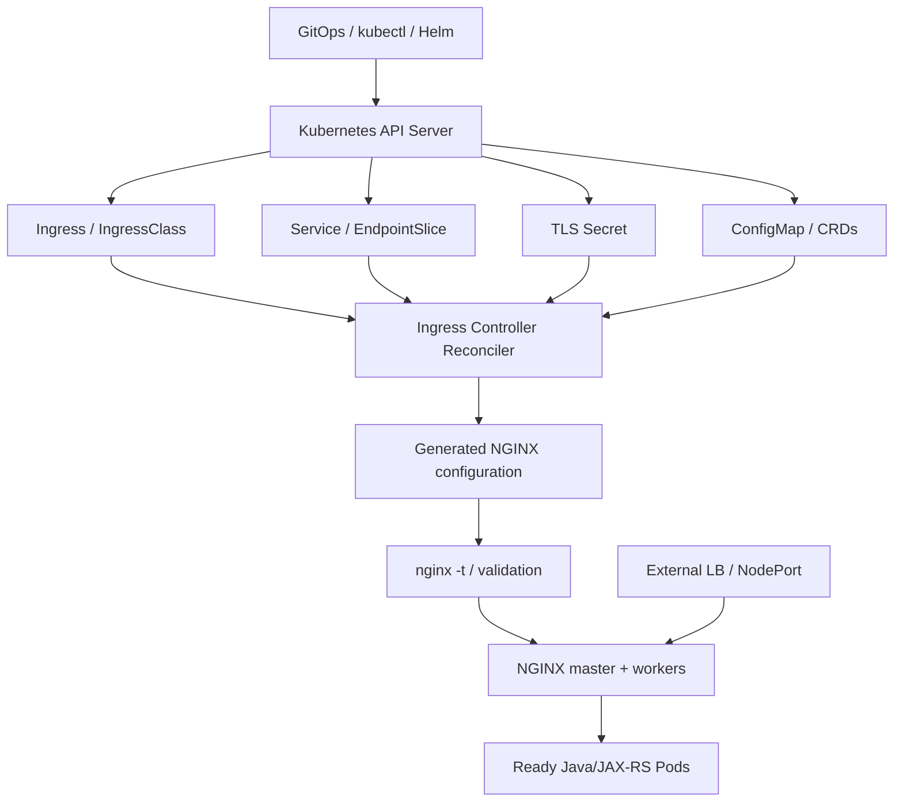
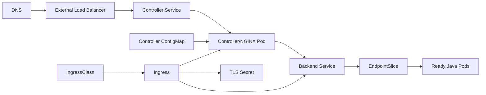
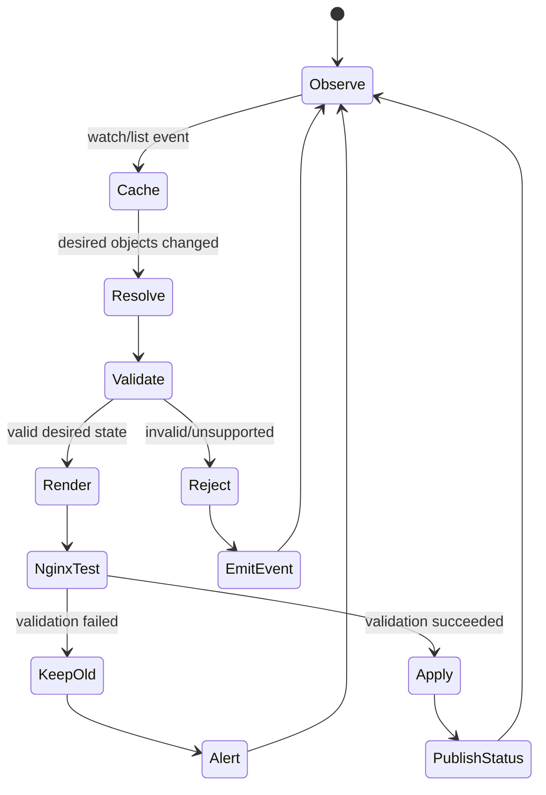
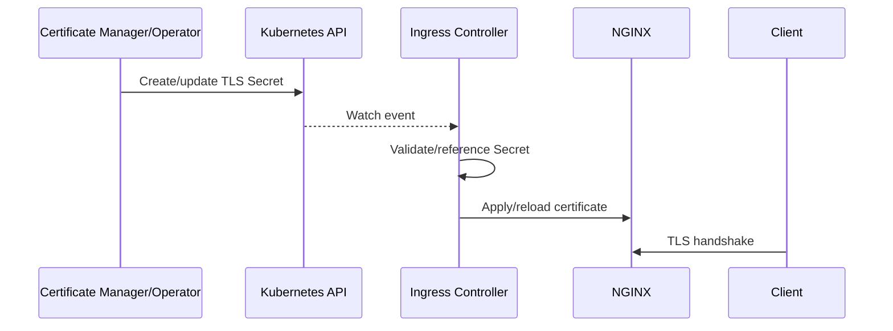
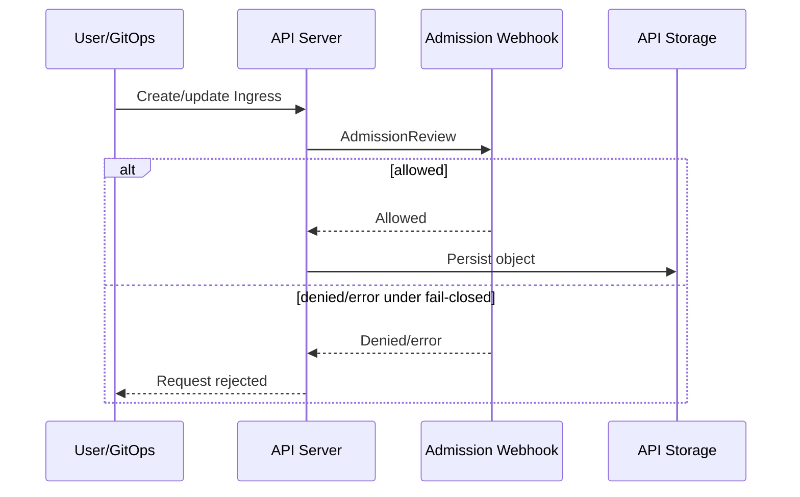

# Part 018 — Kubernetes Ingress and NGINX Controller Fundamentals

> **Depth level:** Intermediate  
> **Prerequisite:** Part 001–003, 008, dan 017; dasar Kubernetes Pods, Deployments, DaemonSets, Services, EndpointSlices, ConfigMaps, Secrets, RBAC, dan probes.  
> **Scope:** Kubernetes Ingress API, IngressClass, controller reconciliation, NGINX control/data plane, generated config, Services/EndpointSlices, TLS Secrets, ConfigMap/annotations at foundation level, admission webhooks, status publishing, deployment topology, replicas, HPA, PDB, topology, leader election, availability, security boundary, controller distributions, lifecycle/support status, observability, dan troubleshooting.  
> **Bukan scope utama:** detailed host/path/regex/rewrite/canary behavior—Part 019; annotation and ConfigMap precedence/governance—Part 020; Gateway API/API Gateway/service mesh decision—Part 021; AWS/Azure flow—Part 022–023; full production debugging catalogue—Part 031.

---

## Current ecosystem note — 11 July 2026

Two facts must be kept separate:

1. Kubernetes **Ingress API remains generally available**, but its feature set is frozen. Kubernetes recommends Gateway API for new capability development. Ingress is not planned for removal merely because it is frozen.
2. The Kubernetes community **`ingress-nginx` controller project was retired on 24 March 2026**. Existing deployments and artifacts continue to work, but no new releases, bug fixes, or security updates are provided after retirement.

This does **not** mean every NGINX-based controller is retired.

F5 NGINX Ingress Controller is a separate product/project with its own releases, support matrix, NGINX Open Source/NGINX Plus editions, CRDs, and lifecycle.

> **Internal verification checklist:** identify the exact controller distribution, repository, image digest, chart, version, support owner, and migration strategy. The phrase “we use NGINX Ingress” is insufficient.

---

## Daftar isi

1. [Tujuan pembelajaran](#tujuan-pembelajaran)
2. [Executive mental model](#executive-mental-model)
3. [Ingress is an API, not the proxy process](#ingress-is-an-api-not-the-proxy-process)
4. [The four layers](#the-four-layers)
5. [End-to-end object graph](#end-to-end-object-graph)
6. [North-south traffic baseline](#north-south-traffic-baseline)
7. [Service types refresher](#service-types-refresher)
8. [ClusterIP](#clusterip)
9. [NodePort](#nodeport)
10. [LoadBalancer Service](#loadbalancer-service)
11. [ExternalName](#externalname)
12. [Headless Service](#headless-service)
13. [EndpointSlice](#endpointslice)
14. [Ingress resource](#ingress-resource)
15. [Ingress rule anatomy](#ingress-rule-anatomy)
16. [Default backend](#default-backend)
17. [IngressClass](#ingressclass)
18. [`spec.ingressClassName`](#specingressclassname)
19. [Default IngressClass](#default-ingressclass)
20. [Multiple controllers](#multiple-controllers)
21. [Watch scope and namespace ownership](#watch-scope-and-namespace-ownership)
22. [Controller reconciliation loop](#controller-reconciliation-loop)
23. [Informer cache and eventual consistency](#informer-cache-and-eventual-consistency)
24. [Resource validation](#resource-validation)
25. [Configuration rendering](#configuration-rendering)
26. [NGINX validation and reload](#nginx-validation-and-reload)
27. [Status publication](#status-publication)
28. [Events and conditions](#events-and-conditions)
29. [Control plane versus data plane](#control-plane-versus-data-plane)
30. [Failure independence](#failure-independence)
31. [Stale-but-serving behavior](#stale-but-serving-behavior)
32. [Controller distribution taxonomy](#controller-distribution-taxonomy)
33. [F5 NGINX Ingress Controller](#f5-nginx-ingress-controller)
34. [Retired community ingress-nginx](#retired-community-ingress-nginx)
35. [NGINX Gateway Fabric boundary](#nginx-gateway-fabric-boundary)
36. [Do not migrate by name similarity](#do-not-migrate-by-name-similarity)
37. [Generated configuration is implementation-specific](#generated-configuration-is-implementation-specific)
38. [ConfigMap role](#configmap-role)
39. [Annotation role](#annotation-role)
40. [Custom resources and CRDs](#custom-resources-and-crds)
41. [TLS Secret lifecycle](#tls-secret-lifecycle)
42. [Certificate chain and key matching](#certificate-chain-and-key-matching)
43. [Backend Service resolution](#backend-service-resolution)
44. [Readiness and EndpointSlices](#readiness-and-endpointslices)
45. [Direct pod endpoints versus Service VIP](#direct-pod-endpoints-versus-service-vip)
46. [Controller Service exposure](#controller-service-exposure)
47. [`externalTrafficPolicy`](#externaltrafficpolicy)
48. [Source IP preservation](#source-ip-preservation)
49. [Deployment topology](#deployment-topology)
50. [Deployment controller pods](#deployment-controller-pods)
51. [DaemonSet controller pods](#daemonset-controller-pods)
52. [hostNetwork and hostPort](#hostnetwork-and-hostport)
53. [Replica availability](#replica-availability)
54. [PodDisruptionBudget](#poddisruptionbudget)
55. [Topology spread and anti-affinity](#topology-spread-and-anti-affinity)
56. [Horizontal Pod Autoscaling](#horizontal-pod-autoscaling)
57. [Leader election](#leader-election)
58. [Admission webhook](#admission-webhook)
59. [Webhook certificate lifecycle](#webhook-certificate-lifecycle)
60. [RBAC and ServiceAccount](#rbac-and-serviceaccount)
61. [Secret access boundary](#secret-access-boundary)
62. [Namespace and multi-tenancy](#namespace-and-multi-tenancy)
63. [Snippet and configuration injection risk](#snippet-and-configuration-injection-risk)
64. [Controller pod probes](#controller-pod-probes)
65. [Default backend health](#default-backend-health)
66. [Metrics and logs](#metrics-and-logs)
67. [Configuration-generation observability](#configuration-generation-observability)
68. [Kubernetes events as evidence](#kubernetes-events-as-evidence)
69. [Availability model](#availability-model)
70. [Rollout and upgrade fundamentals](#rollout-and-upgrade-fundamentals)
71. [Version compatibility](#version-compatibility)
72. [Deprecation and migration risk](#deprecation-and-migration-risk)
73. [Java/JAX-RS backend contract](#javajax-rs-backend-contract)
74. [Failure-mode catalogue](#failure-mode-catalogue)
75. [Troubleshooting workflow](#troubleshooting-workflow)
76. [Command reference](#command-reference)
77. [Validation and test matrix](#validation-and-test-matrix)
78. [PR review checklist](#pr-review-checklist)
79. [Internal verification checklist](#internal-verification-checklist)
80. [Hands-on exercises](#hands-on-exercises)
81. [Ringkasan invariants](#ringkasan-invariants)
82. [Referensi resmi](#referensi-resmi)

---

## Tujuan pembelajaran

Setelah menyelesaikan part ini, Anda harus mampu:

1. menjelaskan bahwa Ingress adalah Kubernetes API object, bukan NGINX process;
2. memisahkan Kubernetes API server, controller process, generated NGINX config, dan traffic data plane;
3. membaca object graph dari Ingress ke Service, EndpointSlice, Pod, Secret, ConfigMap, dan IngressClass;
4. menjelaskan reconciliation lifecycle dari resource change sampai NGINX reload;
5. membedakan control-plane failure, data-plane failure, dan stale configuration;
6. mengidentifikasi exact NGINX controller distribution dan menghindari product-name confusion;
7. memahami status Ingress API yang frozen dan retirement community `ingress-nginx`;
8. menilai Deployment versus DaemonSet topology;
9. menilai Service type, `externalTrafficPolicy`, source IP, and cloud LB interaction;
10. merancang replicas, PDB, topology spread, probes, dan scaling secara failure-aware;
11. menjelaskan admission webhook, RBAC, Secret access, and multi-tenant security boundaries;
12. mendiagnosis class mismatch, missing Service/Secret, no endpoints, rejected resource, stale status, reload failure, dan controller unavailability;
13. menghubungkan behavior ingress dengan Java/JAX-RS routing, headers, timeouts, health, and graceful termination;
14. menyusun **Internal verification checklist** berdasarkan actual cluster evidence.

---

## Executive mental model

```text
Kubernetes objects express desired routing state.
Controller watches and reconciles that state.
NGINX workers serve traffic using generated runtime configuration.
```

Do not collapse them into one thing.



### Core proposition

> The controller does not proxy traffic merely because it watches resources; the NGINX data plane proxies traffic using the last successfully applied runtime state.

---

## Ingress is an API, not the proxy process

An `Ingress` object is declarative data such as:

- host;
- path;
- backend Service name;
- backend port;
- TLS Secret reference;
- implementation-specific annotations.

It does not by itself:

- open port 80/443;
- provision a cloud load balancer;
- run NGINX;
- resolve Service endpoints;
- terminate TLS;
- validate annotations;
- update DNS.

A compatible Ingress Controller must exist and claim the resource.

### Failure example

```text
Ingress object created successfully
+ no matching controller
= object exists, traffic does not change
```

Kubernetes API acceptance is not proof of runtime routing.

---

## The four layers

### Layer 1 — Kubernetes API objects

- `Ingress`;
- `IngressClass`;
- `Service`;
- `EndpointSlice`;
- `Secret`;
- `ConfigMap`;
- Deployment/DaemonSet;
- CRDs.

### Layer 2 — Controller process

- watches objects;
- validates/normalizes;
- resolves references;
- builds desired configuration;
- invokes/reloads NGINX;
- publishes status/events/metrics.

### Layer 3 — NGINX data plane

- listeners;
- TLS handshake;
- virtual hosts/locations;
- upstream selection;
- proxying;
- logs/metrics;
- active connections.

### Layer 4 — External network integration

- cloud/on-prem LB;
- NodePort/LoadBalancer Service;
- firewall/security groups;
- DNS;
- certificate source;
- client-source preservation.

A failure can occur in one layer while the others appear healthy.

---

## End-to-end object graph



### Evidence path

For any failing hostname/path, trace:

```text
DNS
-> external LB address/listener
-> controller Service
-> controller endpoints/pods
-> matching IngressClass
-> accepted Ingress rule
-> generated NGINX server/location
-> backend Service port
-> EndpointSlice
-> ready Java Pod IP/port
-> JAX-RS route
```

Skipping a hop encourages guess-driven debugging.

---

## North-south traffic baseline

North-south traffic crosses cluster boundary.

A common topology:

```text
client
-> DNS
-> cloud/on-prem L4/L7 load balancer
-> Kubernetes Service for ingress controller
-> NGINX ingress pod
-> backend Kubernetes Service/endpoints
-> Java/JAX-RS pod
```

But alternatives exist:

- LB directly to pod IP;
- NodePort to nodes;
- hostNetwork/hostPort;
- internal/private LB;
- multiple ingress tiers;
- external reverse proxy before cluster;
- NGINX sidecar after ingress;
- service mesh between ingress and backend.

All topology details are **Internal verification checklist** until observed.

---

## Service types refresher

Service provides a stable Kubernetes abstraction over endpoints.

| Type | Primary behavior | Common ingress role |
|---|---|---|
| `ClusterIP` | cluster-internal virtual IP | backend Service; sometimes controller internal exposure |
| `NodePort` | opens port on nodes | external LB targets nodes |
| `LoadBalancer` | asks provider integration for external/internal LB | exposes controller |
| `ExternalName` | DNS CNAME-like mapping | external backend abstraction; use carefully |
| headless (`clusterIP: None`) | DNS returns endpoint addresses | direct discovery, not a Service VIP |

Service type does not by itself define application-layer routing.

---

## ClusterIP

`ClusterIP` gives a virtual service address within cluster networking.

Backend flow can be:

```text
NGINX -> Service ClusterIP -> kube-proxy/eBPF datapath -> Pod
```

or controller can resolve EndpointSlices and generate pod endpoints directly:

```text
NGINX -> Pod IP
```

Controller implementation and configuration determine the actual path.

### Operational implications

- source address can differ;
- one or two load-balancing stages may exist;
- endpoint readiness handling differs;
- connection reuse interacts with endpoint churn;
- Service VIP health is not identical to pod health.

---

## NodePort

NodePort exposes a port on cluster nodes.

Typical external flow:

```text
external LB
-> nodeIP:nodePort
-> Service datapath
-> ingress controller pod
```

Questions:

- Are all nodes targets or only ingress nodes?
- Is `externalTrafficPolicy` `Cluster` or `Local`?
- Can a node receive traffic without a local ingress pod?
- Does LB health check the NodePort?
- Is source IP preserved?
- Are security-group/firewall rules scoped correctly?
- Is cross-node hop acceptable?

NodePort availability depends on node/network datapath, not only controller pod readiness.

---

## LoadBalancer Service

A `LoadBalancer` Service asks a cloud/provider controller to provision or bind load-balancer infrastructure.

It may create/use:

- L4 load balancer;
- public/private address;
- health probes;
- node/IP targets;
- provider-specific annotations;
- security rules.

The resulting LB can front NGINX, but exact provisioning behavior is provider-specific.

### Do not confuse

```text
Kubernetes Ingress resource
!= Kubernetes Service type LoadBalancer
!= cloud L7 Ingress implementation
```

Some cloud controllers implement Ingress directly using cloud L7 LB without NGINX. Other designs use cloud L4 LB to expose NGINX.

---

## ExternalName

`ExternalName` returns DNS alias semantics rather than normal pod endpoints.

Potential issues:

- hostname/SNI mismatch;
- DNS TTL and stale resolution;
- no Kubernetes health/readiness integration;
- Host header mismatch;
- TLS certificate mismatch;
- dependency outside cluster boundary;
- unsupported behavior in some controllers.

Use only after verifying controller support and HTTP/TLS semantics.

---

## Headless Service

Headless Service exposes endpoint addresses via DNS.

Potential ingress use:

- direct pod discovery;
- stateful backend;
- bypassing Service VIP.

Risks:

- endpoint churn;
- DNS lifecycle;
- per-pod readiness;
- connection draining;
- no virtual-IP load balancing;
- stale connections.

Many ingress controllers read EndpointSlices directly anyway, so adding headless Service may not provide the assumed behavior.

---

## EndpointSlice

EndpointSlices represent backend addresses, ports, readiness/serving/terminating information, and topology metadata.

For ingress troubleshooting, EndpointSlice answers:

- Does Service selector match pods?
- Which IP/port is eligible?
- Is endpoint ready?
- Is it terminating?
- Are addresses IPv4 or IPv6?
- Is the expected port name resolved?

Commands:

```bash
kubectl get service <service> -n <namespace> -o yaml
kubectl get endpointslice -n <namespace> \
  -l kubernetes.io/service-name=<service> -o yaml
```

An existing Service with zero eligible endpoints is a common 503/502 cause.

---

## Ingress resource

Minimal example:

```yaml
apiVersion: networking.k8s.io/v1
kind: Ingress
metadata:
  name: quote-api
  namespace: quote-order
spec:
  ingressClassName: nginx-public
  tls:
    - hosts:
        - quote.example.com
      secretName: quote-example-tls
  rules:
    - host: quote.example.com
      http:
        paths:
          - path: /api
            pathType: Prefix
            backend:
              service:
                name: quote-service
                port:
                  name: http
```

This declares intent. It does not prove controller acceptance or runtime config.

---

## Ingress rule anatomy

### Metadata

- name/namespace;
- labels;
- annotations;
- owner references/finalizers where applicable.

### `spec.ingressClassName`

Selects controller class.

### `spec.tls`

Associates hosts with TLS Secret.

### `spec.rules[].host`

Defines host-based routing intent.

### `paths[]`

Defines path and `pathType`.

### backend Service

References Service name and port in the same namespace under standard Ingress semantics.

Detailed matching/conflict behavior is controller-specific and continues in Part 019.

---

## Default backend

There are two related concepts.

### Ingress default backend

An Ingress can define a backend for requests not matching rules in that Ingress/API semantics.

### Controller-wide default backend

Controller may have a global fallback for unknown hosts/paths/errors.

Questions:

- What status is returned?
- Is response branded or generic?
- Does it leak controller/version information?
- Is access logged?
- Is it a separate Deployment/Service?
- What happens if it is unavailable?
- Does unknown Host receive a safe rejection?

A default backend should not accidentally expose unrelated application content.

---

## IngressClass

`IngressClass` represents a class of ingress implementation.

Example:

```yaml
apiVersion: networking.k8s.io/v1
kind: IngressClass
metadata:
  name: nginx-public
spec:
  controller: example.com/nginx-public
```

The `spec.controller` string identifies controller implementation/class semantics.

Some classes also reference class-specific parameters.

### Architecture use

Separate classes may represent:

- public versus private;
- regulated versus general;
- internet versus intranet;
- NGINX versus cloud-native LB;
- different teams/policies;
- different TLS/WAF capabilities.

Class names alone are not security boundaries unless network/RBAC/runtime separation exists.

---

## `spec.ingressClassName`

Modern Ingress should explicitly state class where platform policy requires.

Benefits:

- avoids ambiguous controller claim;
- makes ownership visible;
- supports multiple controllers;
- easier migration and policy validation.

### Failure

```text
IngressClass name typo or no matching controller
-> object accepted by API
-> controller ignores it
-> no generated route
```

Check controller args and logs, not only resource YAML.

---

## Default IngressClass

An IngressClass can be marked default using annotation defined by Kubernetes convention.

Risk:

- multiple default classes can cause admission ambiguity;
- classless Ingress can be claimed unexpectedly;
- migration can silently route through wrong controller;
- old resources may rely on legacy annotations.

### Governance rule

Prefer explicit `spec.ingressClassName` unless a deliberate platform standard says otherwise.

Inventory classless Ingress resources before controller migration.

---

## Multiple controllers

A cluster can run multiple controllers.

Examples:

- public NGINX;
- internal NGINX;
- cloud application gateway controller;
- Gateway API implementation;
- tenant-dedicated controller.

### Required separation

- unique class/controller identifiers;
- non-overlapping watch/claim rules;
- separate Services/LB addresses;
- clear namespace ownership;
- distinct ConfigMaps/Secrets/RBAC;
- independent metrics/log labels;
- explicit DNS mapping.

### Failure patterns

- two controllers claim same resource;
- no controller claims resource;
- one updates status while another serves traffic;
- annotations interpreted differently;
- same host exposed by multiple addresses.

---

## Watch scope and namespace ownership

Controller may watch:

- all namespaces;
- one namespace;
- selected namespaces;
- resources matching class/labels.

Questions:

- Can application team create Ingress in any namespace?
- Can controller read Secrets across namespaces?
- Can a namespace reference another namespace's backend/secret?
- Is controller cluster-scoped or tenant-scoped?
- What RBAC is required?
- Is watch scope enforced by args, RBAC, admission policy, or all three?

A namespaced Ingress resource does not automatically imply tenant isolation.

---

## Controller reconciliation loop



Exact implementation differs, but this model is useful.

### Reconciliation is level-based

A robust controller repeatedly converges actual state toward desired state. It should not rely only on one-time imperative events.

---

## Informer cache and eventual consistency

Controllers usually consume API objects through watches/caches.

Consequences:

- update is not instantaneous;
- related objects may arrive in different order;
- temporary missing Secret/Service can occur;
- API watch disconnect can delay changes;
- resync/relist may occur;
- object version conflicts can happen;
- status may lag runtime config.

### Debugging principle

Compare timestamps:

```text
Git commit
-> GitOps sync
-> API object resourceVersion
-> controller event/log
-> config generation/reload
-> data-plane behavior
-> DNS/LB state
```

Without a timeline, “Ingress was applied” is ambiguous.

---

## Resource validation

Validation can happen at multiple layers:

1. Kubernetes OpenAPI/schema validation;
2. admission policy/webhook;
3. controller semantic validation;
4. NGINX config syntax validation;
5. runtime route smoke test.

Passing one layer does not imply the next.

### Example

A valid Ingress schema may reference:

- nonexistent Service;
- wrong Service port name;
- malformed/unsupported annotation;
- missing TLS Secret;
- class not watched;
- conflicting route.

The API server can accept it while controller rejects or degrades it.

---

## Configuration rendering

Controller converts Kubernetes state into NGINX configuration and possibly auxiliary files/state.

Inputs can include:

- Ingress resources;
- class parameters;
- ConfigMap;
- annotations;
- CRDs;
- Services;
- EndpointSlices;
- Secrets;
- controller flags;
- templates;
- product edition/features.

### Important

The generated configuration is the actual execution plan.

When supported and safe, inspect:

```bash
nginx -T
```

inside controller pod, or use vendor-supported diagnostic commands/endpoints.

Redact secrets and sensitive routes before sharing.

---

## NGINX validation and reload

Desired sequence:

```text
render candidate
-> validate syntax/references
-> apply atomically
-> reload NGINX
-> verify new workers/config generation
-> keep old data plane on failure
```

### Failure questions

- Does one invalid Ingress reject only that resource or poison global config?
- Does controller keep last-known-good config?
- Is reload full or incremental/dynamic?
- How often can reload happen?
- Are reload failures exposed as metrics/events?
- Do old workers drain?
- Can endpoint updates avoid full reload?

Answers are implementation/version-specific.

---

## Status publication

Ingress `.status.loadBalancer.ingress` may contain an IP or hostname.

It is used by tooling/operators and sometimes DNS automation.

But status can be:

- empty;
- stale;
- copied from controller Service;
- overridden by controller args;
- updated by the wrong controller;
- different from actual public DNS path.

### Invariant

> Ingress status is evidence, not absolute proof of reachability.

Validate DNS, LB, firewall, and listener independently.

---

## Events and conditions

Kubernetes events can show:

- resource accepted/rejected;
- missing backend;
- invalid annotation;
- sync/reload error;
- admission denial;
- failed Secret reference.

Commands:

```bash
kubectl describe ingress <name> -n <namespace>
kubectl get events -n <namespace> --sort-by=.lastTimestamp
```

Events are often ephemeral and retention-limited. Centralize important controller events/logs where needed.

Some controllers expose richer status through CRD conditions; standard Ingress status is limited.

---

## Control plane versus data plane

### Control plane

- API watch;
- reconciliation;
- validation;
- config generation;
- status update;
- leader election;
- admission.

### Data plane

- NGINX listeners/workers;
- TLS;
- request routing;
- upstream connections;
- active requests;
- access/error logs.

### Why separation matters

Controller process can fail while NGINX workers continue serving last config.

NGINX can fail while controller process remains healthy enough to log/reconcile.

Metrics/probes must distinguish them.

---

## Failure independence

| Control plane state | Data plane state | Likely behavior |
|---|---|---|
| healthy | healthy | changes converge and traffic serves |
| unhealthy | healthy | existing routes serve; new changes stale |
| healthy | unhealthy | controller may reconcile but traffic fails |
| unhealthy | unhealthy | changes stale and traffic fails |

### Incident danger

An application rollout may seem unrelated to ingress, but if controller reconciliation is broken:

- EndpointSlice update may not reach NGINX;
- old pod IPs remain;
- new route not generated;
- certificate rotation not applied.

---

## Stale-but-serving behavior

Stale config can be safer than dropping all traffic, but it creates hidden risk.

Examples:

- old backend endpoints after rollout;
- expired/old certificate;
- revoked route still active;
- old allowlist/auth policy;
- new emergency fix not applied.

### Required observability

- last successful sync time;
- desired object resourceVersion;
- applied config generation/checksum;
- reload failure count;
- controller watch errors;
- age of running config;
- certificate expiry/current serial.

A green request-success dashboard can coexist with a broken control plane.

---

## Controller distribution taxonomy

Never identify a controller only by the generated server header or “NGINX” label.

Collect:

- image repository;
- image digest;
- binary args;
- Helm chart repository/version;
- labels/annotations;
- IngressClass controller string;
- CRD groups;
- metrics names;
- documentation source;
- license/support contract.

### Common categories

| Category | Example role |
|---|---|
| F5 NGINX Ingress Controller | active F5 project/product using NGINX Open Source or NGINX Plus |
| retired community ingress-nginx | former Kubernetes community controller, retired 24 March 2026 |
| NGINX Gateway Fabric | F5 implementation focused on Gateway API |
| cloud-native ingress controller | cloud L7 LB implementation |
| other NGINX-based vendor controller | independent behavior/support |
| internal controller/fork | organization-owned lifecycle |

Behavior and annotation syntax are not portable by default.

---

## F5 NGINX Ingress Controller

F5 NGINX Ingress Controller is distinct from community `ingress-nginx`.

It can operate with:

- NGINX Open Source edition;
- NGINX Plus edition;
- standard Ingress resources;
- F5-specific CRDs/features depending on installation;
- its own Helm chart, args, compatibility matrix, and release lifecycle.

### Verify

- exact release and support status;
- NGINX OSS versus Plus;
- CRDs installed;
- snippets/policies enabled;
- telemetry/admin endpoints;
- Kubernetes compatibility;
- upgrade path;
- App Protect integrations if used;
- controller watch scope.

Do not apply community ingress-nginx annotation knowledge automatically.

---

## Retired community ingress-nginx

As of 24 March 2026, community `ingress-nginx` is retired.

Operational meaning:

- existing workloads continue to run;
- published artifacts remain available;
- no further releases;
- no bug fixes;
- no future security updates;
- repository/artifacts should be treated as legacy migration scope.

### Required response for existing estates

1. inventory clusters, versions, charts, annotations, snippets, custom templates;
2. assess exposure and compensating controls;
3. freeze risky feature expansion;
4. select supported target implementation;
5. test behavioral differences;
6. migrate progressively;
7. preserve rollback during transition;
8. remove retired controller after evidence-based cutover.

### Do not

- assume immediate outage because project is retired;
- ignore retirement because traffic still works;
- migrate by replacing image name only;
- assume annotations map one-to-one;
- run indefinitely without explicit risk acceptance.

---

## NGINX Gateway Fabric boundary

NGINX Gateway Fabric implements Gateway API concepts and is not merely a new name for an Ingress controller.

Gateway API introduces role-oriented resources such as:

- `GatewayClass`;
- `Gateway`;
- `HTTPRoute`;
- route attachment/reference semantics;
- richer status/conditions;
- extensibility.

Detailed comparison is Part 021.

### Foundation point

Existing Ingress remains relevant for legacy/installed systems, but new platform strategy should evaluate Gateway API rather than assuming Ingress will gain new features.

---

## Do not migrate by name similarity

A migration from community ingress-nginx to F5 NGINX Ingress Controller or another controller is a semantic migration.

Potential differences:

- annotation keys;
- default timeouts;
- path regex behavior;
- rewrite semantics;
- snippet support;
- header handling;
- TLS defaults;
- status codes;
- default backend;
- canary features;
- sticky sessions;
- rate limiting;
- metrics/log format;
- reload behavior;
- CRDs;
- security posture.

### Migration artifact

Create a route-by-route compatibility matrix, not only a Helm-value diff.

---

## Generated configuration is implementation-specific

The standard Ingress API is intentionally limited.

Implementation-specific behavior enters through:

- controller defaults;
- annotations;
- ConfigMap;
- command-line flags;
- templates;
- CRDs;
- NGINX OSS/Plus features;
- controller version.

### Review invariant

> The same Ingress YAML can behave differently under different controllers.

Therefore:

- pin controller class;
- pin version;
- test behavior;
- document dependencies;
- avoid undocumented defaults.

---

## ConfigMap role

Controller ConfigMap commonly sets global defaults such as:

- timeouts;
- body size;
- logging;
- real IP/trusted proxies;
- TLS settings;
- buffers;
- snippets/features;
- worker behavior.

But exact keys are controller-specific.

### Risks

- one change affects every Ingress served by controller;
- precedence with annotations is misunderstood;
- unsupported keys silently ignored or rejected;
- unsafe global value causes fleet-wide outage;
- GitOps drift or wrong namespace/name.

Part 020 covers governance and precedence deeply.

---

## Annotation role

Annotations provide per-resource implementation-specific settings.

Examples by category:

- rewrite;
- timeout;
- body size;
- backend protocol;
- auth;
- CORS;
- rate limit;
- buffering;
- canary;
- source allowlist.

### Foundation rule

Annotations are code-like configuration with security and compatibility risk.

Validate:

- key belongs to exact controller;
- value type/units;
- version support;
- tenant permission;
- generated config effect;
- fallback behavior if invalid.

---

## Custom resources and CRDs

Some controllers add CRDs for richer routing/policy.

Benefits:

- typed schema;
- clearer status;
- advanced features;
- policy separation;
- less annotation string abuse.

Costs:

- vendor coupling;
- CRD lifecycle/upgrade complexity;
- conversion/migration;
- RBAC expansion;
- support matrix;
- GitOps ordering.

### Upgrade risk

Controller image upgrade without compatible CRD upgrade can fail or produce unexpected behavior. Read vendor upgrade documentation.

---

## TLS Secret lifecycle

Standard Ingress TLS commonly references a Secret of type `kubernetes.io/tls` with:

```text
tls.crt
tls.key
```

Lifecycle:



### Questions

- Is Secret in same namespace?
- Does controller watch it?
- Is update atomic?
- Does reload happen automatically?
- Is old certificate retained on invalid update?
- How is expiry monitored?
- Is default certificate configured?
- Who owns renewal and incident response?

---

## Certificate chain and key matching

Common failures:

- key does not match leaf certificate;
- intermediate chain missing;
- chain order incorrect;
- wrong host/SAN;
- expired/not-yet-valid;
- secret key names wrong;
- malformed PEM;
- controller lacks permission;
- Secret updated but config not reloaded.

Commands:

```bash
kubectl get secret <name> -n <namespace> -o yaml
# Handle decoded private key securely; do not print it into shared logs.
openssl x509 -in tls.crt -noout -subject -issuer -dates -ext subjectAltName
```

Certificate content handling must follow internal security policy.

---

## Backend Service resolution

Controller must resolve:

```text
Ingress backend Service name
+ namespace
+ Service port name/number
+ EndpointSlices
= NGINX upstream endpoints
```

Failure points:

- Service absent;
- wrong namespace assumption;
- wrong port name;
- `targetPort` mismatch;
- no selector match;
- no ready endpoints;
- protocol mismatch;
- endpoint address unreachable;
- NetworkPolicy block;
- app listener bound only to loopback.

### Important

Service port and container port are not the same field.

Example:

```yaml
ports:
  - name: http
    port: 80
    targetPort: 8080
```

Ingress references Service port `80` or name `http`, not arbitrary container port unless Service defines it accordingly.

---

## Readiness and EndpointSlices

Pod readiness controls endpoint eligibility for normal Service routing.

```text
Java readiness false
-> endpoint removed/not ready
-> controller/datapath should stop new traffic
```

But timing matters:

- readiness update delay;
- controller watch/reconcile delay;
- NGINX config update delay;
- existing keepalive connections;
- terminating endpoint semantics;
- external LB health delay.

### Graceful rollout contract

1. mark pod unready/remove new traffic;
2. allow ingress/controller state to converge;
3. drain active requests/connections;
4. terminate Java process;
5. remove pod.

Part 030 covers full rollout design.

---

## Direct pod endpoints versus Service VIP

### Direct endpoints

Controller generates upstreams from Pod IPs/EndpointSlices.

Advantages:

- avoids extra Service load-balancing hop;
- can observe endpoint-level state;
- richer upstream behavior.

Costs:

- more config churn;
- pod IP reachability required;
- endpoint lifecycle/drain complexity;
- per-controller implementation.

### Service VIP

NGINX proxies to ClusterIP.

Advantages:

- stable address;
- Service datapath handles endpoints;
- less endpoint config churn.

Costs:

- double load balancing;
- weaker endpoint-level visibility/control;
- source/NAT differences;
- connection reuse may pin to datapath behavior.

Inspect generated config and controller docs; do not assume.

---

## Controller Service exposure

Controller pods are typically exposed by a Service.

Common options:

- `LoadBalancer`;
- `NodePort`;
- `ClusterIP` behind another proxy/LB;
- hostNetwork/hostPort without conventional Service path.

Review:

- ports 80/443/admin/metrics;
- selector labels;
- endpoint readiness;
- annotations;
- load-balancer scheme/public-private;
- health-check port/path;
- source ranges;
- `externalTrafficPolicy`;
- session affinity;
- IP family.

A selector typo can leave controller Service with zero endpoints while pods are healthy.

---

## `externalTrafficPolicy`

For externally exposed Service, common values:

### `Cluster`

- traffic may be forwarded to ingress pod on another node;
- broader node availability;
- source IP may be SNATed depending on datapath;
- extra hop possible.

### `Local`

- node only forwards to local ready endpoint;
- source IP preservation often improved;
- nodes without local pod may fail/should be excluded by LB health;
- topology and DaemonSet/replica placement matter.

### Trade-off

Source preservation is not free; it changes health/routing constraints.

Test under:

- pod eviction;
- node drain;
- AZ failure;
- scale up/down;
- nodes with no local controller pod.

---

## Source IP preservation

Possible client address seen by NGINX depends on:

- cloud/on-prem LB mode;
- target type;
- NodePort/Service policy;
- SNAT;
- Proxy Protocol;
- `X-Forwarded-For`/`Forwarded`;
- trusted proxy configuration.

### Security invariant

Do not trust arbitrary forwarded headers from the internet.

Define trusted chain:

```text
client
-> trusted LB
-> trusted ingress
-> Java
```

Then configure:

- accepted source networks;
- real-IP module/controller settings;
- Proxy Protocol only when both sides agree;
- header overwrite/sanitization;
- Java proxy trust.

A mismatch can break allowlists, rate limits, audit logs, and incident attribution.

---

## Deployment topology

Two common controller pod topologies:

- Deployment;
- DaemonSet.

The correct choice depends on:

- external target model;
- source-IP requirement;
- node topology;
- capacity scaling;
- failure domains;
- operations model;
- cloud integration.

Neither is universally superior.

---

## Deployment controller pods

Deployment provides a chosen replica count scheduled across eligible nodes.

Advantages:

- independent replica scaling;
- fewer pods than nodes;
- straightforward HPA;
- resource efficiency;
- controlled rollout.

Risks:

- uneven placement without spread/anti-affinity;
- nodes without local endpoint under `externalTrafficPolicy: Local`;
- capacity lag during spikes;
- disruption if replicas share failure domain.

### Required controls

- replicas > 1 for HA;
- topology spread/anti-affinity;
- PDB;
- readiness;
- rolling-update strategy;
- capacity headroom;
- node pool/taints/tolerations if dedicated.

---

## DaemonSet controller pods

DaemonSet runs a pod on each selected node.

Advantages:

- local endpoint on targeted nodes;
- pairs naturally with node-targeted LB in some designs;
- source-IP/local routing patterns;
- capacity scales with node count.

Costs:

- resource footprint on every selected node;
- scale tied to nodes, not traffic;
- rollout touches many pods;
- nodes not intended for ingress need selectors/taints;
- heterogeneous nodes can produce inconsistent capacity;
- autoscaling requires node scaling.

F5 documentation supports Deployment and DaemonSet installation patterns, but exact operational choice remains architecture-specific.

---

## hostNetwork and hostPort

### hostNetwork

Controller pod shares node network namespace.

Potential effects:

- direct host port binding;
- reduced NAT layer;
- port collision;
- DNS policy changes;
- larger security blast radius;
- one listener per node/port.

### hostPort

Maps pod container port to host port.

Potential effects:

- scheduling constraints;
- port conflict;
- node-local exposure.

Use only with clear LB/network design. Do not enable merely to “make ingress work.”

---

## Replica availability

Availability depends on more than `replicas: 2`.

Check:

- replicas across nodes;
- replicas across zones;
- node pool failure;
- simultaneous rolling update;
- PDB;
- LB health convergence;
- external target registration;
- connection drain;
- capacity after one replica loss;
- ConfigMap/Secret/control-plane dependency.

### N+1 requirement

Remaining replicas must carry peak traffic with target SLO when one replica/failure domain is unavailable.

---

## PodDisruptionBudget

PDB limits voluntary disruptions.

Example concept:

```yaml
apiVersion: policy/v1
kind: PodDisruptionBudget
metadata:
  name: nginx-ingress
spec:
  minAvailable: 2
  selector:
    matchLabels:
      app.kubernetes.io/name: nginx-ingress
```

### Caveats

- does not protect against involuntary failures;
- can block node maintenance if impossible;
- must align with replica count;
- selector must match actual pods;
- `minAvailable`/`maxUnavailable` must account for capacity, not only count.

A PDB is not an HA design by itself.

---

## Topology spread and anti-affinity

Goal:

- avoid all ingress replicas on one node/AZ;
- preserve capacity during failure;
- avoid correlated CPU/network pressure.

Controls:

- `topologySpreadConstraints`;
- pod anti-affinity;
- node affinity;
- taints/tolerations;
- dedicated node groups;
- priority class.

### Trade-off

Strict constraints can make pods unschedulable during incident/scale-out. Use failure-domain and capacity evidence.

---

## Horizontal Pod Autoscaling

HPA can scale controller Deployment using metrics such as:

- CPU;
- memory—usually weak traffic proxy;
- request rate;
- active connections;
- bandwidth;
- custom saturation signals.

### Risks

- traffic spike faster than HPA reaction;
- new pod not immediately LB-ready;
- cold TLS/session/cache effects;
- scale-in breaks long-lived connections;
- CPU low while connection count high;
- reload/config work causes CPU unrelated to traffic.

### Principle

Maintain baseline headroom. HPA is a delayed control loop, not instantaneous protection.

---

## Leader election

Some controller operations require leader coordination, commonly for shared status updates or controller duties.

But leader election does not necessarily mean only leader serves traffic.

All NGINX pods may serve data-plane traffic while one controller instance coordinates selected control-plane actions.

### Failure questions

- What uses leader election?
- What happens during leader loss?
- Do existing routes continue?
- Are new updates delayed?
- Is status update stale?
- Where are lease events/metrics?

Avoid interpreting “not leader” as “not serving traffic” without product evidence.

---

## Admission webhook

A validating admission webhook can reject dangerous or invalid ingress configuration before persistence.

Possible checks:

- annotation syntax;
- generated NGINX config validity;
- duplicate/conflicting resources;
- forbidden snippets;
- policy compliance.

### Request lifecycle



### Operational risks

- webhook unavailable blocks changes;
- certificate expires;
- Service has no endpoints;
- network policy blocks API server;
- `failurePolicy` changes fail-open/fail-closed behavior;
- old webhook config remains after uninstall.

---

## Webhook certificate lifecycle

Admission webhook requires API server to trust webhook TLS certificate.

Verify:

- certificate issuer/source;
- CA bundle in webhook configuration;
- Secret rotation;
- service DNS SAN;
- expiry monitoring;
- bootstrap jobs/hooks;
- upgrade/uninstall cleanup;
- API server network reachability.

### Failure signature

```text
failed calling webhook
x509: certificate has expired
no endpoints available for service
context deadline exceeded
```

A webhook incident can block all Ingress updates while existing traffic continues.

---

## RBAC and ServiceAccount

Controller requires read/watch access to relevant resources and limited write access for status/events/leases.

Typical resource categories:

- Ingress/IngressClass;
- Service/EndpointSlice;
- Secret;
- ConfigMap;
- Event;
- Lease;
- CRDs;
- status subresources.

### Security review

- Is cluster-wide access necessary?
- Can Secret access be narrowed?
- Can controller write arbitrary ConfigMaps/Secrets?
- Is ServiceAccount token mounted only as required?
- Are CRD permissions scoped?
- Are separate controllers using separate identities?

Controller compromise can expose TLS keys and alter traffic behavior.

---

## Secret access boundary

A cluster-wide controller may read TLS Secrets across many namespaces.

This creates a high-value security boundary.

Questions:

- Which namespaces are watched?
- Can controller read every Secret or only required types?
- Are application credentials in same namespace?
- Is secret encryption at rest enabled?
- Are audit logs enabled?
- Is controller pod/node access restricted?
- Are private keys exported to diagnostics/logs?
- Is NGINX Plus license secret handled separately?

Do not treat ingress controller as “just another stateless pod.”

---

## Namespace and multi-tenancy

Standard Ingress backend/Secret references are primarily namespace-local, but controller itself can aggregate resources cluster-wide.

Multi-tenant risks:

- duplicate hosts across namespaces;
- malicious annotations/snippets;
- one tenant affecting global reload;
- shared certificate/default server;
- shared rate-limit zones;
- global ConfigMap changes;
- metrics/log data leakage;
- host ownership ambiguity.

### Controls

- admission policy;
- host ownership registry;
- namespace-scoped controllers where justified;
- dedicated classes;
- annotation allowlist;
- snippet disablement;
- RBAC;
- policy CRDs;
- separate public/private planes.

---

## Snippet and configuration injection risk

Some controllers support arbitrary NGINX snippets.

This can allow users to influence generated NGINX config beyond typed routing intent.

Risks:

- read/access controller filesystem;
- exfiltrate Secrets/config;
- override auth/security headers;
- create SSRF/proxy paths;
- break global config;
- impact other tenants;
- exploit module/directive behavior.

Community ingress-nginx had serious historical security issues involving admission/controller configuration surfaces. Retirement increases urgency to remove unsupported risk.

### Default posture

Disable arbitrary snippets unless there is a reviewed, narrow, owned requirement. Prefer typed policies/CRDs.

Part 020 covers detailed governance.

---

## Controller pod probes

A controller pod may contain:

- controller process;
- NGINX master/workers;
- optional agents/modules.

Probe must answer which component is healthy.

### Readiness

Should represent ability to accept new data-plane traffic with usable config.

### Liveness

Should restart only when local process is stuck/dead.

### Startup

Useful when initial config/Secret sync takes time.

### Anti-pattern

Probe a customer backend through NGINX and restart controller when that backend is down.

This turns application failure into ingress fleet churn.

---

## Default backend health

If controller readiness depends on a separate default-backend Deployment, failure can remove otherwise healthy ingress pods from service.

Verify architecture:

- Is default backend embedded or external?
- Is it used only for unmatched requests?
- Is it required for controller health?
- What status is returned if unavailable?
- Does it have independent replicas/PDB?

Keep fallback path simple and non-sensitive.

---

## Metrics and logs

Separate telemetry sources:

### Controller logs

- watch/reconcile;
- validation;
- missing references;
- config generation;
- reload;
- status update;
- leader election.

### NGINX access/error logs

- request traffic;
- TLS;
- route/upstream;
- status/latency;
- connection errors.

### Kubernetes metrics/events

- pod readiness/restarts;
- CPU/memory/throttling;
- scheduling;
- EndpointSlice changes;
- Service/LB status;
- webhook errors.

### External LB/DNS telemetry

- target health;
- connection counts;
- LB-generated errors;
- address/DNS changes.

One dashboard should not merge them into a single undifferentiated “ingress healthy” indicator.

---

## Configuration-generation observability

Minimum signals:

- sync/reconcile count;
- sync duration;
- last successful sync timestamp;
- rejected resource count;
- reload count/success/failure;
- config generation/checksum;
- NGINX worker generation;
- watched resource count;
- API watch errors;
- queue depth;
- Secret/certificate errors;
- endpoint count;
- leader-election transitions.

### Key alert

```text
Desired resources changed
AND last successful applied config did not advance
```

Traffic may still be green, so request metrics alone cannot detect this.

---

## Kubernetes events as evidence

Events are useful for triage but not durable truth.

Collect:

```bash
kubectl describe ingress <name> -n <ns>
kubectl describe pod <controller-pod> -n <controller-ns>
kubectl get events -A --sort-by=.lastTimestamp
```

Correlate event timestamps with:

- GitOps sync;
- controller logs;
- config reload;
- pod rollout;
- LB target registration;
- client error onset.

Do not rely on event reason text as stable API across controllers/versions.

---

## Availability model

Ingress availability is a series system:

```text
DNS
AND external LB
AND controller Service/network
AND at least one ready NGINX data-plane pod
AND valid route/config
AND backend endpoint/network
AND Java capacity
```

Approximate availability is constrained by the weakest mandatory component.

### Failure domains

- region;
- zone;
- subnet;
- node;
- pod;
- controller process;
- config generation;
- Secret/certificate;
- cloud LB;
- Kubernetes API/control plane;
- backend namespace/service.

### Design question

Can existing traffic continue if Kubernetes API server/controller reconciliation is temporarily unavailable?

A robust data plane often should continue with last-known-good config.

---

## Rollout and upgrade fundamentals

Controller rollout affects shared traffic.

Review:

- max unavailable/surge;
- readiness before target registration;
- external LB health delay;
- connection drain;
- config compatibility;
- CRD upgrade order;
- admission webhook availability;
- PDB;
- N+1 capacity;
- rollback artifact;
- long-lived connections;
- release notes/CVEs.

### Upgrade sequence concept

```text
read compatibility notes
-> upgrade CRDs/policies in supported order
-> canary controller/class or environment
-> validate generated config/routes
-> roll replicas with N+1 capacity
-> observe data/control plane
-> rollback if gates fail
```

Do not upgrade shared ingress as an unobserved image-tag change.

---

## Version compatibility

Compatibility dimensions:

- Kubernetes version;
- controller version;
- NGINX OSS/Plus version;
- Helm chart version;
- CRD version;
- admission webhook manifests;
- Gateway/Ingress API versions;
- modules/WAF;
- cloud provider integration;
- architecture (`amd64`/`arm64`).

Use vendor compatibility matrix and release notes.

### Avoid

- floating Helm chart version;
- floating image tag;
- assuming latest controller supports old Kubernetes indefinitely;
- upgrading controller but not CRDs;
- using unsupported legacy Ingress API versions.

---

## Deprecation and migration risk

### Ingress API frozen

Implications:

- existing semantics remain supported under GA guarantees;
- no new features are expected in Ingress API;
- implementation extensions remain vendor-specific;
- new platform capabilities should evaluate Gateway API.

### Community ingress-nginx retired

Implications:

- unsupported controller risk increases over time;
- no future CVE patches;
- migration requires behavior inventory;
- “still functioning” is not a support strategy.

### Migration inventory

- Ingress resources;
- class names;
- annotations;
- snippets;
- ConfigMap keys;
- custom templates;
- TLS/default cert;
- auth/rate limit;
- rewrite/regex;
- canary/sticky sessions;
- metrics/log dashboards;
- admission policies;
- LB/DNS integration.

---

## Java/JAX-RS backend contract

Ingress and Java must agree on:

| Concern | Contract |
|---|---|
| Service port | maps to actual Java listener |
| protocol | HTTP/1.1, HTTPS, h2c, gRPC as declared |
| base path | external route/rewrite aligns with JAX-RS `@Path` |
| Host | preserve/override intentionally |
| scheme | `Forwarded`/`X-Forwarded-Proto` trust |
| client IP | trusted proxy chain |
| request ID | generate/preserve once |
| auth identity | sanitize and trust only ingress path |
| timeout | aligned deadline budget |
| body size/buffering | supports endpoint behavior |
| streaming | buffering/timeouts disabled where required |
| readiness | only ready after app dependencies required for traffic |
| shutdown | unready/drain before process exit |
| direct access | NetworkPolicy prevents bypass where edge policy is mandatory |

### Direct-bypass risk

If application Service is externally reachable or other namespaces can call it directly, ingress auth/rate-limit/header policy may be bypassed.

Edge policy is only a security boundary if network paths enforce it.

---

## Failure-mode catalogue

| Failure mode | Trigger | Observable symptom | Primary evidence | Direction |
|---|---|---|---|---|
| no matching controller | class mismatch/controller absent | Ingress exists, no route/status | class, args, logs | correct class/ownership |
| two controllers claim | ambiguous legacy/default rules | conflicting status/routing | both controller logs | isolate classes |
| retired controller | unsupported community ingress-nginx | no future fixes | image/repo/version | migration plan |
| Service missing | wrong name/namespace | 503/config warning | describe/logs | create/fix reference |
| Service port wrong | name/number mismatch | rejected/no upstream | Service YAML/logs | align port |
| no endpoints | selector/readiness failure | 503 | EndpointSlice/pods | fix selectors/readiness |
| pod port unreachable | app binds localhost/wrong port | 502/connect refused | NGINX error, pod listener | fix app binding/port |
| missing TLS Secret | wrong name/namespace | default cert/no TLS/rejection | events/logs | fix Secret/reference |
| bad cert/key | malformed/mismatch | reload/TLS failure | controller/error logs | rotate valid pair |
| invalid annotation | unsupported/value malformed | ignored/rejected route | events/logs | use exact controller schema |
| config reload failure | generated config invalid | stale old behavior | reload metric/log | isolate invalid resource |
| controller API watch failure | RBAC/API/network issue | changes not applied | control-plane logs | restore watch/RBAC |
| controller pod unavailable | crash/OOM/scheduling | reduced/no ingress capacity | pods/events/LB health | recover capacity |
| data plane dead | NGINX workers fail | controller may appear running | local probe/error log | fix NGINX/runtime |
| webhook down | no endpoints/cert/network | Ingress updates rejected | API error/webhook pods | restore webhook |
| stale status | status publisher failure | wrong/empty address | status/logs | fix publish config |
| LB unhealthy | wrong health port/path/target | external timeout | LB target health | align service/probe |
| source IP lost | SNAT/externalTrafficPolicy | wrong logs/rate limit | headers/socket evidence | redesign trusted chain |
| Local policy blackhole | node has no local endpoint | intermittent timeout | target/node/pod placement | align DaemonSet/targets |
| replica co-location | scheduler puts replicas together | AZ/node failure outage | pod topology | spread/anti-affinity |
| HPA lag | sudden traffic burst | saturation before scale | HPA/traffic/latency | baseline headroom |
| PDB blocks maintenance | impossible minAvailable | drain stuck | eviction errors | align replicas/PDB |
| PDB too weak | voluntary disruption removes capacity | outage during upgrade | rollout timeline | capacity-based PDB |
| snippet abuse | tenant injects unsafe config | cross-tenant/security issue | Ingress diff/config | disable/govern |
| RBAC overreach | controller compromised | Secret exposure/control | RBAC/audit | least privilege/isolation |
| Endpoint churn | rollout + stale config/connections | intermittent 502 | endpoints/reload/upstream | drain/reconcile tuning |
| direct backend bypass | Service reachable around ingress | policy bypass | network path/audit | NetworkPolicy/topology |
| CRD mismatch | controller/chart upgraded incorrectly | rejected resources/crash | CRD/version logs | supported upgrade order |

---

## Troubleshooting workflow

### Step 1 — Identify exact controller

```bash
kubectl get pods -A -o wide | grep -i ingress
kubectl get deployment,daemonset -A | grep -i nginx
kubectl get ingressclass -o yaml
```

Record:

- namespace;
- workload name/kind;
- image repository/digest;
- args;
- chart labels;
- class controller string.

### Step 2 — Inspect Ingress object

```bash
kubectl get ingress <name> -n <ns> -o yaml
kubectl describe ingress <name> -n <ns>
```

Check:

- class;
- host/path;
- TLS Secret;
- backend Service/port;
- annotations;
- status;
- events.

### Step 3 — Verify IngressClass ownership

```bash
kubectl get ingressclass <class> -o yaml
kubectl -n <controller-ns> get deploy,ds <controller> -o yaml
```

Match controller identifier/args.

### Step 4 — Verify backend Service

```bash
kubectl get svc <service> -n <ns> -o yaml
kubectl get endpointslice -n <ns> \
  -l kubernetes.io/service-name=<service> -o wide
```

Check port name, targetPort, selectors, endpoints.

### Step 5 — Verify Java pods

```bash
kubectl get pods -n <ns> -l <selector> -o wide
kubectl describe pod <pod> -n <ns>
kubectl logs <pod> -n <ns>
```

Inside/debug namespace:

```bash
curl -sv http://<pod-ip>:<port>/<path>
curl -sv http://<service>:<port>/<path>
```

### Step 6 — Verify TLS Secret

```bash
kubectl get secret <secret> -n <ns> -o jsonpath='{.type}{"\n"}'
kubectl describe secret <secret> -n <ns>
```

Avoid printing private-key bytes.

### Step 7 — Read controller logs/events

```bash
kubectl logs -n <controller-ns> <controller-pod> --since=30m
kubectl get events -n <controller-ns> --sort-by=.lastTimestamp
```

Search exact namespace/name/host.

### Step 8 — Inspect generated NGINX config

When supported:

```bash
kubectl exec -n <controller-ns> <controller-pod> -- nginx -T
```

Find host/location/upstream. Redact sensitive output.

### Step 9 — Test from each boundary

```text
inside Java pod/localhost
-> Pod IP
-> Service DNS/ClusterIP
-> ingress pod directly/Service
-> external LB address with Host header
-> public/private DNS
```

This isolates the failing hop.

### Step 10 — Correlate timeline

- Git commit;
- GitOps sync;
- object generation/resourceVersion;
- controller reconcile;
- NGINX reload;
- pod/endpoint update;
- LB health update;
- client error onset.

---

## Command reference

### Controller inventory

```bash
kubectl get ingressclass
kubectl get ingress -A
kubectl get deploy,ds -A -o wide | grep -i ingress
kubectl get pods -A -o jsonpath='{range .items[*]}{.metadata.namespace}{"\t"}{.metadata.name}{"\t"}{range .spec.containers[*]}{.image}{" "}{end}{"\n"}{end}' | grep -i nginx
```

### Workload and args

```bash
kubectl get deploy <name> -n <ns> -o yaml
kubectl get ds <name> -n <ns> -o yaml
kubectl get pod <pod> -n <ns> -o jsonpath='{.spec.containers[*].args}'
```

### Service path

```bash
kubectl get svc -n <controller-ns>
kubectl get svc <controller-service> -n <controller-ns> -o yaml
kubectl get endpointslice -n <controller-ns> \
  -l kubernetes.io/service-name=<controller-service> -o wide
```

### Backend path

```bash
kubectl get ingress <name> -n <ns> -o yaml
kubectl get svc <backend> -n <ns> -o yaml
kubectl get endpointslice -n <ns> \
  -l kubernetes.io/service-name=<backend> -o yaml
```

### RBAC

```bash
kubectl auth can-i --as=system:serviceaccount:<ns>:<sa> list ingresses --all-namespaces
kubectl auth can-i --as=system:serviceaccount:<ns>:<sa> get secrets --all-namespaces
kubectl get clusterrole,clusterrolebinding,role,rolebinding -A | grep -i ingress
```

### Admission webhook

```bash
kubectl get validatingwebhookconfiguration
kubectl get validatingwebhookconfiguration <name> -o yaml
kubectl get svc,endpointslice -n <controller-ns> | grep -i admission
```

### Topology and disruption

```bash
kubectl get pods -n <controller-ns> -o wide
kubectl get pdb -n <controller-ns> -o yaml
kubectl get hpa -n <controller-ns> -o yaml
kubectl describe node <node>
```

### NGINX runtime

```bash
kubectl exec -n <controller-ns> <pod> -- nginx -V
kubectl exec -n <controller-ns> <pod> -- nginx -t
kubectl exec -n <controller-ns> <pod> -- nginx -T
```

Use vendor-supported diagnostics if direct exec is unavailable.

---

## Validation and test matrix

| Test | Expected evidence |
|---|---|
| class mismatch | resource ignored/rejected predictably; no accidental claim |
| no class | behavior matches explicit default-class policy |
| duplicate default classes | admission/policy detects issue |
| missing Service | clear event/log/status; other routes unaffected |
| wrong Service port | rejected/degraded with actionable evidence |
| zero endpoints | 503/failure is attributable to endpoint state |
| endpoint readiness flip | new traffic stops within measured convergence time |
| pod termination | no new traffic after unready; active requests drain |
| missing TLS Secret | safe deterministic behavior, no unrelated cert exposure |
| malformed cert | old valid cert/config retained or failure policy documented |
| certificate rotation | new cert served without unacceptable interruption |
| invalid annotation | admission/controller behavior documented |
| invalid global config | blast radius and last-known-good behavior proven |
| controller process failure | existing data plane behavior observed |
| NGINX worker failure | probe/restart and traffic impact observed |
| API server/watch outage | stale-config alert works |
| webhook unavailable | fail-open/fail-closed behavior understood |
| webhook cert expiry | alert before impact |
| one replica loss | N+1 capacity and LB health proven |
| node drain | PDB/topology/Local policy behavior proven |
| AZ failure | remaining replicas and LB targets carry load |
| HPA burst | scale latency and baseline headroom measured |
| HPA scale-in | long-lived connections/drain behavior observed |
| source IP | real client attribution proven at NGINX and Java |
| direct backend call | bypass blocked where edge policy mandatory |
| retired controller inventory | every cluster/resource has owner/migration status |
| controller migration | route-by-route semantic parity verified |

---

## PR review checklist

### Controller identity and support

- [ ] Is exact controller distribution named, not only “NGINX Ingress”?
- [ ] Is image version and digest pinned?
- [ ] Is chart/version/source repository explicit?
- [ ] Is controller currently supported?
- [ ] If community ingress-nginx exists, is retirement risk/migration tracked?
- [ ] Is Kubernetes/controller compatibility verified?
- [ ] Are CRD versions and upgrade order reviewed?

### Ingress ownership

- [ ] Is `spec.ingressClassName` explicit?
- [ ] Does IngressClass controller string match the intended controller?
- [ ] Could another controller claim the resource?
- [ ] Is default-class behavior intentional?
- [ ] Are watch namespace and ownership boundaries clear?

### Routing references

- [ ] Do host/path rules have clear ownership?
- [ ] Does backend Service exist in correct namespace?
- [ ] Is Service port/name correct?
- [ ] Do EndpointSlices contain ready endpoints?
- [ ] Does Java listen on correct address/port/protocol?
- [ ] Is direct bypass prevented where required?

### TLS

- [ ] Does Secret exist and contain valid chain/key?
- [ ] Is namespace/reference valid?
- [ ] Is renewal owner defined?
- [ ] Is rotation/reload tested?
- [ ] Is default certificate behavior safe?
- [ ] Are expiry and current serial observable?

### Controller configuration

- [ ] Are annotations for the exact controller/version?
- [ ] Are values/units validated?
- [ ] Are snippets disabled or tightly governed?
- [ ] Is global ConfigMap blast radius understood?
- [ ] Is generated config effect testable?
- [ ] Does invalid resource fail locally rather than globally?

### Exposure and network

- [ ] Is controller Service type intentional?
- [ ] Are public/private LB settings correct?
- [ ] Is `externalTrafficPolicy` intentional?
- [ ] Is source-IP chain proven?
- [ ] Are Proxy Protocol/forwarded headers aligned?
- [ ] Are health-check port/path and targets correct?
- [ ] Are admin/metrics/webhook endpoints non-public?

### Availability

- [ ] Are replicas sufficient for N+1 peak traffic?
- [ ] Are replicas spread across failure domains?
- [ ] Is PDB compatible with replica count and maintenance?
- [ ] Is HPA based on useful metrics with baseline headroom?
- [ ] Are readiness/startup/liveness semantics correct?
- [ ] Is rollout capacity sufficient?
- [ ] Are long-lived connections considered?

### Security

- [ ] Is controller RBAC least privilege?
- [ ] Is broad Secret access justified?
- [ ] Are tenant annotations/policies constrained?
- [ ] Is host ownership enforced?
- [ ] Are controller pods hardened?
- [ ] Are retired/unsupported components isolated and time-bounded?

### Observability and operations

- [ ] Are controller and NGINX logs distinguishable?
- [ ] Are sync/reload failures alerted?
- [ ] Is last successful config generation observable?
- [ ] Are Kubernetes events retained/correlated?
- [ ] Can effective NGINX config be inspected safely?
- [ ] Are LB target health and DNS included in dashboards/runbooks?
- [ ] Is rollback/migration runbook available?

---

## Internal verification checklist

> Semua controller names, namespaces, versions, image digests, Helm releases, class names, Services, annotations, ConfigMaps, CRDs, scaling values, policies, LB settings, and migration plans below harus dianggap **Internal verification checklist** sampai dibuktikan dari actual clusters, GitOps repositories, Helm values, rendered manifests, cloud consoles, metrics, logs, runbooks, incident notes, and team discussions.

### Controller inventory

- [ ] Inventaris seluruh cluster/environment yang menggunakan Ingress.
- [ ] Identifikasi exact controller distribution di setiap cluster.
- [ ] Catat image repository, tag, digest, NGINX version, and controller version.
- [ ] Catat Helm release/chart repository/chart version.
- [ ] Catat Deployment versus DaemonSet.
- [ ] Catat controller namespace and ServiceAccount.
- [ ] Catat NGINX OSS versus NGINX Plus.
- [ ] Identifikasi community ingress-nginx yang sudah retired.
- [ ] Temukan migration owner, target, milestone, risk acceptance, and compensating controls.

### IngressClass and ownership

- [ ] Daftar seluruh IngressClass and `spec.controller` strings.
- [ ] Identifikasi default IngressClass.
- [ ] Cari classless Ingress resources.
- [ ] Cari legacy class annotations.
- [ ] Buktikan controller args/watch-class settings.
- [ ] Buktikan watch namespace scope.
- [ ] Cari duplicate host ownership across namespaces/classes.
- [ ] Dokumentasikan public/private/intranet/internet class boundaries.

### Resources and generated config

- [ ] Export inventory Ingress resources and annotations.
- [ ] Temukan controller ConfigMap(s).
- [ ] Temukan custom templates and CRDs.
- [ ] Bandingkan repository values dengan running `nginx -T`/supported diagnostic output.
- [ ] Periksa last successful sync/reload evidence.
- [ ] Periksa behavior invalid Ingress and last-known-good config.
- [ ] Periksa whether endpoint changes trigger reload/dynamic updates.
- [ ] Periksa status publication source and accuracy.

### Service and network exposure

- [ ] Periksa controller Service type and annotations.
- [ ] Periksa ports, targetPorts, selectors, and EndpointSlices.
- [ ] Periksa `externalTrafficPolicy`.
- [ ] Periksa external LB target type and health checks.
- [ ] Periksa public/private scheme, subnets, firewalls/security groups/NSGs.
- [ ] Buktikan source IP at NGINX and Java.
- [ ] Periksa Proxy Protocol and trusted CIDRs.
- [ ] Periksa IP families and IPv6 readiness.
- [ ] Periksa NetworkPolicies for controller-to-backend and API/webhook paths.

### TLS and secrets

- [ ] Inventory TLS Secrets and host ownership.
- [ ] Identify cert-manager/cloud/internal certificate source.
- [ ] Check renewal and rotation path.
- [ ] Check default certificate and unknown-host behavior.
- [ ] Check certificate expiry monitoring.
- [ ] Verify controller RBAC scope for Secrets.
- [ ] Check private-key file/runtime access and auditability.
- [ ] Test malformed/partial Secret update behavior.

### Deployment and availability

- [ ] Record replicas per environment.
- [ ] Verify node/AZ placement.
- [ ] Review topology spread, affinity, taints, tolerations, and node selectors.
- [ ] Review PDB and rolling-update strategy.
- [ ] Review HPA metrics, min/max replicas, scale policies.
- [ ] Measure one-replica and one-zone failure capacity.
- [ ] Measure external LB registration/deregistration delay.
- [ ] Verify graceful termination and long-lived connection behavior.
- [ ] Verify dedicated node pool/headroom if used.

### Probes and lifecycle

- [ ] Identify startup/readiness/liveness endpoints and semantics.
- [ ] Verify backend outage does not restart healthy controller.
- [ ] Verify control-plane failure is detectable even while data plane serves.
- [ ] Verify config reload failure alerting.
- [ ] Verify old worker drain.
- [ ] Verify termination grace period/preStop behavior.
- [ ] Verify controller and NGINX process relationship inside pod.

### Admission and RBAC

- [ ] Inventory validating/mutating webhook configurations.
- [ ] Check webhook Service/endpoints/network path.
- [ ] Check webhook certificate/CA expiry and rotation.
- [ ] Check `failurePolicy`, timeout, and namespace/object selectors.
- [ ] Review ClusterRole/Role permissions.
- [ ] Review Secret access breadth.
- [ ] Review status/event/lease write permissions.
- [ ] Check stale webhook objects after previous installations.

### Multi-tenancy and policy

- [ ] Identify who can create/update Ingress.
- [ ] Identify who can use annotations/snippets.
- [ ] Determine whether arbitrary snippets are enabled.
- [ ] Review host ownership/admission policy.
- [ ] Review cross-namespace and shared-controller blast radius.
- [ ] Review tenant isolation for logs/metrics/secrets.
- [ ] Review admin/internal endpoints exposure.
- [ ] Review direct Service bypass paths.

### Java/JAX-RS integration

- [ ] Map Ingress path to JAX-RS base/context path.
- [ ] Verify `Forwarded`/`X-Forwarded-*` trust configuration.
- [ ] Verify request/correlation ID propagation.
- [ ] Verify auth/identity header sanitization.
- [ ] Verify timeouts, body limits, buffering, and streaming per route.
- [ ] Verify app readiness and graceful shutdown.
- [ ] Verify Service targetPort and app bind address.
- [ ] Verify WebSocket/SSE/gRPC routes if present.

### Observability and runbooks

- [ ] Locate controller reconciliation logs.
- [ ] Locate NGINX access/error logs.
- [ ] Locate metrics endpoint/ServiceMonitor/dashboards.
- [ ] Check sync/reload/rejection/endpoint metrics.
- [ ] Check pod CPU, memory, throttling, OOM, restart, and storage metrics.
- [ ] Check LB target health, LB errors, and DNS telemetry.
- [ ] Check alerting for stale control plane and certificate expiry.
- [ ] Locate ingress incident/runbook and migration documentation.
- [ ] Review previous ingress/LB/TLS/DNS incident notes.

---

## Hands-on exercises

### Exercise 1 — Identify the exact controller

From a cluster, produce an evidence sheet with:

- controller distribution;
- image digest;
- chart/version;
- NGINX OSS/Plus;
- IngressClass;
- Service exposure;
- supported status.

### Exercise 2 — Trace one route

For one Java endpoint, trace:

```text
Ingress
-> Service port
-> EndpointSlice
-> Pod IP/port
-> JAX-RS endpoint
```

Test each hop.

### Exercise 3 — Class mismatch

Create a test Ingress with nonexistent class. Observe API acceptance, controller logs/events, status, and traffic.

### Exercise 4 — Missing Service

Reference nonexistent Service. Determine whether controller rejects, emits event, generates fallback, or retains old config.

### Exercise 5 — Zero endpoints

Scale backend to zero or break selector. Observe NGINX status/error and controller behavior.

### Exercise 6 — Readiness transition

Make Java pod unready while a long request is active. Measure endpoint/controller/data-plane convergence.

### Exercise 7 — TLS rotation

Rotate test certificate. Record Secret update, reconcile, reload, served serial, and connection impact.

### Exercise 8 — Controller process failure

In a non-production lab, stop controller/reconciler while NGINX workers remain. Test existing route and new Ingress change.

### Exercise 9 — NGINX worker failure

Kill NGINX worker/master according to test design. Observe probes/restart/data-plane impact.

### Exercise 10 — Admission outage

Disable webhook endpoint in lab. Test create/update behavior and `failurePolicy` impact.

### Exercise 11 — Replica loss

Remove one ingress pod under peak-like load. Verify capacity, LB health, and SLO.

### Exercise 12 — Node drain

Drain a node with ingress pod. Observe PDB, rescheduling, source-IP/local-policy behavior, and LB convergence.

### Exercise 13 — Controller migration matrix

Take representative resources from community ingress-nginx and map to a supported target. Record nonportable annotations/defaults.

### Exercise 14 — Direct bypass

Attempt to call Java Service without ingress from allowed network locations. Verify whether mandatory edge controls can be bypassed.

---

## Ringkasan invariants

1. Ingress is a Kubernetes API object, not a proxy process.
2. An Ingress resource requires a matching controller to produce runtime behavior.
3. The API server accepting YAML does not prove the route is serving.
4. Separate API objects, controller reconciliation, NGINX data plane, and external network integration.
5. The controller can fail while last-known-good NGINX workers continue serving.
6. A green data plane can hide a stale/broken control plane.
7. The effective generated NGINX configuration is stronger evidence than an Ingress manifest alone.
8. Service existence does not imply ready endpoints.
9. EndpointSlice and readiness are central to backend eligibility.
10. Controllers may proxy directly to Pod endpoints or through a Service VIP; verify implementation.
11. `spec.ingressClassName` should make controller ownership explicit.
12. Multiple controllers require non-overlapping class/watch/status ownership.
13. The same Ingress YAML can behave differently across controllers.
14. Annotation syntax and defaults are not portable.
15. Global ConfigMap changes have shared blast radius.
16. TLS Secret update, validation, reload, and expiry are one lifecycle.
17. `externalTrafficPolicy: Local` changes source-IP and availability topology.
18. Deployment versus DaemonSet is a topology decision, not a style preference.
19. Replica count without topology spread and N+1 capacity is not HA.
20. HPA is a delayed control loop and requires baseline headroom.
21. PDB protects only voluntary disruption and can itself block maintenance.
22. Admission webhook availability/certificate can block configuration changes while existing traffic continues.
23. Controller RBAC and Secret access make ingress a high-value security boundary.
24. Arbitrary snippets create cross-tenant and configuration-injection risk.
25. Ingress API is frozen but not planned for removal merely because it is frozen.
26. Community ingress-nginx was retired on 24 March 2026 and receives no further fixes/security updates.
27. F5 NGINX Ingress Controller is a separate actively versioned product/project, not the retired community controller.
28. Migration between controllers is a semantic compatibility project, not an image-name replacement.
29. Java/JAX-RS must align on path, headers, scheme, client IP, auth, timeouts, body, streaming, readiness, and shutdown.
30. Edge security controls are bypassable unless network paths enforce the ingress boundary.
31. Troubleshooting must trace every hop from DNS/LB to controller Service, NGINX config, backend Service, EndpointSlice, Pod, and JAX-RS route.

---

## Referensi resmi

- [Kubernetes Ingress](https://kubernetes.io/docs/concepts/services-networking/ingress/)
- [Kubernetes Ingress Controllers](https://kubernetes.io/docs/concepts/services-networking/ingress-controllers/)
- [Kubernetes IngressClass](https://kubernetes.io/docs/concepts/services-networking/ingress/#ingress-class)
- [Kubernetes Services](https://kubernetes.io/docs/concepts/services-networking/service/)
- [Kubernetes EndpointSlices](https://kubernetes.io/docs/concepts/services-networking/endpoint-slices/)
- [Kubernetes Gateway API](https://kubernetes.io/docs/concepts/services-networking/gateway/)
- [Ingress NGINX Retirement: What You Need to Know](https://kubernetes.io/blog/2025/11/11/ingress-nginx-retirement/)
- [Kubernetes v1.36 Release — Ingress NGINX Retirement](https://kubernetes.io/blog/2026/04/22/kubernetes-v1-36-release/)
- [Before You Migrate: Ingress-NGINX Behaviors](https://kubernetes.io/blog/2026/02/27/ingress-nginx-before-you-migrate/)
- [Ingress2Gateway 1.0](https://kubernetes.io/blog/2026/03/20/ingress2gateway-1-0-release/)
- [F5 NGINX Ingress Controller Documentation](https://docs.nginx.com/nginx-ingress-controller/)
- [F5 NGINX Ingress Controller Changelog](https://docs.nginx.com/nginx-ingress-controller/changelog/)
- [F5 NGINX Ingress Controller Helm Installation](https://docs.nginx.com/nginx-ingress-controller/install/helm/)
- [F5 NGINX Ingress Controller Manifest Installation](https://docs.nginx.com/nginx-ingress-controller/install/manifests/)
- [F5 NGINX Ingress Controller ConfigMap](https://docs.nginx.com/nginx-ingress-controller/configuration/global-configuration/configmap-resource/)
- [F5 NGINX Ingress Controller Troubleshooting](https://docs.nginx.com/nginx-ingress-controller/troubleshooting/troubleshoot-common/)
- [Kubernetes Liveness, Readiness, and Startup Probes](https://kubernetes.io/docs/concepts/workloads/pods/pod-lifecycle/#container-probes)
- [Kubernetes PodDisruptionBudget](https://kubernetes.io/docs/tasks/run-application/configure-pdb/)
- [Kubernetes Horizontal Pod Autoscaling](https://kubernetes.io/docs/tasks/run-application/horizontal-pod-autoscale/)
- [Kubernetes RBAC](https://kubernetes.io/docs/reference/access-authn-authz/rbac/)
- [Kubernetes Dynamic Admission Control](https://kubernetes.io/docs/reference/access-authn-authz/extensible-admission-controllers/)

---

**Part berikutnya:** Part 019 — Ingress Routing: Hosts, Paths, Protocols, Conflicts, and Canary.
