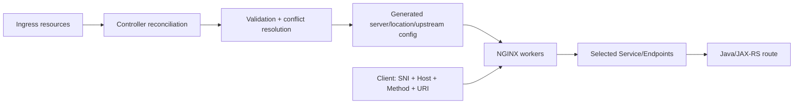
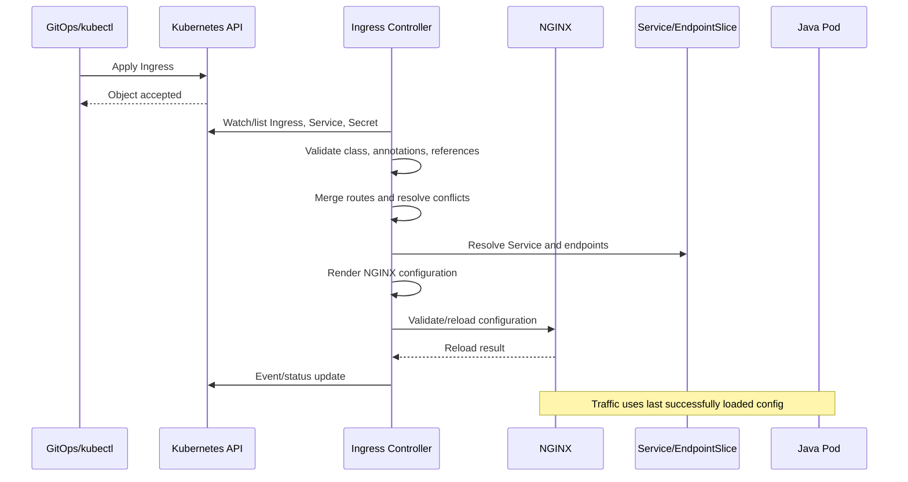
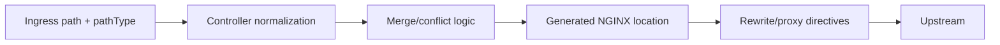

# Part 019 — Ingress Routing: Hosts, Paths, Protocols, Conflicts, and Canary

> **Depth level:** Advanced  
> **Prerequisite:** Part 004–006 dan Part 018; dasar Kubernetes Ingress manifests, Services, EndpointSlices, TLS, HTTP routing, dan NGINX location matching.  
> **Scope:** host/path routing, Kubernetes `pathType`, controller compilation, regex/rewrite, backend protocol, Service/port resolution, default backend, TLS host coupling, route collisions, multiple Ingress resources, namespace boundaries, affinity, canary/blue-green, effective-route debugging, Java/JAX-RS contract, observability, test matrix, dan production review.  
> **Bukan scope utama:** global annotation/ConfigMap precedence and governance—Part 020; Gateway API/API Gateway/service mesh selection—Part 021; cloud-specific AWS/Azure flow—Part 022–023; full WebSocket/SSE deep dive—Part 026; full gRPC deep dive—Part 027; complete production debugging catalogue—Part 031.

---

## Ecosystem and terminology boundary — 11 July 2026

This part uses three layers of semantics:

1. **Kubernetes Ingress API semantics** — portable fields such as `host`, `path`, `pathType`, backend Service, port, TLS Secret, and class.
2. **Controller-specific semantics** — regex, rewrite, backend protocol, sticky session, canary, merging, collision resolution, and generated NGINX locations.
3. **NGINX runtime semantics** — `server_name`, `location`, rewrite phases, upstream selection, proxy protocol, TLS, and connection behavior.

Do not assume that a manifest accepted by the Kubernetes API is portable across controllers.

The community **`ingress-nginx`** project was retired on **24 March 2026**. Its annotations and historical behavior remain relevant for existing systems and migration analysis, but they must not be treated as a supported current platform baseline. F5 NGINX Ingress Controller is a separate product/project with different annotations, CRDs, validation, release lifecycle, and generated configuration.

> **Internal verification checklist:** identify exact controller distribution, version, image digest, NGINX OSS/Plus edition, Helm chart, IngressClass, controller flags, annotation prefix, and support owner before reasoning about effective routing.

---

## Daftar isi

1. [Tujuan pembelajaran](#tujuan-pembelajaran)
2. [Executive mental model](#executive-mental-model)
3. [The route identity tuple](#the-route-identity-tuple)
4. [Portable API versus compiled runtime](#portable-api-versus-compiled-runtime)
5. [Ingress route compilation lifecycle](#ingress-route-compilation-lifecycle)
6. [Ingress rule anatomy](#ingress-rule-anatomy)
7. [Host matching](#host-matching)
8. [Exact host](#exact-host)
9. [Wildcard host](#wildcard-host)
10. [Hostless Ingress](#hostless-ingress)
11. [Host header and SNI are different inputs](#host-header-and-sni-are-different-inputs)
12. [PathType mental model](#pathtype-mental-model)
13. [`Exact` path](#exact-path)
14. [`Prefix` path](#prefix-path)
15. [`ImplementationSpecific` path](#implementationspecific-path)
16. [Kubernetes multiple-match precedence](#kubernetes-multiple-match-precedence)
17. [Segment-aware prefix behavior](#segment-aware-prefix-behavior)
18. [Controller compilation into NGINX locations](#controller-compilation-into-nginx-locations)
19. [Why Ingress path matching is not raw NGINX matching](#why-ingress-path-matching-is-not-raw-nginx-matching)
20. [Path normalization and encoded paths](#path-normalization-and-encoded-paths)
21. [Trailing slash behavior](#trailing-slash-behavior)
22. [Case sensitivity](#case-sensitivity)
23. [Regex routing](#regex-routing)
24. [Regex portability boundary](#regex-portability-boundary)
25. [Community ingress-nginx regex behavior](#community-ingress-nginx-regex-behavior)
26. [F5 NGINX Ingress Controller path-regex behavior](#f5-nginx-ingress-controller-path-regex-behavior)
27. [Regex ordering and shadowing](#regex-ordering-and-shadowing)
28. [Rewrite mental model](#rewrite-mental-model)
29. [Prefix stripping](#prefix-stripping)
30. [Capture groups](#capture-groups)
31. [Rewrite versus redirect](#rewrite-versus-redirect)
32. [Rewrite contract with JAX-RS](#rewrite-contract-with-jax-rs)
33. [Double rewrite and lost path](#double-rewrite-and-lost-path)
34. [Service backend resolution](#service-backend-resolution)
35. [Named versus numeric Service port](#named-versus-numeric-service-port)
36. [Service targetPort and Pod port](#service-targetport-and-pod-port)
37. [Zero-ready-endpoint behavior](#zero-ready-endpoint-behavior)
38. [HTTP backend](#http-backend)
39. [HTTPS backend](#https-backend)
40. [gRPC backend](#grpc-backend)
41. [WebSocket backend](#websocket-backend)
42. [SSE and long-lived HTTP](#sse-and-long-lived-http)
43. [Backend protocol mismatch](#backend-protocol-mismatch)
44. [TLS host coupling](#tls-host-coupling)
45. [Default TLS and default certificate](#default-tls-and-default-certificate)
46. [Default backend](#default-backend)
47. [Multiple Ingress resources for one host](#multiple-ingress-resources-for-one-host)
48. [Route merge versus route collision](#route-merge-versus-route-collision)
49. [Same host and same path](#same-host-and-same-path)
50. [Same host and overlapping paths](#same-host-and-overlapping-paths)
51. [TLS Secret collision](#tls-secret-collision)
52. [Annotation collision](#annotation-collision)
53. [Controller winner-selection algorithms](#controller-winner-selection-algorithms)
54. [Namespace boundaries](#namespace-boundaries)
55. [Host ownership](#host-ownership)
56. [Cross-namespace references](#cross-namespace-references)
57. [F5 mergeable Ingress pattern](#f5-mergeable-ingress-pattern)
58. [Session affinity](#session-affinity)
59. [Cookie affinity](#cookie-affinity)
60. [Affinity correctness risks](#affinity-correctness-risks)
61. [Canary routing mental model](#canary-routing-mental-model)
62. [Header-based canary](#header-based-canary)
63. [Cookie-based canary](#cookie-based-canary)
64. [Weight-based canary](#weight-based-canary)
65. [Canary evaluation order](#canary-evaluation-order)
66. [Canary plus affinity](#canary-plus-affinity)
67. [Canary statistical interpretation](#canary-statistical-interpretation)
68. [Blue-green routing](#blue-green-routing)
69. [Backward compatibility during route changes](#backward-compatibility-during-route-changes)
70. [Shadow traffic boundary](#shadow-traffic-boundary)
71. [Security concerns](#security-concerns)
72. [Performance concerns](#performance-concerns)
73. [Observability contract](#observability-contract)
74. [Java/JAX-RS integration contract](#javajax-rs-integration-contract)
75. [Effective-route evidence hierarchy](#effective-route-evidence-hierarchy)
76. [Systematic troubleshooting workflow](#systematic-troubleshooting-workflow)
77. [Routing test matrix](#routing-test-matrix)
78. [Failure-mode catalogue](#failure-mode-catalogue)
79. [PR review checklist](#pr-review-checklist)
80. [Internal verification checklist](#internal-verification-checklist)
81. [Hands-on exercises](#hands-on-exercises)
82. [Ringkasan invariants](#ringkasan-invariants)
83. [Referensi resmi](#referensi-resmi)

---

## Tujuan pembelajaran

Setelah menyelesaikan part ini, Anda harus mampu:

1. memprediksi route efektif dari kombinasi host, path, `pathType`, IngressClass, Service, port, TLS, dan controller-specific extensions;
2. membedakan Kubernetes path semantics dari NGINX `location` semantics;
3. menentukan kapan route portable dan kapan terikat pada controller;
4. mendeteksi regex shadowing, rewrite mismatch, trailing-slash bug, case mismatch, dan encoded-path ambiguity;
5. menelusuri route dari Ingress ke Service, EndpointSlice, Pod, dan JAX-RS resource method;
6. membedakan HTTP, HTTPS, gRPC, WebSocket, dan SSE backend requirements;
7. menemukan collision antar-Ingress pada host/path/TLS/annotation;
8. menilai winner-selection behavior sebagai implementation-specific evidence, bukan asumsi;
9. merancang affinity, canary, dan blue-green routing dengan rollback semantics yang eksplisit;
10. membangun host/path/protocol test matrix yang dapat dieksekusi di CI atau pre-production;
11. menghubungkan access log, Kubernetes events, generated config, dan backend logs untuk membuktikan route selection;
12. melakukan PR review pada perubahan routing dengan mempertimbangkan failure, security, performance, dan compatibility;
13. membuat **Internal verification checklist** untuk cluster/repository aktual tanpa mengarang architecture internal.

---

## Executive mental model

An Ingress route is not merely:

```text
path -> Service
```

It is closer to:

```text
(controller identity,
 listener,
 TLS/SNI context,
 HTTP Host,
 normalized request path,
 path matching mode,
 rewrite transform,
 backend protocol,
 Service namespace/name/port,
 endpoint set,
 traffic policy)
-> effective upstream behavior
```

The controller compiles declarative resources into NGINX runtime configuration.



### Core proposition

> To debug routing, prove the complete transformation from client request tuple to generated NGINX location and then to the selected Java endpoint.

---

## The route identity tuple

Use a route identity tuple during design and incident response:

```text
RouteKey = {
  ingressClass,
  listenerPort,
  tlsMode,
  sniName,
  hostHeader,
  method,
  normalizedPath,
  pathType,
  controllerExtensions
}
```

Backend identity:

```text
BackendKey = {
  namespace,
  serviceName,
  servicePort,
  targetPort,
  backendProtocol,
  readyEndpointSet
}
```

Traffic-policy identity:

```text
PolicyKey = {
  rewrite,
  auth,
  rateLimit,
  timeout,
  buffering,
  affinity,
  canarySelector,
  headerPolicy
}
```

A route review that only inspects `spec.rules[].http.paths[]` is incomplete.

---

## Portable API versus compiled runtime

### Portable API fields

The Kubernetes Ingress API defines:

- `spec.ingressClassName`;
- `spec.defaultBackend`;
- `spec.tls`;
- `spec.rules[].host`;
- `spec.rules[].http.paths[].path`;
- `pathType`;
- backend Service name;
- backend Service port.

### Controller-specific extensions

Common controller-specific areas include:

- regex interpretation;
- rewrite target;
- SSL redirect;
- backend HTTPS or gRPC;
- WebSocket-specific handling;
- sticky session;
- canary selection;
- rate limit;
- auth subrequest;
- snippet injection;
- mergeable resources;
- cross-namespace references;
- collision resolution;
- generated NGINX location ordering.

### Runtime behavior

The generated NGINX config determines:

- `listen`;
- `server_name`;
- location modifier/order;
- rewrite phase;
- upstream protocol;
- upstream endpoints;
- proxy headers;
- retry/timeout/buffering;
- logging;
- fallback response.

Therefore:

```text
Manifest intent != guaranteed runtime behavior
```

until validation, reconciliation, and generated configuration are verified.

---

## Ingress route compilation lifecycle



Failure can occur at each step:

- API schema rejection;
- controller ignores wrong class;
- annotation invalid;
- Service/port missing;
- route conflict;
- generated config invalid;
- reload fails;
- endpoints empty;
- backend protocol mismatch;
- JAX-RS route does not match rewritten URI.

---

## Ingress rule anatomy

A portable baseline:

```yaml
apiVersion: networking.k8s.io/v1
kind: Ingress
metadata:
  name: quote-api
  namespace: quote
spec:
  ingressClassName: nginx
  tls:
    - hosts:
        - api.example.com
      secretName: api-example-com-tls
  rules:
    - host: api.example.com
      http:
        paths:
          - path: /quote
            pathType: Prefix
            backend:
              service:
                name: quote-api
                port:
                  name: http
```

This still leaves unanswered:

- which controller owns `nginx`;
- whether HTTPS redirect is enabled;
- whether `/quote` is preserved or stripped;
- backend protocol;
- proxy headers;
- timeout/body/buffering behavior;
- collision with other Ingress resources;
- whether endpoint discovery uses Pod IPs or Service ClusterIP;
- whether route is canaried or affinitized.

---

## Host matching

Ingress host routing normally uses the HTTP `Host` authority after the connection reaches the controller. TLS SNI may select certificate/server context earlier.

### Host categories

| Host configuration | Intended behavior | Risk |
|---|---|---|
| exact host | one FQDN | DNS/Host mismatch |
| wildcard host | one DNS label wildcard | overbroad ownership assumption |
| omitted host | matches controller-specific/default listener behavior | accidental catch-all |
| invalid/unknown host | default server/backend | information leak or wrong route |

---

## Exact host

```yaml
rules:
  - host: api.example.com
```

Expected request:

```http
GET /quote HTTP/1.1
Host: api.example.com
```

Do not test only by IP without an explicit `Host`:

```bash
curl -vk https://203.0.113.10/quote
```

This may select:

- a default certificate;
- a default server;
- the wrong route.

Test with authority mapping:

```bash
curl -vk \
  --resolve api.example.com:443:203.0.113.10 \
  https://api.example.com/quote
```

`--resolve` controls both connection destination and hostname used for TLS/HTTP.

---

## Wildcard host

Kubernetes wildcard host syntax matches a single DNS label:

```yaml
host: "*.example.com"
```

Conceptually:

```text
foo.example.com        -> match
bar.example.com        -> match
foo.bar.example.com    -> not the same one-label wildcard match
example.com            -> not wildcard match
```

Do not confuse:

- DNS wildcard behavior;
- certificate wildcard coverage;
- Kubernetes host matching;
- NGINX `server_name` wildcard behavior.

They often align for simple cases but are separate contracts.

### Security concern

A wildcard route can unintentionally claim future subdomains. Platform governance should define:

- allowed base domains;
- tenant ownership;
- certificate scope;
- DNS provisioning authority;
- collision policy.

---

## Hostless Ingress

An Ingress may omit `host` at API level, but controller handling can be configurable or restricted.

Potential meanings:

- catch all requests reaching the listener;
- attach routes to default server;
- be rejected/ignored unless a controller flag allows it;
- collide with other hostless resources.

Treat hostless routing as high-risk in shared clusters.

Preferred production posture:

```text
Explicit host + explicit IngressClass + explicit TLS host
```

unless a documented platform use case requires a catch-all.

---

## Host header and SNI are different inputs

For HTTPS:

1. client sends SNI during TLS handshake;
2. server selects certificate/TLS server context;
3. encrypted HTTP request later contains Host/`:authority`;
4. HTTP routing selects virtual server/location.

They can differ:

```text
SNI: api.example.com
Host: admin.example.com
```

Depending on proxy/controller configuration, this can:

- terminate with certificate A;
- route using Host B;
- hit a default server;
- be rejected;
- expose domain-fronting-like ambiguity.

A hardened architecture should define whether SNI and Host mismatch is tolerated, rejected, or normalized upstream.

---

## PathType mental model

Kubernetes requires one of:

- `Exact`;
- `Prefix`;
- `ImplementationSpecific`.

`pathType` is not cosmetic. It is part of the route contract.

---

## `Exact` path

```yaml
path: /quote
pathType: Exact
```

Portable intent:

```text
/quote      -> match
/quote/     -> no exact match
/quote/123  -> no exact match
```

When multiple routes match the same normalized request path at equal length, Kubernetes gives precedence to `Exact` over `Prefix`.

Use `Exact` for:

- health endpoint;
- callback endpoint;
- fixed webhook endpoint;
- exact administrative path;
- a route whose subpaths must not be captured.

Be careful with application framework behavior that may redirect `/quote` to `/quote/`.

---

## `Prefix` path

```yaml
path: /quote
pathType: Prefix
```

Kubernetes Prefix matching is segment-aware.

Conceptually:

```text
/quote          -> match
/quote/         -> match
/quote/123      -> match
/quote-item     -> should not be treated as the same path segment prefix
```

This differs from naive string prefix:

```text
startsWith("/quote")
```

Use Prefix for a service-owned URL subtree.

---

## `ImplementationSpecific` path

```yaml
path: /quote/.+
pathType: ImplementationSpecific
```

This delegates interpretation to the controller.

Possible controller interpretations:

- prefix;
- regex;
- controller-specific exact behavior;
- validation rejection;
- transformed route based on annotation.

This is the lowest-portability path type.

### Rule

> Every use of `ImplementationSpecific` must identify the exact controller/version and have executable routing tests.

---

## Kubernetes multiple-match precedence

For portable Ingress semantics:

1. select matching host;
2. find all matching paths;
3. prefer the longest matching path;
4. if equally matched, prefer `Exact` over `Prefix`.

Example:

```yaml
- path: /
  pathType: Prefix
  backend: gateway

- path: /quote
  pathType: Prefix
  backend: quote

- path: /quote/admin
  pathType: Prefix
  backend: quote-admin

- path: /quote/admin
  pathType: Exact
  backend: admin-exact
```

Request:

```text
/quote/admin
```

Expected portable precedence:

```text
admin-exact
```

Request:

```text
/quote/admin/users
```

Expected:

```text
quote-admin
```

The controller still decides how this becomes NGINX locations and how controller extensions interact.

---

## Segment-aware prefix behavior

Path elements are separated by `/`.

Consider:

```yaml
path: /foo/bar
pathType: Prefix
```

Reason about:

| Request | Expected prefix intent |
|---|---|
| `/foo/bar` | match |
| `/foo/bar/` | match |
| `/foo/bar/baz` | match |
| `/foo/barbaz` | no segment match |
| `/foo/bar%2Fbaz` | depends on normalization/decoding chain; test |
| `/foo//bar` | normalization/controller-dependent; test |

Do not assume URL libraries, cloud LB, NGINX, and Java servlet/JAX-RS stack normalize identically.

---

## Controller compilation into NGINX locations

A controller may compile Ingress paths into:

- exact `location = ...`;
- prefix `location ...`;
- longest-prefix `location ^~ ...`;
- regex `location ~ ...`;
- internal named locations;
- generated maps;
- Lua/control logic;
- split-client variables;
- upstream groups.

The original YAML path may not appear one-to-one in runtime config.



When behavior is surprising, inspect generated config rather than guessing from YAML.

---

## Why Ingress path matching is not raw NGINX matching

Part 004 described standalone NGINX location precedence.

Ingress adds an earlier compiler layer:

```text
Ingress semantics
-> controller-specific translation
-> NGINX location semantics
```

A controller may sort routes before rendering regex locations. It may also apply host-wide behavior when one Ingress introduces regex or rewrite.

Therefore, copying a standalone `location` mental model directly onto Ingress YAML can be wrong.

---

## Path normalization and encoded paths

Potential transformations across the chain:

```text
client URL
-> cloud LB normalization
-> NGINX request URI parsing
-> controller rewrite
-> upstream proxy URI
-> servlet container decoding
-> JAX-RS path matching
```

Inputs to test:

- duplicate slash: `/api//quote`;
- dot segment: `/api/../admin`;
- percent-encoded slash: `/api%2Fquote`;
- percent-encoded dot: `/%2e%2e/`;
- mixed case;
- semicolon/path parameters;
- encoded Unicode;
- trailing percent;
- query string versus path.

### Security invariant

> Security policy and backend routing must agree on the same canonical path; otherwise an allow/deny decision can be made on a different representation from the one the backend executes.

---

## Trailing slash behavior

Common route pair:

```text
/api
/api/
```

Possible outcomes:

- both match Prefix;
- one redirects to the other;
- application treats them as distinct;
- rewrite removes or duplicates slash;
- relative links break;
- cookie Path no longer matches;
- OAuth redirect URI differs.

Explicitly choose a canonical form.

Example test matrix:

```bash
curl -i https://api.example.com/orders
curl -i https://api.example.com/orders/
curl -i https://api.example.com/orders/123
```

Do not let an accidental 301/308 from edge or application change HTTP method semantics for clients that do not handle redirects consistently.

---

## Case sensitivity

Hostnames are case-insensitive by DNS convention, but URL paths are generally case-sensitive unless a layer changes behavior.

Examples:

```text
/Quote
/quote
/QUOTE
```

A controller-specific regex annotation may make all paths in a resource case-insensitive.

A Java/JAX-RS route such as:

```java
@Path("/quotes")
```

should not be assumed to match `/Quotes`.

Prefer case-consistent lower-case API paths and test exact behavior.

---

## Regex routing

Regex can express routes that Prefix/Exact cannot:

```text
/api/v[0-9]+/quotes/[A-Za-z0-9-]+
```

But regex routing introduces:

- controller lock-in;
- ordering dependence;
- shadowing;
- engine differences;
- escaping complexity in YAML;
- performance cost;
- security bypass possibilities;
- difficult migration to Gateway API/another controller.

Use regex only when a simpler route tree cannot model the requirement.

---

## Regex portability boundary

Questions to answer before approving regex:

1. Which `pathType` is required?
2. Which annotation enables regex?
3. Which regex engine/syntax is accepted?
4. Is matching case-sensitive?
5. Is the pattern anchored automatically?
6. Are routes reordered?
7. Does one regex annotation affect all paths on the host/resource?
8. How do capture groups map to rewrite target?
9. What happens if another Ingress for the same host adds a rewrite?
10. How will the route be migrated?

If any answer is unknown, the route is not production-ready.

---

## Community ingress-nginx regex behavior

For legacy/current installed community `ingress-nginx` systems:

- `nginx.ingress.kubernetes.io/use-regex: "true"` historically enables regex interpretation;
- `rewrite-target` often requires explicit capture groups for preserved substrings;
- regex path handling and ordering are controller-specific;
- host-wide interactions can occur when resources for the same host are merged;
- generated regex locations may not preserve Kubernetes Prefix semantics.

Because the project is retired, use this knowledge primarily to:

- debug existing installations;
- freeze behavior with tests;
- inventory migration dependencies;
- remove undocumented annotation coupling.

Example historical pattern:

```yaml
metadata:
  annotations:
    nginx.ingress.kubernetes.io/use-regex: "true"
    nginx.ingress.kubernetes.io/rewrite-target: /$2
spec:
  rules:
    - host: api.example.com
      http:
        paths:
          - path: /something(/|$)(.*)
            pathType: ImplementationSpecific
            backend:
              service:
                name: api
                port:
                  number: 8080
```

Requests:

```text
/something       -> /
/something/      -> /
/something/new   -> /new
```

This is not portable Kubernetes behavior.

---

## F5 NGINX Ingress Controller path-regex behavior

F5 NGINX Ingress Controller exposes controller-specific path-regex behavior such as:

```yaml
metadata:
  annotations:
    nginx.org/path-regex: "case_sensitive"
```

Documented values include:

- `case_sensitive`;
- `case_insensitive`;
- `exact`.

The annotation applies to paths in the corresponding Ingress resource. In mergeable Ingress patterns, path-regex behavior can be scoped to Minion resources.

Example:

```yaml
metadata:
  annotations:
    nginx.org/path-regex: "case_insensitive"
spec:
  rules:
    - host: api.example.com
      http:
        paths:
          - path: /quote/[A-Z0-9]+
            pathType: ImplementationSpecific
            backend:
              service:
                name: quote-api
                port:
                  number: 8080
```

Do not translate community annotation names by prefix substitution. Semantics, accepted values, and generated config differ.

---

## Regex ordering and shadowing

NGINX regex locations are order-sensitive after prefix selection rules. Controllers may sort regex paths by descending length before generating configuration.

Example:

```text
/api/(.*)
/api/admin/(.*)
```

If the broader regex is evaluated first, it can shadow the admin route.

Required tests:

```text
/api/x
/api/admin
/api/admin/
/api/admin/users
/api/administrator
```

A route should be rejected in review when its correctness depends on undocumented controller ordering.

---

## Rewrite mental model

A rewrite changes the URI sent upstream.

```text
External URI != Upstream URI
```

Define both explicitly:

```text
External:
  https://api.example.com/order/v1/orders/123

Internal:
  http://order-service:8080/v1/orders/123
```

Rewrite ownership choices:

1. edge strips `/order`;
2. Java application is configured with `/order`;
3. application gateway handles base path;
4. no rewrite; route and app share the same path.

Choose one owner.

---

## Prefix stripping

Desired:

```text
/api/orders/123 -> /orders/123
```

Conceptual rule:

```text
strip external prefix /api
preserve remaining path
preserve query string
```

Test:

| External request | Upstream expected |
|---|---|
| `/api` | `/` or explicitly chosen result |
| `/api/` | `/` |
| `/api/orders` | `/orders` |
| `/api/orders/123?expand=true` | `/orders/123?expand=true` |
| `/apiary` | must not match `/api` Prefix contract |

---

## Capture groups

Regex rewrite must define every preserved substring explicitly.

Example:

```text
Pattern: /api(/|$)(.*)
Target: /$2
```

Common failures:

- capture group index wrong;
- optional slash produces empty group unexpectedly;
- query string dropped or duplicated;
- percent encoding decoded twice;
- path traversal becomes visible only after rewrite;
- target missing leading slash;
- rewritten URI no longer matches JAX-RS route.

Treat rewrite tests as compatibility tests, not merely ingress tests.

---

## Rewrite versus redirect

### Internal rewrite

Client sees original URL:

```text
GET /api/orders
```

Upstream receives:

```text
GET /orders
```

### External redirect

Client receives:

```http
HTTP/1.1 308 Permanent Redirect
Location: /orders
```

Then client makes a second request.

Differences:

- extra round trip;
- client compatibility;
- method/body preservation;
- public URL changes;
- browser cache behavior;
- OAuth/signature implications.

Do not use redirect to solve an internal routing mismatch unless public URL change is intended.

---

## Rewrite contract with JAX-RS

Suppose:

```java
@ApplicationPath("/api")
public class RestApplication extends Application {}

@Path("/quotes")
public class QuoteResource {
    @GET
    @Path("/{id}")
    public Response get(@PathParam("id") String id) { ... }
}
```

Internal route:

```text
/api/quotes/{id}
```

If Ingress externally exposes `/quote-order/quotes/{id}`, decide:

```text
external /quote-order/quotes/123
-> rewrite /api/quotes/123
```

The contract must also cover:

- generated absolute URLs;
- `Location` response header;
- OpenAPI server/base path;
- callback URL;
- cookies;
- application redirects;
- forwarded prefix;
- access log fields for original and upstream URI.

---

## Double rewrite and lost path

Potential chain:

```text
ALB rule strips /edge
-> Ingress strips /api
-> application expects /api
```

Result:

```text
original /edge/api/orders
ALB sends /api/orders
Ingress sends /orders
application returns 404
```

Or:

```text
Ingress preserves /api
application context path also adds /api to generated redirect
-> /api/api/login
```

Inventory every path transform in order.

---

## Service backend resolution

Ingress backend references a Service, not directly a Deployment.

```yaml
backend:
  service:
    name: quote-api
    port:
      name: http
```

The controller then resolves according to implementation:

- Service ClusterIP as one upstream;
- EndpointSlice Pod IPs as individual upstreams;
- another internal data-plane abstraction.

Verify actual generated upstreams.

---

## Named versus numeric Service port

Named port:

```yaml
port:
  name: http
```

Numeric port:

```yaml
port:
  number: 8080
```

Named ports are resilient to some Service port renumbering, but fail if:

- name typo;
- duplicate/changed name;
- controller cannot resolve;
- chart values drift.

Numeric ports are explicit but couple Ingress to Service-facing port.

Always distinguish:

```text
Ingress backend Service port
Service spec.port
Service spec.targetPort
Container port
Application listen port
```

---

## Service targetPort and Pod port

Example:

```yaml
kind: Service
spec:
  ports:
    - name: http
      port: 80
      targetPort: 8080
```

Ingress references:

```yaml
port:
  name: http
```

Data path may become:

```text
NGINX -> PodIP:8080
```

or:

```text
NGINX -> ClusterIP:80 -> PodIP:8080
```

depending on controller configuration.

A successful Service DNS lookup does not prove target port correctness.

---

## Zero-ready-endpoint behavior

When Service exists but no ready endpoints exist, possible outcomes include:

- generated upstream with no available servers;
- controller event warning;
- NGINX 502/503;
- fallback backend;
- stale endpoints retained briefly;
- Service VIP rejects/drops connection.

Evidence:

```bash
kubectl get svc -n quote quote-api -o yaml
kubectl get endpointslice -n quote \
  -l kubernetes.io/service-name=quote-api -o yaml
kubectl get pods -n quote -l app=quote-api -o wide
```

Then correlate with controller logs and NGINX error logs.

---

## HTTP backend

Baseline:

```text
client HTTPS
-> TLS terminates at ingress
-> ingress uses HTTP to backend
```

This may be acceptable within trusted cluster network or may violate internal encryption policy.

Verify:

- backend protocol annotation/policy;
- Service port;
- application scheme expectation;
- forwarded proto;
- NetworkPolicy;
- service mesh interaction.

---

## HTTPS backend

For TLS re-encryption:

```text
client HTTPS
-> ingress terminates
-> new TLS connection to backend
```

Required decisions:

- SNI name sent upstream;
- CA trust;
- hostname verification;
- client certificate if mTLS;
- TLS protocol/ciphers;
- certificate rotation;
- health check protocol.

A backend listening on HTTPS with ingress configured for HTTP commonly produces 502 and handshake/reset errors.

Controller-specific examples differ.

Historical community pattern:

```yaml
nginx.ingress.kubernetes.io/backend-protocol: "HTTPS"
```

F5 NGINX Ingress Controller can identify TLS-enabled services through its own annotations/configuration such as `nginx.org/ssl-services`.

Do not mix syntax.

---

## gRPC backend

gRPC requires coherent protocol across hops:

```text
client HTTP/2
-> ingress listener supports HTTP/2
-> controller generates grpc_pass/grpcs as appropriate
-> backend supports h2/h2c/TLS
```

Questions:

- TLS terminated at ingress?
- backend is h2c or TLS?
- service port correct?
- ALPN available?
- timeout suitable for streaming?
- gRPC status logged?
- health check protocol?

Controller-specific examples:

- community installations often use `backend-protocol: GRPC` or `GRPCS`;
- F5 controller uses its documented gRPC service annotations/CRD fields.

Part 027 covers protocol depth.

---

## WebSocket backend

WebSocket begins as HTTP Upgrade then becomes a long-lived bidirectional connection.

Required route properties:

- HTTP/1.1 upstream where required;
- `Upgrade`/`Connection` handling;
- idle timeout alignment;
- no incompatible buffering;
- load balancer idle timeout;
- graceful draining;
- optional session affinity if application state requires it.

Some controllers handle WebSocket automatically; others expose explicit service annotations. Verify exact distribution/version.

Part 026 provides full detail.

---

## SSE and long-lived HTTP

SSE uses long-lived HTTP response, not WebSocket.

Routing implications:

- normal host/path selection;
- response buffering disabled where required;
- proxy read timeout aligned;
- no compression/buffering surprises;
- connection capacity;
- graceful rollout behavior.

A correct route can still appear “broken” because events are buffered.

---

## Backend protocol mismatch

| Ingress assumption | Backend reality | Typical symptom |
|---|---|---|
| HTTP | HTTPS | reset/502/invalid response |
| HTTPS | HTTP | TLS handshake failure/502 |
| HTTP/1 proxy | gRPC h2c | 502/protocol error |
| gRPC | REST | gRPC status/protocol failure |
| WebSocket upgrade missing | WebSocket | handshake 400/426 |
| short HTTP route | SSE | disconnect/timeout |

Always test direct backend protocol from an ingress pod or equivalent trusted diagnostic pod.

---

## TLS host coupling

A TLS entry:

```yaml
tls:
  - hosts:
      - api.example.com
    secretName: api-example-com-tls
```

must align with:

- route host;
- certificate SAN;
- DNS name;
- SNI;
- controller certificate selection;
- cloud LB TLS termination topology.

Ingress `rules.host` and `tls.hosts` are related but distinct fields.

Misalignment can produce:

- correct certificate but wrong route;
- wrong/default certificate but correct route;
- TLS handshake success followed by 404;
- SNI mismatch;
- duplicate certificate ownership conflict.

---

## Default TLS and default certificate

A controller may serve a default certificate when:

- SNI unknown;
- route has no TLS Secret;
- Secret invalid/unavailable;
- listener configured with global fallback.

A default certificate is not proof that intended TLS route works.

Test:

```bash
openssl s_client \
  -connect ingress.example.net:443 \
  -servername api.example.com \
  -showcerts
```

Compare:

- subject/SAN;
- issuer;
- serial;
- validity;
- served chain.

---

## Default backend

Default backend handles requests that do not match a host/path, depending on controller configuration.

Use cases:

- generic 404;
- branded error;
- health behavior;
- explicit rejection.

Security posture:

- minimal information;
- no route enumeration;
- no stack trace;
- no open redirect;
- no echo of untrusted Host;
- consistent logging/request ID.

Do not route unknown paths to a powerful application gateway by accident.

---

## Multiple Ingress resources for one host

Teams often split routes:

```text
api.example.com/orders  -> order namespace
api.example.com/quote   -> quote namespace
api.example.com/admin   -> platform namespace
```

The controller may merge these into one NGINX server block.

This creates shared fate:

- annotation interactions;
- TLS ownership;
- regex effects;
- server-level snippets;
- reload failure;
- collision;
- host takeover;
- policy inconsistency.

An Ingress object is namespaced, but the DNS host is globally shared at the controller/listener boundary.

---

## Route merge versus route collision

### Merge

Distinct paths can coexist:

```text
/api/orders
/api/quotes
```

### Collision

Same effective route key:

```text
host: api.example.com
path: /orders
pathType: Prefix
```

defined by two resources.

### Ambiguous overlap

```text
/orders
/orders/admin
/orders/(.*)
```

may be deterministic only under specific controller ordering.

A controller can:

- choose one winner;
- reject one/both;
- merge with order rules;
- select oldest resource;
- use lexical/resource ordering;
- emit warning;
- accept API object but ignore it.

Never rely on an undocumented winner.

---

## Same host and same path

Example collision:

```yaml
# namespace blue
host: api.example.com
path: /orders
backend: orders-v1
```

```yaml
# namespace green
host: api.example.com
path: /orders
backend: orders-v2
```

This is not a safe blue-green strategy unless the controller has an explicit traffic-splitting construct.

Risks:

- nondeterministic or controller-specific winner;
- rollout changes ownership;
- recreation timestamp changes winner;
- one resource silently ignored;
- TLS/annotation mismatch;
- security policy bypass.

Use an explicit canary/weighted mechanism or controlled route switch.

---

## Same host and overlapping paths

Example:

```text
/orders          Prefix -> service A
/orders/admin    Prefix -> service B
/orders/.+       Regex  -> service C
```

Questions:

- which routes are portable?
- is regex enabled host-wide?
- how are generated locations ordered?
- is `/orders/admin` exact/prefix shadowed?
- does trailing slash alter result?
- does encoded slash bypass?
- are policies inherited per Ingress or server?

Build an executable table.

---

## TLS Secret collision

Two resources for one host may reference different TLS Secrets.

Possible controller outcomes:

- first/oldest wins;
- one resource rejected;
- latest reconciliation changes certificate;
- deterministic winner algorithm;
- one certificate used for all routes on host.

This is a certificate-ownership conflict, not only a routing conflict.

Platform rule should enforce:

```text
one host -> one explicit TLS owner
```

or a documented delegation model.

---

## Annotation collision

Annotations can be scoped to:

- Ingress resource;
- generated server/host;
- generated location/path;
- upstream;
- controller global config.

If two resources sharing a host set incompatible server-level behavior, the effective result is controller-specific.

Examples:

- SSL redirect;
- server snippet;
- auth;
- regex;
- CORS;
- rate limit;
- proxy body size;
- timeout;
- response headers.

Do not assume each Ingress is isolated because annotations are stored on separate objects.

---

## Controller winner-selection algorithms

Winner selection is implementation-specific.

A controller may use criteria such as:

- creation timestamp;
- resource UID;
- namespace/name ordering;
- explicit mergeable role;
- class/watch scope;
- first successfully processed;
- validation result.

The correct evidence sources are:

1. controller documentation for exact version;
2. Kubernetes Events;
3. controller logs;
4. generated config;
5. deterministic integration tests.

Avoid architecture that depends on winner selection. Prevent collisions instead.

---

## Namespace boundaries

Ingress is namespaced. Standard backend Service references normally resolve within the same namespace.

However:

- host names are shared externally;
- controller is cluster-scoped or multi-namespace;
- TLS Secret references are namespace-scoped;
- snippets may affect shared generated config;
- controller RBAC may read many namespaces;
- one tenant can collide with another tenant’s host unless policy prevents it.

Namespace is not automatically a complete ingress tenancy boundary.

---

## Host ownership

A platform should enforce host ownership using one or more of:

- dedicated IngressClass/controller per trust zone;
- namespace-to-domain policy;
- admission policy;
- GitOps ownership/CODEOWNERS;
- DNS automation ownership;
- certificate issuance policy;
- central host registry;
- Gateway API listener/route delegation.

Example policy intent:

```text
namespace quote-prod may claim:
  quote.api.example.com
  *.quote.internal.example.com

namespace quote-prod may not claim:
  admin.example.com
  payments.example.com
```

---

## Cross-namespace references

Standard Ingress backend Service references are namespace-local. Controller CRDs may support controlled cross-namespace references or delegation.

Risks:

- privilege escalation;
- routing to unauthorized Service;
- referencing another team’s Secret;
- confusing ownership;
- deletion/change outside route owner’s control.

Require explicit platform policy and reference grants where the API supports them.

---

## F5 mergeable Ingress pattern

F5 NGINX Ingress Controller supports a mergeable Ingress concept with Master and Minion resources.

Conceptually:

- Master owns host and possibly TLS;
- Minions own path subsets;
- controller validates merge relationship;
- path-specific annotations can be attached at Minion scope.

This can model delegated path ownership, but it is not standard Kubernetes Ingress portability.

Review:

- Master/Minion annotation;
- namespace behavior;
- host equality;
- path uniqueness;
- TLS ownership;
- deletion semantics;
- migration path.

---

## Session affinity

Stateless services should normally tolerate any healthy replica.

Affinity is justified only when a concrete state dependency exists:

- in-memory session;
- staged upload;
- protocol affinity;
- migration constraint;
- cache locality with measured benefit.

Affinity is not a substitute for correct distributed state design.

---

## Cookie affinity

Controller sets or consumes a cookie that maps a client to an upstream.

Contract includes:

- cookie name;
- domain;
- Path;
- Secure;
- HttpOnly;
- SameSite;
- expiry/max-age;
- behavior when endpoint disappears;
- behavior across canary/mainline;
- hash/route encoding;
- compatibility across controller upgrade.

Example failure:

```text
Ingress external path: /quote
Cookie Path: /api
```

Browser does not send cookie on `/quote`; affinity appears random.

---

## Affinity correctness risks

- pod is terminated but cookie still points to it;
- rollout sends users to incompatible version;
- scale-down concentrates failures;
- cookie domain leaks across apps;
- cookie value can be forged;
- canary cohort changes unexpectedly;
- route rewrite changes cookie Path;
- non-browser clients ignore cookies;
- multi-region traffic has independent affinity state.

Log affinity/canary decision without exposing sensitive cookie contents.

---

## Canary routing mental model

A canary route needs an explicit cohort function:

```text
cohort = f(header, cookie, identity, random weight, hash key)
```

Then:

```text
cohort -> mainline or canary backend
```

A safe canary contract defines:

- eligibility;
- precedence;
- stickiness;
- percentage;
- fallback;
- health behavior;
- metrics;
- rollback;
- schema/data compatibility.

---

## Header-based canary

Example conceptual selector:

```http
X-Canary: always
```

Use cases:

- internal testers;
- synthetic probes;
- specific partners;
- release validation.

Security:

- strip untrusted external control header at outer edge;
- inject only from trusted gateway or authorized clients;
- avoid exposing privileged/debug behavior;
- log decision safely.

Header canary is deterministic when header value is stable.

---

## Cookie-based canary

Cookie selector:

```http
Cookie: canary=always
```

Useful for browser cohort persistence.

Review:

- who sets cookie;
- signing/integrity;
- Path/Domain;
- Secure/SameSite;
- expiry;
- cross-environment leakage;
- fallback when cookie invalid;
- interaction with backend session cookie.

Do not use an unsigned client-controlled cookie to grant privileged functionality.

---

## Weight-based canary

Example intent:

```text
5% canary, 95% stable
```

Weight normally applies per request unless combined with stable hashing/affinity.

Consequences:

- one user may alternate versions;
- multi-request workflow may span versions;
- canary share varies under low volume;
- retries can skew observed share;
- long-lived connections make request count differ from user count;
- multiple ingress replicas may each calculate independently.

Weight is a probability/configured share, not an exact user percentage.

---

## Canary evaluation order

Legacy community `ingress-nginx` canary semantics historically evaluate selectors in an order such as:

1. header;
2. cookie;
3. weight.

Exact behavior and annotations must be verified for the installed version.

A migration to another controller must preserve:

- selector precedence;
- “always”/“never” values;
- regex/value handling;
- fallback;
- affinity behavior.

Do not assume a new controller’s list order or policy evaluation matches historical annotations.

---

## Canary plus affinity

Possible policies:

### Sticky canary

Once selected, client remains on canary.

Good for:

- workflow consistency;
- user-level experiment.

Risk:

- failed canary remains sticky;
- rollback must invalidate/override cookie.

### Legacy/non-sticky behavior

Each request may be reevaluated.

Good for:

- stateless endpoint load sample.

Risk:

- request sequence spans incompatible versions.

Choose explicitly.

---

## Canary statistical interpretation

For `N` independent requests and canary probability `p`:

```text
expected canary requests = N * p
```

But observed distribution varies.

Do not fail a test because exactly 5 of 100 requests were not canary for `p = 5%`.

Use:

- sufficiently large sample;
- confidence bounds;
- stable request conditions;
- separate long-lived connection analysis;
- per-replica/controller metrics;
- backend version marker.

For deterministic CI, prefer header/cookie selector over random weight.

---

## Blue-green routing

Blue-green aims for an atomic route switch:

```text
blue -> current
green -> candidate
```

Safe patterns:

- stable Service selector switch;
- explicit weighted route reaching 100%;
- gateway/ingress route backend change;
- DNS/LB switch with understood TTL;
- separate hostname for validation then controlled promotion.

Unsafe pattern:

```text
create two conflicting Ingress resources and hope desired one wins
```

Rollback must be precomputed and tested.

---

## Backward compatibility during route changes

Route changes can break:

- old clients;
- bookmarks;
- callbacks;
- webhooks;
- OAuth redirect URIs;
- signed requests;
- caches;
- cookies;
- CORS;
- generated links.

Migration pattern:

```text
Phase 1: old route + new route -> same compatible backend
Phase 2: clients migrate
Phase 3: observe old-route traffic
Phase 4: deprecate/return explicit status
Phase 5: remove old route
```

Avoid changing path and backend schema simultaneously.

---

## Shadow traffic boundary

Traffic mirroring is not the same as canary:

- client receives primary response only;
- mirror response ignored;
- request body may be copied;
- side effects may occur;
- credentials/PII are duplicated;
- mirror traffic adds load;
- retries can multiply side effects.

Use only for idempotent/safe shadow targets or build a dedicated capture/replay mechanism.

Part 030 covers progressive delivery in depth.

---

## Security concerns

### Host takeover

A namespace claims another team’s host.

Mitigation:

- admission policy;
- domain ownership registry;
- dedicated class/controller;
- GitOps review.

### Path policy bypass

Auth applies to `/admin`, but encoded/rewritten path reaches admin handler through another representation.

Mitigation:

- canonicalization tests;
- backend authorization;
- deny dangerous encodings where appropriate.

### Regex overmatch

Pattern intended for IDs matches internal endpoints.

Mitigation:

- anchor regex;
- negative tests;
- simpler exact/prefix routes.

### Header-controlled canary abuse

External client selects untested backend.

Mitigation:

- sanitize control header;
- authorization;
- separate internal hostname.

### Cross-namespace route collision

Tenant overrides or destabilizes shared host.

Mitigation:

- ownership policy and collision rejection.

### Default backend disclosure

Unknown route leaks controller version or internal details.

Mitigation:

- minimal hardened response.

---

## Performance concerns

- thousands of regex paths increase config/render/match complexity;
- large generated config increases reload time;
- many route changes create control-plane churn;
- per-route upstream groups consume memory;
- sticky session can unevenly load replicas;
- canary doubles telemetry dimensions;
- TLS certificates per host increase handshake/config footprint;
- long-lived routes consume connections;
- endpoint churn triggers frequent reconciliation;
- overly broad catch-all sends unnecessary traffic to application.

Measure:

- controller sync duration;
- NGINX reload duration/failures;
- config size;
- route count;
- regex route count;
- endpoint count;
- connection distribution;
- upstream skew;
- canary share.

---

## Observability contract

For every request, aim to reconstruct:

```text
request_id
ingress_class/controller
ingress namespace/name
host
original_uri
normalized/request_uri
matched route/path
backend service
upstream address
backend protocol
canary decision
affinity decision
status
request_time
upstream_connect_time
upstream_header_time
upstream_response_time
```

Not every controller exposes every field by default. Add only fields that are supported and safe.

### Configuration-plane evidence

- Kubernetes Events;
- controller logs;
- rejected resource metrics;
- sync/reload metrics;
- generated configuration;
- Ingress status;
- Service/EndpointSlice state.

### Data-plane evidence

- access/error log;
- backend logs;
- LB logs;
- trace context;
- status/timing;
- TLS certificate/handshake evidence.

---

## Java/JAX-RS integration contract

For each route document:

| Concern | Required decision |
|---|---|
| external host | canonical public authority |
| external path | client-facing API |
| upstream path | URI received by JAX-RS |
| application path | servlet/JAX-RS base |
| forwarded host/proto/prefix | trusted header contract |
| redirect generation | external URL correctness |
| body/streaming | buffering and limits |
| timeout | ingress/application/downstream chain |
| auth identity | sanitized propagation |
| correlation | request/trace ID |
| health | readiness endpoint route |
| shutdown | endpoint removal and draining |
| protocol | HTTP/HTTPS/gRPC/WebSocket/SSE |

### Debug marker

In non-production or restricted diagnostics, a backend version header can help:

```http
X-Backend-Version: quote-api-2026.07.1
```

Do not expose sensitive deployment details publicly without policy approval.

---

## Effective-route evidence hierarchy

From strongest runtime evidence to weakest intent:

1. request/response observed with controlled Host/SNI/path;
2. NGINX access/error log for that request ID;
3. generated NGINX configuration;
4. controller reconciliation log/Event;
5. resolved Service/EndpointSlice;
6. live Ingress object;
7. rendered Helm manifest;
8. source template/values;
9. architecture diagram or assumption.

Use all relevant levels, but do not let a source manifest overrule runtime evidence.

---

## Systematic troubleshooting workflow

### Step 1 — Freeze the request tuple

Record:

```text
destination IP/LB
SNI
Host
method
raw URI
headers
body
source network
timestamp
request ID
```

### Step 2 — Verify DNS/LB reachability

```bash
dig +short api.example.com
curl -vk --resolve api.example.com:443:203.0.113.10 \
  https://api.example.com/quote
```

### Step 3 — Verify TLS/SNI

```bash
openssl s_client \
  -connect api.example.com:443 \
  -servername api.example.com
```

### Step 4 — Identify controller/class

```bash
kubectl get ingressclass
kubectl get ingress -A \
  -o custom-columns='NS:.metadata.namespace,NAME:.metadata.name,CLASS:.spec.ingressClassName,HOSTS:.spec.rules[*].host'
```

### Step 5 — Inspect target Ingress and events

```bash
kubectl describe ingress -n quote quote-api
kubectl get events -n quote --sort-by=.lastTimestamp
```

### Step 6 — Search collisions

```bash
kubectl get ingress -A -o yaml
```

Filter by host/path using `jq`, `yq`, or an inventory script.

### Step 7 — Inspect generated config

Controller-specific command, for example:

```bash
kubectl exec -n ingress-system deploy/nginx-ingress-controller -- nginx -T
```

Exact pod/container/path differs. Follow platform runbook.

### Step 8 — Verify Service and endpoints

```bash
kubectl get svc -n quote quote-api -o yaml
kubectl get endpointslice -n quote \
  -l kubernetes.io/service-name=quote-api -o yaml
```

### Step 9 — Test backend directly

From approved diagnostic pod:

```bash
curl -sv http://quote-api.quote.svc.cluster.local:8080/health
```

Then test the rewritten application path.

### Step 10 — Correlate logs

Search same timestamp/request ID in:

- external LB;
- ingress access/error logs;
- controller logs;
- Java access/application logs;
- traces.

### Step 11 — Compare expected and actual transforms

```text
expected external path
expected matched rule
expected rewritten path
actual upstream URI
actual JAX-RS resource
```

### Step 12 — Prove fix with matrix

Do not validate only the failing happy path. Run positive and negative cases.

---

## Routing test matrix

Example:

| ID | Host | Method | Path | SNI | Expected backend | Expected upstream URI | Expected status |
|---|---|---|---|---|---|---|---|
| R01 | api.example.com | GET | `/quote` | api.example.com | quote-api | `/api/quote` | 200 |
| R02 | api.example.com | GET | `/quote/` | api.example.com | quote-api | `/api/quote/` | defined |
| R03 | api.example.com | GET | `/quote/123` | api.example.com | quote-api | `/api/quote/123` | 200 |
| R04 | api.example.com | GET | `/quote-item` | api.example.com | default | unchanged | 404 |
| R05 | wrong.example.com | GET | `/quote` | wrong.example.com | default | N/A | 404/421 policy |
| R06 | api.example.com | POST | `/quote` | api.example.com | quote-api | `/api/quote` | application-defined |
| R07 | api.example.com | GET | `/Quote` | api.example.com | default | N/A | 404 |
| R08 | api.example.com | GET | `/quote%2Fadmin` | api.example.com | policy-defined | policy-defined | reject/test |
| R09 | api.example.com | GET | `/quote/admin` | api.example.com | admin backend | expected | 200/403 |
| R10 | api.example.com | GET | `/quote` + canary header | api.example.com | quote-canary | expected | 200 |
| R11 | api.example.com | GET | `/quote` without selector | api.example.com | quote-stable | expected | 200 |
| R12 | api.example.com | OPTIONS | `/quote` | api.example.com | CORS owner | expected | defined |

### Required negative tests

- unknown host;
- unknown path;
- sibling prefix (`/quote-item`);
- duplicate slash;
- dot segment;
- encoded slash;
- wrong method;
- missing/invalid canary header;
- stale affinity cookie;
- backend unavailable;
- TLS certificate mismatch;
- HTTP sent to HTTPS listener;
- protocol mismatch.

---

## Failure-mode catalogue

| Symptom | Likely routing causes | Evidence |
|---|---|---|
| default 404 | host/path miss, wrong class, route rejected | access log, Events, generated config |
| application 404 | rewrite/base-path mismatch | upstream URI, Java logs |
| wrong service response | route collision, regex shadowing, stale config | backend marker, generated config |
| certificate wrong | SNI/TLS Secret collision/default cert | `openssl`, Secret, config |
| 502 | backend protocol/port mismatch, no listener | error log, direct curl |
| 503 | no endpoints/upstream unavailable | EndpointSlice, error log |
| intermittent backend version | weight/affinity/route overlap | cookie, canary logs |
| canary receives 0% | selector mismatch, annotation ignored | generated config, request headers |
| canary receives 100% | header/cookie forced, weight config error | access logs |
| route works by IP but not DNS | Host/SNI/DNS mismatch | `curl --resolve`, LB config |
| route works internally only | external LB/security/DNS path | hop testing |
| WebSocket fails after handshake | timeout/upgrade/draining | access/error logs |
| gRPC UNAVAILABLE | h2/h2c/TLS mismatch | gRPC client logs, NGINX error |
| old route persists | stale control plane/reload failure | controller sync/reload metrics |
| new route breaks unrelated host | shared config/snippet/reload | generated config, controller logs |

---

## PR review checklist

### Identity and ownership

- [ ] Exact IngressClass/controller is explicit.
- [ ] Host ownership is authorized.
- [ ] Namespace/team owner is clear.
- [ ] TLS ownership is unambiguous.
- [ ] No conflicting host/path already exists.

### Path semantics

- [ ] `pathType` is explicit and justified.
- [ ] Prefix versus Exact behavior is correct.
- [ ] Regex is avoided unless necessary.
- [ ] Regex engine/annotation/controller version is documented.
- [ ] Trailing slash behavior is defined.
- [ ] Case sensitivity is defined.
- [ ] Encoded/dot/duplicate-slash cases are tested.
- [ ] Location shadowing has been evaluated.

### Rewrite

- [ ] External and upstream URI are documented.
- [ ] Capture groups are correct.
- [ ] Query string behavior is tested.
- [ ] No double rewrite exists upstream/downstream.
- [ ] JAX-RS base path and generated redirects are correct.
- [ ] Cookie Path/OpenAPI/callback URLs remain correct.

### Backend

- [ ] Service exists in correct namespace.
- [ ] Service port name/number resolves.
- [ ] `targetPort` and application port align.
- [ ] Backend protocol is correct.
- [ ] Ready endpoints exist.
- [ ] Readiness/shutdown semantics are compatible.
- [ ] Direct Service test is included.

### TLS and protocol

- [ ] TLS host and route host align.
- [ ] Certificate SAN and Secret are correct.
- [ ] SNI/Host mismatch policy is understood.
- [ ] HTTP/HTTPS/gRPC/WebSocket/SSE requirements are tested.
- [ ] Idle/read timeout fits protocol.

### Traffic policy

- [ ] Affinity need is justified.
- [ ] Cookie attributes are secure and path-correct.
- [ ] Canary selector/precedence/percentage is documented.
- [ ] Canary metrics and rollback exist.
- [ ] Version/schema compatibility is proven.
- [ ] No collision-based blue-green trick is used.

### Security and observability

- [ ] Unknown host/path fail safely.
- [ ] Auth policy cannot be bypassed by alternate path encoding.
- [ ] Canary control headers are sanitized.
- [ ] Route/backend/canary decision is observable.
- [ ] Sensitive headers/cookies are not logged.
- [ ] Alerts cover rejection/reload/no-endpoint conditions.

### Rollout

- [ ] Rendered manifest is reviewed.
- [ ] Admission/controller validation passes.
- [ ] Routing test matrix passes.
- [ ] Rollback resource/config is prepared.
- [ ] Blast radius of shared host/controller is understood.

---

## Internal verification checklist

### Controller identity and support

- [ ] Identify controller distribution and exact version.
- [ ] Record image digest and chart version.
- [ ] Record NGINX OSS/Plus version.
- [ ] Confirm whether community ingress-nginx remains deployed despite retirement.
- [ ] Locate support owner and migration plan.
- [ ] Locate exact documentation source matching version.

### Route inventory

- [ ] Export all Ingress resources by class/namespace/host/path.
- [ ] Detect duplicate host/path/pathType tuples.
- [ ] Detect overlapping Prefix/Exact/regex paths.
- [ ] Inventory hostless Ingresses.
- [ ] Inventory wildcard hosts.
- [ ] Inventory `ImplementationSpecific` paths.
- [ ] Inventory regex and rewrite annotations.
- [ ] Inventory default backends.
- [ ] Inventory backend protocol annotations.
- [ ] Inventory affinity/canary annotations.

### TLS and DNS

- [ ] Map hosts to DNS records and external LB.
- [ ] Map hosts to TLS Secrets/certificate managers.
- [ ] Detect multiple Secrets for one host.
- [ ] Verify certificate SAN/issuer/expiry/chain.
- [ ] Verify default certificate behavior.
- [ ] Verify SNI and Host mismatch behavior.
- [ ] Verify HTTP-to-HTTPS redirect ownership.

### Services and endpoints

- [ ] Map each route to Service namespace/name/port.
- [ ] Verify named ports resolve.
- [ ] Verify Service `targetPort`.
- [ ] Verify selector and EndpointSlices.
- [ ] Confirm direct Pod versus ClusterIP upstream behavior.
- [ ] Verify backend protocol and TLS trust.
- [ ] Verify readiness and termination lifecycle.

### Java/JAX-RS

- [ ] Record application context and `@ApplicationPath`.
- [ ] Map external path to upstream path.
- [ ] Verify redirects and `Location` headers.
- [ ] Verify forwarded Host/Proto/Prefix handling.
- [ ] Verify cookie Path/Domain.
- [ ] Verify OpenAPI server URLs.
- [ ] Verify callback/webhook/OIDC redirect URIs.
- [ ] Verify health route ownership.
- [ ] Verify WebSocket/SSE/gRPC routes if present.

### Conflict and ownership governance

- [ ] Determine controller winner-selection behavior.
- [ ] Check Kubernetes Events for rejected/conflicting resources.
- [ ] Check generated config for merged hosts.
- [ ] Identify namespace-to-domain ownership policy.
- [ ] Identify admission/GitOps controls preventing host takeover.
- [ ] Identify cross-namespace reference mechanisms.
- [ ] Identify F5 Master/Minion usage if applicable.

### Canary and affinity

- [ ] Identify selector precedence.
- [ ] Verify header/cookie sanitization.
- [ ] Verify weight interpretation and sample metrics.
- [ ] Verify sticky versus non-sticky behavior.
- [ ] Verify cookie attributes.
- [ ] Verify fallback when canary endpoints unavailable.
- [ ] Verify rollback removes selector/cookie effects.
- [ ] Verify database/schema/event compatibility across versions.

### Evidence and operations

- [ ] Locate controller sync/reload/rejection metrics.
- [ ] Locate generated config access procedure.
- [ ] Locate ingress access/error logs.
- [ ] Verify route/backend/canary log fields.
- [ ] Locate dashboards and alerts.
- [ ] Locate previous routing/TLS/protocol incidents.
- [ ] Locate runbook for route collision and bad rollout.
- [ ] Verify test matrix in CI/pre-production.

---

## Hands-on exercises

### Exercise 1 — Longest path and Exact precedence

Create Prefix and Exact routes with equal paths. Verify expected backend for exact path and child path.

### Exercise 2 — Segment-aware Prefix

Test `/quote`, `/quote/1`, and `/quote-item`.

### Exercise 3 — Host/SNI matrix

Test correct/crossed/unknown SNI and Host combinations in a lab.

### Exercise 4 — Rewrite contract

Expose one JAX-RS endpoint under an external prefix. Record original URI, rewritten URI, and generated `Location`.

### Exercise 5 — Regex shadowing

Create broad and narrow regex routes. Observe generated order and prove negative cases.

### Exercise 6 — Collision

Create two routes for same host/path in isolated lab. Record Events, logs, generated config, and winner behavior.

### Exercise 7 — TLS Secret conflict

Use two certificates for one host in test environment. Determine deterministic behavior and alerts.

### Exercise 8 — Protocol mismatch

Point HTTP route at HTTPS backend, then correct it. Capture error signatures.

### Exercise 9 — Zero endpoints

Scale backend to zero and observe status, logs, metrics, and recovery.

### Exercise 10 — Canary by header

Route deterministic test traffic to candidate backend and confirm header sanitization.

### Exercise 11 — Weighted canary

Generate a statistically meaningful request sample. Compare configured and observed proportions.

### Exercise 12 — Affinity failure

Terminate an affinitized endpoint and observe reassignment, errors, and cookie behavior.

### Exercise 13 — Controller portability

Translate one route between the installed controller and a candidate replacement. Record semantic differences.

### Exercise 14 — Route inventory tool

Build a script that emits:

```text
class, namespace, ingress, host, path, pathType, service, port, tlsSecret, annotations
```

and flags collisions.

---

## Ringkasan invariants

1. Ingress YAML is input to a controller compiler, not the final routing table.
2. Always separate Kubernetes API semantics, controller semantics, and NGINX runtime semantics.
3. Route identity includes class, listener, TLS/SNI, Host, path, pathType, and controller extensions.
4. Backend identity includes namespace, Service, Service port, targetPort, protocol, and ready endpoints.
5. Kubernetes path precedence prefers longest match, then Exact over Prefix for equal matches.
6. Prefix is segment-aware; it is not naive string `startsWith`.
7. `ImplementationSpecific` is a portability warning.
8. Standalone NGINX location rules cannot be copied directly onto Ingress without considering controller translation.
9. Regex routing must identify engine, modifier, ordering, annotation, and version.
10. Rewrite defines a public-to-internal URI contract and must be tested end-to-end with JAX-RS.
11. Trailing slash, case, duplicate slash, dot segments, and encoded characters are part of the route contract.
12. Host and TLS SNI are separate inputs.
13. Correct certificate does not prove correct HTTP route, and correct route does not prove correct certificate.
14. Standard Ingress backend Service is namespace-local, while external host ownership is shared.
15. Namespace boundaries alone do not prevent host collision or shared-controller blast radius.
16. Same host/path in two Ingresses is a collision, not a blue-green strategy.
17. Winner-selection algorithms are implementation-specific and should not be architectural dependencies.
18. Multiple Ingresses for one host can share server-level fate.
19. One host should have explicit TLS ownership.
20. Backend protocol mismatch commonly manifests as 502/protocol failure.
21. Service existence does not prove valid port or ready endpoints.
22. Affinity is a state-management decision, not a performance decoration.
23. Canary needs explicit cohort function, precedence, stickiness, metrics, and rollback.
24. Weight-based canary is probabilistic and may not represent stable user cohorts.
25. Header/cookie canary selectors are security-sensitive inputs.
26. Canary and stable versions must remain schema/event/API compatible during overlap.
27. Unknown hosts and paths should fail closed with minimal disclosure.
28. Effective generated config is stronger evidence than source YAML.
29. Routing debugging must freeze the full request tuple and compare every transformation.
30. A production route requires positive and negative test matrices.
31. Existing community ingress-nginx behavior must be inventoried and tested before migration because the project was retired on 24 March 2026.
32. Controller annotation names are not portable and cannot be translated by simple prefix replacement.

---

## Referensi resmi

### Kubernetes

- [Kubernetes Ingress](https://kubernetes.io/docs/concepts/services-networking/ingress/)
- [Kubernetes Services](https://kubernetes.io/docs/concepts/services-networking/service/)
- [Kubernetes EndpointSlices](https://kubernetes.io/docs/concepts/services-networking/endpoint-slices/)
- [Ingress NGINX Retirement](https://kubernetes.io/blog/2025/11/11/ingress-nginx-retirement/)
- [Before You Migrate: Ingress-NGINX Behaviors](https://kubernetes.io/blog/2026/02/27/ingress-nginx-before-you-migrate/)
- [Ingress2Gateway 1.0](https://kubernetes.io/blog/2026/03/20/ingress2gateway-1-0-release/)

### F5 NGINX Ingress Controller

- [Basic Ingress configuration](https://docs.nginx.com/nginx-ingress-controller/configuration/ingress-resources/basic-configuration/)
- [Advanced configuration with annotations](https://docs.nginx.com/nginx-ingress-controller/configuration/ingress-resources/advanced-configuration-with-annotations/)
- [Path Regex annotation tutorial](https://docs.nginx.com/nginx-ingress-controller/tutorials/ingress-path-regex-annotation/)
- [VirtualServer and VirtualServerRoute](https://docs.nginx.com/nginx-ingress-controller/configuration/virtualserver-and-virtualserverroute-resources/)
- [Migration from community Ingress-NGINX](https://docs.nginx.com/nginx-ingress-controller/install/migrate-ingress-nginx/)
- [Command-line arguments](https://docs.nginx.com/nginx-ingress-controller/configuration/global-configuration/command-line-arguments/)
- [Troubleshooting](https://docs.nginx.com/nginx-ingress-controller/troubleshooting/troubleshoot-common/)

### Retired community ingress-nginx reference

- [Ingress path matching](https://kubernetes.github.io/ingress-nginx/user-guide/ingress-path-matching/)
- [Rewrite example](https://kubernetes.github.io/ingress-nginx/examples/rewrite/)
- [Annotations](https://kubernetes.github.io/ingress-nginx/user-guide/nginx-configuration/annotations/)
- [Annotation risks](https://kubernetes.github.io/ingress-nginx/user-guide/nginx-configuration/annotations-risk/)

---

**Part berikutnya:** Part 020 — Annotations, Global Config, Precedence, and Governance.
