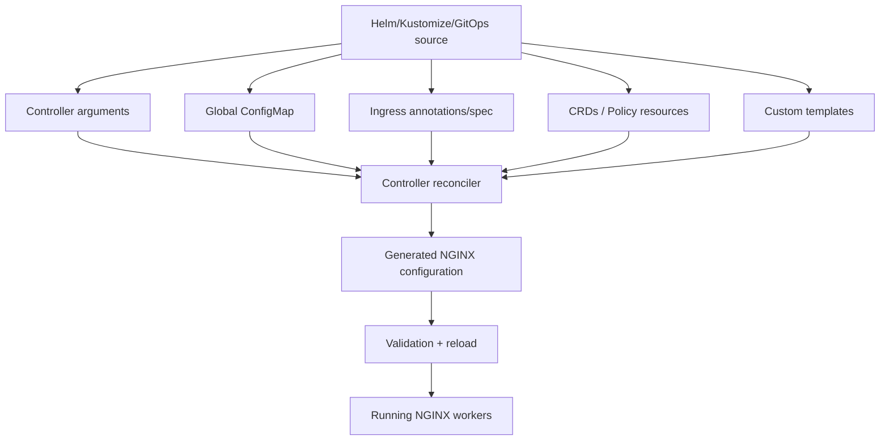
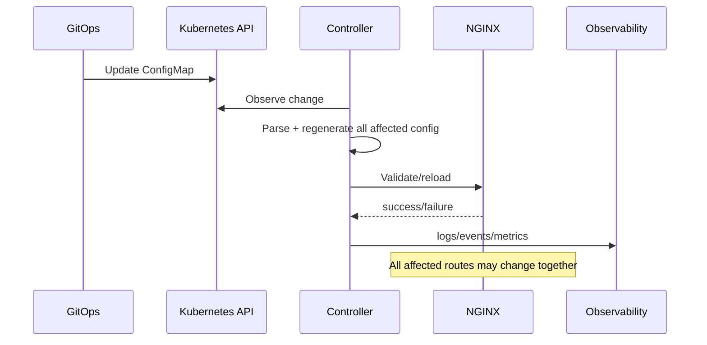

# Part 020 — Annotations, Global Config, Precedence, and Governance

> **Depth level:** Production/Architecture-level  
> **Prerequisite:** Part 003, 012–014, dan 018–019; dasar Kubernetes ConfigMap, RBAC, admission control, Helm, GitOps, NGINX directive contexts, dan multi-team platform operation.  
> **Scope:** controller flags, Helm values, global ConfigMap, Ingress annotations, CRDs/Policy resources, snippets, custom templates, precedence, validation, type/unit semantics, configuration ownership, multi-tenancy, guardrails, policy-as-code, exceptions, drift, migration, observability, failure modes, PR review, dan internal verification.  
> **Bukan scope utama:** detailed host/path routing—Part 019; choosing Gateway API/API Gateway/service mesh—Part 021; full configuration CI/GitOps implementation—Part 029; progressive rollout—Part 030; complete security/compliance evidence review—Part 033.

---

## Current ecosystem note — 11 July 2026

Annotation keys and ConfigMap fields are **controller APIs**, not Kubernetes Ingress standards.

Examples:

```text
nginx.ingress.kubernetes.io/*
nginx.org/*
nginx.com/*
```

These prefixes represent different projects/products and must not be mixed.

- The community `ingress-nginx` project was retired on **24 March 2026**. Its documentation remains relevant for installed legacy systems and migration inventory, but no further releases, bug fixes, or security updates are expected.
- F5 NGINX Ingress Controller is a separate actively versioned controller with `nginx.org/*`, `nginx.com/*`, CRDs, Policy resources, command-line flags, and product-specific validation.
- Kubernetes Ingress itself does not define timeout, body size, buffering, auth, canary, snippets, or NGINX-specific behavior.

> **Primary rule:** Never review an annotation by name alone. First resolve controller distribution, exact version, edition, scope, default, accepted syntax, generated directive, and security risk.

---

## Daftar isi

1. [Tujuan pembelajaran](#tujuan-pembelajaran)
2. [Executive mental model](#executive-mental-model)
3. [Configuration is a layered system](#configuration-is-a-layered-system)
4. [The configuration surface inventory](#the-configuration-surface-inventory)
5. [Controller command-line arguments](#controller-command-line-arguments)
6. [Helm values](#helm-values)
7. [Global ConfigMap](#global-configmap)
8. [Ingress annotations](#ingress-annotations)
9. [CRDs and Policy resources](#crds-and-policy-resources)
10. [Snippets](#snippets)
11. [Custom templates](#custom-templates)
12. [Generated runtime configuration](#generated-runtime-configuration)
13. [Effective configuration equation](#effective-configuration-equation)
14. [Precedence is controller-specific](#precedence-is-controller-specific)
15. [Scope is as important as precedence](#scope-is-as-important-as-precedence)
16. [Configuration scope matrix](#configuration-scope-matrix)
17. [Global defaults](#global-defaults)
18. [Per-Ingress overrides](#per-ingress-overrides)
19. [Per-host and per-location coupling](#per-host-and-per-location-coupling)
20. [Controller flags that change annotation semantics](#controller-flags-that-change-annotation-semantics)
21. [Value parsing and Kubernetes string annotations](#value-parsing-and-kubernetes-string-annotations)
22. [Boolean parsing](#boolean-parsing)
23. [Duration and timeout units](#duration-and-timeout-units)
24. [Size units](#size-units)
25. [Lists and comma-separated values](#lists-and-comma-separated-values)
26. [Invalid annotation behavior](#invalid-annotation-behavior)
27. [Unknown annotation behavior](#unknown-annotation-behavior)
28. [Common annotation categories](#common-annotation-categories)
29. [Timeout annotations](#timeout-annotations)
30. [Body-size annotations](#body-size-annotations)
31. [Buffering annotations](#buffering-annotations)
32. [Rewrite annotations](#rewrite-annotations)
33. [Backend protocol annotations](#backend-protocol-annotations)
34. [TLS redirect annotations](#tls-redirect-annotations)
35. [CORS annotations](#cors-annotations)
36. [Authentication annotations](#authentication-annotations)
37. [Rate-limit annotations](#rate-limit-annotations)
38. [Header manipulation annotations](#header-manipulation-annotations)
39. [Observability annotations](#observability-annotations)
40. [Session and canary annotations](#session-and-canary-annotations)
41. [Controller-specific comparison examples](#controller-specific-comparison-examples)
42. [Why prefix substitution is not migration](#why-prefix-substitution-is-not-migration)
43. [ConfigMap global blast radius](#configmap-global-blast-radius)
44. [ConfigMap change lifecycle](#configmap-change-lifecycle)
45. [ConfigMap schema and documentation drift](#configmap-schema-and-documentation-drift)
46. [Snippet mental model](#snippet-mental-model)
47. [Server snippet](#server-snippet)
48. [Location/configuration snippet](#locationconfiguration-snippet)
49. [HTTP and stream snippets](#http-and-stream-snippets)
50. [Why snippets are dangerous](#why-snippets-are-dangerous)
51. [Snippet security boundary](#snippet-security-boundary)
52. [Snippet operational blast radius](#snippet-operational-blast-radius)
53. [Snippet enablement defaults](#snippet-enablement-defaults)
54. [Annotation risk levels](#annotation-risk-levels)
55. [Annotation value blocklists](#annotation-value-blocklists)
56. [Admission-time governance](#admission-time-governance)
57. [ValidatingAdmissionPolicy](#validatingadmissionpolicy)
58. [OPA Gatekeeper, Kyverno, and admission webhooks](#opa-gatekeeper-kyverno-and-admission-webhooks)
59. [RBAC as the first guardrail](#rbac-as-the-first-guardrail)
60. [Namespace and domain ownership policy](#namespace-and-domain-ownership-policy)
61. [Paved-road configuration](#paved-road-configuration)
62. [Platform defaults and service profiles](#platform-defaults-and-service-profiles)
63. [Exception process](#exception-process)
64. [Configuration ownership model](#configuration-ownership-model)
65. [Risk classification](#risk-classification)
66. [Change review matrix](#change-review-matrix)
67. [Configuration drift](#configuration-drift)
68. [Rendered versus live versus generated state](#rendered-versus-live-versus-generated-state)
69. [Migration between controllers](#migration-between-controllers)
70. [Compatibility contract](#compatibility-contract)
71. [Security concerns](#security-concerns)
72. [Performance concerns](#performance-concerns)
73. [Observability and auditability](#observability-and-auditability)
74. [Java/JAX-RS implications](#javajax-rs-implications)
75. [Failure-mode catalogue](#failure-mode-catalogue)
76. [Systematic debugging workflow](#systematic-debugging-workflow)
77. [Validation strategy](#validation-strategy)
78. [PR review checklist](#pr-review-checklist)
79. [Internal verification checklist](#internal-verification-checklist)
80. [Hands-on exercises](#hands-on-exercises)
81. [Ringkasan invariants](#ringkasan-invariants)
82. [Referensi resmi](#referensi-resmi)

---

## Tujuan pembelajaran

Setelah menyelesaikan part ini, Anda harus mampu:

1. memetakan seluruh configuration surface yang memengaruhi NGINX Ingress runtime;
2. membedakan controller flags, Helm values, ConfigMap, annotation, CRD/Policy, snippet, template, dan generated config;
3. menentukan scope dan effective setting ketika beberapa layer bertabrakan;
4. menghindari asumsi precedence universal;
5. mereview annotation berdasarkan exact controller/version/edition;
6. menemukan parsing error pada boolean, duration, size, list, dan enum;
7. menilai global blast radius dari ConfigMap atau controller-flag change;
8. menjelaskan mengapa snippets setara dengan delegated NGINX programming capability;
9. membangun admission policy, RBAC, paved road, dan exception workflow;
10. mengklasifikasikan perubahan berdasarkan security, availability, performance, dan compatibility risk;
11. mendeteksi drift antara source, rendered manifest, live resource, dan generated NGINX config;
12. merencanakan migration dari controller lama tanpa prefix-substitution fallacy;
13. menghubungkan edge configuration dengan Java/JAX-RS behavior;
14. menyusun PR review dan **Internal verification checklist** yang dapat dipakai tim platform/backend.

---

## Executive mental model

Ingress configuration is not one file.



### Core proposition

> The effective behavior is a compiled result of multiple configuration surfaces, each with its own scope, ownership, validation, precedence, and blast radius.

---

## Configuration is a layered system

A practical model:

```text
EffectiveBehavior =
  controller binary capabilities
+ controller command-line flags
+ controller edition/license
+ controller global ConfigMap
+ IngressClass/controller parameters
+ Ingress spec
+ annotations
+ referenced Policies/CRDs
+ snippets/custom templates
+ runtime object state
+ generated NGINX config
```

This is not simple arithmetic. Some layers:

- override;
- merge;
- append;
- disable;
- reject;
- alter how lower layers are interpreted;
- are unavailable in certain editions;
- trigger global regeneration.

---

## The configuration surface inventory

| Surface | Typical owner | Scope | Risk |
|---|---|---|---|
| controller image/version | platform | controller fleet | capability/security |
| command-line args | platform | controller instance | global behavior |
| Helm values | platform/GitOps | rendered release | hidden indirection |
| ConfigMap | platform | usually global | broad blast radius |
| Ingress spec | service team | route | portable subset |
| annotations | service/platform | route/server/location | controller lock-in |
| CRD/Policy | platform/service | explicit policy/route | better structure but product-specific |
| snippets | privileged expert | raw NGINX context | critical |
| custom templates | controller maintainer | all generated config | extreme |
| live patches | operator | mutable runtime object | drift |
| generated config | controller | runtime truth | evidence, not source |

Inventory all surfaces before claiming “the timeout is 60 seconds.”

---

## Controller command-line arguments

Controller flags can define:

- watched IngressClass;
- watched namespaces;
- ConfigMap reference;
- default TLS Secret;
- default backend;
- snippets enabled/disabled;
- cross-namespace behavior;
- status publication;
- leader election;
- annotation validation mode;
- custom template path;
- NGINX Plus mode;
- health/metrics endpoints;
- reload timeout;
- default listener ports.

A command-line flag can make the same Ingress resource behave differently across clusters.

Example conceptual Deployment arguments:

```yaml
args:
  - -ingress-class=nginx
  - -nginx-configmaps=ingress-system/nginx-config
  - -default-server-tls-secret=ingress-system/default-tls
  - -enable-leader-election
```

Exact syntax differs by controller.

### Review rule

Controller args are part of the platform API contract. They must be:

- version-controlled;
- documented;
- reviewed;
- included in upgrade testing;
- visible in runtime inventory.

---

## Helm values

Helm values may generate:

- controller args;
- ConfigMap keys;
- Service type/annotations;
- RBAC;
- admission webhook;
- metrics;
- pod security context;
- NGINX image/module selection;
- snippet enablement;
- default IngressClass.

The value name is not necessarily the runtime setting name.

Evidence chain:

```text
values.yaml
-> chart templates
-> rendered Deployment/ConfigMap
-> live resources
-> controller process arguments
-> generated NGINX config
```

Reviewing only `values.yaml` can miss:

- chart default;
- environment override;
- post-render patch;
- GitOps mutation;
- operator/webhook mutation;
- live drift.

---

## Global ConfigMap

A controller ConfigMap typically defines global defaults such as:

- proxy timeouts;
- body size;
- buffering;
- log format;
- real IP/trusted proxies;
- TLS protocols/ciphers;
- keepalive;
- worker settings;
- headers;
- rate-limit defaults;
- annotation risk policy;
- snippet settings;
- observability.

For F5 NGINX Ingress Controller, documented ConfigMap settings apply globally, while supported annotations can override corresponding settings for a specific Ingress.

For community `ingress-nginx`, ConfigMap keys also represented controller-wide behavior, with controller-specific annotation override/inheritance rules.

### Principle

> A ConfigMap change is a platform change, even when the diff is one line.

---

## Ingress annotations

Kubernetes annotations are string key/value metadata.

They are not typed API fields.

```yaml
metadata:
  annotations:
    nginx.org/proxy-read-timeout: "30s"
```

or legacy community example:

```yaml
metadata:
  annotations:
    nginx.ingress.kubernetes.io/proxy-read-timeout: "30"
```

These may represent similar intent but different syntax and implementation.

Annotations can:

- customize route behavior;
- override a global default;
- enable features;
- reference another resource;
- inject raw config;
- alter host-wide generated config;
- be ignored/rejected if invalid or unsupported.

---

## CRDs and Policy resources

Structured controller APIs can be preferable to annotations when they provide:

- typed schema;
- explicit nesting;
- reusable policy;
- status/conditions;
- reference semantics;
- better validation;
- clear ownership.

F5 NGINX Ingress Controller exposes resources such as:

- `VirtualServer`;
- `VirtualServerRoute`;
- `TransportServer`;
- `Policy`;
- product integrations/CRDs.

Benefits over annotation sprawl:

```text
typed structure
+ explicit route/action/policy
+ easier review
+ better reuse
```

Trade-off:

```text
controller/product lock-in
+ CRD upgrade lifecycle
+ migration work
```

---

## Snippets

Snippets insert raw NGINX directives into generated configuration contexts.

Examples by controller may include:

- server snippets;
- location/configuration snippets;
- HTTP snippets;
- stream snippets;
- main snippets.

Snippets bypass the abstraction boundary.

Conceptually:

```text
Ingress author
-> raw NGINX programming capability
-> shared controller data plane
```

Treat snippets as privileged code execution within the NGINX configuration domain.

---

## Custom templates

Custom templates modify how the controller renders NGINX config globally.

They can:

- implement unsupported features;
- alter every route;
- create custom annotations;
- change defaults;
- break controller upgrade compatibility;
- bypass normal validation;
- make upstream documentation inaccurate.

A custom template turns the organization into a partial controller maintainer.

Require:

- strong ownership;
- tests;
- version pinning;
- diff against upstream templates;
- upgrade plan;
- security review;
- generated-config regression tests.

---

## Generated runtime configuration

Generated NGINX config is the effective result the worker actually uses.

It answers:

- which `server` owns a host;
- which `location` matches;
- which timeout is emitted;
- whether buffering is enabled;
- which headers are set/hidden;
- whether snippets landed;
- which upstreams/endpoints exist;
- which TLS certificate is referenced;
- whether config is syntactically valid.

Generated config is evidence, but direct manual edits are usually ephemeral and prohibited.

---

## Effective configuration equation

For one route/setting:

```text
Effective(route, setting) =
  Resolve(
    binary capability,
    edition,
    controller flags,
    global defaults,
    class parameters,
    resource annotations,
    attached policy,
    snippets,
    merge/conflict rules,
    runtime references
  )
```

You need two outputs:

```text
effective value
provenance/source
```

Example:

```text
proxy_read_timeout = 90s
source = annotation on quote/quote-api
global default = 60s
controller = F5 NIC 5.x
generated directive = proxy_read_timeout 90s
```

Without provenance, operations cannot explain why behavior changed.

---

## Precedence is controller-specific

Do not invent a universal hierarchy such as:

```text
annotation always beats ConfigMap
```

That statement may be true for a specific supported key/controller, but not for:

- every field;
- every controller;
- snippets;
- policies;
- command flags;
- host-shared behavior;
- CRDs;
- invalid values;
- version changes.

For F5 NGINX Ingress Controller, documentation states that supported annotations take priority over corresponding ConfigMap settings. Still verify:

- key mapping exists;
- value valid;
- feature supported by edition;
- resource accepted;
- generated directive.

### Correct review language

```text
For controller X version Y, annotation A overrides ConfigMap key C
for this route, as confirmed by documentation and generated config.
```

---

## Scope is as important as precedence

A lower-precedence global setting can affect more traffic than a higher-precedence route override.

Example:

```text
ConfigMap proxy-read-timeout = 60s  -> all routes by default
Ingress A annotation = 300s        -> one route
Ingress B no annotation            -> remains 60s
```

Another example:

```text
server-snippet on one Ingress sharing host
-> generated server-level directive
-> may affect paths from other Ingress resources
```

Precedence without scope analysis is incomplete.

---

## Configuration scope matrix

| Scope | Examples | Blast radius |
|---|---|---|
| controller process | class, watch namespace, snippets, templates | all watched resources |
| `http` context | log format, maps, zones, global snippets | all virtual servers |
| listener/default server | ports, default TLS | all unmatched/selected connections |
| host/server | redirect, TLS, server headers | all paths on host |
| location/path | timeout, rewrite, buffering | matched route |
| upstream | LB method, keepalive, TLS | backend group |
| request | canary selector, auth result | one request |
| namespace/resource | policy/reference | implementation-specific |

Always map an annotation or ConfigMap key to generated NGINX context.

---

## Global defaults

Good defaults should be:

- secure;
- conservative;
- observable;
- compatible with most services;
- documented;
- not silently permissive;
- easy to override through approved profiles;
- version-tested.

Examples of platform defaults:

- unknown host returns minimal 404;
- TLS 1.2/1.3;
- request body size limit;
- bounded timeout;
- access log schema;
- request ID;
- proxy header sanitation;
- snippets disabled;
- annotation risk threshold;
- HTTPS redirect policy;
- trusted proxy ranges;
- no server tokens;
- safe buffering baseline.

A default should not attempt to optimize every workload.

---

## Per-Ingress overrides

Overrides are justified when workload contract differs:

- large controlled upload;
- SSE route;
- long-running export;
- gRPC streaming;
- partner-specific mTLS;
- callback exact path;
- lower body limit for sensitive endpoint.

Every override should include:

```text
reason
owner
scope
risk
measurement
expiry/review date
rollback
```

Avoid “copy from another service” annotations.

---

## Per-host and per-location coupling

An annotation stored on one Ingress can compile into:

- `server` context;
- `location` context;
- upstream context.

If multiple Ingress resources share a host, a server-level annotation can affect routes owned by other resources.

Examples to investigate:

- server snippets;
- SSL redirect;
- regex mode;
- authentication;
- response headers;
- TLS config;
- CORS;
- custom errors.

The resource boundary may not equal runtime scope.

---

## Controller flags that change annotation semantics

Examples of global switches:

- allow snippets;
- allow cross-namespace references;
- annotation risk threshold;
- annotation value blocklist;
- enable custom resources;
- enable preview/experimental features;
- default IngressClass;
- watch Ingress without class;
- enable TLS passthrough;
- enable OTel;
- enable WAF integration.

A route manifest can remain unchanged while a controller flag change activates or disables behavior.

Therefore, configuration contract must include controller deployment state.

---

## Value parsing and Kubernetes string annotations

Annotation values are strings:

```yaml
some.example/enabled: "true"
some.example/timeout: "30s"
some.example/body-size: "10m"
```

Potential failures:

- omitted quotes interpreted by YAML unexpectedly before serialization;
- unsupported unit;
- whitespace;
- capitalization;
- invalid enum;
- comma escaping;
- newline block scalar;
- duplicate semantic keys under different prefixes;
- templating emits empty string.

Use quoted values consistently, but remember quoting does not validate semantics.

---

## Boolean parsing

Potential accepted values differ:

```text
true / false
"true" / "false"
on / off
yes / no
```

Never assume all are equivalent.

F5 NGINX Ingress Controller documentation demonstrates validation that can reject invalid boolean-like values and emit a `Rejected` Event.

Policy:

```text
Use only documented canonical values.
```

Do not use:

```yaml
redirect-to-https: "yes please"
```

even if a template linter accepts it as a string.

---

## Duration and timeout units

A major migration trap:

- one controller may expect a numeric string interpreted as seconds;
- another may accept NGINX time syntax such as `30s`, `2m`;
- CRD fields may have their own duration schema.

Example intent:

```text
proxy read timeout = 60 seconds
```

Possible syntax:

```yaml
nginx.ingress.kubernetes.io/proxy-read-timeout: "60"
```

versus:

```yaml
nginx.org/proxy-read-timeout: "60s"
```

Do not copy the value unchanged without checking syntax.

Also distinguish:

- idle gap timeout;
- total deadline;
- connect timeout;
- read timeout;
- send timeout;
- LB idle timeout;
- Java downstream timeout.

---

## Size units

Possible values:

```text
1m
10m
512k
0
```

Questions:

- decimal or binary interpretation?
- does `0` disable limit?
- maximum accepted?
- route or global scope?
- memory buffer or body limit?
- temporary file behavior?
- upstream/app limit lower than ingress?

Body-size override without Java/server/storage review is incomplete.

---

## Lists and comma-separated values

Annotations may encode:

- header names;
- methods;
- CIDRs;
- policy references;
- protocols;
- error status lists;
- cipher lists.

Risks:

- whitespace changes parsing;
- commas inside value;
- Helm/YAML quoting;
- case sensitivity;
- invalid item causes whole annotation rejection;
- list order changes behavior;
- duplicate values.

Prefer typed Policy/CRD fields when available.

---

## Invalid annotation behavior

Possible controller behavior:

- reject Ingress and remove its generated config;
- ignore invalid annotation but keep route;
- use default;
- emit Event;
- log warning;
- admission webhook rejects create/update;
- last-known-good config continues;
- unrelated config update blocked by invalid snippet.

F5 NGINX Ingress Controller documents validation and `Rejected` Events; an existing Ingress made invalid can have its corresponding configuration removed.

This can turn a typo into an outage.

---

## Unknown annotation behavior

Unknown annotation may be:

- ignored;
- logged;
- rejected by policy;
- accepted by API but has no effect;
- interpreted by another controller;
- left as migration residue.

Danger:

```text
annotation typo -> no override -> global default remains
```

The application may fail only under production traffic.

Create lint rules for allowed annotation keys.

---

## Common annotation categories

| Category | Example intent | Main risk |
|---|---|---|
| timeout | long request | resource exhaustion |
| body size | upload | memory/disk/DoS |
| buffering | streaming | capacity/latency |
| rewrite | base path | routing/security |
| protocol | HTTPS/gRPC | 502/protocol failure |
| redirect | force HTTPS | loops/client behavior |
| CORS | browser access | origin exposure |
| auth | external auth/mTLS | trust bypass |
| rate limit | protect backend | false positives/state scope |
| headers | security/identity | spoofing/inheritance |
| observability | logs/traces | PII/cardinality |
| affinity | sticky sessions | imbalance/state |
| canary | progressive traffic | compatibility |
| snippets | arbitrary directives | critical |

---

## Timeout annotations

Review:

- connect/send/read separately;
- units;
- idle versus total semantics;
- gRPC mappings;
- WebSocket/SSE;
- upstream retry;
- LB idle timeout;
- Java request/downstream timeout;
- maximum allowed by platform.

Bad override:

```yaml
proxy-read-timeout: "3600"
```

without justification can pin connections for an hour and hide slow/failing upstreams.

Approved profile example:

```text
default API: 60s
SSE: 1h idle with capacity controls
async export start endpoint: 30s
file transfer: route-specific measured timeout
```

---

## Body-size annotations

Review end-to-end limits:

```text
cloud LB
-> ingress client_max_body_size
-> request buffering/temp storage
-> servlet/JAX-RS multipart limit
-> application validation
-> object storage
```

A larger ingress limit can move the failure to Java heap/temp disk.

Prefer direct-to-object-storage for very large uploads when architecture allows.

---

## Buffering annotations

Common intent:

- disable response buffering for SSE;
- disable request buffering for streaming upload;
- tune proxy buffers for large headers/responses.

Risks:

- slow clients hold upstream connections;
- ingress memory/disk usage;
- temp file exhaustion;
- connection capacity;
- unexpected latency;
- backend backpressure.

Buffering overrides require capacity review, not only functional testing.

---

## Rewrite annotations

Review:

- pathType;
- regex/capture groups;
- target;
- query preservation;
- external/upstream URI;
- Java base path;
- redirects/cookies;
- sibling routes;
- controller migration.

Rewrite is a compatibility contract and a security boundary.

---

## Backend protocol annotations

Examples differ by controller:

- legacy community `backend-protocol`;
- F5 service-specific HTTPS/gRPC annotations or CRD fields.

Review:

- HTTP/HTTPS/gRPC/GRPCS;
- h2 versus h2c;
- SNI;
- CA trust;
- verification;
- client certificate;
- Service port;
- health checks.

A copied annotation with the wrong prefix can silently leave HTTP default and produce 502.

---

## TLS redirect annotations

Potential controls:

- redirect when TLS exists;
- force redirect even without TLS section;
- redirect based on forwarded proto;
- preserve method with 308;
- use 301/302;
- exclude health path;
- avoid loop behind TLS-terminating external LB.

Review proxy trust:

```text
external LB terminates TLS
-> sends HTTP to ingress
-> X-Forwarded-Proto=https
```

If ingress does not trust/interpret the correct header, it can redirect indefinitely.

---

## CORS annotations

CORS is easy to configure inconsistently across:

- ingress;
- API gateway;
- Java filter;
- framework;
- CDN.

Define one owner.

Review:

- exact allowed origins;
- wildcard with credentials prohibition;
- methods;
- headers;
- exposed headers;
- preflight max age;
- OPTIONS routing;
- Vary: Origin;
- tenant/environment origin differences.

CORS is a browser policy, not backend authentication.

---

## Authentication annotations

Potential features:

- Basic Auth;
- external auth URL;
- OAuth2 proxy;
- mTLS;
- JWT;
- policy reference.

Review:

- feature availability by edition;
- fail-open versus fail-closed;
- identity header sanitation;
- auth timeout/cache;
- callback route;
- 401 versus 403;
- direct Service bypass;
- Java authorization ownership.

Do not let annotation-based edge auth replace domain authorization.

---

## Rate-limit annotations

Review:

- key;
- rate;
- burst;
- delay;
- rejection status;
- replica-local versus distributed state;
- source IP trust/NAT;
- HPA effect;
- tenant/user identity;
- Retry-After;
- metrics.

A per-replica limiter does not create a cluster-global quota.

---

## Header manipulation annotations

Potential actions:

- add response headers;
- hide upstream headers;
- pass selected headers;
- set request headers;
- identity propagation;
- security headers.

Risks:

- spoofed identity;
- duplicate headers;
- `add_header` inheritance surprises;
- hop-by-hop header misuse;
- cache variation;
- CORS conflicts;
- leaking internal headers.

Create an allowlist for identity/security-sensitive header operations.

---

## Observability annotations

Potential controls:

- enable/disable access log;
- rewrite log;
- OTel;
- sampling;
- operation name;
- log format via ConfigMap;
- custom error logging.

Review:

- PII/secrets;
- cardinality;
- storage cost;
- trace trust;
- route labels;
- consistency across services;
- incident needs.

A service team should not be able to disable mandatory audit/access logging without an approved exception.

---

## Session and canary annotations

Review:

- cookie security attributes;
- route Path/Domain;
- canary selector precedence;
- header/cookie trust;
- weight;
- stable versus sticky behavior;
- backend compatibility;
- metrics;
- rollback;
- controller-specific behavior.

Part 019 contains detailed routing semantics.

---

## Controller-specific comparison examples

The following table illustrates why documentation source matters.

| Intent | Retired community ingress-nginx example | F5 NGINX Ingress Controller example | Portability |
|---|---|---|---|
| read timeout | `nginx.ingress.kubernetes.io/proxy-read-timeout: "60"` | `nginx.org/proxy-read-timeout: "60s"` | no |
| body size | `nginx.ingress.kubernetes.io/proxy-body-size: "10m"` | `nginx.org/client-max-body-size: "10m"` | no |
| rewrite | `nginx.ingress.kubernetes.io/rewrite-target: "/$2"` | controller-specific rewrite annotation/CRD field | no |
| backend HTTPS | `backend-protocol: "HTTPS"` | `nginx.org/ssl-services` or structured field | no |
| location snippet | `configuration-snippet` | `nginx.org/location-snippets` | no |
| server snippet | `server-snippet` | `nginx.org/server-snippets` | no |
| path regex | `use-regex: "true"` | `nginx.org/path-regex: "case_sensitive"` | no |
| sticky cookie | affinity/session annotations | `nginx.org/sticky-cookie-services` or Policy/CRD | no |
| active health check | not equivalent baseline | `nginx.com/*` Plus feature | no |

This is an orientation table, not a migration script. Verify exact versions.

---

## Why prefix substitution is not migration

Incorrect migration method:

```text
replace nginx.ingress.kubernetes.io/ with nginx.org/
```

Why it fails:

- different key names;
- different value syntax;
- different default;
- different generated context;
- different feature availability;
- different edition requirement;
- different validation;
- different merge behavior;
- no equivalent annotation;
- equivalent capability may require CRD/Policy/snippet.

Migration unit should be:

```text
behavioral contract + executable tests
```

not annotation text.

---

## ConfigMap global blast radius

A single change can affect:

- every host;
- every route without override;
- controller reload;
- worker memory;
- log volume;
- TLS compatibility;
- real client IP;
- request limits;
- timeout;
- snippets;
- security policy.

Examples of high-risk ConfigMap changes:

- trusted proxy CIDRs;
- TLS protocols/ciphers;
- global log format;
- global body size;
- proxy buffering;
- worker processes/connections;
- HTTP snippets;
- annotation risk level;
- allow snippets;
- custom error handling;
- proxy headers.

Require platform review and staged rollout.

---

## ConfigMap change lifecycle



Safe process:

1. render and lint;
2. compare effective defaults;
3. identify affected routes;
4. test representative workloads;
5. deploy to lower environment;
6. stage/canary controller fleet where possible;
7. monitor reload and SLO;
8. rollback quickly.

---

## ConfigMap schema and documentation drift

Risks:

- key renamed/deprecated;
- default changed;
- key ignored in new version;
- unit semantics changed;
- chart maps value to different key;
- stale key remains with no effect;
- custom template overrides behavior;
- controller fork adds private keys.

Create an automated unknown/deprecated key check against the exact controller version.

Do not trust a ConfigMap merely because the controller starts.

---

## Snippet mental model

A snippet is not “an advanced annotation.”

It is:

```text
raw directive injection into controller-generated NGINX configuration
```

Capabilities may include:

- new locations;
- file access;
- upstream proxying;
- header manipulation;
- variable/maps;
- auth bypass;
- certificate/key exposure depending context;
- resolver/network access;
- Lua/module behavior if available.

Security review must treat snippet authors as highly privileged.

---

## Server snippet

Inserted into generated `server` context.

Potential uses:

- custom response header;
- special redirect;
- deny path;
- custom error behavior.

Risks:

- affect all locations on host;
- conflict with generated locations;
- create shadow routes;
- override security behavior;
- break config;
- leak certificates/internal files depending directive availability.

Prefer supported annotations/Policy/CRD.

---

## Location/configuration snippet

Inserted into route `location`.

Potential uses:

- custom header;
- special rewrite;
- cache control;
- module directive.

Risks:

- duplicate `proxy_pass`;
- override generated proxy headers;
- bypass auth;
- change URI;
- internal redirect loop;
- break streaming;
- unsupported directive context;
- migration lock-in.

A “small” location snippet can invalidate the entire generated config.

---

## HTTP and stream snippets

These can affect controller-global contexts.

Potential blast radius:

```text
all hosts / all routes / all TCP streams
```

Examples:

- `map`;
- shared rate zones;
- custom log format;
- resolver;
- stream server;
- global headers/modules.

These should normally be owned only by the platform/controller maintainers.

---

## Why snippets are dangerous

F5 NGINX Ingress Controller documentation explicitly warns that snippets:

- require deep understanding of NGINX and generated templates;
- reduce robustness;
- can invalidate configuration and block subsequent updates;
- have security implications;
- are disabled by default and require explicit enablement.

Community ingress-nginx historically also treated snippet annotations as high/critical risk and provided global controls such as `allow-snippet-annotations`.

### Production principle

> If a requirement needs a snippet, first ask whether the platform API is missing a reusable supported capability.

---

## Snippet security boundary

Attack paths include:

- read/serve sensitive files;
- expose TLS keys or ServiceAccount credentials;
- proxy to metadata/internal services;
- inject identity headers;
- bypass auth/rate limits;
- create arbitrary routes;
- hide logs;
- alter error behavior;
- exploit module/parser vulnerabilities.

Controls:

- snippets disabled by default;
- restricted RBAC;
- annotation allowlist;
- admission rejection;
- separate trusted controller/class;
- generated-config scanning;
- mandatory security review;
- no untrusted multi-tenant snippet authors.

---

## Snippet operational blast radius

An invalid snippet can:

- reject one resource;
- remove route;
- prevent global reload;
- leave stale config;
- block unrelated updates;
- crash/restart controller/NGINX;
- create config divergence between replicas.

Test:

```bash
nginx -t
```

on representative generated config is necessary but not sufficient. Also test semantic conflicts and controller reconciliation.

---

## Snippet enablement defaults

Verify exact controller/version.

Documented examples:

- F5 NGINX Ingress Controller snippets are disabled by default and require the controller `enable-snippets` argument.
- Community ingress-nginx ConfigMap historically used `allow-snippet-annotations`, defaulting to `false` in documented configuration.

Do not assume chart defaults or existing cluster values.

A migration or chart upgrade can change snippet enablement and either:

- silently disable required behavior;
- newly enable a security-sensitive surface.

---

## Annotation risk levels

Community ingress-nginx historical controls categorized annotations by risk, including `Critical` for snippet-like capabilities.

A ConfigMap setting such as `annotations-risk-level` could define the highest accepted risk.

Governance lesson independent of controller:

```text
not all annotations are equal
```

Build organization-specific tiers:

- low: local timeout within bounds;
- medium: body/buffering/CORS;
- high: auth/TLS/proxy identity;
- critical: snippets/custom templates/cross-namespace/unsafe module config.

---

## Annotation value blocklists

Legacy community controller exposed a blocklist mechanism for dangerous words/patterns related to annotation injection risks.

Blocklists are defense-in-depth, not a complete parser/security model.

Problems:

- bypass through encoding/alternate directives;
- false positives;
- incomplete list;
- custom template differences;
- overriding vendor default list incorrectly.

Prefer:

- disable dangerous surface;
- typed APIs;
- strict allowlist;
- admission validation;
- least privilege.

---

## Admission-time governance

Admission can reject unsafe resources before controller reconciliation.

Policies can enforce:

- approved IngressClass;
- host ownership;
- allowed annotation prefixes;
- allowed keys;
- timeout bounds;
- body-size bounds;
- snippets forbidden;
- TLS required;
- exact namespaces;
- no hostless routes;
- no `ImplementationSpecific` without exception;
- no cross-namespace reference;
- mandatory owner labels;
- required observability.

Admission is not a replacement for controller validation; both are needed.

---

## ValidatingAdmissionPolicy

Kubernetes ValidatingAdmissionPolicy uses CEL and can enforce native API admission rules without a custom webhook for supported use cases.

Illustrative policy to forbid common snippet annotations:

```yaml
apiVersion: admissionregistration.k8s.io/v1
kind: ValidatingAdmissionPolicy
metadata:
  name: ingress-no-snippets.example.com
spec:
  failurePolicy: Fail
  matchConstraints:
    resourceRules:
      - apiGroups: ["networking.k8s.io"]
        apiVersions: ["v1"]
        operations: ["CREATE", "UPDATE"]
        resources: ["ingresses"]
  validations:
    - expression: >
        !has(object.metadata.annotations) ||
        !(
          "nginx.ingress.kubernetes.io/configuration-snippet"
            in object.metadata.annotations ||
          "nginx.ingress.kubernetes.io/server-snippet"
            in object.metadata.annotations ||
          "nginx.org/location-snippets"
            in object.metadata.annotations ||
          "nginx.org/server-snippets"
            in object.metadata.annotations
        )
      message: "Raw NGINX snippets are not permitted on shared ingress classes."
```

This is an illustrative baseline. Validate CEL expression compatibility in your cluster and bind the policy with a `ValidatingAdmissionPolicyBinding`.

Better production design may use:

- parameter resources;
- namespace selectors;
- approved exception labels;
- audit mode before deny;
- clear remediation message.

---

## OPA Gatekeeper, Kyverno, and admission webhooks

Use an external policy engine when you need:

- richer reusable policy libraries;
- mutation/generation;
- inventory-aware constraints;
- reports;
- exception workflow;
- cross-resource checks;
- organization standardization.

Examples:

- Gatekeeper ConstraintTemplate;
- Kyverno ClusterPolicy;
- custom admission webhook.

Trade-offs:

- webhook availability;
- certificate lifecycle;
- policy latency;
- failurePolicy;
- operational ownership;
- policy drift;
- debugging complexity.

Fail-open versus fail-closed must be explicit.

---

## RBAC as the first guardrail

Admission policy helps only after identity reaches the API.

Start with least privilege:

- not every developer can edit shared ConfigMap;
- not every namespace can create Ingress for shared class;
- snippets require higher privilege;
- Secrets restricted;
- controller ServiceAccount has only required read/write access;
- custom templates/controller Deployments limited to platform maintainers.

Separate roles:

```text
route consumer
route owner
policy approver
controller operator
security reviewer
```

---

## Namespace and domain ownership policy

A robust policy maps:

```text
namespace/team/environment
-> allowed IngressClass
-> allowed DNS suffix/hosts
-> allowed annotation profile
-> allowed TLS issuer/Secret pattern
```

Example:

```text
quote-prod:
  class: nginx-internal
  hosts:
    - quote.internal.example.com
    - *.quote.internal.example.com
  snippets: forbidden
  maxBody: 20m
  maxReadTimeout: 120s
```

Prevent:

- cross-team host takeover;
- production namespace using dev class;
- public exposure of internal Service;
- wildcard overclaim;
- unauthorized certificate.

---

## Paved-road configuration

A paved road gives teams safe, supported choices.

Example profiles:

### Standard REST API

- Prefix/Exact paths only;
- TLS required;
- 60s timeout;
- 1–10 MB body;
- buffering on;
- request ID/logging on;
- no snippets;
- standard auth policy.

### Streaming API

- approved path;
- response buffering off;
- longer idle timeout;
- connection capacity review;
- dedicated dashboard.

### Large upload

- approved max body;
- temp storage/resource review;
- direct object-storage option evaluated;
- malware scanning contract.

### gRPC

- explicit backend protocol;
- HTTP/2;
- timeout and streaming profile;
- gRPC metrics.

Teams select a profile rather than inventing annotation sets.

---

## Platform defaults and service profiles

Implement profiles through one or more:

- Helm library chart;
- Kustomize component;
- CRD/Policy reference;
- admission mutation;
- reusable manifest template;
- dedicated IngressClass;
- Gateway API Policy attachment;
- documentation + CI validator.

Profile should declare:

```text
supported use case
effective settings
limits
security controls
observability
ownership
version
migration path
```

Avoid opaque magical mutation that teams cannot inspect.

---

## Exception process

Legitimate exceptions exist.

Required exception record:

- business/technical requirement;
- why standard profile fails;
- exact resource/route;
- risk assessment;
- security/performance review;
- owner;
- start and expiry date;
- monitoring;
- rollback;
- migration/removal plan.

Exceptions should expire automatically or trigger periodic review.

Permanent undocumented exception equals platform drift.

---

## Configuration ownership model

Suggested responsibility split:

| Area | Backend team | Platform/SRE | Security | Network/cloud |
|---|---|---|---|---|
| host/path intent | R | A/C | C | C |
| Service/port/protocol | R | C | C | I |
| controller version/args | I | R/A | C | C |
| global ConfigMap | I | R/A | C | C |
| snippets/templates | C | R/A | A/C | I |
| auth/TLS policy | C | R | A | C |
| DNS/LB | I/C | C | C | R/A |
| app authorization | R/A | I | C | I |
| observability/runbook | R/C | R/A | C | C |

Adapt to organization structure; keep ownership explicit.

---

## Risk classification

### Low

- route-local timeout within approved bound;
- body limit reduction;
- enable access log where standard;
- exact supported header addition.

### Medium

- timeout increase;
- body limit increase;
- buffering change;
- CORS change;
- custom error page;
- affinity.

### High

- backend TLS verification;
- auth;
- real IP/trusted proxy;
- rate-limit identity key;
- wildcard host;
- cross-namespace reference;
- canary control header.

### Critical

- snippet;
- custom template;
- annotation risk threshold relaxation;
- enabling snippets globally;
- controller-wide TLS/trust change;
- arbitrary module/Lua;
- default server behavior;
- shared identity header manipulation.

Risk determines required reviewers and rollout.

---

## Change review matrix

| Change | Functional test | Security review | Capacity test | Platform approval | Staged rollout |
|---|---:|---:|---:|---:|---:|
| route-local timeout decrease | yes | maybe | no | maybe | recommended |
| body limit increase | yes | yes | yes | yes | yes |
| CORS origin update | yes | yes | no | maybe | yes |
| auth annotation | yes | yes | maybe | yes | yes |
| global ConfigMap | yes | yes | yes | yes | mandatory |
| snippet | extensive | mandatory | as relevant | mandatory | mandatory |
| custom template | regression suite | mandatory | mandatory | mandatory | mandatory |
| controller flag/version | full suite | mandatory | mandatory | mandatory | mandatory |

---

## Configuration drift

Drift categories:

1. source repository differs from rendered manifest;
2. rendered manifest differs from live resource;
3. live resource differs from controller-observed cache;
4. live resource accepted but generated config differs due to validation/conflict;
5. generated config differs across replicas;
6. worker still serves old config after reload failure;
7. documentation/default catalogue differs from actual controller version.

Drift detection must cover more than Git versus Kubernetes YAML.

---

## Rendered versus live versus generated state

Use a four-state comparison:

```text
S1 = source intent
S2 = rendered desired resource
S3 = live Kubernetes object
S4 = generated NGINX config
S5 = observed request behavior
```

Possible discrepancies:

```text
S1 != S2  -> templating/values issue
S2 != S3  -> GitOps drift/mutation
S3 != S4  -> controller validation/conflict/capability issue
S4 != S5  -> stale worker, external hop, test tuple, runtime issue
```

This is a powerful debugging model.

---

## Migration between controllers

Migration inventory should classify every configuration item:

| Item | Standard Ingress | Annotation | ConfigMap | Snippet | CRD/Policy | Equivalent target |
|---|---:|---:|---:|---:|---:|---|
| path | yes | maybe regex | no | maybe | yes | map/test |
| timeout | no | yes | yes | yes | maybe | target-specific |
| auth | no | yes | maybe | yes | policy | redesign |
| canary | no | yes | no | yes | structured route | preserve semantics |
| CORS | no | yes | maybe | yes | policy | target-specific |
| WAF | no | product-specific | global | dangerous | policy | product decision |

Migration steps:

1. freeze current behavior with tests;
2. export all annotations/ConfigMap/flags/snippets/templates;
3. classify portable/nonportable;
4. map behavior, not names;
5. identify missing capability;
6. create target policies/routes;
7. dual-run/shadow where safe;
8. compare logs/metrics;
9. cut over;
10. remove old controller after rollback window.

---

## Compatibility contract

For every migrated setting document:

```text
source controller/version
source key/value
source generated directive
source default
target controller/version
target representation
target generated directive
known semantic difference
test cases
owner
```

Example:

```text
Intent: read timeout 60 seconds
Source: community ingress-nginx annotation numeric seconds
Target: F5 nginx.org annotation with NGINX duration syntax
Difference: validation and related gRPC directive behavior
Tests: idle gap at 55s/65s, long stream, upstream silence
```

---

## Security concerns

### Annotation injection

Untrusted user writes raw config or dangerous value.

Controls:

- RBAC;
- snippets disabled;
- allowlist;
- risk threshold;
- admission;
- generated-config scan.

### Identity header manipulation

Service team sets trusted identity header.

Controls:

- forbid sensitive header annotations;
- edge sanitization;
- platform-owned auth policy.

### Host and TLS takeover

Service claims unauthorized host/certificate.

Controls:

- domain policy;
- issuer/Secret policy;
- class separation.

### Real IP trust expansion

Global ConfigMap trusts broad CIDR.

Impact:

- spoofed client IP;
- bypass allowlist/rate limit;
- misleading logs.

### Global weakening

Change disables TLS/security headers/logging for all routes.

Controls:

- protected repository;
- mandatory reviewers;
- staged rollout;
- policy tests.

### Custom template supply chain

Template alters generated config outside normal abstraction.

Controls:

- signed source/image;
- upstream diff;
- restricted write;
- regression/security test.

---

## Performance concerns

Configuration can cause:

- excessive timeout/connections;
- large body/temp storage;
- buffering memory/disk pressure;
- high compression CPU;
- regex route cost;
- log explosion;
- trace cardinality;
- rate-limit zones memory;
- too many maps/zones;
- frequent global reload;
- controller reconciliation lag;
- uneven affinity;
- canary metric explosion.

Review effective fleet-wide impact:

```text
per-request cost
* concurrency
* number of routes
* number of controller replicas
```

A per-Ingress annotation can still multiply resource use at scale.

---

## Observability and auditability

### Required configuration-plane telemetry

- reconciliation success/failure;
- rejected resources;
- annotation validation error;
- reload success/failure/duration;
- generated config hash/version;
- controller version;
- ConfigMap/resource generation;
- webhook/admission rejection;
- policy audit result.

### Audit fields

For a change:

```text
who
what resource
old/new value
source commit
reviewers
timestamp
controller reaction
generated config hash
rollout result
rollback
```

### Dashboards

Track:

- route count;
- annotation count by key/risk;
- snippet usage;
- invalid/rejected Ingress;
- reload failures;
- ConfigMap changes;
- controller sync latency;
- config size;
- routes without TLS;
- host/path collisions;
- overrides beyond platform bounds.

---

## Java/JAX-RS implications

Annotation changes can alter application behavior without Java code changes.

| Edge setting | Java/JAX-RS impact |
|---|---|
| rewrite | resource path changes/404 |
| forwarded headers | generated URI/redirect/security |
| body limit | request rejected before application |
| buffering | streaming/backpressure |
| timeout | cancellation/duplicate work |
| retry | idempotency/side effects |
| auth | identity propagation |
| CORS | browser calls |
| response headers | caching/security |
| backend protocol | connection/TLS |
| affinity | state distribution |
| canary | version compatibility |
| compression | payload/CPU |
| rate limit | 429/retry behavior |

Backend teams must understand the effective edge contract even when platform owns controller config.

---

## Failure-mode catalogue

| Symptom | Likely configuration cause | Evidence |
|---|---|---|
| annotation has no effect | wrong prefix/key, unsupported version, override absent | live YAML, Events, generated config |
| route disappears | invalid annotation rejected resource | `kubectl describe`, controller log |
| all routes change | ConfigMap/controller flag/global snippet | change history, config diff |
| unrelated route breaks | shared host/server snippet/global reload | generated config, collision inventory |
| 502 after protocol annotation | wrong syntax/value/service port | error log, direct protocol test |
| redirect loop | forwarded proto/trust/SSL redirect conflict | headers, LB/ingress logs |
| upload 413 | lower limit at ingress/LB/app | status provenance, config |
| Java OOM/temp disk pressure | body/buffering override too high | pod/storage metrics |
| SSE delayed | buffering annotation absent/ignored | headers/timing/config |
| auth bypass | annotation missing/overridden/direct Service path | generated config, network test |
| client IP wrong | real-IP ConfigMap/trusted CIDR | access log, header chain |
| reload fails | invalid snippet/template/directive context | controller/NGINX error |
| changes remain stale | failed reload/controller reconcile | reload metrics/config hash |
| policy blocks deployment | admission rule or failurePolicy | API error/audit |
| migration changes timeout | unit/default difference | behavior tests |
| log costs spike | global format/debug/access annotation | log volume metrics |

---

## Systematic debugging workflow

### Step 1 — Identify controller contract

Record:

```text
distribution
version
edition
image digest
chart
IngressClass
annotation prefixes
documentation URL/version
```

### Step 2 — Capture all sources

```bash
kubectl -n ingress-system get deploy <controller> -o yaml
kubectl -n ingress-system get configmap <config> -o yaml
kubectl -n app get ingress <name> -o yaml
```

Also capture:

- Helm values;
- CRDs/Policies;
- custom templates;
- admission policies;
- Git commit.

### Step 3 — Check Events and admission errors

```bash
kubectl describe ingress -n app <name>
kubectl get events -n app --sort-by=.lastTimestamp
```

### Step 4 — Resolve precedence and scope

For the suspect setting:

```text
controller default
ConfigMap value
annotation value
Policy value
snippet/template
generated context
```

### Step 5 — Inspect generated config

Use controller-specific supported procedure.

Search for:

```text
server_name
location
proxy_read_timeout
client_max_body_size
proxy_buffering
auth_request
proxy_set_header
limit_req
```

### Step 6 — Compare replicas

Confirm generated config/hash is consistent across controller pods.

### Step 7 — Reproduce request

Use exact Host/SNI/path/method/body.

### Step 8 — Correlate telemetry

- controller validation log;
- reload log;
- NGINX access/error;
- Java logs/traces;
- Kubernetes metrics/events.

### Step 9 — Inspect source/render/live drift

Compare S1–S5 model.

### Step 10 — Fix at correct layer

Avoid patching another layer to compensate.

Example:

```text
annotation typo
-> fix annotation
not
-> increase application timeout and hide symptom
```

---

## Validation strategy

### Static validation

- YAML schema;
- allowed annotation keys;
- allowed value regex/enums;
- timeout/body bounds;
- forbidden snippets;
- required TLS/owner labels;
- host ownership;
- exact IngressClass.

### Render validation

- Helm template;
- Kustomize build;
- chart unit tests;
- compare environment overlays.

### Admission validation

- ValidatingAdmissionPolicy;
- Gatekeeper/Kyverno/webhook;
- controller admission webhook.

### Controller validation

- resource Events;
- logs;
- dry-run/lab controller;
- generated config.

### NGINX validation

```bash
nginx -t
```

against generated representative config where feasible.

### Behavioral validation

- host/path matrix;
- timeout boundary;
- body-size boundary;
- redirect;
- auth;
- streaming;
- canary;
- protocol;
- failure/rollback.

### Upgrade validation

Run the same suite against target controller/chart/NGINX version.

---

## PR review checklist

### Controller identity

- [ ] Exact controller/version/edition is named.
- [ ] Annotation documentation matches that controller.
- [ ] Feature is supported and not deprecated.
- [ ] Required module/license/flag is enabled.
- [ ] Community ingress-nginx usage has migration/support implications documented.

### Scope and precedence

- [ ] Setting scope is identified: global/server/location/upstream/request.
- [ ] Global default is known.
- [ ] Override precedence is verified from exact docs.
- [ ] Host-shared effects are considered.
- [ ] Generated directive/context is understood.
- [ ] No duplicate/conflicting key exists elsewhere.

### Value correctness

- [ ] Value is quoted.
- [ ] Unit/syntax is correct.
- [ ] Enum/list/boolean is valid.
- [ ] Bound is within platform policy.
- [ ] Zero/empty semantics are understood.
- [ ] Migration syntax differences are handled.

### Security

- [ ] No raw snippet unless formally approved.
- [ ] No identity header/auth bypass.
- [ ] No broad trusted-proxy expansion.
- [ ] No unauthorized host/TLS claim.
- [ ] CORS/auth/rate-limit changes reviewed.
- [ ] Secrets/PII are not logged.
- [ ] Admission/RBAC guardrails remain intact.

### Reliability and performance

- [ ] Timeout aligns end-to-end.
- [ ] Body/buffering change has resource analysis.
- [ ] Streaming/long-lived connection capacity reviewed.
- [ ] Global reload/blast radius understood.
- [ ] Failure behavior and fallback are defined.
- [ ] Rollback is prepared.

### Observability

- [ ] Controller rejection/reload can be observed.
- [ ] Effective config can be inspected.
- [ ] Route behavior has request-level evidence.
- [ ] Change has dashboard/alerts where needed.
- [ ] Audit trail identifies owner/commit.

### Java/JAX-RS

- [ ] Rewrite/base path remains correct.
- [ ] forwarded headers remain trusted/correct.
- [ ] application body/timeouts align.
- [ ] auth/identity contract remains safe.
- [ ] streaming/protocol behavior tested.
- [ ] canary versions are compatible.

### Governance

- [ ] Standard profile used where possible.
- [ ] Exception has owner/expiry.
- [ ] Required reviewers approve.
- [ ] Migration/upgrade impact documented.
- [ ] Source/render/live/generated validation passes.

---

## Internal verification checklist

### Exact platform identity

- [ ] Controller distribution.
- [ ] Controller version and image digest.
- [ ] NGINX OSS/Plus version.
- [ ] Helm chart/version.
- [ ] IngressClass names and owners.
- [ ] Controller command-line arguments.
- [ ] Watched namespaces/classes.
- [ ] Default TLS/default backend.
- [ ] Support status and owner.
- [ ] Migration plan for retired community ingress-nginx if present.

### Configuration inventory

- [ ] Helm values and environment overrides.
- [ ] Controller Deployment/DaemonSet.
- [ ] Global ConfigMaps.
- [ ] Ingress annotations by key and count.
- [ ] CRDs/Policy resources.
- [ ] snippets and custom templates.
- [ ] admission policies/webhooks.
- [ ] live manual patches.
- [ ] GitOps applications/repositories.
- [ ] rendered manifests.
- [ ] generated config access.

### Defaults and precedence

- [ ] Document effective default for timeout.
- [ ] Body limits.
- [ ] Buffering.
- [ ] TLS redirect.
- [ ] TLS protocols/ciphers.
- [ ] trusted proxies/real IP.
- [ ] auth/identity headers.
- [ ] rate limit.
- [ ] log format/request ID.
- [ ] keepalive/retry.
- [ ] annotation override rules.
- [ ] CRD/Policy precedence.
- [ ] host-shared behavior.

### Risky capabilities

- [ ] Are snippets enabled?
- [ ] Which snippet annotations/contexts are used?
- [ ] Who has RBAC to create/update them?
- [ ] Is annotation risk threshold configured?
- [ ] Is a blocklist configured?
- [ ] Are custom templates used?
- [ ] Are custom annotations implemented?
- [ ] Is cross-namespace configuration enabled?
- [ ] Are Plus-only features in use?
- [ ] Are WAF/Lua/third-party modules present?

### Policy governance

- [ ] Allowed annotation list.
- [ ] Timeout/body bounds.
- [ ] Host/domain ownership rules.
- [ ] TLS/issuer rules.
- [ ] Approved IngressClass by namespace/environment.
- [ ] Required owner labels.
- [ ] Snippet prohibition.
- [ ] Exception process and expiry.
- [ ] Admission failurePolicy.
- [ ] Policy audit/report dashboards.
- [ ] CODEOWNERS/reviewer requirements.
- [ ] production change windows.

### Drift and observability

- [ ] Compare source, rendered, live, generated.
- [ ] Compare generated config across replicas.
- [ ] Track config hashes.
- [ ] Alert on rejected Ingress.
- [ ] Alert on reload failure.
- [ ] Track controller sync latency.
- [ ] Audit ConfigMap/controller changes.
- [ ] Inventory unused/unknown annotations.
- [ ] Inventory deprecated keys.
- [ ] Locate previous ingress configuration incidents.
- [ ] Locate rollback/runbook.

### Java/JAX-RS contract

- [ ] Timeouts aligned with Java/downstream.
- [ ] Body/multipart limits aligned.
- [ ] Buffering/streaming aligned.
- [ ] forwarded headers and proxy trust aligned.
- [ ] auth identity propagation aligned.
- [ ] CORS ownership clear.
- [ ] rewrite/base path aligned.
- [ ] retry/idempotency aligned.
- [ ] gRPC/WebSocket/SSE profiles aligned.
- [ ] canary compatibility verified.

---

## Hands-on exercises

### Exercise 1 — Build configuration provenance

For one route, produce:

```text
setting
global default
annotation/Policy override
generated directive
runtime result
```

for timeout, body size, buffering, and auth.

### Exercise 2 — Invalid annotation

In a lab, apply an invalid boolean/duration. Observe API acceptance, admission response, Event, generated config, and traffic.

### Exercise 3 — Unknown annotation

Introduce a typo. Determine whether it is rejected, ignored, or logged.

### Exercise 4 — Global ConfigMap change

Change a safe test default and record affected routes, reconciliation, reload duration, and rollback.

### Exercise 5 — Scope collision

Use two Ingresses on one host with a server-level setting in a lab. Inspect effective scope.

### Exercise 6 — Snippet rejection

Verify platform policy rejects raw snippet annotations.

### Exercise 7 — Snippet failure

In an isolated non-production controller, inject an invalid directive and observe blast radius/recovery. Do not run on shared production.

### Exercise 8 — CEL policy

Create a ValidatingAdmissionPolicy that restricts annotation keys or timeout bounds. Test audit and deny modes.

### Exercise 9 — Drift

Manually patch a lab Ingress, then observe GitOps reconciliation and configuration hash.

### Exercise 10 — Cross-controller mapping

Choose five annotations and map source behavior to target controller representation. Record semantic gaps.

### Exercise 11 — Profile design

Design standard REST, streaming, upload, and gRPC service profiles with allowed overrides.

### Exercise 12 — Annotation inventory

Write a script that lists:

```text
controller class
namespace
Ingress
annotation key
value
risk category
owner
```

### Exercise 13 — Upgrade regression

Render the same resources with current and target controller/chart versions; diff generated config and execute behavioral tests.

### Exercise 14 — Java contract test

Prove that one annotation change affects Java-observed path, scheme, client IP, timeout, or streaming behavior as expected.

---

## Ringkasan invariants

1. Annotation and ConfigMap keys are controller APIs, not Kubernetes Ingress standards.
2. Resolve exact controller, version, edition, and prefix before interpreting a key.
3. Effective behavior is compiled from binary capability, flags, ConfigMap, resource, policy, snippets, and runtime references.
4. Precedence is controller- and key-specific; do not invent a universal order.
5. Scope is as important as precedence.
6. Global ConfigMap changes are platform changes with shared blast radius.
7. Kubernetes annotations are strings; quoting does not make values semantically valid.
8. Boolean, duration, size, list, and enum syntax can differ across controllers.
9. Invalid annotations may remove a route or preserve stale/default behavior depending on controller.
10. Unknown annotations can fail silently and are a strong reason for allowlist linting.
11. Per-Ingress metadata can compile into host/server-level behavior shared with other resources.
12. Controller flags can activate, disable, or change annotation semantics without modifying Ingress YAML.
13. Helm values are indirection; inspect rendered and live resources.
14. Generated NGINX config is the strongest configuration evidence before runtime request observation.
15. Compare source, rendered, live, generated, and observed states.
16. CRDs/Policy resources improve structure but remain product-specific.
17. Snippets are raw NGINX programming capability, not ordinary metadata.
18. Snippets should be disabled by default and restricted to highly trusted operators.
19. An invalid snippet can have cross-route reload impact.
20. Custom templates make the organization responsible for maintaining controller-generation behavior.
21. RBAC is the first guardrail; admission policy is the second.
22. Host/domain ownership must be enforced, not assumed from namespaces.
23. Paved-road profiles reduce annotation sprawl and inconsistent edge behavior.
24. Every exception needs owner, reason, risk, observability, expiry, and rollback.
25. Annotation risk should determine reviewers and rollout strategy.
26. Config drift includes controller-observed and generated runtime state, not only Git versus API.
27. Migration must preserve behavior through tests; prefix substitution is not migration.
28. Timeout/body/buffering overrides require Java and capacity review.
29. Edge auth/header configuration must preserve trust boundaries and backend authorization.
30. Mandatory logging/security policy should not be disableable by ordinary route owners.
31. Controller upgrades require generated-config and behavioral regression tests.
32. Existing community ingress-nginx annotation dependencies must be inventoried because the project has been retired and is no longer receiving fixes.
33. The platform should expose effective setting provenance to operators.
34. Safe governance balances supported self-service with explicit high-risk exceptions.

---

## Referensi resmi

### Kubernetes

- [Kubernetes Ingress](https://kubernetes.io/docs/concepts/services-networking/ingress/)
- [Kubernetes Annotations](https://kubernetes.io/docs/concepts/overview/working-with-objects/annotations/)
- [Kubernetes ConfigMaps](https://kubernetes.io/docs/concepts/configuration/configmap/)
- [Kubernetes RBAC](https://kubernetes.io/docs/reference/access-authn-authz/rbac/)
- [Kubernetes Validating Admission Policy](https://kubernetes.io/docs/reference/access-authn-authz/validating-admission-policy/)
- [Kubernetes Dynamic Admission Control](https://kubernetes.io/docs/reference/access-authn-authz/extensible-admission-controllers/)
- [Ingress NGINX Retirement](https://kubernetes.io/blog/2025/11/11/ingress-nginx-retirement/)
- [Ingress2Gateway 1.0](https://kubernetes.io/blog/2026/03/20/ingress2gateway-1-0-release/)

### F5 NGINX Ingress Controller

- [Advanced configuration with annotations](https://docs.nginx.com/nginx-ingress-controller/configuration/ingress-resources/advanced-configuration-with-annotations/)
- [ConfigMap resource](https://docs.nginx.com/nginx-ingress-controller/configuration/global-configuration/configmap-resource/)
- [Command-line arguments](https://docs.nginx.com/nginx-ingress-controller/configuration/global-configuration/command-line-arguments/)
- [Advanced configuration with snippets](https://docs.nginx.com/nginx-ingress-controller/configuration/ingress-resources/advanced-configuration-with-snippets/)
- [Custom annotations](https://docs.nginx.com/nginx-ingress-controller/configuration/ingress-resources/custom-annotations/)
- [Policy resources](https://docs.nginx.com/nginx-ingress-controller/configuration/policy-resource/)
- [VirtualServer and VirtualServerRoute](https://docs.nginx.com/nginx-ingress-controller/configuration/virtualserver-and-virtualserverroute-resources/)
- [Migration from community Ingress-NGINX](https://docs.nginx.com/nginx-ingress-controller/install/migrate-ingress-nginx/)
- [F5 NGINX Ingress Controller changelog](https://docs.nginx.com/nginx-ingress-controller/changelog/)

### Retired community ingress-nginx reference

- [Annotations](https://kubernetes.github.io/ingress-nginx/user-guide/nginx-configuration/annotations/)
- [ConfigMap](https://kubernetes.github.io/ingress-nginx/user-guide/nginx-configuration/configmap/)
- [Annotation risks](https://kubernetes.github.io/ingress-nginx/user-guide/nginx-configuration/annotations-risk/)
- [Rewrite examples](https://kubernetes.github.io/ingress-nginx/examples/rewrite/)

---

**Part berikutnya:** Part 021 — Choosing Ingress, Gateway API, API Gateway, or Service Mesh.
