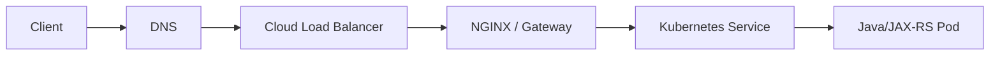
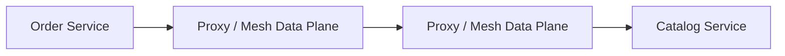
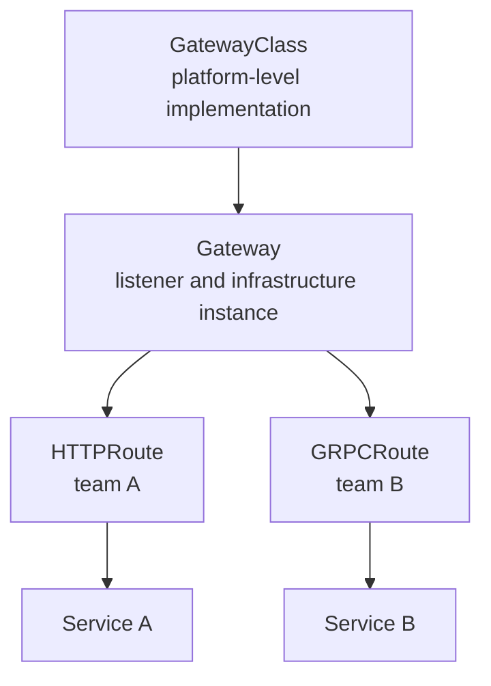
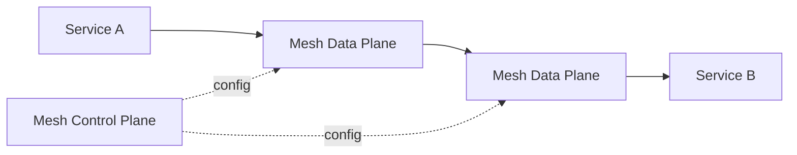
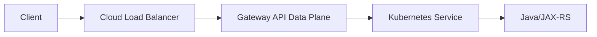
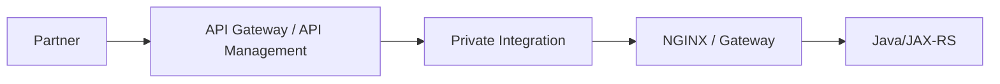
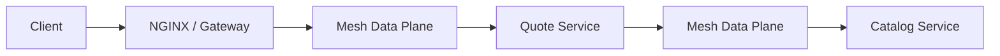
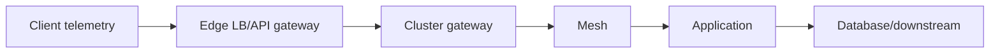
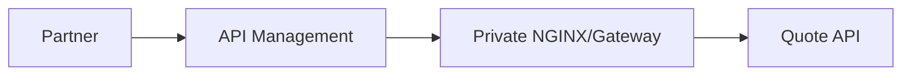
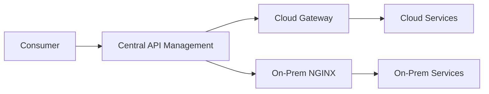

# Part 021 — Choosing Ingress, Gateway API, API Gateway, or Service Mesh

> **Depth level:** Principal-level  
> **Prerequisite:** Part 001, 008–009, 012–015, dan 018–020; pemahaman Kubernetes Service/Ingress, reverse proxy, TLS, timeout, retries, identity, rate limiting, dan observability.  
> **Scope:** Kubernetes Ingress, Gateway API, cloud load balancer, API gateway/API management, service mesh, NGINX coexistence, north-south versus east-west traffic, role separation, policy ownership, capability matrix, failure-domain analysis, operational cost, migration, ADR, Java/JAX-RS implications, debugging, dan internal verification.  
> **Bukan scope utama:** implementasi rinci AWS/EKS—Part 022; Azure/AKS—Part 023; on-prem/hybrid—Part 024; konfigurasi GitOps—Part 029; progressive delivery—Part 030.

---

## Current ecosystem note — 11 July 2026

- Kubernetes **Ingress API tetap tersedia dan GA**, tetapi API tersebut telah **dibekukan**: tidak direncanakan penambahan capability baru. Kubernetes merekomendasikan Gateway API untuk desain baru yang membutuhkan model routing lebih ekspresif dan role-oriented.
- Gateway API adalah proyek resmi Kubernetes untuk L4/L7 routing. Pada Gateway API v1.5, core resource seperti `GatewayClass`, `Gateway`, dan `HTTPRoute` berada pada jalur Standard; capability lain tetap harus diperiksa melalui release channel, feature support, dan conformance report implementasi.
- `HTTPRoute` bersifat GA, tetapi implementasi controller tidak otomatis mendukung seluruh optional/extended feature.
- AWS Load Balancer Controller, NGINX Gateway Fabric, Istio, Envoy Gateway, cloud controllers, dan implementasi lain dapat mendukung subset Gateway API yang berbeda.
- Community `ingress-nginx` telah retired sejak 24 March 2026. Jangan menyamakan status tersebut dengan F5 NGINX Ingress Controller, NGINX Gateway Fabric, atau produk NGINX lain.

> **Prinsip utama:** Ingress, Gateway API, API gateway, cloud load balancer, dan service mesh bukan lima nama untuk komponen yang sama. Mereka berada pada problem space, ownership boundary, dan traffic scope yang berbeda.

---

## Daftar isi

1. [Tujuan pembelajaran](#tujuan-pembelajaran)
2. [Executive mental model](#executive-mental-model)
3. [Mulai dari problem, bukan produk](#mulai-dari-problem-bukan-produk)
4. [Lima dimensi keputusan](#lima-dimensi-keputusan)
5. [North-south dan east-west traffic](#north-south-dan-east-west-traffic)
6. [Control plane dan data plane](#control-plane-dan-data-plane)
7. [Kubernetes Ingress](#kubernetes-ingress)
8. [Gateway API](#gateway-api)
9. [Gateway API role model](#gateway-api-role-model)
10. [GatewayClass](#gatewayclass)
11. [Gateway](#gateway)
12. [Routes](#routes)
13. [HTTPRoute](#httproute)
14. [GRPCRoute, TLSRoute, TCPRoute, dan UDPRoute](#grpcroute-tlsroute-tcproute-dan-udproute)
15. [ReferenceGrant dan cross-namespace references](#referencegrant-dan-cross-namespace-references)
16. [Status conditions sebagai runtime contract](#status-conditions-sebagai-runtime-contract)
17. [Conformance dan implementation support](#conformance-dan-implementation-support)
18. [Cloud load balancer](#cloud-load-balancer)
19. [API gateway dan API management](#api-gateway-dan-api-management)
20. [Service mesh](#service-mesh)
21. [NGINX standalone, Ingress Controller, dan Gateway implementation](#nginx-standalone-ingress-controller-dan-gateway-implementation)
22. [Capability matrix](#capability-matrix)
23. [Policy ownership matrix](#policy-ownership-matrix)
24. [Decision rules](#decision-rules)
25. [Kapan Ingress cukup](#kapan-ingress-cukup)
26. [Kapan memilih Gateway API](#kapan-memilih-gateway-api)
27. [Kapan membutuhkan API gateway](#kapan-membutuhkan-api-gateway)
28. [Kapan membutuhkan service mesh](#kapan-membutuhkan-service-mesh)
29. [Kapan cloud load balancer saja cukup](#kapan-cloud-load-balancer-saja-cukup)
30. [Kapan NGINX standalone masih tepat](#kapan-nginx-standalone-masih-tepat)
31. [Coexistence patterns](#coexistence-patterns)
32. [Layering yang sehat](#layering-yang-sehat)
33. [Layering yang patologis](#layering-yang-patologis)
34. [Duplicate retry dan retry amplification](#duplicate-retry-dan-retry-amplification)
35. [Timeout inversion](#timeout-inversion)
36. [Identity overwrite dan header spoofing](#identity-overwrite-dan-header-spoofing)
37. [Duplicate rate limiting dan quota ambiguity](#duplicate-rate-limiting-dan-quota-ambiguity)
38. [Double routing dan canary conflict](#double-routing-dan-canary-conflict)
39. [Duplicate telemetry](#duplicate-telemetry)
40. [Java/JAX-RS implications](#javajax-rs-implications)
41. [Security concerns](#security-concerns)
42. [Performance concerns](#performance-concerns)
43. [Observability concerns](#observability-concerns)
44. [Failure-domain analysis](#failure-domain-analysis)
45. [Operational cost model](#operational-cost-model)
46. [Portability dan lock-in](#portability-dan-lock-in)
47. [Worked scenario: internal CPQ UI](#worked-scenario-internal-cpq-ui)
48. [Worked scenario: partner-facing API](#worked-scenario-partner-facing-api)
49. [Worked scenario: east-west zero trust](#worked-scenario-east-west-zero-trust)
50. [Worked scenario: hybrid deployment](#worked-scenario-hybrid-deployment)
51. [Migration dari Ingress ke Gateway API](#migration-dari-ingress-ke-gateway-api)
52. [Architecture decision workflow](#architecture-decision-workflow)
53. [ADR template](#adr-template)
54. [Debugging multi-proxy architecture](#debugging-multi-proxy-architecture)
55. [PR review checklist](#pr-review-checklist)
56. [Internal verification checklist](#internal-verification-checklist)
57. [Ringkasan mental model](#ringkasan-mental-model)
58. [Referensi resmi](#referensi-resmi)

---

## Tujuan pembelajaran

Setelah menyelesaikan part ini, Anda harus mampu:

1. Menentukan apakah kebutuhan sebenarnya adalah exposure, routing, API product management, atau service-to-service policy.
2. Membuat capability matrix tanpa menganggap seluruh gateway/proxy interchangeable.
3. Memilih layer paling sederhana yang memenuhi kebutuhan dan failure model.
4. Menjelaskan ownership `GatewayClass`, `Gateway`, `Route`, API product, dan mesh policy.
5. Menemukan duplicate timeout, retry, TLS, auth, rate limit, canary, dan telemetry.
6. Menulis ADR yang mencakup blast radius, operability, migration path, dan rollback.
7. Menilai dampak desain edge terhadap Java/JAX-RS backend.
8. Mendiagnosis failure berdasarkan hop dan policy owner, bukan hanya status code terakhir.

---

## Executive mental model

Gunakan model berikut:

```text
Cloud Load Balancer
    = managed network/application entry point

Kubernetes Ingress
    = simple cluster-local north-south HTTP routing API

Gateway API
    = role-oriented, extensible Kubernetes traffic API

API Gateway / API Management
    = API consumer, product, lifecycle, governance, and policy platform

Service Mesh
    = service-to-service identity, traffic, security, and telemetry fabric

NGINX
    = data-plane technology that may implement one or more of the above roles
```

Kesalahan arsitektur biasanya dimulai ketika sebuah organisasi memilih teknologi berdasarkan label “gateway” tanpa mendefinisikan:

- traffic direction;
- consumer type;
- policy owner;
- trust boundary;
- protocol;
- tenancy;
- control-plane owner;
- failure domain;
- operational burden;
- product lifecycle.

### Core invariant

> Setiap policy hanya boleh mempunyai satu **authoritative owner**, walaupun enforcement dapat dilakukan pada beberapa layer untuk defense in depth.

Contoh:

- external client authentication mungkin authoritative di API gateway;
- propagated identity diverifikasi kembali oleh application;
- tenant-object authorization tetap authoritative di domain service;
- network mTLS dapat authoritative di mesh;
- public certificate authoritative di edge load balancer;
- backend certificate validation authoritative di next proxy hop.

Defense in depth tidak sama dengan policy duplication tanpa ownership.

---

## Mulai dari problem, bukan produk

Sebelum memilih komponen, jawab pertanyaan ini:

1. **Siapa caller-nya?**
   - public internet;
   - partner;
   - employee;
   - another workload;
   - batch job;
   - operator.

2. **Traffic bergerak ke mana?**
   - north-south;
   - east-west;
   - cross-cluster;
   - cloud-to-on-prem;
   - on-prem-to-cloud.

3. **Apa yang harus dikontrol?**
   - exposure;
   - host/path routing;
   - identity;
   - quota;
   - transformation;
   - version lifecycle;
   - mTLS;
   - retries;
   - traffic splitting;
   - observability.

4. **Siapa owner-nya?**
   - cloud/network team;
   - platform team;
   - API product team;
   - application team;
   - security team;
   - SRE.

5. **Apa failure yang dapat diterima?**
   - fail closed;
   - fail open;
   - regional outage;
   - route-level outage;
   - control plane unavailable tetapi data plane masih melayani;
   - temporary stale configuration.

Tanpa jawaban ini, capability comparison akan menjadi feature-shopping.

---

## Lima dimensi keputusan

### 1. Traffic direction

```text
north-south:
client outside workload boundary -> workload

east-west:
workload -> workload
```

### 2. Layer

| Layer | Fokus |
|---|---|
| DNS | name to endpoint discovery |
| L4 | TCP/UDP connection distribution |
| L7 | HTTP/gRPC-aware routing and policy |
| API product | consumer keys, quota, lifecycle, portal, analytics |
| workload identity | service identity, mTLS, service authorization |

### 3. Policy scope

- global platform;
- per gateway;
- per host;
- per route;
- per API product;
- per consumer;
- per workload;
- per service-to-service edge;
- per request.

### 4. Ownership

- infrastructure provider;
- cluster operator;
- namespace owner;
- API publisher;
- application developer;
- security operator.

### 5. State model

- static configuration;
- Kubernetes reconciliation;
- managed control plane;
- consumer registry;
- distributed identity;
- dynamic endpoint discovery;
- per-request external authorization.

---

## North-south dan east-west traffic

### North-south

Contoh:



Typical concerns:

- public DNS;
- TLS;
- WAF;
- DDoS;
- client identity;
- API quota;
- host/path routing;
- source IP;
- public observability;
- certificate lifecycle.

### East-west



Typical concerns:

- workload identity;
- service mTLS;
- service authorization;
- locality;
- retries;
- outlier detection;
- circuit breaking;
- service telemetry;
- multi-cluster discovery.

### Important distinction

A public API gateway can route to internal services, tetapi itu tidak otomatis menjadikannya service mesh.

A service mesh dapat memiliki ingress gateway, tetapi itu tidak otomatis menyediakan:

- API products;
- developer portal;
- per-consumer subscription;
- monetization;
- contract publication;
- API lifecycle governance.

---

## Control plane dan data plane

### Control plane

Control plane menerima desired state, memvalidasi, mengkompilasi, dan mendistribusikan konfigurasi.

Examples:

- Kubernetes API;
- Gateway controller;
- Ingress controller;
- API management control plane;
- Istiod;
- cloud load balancer control plane.

### Data plane

Data plane menangani request aktual.

Examples:

- NGINX workers;
- Envoy proxies;
- ALB/NLB nodes;
- APIM gateway;
- API Gateway runtime;
- service mesh sidecar/waypoint.

### Failure implication

Control plane down tidak selalu berarti data plane down.

Possible states:

| Control plane | Data plane | Result |
|---|---|---|
| healthy | healthy | normal |
| unavailable | healthy with last config | traffic may continue; changes blocked |
| healthy | broken config rejected | old config may continue |
| healthy | data plane crash | traffic failure |
| stale | healthy | requests served with stale policy |

Jangan menyimpulkan “Kubernetes API healthy” berarti route bekerja.

---

## Kubernetes Ingress

Ingress menyediakan declarative HTTP/HTTPS routing yang relatif sederhana:

- host;
- path;
- backend Service;
- TLS Secret reference;
- IngressClass selection.

### Strengths

- familiar;
- widely implemented;
- adequate untuk simple host/path routing;
- low conceptual overhead;
- mature operational patterns;
- stable GA API.

### Limitations

- API dibekukan;
- advanced behavior bergantung annotation;
- weak role separation;
- cross-namespace delegation terbatas;
- protocol support dan traffic policy sangat implementation-specific;
- portability turun saat annotations/snippets bertambah;
- status and capability model kurang ekspresif dibanding Gateway API.

### When it remains valid

Ingress tetap reasonable bila:

- platform sudah mature;
- use case simple;
- controller masih supported;
- migration cost tidak justified;
- annotations dibatasi;
- tidak ada kebutuhan role delegation baru;
- operational risk lebih rendah daripada perubahan besar.

Frozen bukan berarti unusable. Frozen berarti jangan berharap API itu berkembang untuk menyelesaikan kebutuhan baru.

---

## Gateway API

Gateway API memisahkan infrastructure, listener, dan route concerns.



### Why it exists

Ingress menyatukan terlalu banyak concern pada satu resource dan mendorong controller-specific annotations.

Gateway API memperkenalkan:

- explicit roles;
- typed routes;
- richer status;
- route delegation;
- cross-namespace controls;
- extensibility;
- conformance model;
- protocol awareness.

### What it does not guarantee

Gateway API tidak menjamin:

- setiap controller mendukung semua filters;
- behavior sama untuk optional feature;
- automatic migration dari annotation;
- API management capability;
- service mesh capability;
- zero operational cost;
- no vendor-specific extension.

---

## Gateway API role model

Model organisasi umumnya:

| Role | Resource | Responsibility |
|---|---|---|
| infrastructure provider | `GatewayClass` | implementation, defaults, supported features |
| cluster/platform operator | `Gateway` | listeners, addresses, certificates, allowed routes |
| application owner | `HTTPRoute`/other Route | match, filters, backend references |
| security/platform governance | policy/admission | allowed references, namespaces, filters, TLS requirements |

### Benefit

Application team dapat mengelola route tanpa diberi hak mengubah shared listener atau infrastructure.

### Risk

Role separation hanya efektif bila disertai:

- RBAC;
- namespace policy;
- `allowedRoutes`;
- `ReferenceGrant`;
- admission policy;
- hostname ownership;
- certificate ownership;
- status monitoring.

YAML separation tanpa authorization separation bukan governance.

---

## GatewayClass

`GatewayClass` mengikat Gateway API ke implementation/controller.

Conceptually:

```yaml
apiVersion: gateway.networking.k8s.io/v1
kind: GatewayClass
metadata:
  name: managed-edge
spec:
  controllerName: example.net/gateway-controller
```

### Questions to ask

- controller mana yang reconcile?
- Standard atau Experimental channel mana yang di-install?
- feature apa yang conformance-tested?
- parameter resource apa yang digunakan?
- siapa boleh membuat/mengubah `GatewayClass`?
- apakah perubahan class memengaruhi existing gateways?
- bagaimana upgrade dan rollback controller dilakukan?

### Architectural meaning

`GatewayClass` bukan sekadar nama class. Ia merepresentasikan:

- implementation;
- operational model;
- support contract;
- infrastructure defaults;
- capability profile;
- security posture;
- cost model.

---

## Gateway

`Gateway` meminta instance traffic handling dengan listener tertentu.

Example:

```yaml
apiVersion: gateway.networking.k8s.io/v1
kind: Gateway
metadata:
  name: shared-https
  namespace: platform-edge
spec:
  gatewayClassName: managed-edge
  listeners:
    - name: https
      protocol: HTTPS
      port: 443
      hostname: "*.example.internal"
      tls:
        mode: Terminate
        certificateRefs:
          - kind: Secret
            name: wildcard-example
      allowedRoutes:
        namespaces:
          from: Selector
          selector:
            matchLabels:
              edge-access: "allowed"
```

### Gateway owns

- listener port;
- listener protocol;
- hostname scope;
- TLS mode and certificate reference;
- route attachment policy;
- implementation-specific infrastructure.

### Gateway should not own

- domain-specific path behavior;
- object authorization;
- business transformations;
- application retry semantics;
- database transaction semantics.

---

## Routes

Gateway API uses typed route resources.

| Route | Typical protocol |
|---|---|
| `HTTPRoute` | HTTP/HTTPS |
| `GRPCRoute` | gRPC |
| `TLSRoute` | TLS passthrough/SNI routing |
| `TCPRoute` | raw TCP |
| `UDPRoute` | UDP |

Support status can differ by release channel and controller.

### Rule

> Never assume a resource existing in installed CRDs means the controller fully supports its semantics.

Verify:

- installed CRD version;
- controller documentation;
- conformance report;
- status conditions;
- feature gates;
- production support statement.

---

## HTTPRoute

`HTTPRoute` maps HTTP requests to backends.

Conceptual example:

```yaml
apiVersion: gateway.networking.k8s.io/v1
kind: HTTPRoute
metadata:
  name: quote-api
  namespace: quote-order
spec:
  parentRefs:
    - name: shared-https
      namespace: platform-edge
      sectionName: https
  hostnames:
    - quote.example.internal
  rules:
    - matches:
        - path:
            type: PathPrefix
            value: /api/quotes
      filters:
        - type: RequestHeaderModifier
          requestHeaderModifier:
            set:
              - name: X-Edge-Contract-Version
                value: "1"
      backendRefs:
        - name: quote-service
          port: 8080
```

### Semantics to verify

- hostname intersection with listener;
- route namespace allowed by Gateway;
- path match behavior;
- filter support;
- backend reference resolution;
- cross-namespace authorization;
- timeout feature support;
- retry feature support;
- weight behavior;
- request mirror behavior;
- header modification order.

### Java/JAX-RS impact

The application must know:

- whether prefix is preserved or rewritten;
- trusted external scheme/host;
- forwarded-header contract;
- identity header contract;
- timeout budget;
- canary routing dimension;
- original route ID for telemetry.

---

## GRPCRoute, TLSRoute, TCPRoute, dan UDPRoute

### GRPCRoute

Useful when:

- service/method-aware routing is needed;
- gRPC status semantics matter;
- HTTP/2 backend behavior must be explicit.

### TLSRoute

Useful for:

- SNI-based passthrough;
- TLS termination at backend;
- opaque encrypted traffic.

Trade-off:

- edge loses HTTP visibility;
- no HTTP header/path policies;
- observability and WAF capability decrease.

### TCPRoute

Useful for:

- databases;
- message brokers;
- custom protocols;
- generic TCP services.

### UDPRoute

Useful for UDP workloads where implementation supports it.

### Principal-level concern

Protocol-specific routes improve clarity, tetapi increase dependency pada implementation support. Portability must be tested, not assumed.

---

## ReferenceGrant dan cross-namespace references

Cross-namespace references are security-sensitive.

Example relationship:

```text
HTTPRoute in namespace A
    wants to reference
Service in namespace B
```

The target namespace must explicitly grant permission where required.

### Why target-side consent matters

Without target-side consent, a route owner could expose another namespace’s Service accidentally or maliciously.

### Questions

- Does the controller enforce `ReferenceGrant`?
- Which object types are permitted?
- Is Secret cross-namespace reference allowed?
- Who owns the target namespace?
- Is hostname ownership aligned?
- Are admission policies stricter than the base API?
- How is grant revocation observed?

---

## Status conditions sebagai runtime contract

Gateway API status is not decoration.

Typical conditions include concepts such as:

- accepted by parent;
- programmed;
- references resolved;
- listener conflict;
- unsupported protocol;
- no matching parent;
- invalid certificate reference.

### Review pattern

```bash
kubectl describe gateway -n platform-edge shared-https
kubectl describe httproute -n quote-order quote-api
kubectl get httproute -A -o yaml
```

### Invariant

```text
Resource exists
≠ Route accepted
≠ References resolved
≠ Data plane programmed
≠ End-to-end request successful
```

Monitoring must watch status conditions, not only object existence.

---

## Conformance dan implementation support

Gateway API defines:

- core features;
- extended features;
- implementation-specific features;
- release channels;
- conformance profiles/reports.

### Capability verification workflow

1. Identify exact controller and version.
2. Identify installed Gateway API CRD version/channel.
3. Read implementation conformance report.
4. Check required feature support.
5. Validate status conditions.
6. Test rendered/generated configuration.
7. Execute request-level conformance tests.
8. Verify upgrade compatibility.

### Anti-pattern

```text
"Gateway API supports feature X"
```

Better:

```text
"Gateway API defines feature X; controller Y version Z advertises and has been tested for the required conformance profile."
```

---

## Cloud load balancer

Cloud load balancer is managed infrastructure that exposes targets.

Examples:

- AWS ALB/NLB;
- Azure Application Gateway/Load Balancer/Front Door;
- Google Cloud Load Balancing.

### Strengths

- managed availability;
- integration with cloud networking;
- managed certificate options;
- health checks;
- native autoscaling;
- cloud IAM and telemetry integration;
- reduced data-plane maintenance.

### Weaknesses

- vendor-specific behavior;
- feature/limit constraints;
- control-plane quotas;
- cost per rule/data processing;
- slower convergence in some operations;
- limited application-domain awareness;
- portability cost.

### It may be enough when

- one or few services;
- simple routing;
- no API product lifecycle;
- no advanced edge transformation;
- cloud-native lock-in accepted;
- operational simplicity prioritized.

---

## API gateway dan API management

An API gateway usually handles more than routing.

Common capabilities:

- API publication;
- version/stage lifecycle;
- consumer onboarding;
- API keys/subscriptions;
- quotas;
- throttling;
- authorizers;
- schema validation;
- transformations;
- analytics;
- developer portal;
- policy governance;
- monetization in some products;
- backend abstraction.

Examples:

- Amazon API Gateway;
- Azure API Management;
- Kong;
- Apigee;
- self-hosted or managed gateways.

### API gateway is a product boundary

It often models:

```text
API product
  -> versions/stages
  -> consumers/subscriptions
  -> credentials
  -> quota
  -> analytics
  -> policy
```

That is a different abstraction from:

```text
HTTPRoute
  -> match
  -> filter
  -> backend
```

### What API gateway should not own

- tenant-object authorization;
- quote lifecycle authorization;
- transaction boundaries;
- business validation;
- inventory consistency;
- order decomposition;
- compensation logic.

### Java/JAX-RS implication

The backend still needs:

- authenticated principal validation contract;
- domain authorization;
- idempotency;
- request validation;
- audit trail;
- correlation;
- consistent error model.

---

## Service mesh

A service mesh mediates workload-to-workload traffic.

Common capabilities:

- workload identity;
- mTLS;
- service authorization;
- service discovery integration;
- retries;
- timeout;
- outlier detection;
- traffic splitting;
- locality;
- telemetry;
- egress control.

### Typical architecture



### Sidecar and ambient/sidecarless modes

Implementation may use:

- sidecar proxy per pod;
- node-level secure tunnel;
- waypoint proxy;
- hybrid patterns.

Do not reduce service mesh evaluation to “adds a sidecar”.

### What mesh does not automatically provide

- public API consumer management;
- developer portal;
- API subscription;
- external quota plan;
- public certificate/DNS ownership;
- business authorization;
- application correctness.

---

## NGINX standalone, Ingress Controller, dan Gateway implementation

NGINX can appear in multiple forms:

| Form | Control model | Typical role |
|---|---|---|
| standalone NGINX | files/automation | reverse proxy, TLS, edge |
| NGINX container | mounted/generated config | local proxy |
| F5 NGINX Ingress Controller | Kubernetes Ingress/CRDs | cluster ingress |
| NGINX Gateway Fabric | Gateway API | Gateway implementation |
| NGINX Plus | commercial data plane/features | advanced load balancing/API edge |
| NGINX in API platform | product-specific | API gateway data plane |

### Rule

> “We use NGINX” is not an architecture description.

Ask:

- which distribution?
- which controller?
- which edition?
- who generates config?
- which API owns desired state?
- where is TLS terminated?
- where is identity established?
- where are routes stored?
- what is support lifecycle?

---

## Capability matrix

Legend:

- **Primary**: natural problem owner.
- **Possible**: can be implemented but may not be ideal.
- **Limited**: partial or implementation-specific.
- **No**: generally outside intended responsibility.

| Capability | Cloud LB | Ingress | Gateway API implementation | API gateway | Service mesh |
|---|---:|---:|---:|---:|---:|
| public endpoint | Primary | Possible via LB | Primary via implementation | Primary | Limited |
| basic host/path routing | Primary/possible | Primary | Primary | Primary | Possible |
| role-based route delegation | Limited | Limited | Primary | Product-specific | Product-specific |
| consumer API keys | Limited | No | No | Primary | No |
| consumer quotas | Limited | Limited | Limited | Primary | No |
| developer portal | No | No | No | Primary | No |
| API version/stage lifecycle | Limited | Limited | Limited | Primary | No |
| workload mTLS | Limited | No | Limited | Limited | Primary |
| east-west authorization | No | No | Limited | Limited | Primary |
| per-service telemetry | Limited | Limited | Limited | Possible | Primary |
| WAF integration | Primary/possible | Possible | Possible | Primary/possible | No |
| protocol-aware Kubernetes routes | Limited | Limited | Primary | Possible | Possible |
| Kubernetes-native delegation | No | Limited | Primary | Limited | Possible |
| managed availability | Primary | Depends | Depends | Primary if managed | Depends |
| portability | Low-medium | Medium | Medium-high at core | Low-medium | Medium |
| operational complexity | Low-medium | Medium | Medium | Medium-high | High |

This table is a starting point, not a substitute for product/version verification.

---

## Policy ownership matrix

Define one authoritative owner per policy.

| Policy | Recommended authoritative owner | Secondary enforcement |
|---|---|---|
| public TLS certificate | external edge/platform | backend TLS validation |
| client authentication | API gateway/edge auth service | application principal validation |
| domain authorization | Java/JAX-RS service | none can replace it |
| consumer quota | API management | local safety limiter |
| platform overload limiter | edge/gateway | application bulkhead |
| request timeout budget | end-to-end architecture | each hop enforces smaller segment |
| retries | caller or designated proxy | avoid independent retries elsewhere |
| service mTLS | service mesh/platform | application may validate claims |
| route ownership | Gateway/Ingress platform | admission policy |
| WAF | internet edge | application validation |
| audit event | application/domain | edge access logs |
| trace context | observability contract | every hop propagates |

### Authoritative versus defensive control

Example:

```text
API gateway consumer quota = commercial/contractual policy
NGINX rate limit = local overload protection
Java bulkhead = resource protection
```

All three can exist because their purpose and key differ.

They become duplicate when all three claim to enforce the same “100 requests/sec per customer” contract independently.

---

## Decision rules

### Rule 1 — Choose the simplest sufficient layer

Do not introduce service mesh only for one host rewrite.

Do not introduce API management only for internal path routing.

Do not retain dozens of unsafe annotations when Gateway API provides a supported typed capability.

### Rule 2 — Match layer to trust boundary

- internet trust boundary: edge LB/WAF/API gateway;
- cluster ingress boundary: Ingress/Gateway;
- workload boundary: service mesh;
- domain boundary: application.

### Rule 3 — Prefer typed APIs over opaque snippets

Typed route/filter/policy APIs are easier to:

- validate;
- review;
- observe;
- migrate;
- reason about.

### Rule 4 — Evaluate failure domains before features

Ask:

- What happens if the control plane is unavailable?
- What happens if policy compilation fails?
- Can old config continue?
- Does one shared gateway failure affect all teams?
- Can a tenant route change break another tenant?
- What is the rollback unit?

### Rule 5 — Do not count the same capability twice

“Three layers support retries” is not three times more reliable. It can be nine requests from one original request.

---

## Kapan Ingress cukup

Use Ingress when:

- host/path routing is simple;
- controller is supported;
- team already operates it well;
- annotation footprint is small;
- route ownership is centralized;
- no advanced route delegation needed;
- no API consumer/product lifecycle needed;
- no east-west policy requirement;
- migration would add risk without clear benefit.

### Example

```text
internal employee UI
  -> one internal LB
  -> one supported Ingress controller
  -> 10 stable HTTP services
```

This may not need Gateway API immediately.

### Review question

Is the problem actually technical debt from a retired controller? If yes, migration driver is support/security, not Gateway API fashion.

---

## Kapan memilih Gateway API

Use Gateway API when:

- multiple teams share listeners;
- route delegation matters;
- typed protocol routes are needed;
- annotations are becoming an ungoverned API;
- cross-namespace ownership must be explicit;
- platform/app roles need separation;
- implementation has required conformance;
- migration path is testable;
- portability at core route semantics is valuable.

### Strong signals

- shared wildcard listener;
- many namespaces;
- domain ownership conflicts;
- need for `HTTPRoute` and `GRPCRoute`;
- policy attachment model;
- clear platform class profiles;
- need to observe `Accepted`, `Programmed`, `ResolvedRefs`.

### Weak reason

“Gateway API is newer.”

Newer is not sufficient if required features are unsupported by chosen implementation.

---

## Kapan membutuhkan API gateway

Use API gateway/API management when:

- APIs are products consumed by external/partner developers;
- per-consumer subscription and keys are required;
- contractual quota exists;
- API lifecycle/version/stages matter;
- developer portal is required;
- central transformations or validation are governed;
- analytics by consumer/product are needed;
- public API security integration is needed;
- hybrid API publication is a business capability.

### Example

```text
partner quote submission API
  -> subscription
  -> client credential
  -> per-partner quota
  -> API version
  -> SLA analytics
```

A plain Ingress route does not model those concerns.

### Caveat

API gateway should not become a business-logic engine.

Complex quote eligibility, pricing, product compatibility, order validation, and compensation belong in domain services.

---

## Kapan membutuhkan service mesh

Use service mesh when:

- strong workload identity is required;
- east-west mTLS at scale is needed;
- service authorization must be platform-enforced;
- many services need consistent telemetry;
- multi-cluster service networking is required;
- traffic policy must apply transparently;
- operational maturity exists;
- added data-plane/control-plane complexity is justified.

### Weak reasons

- “We want dashboards.”
- “We need one retry.”
- “We need one canary.”
- “Everyone else uses Istio.”

Those needs may be solved more cheaply.

### Readiness criteria

- platform team can operate control/data plane;
- certificate rotation is understood;
- sidecar/ambient lifecycle is tested;
- resource overhead is budgeted;
- failure modes are documented;
- application retry semantics are aligned;
- telemetry cardinality is controlled.

---

## Kapan cloud load balancer saja cukup

Cloud LB alone can be enough when:

- one service or simple target set;
- cloud-specific solution accepted;
- native L7 rules cover routing;
- no advanced per-route application policy;
- managed operations are preferred;
- direct pod target integration is supported;
- API management and mesh are unnecessary.

### Example

```text
ALB
  -> Java/JAX-RS Service pods
```

Adding NGINX only to “have a reverse proxy” may provide no value and add latency/failure surface.

---

## Kapan NGINX standalone masih tepat

Standalone NGINX is useful when:

- on-prem/hybrid proxy is required;
- configuration is not Kubernetes-native;
- precise NGINX behavior/modules are needed;
- static infrastructure boundary exists;
- team has strong operational practices;
- vendor-neutral reverse proxy is desired;
- migration or protocol adaptation needs a controlled edge.

Avoid standalone config snowflakes without:

- source control;
- validation;
- observability;
- safe reload;
- ownership;
- patching;
- support lifecycle.

---

## Coexistence patterns

These technologies can coexist when each layer owns a distinct concern.

### Pattern A — Cloud LB + Gateway API



Ownership:

- LB: public exposure, cloud network, optional public TLS/WAF;
- Gateway: listener/route delegation;
- app: domain authorization and business logic.

### Pattern B — API gateway + private NGINX/Gateway



Ownership:

- API gateway: consumer auth, quota, API product;
- private gateway: cluster routing;
- app: domain authorization.

### Pattern C — Edge Gateway + service mesh



Ownership:

- edge: north-south policy;
- mesh: east-west identity/policy;
- services: domain behavior.

### Pattern D — Cloud LB direct to API gateway runtime

Managed API gateway may itself own edge runtime. Additional NGINX should only be introduced for a specific unmet requirement.

---

## Layering yang sehat

Healthy layering has these properties:

1. Every layer has a written purpose.
2. Policy ownership is explicit.
3. Header trust chain is documented.
4. Timeout budget is monotonic.
5. Retry is centralized or coordinated.
6. Route source of truth is known.
7. TLS mode per hop is known.
8. Telemetry IDs propagate.
9. Failure can be attributed per hop.
10. Removal criteria for each layer exist.

### Example

```text
ALB:
- public listener
- ACM certificate
- AWS WAF
- X-Forwarded-For

NGINX Gateway:
- namespace route delegation
- path routing
- local overload limit

Java service:
- JWT claim validation
- tenant/object authorization
- idempotency
- audit
```

---

## Layering yang patologis

Symptoms:

- ALB, NGINX, API gateway, and mesh all rewrite paths;
- every layer retries;
- every layer terminates/re-encrypts TLS without reason;
- two gateways validate different JWT rules;
- source IP changes at every hop;
- rate limits return different 429 semantics;
- canary percentages differ;
- request IDs are overwritten;
- no one can identify who generated 503;
- control planes fight over the same Service/route.

### Architecture smell test

For each proxy, ask:

```text
If we remove this layer, which explicit requirement becomes unmet?
```

If the answer is vague, the layer may be accidental complexity.

---

## Duplicate retry dan retry amplification

Assume:

- client retries 2 additional times;
- API gateway retries 2 upstream attempts;
- mesh retries 2 attempts.

Worst-case attempts:

```text
3 × 2 × 2 = 12 backend attempts
```

For non-idempotent order creation, this is dangerous.

### Required design

- identify retry owner;
- restrict retryable methods/statuses;
- propagate deadline;
- use idempotency keys;
- cap total attempts;
- monitor attempt count;
- disable proxy retries for unsafe operations unless contract exists.

### Policy table

| Layer | Recommended |
|---|---|
| user client | bounded retry for network-safe/idempotent operation |
| API gateway | usually no hidden retry for unsafe methods |
| edge NGINX | retry only explicitly safe failures/methods |
| mesh | avoid duplicate application-aware retry |
| Java client | owns domain-aware downstream retry if needed |

---

## Timeout inversion

Correct principle:

```text
outer deadline > inner deadline + processing/transport margin
```

Example:

```text
client deadline       10 s
API gateway timeout    9 s
edge timeout           8 s
service deadline       7 s
database deadline      5 s
```

Pathological configuration:

```text
ALB closes at 60 s
NGINX waits 120 s
application continues 180 s
```

The application does work after the caller has gone.

### Cross-layer requirement

Every layer must know:

- total request budget;
- connect budget;
- per-attempt budget;
- retry budget;
- cancellation propagation behavior.

---

## Identity overwrite dan header spoofing

Potential chain:

```text
Client
  -> API Gateway adds X-User-Id
  -> NGINX overwrites or preserves it
  -> Mesh adds another identity header
  -> Java trusts the wrong one
```

### Secure contract

1. Public-supplied identity headers are removed at first trusted edge.
2. Trusted identity is generated from validated credentials.
3. Each hop permits identity headers only from trusted upstream.
4. Application verifies issuer/audience or signed identity context where possible.
5. Domain authorization uses authenticated principal, not arbitrary headers.
6. Audit logs record authentication source.

### Better naming

Use explicit internal headers:

```text
X-Internal-Principal
X-Internal-Tenant
X-Auth-Context-Version
```

But header naming alone does not establish trust.

---

## Duplicate rate limiting dan quota ambiguity

Three distinct controls:

```text
API management quota:
contractual per consumer/month

edge rate limit:
short-window overload defense

application concurrency limit:
resource protection
```

They should differ in:

- purpose;
- key;
- window;
- response;
- observability;
- ownership.

### Failure pattern

API gateway allows 100 rps, NGINX allows 50 rps per source IP, and all partner calls share one NAT IP.

Result:

- false throttling;
- contractual mismatch;
- difficult attribution.

---

## Double routing dan canary conflict

Example:

- API gateway routes 10% to v2;
- NGINX routes 20% of remaining traffic to v2;
- mesh routes 5% by header.

Effective distribution becomes non-obvious.

### Rule

Choose one authoritative canary layer per experiment.

Use other layers only for deterministic forwarding.

Record:

- cohort key;
- weight;
- stickiness;
- fallback;
- metrics;
- rollback owner.

---

## Duplicate telemetry

Multiple proxies can generate:

- access logs;
- metrics;
- traces;
- request IDs.

Without contract, this creates:

- double-counted requests;
- inconsistent latency;
- broken trace parentage;
- high cardinality;
- storage explosion;
- confusion between client and upstream status.

### Telemetry contract

Each hop should expose:

- hop name;
- request ID;
- trace ID;
- downstream status;
- upstream status;
- connect time;
- first-byte time;
- total time;
- retry attempt;
- route/backend identity;
- policy decision.

---

## Java/JAX-RS implications

### 1. External URI reconstruction

The service may need trusted:

- scheme;
- host;
- port;
- base path.

This affects:

- `UriInfo`;
- redirect URLs;
- generated links;
- OpenAPI server URL;
- callback URLs.

### 2. Authentication context

Java must know:

- token forwarded or exchanged;
- validated claims;
- trusted identity headers;
- mTLS identity;
- principal source;
- claim normalization.

### 3. Authorization

Keep in application:

- tenant access;
- quote ownership;
- order state transition;
- catalog entitlement;
- pricing visibility;
- field-level authorization.

### 4. Retry and idempotency

Endpoints that create/update state need:

- idempotency key;
- replay detection;
- transaction boundary;
- deterministic response behavior;
- audit evidence.

### 5. Timeout and cancellation

JAX-RS implementation should align:

- request timeout;
- downstream HTTP timeout;
- database statement timeout;
- async response timeout;
- cancellation behavior.

### 6. Observability

Propagate:

- `traceparent`;
- request/correlation ID;
- authenticated subject;
- route ID where safe;
- upstream deadline where standardized.

Do not put secrets or sensitive claims in high-cardinality labels.

---

## Security concerns

### Shared Gateway security

- route attachment can expose unintended Service;
- wildcard hostname can create collision;
- cross-namespace Secret references can leak certificate material;
- snippets/extensions may bypass policy;
- identity headers may be spoofed;
- direct Service access may bypass edge controls.

### API gateway security

- authorizer failure mode;
- API key mistaken as authentication;
- transformation changes signed content;
- policy order;
- secret rotation;
- backend trust.

### Service mesh security

- workload identity issuance;
- certificate rotation;
- permissive mTLS modes;
- policy gaps;
- sidecar bypass;
- egress escape paths;
- control-plane trust.

### General principle

A network layer can enforce coarse policy, but cannot infer all business authorization.

---

## Performance concerns

Each proxy adds potential:

- network hop;
- connection pool;
- queue;
- TLS handshake;
- buffering;
- serialization/transformation;
- telemetry overhead;
- memory;
- CPU;
- failure surface.

### Latency equation

```text
total latency =
  client-to-edge
+ edge queue/processing
+ edge-to-gateway
+ gateway queue/processing
+ mesh hops
+ application
+ downstream dependencies
+ response path
```

### Double proxy questions

- Can connections be reused between layers?
- Is HTTP/2 downgraded to HTTP/1.1?
- Is request/response buffering duplicated?
- Is compression duplicated?
- Are idle timeouts aligned?
- Is TLS re-encryption required?
- Is cross-zone traffic introduced?
- Are health checks multiplying load?

---

## Observability concerns

### Required view



For every hop, identify:

- request accepted time;
- route selected;
- policy decision;
- upstream selected;
- attempt count;
- status source;
- timeout source;
- bytes;
- trace context.

### Status attribution example

`503` may mean:

- API gateway quota/control-plane issue;
- ALB no healthy targets;
- NGINX no live upstream;
- mesh cluster unavailable;
- Java service intentionally returned 503.

The same code does not identify the owner.

---

## Failure-domain analysis

Build a matrix:

| Component | Control-plane failure | Data-plane failure | Blast radius | Last-known config behavior |
|---|---|---|---|---|
| cloud LB | provisioning/update blocked | endpoint unavailable | regional/LB | provider-specific |
| Ingress controller | no reconciliation | NGINX pods fail | class/cluster | often last config remains |
| Gateway controller | status/config stale | gateway pods fail | GatewayClass/Gateway | implementation-specific |
| API gateway | deployment/policy update blocked | API runtime degraded | API/stage/region | product-specific |
| service mesh control plane | config/cert distribution affected | proxies/waypoints fail | mesh/cluster | implementation-specific |
| Java service | deployment unavailable | requests fail | service/domain | n/a |

### Principal question

Which failure domains are correlated?

Example:

- all gateways use same node pool;
- API gateway and backend share same DNS;
- mesh control plane and certificate authority share one dependency;
- shared NGINX ConfigMap affects every namespace.

---

## Operational cost model

Total cost is not license alone.

```text
Total Cost =
  infrastructure
+ managed service fees
+ data processing
+ engineering time
+ on-call complexity
+ upgrade effort
+ security review
+ observability storage
+ incident duration
+ migration cost
```

### Complexity indicators

- number of control planes;
- number of policy languages;
- number of route APIs;
- number of certificate stores;
- number of logging schemas;
- number of teams required for one change;
- mean time to attribute failure;
- upgrade cadence;
- support lifecycle.

### Decision rule

A feature-rich platform can be cheaper if it removes several custom systems. It can also be much more expensive if only 10% of capabilities are needed.

---

## Portability dan lock-in

### Ingress portability

Core host/path is portable; annotations are not.

### Gateway API portability

Core resource semantics improve portability, but:

- extended features differ;
- policy attachment differs;
- infrastructure parameters differ;
- cloud integration differs;
- implementation extensions differ.

### API gateway portability

API products, policies, authorizers, and portal models are commonly vendor-specific.

### Service mesh portability

Traffic semantics may overlap, but:

- CRDs;
- identity model;
- data-plane architecture;
- telemetry;
- operational tooling

can be vendor-specific.

### Balanced strategy

Portability should be proportional to realistic migration probability.

Do not pay unlimited complexity for hypothetical portability.

---

## Worked scenario: internal CPQ UI

### Requirements

- employee-only;
- one region;
- browser SPA;
- JAX-RS backend;
- internal SSO;
- moderate traffic;
- no external developer portal;
- simple host/path routing.

### Candidate

```text
internal DNS
  -> internal cloud LB
  -> supported Ingress/Gateway controller
  -> Java services
```

### Decision

Ingress may remain sufficient if supported and governed.

Gateway API becomes attractive when:

- many teams share hostnames;
- route delegation is needed;
- annotation burden is high;
- controller migration is already required.

API management and mesh are not automatically needed.

---

## Worked scenario: partner-facing API

### Requirements

- partner onboarding;
- OAuth2 client credentials;
- per-partner quota;
- versioned API;
- analytics by partner;
- private backend;
- contractual SLA.

### Candidate



### Ownership

- API management: partner identity, subscription, quota, API lifecycle;
- private gateway: cluster route;
- Java API: domain authorization, idempotency, audit.

### Why Ingress alone is insufficient

Ingress can route traffic, but does not model partner product lifecycle.

---

## Worked scenario: east-west zero trust

### Requirements

- hundreds of services;
- workload identity;
- mTLS;
- service authorization;
- cross-cluster telemetry;
- locality-aware routing.

### Candidate

```text
edge Gateway for north-south
+ service mesh for east-west
```

### Preconditions

- platform team;
- capacity budget;
- certificate lifecycle;
- retry coordination;
- policy-as-code;
- mesh upgrade/runbook;
- application compatibility testing.

### Rejected shortcut

Using public API gateway for every east-west call may create cost, latency, and central bottleneck without correct workload identity semantics.

---

## Worked scenario: hybrid deployment

### Requirements

- cloud and on-prem;
- private connectivity;
- internal CA;
- central API publication;
- local routing;
- regulatory data boundaries.

### Candidate



### Decisions

- central API product plane;
- distributed/self-hosted gateway runtime where supported;
- explicit certificate trust;
- no implicit transitive trust;
- split-horizon DNS;
- per-site failure isolation;
- route and policy versioning.

---

## Migration dari Ingress ke Gateway API

Migration is not annotation renaming.

### Phase 1 — Inventory

- controller/distribution/version;
- IngressClass;
- all annotations;
- snippets;
- ConfigMap;
- TLS Secrets;
- auth integration;
- canary;
- regex/rewrite;
- timeouts;
- observability;
- source IP behavior.

### Phase 2 — Capability mapping

For each feature:

| Existing behavior | Gateway API core | Extended | implementation-specific | no equivalent |
|---|---:|---:|---:|---:|
| host/path | yes | | | |
| rewrite | maybe/filter support | yes | maybe | |
| external auth | | | likely | |
| snippets | | | | often no direct safe equivalent |
| canary | weight may help | | controller-specific | |
| custom NGINX directives | | | extension | |

### Phase 3 — Platform design

- GatewayClass profiles;
- Gateway ownership;
- listener strategy;
- namespace attachment;
- certificate model;
- `ReferenceGrant`;
- route status monitoring;
- conformance requirements.

### Phase 4 — Parallel validation

- deploy separate endpoint;
- replay synthetic tests;
- compare headers/status/body;
- validate TLS;
- validate source IP;
- test failures;
- measure latency;
- test rollback.

### Phase 5 — Controlled cutover

- DNS weighted shift or LB rule;
- low-risk cohort;
- monitor SLO;
- preserve old path;
- rollback threshold;
- post-cutover cleanup.

### Tooling note

Migration assistants can translate common resources, but untranslatable annotations and semantic differences still require engineering review.

---

## Architecture decision workflow

### Step 1 — State the actual problem

Bad:

```text
We need a service mesh.
```

Good:

```text
We need workload identity and mTLS for 120 service-to-service relationships across three clusters, with centralized authorization and telemetry.
```

### Step 2 — Define invariants

Examples:

- no public route may bypass WAF;
- tenant authorization stays in service;
- one retry owner;
- one canary owner;
- all identity headers sanitized;
- all routes have owner and status alert;
- certificate expiry is monitored.

### Step 3 — Define constraints

- cloud/on-prem;
- skills;
- supported products;
- cost;
- compliance;
- latency;
- existing contracts;
- migration window.

### Step 4 — Compare options

Evaluate:

- capability;
- failure modes;
- blast radius;
- control-plane behavior;
- data-plane performance;
- security;
- observability;
- support;
- portability;
- migration.

### Step 5 — Prototype failure, not only success

Test:

- no healthy backend;
- control plane down;
- invalid route;
- certificate expired;
- DNS stale;
- auth service unavailable;
- retry storm;
- long-lived connection;
- partial rollout.

### Step 6 — Define exit strategy

- rollback;
- decommission;
- config export;
- contract tests;
- data migration;
- DNS/LB cutback.

---

## ADR template

```md
# ADR: Traffic Management Layer for <system>

## Status
Proposed / Accepted / Superseded

## Context
- callers:
- traffic direction:
- protocols:
- trust boundaries:
- tenancy:
- scale:
- existing layers:

## Requirements
- routing:
- TLS:
- authentication:
- authorization:
- quota/rate limit:
- retries/timeouts:
- observability:
- availability:
- compliance:

## Invariants
- one retry owner:
- one canary owner:
- identity sanitation:
- domain authorization location:
- deadline ordering:

## Options
1. Existing Ingress
2. Gateway API implementation
3. API management
4. Service mesh
5. Combination

## Capability matrix
...

## Failure-domain analysis
...

## Security consequences
...

## Performance/cost consequences
...

## Operational ownership
...

## Migration and rollback
...

## Decision
...

## Consequences
...
```

---

## Debugging multi-proxy architecture

### First principle

Do not start by changing timeouts.

First identify the failing hop.

### Evidence chain

1. DNS answer.
2. TCP/TLS handshake.
3. outer edge access log.
4. edge upstream log.
5. cluster gateway log.
6. mesh proxy telemetry.
7. Java access/application log.
8. downstream dependency log.

### Diagnostic headers

In controlled environments, consider response metadata such as:

```text
X-Request-Id
Server-Timing
Via
```

Do not expose sensitive topology publicly without review.

### Status provenance

Capture:

- client-visible status;
- edge status;
- upstream status;
- route name;
- backend name;
- attempt count;
- failure reason;
- deadline remaining.

### Common failure cases

| Symptom | Likely layers |
|---|---|
| TLS handshake fails before HTTP | DNS/LB/Gateway listener |
| 404 only for one hostname | route attachment/hostname |
| 401 from edge, app has no log | API gateway/auth layer |
| 403 with app log | domain/service authorization |
| 429 only partner A | API quota |
| 429 all users behind NAT | IP-based edge limiter |
| 503 no app request | no healthy target/route/backend |
| duplicate order | multi-layer retry |
| trace split | context overwritten |
| canary ratio wrong | multiple traffic split owners |

---

## PR review checklist

### Problem and ownership

- [ ] Apakah requirement ditulis tanpa menyebut produk terlebih dahulu?
- [ ] Apakah traffic north-south/east-west jelas?
- [ ] Apakah caller dan trust boundary jelas?
- [ ] Apakah authoritative owner setiap policy jelas?
- [ ] Apakah layer baru memiliki requirement yang tidak dipenuhi layer existing?

### Gateway API

- [ ] Exact controller/version dan CRD version diketahui.
- [ ] Required features ada dalam conformance/support matrix.
- [ ] `GatewayClass`, `Gateway`, dan Route ownership jelas.
- [ ] `allowedRoutes` dibatasi.
- [ ] Cross-namespace references menggunakan consent yang benar.
- [ ] Status conditions dimonitor.
- [ ] Hostname/certificate ownership jelas.

### API management

- [ ] Consumer identity dan subscription model jelas.
- [ ] Quota berbeda dari local overload limiter.
- [ ] API version/stage lifecycle jelas.
- [ ] Authorizer fail mode jelas.
- [ ] Backend identity propagation aman.
- [ ] Business authorization tidak dipindahkan ke gateway.

### Service mesh

- [ ] Workload identity dan CA ownership jelas.
- [ ] mTLS mode dan exceptions terdokumentasi.
- [ ] Retry/timeout tidak menduplikasi caller/edge.
- [ ] Sidecar/ambient overhead diukur.
- [ ] Bypass path dicegah.
- [ ] Upgrade dan certificate rotation diuji.

### Cross-layer

- [ ] Deadline ordering benar.
- [ ] Retry owner tunggal.
- [ ] Canary owner tunggal.
- [ ] Header sanitation chain terdokumentasi.
- [ ] Request/trace ID tidak di-overwrite tanpa alasan.
- [ ] Status provenance dapat diobservasi.
- [ ] Rollback tidak membutuhkan perubahan serentak pada semua layer.

---

## Internal verification checklist

> Tandai semua temuan yang belum terbukti sebagai **Internal verification checklist**, bukan asumsi arsitektur CSG.

### Platform inventory

- [ ] Identifikasi cloud load balancer yang digunakan per environment.
- [ ] Identifikasi Ingress/Gateway controllers, exact distribution, edition, dan version.
- [ ] Konfirmasi apakah ada community `ingress-nginx` legacy deployment yang harus dimigrasikan.
- [ ] Temukan installed Gateway API CRDs dan version/channel-nya.
- [ ] Temukan `GatewayClass`, `IngressClass`, controller flags, dan Helm values.
- [ ] Petakan API gateway/API management yang digunakan atau direncanakan.
- [ ] Petakan service mesh yang digunakan atau direncanakan.
- [ ] Temukan standalone NGINX/HAProxy/Envoy instances di luar cluster.

### Ownership and governance

- [ ] Siapa owner DNS, public certificates, cloud LB, Gateway, routes, API products, dan mesh policies?
- [ ] Siapa boleh membuat `GatewayClass`, `Gateway`, Route, Ingress, dan cross-namespace grants?
- [ ] Apakah hostname/domain ownership terdokumentasi?
- [ ] Apakah platform memiliki paved-road profiles?
- [ ] Apakah exception process tersedia?
- [ ] Apakah support lifecycle setiap controller/product dipantau?

### Policy duplication

- [ ] Petakan semua timeout di client, cloud LB, API gateway, NGINX, mesh, Java, DB, dan downstream.
- [ ] Petakan semua retry di setiap hop.
- [ ] Petakan rate limit/quota dan key masing-masing.
- [ ] Petakan TLS termination/re-encryption/passthrough setiap hop.
- [ ] Petakan authentication dan identity propagation.
- [ ] Petakan canary/traffic splitting.
- [ ] Petakan header rewrite.
- [ ] Petakan logging/metrics/tracing.

### Gateway API readiness

- [ ] Konfirmasi controller support untuk required Standard/Extended features.
- [ ] Review conformance report.
- [ ] Verifikasi `Accepted`, `Programmed`, dan `ResolvedRefs` monitoring.
- [ ] Verifikasi `allowedRoutes` dan `ReferenceGrant`.
- [ ] Uji regex/rewrite/timeouts/retries/mirror/canary behavior yang dibutuhkan.
- [ ] Uji migration from current annotations.
- [ ] Verifikasi rollback path.

### API management

- [ ] Temukan API product definitions, subscriptions, keys, quotas, dan stages.
- [ ] Verifikasi authorizer/token validation.
- [ ] Verifikasi backend authentication.
- [ ] Periksa developer portal dan publication workflow.
- [ ] Periksa analytics/SLA ownership.
- [ ] Pastikan API keys tidak dianggap sebagai user authentication jika tidak semestinya.

### Service mesh

- [ ] Verifikasi data-plane mode.
- [ ] Verifikasi workload identity dan CA.
- [ ] Verifikasi mTLS mode.
- [ ] Verifikasi AuthorizationPolicy/equivalent.
- [ ] Verifikasi retries, timeouts, outlier detection, dan circuit breaking.
- [ ] Periksa sidecar/waypoint resource overhead.
- [ ] Periksa certificate rotation incidents/runbooks.
- [ ] Periksa bypass routes dan excluded ports.

### Java/JAX-RS contracts

- [ ] Verifikasi trusted proxy/forwarded-header configuration.
- [ ] Verifikasi identity header/token contract.
- [ ] Verifikasi tenant/object authorization tetap di service.
- [ ] Verifikasi idempotency untuk mutation endpoints.
- [ ] Verifikasi application/downstream timeout.
- [ ] Verifikasi trace context and request ID.
- [ ] Verifikasi absolute URI/redirect behavior.

### Evidence and operations

- [ ] Temukan ADR platform networking.
- [ ] Temukan migration roadmap.
- [ ] Temukan incident notes terkait proxy/gateway/mesh.
- [ ] Temukan SLO dashboard per hop.
- [ ] Temukan runbook control-plane/data-plane failure.
- [ ] Verifikasi patching dan support ownership.
- [ ] Verifikasi cost reports untuk managed gateways, data processing, dan telemetry.

---

## Ringkasan mental model

```text
Need exposure?
  -> cloud load balancer / edge

Need simple Kubernetes HTTP routing?
  -> supported Ingress may be enough

Need role-oriented, typed Kubernetes routing?
  -> Gateway API implementation

Need consumer/API product lifecycle?
  -> API gateway / API management

Need workload-to-workload identity and policy?
  -> service mesh

Need domain authorization?
  -> Java/JAX-RS service
```

Final principles:

1. These technologies are complementary only when responsibilities are distinct.
2. More proxies do not automatically mean more reliability.
3. Capability must be verified against implementation and version.
4. Policy ownership matters more than feature availability.
5. Business authorization remains in the domain service.
6. Retry, timeout, canary, identity, and telemetry require cross-layer contracts.
7. Choose the simplest architecture whose failure model you can operate.

---

## Referensi resmi

- [Kubernetes Ingress](https://kubernetes.io/docs/concepts/services-networking/ingress/)
- [Kubernetes Gateway API overview](https://kubernetes.io/docs/concepts/services-networking/gateway/)
- [Gateway API project documentation](https://gateway-api.sigs.k8s.io/)
- [Gateway API HTTPRoute](https://gateway-api.sigs.k8s.io/reference/api-types/httproute/)
- [Gateway API security and role model](https://gateway-api.sigs.k8s.io/docs/concepts/security/)
- [Amazon API Gateway Developer Guide](https://docs.aws.amazon.com/apigateway/latest/developerguide/welcome.html)
- [Azure API Management key concepts](https://learn.microsoft.com/azure/api-management/api-management-key-concepts)
- [Istio architecture](https://istio.io/latest/docs/ops/deployment/architecture/)
- [Istio traffic management](https://istio.io/latest/docs/concepts/traffic-management/)
- [Istio security](https://istio.io/latest/docs/concepts/security/)
