# Part 022 — AWS/EKS Traffic Flow: Route 53 → ALB/NLB → NGINX → Service → Pod

> **Depth level:** Production/Architecture-level  
> **Prerequisite:** Part 002, 007–009, 015, dan 018–021; dasar AWS VPC, subnets, routing, security groups, Route 53, Elastic Load Balancing, EKS, Kubernetes Service/Ingress/Gateway, dan NGINX reverse proxy.  
> **Scope:** public/private DNS, Route 53, ACM, ALB/NLB, listeners, target groups, target type instance/IP, AWS Load Balancer Controller, EKS Auto Mode boundaries, VPC/subnet/route/SG/NACL, Amazon VPC CNI, Kubernetes Service, NGINX controller, source IP, `X-Forwarded-*`, PROXY protocol, `externalTrafficPolicy`, TLS placement, health checks, PrivateLink, observability, failure attribution, Java/JAX-RS impact, production debugging, PR review, dan internal verification.  
> **Bukan scope utama:** Azure/AKS—Part 023; generic on-prem/hybrid—Part 024; DNS internals—Part 025; GitOps—Part 029; full incident runbook—Part 032.

---

## Current AWS/EKS note — 11 July 2026

- AWS Load Balancer Controller (LBC) dapat mereconcile Kubernetes `Ingress` menjadi ALB dan `Service` type `LoadBalancer` menjadi NLB. Exact behavior bergantung controller version, annotations, `IngressClass`/`LoadBalancerClass`, dan feature mode.
- Dokumentasi Amazon EKS saat ini juga menjelaskan support Gateway API pada AWS Load Balancer Controller versi yang mendukungnya. Jangan mengasumsikan support tersebut tersedia sebelum memverifikasi controller, CRDs, feature flags, dan implementation compatibility.
- EKS Auto Mode dapat mengelola beberapa aspek load balancing secara berbeda dari self-managed AWS Load Balancer Controller. Annotation/support matrix tidak selalu identik.
- ALB adalah L7 HTTP/HTTPS load balancer; NLB adalah L4 TCP/TLS/UDP load balancer. Menempatkan NGINX di belakang keduanya menghasilkan traffic semantics dan source-IP behavior yang berbeda.
- Community `ingress-nginx` telah retired pada 24 March 2026. Jika cluster masih menggunakannya, status support tersebut merupakan migration/security concern. F5 NGINX Ingress Controller dan NGINX Gateway Fabric adalah project/product berbeda.

> **Primary rule:** Jangan menyebut “traffic masuk dari ALB/NLB ke EKS” sebagai satu hop. Pecah menjadi DNS, listener, target group, VPC path, target mode, Kubernetes datapath, NGINX route, Service endpoint, dan Java request lifecycle.

---

## Daftar isi

1. [Tujuan pembelajaran](#tujuan-pembelajaran)
2. [Executive mental model](#executive-mental-model)
3. [AWS traffic path sebagai chain of contracts](#aws-traffic-path-sebagai-chain-of-contracts)
4. [Reference topologies](#reference-topologies)
5. [Topology A: ALB langsung ke application pods](#topology-a-alb-langsung-ke-application-pods)
6. [Topology B: NLB ke NGINX controller](#topology-b-nlb-ke-nginx-controller)
7. [Topology C: ALB ke NGINX controller](#topology-c-alb-ke-nginx-controller)
8. [Topology D: API Gateway/CloudFront/WAF ke private EKS edge](#topology-d-api-gatewaycloudfrontwaf-ke-private-eks-edge)
9. [Route 53 mental model](#route-53-mental-model)
10. [Public dan private hosted zone](#public-dan-private-hosted-zone)
11. [Alias records, CNAME, TTL, dan split-horizon](#alias-records-cname-ttl-dan-split-horizon)
12. [DNS failure modes](#dns-failure-modes)
13. [ALB versus NLB](#alb-versus-nlb)
14. [Listeners](#listeners)
15. [Listener rules](#listener-rules)
16. [Target groups](#target-groups)
17. [Target type instance](#target-type-instance)
18. [Target type IP](#target-type-ip)
19. [ALB instance/IP traffic path](#alb-instanceip-traffic-path)
20. [NLB instance/IP traffic path](#nlb-instanceip-traffic-path)
21. [AWS Load Balancer Controller](#aws-load-balancer-controller)
22. [Controller reconciliation lifecycle](#controller-reconciliation-lifecycle)
23. [IAM, Pod Identity/IRSA, webhooks, dan finalizers](#iam-pod-identityirsa-webhooks-dan-finalizers)
24. [Ingress, Service, Gateway, dan TargetGroupBinding](#ingress-service-gateway-dan-targetgroupbinding)
25. [EKS Auto Mode boundary](#eks-auto-mode-boundary)
26. [VPC and subnet model](#vpc-and-subnet-model)
27. [Internet gateway, NAT gateway, dan route tables](#internet-gateway-nat-gateway-dan-route-tables)
28. [Public versus private subnets](#public-versus-private-subnets)
29. [Subnet discovery dan tagging](#subnet-discovery-dan-tagging)
30. [Security groups](#security-groups)
31. [Network ACLs](#network-acls)
32. [Security groups for pods](#security-groups-for-pods)
33. [Amazon VPC CNI dan pod IP](#amazon-vpc-cni-dan-pod-ip)
34. [ENI/IP exhaustion dan pod density](#eniip-exhaustion-dan-pod-density)
35. [Kubernetes Service di jalur traffic](#kubernetes-service-di-jalur-traffic)
36. [ClusterIP, NodePort, dan LoadBalancer](#clusterip-nodeport-dan-loadbalancer)
37. [`externalTrafficPolicy`](#externaltrafficpolicy)
38. [kube-proxy/eBPF dan cross-node forwarding](#kube-proxyeBPF-dan-cross-node-forwarding)
39. [NGINX controller Service](#nginx-controller-service)
40. [Source IP mental model](#source-ip-mental-model)
41. [ALB dan `X-Forwarded-*`](#alb-dan-x-forwarded-)
42. [NLB client IP preservation](#nlb-client-ip-preservation)
43. [PROXY protocol v2](#proxy-protocol-v2)
44. [Trusted proxy configuration](#trusted-proxy-configuration)
45. [TLS placement patterns](#tls-placement-patterns)
46. [TLS termination at ALB](#tls-termination-at-alb)
47. [TLS termination at NLB](#tls-termination-at-nlb)
48. [TLS passthrough to NGINX](#tls-passthrough-to-nginx)
49. [TLS re-encryption](#tls-re-encryption)
50. [ACM certificate lifecycle](#acm-certificate-lifecycle)
51. [Health checks are layered](#health-checks-are-layered)
52. [ELB target health versus Kubernetes readiness](#elb-target-health-versus-kubernetes-readiness)
53. [NGINX upstream health dan Java readiness](#nginx-upstream-health-dan-java-readiness)
54. [Readiness endpoint design](#readiness-endpoint-design)
55. [Timeout and connection alignment](#timeout-and-connection-alignment)
56. [Cross-zone and multi-AZ behavior](#cross-zone-and-multi-az-behavior)
57. [Connection draining and deregistration](#connection-draining-and-deregistration)
58. [PrivateLink dan VPC endpoint services](#privatelink-dan-vpc-endpoint-services)
59. [Internal-only EKS ingress](#internal-only-eks-ingress)
60. [WAF, Shield, and edge security placement](#waf-shield-and-edge-security-placement)
61. [Observability evidence map](#observability-evidence-map)
62. [CloudWatch and ELB metrics](#cloudwatch-and-elb-metrics)
63. [Access logs, controller logs, NGINX logs, and application logs](#access-logs-controller-logs-nginx-logs-and-application-logs)
64. [VPC Flow Logs](#vpc-flow-logs)
65. [Trace propagation](#trace-propagation)
66. [End-to-end latency decomposition](#end-to-end-latency-decomposition)
67. [Common failure modes](#common-failure-modes)
68. [Debugging DNS](#debugging-dns)
69. [Debugging TLS](#debugging-tls)
70. [Debugging unhealthy targets](#debugging-unhealthy-targets)
71. [Debugging security group and NACL](#debugging-security-group-and-nacl)
72. [Debugging source IP](#debugging-source-ip)
73. [Debugging ALB 4xx/5xx](#debugging-alb-4xx5xx)
74. [Debugging NGINX 502/503/504](#debugging-nginx-502503504)
75. [Debugging Service/EndpointSlice/pod routing](#debugging-serviceendpointslicepod-routing)
76. [Java/JAX-RS implications](#javajax-rs-implications)
77. [Security concerns](#security-concerns)
78. [Performance and cost concerns](#performance-and-cost-concerns)
79. [Capacity and scaling concerns](#capacity-and-scaling-concerns)
80. [Safe rollout checklist](#safe-rollout-checklist)
81. [PR review checklist](#pr-review-checklist)
82. [Internal verification checklist](#internal-verification-checklist)
83. [Ringkasan mental model](#ringkasan-mental-model)
84. [Referensi resmi](#referensi-resmi)

---

## Tujuan pembelajaran

Setelah menyelesaikan part ini, Anda harus mampu:

1. Menggambar packet/request path AWS/EKS beserta owner dan evidence setiap hop.
2. Memilih ALB atau NLB berdasarkan protocol dan required semantics, bukan preferensi.
3. Menjelaskan instance target versus IP target hingga level node/pod path.
4. Memahami kapan Kubernetes Service/NodePort berada di datapath dan kapan dilewati.
5. Menentukan source-IP contract untuk ALB, NLB, `externalTrafficPolicy`, dan PROXY protocol.
6. Menempatkan TLS termination/passthrough/re-encryption secara sadar.
7. Membedakan ELB target health, Kubernetes readiness, NGINX upstream availability, dan application health.
8. Men-debug DNS, TLS, target health, SG/NACL, VPC route, controller reconciliation, Service, EndpointSlice, NGINX, dan Java service.
9. Menghubungkan CloudWatch/ELB evidence dengan Kubernetes/NGINX/application evidence.
10. Mereview architecture/PR yang menyentuh AWS load balancing dan EKS ingress.

---

## Executive mental model

AWS/EKS inbound request biasanya melewati tiga plane:

```text
1. Naming plane
   Route 53 / DNS

2. Infrastructure delivery plane
   ALB/NLB, listeners, target groups, VPC, SG, NACL, subnets

3. Kubernetes/application plane
   Service, NodePort/Pod IP, NGINX, EndpointSlice, Java/JAX-RS
```

End-to-end chain:

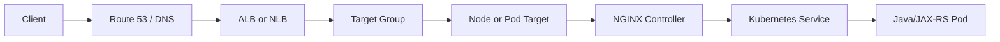

Not every architecture includes every box.

Examples:

```text
ALB IP target:
ALB -> Java pod
```

```text
NLB IP target to NGINX:
NLB -> NGINX pod -> Service -> Java pod
```

```text
NLB instance target:
NLB -> node NodePort -> NGINX pod -> Service -> Java pod
```

### Core invariant

> A load balancer being healthy only proves that its configured health-check path to the registered target is healthy. It does not prove that every host, path, NGINX route, Service, or Java dependency is healthy.

---

## AWS traffic path sebagai chain of contracts

For each hop, record:

| Hop | Contract |
|---|---|
| DNS | name, scope, record, target, TTL |
| LB listener | protocol, port, certificate, policy |
| listener rule | host/path/priority/action |
| target group | protocol, port, target type, health check |
| VPC | subnet, route, reachability |
| security | SG/NACL direction and port |
| target | node IP/NodePort or pod IP/port |
| Kubernetes | Service selector and EndpointSlice |
| NGINX | host/path, TLS, timeout, headers |
| Java | endpoint, readiness, auth, timeout |

If one contract is undocumented, incident attribution becomes guesswork.

---

## Reference topologies

### Topology A — Direct ALB

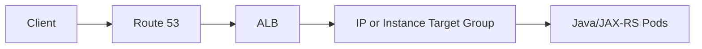

Typical when AWS Load Balancer Controller maps Ingress/Gateway directly to Services.

### Topology B — NLB to NGINX

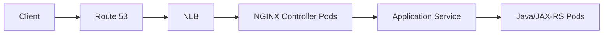

Typical when NGINX owns HTTP routing and NLB provides L4 exposure.

### Topology C — ALB to NGINX

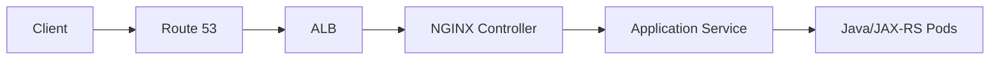

This is double L7 proxying.

### Topology D — Managed API edge

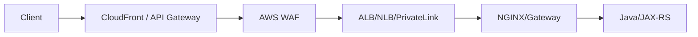

Useful when API product or global edge capability exists, but it requires strict policy ownership.

---

## Topology A: ALB langsung ke application pods

### Advantages

- fewer proxy hops;
- lower operational burden;
- ALB host/path routing;
- managed TLS with ACM;
- AWS WAF integration;
- direct IP targets can avoid NodePort hop;
- native AWS health/metrics.

### Limitations

- AWS-specific annotations and semantics;
- advanced NGINX behavior unavailable;
- less portable;
- application receives ALB-generated forwarded headers;
- per-route features constrained by ALB/controller capability;
- route count/rule limits and cost must be considered.

### Appropriate when

- routing is simple;
- no NGINX-specific features;
- cloud lock-in acceptable;
- managed solution preferred;
- direct target observability is sufficient.

---

## Topology B: NLB ke NGINX controller

NLB operates at L4/TLS layer and lets NGINX own HTTP semantics.

### Advantages

- NGINX retains host/path/routing behavior;
- supports opaque TCP/TLS patterns where appropriate;
- static network-facing characteristics are useful;
- can preserve client network identity depending target/protocol configuration;
- avoids ALB and NGINX both doing L7 routing.

### Costs

- NGINX data plane must be operated;
- source IP/PROXY protocol must be correct;
- TLS placement must be explicit;
- NLB health check can differ from NGINX route health;
- connection-level behavior matters;
- IP/instance target mode changes datapath.

### Typical path with instance target

```text
NLB
 -> EC2 node IP : NodePort
 -> kube-proxy/eBPF
 -> NGINX pod
 -> application Service
 -> Java pod
```

### Typical path with IP target

```text
NLB
 -> NGINX pod IP : targetPort
 -> application Service
 -> Java pod
```

---

## Topology C: ALB ke NGINX controller

Double L7 can be justified when:

- ALB provides WAF/managed public edge;
- NGINX provides cluster route/policy not available at ALB;
- organizational ownership requires a cloud edge and platform gateway;
- migration requires temporary coexistence.

### Risks

- duplicate host/path rules;
- two idle/read timeout layers;
- two access-log schemas;
- double header mutation;
- source IP trust complexity;
- two health systems;
- extra TLS termination/re-encryption;
- additional latency/cost;
- ambiguous 4xx/5xx owner.

### Required boundary

Example:

```text
ALB owns:
- internet exposure
- public certificate
- WAF
- coarse host forwarding

NGINX owns:
- internal host/path routing
- per-route buffering/timeouts
- cluster policy

Java owns:
- authz/business/idempotency
```

Do not duplicate the same route tree in both ALB and NGINX unless required and tested.

---

## Topology D: API Gateway/CloudFront/WAF ke private EKS edge

Possible components:

- CloudFront;
- AWS WAF;
- Amazon API Gateway;
- VPC Link;
- NLB;
- PrivateLink;
- internal ALB;
- NGINX.

### Use cases

- partner API;
- global edge;
- API keys/subscriptions;
- DDoS/WAF;
- caching;
- private backend exposure;
- separation of public and private network domains.

### Risk

Every additional managed service introduces:

- timeout;
- payload limit;
- header behavior;
- TLS boundary;
- logging;
- retry behavior;
- quota;
- cost;
- control-plane dependency.

Map all limits before production.

---

## Route 53 mental model

Route 53 maps a DNS name to another name or address. It does not proxy each HTTP request.

```text
client resolves name
 -> caches result
 -> opens connection to returned LB addresses
```

### Consequence

A DNS record change does not instantly redirect all existing clients because:

- recursive resolvers cache;
- clients cache;
- JVMs may cache;
- active keepalive/TCP connections remain;
- load balancer DNS itself resolves to changing addresses.

### Debugging invariant

Test both:

1. what DNS returns;
2. what the resolved endpoint does.

---

## Public dan private hosted zone

### Public hosted zone

Resolvable through public DNS.

Use for:

- internet-facing endpoints;
- public validation records;
- publicly resolvable names.

### Private hosted zone

Associated with one or more VPCs and resolved via VPC DNS context.

Use for:

- internal ALB/NLB;
- private service names;
- split internal environments.

### Risk

The same hostname can exist in public and private zones.

This creates split-horizon behavior:

```text
inside VPC  -> internal endpoint
outside VPC -> public endpoint
```

### Verify

- zone association;
- resolver path;
- forwarding rules;
- VPN/Direct Connect resolver behavior;
- client VPC;
- record ownership;
- environment isolation.

---

## Alias records, CNAME, TTL, dan split-horizon

### Alias

Route 53 Alias can target AWS resources such as ALB/NLB DNS names and can be used at zone apex.

### CNAME

Maps one name to another but has DNS constraints, especially at apex.

### TTL

TTL governs caching of the record you control, but not all provider-internal address rotation semantics.

### Weighted/failover records

Can support controlled traffic movement, but health and failover semantics must be tested.

### Anti-pattern

Using a very low TTL as the only rollback mechanism without validating:

- recursive resolver behavior;
- client DNS cache;
- JVM DNS cache;
- connection reuse;
- certificate coverage.

---

## DNS failure modes

| Symptom | Possible cause |
|---|---|
| NXDOMAIN | wrong zone/record/name |
| resolves only inside VPC | private hosted zone |
| resolves to old LB | cache/old record |
| intermittent resolution | resolver/network issue |
| correct DNS, connection timeout | SG/NACL/route/LB |
| one client sees old target | client/recursive cache |
| certificate mismatch after cutover | DNS points to endpoint with wrong cert |

### Commands

```bash
dig +short api.example.com
dig api.example.com
dig @<resolver-ip> api.example.com
nslookup api.example.com
getent hosts api.example.com
```

From Java runtime:

```bash
kubectl exec -n <ns> <pod> -- getent hosts api.example.com
```

---

## ALB versus NLB

| Dimension | ALB | NLB |
|---|---|---|
| Layer | L7 HTTP/HTTPS | L4 TCP/TLS/UDP |
| Routing | host/path/header and HTTP-aware rules | connection/target group |
| Client IP | forwarded headers | network source preservation/PROXY protocol depending mode |
| TLS | HTTP(S), certificate, ALPN policies | TLS listener or TCP passthrough |
| WAF | supported integration | not the normal direct WAF attachment point |
| WebSocket | supported as HTTP upgrade | transported as TCP if NGINX/backend handles it |
| gRPC | HTTP/2-aware capability | TCP/TLS transport; NGINX may terminate |
| Static IP | not typical direct fixed IP contract | zonal static IP/EIP options depending scheme |
| NGINX role | optional double L7 | common L4 front door |
| Target health | HTTP/HTTPS | TCP/HTTP/HTTPS depending configuration |
| Primary use | web/API L7 | high-throughput L4, TLS/TCP, NGINX fronting |

### Decision

Choose ALB when AWS-managed L7 behavior is the requirement.

Choose NLB when NGINX or another backend must own L7 semantics, or L4/TLS/TCP requirements dominate.

---

## Listeners

A listener receives client connections on a protocol/port.

Examples:

```text
ALB HTTPS :443
NLB TCP   :443
NLB TLS   :443
```

Listener responsibilities may include:

- certificate;
- TLS policy;
- default action;
- rule evaluation;
- forwarding;
- redirect;
- fixed response;
- authentication feature where supported.

### Review questions

- public/internal scheme?
- listener protocol?
- exact port?
- certificate?
- TLS policy?
- ALPN?
- default action?
- mTLS if used?
- access logging?
- idle timeout/connection attributes?

---

## Listener rules

ALB listener rules may route by HTTP attributes.

Potential mismatch with NGINX:

```text
ALB path /api/*
 -> NGINX

NGINX expects Host quote.example.com
 -> route
```

If ALB changes host/path or sends only a subset of traffic, NGINX behavior must be tested with actual forwarded request.

### Rule priority

ALB rules have priority. NGINX locations have another precedence model.

Double L7 means two different routing algorithms.

### Debugging

Capture:

- ALB listener rule matched;
- target group selected;
- NGINX server/location selected;
- application endpoint selected.

---

## Target groups

A target group defines:

- target type;
- target protocol;
- target port;
- registered targets;
- health check;
- deregistration behavior;
- load balancing attributes.

### Important distinction

Listener health does not exist independently; targets are healthy/unhealthy according to target-group health checks.

### Target registration sources

- controller reconciliation;
- `TargetGroupBinding`;
- AWS API/IaC;
- EKS Auto Mode;
- manual configuration—generally risky if controller also owns it.

### Drift risk

Do not manually edit controller-owned target groups unless the ownership model explicitly permits it. The controller may reconcile changes away.

---

## Target type instance

Instance target registers EC2 node instances.

### Generic path

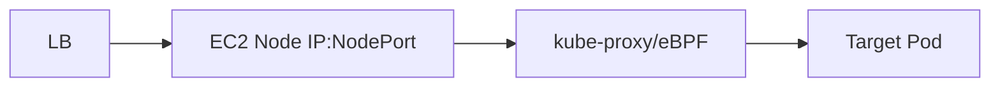

### Characteristics

- target group sees nodes;
- Service usually needs NodePort;
- packet may arrive at node without local pod;
- `externalTrafficPolicy` affects forwarding and source IP;
- extra hop may occur;
- health check often targets NodePort;
- Fargate is not compatible with instance target in the same way as EC2 nodes.

### Failure modes

- NodePort not open in SG;
- node registered but no local healthy pod with `Local`;
- kube-proxy/eBPF issue;
- wrong NodePort;
- target node draining;
- healthCheckNodePort mismatch;
- cross-node forwarding problem.

---

## Target type IP

IP target registers pod IP addresses.

### Generic path

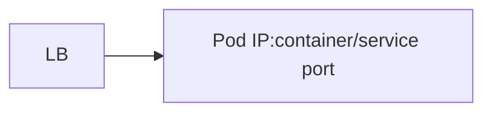

### Characteristics

- traffic can go directly to pod IP;
- avoids node/NodePort forwarding hop;
- requires routable/reachable pod IP;
- AWS VPC CNI naturally assigns VPC IPs to pods;
- target registration churn follows pod lifecycle;
- readiness and endpoint changes matter;
- pod security groups may affect reachability;
- subnet IP capacity becomes critical.

### Failure modes

- pod IP not registered;
- stale target during rollout;
- SG for pod blocks LB;
- pod subnet not selected/reachable;
- webhook/controller permission problem;
- target port mismatch;
- pod readiness and target health diverge.

---

## ALB instance/IP traffic path

### ALB instance mode

Conceptually:

```text
ALB
 -> node NodePort
 -> Service datapath
 -> application pod
```

### ALB IP mode

Conceptually:

```text
ALB
 -> application pod IP
```

For direct ALB integration, NGINX may not exist.

### With NGINX behind ALB

ALB targets may be:

- NGINX controller node/NodePort;
- NGINX controller pod IP;
- another Service depending architecture/controller.

Document the actual target group, not the desired diagram.

---

## NLB instance/IP traffic path

### NLB instance mode

```text
NLB
 -> EC2 node NodePort
 -> NGINX controller pod
```

### NLB IP mode

```text
NLB
 -> NGINX controller pod IP
```

### Operational effect

With IP targets:

- target set changes with pod lifecycle;
- fewer datapath hops;
- source IP semantics depend NLB attributes/protocol;
- per-pod SG/reachability matters.

With instance targets:

- target stability follows nodes;
- NodePort/kube-proxy path matters;
- source IP and `externalTrafficPolicy` are central;
- cross-node forwarding can add hop.

---

## AWS Load Balancer Controller

AWS LBC is a Kubernetes controller that reconciles AWS ELB resources.

Typical resources:

- `Ingress` -> ALB;
- `Service` type `LoadBalancer` -> NLB;
- Gateway API resources where supported/configured;
- `TargetGroupBinding` -> attach Kubernetes backends to existing target groups.

### Controller responsibilities

- discover desired Kubernetes objects;
- validate annotations/spec;
- create/update AWS load balancer;
- create listeners/rules/target groups;
- register/deregister targets;
- manage security group rules where configured;
- publish status;
- clean up resources through finalizers.

### It is not dataplane

If controller pod crashes:

- existing ALB/NLB may continue serving;
- new route/target changes may not reconcile;
- pod replacement registration may become stale;
- deletion may remain blocked;
- status may be stale.

---

## Controller reconciliation lifecycle

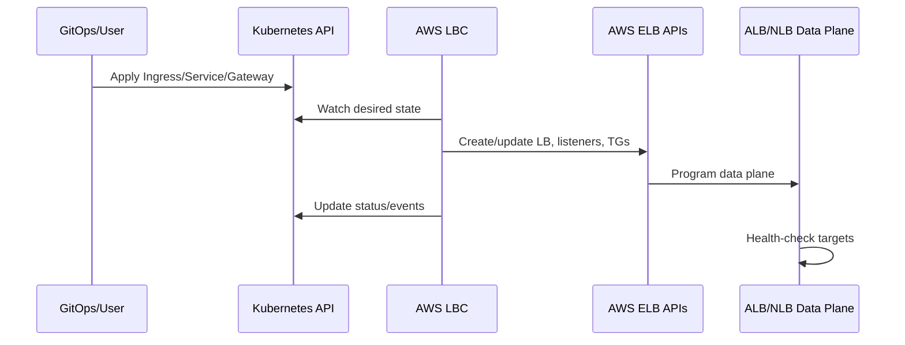

### Failure boundaries

- Kubernetes object invalid;
- admission webhook unavailable;
- controller not leader/healthy;
- IAM denied;
- AWS API throttled;
- subnet discovery failed;
- tag conflict;
- target registration failed;
- finalizer stuck;
- ELB programmed but target unhealthy.

---

## IAM, Pod Identity/IRSA, webhooks, dan finalizers

### IAM

Controller requires AWS permissions.

Verify:

- IAM policy version;
- role trust;
- EKS Pod Identity or IRSA setup;
- session/credential availability;
- least privilege;
- CloudTrail denied events.

### Webhooks

Controller may use admission/mutating webhooks.

Failures can block:

- Service/Ingress creation;
- TargetGroupBinding mutation;
- object updates.

Check:

```bash
kubectl get validatingwebhookconfigurations
kubectl get mutatingwebhookconfigurations
kubectl get pods -n kube-system
kubectl get svc,endpoints -n kube-system
```

### Finalizers

Finalizers ensure cloud resources are cleaned up.

Failure symptom:

```text
Kubernetes object stuck Terminating
```

Do not remove finalizer blindly before understanding orphaned AWS resources.

---

## Ingress, Service, Gateway, dan TargetGroupBinding

### Ingress

Usually drives ALB through AWS LBC.

### Service type LoadBalancer

Usually drives NLB when configured for AWS LBC/Auto Mode.

### Gateway

Can drive supported load balancer behavior if exact controller/version/CRDs support it.

### TargetGroupBinding

Connects Kubernetes Service/pods to an externally managed target group.

Use cases:

- IaC owns ALB/NLB;
- Kubernetes owns targets;
- blue/green across clusters;
- existing centralized load balancer.

### Ownership risk

Avoid two systems owning the same AWS resource attributes.

Document:

- CloudFormation/Terraform owner;
- controller owner;
- allowed manual changes;
- reconciliation direction;
- deletion behavior.

---

## EKS Auto Mode boundary

EKS Auto Mode may manage networking/load-balancing integration with a different supported annotation set and lifecycle.

### Do not assume

- every AWS LBC annotation is supported;
- migration is transparent;
- controller logs are available in same place;
- defaults are identical;
- security group ownership is identical;
- target type defaults are identical.

### Internal verification

- cluster uses Auto Mode or self-managed nodes/controller?
- which `loadBalancerClass`/IngressClass?
- which annotations supported?
- who owns IAM?
- how are upgrades handled?
- how are events/metrics exposed?

---

## VPC and subnet model

EKS networking exists inside VPC constructs.

Inbound path depends on:

- VPC CIDR;
- subnet CIDR;
- AZ;
- route table;
- internet gateway;
- NAT gateway—usually egress, not direct inbound;
- security groups;
- NACLs;
- pod IP allocation.

### Key invariant

A DNS name and healthy listener do not bypass VPC reachability rules.

---

## Internet gateway, NAT gateway, dan route tables

### Internet gateway

Enables internet routing for resources with appropriate public addressing and routes.

### NAT gateway

Primarily allows private-subnet resources to initiate outbound internet connections.

It is not the inbound path for an internet-facing ALB/NLB.

### Route table

Controls subnet routing.

Check:

- public subnet default route to Internet Gateway;
- private subnet routes;
- NAT path for egress;
- Transit Gateway/Direct Connect/VPN routes;
- pod subnet/custom networking routes;
- return path symmetry.

### Asymmetric routing

Custom appliances, Transit Gateway, inspection, or multi-VPC routing can cause response path differences and stateful firewall issues.

---

## Public versus private subnets

### Public subnet

Commonly has route to Internet Gateway.

Internet-facing load balancer nodes use appropriate public-facing architecture managed by AWS.

### Private subnet

No direct default route to Internet Gateway; commonly egresses through NAT or private connectivity.

Internal load balancers typically use private subnets.

### EKS nodes

Nodes can be in private subnets while an internet-facing load balancer is in public subnets.

### Security principle

Do not place application nodes in public subnets merely because public traffic must reach the service.

---

## Subnet discovery dan tagging

AWS LBC/Auto Mode discovers subnets according to configuration, tags, scheme, and controller behavior.

### Failure modes

- no eligible subnets;
- only one AZ selected;
- subnet lacks free IPs;
- wrong public/private role;
- tag conflict;
- cluster tag missing for legacy behavior;
- subnet too small;
- route table inconsistent.

### Review

- at least required AZ coverage;
- available IP count;
- scheme;
- tags;
- route;
- NACL;
- LB node address type;
- dual-stack requirements.

---

## Security groups

Security groups are stateful.

Typical groups:

- load balancer SG;
- node SG;
- pod SG;
- shared/backend SG;
- controller-managed SG.

### ALB path

Common contract:

```text
internet/client
 -> ALB SG listener 443
 -> backend SG target port
```

### NLB nuance

NLB security group support and controller behavior must be checked for the deployed configuration. Do not copy old assumptions that all NLBs behave identically.

### Required review

- inbound source;
- target port;
- health check port;
- return traffic;
- SG references versus CIDRs;
- controller-created rules;
- deletion/reconciliation;
- least privilege.

### Anti-pattern

Opening all node ports from `0.0.0.0/0` because health checks failed.

Fix the exact SG chain instead.

---

## Network ACLs

NACLs are stateless subnet-level controls.

You must permit:

- inbound listener/target port;
- outbound return traffic;
- ephemeral port ranges as required;
- health-check traffic;
- both directions explicitly.

### Common incident

SG is correct, but NACL blocks return traffic or ephemeral ports.

### Debugging

Combine:

- NACL rules;
- VPC Flow Logs;
- packet capture at target;
- target health reason.

---

## Security groups for pods

Security Groups for Pods can attach security policy closer to pod network interfaces.

### Benefits

- workload-level network isolation;
- direct LB-to-pod authorization;
- separation from node SG.

### Costs

- ENI/resource limits;
- operational complexity;
- compatibility/performance considerations;
- target reachability changes;
- additional debugging dimension.

### Review questions

- Does target group reach pod SG?
- Does health checker use same path?
- Are pods using branch ENIs?
- Are max-pod calculations adjusted?
- Is application egress allowed?

---

## Amazon VPC CNI dan pod IP

Amazon VPC CNI commonly assigns VPC-routable IP addresses to pods.

Conceptually:

```text
EC2 node
  -> ENIs
    -> secondary IPs/prefixes
      -> pod IPs
```

### Architectural consequence

IP target mode can register pod IPs directly because they are VPC-addressable.

### Verify actual CNI

Do not assume:

- all clusters use VPC CNI;
- custom networking is absent;
- pod subnets equal node subnets;
- IPv4 only;
- prefix delegation enabled;
- security groups for pods disabled.

---

## ENI/IP exhaustion dan pod density

Pod scheduling can fail even when CPU/memory exists because subnet/ENI IP capacity is exhausted.

### Capacity inputs

- instance ENI limit;
- IPs per ENI;
- prefix delegation;
- warm IP/prefix settings;
- subnet free IPs;
- custom networking;
- branch ENIs;
- Fargate profiles;
- dual-stack mode.

### Failure symptoms

- pods Pending;
- CNI allocation errors;
- target group lacks new pods;
- rollout stalls;
- HPA cannot add capacity;
- ingress remains healthy but backend capacity shrinks.

### Production review

IP capacity is a first-class capacity dimension.

---

## Kubernetes Service di jalur traffic

A Service provides stable virtual identity and endpoint selection.

But whether the Service virtual IP is traversed depends on architecture.

### NGINX to application

Common:

```text
NGINX
 -> ClusterIP Service
 -> EndpointSlice
 -> Java pod
```

Some controllers resolve endpoints directly and configure pod IPs as upstreams.

### ELB direct IP target

```text
ALB/NLB
 -> pod IP
```

The Service object may still define/select endpoints and drive target registration, but packet path can bypass ClusterIP.

### Debugging implication

Inspect both:

- Service/EndpointSlice desired state;
- actual target group registered targets.

---

## ClusterIP, NodePort, dan LoadBalancer

### ClusterIP

Internal virtual service IP.

### NodePort

Exposes Service port on nodes and is commonly used by instance target mode.

### LoadBalancer

Requests external load balancer integration.

### Hidden generated state

A `LoadBalancer` Service can also allocate:

- ClusterIP;
- NodePort, depending settings;
- health check node port;
- external status hostname.

Review actual object:

```bash
kubectl get svc -n <ns> <name> -o yaml
```

---

## `externalTrafficPolicy`

Values:

```text
Cluster
Local
```

### `Cluster`

A node receiving external traffic may forward to pods on another node.

Potential effects:

- source NAT depending implementation/path;
- extra hop;
- even cluster-wide distribution;
- health check can consider nodes regardless local endpoint.

### `Local`

External traffic is sent only to local endpoints on receiving node.

Potential benefits:

- source IP preservation in relevant instance-target paths;
- avoids cross-node forwarding.

Potential costs:

- uneven load;
- nodes without local endpoint should not receive traffic;
- health check/node registration semantics become important;
- rollout can temporarily reduce healthy nodes.

### Important nuance

`externalTrafficPolicy` is most relevant when traffic enters through node/NodePort. With direct IP targets, packet routing differs and source-IP behavior must be evaluated separately.

---

## kube-proxy/eBPF dan cross-node forwarding

Kubernetes Service implementation may use:

- iptables;
- IPVS;
- eBPF data plane;
- provider-specific behavior.

### Debugging questions

- Is kube-proxy running?
- Is eBPF replacing kube-proxy?
- Are Service rules programmed?
- Does node have local endpoint?
- Is conntrack saturated?
- Is return path symmetric?
- Is SNAT applied?

### Evidence

```bash
kubectl get pods -n kube-system
kubectl get endpointslice -n <ns> -l kubernetes.io/service-name=<svc>
kubectl get nodes -o wide
```

Node-level inspection depends on platform policy.

---

## NGINX controller Service

NGINX controller commonly exposes:

- data-plane HTTP/HTTPS ports;
- health endpoint;
- metrics;
- admission webhook separately.

Example conceptual Service:

```yaml
apiVersion: v1
kind: Service
metadata:
  name: nginx-gateway
spec:
  type: LoadBalancer
  externalTrafficPolicy: Local
  ports:
    - name: https
      port: 443
      targetPort: 443
  selector:
    app: nginx-gateway
```

### Validate

- selector matches controller pods;
- endpoints are Ready;
- port/targetPort correct;
- target type intended;
- scheme intended;
- health check intended;
- source IP behavior intended;
- annotations/LoadBalancerClass compatible;
- PDB/topology spread exists;
- replicas span AZs.

---

## Source IP mental model

At each hop, distinguish:

```text
network peer IP
forwarded client IP
PROXY protocol source IP
authenticated principal
```

These are not interchangeable.

### Example with ALB + NGINX

```text
NGINX network peer = ALB node address
X-Forwarded-For   = client, prior proxies...
authenticated user = token/session identity
```

### Example with NLB + PROXY protocol

```text
NGINX TCP peer before parsing = NLB
PROXY protocol source         = client
HTTP X-Forwarded-For          = may be absent/untrusted until NGINX creates it
```

---

## ALB dan `X-Forwarded-*`

ALB adds or processes headers such as:

- `X-Forwarded-For`;
- `X-Forwarded-Proto`;
- `X-Forwarded-Port`.

Default `X-Forwarded-For` behavior is typically append, but ALB attributes can alter processing.

### Trust rule

NGINX must trust forwarded headers only when request comes from trusted ALB/network path.

Do not use:

```nginx
set_real_ip_from 0.0.0.0/0;
real_ip_header X-Forwarded-For;
```

### Safer model

- restrict backend reachability to ALB SG;
- configure trusted source ranges/addresses appropriately;
- understand multi-proxy chain;
- choose correct recursive behavior;
- log original peer and derived client IP.

### Header chain example

```text
X-Forwarded-For: client, corporate-proxy, ALB-appended-address
```

Interpretation depends on which proxies are trusted.

---

## NLB client IP preservation

NLB source-IP behavior depends on:

- target type;
- protocol;
- client IP preservation target-group attribute;
- address family/translation;
- topology;
- PROXY protocol.

### Do not use a universal statement

Bad:

```text
NLB always preserves client IP.
```

Better:

```text
For this NLB target group, verify target type, client IP preservation attribute, protocol, IPv4/IPv6 translation, and whether PROXY protocol is enabled.
```

### Evidence

- target group attributes;
- NGINX `$remote_addr`;
- packet capture;
- PROXY protocol variables;
- source-IP test from known client.

---

## PROXY protocol v2

PROXY protocol sends connection metadata before application protocol bytes.

Conceptual payload order:

```text
PROXY v2 header
TLS or HTTP bytes
```

### Both sides must agree

```text
NLB sends PROXY v2
NGINX listener expects PROXY v2
```

If only one side enables it:

- NGINX may interpret binary prefix as invalid HTTP/TLS;
- health checks fail;
- TLS handshake fails;
- logs show malformed request;
- all targets become unhealthy.

### NGINX example

```nginx
listen 443 ssl proxy_protocol;

set_real_ip_from <trusted-nlb-source>;
real_ip_header proxy_protocol;
```

Exact trusted source strategy must match architecture.

### Health-check caveat

When PROXY protocol is enabled, health-check protocol/port must be compatible. Controller documentation warns that some HTTP/HTTPS health-check combinations require the receiving port to understand PROXY protocol.

### Security

Never trust PROXY protocol from arbitrary sources. Restrict network access to the known load balancer path.

---

## Trusted proxy configuration

Maintain separate values:

- socket peer;
- PROXY source;
- forwarded chain;
- final client IP.

Log them during validation:

```nginx
log_format aws_debug escape=json
  '{"remote_addr":"$remote_addr",'
  '"realip_remote_addr":"$realip_remote_addr",'
  '"proxy_protocol_addr":"$proxy_protocol_addr",'
  '"xff":"$http_x_forwarded_for",'
  '"host":"$host",'
  '"status":$status}';
```

Availability of variables/modules must be verified.

### Trust boundary invariant

Client-controlled headers are untrusted until replaced/normalized by the first trusted proxy.

---

## TLS placement patterns

### Pattern 1

```text
Client --TLS--> ALB --HTTP--> NGINX --HTTP--> Java
```

### Pattern 2

```text
Client --TLS--> ALB --HTTPS--> NGINX --HTTPS--> Java
```

### Pattern 3

```text
Client --TLS--> NLB TLS listener --TCP/HTTP--> NGINX
```

### Pattern 4

```text
Client --TLS passthrough through NLB--> NGINX terminates
```

### Pattern 5

```text
Client --TLS passthrough--> Java service terminates
```

Each has different:

- certificate owner;
- SNI;
- client IP mechanism;
- WAF visibility;
- HTTP routing visibility;
- re-encryption cost;
- compliance evidence;
- failure mode.

---

## TLS termination at ALB

### Benefits

- ACM-managed public certificate;
- ALB HTTP-aware routing;
- AWS WAF integration;
- centralized TLS policy;
- backend receives forwarded scheme.

### Risks

- backend hop may be plaintext unless HTTPS configured;
- NGINX must trust `X-Forwarded-Proto`;
- redirects can loop if scheme reconstruction wrong;
- ALB and NGINX certificates/policies may drift if re-encrypting;
- application may generate `http://` links if forwarded headers ignored.

### Review

- listener certificate/SAN;
- SNI multiple certificates;
- TLS policy;
- HTTP->HTTPS redirect;
- backend protocol;
- backend certificate validation;
- HSTS owner;
- mTLS requirement if any.

---

## TLS termination at NLB

NLB TLS listener can terminate TLS and forward to targets.

### Benefits

- managed certificate at NLB;
- L4-oriented architecture;
- backend may receive plaintext/TLS depending target protocol.

### Trade-offs

- NLB does not provide ALB’s HTTP route semantics;
- source identity needs separate handling;
- certificate/TLS policy lives at NLB;
- NGINX may no longer see client TLS details unless metadata is conveyed.

### Verify

- listener protocol TLS;
- target group protocol;
- ACM certificate;
- ALPN policy if relevant;
- target TLS behavior;
- health checks.

---

## TLS passthrough to NGINX

```text
NLB TCP :443
 -> NGINX listen 443 ssl
```

### Benefits

- NGINX owns certificate/SNI/mTLS;
- full NGINX TLS control;
- backend route can depend on HTTP after termination.

### Costs

- certificate rotation in Kubernetes/NGINX;
- NGINX CPU handles TLS;
- AWS WAF cannot inspect encrypted traffic at NLB;
- source IP/PROXY protocol must be designed;
- health checks require separate path/port or compatible TLS check.

---

## TLS re-encryption

```text
Client -> ALB TLS termination
ALB -> NGINX HTTPS
NGINX -> Java HTTPS
```

Use when required by trust/compliance boundary.

### Required controls

- backend SNI;
- backend certificate trust;
- hostname validation;
- internal CA rotation;
- timeout;
- keepalive;
- observability;
- certificate expiry alert.

### Anti-pattern

Encrypting every hop but disabling certificate verification.

Encryption without authentication does not establish the intended peer.

---

## ACM certificate lifecycle

ACM can manage certificates for supported AWS integrations.

### Verify

- certificate region;
- DNS validation records;
- auto-renew eligibility;
- SAN coverage;
- attached listeners;
- expiry/renewal metrics/events;
- private CA if used;
- cutover behavior;
- permission to attach certificate.

### Kubernetes certificates

If NGINX terminates TLS:

- Secret lifecycle;
- cert-manager/external secret integration;
- reload behavior;
- private key permissions;
- multi-replica consistency;
- expiry alerts

remain separate from ACM listener certificates.

---

## Health checks are layered

Health chain:

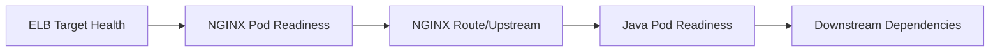

No one health check should pretend to prove all downstream dependencies indefinitely.

### Failure example

NLB health checks NGINX `/healthz`:

```text
NLB target = healthy
NGINX pod = healthy
quote Service = zero endpoints
client = 503
```

This is consistent, not contradictory.

---

## ELB target health versus Kubernetes readiness

### ELB target health

Answers:

```text
Can ELB reach the registered target and receive acceptable health response?
```

### Kubernetes readiness

Answers:

```text
Should Kubernetes include this pod as ready for Service endpoints?
```

They can diverge because:

- different port;
- different path;
- different protocol;
- different threshold;
- different timing;
- target is node versus pod;
- NGINX health endpoint independent of app endpoints.

### Monitor both

- AWS target health reason;
- pod readiness;
- EndpointSlice conditions;
- controller events;
- NGINX upstream errors.

---

## NGINX upstream health dan Java readiness

NGINX may proxy to:

- Service ClusterIP;
- direct pod endpoints;
- DNS-resolved upstream.

### Passive failure

NGINX can observe connection/read failures.

### Kubernetes readiness

Controller may remove unready endpoints from generated upstreams.

### Java readiness

Should indicate whether the pod can safely receive requests.

### Danger

If readiness depends on every downstream service, a downstream outage may remove every pod and create total 503.

Use a deliberate readiness philosophy:

- process initialized;
- required local resources ready;
- critical dependencies evaluated carefully;
- degradation versus removal differentiated.

---

## Readiness endpoint design

Good readiness endpoint:

- fast;
- bounded;
- low allocation;
- no sensitive data;
- deterministic;
- separate from liveness;
- reflects ability to serve core traffic;
- does not perform expensive full dependency scans per health check.

### Separate endpoints where useful

```text
/health/live
/health/ready
/health/startup
```

### ALB/NLB health endpoint

If checking NGINX controller, use controller-supported health endpoint rather than arbitrary application route unless end-to-end health is explicitly desired.

---

## Timeout and connection alignment

Possible timeout layers:

- client;
- CloudFront/API Gateway;
- ALB/NLB connection attributes;
- NGINX client/upstream timeouts;
- Java server timeout;
- Java HTTP client;
- database;
- downstream service.

### Required ordering

Outer deadline must allow inner failure to surface before outer connection disappears.

### Long-lived traffic

For:

- WebSocket;
- SSE;
- long polling;
- large upload/download

verify:

- ALB idle timeout;
- NLB TCP idle timeout;
- NGINX read/send timeout;
- application heartbeat;
- client reconnect behavior;
- rolling termination.

### Do not memorize one default

Defaults and configurable ranges can change. Record effective values from live infrastructure.

---

## Cross-zone and multi-AZ behavior

A multi-AZ EKS path can cross zones at multiple points:

```text
client
 -> LB node in AZ A
 -> target in AZ B
 -> NGINX in AZ B
 -> Java pod in AZ C
```

Potential effects:

- inter-AZ data cost;
- latency;
- failure coupling;
- uneven load;
- zonal outage behavior.

### Review

- LB subnet/AZ coverage;
- cross-zone setting;
- target distribution;
- topology spread;
- node groups;
- pod anti-affinity;
- Service traffic policy;
- zone-aware routing;
- capacity after losing one AZ.

### N+1 principle

After losing one AZ, remaining ingress and application capacity should handle expected load with headroom.

---

## Connection draining and deregistration

During rollout:

1. pod receives termination signal;
2. readiness becomes false;
3. EndpointSlice updates;
4. controller deregisters target or updates NGINX;
5. ELB deregistration delay drains;
6. NGINX graceful shutdown drains;
7. Java server stops accepting;
8. grace period expires.

### Race risks

- target still receives traffic after process exits;
- pod killed before deregistration;
- NGINX reload drops long-lived connections;
- `terminationGracePeriodSeconds` shorter than drain delay;
- preStop sleeps without readiness transition;
- direct IP target registration lags.

### Test

- short requests;
- long requests;
- WebSocket/SSE;
- upload;
- retry behavior;
- scale down;
- node drain;
- AZ disruption.

---

## PrivateLink dan VPC endpoint services

NLB can back a VPC endpoint service for PrivateLink.

Conceptual flow:

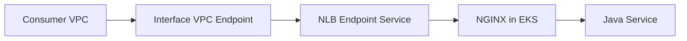

### Benefits

- private cross-VPC/service exposure;
- no public internet;
- provider-consumer separation;
- scalable private connectivity.

### Concerns

- DNS;
- endpoint acceptance;
- source IP semantics;
- NLB target health;
- security groups;
- cross-account permissions;
- TLS names/certificates;
- observability across account boundary.

### Not the same as Gateway VPC endpoint

“VPC endpoint” can refer to multiple AWS concepts. Name the exact service and direction.

---

## Internal-only EKS ingress

Typical:

```text
private Route 53 zone
 -> internal ALB/NLB
 -> NGINX
 -> Java services
```

### Controls

- internal scheme;
- private subnets;
- SG source restricted to corporate/VPN/VPC;
- private DNS;
- certificate trusted by internal clients;
- no public alternate route;
- egress controls;
- audit/access logs.

### Bypass check

Ensure NodePort, public node IP, alternate Service, or direct pod route does not expose an unintended path that bypasses NGINX/auth/WAF.

---

## WAF, Shield, and edge security placement

### AWS WAF

Commonly integrated at HTTP-aware edges such as:

- ALB;
- CloudFront;
- API Gateway.

It is not a replacement for:

- domain authorization;
- input validation;
- rate/concurrency protection inside application;
- secure NGINX config.

### Shield

Provides DDoS protections at AWS edge/service level depending offering.

### Layered security

```text
AWS edge protection
 -> WAF
 -> ALB/API gateway
 -> NGINX limits/auth
 -> Java validation/authz
```

Each layer must have distinct purpose.

---

## Observability evidence map

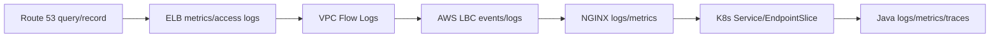

### Incident evidence checklist

- DNS answer;
- LB state;
- listener/rule;
- target group health;
- target registration;
- SG/NACL;
- controller event;
- Service/EndpointSlice;
- NGINX access/error;
- application request;
- trace.

---

## CloudWatch and ELB metrics

Relevant metric categories:

- request/connection count;
- target response time;
- target connection error;
- healthy/unhealthy host count;
- HTTP code counts;
- rejected connections;
- processed bytes;
- TLS negotiation errors;
- reset counts;
- zonal distribution.

Exact metric names differ by ALB/NLB.

### Alert philosophy

Alert on:

- sustained unhealthy target count;
- no healthy targets;
- sudden target 5xx;
- load balancer 5xx;
- target connection errors;
- latency percentile/baseline deviation;
- TLS error spike;
- zonal imbalance.

Avoid one noisy threshold without traffic context.

---

## Access logs, controller logs, NGINX logs, and application logs

### ELB access logs

Can show:

- client;
- target;
- request;
- status;
- timing;
- TLS;
- bytes;
- selected target.

Field availability differs by LB type/version.

### AWS LBC logs/events

Show:

- reconciliation;
- AWS API errors;
- invalid annotations;
- subnet discovery;
- target registration;
- webhook problems.

### NGINX logs

Show:

- selected virtual host/location;
- upstream;
- upstream status;
- request/upstream timing;
- client/forwarded IP;
- retry attempt.

### Java logs

Show:

- resource method;
- principal;
- domain decision;
- downstream call;
- transaction outcome.

### Correlation

Use a request ID propagated through all HTTP-aware hops.

For NLB TCP passthrough, correlation begins after HTTP is parsed by NGINX/application.

---

## VPC Flow Logs

VPC Flow Logs help answer network-level questions:

- accepted/rejected traffic;
- source/destination;
- port;
- interface;
- bytes/packets.

### Limitations

They do not show:

- HTTP host/path;
- TLS certificate reason;
- NGINX location;
- Java exception;
- exact packet payload.

### Use case

If target health says timeout and NGINX has no connection log:

- inspect SG/NACL;
- inspect Flow Logs;
- inspect listener/target port;
- inspect pod/node reachability.

---

## Trace propagation

ALB may add AWS-specific tracing headers; application observability may use W3C `traceparent`.

### Contract

- preserve trusted W3C context;
- reject/normalize malformed context;
- do not create disconnected trace at every proxy;
- generate request ID if absent;
- avoid using client-supplied IDs as authorization;
- log both edge and app trace correlation where possible.

### NGINX

Official OTel module availability must be verified in actual image/build/controller.

---

## End-to-end latency decomposition

```text
total =
 DNS lookup
+ TCP/TLS to LB
+ LB queue/processing
+ LB-to-target connect
+ NGINX queue/processing
+ NGINX-to-app connect
+ Java processing
+ downstream time
+ response transfer
```

### Evidence mapping

| Component | Evidence |
|---|---|
| DNS | client resolver timing |
| client->LB TLS | client/curl timing, LB TLS metrics |
| ALB | access log processing/target times |
| NLB | connection/flow metrics |
| NGINX | `$request_time`, upstream timing |
| Java | server span/timer |
| DB/downstream | child spans/client metrics |

### Avoid

Attributing all latency to Java based only on client-observed duration.

---

## Common failure modes

| Layer | Failure | Client symptom |
|---|---|---|
| Route 53 | wrong/NXDOMAIN/private zone | DNS failure |
| listener | missing port/cert | timeout/TLS failure |
| listener rule | wrong target group | 404/wrong backend |
| target group | no healthy targets | 503/connection failure |
| SG | target port blocked | unhealthy/timeout |
| NACL | return/ephemeral blocked | timeout/intermittent |
| subnet | no IP/incorrect route | provisioning/connection issue |
| controller | IAM/reconcile failure | stale/missing LB |
| NodePort | wrong/unreachable | unhealthy |
| EndpointSlice | zero ready endpoints | 503 |
| NGINX | route/upstream timeout | 404/502/503/504 |
| Java | exception/dependency | 5xx/latency |
| TLS chain | cert/SNI/CA mismatch | handshake/502 |

---

## Debugging DNS

### Step 1 — Resolve from actual client context

```bash
dig +short api.example.com
```

### Step 2 — Determine public/private answer

Run from:

- internet;
- corporate network;
- VPN;
- EKS pod;
- bastion.

### Step 3 — inspect Route 53

Verify:

- hosted zone;
- record type;
- alias target;
- routing policy;
- health evaluation;
- TTL;
- overlapping private/public records.

### Step 4 — bypass DNS carefully

For HTTP/TLS:

```bash
curl -vk --resolve api.example.com:443:<resolved-ip> \
  https://api.example.com/health
```

ALB/NLB DNS can map to multiple addresses; use this only as a point-in-time test.

---

## Debugging TLS

### Client-side

```bash
openssl s_client \
  -connect api.example.com:443 \
  -servername api.example.com \
  -showcerts
```

Check:

- certificate subject/SAN;
- chain;
- expiry;
- SNI;
- protocol/cipher;
- ALPN.

### Determine termination point

- ACM attached to ALB/NLB?
- Kubernetes TLS Secret?
- Java keystore?
- re-encryption?
- backend cert verification?

### Common causes

- wrong listener certificate;
- certificate in wrong region;
- SAN missing;
- expired internal cert;
- NGINX SNI mismatch;
- backend HTTPS expected but target group uses HTTP;
- PROXY header sent to TLS listener not configured for it.

---

## Debugging unhealthy targets

### AWS evidence

```bash
aws elbv2 describe-target-health \
  --target-group-arn <arn>
```

Inspect reason codes and descriptions.

### Kubernetes evidence

```bash
kubectl get pods -n <ns> -o wide
kubectl get svc -n <ns> <svc> -o yaml
kubectl get endpointslice -n <ns> \
  -l kubernetes.io/service-name=<svc> -o yaml
kubectl describe pod -n <ns> <pod>
```

### Network test

From a controlled pod/node:

```bash
curl -sv http://<target-ip>:<port>/<health-path>
```

### Compare

- target group port;
- Service port;
- targetPort;
- container port;
- health path;
- Host header;
- protocol;
- source security group.

---

## Debugging security group and NACL

### Decision sequence

1. Does LB listener receive connection?
2. Is target registered?
3. Does health check time out or reject?
4. Is LB SG allowed to target SG?
5. Is target port correct?
6. Does NACL permit both directions?
7. Is return path valid?
8. Does pod SG differ from node SG?
9. Do Flow Logs show `REJECT`?

### Avoid

Changing multiple SG/NACL rules simultaneously.

Make one evidence-based change and preserve auditability.

---

## Debugging source IP

### ALB

Log:

- socket peer;
- full `X-Forwarded-For`;
- derived real IP;
- request ID.

Verify ALB `X-Forwarded-For` processing mode.

### NLB

Verify:

- target type;
- client IP preservation attribute;
- PROXY protocol enabled?
- NGINX listener expects it?
- `externalTrafficPolicy`;
- address-family translation;
- source seen in packet capture.

### Test

Use a known external source IP and compare:

- client observed IP;
- LB log;
- NGINX variables;
- Java access log.

---

## Debugging ALB 4xx/5xx

### 4xx may originate from

- ALB listener/auth behavior;
- malformed request;
- rule fixed response;
- NGINX;
- Java.

### 502 may indicate

- target connection reset;
- malformed target response;
- TLS/backend protocol mismatch;
- target closed connection.

### 503 may indicate

- no healthy/available targets;
- rule/action issue;
- downstream NGINX/application 503.

### 504 may indicate

- target response timeout.

### Required evidence

Use ALB access-log fields plus target status and NGINX/app logs.

Do not infer from client status alone.

---

## Debugging NGINX 502/503/504

### 502

Check:

- upstream connect refused/reset;
- wrong protocol HTTP/HTTPS;
- invalid response;
- pod restart;
- Service target port;
- backend TLS/SNI.

### 503

Check:

- no upstream endpoints;
- rate/limit policy;
- maintenance response;
- controller config not accepted;
- Service zero endpoints.

### 504

Check:

- `proxy_read_timeout`;
- Java latency;
- database/downstream;
- retry attempts;
- outer ALB timeout;
- client cancellation.

### Evidence

NGINX structured fields:

```text
upstream_addr
upstream_status
upstream_connect_time
upstream_header_time
upstream_response_time
request_time
```

---

## Debugging Service/EndpointSlice/pod routing

### Service

```bash
kubectl get svc -n <ns> <svc> -o yaml
```

Check:

- selector;
- port;
- targetPort;
- type;
- traffic policies.

### EndpointSlice

```bash
kubectl get endpointslice -n <ns> \
  -l kubernetes.io/service-name=<svc> -o wide
```

Check:

- addresses;
- ports;
- ready/serving/terminating;
- zone/node.

### Pod

```bash
kubectl get pod -n <ns> <pod> -o wide
kubectl describe pod -n <ns> <pod>
kubectl logs -n <ns> <pod>
```

### In-pod test

```bash
kubectl exec -n <ns> <debug-pod> -- \
  curl -sv http://<service-name>:<port>/<path>
```

Then test pod IP directly where policy permits.

---

## Java/JAX-RS implications

### Forwarded headers

Application must be configured to trust only known proxy chain.

Use cases:

- redirect URL;
- absolute URI;
- OpenAPI server;
- secure cookie;
- scheme detection;
- audit client IP.

### Host and path

ALB/NGINX rewrites can create:

- context path mismatch;
- wrong `UriInfo`;
- double prefix;
- missing base path;
- incorrect callback URL.

### Readiness

Java readiness must align with:

- target-group health;
- Kubernetes readiness;
- NGINX route availability;
- startup duration;
- graceful termination.

### Timeouts

Align:

- ALB/NLB connection behavior;
- NGINX proxy timeouts;
- JAX-RS async timeout;
- Java HTTP client;
- DB statement timeout.

### Idempotency

Outer layers may retry or clients may reconnect after ambiguous timeout.

Mutation endpoints need:

- idempotency key;
- deduplication;
- transaction integrity;
- audit.

### Client IP

Do not use client IP as identity.

Use it only for:

- audit signal;
- coarse rate limiting;
- anomaly detection;
- geolocation where approved.

---

## Security concerns

1. **Direct backend bypass**
   - node/pod/alternate LB route bypasses NGINX/WAF.

2. **Forwarded-header spoofing**
   - backend reachable by untrusted source.

3. **Overbroad SG**
   - all NodePorts publicly open.

4. **PROXY protocol trust**
   - arbitrary sender can forge metadata.

5. **TLS downgrade**
   - public TLS but unprotected backend where policy requires encryption.

6. **Certificate sprawl**
   - ACM and Kubernetes Secrets drift.

7. **Controller IAM**
   - excessive AWS permissions.

8. **Cross-namespace route exposure**
   - wrong Ingress/Gateway permissions.

9. **WAF assumption**
   - NLB path bypasses HTTP WAF.

10. **Log privacy**
    - headers/tokens/PII in ALB/NGINX logs.

### Security invariant

Every reachable backend path must enforce the intended trust boundary, not only the “main” DNS route.

---

## Performance and cost concerns

### Extra hops

ALB -> NGINX -> Java adds:

- L7 processing;
- connection pool;
- latency;
- data processing;
- logs;
- failure surface.

### Cross-zone traffic

Can add:

- latency;
- inter-AZ cost;
- uneven failure behavior.

### TLS

Termination/re-encryption consumes:

- handshake CPU;
- connection state;
- certificate operations.

### Logging

ELB + NGINX + Java logs increase storage cost. Design sampling/retention and correlation.

### Health checks

Many target groups × frequent health checks × many pods can create non-trivial traffic.

### Idle connections

Keepalive/WebSocket/SSE consume:

- LB connection tracking;
- NGINX worker connections;
- pod file descriptors;
- memory.

### Cost review

Include:

- ALB/NLB hourly and capacity-unit charges;
- cross-zone/inter-AZ data;
- NAT data for egress where applicable;
- CloudWatch/log storage;
- WAF;
- PrivateLink;
- controller/node resources;
- NGINX replicas.

---

## Capacity and scaling concerns

### Ingress capacity

- NGINX replicas;
- CPU/memory;
- worker connections;
- node distribution;
- PDB;
- HPA;
- load balancer target registration.

### Application capacity

- Java executor/thread model;
- DB pool;
- downstream limits;
- pod count;
- readiness speed.

### Network capacity

- subnet IPs;
- ENIs;
- pod density;
- conntrack;
- ephemeral ports;
- SG rules;
- target-group limits;
- LB quotas.

### Failure capacity

Plan for:

- one AZ loss;
- one node group loss;
- controller rollout;
- target group churn;
- traffic spike;
- downstream degradation.

---

## Safe rollout checklist

### Before change

- [ ] Capture current DNS, LB, listeners, target groups, attributes, SG, subnets.
- [ ] Capture Kubernetes Service/Ingress/Gateway manifests.
- [ ] Capture NGINX generated config.
- [ ] Validate target health.
- [ ] Define expected source IP and forwarded headers.
- [ ] Define rollback.
- [ ] Define success/SLO metrics.

### During change

- [ ] Watch controller logs/events.
- [ ] Watch target registration and health.
- [ ] Watch NGINX reload/config.
- [ ] Run synthetic requests with correct Host/SNI.
- [ ] Verify Java receives request/principal/path.
- [ ] Watch 4xx/5xx/latency.
- [ ] Verify multiple AZs.

### After change

- [ ] Verify no orphan LB/TG/SG.
- [ ] Verify DNS and certificate.
- [ ] Verify source IP.
- [ ] Verify long-lived connections.
- [ ] Verify scale-up/scale-down.
- [ ] Update diagrams/runbooks.
- [ ] Remove obsolete routes/resources only after evidence.

---

## PR review checklist

### Architecture

- [ ] ALB versus NLB choice is justified by protocol/capability.
- [ ] NGINX adds an explicit requirement, not accidental duplication.
- [ ] Target type instance/IP is explicit.
- [ ] Actual packet path is diagrammed.
- [ ] Controller/Auto Mode ownership is explicit.
- [ ] Multi-AZ failure path is considered.

### DNS/TLS

- [ ] Public/private hosted zone is correct.
- [ ] Alias target is correct.
- [ ] Certificate/SAN/region is correct.
- [ ] TLS termination points are documented.
- [ ] Backend TLS verification is defined.
- [ ] HTTP->HTTPS redirect owner is single.

### Network

- [ ] Subnet scheme/tags/routes are correct.
- [ ] SG source/target/health ports are minimal.
- [ ] NACL return path is allowed.
- [ ] Pod SG behavior is considered.
- [ ] Subnet IP headroom is measured.
- [ ] Cross-zone behavior is understood.

### Kubernetes/NGINX

- [ ] Service ports/targetPorts/selectors are correct.
- [ ] `externalTrafficPolicy` is intentional.
- [ ] NGINX replicas/topology/PDB are adequate.
- [ ] Health endpoint is correct.
- [ ] Source IP/PROXY protocol is end-to-end consistent.
- [ ] Forwarded headers are sanitized/trusted correctly.
- [ ] Timeout/retry/buffering are aligned.
- [ ] Graceful termination is tested.

### Observability

- [ ] ELB metrics/logs are enabled where required.
- [ ] AWS LBC events/logs are available.
- [ ] NGINX structured upstream timing exists.
- [ ] Java request correlation exists.
- [ ] Target-health alerts exist.
- [ ] VPC Flow Logs are available for network incidents.
- [ ] Status provenance can be identified.

---

## Internal verification checklist

> Gunakan daftar ini untuk repository/codebase/cluster CSG yang benar-benar tersedia. Jangan mengisi dengan asumsi.

### Route 53 and DNS

- [ ] Daftar public/private hosted zones yang terkait aplikasi.
- [ ] Record name/type/alias target/routing policy.
- [ ] Split-horizon behavior.
- [ ] TTL and rollback assumptions.
- [ ] Resolver path from corporate, VPN, EKS, and external clients.
- [ ] DNS ownership and change process.
- [ ] Certificate DNS validation records.

### Load balancers

- [ ] Inventory ALB/NLB per environment.
- [ ] Scheme: internet-facing/internal.
- [ ] Subnets/AZs.
- [ ] IP address type: IPv4/dual-stack.
- [ ] Listeners, ports, protocols, rules.
- [ ] ACM certificates and TLS policies.
- [ ] Target groups and target types.
- [ ] Health-check protocol/port/path/thresholds.
- [ ] Target-group attributes, deregistration, stickiness, source-IP settings.
- [ ] ALB idle timeout/NLB connection attributes.
- [ ] Cross-zone configuration.
- [ ] Access logging destination and retention.
- [ ] AWS WAF/Shield association.
- [ ] Resource tags/ownership/cost allocation.

### AWS Load Balancer Controller / EKS Auto Mode

- [ ] Cluster uses AWS LBC, EKS Auto Mode, legacy in-tree behavior, or combination.
- [ ] Exact AWS LBC version.
- [ ] Helm values/controller flags.
- [ ] `IngressClass`, `GatewayClass`, `LoadBalancerClass`.
- [ ] Installed CRDs including `TargetGroupBinding` and Gateway API.
- [ ] IAM role/policy and IRSA/Pod Identity.
- [ ] Webhook health.
- [ ] Controller replicas/PDB/node placement.
- [ ] Controller logs/events/metrics.
- [ ] Supported annotations documented for deployed mode.
- [ ] Finalizer/orphan cleanup runbook.
- [ ] Gateway API support/conformance verified if used.

### VPC/network

- [ ] VPC CIDR and secondary CIDRs.
- [ ] Node and pod subnets.
- [ ] Route tables.
- [ ] Internet Gateway/NAT Gateway/TGW/VPN/Direct Connect path.
- [ ] Subnet available IPs.
- [ ] Subnet discovery tags.
- [ ] Load balancer SGs.
- [ ] Node SGs.
- [ ] Pod SGs.
- [ ] NACLs and ephemeral ports.
- [ ] VPC Flow Logs.
- [ ] IPv4/IPv6 behavior.
- [ ] Cross-account/VPC connectivity.
- [ ] PrivateLink endpoint services/endpoints.

### Amazon VPC CNI

- [ ] Exact CNI version.
- [ ] Prefix delegation.
- [ ] Custom networking/ENIConfig.
- [ ] Warm IP/prefix settings.
- [ ] Max pods calculation.
- [ ] Security Groups for Pods.
- [ ] Branch ENI capacity.
- [ ] Subnet/IP exhaustion alerts.
- [ ] CNI logs and incident history.

### Kubernetes Service and NGINX

- [ ] NGINX controller distribution/version/support status.
- [ ] Ensure no unsupported retired controller remains unnoticed.
- [ ] Controller Service type.
- [ ] Annotations/LoadBalancerClass.
- [ ] Target type instance/IP.
- [ ] `externalTrafficPolicy`.
- [ ] NodePort/healthCheckNodePort.
- [ ] Service selector and EndpointSlices.
- [ ] Controller replicas across AZs.
- [ ] PDB/topology spread/HPA.
- [ ] NGINX health endpoint.
- [ ] NGINX access/error logs.
- [ ] Generated config.
- [ ] ConfigMap/annotations/snippets.
- [ ] Source-IP and trusted-proxy configuration.
- [ ] PROXY protocol on both NLB and NGINX.
- [ ] TLS Secrets/cert-manager if NGINX terminates.
- [ ] Graceful reload/shutdown settings.

### Application/Java/JAX-RS

- [ ] Service/target ports.
- [ ] readiness/liveness/startup endpoints.
- [ ] trusted forwarded-header configuration.
- [ ] external URI/redirect behavior.
- [ ] client IP audit behavior.
- [ ] authentication/identity header contract.
- [ ] domain authorization.
- [ ] request/downstream/DB timeout.
- [ ] idempotency for mutations.
- [ ] graceful shutdown and termination grace.
- [ ] OpenTelemetry/request ID propagation.
- [ ] dependency degradation behavior.
- [ ] load test and capacity evidence.

### Operations and incident evidence

- [ ] CloudWatch dashboards and alarms.
- [ ] ELB access-log query examples.
- [ ] target-health runbook.
- [ ] DNS/TLS runbook.
- [ ] SG/NACL/Flow Logs runbook.
- [ ] controller reconcile failure runbook.
- [ ] NGINX 502/503/504 runbook.
- [ ] certificate expiry alerts.
- [ ] subnet/IP exhaustion alerts.
- [ ] multi-AZ failover test.
- [ ] node drain/rollout test.
- [ ] incident notes and RCAs involving ALB/NLB/EKS ingress.
- [ ] architecture diagrams match live state.

---

## Ringkasan mental model

```text
Route 53
  tells the client where to connect

ALB/NLB
  accepts connections and selects registered healthy targets

Target type
  determines whether target is a node or a pod IP

VPC/SG/NACL
  determines network reachability

Kubernetes Service/EndpointSlice
  determines backend membership

NGINX
  determines HTTP/TLS routing and proxy behavior

Java/JAX-RS
  determines domain behavior and final application response
```

Final principles:

1. ALB and NLB are not interchangeable.
2. Instance and IP target modes produce different datapaths.
3. Source IP is a contract, not a default assumption.
4. PROXY protocol must be enabled consistently at sender and receiver.
5. Health is layered; a healthy NLB/ALB does not prove application routes work.
6. AWS LBC is a control plane; ELB is the data plane.
7. VPC IP capacity can limit application scaling before CPU/memory.
8. Double L7 proxying must have explicit ownership boundaries.
9. Debug from DNS inward and correlate evidence at every hop.
10. Internal architecture must be verified from live AWS/Kubernetes state, not inferred from generic EKS patterns.

---

## Referensi resmi

- [Route internet traffic with AWS Load Balancer Controller](https://docs.aws.amazon.com/eks/latest/userguide/aws-load-balancer-controller.html)
- [Application traffic with ALB on EKS](https://docs.aws.amazon.com/eks/latest/userguide/alb-ingress.html)
- [Network Load Balancing on EKS](https://docs.aws.amazon.com/eks/latest/userguide/network-load-balancing.html)
- [AWS Load Balancer Controller — ALB annotations](https://kubernetes-sigs.github.io/aws-load-balancer-controller/latest/guide/ingress/annotations/)
- [AWS Load Balancer Controller — NLB](https://kubernetes-sigs.github.io/aws-load-balancer-controller/latest/guide/service/nlb/)
- [AWS Load Balancer Controller — Service annotations](https://kubernetes-sigs.github.io/aws-load-balancer-controller/latest/guide/service/annotations/)
- [ALB X-Forwarded headers](https://docs.aws.amazon.com/elasticloadbalancing/latest/application/x-forwarded-headers.html)
- [ALB target groups](https://docs.aws.amazon.com/elasticloadbalancing/latest/application/load-balancer-target-groups.html)
- [NLB target group attributes](https://docs.aws.amazon.com/elasticloadbalancing/latest/network/edit-target-group-attributes.html)
- [Amazon VPC CNI best practices](https://docs.aws.amazon.com/eks/latest/best-practices/vpc-cni.html)
- [Amazon EKS networking best practices](https://docs.aws.amazon.com/eks/latest/best-practices/networking.html)
- [Manage Amazon VPC CNI](https://docs.aws.amazon.com/eks/latest/userguide/managing-vpc-cni.html)
