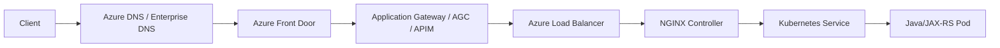
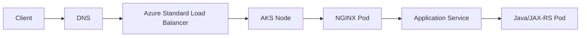
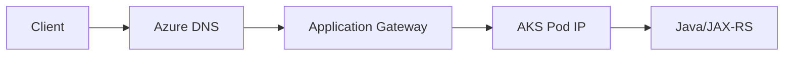
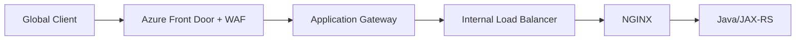
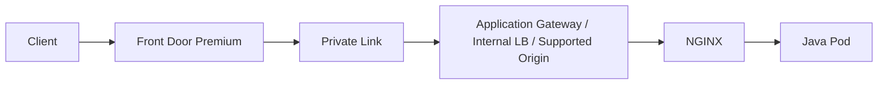
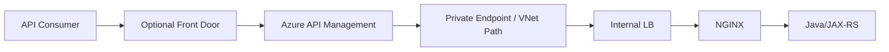
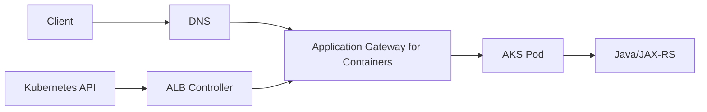
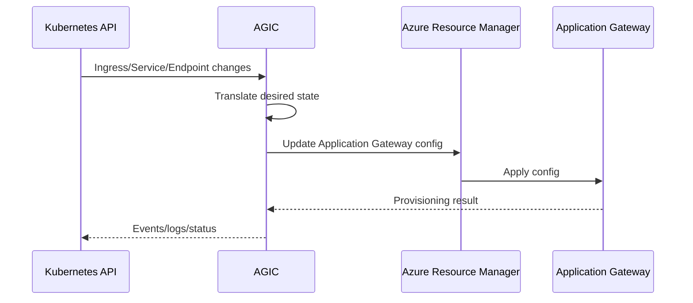
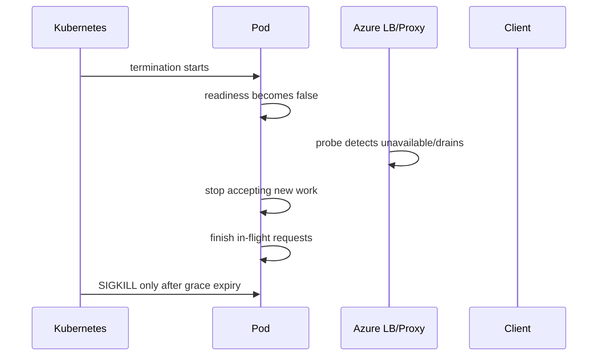

# Part 023 — Azure/AKS Traffic Flow: DNS and Edge to NGINX and Pods

> **Depth level:** Production/Architecture-level  
> **Prerequisite:** Part 002, 007–009, 015, dan 018–021; dasar Azure DNS, VNet, subnet, NSG, UDR, Azure Load Balancer, Application Gateway, Front Door, API Management, AKS networking, Kubernetes Service/Ingress/Gateway, dan NGINX reverse proxy.  
> **Scope:** Azure DNS, Front Door, Application Gateway, AGIC, Application Gateway for Containers, Azure Load Balancer, API Management, public/private IP, VNet/subnet/NSG/UDR, Private Link/Private Endpoint, AKS pod networking, Kubernetes Service, NGINX ingress, source IP, forwarded headers, TLS, health probes, observability, failure attribution, Java/JAX-RS impact, debugging, PR review, dan internal verification.  
> **Bukan scope utama:** generic on-prem/hybrid—Part 024; DNS resolver internals—Part 025; WebSocket/SSE detail—Part 026; GitOps—Part 029; full incident runbook—Part 032.

---

## Current Azure/AKS note — 11 July 2026

- Kubernetes community `ingress-nginx` telah retired pada 24 March 2026. Microsoft menyatakan AKS **application routing add-on with NGINX** tetap memperoleh official support untuk critical security patches dan production workloads sampai **November 2026**. Ini adalah temporary support horizon, bukan alasan untuk menunda migration planning.
- Microsoft mengarahkan pengguna managed NGINX application-routing untuk bermigrasi ke **application routing Gateway API implementation** atau implementation lain yang didukung sebelum support window berakhir.
- Application routing Gateway API pada AKS saat ini menggunakan Istio control plane untuk mengelola Gateway API infrastructure, tetapi bukan full Istio service mesh. Ia tidak dapat diaktifkan bersamaan dengan AKS Istio service mesh add-on.
- **AGIC** memprogram Azure Application Gateway dari Kubernetes resources dan dapat mengirim traffic langsung ke private pod IP, sehingga datapath-nya berbeda dari Azure Load Balancer → NGINX Service.
- **Application Gateway for Containers** adalah offering terpisah yang dibangun khusus untuk Kubernetes. ALB Controller di cluster menerjemahkan Ingress/Gateway API ke Azure-managed data plane di luar cluster.
- `kubenet` untuk AKS dijadwalkan retired pada **31 March 2028**. Azure CNI Overlay atau Azure CNI Pod Subnet harus dipertimbangkan sesuai kebutuhan address space, routability, network policy, dan integration.

> **Primary rule:** Jangan menyebut “request masuk lewat Azure ke AKS” sebagai satu hop. Pecah menjadi naming, global edge, regional L7/L4 delivery, VNet routing, Kubernetes datapath, NGINX routing, Service/EndpointSlice, dan Java/JAX-RS processing.

---

## Daftar isi

1. [Tujuan pembelajaran](#tujuan-pembelajaran)
2. [Executive mental model](#executive-mental-model)
3. [Traffic path sebagai chain of contracts](#traffic-path-sebagai-chain-of-contracts)
4. [Azure control plane versus data plane](#azure-control-plane-versus-data-plane)
5. [Reference topologies](#reference-topologies)
6. [Topology A: Azure Load Balancer ke NGINX ingress](#topology-a-azure-load-balancer-ke-nginx-ingress)
7. [Topology B: Application Gateway dan AGIC langsung ke pod](#topology-b-application-gateway-dan-agic-langsung-ke-pod)
8. [Topology C: Front Door ke Application Gateway ke NGINX](#topology-c-front-door-ke-application-gateway-ke-nginx)
9. [Topology D: Front Door Premium melalui Private Link](#topology-d-front-door-premium-melalui-private-link)
10. [Topology E: API Management ke private AKS ingress](#topology-e-api-management-ke-private-aks-ingress)
11. [Topology F: Application Gateway for Containers](#topology-f-application-gateway-for-containers)
12. [Azure DNS mental model](#azure-dns-mental-model)
13. [Public dan private DNS zones](#public-dan-private-dns-zones)
14. [Split-horizon DNS](#split-horizon-dns)
15. [Private DNS zone links dan custom DNS](#private-dns-zone-links-dan-custom-dns)
16. [Azure DNS Private Resolver](#azure-dns-private-resolver)
17. [DNS failure modes](#dns-failure-modes)
18. [Azure Front Door](#azure-front-door)
19. [Front Door route, origin group, dan origin](#front-door-route-origin-group-dan-origin)
20. [Front Door health probes](#front-door-health-probes)
21. [Front Door WAF dan edge security](#front-door-waf-dan-edge-security)
22. [Front Door forwarded headers](#front-door-forwarded-headers)
23. [Azure Application Gateway](#azure-application-gateway)
24. [Listeners, rules, backend pools, dan HTTP settings](#listeners-rules-backend-pools-dan-http-settings)
25. [Application Gateway health probes](#application-gateway-health-probes)
26. [AGIC reconciliation model](#agic-reconciliation-model)
27. [AGIC direct-to-pod datapath](#agic-direct-to-pod-datapath)
28. [AGIC shared-gateway and ownership risk](#agic-shared-gateway-and-ownership-risk)
29. [Application Gateway for Containers](#application-gateway-for-containers)
30. [ALB Controller dan Kubernetes resources](#alb-controller-dan-kubernetes-resources)
31. [Azure Load Balancer](#azure-load-balancer)
32. [Public versus internal LoadBalancer Service](#public-versus-internal-loadbalancer-service)
33. [`externalTrafficPolicy`](#externaltrafficpolicy)
34. [Azure health probe behavior](#azure-health-probe-behavior)
35. [API Management](#api-management)
36. [APIM as API product boundary](#apim-as-api-product-boundary)
37. [APIM private endpoint dan VNet integration](#apim-private-endpoint-dan-vnet-integration)
38. [Avoiding duplicate gateway behavior](#avoiding-duplicate-gateway-behavior)
39. [VNet and subnet model](#vnet-and-subnet-model)
40. [Network Security Groups](#network-security-groups)
41. [User Defined Routes](#user-defined-routes)
42. [Azure Firewall dan forced tunneling](#azure-firewall-dan-forced-tunneling)
43. [Private Link dan Private Endpoint](#private-link-dan-private-endpoint)
44. [AKS network models](#aks-network-models)
45. [Azure CNI Overlay](#azure-cni-overlay)
46. [Azure CNI Pod Subnet](#azure-cni-pod-subnet)
47. [Legacy kubenet considerations](#legacy-kubenet-considerations)
48. [Pod IP routability](#pod-ip-routability)
49. [Service datapath](#service-datapath)
50. [NGINX controller Service](#nginx-controller-service)
51. [Managed application routing NGINX](#managed-application-routing-nginx)
52. [Multiple ingress controllers](#multiple-ingress-controllers)
53. [Source IP mental model](#source-ip-mental-model)
54. [Forwarded header trust chain](#forwarded-header-trust-chain)
55. [TLS placement patterns](#tls-placement-patterns)
56. [Key Vault dan certificate lifecycle](#key-vault-dan-certificate-lifecycle)
57. [End-to-end TLS dan mTLS](#end-to-end-tls-dan-mtls)
58. [Health is layered](#health-is-layered)
59. [Timeout and connection alignment](#timeout-and-connection-alignment)
60. [Connection draining and rollout](#connection-draining-and-rollout)
61. [Observability evidence map](#observability-evidence-map)
62. [Azure Monitor and diagnostic settings](#azure-monitor-and-diagnostic-settings)
63. [Network Watcher dan flow evidence](#network-watcher-dan-flow-evidence)
64. [End-to-end latency decomposition](#end-to-end-latency-decomposition)
65. [Common failure modes](#common-failure-modes)
66. [Debugging DNS](#debugging-dns)
67. [Debugging Front Door](#debugging-front-door)
68. [Debugging Application Gateway and AGIC](#debugging-application-gateway-and-agic)
69. [Debugging Azure Load Balancer](#debugging-azure-load-balancer)
70. [Debugging NSG, UDR, dan firewall](#debugging-nsg-udr-dan-firewall)
71. [Debugging Private Link and private DNS](#debugging-private-link-and-private-dns)
72. [Debugging NGINX and Kubernetes routing](#debugging-nginx-and-kubernetes-routing)
73. [Debugging TLS and source identity](#debugging-tls-and-source-identity)
74. [Java/JAX-RS implications](#javajax-rs-implications)
75. [Security concerns](#security-concerns)
76. [Performance and cost concerns](#performance-and-cost-concerns)
77. [Safe rollout checklist](#safe-rollout-checklist)
78. [PR review checklist](#pr-review-checklist)
79. [Internal verification checklist](#internal-verification-checklist)
80. [Ringkasan mental model](#ringkasan-mental-model)
81. [Referensi resmi](#referensi-resmi)

---

## Tujuan pembelajaran

Setelah menyelesaikan part ini, Anda harus mampu:

1. Menggambar request path Azure/AKS sampai Java/JAX-RS endpoint beserta owner setiap hop.
2. Membedakan Front Door, Application Gateway, AGIC, Application Gateway for Containers, Azure Load Balancer, APIM, dan NGINX berdasarkan problem yang diselesaikan.
3. Menentukan kapan traffic menuju node, Service, NGINX pod, atau langsung ke application pod.
4. Menjelaskan source-IP dan forwarded-header contract pada topology yang dipilih.
5. Menempatkan TLS termination, re-encryption, passthrough, dan mTLS secara sadar.
6. Membedakan Azure health probe, Kubernetes readiness, NGINX health, dan application dependency health.
7. Men-debug DNS, routing, NSG, UDR, firewall, health probe, private endpoint, controller reconciliation, Service, EndpointSlice, NGINX, dan Java service.
8. Menghubungkan Azure Monitor evidence dengan Kubernetes, NGINX, dan application telemetry.
9. Menilai migration risk managed NGINX menuju Gateway API atau platform ingress lain.
10. Mereview architecture/PR yang menyentuh Azure ingress dan AKS networking.

---

## Executive mental model

Azure inbound delivery memiliki beberapa layer yang dapat berdiri sendiri atau digabung:

```text
Global edge:
Azure Front Door

Regional L7 edge:
Application Gateway / Application Gateway for Containers / APIM

Regional L4 delivery:
Azure Load Balancer

Cluster edge:
NGINX ingress / Gateway proxy / service mesh ingress

Application routing:
Kubernetes Service -> EndpointSlice -> Java/JAX-RS pod
```

Reference flow:



Diagram tersebut adalah superset. Architecture aktual mungkin:

```text
Front Door -> Application Gateway -> pod
```

atau:

```text
Azure Load Balancer -> NGINX -> Service -> pod
```

atau:

```text
Application Gateway for Containers -> pod
```

### Core invariant

> Setiap proxy atau load balancer menambah protocol boundary, timeout boundary, identity boundary, health boundary, observability boundary, dan potential failure mode.

Karena itu, menambah layer harus dibenarkan oleh capability yang benar-benar diperlukan.

---

## Traffic path sebagai chain of contracts

Gunakan tabel berikut pada architecture review:

| Hop | Contract yang harus eksplisit |
|---|---|
| DNS | hostname, zone scope, record, TTL, resolver path |
| Front Door | domain, route, protocol, WAF, origin, health probe |
| Application Gateway | frontend IP, listener, certificate, rule, backend pool, probe |
| APIM | public/private endpoint, API/base path, policy, backend URL |
| Azure Load Balancer | frontend IP, rule, backend pool, probe, source NAT behavior |
| VNet | address space, subnet, peering, route table |
| NSG/firewall | source, destination, port, protocol, direction |
| Kubernetes | Service type, selector, EndpointSlice, traffic policy |
| NGINX | host/path, TLS, headers, timeout, buffering, rate/auth policy |
| Java/JAX-RS | endpoint, context path, forwarded-header trust, readiness, downstream deadline |

Request success requires every contract to align.

---

## Azure control plane versus data plane

### Control plane

Control plane creates or updates desired configuration:

- Azure Resource Manager;
- Azure controllers/operators;
- AGIC;
- Application Gateway for Containers ALB Controller;
- AKS cloud provider/controller manager;
- application routing add-on controller;
- GitOps/CI/CD;
- Kubernetes API server.

### Data plane

Data plane processes real traffic:

- Front Door edge;
- Application Gateway instances;
- Application Gateway for Containers managed data plane;
- Azure Load Balancer;
- NGINX workers;
- kube-proxy/eBPF datapath;
- Java/JAX-RS pod.

### Failure distinction

```text
Control-plane failure:
new route/certificate/backend not reconciled.
Existing traffic may continue using old state.

Data-plane failure:
real request cannot connect, authenticate, route, or complete.
```

Do not infer dataplane health merely from successful deployment command.

---

## Reference topologies

| Topology | Primary use | Main trade-off |
|---|---|---|
| Azure LB -> NGINX | Kubernetes-native shared ingress | extra in-cluster proxy hop |
| App Gateway + AGIC -> pods | Azure-native regional L7/WAF | controller ownership and ARM reconciliation |
| Front Door -> App Gateway -> pods | global edge + regional WAF/routing | duplicate L7 policy risk |
| Front Door Premium -> private origin | global delivery without public origin | Private Link/DNS complexity |
| APIM -> private ingress | API product/security policies | latency, cost, duplicate auth/retry |
| App Gateway for Containers -> pods | managed Kubernetes-oriented L7 | feature/region/version compatibility |
| Front Door -> APIM -> NGINX | global API platform | highest layering and governance cost |

---

## Topology A: Azure Load Balancer ke NGINX ingress



Typical implementation:

```yaml
apiVersion: v1
kind: Service
metadata:
  name: nginx-ingress-controller
  namespace: ingress-system
  annotations:
    service.beta.kubernetes.io/azure-load-balancer-health-probe-request-path: /healthz
spec:
  type: LoadBalancer
  externalTrafficPolicy: Local
  selector:
    app.kubernetes.io/name: ingress-nginx
  ports:
    - name: http
      port: 80
      targetPort: http
    - name: https
      port: 443
      targetPort: https
```

### Path variants

`externalTrafficPolicy: Cluster`:

```text
Azure LB -> any healthy node -> cross-node forwarding possible -> NGINX pod
```

`externalTrafficPolicy: Local`:

```text
Azure LB -> node with local NGINX endpoint -> NGINX pod
```

### Advantages

- familiar Kubernetes ingress model;
- centralized NGINX policy;
- cloud-portable configuration;
- control over NGINX modules/logging/tuning depending distribution.

### Risks

- Azure LB health probe and NGINX readiness must align;
- source IP may be changed/lost depending datapath;
- extra hop and in-cluster capacity requirement;
- managed NGINX support horizon must be considered;
- controller annotations are not portable across distributions.

---

## Topology B: Application Gateway dan AGIC langsung ke pod



AGIC watches Kubernetes resources and updates Application Gateway configuration.

### Important datapath property

Application Gateway can route directly to private pod IPs. In that topology:

- no Azure Load Balancer is required for the ingress path;
- NodePort is not in the request path;
- kube-proxy may not be in the request path;
- Kubernetes Service remains an intent/backend discovery object, but traffic can target pod IPs directly.

### Implication

Troubleshooting must inspect:

1. Ingress resource;
2. AGIC logs/events;
3. generated App Gateway listeners/rules/settings;
4. backend pool addresses;
5. VNet route/NSG reachability to pod CIDR;
6. Application Gateway probe;
7. pod readiness and listener.

### Risk

A healthy Kubernetes Service does not guarantee Application Gateway backend pool is current. Conversely, a current backend pool does not guarantee application-level routes are correct.

---

## Topology C: Front Door ke Application Gateway ke NGINX



This topology can be valid when:

- global anycast routing/CDN is required;
- regional WAF/private routing is required;
- NGINX provides Kubernetes-specific routing or app-specific features.

It is usually excessive when all three layers implement:

- host/path routing;
- WAF;
- redirects;
- TLS policies;
- retries;
- rate limits;
- authentication;
- header rewriting;
- access logging.

### Required ownership table

| Concern | Sole owner |
|---|---|
| global failover | Front Door |
| regional private ingress | Application Gateway |
| Kubernetes service routing | NGINX |
| domain authorization | Java/JAX-RS |
| retry policy | one chosen layer only |
| external request ID | first trusted edge |
| client IP normalization | one documented trust boundary |

---

## Topology D: Front Door Premium melalui Private Link

Front Door Premium can connect to supported origins through Private Link.



### Security objective

Origin should reject direct public bypass. Otherwise, WAF and edge policy can be bypassed.

### Verify

- approved private endpoint connection;
- Front Door origin state;
- private DNS mapping;
- origin host header/SNI;
- NSG/firewall path;
- certificate name expected by Front Door;
- health probe path and host.

### Failure pattern

```text
Public URL returns 502/503 from Front Door,
but direct origin test works.
```

Possible causes:

- Private Link connection pending/rejected;
- incorrect origin host header;
- certificate name mismatch;
- probe path requires auth;
- private DNS resolves differently;
- origin allows only wrong source/path.

---

## Topology E: API Management ke private AKS ingress



APIM is justified when you need API product capabilities such as:

- subscription/product management;
- API lifecycle/version exposure;
- policy-based transformation;
- developer portal;
- API consumer analytics;
- centralized external authentication/quota;
- controlled publication of internal APIs.

### Avoid duplicate behavior

Do not independently configure APIM, NGINX, and Java to all retry the same `POST`.

Do not validate JWT in three layers unless each validation has a distinct trust purpose.

Do not let APIM rewrite base paths without documenting how JAX-RS reconstructs public URIs.

---

## Topology F: Application Gateway for Containers

Application Gateway for Containers uses an Azure-managed data plane outside the cluster and a Kubernetes controller inside the cluster.



### Architectural distinction

```text
AGIC:
Kubernetes controller programs traditional Application Gateway.

Application Gateway for Containers:
Kubernetes-oriented offering with separate Azure-managed control/data plane.
```

### Review items

- supported region;
- controller/add-on version;
- Ingress/Gateway API support matrix;
- WAF and TLS requirements;
- frontend and association lifecycle;
- subnet delegation;
- managed identity permissions;
- backend health behavior;
- migration plan from AGIC/NGINX;
- rollback path.

---

## Azure DNS mental model

Azure DNS can participate in different scopes:

```text
Public Azure DNS zone:
Internet resolvers -> public endpoint

Private DNS zone:
Linked VNets/custom resolver -> private endpoint/IP

Enterprise DNS:
On-prem resolver -> conditional forwarder -> Azure DNS Private Resolver
```

### DNS is not routing

DNS chooses an address. It does not prove:

- listener exists;
- certificate matches;
- NSG allows traffic;
- route table reaches target;
- backend is healthy.

---

## Public dan private DNS zones

### Public zone

Used for internet-visible names:

```text
api.example.com -> Front Door endpoint
```

### Private zone

Used for VNet-only names:

```text
api.internal.example.com -> internal Application Gateway/IP
```

### Internal verification

- authoritative name servers;
- registrar delegation;
- record type;
- alias/CNAME target;
- TTL;
- private zone VNet links;
- auto-registration setting;
- duplicate/conflicting zones;
- DNSSEC requirements if applicable.

---

## Split-horizon DNS

Same hostname can resolve differently:

```text
Public resolver:
api.example.com -> Front Door public endpoint

Corporate resolver:
api.example.com -> internal Application Gateway
```

### Benefit

- private path for employees/services;
- controlled exposure;
- reduced public dependency.

### Risks

- certificate must cover both paths;
- public and private route behavior can drift;
- incident reproductions differ by network;
- client DNS cache masks changes;
- VPN users may use unexpected resolver.

### Debugging rule

Always record:

```text
client location + resolver IP + answer + TTL + time
```

---

## Private DNS zone links dan custom DNS

A private zone only resolves from networks linked to it or through an appropriate resolver chain.

Custom DNS servers in a VNet can break Azure private-name resolution unless forwarding is configured correctly.

Common mistake:

```text
Private Endpoint created successfully,
but custom DNS still resolves service hostname to public address.
```

Evidence:

```bash
nslookup api.internal.example.com
nslookup api.internal.example.com <corporate-dns-ip>
dig +trace api.example.com
```

For private zones, `+trace` from a public context may not reveal the internal resolution chain. Query the actual resolver used by the workload.

---

## Azure DNS Private Resolver

Azure DNS Private Resolver can provide inbound/outbound endpoints and forwarding rulesets for hybrid name resolution.

Use cases:

- on-prem clients resolve Azure private zones;
- Azure workloads resolve on-prem zones;
- centralized conditional forwarding without DNS VMs.

### Failure modes

- forwarding rule matches wrong suffix;
- VNet link missing;
- NSG blocks DNS UDP/TCP 53;
- on-prem route cannot reach inbound endpoint;
- recursive forwarding loop;
- overlapping private zones;
- stale cached negative response.

---

## DNS failure modes

| Symptom | Likely area |
|---|---|
| NXDOMAIN | record/zone/suffix/forwarder |
| timeout | resolver reachability/NSG/firewall |
| public IP returned internally | private zone/forwarding not applied |
| old IP returned | cache/TTL/stale corporate DNS |
| intermittent answer | multiple resolvers or inconsistent zones |
| TLS mismatch after DNS change | hostname routed to wrong edge |

### Do not fix DNS by hardcoding IP

Hardcoding can temporarily mask the issue but creates:

- certificate/SNI mismatch;
- failover loss;
- hidden stale dependencies;
- unsafe production drift.

---

## Azure Front Door

Azure Front Door is a global HTTP/HTTPS application delivery service.

Use it for:

- global anycast entry;
- multi-region routing/failover;
- edge WAF;
- caching/content acceleration;
- custom domains and edge TLS;
- origin health evaluation.

It is not a Kubernetes ingress controller.

### Front Door is another reverse proxy hop

Therefore it has its own:

- route matching;
- timeout limits;
- header behavior;
- health probes;
- certificate lifecycle;
- WAF rules;
- logs/metrics;
- origin connection behavior.

---

## Front Door route, origin group, dan origin

Conceptual mapping:

```text
Endpoint/custom domain
  -> Route
     -> Origin group
        -> Origin(s)
```

Verify:

- accepted protocol HTTP/HTTPS;
- forwarding protocol;
- patterns to match;
- origin path;
- origin host header;
- priority/weight;
- session affinity if used;
- private link state;
- health probe method/path/protocol.

### Origin host header

This header influences:

- Application Gateway listener selection;
- NGINX `server_name` selection;
- upstream certificate SNI/name validation;
- Java-generated absolute URLs.

Changing it is an architecture decision, not a cosmetic setting.

---

## Front Door health probes

Health probes must answer the question:

> Can this origin serve the class of traffic that Front Door may send now?

Poor probe:

```text
/ always returns 200 from a static default page
```

Better probe:

```text
/ready/edge validates router and critical application readiness,
but remains cheap, unauthenticated only from trusted probe path,
and does not execute expensive downstream checks every second.
```

### Single-origin nuance

When only one origin exists, probe status may not provide failover value. Still verify exact platform behavior and cost before disabling it.

---

## Front Door WAF dan edge security

Front Door WAF can reject attacks before regional infrastructure.

Possible policy placement:

| Control | Suggested owner |
|---|---|
| volumetric/edge WAF | Front Door |
| regional private exposure | Application Gateway/NSG |
| route-specific request limits | NGINX/APIM |
| domain authorization | Java service |

### Avoid policy drift

If Front Door and Application Gateway both run WAF:

- document rule ownership;
- synchronize exclusions intentionally;
- test false positives at both layers;
- preserve a correlation ID through both logs;
- know which layer returned the block response.

---

## Front Door forwarded headers

Treat all client-supplied forwarding headers as untrusted at the first trusted edge.

Expected model:

```text
Client-supplied X-Forwarded-* removed or normalized
Front Door adds trusted forwarding metadata
Downstream trusts only known Front Door/Application Gateway sources
```

At NGINX:

```nginx
set_real_ip_from <trusted-proxy-cidr>;
real_ip_header X-Forwarded-For;
real_ip_recursive on;
```

This is only safe when the source ranges and full proxy chain are understood.

---

## Azure Application Gateway

Application Gateway is a regional L7 reverse proxy/load balancer with capabilities including:

- HTTP/HTTPS listeners;
- host/path routing;
- TLS termination;
- WAF;
- backend health probes;
- redirects and rewrites;
- end-to-end TLS;
- autoscaling depending SKU/configuration.

It is VNet-integrated and normally requires a dedicated subnet.

---

## Listeners, rules, backend pools, dan HTTP settings

Traffic path:

```text
frontend IP
  -> listener
     -> routing rule
        -> backend pool
           + backend HTTP setting
           + health probe
```

### Listener

Defines:

- frontend IP;
- port;
- protocol;
- hostname;
- certificate.

### Backend pool

Defines target addresses:

- VM/IP/FQDN;
- pod IPs through AGIC;
- private endpoint/origin depending architecture.

### Backend HTTP setting

Defines:

- backend protocol/port;
- timeout;
- host name behavior;
- cookie affinity;
- trusted root certificates;
- probe association.

### Common mismatch

```text
Listener HTTPS works,
but backend setting uses HTTP to a pod requiring HTTPS.
```

Result can be unhealthy backend or 502.

---

## Application Gateway health probes

Probe dimensions:

- protocol;
- host header;
- path;
- interval;
- timeout;
- unhealthy threshold;
- accepted status range;
- backend TLS validation.

### Probe contract

A probe should not:

- require end-user token;
- redirect indefinitely;
- depend on Host header not supplied by probe;
- return 200 from unrelated default backend;
- perform expensive deep diagnostics at high frequency.

### Evidence

Use backend health view plus diagnostic logs. Do not infer health from listener state alone.

---

## AGIC reconciliation model



### Reconciliation lag

A Kubernetes object can exist before Application Gateway configuration is active.

Monitor:

- AGIC pod health;
- leader state if applicable;
- Azure identity permission;
- ARM throttling/errors;
- rejected annotations;
- backend pool updates;
- Ingress events.

---

## AGIC direct-to-pod datapath

AGIC can configure backend pools with pod private IPs.

### Consequences

- pod IP must be reachable from Application Gateway subnet;
- route tables must know pod CIDR;
- NSG/firewall must allow backend port;
- pod IP churn must be reconciled quickly;
- health probe reaches pod directly;
- NGINX is absent unless intentionally added.

### Networking-model dependency

Direct pod reachability differs across:

- Azure CNI Overlay;
- Azure CNI Pod Subnet;
- legacy Azure CNI node subnet;
- kubenet;
- custom route/firewall topology.

Never copy a topology diagram without validating the actual AKS network profile.

---

## AGIC shared-gateway and ownership risk

A shared Application Gateway may contain:

- AGIC-managed listeners/rules;
- manually managed listeners/rules;
- non-AKS backends.

Potential risks:

- controller overwrites manual configuration;
- ownership ambiguity;
- conflicting listeners/ports/hostnames;
- shared WAF exclusions;
- blast radius during reconciliation;
- application teams affect unrelated workloads.

### Governance requirement

Document:

```text
which resource scopes AGIC owns,
which configuration may be manually changed,
and how drift is detected.
```

---

## Application Gateway for Containers

Key mental model:

```text
Kubernetes resources are desired state.
ALB Controller is control plane bridge.
Azure-managed Application Gateway for Containers is data plane.
```

It can support Ingress and Gateway API, but exact features and resource versions are implementation-specific.

### Why it matters for NGINX engineers

Migration may remove NGINX from the datapath. Re-evaluate:

- NGINX-specific annotations;
- snippets/modules;
- logging fields;
- timeout defaults;
- rewrite semantics;
- canary behavior;
- rate/auth controls;
- source IP/header contract;
- operational runbooks.

Do not assume semantic equivalence.

---

## ALB Controller dan Kubernetes resources

Controller may watch resources such as:

- `Ingress`;
- `GatewayClass`;
- `Gateway`;
- `HTTPRoute`;
- `GRPCRoute`;
- Azure-specific custom resources.

### Verify status, not only spec

```bash
kubectl get gatewayclass
kubectl get gateway -A
kubectl get httproute -A
kubectl describe gateway <name> -n <namespace>
kubectl describe httproute <name> -n <namespace>
```

Inspect conditions such as:

- Accepted;
- Programmed;
- ResolvedRefs;
- controller-specific errors.

---

## Azure Load Balancer

Azure Load Balancer is L4.

It does not understand:

- HTTP host;
- path;
- JWT;
- cookies;
- CORS;
- application response body.

It operates on:

- frontend IP/port;
- load-balancing rule;
- backend pool;
- health probe;
- transport flow.

### AKS usage

A Kubernetes `Service` of type `LoadBalancer` causes AKS cloud integration to create/update Azure LB configuration.

Do not manually modify AKS-managed LB resources unless the platform explicitly supports that operation.

---

## Public versus internal LoadBalancer Service

Public example:

```yaml
apiVersion: v1
kind: Service
metadata:
  name: nginx-public
spec:
  type: LoadBalancer
  selector:
    app: nginx-ingress
  ports:
    - port: 443
      targetPort: 443
```

Internal example:

```yaml
apiVersion: v1
kind: Service
metadata:
  name: nginx-internal
  annotations:
    service.beta.kubernetes.io/azure-load-balancer-internal: "true"
spec:
  type: LoadBalancer
  selector:
    app: nginx-ingress
  ports:
    - port: 443
      targetPort: 443
```

Exact annotations and supported fields depend on AKS version and cloud-provider implementation.

### Static IP

Prefer supported annotations/resource references over deprecated `spec.loadBalancerIP` patterns when possible. Validate current AKS guidance.

---

## `externalTrafficPolicy`

### Cluster

```text
LB may send to any node.
Node may forward to endpoint on another node.
```

Pros:

- broad node availability;
- even distribution at node level.

Cons:

- possible source NAT;
- extra cross-node hop;
- health probe semantics can differ.

### Local

```text
LB should send only to nodes with a local endpoint.
```

Pros:

- source IP preservation is often easier;
- no cross-node forwarding for ingress endpoint.

Cons:

- uneven endpoint distribution can cause hotspot;
- nodes without local endpoint are excluded;
- rollout/scale-down requires careful draining.

### Invariant

`Local` does not automatically guarantee correct client IP at Java. Every upstream proxy can still add or rewrite identity headers.

---

## Azure health probe behavior

Azure Load Balancer probe behavior depends on:

- protocol;
- `externalTrafficPolicy`;
- Service annotations;
- AKS version/features;
- ingress controller defaults.

For NGINX ingress, explicitly verify the expected health endpoint, commonly `/healthz`, and the associated Service annotation.

### Failure example

```text
NGINX pods are Ready,
but Azure LB probe hits wrong path and marks all nodes unhealthy.
```

Symptoms:

- public IP exists;
- Service shows external IP;
- no inbound requests reach NGINX;
- LB probe failures visible in Azure evidence.

---

## API Management

APIM is not merely a load balancer. It is an API management layer.

Common capabilities:

- API products/subscriptions;
- policy engine;
- JWT/certificate validation;
- quotas/rate limits;
- transformations;
- revisions/versions;
- developer onboarding;
- analytics.

### Architecture question

Ask:

> Is this API being exposed as a governed product, or only routed to a backend?

If only routing is needed, APIM may be unnecessary.

---

## APIM as API product boundary

A reasonable responsibility model:

| Layer | Responsibility |
|---|---|
| APIM | consumer identity, subscription, coarse quota, API publication |
| NGINX | cluster ingress routing, transport controls |
| Java/JAX-RS | domain authorization, lifecycle invariants, transaction semantics |

### Anti-pattern

```text
APIM policy converts every backend error to 200 with custom JSON.
```

This destroys HTTP semantics, alerting, retry behavior, and client compatibility.

---

## APIM private endpoint dan VNet integration

Separate inbound and outbound connectivity:

```text
Inbound private endpoint:
consumer -> private APIM gateway endpoint

Outbound VNet integration/injection:
APIM -> private backend
```

They are different directions and capabilities.

### DNS requirement

Private endpoint requires hostname resolution to private IP for intended clients. Incorrect private DNS is a common cause of accidental public routing or connection failure.

---

## Avoiding duplicate gateway behavior

Create a policy ownership matrix:

| Concern | Front Door | App Gateway | APIM | NGINX | App |
|---|---:|---:|---:|---:|---:|
| global failover | owner |  |  |  |  |
| WAF | owner/optional | optional |  | optional |  |
| API subscription |  |  | owner |  |  |
| Kubernetes route |  |  |  | owner |  |
| domain authorization |  |  |  |  | owner |
| retry | one owner only |  |  |  |  |
| public URL reconstruction |  |  |  | support | owner |

Blank cells are intentional. More checks are not automatically more secure.

---

## VNet and subnet model

A VNet provides Azure private address spaces and routing domains.

Relevant subnets may include:

- AKS node subnet;
- pod subnet;
- Application Gateway subnet;
- Azure Firewall subnet;
- private endpoint subnet;
- integration subnet;
- management/bastion subnet.

### Subnet design concerns

- address-space exhaustion;
- delegation requirements;
- NSG association;
- UDR association;
- service endpoints/private endpoints;
- peering reachability;
- route propagation;
- availability-zone design.

### Warning

Application Gateway and Application Gateway for Containers can have specific subnet/delegation requirements. Verify product documentation before reusing a subnet.

---

## Network Security Groups

NSGs are stateful packet filters applied to subnet/NIC scope.

Evaluate both directions:

```text
source -> destination -> protocol -> port -> priority -> action
```

### Common mistake

Only ingress rule is checked, while an outbound deny or UDR prevents response/downstream traffic.

### Evidence model

Record:

- effective NSG rules;
- NIC/subnet associations;
- service tags used;
- priority conflict;
- source IP after NAT/proxy;
- destination port actually used;
- timestamp.

---

## User Defined Routes

UDRs override system routing for matching prefixes.

Typical use:

```text
0.0.0.0/0 -> Azure Firewall/NVA
```

### Risks

- asymmetric routing;
- next-hop cannot route pod CIDR;
- return path differs from request path;
- firewall SNAT changes source identity;
- health probes follow unexpected path;
- AKS control-plane dependencies become unreachable;
- private endpoint traffic is forced incorrectly.

### Debugging

Do not only inspect the route table object. Inspect effective routes on the relevant NIC/subnet.

---

## Azure Firewall dan forced tunneling

When AKS egress is forced through Azure Firewall/NVA:

- required FQDNs/service tags must be allowed;
- SNAT port capacity matters;
- TLS inspection can break certificate pinning or mTLS;
- DNS path must align with firewall policy;
- return routes must remain symmetric;
- `NO_PROXY` must include cluster/internal destinations where appropriate.

Although this part focuses inbound traffic, egress failure can make readiness fail and indirectly remove all ingress backends.

---

## Private Link dan Private Endpoint

### Private Endpoint

A private IP in your VNet representing a supported service endpoint.

### Private Link

Underlying private connectivity service.

### Common misconception

```text
Private Endpoint created = private connectivity complete
```

Actually you still need:

- connection approval;
- DNS mapping;
- NSG/firewall reachability;
- route path;
- public access policy;
- correct hostname/SNI;
- consumer-side resolver.

---

## AKS network models

Network model determines:

- pod IP allocation;
- pod IP routability;
- VNet address consumption;
- route programming;
- network policy support;
- integration with App Gateway/AGIC;
- observability and troubleshooting.

Never use “Azure CNI” as a single undifferentiated term.

---

## Azure CNI Overlay

Conceptually:

```text
nodes receive VNet IPs;
pods receive IPs from separate overlay pod CIDR;
Azure networking translates/routes traffic appropriately.
```

Benefits:

- reduced VNet IP consumption;
- scalable pod addressing;
- common Kubernetes overlay model.

Review:

- pod CIDR overlap;
- node subnet size;
- outbound SNAT;
- direct pod reachability from external Azure appliances;
- AGIC/Application Gateway compatibility for current version;
- network policy mode;
- dual-stack specifics.

---

## Azure CNI Pod Subnet

Pods receive addresses from a delegated pod subnet.

Potential advantages:

- direct VNet-routable pod IPs;
- separate node/pod address planning;
- integration with Azure networking controls.

Concerns:

- subnet capacity;
- IP allocation strategy;
- route/NSG policy;
- peering and on-prem reachability;
- pod churn and address utilization.

---

## Legacy kubenet considerations

Kubenet uses node-centric routing/NAT and is on a retirement path for AKS.

Migration analysis must include:

- pod/service CIDRs;
- application IP allowlists;
- source identity assumptions;
- AGIC backend reachability;
- network policy;
- UDRs;
- downtime/maintenance window;
- rollback constraints;
- test environment parity.

Do not treat network-plugin migration as a transparent implementation change.

---

## Pod IP routability

For any component attempting direct pod access, answer:

1. What is the pod CIDR?
2. Who owns the route to it?
3. Is the source VNet/subnet peered or connected?
4. Does NSG/firewall allow it?
5. Is return routing symmetric?
6. Does source NAT occur?
7. Is the pod IP ephemeral and how is state reconciled?
8. Does the component support the selected AKS networking mode?

---

## Service datapath

A Kubernetes Service provides stable discovery and backend selection semantics.

Depending topology, datapath can be:

```text
Azure LB -> node -> Service rules -> NGINX pod
```

or:

```text
NGINX -> ClusterIP -> Service rules -> Java pod
```

or direct:

```text
Application Gateway -> Java pod IP
```

The Service object may exist in all three, but its role differs.

---

## NGINX controller Service

Inspect:

```bash
kubectl get svc -A
kubectl describe svc <controller-service> -n <namespace>
kubectl get endpointslice -n <namespace> -l kubernetes.io/service-name=<controller-service>
```

Verify:

- `type`;
- external/internal IP;
- annotations;
- ports/targetPorts;
- selector;
- `externalTrafficPolicy`;
- health check node port;
- load balancer source ranges;
- IP family;
- events.

---

## Managed application routing NGINX

AKS application routing add-on manages NGINX ingress controllers and related integrations.

### Benefits

- managed lifecycle;
- Azure-supported configuration surface;
- integration with Azure DNS/Key Vault in supported modes;
- simplified operations.

### Constraints

- controller/image/version follows managed release;
- not every upstream annotation/module is supported;
- direct customization may be restricted;
- support ends after November 2026 for the managed NGINX path according to current Microsoft guidance;
- migration requires semantic testing, not only manifest conversion.

### Internal action

Create an inventory now:

```text
IngressClasses
annotations
ConfigMap settings
snippets
custom modules
TLS/cert integration
source-IP behavior
metrics/logs
canary/sticky behavior
```

This becomes the migration compatibility matrix.

---

## Multiple ingress controllers

Multiple controllers can be valid for:

- public versus private traffic;
- different trust zones;
- different teams/SLOs;
- migration canary;
- protocol-specific ingress.

They require unique:

- `IngressClass`/controller identity;
- Service/load balancer;
- DNS names;
- certificates;
- metrics and logs;
- ownership;
- admission policy.

### Failure mode

An Ingress without explicit class can be processed by the wrong controller or none, depending configuration.

---

## Source IP mental model

Track identity by hop:

| Hop | Peer IP seen | Logical client identity source |
|---|---|---|
| Front Door | client or edge-specific | trusted forwarded header |
| Application Gateway | Front Door/private source | appended forwarding chain |
| Azure LB | transport source based on topology | socket peer or preserved IP |
| NGINX | prior proxy/node | trusted header after validation |
| Java | NGINX pod/node | sanitized `Forwarded`/`X-Forwarded-For` |

### Invariant

> Never trust “leftmost X-Forwarded-For” without proving who was allowed to append it and where untrusted values were removed.

---

## Forwarded header trust chain

Recommended contract:

1. First trusted edge removes/normalizes spoofable headers.
2. Each trusted proxy appends or rewrites according to documented policy.
3. NGINX trusts only known proxy networks.
4. NGINX emits one canonical identity contract to Java.
5. Java does not blindly trust client-provided identity headers.

Example:

```nginx
proxy_set_header Host $host;
proxy_set_header X-Forwarded-Host $host;
proxy_set_header X-Forwarded-Proto $scheme;
proxy_set_header X-Forwarded-Port $server_port;
proxy_set_header X-Request-ID $request_id;
proxy_set_header X-Forwarded-For $proxy_add_x_forwarded_for;
```

When an earlier Azure proxy already supplies canonical values, blindly rebuilding them may lose public scheme/host. Choose and document one strategy.

---

## TLS placement patterns

### Pattern 1: terminate at Front Door, HTTP internally

Simple but weakens internal transport confidentiality.

### Pattern 2: Front Door TLS -> Application Gateway TLS -> NGINX TLS

Strong transport separation but requires certificate/SNI/trust management at every hop.

### Pattern 3: Azure LB TCP passthrough -> NGINX TLS termination

NGINX owns public certificate and HTTP routing.

### Pattern 4: Application Gateway termination -> HTTPS backend

Application Gateway validates backend certificate/trusted root.

### Pattern 5: end-to-end mTLS

Use only when workload identity and certificate lifecycle are operationally mature.

---

## Key Vault dan certificate lifecycle

Certificates may be managed through:

- Front Door managed/customer-managed certificate;
- Application Gateway Key Vault integration;
- APIM certificate/custom domain;
- Kubernetes TLS Secret;
- cert-manager;
- AKS application-routing integration;
- internal PKI.

### Inventory fields

```text
hostname
terminating component
certificate source
issuer
renewal owner
secret/key location
rotation trigger
reload behavior
expiry alert
rollback
```

### Common failure

Key Vault certificate renews, but consuming component remains pinned to an old version or lacks permission to fetch the new version.

---

## End-to-end TLS dan mTLS

For each hop define:

- encryption required?;
- server certificate name/SAN?;
- trusted CA?;
- SNI value?;
- client certificate required?;
- revocation checking?;
- certificate identity propagated?;
- failure owner?;

### Do not forward raw client certificate identity casually

If TLS terminates upstream and identity is sent via header:

- strip client-supplied version;
- sign or protect the channel;
- validate source proxy;
- define canonical encoding;
- avoid logging full certificate/PII;
- keep domain authorization in Java.

---

## Health is layered

| Layer | Health question |
|---|---|
| Front Door | can origin answer expected probe? |
| Application Gateway | can backend answer configured probe? |
| Azure LB | can node/controller health port answer? |
| Kubernetes readiness | should pod receive Service traffic? |
| NGINX | is route/upstream available? |
| Java readiness | can this instance serve requests now? |
| Java liveness | is restart likely to help? |
| dependency monitor | are DB/Kafka/downstreams available? |

### Anti-pattern

One deep health endpoint called every few seconds by every layer can overload dependencies and cause cascading ejection.

---

## Timeout and connection alignment

Example chain:

```text
client deadline: 30 s
Front Door origin timeout: < client deadline
Application Gateway request timeout: < Front Door timeout
NGINX proxy timeout: < Application Gateway timeout
Java downstream deadline: < NGINX timeout
```

Exact ordering depends on desired error ownership, but it must be intentional.

### Failure of misalignment

```text
Front Door aborts at 30 s,
NGINX waits 60 s,
Java keeps processing 120 s.
```

Result:

- client sees gateway failure;
- backend wastes capacity;
- side effect may complete after client retries;
- telemetry reports conflicting outcomes.

---

## Connection draining and rollout

A safe rollout coordinates:

- Front Door/Application Gateway origin deregistration;
- Azure LB health probes;
- Kubernetes readiness transition;
- NGINX graceful shutdown;
- pod `terminationGracePeriodSeconds`;
- `preStop` if used;
- load balancer draining timeout;
- Java graceful shutdown;
- long-lived connections.

### Sequence



Probe/reconciliation delay must fit the termination window.

---

## Observability evidence map

| Layer | Evidence |
|---|---|
| Azure DNS | record/config/query result |
| Front Door | access/WAF/health logs and metrics |
| Application Gateway | access, firewall, performance, backend health |
| APIM | gateway logs, policy trace, analytics |
| Azure LB | metrics, probe state, flow evidence |
| VNet/NSG | effective rules, routes, Network Watcher |
| AKS controller | logs, events, status conditions |
| NGINX | access/error logs, metrics, generated config |
| Kubernetes | Service, EndpointSlice, pod/readiness/events |
| Java | request logs, traces, metrics, thread/connection pools |

### Correlation requirement

Preserve:

- request ID;
- W3C `traceparent`;
- public host/path;
- source identity after normalization;
- upstream address;
- timing per hop;
- final status owner.

---

## Azure Monitor and diagnostic settings

Azure resources do not automatically send every useful log to the destination you expect.

Verify diagnostic settings for:

- Front Door;
- Application Gateway/WAF;
- APIM;
- Key Vault;
- Azure Firewall;
- private endpoint/NSG flow-related sources where applicable;
- AKS control plane;
- managed controller logs.

### Governance questions

- destination Log Analytics workspace/storage/Event Hub?;
- retention?;
- PII redaction?;
- sampling?;
- cross-subscription access?;
- alert ownership?;
- clock synchronization?;
- query/runbook tested?

---

## Network Watcher dan flow evidence

Useful tools/features can include:

- connection troubleshoot;
- IP flow verify;
- next hop;
- effective security rules;
- packet capture;
- topology;
- flow logs where supported.

### Caution

A successful TCP connection test does not prove:

- SNI/certificate correctness;
- HTTP host/path routing;
- auth;
- response buffering;
- application correctness.

Use layered tests.

---

## End-to-end latency decomposition

Model:

```text
T_total =
  T_dns
+ T_client_to_frontdoor
+ T_frontdoor_queue_processing
+ T_frontdoor_to_origin
+ T_appgateway_processing
+ T_network_to_aks
+ T_nginx_queue_processing
+ T_service_to_pod
+ T_java_queue_processing
+ T_dependencies
+ T_response_transfer
```

Capture available fields at each proxy. A single 2-second “request duration” field cannot identify the slow hop.

---

## Common failure modes

| Symptom | Likely failure domains |
|---|---|
| DNS resolves public instead of private | private zone/forwarder/VPN resolver |
| Front Door 502 | origin TLS/host/probe/connectivity |
| App Gateway backend unhealthy | probe host/path/port/TLS/route/NSG/pod |
| public LB IP exists but timeout | probe, NSG, node health, Service, route |
| NGINX 404 | host/path/class/rewrite/default backend |
| NGINX 502 | endpoint connect/TLS/reset |
| NGINX 503 | no endpoint/upstream unavailable/limit |
| NGINX 504 | upstream read timeout |
| Java sees wrong scheme | forwarded-header contract |
| all requests appear from proxy | source IP/trusted header chain |
| intermittent during rollout | probe lag/draining/pod distribution |
| private endpoint works only from one VNet | DNS link/peering/route/NSG |
| APIM returns policy error | policy expression/backend/identity |
| AGIC resource exists but route absent | reconciliation/identity/annotation/conflict |

---

## Debugging DNS

### Step 1 — identify resolver path

```bash
cat /etc/resolv.conf
nslookup api.example.com
nslookup api.example.com <expected-resolver-ip>
dig api.example.com A
dig api.example.com AAAA
```

From Kubernetes:

```bash
kubectl run dns-debug --rm -it --image=registry.k8s.io/e2e-test-images/dnsutils:1.3 -- sh
```

### Step 2 — compare contexts

Test from:

- public internet;
- corporate network;
- VPN;
- AKS pod;
- jump host in VNet;
- Front Door/App Gateway configured origin context where observable.

### Step 3 — validate destination

Check whether returned address belongs to:

- Front Door;
- public Application Gateway;
- internal load balancer;
- private endpoint;
- stale resource.

---

## Debugging Front Door

1. Confirm custom domain is enabled and certificate valid.
2. Confirm route matches protocol/domain/path.
3. Confirm origin group and enabled origin.
4. Confirm origin hostname and host header.
5. Confirm health probe result.
6. Confirm Private Link connection if used.
7. Inspect WAF blocks.
8. Compare Front Door request ID with origin logs.
9. Test origin directly only from authorized diagnostic path.
10. Validate timeout and response-size behavior.

### Diagnostic command

```bash
curl -vk --resolve api.example.com:443:<front-door-address> https://api.example.com/health
```

Do not rely on IP pinning for normal operation.

---

## Debugging Application Gateway and AGIC

### Kubernetes side

```bash
kubectl get ingress -A
kubectl describe ingress <name> -n <namespace>
kubectl get pods -n kube-system -l app=ingress-appgw
kubectl logs -n kube-system <agic-pod>
kubectl get svc,endpointslice -n <namespace>
```

### Azure side

Inspect:

- listener;
- routing rule priority;
- backend pool addresses;
- backend HTTP setting;
- custom probe;
- backend health details;
- provisioning state;
- AGIC managed identity permission;
- diagnostic logs.

### Controlled backend test

From a VNet diagnostic host:

```bash
curl -vk -H 'Host: api.example.com' https://<pod-or-backend-ip>:<port>/ready
```

Only do direct pod testing when network/security policy permits it.

---

## Debugging Azure Load Balancer

1. Verify Service external IP/internal IP.
2. Verify LB rule and frontend IP.
3. Verify backend pool membership.
4. Verify health probe configuration and status.
5. Verify `externalTrafficPolicy`.
6. Verify controller pods exist on expected nodes.
7. Verify NSG allows probe and traffic.
8. Verify node health port or `/healthz` endpoint.
9. Verify port/targetPort mapping.
10. Verify no UDR/asymmetric route breaks return traffic.

Kubernetes evidence:

```bash
kubectl describe svc nginx-ingress-controller -n ingress-system
kubectl get pods -n ingress-system -o wide
kubectl get endpointslice -n ingress-system
```

---

## Debugging NSG, UDR, dan firewall

Create a hop table:

| Source | Destination | Port | Expected next hop | Actual result |
|---|---|---:|---|---|
| App Gateway subnet | pod CIDR | 8443 | VNet/route | ? |
| Front Door Private Link | origin private endpoint | 443 | Private Link | ? |
| NGINX pod | Java Service/pod | 8080 | cluster datapath | ? |
| Java pod | database | 5432 | firewall/private endpoint | ? |

Use:

- effective routes;
- effective NSG rules;
- Network Watcher connection troubleshoot;
- firewall logs;
- packet capture at authorized points;
- pod-level `curl`/`nc`.

### Asymmetric routing clue

SYN reaches target, response leaves through different NVA/path, connection times out without application log.

---

## Debugging Private Link and private DNS

Checklist:

- private endpoint connection approved;
- expected subnet/IP;
- private DNS record exists;
- correct VNet linked;
- on-prem forwarder points to Azure path;
- public network access setting matches design;
- source can route to private IP;
- NSG/firewall permits;
- certificate hostname remains service hostname, not private IP;
- SNI/Host correct.

Test:

```bash
nslookup <service-hostname>
curl -vk https://<service-hostname>/health
openssl s_client -connect <private-ip>:443 -servername <service-hostname>
```

---

## Debugging NGINX and Kubernetes routing

```bash
kubectl get ingress,ingressclass,svc,endpointslice,pod -A
kubectl describe ingress <name> -n <namespace>
kubectl logs -n <controller-namespace> <controller-pod>
kubectl exec -n <controller-namespace> <controller-pod> -- nginx -T
```

Validate:

- correct controller/class;
- host/path;
- TLS Secret;
- rewrite;
- backend Service name/port;
- ready EndpointSlices;
- NetworkPolicy;
- NGINX upstream address;
- generated configuration;
- controller events.

Controlled test from controller pod:

```bash
curl -sv http://<service>.<namespace>.svc.cluster.local:<port>/ready
```

---

## Debugging TLS and source identity

TLS:

```bash
openssl s_client -connect api.example.com:443 -servername api.example.com -showcerts
curl -vk https://api.example.com/resource
```

Inspect every termination hop separately when possible.

Source identity:

- socket peer at each proxy;
- `X-Forwarded-For` chain;
- `Forwarded` header;
- Front Door/Application Gateway request IDs;
- NGINX `$remote_addr` and `$realip_remote_addr`;
- Java remote address and canonical client field.

### Safe diagnostic endpoint

A restricted non-production or authenticated diagnostic endpoint can return normalized request metadata. Never expose secrets, tokens, or raw client certificates.

---

## Java/JAX-RS implications

### Public URI reconstruction

JAX-RS may see internal values:

```text
scheme=http
host=service.namespace.svc
port=8080
path=/orders
```

while public URL is:

```text
https://api.example.com/qao/orders
```

Define canonical forwarding metadata and trusted proxy configuration.

### Redirect correctness

A redirect generated with internal host can leak topology and break clients.

Prefer relative redirects where feasible. Otherwise reconstruct from trusted external metadata.

### Base path

If APIM or NGINX strips `/qao`, Java must know whether:

- generated links include `/qao`;
- OpenAPI server URL includes it;
- callbacks use it;
- auth redirect URIs use it.

### Timeout/cancellation

When Azure/NGINX client disconnects, Java work may continue. Propagate deadlines and support cancellation where possible.

### Readiness

Readiness should represent ability to serve new requests, not merely JVM process existence.

### Client identity

Do not use untrusted forwarding headers for audit, authorization, or rate-limit keys.

---

## Security concerns

1. Public origin bypasses Front Door/WAF.
2. NSG allows internet directly to internal ingress.
3. Private endpoint DNS falls back to public endpoint.
4. Forwarded headers can be spoofed.
5. AGIC/shared gateway ownership allows cross-team impact.
6. Raw Ingress annotations or snippets bypass platform policy.
7. TLS terminates early and internal traffic is plaintext without acceptance.
8. Managed identity has excessive resource permissions.
9. APIM/NGINX logs leak tokens/PII.
10. Default backend exposes diagnostic/admin endpoints.
11. Certificate renewal owner is unclear.
12. Multiple WAFs have inconsistent exclusions.
13. Direct pod reachability expands network trust boundary.
14. Route/Ingress cross-namespace references are insufficiently governed.

---

## Performance and cost concerns

### Every proxy adds

- connection setup;
- TLS processing;
- buffering;
- queueing;
- logging;
- health probes;
- data processing cost;
- operational complexity.

### Analyze

- Front Door egress/caching benefit;
- Application Gateway capacity/autoscaling;
- APIM tier/throughput;
- Azure LB flow/SNAT behavior;
- NGINX CPU/memory/connections;
- cross-zone/cross-node traffic;
- log ingestion volume;
- Private Link charges;
- firewall/NVA throughput;
- duplicate compression;
- retry amplification.

### Capacity invariant

The narrowest layer sets end-to-end capacity.

```text
Front Door capacity high
App Gateway capacity medium
NGINX capacity high
Java DB pool capacity low
```

The database pool still governs sustainable throughput.

---

## Safe rollout checklist

- [ ] Capture current route and dependency map.
- [ ] Verify DNS TTL and cutover plan.
- [ ] Validate certificate before traffic switch.
- [ ] Pre-create and verify health probes.
- [ ] Test public and private resolution separately.
- [ ] Validate source IP and forwarded headers.
- [ ] Compare route semantics, rewrites, and status codes.
- [ ] Test upload, streaming, WebSocket/SSE if applicable.
- [ ] Align timeout and draining windows.
- [ ] Verify metrics/logs before cutover.
- [ ] Use weighted/canary path where supported.
- [ ] Keep rollback endpoint and config available.
- [ ] Prevent simultaneous unrelated changes.
- [ ] Observe error rate, latency, backend health, and saturation.
- [ ] Confirm old ingress can be safely removed only after DNS/cache expiry and connection drain.

---

## PR review checklist

### Topology

- [ ] Is each hop necessary?
- [ ] Is control/data-plane ownership clear?
- [ ] Is direct bypass prevented?
- [ ] Does architecture match public/private requirement?

### Routing

- [ ] Host/path and rewrite semantics tested?
- [ ] Controller/class explicit?
- [ ] Route conflict checked?
- [ ] Backend protocol/port correct?

### Network

- [ ] VNet/subnet/IP capacity checked?
- [ ] NSG and UDR reviewed in both directions?
- [ ] Private DNS/Private Link tested?
- [ ] AKS network model compatible?

### TLS and identity

- [ ] Termination and re-encryption explicit?
- [ ] Certificate source/rotation owner defined?
- [ ] SNI/Host correct?
- [ ] Forwarded-header trust documented?

### Reliability

- [ ] Health probes represent real readiness?
- [ ] Timeouts ordered intentionally?
- [ ] Retry owner and idempotency known?
- [ ] Draining/termination aligned?

### Observability

- [ ] Diagnostic settings enabled?
- [ ] Request/trace IDs preserved?
- [ ] Status owner distinguishable?
- [ ] Dashboard/runbook updated?

### Migration

- [ ] Managed NGINX support horizon considered?
- [ ] NGINX-specific features inventoried?
- [ ] Gateway/API implementation support matrix verified?
- [ ] Rollback path tested?

---

## Internal verification checklist

### Azure subscription and ownership

- [ ] Identify subscriptions, resource groups, management groups, and owners.
- [ ] Confirm IaC/GitOps source of truth for every edge resource.
- [ ] Check Azure Policy/Blueprint-equivalent constraints.
- [ ] Identify managed identities and RBAC scope.

### DNS

- [ ] Inspect public/private Azure DNS zones and records.
- [ ] Confirm registrar delegation and TTL.
- [ ] Map corporate DNS conditional forwarders.
- [ ] Verify VNet links and Private Resolver rules.
- [ ] Test split-horizon behavior from all client zones.

### Front Door

- [ ] Inspect domains, routes, origin groups, origins, weights, and priorities.
- [ ] Review origin host header and probe configuration.
- [ ] Review WAF policy, exclusions, and logs.
- [ ] Verify Private Link state and origin bypass protection.
- [ ] Confirm certificate ownership and renewal.

### Application Gateway / AGIC

- [ ] Inspect frontend IPs, listeners, certificates, rules, pools, HTTP settings, and probes.
- [ ] Determine whether gateway is dedicated or shared.
- [ ] Review AGIC version, identity, logs, events, and annotations.
- [ ] Confirm direct pod route/NSG reachability.
- [ ] Check manual-versus-controller ownership boundaries.
- [ ] Review migration plans toward Application Gateway for Containers if relevant.

### Application Gateway for Containers

- [ ] Confirm region and feature availability.
- [ ] Inspect ALB Controller version/add-on mode.
- [ ] Check Gateway API/Ingress compatibility.
- [ ] Verify subnet delegation and managed identity.
- [ ] Inventory unsupported NGINX features.

### API Management

- [ ] Identify APIs/products/policies and backend URLs.
- [ ] Check inbound private endpoint/public access.
- [ ] Check outbound VNet integration and DNS.
- [ ] Review auth, rate limit, retry, transform, and cache ownership.
- [ ] Confirm APIM logs and policy tracing access.

### AKS networking

- [ ] Inspect network plugin/mode, pod CIDR, service CIDR, node/pod subnets.
- [ ] Check kubenet retirement impact if applicable.
- [ ] Review NSGs, route tables, peerings, firewall, and effective routes.
- [ ] Check address-space/IP exhaustion risk.
- [ ] Review NetworkPolicy implementation.

### NGINX/application routing

- [ ] Identify self-managed, managed app-routing NGINX, F5 NIC, or other controller.
- [ ] Record controller version, image, support lifecycle, and `IngressClass`.
- [ ] Inspect Service annotations, health probe path, and `externalTrafficPolicy`.
- [ ] Inventory annotations, ConfigMaps, snippets, custom templates/modules.
- [ ] Verify support ending November 2026 migration plan for managed NGINX if used.

### TLS and identity

- [ ] Map TLS termination/re-encryption/passthrough per hop.
- [ ] Inventory Key Vault, TLS Secrets, cert-manager, and internal CA.
- [ ] Verify certificate expiry alerts and rotation tests.
- [ ] Validate canonical Host/scheme/client-IP/request-ID contract.
- [ ] Confirm direct clients cannot spoof identity headers.

### Observability and operations

- [ ] Enable/check diagnostic settings for all Azure edge resources.
- [ ] Locate Log Analytics workspaces and retention.
- [ ] Confirm NGINX access/error logs and metrics.
- [ ] Confirm AKS controller logs and Kubernetes events.
- [ ] Confirm Java traces/logs correlate with Azure request IDs.
- [ ] Locate runbooks, dashboards, alert rules, incident notes, and ownership contacts.

---

## Ringkasan mental model

1. Azure provides several overlapping ingress products; choose by responsibility, not brand familiarity.
2. Front Door is global edge; Application Gateway is regional L7; Azure Load Balancer is L4; APIM is API product management; NGINX is cluster/application edge; Java owns domain behavior.
3. AGIC and Application Gateway for Containers can route directly toward pods, producing a different datapath from LoadBalancer Service → NGINX.
4. DNS, Private Link, NSG, UDR, health probe, Kubernetes readiness, and NGINX routing are separate contracts.
5. Source identity must be tracked hop-by-hop and normalized at a trusted boundary.
6. Health is layered; no single green indicator proves end-to-end health.
7. Managed NGINX on AKS has a current support horizon through November 2026, so migration compatibility must be engineered now.
8. Network-plugin choice affects pod reachability and integration; kubenet has a 31 March 2028 retirement date.
9. Every extra proxy needs explicit ownership for TLS, timeout, retry, auth, headers, and telemetry.
10. Production debugging succeeds when each hop has an evidence source and a named owner.

---

## Referensi resmi

- [Ingress networking in Azure Kubernetes Service](https://learn.microsoft.com/en-us/azure/aks/concepts-network-ingress)
- [Managed NGINX ingress with the application routing add-on](https://learn.microsoft.com/en-us/azure/aks/app-routing)
- [Application routing add-on with Kubernetes Gateway API](https://learn.microsoft.com/en-us/azure/aks/app-routing-gateway-api)
- [Configure multiple application-routing NGINX controllers](https://learn.microsoft.com/en-us/azure/aks/app-routing-nginx-configuration)
- [Application Gateway Ingress Controller overview](https://learn.microsoft.com/en-us/azure/application-gateway/ingress-controller-overview)
- [Application Gateway for Containers overview](https://learn.microsoft.com/en-us/azure/application-gateway/for-containers/overview)
- [Azure Front Door overview](https://learn.microsoft.com/en-us/azure/frontdoor/front-door-overview)
- [Secure Front Door origins with Private Link](https://learn.microsoft.com/en-us/azure/frontdoor/private-link)
- [Azure Load Balancer with AKS](https://learn.microsoft.com/en-us/azure/aks/configure-load-balancer-standard)
- [AKS CNI networking overview](https://learn.microsoft.com/en-us/azure/aks/concepts-network-cni-overview)
- [Azure CNI Overlay](https://learn.microsoft.com/en-us/azure/aks/concepts-network-azure-cni-overlay)
- [AKS legacy CNI and kubenet retirement](https://learn.microsoft.com/en-us/azure/aks/concepts-network-legacy-cni)
- [Use API Management with AKS microservices](https://learn.microsoft.com/en-us/azure/api-management/api-management-kubernetes)
- [API Management private endpoint](https://learn.microsoft.com/en-us/azure/api-management/private-endpoint)
- [NGINX reverse proxy module](https://nginx.org/en/docs/http/ngx_http_proxy_module.html)
- [Kubernetes Services](https://kubernetes.io/docs/concepts/services-networking/service/)
- [Kubernetes Gateway API](https://gateway-api.sigs.k8s.io/)

---

**End of Part 023.**
