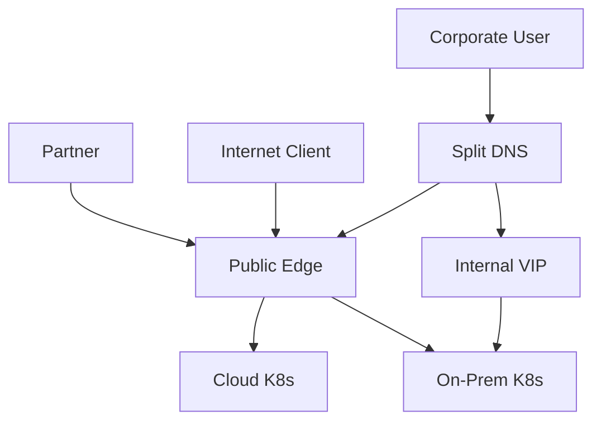
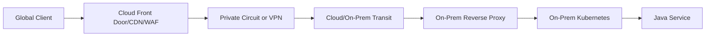
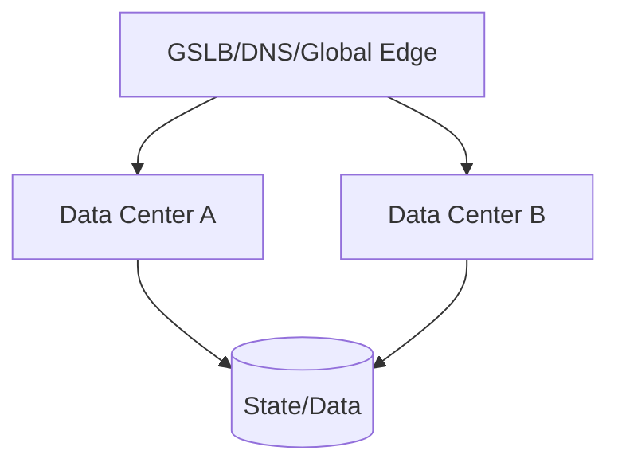
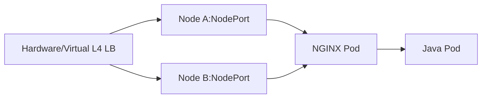
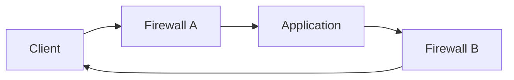

# Part 024 — On-Prem and Hybrid Traffic: DNS, DMZ, Firewalls, Proxies, and Private Kubernetes

> **Depth level:** Principal-level  
> **Prerequisite:** Part 002, 007–009, 015, 018, dan salah satu Part 022/023; dasar TCP/IP, DNS, routing, NAT, firewall, load balancer, TLS/PKI, Kubernetes Service/Ingress, NGINX reverse proxy, serta Java/JAX-RS deployment.  
> **Scope:** enterprise/split DNS, IPAM, trust zones, DMZ, stateful firewalls, NAT/VIP, L4/L7 load balancers, chained proxies, private Kubernetes ingress, internal PKI, CRL/OCSP, hybrid connectivity, VPN/private circuits/SD-WAN, BGP, asymmetric routing, overlapping CIDRs, MTU/MSS, egress proxies, air-gapped operation, source identity, observability, cross-team debugging, Java/JAX-RS implications, PR review, dan internal verification.  
> **Bukan scope utama:** cloud-specific detail—Part 022/023; NGINX DNS resolver internals—Part 025; real-time protocols—Part 026; egress proxy implementation detail—Part 028; GitOps—Part 029; full incident management—Part 032.

---

## Operating premise

On-prem dan hybrid production traffic jarang memiliki satu control plane atau satu team owner. Request dapat melewati:

```text
registrar
enterprise DNS
internet firewall
DDoS provider
L4 load balancer
DMZ reverse proxy
internal firewall
private Kubernetes ingress
service mesh or application proxy
Java/JAX-RS service
```

Setiap hop mungkin dikelola oleh team, vendor, ticketing system, certificate authority, dan maintenance window yang berbeda.

> **Primary rule:** Buat model hop-by-hop yang dapat dibuktikan. Jangan menerima diagram “Internet → WAF → application” yang menyembunyikan DNS, NAT, listener, firewall zone, TLS termination, routing, health check, Kubernetes datapath, dan source-identity transformations.

---

## Daftar isi

1. [Tujuan pembelajaran](#tujuan-pembelajaran)
2. [Executive mental model](#executive-mental-model)
3. [Trust zone sebagai unit arsitektur](#trust-zone-sebagai-unit-arsitektur)
4. [Request path sebagai contract graph](#request-path-sebagai-contract-graph)
5. [Ownership dan evidence map](#ownership-dan-evidence-map)
6. [Reference topologies](#reference-topologies)
7. [Public on-prem ingress melalui DMZ](#public-on-prem-ingress-melalui-dmz)
8. [Internal-only private ingress](#internal-only-private-ingress)
9. [Cloud edge ke on-prem origin](#cloud-edge-ke-on-prem-origin)
10. [On-prem consumers ke cloud AKS/EKS](#on-prem-consumers-ke-cloud-akseks)
11. [Dual-site active-active](#dual-site-active-active)
12. [Disaster-recovery topology](#disaster-recovery-topology)
13. [Enterprise DNS](#enterprise-dns)
14. [Authoritative, recursive, and forwarding layers](#authoritative-recursive-and-forwarding-layers)
15. [Split-horizon DNS](#split-horizon-dns)
16. [DNS delegation and conditional forwarding](#dns-delegation-and-conditional-forwarding)
17. [IPAM and address ownership](#ipam-and-address-ownership)
18. [DMZ mental model](#dmz-mental-model)
19. [Firewall policy model](#firewall-policy-model)
20. [Stateful inspection and return traffic](#stateful-inspection-and-return-traffic)
21. [NAT, VIP, SNAT, and DNAT](#nat-vip-snat-and-dnat)
22. [L4 load balancer](#l4-load-balancer)
23. [L7 reverse proxy and WAF](#l7-reverse-proxy-and-waf)
24. [Proxy chaining](#proxy-chaining)
25. [When multiple proxies are justified](#when-multiple-proxies-are-justified)
26. [When proxy chains are accidental complexity](#when-proxy-chains-are-accidental-complexity)
27. [Source IP and identity preservation](#source-ip-and-identity-preservation)
28. [PROXY protocol](#proxy-protocol)
29. [`Forwarded` and `X-Forwarded-*`](#forwarded-and-x-forwarded-)
30. [TLS placement across trust zones](#tls-placement-across-trust-zones)
31. [Internal PKI mental model](#internal-pki-mental-model)
32. [Root, intermediate, leaf, and trust stores](#root-intermediate-leaf-and-trust-stores)
33. [CRL, OCSP, and revocation reachability](#crl-ocsp-and-revocation-reachability)
34. [Certificate rotation and CA rollover](#certificate-rotation-and-ca-rollover)
35. [Java trust store implications](#java-trust-store-implications)
36. [Private Kubernetes ingress patterns](#private-kubernetes-ingress-patterns)
37. [External load balancer to NodePort](#external-load-balancer-to-nodeport)
38. [External load balancer to ingress pod](#external-load-balancer-to-ingress-pod)
39. [Bare-metal LoadBalancer implementations](#bare-metal-loadbalancer-implementations)
40. [BGP versus L2 advertisement](#bgp-versus-l2-advertisement)
41. [Kubernetes Service and EndpointSlice](#kubernetes-service-and-endpointslice)
42. [NetworkPolicy and host firewall boundaries](#networkpolicy-and-host-firewall-boundaries)
43. [Hybrid connectivity options](#hybrid-connectivity-options)
44. [IPsec VPN](#ipsec-vpn)
45. [Private circuits and carrier networks](#private-circuits-and-carrier-networks)
46. [SD-WAN and transit hubs](#sd-wan-and-transit-hubs)
47. [BGP route propagation](#bgp-route-propagation)
48. [Asymmetric routing](#asymmetric-routing)
49. [Overlapping CIDRs](#overlapping-cidrs)
50. [MTU, MSS, fragmentation, and PMTUD](#mtu-mss-fragmentation-and-pmtud)
51. [Proxy and firewall idle timeouts](#proxy-and-firewall-idle-timeouts)
52. [Egress proxy and outbound control](#egress-proxy-and-outbound-control)
53. [`NO_PROXY` and internal destinations](#no_proxy-and-internal-destinations)
54. [TLS inspection](#tls-inspection)
55. [Air-gapped and restricted environments](#air-gapped-and-restricted-environments)
56. [Hybrid identity and authentication](#hybrid-identity-and-authentication)
57. [Health checks across organizational boundaries](#health-checks-across-organizational-boundaries)
58. [Timeout and retry ownership](#timeout-and-retry-ownership)
59. [Connection draining and maintenance](#connection-draining-and-maintenance)
60. [Observability evidence map](#observability-evidence-map)
61. [End-to-end latency model](#end-to-end-latency-model)
62. [Packet capture strategy](#packet-capture-strategy)
63. [Common failure modes](#common-failure-modes)
64. [Debugging DNS and VIP](#debugging-dns-and-vip)
65. [Debugging firewall and NAT](#debugging-firewall-and-nat)
66. [Debugging TLS and internal CA](#debugging-tls-and-internal-ca)
67. [Debugging proxy chain](#debugging-proxy-chain)
68. [Debugging routing asymmetry](#debugging-routing-asymmetry)
69. [Debugging MTU](#debugging-mtu)
70. [Debugging private Kubernetes ingress](#debugging-private-kubernetes-ingress)
71. [Cross-team diagnostic packet](#cross-team-diagnostic-packet)
72. [Java/JAX-RS implications](#javajax-rs-implications)
73. [Security concerns](#security-concerns)
74. [Performance and capacity concerns](#performance-and-capacity-concerns)
75. [Architecture decision framework](#architecture-decision-framework)
76. [Safe rollout checklist](#safe-rollout-checklist)
77. [PR review checklist](#pr-review-checklist)
78. [Internal verification checklist](#internal-verification-checklist)
79. [Ringkasan mental model](#ringkasan-mental-model)
80. [Referensi resmi dan standar](#referensi-resmi-dan-standar)

---

## Tujuan pembelajaran

Setelah menyelesaikan part ini, Anda harus mampu:

1. Menggambar public, private, dan hybrid request path sampai Java/JAX-RS endpoint.
2. Menandai trust zone, ownership, TLS state, NAT, routing, health, timeout, dan evidence source pada setiap hop.
3. Membedakan L4 load balancing, L7 proxying, WAF, ingress controller, dan application routing.
4. Menentukan cara menjaga source identity melalui NAT dan proxy chain.
5. Menilai internal PKI, certificate chain, revocation, trust store, dan rotation risk.
6. Memahami pola private Kubernetes ingress pada data center.
7. Mendiagnosis DNS, firewall, NAT, asymmetric route, MTU, proxy chain, TLS, and Kubernetes failures.
8. Menyusun diagnostic packet yang dapat digunakan lintas network, security, platform, and application teams.
9. Menilai kapan cloud edge ke on-prem atau on-prem ke cloud menambah value versus complexity.
10. Mereview traffic-flow change pada level principal engineer.

---

## Executive mental model

On-prem/hybrid traffic adalah **distributed state machine across organizations**.

A request can be accepted, transformed, or rejected by:

```text
DNS resolver
edge firewall
NAT rule
L4 VIP
WAF policy
reverse proxy route
internal firewall
Kubernetes ingress
Service endpoint selection
Java security/filter chain
```

Reference flow:


### Five dimensions per hop

For every arrow record:

1. **Addressing:** source/destination IP and port.
2. **Protocol:** TCP/TLS/HTTP version and SNI/Host.
3. **Identity:** client, proxy, workload, certificate, headers.
4. **Policy:** allow/deny, route, auth, size, timeout, retry.
5. **Evidence:** logs, metrics, packet capture, config owner.

If one dimension is unknown, root-cause confidence is limited.

---

## Trust zone sebagai unit arsitektur

A trust zone is a network/security boundary with a defined policy and administrative owner.

Common zones:

```text
Internet
Partner extranet
Public DMZ
Application DMZ
Corporate user network
Server network
Kubernetes node network
Pod network
Management network
Database network
Cloud VNet/VPC
```

### Trust is not transitive

```text
Internet -> trusted edge proxy
```

does not imply:

```text
all headers from edge are trusted by every backend
```

Trust requires:

- authenticated or constrained source path;
- header sanitization;
- protected channel;
- documented owner;
- bypass prevention.

### Zone crossing checklist

For each crossing:

- allowed source CIDRs;
- destination VIP/IP/port;
- NAT behavior;
- TLS requirement;
- application protocol;
- health-check source;
- logging;
- change ticket owner;
- emergency rollback.

---

## Request path sebagai contract graph

Do not model only a linear line. Hybrid systems often have branches:



### Contract graph questions

- Which client classes use each path?
- Can a client bypass required security controls?
- Does the same hostname lead to different behavior?
- Are status codes and headers consistent?
- Are retries possible on multiple branches?
- Which path is tested in pre-production?
- Which path is used during disaster recovery?

---

## Ownership dan evidence map

Create a table before incidents:

| Layer | Owner | Source of truth | Runtime evidence | Change lead time |
|---|---|---|---|---|
| DNS | network/platform | DNS/IPAM repo | query logs/result | hours/days |
| firewall | security/network | policy manager | session/deny logs | ticket/window |
| L4 LB | network | LB config | pool/member stats | controlled |
| DMZ NGINX | edge/platform | Git/config mgmt | access/error logs | pipeline/window |
| K8s ingress | platform | GitOps | controller logs/events | minutes |
| application | product team | app repo | traces/logs/metrics | pipeline |

### Principal-level requirement

Architecture is not operationally complete until each critical hop has:

- an owner;
- a source of truth;
- an evidence source;
- an escalation path;
- a tested rollback.

---

## Reference topologies

| Topology | Typical need | Main risks |
|---|---|---|
| Internet -> DMZ proxy -> private K8s | regulated public app | long proxy/firewall chain |
| Corporate DNS -> internal VIP -> K8s | intranet/API | split DNS, source identity |
| Cloud edge -> private circuit -> on-prem | global edge for legacy origin | WAN/MTU/route dependency |
| On-prem -> private cloud ingress | migration/modernization | overlapping CIDR/DNS |
| Active-active data centers | high availability | state consistency, DNS/GSLB |
| Active-passive DR | disaster recovery | stale config/certs/runbooks |

---

## Public on-prem ingress melalui DMZ


### Questions

- Is DDoS/CDN proxying or only scrubbing?
- Where does public TLS terminate?
- Does perimeter firewall DNAT before L4 LB?
- Does DMZ proxy re-encrypt to internal ingress?
- Which component owns public redirects?
- How is client IP carried?
- Can internal VIP be reached directly from untrusted zones?
- How are health checks allowed through firewalls?

### Anti-pattern

```text
DMZ NGINX accepts any Host and proxies to a generic internal wildcard upstream.
```

This enables host confusion and accidental exposure.

---

## Internal-only private ingress


Internal does not mean trusted.

Apply:

- authentication;
- authorization;
- TLS;
- request limits;
- logging;
- segmentation;
- least privilege;
- abuse protection.

### Internal-specific risks

- broad corporate CIDR allowlist;
- source IP hidden behind shared proxy;
- old clients/protocols pressure weak TLS policy;
- split DNS drift;
- admin endpoints exposed to all employees;
- partner/VPN networks treated as employee network.

---

## Cloud edge ke on-prem origin



### Why use it

- global TLS/WAF/CDN;
- faster migration without moving origin;
- centralized public edge;
- multi-region failover.

### Hidden dependencies

- cloud edge origin timeout;
- private-circuit route advertisement;
- MTU across tunnels;
- origin certificate/SNI;
- on-prem firewall source ranges;
- health probe reachability;
- bandwidth/egress cost;
- asymmetric return path.

### Failure signature

```text
On-prem users can access origin,
but internet clients through cloud edge receive 502.
```

Focus on cloud-to-origin path, not application route first.

---

## On-prem consumers ke cloud AKS/EKS


### Design choices

- private hostname versus same public hostname;
- private endpoint/LB versus public edge with allowlist;
- direct cloud ingress versus on-prem proxy chain;
- cloud DNS integration;
- source identity after WAN/NAT;
- failover to public internet;
- route preference between private circuit and VPN.

### Risk

A “backup VPN” can become the preferred route after BGP metric changes, introducing lower MTU and higher latency without obvious application changes.

---

## Dual-site active-active



### Traffic is easier than state

NGINX can distribute requests, but active-active correctness depends on:

- database consistency;
- session/state placement;
- Kafka/event ordering;
- idempotency;
- cache invalidation;
- object storage replication;
- identity/key distribution;
- clock synchronization.

### Health-based routing danger

If both sites independently fail due to a shared database, global health routing cannot solve the outage.

---

## Disaster-recovery topology

Active-passive DR often fails operationally because the passive path has:

- expired certificates;
- stale DNS/firewall rules;
- old NGINX config;
- missing secrets;
- untested routes;
- insufficient capacity;
- outdated trust stores;
- inaccessible observability.

### DR invariant

> A diagrammed DR route is not a recovery capability until it is exercised with real DNS, certificates, network policy, application dependencies, data state, and rollback.

---

## Enterprise DNS

Enterprise DNS may contain:

- internet authoritative provider;
- internal authoritative zones;
- recursive resolvers;
- Active Directory-integrated DNS;
- conditional forwarders;
- cloud private DNS integrations;
- DNS security/filtering;
- local appliance caching;
- client/VPN resolver policies.

### Diagnose the actual chain

```text
client -> DHCP/VPN-provided resolver -> corporate recursive resolver
       -> conditional forwarder -> cloud/on-prem authoritative server
```

Do not assume the resolver shown in application container is the ultimate resolver.

---

## Authoritative, recursive, and forwarding layers

### Authoritative

Owns records for a zone.

### Recursive resolver

Finds and caches answers for clients.

### Forwarder

Sends matching queries to another resolver.

### Failure differences

| Failure | Typical evidence |
|---|---|
| authoritative record missing | NXDOMAIN/incorrect answer |
| recursive cache stale | old answer until TTL/cache flush |
| forwarder unreachable | timeout/SERVFAIL |
| forwarding loop | repeated timeout/high query load |
| DNS security block | policy-specific sinkhole/refusal |

---

## Split-horizon DNS

Same name, different answers by network:

```text
api.example.com public -> public edge
api.example.com corporate -> internal VIP
api.example.com DR network -> DR VIP
```

### Required invariants

- same TLS hostname is valid on all paths;
- route semantics are compatible;
- public and internal policies are intentionally different;
- observability identifies path;
- failover does not create stale answer conflict;
- clients with external DNS over HTTPS are considered.

### Debugging packet

```text
hostname
client network
resolver IP
answer set
TTL
query time
authoritative zone owner
```

---

## DNS delegation and conditional forwarding

Delegation:

```text
parent zone points a child zone to authoritative name servers
```

Conditional forwarding:

```text
resolver sends a suffix to a designated resolver
```

### Hybrid pattern

```text
corp.example.com -> on-prem authoritative
cloud.corp.example.com -> cloud private resolver
```

### Failure modes

- child-zone delegation missing;
- glue record incorrect;
- overlapping zones shadow records;
- forwarder points to inaccessible IP;
- TCP/53 blocked while large DNS response needs TCP;
- firewall allows UDP/53 only;
- DNSSEC validation mismatch;
- negative caching delays recovery.

---

## IPAM and address ownership

IPAM should answer:

- who owns each subnet/CIDR;
- reservation/allocation lifecycle;
- VIP ownership;
- NAT pools;
- pod/service CIDRs;
- cloud VNet/VPC ranges;
- partner networks;
- overlap detection;
- DNS record linkage.

### Why backend engineers care

Overlapping CIDRs can make a private service unreachable even when DNS, TLS, and application are correct.

Example:

```text
On-prem client network: 10.20.0.0/16
Cloud pod network:       10.20.0.0/16
```

The client routes the destination locally instead of through the hybrid link.

---

## DMZ mental model

A DMZ is not merely “the subnet where NGINX runs.”

It is a controlled zone between trust domains, typically with:

- restricted inbound rules;
- restricted outbound rules;
- hardened hosts/images;
- monitored administration;
- limited secrets;
- patching requirements;
- independent logging;
- no implicit access to internal networks.

### DMZ NGINX responsibilities

Possible:

- public TLS termination;
- WAF integration;
- host/path allowlist;
- request-size limits;
- source normalization;
- coarse rate limiting;
- reverse proxy to internal VIP.

Not automatically appropriate:

- domain authorization;
- database access;
- broad service discovery;
- arbitrary dynamic proxying;
- storing long-lived application credentials.

---

## Firewall policy model

A firewall rule should be understood as:

```text
source zone/CIDR
-> destination zone/IP
-> protocol/port
-> optional application identity
-> action
-> logging
-> schedule/expiry
```

### Avoid “allow any for troubleshooting”

It destroys evidence, expands blast radius, and often becomes permanent.

Use scoped temporary rule:

- exact source;
- exact destination;
- exact port;
- explicit expiry;
- full logging;
- linked incident/change ticket.

---

## Stateful inspection and return traffic

Stateful firewall tracks connection state.

For TCP:

```text
SYN -> SYN/ACK -> ACK -> established flow
```

If response returns through another firewall instance/path without shared state, it may be dropped.

### Clue

- destination receives SYN;
- source never receives SYN/ACK;
- application has no HTTP log;
- packet capture shows response leaving another route.

### Stateful does not mean routing-aware

Routing must still be symmetric enough for the stateful devices in the path.

---

## NAT, VIP, SNAT, and DNAT

### VIP

Stable frontend address representing a pool or service.

### DNAT

Destination address/port translated toward an internal target.

### SNAT

Source address translated, often for return-route stability or egress.

### Effects

- source IP may disappear;
- firewall rules see translated identity;
- logs at different hops show different tuples;
- port exhaustion can occur;
- allowlists can target wrong address;
- return traffic depends on NAT state.

### Tuple ledger

Maintain a per-hop table:

| Hop | Source IP:port | Destination IP:port |
|---|---|---|
| client -> public VIP | `198.51.100.10:53000` | `203.0.113.20:443` |
| firewall -> DMZ LB | `10.0.0.5:41000` | `10.10.0.20:443` |
| NGINX -> internal ingress | `10.10.1.15:50000` | `10.20.0.30:8443` |

This resolves many cross-team disputes.

---

## L4 load balancer

An L4 LB routes transport connections based on IP/port and configured algorithm.

It can provide:

- VIP;
- TCP/TLS passthrough;
- connection distribution;
- health checks;
- source NAT or preservation;
- connection draining;
- active/passive failover.

It cannot normally make decisions based on:

- HTTP path;
- JWT claim;
- CORS;
- request body;
- API version.

### TLS modes

- TCP passthrough;
- TLS termination;
- TLS bridging/re-encryption.

Verify exact appliance capability and configuration.

---

## L7 reverse proxy and WAF

L7 devices parse HTTP and may:

- terminate TLS;
- select virtual host/path;
- rewrite URI/header;
- buffer body/response;
- authenticate;
- rate limit;
- cache/compress;
- enforce WAF;
- retry upstream;
- generate errors.

### Consequence

Every L7 hop can change application semantics. Treat it as part of the application delivery architecture.

---

## Proxy chaining

Example:

```text
Cloud edge -> hardware ADC/WAF -> DMZ NGINX -> internal NGINX ingress -> Java
```

For each proxy document:

- why it exists;
- protocol in/out;
- TLS state;
- Host/SNI behavior;
- path rewriting;
- forwarded headers;
- timeout;
- retry;
- body limits;
- compression;
- status transformation;
- health checks;
- logs;
- owner.

### Golden rule

> A proxy chain without a policy-ownership matrix is an incident multiplier.

---

## When multiple proxies are justified

Multiple proxies can be valid when each owns a distinct boundary:

| Proxy | Distinct role |
|---|---|
| global edge | DDoS, global routing, CDN |
| DMZ WAF | perimeter application filtering |
| internal gateway | trust-zone transition |
| Kubernetes NGINX | service routing and cluster lifecycle |
| application | domain behavior |

Requirements:

- no ambiguous duplicate policy;
- deterministic headers;
- timeout budget;
- trace continuity;
- bypass prevention;
- independent health semantics;
- tested failure behavior.

---

## When proxy chains are accidental complexity

Warning signs:

- two layers perform identical path routing;
- every layer retries;
- every layer terminates and reissues TLS with unclear trust;
- WAF exclusions differ;
- redirects loop;
- request ID changes per hop;
- public/client IP cannot be reconstructed;
- no team owns end-to-end timeout;
- incident calls require five teams before evidence exists;
- removing one layer changes nothing measurable.

### Better approach

Remove or bypass unnecessary layers in a controlled test environment and compare required capabilities.

---

## Source IP and identity preservation

Network source IP is not user identity.

Possible identities:

- socket peer IP;
- original client IP;
- authenticated user;
- API client ID;
- mTLS certificate subject/SAN;
- proxy/workload identity;
- tenant ID.

Keep these separate.

### Source-IP loss points

- SNAT firewall;
- L4 proxy mode;
- L7 reverse proxy;
- NodePort cross-node forwarding;
- service mesh;
- cloud edge;
- outbound proxy.

---

## PROXY protocol

PROXY protocol conveys original connection metadata from a supporting proxy/load balancer to the next hop before application protocol data.

Conceptual frame:

```text
PROXY metadata -> TLS ClientHello or HTTP request
```

### Strict bilateral contract

Both sides must agree.

If sender enables PROXY protocol but receiver does not:

```text
receiver sees unexpected bytes and TLS/HTTP fails
```

If receiver expects PROXY protocol but sender does not:

```text
receiver waits/rejects normal TLS/HTTP bytes
```

### NGINX example

```nginx
server {
    listen 443 ssl proxy_protocol;

    set_real_ip_from 10.10.0.0/16;
    real_ip_header proxy_protocol;

    ssl_certificate     /etc/nginx/tls/tls.crt;
    ssl_certificate_key /etc/nginx/tls/tls.key;
}
```

Never expose a PROXY-protocol listener directly to untrusted clients unless architecture explicitly supports and protects it.

---

## `Forwarded` and `X-Forwarded-*`

For HTTP proxy chains, define canonical policy.

Possible headers:

- `Forwarded`;
- `X-Forwarded-For`;
- `X-Forwarded-Proto`;
- `X-Forwarded-Host`;
- `X-Forwarded-Port`;
- `X-Request-ID`;
- vendor-specific identity headers.

### Security invariant

First trusted edge must remove or normalize untrusted versions.

### NGINX upstream contract

```nginx
proxy_set_header Host $host;
proxy_set_header X-Forwarded-Host $host;
proxy_set_header X-Forwarded-Proto $scheme;
proxy_set_header X-Forwarded-For $proxy_add_x_forwarded_for;
proxy_set_header X-Request-ID $request_id;
```

In a multi-proxy chain, `$scheme` may represent only the current hop. Preserve public scheme from a trusted upstream when appropriate.

---

## TLS placement across trust zones

Common patterns:

### Pattern A — TLS terminates in DMZ, HTTP internal

Operationally simple, but internal traffic is unencrypted.

### Pattern B — TLS terminates in DMZ, re-encrypts to Kubernetes ingress

Balances edge control and internal confidentiality.

### Pattern C — TCP passthrough to NGINX

NGINX owns public TLS and HTTP routing; perimeter devices have less L7 visibility.

### Pattern D — TLS at every proxy hop

Strong segmentation but highest PKI/CPU/debugging complexity.

### Pattern E — mTLS between zones

Adds proxy/workload authentication. Requires mature issuance, rotation, revocation, and identity mapping.

### Decision fields

```text
threat model
regulatory requirement
inspection requirement
latency/capacity
certificate ownership
SNI/routing need
failure and rotation model
```

---

## Internal PKI mental model

Internal PKI provides trust for private identities and encrypted channels.

Components:

```text
Offline/secured root CA
  -> issuing/intermediate CA
     -> leaf server/client certificates
        -> trust stores and revocation services
```

### PKI is a lifecycle system

It includes:

- identity proofing;
- issuance;
- key protection;
- renewal;
- revocation;
- audit;
- CA rollover;
- trust distribution;
- incident response.

A certificate file alone is not a PKI strategy.

---

## Root, intermediate, leaf, and trust stores

### Root CA

Trust anchor, ideally tightly protected.

### Intermediate CA

Issues leaf certificates and limits root exposure.

### Leaf certificate

Represents server/client/workload identity.

### Trust store

Contains trusted CA certificates, not normally leaf certificates.

### Common failure

Server sends only leaf certificate, omitting intermediate. Some clients succeed due to cached intermediate while clean containers fail.

Test:

```bash
openssl s_client -connect internal-api.example.com:443 \
  -servername internal-api.example.com \
  -showcerts
```

---

## CRL, OCSP, and revocation reachability

Revocation mechanisms can include:

- Certificate Revocation List;
- Online Certificate Status Protocol;
- short-lived certificate policy;
- platform-specific validation.

### Hybrid trap

A client can reach the API but cannot reach CRL/OCSP distribution endpoints because outbound firewall blocks them.

Result may be:

- hard failure;
- long timeout;
- soft-fail depending client policy;
- inconsistent behavior across runtimes.

### Verify

- CRL distribution point URL;
- OCSP responder URL;
- DNS and route;
- proxy requirements;
- firewall allowlist;
- cache/update interval;
- client hard/soft-fail policy.

---

## Certificate rotation and CA rollover

### Leaf rotation

Must coordinate:

- new certificate/key distribution;
- full chain;
- file permissions;
- NGINX validation/reload;
- active connection behavior;
- old/new overlap;
- expiry alert.

### Intermediate/root rollover

Harder because both server chains and client trust stores change.

Safe overlap:

```text
1. distribute new trust anchor/intermediate
2. verify all clients trust it
3. issue certificates from new chain
4. rotate servers
5. monitor
6. remove old trust only after all dependencies migrate
```

### Failure mode

Rotating server first causes old clients to fail. Removing old root first causes old certificates to fail.

---

## Java trust store implications

Java can use:

- JVM default trust store;
- custom JKS/PKCS12;
- container OS CA bridged into JVM;
- application-specific SSL context;
- framework/client-specific trust configuration.

### Questions

- Which trust store is actually used?
- Is it immutable in the image?
- How is internal CA injected?
- Does rotation require restart?
- Are multiple services using different JRE images?
- Is hostname verification enabled?
- Is client certificate/private key protected?

### Debugging

```bash
keytool -list -v -keystore /path/to/truststore.p12
```

JVM diagnostic flags can reveal TLS negotiation, but use carefully because output may expose sensitive metadata and be very verbose.

### Anti-pattern

```java
TrustManager that accepts every certificate
HostnameVerifier that always returns true
```

This converts encrypted traffic into unauthenticated traffic.

---

## Private Kubernetes ingress patterns

Common on-prem patterns:

1. External hardware L4 LB -> NodePort -> NGINX.
2. External L4 LB -> host-network/hostPort NGINX.
3. L2/BGP LoadBalancer implementation -> NGINX Service.
4. External L7 ADC/WAF -> internal NGINX Service.
5. NGINX nodes outside cluster -> ClusterIP/pod endpoints through routed network.
6. Gateway API implementation with dedicated gateway pods.

Each has different:

- source IP;
- health check;
- routing;
- capacity;
- failover;
- security;
- operational ownership.

---

## External load balancer to NodePort



### Review

- NodePort range and firewall;
- node pool membership;
- health-check target;
- `externalTrafficPolicy`;
- source NAT;
- cross-node forwarding;
- node replacement automation;
- LB pool reconciliation;
- readiness/draining.

### Failure mode

A new Kubernetes node is not added to the external LB pool, so capacity does not increase despite scaling.

---

## External load balancer to ingress pod

Direct pod routing requires:

- routable pod addresses;
- stable endpoint discovery/reconciliation;
- network/firewall policy;
- health check per pod;
- fast handling of pod churn;
- ownership for updating pool members.

### Benefit

Avoids NodePort/cross-node hop.

### Cost

Tighter coupling between external network control plane and Kubernetes endpoint lifecycle.

---

## Bare-metal LoadBalancer implementations

On-prem Kubernetes may implement `Service type: LoadBalancer` through:

- BGP advertisement;
- L2 ARP/NDP advertisement;
- proprietary data-center integration;
- external controller/IPAM integration.

Examples exist, but implementation choice is platform-specific.

### Verify

- IP pool ownership;
- announcement mode;
- failover convergence;
- BGP peer policy;
- L2 domain size;
- duplicate IP prevention;
- source IP behavior;
- controller HA;
- maintenance behavior.

---

## BGP versus L2 advertisement

### BGP

Service VIP/routes advertised to routers.

Pros:

- routed scalability;
- ECMP possibilities;
- no single L2 broadcast domain requirement.

Risks:

- route leaks;
- aggregation/priority mistakes;
- convergence timing;
- asymmetric routing;
- peer security/ownership.

### L2 advertisement

A node announces ownership of VIP through ARP/NDP.

Pros:

- simpler in a local L2 network.

Risks:

- L2 domain dependency;
- failover/neighbor-cache behavior;
- one active speaker path depending implementation;
- limited cross-subnet reach without routing.

---

## Kubernetes Service and EndpointSlice

Inspect:

```bash
kubectl get svc -A
kubectl get endpointslice -A
kubectl describe svc <name> -n <namespace>
kubectl get pods -o wide -n <namespace>
```

### Invariants

- Service selector matches intended pods;
- target port matches application listener;
- only Ready endpoints receive normal Service traffic;
- ingress backend points to correct Service/port;
- EndpointSlices update during rollout;
- external LB/controller understands endpoint churn.

---

## NetworkPolicy and host firewall boundaries

Kubernetes NetworkPolicy controls pod traffic only when implemented by the CNI/plugin.

It does not replace:

- perimeter firewall;
- host firewall;
- data-center ACL;
- cloud NSG/security group;
- service authentication.

### Common failure

External LB reaches node/ingress, but NetworkPolicy blocks NGINX -> Java pod.

Evidence:

- NGINX connect timeout;
- no Java request log;
- Service/EndpointSlice looks correct;
- packet capture or policy logs show drop.

---

## Hybrid connectivity options

Options include:

- site-to-site IPsec VPN;
- private carrier circuits;
- cloud private connectivity products;
- MPLS;
- SD-WAN;
- transit hubs;
- interconnect fabrics;
- encrypted tunnels over private links.

### Evaluate

- bandwidth;
- latency/jitter;
- route convergence;
- redundancy;
- encryption;
- MTU;
- SLA;
- cost;
- operational owner;
- failover path;
- monitoring.

---

## IPsec VPN

IPsec adds encapsulation overhead and often reduces effective MTU.

Potential issues:

- phase 1/2 negotiation;
- pre-shared key/certificate expiry;
- traffic selector mismatch;
- NAT traversal;
- dead peer detection;
- route advertisement/static route drift;
- tunnel up but application prefix absent;
- asymmetric primary/backup tunnel;
- fragmentation.

### Invariant

“Tunnel is up” only proves control/security association state, not that the required prefixes and application flows work.

---

## Private circuits and carrier networks

Private circuits often provide stable performance, but still require:

- BGP sessions;
- route filters;
- provider edge/customer edge configuration;
- redundant physical paths;
- capacity monitoring;
- failover testing;
- cloud route-table integration;
- encryption decision.

Private does not automatically mean encrypted.

---

## SD-WAN and transit hubs

SD-WAN/transit hubs can dynamically choose paths.

### Application impact

- route can change without application deployment;
- source NAT may differ by path;
- latency/MTU changes;
- firewall traversal changes;
- existing long-lived connections reset;
- observability crosses multiple vendors.

Record path selection evidence during incidents.

---

## BGP route propagation

BGP selects paths based on policy and attributes, not application health.

Relevant concepts:

- prefix specificity;
- local preference;
- AS path;
- MED;
- communities;
- route filtering;
- ECMP;
- withdrawal/convergence.

### Dangerous condition

A more specific stale route can override a healthy aggregate path.

Example:

```text
10.30.0.0/16 -> cloud circuit
10.30.12.0/24 -> old VPN
```

Traffic to the application subnet follows the `/24` unexpectedly.

---

## Asymmetric routing

Request and response use different paths.



Stateful Firewall A sees SYN but not return traffic; Firewall B sees unexpected return flow.

### Causes

- multiple default routes;
- ECMP without state sharing;
- SNAT only on one path;
- BGP policy difference;
- pod/node route mismatch;
- active/standby firewall failover;
- UDR/static route conflict.

### Detection

Simultaneous packet captures near source and destination are often required.

---

## Overlapping CIDRs

Overlap is common in mergers, partner networks, and independent cloud accounts.

Solutions can include:

- renumbering;
- NAT domains;
- proxy/API boundary instead of direct routing;
- isolated transit;
- application-layer gateway;
- IPv6 strategy where appropriate.

### Trade-off

NAT resolves routing ambiguity but destroys original IP identity and complicates allowlists/log correlation.

---

## MTU, MSS, fragmentation, and PMTUD

### MTU

Maximum frame/packet size supported by a link.

### MSS

Maximum TCP payload negotiated for a segment.

### Encapsulation overhead

VPN, overlay, and tunneling reduce effective path MTU.

### Path MTU Discovery

Relies on signals such as ICMP Packet Too Big/Fragmentation Needed. Blocking those signals can create black-hole behavior.

### Signature

- TCP handshake succeeds;
- small HTTP response succeeds;
- large request/response stalls;
- TLS handshake can fail intermittently when certificate chain is large;
- uploads fail at specific sizes.

### Diagnostic examples

Linux:

```bash
ping -M do -s 1472 <destination>
ping -M do -s 1400 <destination>
tracepath <destination>
```

Values must account for IP version and headers. Do not blindly copy them.

---

## Proxy and firewall idle timeouts

Long-lived connections may cross:

- client proxy;
- perimeter firewall;
- L4 LB;
- DMZ NGINX;
- internal firewall;
- Kubernetes NGINX;
- Java server.

The shortest idle timeout wins.

### Effects

- WebSocket disconnects;
- SSE reconnect loops;
- idle upstream pool connections reset;
- database/client connection reuse fails;
- intermittent `connection reset by peer`.

Maintain a timeout chain table.

---

## Egress proxy and outbound control

Backend readiness and request processing often depend on outbound calls:

- identity provider;
- payment/partner API;
- cloud object storage;
- package/repository;
- CRL/OCSP;
- telemetry collector;
- email/SMS gateway.

An ingress incident can actually be egress failure.

### NGINX role

NGINX is primarily a reverse proxy, not a general-purpose forward proxy. Use a dedicated forward proxy/egress gateway where required.

Part 028 covers this in more depth.

---

## `NO_PROXY` and internal destinations

Proxy environment variables may include:

```text
HTTP_PROXY
HTTPS_PROXY
NO_PROXY
```

### Common failures

- Kubernetes Service traffic sent to corporate proxy;
- metadata/internal identity endpoint proxied;
- CIDR syntax unsupported by runtime;
- `.svc` or cluster domain missing;
- lowercase/uppercase variables behave differently by client;
- Java library ignores environment proxy settings or uses JVM properties instead.

### Verify by runtime

Do not assume curl behavior equals Java HTTP client behavior.

---

## TLS inspection

Corporate proxies/firewalls may intercept TLS by issuing a replacement certificate from an internal inspection CA.

### Risks

- application does not trust inspection CA;
- certificate pinning fails;
- mTLS cannot be transparently inspected;
- privacy/compliance concerns;
- hostname/SAN behavior differs;
- TLS versions/ciphers downgraded;
- audit logs contain sensitive metadata.

### Design rule

Define explicit bypass for protocols/endpoints that require end-to-end cryptographic identity.

---

## Air-gapped and restricted environments

Air-gapped does not mean “no dependencies.” Dependencies must be internalized:

- container registry;
- OS/package repositories;
- Java/Maven dependencies;
- NGINX modules/images;
- certificate issuance/revocation;
- time synchronization;
- DNS;
- vulnerability feeds;
- observability storage;
- backup/restore;
- license servers if applicable.

### Upgrade challenge

Create a signed, scanned, auditable promotion process from connected staging zone to restricted production zone.

### Time synchronization

TLS, JWT, log correlation, and distributed transactions rely on accurate clocks. NTP design is critical even in isolated networks.

---

## Hybrid identity and authentication

Identity paths may include:

- corporate Active Directory/LDAP;
- OIDC/SAML identity provider;
- cloud identity service;
- mTLS partner identity;
- service accounts/workload identity;
- legacy header-based SSO.

### Trust-boundary rule

If an upstream proxy authenticates a user and sends identity headers:

- header names are reserved;
- client-supplied versions are stripped;
- backend accepts traffic only from trusted proxy path;
- channel is protected;
- assertion has expiry/audience/integrity where possible;
- Java performs domain authorization.

### Hybrid failure

Cloud path cannot reach on-prem IdP/LDAP due to route/firewall, causing all ingress requests to fail despite healthy application pods.

---

## Health checks across organizational boundaries

Health-check sources may be:

- external DNS/GSLB;
- cloud edge;
- perimeter LB;
- internal LB;
- NGINX;
- Kubernetes;
- synthetic monitoring.

### Probe matrix

| Probe | Source | Destination | Host/SNI | Path | Expected response |
|---|---|---|---|---|---|
| public edge | provider | DMZ VIP | public host | `/edge-health` | 200 |
| internal LB | LB subnet | NGINX node/pod | internal host | `/healthz` | 200 |
| Kubernetes readiness | kubelet | pod | local | `/ready` | 200/failed |
| synthetic | monitoring | public URL | public host | business smoke | expected semantic result |

### Avoid synchronized deep probes

They can create periodic load spikes and shared-dependency cascades.

---

## Timeout and retry ownership

Create a deadline ledger:

| Layer | Connect | Read/idle | Total/deadline | Retry |
|---|---:|---:|---:|---|
| cloud/global edge | ? | ? | ? | ? |
| perimeter LB | ? | ? | ? | ? |
| DMZ NGINX | ? | ? | ? | ? |
| internal NGINX | ? | ? | ? | ? |
| Java client | ? | ? | ? | ? |

### Rules

- one layer owns a given retry policy;
- retry only safe methods/operations or use idempotency keys;
- total deadline decreases toward backend;
- timeout error provenance is observable;
- abort/cancellation behavior is understood;
- failover does not multiply retries.

---

## Connection draining and maintenance

On-prem maintenance can involve:

- disabling LB pool member;
- waiting for connection drain;
- changing firewall/NAT;
- reloading NGINX;
- draining Kubernetes node;
- terminating pod;
- updating certificate;
- restoring pool member.

### Correct order

```text
remove from new-traffic path
-> wait for health/route propagation
-> drain connections
-> perform change
-> validate locally
-> restore health
-> validate through all paths
```

### Long-lived sessions

WebSocket/SSE/large downloads may exceed normal drain windows. Decide whether to:

- wait;
- notify/reconnect;
- force terminate;
- migrate traffic gradually.

---

## Observability evidence map

| Layer | Evidence |
|---|---|
| DNS | query answer, resolver logs, zone config |
| firewall | session, NAT, deny, threat logs |
| L4 LB | VIP/pool/member/connection stats |
| WAF/ADC | access, WAF, TLS, upstream logs |
| WAN/VPN | tunnel, BGP, loss, latency, bandwidth |
| NGINX | access/error logs, metrics, config |
| Kubernetes | events, Service, EndpointSlice, NetworkPolicy |
| Java | traces, logs, request/dependency metrics |
| PKI | issuance, expiry, revocation, audit |

### Time alignment

All devices must have synchronized clocks and timestamps with known timezone/precision.

A five-minute clock skew can make packet and request evidence appear contradictory.

---

## End-to-end latency model

```text
T_total =
  T_dns
+ T_wan_client
+ T_firewall_queue
+ T_l4
+ T_dmz_tls_http
+ T_private_wan
+ T_internal_firewall
+ T_ingress
+ T_service_network
+ T_java_queue
+ T_dependencies
+ T_response_transfer
```

### Network latency is not only RTT

Also consider:

- packet loss and retransmission;
- TLS handshakes;
- proxy queueing;
- congestion;
- route changes;
- serialization/body size;
- connection reuse;
- slow client;
- bandwidth shaping.

---

## Packet capture strategy

Packet capture is high-value but sensitive.

### Capture points

- client/jump host;
- before/after firewall if authorized;
- NGINX host/pod;
- Kubernetes node;
- Java pod/host.

### Minimal filter

```bash
tcpdump -nn -i any host <peer-ip> and port 443
```

Write to a protected file when deeper analysis is needed:

```bash
tcpdump -nn -s 0 -w /secure/path/incident.pcap \
  host <peer-ip> and port 443
```

### Security

Captures may contain:

- credentials;
- tokens;
- personal data;
- request bodies;
- internal addresses.

Use authorization, scope, encryption, retention, and deletion controls.

### TLS limitation

Encrypted captures show transport behavior but not HTTP content unless keys/decryption are legitimately available.

---

## Common failure modes

| Symptom | Likely domains |
|---|---|
| NXDOMAIN only on VPN | split DNS/forwarder/VPN resolver |
| public VIP resolves but TCP timeout | firewall/NAT/LB pool/route |
| TCP connects, TLS fails | SNI/cert/chain/protocol/PROXY mismatch |
| small request works, upload stalls | MTU/body limit/buffering/timeout |
| intermittent reset after idle | shortest firewall/LB/proxy idle timeout |
| all users share one IP | SNAT/proxy identity loss |
| NGINX 502 | upstream connect/reset/TLS/policy |
| NGINX 503 | no endpoints/LB unavailable/limit |
| NGINX 504 | upstream response idle timeout |
| only one site fails | route/DNS/site-specific cert/config |
| failover sends traffic to old app | stale DNS/GSLB/LB pool |
| cloud can reach on-prem IP but not hostname | hybrid DNS/forwarder |
| Java TLS fails after CA change | trust-store/chain/rollover |
| health green but business requests fail | shallow probe/default backend |
| request logged twice | retry/loop/proxy replay |
| no app log, firewall shows accept | downstream route/NetworkPolicy/TLS before HTTP |

---

## Debugging DNS and VIP

1. Identify client network and resolver.
2. Query A/AAAA/CNAME and TTL.
3. Confirm answer belongs to intended path.
4. Test TCP to VIP/port.
5. Confirm VIP listener and pool.
6. Test with correct SNI/Host.
7. Compare public/internal/DR answers.
8. Check stale caches and negative TTL.

Commands:

```bash
dig api.example.com A
dig api.example.com AAAA
nslookup api.example.com <resolver-ip>
nc -vz api.example.com 443
openssl s_client -connect api.example.com:443 -servername api.example.com
curl -vk --resolve api.example.com:443:<vip-ip> https://api.example.com/health
```

`--resolve` is a diagnostic technique, not a permanent fix.

---

## Debugging firewall and NAT

Prepare the expected five-tuple before contacting network team:

```text
source IP
source port or ephemeral range
 destination IP/VIP
 destination port
 protocol
 timestamp
```

Ask for:

- session creation;
- policy rule ID;
- DNAT result;
- SNAT result;
- return-session packets;
- drop reason;
- threat/TLS inspection action.

### Evidence sequence

```text
Client SYN sent?
Perimeter received?
DNAT occurred?
LB received?
Backend SYN arrived?
SYN/ACK returned?
Which address was used after SNAT?
```

---

## Debugging TLS and internal CA

### Inspect server

```bash
openssl s_client \
  -connect internal-api.example.com:443 \
  -servername internal-api.example.com \
  -showcerts \
  -verify_return_error
```

### Verify with explicit CA

```bash
openssl s_client \
  -connect internal-api.example.com:443 \
  -servername internal-api.example.com \
  -CAfile internal-ca-bundle.pem \
  -verify_return_error
```

### Check

- name/SAN;
- expiry/not-yet-valid;
- chain order;
- missing intermediate;
- algorithm/key size/policy;
- trusted root;
- CRL/OCSP reachability;
- SNI routing;
- mTLS client certificate;
- clock.

### Proxy-chain method

Test each TLS hop independently with its expected hostname and CA.

---

## Debugging proxy chain

Create a matrix:

| Hop | Expected Host | Expected path | TLS | Timeout | Request ID |
|---|---|---|---|---:|---|
| client -> DMZ | `api.example.com` | `/qao/orders` | public CA | 30s | external |
| DMZ -> internal ingress | `qao.internal` | `/orders` | internal CA | 25s | preserved |
| ingress -> Java | service DNS | `/orders` | HTTP/mTLS | 20s | preserved |

### Stepwise test

1. Public URL.
2. DMZ proxy locally to internal VIP.
3. Internal VIP with expected Host/SNI.
4. NGINX to Service.
5. Service to pod.
6. Pod endpoint locally.

Never jump directly to Java logs when earlier hops have no evidence of forwarding.

---

## Debugging routing asymmetry

Collect simultaneous evidence:

```text
source packet capture
first firewall session log
transit/BGP route view
second firewall/session log
destination packet capture
```

Inspect:

- source/destination route table;
- longest-prefix match;
- ECMP;
- policy-based routing;
- NAT;
- active firewall node;
- BGP advertisements;
- reverse-path filtering;
- pod/node route.

### Test clue

If forcing SNAT at the ingress device makes traffic work, return-route asymmetry is likely—but SNAT may only mask the underlying route defect.

---

## Debugging MTU

Symptoms:

- handshake or small GET succeeds;
- larger response stalls;
- upload fails;
- behavior differs over VPN/private circuit;
- retransmissions visible;
- no HTTP error generated.

Approach:

1. Compare path through LAN versus tunnel.
2. Test decreasing packet size with DF behavior.
3. Inspect tunnel/overlay MTU.
4. Confirm ICMP required for PMTUD is allowed.
5. Inspect TCP MSS negotiation.
6. Check firewall MSS clamping.
7. Capture retransmissions and packet-too-big messages.
8. Validate IPv4 and IPv6 separately.

Do not solve every issue by globally lowering MTU without understanding blast radius.

---

## Debugging private Kubernetes ingress

Kubernetes checks:

```bash
kubectl get ingress,ingressclass,svc,endpointslice,pod -A
kubectl describe svc <ingress-service> -n <namespace>
kubectl describe ingress <name> -n <namespace>
kubectl logs -n <ingress-namespace> <controller-pod>
kubectl exec -n <ingress-namespace> <controller-pod> -- nginx -T
```

External integration checks:

- VIP pool members;
- node/pod addresses;
- health-check path/port/Host;
- NodePort firewall;
- source NAT/PROXY protocol;
- BGP/L2 advertisement;
- route to pod CIDR;
- drain behavior;
- controller pod placement.

Application checks:

```bash
curl -sv http://<service>.<namespace>.svc.cluster.local:<port>/ready
curl -sv http://<pod-ip>:<port>/ready
```

Use direct pod tests only when allowed and understand that they bypass Service/ingress policy.

---

## Cross-team diagnostic packet

Before escalating, provide a compact evidence packet.

### Incident identity

```text
incident ID
environment
timestamp with timezone
first/last occurrence
impact
change correlation
```

### Request identity

```text
hostname
path/method
client class/network
request ID/trace ID
expected status
actual status/error
```

### Network tuple

```text
source IP
resolved destination IP
port/protocol
expected route/path
```

### Evidence

- DNS query output;
- curl/openssl output;
- proxy status/log line;
- firewall/LB timestamp;
- Kubernetes Service/EndpointSlice state;
- Java trace/log if request arrived;
- packet capture summary if authorized.

### Precise question

Bad:

```text
Please check network.
```

Good:

```text
At 2026-07-11T03:14:22+07:00, source 10.40.8.21 sent TCP SYN to VIP
10.20.1.15:443. No SYN reached NGINX node 10.30.2.44. Please confirm firewall
policy/NAT session and LB pool path for this tuple and timestamp.
```

---

## Java/JAX-RS implications

### Public versus internal URI

A Java service behind multiple proxies may see:

```text
remote address = NGINX pod
scheme = http
host = service.namespace.svc
path = /orders
```

while client used:

```text
https://api.example.com/qao/orders
```

Use a documented, sanitized forwarding contract.

### Audit attribution

Store separately:

- authenticated principal;
- API client;
- tenant;
- normalized original client IP;
- immediate peer/proxy;
- request/trace ID.

Do not use raw `X-Forwarded-For` as an authorization fact.

### Java TLS clients

Internal CA and proxy inspection affect:

- JAX-RS client;
- Java `HttpClient`;
- Apache/OkHttp clients;
- Kafka TLS;
- database TLS;
- OIDC/JWKS calls.

Standardize trust distribution and hostname verification.

### Proxy configuration

Java may use:

- JVM properties (`https.proxyHost`, `http.nonProxyHosts`);
- environment variables through libraries;
- explicit client proxy configuration;
- PAC/system settings only through special integration.

Test the actual library.

### Deadlines and cancellation

WAN/proxy latency needs a bounded end-to-end deadline. Do not simply increase every timeout.

### Idempotency

Hybrid failover and proxy retries can duplicate requests. Protect side-effecting operations with:

- idempotency keys;
- unique constraints;
- state-machine guards;
- transactional outbox/inbox;
- deduplication.

### Readiness

If essential on-prem/cloud identity or database dependency is unavailable, decide whether readiness should fail, degrade, or continue serving partial functions. Avoid synchronized ejection of every pod for a shared transient dependency.

---

## Security concerns

1. Public bypass around DMZ/WAF.
2. Overly broad firewall rules and permanent temporary exceptions.
3. Trusting spoofed forwarded identity headers.
4. PROXY-protocol listener exposed to untrusted sources.
5. Plaintext traffic across internal zones without risk acceptance.
6. Internal CA private keys or trust anchors poorly protected.
7. Disabled hostname verification or trust-all Java clients.
8. CRL/OCSP unreachable and policy behavior unknown.
9. TLS inspection breaks end-to-end identity.
10. Management interfaces reachable from application/client networks.
11. Network device logs/captures expose PII/secrets.
12. Shared DMZ proxy allows arbitrary upstreams/SSRF.
13. Partner networks inherit broad corporate trust.
14. Air-gapped artifacts lack provenance or vulnerability scanning.
15. Route leaks expose private prefixes.
16. NAT hides abusive clients without alternative identity controls.
17. Ingress snippets or custom templates bypass platform policy.
18. Default virtual host exposes internal applications.

---

## Performance and capacity concerns

### Capacity chain

```text
Internet link
firewall sessions/CPS
L4 LB connections
WAF CPU/throughput
DMZ NGINX workers
private circuit bandwidth
internal firewall
Kubernetes ingress
Java executor/DB pool
```

The smallest effective capacity dominates.

### Measure

- connections per second;
- concurrent connections;
- TLS handshakes;
- bandwidth;
- packet loss/retransmission;
- firewall session-table usage;
- NAT port utilization;
- proxy queueing;
- NGINX worker saturation;
- WAN latency/jitter;
- Java thread/connection pool;
- database limits.

### Multiplication risk

Each proxy may hold one downstream and one upstream connection. Long-lived connections and keepalive pools consume capacity at every hop.

### Compression

Do not compress the same response repeatedly. Assign compression to one appropriate layer and preserve `Vary` semantics.

### Hairpinning

Traffic may leave and re-enter the same site/cloud due to DNS or centralized proxy, adding latency/cost and creating asymmetric routing.

---

## Architecture decision framework

Use this sequence:

### 1. Define consumer classes

- internet;
- corporate user;
- partner;
- on-prem service;
- cloud service;
- administrator.

### 2. Define required capabilities

- global routing;
- DDoS/WAF;
- private connectivity;
- API management;
- mTLS;
- L7 routing;
- source identity;
- audit/compliance;
- failover RTO/RPO.

### 3. Choose minimum layers

Select the smallest set of components that owns those capabilities.

### 4. Define invariants

Examples:

```text
All public traffic passes WAF.
Internal traffic never traverses public internet.
Java receives one canonical client identity contract.
No non-idempotent retry occurs in infrastructure.
Every TLS private key has a named owner and rotation path.
```

### 5. Model failures

For every hop:

- unavailable;
- slow;
- stale config;
- partial fleet failure;
- wrong route;
- certificate expiry;
- monitoring loss;
- control-plane outage.

### 6. Prove operability

- evidence;
- runbook;
- access;
- escalation;
- test;
- rollback.

---

## Safe rollout checklist

- [ ] Freeze and export current DNS/LB/firewall/proxy config.
- [ ] Draw exact current and target packet paths.
- [ ] Identify all source/destination tuples.
- [ ] Pre-approve scoped firewall/NAT changes.
- [ ] Validate certificate chain and trust stores.
- [ ] Verify health checks from actual source zones.
- [ ] Validate source identity/header contract.
- [ ] Test MTU and large payload across hybrid path.
- [ ] Test timeout, retry, and disconnect behavior.
- [ ] Validate Kubernetes readiness/draining.
- [ ] Enable logs/metrics before cutover.
- [ ] Use temporary hostname/VIP or weighted DNS where possible.
- [ ] Preserve rollback route and old certificate/config.
- [ ] Avoid simultaneous application and network changes.
- [ ] Monitor session tables, bandwidth, latency, errors, and backend saturation.
- [ ] Confirm DNS cache/TTL expiry before decommissioning old path.
- [ ] Remove temporary rules after validation.

---

## PR review checklist

### Architecture

- [ ] Are trust zones and owners explicit?
- [ ] Is every proxy/LB necessary?
- [ ] Is public/private bypass prevented?
- [ ] Are active/DR paths equivalent enough?

### DNS and addressing

- [ ] Are zone, record, TTL, and split-horizon behavior defined?
- [ ] Are CIDR overlaps checked?
- [ ] Is IPAM reservation complete?
- [ ] Are IPv4/IPv6 behaviors considered?

### Firewall and routing

- [ ] Are exact tuples defined?
- [ ] Are return routes symmetric?
- [ ] Are BGP/UDR/static-route impacts reviewed?
- [ ] Are NAT/source identity effects documented?
- [ ] Is MTU known across tunnels/overlays?

### Proxy and HTTP

- [ ] Host/SNI/path mapping tested?
- [ ] Forwarded headers sanitized?
- [ ] Timeout/retry owner explicit?
- [ ] Body/streaming/WebSocket behavior tested?
- [ ] Status-code provenance preserved?

### TLS/PKI

- [ ] TLS termination/re-encryption documented?
- [ ] Internal CA trust distributed?
- [ ] Full chain and hostname validation tested?
- [ ] Rotation/revocation/CA rollover planned?
- [ ] Java trust-store behavior verified?

### Kubernetes

- [ ] External LB integration is automated?
- [ ] NodePort/pod route and health checks correct?
- [ ] NetworkPolicy allows exact path?
- [ ] source IP and draining tested?
- [ ] controller version/support reviewed?

### Operations

- [ ] Evidence sources accessible?
- [ ] Cross-team contact/escalation matrix current?
- [ ] Change window and rollback approved?
- [ ] Synthetic tests cover every path?
- [ ] Runbook and diagrams updated?

---

## Internal verification checklist

### Network and DNS inventory

- [ ] Obtain current logical and physical traffic diagrams.
- [ ] Identify public/internal/partner DNS zones and owners.
- [ ] Map recursive resolvers, conditional forwarders, and DNS security appliances.
- [ ] Export relevant IPAM reservations, VIPs, NAT pools, pod/service CIDRs.
- [ ] Check overlapping networks across data centers, partners, and clouds.
- [ ] Verify TTL and failover records.

### Trust zones and firewalls

- [ ] Enumerate DMZ/internal/cloud/management zones.
- [ ] Retrieve exact firewall rules and rule IDs for every hop.
- [ ] Verify DNAT/SNAT behavior.
- [ ] Check stateful cluster/failover behavior.
- [ ] Check temporary rules and expiry.
- [ ] Locate deny/session/TLS inspection logs and retention.

### Load balancers and proxies

- [ ] Inventory L4/L7 devices, VIPs, pools, members, algorithms, and persistence.
- [ ] Inspect health-check source, Host/SNI/path, interval, timeout, and threshold.
- [ ] Map TLS termination and certificate on each listener.
- [ ] Inspect NGINX configurations, includes, upstreams, timeouts, retries, buffers, and logs.
- [ ] Confirm PROXY protocol on both sender and receiver.
- [ ] Confirm forwarded-header normalization and trusted CIDRs.
- [ ] Identify duplicate routing/WAF/auth/rate-limit/retry controls.

### PKI

- [ ] Inventory root/intermediate CAs and ownership.
- [ ] Inventory leaf certificates, SANs, expiry, and private-key storage.
- [ ] Verify full-chain delivery.
- [ ] Locate CRL/OCSP endpoints and test reachability from all zones.
- [ ] Document renewal, revocation, emergency replacement, and CA rollover.
- [ ] Inventory Java/JVM trust stores and update mechanism.
- [ ] Check for trust-all/hostname-verification bypass code.

### Kubernetes

- [ ] Identify private cluster/API exposure and ingress implementation.
- [ ] Inspect Service type, NodePort, `externalTrafficPolicy`, and health node port.
- [ ] Inventory external LB-to-node/pod reconciliation mechanism.
- [ ] Inspect BGP/L2 LoadBalancer implementation if used.
- [ ] Verify Service selectors and EndpointSlices.
- [ ] Review NetworkPolicy and host firewall.
- [ ] Verify controller pod placement, PDB, topology spread, and termination behavior.
- [ ] Confirm NGINX generated configuration and reload process.

### Hybrid connectivity

- [ ] Inventory VPN/private circuits/SD-WAN/transit hubs.
- [ ] Capture BGP peers, advertised/received prefixes, and route filters.
- [ ] Verify primary/backup preference and failover testing.
- [ ] Measure bandwidth, latency, jitter, packet loss, and utilization.
- [ ] Document effective MTU/MSS per path.
- [ ] Check asymmetric route and SNAT policies.
- [ ] Verify cloud/on-prem firewall and route ownership.

### Egress and restricted environment

- [ ] Inventory forward proxies and allowed destinations.
- [ ] Verify Java proxy properties and `NO_PROXY` behavior.
- [ ] Identify TLS inspection and bypass policy.
- [ ] Verify access to IdP, JWKS, CRL/OCSP, object storage, telemetry, and package registries.
- [ ] For air-gapped systems, inventory internal artifact/registry/repository dependencies.
- [ ] Verify NTP/time sources.

### Observability and operations

- [ ] Ensure all devices use synchronized time.
- [ ] Locate DNS, firewall, LB, WAF, NGINX, Kubernetes, and Java evidence.
- [ ] Verify request/trace ID propagation.
- [ ] Confirm packet-capture authorization and secure handling process.
- [ ] Locate runbooks, contact matrix, escalation path, maintenance windows, and incident notes.
- [ ] Test synthetic monitoring from internet, corporate, partner, and cloud networks.
- [ ] Confirm disaster-recovery path has been exercised recently.

---

## Ringkasan mental model

1. On-prem/hybrid request delivery is a contract graph across trust zones and teams.
2. Model address, protocol, identity, policy, and evidence for every hop.
3. DNS, routing, NAT, firewall, L4, L7, Kubernetes, and Java are distinct failure domains.
4. Multiple proxies are acceptable only when each owns a distinct boundary and duplicate policies are controlled.
5. Source IP is transformed by SNAT and proxies; authenticated identity must remain separate.
6. PROXY protocol is a strict sender/receiver contract; forwarded headers require sanitization and trusted-source rules.
7. Internal PKI requires lifecycle engineering: issuance, trust distribution, revocation, rotation, and CA rollover.
8. Private Kubernetes ingress can use NodePort, direct pod routes, BGP/L2 advertisement, or external L7 integration—each changes datapath and operations.
9. Hybrid connectivity introduces route convergence, overlap, MTU, asymmetry, and WAN failure modes that application logs cannot reveal alone.
10. Cross-team incidents become tractable when escalation includes exact tuple, timestamp, path, request ID, and evidence.
11. Do not solve network uncertainty by increasing timeouts, disabling TLS validation, or opening broad firewall rules.
12. A production architecture is complete only when its rollback, diagnostics, and ownership are executable.

---

## Referensi resmi dan standar

- [NGINX reverse proxy module](https://nginx.org/en/docs/http/ngx_http_proxy_module.html)
- [NGINX real IP module](https://nginx.org/en/docs/http/ngx_http_realip_module.html)
- [NGINX stream proxy module](https://nginx.org/en/docs/stream/ngx_stream_proxy_module.html)
- [Kubernetes Service](https://kubernetes.io/docs/concepts/services-networking/service/)
- [Kubernetes Ingress](https://kubernetes.io/docs/concepts/services-networking/ingress/)
- [Kubernetes NetworkPolicy](https://kubernetes.io/docs/concepts/services-networking/network-policies/)
- [RFC 1918 — Address Allocation for Private Internets](https://www.rfc-editor.org/rfc/rfc1918)
- [RFC 8200 — Internet Protocol, Version 6](https://www.rfc-editor.org/rfc/rfc8200)
- [RFC 8446 — TLS 1.3](https://www.rfc-editor.org/rfc/rfc8446)
- [RFC 9110 — HTTP Semantics](https://www.rfc-editor.org/rfc/rfc9110)
- [RFC 9293 — Transmission Control Protocol](https://www.rfc-editor.org/rfc/rfc9293)
- [RFC 7239 — Forwarded HTTP Extension](https://www.rfc-editor.org/rfc/rfc7239)
- [RFC 1191 — Path MTU Discovery](https://www.rfc-editor.org/rfc/rfc1191)
- [RFC 8201 — Path MTU Discovery for IPv6](https://www.rfc-editor.org/rfc/rfc8201)
- [RFC 4271 — Border Gateway Protocol 4](https://www.rfc-editor.org/rfc/rfc4271)
- [PROXY protocol specification](https://www.haproxy.org/download/2.8/doc/proxy-protocol.txt)

---

**End of Part 024.**
