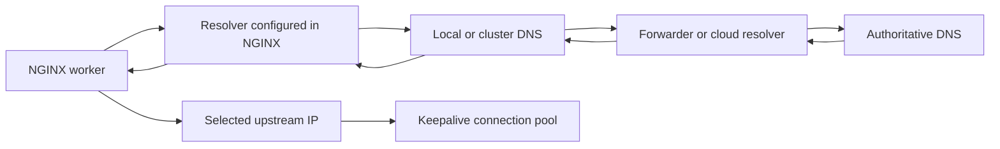
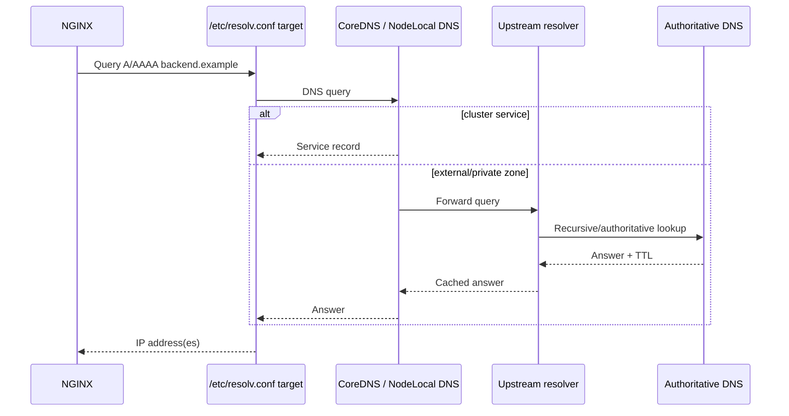
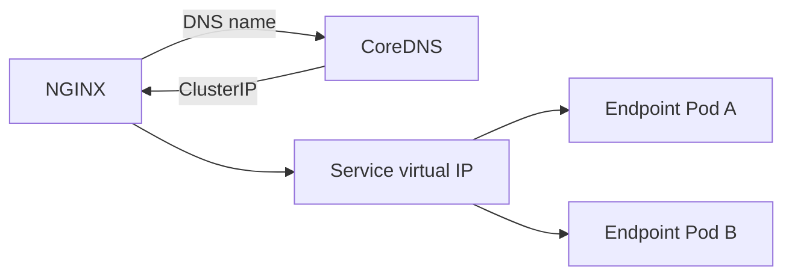
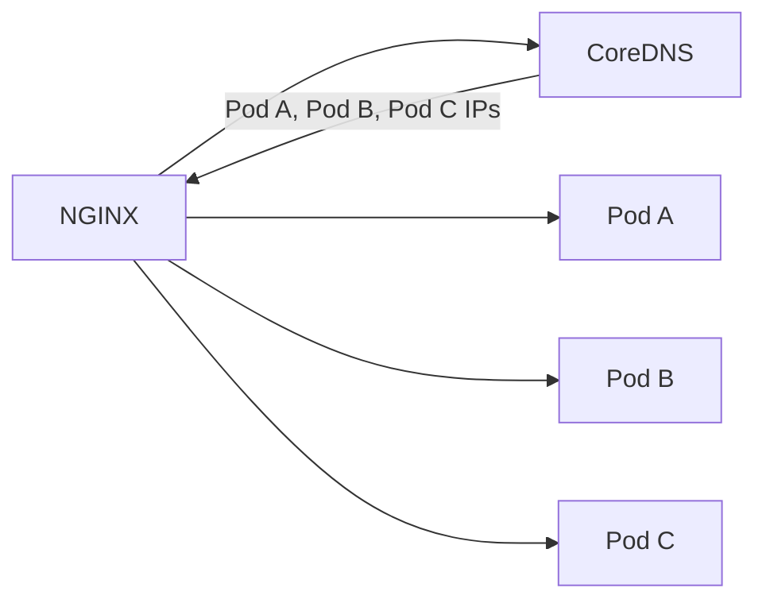

# Part 025 — DNS Resolution, NGINX Resolver Behavior, and Service Discovery

> **Depth level:** Advanced  
> **Prerequisite:** Part 002–003, 008, dan 018; dasar DNS, TCP/IP, Kubernetes Service, EndpointSlice, NGINX upstream, serta container networking.  
> **Scope:** authoritative/recursive DNS, resolver chain, A/AAAA/CNAME/SRV, TTL and negative answers, NGINX startup resolution, runtime resolver, variable-based `proxy_pass`, upstream `resolve`, Kubernetes Service DNS, CoreDNS, headless Service, ExternalName, search domains, `ndots`, split horizon, private zones, stale-address failures, discovery trade-offs, observability, debugging, Java/JAX-RS implications, PR review, dan internal verification.  
> **Bukan scope utama:** general load-balancing algorithm—Part 008; AWS/Azure datapath detail—Part 022/023; on-prem DNS governance—Part 024; egress proxy—Part 028; complete incident process—Part 032.

---

## Operating premise

DNS bukan sekadar tahap awal sebelum traffic berjalan. Dalam sistem dinamis, DNS adalah bagian dari **runtime routing state**.

Nama yang sama dapat menghasilkan jawaban berbeda berdasarkan:

- waktu;
- resolver yang dipakai;
- network location;
- namespace Kubernetes;
- search suffix;
- private/public zone;
- A versus AAAA lookup;
- cache pada client, libc, CoreDNS, NodeLocal DNS, NGINX, cloud resolver, atau authoritative server;
- record type;
- health and failover policy;
- configuration version.

Karena itu, pertanyaan production yang benar bukan hanya:

> “Apakah hostname dapat di-resolve?”

Tetapi:

> “Hostname apa yang ditanyakan, oleh proses mana, kepada resolver mana, pada waktu kapan, dengan search path apa, record type apa, jawaban apa, TTL berapa, cache di layer mana, dan apakah NGINX akan menggunakan jawaban baru tanpa reload?”

---

## Daftar isi

1. [Tujuan pembelajaran](#tujuan-pembelajaran)
2. [Executive mental model](#executive-mental-model)
3. [DNS sebagai distributed control plane](#dns-sebagai-distributed-control-plane)
4. [Resolver chain](#resolver-chain)
5. [Authoritative dan recursive resolution](#authoritative-dan-recursive-resolution)
6. [Record types yang relevan](#record-types-yang-relevan)
7. [TTL, cache, dan freshness](#ttl-cache-dan-freshness)
8. [Negative caching](#negative-caching)
9. [DNS bukan health check](#dns-bukan-health-check)
10. [Empat mode resolusi NGINX](#empat-mode-resolusi-nginx)
11. [Static hostname resolution](#static-hostname-resolution)
12. [Variable-based `proxy_pass`](#variable-based-proxy_pass)
13. [Dynamic upstream dengan `resolve`](#dynamic-upstream-dengan-resolve)
14. [Resolver directive](#resolver-directive)
15. [Resolver security](#resolver-security)
16. [A dan AAAA behavior](#a-dan-aaaa-behavior)
17. [SRV discovery](#srv-discovery)
18. [Upstream zone requirement](#upstream-zone-requirement)
19. [DNS refresh bukan connection migration](#dns-refresh-bukan-connection-migration)
20. [Keepalive dan stale connections](#keepalive-dan-stale-connections)
21. [Kubernetes Service DNS](#kubernetes-service-dns)
22. [ClusterIP Service](#clusterip-service)
23. [Headless Service](#headless-service)
24. [EndpointSlice dan readiness](#endpointslice-dan-readiness)
25. [ExternalName Service](#externalname-service)
26. [Namespace dan FQDN](#namespace-dan-fqdn)
27. [Search domains dan `ndots`](#search-domains-dan-ndots)
28. [`dnsPolicy` dan `dnsConfig`](#dnspolicy-dan-dnsconfig)
29. [CoreDNS mental model](#coredns-mental-model)
30. [NodeLocal DNSCache](#nodelocal-dnscache)
31. [Split-horizon dan private DNS](#split-horizon-dan-private-dns)
32. [Cloud dan on-prem resolver chains](#cloud-dan-on-prem-resolver-chains)
33. [Discovery design options](#discovery-design-options)
34. [Stable Service VIP versus direct endpoint discovery](#stable-service-vip-versus-direct-endpoint-discovery)
35. [Failure catalogue](#failure-catalogue)
36. [NXDOMAIN](#nxdomain)
37. [SERVFAIL](#servfail)
38. [Resolution timeout](#resolution-timeout)
39. [Stale IP](#stale-ip)
40. [Search-domain surprise](#search-domain-surprise)
41. [IPv6 surprise](#ipv6-surprise)
42. [DNS thundering herd](#dns-thundering-herd)
43. [Debugging workflow](#debugging-workflow)
44. [Command cookbook](#command-cookbook)
45. [Observability contract](#observability-contract)
46. [Java/JAX-RS implications](#javajax-rs-implications)
47. [Security concerns](#security-concerns)
48. [Performance and capacity concerns](#performance-and-capacity-concerns)
49. [Production patterns](#production-patterns)
50. [Anti-patterns](#anti-patterns)
51. [PR review checklist](#pr-review-checklist)
52. [Internal verification checklist](#internal-verification-checklist)
53. [Final mental model](#final-mental-model)
54. [Referensi resmi](#referensi-resmi)

---

## Tujuan pembelajaran

Setelah menyelesaikan part ini, Anda harus mampu:

- menjelaskan setiap hop pada DNS resolution path;
- membedakan authoritative server, recursive resolver, forwarding resolver, dan local stub resolver;
- menjelaskan kapan NGINX melakukan lookup hostname;
- menjelaskan kapan perubahan A/AAAA/SRV record akan atau tidak akan terlihat oleh NGINX;
- memilih antara stable Kubernetes Service VIP dan direct endpoint discovery;
- mengidentifikasi stale IP, NXDOMAIN, SERVFAIL, timeout, search-path, serta IPv4/IPv6 failure;
- membuktikan DNS answer dari workstation, node, NGINX pod, dan Java pod;
- menghubungkan DNS failure dengan 502/503/504 tanpa langsung menyalahkan aplikasi;
- merancang TTL dan re-resolution strategy yang sesuai dengan endpoint lifecycle;
- mereview perubahan infra yang menyentuh resolver, service discovery, private DNS, dan upstream hostnames.

---

## Executive mental model



Pisahkan empat state berikut:

1. **Name state** — hostname dan record type yang diminta.
2. **Resolution state** — jawaban IP/SRV, TTL, error, atau timeout.
3. **Selection state** — alamat mana yang dipilih oleh NGINX/load balancer.
4. **Connection state** — socket yang sudah terbuka menuju alamat tersebut.

Perubahan DNS hanya memperbarui **resolution state**. Perubahan itu tidak otomatis:

- memindahkan request yang sedang berjalan;
- menutup semua keepalive connection lama;
- menjamin endpoint baru healthy;
- menghapus route/network issue;
- menyelaraskan cache pada seluruh replica secara bersamaan.

---

## DNS sebagai distributed control plane

DNS dapat mengendalikan:

- endpoint discovery;
- traffic migration;
- disaster recovery;
- private/public routing;
- region selection;
- service naming;
- external SaaS integration;
- certificate hostname validation;
- API callback destination;
- database and message-broker discovery.

Namun DNS memiliki karakteristik eventual consistency:

```text
record changed
    ↓
authoritative zone updated
    ↓
recursive cache expires
    ↓
local cache expires
    ↓
NGINX re-resolves
    ↓
new requests may select new address
    ↓
old keepalive connections may still exist
```

Karena itu, “DNS cutover selesai” bukan event atomik.

---

## Resolver chain

Typical Kubernetes path:



Potential cache layers:

- process/runtime cache;
- NGINX internal resolver cache;
- local caching daemon;
- NodeLocal DNSCache;
- CoreDNS cache plugin;
- cloud VPC/VNet resolver;
- enterprise recursive resolver;
- authoritative provider.

Saat debugging, jangan berasumsi semua layer memiliki jawaban yang sama.

---

## Authoritative dan recursive resolution

### Authoritative DNS

Authoritative server memiliki data final untuk sebuah zone.

Contoh tanggung jawab:

- `api.example.com A 203.0.113.10`;
- `orders.internal.example.com CNAME ...`;
- private hosted zone records;
- SRV records;
- DNSSEC signatures bila digunakan.

### Recursive resolver

Recursive resolver mencari jawaban atas nama client, kemudian melakukan cache.

Contoh:

- CoreDNS forwarding ke upstream;
- AWS Route 53 Resolver;
- Azure DNS recursive resolver;
- corporate DNS appliances;
- ISP resolver.

### Stub resolver

Application atau OS biasanya berbicara ke stub resolver berdasarkan `/etc/resolv.conf`.

NGINX memiliki nuance penting: beberapa resolution paths menggunakan OS resolution saat configuration load, sedangkan runtime dynamic resolution menggunakan `resolver` yang Anda konfigurasi di NGINX.

---

## Record types yang relevan

| Record | Fungsi | Risiko operasional |
|---|---|---|
| `A` | Hostname → IPv4 | stale IP, multiple answers, rotation |
| `AAAA` | Hostname → IPv6 | route tidak tersedia, asymmetric support |
| `CNAME` | Alias → canonical name | chain, TTL interaction, certificate mismatch |
| `SRV` | service + protocol → target/port/priority/weight | support bergantung feature/version |
| `TXT` | metadata/verification | bukan endpoint routing utama |
| `PTR` | reverse lookup | observability/debugging; bukan trust evidence |
| `NS` | zone delegation | misdelegation, split-horizon conflict |
| `SOA` | zone authority and timers | negative cache behavior |

### Multiple A/AAAA answers

Satu hostname dapat menghasilkan beberapa alamat. Ini tidak berarti:

- semua alamat healthy;
- semua alamat berada pada region yang sama;
- client akan memilih alamat dengan algoritme identik;
- ordering jawaban selalu stabil.

---

## TTL, cache, dan freshness

TTL menyatakan berapa lama suatu answer boleh dianggap valid oleh caching resolver.

TTL bukan:

- propagation guarantee;
- exact cutover time;
- health duration;
- maximum connection lifetime;
- guarantee bahwa semua clients mematuhi nilai yang sama.

### Trade-off TTL

| TTL pendek | TTL panjang |
|---|---|
| faster endpoint change visibility | fewer DNS queries |
| higher resolver load | slower failover/cutover |
| more frequent churn | more stale-answer exposure |
| useful for dynamic endpoints | useful for stable infrastructure |

### `valid=` pada NGINX

`resolver ... valid=30s` dapat override caching validity yang berasal dari DNS answer.

Gunakan dengan hati-hati:

- terlalu pendek → query amplification;
- terlalu panjang → stale endpoint;
- tidak sama dengan health check;
- harus konsisten dengan expected endpoint churn.

---

## Negative caching

DNS error juga dapat di-cache.

Contoh negative answers:

- NXDOMAIN — nama tidak ada;
- NODATA — nama ada tetapi record type yang diminta tidak ada;
- SERVFAIL — resolver gagal menyelesaikan query;
- timeout — tidak ada response dalam batas waktu.

Operational trap:

```text
Deployment creates NGINX first
Service record belum tersedia
NGINX mendapat negative answer
Service kemudian dibuat
NGINX masih melihat failure sampai cache/validity berakhir
```

Startup ordering bukan substitute untuk proper readiness dan retry design.

---

## DNS bukan health check

DNS answer berarti “nama dipetakan ke alamat”, bukan “application healthy”.

A record dapat menunjuk ke endpoint yang:

- port-nya tertutup;
- TLS certificate salah;
- readiness false;
- overload;
- mengembalikan 500;
- berada di network yang tidak reachable;
- firewall-nya menolak NGINX;
- sudah terminating tetapi record belum berubah.

Model yang benar:

```text
DNS success
  ≠ TCP success
  ≠ TLS success
  ≠ HTTP success
  ≠ application correctness
```

---

## Empat mode resolusi NGINX

Gunakan classification berikut saat mereview konfigurasi.

| Mode | Contoh | Kapan lookup | Apakah berubah tanpa reload? |
|---|---|---|---|
| Static config-time hostname | `server backend.example:8080;` tanpa `resolve` | configuration load/start/reload | umumnya tidak |
| Literal `proxy_pass` hostname | `proxy_pass http://backend.example;` | configuration processing/resolution path | jangan asumsikan dynamic |
| Variable-based `proxy_pass` | `proxy_pass http://$backend;` | request/runtime via configured resolver | ya, berdasarkan resolver cache |
| Upstream `server ... resolve` | shared-zone upstream | periodic/runtime re-resolution | ya, version/capability dependent |

> **Critical review rule:** Jangan menyimpulkan dynamic discovery hanya karena konfigurasi berisi hostname.

---

## Static hostname resolution

Contoh:

```nginx
upstream orders_backend {
    server orders.internal.example:8080;
}
```

Tanpa dynamic `resolve` mechanism, alamat yang diperoleh saat configuration processing dapat bertahan sampai:

- reload;
- restart;
- configuration regeneration by controller;
- process replacement.

Failure pattern:

```text
backend DNS changes from 10.0.1.10 to 10.0.2.20
NGINX still sends traffic to 10.0.1.10
old address is removed
NGINX returns connection refused / timeout / 502
manual reload appears to “fix DNS”
```

Root cause bukan sekadar DNS; root cause adalah **resolution lifecycle mismatch**.

---

## Variable-based `proxy_pass`

Contoh:

```nginx
resolver 10.96.0.10 valid=30s ipv6=off;
resolver_timeout 5s;

map $host $backend_host {
    default orders.default.svc.cluster.local;
}

location /api/ {
    set $target "http://$backend_host:8080";
    proxy_pass $target;
}
```

Ketika hostname muncul melalui variable dan tidak cocok dengan named upstream group, NGINX menggunakan runtime resolver.

Risiko:

- URI transformation semantics berbeda ketika variable digunakan;
- DNS lookup dapat berada pada request path;
- resolver failure dapat menghasilkan 502;
- dynamic host selection dapat membuka SSRF jika variable berasal dari untrusted input;
- `proxy_redirect default` tidak selalu dapat digunakan dengan variable-based `proxy_pass`;
- cache key/cardinality dapat membesar.

### Jangan lakukan ini

```nginx
location /proxy/ {
    proxy_pass http://$arg_host;
}
```

Ini dapat menjadi SSRF/open proxy bila `$arg_host` dikendalikan client.

Gunakan allowlisted mapping:

```nginx
map $arg_target $approved_backend {
    default "";
    orders  orders.default.svc.cluster.local:8080;
    catalog catalog.default.svc.cluster.local:8080;
}
```

Kemudian reject empty mapping sebelum proxying.

---

## Dynamic upstream dengan `resolve`

Contoh modern NGINX:

```nginx
resolver 10.96.0.10 valid=30s ipv6=off;
resolver_timeout 5s;

upstream orders_backend {
    zone orders_backend 64k;
    server orders.default.svc.cluster.local:8080 resolve;
    keepalive 64;
}

server {
    location /orders/ {
        proxy_pass http://orders_backend;
    }
}
```

Key properties:

- `resolve` memonitor perubahan alamat DNS;
- upstream group membutuhkan shared-memory `zone`;
- resolver harus ditetapkan;
- feature availability bergantung versi/build/product;
- sebelum NGINX Open Source 1.27.3, capability ini historically merupakan commercial feature;
- SRV behavior memiliki additional semantics.

### Version gate

Internal verification wajib menjawab:

```text
NGINX exact version:
Distribution/package:
Open Source or Plus:
Controller-generated config or standalone:
Does image contain expected module/feature:
Does syntax validation succeed:
```

---

## Resolver directive

Typical configuration:

```nginx
resolver 10.96.0.10 valid=30s ipv6=off;
resolver_timeout 5s;
```

Parameter meaning:

- resolver address — DNS server NGINX query;
- `valid=` — override answer validity;
- `ipv4=off` / `ipv6=off` — disable record family lookup;
- `resolver_timeout` — maximum resolution operation duration;
- multiple resolver addresses — queried according to NGINX behavior, not as application-level failover contract;
- `status_zone` — product-dependent DNS statistics capability.

### Resolver source must be intentional

Inside Kubernetes, resolver might be:

- CoreDNS ClusterIP;
- NodeLocal DNSCache address;
- cloud DNS forwarding endpoint;
- enterprise DNS IP;
- loopback resolver in a specialized image.

Hardcoding a cluster DNS IP may fail across clusters. Reading `/etc/resolv.conf` at deployment/render time may be safer, but generated configuration ownership must be explicit.

---

## Resolver security

A compromised or untrusted resolver can redirect NGINX to attacker-controlled addresses.

Security invariants:

- use resolver on trusted local/private network;
- restrict who can alter CoreDNS ConfigMap;
- restrict DNS egress where appropriate;
- verify upstream TLS hostname and trust chain;
- never treat DNS ownership alone as application identity;
- guard against dynamic upstream SSRF;
- log selected upstream address;
- protect private DNS zones and delegation changes;
- review DNS rebinding risk for user-controlled hostnames.

For HTTPS upstreams:

```nginx
proxy_ssl_server_name on;
proxy_ssl_name orders.internal.example;
proxy_ssl_verify on;
proxy_ssl_trusted_certificate /etc/nginx/ca/internal-ca.pem;
```

Dynamic DNS without upstream TLS verification creates a weak trust model.

---

## A dan AAAA behavior

By default, modern NGINX resolver can query both IPv4 and IPv6 records.

Potential failure:

```text
AAAA exists
NGINX selects IPv6
pod/node/network has no working IPv6 route
connection timeout
A record would have worked
```

Do not blindly set `ipv6=off`; first determine whether:

- platform officially supports dual stack;
- Service has IPv6 endpoints;
- firewall and route tables support it;
- certificates and observability handle it;
- future migration requires IPv6.

Use family restriction as an explicit architecture decision.

---

## SRV discovery

SRV records encode:

- service name;
- protocol;
- target hostname;
- port;
- priority;
- weight.

Conceptual record:

```text
_http._tcp.backend.example.com 10 50 8080 pod-a.example.com
_http._tcp.backend.example.com 10 50 8080 pod-b.example.com
```

Possible NGINX configuration:

```nginx
upstream backend {
    zone backend 64k;
    server backend.example.com service=http resolve;
}
```

Review concerns:

- exact NGINX version and product support;
- interpretation of SRV priority/weight;
- target hostname resolution;
- port override behavior;
- readiness and endpoint removal semantics;
- Kubernetes headless Service SRV record format;
- observability of final selected endpoint.

SRV is not automatically superior to ClusterIP. It increases discovery intelligence and operational complexity.

---

## Upstream zone requirement

Dynamic upstream membership must be visible across NGINX workers.

```nginx
upstream backend {
    zone backend 64k;
    server backend.example resolve;
}
```

The `zone` stores shared upstream runtime state within one NGINX instance.

It does **not** synchronize:

- separate pods;
- separate VMs;
- separate regions;
- separate clusters.

Each replica can refresh DNS at slightly different times.

---

## DNS refresh bukan connection migration

Suppose DNS changes:

```text
10.0.1.10 → 10.0.2.20
```

NGINX may update future address selection, while:

- existing TCP keepalive connections to `10.0.1.10` remain open;
- in-flight requests continue;
- WebSocket/SSE sessions remain attached;
- old endpoint continues receiving traffic until connection closure;
- removal timing differs across replicas.

Cutover design must include:

1. DNS update;
2. endpoint overlap window;
3. connection draining;
4. keepalive lifetime;
5. long-lived connection reconnect strategy;
6. rollback route;
7. telemetry proving traffic movement.

---

## Keepalive dan stale connections

DNS freshness controls new address resolution. Upstream keepalive controls socket reuse.

A stale connection can fail due to:

- endpoint terminated;
- NAT state expired;
- server closed idle socket;
- load balancer target removed;
- TLS certificate rotation with old sessions;
- network route changed.

Relevant evidence:

- `$upstream_addr`;
- connect failures;
- connection reset logs;
- upstream keepalive configuration;
- endpoint termination time;
- DNS change time;
- pod deletion timestamp;
- load balancer drain interval.

---

## Kubernetes Service DNS

Kubernetes creates DNS records for Services and Pods. Typical Service FQDN:

```text
orders.platform.svc.cluster.local
```

Breakdown:

```text
orders          service name
platform        namespace
svc             service subdomain
cluster.local   cluster domain
```

A Pod in the same namespace may resolve:

```text
orders
```

A Pod in another namespace should normally use:

```text
orders.platform
```

or full FQDN.

> Production preference: use explicit namespace or FQDN for cross-namespace dependency to reduce accidental shadowing.

---

## ClusterIP Service

Normal Service DNS returns the Service cluster IP.



Advantages:

- stable address;
- Kubernetes handles endpoint churn;
- simple NGINX upstream;
- fewer DNS changes;
- decoupled from Pod IP lifecycle.

Trade-offs:

- additional load-balancing hop;
- source/connection behavior depends kube-proxy/eBPF implementation;
- NGINX cannot directly see every endpoint before connection;
- passive health state may apply to Service VIP rather than individual pod.

For most Java/JAX-RS services, stable ClusterIP is the simplest safe default.

---

## Headless Service

A headless Service uses:

```yaml
spec:
  clusterIP: None
```

DNS may return endpoint IPs directly.



Benefits:

- direct endpoint routing;
- client-side balancing;
- useful for stateful/discovery-aware protocols;
- per-endpoint observability possible.

Risks:

- endpoint churn reaches NGINX discovery logic;
- readiness publication semantics matter;
- DNS TTL and cache become critical;
- stale Pod IP can cause connection failures;
- per-replica answer/order differences;
- larger endpoint sets can increase config/runtime state;
- rollout and scale-down require draining discipline.

Do not use headless Service merely to “remove one hop” without measuring need.

---

## EndpointSlice dan readiness

Kubernetes Service backend membership is represented through EndpointSlices.

Relevant state:

- address;
- port;
- ready;
- serving;
- terminating;
- topology hints, depending platform/features.

Questions to verify:

- Does DNS publish only ready endpoints for this Service type?
- Is `publishNotReadyAddresses` enabled?
- What happens during pod termination?
- Does the controller use Service ClusterIP or EndpointSlices directly?
- How quickly are endpoint changes reflected?
- Does a long-lived connection survive endpoint removal?

A Pod can exist but should not necessarily be discoverable.

---

## ExternalName Service

Example:

```yaml
apiVersion: v1
kind: Service
metadata:
  name: partner-api
spec:
  type: ExternalName
  externalName: partner.internal.example.com
```

Kubernetes DNS returns a CNAME-like mapping.

Risks:

- HTTP Host/SNI may remain `partner-api.namespace.svc...` while remote certificate expects `partner.internal.example.com`;
- resolver chain crosses cluster boundary;
- private DNS reachability may differ;
- no Kubernetes health/readiness management;
- naming abstraction can hide external ownership;
- application may generate wrong absolute URLs.

For HTTPS upstream:

```nginx
proxy_set_header Host partner.internal.example.com;
proxy_ssl_server_name on;
proxy_ssl_name partner.internal.example.com;
```

Verify exact controller-generated behavior rather than assuming it.

---

## Namespace dan FQDN

Short name resolution depends on requester namespace.

From namespace `quote`:

```text
catalog
```

means approximately:

```text
catalog.quote.svc.cluster.local
```

It does not mean:

```text
catalog.platform.svc.cluster.local
```

Common failure:

- DEV has Service `catalog` in same namespace;
- PROD places it in `platform` namespace;
- short name resolves in DEV but fails in PROD;
- engineers diagnose “CoreDNS unstable” although name was ambiguous.

Use FQDN when environment or namespace boundaries are meaningful.

---

## Search domains dan `ndots`

Typical Pod `/etc/resolv.conf`:

```text
nameserver 10.96.0.10
search quote.svc.cluster.local svc.cluster.local cluster.local
options ndots:5
```

With `ndots:5`, a name containing fewer than five dots may be tried through search suffixes before absolute lookup.

For `api.partner.example.com`, possible behavior may involve attempts such as:

```text
api.partner.example.com.quote.svc.cluster.local
api.partner.example.com.svc.cluster.local
api.partner.example.com.cluster.local
api.partner.example.com
```

Consequences:

- extra DNS queries;
- added latency;
- confusing NXDOMAIN logs;
- unexpected internal-name match;
- resolver load amplification;
- security ambiguity.

A trailing dot marks an absolute DNS name in many resolver contexts:

```text
api.partner.example.com.
```

But verify whether the specific NGINX directive and runtime path handles it as expected.

---

## `dnsPolicy` dan `dnsConfig`

Common Pod policies:

- `ClusterFirst`;
- `Default`;
- `ClusterFirstWithHostNet`;
- `None` with explicit `dnsConfig`.

Changes can alter:

- nameserver address;
- search domains;
- `ndots`;
- options such as single-request behavior;
- access to cluster Service DNS;
- access to corporate private domains.

Ingress/controller pods using `hostNetwork` often need special DNS-policy attention.

Inspect actual pod config:

```bash
kubectl exec -n ingress <nginx-pod> -- cat /etc/resolv.conf
```

Do not infer it only from Helm values.

---

## CoreDNS mental model

CoreDNS typically:

- answers Kubernetes Service/Pod records;
- watches Kubernetes API objects;
- forwards non-cluster domains;
- caches responses;
- exposes health/readiness/metrics;
- applies plugins in Corefile order.

Simplified Corefile:

```text
.:53 {
    errors
    health
    ready
    kubernetes cluster.local in-addr.arpa ip6.arpa {
        pods insecure
        fallthrough in-addr.arpa ip6.arpa
    }
    prometheus :9153
    forward . /etc/resolv.conf
    cache 30
    loop
    reload
    loadbalance
}
```

Plugin order matters. A change can affect:

- internal records;
- forwarding;
- caching;
- rewrite behavior;
- logging volume;
- loop detection;
- multi-tenant isolation.

---

## NodeLocal DNSCache

NodeLocal DNSCache places a caching DNS agent closer to workloads.

Potential benefits:

- lower latency;
- reduced CoreDNS load;
- fewer conntrack issues for UDP DNS;
- node-local observability;
- improved resilience to transient CoreDNS pressure.

Potential complexity:

- another cache layer;
- different resolver IP;
- stale-answer analysis becomes harder;
- node-specific failures;
- configuration mismatch across node pools;
- host-network interaction.

Evidence must identify whether the NGINX pod uses:

- CoreDNS Service IP directly;
- node-local address;
- host resolver;
- custom resolver.

---

## Split-horizon dan private DNS

The same hostname can resolve differently:

| Query location | Answer |
|---|---|
| public internet | public load balancer |
| corporate network | private VIP |
| AWS VPC | private ALB/NLB |
| Azure VNet | private endpoint |
| Kubernetes cluster | internal Service/CNAME |

Failure modes:

- workstation test succeeds but pod resolves a private address it cannot route;
- pod resolves public endpoint and hairpins through internet path;
- certificate differs between public/private endpoints;
- private zone shadows public records but is incomplete;
- forwarding rules create loop;
- DR cutover updates only one view.

Always record **query origin** with DNS evidence.

---

## Cloud dan on-prem resolver chains

### AWS example

```text
NGINX pod
→ CoreDNS / NodeLocal DNS
→ VPC Route 53 Resolver
→ private hosted zone or outbound resolver rule
→ on-prem DNS / public authority
```

### Azure example

```text
NGINX pod
→ CoreDNS
→ Azure-provided DNS or custom DNS
→ Azure DNS Private Resolver
→ private DNS zone / on-prem forwarder / public authority
```

### On-prem example

```text
NGINX VM/pod
→ local resolver
→ site recursive DNS
→ enterprise DNS hierarchy
→ conditional forwarder
→ partner or cloud private DNS
```

Each hop needs an owner, timeout, cache policy, and evidence source.

---

## Discovery design options

| Pattern | Discovery owner | Churn visibility | Complexity |
|---|---|---:|---:|
| Static IP | config/GitOps | none | low initially, high operational risk |
| Static hostname + reload | deployment pipeline | at reload | low-medium |
| Runtime variable resolver | NGINX request path | TTL/valid | medium-high |
| Upstream `resolve` | NGINX upstream runtime | TTL/valid | medium |
| Kubernetes ClusterIP | Kubernetes Service | hidden behind VIP | low |
| Headless Service | DNS client | direct endpoint churn | high |
| Controller watches EndpointSlices | ingress controller | API-driven | medium-high |
| Service mesh discovery | mesh control plane | dynamic | high |
| Cloud LB/DNS | cloud control plane | provider-specific | medium |

Choose based on required behavior, not feature novelty.

---

## Stable Service VIP versus direct endpoint discovery

### Prefer stable Service VIP when

- application is stateless HTTP;
- per-pod load balancing is not required at NGINX;
- Kubernetes dataplane is reliable;
- endpoint churn is frequent;
- operational simplicity is a priority;
- passive health at pod level is not essential.

### Consider direct endpoint discovery when

- protocol requires endpoint identity;
- topology-aware routing is important;
- connection pooling per endpoint matters;
- Service load-balancing behavior is insufficient;
- controller already watches EndpointSlices;
- team can operate churn, draining, and observability safely.

### Architecture invariant

Do not combine direct endpoint discovery with weak termination handling. Scale-down must not turn DNS updates into reset storms.

---

## Failure catalogue

| Symptom | Likely layer | Evidence |
|---|---|---|
| `host not found in upstream` at startup | config-time resolution | NGINX startup log |
| intermittent 502 after pod churn | stale address/keepalive | `$upstream_addr`, endpoint history |
| NXDOMAIN only in one namespace | short-name/search path | `/etc/resolv.conf`, `dig` |
| SERVFAIL cluster-wide | CoreDNS/upstream resolver | CoreDNS metrics/logs |
| slow first request | DNS latency/cache miss | resolver metrics, trace timing |
| IPv6 connect timeout | AAAA + no route | `dig AAAA`, route table |
| works after NGINX reload | static resolution lifecycle | before/after upstream IP |
| one NGINX replica fails | cache or node-local DNS difference | replica-specific query/log |
| external hostname resolves internal IP | split horizon | query from multiple origins |
| certificate mismatch | CNAME/Host/SNI mismatch | `openssl s_client`, upstream name |

---

## NXDOMAIN

NXDOMAIN means the queried name does not exist in the relevant DNS view.

Check:

1. exact query string;
2. whether it is absolute or search-expanded;
3. requester namespace;
4. correct private/public zone;
5. record creation order;
6. stale negative cache;
7. authoritative zone delegation;
8. typo or environment suffix;
9. Service existence;
10. CoreDNS access to Kubernetes API.

Do not “fix” NXDOMAIN by adding arbitrary `/etc/hosts` entries in production containers.

---

## SERVFAIL

SERVFAIL means resolution failed, not necessarily that the name is absent.

Potential causes:

- upstream recursive resolver unavailable;
- DNSSEC validation issue;
- forwarding loop;
- authoritative timeout;
- CoreDNS plugin error;
- malformed response;
- rate limiting;
- network policy blocking DNS;
- truncated UDP response with failed TCP fallback;
- broken delegation.

Distinguish SERVFAIL from NXDOMAIN; remediation is different.

---

## Resolution timeout

Potential causes:

- UDP/53 blocked;
- TCP/53 blocked for fallback;
- resolver overload;
- wrong nameserver IP;
- NodeLocal DNS unhealthy;
- CoreDNS pods not ready;
- forwarding target unreachable;
- `resolver_timeout` too short;
- packet loss;
- conntrack saturation.

Timeout budget should be small enough not to consume entire HTTP deadline, but large enough for expected resolver path.

---

## Stale IP

Stale-address diagnosis requires a timeline:

```text
T0 DNS record old IP
T1 new endpoint ready
T2 authoritative record updated
T3 resolver cache expires
T4 NGINX re-resolves
T5 old endpoint begins drain
T6 old endpoint removed
T7 old keepalive connections disappear
```

Unsafe sequence:

```text
remove old endpoint → update DNS
```

Safer sequence:

```text
add new endpoint → verify → update DNS → wait effective TTL/cache → drain old → remove old
```

---

## Search-domain surprise

Example:

```text
Configured upstream: orders.prod
```

This could be treated as relative and expanded through search domains rather than queried as the intended public/private FQDN.

Symptoms:

- multiple NXDOMAIN queries;
- unexpected internal resolution;
- environment-dependent behavior;
- extra latency.

Use explicit service FQDN and inspect actual DNS packets when ambiguity remains.

---

## IPv6 surprise

Evidence checklist:

```bash
dig A backend.example
dig AAAA backend.example
ip -6 route
curl -4 -v https://backend.example
curl -6 -v https://backend.example
```

From NGINX pod, verify route and connection—not just answer existence.

---

## DNS thundering herd

A large fleet can re-resolve at similar times after TTL expiry.

Amplifiers:

- very short TTL;
- synchronized pod startup;
- many hostname-based upstreams;
- many controller replicas;
- no local caching;
- retries on timeout;
- large search path;
- `ndots` expansion.

Mitigation:

- appropriate caching layer;
- realistic TTL;
- staggered rollout;
- NodeLocal DNS where justified;
- resolver capacity monitoring;
- reduce ambiguous short-name queries;
- avoid per-request dynamic hostnames unless required.

---

## Debugging workflow

### Step 1 — Identify the exact resolver client

Is the failing lookup performed by:

- NGINX master during config load;
- NGINX worker at request time;
- ingress controller process;
- Java application;
- sidecar;
- init container;
- operating system command?

### Step 2 — Capture exact hostname and record family

From effective config and logs:

```bash
nginx -T
```

Look for:

- upstream hostnames;
- `resolver`;
- `resolve`;
- variable-based `proxy_pass`;
- `ipv4`/`ipv6` flags;
- generated controller config.

### Step 3 — Inspect resolver configuration

```bash
cat /etc/resolv.conf
```

Record:

- nameserver;
- search list;
- options;
- namespace;
- `dnsPolicy`;
- NodeLocal DNS use.

### Step 4 — Query from the failing network namespace

```bash
kubectl exec -n ingress <pod> -- getent hosts orders.platform.svc.cluster.local
kubectl exec -n ingress <pod> -- nslookup orders.platform.svc.cluster.local
```

Prefer tools that allow explicit record and server:

```bash
dig @10.96.0.10 orders.platform.svc.cluster.local A +ttlunits
dig @10.96.0.10 orders.platform.svc.cluster.local AAAA +ttlunits
```

### Step 5 — Compare answers across origins

- workstation;
- bastion;
- node;
- NGINX controller pod;
- Java pod;
- other cluster/region.

### Step 6 — Separate DNS from connectivity

```bash
curl -v --resolve orders.example:443:10.0.2.20 https://orders.example/health
nc -vz 10.0.2.20 8080
openssl s_client -connect 10.0.2.20:443 -servername orders.example
```

### Step 7 — Inspect Kubernetes objects

```bash
kubectl get svc -A
kubectl get endpointslice -A -l kubernetes.io/service-name=orders -o wide
kubectl get pods -n platform -o wide
kubectl describe svc -n platform orders
```

### Step 8 — Inspect CoreDNS

```bash
kubectl get pods -n kube-system -l k8s-app=kube-dns
kubectl logs -n kube-system -l k8s-app=kube-dns --tail=200
kubectl get configmap -n kube-system coredns -o yaml
```

### Step 9 — Build a timeline

Correlate:

- DNS change;
- deployment rollout;
- endpoint update;
- NGINX reload;
- error spike;
- resolver metrics;
- pod termination.

### Step 10 — Prove recovery mechanism

Did recovery occur because of:

- TTL expiry;
- `valid` expiry;
- reload;
- pod restart;
- cache eviction;
- endpoint restoration;
- network repair?

Avoid vague conclusion “DNS was flaky”.

---

## Command cookbook

### Inspect effective NGINX config

```bash
nginx -T 2>&1 | less
```

### Resolve through default pod resolver

```bash
getent ahosts backend.example
nslookup backend.example
```

### Query explicit resolver

```bash
dig @10.96.0.10 backend.example A +noall +answer
dig @10.96.0.10 backend.example AAAA +noall +answer
dig @10.96.0.10 _http._tcp.backend.example SRV +noall +answer
```

### Show full resolution chain

```bash
dig +trace backend.example
```

`+trace` may not represent private/forwarded enterprise paths; use carefully.

### Test search expansion

```bash
dig backend
cat /etc/resolv.conf
```

### Packet capture DNS

```bash
tcpdump -ni any port 53
```

### Check CoreDNS metrics

Typical metrics to inspect:

```text
coredns_dns_requests_total
coredns_dns_responses_total
coredns_dns_request_duration_seconds
coredns_cache_hits_total
coredns_cache_misses_total
coredns_forward_healthcheck_failures_total
```

Exact metric names/version must be verified.

---

## Observability contract

At minimum, capture:

### NGINX

- selected `$upstream_addr`;
- `$upstream_connect_time`;
- `$upstream_status`;
- error-log resolution failures;
- effective upstream hostname/config version;
- reload timestamp;
- replica/pod/node identity.

### DNS platform

- query rate;
- response codes;
- latency histogram;
- cache hit/miss;
- forwarder failures;
- pod CPU/memory;
- dropped packets;
- TCP fallback;
- per-zone error distribution where safe.

### Kubernetes

- CoreDNS readiness;
- EndpointSlice changes;
- Service changes;
- pod lifecycle;
- node pressure;
- network policy changes.

### Alert examples

- SERVFAIL ratio above baseline;
- DNS p99 latency near application connect timeout;
- CoreDNS saturation;
- sudden NXDOMAIN increase for production service suffix;
- NGINX `host not found` spikes;
- divergence in upstream addresses across replicas;
- DNS query amplification after rollout.

Avoid labels containing arbitrary queried hostname if cardinality is unbounded.

---

## Java/JAX-RS implications

NGINX and Java may have different DNS lifecycles.

Java DNS behavior can be affected by:

- JVM DNS cache TTL properties;
- security settings;
- HTTP client connection pools;
- Netty/Vert.x/custom resolver;
- container `/etc/resolv.conf`;
- service mesh interception;
- cloud SDK endpoint discovery.

This creates asymmetric behavior:

```text
NGINX sees new IP
Java outbound client still uses old cached IP
```

or:

```text
Java resolves correctly
NGINX static upstream still uses old IP
```

For a JAX-RS service behind NGINX, verify:

- ingress-to-service discovery;
- service-to-downstream discovery;
- database/broker DNS cache;
- TLS SNI/hostname validation;
- connection-pool stale socket handling;
- readiness behavior during endpoint migration.

### Application error attribution

A 502 generated by NGINX due to resolution failure should not be counted as Java application 5xx unless telemetry explicitly attributes it.

---

## Security concerns

- DNS spoofing and cache poisoning;
- unauthorized private-zone changes;
- dynamic upstream SSRF;
- DNS rebinding;
- exfiltration through DNS queries;
- unbounded user-controlled labels;
- public resolution of internal names;
- private zone shadowing;
- weak upstream TLS verification;
- cross-namespace discovery in multi-tenant clusters;
- CoreDNS RBAC overexposure;
- logging sensitive query names.

Security rule:

> DNS tells NGINX where to connect. TLS/authentication must tell NGINX whom it connected to.

---

## Performance and capacity concerns

DNS can become a bottleneck when:

- TTL is too short;
- `valid` is aggressively low;
- every request uses a unique hostname;
- search expansion multiplies queries;
- multiple A/AAAA/SRV lookups occur;
- CoreDNS replicas are undersized;
- CPU throttling affects resolver latency;
- UDP packet loss triggers retry/TCP fallback;
- NodeLocal DNS is absent in a very large cluster;
- logging every query causes I/O pressure.

Capacity model:

```text
DNS QPS ≈ clients × dynamic names × refresh frequency × search attempts × record families
```

Measure actual query rate before tuning.

---

## Production patterns

### Pattern A — Stable Kubernetes Service

```nginx
upstream orders {
    server orders.platform.svc.cluster.local:8080;
    keepalive 64;
}
```

Best when Service VIP remains stable and NGINX reload lifecycle is controlled.

### Pattern B — Dynamic upstream re-resolution

```nginx
resolver 10.96.0.10 valid=30s ipv6=off;
resolver_timeout 5s;

upstream partner {
    zone partner 64k;
    server partner.internal.example:443 resolve;
    keepalive 32;
}
```

Best when endpoint IP can change without config rollout.

### Pattern C — Controller-driven EndpointSlice discovery

The ingress/controller watches Kubernetes API and regenerates/reloads dataplane configuration.

Best when controller supports it reliably and exposes reconciliation status.

### Pattern D — Headless Service direct routing

Use only when direct endpoint identity/routing is needed and termination behavior is engineered.

---

## Anti-patterns

- hardcoded Pod IP;
- assuming hostname means dynamic re-resolution;
- restarting NGINX as the only DNS refresh strategy without documenting it;
- using public resolver for private service discovery;
- accepting user-supplied upstream hostname;
- disabling IPv6 blindly;
- setting TTL to one second without resolver capacity analysis;
- using short cross-namespace Service names;
- treating DNS as health check;
- changing record and immediately deleting old endpoint;
- failing to log final upstream IP;
- testing only from a developer laptop;
- adding `/etc/hosts` as permanent production fix;
- ignoring negative caching;
- forgetting that Java has its own DNS and connection caches.

---

## PR review checklist

### Naming and ownership

- [ ] Is every upstream hostname owned and documented?
- [ ] Is the expected DNS view public, private, cluster-local, or split-horizon?
- [ ] Is a short name intentionally used?
- [ ] Is cross-namespace dependency explicit?

### Resolution lifecycle

- [ ] When is the hostname resolved?
- [ ] Does address change require reload?
- [ ] Is `resolve` supported by the deployed NGINX version/product?
- [ ] Is `zone` configured where required?
- [ ] Is runtime resolver configured at the correct context?

### TTL and failure behavior

- [ ] Is `valid` aligned with endpoint churn?
- [ ] Is `resolver_timeout` inside the end-to-end deadline budget?
- [ ] Is negative caching considered?
- [ ] Is old endpoint overlap/draining defined?

### Kubernetes review

- [ ] ClusterIP or headless Service—why?
- [ ] Are EndpointSlice readiness semantics understood?
- [ ] Is `publishNotReadyAddresses` used?
- [ ] Are `dnsPolicy`, `dnsConfig`, and `ndots` reviewed?

### Security

- [ ] Is the resolver trusted?
- [ ] Can client input influence hostname?
- [ ] Is upstream TLS hostname verification enabled?
- [ ] Are private DNS changes controlled and audited?

### Observability

- [ ] Can logs show selected upstream IP?
- [ ] Are CoreDNS/resolver metrics available?
- [ ] Is there a DNS incident runbook?
- [ ] Can answers be compared across replicas and network locations?

---

## Internal verification checklist

> **Internal verification checklist — CSG/team-specific facts must be confirmed; do not infer them from generic architecture.**

### Codebase and application

- [ ] Inventory every hostname used by Java/JAX-RS services, HTTP clients, JDBC, Kafka, Redis, RabbitMQ, and external integrations.
- [ ] Check JVM DNS cache configuration and HTTP-client connection-pool behavior.
- [ ] Identify code that accepts or constructs dynamic hostnames.
- [ ] Verify TLS hostname validation for outbound Java clients.

### NGINX and ingress configuration

- [ ] Run `nginx -T` or inspect generated controller config.
- [ ] List every hostname-based `upstream` and `proxy_pass`.
- [ ] Identify static lookup, variable-based lookup, controller-driven discovery, and `resolve` usage.
- [ ] Confirm exact NGINX version/build/product and feature support.
- [ ] Inspect `resolver`, `resolver_timeout`, `valid`, `ipv4`, and `ipv6` settings.
- [ ] Check upstream shared-memory zones and keepalive lifetimes.

### Kubernetes runtime verification

- [ ] Inspect `Service`, `EndpointSlice`, headless Service, ExternalName, and `publishNotReadyAddresses` usage.
- [ ] Compare `/etc/resolv.conf` in controller and application pods.
- [ ] Confirm `dnsPolicy`, `dnsConfig`, host-network mode, and NodeLocal DNSCache.
- [ ] Review CoreDNS deployment, PDB, resources, autoscaling, Corefile, health, cache, forwarders, metrics, and logs.
- [ ] Test DNS during rolling update and endpoint rotation.

### Cloud/on-prem DNS

- [ ] Map private/public hosted zones and split-horizon rules.
- [ ] Confirm conditional forwarding, Route 53 Resolver/Azure Private Resolver/on-prem equivalent, and owners.
- [ ] Review TTLs, negative-cache behavior, and change process.
- [ ] Verify cross-cloud/on-prem DNS reachability and fallback.
- [ ] Check DR records and cutover runbooks.

### Production evidence

- [ ] Find incidents involving stale IP, NXDOMAIN, SERVFAIL, timeout, or reload-based recovery.
- [ ] Compare DNS answers from workstation, node, NGINX pod, Java pod, and alternate region.
- [ ] Verify dashboards and alerts for resolver latency/error ratio.
- [ ] Confirm logs expose selected upstream address and NGINX replica identity.
- [ ] Validate old endpoint draining against TTL and connection lifetime.

---

## Final mental model

Gunakan reasoning sequence berikut:

```text
1. What exact name is queried?
2. Is it absolute or search-expanded?
3. Who performs the lookup?
4. Which resolver receives it?
5. Which DNS view is selected?
6. What record type and answer are returned?
7. What TTL or negative validity applies?
8. Which cache layers retain the answer?
9. Does NGINX dynamically re-resolve or require reload?
10. Which address does NGINX select?
11. Are old keepalive connections still alive?
12. Can the selected address be reached over TCP/TLS/HTTP?
13. Is the endpoint ready and semantically correct?
14. What telemetry proves each conclusion?
```

> **Core invariant:** A production DNS diagnosis is complete only when it connects the queried name, resolver path, answer lifetime, NGINX resolution mode, selected upstream address, connection lifecycle, and endpoint health into one evidence-backed timeline.

---

## Referensi resmi

- [NGINX `ngx_http_core_module` — `resolver` and `resolver_timeout`](https://nginx.org/en/docs/http/ngx_http_core_module.html#resolver)
- [NGINX `ngx_http_upstream_module` — dynamic `resolve`, upstream resolver, and zones](https://nginx.org/en/docs/http/ngx_http_upstream_module.html)
- [NGINX proxy module — variable-based `proxy_pass`](https://nginx.org/en/docs/http/ngx_http_proxy_module.html#proxy_pass)
- [Kubernetes — DNS for Services and Pods](https://kubernetes.io/docs/concepts/services-networking/dns-pod-service/)
- [Kubernetes — Debugging DNS Resolution](https://kubernetes.io/docs/tasks/administer-cluster/dns-debugging-resolution/)
- [Kubernetes — Customizing DNS Service](https://kubernetes.io/docs/tasks/administer-cluster/dns-custom-nameservers/)
- [Kubernetes — Using CoreDNS for Service Discovery](https://kubernetes.io/docs/tasks/administer-cluster/coredns/)

---

**End of Part 025.**
