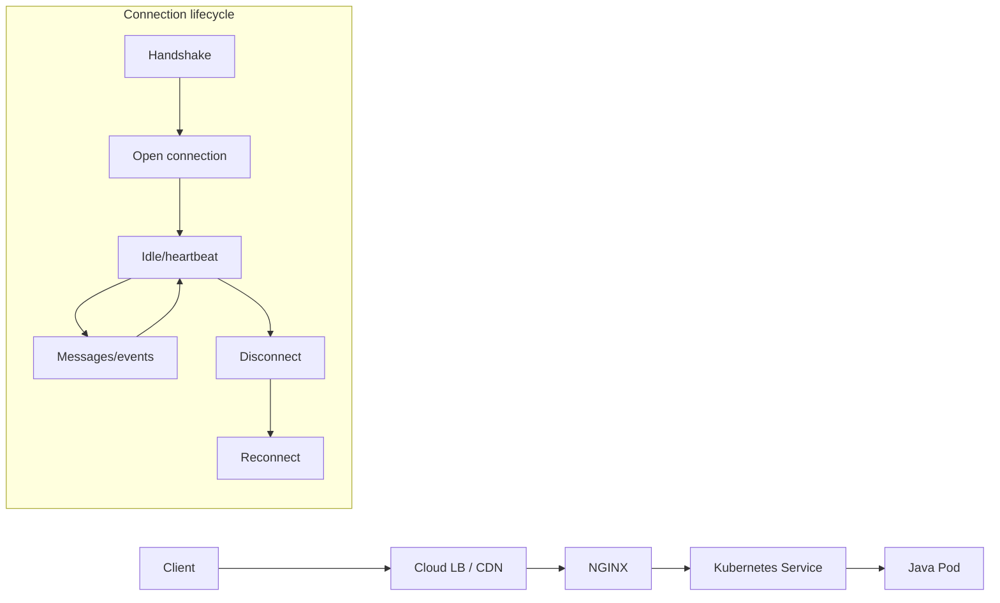
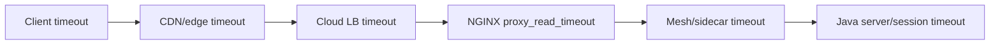
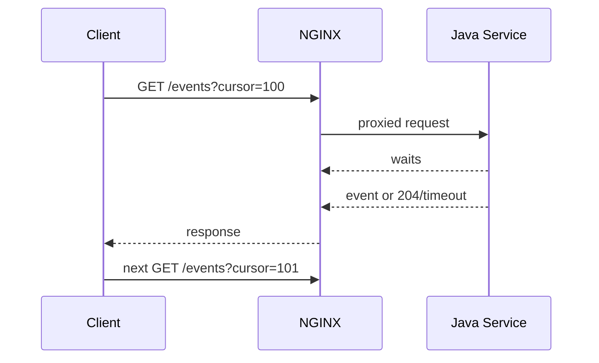
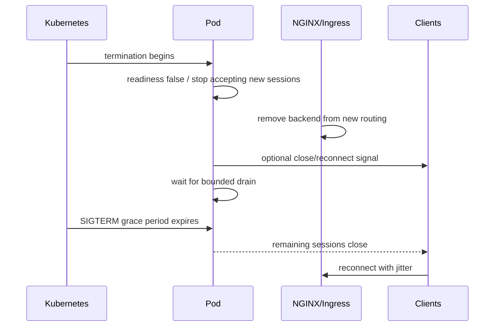

# Part 026 — Real-Time Traffic: WebSocket, SSE, and Long Polling

> **Depth level:** Advanced  
> **Prerequisite:** Part 009–010, 016, dan 018–020; dasar HTTP/1.1, HTTP/2, connection lifecycle, NGINX proxying, Kubernetes rollout, Java/JAX-RS asynchronous processing, dan capacity planning.  
> **Scope:** WebSocket handshake and tunneling, SSE framing and flushing, long polling, idle/read/write timeout alignment, heartbeats, reconnect, affinity, connection capacity, buffering, compression, load balancer behavior, Kubernetes draining, rollout disruption, Java/JAX-RS endpoint design, observability, debugging, PR review, dan internal verification.  
> **Bukan scope utama:** general buffering fundamentals—Part 010; general capacity model—Part 016; gRPC/HTTP/2 binary streaming—Part 027; safe progressive delivery—Part 030; full incident response—Part 032.

---

## Operating premise

Long-lived traffic mengubah unit kapasitas dan failure model.

Untuk request REST biasa, resource sering dipikirkan sebagai:

```text
requests per second
latency per request
```

Untuk WebSocket, SSE, dan long polling, Anda juga harus memikirkan:

```text
concurrent open connections
connection duration
idle periods
heartbeat frequency
bytes per connection
reconnect rate
state affinity
rollout drain time
```

> **Primary rule:** Connection yang “idle” dari sisi payload tetap memakan socket, file descriptor, memory, load-balancer state, NGINX worker capacity, JVM resources, dan operational attention.

---

## Daftar isi

1. [Tujuan pembelajaran](#tujuan-pembelajaran)
2. [Executive mental model](#executive-mental-model)
3. [Tiga communication patterns](#tiga-communication-patterns)
4. [Request versus connection lifecycle](#request-versus-connection-lifecycle)
5. [WebSocket protocol upgrade](#websocket-protocol-upgrade)
6. [Hop-by-hop headers](#hop-by-hop-headers)
7. [Canonical NGINX WebSocket configuration](#canonical-nginx-websocket-configuration)
8. [HTTP version considerations](#http-version-considerations)
9. [Handshake failure model](#handshake-failure-model)
10. [WebSocket data phase](#websocket-data-phase)
11. [Ping, pong, and application heartbeat](#ping-pong-and-application-heartbeat)
12. [Idle timeout chain](#idle-timeout-chain)
13. [WebSocket affinity and state](#websocket-affinity-and-state)
14. [WebSocket security](#websocket-security)
15. [Server-Sent Events mental model](#server-sent-events-mental-model)
16. [SSE wire format](#sse-wire-format)
17. [SSE through NGINX](#sse-through-nginx)
18. [Buffering and flush behavior](#buffering-and-flush-behavior)
19. [SSE reconnection and replay](#sse-reconnection-and-replay)
20. [SSE heartbeat](#sse-heartbeat)
21. [Long polling mental model](#long-polling-mental-model)
22. [Long polling timeout and retry](#long-polling-timeout-and-retry)
23. [Protocol selection](#protocol-selection)
24. [Compression considerations](#compression-considerations)
25. [Capacity model](#capacity-model)
26. [File descriptors and worker connections](#file-descriptors-and-worker-connections)
27. [Memory and buffer model](#memory-and-buffer-model)
28. [JVM capacity and threading](#jvm-capacity-and-threading)
29. [Kubernetes scaling](#kubernetes-scaling)
30. [Graceful shutdown and draining](#graceful-shutdown-and-draining)
31. [Rolling updates](#rolling-updates)
32. [Reconnect storms](#reconnect-storms)
33. [Cloud load balancer and CDN behavior](#cloud-load-balancer-and-cdn-behavior)
34. [Service mesh and proxy chains](#service-mesh-and-proxy-chains)
35. [Observability contract](#observability-contract)
36. [Failure catalogue](#failure-catalogue)
37. [Debugging WebSocket](#debugging-websocket)
38. [Debugging SSE](#debugging-sse)
39. [Debugging long polling](#debugging-long-polling)
40. [Java/JAX-RS implementation considerations](#javajax-rs-implementation-considerations)
41. [Reference configurations](#reference-configurations)
42. [Test strategy](#test-strategy)
43. [Performance and security review](#performance-and-security-review)
44. [PR review checklist](#pr-review-checklist)
45. [Internal verification checklist](#internal-verification-checklist)
46. [Final mental model](#final-mental-model)
47. [Referensi resmi](#referensi-resmi)

---

## Tujuan pembelajaran

Setelah menyelesaikan part ini, Anda harus mampu:

- menjelaskan handshake dan data phase WebSocket;
- menjelaskan kenapa `Upgrade` dan `Connection` harus diperlakukan khusus;
- mengonfigurasi proxy route untuk WebSocket tanpa merusak HTTP biasa;
- mengoperasikan SSE tanpa accidental buffering;
- merancang heartbeat, idle timeout, reconnect, dan replay behavior;
- menghitung connection capacity pada NGINX, load balancer, Kubernetes, dan JVM;
- membedakan kebutuhan affinity dari application state design;
- memprediksi dampak rolling update terhadap long-lived sessions;
- mendiagnosis handshake 400/404/426, periodic disconnect, delayed events, reset, dan reconnect storm;
- mereview perubahan yang menyentuh real-time traffic dengan failure-oriented checklist.

---

## Executive mental model



Long-lived route memiliki minimal enam contracts:

1. **Handshake contract** — request method, headers, status, protocol selection.
2. **Transport contract** — connection stays open and packets flow both ways or one way.
3. **Liveness contract** — heartbeat and idle timeout.
4. **State contract** — whether reconnect to another pod is safe.
5. **Capacity contract** — maximum concurrent connections and message throughput.
6. **Deployment contract** — drain, termination, reconnect, and rollout behavior.

---

## Tiga communication patterns

| Pattern | Direction | Connection | Typical use |
|---|---|---|---|
| WebSocket | bidirectional | persistent upgraded tunnel | interactive events, collaboration, control channels |
| SSE | server → client | long-running HTTP response | notifications, progress, event feed |
| Long polling | server → client per request | request waits then closes/reopens | compatibility fallback, low-frequency events |

### WebSocket

- full duplex;
- message framing after HTTP handshake;
- client and server can send independently;
- intermediary must support upgrade/tunnel behavior.

### SSE

- one-way server-to-client;
- standard HTTP response;
- text event stream;
- browser reconnection semantics are built in;
- client-to-server messages use separate HTTP requests.

### Long polling

- ordinary HTTP requests;
- server holds request until event or timeout;
- client immediately reconnects;
- higher request churn than SSE/WebSocket.

---

## Request versus connection lifecycle

A normal REST request:

```text
connect/reuse → request → response → keepalive/close
```

A WebSocket session:

```text
HTTP request → 101 Switching Protocols → tunnel → many frames → close
```

An SSE session:

```text
HTTP GET → 200 text/event-stream → many event chunks → reconnect on close
```

Long polling:

```text
HTTP GET → wait → event/timeout response → close/reuse → immediate next GET
```

Do not use request count alone to estimate load.

---

## WebSocket protocol upgrade

Typical client handshake:

```http
GET /ws/orders HTTP/1.1
Host: api.example.com
Upgrade: websocket
Connection: Upgrade
Sec-WebSocket-Key: ...
Sec-WebSocket-Version: 13
Origin: https://app.example.com
```

Successful response:

```http
HTTP/1.1 101 Switching Protocols
Upgrade: websocket
Connection: Upgrade
Sec-WebSocket-Accept: ...
```

After status 101, the connection no longer carries ordinary HTTP request/response messages in the same way. It becomes a WebSocket tunnel with frames.

---

## Hop-by-hop headers

`Upgrade` and `Connection` are hop-by-hop headers.

They are not automatically forwarded through a reverse proxy as ordinary end-to-end headers. NGINX must construct the upstream request appropriately.

Incorrect assumption:

```text
client sent Upgrade
therefore backend automatically receives Upgrade
```

Correct model:

```text
client → NGINX hop
NGINX explicitly creates upgrade intent → backend hop
```

---

## Canonical NGINX WebSocket configuration

Use a `map` so ordinary HTTP requests do not always send `Connection: upgrade`.

```nginx
http {
    map $http_upgrade $connection_upgrade {
        default upgrade;
        ''      close;
    }

    upstream realtime_backend {
        server realtime.default.svc.cluster.local:8080;
        keepalive 32;
    }

    server {
        listen 443 ssl;
        server_name api.example.com;

        location /ws/ {
            proxy_pass http://realtime_backend;

            # Explicit for compatibility with versions/configurations
            # where upstream HTTP/1.1 is not otherwise guaranteed.
            proxy_http_version 1.1;

            proxy_set_header Upgrade $http_upgrade;
            proxy_set_header Connection $connection_upgrade;

            proxy_set_header Host $host;
            proxy_set_header X-Forwarded-Proto $scheme;
            proxy_set_header X-Forwarded-For $proxy_add_x_forwarded_for;

            proxy_read_timeout 75s;
            proxy_send_timeout 75s;
        }
    }
}
```

The timeout values above are examples, not universal defaults. Align them with heartbeat and every outer proxy.

---

## HTTP version considerations

Classic WebSocket upgrade uses HTTP/1.1 semantics.

Important distinctions:

- client-to-edge may be HTTP/1.1 or another supported mechanism;
- NGINX-to-upstream WebSocket commonly uses HTTP/1.1 upgrade;
- HTTP/2 does not use the same classic `Connection: Upgrade` flow;
- implementation support for WebSocket over HTTP/2/HTTP/3 is product/version-specific;
- do not infer upstream protocol from client-facing protocol.

Even though recent NGINX versions use HTTP/1.1 as default for proxying, explicit configuration can improve portability across older versions/controllers.

---

## Handshake failure model

| Status/symptom | Likely cause |
|---|---|
| 400 | missing/invalid upgrade headers, Origin policy, backend parser |
| 401/403 | authentication, authorization, Origin rejection |
| 404 | wrong host/path/rewrite/backend route |
| 426 | backend requires upgrade but did not receive valid headers |
| 502 | backend connection/handshake failure |
| 504 | backend did not respond before timeout |
| connection closes after 101 | idle timeout, backend crash, protocol error |

Debug separately:

1. HTTP handshake reaches correct backend;
2. backend returns 101;
3. tunnel remains alive;
4. bidirectional frames flow;
5. close reason is observable.

---

## WebSocket data phase

After upgrade, NGINX proxies data between both sockets.

Relevant constraints:

- one downstream socket;
- one upstream socket;
- file descriptors for both;
- buffers;
- worker connection slots;
- kernel socket memory;
- load-balancer connection state;
- backend session state;
- connection lifetime.

A low message-rate WebSocket fleet can still exhaust connection capacity.

---

## Ping, pong, and application heartbeat

WebSocket protocol supports ping/pong control frames, but heartbeat ownership must be explicit.

Questions:

- Does client send ping?
- Does server send ping?
- Does framework automatically reply pong?
- Is heartbeat visible to NGINX as traffic?
- Is application-level heartbeat needed for semantic liveness?
- What interval keeps every intermediary from considering the flow idle?
- What jitter prevents synchronized bursts?

### Heartbeat invariant

```text
heartbeat interval
  < smallest idle timeout in the entire chain
```

Use safety margin, not equality.

Example:

```text
smallest idle timeout = 60s
heartbeat every 20–30s with jitter
```

Do not choose heartbeat interval without knowing CDN/LB/NGINX/mesh/application timeouts.

---

## Idle timeout chain



The effective lifetime is controlled by the **smallest relevant idle timeout**.

For WebSocket and SSE, NGINX `proxy_read_timeout` is an idle gap between successive upstream reads, not a total session duration.

Periodic disconnect at a precise interval strongly suggests timeout alignment issue.

---

## WebSocket affinity and state

A connection stays pinned to one backend for its lifetime naturally. Affinity matters mainly on reconnect or when related HTTP requests must reach the same state owner.

### Affinity may be unnecessary when

- session state is externalized;
- subscription state can be reconstructed;
- messages are delivered through shared broker;
- any pod can authenticate and resume;
- reconnect is stateless.

### Affinity may be required when

- in-memory session state is authoritative;
- local subscriptions cannot be reconstructed;
- protocol negotiation produces node-local state;
- follow-up requests assume same node.

Affinity trade-offs:

- uneven load;
- hotspot pods;
- reduced failover flexibility;
- stale cookies after scaling;
- difficult draining;
- masked architectural state coupling.

Prefer resumable/stateless design over sticky session when feasible.

---

## WebSocket security

### Authentication

Common patterns:

- secure cookie/session during handshake;
- bearer token in `Authorization` header;
- short-lived token in query parameter—avoid if possible due to logs/history;
- subprotocol-based token—requires careful design;
- mTLS for machine clients.

Authentication must occur before or during handshake.

### Authorization

Validate:

- channel/topic subscription;
- tenant boundary;
- object-level access;
- message type;
- direction and operation;
- session expiration;
- revocation behavior.

### Origin validation

Browsers send `Origin` on WebSocket handshake. CORS rules do not automatically protect WebSocket in the same way as fetch/XHR.

Backend or edge should validate allowed origins for browser-facing sessions.

### Abuse controls

- connection rate limiting;
- concurrent connection limit;
- maximum frame/message size;
- message rate limit;
- authentication timeout;
- idle unauthenticated connection timeout;
- malformed-frame handling;
- tenant quotas;
- backpressure and slow-consumer policy.

---

## Server-Sent Events mental model

SSE uses a long-running HTTP response with media type:

```http
Content-Type: text/event-stream
Cache-Control: no-cache
Connection: keep-alive
```

The server writes event records over time.

It is one-way:

```text
server → client
```

Client-to-server actions use separate HTTP requests.

Advantages:

- simpler than WebSocket for notification streams;
- browser auto-reconnect;
- HTTP-friendly;
- text framing;
- compatible with normal auth/cookie models.

Constraints:

- unidirectional;
- proxy buffering can delay events;
- connection limits still apply;
- browser/network limits can affect concurrency;
- replay requires event IDs and storage semantics.

---

## SSE wire format

Example:

```text
id: 98765
event: order-status
data: {"orderId":"QO-123","status":"VALIDATED"}
retry: 5000

```

Blank line terminates an event.

Fields:

- `id` — event identifier;
- `event` — event type/topic;
- `data` — text payload; multiple data lines possible;
- `retry` — client reconnect delay hint;
- `:` comment — can be used as heartbeat.

Example heartbeat:

```text
: keepalive

```

---

## SSE through NGINX

Reference configuration:

```nginx
location /events/ {
    proxy_pass http://realtime_backend;
    proxy_http_version 1.1;

    proxy_set_header Host $host;
    proxy_set_header X-Forwarded-Proto $scheme;
    proxy_set_header X-Forwarded-For $proxy_add_x_forwarded_for;

    proxy_buffering off;
    proxy_cache off;

    proxy_read_timeout 75s;
    proxy_send_timeout 75s;

    add_header Cache-Control "no-cache" always;
}
```

Depending on platform and ownership, the application can also return:

```http
X-Accel-Buffering: no
```

NGINX can process that header to disable buffering unless configured to ignore it.

---

## Buffering and flush behavior

With response buffering enabled, NGINX may collect data before sending it downstream. This is efficient for ordinary HTTP responses but harmful to event immediacy.

Symptom:

```text
server emits one event every second
client receives ten events together every ten seconds
```

Possible causes:

- NGINX response buffering;
- application writer not flushing;
- framework buffering;
- compression buffering;
- CDN/proxy aggregation;
- TCP packet coalescing;
- client library buffering.

Disable buffering only on routes that require streaming. Global disabling can reduce proxy protection against slow clients.

---

## SSE reconnection and replay

A robust SSE design distinguishes:

- reconnect;
- resume;
- replay;
- duplicate delivery;
- event gap;
- retention window.

Browser/client may send:

```http
Last-Event-ID: 98765
```

Server can resume after that event if supported.

Required questions:

- Are event IDs globally ordered, per tenant, per stream, or per partition?
- How long are events retained?
- What happens when requested ID is older than retention?
- Are duplicates acceptable?
- Is replay authorized under current user permissions?
- Can a client switch pods and still resume?

Without shared replay storage, affinity may hide a fragile design.

---

## SSE heartbeat

Heartbeat comments keep the connection active and detect broken paths.

Example:

```text
: heartbeat 2026-07-11T03:00:00Z

```

Design rules:

- interval less than smallest idle timeout;
- include jitter;
- keep payload small;
- do not count heartbeat as business event;
- expose heartbeat delay metric separately;
- ensure application flushes after heartbeat;
- avoid synchronized heartbeat burst across millions of clients.

---

## Long polling mental model

Long polling holds an HTTP request until:

- an event becomes available;
- server-side wait timeout expires;
- client disconnects;
- intermediary timeout fires;
- deployment terminates connection.

Then client sends another request.



Long polling can be easier through restrictive networks but produces more request churn and authentication overhead.

---

## Long polling timeout and retry

Use layered timeouts intentionally:

```text
server wait timeout < NGINX proxy_read_timeout < outer LB idle timeout < client timeout
```

Example only:

```text
application wait: 25s
NGINX read timeout: 35s
load balancer idle: 60s
client timeout: 45s
```

On application timeout, return a deliberate status such as:

- 200 with empty event set;
- 204 No Content;
- application-specific cursor response.

Avoid using 504 as normal long-poll heartbeat behavior.

Client retry should include:

- jitter;
- capped backoff after errors;
- immediate reconnect after normal event/empty response if intended;
- cursor/idempotency semantics;
- authentication refresh behavior.

---

## Protocol selection

| Requirement | WebSocket | SSE | Long polling |
|---|---:|---:|---:|
| bidirectional low-latency | best | no | poor |
| server notifications | good | best/simple | acceptable |
| browser auto-reconnect | custom | built in | custom |
| ordinary HTTP semantics | handshake only | yes | yes |
| intermediaries compatibility | medium | high | highest |
| binary messages | yes | text-oriented | via normal HTTP |
| replay cursor | custom | natural with IDs | natural with cursor |
| request churn | low | low | high |
| operational complexity | high | medium | medium |

Do not choose WebSocket merely because it sounds real-time. Choose the least complex protocol that satisfies directionality, latency, and scale.

---

## Compression considerations

Compression can conflict with low-latency streaming.

Potential issues:

- compressor buffers small chunks;
- CPU cost per connection;
- compression context memory;
- security side channels when secrets and attacker-controlled content share context;
- tiny heartbeats gain little;
- message-level WebSocket compression has separate negotiation and limits.

For SSE, test actual event delivery latency with compression enabled and disabled.

For WebSocket, `permessage-deflate` support and tuning are application/server/framework concerns as well as proxy compatibility concerns.

---

## Capacity model

### Connection count

Using Little’s Law conceptually:

```text
concurrent connections ≈ new connections per second × average connection duration
```

Example:

```text
50 new sessions/s × 600s average duration = 30,000 concurrent sessions
```

### Fleet capacity

```text
safe fleet connections
≈ replicas × safe connections per replica × utilization target
```

Do not use theoretical maximum as operating capacity.

Include headroom for:

- reconnect spikes;
- rolling updates;
- node loss;
- AZ failure;
- uneven affinity;
- admin/debug connections;
- health checks;
- ordinary HTTP traffic.

---

## File descriptors and worker connections

A proxied long-lived session generally consumes at least:

- one client-side socket;
- one upstream socket;
- file descriptors for logs/files/listeners also exist;
- worker connection slots for both sides.

Approximation:

```text
FD/session ≈ 2 + overhead
```

Check:

- `worker_connections`;
- `worker_rlimit_nofile`;
- container `ulimit`;
- host file-descriptor limit;
- load balancer connection quotas;
- conntrack capacity;
- ephemeral ports for upstream connections.

HTTP/2 client multiplexing does not automatically eliminate upstream connection usage, and classic WebSocket behavior differs by hop.

---

## Memory and buffer model

Per-connection memory includes:

- NGINX connection structures;
- TLS state;
- read/write buffers;
- WebSocket/application frame buffers;
- JVM session object;
- outbound queue;
- authentication context;
- tracing/logging metadata;
- kernel socket buffers.

Approximate fleet memory:

```text
memory ≈ connections × per-connection footprint + baseline + burst buffers
```

A 50 KiB effective footprint at 100,000 connections is roughly 5 GiB before other overhead.

Measure with realistic idle and message-active sessions.

---

## JVM capacity and threading

A Java/JAX-RS backend must not dedicate one blocked platform thread per idle connection unless capacity is proven and intentional.

Possible implementation models:

- servlet/container async I/O;
- Jakarta REST asynchronous response;
- SSE APIs such as `SseEventSink`/`SseBroadcaster`;
- reactive runtime;
- WebSocket-specific server APIs/framework;
- virtual threads—helpful for thread scaling but not a substitute for socket/backpressure design.

Review:

- executor size;
- event-loop blocking;
- per-session queues;
- broadcaster behavior;
- slow consumer handling;
- memory growth;
- cancellation on disconnect;
- cleanup and listener deregistration;
- database transaction lifetime.

Never hold a database transaction open for the lifetime of a streaming connection.

---

## Kubernetes scaling

HPA based only on CPU may not scale idle connection workloads.

Better signals may include:

- active sessions per pod;
- new connection rate;
- outbound queue depth;
- message processing latency;
- event-loop lag;
- memory;
- dropped/closed sessions;
- broker consumer lag;
- reconnect rate.

Scaling caveats:

- new pods receive only new connections;
- existing sessions do not rebalance automatically;
- sticky sessions worsen unevenness;
- scale-down must choose which sessions to terminate;
- HPA can oscillate if reconnects create load spikes;
- PDB and topology spread matter.

---

## Graceful shutdown and draining

Desired shutdown sequence:



Important constraints:

- a WebSocket could live for hours;
- infinite drain is not operationally possible;
- rolling update needs bounded termination;
- client must reconnect safely;
- server should stop accepting new sessions before kill;
- readiness removal propagation takes time;
- outer load balancer drain time may differ from pod grace period.

Define a maximum connection age or controlled reconnect policy if zero-disruption deployments matter.

---

## Rolling updates

A normal Deployment rollout may:

1. create new pod;
2. mark new pod ready;
3. terminate old pod;
4. drop all long-lived sessions on old pod;
5. trigger client reconnects;
6. send reconnect load to new/remaining pods.

Potential mitigations:

- `maxUnavailable: 0` where capacity permits;
- sufficient `maxSurge`;
- long enough `terminationGracePeriodSeconds`;
- `preStop` drain hook where appropriate;
- readiness transition before termination;
- jittered reconnect;
- resumable sessions;
- connection-age cap;
- progressive rollout rate;
- PDB;
- topology spread;
- drain-aware application.

A “zero-downtime HTTP rollout” may still disrupt every WebSocket connected to replaced pods.

---

## Reconnect storms

Reconnect storm triggers:

- deployment;
- load balancer reset;
- certificate issue;
- DNS cutover;
- network flap;
- region failover;
- heartbeat timeout;
- broker outage causing application restarts.

Amplification loop:

```text
connections drop
→ clients reconnect immediately
→ authentication and subscription load spike
→ backend overload
→ more connections fail
→ more reconnects
```

Mitigation:

- exponential backoff;
- jitter;
- server-provided retry hint where protocol supports it;
- admission control;
- connection-rate limit distinct from message-rate limit;
- warm spare capacity;
- cached authentication/JWKS with safe semantics;
- broker and database protection;
- staged rollout;
- circuit breaking for expensive subscription rebuild.

---

## Cloud load balancer and CDN behavior

Every provider/product has different support and defaults for:

- WebSocket upgrade;
- idle timeout;
- maximum connection duration;
- HTTP/2/HTTP/3 frontend;
- backend protocol;
- source IP headers;
- TLS termination;
- health checks;
- connection draining;
- CDN buffering;
- WAF inspection.

Internal verification must document the actual chain:

```text
client
→ CDN/Front Door/CloudFront-equivalent
→ ALB/Application Gateway/LB
→ NGINX ingress
→ Service
→ pod
```

The smallest idle timeout wins.

---

## Service mesh and proxy chains

A sidecar or mesh gateway adds:

- another timeout;
- another connection pool;
- another TLS layer;
- another retry policy;
- another drain lifecycle;
- another telemetry source.

For long-lived traffic, duplicate retry is usually not meaningful after the connection is established. Reconnect belongs to the client/application protocol.

Ensure mesh does not:

- buffer SSE;
- impose shorter stream idle timeout;
- terminate WebSocket unexpectedly;
- hide backend close reason;
- drain for less time than Kubernetes/NGINX;
- create state mismatch during mTLS rotation.

---

## Observability contract

### Connection metrics

- current active WebSocket sessions;
- current SSE sessions;
- active long polls;
- new connection rate;
- successful handshake rate;
- handshake failure rate;
- reconnect rate;
- connection duration histogram;
- close reason/code;
- idle timeout closures;
- drain-induced closures;
- sessions per pod/node/AZ;
- maximum connection age.

### Message/event metrics

- inbound/outbound message rate;
- bytes per second;
- event delivery latency;
- queue depth;
- dropped messages;
- slow-consumer count;
- heartbeat delay;
- replay count;
- replay gap/failure;
- duplicate event rate where measurable.

### NGINX logs

For handshake, log:

- request ID;
- route;
- status 101/other;
- upstream address;
- connect time;
- request time;
- client identity/IP as allowed;
- controller/pod identity.

For long sessions, access log usually appears only when connection closes. This delays visibility. Metrics and application session logs are therefore essential.

### Alert examples

- sudden drop in active sessions;
- reconnect rate spike;
- handshake 4xx/5xx increase;
- connection duration collapses to one fixed timeout;
- session skew across pods;
- outbound queue growth;
- heartbeat lag;
- close-code anomaly;
- rollout-induced disconnect exceeding budget.

---

## Failure catalogue

| Symptom | Likely cause |
|---|---|
| WebSocket returns 400 | missing upgrade headers, Origin/auth policy |
| returns ordinary 200 instead of 101 | wrong route/backend, upgrade not handled |
| disconnect every 60s | idle timeout in NGINX/LB/mesh |
| SSE events arrive in batches | buffering/compression/application flush |
| SSE reconnect loses events | no replay/Last-Event-ID semantics |
| long poll returns 504 | proxy timeout shorter than app wait |
| one pod overloaded | sticky sessions/session skew |
| disconnect during rollout | termination/drain mismatch |
| reconnect causes outage | no jitter/backoff/admission control |
| memory grows with idle clients | per-session queue/leak/buffer |
| browser works locally but not production | proxy/LB/WAF upgrade support |
| messages stop but socket remains open | half-open connection/no heartbeat |
| TLS rotation disconnects sessions | endpoint/proxy reload or LB behavior |

---

## Debugging WebSocket

### Step 1 — Test handshake

Using a WebSocket client such as `websocat` or `wscat`:

```bash
websocat -v wss://api.example.com/ws/orders
```

Or inspect HTTP upgrade:

```bash
curl --http1.1 -i -N \
  -H 'Connection: Upgrade' \
  -H 'Upgrade: websocket' \
  -H 'Sec-WebSocket-Version: 13' \
  -H 'Sec-WebSocket-Key: dGhlIHNhbXBsZSBub25jZQ==' \
  https://api.example.com/ws/orders
```

A valid full handshake depends on backend behavior; this command is mainly diagnostic.

### Step 2 — Inspect generated config

```bash
nginx -T
```

Verify:

- route match;
- `proxy_pass`;
- `proxy_http_version`;
- Upgrade/Connection headers;
- timeouts;
- auth and rewrite;
- upstream service/port.

### Step 3 — Bypass layers

Test:

```text
client → public edge
client/bastion → NGINX service
inside cluster → Java pod/service
```

Identify first failing hop.

### Step 4 — Check periodicity

If disconnect interval is fixed, compare with:

- CDN idle timeout;
- cloud LB idle timeout;
- NGINX `proxy_read_timeout`;
- mesh stream idle timeout;
- Java session timeout;
- heartbeat interval.

### Step 5 — Capture close evidence

- WebSocket close code;
- client error;
- NGINX error log;
- pod termination reason;
- load balancer reset metric;
- packet capture FIN versus RST;
- application session logs.

---

## Debugging SSE

### Verify response headers

```bash
curl -N -v https://api.example.com/events/orders
```

Look for:

```text
Content-Type: text/event-stream
Cache-Control: no-cache
```

### Observe timing

```bash
curl -N --no-buffer https://api.example.com/events/orders
```

If events batch:

1. test pod directly;
2. test Service;
3. test NGINX;
4. test external LB/CDN;
5. disable compression temporarily in controlled environment;
6. inspect `proxy_buffering` and `X-Accel-Buffering`;
7. verify Java writer flush/completion stage.

### Check reconnect/replay

```bash
curl -N -H 'Last-Event-ID: 98765' https://api.example.com/events/orders
```

Validate authorization and continuity.

---

## Debugging long polling

Build a timeout table:

| Layer | Timeout |
|---|---:|
| application wait | 25s |
| NGINX read | 35s |
| mesh | 40s |
| load balancer | 60s |
| client | 45s |

Then verify actual response timing.

Common bugs:

- NGINX 504 before application normal timeout;
- client retries before prior request ends;
- duplicate outstanding polls;
- cursor not advanced atomically;
- authentication expires during wait;
- proxy retries a non-idempotent poll variant;
- empty response treated as error.

---

## Java/JAX-RS implementation considerations

### SSE API

Jakarta REST provides SSE APIs such as:

- `SseEventSink`;
- `SseBroadcaster`;
- `OutboundSseEvent`;
- `SseEventSource` for clients.

Conceptual endpoint:

```java
@GET
@Path("/orders")
@Produces(MediaType.SERVER_SENT_EVENTS)
public void streamOrders(
        @Context SseEventSink sink,
        @Context Sse sse) {

    OutboundSseEvent event = sse.newEventBuilder()
            .id("98765")
            .name("order-status")
            .data(String.class, "{\"status\":\"VALIDATED\"}")
            .build();

    sink.send(event);
}
```

Production concerns omitted by the small example:

- sink closure;
- asynchronous errors;
- unregistering subscribers;
- authentication expiry;
- tenant isolation;
- replay;
- backpressure;
- heartbeat scheduling;
- node termination;
- resource cleanup.

### WebSocket boundary

Jakarta REST is primarily an HTTP REST API. WebSocket endpoints commonly use Jakarta WebSocket or framework-specific APIs, not ordinary JAX-RS resource methods.

Keep authentication/identity contract consistent across REST and WebSocket handshakes.

### Async cancellation

When client disconnects:

- cancel downstream subscriptions;
- release queue references;
- stop heartbeat tasks;
- close broker consumers if dedicated;
- clear MDC/context;
- avoid writing repeatedly to closed sink;
- record close reason.

### Backpressure

Define slow-consumer policy:

- bounded queue;
- drop oldest/newest;
- disconnect slow consumer;
- coalesce state updates;
- reduce event frequency;
- persist and let client replay;
- per-tenant quota.

Unbounded per-client queue is a memory leak by design.

---

## Reference configurations

### WebSocket route

```nginx
map $http_upgrade $connection_upgrade {
    default upgrade;
    ''      close;
}

upstream websocket_backend {
    server realtime.platform.svc.cluster.local:8080;
    keepalive 64;
}

server {
    location /ws/ {
        proxy_pass http://websocket_backend;
        proxy_http_version 1.1;

        proxy_set_header Upgrade $http_upgrade;
        proxy_set_header Connection $connection_upgrade;
        proxy_set_header Host $host;
        proxy_set_header X-Forwarded-Proto $scheme;
        proxy_set_header X-Forwarded-For $proxy_add_x_forwarded_for;

        proxy_connect_timeout 5s;
        proxy_read_timeout 75s;
        proxy_send_timeout 75s;

        proxy_buffering off;
    }
}
```

### SSE route

```nginx
location /events/ {
    proxy_pass http://realtime_backend;
    proxy_http_version 1.1;

    proxy_set_header Host $host;
    proxy_set_header X-Forwarded-Proto $scheme;
    proxy_set_header X-Forwarded-For $proxy_add_x_forwarded_for;

    proxy_buffering off;
    proxy_cache off;
    proxy_read_timeout 75s;
    proxy_send_timeout 75s;

    add_header Cache-Control "no-cache" always;
}
```

### Long-poll route

```nginx
location /poll/ {
    proxy_pass http://realtime_backend;
    proxy_http_version 1.1;

    proxy_connect_timeout 5s;
    proxy_read_timeout 35s;
    proxy_send_timeout 10s;

    proxy_buffering off;
}
```

All values must be derived from actual application behavior and outer-layer constraints.

---

## Test strategy

### Functional tests

- successful WebSocket 101 handshake;
- bidirectional message flow;
- authentication rejection;
- Origin rejection;
- SSE event arrives immediately;
- SSE heartbeat arrives;
- reconnect with `Last-Event-ID`;
- long poll event and normal timeout response.

### Failure tests

- backend pod killed;
- NGINX pod restarted;
- load balancer connection reset;
- network interruption;
- idle period beyond timeout;
- certificate rotation;
- authorization revoked;
- broker unavailable;
- slow client;
- malformed frame/event.

### Rollout tests

- rolling update at realistic connection count;
- scale down;
- node drain;
- AZ/node failure;
- PDB behavior;
- reconnect storm with jitter;
- session resumption and event continuity.

### Load tests

Separate phases:

1. handshake ramp;
2. steady idle connections;
3. steady message traffic;
4. burst fan-out;
5. reconnect storm;
6. rolling deployment during load;
7. slow-consumer cohort.

Measure connection duration and memory—not only RPS.

---

## Performance and security review

### Performance questions

- How many concurrent connections per pod and per NGINX replica?
- What is the per-session memory footprint?
- How are outbound queues bounded?
- What happens when clients are slow?
- Is compression justified?
- Does HPA use connection-aware metrics?
- What is the node/cluster file-descriptor headroom?
- Can one AZ loss be absorbed?

### Security questions

- How is handshake authenticated?
- Are browser origins validated?
- Are topic/tenant permissions checked for every subscription/message?
- Are query tokens logged?
- Are frame/event sizes limited?
- Are connection and message rates limited separately?
- Can a client subscribe to unbounded topics?
- Does session continue after token expiry?
- How is revocation enforced?
- Are replay requests authorized?

---

## PR review checklist

### Protocol and routing

- [ ] Is the selected protocol justified over simpler alternatives?
- [ ] Does host/path/rewrite map to the correct backend endpoint?
- [ ] Are WebSocket Upgrade/Connection headers handled correctly?
- [ ] Is upstream HTTP version explicit where portability requires it?
- [ ] Is SSE `Content-Type` correct?

### Buffering and timeout

- [ ] Is buffering disabled only where streaming requires it?
- [ ] Is application output actually flushed?
- [ ] Are heartbeat intervals below the smallest idle timeout?
- [ ] Are LB/CDN/mesh/NGINX/application timeouts documented together?
- [ ] Does long-poll application timeout occur before proxy timeout?

### State and reconnect

- [ ] Is affinity truly required?
- [ ] Can reconnect land on another pod?
- [ ] Are sessions resumable?
- [ ] Are SSE event IDs and retention defined?
- [ ] Is reconnect backoff jittered?

### Capacity

- [ ] Are connection counts modeled separately from RPS?
- [ ] Are file descriptors and worker connections sufficient?
- [ ] Is per-client queue bounded?
- [ ] Does HPA observe suitable metrics?
- [ ] Is N+1/node/AZ failure headroom available?

### Deployment

- [ ] Does readiness stop new sessions before termination?
- [ ] Is grace period long enough but bounded?
- [ ] Are reconnect storms tested?
- [ ] Are close reasons visible?
- [ ] Is rollback behavior defined?

### Security and observability

- [ ] Are authentication, Origin, tenant, and topic permissions enforced?
- [ ] Are secrets absent from URLs/logs?
- [ ] Are connection/message limits configured?
- [ ] Are active sessions, reconnects, duration, and close reasons measured?
- [ ] Can traffic be attributed to NGINX and backend replicas?

---

## Internal verification checklist

> **Internal verification checklist — verify actual CSG/team architecture; do not infer product topology or controller behavior.**

### Route inventory

- [ ] Inventory all WebSocket, SSE, and long-poll endpoints.
- [ ] Record consumer type: browser, mobile, partner, internal service, or operations UI.
- [ ] Record expected concurrent sessions, duration, message rate, and payload size.
- [ ] Identify whether traffic is public, private, cross-region, or on-prem/hybrid.

### NGINX and ingress

- [ ] Inspect effective generated config, not only Ingress YAML.
- [ ] Verify `proxy_http_version`, Upgrade/Connection mapping, buffering, caching, compression, and timeout directives.
- [ ] Check controller annotations/ConfigMap and precedence.
- [ ] Confirm route-specific versus global settings.
- [ ] Confirm NGINX version behavior and controller support.

### Load balancer and network

- [ ] Map every CDN/WAF/LB/mesh hop.
- [ ] Collect idle timeout, max connection duration, drain timeout, and WebSocket/SSE support per hop.
- [ ] Verify source identity and TLS termination/re-encryption.
- [ ] Test corporate proxy and hybrid-network behavior where relevant.

### Kubernetes runtime verification

- [ ] Review Deployment strategy, PDB, topology spread, HPA metrics, grace period, and `preStop`.
- [ ] Test pod termination, node drain, scale-down, and controller rollout.
- [ ] Measure session skew across pods.
- [ ] Verify readiness stops new sessions before termination.
- [ ] Confirm Service affinity settings and why they exist.

### Java/JAX-RS and application

- [ ] Identify WebSocket framework/API and Jakarta REST SSE implementation.
- [ ] Inspect thread/event-loop model, async cleanup, heartbeat scheduler, and per-session queue.
- [ ] Verify token expiry, revocation, Origin checks, tenant/topic authorization, and replay authorization.
- [ ] Check broker/cache/database dependencies and failure behavior.
- [ ] Verify no long-lived database transaction is held.
- [ ] Confirm event ID, cursor, duplicate, ordering, and retention semantics.

### Observability and runbooks

- [ ] Dashboard active sessions, handshake rate, reconnect rate, duration, close reason, queue depth, heartbeat lag, and session skew.
- [ ] Correlate client, NGINX, LB, and backend session identifiers where safe.
- [ ] Find historical incidents involving periodic disconnect, buffering, rollout, or reconnect storm.
- [ ] Confirm operational commands and packet-capture access.
- [ ] Define safe rollback and customer communication triggers.

---

## Final mental model

For every long-lived route, answer these questions in order:

```text
1. Why WebSocket, SSE, or long polling?
2. What exact handshake and protocol transition occurs?
3. Which proxy headers and HTTP version are required?
4. Is data bidirectional or one-way?
5. Who owns heartbeat?
6. What is the smallest idle timeout in the chain?
7. Is buffering or compression delaying delivery?
8. How many concurrent sockets exist at every hop?
9. How much memory and queue state exists per session?
10. Can any pod handle reconnect, or is affinity required?
11. How does replay/resume work after disconnect?
12. What happens during pod termination and rolling update?
13. How are reconnect storms bounded?
14. What security policy applies to origin, identity, tenant, and topic?
15. What metrics and logs prove healthy operation?
```

> **Core invariant:** A real-time route is production-ready only when handshake, heartbeat, timeout, buffering, state, capacity, security, reconnect, and deployment lifecycle are designed as one system.

---

## Referensi resmi

- [NGINX — WebSocket proxying](https://nginx.org/en/docs/http/websocket.html)
- [NGINX proxy module — buffering, HTTP version, and read timeout](https://nginx.org/en/docs/http/ngx_http_proxy_module.html)
- [Jakarta RESTful Web Services 4.0 — Server-Sent Events](https://jakarta.ee/specifications/restful-ws/4.0/jakarta-restful-ws-spec-4.0.html#server-sent-events)
- [Jakarta REST API — `jakarta.ws.rs.sse`](https://jakarta.ee/specifications/restful-ws/4.0/apidocs/jakarta.ws.rs/jakarta/ws/rs/sse/package-summary)
- [Kubernetes — Pod lifecycle](https://kubernetes.io/docs/concepts/workloads/pods/pod-lifecycle/)
- [Kubernetes — Deployments](https://kubernetes.io/docs/concepts/workloads/controllers/deployment/)

---

**End of Part 026.**
