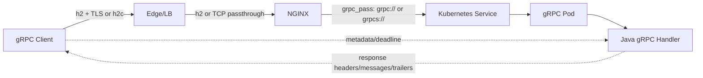
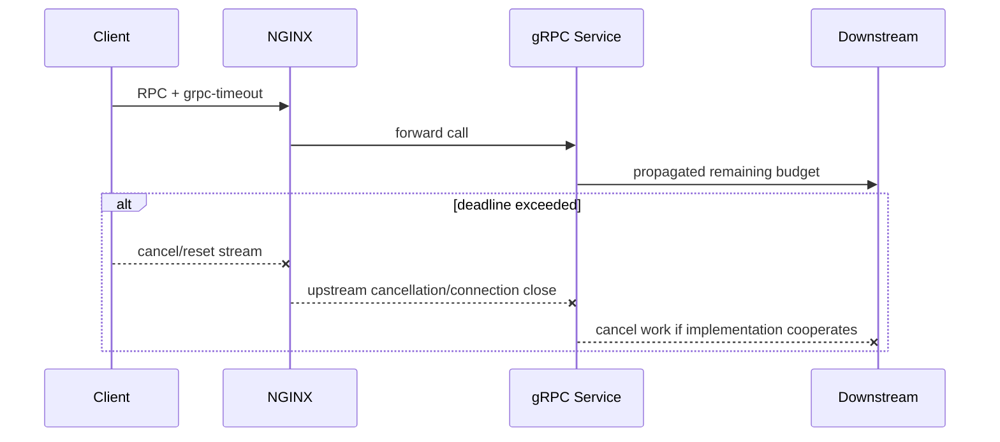

# Part 027 — gRPC and HTTP/2 Through NGINX

> **Depth level:** Advanced  
> **Prerequisite:** Part 006–010 dan 018–020; dasar HTTP/2, TLS/ALPN, Protocol Buffers, gRPC lifecycle, Kubernetes Service, serta NGINX upstream.  
> **Scope:** HTTP/2 framing yang relevan bagi operator, h2/h2c, TLS and ALPN, `grpc_pass`, metadata, trailers, gRPC status, deadlines, cancellation, unary and streaming RPC, message size, compression, retry, health checking, Kubernetes ingress/controller behavior, load balancing, Java gRPC implications, observability, debugging, PR review, dan internal verification.  
> **Bukan scope utama:** REST proxying—Part 005–006; generic TLS fundamentals—Part 007; general timeout/retry—Part 009; WebSocket/SSE—Part 026; full production debugging handbook—Part 031.

---

## Operating premise

gRPC bukan sekadar “REST dengan Protobuf”. gRPC adalah kontrak RPC yang menggunakan HTTP/2 sebagai transport, Protocol Buffers sebagai default IDL/payload encoding, metadata sebagai side channel, dan trailers sebagai tempat penting untuk menyampaikan final call status.

Karena itu, route gRPC dianggap benar hanya bila setiap hop mempertahankan kontrak berikut:

```text
client contract
  + HTTP/2 negotiation
  + route /package.Service/Method
  + metadata
  + framed binary messages
  + deadline/cancellation
  + final trailers and grpc-status
  = valid gRPC call
```

> **Primary rule:** Jangan menilai keberhasilan gRPC hanya dari HTTP status. Banyak RPC yang secara transport menghasilkan HTTP 200 tetapi secara application/RPC berakhir dengan `grpc-status` selain `0`.

---

## Daftar isi

1. [Tujuan pembelajaran](#tujuan-pembelajaran)
2. [Executive mental model](#executive-mental-model)
3. [gRPC lifecycle](#grpc-lifecycle)
4. [Empat jenis RPC](#empat-jenis-rpc)
5. [HTTP/2 yang perlu dipahami operator](#http2-yang-perlu-dipahami-operator)
6. [Satu logical call versus connection and stream](#satu-logical-call-versus-connection-and-stream)
7. [h2 versus h2c](#h2-versus-h2c)
8. [TLS, SNI, dan ALPN](#tls-sni-dan-alpn)
9. [Per-hop protocol matrix](#per-hop-protocol-matrix)
10. [NGINX module and build requirements](#nginx-module-and-build-requirements)
11. [Listener configuration](#listener-configuration)
12. [`grpc_pass` mental model](#grpc_pass-mental-model)
13. [Cleartext and TLS upstream](#cleartext-and-tls-upstream)
14. [Upstream TLS verification](#upstream-tls-verification)
15. [Service and method routing](#service-and-method-routing)
16. [Metadata and headers](#metadata-and-headers)
17. [Trailers](#trailers)
18. [gRPC status model](#grpc-status-model)
19. [HTTP status versus gRPC status](#http-status-versus-grpc-status)
20. [Deadlines](#deadlines)
21. [Timeout chain](#timeout-chain)
22. [Cancellation and stream reset](#cancellation-and-stream-reset)
23. [Unary RPC](#unary-rpc)
24. [Server streaming](#server-streaming)
25. [Client streaming](#client-streaming)
26. [Bidirectional streaming](#bidirectional-streaming)
27. [Flow control and backpressure](#flow-control-and-backpressure)
28. [Message size and header limits](#message-size-and-header-limits)
29. [Compression](#compression)
30. [Keepalive and ping semantics](#keepalive-and-ping-semantics)
31. [Load balancing](#load-balancing)
32. [Retry and `grpc_next_upstream`](#retry-and-grpc_next_upstream)
33. [Health checking](#health-checking)
34. [Kubernetes native gRPC probes](#kubernetes-native-grpc-probes)
35. [Kubernetes Service and endpoint routing](#kubernetes-service-and-endpoint-routing)
36. [Ingress/controller integration](#ingresscontroller-integration)
37. [gRPC-Web boundary](#grpc-web-boundary)
38. [Java gRPC implications](#java-grpc-implications)
39. [Security concerns](#security-concerns)
40. [Performance and capacity](#performance-and-capacity)
41. [Observability contract](#observability-contract)
42. [Failure catalogue](#failure-catalogue)
43. [Systematic debugging](#systematic-debugging)
44. [Command cookbook](#command-cookbook)
45. [Reference configurations](#reference-configurations)
46. [Test strategy](#test-strategy)
47. [PR review checklist](#pr-review-checklist)
48. [Internal verification checklist](#internal-verification-checklist)
49. [Final mental model](#final-mental-model)
50. [Referensi resmi](#referensi-resmi)

---

## Tujuan pembelajaran

Setelah menyelesaikan part ini, Anda harus mampu:

- menggambar protocol mode untuk setiap hop client → load balancer → NGINX → Service → gRPC pod;
- membedakan h2, h2c, HTTP/1.1, TLS passthrough, termination, dan re-encryption;
- menjelaskan `grpc_pass` dan perbedaannya dari `proxy_pass`;
- menjelaskan metadata awal, response headers, trailers, dan `grpc-status`;
- membedakan HTTP transport error dari gRPC application error;
- menyelaraskan gRPC deadline dengan NGINX, load balancer, Java, dan downstream deadlines;
- memprediksi failure behavior untuk unary, server-streaming, client-streaming, serta bidirectional streaming;
- menilai retry safety berdasarkan call progress dan idempotency;
- mengonfigurasi dan menguji health/readiness untuk gRPC workload;
- mendiagnosis ALPN, TLS, route, content-type, trailer, deadline, reset, message-size, dan backend-protocol failures;
- mereview perubahan gRPC ingress dengan production-oriented checklist.

---

## Executive mental model



NGINX dapat:

- menerima HTTP/2 dari client;
- memilih virtual host dan location;
- meneruskan call melalui gRPC proxy module;
- melakukan load balancing;
- terminate atau re-encrypt TLS;
- meneruskan metadata tertentu;
- menerapkan timeout dan retry pada kondisi tertentu;
- menulis access/error logs.

NGINX tidak otomatis memahami domain semantics dari protobuf message. Ia tidak tahu apakah `CreateOrder` aman diulang, apakah tenant pada metadata sesuai isi message, atau apakah stream boleh dipindah ke pod lain.

---

## gRPC lifecycle

Lifecycle call secara konseptual:

```text
1. Resolve authority/endpoint
2. Establish TCP connection
3. Optional TLS handshake
4. Negotiate h2 using ALPN, or establish h2c
5. Open HTTP/2 stream
6. Send request pseudo-headers and metadata
7. Send zero or more framed messages
8. Server sends initial metadata
9. Server sends zero or more framed messages
10. Server sends trailers with grpc-status
11. Stream closes
12. Connection may remain open for other streams
```

Satu gRPC channel dapat menggunakan satu atau beberapa transport connections. Satu connection dapat membawa banyak HTTP/2 streams secara concurrent.

---

## Empat jenis RPC

| Type | Request messages | Response messages | Operational concern |
|---|---:|---:|---|
| Unary | 1 | 1 | deadline, retry, idempotency |
| Server streaming | 1 | many | idle gaps, slow client, long-lived stream |
| Client streaming | many | 1 | upload progress, backpressure, partial side effects |
| Bidirectional streaming | many | many | full-duplex lifecycle, cancellation, connection pressure |

Jangan menerapkan policy unary secara buta ke streaming RPC.

---

## HTTP/2 yang perlu dipahami operator

HTTP/2 menggunakan binary frames dan multiplexed streams. Konsep yang penting:

- **connection**: TCP/TLS transport;
- **stream**: satu logical request/response exchange;
- **HEADERS**: pseudo-headers dan metadata;
- **DATA**: framed gRPC payload;
- **RST_STREAM**: membatalkan satu stream;
- **GOAWAY**: connection tidak menerima stream baru setelah batas tertentu;
- **flow-control window**: membatasi bytes in flight;
- **HPACK**: header compression;
- **PING**: liveness/latency pada satu HTTP/2 connection.

> **Invariant:** HTTP/2 multiplexing mengurangi connection count, tetapi tidak menghilangkan concurrency, memory, flow-control, dan head-of-line effects pada TCP connection yang sama.

---

## Satu logical call versus connection and stream

```text
logical RPC != TCP connection
logical RPC ~= HTTP/2 stream
channel != necessarily one connection forever
```

Implikasi:

- connection-level failure dapat memengaruhi banyak RPC streams;
- pod drain harus menangani existing streams;
- load-balancing behavior dapat terlihat tidak merata bila client mempertahankan connection lama;
- connection metrics saja tidak cukup untuk mengukur RPC volume.

---

## h2 versus h2c

| Mode | Meaning | Common use |
|---|---|---|
| `h2` | HTTP/2 over TLS | public/external traffic, secure internal traffic |
| `h2c` | cleartext HTTP/2 | controlled internal hop, often cluster-local |

h2c tidak berarti “HTTP/1.1 Upgrade selalu digunakan”. Implementations dapat memakai prior knowledge. Pastikan setiap hop benar-benar mendukung mode yang dipilih.

Risiko h2c:

- payload dan metadata tidak encrypted;
- credentials dapat terlihat oleh network observer;
- beberapa cloud L7 load balancers tidak meneruskan h2c ke backend dengan cara yang Anda asumsikan;
- protocol detection pada mesh/proxy dapat berbeda.

---

## TLS, SNI, dan ALPN

Untuk client-facing gRPC over TLS:

1. client mengirim SNI dalam ClientHello;
2. edge/NGINX memilih certificate;
3. client dan server menegosiasikan ALPN `h2`;
4. HTTP/2 session dimulai;
5. gRPC request dikirim.

Jika ALPN tidak menghasilkan `h2`, gRPC native client umumnya gagal karena gRPC tidak berjalan sebagai HTTP/1.1 biasa.

Diagnostic question:

```text
Apakah TLS berhasil tetapi ALPN gagal?
```

Itu berbeda dari certificate failure maupun backend route failure.

---

## Per-hop protocol matrix

Selalu dokumentasikan matrix seperti berikut:

| Hop | Transport | TLS owner | Application protocol | Verification |
|---|---|---|---|---|
| Client → ALB/NGINX | TCP/TLS | edge | h2 | certificate + ALPN |
| ALB → NGINX | TCP/TLS or clear | LB/NGINX | h2, h2c, or TCP | product-specific |
| NGINX → Service | TCP/TLS or clear | NGINX/backend | gRPC over h2 | `grpc://`/`grpcs://` |
| Service → Pod | cluster routing | same connection | same | EndpointSlice/readiness |

Never infer the upstream protocol from the client-facing protocol.

---

## NGINX module and build requirements

`ngx_http_grpc_module` meneruskan request ke gRPC server dan membutuhkan HTTP/2 module.

Verifikasi:

```bash
nginx -V 2>&1 | tr ' ' '\n' | grep -E 'http_v2|version|configure'
```

Jangan berasumsi image distro, vendor controller, atau custom build memuat module yang sama.

---

## Listener configuration

Contoh TLS listener:

```nginx
server {
    listen 443 ssl;
    http2 on;

    server_name grpc.example.internal;

    ssl_certificate     /etc/nginx/tls/tls.crt;
    ssl_certificate_key /etc/nginx/tls/tls.key;

    location / {
        grpc_pass grpc://grpc_backend;
    }
}
```

Contoh cleartext h2c listener untuk controlled internal environment:

```nginx
server {
    listen 8080;
    http2 on;

    location / {
        grpc_pass grpc://grpc_backend;
    }
}
```

`http2 on` syntax bergantung versi; inspect syntax yang didukung build aktual.

---

## `grpc_pass` mental model

```nginx
grpc_pass grpc://backend;
grpc_pass grpcs://backend;
```

Gunakan:

- `grpc://` untuk cleartext upstream;
- `grpcs://` untuk TLS upstream.

Berbeda dari `proxy_pass`, `grpc_pass` menggunakan gRPC-specific proxy module dan mempertahankan semantics HTTP/2/gRPC termasuk trailers.

Jangan berasumsi URI-rewrite behavior identik dengan trailing-slash semantics pada `proxy_pass`. Route gRPC sebaiknya menggunakan service/method path asli atau explicit routing yang diuji.

---

## Cleartext and TLS upstream

```nginx
upstream order_grpc {
    least_conn;
    server order-grpc.default.svc.cluster.local:9090;
}

location /com.csg.order.v1.OrderService/ {
    grpc_pass grpc://order_grpc;
}
```

TLS upstream:

```nginx
location /com.csg.order.v1.OrderService/ {
    grpc_pass grpcs://order_grpc_tls;

    grpc_ssl_server_name on;
    grpc_ssl_name order-grpc.default.svc.cluster.local;
    grpc_ssl_trusted_certificate /etc/nginx/ca/internal-ca.pem;
    grpc_ssl_verify on;
}
```

---

## Upstream TLS verification

Critical default:

```text
grpc_ssl_verify off
```

Artinya `grpcs://` saja tidak cukup untuk membuktikan upstream identity. Production re-encryption harus menilai:

- CA trust bundle;
- hostname/SAN verification;
- SNI;
- certificate rotation;
- expiry monitoring;
- optional mTLS client certificate;
- trust-store reload behavior.

Security invariant:

> Encryption without peer verification protects against passive observation but does not establish that NGINX connected to the intended backend.

---

## Service and method routing

Canonical gRPC HTTP path:

```text
/package.Service/Method
```

Contoh:

```text
/com.csg.quote.v1.QuoteService/CreateQuote
/com.csg.order.v1.OrderService/SubmitOrder
```

Route options:

```nginx
location /com.csg.quote.v1.QuoteService/ {
    grpc_pass grpc://quote_backend;
}

location /com.csg.order.v1.OrderService/ {
    grpc_pass grpc://order_backend;
}
```

Trade-offs:

- route per service memberi ownership/policy lebih jelas;
- catch-all lebih sederhana tetapi blast radius lebih besar;
- regex meningkatkan flexibility sekaligus ambiguity;
- package/service rename adalah routing compatibility event.

---

## Metadata and headers

gRPC metadata menggunakan HTTP/2 headers. Gunakan metadata untuk:

- authentication token;
- tenant/customer context;
- correlation/trace context;
- idempotency key;
- request provenance;
- feature or routing hint yang disetujui.

Contoh sanitization and propagation:

```nginx
grpc_set_header X-Request-ID $request_id;
grpc_set_header X-Forwarded-For $proxy_add_x_forwarded_for;
grpc_set_header X-Forwarded-Proto $scheme;

# Never trust caller-supplied internal identity headers.
grpc_set_header X-Internal-User "";
grpc_set_header X-Internal-Tenant "";
```

`grpc_set_header` inheritance mengikuti rule “inherit hanya jika level saat ini tidak mendefinisikan `grpc_set_header` sama sekali”. Satu local directive dapat mengganti inherited set secara keseluruhan.

---

## Trailers

Trailers menyampaikan final call outcome setelah response body/stream selesai.

Contoh conceptual response:

```text
:status: 200
content-type: application/grpc

<binary messages>

grpc-status: 0
grpc-message: OK
```

Untuk error:

```text
:status: 200
content-type: application/grpc

grpc-status: 5
grpc-message: Quote%20not%20found
```

Proxy, logger, test client, dan observability pipeline harus memahami trailers. Bila hanya HTTP status yang dicatat, service dapat terlihat 100% sukses padahal banyak calls gagal.

---

## gRPC status model

Selected codes:

| Code | Name | Typical meaning |
|---:|---|---|
| 0 | OK | success |
| 1 | CANCELLED | caller or server cancelled |
| 2 | UNKNOWN | unknown/internal translation |
| 3 | INVALID_ARGUMENT | invalid request independent of state |
| 4 | DEADLINE_EXCEEDED | deadline passed |
| 5 | NOT_FOUND | entity missing |
| 6 | ALREADY_EXISTS | create conflict |
| 7 | PERMISSION_DENIED | authenticated but not authorized |
| 8 | RESOURCE_EXHAUSTED | quota/capacity/message limit |
| 9 | FAILED_PRECONDITION | state does not allow operation |
| 10 | ABORTED | concurrency/transaction conflict |
| 12 | UNIMPLEMENTED | method/service unavailable |
| 13 | INTERNAL | internal invariant/error |
| 14 | UNAVAILABLE | transient service unavailable |
| 16 | UNAUTHENTICATED | missing/invalid identity |

Domain mapping must be explicit and consistent across services.

---

## HTTP status versus gRPC status

Three layers can fail:

```text
transport/TLS/HTTP failure
proxy/gateway failure
application gRPC failure
```

Examples:

| Observation | Likely layer |
|---|---|
| TLS handshake error | TLS/edge |
| HTTP 404 HTML response | wrong route or non-gRPC handler |
| HTTP 502 from NGINX | upstream connection/protocol failure |
| HTTP 200 + grpc-status 14 | application/library unavailable |
| HTTP 200 + grpc-status 5 | domain not found |
| RST_STREAM | cancellation, protocol, timeout, resource issue |

Never flatten all failures into HTTP 500.

---

## Deadlines

gRPC client should set a realistic deadline. Without explicit deadline, a call can wait indefinitely depending on library behavior and network state.

Deadline lifecycle:



Java service must stop database/downstream work when call is cancelled. Cancellation that only stops response delivery does not release backend resources.

---

## Timeout chain

Relevant NGINX directives:

```nginx
grpc_connect_timeout 3s;
grpc_send_timeout    30s;
grpc_read_timeout    30s;
```

Important semantics:

- `grpc_connect_timeout`: establish upstream connection;
- `grpc_send_timeout`: idle interval between successive upstream writes;
- `grpc_read_timeout`: idle interval between successive upstream reads;
- these are not necessarily total call-duration deadlines.

For a server-streaming call with one message every 20 seconds, `grpc_read_timeout 30s` may keep the stream alive indefinitely. Total duration is controlled by client/application deadline, not this idle timer.

Deadline design:

```text
client deadline
  > edge processing + network
  > NGINX connect/read/write behavior
  > service work + downstream calls
  > cancellation cleanup margin
```

Avoid timeout inversion where an outer hop waits longer than all inner capacity has already been abandoned.

---

## Cancellation and stream reset

Cancellation can originate from:

- client explicitly cancelling;
- client deadline expiration;
- load balancer idle timeout;
- NGINX timeout;
- pod termination;
- HTTP/2 stream reset;
- connection loss.

Application requirements:

- observe context cancellation;
- stop expensive work;
- close publishers/subscriptions;
- release buffers;
- roll back or safely finalize transaction;
- record cancellation reason without classifying every cancellation as server defect.

---

## Unary RPC

Unary calls are closest to request/response APIs, but retry remains dangerous.

Example classification:

| Method | Retry potential |
|---|---|
| `GetQuote` | often safe if read-only |
| `ValidateConfiguration` | often safe if side-effect free |
| `CreateOrder` | unsafe without idempotency contract |
| `SubmitOrder` | unsafe unless state transition is deduplicated |

Use idempotency key and persisted result/transition ownership for mutation retries.

---

## Server streaming

Failure concerns:

- NGINX/read idle timeout;
- LB idle timeout;
- client flow control;
- slow client;
- stream resumption after disconnect;
- duplicate messages;
- pod drain;
- memory held per subscriber.

Design explicit:

```text
cursor/event ID
resume token
retention window
heartbeat strategy
max stream duration
reconnect backoff
```

---

## Client streaming

A client may send multiple messages before receiving final status.

Risks:

- partial upload before failure;
- backend applying side effects incrementally;
- retry replaying already accepted messages;
- message ordering;
- unbounded buffering;
- client stalls.

Define whether processing is transactional at stream close, incremental, or checkpointed.

---

## Bidirectional streaming

Bidirectional streams require independent reasoning for both directions.

Questions:

- can each side send concurrently?
- who emits heartbeat?
- what closes the stream normally?
- how is half-close handled?
- what state is reconstructible after reconnect?
- can one slow direction block the other?
- does authorization change during long sessions?

---

## Flow control and backpressure

Backpressure exists at several layers:

```text
client application
HTTP/2 stream window
HTTP/2 connection window
NGINX buffers
upstream transport
server application queue
business dependency
```

A fast producer plus slow consumer can accumulate memory in whichever layer first accepts unbounded work.

Application invariant:

> Every stream queue must be bounded and must have a documented overflow policy: block, shed, disconnect, drop-oldest, or persist externally.

---

## Message size and header limits

Limits can exist at:

- client library max inbound/outbound message size;
- server library limits;
- `client_max_body_size` at NGINX;
- HTTP/2 header limits;
- metadata limits;
- controller annotation/ConfigMap;
- load balancer limits;
- service mesh limits.

A gRPC message includes framing overhead and may be compressed. Error may surface as:

- HTTP 413;
- `RESOURCE_EXHAUSTED`;
- stream reset;
- connection termination;
- generic proxy error.

Do not “fix” size failure by globally raising every limit. Identify the intended maximum per RPC.

---

## Compression

gRPC message compression is negotiated at gRPC level using encodings such as gzip. It is different from generic NGINX HTTP response compression.

Review:

- client/server supported algorithms;
- CPU trade-off;
- compressed versus uncompressed size limit semantics;
- secret-dependent compression risk;
- streaming latency;
- whether intermediary alters `grpc-encoding` metadata.

Avoid enabling generic HTTP compression as if it were equivalent to gRPC message compression.

---

## Keepalive and ping semantics

Three different mechanisms:

| Mechanism | Layer | Purpose |
|---|---|---|
| TCP keepalive | kernel/socket | detect dead TCP peer slowly |
| HTTP/2 PING | HTTP/2 connection | connection liveness/latency |
| application heartbeat | RPC message | business/session liveness |

Because NGINX terminates one HTTP/2 hop and creates another, connection-level pings are hop-local rather than guaranteed end-to-end. Align:

- client keepalive interval;
- server minimum accepted ping interval;
- LB idle timeout;
- NGINX idle timeout;
- anti-abuse policy;
- mobile/corporate network behavior.

Aggressive pings can create fleet-wide traffic and trigger server `GOAWAY` policies.

---

## Load balancing

NGINX can route gRPC calls to upstream groups:

```nginx
upstream order_grpc {
    least_conn;
    server order-grpc-1:9090 max_fails=2 fail_timeout=10s;
    server order-grpc-2:9090 max_fails=2 fail_timeout=10s;
}
```

Consider:

- unary call distribution;
- long streams occupying upstreams;
- connection reuse behavior;
- client channel stickiness before reaching NGINX;
- Kubernetes Service second-stage load balancing;
- pod readiness and endpoint churn;
- weighted rollout compatibility.

`least_conn` is not automatically “best” for streams; a connection may carry different numbers and costs of concurrent streams. Measure workload.

---

## Retry and `grpc_next_upstream`

Default NGINX behavior includes retry on connection error and timeout while establishing/sending/reading response header.

Example bounded policy:

```nginx
grpc_next_upstream error timeout http_502 http_503 http_504;
grpc_next_upstream_tries 2;
grpc_next_upstream_timeout 2s;
```

Critical rules:

- retry is possible only before enough response has been sent to the client;
- streaming call retry after partial progress is usually not transparent;
- non-idempotent mutation may duplicate side effect;
- client library may also retry;
- mesh/LB may add another retry layer;
- retries consume the same deadline budget.

Document exactly one primary retry owner per failure class.

---

## Health checking

gRPC defines standard health service `grpc.health.v1.Health` with:

- unary `Check`;
- streaming `Watch`.

Service can report:

- `SERVING`;
- `NOT_SERVING`;
- other standard health states.

Health must reflect ability to accept the relevant service, not merely “process exists”. However, do not put every optional downstream dependency into liveness and create restart cascades.

---

## Kubernetes native gRPC probes

Example:

```yaml
ports:
  - name: grpc
    containerPort: 9090

startupProbe:
  grpc:
    port: 9090
    service: startup
  failureThreshold: 30
  periodSeconds: 2

readinessProbe:
  grpc:
    port: 9090
    service: readiness
  periodSeconds: 5
  timeoutSeconds: 1

livenessProbe:
  grpc:
    port: 9090
    service: liveness
  periodSeconds: 10
  timeoutSeconds: 1
```

Constraints to remember:

- built-in gRPC probes use pod IP/hostname;
- endpoint must listen on the pod address;
- named ports are not supported for gRPC probes;
- built-in probes do not provide TLS/authentication parameters;
- all probe errors become probe failures.

If production endpoint requires mTLS, a separate local/plain health port or exec-based probe may be needed—subject to team security policy.

---

## Kubernetes Service and endpoint routing

Two common patterns:

```text
NGINX -> ClusterIP Service -> pod
NGINX -> discovered pod endpoints directly
```

ClusterIP gives stable endpoint but may add a second load-balancing layer. Direct endpoint routing offers controller awareness but couples behavior to controller implementation.

Verify:

- service port/targetPort;
- `appProtocol` if used;
- readiness-gated endpoints;
- protocol mode on backend port;
- EndpointSlice updates;
- terminating endpoints;
- topology policy;
- whether NGINX resolves Service VIP or individual pods.

---

## Ingress/controller integration

Controller annotations and CRDs are implementation-specific. Examples may include concepts such as:

```yaml
metadata:
  annotations:
    nginx.ingress.kubernetes.io/backend-protocol: "GRPC"
```

or vendor-specific equivalents.

Never copy annotation across controller families without verification. Review:

- IngressClass;
- controller name and version;
- generated NGINX config;
- HTTP/2 listener support;
- backend protocol setting;
- TLS passthrough versus termination;
- timeout annotation units;
- max body/message limits;
- canary and affinity support;
- gRPC status metrics.

---

## gRPC-Web boundary

Browser JavaScript generally uses gRPC-Web rather than native gRPC transport. gRPC-Web may require a translator/proxy and has different streaming constraints.

Do not assume:

```text
gRPC native client == browser gRPC-Web client
```

Document whether conversion is performed by Envoy, NGINX capability/module, an application gateway, or a dedicated adapter. Test content types and trailer encoding end-to-end.

---

## Java gRPC implications

For Java services/clients, review:

- channel lifecycle and reuse;
- Netty event-loop ownership;
- blocking versus async stubs;
- deadline per method;
- cancellation propagation;
- interceptors for auth/trace/tenant context;
- max inbound/outbound message sizes;
- flow-control and executor sizing;
- retry/service config;
- health service registration;
- graceful shutdown;
- keepalive policy;
- TLS trust/key material reload;
- mapping exceptions to stable gRPC status.

Anti-patterns:

- creating a new channel per call;
- blocking Netty event-loop with database work;
- ignoring `Context.current().isCancelled()`;
- returning `UNKNOWN` for all domain errors;
- logging full metadata or protobuf payload containing secrets/PII;
- retrying create/submit methods without idempotency.

---

## Security concerns

### Authentication metadata

Sanitize untrusted identity metadata at the trusted edge. Do not accept caller-supplied internal role/tenant headers.

### mTLS

Decide whether identity is:

- client certificate identity;
- JWT/access token identity;
- workload identity;
- combination with explicit binding rules.

### Reflection

gRPC server reflection helps `grpcurl` and development but may expose service/method inventory. Decide whether it is enabled externally.

### Authorization

Route-level authorization cannot replace object/state-level authorization in Java service.

### Resource abuse

Protect against:

- huge messages;
- metadata bombs;
- excessive concurrent streams;
- never-ending streams;
- aggressive pings;
- unauthenticated expensive calls;
- retry amplification.

---

## Performance and capacity

Measure at least:

```text
RPC rate
active streams
active HTTP/2 connections
streams per connection
message rate and bytes
stream duration
flow-control stalls
backend concurrency
CPU per serialization/compression
memory per stream
connection churn
```

Capacity relationship:

```text
active RPCs ≈ RPC arrival rate × average RPC duration
```

For streaming:

```text
memory ≈ active streams × bounded per-stream state
```

One low-RPS service can still be capacity-heavy if calls last hours.

---

## Observability contract

Required labels/fields where cardinality is controlled:

- gRPC service;
- gRPC method;
- gRPC status;
- HTTP status;
- route/virtual host;
- upstream address;
- request duration;
- upstream connect/header/response timing;
- retry count;
- request/response message bytes if available;
- stream type;
- cancellation/deadline indicator;
- TLS/ALPN protocol;
- trace ID/request ID;
- pod/controller version.

Avoid raw customer IDs and arbitrary metadata as metric labels.

A useful RED view:

```text
Rate: calls/sec and messages/sec
Errors: grpc-status grouped by method
Duration: deadline-aware latency histogram
```

For streams add:

```text
active streams
stream age
disconnect/reset reasons
reconnect rate
flow-control/backpressure signals
```

---

## Failure catalogue

| Symptom | Likely causes | First evidence |
|---|---|---|
| `UNAVAILABLE` | no endpoint, TLS/protocol failure, server unavailable | client status + NGINX error log |
| HTTP 400 | wrong HTTP version/content-type/protocol | response headers + controller log |
| HTTP 404 | wrong service path/host/location | generated config + grpcurl verbose |
| HTTP 426 | HTTP/2 required/upgrade mismatch | listener/protocol negotiation |
| HTTP 502 | connect reset, protocol mismatch, TLS upstream failure | NGINX error log |
| HTTP 503 | no ready endpoints, limiter, unavailable upstream | EndpointSlice + NGINX status |
| HTTP 504 | upstream idle/read timeout | timing fields + backend logs |
| `DEADLINE_EXCEEDED` | client deadline or slow chain | deadline + trace spans |
| `RESOURCE_EXHAUSTED` | message/quota/concurrency limit | server/library logs |
| `UNIMPLEMENTED` | wrong service/method, health service absent | descriptor/server inventory |
| stream resets | cancellation, pod drain, LB timeout, protocol error | HTTP/2 debug + event timeline |
| all calls hit one pod | sticky channel/service LB behavior | per-pod call distribution |
| success HTTP but failures | grpc-status hidden from telemetry | trailers-aware metrics |

---

## Systematic debugging

### Step 1 — Freeze the route tuple

Record:

```text
hostname
port
TLS yes/no
expected ALPN
full service/method
client type
metadata/auth mode
deadline
```

### Step 2 — Test direct pod

```bash
kubectl port-forward pod/order-grpc-abc 19090:9090
grpcurl -plaintext localhost:19090 list
grpcurl -plaintext localhost:19090 grpc.health.v1.Health/Check
```

If reflection is disabled, use proto or descriptor set.

### Step 3 — Test Service

```bash
kubectl run grpc-debug --rm -it --image=fullstorydev/grpcurl -- \
  -plaintext order-grpc.default.svc.cluster.local:9090 list
```

Use an internally approved debug image; do not introduce random images in restricted environments.

### Step 4 — Test NGINX/Ingress endpoint

```bash
grpcurl -vv \
  -authority grpc.example.internal \
  grpc.example.internal:443 \
  grpc.health.v1.Health/Check
```

### Step 5 — Inspect TLS and ALPN

```bash
openssl s_client \
  -connect grpc.example.internal:443 \
  -servername grpc.example.internal \
  -alpn h2 </dev/null
```

Confirm:

```text
ALPN protocol: h2
certificate chain valid
SNI selects expected certificate
```

### Step 6 — Inspect generated config

```bash
kubectl exec -n ingress <controller-pod> -- nginx -T
```

Find:

- listener;
- server_name;
- location;
- `grpc_pass` scheme;
- upstream addresses;
- timeout directives;
- TLS verification;
- metadata headers.

### Step 7 — Correlate all layers

```text
client error timestamp
LB access log
NGINX access/error log
controller event
EndpointSlice state
pod log
trace
Kubernetes rollout event
```

---

## Command cookbook

```bash
# Discover services through reflection
grpcurl -vv host:443 list

# Describe a service
grpcurl host:443 describe com.example.OrderService

# Unary request
grpcurl -d '{"orderId":"123"}' host:443 \
  com.example.OrderService/GetOrder

# Add metadata
grpcurl -H 'authorization: Bearer REDACTED' \
  -H 'x-request-id: debug-123' \
  host:443 com.example.OrderService/GetOrder

# Cleartext h2c
grpcurl -plaintext service:9090 list

# Use custom CA
grpcurl -cacert internal-ca.pem host:443 list

# Show ALPN
openssl s_client -connect host:443 -servername host -alpn h2 </dev/null

# Inspect endpoints
kubectl get svc,endpointslice -n app -o wide

# Inspect events
kubectl describe ingress -n app grpc-route
```

Never paste real bearer tokens into shared terminals, tickets, or chat transcripts.

---

## Reference configurations

### TLS termination at NGINX, h2c upstream

```nginx
upstream quote_grpc {
    least_conn;
    server quote-grpc.app.svc.cluster.local:9090;
}

server {
    listen 443 ssl;
    http2 on;
    server_name quote-grpc.example.internal;

    ssl_certificate     /etc/nginx/tls/tls.crt;
    ssl_certificate_key /etc/nginx/tls/tls.key;

    location /com.example.quote.v1.QuoteService/ {
        grpc_connect_timeout 3s;
        grpc_send_timeout 30s;
        grpc_read_timeout 30s;

        grpc_set_header X-Request-ID $request_id;
        grpc_set_header X-Forwarded-Proto https;

        grpc_next_upstream error timeout http_502 http_503 http_504;
        grpc_next_upstream_tries 2;

        grpc_pass grpc://quote_grpc;
    }
}
```

### TLS re-encryption and upstream verification

```nginx
upstream order_grpc_tls {
    server order-grpc.app.svc.cluster.local:9443;
}

location /com.example.order.v1.OrderService/ {
    grpc_pass grpcs://order_grpc_tls;

    grpc_ssl_server_name on;
    grpc_ssl_name order-grpc.app.svc.cluster.local;
    grpc_ssl_trusted_certificate /etc/nginx/ca/internal-ca.pem;
    grpc_ssl_verify on;
    grpc_ssl_verify_depth 3;

    grpc_connect_timeout 3s;
    grpc_read_timeout 60s;
}
```

These are patterns, not copy-paste production defaults. Timeout, route, certificate, retry, and header policies must be derived from the actual RPC contract.

---

## Test strategy

Minimum matrix:

| Test | Expected evidence |
|---|---|
| TLS/ALPN | `h2` negotiated |
| unary success | HTTP transport + grpc-status 0 |
| domain failure | stable non-zero gRPC status |
| invalid auth | `UNAUTHENTICATED` |
| forbidden object | `PERMISSION_DENIED` |
| deadline | cancellation reaches backend |
| pod unready | endpoint removed before traffic |
| rolling update | bounded resets/reconnects |
| upstream TLS invalid | fail closed |
| oversized message | intended limit/status |
| server stream idle | heartbeat/timeout behaves as designed |
| client stream partial failure | no duplicate/partial corruption |
| retry | bounded and idempotency-safe |
| observability | gRPC method/status visible |

Use direct pod, Service, controller-local, and external endpoint tests to isolate the failing hop.

---

## PR review checklist

### Protocol and route

- [ ] Is every hop documented as h2, h2c, TCP passthrough, or HTTP/1.1?
- [ ] Is ALPN required and tested?
- [ ] Is the full `/package.Service/Method` path preserved?
- [ ] Is `grpc_pass` used instead of generic `proxy_pass`?
- [ ] Is controller-specific backend protocol configuration correct?

### TLS and identity

- [ ] Is upstream TLS verification enabled when re-encrypting?
- [ ] Are SNI, SAN, CA bundle, and rotation documented?
- [ ] Are caller-supplied internal identity headers removed?
- [ ] Is mTLS/JWT identity binding explicit?

### Reliability

- [ ] Does every client set a realistic deadline?
- [ ] Are NGINX timeout values idle intervals or total deadlines, and is that distinction documented?
- [ ] Is retry ownership singular and bounded?
- [ ] Are mutation RPCs idempotent before retry?
- [ ] Are streaming reconnect/resume semantics defined?

### Capacity

- [ ] Are active streams and stream duration measured?
- [ ] Are message/metadata limits explicit per method?
- [ ] Are flow-control and bounded queues considered?
- [ ] Are keepalive/ping values compatible with LB and server policy?

### Operations

- [ ] Does readiness use meaningful gRPC health?
- [ ] Is graceful shutdown tested?
- [ ] Are gRPC status and method visible in telemetry?
- [ ] Can operators test pod, Service, ingress, and external endpoint independently?
- [ ] Is rollback safe for protobuf/service compatibility?

---

## Internal verification checklist

> **Internal verification checklist — verify actual CSG/team architecture; do not infer controller, cloud, product, or gRPC implementation.**

### Inventory

- [ ] Inventory all gRPC services, packages, methods, ports, owners, and consumers.
- [ ] Classify unary, server-streaming, client-streaming, and bidirectional methods.
- [ ] Record public/private, cross-cluster, cross-region, and on-prem consumers.
- [ ] Identify gRPC-Web consumers separately from native clients.

### NGINX/controller

- [ ] Capture NGINX/controller product, image, build arguments, and version.
- [ ] Verify HTTP/2 and gRPC modules exist.
- [ ] Inspect generated config for `http2`, `grpc_pass`, upstream scheme, timeout, retry, and TLS directives.
- [ ] Verify controller annotation/CRD syntax and unit semantics.
- [ ] Confirm whether traffic uses Service VIP or direct pod endpoints.
- [ ] Verify snippets/custom templates do not override platform policy.

### TLS and network

- [ ] Map TLS termination/passthrough/re-encryption for every hop.
- [ ] Verify ALPN, SNI, upstream certificate verification, CA ownership, and rotation.
- [ ] Record LB idle timeout, HTTP/2 support, health checks, and drain behavior.
- [ ] Test corporate proxy, private link, firewall, and hybrid paths if applicable.

### Kubernetes

- [ ] Review Service ports, target ports, `appProtocol`, EndpointSlices, readiness, and termination.
- [ ] Inspect native gRPC probes or alternative health strategy.
- [ ] Verify PDB, topology spread, termination grace, `preStop`, and rollout strategy.
- [ ] Test node drain and controller rollout with active streams.

### Java/client/server

- [ ] Identify Java gRPC version, transport, channel configuration, interceptors, and executor model.
- [ ] Verify deadlines per method and downstream propagation.
- [ ] Verify status mapping and cancellation cleanup.
- [ ] Verify max message/metadata sizes and compression policy.
- [ ] Inspect retry/hedging/service config and idempotency controls.
- [ ] Verify health service and graceful shutdown behavior.

### Observability and incidents

- [ ] Dashboard call rate, gRPC status, latency, active streams, resets, and per-pod distribution.
- [ ] Confirm traces propagate through metadata and NGINX where supported.
- [ ] Review historical 502/503/504, `UNAVAILABLE`, deadline, reset, and rollout incidents.
- [ ] Confirm runbook includes `grpcurl`, `openssl`, generated config, EndpointSlice, and log correlation.
- [ ] Confirm sensitive metadata and protobuf payloads are redacted.

---

## Final mental model

For every gRPC route, answer in this order:

```text
1. What exact service/method and RPC type is this?
2. What protocol runs on every hop: h2, h2c, or TCP passthrough?
3. Where does TLS terminate and where is peer identity verified?
4. Does ALPN negotiate h2?
5. Is NGINX using grpc_pass with the correct scheme?
6. Are metadata and identity headers sanitized and propagated?
7. Are final trailers and grpc-status visible to clients and telemetry?
8. What is the client deadline and how is remaining budget propagated?
9. Which timeouts are idle-gap timers versus total deadlines?
10. Can the call be retried safely, and who owns retry?
11. What happens after partial stream progress?
12. How are message, metadata, flow-control, and concurrency limits bounded?
13. How is health represented and how does readiness affect endpoints?
14. What happens during pod/controller/LB drain?
15. Can an operator isolate pod, Service, ingress, TLS, and external edge independently?
```

> **Core invariant:** A gRPC route is production-ready only when protocol negotiation, service path, metadata, trailers, deadlines, cancellation, streaming, health, TLS, load balancing, retry, and observability are treated as one end-to-end contract.

---

## Referensi resmi

- [NGINX — `ngx_http_grpc_module`](https://nginx.org/en/docs/http/ngx_http_grpc_module.html)
- [NGINX — HTTP/2 module](https://nginx.org/en/docs/http/ngx_http_v2_module.html)
- [gRPC — Core concepts, architecture, and lifecycle](https://grpc.io/docs/what-is-grpc/core-concepts/)
- [gRPC — Metadata](https://grpc.io/docs/guides/metadata/)
- [gRPC — Status codes](https://grpc.io/docs/guides/status-codes/)
- [gRPC — Deadlines](https://grpc.io/docs/guides/deadlines/)
- [gRPC — Health checking](https://grpc.io/docs/guides/health-checking/)
- [gRPC — Retry](https://grpc.io/docs/guides/retry/)
- [Kubernetes — Configure liveness, readiness, and startup probes](https://kubernetes.io/docs/tasks/configure-pod-container/configure-liveness-readiness-startup-probes/)

---

**End of Part 027.**
