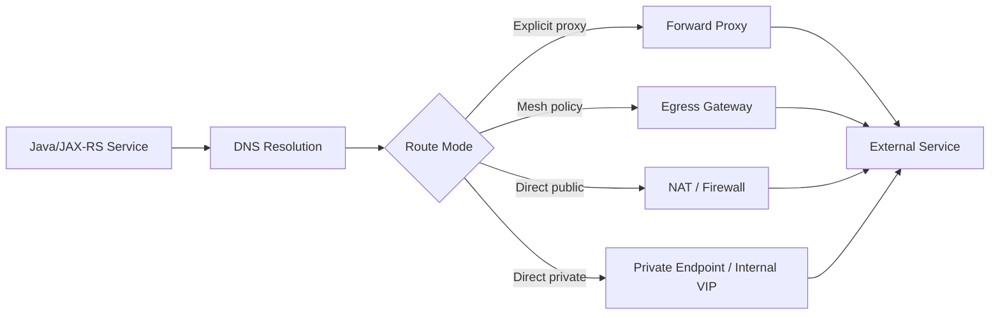
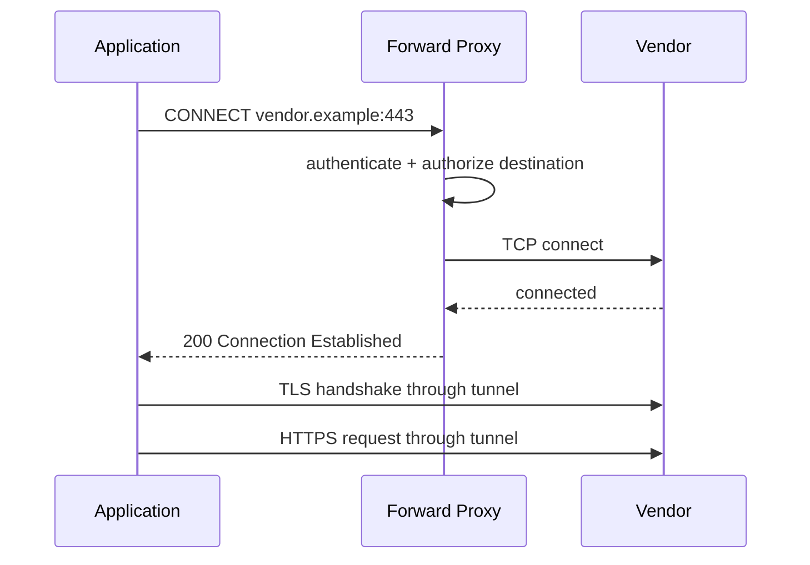
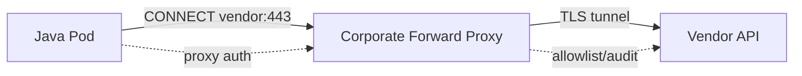
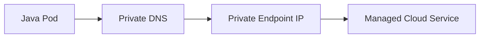
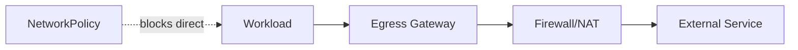
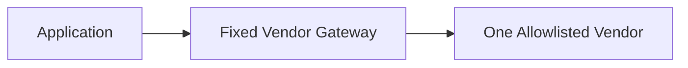

# Part 028 — Outbound Traffic: Corporate Proxies, Egress Controls, and NGINX Limits

> **Depth level:** Advanced  
> **Prerequisite:** Part 007, 012, 024–025; dasar Java HTTP clients, TLS trust stores, Kubernetes networking, DNS, firewall/NAT, dan cloud private endpoints.  
> **Scope:** ingress versus egress, explicit forward proxy, HTTP CONNECT, transparent interception caveats, corporate allowlists, environment variables, Java proxy configuration, `NO_PROXY`, private endpoints, cloud SDKs, TLS inspection, internal CA, Kubernetes NetworkPolicy, service-mesh egress gateway, NAT, DNS, observability, failure modelling, debugging, NGINX limitations, architecture decisions, PR review, dan internal verification.  
> **Bukan scope utama:** north-south NGINX ingress—Part 018–020; cloud ingress datapath—Part 022–023; general hybrid networking—Part 024; DNS internals—Part 025; GitOps rollout—Part 029–030.

---

## Operating premise

Outbound traffic adalah dependency call yang meninggalkan application trust boundary menuju:

- internal service di network lain;
- SaaS/vendor API;
- cloud managed service;
- object storage;
- identity provider;
- payment/tax/address provider;
- on-prem system;
- internet package/repository endpoint;
- telemetry collector.

Egress bukan kebalikan sederhana dari ingress. Egress mempunyai pertanyaan tambahan:

```text
Who is allowed to call where?
How is destination identity established?
Does DNS select a public or private path?
Must the client use an explicit proxy?
Who performs CONNECT or TLS origination?
Can the workload bypass the control point?
How are credentials and data leakage constrained?
Who owns allowlist and incident response?
```

> **Primary rule:** Jangan menggunakan stock NGINX reverse-proxy configuration sebagai general-purpose forward proxy. Pilih dedicated forward proxy, cloud firewall/NAT controls, service-mesh egress gateway, or another approved egress product according to the actual requirement.

---

## Daftar isi

1. [Tujuan pembelajaran](#tujuan-pembelajaran)
2. [Executive mental model](#executive-mental-model)
3. [Ingress versus egress](#ingress-versus-egress)
4. [Outbound dependency lifecycle](#outbound-dependency-lifecycle)
5. [Egress control objectives](#egress-control-objectives)
6. [Reverse proxy versus forward proxy](#reverse-proxy-versus-forward-proxy)
7. [Explicit forward proxy](#explicit-forward-proxy)
8. [HTTP CONNECT](#http-connect)
9. [Transparent proxy and interception](#transparent-proxy-and-interception)
10. [Why stock NGINX is not a generic forward proxy](#why-stock-nginx-is-not-a-generic-forward-proxy)
11. [When NGINX can still participate](#when-nginx-can-still-participate)
12. [Destination allowlists](#destination-allowlists)
13. [Domain versus IP policy](#domain-versus-ip-policy)
14. [DNS and egress coupling](#dns-and-egress-coupling)
15. [Proxy environment variables](#proxy-environment-variables)
16. [`NO_PROXY` semantics](#no_proxy-semantics)
17. [Java system properties](#java-system-properties)
18. [Java `ProxySelector`](#java-proxyselector)
19. [Library and framework differences](#library-and-framework-differences)
20. [Cloud SDK behavior](#cloud-sdk-behavior)
21. [Proxy authentication](#proxy-authentication)
22. [TLS tunneling versus TLS interception](#tls-tunneling-versus-tls-interception)
23. [Internal CA and Java trust stores](#internal-ca-and-java-trust-stores)
24. [Certificate rotation](#certificate-rotation)
25. [Private endpoints](#private-endpoints)
26. [Public versus private DNS](#public-versus-private-dns)
27. [AWS patterns](#aws-patterns)
28. [Azure patterns](#azure-patterns)
29. [On-prem and hybrid patterns](#on-prem-and-hybrid-patterns)
30. [Kubernetes egress path](#kubernetes-egress-path)
31. [NetworkPolicy](#networkpolicy)
32. [NetworkPolicy limitations](#networkpolicy-limitations)
33. [Service-mesh egress gateway](#service-mesh-egress-gateway)
34. [Bypass prevention](#bypass-prevention)
35. [NAT, SNAT, and source identity](#nat-snat-and-source-identity)
36. [Ports, protocols, and non-HTTP traffic](#ports-protocols-and-non-http-traffic)
37. [Secrets and data-loss concerns](#secrets-and-data-loss-concerns)
38. [Timeout, retry, and circuit breaking](#timeout-retry-and-circuit-breaking)
39. [Performance and capacity](#performance-and-capacity)
40. [Observability contract](#observability-contract)
41. [Failure catalogue](#failure-catalogue)
42. [Systematic debugging](#systematic-debugging)
43. [Command cookbook](#command-cookbook)
44. [Reference patterns](#reference-patterns)
45. [Decision framework](#decision-framework)
46. [Test strategy](#test-strategy)
47. [PR review checklist](#pr-review-checklist)
48. [Internal verification checklist](#internal-verification-checklist)
49. [Final mental model](#final-mental-model)
50. [Referensi resmi](#referensi-resmi)

---

## Tujuan pembelajaran

Setelah menyelesaikan part ini, Anda harus mampu:

- menggambar outbound path dari Java process sampai external destination;
- membedakan reverse proxy, explicit forward proxy, transparent proxy, egress gateway, NAT, dan private endpoint;
- menjelaskan HTTPS proxy tunneling menggunakan `CONNECT`;
- menjelaskan mengapa stock NGINX bukan drop-in general forward proxy;
- menentukan `HTTP_PROXY`, `HTTPS_PROXY`, `NO_PROXY`, JVM system properties, dan library-specific settings yang efektif;
- membuktikan apakah Java call menggunakan proxy atau direct route;
- mendiagnosis proxy auth, TLS inspection, CA trust, DNS split horizon, private endpoint, NetworkPolicy, firewall, NAT, dan timeout failures;
- memilih antara direct private connectivity, dedicated corporate proxy, service-mesh egress gateway, dan cloud-native egress controls;
- mendesain allowlist, identity, logging, and bypass prevention tanpa membuat single point of failure yang tidak terukur;
- mereview outbound integration dengan security, reliability, and production-operation checklist.

---

## Executive mental model



A production egress design contains at least five contracts:

```text
1. Destination contract
2. Routing contract
3. Identity/trust contract
4. Policy/allowlist contract
5. Reliability and observability contract
```

---

## Ingress versus egress

| Dimension | Ingress | Egress |
|---|---|---|
| Initiator | external/client | application workload |
| Destination | your service | dependency/external service |
| Common proxy | reverse proxy/ingress | forward proxy/egress gateway |
| Identity focus | caller identity | workload identity and destination identity |
| Policy | who can call us | what we may call |
| DNS concern | service public/private name | vendor/private endpoint selection |
| Data concern | malicious input | data exfiltration and credential leakage |

An ingress controller should not automatically become the outbound control plane.

---

## Outbound dependency lifecycle

```text
1. Application chooses URI/endpoint
2. Client library chooses proxy or direct mode
3. NO_PROXY / ProxySelector decision
4. Resolve proxy hostname or destination hostname
5. Establish TCP connection
6. Optional proxy authentication
7. For HTTPS proxy: send CONNECT destination:port
8. Proxy authorizes destination
9. Establish tunnel
10. TLS handshake with destination or interception proxy
11. Verify certificate and hostname
12. Send application request
13. Receive response
14. Apply timeout/retry/circuit behavior
15. Log/trace dependency outcome
16. Reuse or close connection
```

The failure can happen before the destination ever sees traffic.

---

## Egress control objectives

Typical objectives:

- prevent arbitrary internet access;
- limit destinations by workload/namespace/team;
- centralize audit logs;
- enforce malware/DLP/TLS policy;
- provide stable source IP for vendor allowlist;
- route to private endpoints;
- control DNS resolution;
- protect credentials;
- enforce protocol/port policy;
- support incident containment;
- provide cost attribution;
- reduce accidental dependency on public internet.

Not all objectives require the same component.

---

## Reverse proxy versus forward proxy

### Reverse proxy

Client knows the public service name; proxy chooses known backend.

```text
client -> api.company.com -> reverse proxy -> configured upstream
```

### Forward proxy

Client is configured to send arbitrary destination requests through a proxy.

```text
application -> forward proxy -> destination selected by request
```

Key difference:

```text
reverse proxy owns destination mapping
forward proxy receives destination intent from client
```

A forward proxy therefore needs stronger destination validation, CONNECT handling, authentication, audit, DNS policy, abuse prevention, and often caching/DLP capabilities.

---

## Explicit forward proxy

Application or runtime is configured with proxy address.

HTTP request may use absolute-form:

```http
GET http://vendor.example/api HTTP/1.1
Host: vendor.example
```

HTTPS typically uses:

```http
CONNECT vendor.example:443 HTTP/1.1
Host: vendor.example:443
Proxy-Authorization: ...
```

After `200 Connection Established`, client starts TLS through the tunnel unless interception is used.

Benefits:

- explicit behavior;
- per-client credentials possible;
- destination visible to proxy;
- easier audit and allowlist;
- no routing interception required.

Costs:

- every client/library must support configuration correctly;
- `NO_PROXY` inconsistencies;
- proxy availability becomes dependency;
- non-HTTP protocols may not work.

---

## HTTP CONNECT

CONNECT asks a proxy to open a TCP tunnel to a host:port.



Security controls must reject:

- arbitrary ports;
- loopback/link-local/metadata endpoints;
- internal admin networks;
- DNS rebinding destinations;
- unauthorized domains;
- CONNECT to proxy itself;
- destinations resolved differently between authorization and connection.

---

## Transparent proxy and interception

Transparent interception reroutes traffic without explicit application proxy configuration.

Possible mechanisms:

- firewall policy routing;
- TPROXY/iptables/nftables;
- service-mesh sidecar interception;
- node agent/eBPF;
- network appliance.

Risks:

- application cannot easily distinguish route;
- TLS interception requires enterprise CA trust;
- protocol assumptions can break non-HTTP traffic;
- bypass paths may remain;
- source/destination identity changes;
- debugging becomes cross-team;
- asymmetric routing can break stateful flows.

Use only when platform owns the complete datapath and can prove enforcement.

---

## Why stock NGINX is not a generic forward proxy

Stock NGINX HTTP reverse-proxy configuration is optimized for configured upstreams and known routing rules. It is not a complete general-purpose explicit HTTPS forward proxy with arbitrary CONNECT handling.

Common dangerous attempt:

```nginx
location / {
    proxy_pass $scheme://$http_host$request_uri;
}
```

Problems:

- open-proxy behavior;
- SSRF into internal networks;
- DNS rebinding;
- unbounded destinations;
- missing robust CONNECT handling;
- weak destination authorization;
- credential/log leakage;
- difficult protocol correctness;
- abuse and legal exposure.

Third-party modules can add CONNECT-like capability, but that creates custom-build, patching, support, security-review, and lifecycle obligations. Treat it as a product decision, not a small config tweak.

---

## When NGINX can still participate

Valid narrower patterns:

### Fixed outbound reverse proxy

Application calls one internal NGINX endpoint; NGINX routes to a fixed allowlisted vendor.

```text
app -> vendor-adapter.internal -> NGINX -> one configured vendor API
```

Useful when:

- destination set is static;
- NGINX owns TLS/mTLS adaptation;
- request/response policy is explicit;
- no arbitrary destination is accepted.

### TCP stream proxy to fixed destination

NGINX stream module can proxy TCP to configured endpoints. It is still not arbitrary forward proxy discovery.

### Egress gateway data plane

A product built on NGINX may serve as egress gateway if the product/controller explicitly supports required policy. Verify exact capability and support contract.

---

## Destination allowlists

Allowlist dimensions:

- workload identity;
- namespace/service account;
- domain/FQDN;
- resolved IP/CIDR;
- destination port;
- protocol;
- HTTP method/path if L7 proxy understands traffic;
- time/environment;
- data classification;
- owner and expiry.

A useful record:

| Field | Example |
|---|---|
| Source | `quote-service` ServiceAccount |
| Destination | `api.vendor.example` |
| Port/protocol | TCP 443 / HTTPS |
| Purpose | tax calculation |
| Auth | OAuth2 client credentials |
| Data class | customer address |
| Source IP | NAT gateway egress IP |
| Owner | Quote team |
| Expiry/review | quarterly |

---

## Domain versus IP policy

### IP allowlist

Pros:

- easy at L3/L4 firewall;
- deterministic packet enforcement.

Cons:

- SaaS IPs change;
- CDN ranges are broad;
- private endpoint lifecycle;
- IPv4/IPv6 expansion;
- DNS and routing drift.

### Domain allowlist

Pros:

- follows service identity;
- easier for SaaS endpoints.

Cons:

- needs trusted DNS and re-resolution;
- wildcard risk;
- CNAME chains;
- TLS SNI/Host relationship;
- DNS rebinding;
- enforcement capability varies.

Often enforcement needs both DNS-aware control and network guardrails.

---

## DNS and egress coupling

Questions:

```text
Who resolves the destination: app, proxy, or gateway?
Does CONNECT use hostname or pre-resolved IP?
Which resolver and private zone are used?
Does authorization occur before or after DNS resolution?
How is TTL handled?
Can a public name resolve to private IP?
Can the same name resolve differently on-prem and cloud?
```

If the application resolves first but proxy resolves again, policy and connection can target different addresses.

Private endpoint failures frequently look like TLS or timeout failures but originate from DNS selecting the wrong public/private answer.

---

## Proxy environment variables

Common variables:

```bash
HTTP_PROXY=http://proxy.internal:8080
HTTPS_PROXY=http://proxy.internal:8080
NO_PROXY=localhost,127.0.0.1,.svc,.cluster.local,10.0.0.0/8
```

Caveats:

- uppercase/lowercase support varies;
- comma-separated syntax varies;
- CIDR support varies by tool/library;
- leading-dot domain matching varies;
- ports may or may not participate;
- Java core libraries do not universally consume shell proxy variables automatically;
- sidecars, init containers, build tools, and app may see different env values.

Treat effective proxy settings as runtime evidence, not deployment intent.

---

## `NO_PROXY` semantics

`NO_PROXY` is one of the most inconsistent cross-tool contracts.

Potential entries:

```text
localhost
127.0.0.1
[::1]
.svc
.cluster.local
kubernetes.default.svc
internal.company
10.0.0.0/8
169.254.169.254
```

Never blindly bypass link-local metadata endpoints. Access should be controlled by workload identity and network policy; putting metadata IP in bypass only selects route, not authorization.

Failure classes:

- internal Service accidentally sent to corporate proxy;
- vendor endpoint accidentally bypasses required proxy;
- CIDR ignored by library;
- IPv6 literal not matched;
- hostname with port does not match;
- short Kubernetes name bypass differs from FQDN;
- `.example.com` behavior differs from `*.example.com`.

Build an executable compatibility test for every runtime/client library.

---

## Java system properties

Core Java networking exposes properties such as:

```bash
-Dhttp.proxyHost=proxy.internal
-Dhttp.proxyPort=8080
-Dhttps.proxyHost=proxy.internal
-Dhttps.proxyPort=8080
-Dhttp.nonProxyHosts='localhost|127.*|[::1]|*.svc|*.cluster.local'
```

Important details:

- HTTPS uses `https.proxyHost` and `https.proxyPort`;
- HTTPS URL handling uses `http.nonProxyHosts` for bypass matching in the standard handler/default selector;
- separator for `http.nonProxyHosts` is `|`, not comma;
- wildcard behavior is limited;
- JVM properties may be read at initialization or used differently by libraries;
- container env `NO_PROXY` is not identical to JVM `http.nonProxyHosts`.

Do not expose proxy credentials in command-line arguments if process listings, crash dumps, or deployment manifests can reveal them.

---

## Java `ProxySelector`

`ProxySelector` allows programmatic route selection:

```java
ProxySelector.setDefault(new ProxySelector() {
    @Override
    public List<Proxy> select(URI uri) {
        if (isInternal(uri.getHost())) {
            return List.of(Proxy.NO_PROXY);
        }
        return List.of(new Proxy(
            Proxy.Type.HTTP,
            new InetSocketAddress("proxy.internal", 8080)
        ));
    }

    @Override
    public void connectFailed(URI uri, SocketAddress sa, IOException ioe) {
        // Emit safe telemetry; do not log credentials or sensitive query strings.
    }
});
```

But global mutable selectors can create hidden coupling across libraries. Prefer explicit client configuration where possible.

---

## Library and framework differences

Inventory each outbound client:

- JDK `HttpClient`;
- `HttpURLConnection`;
- Apache HttpClient;
- OkHttp;
- Jersey client;
- RESTEasy client;
- Spring WebClient/RestClient;
- Netty clients;
- gRPC Java;
- database drivers;
- cloud SDKs;
- Maven/Gradle runtime/build tooling.

Each may differ in:

- env variable support;
- JVM property support;
- CONNECT behavior;
- proxy auth;
- NTLM/Kerberos support;
- connection pooling;
- DNS resolution owner;
- `NO_PROXY` matching;
- TLS trust configuration.

One successful `curl` test does not prove Java uses the same path.

---

## Cloud SDK behavior

Cloud SDKs may support:

- explicit proxy configuration;
- environment variables;
- JVM system properties;
- custom HTTP transport/client;
- private endpoint override;
- regional endpoint selection;
- dual-stack/FIPS endpoints;
- workload identity credential endpoints.

Verify exact SDK version. A proxy can interfere with:

- instance/pod identity credential retrieval;
- token refresh;
- signed request host validation;
- chunked uploads;
- presigned URLs;
- regional endpoint selection;
- long-lived streaming APIs.

For S3/Azure Blob-style data transfer, direct private endpoints or approved NAT may be preferable to sending high-volume traffic through a general corporate proxy.

---

## Proxy authentication

Options can include:

- Basic;
- Digest;
- NTLM;
- Kerberos/SPNEGO;
- mTLS;
- workload identity integration;
- source-IP trust.

Risks:

- credentials embedded in URL/env;
- shared static credentials across services;
- proxy auth challenge not supported by client;
- authentication loop;
- credential leakage in logs;
- clock/Kerberos dependency;
- fail-open routing.

Prefer workload-scoped, rotated credentials and secret-injection mechanisms supported by the platform.

---

## TLS tunneling versus TLS interception

### CONNECT tunnel without interception

```text
application performs TLS directly with destination
proxy sees destination host/port and traffic volume
proxy does not read encrypted HTTP payload
```

### TLS interception

```text
application performs TLS with corporate proxy certificate
proxy decrypts, inspects, and creates new TLS connection to destination
```

Interception changes trust and compliance boundaries.

Questions:

- Is inspection legally and contractually permitted?
- Does certificate pinning break?
- Does mTLS to vendor still work?
- Does proxy support HTTP/2/gRPC correctly?
- Are client certificates exposed to proxy?
- Are sensitive payloads logged?
- Who protects decrypted data?
- How is enterprise CA rotated?

---

## Internal CA and Java trust stores

Java may trust:

- JDK `cacerts`;
- custom trust store via JVM properties;
- application/framework-specific trust manager;
- container OS CA bundle only if library integrates it;
- dynamically supplied PEM bundle.

Typical configuration:

```bash
-Djavax.net.ssl.trustStore=/etc/pki/java/truststore.p12
-Djavax.net.ssl.trustStoreType=PKCS12
-Djavax.net.ssl.trustStorePasswordFile=/run/secrets/truststore-password
```

The password-file property above is not a universal JVM property; use an application-supported secret mechanism. Avoid putting password directly in process arguments.

Verification:

```bash
keytool -list -keystore truststore.p12
openssl s_client -proxy proxy.internal:8080 \
  -connect vendor.example:443 \
  -servername vendor.example </dev/null
```

---

## Certificate rotation

Test both:

- destination certificate renewal;
- enterprise interception CA/intermediate rollover.

Failure mode:

```text
new CA distributed to some pods
old connections remain healthy
new connections fail only on restarted/scaled pods
```

Rollout plan:

1. add new trust anchor before use;
2. verify all runtimes;
3. issue certificates under new chain;
4. monitor handshake failures;
5. remove old anchor after overlap;
6. test rollback.

---

## Private endpoints

Private endpoint/private link patterns route managed services through private IPs.

Benefits:

- no public internet path;
- private routing and policy;
- reduced egress exposure;
- predictable compliance boundary.

Complexities:

- private DNS zones;
- VPC/VNet linkage;
- on-prem conditional forwarding;
- endpoint policy;
- subnet/route/security rules;
- service-specific hostnames;
- certificate hostname remains public service name in many designs;
- multi-region failover.

Do not replace service hostname with raw private IP; TLS hostname verification and SDK signing may break.

---

## Public versus private DNS

Common split-horizon pattern:

```text
api.service.cloud.example
  public resolver -> public IP
  private resolver -> private endpoint IP
```

Debug from the exact workload network namespace:

```bash
getent ahosts api.service.cloud.example
dig api.service.cloud.example
cat /etc/resolv.conf
```

Compare:

- workstation;
- bastion;
- node;
- Java pod;
- egress proxy;
- on-prem resolver.

---

## AWS patterns

Possible outbound paths:

```text
Pod -> NAT Gateway -> public SaaS
Pod -> corporate proxy -> public SaaS
Pod -> VPC endpoint -> AWS service
Pod -> Transit Gateway/VPN -> on-prem proxy
Pod -> service-mesh egress gateway -> NAT/firewall
```

Verify:

- route tables;
- NAT source IP;
- VPC endpoint DNS and policy;
- security groups/NACLs;
- pod identity credential path;
- proxy bypass for metadata/credential endpoints according to approved design;
- CloudWatch/VPC Flow Logs;
- cross-AZ cost and failure domains.

---

## Azure patterns

Possible outbound paths:

```text
Pod -> managed NAT Gateway -> public SaaS
Pod -> Azure Firewall -> public SaaS
Pod -> corporate proxy
Pod -> Private Endpoint -> Azure service
Pod -> egress gateway -> firewall/private link
```

Verify:

- UDR and next hop;
- SNAT port capacity;
- Azure Firewall FQDN/application rules;
- Private DNS zone linkage;
- workload identity token endpoint behavior;
- NSGs;
- Azure Monitor/flow logs;
- forced tunneling to on-prem.

---

## On-prem and hybrid patterns

Typical chain:

```text
Java pod
 -> cluster egress policy
 -> internal firewall
 -> corporate forward proxy
 -> perimeter firewall
 -> internet/vendor
```

or:

```text
cloud pod
 -> private circuit/VPN
 -> on-prem proxy
 -> vendor
```

Failure domains include:

- conditional DNS;
- asymmetric routing;
- proxy cluster failover;
- PAC file assumptions;
- Kerberos domain reachability;
- internal CA distribution;
- MTU/MSS;
- private circuit congestion;
- duplicated NAT;
- overlapping CIDRs.

---

## Kubernetes egress path

A pod’s outbound packet may pass through:

```text
application socket
sidecar/ambient proxy
pod network namespace
CNI policy
node routing/conntrack
SNAT/NAT
cloud firewall
egress gateway/proxy
destination
```

The effective path depends on:

- CNI;
- network mode;
- service mesh;
- NetworkPolicy implementation;
- node subnet routes;
- cloud NAT/firewall;
- proxy variables;
- private endpoint DNS.

---

## NetworkPolicy

Kubernetes NetworkPolicy can isolate pod egress at L3/L4 when enforced by the CNI.

Default-deny example:

```yaml
apiVersion: networking.k8s.io/v1
kind: NetworkPolicy
metadata:
  name: default-deny-egress
  namespace: quote
spec:
  podSelector: {}
  policyTypes:
    - Egress
```

Allow DNS and approved proxy:

```yaml
apiVersion: networking.k8s.io/v1
kind: NetworkPolicy
metadata:
  name: quote-egress
  namespace: quote
spec:
  podSelector:
    matchLabels:
      app: quote-service
  policyTypes:
    - Egress
  egress:
    - to:
        - namespaceSelector:
            matchLabels:
              kubernetes.io/metadata.name: kube-system
      ports:
        - protocol: UDP
          port: 53
        - protocol: TCP
          port: 53
    - to:
        - ipBlock:
            cidr: 10.20.30.40/32
      ports:
        - protocol: TCP
          port: 8080
```

Policies are additive. Source egress and destination ingress policies must both permit an in-cluster connection.

---

## NetworkPolicy limitations

Standard NetworkPolicy commonly operates at IP/port level. It does not universally provide:

- FQDN policy;
- HTTP method/path policy;
- TLS identity validation;
- dynamic SaaS domain tracking;
- process-level identity;
- centralized proxy logging;
- DLP/content inspection.

Capabilities depend on CNI extensions. Do not write vendor-specific policy and call it portable Kubernetes NetworkPolicy.

NetworkPolicy also does not prove traffic traverses a specific proxy unless direct paths are denied.

---

## Service-mesh egress gateway

An egress gateway centralizes selected mesh-external traffic.

Potential capabilities:

- route policy;
- TLS origination;
- mTLS inside mesh;
- telemetry;
- controlled source identity/IP;
- fault policy;
- destination registration.

But a logical egress rule alone may be bypassable if workloads can open direct sockets. Enforcement may require:

- NetworkPolicy;
- firewall routes;
- sidecar capture controls;
- workload permissions;
- namespace policy;
- deny-direct egress.

Gateway also introduces capacity, availability, certificate, and rollout concerns.

---

## Bypass prevention

A secure egress architecture needs both:

```text
approved path exists
AND
unapproved direct path is blocked
```

Control layers:

- default-deny egress;
- allow only DNS plus proxy/gateway/private endpoint;
- cloud firewall route;
- no public IP on nodes/pods;
- workload identity;
- admission policy for hostNetwork/privileged pods;
- restrict `NET_ADMIN`/raw sockets;
- monitor anomalous destinations;
- deny link-local/internal control-plane ranges;
- separate build-time and runtime egress.

---

## NAT, SNAT, and source identity

Vendor often allowlists stable source IP. Determine which component owns it:

- node SNAT;
- NAT Gateway;
- Azure Firewall;
- corporate proxy;
- egress gateway;
- on-prem perimeter NAT.

Capacity concerns:

- ephemeral port exhaustion;
- per-destination connection concentration;
- conntrack limits;
- multi-AZ failover;
- asymmetric path;
- source-IP changes after scaling/failover.

A successful DNS/TLS test from a bastion does not prove the pod uses the same source IP.

---

## Ports, protocols, and non-HTTP traffic

Forward HTTP proxies usually support HTTP and CONNECT-tunneled TCP to approved ports. Other protocols may require:

- SOCKS proxy;
- L4 egress gateway;
- direct private routing;
- protocol-specific gateway;
- database proxy;
- message broker private endpoint.

Examples requiring separate review:

- PostgreSQL;
- Kafka;
- AMQP;
- SMTP;
- SFTP;
- DNS;
- gRPC over TLS;
- custom binary protocols.

Do not tunnel everything over port 443 merely to bypass network policy.

---

## Secrets and data-loss concerns

Outbound controls protect against:

- credentials sent to wrong host;
- SSRF reaching metadata/admin endpoints;
- tenant data exfiltration;
- debug dumps uploaded externally;
- unrestricted webhook callbacks;
- dependency confusion/package download;
- malware command-and-control;
- accidental public endpoint usage.

Application controls:

- strict destination registry;
- URL parsing and canonicalization;
- no user-controlled arbitrary schemes/hosts;
- redirect policy;
- credential scoped to exact audience;
- response size limits;
- log redaction;
- webhook signature validation;
- data classification review.

A proxy allowlist is not a substitute for safe URL handling inside the Java service.

---

## Timeout, retry, and circuit breaking

Outbound chain may include:

```text
Java connect timeout
proxy connect/auth timeout
proxy-to-destination connect timeout
TLS timeout
response/read timeout
client total deadline
retry/backoff
circuit breaker
```

Failure amplification example:

```text
100 Java requests
× 3 client retries
× 2 proxy retries
= up to 600 destination attempts
```

Principles:

- one primary retry owner;
- deadline propagated/consumed;
- mutation requires idempotency;
- proxy auth errors are not transient destination errors;
- DNS NXDOMAIN should not be retried aggressively;
- circuit breaker must distinguish proxy outage from vendor outage;
- fallback must not silently bypass proxy/security control.

---

## Performance and capacity

Measure proxy/gateway capacity by:

- requests/sec;
- concurrent CONNECT tunnels;
- connections per destination;
- bytes/sec;
- TLS handshakes/sec;
- authentication latency;
- DNS query rate;
- cache use if any;
- CPU/memory/file descriptors;
- NAT ports/conntrack;
- queue depth;
- p50/p95/p99 added latency;
- failure-domain and N+1 capacity.

Large object-storage transfers can dominate bandwidth and connection duration. Separate high-volume data paths from small-control API paths when appropriate.

---

## Observability contract

At application:

- dependency name, not raw arbitrary host label;
- proxy mode/direct mode;
- connect/TLS/TTFB/total latency;
- timeout type;
- retry count;
- HTTP/gRPC status;
- response bytes;
- trace ID;
- endpoint region/private/public classification.

At proxy/gateway:

- authenticated workload identity;
- destination host/port;
- allow/deny reason;
- CONNECT result;
- DNS resolution result;
- upstream IP;
- TLS interception/tunnel mode;
- bytes and duration;
- source namespace/service account where available;
- policy version;
- redacted request metadata.

At network:

- flow allow/deny;
- source/destination IP/port;
- NAT translation;
- rejected routes;
- conntrack/SNAT exhaustion.

Never log bearer tokens, proxy credentials, signed URLs, or sensitive query strings.

---

## Failure catalogue

| Symptom | Likely causes | First evidence |
|---|---|---|
| `407 Proxy Authentication Required` | missing/unsupported credentials | proxy response/log |
| `403` from proxy | destination denied | policy decision log |
| connect timeout | route/firewall/proxy/downstream unreachable | flow logs + proxy connect timing |
| `UnknownHostException` | app/proxy DNS failure | resolver evidence |
| certificate unknown | interception CA missing | Java SSL debug/chain |
| hostname mismatch | private IP/raw endpoint/wrong SNI | certificate SAN + URI |
| direct works, proxy fails | CONNECT/auth/proxy DNS/TLS policy | proxy test |
| proxy works, Java fails | client library config mismatch | effective JVM/client settings |
| internal Service goes to proxy | NO_PROXY mismatch | proxy log + env/properties |
| vendor bypasses proxy | direct route allowed or selector mismatch | flow logs/source IP |
| intermittent resets | proxy failover/idle timeout/NAT exhaustion | connection duration + infra metrics |
| only new pods fail | trust store/config rollout drift | pod image/config hash |
| private endpoint times out | wrong DNS/route/SG/NSG | pod DNS + flow logs |
| cloud SDK auth fails | credential endpoint proxied/blocked | SDK logs + route |
| high latency | proxy queue, TLS inspection, cross-region path | hop timing |

---

## Systematic debugging

### Step 1 — Freeze dependency tuple

```text
source workload/pod
client library and version
URI hostname and port
proxy required yes/no
proxy address and auth
NO_PROXY/effective bypass
DNS answer
private/public route
TLS trust mode
expected source IP
timeout/retry policy
```

### Step 2 — Inspect runtime settings

```bash
kubectl exec -n quote deploy/quote-service -- env | grep -i proxy
kubectl exec -n quote deploy/quote-service -- cat /etc/resolv.conf
kubectl get deploy -n quote quote-service -o yaml
```

For JVM:

```bash
jcmd <pid> VM.system_properties | grep -Ei 'proxy|nonProxy'
```

Use approved diagnostic access and avoid exposing secrets.

### Step 3 — Test direct and proxy paths deliberately

```bash
curl -v --noproxy '*' https://vendor.example/health
curl -v -x http://proxy.internal:8080 https://vendor.example/health
curl -v --proxy-user 'REDACTED' -x http://proxy.internal:8080 \
  https://vendor.example/health
```

Do not interpret a direct success as permission to bypass required controls.

### Step 4 — Test CONNECT/TLS

```bash
openssl s_client \
  -proxy proxy.internal:8080 \
  -connect vendor.example:443 \
  -servername vendor.example </dev/null
```

Inspect:

- proxy CONNECT result;
- certificate issuer;
- SAN;
- chain;
- TLS version;
- interception evidence.

### Step 5 — Verify DNS in each resolver domain

```bash
dig vendor.example
dig @<corporate-resolver> vendor.example
getent ahosts vendor.example
```

If proxy resolves destination, obtain proxy-side resolution evidence too.

### Step 6 — Verify Kubernetes and network controls

```bash
kubectl get networkpolicy -A
kubectl describe networkpolicy -n quote quote-egress
kubectl get pods -n quote -o wide
kubectl get svc,endpointslice -A
```

Then inspect CNI/firewall/NAT/flow logs.

### Step 7 — Reproduce using the same Java client stack

A minimal application-level probe is more authoritative than curl when libraries differ.

Capture:

- selected proxy;
- resolved address if safe;
- connect/TLS/response timing;
- exception chain;
- response status;
- trace ID.

---

## Command cookbook

```bash
# Environment
printenv | grep -i proxy

# JVM properties
jcmd <pid> VM.system_properties

# DNS
dig +short vendor.example
getent ahosts vendor.example

# Proxy CONNECT
curl -v -x http://proxy.internal:8080 https://vendor.example/

# Explicit bypass
curl -v --noproxy vendor.example https://vendor.example/

# Certificate through proxy
openssl s_client -proxy proxy.internal:8080 \
  -connect vendor.example:443 -servername vendor.example </dev/null

# Route
ip route get <destination-ip>

# Socket/connection state
ss -tanp

# Packet capture, only with authorization
tcpdump -ni any host <proxy-ip> and port 8080

# NetworkPolicy
kubectl get netpol -A -o yaml

# Pod DNS and route
kubectl exec -n app pod/<name> -- sh -c 'cat /etc/resolv.conf; ip route'
```

---

## Reference patterns

### Pattern A — Explicit corporate proxy



Use when corporate policy requires centralized internet access and clients support explicit proxy configuration.

### Pattern B — Private endpoint first



Use for supported cloud services when private connectivity meets security, cost, and availability needs.

### Pattern C — Mesh egress gateway plus network enforcement



Gateway policy without direct-path blocking is incomplete.

### Pattern D — Fixed vendor adapter/reverse proxy



Appropriate when destination is fixed and the gateway provides protocol/TLS adaptation—not arbitrary proxying.

---

## Decision framework

| Requirement | Preferred starting point |
|---|---|
| One fixed vendor API with mTLS adaptation | fixed reverse proxy/vendor adapter |
| General corporate HTTPS internet access | dedicated explicit forward proxy |
| Private cloud managed service | private endpoint/private DNS |
| Mesh-wide policy and telemetry | service-mesh egress gateway + enforcement |
| Stable source IP only | NAT/firewall, possibly without L7 proxy |
| FQDN allowlist at network edge | DNS-aware firewall/proxy product |
| Non-HTTP database/broker | private connectivity or protocol/L4 gateway |
| Content inspection/DLP | approved inspection proxy/appliance |
| Low-volume internal cross-network call | private routing + service identity |

Choose the fewest layers that satisfy the required controls.

---

## Test strategy

Minimum tests:

| Test | Expected result |
|---|---|
| approved destination through proxy | allowed and audited |
| denied destination | blocked with clear reason |
| direct bypass attempt | blocked |
| internal Service in bypass list | direct, not proxy |
| public vendor not in bypass | proxy/gateway path |
| proxy unavailable | fail closed with bounded timeout |
| proxy auth expiry | detectable 407/auth metric |
| interception CA rollover | old/new overlap works |
| private endpoint DNS | private IP from pod resolver |
| source IP | vendor sees documented NAT/proxy IP |
| NetworkPolicy | only DNS + approved path allowed |
| cloud SDK credential refresh | works without unsafe broad bypass |
| large upload/download | capacity and timeout acceptable |
| retry | no amplification or policy bypass |
| observability | workload→destination decision traceable |

---

## PR review checklist

### Destination and ownership

- [ ] Is the destination exact, owned, and documented?
- [ ] Is private connectivity available and preferred?
- [ ] Is the business purpose and data classification stated?
- [ ] Is allowlist approval/expiry defined?

### Client configuration

- [ ] Which Java/library proxy mechanism is actually used?
- [ ] Are env variables, JVM properties, and client-specific settings consistent?
- [ ] Has `NO_PROXY` behavior been executable-tested?
- [ ] Are credentials injected securely and rotated?

### Network and security

- [ ] Can the workload bypass proxy/gateway directly?
- [ ] Are NetworkPolicy/firewall routes enforced?
- [ ] Are metadata, loopback, link-local, internal admin, and arbitrary destinations protected?
- [ ] Is TLS tunneling versus interception explicit?
- [ ] Is destination hostname verified?
- [ ] Are logs free of credentials and sensitive payloads?

### Reliability

- [ ] Are timeout and retry owners clear?
- [ ] Does proxy failure fail closed without unbounded queueing?
- [ ] Is N+1 proxy/gateway/NAT capacity available?
- [ ] Are source-IP and failover behavior known?
- [ ] Is certificate/CA rotation tested?

### Operations

- [ ] Can operators distinguish DNS, proxy auth, firewall, TLS, destination, and Java-client failures?
- [ ] Are proxy decisions and direct flows observable?
- [ ] Is there a runbook and owner for allowlist/proxy incidents?
- [ ] Is rollback possible without bypassing security controls?

---

## Internal verification checklist

> **Internal verification checklist — verify actual CSG/team architecture; do not infer egress products, cloud route, security policy, or vendor endpoints.**

### Dependency inventory

- [ ] Inventory every outbound hostname, port, protocol, owner, purpose, and data classification.
- [ ] Identify public SaaS, cloud managed services, on-prem systems, and cross-cluster dependencies.
- [ ] Record authentication method, certificate requirements, and expected source IP.
- [ ] Identify high-volume and long-lived data paths separately.

### Proxy and route

- [ ] Confirm platform-approved forward proxy/egress gateway product and version.
- [ ] Determine explicit, transparent, mesh, private-endpoint, or direct NAT route per dependency.
- [ ] Inspect firewall, route table, NAT, private link, VPN, and proxy allowlists.
- [ ] Verify whether proxy or application resolves destination DNS.
- [ ] Confirm direct bypass is blocked where required.

### Kubernetes

- [ ] Review NetworkPolicies and CNI enforcement capability.
- [ ] Confirm DNS egress is allowed only to approved resolvers.
- [ ] Inspect sidecar/ambient mesh capture and egress gateway configuration.
- [ ] Review privileged/hostNetwork capabilities that could bypass control.
- [ ] Check node/pod public IP exposure and cloud route behavior.

### Java runtime

- [ ] Inventory JDK version and each HTTP/gRPC/cloud SDK transport.
- [ ] Capture effective `HTTP_PROXY`, `HTTPS_PROXY`, `NO_PROXY`, JVM proxy properties, and client-specific configuration.
- [ ] Verify `http.nonProxyHosts` patterns against actual internal hostnames.
- [ ] Check trust store, enterprise CA, client certificate, and rotation mechanism.
- [ ] Test credential refresh and metadata/workload-identity access.
- [ ] Verify timeout, retry, pool, DNS, and redirect policy.

### Cloud/on-prem

- [ ] AWS: inspect NAT Gateway, VPC endpoints, route tables, SG/NACL, egress IPs, and endpoint policies if used.
- [ ] Azure: inspect NAT Gateway, Azure Firewall, UDR, Private Endpoint, Private DNS, NSG, and SNAT capacity if used.
- [ ] On-prem: inspect corporate proxy cluster, PAC assumptions, Kerberos/NTLM dependencies, perimeter NAT, and CA distribution.
- [ ] Hybrid: inspect conditional DNS, private circuit, MTU, overlapping CIDRs, and failover route.

### Observability and runbook

- [ ] Dashboard proxy auth failures, denies, connect latency, active tunnels, bytes, destination health, and NAT/SNAT pressure.
- [ ] Confirm flow logs can prove source/destination and translated IP.
- [ ] Ensure application traces identify logical dependency and proxy mode.
- [ ] Review historical outbound incidents and allowlist tickets.
- [ ] Confirm escalation owner across application, platform, network, security, and vendor teams.
- [ ] Validate emergency containment does not require opening unrestricted internet access.

---

## Final mental model

For every outbound integration, answer these questions in order:

```text
1. What exact dependency, hostname, port, protocol, and data class are involved?
2. Should traffic use a private endpoint, direct route, forward proxy, or egress gateway?
3. Who selects the proxy and who resolves the destination DNS?
4. What effective NO_PROXY/ProxySelector decision does the Java process make?
5. Is HTTPS tunneled with CONNECT or intercepted?
6. Which CA and hostname establish destination identity?
7. What workload identity authenticates to proxy and destination?
8. What allowlist policy exists, who owns it, and when does it expire?
9. Can the workload bypass the approved path?
10. Which NetworkPolicy/firewall/route enforces the path?
11. What source IP does the destination observe?
12. How are timeout, retry, circuit breaker, and fail-closed behavior aligned?
13. What happens during proxy, DNS, CA, NAT, or private-endpoint failure?
14. What telemetry proves the selected path and policy decision?
15. Can operators reproduce using the same Java client stack from the same pod network?
```

> **Core invariant:** Egress is production-ready only when destination, route, proxy selection, DNS, TLS identity, workload identity, allowlist, bypass prevention, capacity, retry, and observability are designed as one enforceable system.

---

## Referensi resmi

- [Oracle Java — Java Networking](https://docs.oracle.com/en/java/javase/22/core/java-networking.html)
- [Oracle Java — Networking Properties](https://docs.oracle.com/javase/8/docs/api/java/net/doc-files/net-properties.html)
- [Kubernetes — Network Policies](https://kubernetes.io/docs/concepts/services-networking/network-policies/)
- [Kubernetes — NetworkPolicy API](https://kubernetes.io/docs/reference/kubernetes-api/networking-resources/network-policy-v1/)
- [Istio — Accessing external services](https://istio.io/latest/docs/tasks/traffic-management/egress/egress-control/)
- [Istio — Egress gateways](https://istio.io/latest/docs/tasks/traffic-management/egress/egress-gateway/)
- [Istio — Using an external HTTPS proxy](https://istio.io/latest/docs/tasks/traffic-management/egress/http-proxy/)
- [NGINX — HTTP proxy module](https://nginx.org/en/docs/http/ngx_http_proxy_module.html)
- [NGINX — Stream proxy module](https://nginx.org/en/docs/stream/ngx_stream_proxy_module.html)

---

**End of Part 028.**
