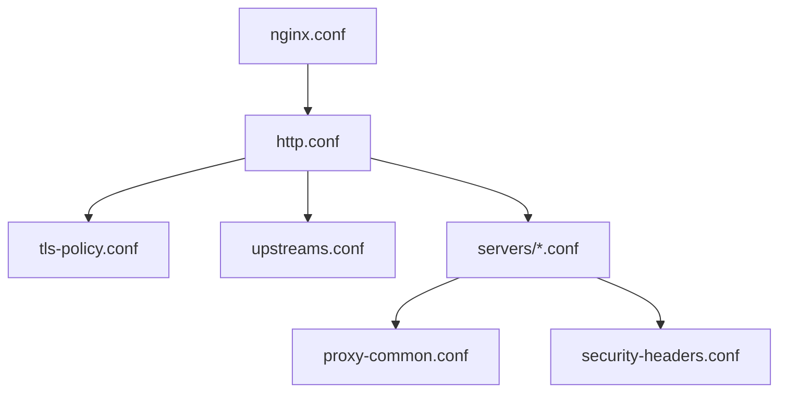
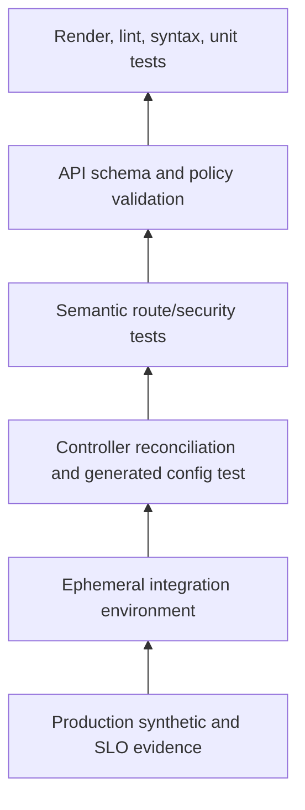

# Part 029 — NGINX Configuration as Code: Helm, Kustomize, CI, and GitOps

> **Depth level:** Production/Architecture-level  
> **Prerequisite:** Part 003, 017–020; dasar CI/CD, Kubernetes manifests, Helm/Kustomize, GitOps, RBAC, admission control, dan controller reconciliation.  
> **Scope:** repository design, source-of-truth layers, raw NGINX configuration, Helm, Kustomize, ConfigMap/Secret lifecycle, validation pipeline, rendered-manifest review, policy-as-code, GitOps reconciliation, Argo CD/Flux concepts, drift, promotion, rollback, provenance, dangerous-change controls, observability, debugging, PR review, dan internal verification.  
> **Bukan scope utama:** algoritme routing Ingress—Part 019; annotation governance detail—Part 020; runtime rollout/canary/draining—Part 030; incident command—Part 032.

---

## Operating premise

Perubahan NGINX bukan sekadar perubahan teks.

Satu perubahan kecil dapat melewati beberapa representasi:

```text
human intent
  ↓
source template / values / overlay
  ↓
rendered Kubernetes manifest
  ↓
admitted live Kubernetes object
  ↓
controller interpretation
  ↓
generated nginx.conf
  ↓
successfully loaded worker generation
  ↓
observable runtime behavior
```

Setiap transisi dapat gagal secara berbeda.

Contoh:

- Helm chart valid, tetapi menghasilkan host yang salah.
- Manifest valid menurut schema Kubernetes, tetapi annotation ditolak controller.
- Ingress diterima API server, tetapi tidak diproses karena `IngressClass` salah.
- Controller berhasil reconcile, tetapi generated NGINX config gagal reload.
- Reload berhasil, tetapi route baru mengirim traffic ke Service port yang salah.
- GitOps menyatakan `Synced`, tetapi data plane masih menjalankan worker generation lama.
- Rollback Git berhasil, tetapi TLS Secret, route, dan backend version tidak kembali secara koheren.

> **Core invariant:** Perubahan traffic hanya dianggap berhasil bila desired state, admitted state, generated runtime configuration, dan observed traffic behavior konsisten.

---

## Daftar isi

1. [Tujuan pembelajaran](#tujuan-pembelajaran)
2. [Configuration-as-code mental model](#configuration-as-code-mental-model)
3. [Empat lapisan kebenaran](#empat-lapisan-kebenaran)
4. [Change lifecycle](#change-lifecycle)
5. [Source-of-truth ownership](#source-of-truth-ownership)
6. [Repository architecture](#repository-architecture)
7. [Monorepo versus multirepo](#monorepo-versus-multirepo)
8. [Raw NGINX configuration](#raw-nginx-configuration)
9. [Include graph governance](#include-graph-governance)
10. [Environment substitution](#environment-substitution)
11. [Helm mental model](#helm-mental-model)
12. [Helm values design](#helm-values-design)
13. [Helm schema validation](#helm-schema-validation)
14. [Helm rendering risks](#helm-rendering-risks)
15. [Kustomize mental model](#kustomize-mental-model)
16. [Base and overlay design](#base-and-overlay-design)
17. [ConfigMap and Secret generators](#configmap-and-secret-generators)
18. [Helm versus Kustomize](#helm-versus-kustomize)
19. [ConfigMap lifecycle](#configmap-lifecycle)
20. [Secret lifecycle](#secret-lifecycle)
21. [Rendered-manifest review](#rendered-manifest-review)
22. [Validation pyramid](#validation-pyramid)
23. [Static syntax checks](#static-syntax-checks)
24. [`nginx -t` in the exact runtime image](#nginx--t-in-the-exact-runtime-image)
25. [Kubernetes schema and server validation](#kubernetes-schema-and-server-validation)
26. [Controller-specific validation](#controller-specific-validation)
27. [Policy-as-code](#policy-as-code)
28. [Semantic route tests](#semantic-route-tests)
29. [Security tests](#security-tests)
30. [Integration and smoke tests](#integration-and-smoke-tests)
31. [CI reference pipeline](#ci-reference-pipeline)
32. [Artifact provenance](#artifact-provenance)
33. [Environment promotion](#environment-promotion)
34. [GitOps reconciliation](#gitops-reconciliation)
35. [Argo CD concepts](#argo-cd-concepts)
36. [Flux concepts](#flux-concepts)
37. [Ordering and dependencies](#ordering-and-dependencies)
38. [Drift taxonomy](#drift-taxonomy)
39. [Generated-config drift](#generated-config-drift)
40. [Multi-replica convergence](#multi-replica-convergence)
41. [Rollback as coherent state restoration](#rollback-as-coherent-state-restoration)
42. [Break-glass changes](#break-glass-changes)
43. [Dangerous-change prevention](#dangerous-change-prevention)
44. [CODEOWNERS and approval](#codeowners-and-approval)
45. [Observability contract](#observability-contract)
46. [Failure catalogue](#failure-catalogue)
47. [Systematic debugging](#systematic-debugging)
48. [Reference repository structure](#reference-repository-structure)
49. [Reference CI commands](#reference-ci-commands)
50. [PR review checklist](#pr-review-checklist)
51. [Internal verification checklist](#internal-verification-checklist)
52. [Final mental model](#final-mental-model)
53. [Referensi resmi](#referensi-resmi)

---

## Tujuan pembelajaran

Setelah menyelesaikan part ini, Anda harus mampu:

- mendesain repository yang membedakan reusable platform defaults, environment policy, dan application-specific route intent;
- menjelaskan perbedaan source template, rendered manifest, live object, controller-generated config, dan active worker generation;
- membangun validation pipeline yang menangkap syntax, schema, policy, route conflict, security regression, dan runtime loading failure;
- menilai kapan Helm, Kustomize, atau kombinasi keduanya layak digunakan;
- mendeteksi drift pada GitOps resource, generated NGINX config, controller replica, dan dependent Secret;
- merancang promotion yang memindahkan artifact yang sama, bukan merender ulang hasil berbeda tanpa provenance;
- melakukan rollback koheren terhadap config, Secret, Ingress/Gateway route, controller deployment, dan backend dependency;
- mereview perubahan NGINX/Ingress seperti perubahan production control plane, bukan file konfigurasi biasa.

---

## Configuration-as-code mental model

Configuration as code harus memiliki properti berikut:

| Properti | Makna operasional |
|---|---|
| Versioned | Setiap perubahan dapat dikaitkan dengan commit/revision |
| Reproducible | Input yang sama menghasilkan output yang sama |
| Reviewable | Reviewer melihat effective change, bukan hanya template diff |
| Validatable | Syntax, schema, policy, dan runtime behavior dapat diuji |
| Promotable | Artifact yang telah diuji dapat dipindahkan antar-environment |
| Traceable | Runtime dapat dikaitkan dengan source revision |
| Drift-detectable | Perbedaan desired dan live state terlihat |
| Rollback-ready | Previous known-good state dapat dipulihkan secara koheren |
| Least-privileged | Actor yang merender tidak otomatis memiliki hak deploy production |
| Auditable | Siapa mengubah apa, kapan, mengapa, dan hasilnya dapat dibuktikan |

Configuration-as-code **bukan**:

- menyimpan YAML di Git tetapi melakukan edit manual di cluster;
- menggunakan template yang output-nya bergantung pada state cluster tanpa merekam hasil;
- memiliki satu `values-prod.yaml` besar tanpa schema atau ownership;
- merender kembali chart dengan tool version berbeda saat production deploy;
- menganggap `Synced` sebagai bukti route bekerja;
- menyimpan generated secret plaintext di repository;
- rollback satu resource sambil membiarkan dependent resources pada versi baru.

---

## Empat lapisan kebenaran

### 1. Source truth

Contoh:

- `nginx.conf`;
- Helm chart;
- `values.yaml`;
- Kustomize base/overlay;
- Ingress/Gateway API YAML;
- policy file;
- encrypted secret declaration;
- controller Helm release configuration.

Source truth menjawab:

```text
Apa intent yang disetujui?
```

### 2. Rendered truth

Hasil akhir setelah template/overlay diproses:

```yaml
apiVersion: networking.k8s.io/v1
kind: Ingress
metadata:
  name: quote-api
  annotations:
    nginx.ingress.kubernetes.io/proxy-read-timeout: "30"
spec:
  ingressClassName: internal-nginx
  rules:
    - host: quote.internal.example
```

Rendered truth menjawab:

```text
Apa tepatnya yang akan dikirim ke Kubernetes API?
```

### 3. Live cluster truth

Object yang telah:

- diterima API server;
- melalui defaulting;
- melalui mutating admission;
- melalui validating admission;
- disimpan di etcd;
- mungkin dimodifikasi controller lain.

Live truth menjawab:

```text
Apa yang saat ini dinyatakan cluster?
```

### 4. Runtime truth

Untuk NGINX/controller, runtime truth dapat berupa:

- generated `nginx.conf`;
- referenced include files;
- loaded certificate;
- upstream endpoint list;
- active worker generation;
- actual listener/socket;
- active route behavior;
- controller status condition;
- metrics and logs.

Runtime truth menjawab:

```text
Apa yang benar-benar digunakan untuk memproses request?
```

### Reconciliation matrix

| Source | Rendered | Live | Runtime | Interpretation |
|---|---|---|---|---|
| correct | correct | correct | correct | expected state |
| correct | wrong | wrong | wrong | template/render defect |
| correct | correct | wrong | wrong | admission/mutation/manual drift |
| correct | correct | correct | wrong | controller/reload/runtime defect |
| old | old | new | new | manual change or source lag |
| new | new | mixed | mixed | partial convergence |
| new | new | new | old | controller/data-plane stale |
| rollback | rollback | mixed | mixed | incomplete rollback |

---

## Change lifecycle

```mermaid
flowchart LR
    A[Engineer intent] --> B[Source change]
    B --> C[Lint and unit tests]
    C --> D[Render all target profiles]
    D --> E[Schema and policy validation]
    E --> F[Semantic route/security tests]
    F --> G[Peer review]
    G --> H[Immutable artifact]
    H --> I[Environment promotion]
    I --> J[GitOps reconciliation]
    J --> K[Admission]
    K --> L[Controller reconciliation]
    L --> M[Generated NGINX config]
    M --> N[Config test and reload]
    N --> O[Smoke and synthetic tests]
    O --> P[Observed production behavior]
```



Setiap stage harus mempunyai:

- input;
- deterministic tool version;
- output;
- pass/fail criteria;
- retained evidence;
- owner;
- rollback implication.

Contoh failure yang harus dibedakan:

```text
CI render failure
≠ Kubernetes admission failure
≠ controller reconciliation failure
≠ NGINX reload failure
≠ runtime route failure
```

---

## Source-of-truth ownership

Satu configuration tree sering dimiliki oleh beberapa pihak:

| Area | Typical owner |
|---|---|
| Controller version/image | Platform/SRE |
| Global ConfigMap | Platform/SRE |
| IngressClass/GatewayClass | Platform/SRE |
| TLS issuer and certificate policy | Platform/Security |
| Application host/path/backend | Application team |
| Timeout/body-size exception | Shared ownership |
| WAF/rate-limit baseline | Security/Platform |
| DNS/load-balancer binding | Network/Cloud platform |
| Route rollout strategy | Application + Platform |
| Production promotion | Release/change management |

Ownership harus diwujudkan melalui:

- repository boundaries;
- CODEOWNERS;
- admission policy;
- RBAC;
- namespace delegation;
- protected branches;
- review requirements;
- exception records.

> Jangan mengandalkan dokumentasi ownership bila repository dan API permissions memungkinkan siapa pun mengubah global traffic behavior.

---

## Repository architecture

### Tujuan

Repository harus memudahkan:

- menemukan source authoritative;
- melihat environment deltas;
- memahami dependency;
- mengaudit history;
- merender hasil;
- menjalankan test lokal;
- mempromosikan revision;
- rollback tanpa forensic improvisation.

### Repository pattern A — platform and application separated

```text
platform-networking/
├── controllers/
│   └── internal-nginx/
│       ├── chart/
│       ├── values/
│       │   ├── dev.yaml
│       │   ├── uat.yaml
│       │   └── prod.yaml
│       └── policies/
├── ingress-classes/
├── certificate-issuers/
├── observability/
└── clusters/
    ├── dev/
    ├── uat/
    └── prod/

quote-order-service/
├── deploy/
│   ├── base/
│   └── overlays/
│       ├── dev/
│       ├── uat/
│       └── prod/
└── tests/
    └── traffic-contract/
```

Keuntungan:

- platform global settings tidak tercampur application changes;
- ownership lebih jelas;
- application dapat mengelola route intent tanpa mendapat akses controller internals.

Risiko:

- cross-repository change harus diorkestrasi;
- rollback membutuhkan revision set;
- dependency antarrepo dapat menjadi implicit.

### Repository pattern B — environment repository

```text
gitops-environments/
├── clusters/
│   ├── dev/
│   │   ├── platform/
│   │   └── applications/
│   ├── uat/
│   └── prod/
├── modules/
└── policies/
```

Keuntungan:

- satu tempat menggambarkan desired state environment;
- promotion dapat melalui PR antar-directory/revision.

Risiko:

- repository besar;
- ownership harus sangat disiplin;
- accidental broad change mempunyai blast radius besar.

### Repository pattern C — application-owned full stack

Cocok hanya bila:

- controller tidak shared;
- tenant isolation jelas;
- team mempunyai operational ownership;
- policy baseline tetap enforced di luar chart.

---

## Monorepo versus multirepo

| Pertanyaan | Monorepo | Multirepo |
|---|---|---|
| Atomic cross-resource change | lebih mudah | membutuhkan revision orchestration |
| Ownership isolation | melalui path/CODEOWNERS | natural repository boundary |
| Scale | dapat berat | tersebar |
| Discoverability | satu tempat | perlu catalog |
| Promotion | directory/revision based | multiple sources |
| Rollback | satu commit mungkin cukup | perlu revision bundle |
| Blast radius | besar bila tooling salah | lebih tersegmentasi |
| Platform/app separation | logical | physical |

Jangan memilih berdasarkan preferensi tooling saja. Pilih berdasarkan:

- siapa harus dapat mengubah apa;
- perubahan mana harus atomic;
- bagaimana promotion dilakukan;
- bagaimana rollback dipulihkan;
- bagaimana audit evidence dikumpulkan.

---

## Raw NGINX configuration

Standalone NGINX sering menggunakan struktur:

```text
nginx/
├── nginx.conf
├── conf.d/
│   ├── 00-default-deny.conf
│   ├── 10-upstreams.conf
│   ├── 20-api.conf
│   └── 90-observability.conf
├── snippets/
│   ├── proxy-common.conf
│   ├── security-headers.conf
│   └── tls-policy.conf
└── tests/
```

### Design principles

1. `nginx.conf` menjadi root include graph yang kecil.
2. File diberi naming/order convention yang eksplisit.
3. Shared snippet mempunyai contract jelas.
4. Secret tidak ditempel langsung ke config.
5. Environment delta tidak dilakukan dengan search-and-replace.
6. Semua referenced path tersedia dalam image/container.
7. Runtime user mempunyai permission minimum yang diperlukan.
8. Config diuji dengan binary dan modules yang sama dengan production.

### Raw configuration anti-pattern

```nginx
include /etc/nginx/conf.d/*.conf;
include /mounted/team-a/*.conf;
include /mounted/team-b/*.conf;
include /runtime-generated/*.conf;
```

Tanpa:

- ordering guarantee yang dipahami;
- ownership;
- conflict detection;
- file provenance;
- rollback unit;
- include inventory.

---

## Include graph governance

Include membentuk dependency graph.



Risiko include:

- duplicate `server`/`location`;
- directive berada di context yang salah;
- glob memasukkan backup file;
- environment-specific file tertinggal;
- circular operational dependency;
- snippet mengubah inheritance secara tidak terlihat;
- secret path hilang saat startup;
- mounted ConfigMap update parsial.

Controls:

- render include graph di CI;
- fail bila file orphan atau duplicate;
- larang extension selain `.conf`;
- gunakan directory immutable per revision;
- log config revision;
- simpan effective config sebagai artifact evidence.

---

## Environment substitution

Official/container patterns sering menggunakan `envsubst`, templating script, atau init container.

Contoh template:

```nginx
upstream quote_backend {
    server ${QUOTE_SERVICE_HOST}:${QUOTE_SERVICE_PORT};
}
```

### Risiko

- variable tidak terisi menjadi empty string;
- shell substitution mengubah `$nginx_variable`;
- escaping salah;
- secret muncul di generated file/log;
- startup berhasil dengan default yang tidak aman;
- environment berbeda menghasilkan output tak ter-review;
- runtime mutation tidak direkam di Git.

### Controls

- allowlist variable yang boleh disubstitusi;
- fail bila required variable kosong;
- render output di CI dengan representative values;
- hash generated config;
- hindari secret value bila dapat menggunakan mounted file/reference;
- simpan template dan renderer version;
- jangan gunakan general-purpose `eval`.

---

## Helm mental model

Helm chart adalah program yang menghasilkan Kubernetes manifests.

Input utama:

- chart source;
- chart dependencies;
- values;
- release name;
- namespace;
- Kubernetes capabilities/API versions;
- Helm version;
- optional cluster lookup.

Output:

- rendered manifests;
- hooks;
- release metadata.

> Helm template diff yang kecil dapat menghasilkan rendered diff yang besar. Reviewer harus melihat keduanya.

### Chart boundaries

Controller chart dan application chart sebaiknya tidak disatukan bila lifecycle-nya berbeda.

Contoh:

```text
controller chart:
- Deployment/DaemonSet
- Service
- IngressClass
- admission webhook
- ConfigMap
- RBAC
- metrics ServiceMonitor

application chart:
- Deployment
- Service
- Ingress/HTTPRoute
- app-specific ConfigMap
- NetworkPolicy
```

---

## Helm values design

### Good values design

```yaml
ingress:
  enabled: true
  className: internal-nginx
  hosts:
    - host: quote.internal.example
      paths:
        - path: /api/quotes
          pathType: Prefix
  timeoutProfile: standard
  bodySizeProfile: small-json
```

Application memilih **profile**, bukan arbitrary directive.

Platform mapping:

```yaml
profiles:
  timeout:
    standard:
      connectSeconds: 3
      readSeconds: 30
    streaming:
      connectSeconds: 3
      readSeconds: 3600
```

### Benefits

- policy is centralized;
- names communicate intent;
- values surface lebih kecil;
- unsafe combination dapat dilarang;
- migration lebih mudah.

### Values anti-pattern

```yaml
nginx:
  arbitraryAnnotations: {}
  arbitraryServerSnippet: ""
  arbitraryConfigurationSnippet: ""
```

Tanpa validation dan ownership, chart hanya memindahkan raw power ke application team.

### Values design rules

- gunakan typed values;
- bedakan required dan optional;
- hindari polymorphic string yang dapat berarti integer/boolean/duration;
- gunakan enum/profile;
- dokumentasikan unit;
- define safe defaults;
- jangan expose global controller knobs pada application chart;
- jangan menyimpan environment secret plaintext;
- fail on unknown or contradictory combinations.

---

## Helm schema validation

`values.schema.json` dapat membatasi values.

Contoh:

```json
{
  "$schema": "https://json-schema.org/draft-07/schema#",
  "type": "object",
  "required": ["ingress"],
  "properties": {
    "ingress": {
      "type": "object",
      "required": ["className", "timeoutProfile"],
      "properties": {
        "className": {
          "type": "string",
          "enum": ["internal-nginx", "external-nginx"]
        },
        "timeoutProfile": {
          "type": "string",
          "enum": ["standard", "streaming"]
        },
        "allowSnippets": {
          "const": false
        }
      },
      "additionalProperties": false
    }
  }
}
```

Schema menangkap:

- wrong type;
- missing required values;
- invalid enum;
- unknown fields;
- basic range violations.

Schema tidak menangkap:

- duplicate route across releases;
- host ownership;
- backend Service existence;
- certificate compatibility;
- controller-specific semantic conflict;
- production traffic behavior.

---

## Helm rendering risks

### Non-deterministic functions

Hindari output yang berubah tanpa source change:

- random generators;
- current timestamp;
- unpinned dependency;
- mutable image tag;
- cluster `lookup` yang memengaruhi output;
- environment-specific external script.

### `tpl` risk

`tpl` memungkinkan values dievaluasi sebagai template.

Risiko:

- unexpected rendering capability;
- hidden logic di values;
- readability rendah;
- injection surface;
- output berbeda menurut context.

Gunakan hanya bila:

- use case jelas;
- input trusted;
- schema/policy membatasi;
- rendered output selalu direview.

### Local render limitation

`helm template` tidak melakukan seluruh server-side validation. Chart dapat berhasil dirender tetapi gagal saat API discovery, admission, conflict, atau controller reconcile.

Gunakan layered validation, bukan satu command.

---

## Kustomize mental model

Kustomize bekerja dengan Kubernetes Resource Model objects.

```text
base resources
  + patches
  + replacements
  + generators
  + transformers
  = rendered resources
```

Kelebihan:

- tidak memerlukan template language untuk common customization;
- output tetap Kubernetes YAML;
- base/overlay relationship eksplisit;
- cocok untuk environment deltas yang relatif kecil.

Risiko:

- patch target tidak lagi match setelah rename;
- overlay terlalu dalam;
- patch order sulit dipahami;
- remote base mutable;
- generated name mengubah reference;
- base menjadi terlalu generic.

---

## Base and overlay design

```text
deploy/
├── base/
│   ├── deployment.yaml
│   ├── service.yaml
│   ├── ingress.yaml
│   └── kustomization.yaml
└── overlays/
    ├── dev/
    │   ├── kustomization.yaml
    │   └── ingress-patch.yaml
    ├── uat/
    └── prod/
```

### Base rules

Base harus:

- valid secara mandiri;
- tidak mengetahui overlay;
- memuat common invariants;
- tidak memuat production-only secret;
- tidak menyembunyikan environment behavior dalam naming trick.

### Overlay rules

Overlay hanya mengubah:

- environment identity;
- replicas/resources;
- approved host/certificate reference;
- environment-specific dependency;
- policy profile yang memang berbeda.

Bila prod overlay mengubah 60% base, itu bukan overlay; itu konfigurasi berbeda yang dipaksa berbagi file.

### Remote base

Pin dengan immutable commit/tag/digest. Jangan memakai mutable branch untuk production render.

---

## ConfigMap and Secret generators

Kustomize generator dapat menghasilkan name suffix berdasarkan content hash.

Keuntungan:

- change menghasilkan resource name baru;
- Pod template reference change memicu rollout;
- immutable-style deployment lebih mudah.

Risiko:

- controller reference tidak otomatis memperbarui bila field tidak dikenali name transformer;
- old resources menumpuk;
- rollback membutuhkan previous generated name;
- external consumer tidak mengetahui new name;
- Secret rotation memicu rollout besar.

Verifikasi rendered references, jangan berasumsi generator mengubah semua custom-resource fields.

---

## Helm versus Kustomize

| Kriteria | Helm | Kustomize |
|---|---|---|
| Packaging/versioned chart | kuat | bukan fokus |
| Conditional resources | kuat | lebih terbatas |
| Complex reusable logic | kuat, tetapi berisiko | sengaja minimal |
| Plain YAML patching | kurang natural | kuat |
| Schema values | tersedia | external policy/schema |
| Base/overlay | via values/chart | native model |
| Third-party install | umum | dapat patch output |
| Debug complexity | template expansion | patch/transform stack |
| Determinism | harus disiplin | harus pin bases/plugins |

Common pattern:

```text
vendor Helm chart
  ↓ render/pin version
platform values
  ↓
optional Kustomize post-render/overlay
  ↓
policy validation
```

Hindari stack berlapis tanpa alasan:

```text
Helm → Kustomize → custom script → envsubst → admission mutation
```

Setiap layer menambah tempat di mana intent dapat berubah.

---

## ConfigMap lifecycle

NGINX/controller ConfigMap dapat memengaruhi:

- global timeout;
- buffers;
- real IP trust;
- log format;
- TLS baseline;
- snippets;
- header behavior;
- worker tuning.

### ConfigMap lifecycle questions

- Apakah controller watches ConfigMap?
- Apakah change memicu reload atau pod restart?
- Apakah invalid key diabaikan, ditolak, atau menyebabkan config failure?
- Apakah value berlaku ke semua tenant?
- Berapa lama convergence?
- Bagaimana rollback?
- Apakah ConfigMap mounted sebagai file atau consumed via API?
- Apakah symlink update terlihat atomic bagi process?
- Apakah controller replica menghasilkan config identik?

### Immutable ConfigMap pattern

```text
nginx-global-<content-hash>
```

Deployment reference diubah ke revision baru.

Keuntungan:

- provenance kuat;
- rollback eksplisit;
- tidak ada silent in-place mutation.

Trade-off:

- membutuhkan rollout;
- garbage collection;
- references harus dikelola.

---

## Secret lifecycle

Secret dapat mencakup:

- TLS keypair;
- upstream client certificate;
- CA bundle;
- basic-auth file;
- API key untuk external auth;
- license material;
- signing key reference.

### Security invariants

- plaintext secret tidak berada di Git;
- encryption-at-rest tool bukan pengganti RBAC;
- renderer tidak mencetak secret ke CI log;
- diff tidak membeberkan private key;
- Secret type dan key names divalidasi;
- certificate/key match diuji;
- expiration dan chain diuji;
- rotation order dipahami;
- previous revision tersedia untuk rollback sesuai policy;
- generated runtime file permission benar.

### Secret management patterns

- encrypted secret in Git;
- external secret controller;
- cloud secret manager reference;
- certificate controller;
- sealed secret pattern;
- CSI-mounted secret.

Tidak ada satu pattern universal. Yang penting:

```text
Git intent
→ authorized decryption/fetch
→ Kubernetes/runtime materialization
→ rotation
→ rollback/recovery
→ audit
```

---

## Rendered-manifest review

Reviewer harus melihat:

1. source diff;
2. values/overlay diff;
3. rendered manifest diff;
4. policy result;
5. route/security test result;
6. resource dependency impact.

### High-risk rendered changes

- `IngressClass` berubah;
- host/path ownership berubah;
- wildcard host ditambahkan;
- TLS Secret berubah;
- backend Service/port berubah;
- annotation timeout/body-size berubah;
- snippet muncul;
- real-IP trust range melebar;
- default backend berubah;
- controller Service type/ports berubah;
- `externalTrafficPolicy` berubah;
- readiness/liveness berubah;
- Deployment image atau command berubah;
- RBAC/ClusterRole berubah;
- namespace selector berubah;
- admission webhook failure policy berubah.

### Diff normalization

Generated fields dapat menciptakan noise.

Gunakan diff yang:

- mengurutkan map secara stabil;
- menghapus known non-semantic metadata;
- tetap mempertahankan security-sensitive defaults;
- tidak menyembunyikan admission mutation;
- menunjukkan deletions/prune.

---

## Validation pyramid



Semakin tinggi:

- semakin realistis;
- semakin mahal;
- semakin lambat;
- semakin dekat ke actual behavior.

Semakin rendah:

- cepat;
- deterministik;
- bagus untuk feedback awal;
- tidak cukup sebagai bukti production correctness.

---

## Static syntax checks

Examples:

```bash
yamllint rendered/
helm lint ./chart -f values/prod.yaml
helm template quote ./chart -f values/prod.yaml > rendered/prod.yaml
kubectl kustomize deploy/overlays/prod > rendered/prod.yaml
```

Tambahkan:

- duplicate YAML key detection;
- file naming convention;
- forbidden plaintext secrets;
- forbidden mutable image tags;
- forbidden snippet annotations;
- host/path format validation;
- duration/size unit validation;
- certificate PEM parse;
- private key/certificate match;
- JSON structured log format test.

---

## `nginx -t` in the exact runtime image

`nginx -t` memeriksa syntax dan mencoba membuka referenced files sesuai behavior binary.

Jalankan dengan:

- image digest production;
- module set production;
- filesystem paths production;
- runtime user/permissions representative;
- generated config final;
- mounted dummy/realistic certificates;
- expected DNS strategy;
- same command-line prefix.

Example:

```bash
docker run --rm \
  --read-only \
  -v "$PWD/rendered/nginx.conf:/etc/nginx/nginx.conf:ro" \
  -v "$PWD/test-fixtures/certs:/etc/nginx/certs:ro" \
  registry.example/nginx@sha256:<digest> \
  nginx -t -c /etc/nginx/nginx.conf
```

### Why exact image matters

Config dapat lolos pada local NGINX tetapi gagal production karena:

- module tidak tersedia;
- version tidak mendukung directive;
- dynamic module ABI mismatch;
- user permission berbeda;
- path berbeda;
- OpenSSL feature berbeda;
- DNS name resolved differently;
- read-only filesystem;
- temp directory missing.

### Limitation

`nginx -t` tidak membuktikan:

- host/path route benar;
- upstream sehat;
- certificate trusted client;
- policy memenuhi intent;
- no route conflict;
- traffic behavior benar;
- controller akan menghasilkan config yang sama.

---

## Kubernetes schema and server validation

### Client-side render/schema

Gunakan schema sesuai target Kubernetes version dan installed CRDs.

Check:

- unknown API version;
- removed API;
- wrong field type;
- invalid enum;
- missing required field;
- CRD schema violation.

### Server dry-run

```bash
kubectl apply \
  --server-side \
  --dry-run=server \
  -f rendered/prod.yaml
```

Ini dapat melibatkan:

- API discovery;
- defaulting;
- admission webhooks;
- validation policies;
- field ownership checks.

### Caveats

- membutuhkan access ke representative cluster;
- webhook side effects seharusnya tidak terjadi tetapi implementation quality perlu dipercaya;
- environment dependencies dapat berbeda;
- object name conflict dapat berbeda;
- dry-run tidak menjalankan controller reconciliation;
- route conflict yang hanya diketahui controller mungkin belum terdeteksi.

---

## Controller-specific validation

Controller dapat mempunyai:

- admission webhook;
- custom validation CLI;
- CRD status conditions;
- generated config preview;
- dry-run mode;
- controller events;
- template unit tests.

Validation yang dibutuhkan:

```text
Can the controller parse the resource?
Can it merge this resource with existing routes?
Can it resolve referenced Service/Secret?
Can it generate valid NGINX config?
Can every replica load the generated config?
```

### Controller sandbox pattern

Deploy representative controller in ephemeral namespace/cluster:

1. install exact controller version;
2. apply ConfigMap, IngressClass, CRDs, and policies;
3. apply rendered application resources;
4. wait for reconciliation;
5. inspect status/events;
6. extract generated NGINX config;
7. run traffic contract tests;
8. destroy environment.

Ini lebih kuat daripada hanya memvalidasi YAML.

---

## Policy-as-code

Policy harus memvalidasi organization invariants.

Examples:

- production Ingress wajib mempunyai explicit class;
- wildcard host memerlukan security approval;
- snippets dilarang;
- TLS wajib untuk external host;
- Secret harus berada di approved namespace/pattern;
- Service backend harus berada di same namespace;
- timeout maksimum dibatasi;
- body size profile wajib;
- no `latest` image;
- controller container non-root;
- privileged/capability forbidden;
- LoadBalancer Service annotation harus approved;
- public exposure memerlukan WAF profile;
- `externalTrafficPolicy` change memerlukan network review.

### Policy levels

| Level | Example |
|---|---|
| Lint | naming and formatting |
| Schema | type/range/required |
| Security | snippets, privilege, TLS |
| Platform | approved class/profile |
| Architecture | host ownership, public exposure |
| Change risk | global ConfigMap or controller image |

### Warning versus deny

- warning untuk migration/pre-existing debt;
- deny untuk invariant yang tidak boleh dilanggar;
- exception harus mempunyai owner, reason, expiry, and review;
- jangan membuat policy yang selalu dibypass karena terlalu noisy.

---

## Semantic route tests

Syntax valid tidak berarti route benar.

Define test table:

| Host | Method | Path | Expected status | Expected backend | Expected headers |
|---|---|---|---:|---|---|
| quote.internal.example | GET | `/api/quotes/1` | 200/401 | quote-api | request-id |
| quote.internal.example | POST | `/api/quotes` | 401/403 | quote-api | no spoofed identity |
| unknown.example | GET | `/` | 404/421 | default deny | no backend leak |
| quote.internal.example | GET | `/admin` | 404/403 | none/admin | restricted |
| quote.internal.example | GET | `/events` | 200 | quote-api | no buffering |

### Test types

- rendered route graph unit test;
- controller sandbox test;
- synthetic HTTP request;
- TLS/SNI test;
- header propagation test;
- body-size boundary test;
- timeout profile test;
- WebSocket/SSE/gRPC protocol test;
- negative path/host test;
- client-IP trust test.

Store expected behavior as code.

---

## Security tests

Minimum:

- unknown Host rejected;
- HTTP→HTTPS behavior expected;
- certificate SAN and chain valid;
- TLS minimum version/ciphers meet policy;
- spoofed `X-Forwarded-*` removed/overwritten;
- identity headers cannot be injected;
- snippets absent unless approved;
- admin/debug endpoints not exposed;
- request-size/header limits work;
- TRACE/unsupported method policy works;
- error page does not leak upstream details;
- log redaction works;
- external auth fail-closed behavior tested;
- direct backend bypass blocked;
- Secret not printed in artifacts.

---

## Integration and smoke tests

### Pre-production integration

Test through actual chain when possible:

```text
test client
→ DNS
→ cloud/on-prem load balancer
→ controller/data plane
→ Service
→ test backend
```

### Post-sync smoke

At minimum:

- controller pods ready;
- controller reconcile error rate normal;
- generated config revision loaded;
- expected host/path returns expected backend marker;
- unknown host denied;
- TLS handshake correct;
- critical protocol works;
- no spike 4xx/5xx;
- route latency normal;
- current and previous revision identifiable.

### Smoke test must be non-destructive

Avoid using production mutation endpoints unless:

- dedicated synthetic tenant;
- idempotency key;
- cleanup;
- business approval;
- known side-effect handling.

---

## CI reference pipeline

```mermaid
flowchart LR
    A[Checkout pinned tools] --> B[Secret scan]
    B --> C[Lint source]
    C --> D[Render every environment]
    D --> E[Schema validate]
    E --> F[Policy validate]
    F --> G[nginx -t exact image]
    G --> H[Controller sandbox]
    H --> I[Route/security tests]
    I --> J[Rendered diff artifact]
    J --> K[Sign immutable artifact]
    K --> L[PR approval]
```



### Stage 1 — source integrity

- verify dependency lock;
- verify chart provenance/digest;
- verify remote Kustomize base pin;
- verify tool versions;
- secret scanning;
- license/module policy.

### Stage 2 — render matrix

Render:

- every supported environment;
- every controller profile;
- every feature combination with material behavior;
- current and proposed revision.

Fail on nondeterministic output:

```bash
render > first.yaml
render > second.yaml
diff -u first.yaml second.yaml
```

### Stage 3 — validation

- Helm lint/schema;
- Kustomize build;
- Kubernetes/CRD schema;
- policy;
- server dry-run;
- `nginx -t`;
- controller-specific admission.

### Stage 4 — semantic tests

- route graph;
- headers;
- TLS;
- negative tests;
- protocol tests;
- security tests.

### Stage 5 — evidence

Publish:

- source revision;
- tool/image versions;
- rendered manifests;
- normalized diff;
- policy results;
- generated NGINX config;
- test results;
- artifact digest.

---

## Artifact provenance

Ideal promotion artifact:

```text
bundle/
├── manifests.yaml
├── source-revision.txt
├── toolchain.json
├── images.lock
├── chart.lock
├── policy-results.json
├── route-tests.json
├── generated-nginx.conf
├── sbom/
└── checksums.txt
```

### Provenance questions

- Apakah production merender ulang dari source?
- Apakah binary/tool version sama?
- Apakah dependency registry mutable?
- Apakah image tag dipin digest?
- Apakah rendered artifact signed?
- Apakah artifact yang diuji identik dengan artifact yang dipromosikan?
- Dapatkah runtime revision dikaitkan ke digest?

> **Preferred invariant:** Build/render once, promote the same immutable artifact, then verify environment-specific references separately.

Environment-specific values kadang membuat render-once penuh tidak mungkin. Bila demikian:

- pin renderer/toolchain;
- record input values;
- record output digest;
- run full validation per environment;
- compare semantic delta;
- retain evidence.

---

## Environment promotion

### Pattern A — same commit, environment pointers

```text
dev tracks revision X
uat tracks revision X
prod tracks revision W
```

Promotion mengubah pointer prod ke X setelah gates.

### Pattern B — PR between environment directories

```text
clusters/dev/app.yaml
clusters/uat/app.yaml
clusters/prod/app.yaml
```

Promotion membuat PR yang mengubah revision/digest.

### Pattern C — release artifact registry

Git references signed artifact version.

### Promotion invariants

- no ad-hoc production-only modification;
- source revision jelas;
- all dependencies pinned;
- production-specific policy validated;
- approval recorded;
- rollback revision known;
- change window and owner known;
- post-deploy evidence retained.

---

## GitOps reconciliation

GitOps controller menjalankan loop:

```text
fetch source
→ render/build
→ compare desired/live
→ apply/prune
→ assess health
→ repeat
```

GitOps tidak secara otomatis menjamin:

- source benar;
- route semantics benar;
- controller berhasil reload;
- backend healthy;
- application compatible;
- rollback safe.

GitOps memberi mekanisme reconciliation dan evidence, bukan substitusi engineering judgment.

### Reconciliation questions

- interval berapa?
- webhook-trigger tersedia?
- source auth bagaimana?
- signature verification?
- prune enabled?
- self-heal enabled?
- apply strategy client/server-side?
- health assessment untuk CRD?
- dependency ordering?
- failure notification?
- retry/backoff?
- manual suspend?
- rollback model?
- multi-cluster fan-out?

---

## Argo CD concepts

Key concepts:

- `Application`/`ApplicationSet`;
- desired revision;
- automated sync;
- prune;
- self-heal;
- sync options;
- hooks;
- sync waves;
- health status;
- diff customization;
- resource tracking.

### Automated sync

Automation harus dipilih berdasarkan risk.

Potential controls:

```yaml
spec:
  syncPolicy:
    automated:
      enabled: true
      prune: true
      selfHeal: true
      allowEmpty: false
```

Semantics dan defaults harus diverifikasi terhadap deployed version.

### Argo CD rollout risks

- `prune` menghapus resource yang tidak lagi desired;
- `selfHeal` dapat membatalkan emergency manual patch;
- ignored differences dapat menyembunyikan security drift;
- health check custom yang salah dapat menandai healthy terlalu dini;
- ApplicationSet dapat memperbesar blast radius;
- auto-sync tidak menggantikan progressive delivery.

### Sync waves

Contoh dependency order:

```text
-3 CRDs
-2 namespace/RBAC/admission
-1 controller/ConfigMap
 0 IngressClass/Service/Secret
 1 application backend
 2 Ingress/HTTPRoute
 3 smoke-test hook
```

Jangan mengandalkan wave untuk readiness bila resource hanya sudah “applied”. Gunakan health/dependency semantics.

---

## Flux concepts

Flux memecah fungsi ke controllers seperti source, Kustomize, Helm, notification, dan image automation.

Key resources dapat mencakup:

- `GitRepository`;
- `OCIRepository`;
- `HelmRepository`;
- `Kustomization`;
- `HelmRelease`;
- alerts/providers;
- image policies.

### Dependency example

```yaml
spec:
  dependsOn:
    - name: nginx-controller
  wait: true
  healthChecks:
    - apiVersion: apps/v1
      kind: Deployment
      name: quote-api
      namespace: quote
```

Exact fields/behavior harus diverifikasi terhadap installed Flux version.

### Flux reconciliation risks

- source artifact stale;
- suspended reconciliation;
- health check incomplete;
- Helm release remediation unexpected;
- dependency cycle;
- prune deletes hand-managed resources;
- multiple Kustomizations manage same field;
- server-side apply ownership conflict;
- image automation updates mutable surface without required review.

---

## Ordering and dependencies

Traffic changes sering memerlukan transaction-like ordering.

Example new mTLS upstream:

1. distribute new CA bundle;
2. deploy backend accepting old and new CA/cert where possible;
3. add new client certificate Secret;
4. update NGINX reference;
5. verify traffic;
6. remove old trust only after propagation;
7. retain rollback window.

Example route migration:

1. deploy new backend;
2. readiness and contract tests;
3. add shadow/canary route;
4. shift traffic;
5. observe;
6. stop old traffic;
7. remove old route;
8. remove old backend later.

Kubernetes API apply tidak menyediakan distributed transaction untuk seluruh lifecycle ini. GitOps ordering dan progressive delivery harus memodelkannya.

---

## Drift taxonomy

### 1. Source drift

Different branches/repos disagree about intended state.

### 2. Render drift

Same source menghasilkan output berbeda karena:

- tool version;
- unpinned dependency;
- cluster lookup;
- environment variable;
- random function;
- mutable remote base.

### 3. Live drift

Cluster object berbeda dari desired state karena:

- manual edit;
- mutating controller;
- another field manager;
- failed partial apply;
- suspended GitOps;
- ignored differences.

### 4. Generated-config drift

Controller generated config berbeda antarreplica atau dari expected output.

### 5. Runtime drift

- worker generation lama masih melayani;
- certificate file tidak ter-reload;
- DNS/upstream state stale;
- one replica failed reload;
- one node runs old image;
- load balancer still targets old pod.

### 6. External drift

- DNS changed;
- cloud load-balancer attribute changed;
- firewall rule changed;
- certificate manager rotated material;
- backend Service endpoints changed;
- secret manager version changed.

---

## Generated-config drift

GitOps usually compares Kubernetes objects, not effective `nginx.conf`.

Controls:

- expose config checksum/revision metric;
- annotate controller pod with desired revision;
- extract generated config from every replica;
- normalize and hash;
- compare hashes;
- correlate reload success timestamp;
- keep rejected-config event;
- alert when desired revision differs from loaded revision.

Example conceptual metric:

```text
nginx_config_desired_revision{pod="controller-1"} = 42
nginx_config_loaded_revision{pod="controller-1"}  = 41
```

A pod may be `Ready` while serving old config unless readiness explicitly tests desired generation.

---

## Multi-replica convergence

Controller/data-plane replicas can be mixed because:

- rollout;
- watch lag;
- API connectivity issue;
- reload failure;
- node filesystem problem;
- missing Secret mount;
- different image;
- cache/stale informer;
- race in generated ordering.

Validation:

```bash
for pod in $(kubectl get pod -l app=nginx -o name); do
  kubectl exec "$pod" -- nginx -T | sha256sum
done
```

Normalization may be needed for dynamic fields.

Do not compare hash blindly if controller intentionally produces per-pod endpoint state. Define which differences are acceptable.

---

## Rollback as coherent state restoration

Rollback unit is not always one commit.

Potential dependency set:

```text
controller image
global ConfigMap
IngressClass
Ingress/HTTPRoute
TLS Secret
CA bundle
Service selector
backend application version
DNS/load-balancer attribute
WAF/auth policy
```

### Rollback categories

| Category | Example | Complexity |
|---|---|---|
| Pure config | timeout annotation | low if backward compatible |
| Route mapping | backend Service change | medium |
| Certificate | new CA/keypair | medium/high |
| Protocol | HTTP→gRPC, TLS mode | high |
| Controller binary | version/module upgrade | high |
| Cross-system | DNS + LB + route + backend | very high |

### Rollback plan must answer

- exact previous revisions;
- rollback order;
- whether previous Secret/cert still valid;
- whether old backend still running;
- whether database/schema remains compatible;
- whether clients cached redirect/DNS/HSTS;
- whether canary state must be reset;
- whether GitOps will re-apply failed revision;
- abort threshold;
- owner and command path.

### Git revert is not instant rollback

Time components:

```text
review/merge
+ source fetch interval
+ render
+ apply
+ controller reconcile
+ reload
+ load-balancer propagation
+ DNS/cache behavior
+ connection draining
```

Emergency path must account for real convergence time.

---

## Break-glass changes

Manual production changes may be necessary during severe incident.

A safe break-glass process requires:

1. authorized role;
2. incident reference;
3. scoped change;
4. captured pre-change state;
5. recorded command/output;
6. immediate validation;
7. explicit expiry;
8. reconciliation strategy;
9. Git backport;
10. post-incident review.

### GitOps interaction

If self-heal is active, manual patch may be reverted automatically.

Options:

- suspend/pause specific reconciliation;
- commit emergency change first;
- use approved override mechanism;
- temporarily disable self-heal with audit;
- patch source and expedite promotion.

Never disable the entire platform reconciliation without understanding blast radius.

---

## Dangerous-change prevention

High-risk controls:

- global ConfigMap change requires platform reviewers;
- public LoadBalancer creation denied by default;
- wildcard route requires security approval;
- snippets denied;
- controller image digest allowlist;
- CRD upgrade gated;
- admission webhook `failurePolicy` reviewed;
- RBAC broadening diff highlighted;
- TLS protocol weakening denied;
- real-IP trusted CIDR broadening denied/reviewed;
- route ownership checked;
- deletion/prune preview required;
- controller Service type/ports protected;
- production hostnames centrally registered;
- secret/certificate expiry checked;
- diff size threshold triggers enhanced review.

### Change risk score

Conceptual:

```text
risk =
  scope_of_traffic
× semantic_complexity
× rollback_difficulty
× observability_gap
× novelty
```

Examples:

| Change | Risk |
|---|---|
| one app timeout profile | low/medium |
| shared log format | medium |
| global real-IP trust | high |
| controller major upgrade | high |
| public DNS + TLS + route cutover | very high |

---

## CODEOWNERS and approval

Example:

```text
/controllers/               @platform-sre
/global-config/             @platform-sre @security
/policies/                  @platform-sre @security
/clusters/prod/             @release-managers
/apps/quote-order/          @quote-order-team
/apps/quote-order/ingress*  @quote-order-team @platform-sre
```

Approval should be based on actual risk:

- app owner validates behavior;
- platform validates controller/runtime;
- security validates trust/exposure;
- network/cloud validates LB/DNS/source IP;
- release manager validates production timing.

Avoid approval theater:

- reviewer must see rendered diff;
- test evidence attached;
- exception explicit;
- rollback executable;
- ownership current.

---

## Observability contract

Pipeline metrics:

- render success/failure;
- validation duration;
- policy denies/warnings;
- sync success/failure;
- source revision lag;
- reconciliation duration;
- resource health;
- reload success/failure;
- loaded config revision;
- replica config hash;
- post-sync synthetic result;
- rollback count;
- manual drift count;
- rejected config count.

### Revision propagation

Propagate identifiers:

```text
git revision
artifact digest
GitOps application revision
controller deployment revision
generated config checksum
NGINX reload generation/timestamp
```

Make them queryable in:

- labels/annotations;
- logs;
- metrics;
- deployment dashboard;
- incident timeline.

### Alert examples

- desired revision not loaded after threshold;
- one replica has different config hash;
- controller reconcile errors;
- NGINX reload failures;
- GitOps source stale;
- resource OutOfSync/NotReady;
- post-sync smoke failure;
- unexpected manual field manager;
- certificate reference missing.

---

## Failure catalogue

### Rendering failures

- missing values;
- wrong type;
- template nil access;
- Kustomize patch no longer matches;
- remote dependency unavailable;
- nondeterministic output.

### Validation failures

- removed Kubernetes API;
- CRD not installed;
- admission deny;
- invalid annotation;
- forbidden snippet;
- host ownership conflict.

### Apply/reconciliation failures

- RBAC denied;
- field ownership conflict;
- webhook unavailable;
- prune blocked by finalizer;
- GitOps suspended;
- dependency not healthy;
- controller cannot read Secret/Service.

### Runtime failures

- generated NGINX syntax invalid;
- module/directive mismatch;
- file permission;
- certificate parse failure;
- port bind failure;
- one replica fails reload;
- old worker generation remains too long;
- route points to zero endpoints.

### Rollback failures

- old Secret deleted;
- old image unavailable;
- database/app no longer backward compatible;
- GitOps immediately reapplies bad revision;
- DNS or LB cache delays;
- canary controller state conflicts;
- previous CRD not backward compatible.

---

## Systematic debugging

### Step 1 — identify exact revision

```bash
git rev-parse HEAD
helm version
kubectl version
kubectl get application -A
kubectl get kustomization -A
```

Determine:

- source revision;
- artifact digest;
- live resource generation;
- controller image;
- loaded config revision.

### Step 2 — reproduce render

Use pinned toolchain:

```bash
helm dependency build ./chart
helm lint ./chart -f values/prod.yaml
helm template quote ./chart -f values/prod.yaml > /tmp/rendered.yaml
```

or:

```bash
kubectl kustomize deploy/overlays/prod > /tmp/rendered.yaml
```

Compare checksum with CI artifact.

### Step 3 — compare rendered and live

```bash
kubectl diff -f /tmp/rendered.yaml
kubectl get ingress quote-api -o yaml
kubectl managed-fields or server-side ownership inspection
```

Check admission mutation and field managers.

### Step 4 — inspect GitOps state

Argo CD:

```bash
argocd app get <app>
argocd app diff <app>
argocd app history <app>
```

Flux:

```bash
flux get sources all -A
flux get kustomizations -A
flux get helmreleases -A
```

Check suspension, source lag, reconcile errors, and health.

### Step 5 — inspect controller evidence

```bash
kubectl describe ingress <name>
kubectl get events --sort-by=.lastTimestamp
kubectl logs deploy/<controller> --since=30m
```

Look for:

- rejected resource;
- missing endpoint/secret;
- generated config error;
- reload failure;
- route conflict.

### Step 6 — inspect runtime config

```bash
kubectl exec <nginx-pod> -- nginx -T
kubectl exec <nginx-pod> -- nginx -t
```

Verify every replica.

### Step 7 — test behavior

```bash
curl -vk \
  --resolve quote.internal.example:443:<ip> \
  https://quote.internal.example/api/quotes/1
```

Test:

- SNI/Host;
- route;
- headers;
- status provenance;
- upstream address;
- request ID.

### Step 8 — decide forward fix or rollback

Choose based on:

- customer impact;
- convergence time;
- confidence;
- state compatibility;
- rollback completeness.

---

## Reference repository structure

```text
networking-config/
├── README.md
├── Makefile
├── tool-versions.lock
├── charts/
│   └── nginx-controller/
├── apps/
│   └── quote-order/
│       ├── base/
│       ├── overlays/
│       │   ├── dev/
│       │   ├── uat/
│       │   └── prod/
│       └── tests/
│           ├── routes.yaml
│           ├── security.yaml
│           └── protocols.yaml
├── clusters/
│   ├── dev/
│   ├── uat/
│   └── prod/
├── policies/
│   ├── ingress.rego
│   ├── controller.rego
│   └── exceptions/
├── fixtures/
│   ├── certs/
│   └── backends/
├── scripts/
│   ├── render.sh
│   ├── validate.sh
│   ├── controller-sandbox.sh
│   └── smoke.sh
└── .github/
    └── CODEOWNERS
```

---

## Reference CI commands

Conceptual pipeline:

```bash
set -euo pipefail

./scripts/check-toolchain.sh
./scripts/scan-secrets.sh
./scripts/lint-source.sh

for env in dev uat prod; do
  ./scripts/render.sh "$env" > "artifacts/$env.yaml"
  ./scripts/schema-validate.sh "artifacts/$env.yaml"
  ./scripts/policy-validate.sh "$env" "artifacts/$env.yaml"
  ./scripts/nginx-config-test.sh "$env"
  ./scripts/route-contract-test.sh "$env"
done

./scripts/determinism-test.sh
./scripts/rendered-diff.sh
./scripts/create-provenance.sh
./scripts/sign-artifact.sh
```

Server validation:

```bash
kubectl apply \
  --dry-run=server \
  --server-side \
  --field-manager=ci-validator \
  -f artifacts/prod.yaml
```

Production access for CI should be minimized. Prefer dedicated validation cluster where possible, then perform controlled production admission/diff as a later gate.

---

## PR review checklist

### Intent

- [ ] Apakah business/operational reason jelas?
- [ ] Traffic scope dan affected hosts/paths/protocols disebutkan?
- [ ] Risk classification benar?
- [ ] Dependency changes disebutkan?

### Source and render

- [ ] Source authoritative jelas?
- [ ] Tool/dependency/image versions pinned?
- [ ] Render deterministic?
- [ ] Rendered diff tersedia?
- [ ] No unexpected resources/deletions?
- [ ] Environment delta minimal dan intentional?

### NGINX/controller

- [ ] Exact runtime image digunakan untuk config test?
- [ ] Directive/module/version compatibility verified?
- [ ] Controller-specific validation passed?
- [ ] Generated config inspected for high-risk changes?
- [ ] All replicas expected to converge?

### Routing and security

- [ ] Host/path ownership valid?
- [ ] Unknown host/default deny unchanged?
- [ ] TLS/Secret references valid?
- [ ] Header trust boundary unchanged or reviewed?
- [ ] No unsafe snippet?
- [ ] Public exposure/WAF/auth controls correct?
- [ ] Body size/timeout/rate limits within policy?

### GitOps and rollout

- [ ] Apply/prune/self-heal implications understood?
- [ ] Dependency ordering modeled?
- [ ] Sync health checks meaningful?
- [ ] Post-sync smoke defined?
- [ ] Rollback revision and order documented?
- [ ] Break-glass interaction understood?

### Evidence

- [ ] Lint/schema/policy results attached?
- [ ] Route/security/protocol tests passed?
- [ ] Artifact digest and source revision recorded?
- [ ] Required CODEOWNERS approved?
- [ ] Exception has owner and expiry?

---

## Internal verification checklist

### Repository and ownership

- [ ] Locate authoritative NGINX/controller/Gateway/Ingress repositories.
- [ ] Determine whether platform and application config are separated.
- [ ] Identify CODEOWNERS and required production reviewers.
- [ ] Determine monorepo/multirepo promotion and rollback model.
- [ ] Find documentation for host/path ownership.
- [ ] Verify tool versions and dependency locks.

### Helm/Kustomize/rendering

- [ ] Locate chart source, `Chart.lock`, values files, schema, and library charts.
- [ ] Check whether `lookup`, `tpl`, random functions, mutable dependencies, or runtime scripts are used.
- [ ] Locate Kustomize bases, overlays, generators, patches, and remote bases.
- [ ] Verify remote references are immutable.
- [ ] Compare current production rendered artifact with source render.
- [ ] Confirm ConfigMap/Secret name generation and reference rewriting behavior.

### CI validation

- [ ] Inspect lint, schema, policy, and server dry-run stages.
- [ ] Confirm `nginx -t` uses exact production image and module set.
- [ ] Determine whether a controller sandbox/integration cluster exists.
- [ ] Locate route, TLS, header, body-size, WebSocket/SSE/gRPC tests.
- [ ] Check deterministic-render test.
- [ ] Check secret scanning and rendered artifact retention.
- [ ] Verify rendered diff is visible to reviewer.

### GitOps

- [ ] Identify Argo CD, Flux, or other reconciliation tool and installed version.
- [ ] Inspect sync interval, webhook, prune, self-heal, server-side apply, and health behavior.
- [ ] Check dependency ordering, waves/hooks/`dependsOn`, and CRD lifecycle.
- [ ] Locate notification and reconciliation failure alerts.
- [ ] Identify suspended resources and ignored differences.
- [ ] Verify manual production edits are detected.
- [ ] Confirm revision history and rollback procedure.

### Runtime truth

- [ ] Find how generated NGINX config is extracted or inspected.
- [ ] Determine whether config checksum/revision is exposed in metrics/logs.
- [ ] Compare config across controller/data-plane replicas.
- [ ] Check reload failure metrics/events.
- [ ] Confirm readiness reflects successful latest config generation.
- [ ] Verify certificate and upstream endpoint revisions are observable.
- [ ] Inspect historical rejected-config incidents.

### Secrets and certificates

- [ ] Identify secret source, encryption, decryption/fetch actor, and RBAC.
- [ ] Confirm private material does not enter CI logs/artifacts.
- [ ] Verify certificate/key/chain validation in CI.
- [ ] Check rotation and CA rollover ordering.
- [ ] Confirm previous known-good Secret is recoverable according to policy.
- [ ] Review cert-manager/cloud certificate manager integration if used.

### Promotion and rollback

- [ ] Determine whether build/render happens once or per environment.
- [ ] Confirm artifact provenance/digest.
- [ ] Find production approval/change-window rules.
- [ ] Verify rollback restores dependent resources coherently.
- [ ] Check GitOps behavior during emergency patch.
- [ ] Locate break-glass procedure and audit requirements.
- [ ] Review recent rollback timelines and bottlenecks.

---

## Final mental model

Untuk setiap NGINX/Ingress configuration change, jawab secara berurutan:

```text
1. Apa intent dan traffic contract yang berubah?
2. Siapa owner source, platform policy, dan production approval?
3. Apa source authoritative dan toolchain version-nya?
4. Apa rendered manifests yang tepat?
5. Apakah output deterministic?
6. Apa schema, policy, security, dan semantic route tests?
7. Apakah exact NGINX/controller version dapat memuat config?
8. Apa artifact revision/digest yang dipromosikan?
9. Bagaimana GitOps apply, prune, ordering, dan health bekerja?
10. Apa live Kubernetes object setelah admission/mutation?
11. Apa generated NGINX config pada setiap replica?
12. Apakah latest generation berhasil di-load?
13. Apa post-sync traffic evidence?
14. Drift apa yang mungkin terjadi di source, live, generated, atau runtime?
15. Apa coherent rollback unit dan real convergence time?
16. Bagaimana break-glass change tidak hilang atau menjadi permanent drift?
```

> **Core invariant:** Git commit bukan runtime proof. Configuration change baru selesai ketika source, rendered artifact, live objects, generated NGINX config, loaded generation, dan observed request behavior dapat dikaitkan ke revision yang sama.

---

## Referensi resmi

- [NGINX — Controlling nginx](https://nginx.org/en/docs/control.html)
- [Helm — Charts](https://helm.sh/docs/topics/charts/)
- [Helm — `helm lint`](https://helm.sh/docs/helm/helm_lint/)
- [Helm — `helm template`](https://helm.sh/docs/helm/helm_template/)
- [Helm — Debugging templates](https://helm.sh/docs/chart_template_guide/debugging/)
- [Kubernetes — Declarative management using Kustomize](https://kubernetes.io/docs/tasks/manage-kubernetes-objects/kustomization/)
- [Kubernetes — Server-side apply](https://kubernetes.io/docs/reference/using-api/server-side-apply/)
- [Argo CD — Automated Sync Policy](https://argo-cd.readthedocs.io/en/latest/user-guide/auto_sync/)
- [Argo CD — Sync Options](https://argo-cd.readthedocs.io/en/latest/user-guide/sync-options/)
- [Argo CD — Sync Phases and Waves](https://argo-cd.readthedocs.io/en/latest/user-guide/sync-waves/)
- [Flux — Core Concepts](https://fluxcd.io/flux/concepts/)
- [Flux — Kustomization](https://fluxcd.io/flux/components/kustomize/kustomizations/)
- [Flux — HelmRelease](https://fluxcd.io/flux/components/helm/helmreleases/)

---

**End of Part 029.**
