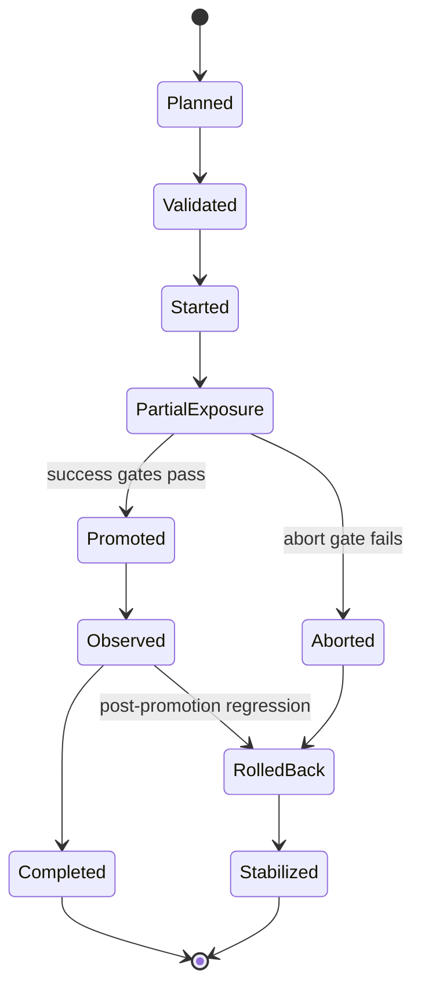
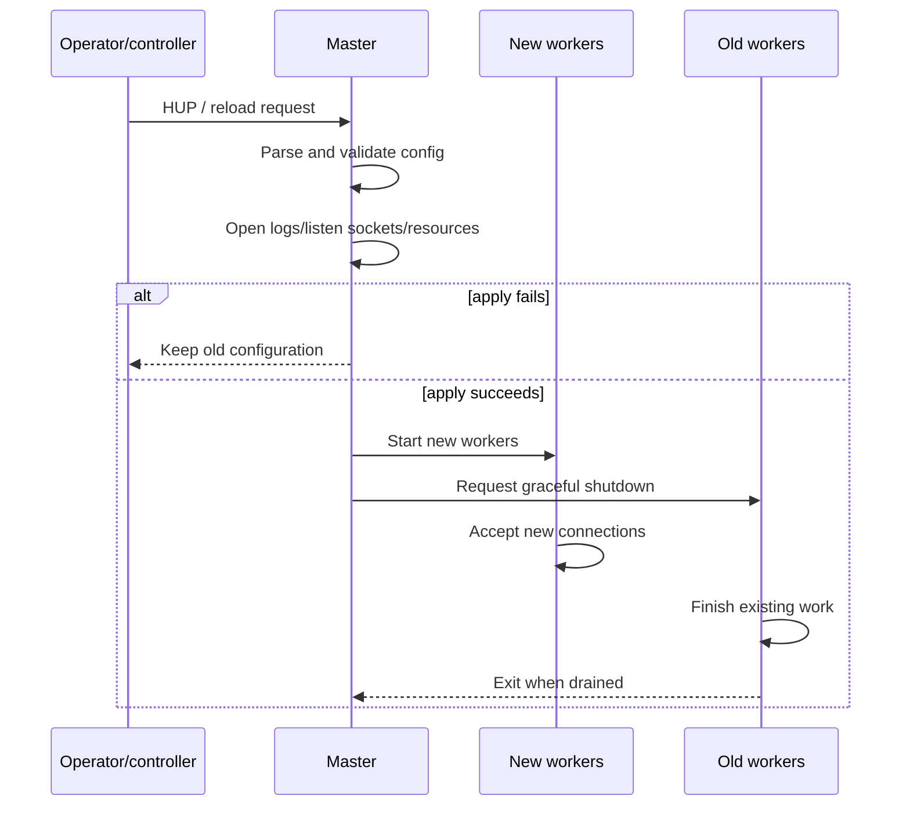
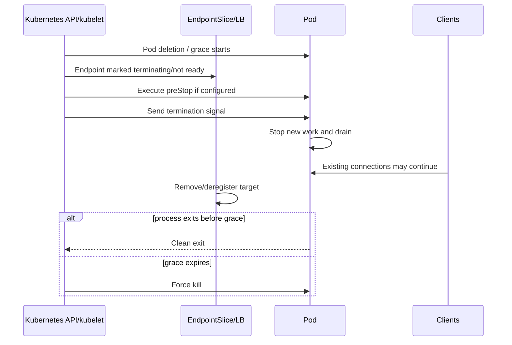
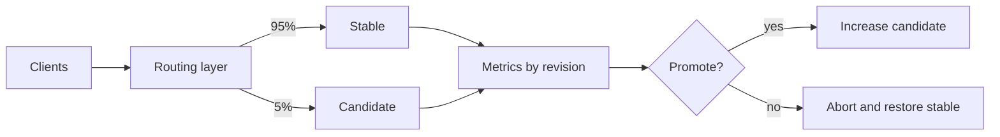
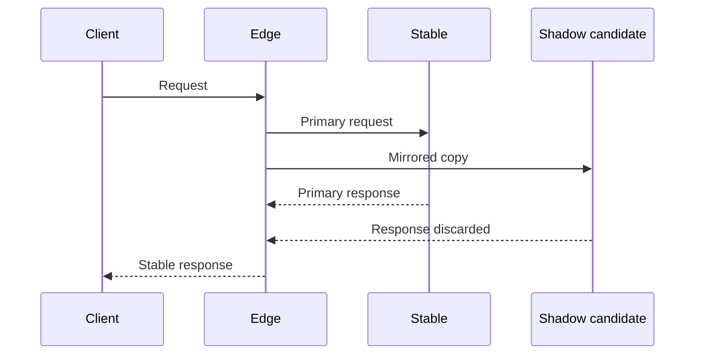

# Part 030 — Safe NGINX Deployment, Canary Routing, and Zero-Downtime Change

> **Depth level:** Production/Architecture-level  
> **Prerequisite:** Part 009, 016–020, 026, dan 029; dasar Kubernetes Deployment, readiness, termination, SLO, progressive delivery, TLS, dan backward compatibility.  
> **Scope:** NGINX graceful reload, controller/data-plane rolling update, readiness, connection draining, long-lived protocols, blue-green, canary, cohort routing, weighted traffic, shadow/mirror traffic, progressive analysis, compatibility, certificate/config/binary rollout, rollback, blast-radius control, change windows, metrics, debugging, review, dan internal verification.  
> **Bukan scope utama:** complete GitOps validation pipeline—Part 029; generic status-code debugging—Part 031; incident command and RCA—Part 032.

---

## Operating premise

“Zero downtime” bukan satu konfigurasi.

Zero downtime adalah claim tentang pengalaman client di seluruh lifecycle perubahan:

```text
no avoidable connection refusal
no route gap
no invalid TLS state
no incompatible request/response contract
no duplicate side effect
no excessive retry storm
no unbounded long-lived connection loss
no hidden partial rollout
```

Perubahan dapat terjadi pada layer berbeda:

| Change class | Example | Primary mechanism |
|---|---|---|
| Config reload | route/timeout/header change | NGINX master-worker reload |
| Pod rollout | controller image/config volume | Kubernetes rolling update |
| Traffic switch | stable → canary/green | route/service/load-balancer update |
| Dependency migration | TLS CA/protocol/backend path | staged compatibility rollout |
| External cutover | DNS/LB/certificate | multi-system change |

Satu strategi tidak cukup untuk semua kelas tersebut.

> **Core invariant:** Rollout aman harus menjaga availability, compatibility, bounded blast radius, observable success criteria, dan executable rollback selama seluruh transition—not only after the final state is reached.

---

## Daftar isi

1. [Tujuan pembelajaran](#tujuan-pembelajaran)
2. [Safe-change mental model](#safe-change-mental-model)
3. [Apa arti zero downtime](#apa-arti-zero-downtime)
4. [Change classification](#change-classification)
5. [Risk dimensions](#risk-dimensions)
6. [Rollout strategy decision](#rollout-strategy-decision)
7. [NGINX reload lifecycle](#nginx-reload-lifecycle)
8. [Reload success and rollback behavior](#reload-success-and-rollback-behavior)
9. [Old worker draining](#old-worker-draining)
10. [`worker_shutdown_timeout`](#worker_shutdown_timeout)
11. [Reload limitations](#reload-limitations)
12. [Standalone NGINX rollout](#standalone-nginx-rollout)
13. [Container signal behavior](#container-signal-behavior)
14. [Kubernetes rolling update](#kubernetes-rolling-update)
15. [`maxUnavailable` and `maxSurge`](#maxunavailable-and-maxsurge)
16. [Readiness and startup gates](#readiness-and-startup-gates)
17. [`minReadySeconds` and progress deadline](#minreadyseconds-and-progress-deadline)
18. [Pod termination lifecycle](#pod-termination-lifecycle)
19. [Endpoint removal and draining](#endpoint-removal-and-draining)
20. [`preStop` and grace period](#prestop-and-grace-period)
21. [PodDisruptionBudget](#poddisruptionbudget)
22. [Load-balancer deregistration](#load-balancer-deregistration)
23. [Long-lived connections](#long-lived-connections)
24. [WebSocket and SSE rollout](#websocket-and-sse-rollout)
25. [gRPC streaming rollout](#grpc-streaming-rollout)
26. [Reconnection storms](#reconnection-storms)
27. [Canary mental model](#canary-mental-model)
28. [Replica-weight versus traffic-weight](#replica-weight-versus-traffic-weight)
29. [Header, cookie, and tenant cohorts](#header-cookie-and-tenant-cohorts)
30. [Canary analysis](#canary-analysis)
31. [Abort thresholds](#abort-thresholds)
32. [Blue-green deployment](#blue-green-deployment)
33. [Preview and promotion](#preview-and-promotion)
34. [Shadow and mirror traffic](#shadow-and-mirror-traffic)
35. [Mirroring side effects](#mirroring-side-effects)
36. [Backward compatibility](#backward-compatibility)
37. [Route migration pattern](#route-migration-pattern)
38. [Header and identity migration](#header-and-identity-migration)
39. [TLS certificate rotation](#tls-certificate-rotation)
40. [CA and mTLS rollover](#ca-and-mtls-rollover)
41. [Controller and NGINX binary upgrade](#controller-and-nginx-binary-upgrade)
42. [CRD and admission upgrade](#crd-and-admission-upgrade)
43. [Config change versus binary change](#config-change-versus-binary-change)
44. [Feature flags and traffic rollout](#feature-flags-and-traffic-rollout)
45. [Blast-radius segmentation](#blast-radius-segmentation)
46. [Change window and freeze](#change-window-and-freeze)
47. [Success metrics](#success-metrics)
48. [Rollback design](#rollback-design)
49. [Rollback traps](#rollback-traps)
50. [Reference rollout plans](#reference-rollout-plans)
51. [Failure catalogue](#failure-catalogue)
52. [Systematic debugging](#systematic-debugging)
53. [Pre-change checklist](#pre-change-checklist)
54. [During-rollout checklist](#during-rollout-checklist)
55. [Post-change checklist](#post-change-checklist)
56. [PR review checklist](#pr-review-checklist)
57. [Internal verification checklist](#internal-verification-checklist)
58. [Final mental model](#final-mental-model)
59. [Referensi resmi](#referensi-resmi)

---

## Tujuan pembelajaran

Setelah menyelesaikan part ini, Anda harus mampu:

- mengklasifikasikan perubahan NGINX/Ingress berdasarkan data-plane, controller, traffic, protocol, dan external dependency;
- memilih reload, rolling update, blue-green, canary, cohort, atau staged migration berdasarkan failure mode;
- menjelaskan lifecycle NGINX graceful reload dan mengapa old worker dapat hidup lama;
- mendesain Kubernetes readiness, termination, load-balancer draining, dan grace period sebagai satu timeline;
- menghitung dampak `maxUnavailable`, `maxSurge`, PDB, HPA, dan cluster capacity;
- melindungi WebSocket, SSE, dan streaming gRPC dari abrupt termination serta reconnect storm;
- merancang canary analysis dengan technical metrics, saturation guardrails, dan business invariants;
- menilai keamanan traffic mirroring terhadap side effects, credentials, privacy, dan cost;
- menjalankan certificate/CA rollover dengan overlap, bukan big-bang replacement;
- mendesain rollback yang cepat tetapi tidak mengembalikan protocol/config yang sudah tidak kompatibel;
- mereview rollout plan seperti production state transition, bukan daftar command deployment.

---

## Safe-change mental model

Setiap rollout adalah state machine.



Untuk setiap transition, tentukan:

- trigger;
- expected state;
- max duration;
- health signal;
- customer exposure;
- rollback action;
- owner;
- evidence.

### Five safety properties

1. **Availability**  
   Cukup healthy capacity tetap menerima traffic.

2. **Compatibility**  
   Old/new config, proxy, backend, client, dan protocol dapat coexist selama transition.

3. **Bounded exposure**  
   Bad revision tidak langsung memengaruhi seluruh traffic.

4. **Observability**  
   Stable dan candidate dapat dibedakan.

5. **Recoverability**  
   Rollback target masih tersedia dan valid.

---

## Apa arti zero downtime

Zero downtime tidak berarti tidak ada connection yang pernah ditutup.

Lebih tepat:

```text
service remains within agreed SLO
and client-visible disruption is bounded and recoverable
```

### Protocol-specific interpretation

| Protocol | Zero-downtime expectation |
|---|---|
| Short HTTP request | in-flight request selesai atau retry aman |
| Large upload | tidak terputus, atau resumable/idempotent |
| SSE | bounded disconnect + cursor-based resume |
| WebSocket | bounded disconnect + reconnect/backoff/session recovery |
| gRPC unary | request completes or safe retry |
| gRPC stream | graceful drain/GOAWAY/reconnect semantics |
| TLS | no invalid chain/SNI gap |
| DNS cutover | both destinations valid during cache overlap |

### Hidden downtime

- route exists tetapi points to zero ready endpoints;
- health endpoint passes tetapi real request fails;
- NGINX reload succeeds on one replica only;
- old connection remains pinned to retired backend;
- canary receives only low-risk traffic and misses failure;
- certificate is valid at edge but upstream trust breaks;
- all pods “Ready”, but Java dependency pools are not warmed.

---

## Change classification

### Class A — Local config reload

Examples:

- add route;
- modify timeout;
- change header;
- rotate local certificate;
- update upstream list.

Primary risks:

- syntax/reload failure;
- route semantic regression;
- old worker lifetime;
- partial replica convergence.

### Class B — NGINX/controller pod rollout

Examples:

- image upgrade;
- module change;
- base OS patch;
- startup flags;
- controller template change;
- resource limits.

Primary risks:

- capacity loss;
- startup incompatibility;
- readiness false positive;
- service endpoint churn;
- binary behavior change.

### Class C — Traffic destination change

Examples:

- Service selector switch;
- canary weight;
- blue-green promotion;
- new backend port;
- route prefix change.

Primary risks:

- backend compatibility;
- session/state;
- stale connection;
- weighted-routing mismatch;
- rollback target unavailable.

### Class D — Trust/protocol migration

Examples:

- TLS re-encryption;
- mTLS enablement;
- CA rollover;
- HTTP→HTTPS upstream;
- REST→gRPC;
- header identity contract.

Primary risks:

- no overlap state;
- trust mismatch;
- partial clients;
- policy bypass;
- one-way incompatibility.

### Class E — External network cutover

Examples:

- DNS change;
- load-balancer replacement;
- public/private endpoint switch;
- firewall route;
- cloud region failover.

Primary risks:

- cache/TTL;
- propagation;
- source IP change;
- MTU/routing;
- independent control planes.

---

## Risk dimensions

Rate each change:

| Dimension | Low | High |
|---|---|---|
| Traffic scope | one internal route | shared/public edge |
| Semantic change | log field | route/auth/TLS |
| Statefulness | stateless GET | session/upload/transaction |
| Protocol duration | short request | long-lived stream |
| Compatibility | old/new coexist | mutually exclusive |
| Rollback | one manifest | DNS+cert+backend+data |
| Observability | candidate labeled | traffic indistinguishable |
| Novelty | repeated pattern | first deployment |
| Capacity margin | high headroom | saturated |
| Dependency count | local | multi-team/multi-cloud |

Conceptual risk:

```text
risk =
  blast_radius
× probability_of_defect
× detection_latency
× recovery_latency
```

Rollout strategy should reduce at least one factor.

---

## Rollout strategy decision

| Scenario | Preferred approach |
|---|---|
| Small validated standalone config | graceful reload |
| Controller image patch | rolling update with capacity guard |
| Major controller/template upgrade | dedicated canary controller/class or blue-green |
| App route to compatible backend | weighted/header canary |
| Incompatible route contract | dual-route staged migration |
| TLS leaf rotation same CA | overlapping Secret rotation/reload |
| CA rollover | dual trust then identity switch then old trust removal |
| Public DNS cutover | dual-valid endpoints + TTL plan |
| Read-only candidate evaluation | traffic mirroring |
| Write-heavy candidate | real canary with isolated tenant/idempotency, not blind mirroring |

Decision questions:

```text
Can old and new versions run together?
Can traffic be targeted deterministically?
Can candidate metrics be isolated?
Can requests be duplicated safely?
Can rollback happen without data reversal?
How long can connections live?
What is the smallest useful blast radius?
```

---

## NGINX reload lifecycle

NGINX master process handles reload approximately as:



Important:

- reload bukan in-place mutation setiap worker;
- new workers use new config;
- old workers dapat terus melayani existing connections;
- apply failure seharusnya mempertahankan old config;
- controller wrapper dapat menambah behavior berbeda;
- reload success pada master bukan bukti semantic correctness.

### Reload observability

Track:

- reload request timestamp;
- reload success/failure;
- generation;
- old worker count;
- old worker age;
- active connections by generation if available;
- config checksum;
- rejected config events.

---

## Reload success and rollback behavior

NGINX master memeriksa syntax dan resource opening sebelum menerima config baru.

Tetapi after-load failures tetap mungkin:

- upstream Service mempunyai zero endpoints;
- auth service unavailable;
- certificate valid syntax tetapi wrong SAN;
- route order salah;
- timeout terlalu kecil;
- real-IP trust salah;
- WAF rule blocks valid traffic.

### Safe reload sequence

```bash
nginx -t -c /etc/nginx/nginx.conf
nginx -s reload
```

Dalam controller, gunakan supported reconciliation path; jangan mengirim signal manual bila controller owns configuration.

### Reload rollback

Config rollback:

1. restore previous source/generated config;
2. test;
3. request reload;
4. verify new worker generation;
5. verify traffic;
6. confirm bad old generation drained.

Do not assume failed reload changes nothing external. A controller may already have:

- updated status;
- rotated Secret mount;
- changed Service;
- modified load-balancer resources.

---

## Old worker draining

Old workers:

- stop accepting new connections after graceful shutdown request;
- continue processing active connections;
- exit after work ends or shutdown timeout forces closure.

Long-lived connections can keep old generation alive.

Consequences:

- config versions coexist;
- old certificate/route behavior may persist on existing connection;
- memory and file descriptors remain consumed;
- repeated reloads can accumulate generations;
- incident rollback may not affect already-established connections;
- monitoring aggregated by pod can hide generation split.

### Questions

- maximum expected connection duration?
- are keepalive connections bounded?
- do SSE/WebSocket clients reconnect periodically?
- are streaming uploads resumable?
- does old worker have a hard shutdown limit?
- what client behavior occurs on close?

---

## `worker_shutdown_timeout`

NGINX can be configured to bound graceful worker shutdown.

Conceptual:

```nginx
worker_shutdown_timeout 30s;
```

At timeout expiry, NGINX attempts to close open connections.

Trade-off:

| Short | Long |
|---|---|
| faster resource release | more time for in-flight requests |
| more client disconnects | old generation persists |
| faster rollout convergence | more memory/FD overlap |
| risky for upload/stream | risky for repeated reload accumulation |

Choose based on protocol:

- short APIs: tens of seconds may suffice;
- large upload/download: align with maximum expected transfer or resumability;
- SSE/WebSocket: rely on reconnect semantics and bounded drain;
- gRPC streams: coordinate graceful drain and client reconnection.

Do not copy a universal value.

---

## Reload limitations

Graceful reload cannot solve:

- incompatible NGINX binary/module;
- container image change;
- kernel/library change;
- listener ownership conflict across separate pods;
- changed Kubernetes Service selector;
- broken readiness;
- changed CRD/admission behavior;
- route change requiring backend compatibility;
- external load-balancer propagation;
- DNS cache;
- database/data contract migration.

Reload is one transition inside a larger rollout.

---

## Standalone NGINX rollout

For VM/on-prem standalone deployment:

### Pattern A — in-place config reload

Use for low-risk config with:

- prevalidated config;
- stable binary;
- rollback file;
- one instance at a time;
- load balancer health;
- post-reload smoke.

### Pattern B — fleet rolling replacement

```text
remove instance from LB
→ drain
→ deploy image/config
→ validate locally
→ add to LB
→ observe
→ continue next instance
```

### Pattern C — blue-green proxy fleet

```text
green fleet build
→ synthetic test
→ small LB weight
→ progressive shift
→ preserve blue
→ promote
```

Preferred for:

- major NGINX version;
- module/OpenSSL change;
- OS migration;
- global config refactor.

### Fleet safety

- N+1 capacity;
- max concurrent unavailable instances;
- per-instance config revision;
- health probe meaningful;
- LB deregistration delay;
- old fleet retained;
- no shared mutable filesystem assumption.

---

## Container signal behavior

Signals commonly relevant to NGINX:

| Signal/action | Intent |
|---|---|
| HUP | reload configuration |
| QUIT | graceful shutdown |
| TERM/INT | fast shutdown |
| USR1 | reopen logs |
| USR2/WINCH | binary upgrade flow in traditional deployment |

Container runtime/orchestrator behavior must be tested for the exact image.

Questions:

- process PID 1 is NGINX master or shell wrapper?
- what signal does `docker stop`/runtime send?
- is image `STOPSIGNAL` set?
- does Kubernetes runtime honor custom stop signal in your version/config?
- does entrypoint forward signals?
- does controller intercept termination?
- is graceful command executed in `preStop`?

> Never infer graceful termination solely from Dockerfile metadata. Test actual pod deletion and observe worker/request behavior.

---

## Kubernetes rolling update

Deployment RollingUpdate replaces Pods incrementally.

Conceptual:

```yaml
apiVersion: apps/v1
kind: Deployment
metadata:
  name: nginx-controller
spec:
  replicas: 4
  strategy:
    type: RollingUpdate
    rollingUpdate:
      maxUnavailable: 0
      maxSurge: 1
```

This expresses desired replica movement, not application correctness.

### Requirements

- cluster has surge capacity;
- new pod becomes Ready only after usable;
- old pod drains;
- Service/LB removes terminating endpoint;
- rollout progress observable;
- candidate behavior compatible;
- max rollout duration bounded.

---

## `maxUnavailable` and `maxSurge`

### `maxUnavailable`

Maximum unavailable desired replicas during rollout.

Risk with low replica count:

```text
replicas=2
maxUnavailable=25%
```

Rounding/default semantics must be understood. Prefer explicit values for critical controller.

### `maxSurge`

Additional Pods above desired replicas.

Benefits:

- preserve capacity;
- candidate starts before old pod removed.

Risks:

- insufficient node CPU/memory/IP;
- additional LB targets;
- connection/upstream multiplication;
- license/cost limits;
- HPA interaction.

### Capacity equation

Approximate required rollout capacity:

```text
steady_capacity
+ surge_pods × per_pod_peak_resource
+ old/new overlap connections
+ retry/reconnect overhead
```

`maxUnavailable: 0` does not guarantee zero downtime if:

- readiness false positive;
- only one zone;
- Service endpoint propagation delay;
- cloud LB health lag;
- new pods cannot schedule;
- old pods terminate before deregistration.

---

## Readiness and startup gates

### Startup probe

Protects slow initialization from liveness restart.

### Readiness probe

Controls whether endpoint should receive traffic.

### Liveness probe

Restarts unhealthy container. It should not test every external dependency.

### NGINX/controller readiness should prove

Depending on architecture:

- process alive;
- latest desired config generated;
- config loaded successfully;
- listener available;
- required local files/Secrets present;
- controller cache/reconciliation initialized;
- data plane capable of serving expected basic request.

### False-positive readiness

```text
GET /healthz → 200
```

may pass while:

- latest config rejected;
- TLS Secret missing;
- route absent;
- controller cannot reach API server;
- only admin listener works;
- NGINX workers still old generation.

Prefer layered probes and post-sync synthetic tests.

---

## `minReadySeconds` and progress deadline

`minReadySeconds` requires a new Pod to remain ready for a duration before being considered available.

Useful to catch:

- immediate crash after readiness;
- delayed config load failure;
- warmup instability.

`progressDeadlineSeconds` bounds how long rollout may fail to progress before marked failed.

These do not automatically rollback a standard Deployment. Automation must decide response.

Questions:

- what duration captures known warmup failures?
- what is expected scheduling/startup/config load time?
- what system reacts to progress failure?
- is alert generated?
- can GitOps keep retrying a bad revision indefinitely?

---

## Pod termination lifecycle

Simplified:



Ordering and timing across endpoint propagation, `preStop`, runtime signal, and external LB are not a distributed transaction.

Design with margin.

---

## Endpoint removal and draining

A terminating Pod should:

1. stop receiving new requests;
2. remain alive for in-flight work;
3. close/reject new long-lived sessions;
4. allow upstream/downstream cleanup;
5. exit before grace timeout.

### Endpoint conditions

Modern EndpointSlice can represent ready/serving/terminating conditions. Actual use depends on kube-proxy, CNI, controller, and load balancer.

### Common race

```text
SIGTERM received
→ process exits immediately
→ endpoint removal not propagated
→ client gets reset/502
```

### Another race

```text
endpoint removed
→ long preStop sleep
→ capacity temporarily unavailable
→ rollout slows or overloads remaining pods
```

Balance drain delay and capacity.

---

## `preStop` and grace period

Example conceptual lifecycle:

```yaml
spec:
  terminationGracePeriodSeconds: 90
  containers:
    - name: nginx
      lifecycle:
        preStop:
          exec:
            command:
              - /bin/sh
              - -c
              - |
                /usr/local/bin/begin-drain
                sleep 10
```

### Important

- `preStop` consumes termination grace period;
- long sleep is not proof LB deregistration completed;
- hook failure does not guarantee safe fallback;
- shell/tool may not exist in hardened image;
- sidecar ordering may differ;
- NGINX may still accept new local connections unless drain action changes readiness/listener behavior;
- graceful shutdown must fit remaining grace.

### Time budget

```text
terminationGracePeriod
>= endpoint/LB propagation
 + preStop activity
 + max in-flight drain
 + process cleanup
 + safety margin
```

If stream duration can be hours, do not set hours-long pod grace blindly. Design reconnect/resume.

---

## PodDisruptionBudget

PDB limits concurrent **voluntary disruptions** handled through eviction APIs.

PDB helps with:

- node drain;
- cluster maintenance;
- autoscaler eviction.

PDB does **not** make application highly available by itself.

Critical nuance:

- workload controller rolling update behavior is primarily governed by Deployment strategy;
- PDB does not replace `maxUnavailable`/`maxSurge`;
- involuntary failures can still occur;
- overly strict PDB can block node maintenance;
- selector mistakes can protect wrong pods or none.

Example:

```yaml
apiVersion: policy/v1
kind: PodDisruptionBudget
metadata:
  name: nginx-controller
spec:
  minAvailable: 3
  selector:
    matchLabels:
      app: nginx-controller
```

Verify compatibility with:

- replica count;
- zone failure;
- planned maintenance;
- autoscaling;
- rollout strategy.

---

## Load-balancer deregistration

Cloud/on-prem LB may maintain:

- target health;
- deregistration delay;
- connection draining;
- keepalive connection;
- slow health interval;
- node/instance target indirection.

Timeline:

```text
Pod not ready
→ Kubernetes endpoint update
→ controller/cloud integration update
→ target deregistering
→ existing LB connections drain
→ target removed
```

Potential delays:

- watch/reconcile;
- API calls;
- health checks;
- target group propagation;
- client keepalive;
- proxy upstream keepalive.

### Verify empirically

During controlled pod deletion:

- timestamp readiness transition;
- timestamp EndpointSlice update;
- timestamp LB target state;
- timestamp last new request;
- timestamp last active connection;
- timestamp process exit.

Do not build termination budget from guesswork.

---

## Long-lived connections

Long-lived connections violate assumptions behind short-request rollout.

Resource/lifecycle concerns:

- old worker/pod remains active;
- no new request boundary for config change;
- client may not reconnect quickly;
- session affinity persists;
- rollout can stall;
- forced termination creates synchronized reconnect;
- event delivery continuity required;
- candidate receives few new sessions.

### Required application contract

- heartbeat;
- idle timeout;
- reconnect with exponential backoff and jitter;
- resume token/cursor;
- idempotent subscription;
- bounded session lifetime where acceptable;
- graceful server shutdown signal;
- replay window;
- duplicate event tolerance.

---

## WebSocket and SSE rollout

### WebSocket

On drain:

- stop accepting new upgrades on terminating pod;
- optionally send application-level shutdown/reconnect event;
- close with appropriate code/reason;
- preserve session state externally if needed;
- client reconnects with jitter;
- canary routing must define whether reconnect stays in cohort.

### SSE

On drain:

- flush final event/comment if useful;
- close connection;
- client uses `Last-Event-ID`;
- replay missed events;
- avoid infinite retry loop;
- candidate/stable must share event semantics.

### Proxy interaction

- timeout chain aligned;
- response buffering disabled for SSE;
- LB idle timeout above heartbeat interval;
- old NGINX worker shutdown bounded;
- Service route does not drop all old endpoints simultaneously.

---

## gRPC streaming rollout

Consider:

- HTTP/2 connection can multiplex many streams;
- client channel may remain connected to one pod;
- traffic weight applies to new connections/streams depending on routing layer;
- forced close may reset many streams;
- graceful server may send GOAWAY and allow existing streams;
- retry semantics differ by RPC;
- deadline propagation;
- stream resume may be application-specific.

Testing:

- unary RPC during rollout;
- new stream allocation;
- long stream drain;
- bidirectional stream reconnect;
- client channel backoff;
- LB/controller HTTP/2 behavior;
- max connection age if used.

---

## Reconnection storms

If N connections close together:

```text
reconnect_rate ≈ N / retry_window
```

Example:

```text
100,000 clients / 5 seconds = 20,000 connection attempts/s
```

This can overload:

- DNS;
- LB;
- TLS handshakes;
- NGINX accept queue;
- auth service;
- Java executor;
- database/session store.

Controls:

- client exponential backoff;
- full jitter;
- server-provided retry hint;
- staggered drain;
- per-zone/pod rollout;
- max connection age randomized;
- autoscaling/headroom;
- TLS session reuse;
- rate limit that does not lock out all reconnects.

---

## Canary mental model

Canary means exposing a bounded cohort to candidate behavior while retaining stable behavior and measuring difference.



Canary requires:

- deterministic revision identity;
- isolated metrics;
- representative traffic;
- compatible versions;
- enough sample size;
- automated/manual decision criteria;
- stable rollback target.

---

## Replica-weight versus traffic-weight

### Replica-weight canary

Deployment has mixed old/new pods behind one Service.

Traffic distribution emerges from connection/load-balancer behavior.

Problems:

- not exact percentage;
- HTTP keepalive skews distribution;
- long-lived connections heavily skew;
- HPA changes ratio;
- clients differ in request rate;
- retries distort;
- cannot easily target cohort.

### Traffic-weight canary

Ingress/Gateway/mesh/API gateway sends explicit weight.

Benefits:

- more controlled;
- candidate Service separately observable;
- promotion independent from replica ratio.

Still not exact because:

- per-request versus per-connection selection;
- session affinity;
- retries;
- multiple routing layers;
- cached connections;
- low volume.

Always verify observed candidate request share.

---

## Header, cookie, and tenant cohorts

### Header-based

Useful for:

- internal tester;
- synthetic traffic;
- partner client version.

Risk:

- untrusted client self-selects;
- header stripped/overwritten;
- cache key ignores header;
- identity leakage.

### Cookie-based

Useful for browser session persistence.

Risk:

- stale cookie;
- domain/path/SameSite behavior;
- shared device;
- rollback cookie cleanup;
- privacy.

### Tenant/account cohort

Often better for enterprise systems:

- deterministic;
- business representativeness;
- can isolate low-risk tenant;
- supports session continuity.

Risks:

- tenant volume not representative;
- data residency;
- cross-tenant cache;
- authorization policy.

### Cohort invariant

The edge must derive cohort from trusted identity or controlled marker, not spoofable client input unless intentional.

---

## Canary analysis

Analysis should compare stable and candidate across:

### Availability

- request success rate;
- 5xx;
- gateway 502/503/504;
- gRPC non-OK;
- connection resets;
- TLS failures.

### Latency

- p50/p95/p99;
- upstream connect/header/response time;
- stream establishment;
- timeout rate.

### Saturation

- NGINX worker connections;
- CPU throttling;
- memory;
- file descriptors;
- temp disk;
- Java executor queue;
- DB pool;
- downstream pool;
- auth service load.

### Correctness/business

- quote calculation error;
- order submission success;
- duplicate order;
- invalid state transition;
- authorization denial anomaly;
- response schema mismatch;
- reconciliation backlog.

### Security

- WAF/auth bypass;
- identity header mismatch;
- unexpected public route;
- certificate anomaly;
- log PII leakage.

---

## Abort thresholds

A gate must define:

```text
metric
window
minimum sample
baseline/comparator
threshold
consecutive failures
missing-data behavior
abort action
```

Example conceptual:

```yaml
analysis:
  interval: 1m
  minimumRequests: 1000
  successRate:
    candidateMinimum: 99.9
    maxDeltaFromStable: 0.1
  p99Latency:
    maxDeltaPercent: 15
  gateway5xx:
    maxRate: 0.05
  onMissingData: pause
```

### Do not use only averages

Averages hide:

- tenant-specific failure;
- path-specific failure;
- tail latency;
- protocol-specific failure;
- low-volume critical mutation.

### Missing data

Missing metrics should not automatically mean success.

Choose:

- pause;
- fail;
- manual review.

For critical production changes, fail-open analysis is dangerous.

---

## Blue-green deployment

Blue-green keeps two complete environments/revisions.

```text
blue = active stable
green = candidate preview
```

Lifecycle:

1. deploy green;
2. validate readiness;
3. preview/synthetic tests;
4. optional shadow traffic;
5. switch active route/Service;
6. observe;
7. retain blue;
8. decommission later.

### Advantages

- clear rollback;
- full candidate capacity;
- isolated testing;
- avoids mixed binary in same Service.

### Blue-green risks

- double capacity;
- shared database/state;
- migration compatibility;
- connection draining;
- switch propagation;
- session/cookie behavior;
- external callback URLs;
- old environment drift.

---

## Preview and promotion

Preview endpoint should be:

- authenticated/restricted;
- not indexed/public;
- representative of production route;
- same TLS/auth/policy where possible;
- connected to representative dependencies;
- clearly labeled;
- excluded from customer metrics or separately tagged.

Promotion methods:

- Service selector swap;
- Ingress backend swap;
- Gateway route reference change;
- LB target group switch;
- DNS alias switch.

Prefer a switch with:

- atomic/controlled semantics;
- measurable propagation;
- previous target retained;
- deterministic rollback.

---

## Shadow and mirror traffic

Mirroring duplicates request to candidate while stable response serves client.



Useful for:

- parser compatibility;
- performance under real request shape;
- read-only computation;
- logging/observability validation.

Not equivalent to real canary:

- candidate response not client-visible;
- client behavior not exercised;
- downstream side effects may differ;
- auth/session semantics may change;
- candidate can silently fail;
- response comparison requires separate tooling.

---

## Mirroring side effects

Never mirror blindly:

- `POST /orders`;
- payment;
- email/SMS;
- external vendor call;
- workflow transition;
- audit write;
- inventory reservation;
- document generation;
- Kafka publish.

Safe patterns:

- mirror only safe/idempotent reads;
- candidate runs in no-side-effect mode;
- replace external dependencies with sinks;
- use synthetic tenant;
- suppress event publication;
- use read-only database replica;
- enforce idempotency key;
- redact credentials/PII where required;
- ensure candidate response cannot leak.

### Data privacy

Mirrored request duplicates:

- personal data;
- authorization token;
- tenant data;
- regulated content.

Confirm:

- legal purpose;
- environment classification;
- retention;
- log redaction;
- access control;
- regional boundary;
- vendor/subprocessor implications.

---

## Backward compatibility

During rollout, old/new components overlap.

Compatibility dimensions:

| Contract | Questions |
|---|---|
| Route | Do both paths exist? |
| Header | Can old/new parse both names/formats? |
| Cookie | Are old/new sessions compatible? |
| Auth | Do both trust same issuer/key/claim? |
| TLS | Is there trust overlap? |
| API schema | Can both process request/response versions? |
| Database | Can old app run after migration? |
| Event | Can old/new consumers coexist? |
| Cache | Is key/value format compatible? |
| Redirect | Do clients cache old location? |

Preferred migration:

```text
expand → migrate → contract
```

1. expand support;
2. deploy all readers/consumers;
3. switch writers/producers;
4. observe;
5. remove old support later.

---

## Route migration pattern

Goal:

```text
/api/quote → /api/v2/quotes
```

Unsafe:

```text
replace old route immediately
```

Safe:

1. backend supports both;
2. add new route;
3. synthetic test;
4. migrate internal clients;
5. measure old-route usage;
6. communicate deprecation;
7. return warning/deprecation headers if appropriate;
8. remove old route after confirmed zero/acceptable traffic;
9. retain rollback period.

If rewrite is used, test:

- trailing slash;
- encoded path;
- query string;
- absolute redirect;
- generated JAX-RS URI;
- OpenAPI/server base URL;
- auth callback.

---

## Header and identity migration

Example:

```text
X-User-Id → signed identity context / new header
```

Safe stages:

1. edge produces old + new;
2. backend validates new, compares with old, but authorizes using old;
3. telemetry checks mismatch;
4. backend switches authorization to new;
5. old consumers migrate;
6. edge removes old;
7. reject spoofed legacy header.

Never allow client-supplied identity header during overlap.

For JWT/JWKS/key rotation:

- publish new verification key first;
- wait cache propagation;
- issue new tokens;
- retain old key until old tokens expire;
- remove old key later.

---

## TLS certificate rotation

Leaf certificate rotation with same trust chain:

1. issue new cert;
2. validate key match, SAN, chain, expiry;
3. load candidate Secret/config;
4. reload/rollout;
5. verify SNI from multiple paths;
6. observe handshake errors;
7. retain old cert securely for rollback window;
8. revoke/remove according to policy.

### Certificate rotation risks

- partial Secret update;
- key/cert mismatch;
- missing intermediate;
- wrong SAN;
- controller does not reload;
- one replica stale;
- OCSP/cache;
- client pinning;
- TLS session reuse hides new cert in test.

Test with fresh connections and explicit SNI.

---

## CA and mTLS rollover

CA rollover requires overlap.

### Trust-first sequence

```text
Phase 1: trust old + new CA
Phase 2: issue/use new identity certificate
Phase 3: verify all peers use new
Phase 4: remove old CA
```

For mutual TLS, both directions matter:

- server verifies client cert;
- client verifies server cert.

Potential matrix:

| Client cert | Server trust | Server cert | Client trust | Result |
|---|---|---|---|---|
| old | old+new | old | old+new | works |
| new | old only | old | old+new | client rejected |
| new | old+new | new | old only | server rejected by client |
| new | old+new | new | old+new | works |

Never switch identity before trust distribution is complete.

---

## Controller and NGINX binary upgrade

Major upgrade changes more than executable:

- directive defaults;
- module availability;
- OpenSSL;
- HTTP/2/3 behavior;
- annotation interpretation;
- generated template;
- metrics names;
- admission behavior;
- CRD schema;
- leader election;
- status publishing;
- security context;
- base image.

### Safer pattern — parallel controller

Deploy candidate controller with:

- separate `IngressClass`;
- separate Service/LB;
- isolated ConfigMap;
- same representative routes copied intentionally;
- synthetic/canary host;
- independent metrics.

Then:

1. validate;
2. route small cohort;
3. migrate applications;
4. retain old controller;
5. decommission later.

This has higher cost but lower shared blast radius.

### In-place rolling upgrade

Use when:

- version compatibility documented;
- no CRD breaking change;
- rollback image available;
- config generated equivalently;
- sufficient replicas/capacity;
- canary pod behavior observable.

---

## CRD and admission upgrade

CRD upgrade risks:

- schema tightening rejects existing objects;
- stored version conversion;
- conversion webhook availability;
- controller old/new compatibility;
- rollback impossible after stored schema changes;
- field pruning/defaulting.

Admission webhook risks:

- certificate expiry;
- Service unavailable;
- `failurePolicy`;
- namespace/object selector;
- new validation blocks rollback;
- webhook version skew.

Upgrade order must be documented by the product/controller.

Do not blindly apply new CRDs and assume Helm rollback restores old semantics.

---

## Config change versus binary change

| Aspect | Config reload | Binary/controller rollout |
|---|---|---|
| Process generation | new workers same master | new pod/process |
| Resource overlap | worker generations | pod replicas |
| Listener | inherited/shared | Service/LB routes |
| Primary validation | `nginx -t` + semantic | startup/readiness + compatibility |
| Rollback | previous config reload | previous image/revision |
| Long connections | old worker | old pod |
| Risk | route/policy | code/default/module |
| Capacity | same pod overlap | surge pod/node capacity |

A config change can still be higher risk than binary patch if it changes auth, public route, or real-IP trust.

---

## Feature flags and traffic rollout

Feature flag controls application behavior, while traffic routing controls revision exposure.

Patterns:

- route canary → candidate binary → feature off;
- candidate binary everywhere → enable feature by tenant;
- stable/candidate same binary → edge route selects config profile.

Risks:

- two independent rollout systems conflict;
- rollback route but flag remains on;
- metrics not tagged by both revision and flag;
- flag evaluation service failure;
- hidden combinations untested.

Define owner and ordering:

```text
deploy compatible code
→ verify
→ enable flag to small cohort
→ observe
→ expand
→ clean old code later
```

---

## Blast-radius segmentation

Methods:

- separate internal/external controller;
- separate IngressClass/Gateway;
- separate namespace/tenant;
- separate load balancer;
- shard by host;
- shard by region/zone;
- dedicated controller for high-risk protocol;
- canary controller fleet;
- staged environment/cluster;
- tenant cohort.

Trade-off:

| More segmentation | Less segmentation |
|---|---|
| lower blast radius | simpler operations |
| more cost | higher shared risk |
| more objects/LBs | easier consistency |
| independent upgrades | fewer versions |
| possible policy drift | central governance |

Segment based on failure domain, not organization chart alone.

---

## Change window and freeze

Change window is useful when:

- support teams available;
- traffic pattern known;
- rollback dependency available;
- external vendor/network team reachable;
- business critical period avoided.

Change window does not compensate for:

- no tests;
- no rollback;
- no metrics;
- incompatible versions;
- insufficient capacity.

Freeze exceptions must define:

- severity/need;
- minimal scope;
- approval;
- rollback;
- incident linkage;
- follow-up.

---

## Success metrics

### Deployment/control-plane

- rollout progress;
- ready replicas;
- reconcile errors;
- config reload success;
- loaded revision consistency;
- target health;
- endpoint count;
- old worker/pod age.

### Request/data-plane

- traffic share by revision;
- RPS;
- 4xx/5xx;
- 499/502/503/504;
- TLS handshake errors;
- upstream connect/read timeout;
- p95/p99 latency;
- request/response bytes;
- resets/retries.

### Protocol

- WebSocket upgrade success;
- active connections;
- disconnect/reconnect rate;
- SSE reconnect/lag;
- gRPC status/reset/GOAWAY;
- upload completion.

### Application/business

- quote success;
- order creation;
- duplicate mutation;
- domain validation failures;
- workflow backlog;
- auth mismatch;
- tenant-specific anomalies.

### Guardrail

Success is not “no alert”. Define explicit expected movement and upper/lower bounds.

---

## Rollback design

Rollback must be:

- known before rollout;
- permission-tested;
- artifact-available;
- dependency-compatible;
- time-bounded;
- observable.

### Rollback types

1. **Traffic rollback**  
   Route 100% back to stable.

2. **Config rollback**  
   Restore previous generated config.

3. **Pod/image rollback**  
   Restore previous controller/data-plane image.

4. **Trust rollback**  
   Reintroduce old cert/CA carefully.

5. **External rollback**  
   DNS/LB/firewall route.

6. **Forward fix**  
   Candidate fixed when backward rollback unsafe.

### Rollback trigger examples

- candidate 5xx delta > threshold;
- p99 > threshold;
- auth mismatch;
- duplicate side effect;
- config replicas diverge;
- target unhealthy;
- reconnect storm;
- business invariant violated;
- observability unavailable.

---

## Rollback traps

### Trap 1 — old backend already scaled to zero

Traffic rollback fails.

### Trap 2 — old Secret/certificate deleted

Config rollback loads invalid reference.

### Trap 3 — schema migration incompatible

Old application cannot run.

### Trap 4 — DNS client cache

Alias rollback does not immediately move all clients.

### Trap 5 — persistent connection

Existing client remains on candidate after weight returns to zero.

### Trap 6 — GitOps re-applies bad revision

Manual rollback is overwritten.

### Trap 7 — canary controller state

Changing manifests without aborting rollout controller creates conflicting actions.

### Trap 8 — metrics delayed

Rollback decision arrives after broad exposure.

### Trap 9 — old image unavailable

Registry retention/mutable tag.

### Trap 10 — rollback untested

Command exists only in document.

---

## Reference rollout plans

## Plan A — low-risk route timeout change

### Plan A preconditions

- one application route;
- profile within policy;
- no long-running operation;
- config test and route tests pass.

### Plan A steps

1. render and validate;
2. deploy to non-prod;
3. measure baseline timeout/latency;
4. sync production;
5. verify config revision all replicas;
6. synthetic request;
7. observe 5xx/504/latency for defined window;
8. complete or revert.

### Plan A rollback

Revert profile and reload.

---

## Plan B — controller minor image upgrade

### Plan B preconditions

- version notes reviewed;
- same CRDs/config syntax;
- image digest pinned;
- N+1 capacity;
- old image retained.

### Deployment example

```yaml
spec:
  replicas: 4
  minReadySeconds: 30
  progressDeadlineSeconds: 900
  strategy:
    type: RollingUpdate
    rollingUpdate:
      maxUnavailable: 0
      maxSurge: 1
  template:
    spec:
      terminationGracePeriodSeconds: 90
```

### Plan B steps

1. canary in non-prod;
2. config diff between versions;
3. protocol tests;
4. production one-pod surge;
5. validate candidate revision metrics;
6. continue one at a time;
7. verify old pods drained;
8. retain old ReplicaSet.

### Abort

Pause rollout and return to previous image.

---

## Plan C — major controller migration

1. deploy new controller with new class/LB;
2. mirror/copy representative routes;
3. synthetic tests;
4. migrate one low-risk internal host;
5. compare metrics;
6. migrate tenant/app cohorts;
7. migrate critical/public hosts last;
8. keep old controller;
9. remove only after no route/traffic remains.

### Plan C rollback

Return host/route/LB binding to old controller.

---

## Plan D — blue-green backend route

1. deploy green backend;
2. preview via restricted host/header;
3. database/event compatibility check;
4. warm caches/pools;
5. switch 1–5% traffic;
6. progress based on analysis;
7. switch 100%;
8. retain blue for rollback;
9. drain blue connections;
10. scale down later.

---

## Plan E — CA rollover

1. inventory all trust consumers;
2. distribute bundle with old+new CA;
3. verify telemetry;
4. issue candidate cert under new CA;
5. route small cohort;
6. rotate all identities;
7. wait max old certificate/token/cache lifetime;
8. remove old CA;
9. verify negative test rejects old identity.

---

## Failure catalogue

### Reload failures

- syntax invalid;
- missing file/Secret;
- port bind;
- module unsupported;
- worker spawn failure;
- controller rejects generated config.

### Rolling update failures

- unschedulable surge;
- readiness never passes;
- readiness passes too early;
- liveness restart loop;
- insufficient node IP;
- image pull;
- old pods terminate too fast;
- rollout stalls.

### Traffic-routing failures

- weight not observed;
- wrong Service;
- sticky session pins candidate;
- route conflict;
- controller ignores annotation;
- multiple layers split traffic differently.

### Drain failures

- new requests still reach terminating pod;
- process exits before deregistration;
- grace expires;
- long streams never close;
- repeated reload accumulates old workers;
- forced close causes retry storm.

### Analysis failures

- stable/candidate metrics mixed;
- low sample;
- missing data counted success;
- alert delay;
- business metric absent;
- one tenant failure hidden.

### Rollback failures

- stable unavailable;
- old config incompatible;
- GitOps conflict;
- DNS cache;
- old cert expired;
- external state already mutated;
- rollback causes second outage.

---

## Systematic debugging

### 1. Identify rollout class and controller

```text
Is this:
- NGINX reload?
- Deployment rollout?
- progressive-delivery controller?
- Service/route switch?
- DNS/LB/certificate cutover?
```

### 2. Identify current states

```bash
kubectl rollout status deploy/nginx-controller
kubectl get deploy,rs,pod -l app=nginx-controller -o wide
kubectl get endpointslice -l kubernetes.io/service-name=<service>
kubectl get events --sort-by=.lastTimestamp
```

For progressive tools, inspect their CR/status and do not fight the controller manually.

### 3. Confirm revision on every replica

```bash
kubectl get pods -l app=nginx-controller \
  -o custom-columns=NAME:.metadata.name,IMAGE:.spec.containers[0].image,READY:.status.containerStatuses[0].ready

for pod in $(kubectl get pod -l app=nginx-controller -o name); do
  kubectl exec "$pod" -- nginx -T | sha256sum
done
```

### 4. Compare candidate/stable traffic

Check:

- actual RPS share;
- request ID;
- upstream address;
- revision label;
- sticky session;
- client cohort.

### 5. Inspect draining timeline

```bash
kubectl get pod <pod> -w
kubectl get endpointslice -w
kubectl logs <pod> --timestamps
```

Correlate LB target state externally.

### 6. Inspect client-visible failures

- reset before headers;
- 502/503/504;
- TLS alert;
- WebSocket close code;
- SSE reconnect;
- gRPC status/reset;
- upload incomplete.

### 7. Decide

```text
pause
→ narrow exposure
→ rollback traffic
→ rollback revision
→ forward fix
```

Do not continue rollout merely because “only a few errors” without comparing defined threshold.

---

## Pre-change checklist

### Intent and scope

- [ ] Change class identified.
- [ ] Affected hosts, paths, protocols, tenants, regions, and controllers listed.
- [ ] Risk score and blast radius agreed.
- [ ] Stable/candidate revision identifiable.
- [ ] Owner, approver, operator, and rollback decision-maker known.

### Pre-change compatibility

- [ ] Old/new config and backend can coexist.
- [ ] Route/header/cookie/auth/TLS contracts tested.
- [ ] Database/event/cache compatibility verified.
- [ ] Long-lived connection behavior defined.
- [ ] Client retry/reconnect behavior understood.

### Capacity

- [ ] N+1/surge capacity available.
- [ ] Node CPU/memory/IP/port capacity checked.
- [ ] File descriptor/connection overlap estimated.
- [ ] Reconnect/TLS/auth surge modeled.
- [ ] HPA and PDB interaction reviewed.

### Validation

- [ ] Config syntax and exact image test pass.
- [ ] Rendered/generate config reviewed.
- [ ] Route/security/protocol tests pass.
- [ ] Non-prod/canary evidence available.
- [ ] Certificate/Secret validation complete.

### Pre-change observability

- [ ] Stable and candidate metrics separable.
- [ ] Dashboard ready.
- [ ] Success and abort thresholds written.
- [ ] Missing-data behavior defined.
- [ ] Alerts and communication channel ready.

### Pre-change rollback readiness

- [ ] Previous image/config/Secret/backend available.
- [ ] Rollback order documented.
- [ ] GitOps/progressive controller action understood.
- [ ] DNS/LB/cache convergence considered.
- [ ] Rollback command/path permission-tested.

---

## During-rollout checklist

- [ ] Record start time and revision.
- [ ] Confirm candidate scheduled and ready.
- [ ] Verify actual traffic exposure.
- [ ] Watch config reload/reconcile failures.
- [ ] Watch 5xx, resets, timeouts, TLS, and protocol metrics.
- [ ] Watch CPU, memory, FDs, temp disk, endpoints, and target health.
- [ ] Compare candidate to stable.
- [ ] Check business invariants.
- [ ] Check tenant/path-specific anomalies.
- [ ] Confirm old pods/workers drain as expected.
- [ ] Pause on telemetry gap.
- [ ] Do not increase traffic before minimum sample/window.
- [ ] Record every promotion/abort action.

---

## Post-change checklist

- [ ] 100% desired traffic reaches expected revision.
- [ ] No unexpected old revision traffic except documented drains.
- [ ] All replicas run desired image/config hash.
- [ ] Old workers/pods have exited within expected bound.
- [ ] Error/latency/business metrics stable for observation window.
- [ ] No hidden backlog or delayed downstream failure.
- [ ] Long-lived client reconnect rate normalized.
- [ ] Certificate/route/source-IP/header behavior verified.
- [ ] Rollback target retained for agreed window.
- [ ] Temporary preview/canary route removed safely.
- [ ] Change evidence and timeline archived.
- [ ] Follow-up debt/cleanup tickets created.

---

## PR review checklist

### Strategy

- [ ] Why is reload/rolling/canary/blue-green/mirror the correct strategy?
- [ ] Is change class correctly identified?
- [ ] What smaller blast radius is possible?
- [ ] Can old/new run concurrently?
- [ ] Is traffic selection per request, connection, session, or tenant understood?

### Kubernetes lifecycle

- [ ] Replica count supports availability?
- [ ] `maxUnavailable` and `maxSurge` explicit?
- [ ] Node capacity supports surge?
- [ ] Readiness reflects usable latest config?
- [ ] `minReadySeconds`/progress deadline appropriate?
- [ ] Termination grace and `preStop` evidence-based?
- [ ] PDB selector/values correct?
- [ ] LB deregistration timing measured?

### Protocol and application

- [ ] HTTP retries safe?
- [ ] Upload/download handling?
- [ ] WebSocket/SSE reconnect/resume?
- [ ] gRPC stream drain?
- [ ] Session affinity impact?
- [ ] JAX-RS redirect/base-path/header behavior compatible?
- [ ] Business side effects considered?

### Progressive delivery

- [ ] Stable/candidate metrics separated?
- [ ] Minimum sample/window?
- [ ] Abort thresholds?
- [ ] Missing metrics fail/pause behavior?
- [ ] Cohort trusted and representative?
- [ ] Mirroring side effects/privacy addressed?
- [ ] HPA does not distort candidate unexpectedly?

### Trust and security

- [ ] TLS/certificate/CA overlap?
- [ ] Identity header/JWT key transition safe?
- [ ] No fail-open auth during rollout?
- [ ] Candidate exposure protected?
- [ ] Preview endpoint restricted?
- [ ] Secrets retained/removed according to rollback window?

### PR rollback review

- [ ] Stable resources still exist?
- [ ] Previous image digest available?
- [ ] Previous certificate valid?
- [ ] GitOps/progressive controller rollback path known?
- [ ] Data/schema backward compatibility?
- [ ] Real rollback convergence time estimated?
- [ ] Post-rollback verification defined?

---

## Internal verification checklist

### Controller/data-plane deployment

- [ ] Identify controller type, version, image digest, and topology.
- [ ] Inspect Deployment/DaemonSet strategy.
- [ ] Check replicas per zone and topology spread.
- [ ] Review `maxUnavailable`, `maxSurge`, `minReadySeconds`, and progress deadline.
- [ ] Inspect startup/readiness/liveness probes.
- [ ] Inspect `terminationGracePeriodSeconds`, `preStop`, and image signal behavior.
- [ ] Determine whether `worker_shutdown_timeout` is configured.
- [ ] Verify exact behavior by deleting a non-production pod during traffic.

### Service/load balancer

- [ ] Identify Service type, target mode, `externalTrafficPolicy`, and health checks.
- [ ] Measure endpoint removal and LB deregistration delay.
- [ ] Check cloud/on-prem target draining attributes.
- [ ] Determine whether upstream keepalive can reuse connection to terminating endpoint.
- [ ] Check source IP/proxy-protocol behavior during alternate path.
- [ ] Verify N+1 capacity during one target loss.

### Long-lived protocols

- [ ] Inventory WebSocket, SSE, long polling, upload, download, and gRPC streams.
- [ ] Determine maximum/typical connection duration.
- [ ] Verify heartbeat, reconnect backoff, jitter, and resume token.
- [ ] Test pod termination during active connection.
- [ ] Measure reconnect storm impact.
- [ ] Confirm client/session affinity and canary cohort semantics.

### Progressive delivery tooling

- [ ] Identify Argo Rollouts, Flagger, service mesh, Gateway API, ingress annotations, or custom tooling.
- [ ] Inspect stable/canary Services and traffic-routing configuration.
- [ ] Verify analysis templates, metric providers, thresholds, and missing-data behavior.
- [ ] Confirm pause/abort/rollback commands and permissions.
- [ ] Check HPA interaction.
- [ ] Review historical canary failures and false positives.
- [ ] Ensure controller version supports the configured routing integration.

### Internal compatibility verification

- [ ] Document old/new route, header, cookie, token, TLS, and backend contract.
- [ ] Check JAX-RS generated URI/redirect behavior.
- [ ] Verify database/event/cache compatibility.
- [ ] Confirm dual-read/dual-trust period where required.
- [ ] Check external clients with long DNS/TLS/session caches.
- [ ] Verify deprecated path/header usage telemetry.

### TLS and Secret rollout

- [ ] Identify certificate source and reload behavior.
- [ ] Test certificate/key/chain/SAN before rollout.
- [ ] Compare certificates from every edge IP/replica.
- [ ] Document CA overlap sequence.
- [ ] Confirm old Secret retained for rollback window.
- [ ] Verify client and upstream trust stores independently.
- [ ] Review cert-manager/cloud certificate manager event history.

### Internal observability verification

- [ ] Dashboard splits metrics by revision/controller/pod/upstream/route.
- [ ] Actual canary traffic percentage measurable.
- [ ] Reload generation and config hash exposed.
- [ ] Endpoint/target health visible.
- [ ] WebSocket/SSE/gRPC lifecycle metrics available.
- [ ] Business correctness metrics available.
- [ ] Abort alerts have low enough latency.
- [ ] Missing telemetry causes pause or fail, not silent promotion.

### Change management

- [ ] Locate production change window/freeze policy.
- [ ] Identify approval and incident communication path.
- [ ] Review rollback runbook and artifact retention.
- [ ] Confirm GitOps self-heal interaction.
- [ ] Confirm break-glass scope and audit.
- [ ] Review recent rollout incident timelines.
- [ ] Verify cleanup/decommission ownership after promotion.

---

## Final mental model

Untuk setiap NGINX/Ingress rollout, jawab:

```text
1. Apa yang berubah: config, binary, route, trust, protocol, atau external network?
2. Apa client-visible definition of zero downtime untuk protocol ini?
3. Dapatkah old dan new coexist?
4. Apa smallest useful traffic cohort?
5. Bagaimana stable dan candidate dibedakan dalam telemetry?
6. Apa actual routing unit: request, connection, session, atau tenant?
7. Berapa capacity overlap dan reconnect surge?
8. Kapan pod/worker berhenti menerima new traffic?
9. Berapa endpoint/LB deregistration latency?
10. Berapa waktu yang tersedia untuk in-flight drain?
11. Apa behavior WebSocket/SSE/gRPC/upload saat termination?
12. Apa compatibility contract untuk route, header, TLS, auth, data, dan events?
13. Apa success metric, sample size, observation window, dan abort threshold?
14. Apa missing-data behavior?
15. Apakah traffic mirroring benar-benar bebas side effect dan compliant?
16. Apa exact rollback target dan urutan?
17. Apakah stable image/config/Secret/backend masih tersedia?
18. Berapa real rollback convergence time?
19. Apa bukti seluruh replica telah converged dan old generation drained?
20. Kapan change dinyatakan complete dan temporary resources dibersihkan?
```

> **Core invariant:** Safe rollout bukan “new pods became Ready”. Safe rollout berarti capacity tetap cukup, old/new contract kompatibel, exposure bertahap dan terukur, in-flight traffic ditangani, failure cepat terdeteksi, serta rollback tetap valid sampai observation window selesai.

---

## Referensi resmi

- [NGINX — Controlling nginx](https://nginx.org/en/docs/control.html)
- [NGINX — Core module: `worker_shutdown_timeout`](https://nginx.org/en/docs/ngx_core_module.html#worker_shutdown_timeout)
- [Kubernetes — Deployments](https://kubernetes.io/docs/concepts/workloads/controllers/deployment/)
- [Kubernetes — Pod Lifecycle](https://kubernetes.io/docs/concepts/workloads/pods/pod-lifecycle/)
- [Kubernetes — Liveness, Readiness, and Startup Probes](https://kubernetes.io/docs/concepts/workloads/pods/probes/)
- [Kubernetes — Disruptions](https://kubernetes.io/docs/concepts/workloads/pods/disruptions/)
- [Kubernetes — PodDisruptionBudget](https://kubernetes.io/docs/tasks/run-application/configure-pdb/)
- [Kubernetes — Pod and Endpoint Termination Flow](https://kubernetes.io/docs/tutorials/services/pods-and-endpoint-termination-flow/)
- [Argo Rollouts — Concepts](https://argo-rollouts.readthedocs.io/en/stable/concepts/)
- [Argo Rollouts — Canary](https://argo-rollouts.readthedocs.io/en/stable/features/canary/)
- [Argo Rollouts — BlueGreen](https://argo-rollouts.readthedocs.io/en/stable/features/bluegreen/)
- [Argo Rollouts — Analysis](https://argo-rollouts.readthedocs.io/en/stable/features/analysis/)
- [Flagger — Deployment Strategies](https://docs.flagger.app/main/usage/deployment-strategies)

---

**End of Part 030.**
