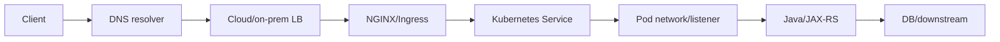
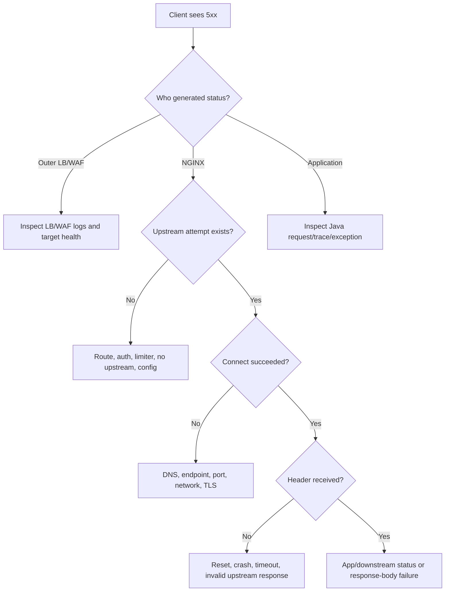
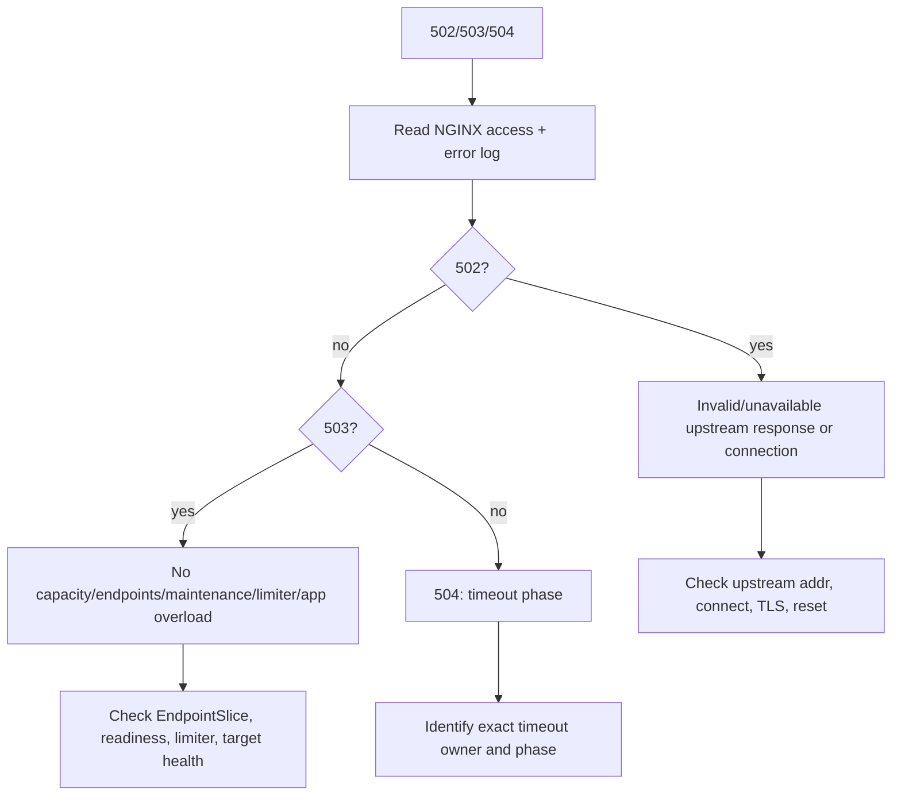
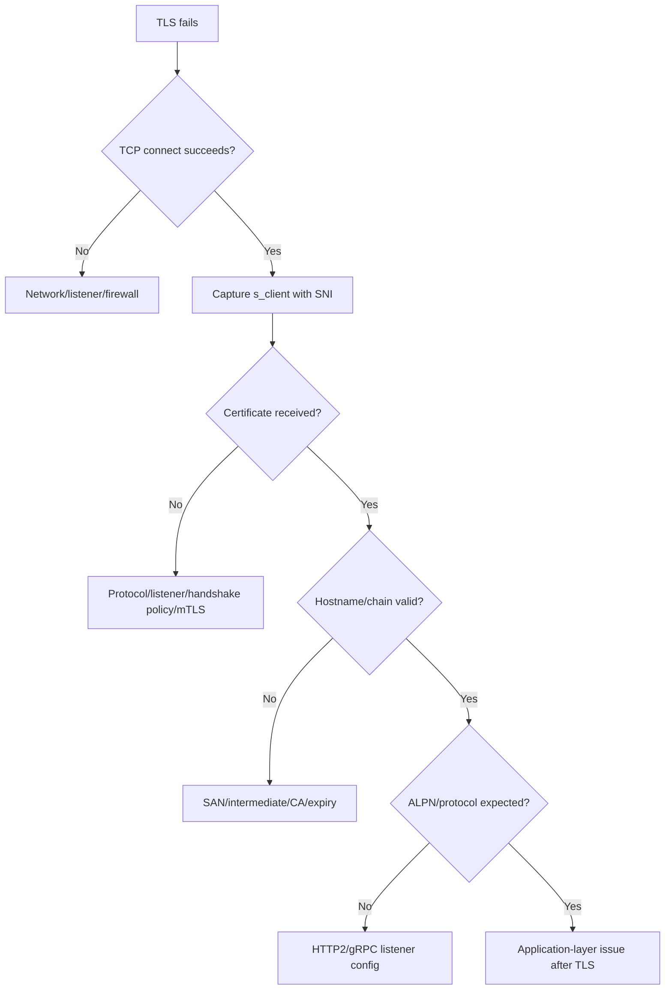

# Part 031 — Debugging NGINX and Ingress Failures Systematically

> **Depth level:** Production/Architecture-level  
> **Prerequisite:** Part 002–030; kemampuan dasar Linux, TCP/IP, HTTP, TLS, DNS, Kubernetes, Java/JAX-RS, logs, metrics, dan distributed-system debugging.  
> **Scope:** diagnostic reasoning, request fingerprint, per-hop isolation, status-code differential diagnosis, TLS, DNS, route, header, body, timeout, reset, WebSocket, SSE, gRPC, Kubernetes Service/EndpointSlice, generated NGINX config, packet capture, Java/JAX-RS evidence, minimal reproduction, evidence package, and debugging safety.  
> **Bukan scope utama:** incident command and organizational response—Part 032; security/compliance evidence review—Part 033; architecture/PR decision framework—Part 034.

---

## Operating premise

Production debugging bukan kompetisi menebak komponen yang “biasanya bermasalah”.

Tujuannya adalah mempersempit ruang kemungkinan dengan evidence:

```text
symptom
→ exact request identity
→ failing population
→ failing hop
→ failure phase
→ concrete mechanism
→ safest corrective action
```

Satu symptom dapat memiliki banyak penyebab:

```text
504
├── upstream benar-benar lambat
├── timeout NGINX terlalu pendek
├── downstream database lambat
├── DNS mengarah ke endpoint lama
├── one ingress replica mempunyai config berbeda
├── connection pool backend habis
├── retry memperbesar load
└── outer load balancer menghasilkan 504, bukan NGINX
```

Sebaliknya, satu mechanism dapat menghasilkan beberapa symptom:

```text
zero ready endpoints
├── 503 pada satu controller
├── 502 pada proxy lain
├── connection refused
├── long timeout kemudian 504
└── intermittent success bila endpoint state tidak konsisten
```

> **Core invariant:** Jangan assign ownership berdasarkan status code saja. Tentukan terlebih dahulu siapa yang menghasilkan status, pada phase apa, dan evidence apa yang membuktikannya.

---

## Daftar isi

1. [Tujuan pembelajaran](#tujuan-pembelajaran)
2. [Debugging invariants](#debugging-invariants)
3. [Model request sebagai chain of contracts](#model-request-sebagai-chain-of-contracts)
4. [Failure phase model](#failure-phase-model)
5. [Binary isolation per hop](#binary-isolation-per-hop)
6. [Golden rules sebelum menyentuh sistem](#golden-rules-sebelum-menyentuh-sistem)
7. [Request fingerprint](#request-fingerprint)
8. [Failing-population analysis](#failing-population-analysis)
9. [Time and clock discipline](#time-and-clock-discipline)
10. [Minimal reproducible request](#minimal-reproducible-request)
11. [Evidence hierarchy](#evidence-hierarchy)
12. [Evidence preservation](#evidence-preservation)
13. [`curl` diagnostic toolkit](#curl-diagnostic-toolkit)
14. [`openssl s_client` toolkit](#openssl-s_client-toolkit)
15. [`dig`, `nslookup`, and resolver testing](#dig-nslookup-and-resolver-testing)
16. [`kubectl` evidence toolkit](#kubectl-evidence-toolkit)
17. [Diagnostic pod and ephemeral container](#diagnostic-pod-and-ephemeral-container)
18. [Generated NGINX configuration](#generated-nginx-configuration)
19. [NGINX debug logging](#nginx-debug-logging)
20. [Packet capture safely](#packet-capture-safely)
21. [Status provenance](#status-provenance)
22. [400 Bad Request](#400-bad-request)
23. [401 Unauthorized](#401-unauthorized)
24. [403 Forbidden](#403-forbidden)
25. [404 Not Found](#404-not-found)
26. [408 Request Timeout](#408-request-timeout)
27. [413 Content Too Large](#413-content-too-large)
28. [414 URI Too Long](#414-uri-too-long)
29. [429 Too Many Requests](#429-too-many-requests)
30. [499 Client Closed Request](#499-client-closed-request)
31. [500 Internal Server Error](#500-internal-server-error)
32. [502 Bad Gateway](#502-bad-gateway)
33. [503 Service Unavailable](#503-service-unavailable)
34. [504 Gateway Timeout](#504-gateway-timeout)
35. [Wrong upstream and wrong route](#wrong-upstream-and-wrong-route)
36. [TLS handshake failures](#tls-handshake-failures)
37. [Upstream TLS failures](#upstream-tls-failures)
38. [DNS failures](#dns-failures)
39. [Kubernetes Service and EndpointSlice failures](#kubernetes-service-and-endpointslice-failures)
40. [Connection refused](#connection-refused)
41. [Connection reset and premature close](#connection-reset-and-premature-close)
42. [Timeout-chain diagnosis](#timeout-chain-diagnosis)
43. [Lost, duplicated, or spoofed headers](#lost-duplicated-or-spoofed-headers)
44. [Body and upload failures](#body-and-upload-failures)
45. [Response buffering and streaming failures](#response-buffering-and-streaming-failures)
46. [WebSocket failures](#websocket-failures)
47. [SSE failures](#sse-failures)
48. [gRPC failures](#grpc-failures)
49. [Compression and cache anomalies](#compression-and-cache-anomalies)
50. [Ingress annotation and ConfigMap conflicts](#ingress-annotation-and-configmap-conflicts)
51. [Multi-replica inconsistency](#multi-replica-inconsistency)
52. [Java/JAX-RS application evidence](#javajax-rs-application-evidence)
53. [Compare healthy versus failing path](#compare-healthy-versus-failing-path)
54. [Decision trees](#decision-trees)
55. [Failure signature table](#failure-signature-table)
56. [Minimal incident evidence package](#minimal-incident-evidence-package)
57. [Unsafe debugging anti-patterns](#unsafe-debugging-anti-patterns)
58. [PR and runbook review checklist](#pr-and-runbook-review-checklist)
59. [Internal verification checklist](#internal-verification-checklist)
60. [Final mental model](#final-mental-model)
61. [Referensi resmi](#referensi-resmi)

---

## Tujuan pembelajaran

Setelah menyelesaikan part ini, Anda harus mampu:

- memulai diagnosis dari exact symptom dan affected population, bukan asumsi komponen;
- mengisolasi failure pada DNS, TCP, TLS, HTTP edge, NGINX route, upstream connection, Kubernetes Service, Pod, atau Java/JAX-RS application;
- menentukan status-code provenance menggunakan headers, body signature, logs, timing, dan request ID;
- membuat request reproducer yang mempertahankan SNI, Host, method, headers, body, dan protocol;
- membandingkan healthy dan failing path dengan satu variable berubah pada satu waktu;
- membaca access/error logs, Kubernetes events, EndpointSlice, generated config, metrics, dan packet metadata sebagai satu evidence graph;
- mendiagnosis 400, 401, 403, 404, 408, 413, 414, 429, 499, 500, 502, 503, dan 504 secara differential;
- mendiagnosis TLS, DNS, resets, timeout chains, WebSocket, SSE, gRPC, upload, cache, dan multi-replica inconsistency;
- membangun evidence package yang cukup untuk handoff ke platform, network, cloud, security, atau application team;
- menghindari tindakan debugging yang menghapus evidence atau menyebabkan incident kedua.

---

## Debugging invariants

### Invariant 1 — exact request matters

Request berikut tidak ekuivalen:

```text
https://api.example.com/orders
https://10.0.1.20/orders dengan Host header
https://service.namespace.svc/orders
http://pod-ip:8080/orders
```

Mereka berbeda pada:

- DNS;
- SNI;
- certificate;
- load balancer;
- forwarded headers;
- path rewrite;
- authentication;
- source identity;
- routing policy;
- protocol version.

### Invariant 2 — test one boundary at a time

Urutan yang baik:

```text
public hostname
→ load-balancer address with original SNI/Host
→ ingress Service
→ ingress Pod
→ backend Service
→ backend Pod
→ local application listener
```

Tetapi setiap bypass mengubah contract. Hasil direct Pod success **tidak membuktikan** production path benar.

### Invariant 3 — compare, do not merely inspect

Evidence lebih kuat bila ada pembanding:

- working host versus failing host;
- working pod versus failing pod;
- old revision versus new revision;
- HTTP/1.1 versus HTTP/2;
- one ingress replica versus another;
- request before and after exact timestamp;
- internal versus external path.

### Invariant 4 — preserve provenance

Selalu pertahankan:

- original hostname;
- SNI;
- Host;
- method;
- query;
- body;
- authorization mode;
- client IP context;
- request ID;
- trace ID;
- timestamp;
- protocol.

### Invariant 5 — absence of application log is evidence, not proof

Tidak ada log Java dapat berarti:

- request tidak sampai;
- logging sampling;
- wrong pod;
- correlation ID berubah;
- log pipeline delay;
- exception sebelum interceptor;
- request dibatalkan sebelum dispatch;
- application log level/filter salah.

### Invariant 6 — retry changes the system

Saat debugging, retry agresif dapat:

- memperbesar overload;
- menghasilkan duplicate side effect;
- mengubah load-balancer selection;
- menutupi intermittent failure;
- memicu rate limiter;
- menghabiskan auth/database pools.

---

## Model request sebagai chain of contracts



Setiap hop mempunyai contract:

| Hop | Contract examples |
|---|---|
| Client→DNS | name, resolver, TTL, search domain |
| Client→LB | IP reachability, port, TLS SNI, ALPN |
| LB→NGINX | target health, source IP, PROXY/XFF, TLS mode |
| NGINX request processing | server selection, location, rewrite, auth, limit |
| NGINX→upstream | DNS/IP, TCP, TLS, Host/SNI, timeout, keepalive |
| Service→Pod | selector, EndpointSlice, port/targetPort, readiness |
| Pod→Java | bind address, containerPort, protocol |
| Java routing | context path, JAX-RS resource, media type, auth |
| Java→dependency | pool, timeout, credentials, network |

Debugging bertujuan menemukan contract pertama yang dilanggar.

---

## Failure phase model

Pisahkan request ke phase:

```text
0. client construction
1. DNS resolution
2. route/network reachability
3. TCP connect
4. downstream TLS handshake
5. HTTP request acceptance/parsing
6. virtual-host selection
7. route/location selection
8. edge auth/rate/security policy
9. request-body receive/buffering
10. upstream selection/DNS
11. upstream TCP connect
12. upstream TLS handshake
13. upstream request write
14. upstream header wait
15. upstream response/body read
16. downstream response write
17. client acknowledgement/close
18. access logging
```

Map evidence ke phase:

| Evidence | Likely phase |
|---|---|
| DNS NXDOMAIN | 1 |
| SYN retransmissions | 2–3 |
| certificate verify error | 4 or 12 |
| NGINX `client sent invalid...` | 5 |
| default server response | 6 |
| wrong backend marker | 7/10 |
| 401 from auth subrequest | 8 |
| 413 before Java log | 9 |
| `connect() failed (111: Connection refused)` | 11 |
| upstream cert verify failed | 12 |
| `upstream timed out ... while reading response header` | 14 |
| partial download/reset | 15–17 |
| access log 499 | 17 |

---

## Binary isolation per hop

### Isolation table

| Test | What it includes | What it bypasses |
|---|---|---|
| Public URL | entire path | nothing |
| LB IP with `--resolve` | LB onward + exact SNI/Host | public DNS |
| Ingress Service ClusterIP | ingress onward | external LB/DNS |
| Ingress Pod IP | one data-plane replica | Service/LB distribution |
| Backend Service DNS | Service + backend | ingress routing/policy |
| Backend Pod IP | one backend | Service distribution |
| `localhost` in backend container | app listener | pod networking |

### Interpretation example

```text
Public URL fails
LB IP + original SNI/Host fails
Ingress Service succeeds
```

Likely boundary:

- external LB target/listener;
- firewall/security group;
- TLS mode;
- source-IP/PROXY mismatch;
- external route.

Another:

```text
Ingress Pod A succeeds
Ingress Pod B fails
```

Likely:

- config generation drift;
- certificate/Secret mount difference;
- stale DNS/upstream state;
- node/network issue;
- image/version difference.

### Caution

Direct tests may require privileged access and can bypass:

- auth;
- WAF;
- rate limit;
- mTLS;
- tenant routing;
- source-IP trust;
- service mesh;
- network policy.

Label results as **boundary test**, not production-equivalent behavior.

---

## Golden rules sebelum menyentuh sistem

1. Capture exact start time and timezone.
2. Record affected tenant, host, path, method, region, and client class.
3. Obtain one request ID/trace ID.
4. Check whether change occurred near symptom start.
5. Snapshot current config/resource/revision.
6. Compare error rate with traffic volume.
7. Preserve logs/events before retention expires.
8. Avoid restart/reload unless it is a deliberate mitigation.
9. Change one variable at a time.
10. Do not test mutating endpoint without idempotency/synthetic data.
11. Do not expose tokens, cookies, private keys, or PII in chat/tickets.
12. Use approved access and packet-capture procedures.

### Why “restart first” is harmful

Restart may:

- erase in-memory evidence;
- rotate logs;
- clear stale DNS/connection state without proving cause;
- move traffic to healthy replica and hide drift;
- terminate client sessions;
- create reconnect storm;
- cause all replicas to reload bad config;
- make RCA speculative.

Restart can be a valid mitigation. It is not a diagnosis.

---

## Request fingerprint

A useful fingerprint:

```yaml
timestampUtc: "2026-07-11T02:14:33.842Z"
requestId: "01J..."
traceId: "..."
client:
  class: "partner-api"
  sourceIpObservedAtEdge: "redacted"
network:
  resolver: "corporate-dns-a"
  resolvedIps:
    - "203.0.113.10"
tls:
  sni: "quote.example.com"
  alpn: "h2"
http:
  version: "2"
  method: "POST"
  authority: "quote.example.com"
  path: "/api/orders"
  queryHash: "..."
  contentType: "application/json"
  contentLength: 834
  authorizationType: "Bearer"
response:
  status: 504
  serverHeader: "nginx"
  responseBytes: 167
  totalSeconds: 30.012
```

Hash/redact sensitive values.

### Stable identity fields

- request ID;
- traceparent;
- client-generated idempotency key;
- tenant ID;
- backend revision;
- ingress pod;
- upstream address;
- config revision.

These allow cross-hop correlation.

---

## Failing-population analysis

Ask:

```text
Who fails?
When?
Where?
Which request class?
How consistently?
What changed?
```

Dimensions:

- all clients or one network;
- one tenant or all tenants;
- one hostname/path/method;
- one region/AZ/node;
- one HTTP version;
- requests with large body;
- only long-running calls;
- one ingress/backend pod;
- authenticated versus unauthenticated;
- cold/new connections versus reused connections;
- after deployment/config/certificate/DNS event.

### Pattern examples

| Pattern | Strong hypotheses |
|---|---|
| Only HTTP/2 fails | ALPN/H2 parser/header-size/proxy path |
| Only one tenant | auth, route, cache key, tenant data |
| Only uploads >10 MiB | body limit/temp disk/timeout |
| Exactly 30 s then 504 | timeout boundary |
| One ingress pod | replica drift/node-local network |
| Only new TLS clients | CA/intermediate/SNI/protocol |
| Intermittent around Endpoint changes | readiness/drain/stale connection |
| Internal succeeds, public fails | external DNS/LB/WAF/firewall |

---

## Time and clock discipline

Distributed evidence is useless if clocks cannot be aligned.

Verify:

- UTC timestamps;
- NTP/clock synchronization;
- timezone of dashboards;
- log ingestion delay;
- metric scrape interval;
- event timestamp precision;
- client clock accuracy;
- cloud audit-log delay.

### Create one timeline

```text
02:14:20 config revision 842 applied
02:14:24 controller replica A reload success
02:14:25 replica B reload failure
02:14:31 502 begins for ~48% traffic
02:15:02 alert fires
```

This is stronger than “errors started after deploy”.

### Timing fields

Use client timing:

```bash
curl -sS -o /dev/null \
  -w 'dns=%{time_namelookup}
connect=%{time_connect}
tls=%{time_appconnect}
pretransfer=%{time_pretransfer}
starttransfer=%{time_starttransfer}
total=%{time_total}
remote_ip=%{remote_ip}
http=%{http_code}
' \
  https://quote.example.com/health
```

Interpretation:

- high `time_namelookup` → resolver;
- high connect delta → TCP/network;
- high TLS delta → handshake;
- high start-transfer after TLS → proxy/upstream/application;
- high total after start-transfer → response body/downstream client.

---

## Minimal reproducible request

A reproducer must be:

- minimal;
- safe;
- deterministic;
- redacted;
- exact enough to preserve failure.

### Template

```bash
curl --verbose \
  --request POST \
  --url 'https://quote.example.com/api/orders?mode=validate' \
  --header 'Content-Type: application/json' \
  --header 'X-Request-ID: debug-20260711-001' \
  --header 'Authorization: Bearer <redacted-test-token>' \
  --data-binary @request-redacted.json \
  --connect-timeout 5 \
  --max-time 40 \
  --output response.bin \
  --dump-header response.headers
```

### Preserve SNI while bypassing DNS

```bash
curl --resolve quote.example.com:443:203.0.113.10 \
  https://quote.example.com/api/orders
```

Do not use:

```bash
curl https://203.0.113.10/api/orders -H 'Host: quote.example.com'
```

This may send SNI as the IP, producing a different TLS path.

### Force protocol

```bash
curl --http1.1 https://quote.example.com/
curl --http2 https://quote.example.com/
```

Compare.

### Connect to alternate target but preserve URL identity

```bash
curl --connect-to quote.example.com:443:10.0.4.20:443 \
  https://quote.example.com/
```

Understand local curl version and option semantics before incident use.

---

## Evidence hierarchy

From strongest to weakest for a concrete request:

1. packet metadata/capture at relevant hop;
2. exact access/error log tied to request ID;
3. trace/span tied to request;
4. generated runtime config;
5. live resource/status/event;
6. metrics over matching interval/labels;
7. source config;
8. deployment history;
9. operator recollection;
10. generic “component looks healthy”.

Source config is not runtime proof.

### Evidence triangulation

For one 502:

```text
client:
  HTTP 502 at 02:14:33, request ID X

ingress access log:
  status=502 upstream=10.2.4.17:8080
  upstream_status=502? or "-"
  connect_time=0.001

ingress error log:
  recv() failed (104: Connection reset by peer)

backend pod:
  terminated at 02:14:33

EndpointSlice:
  endpoint marked terminating at 02:14:32
```

Together they identify a drain/reset race.

---

## Evidence preservation

Capture before mutation:

```bash
kubectl get ingress,svc,endpointslice,pod -A -o yaml > snapshot.yaml
kubectl describe ingress <name> > ingress-describe.txt
kubectl get events -A --sort-by=.metadata.creationTimestamp > events.txt
kubectl logs <controller-pod> --since=30m --timestamps > controller.log
kubectl exec <nginx-pod> -- nginx -T > nginx-effective.conf
```

Also preserve:

- config/Git revision;
- deployment ReplicaSets;
- cloud LB target state;
- DNS answers from affected resolver;
- certificate chain;
- screenshots/exported dashboard data;
- alert payload;
- audit logs;
- client reproducer and result.

### Sensitive evidence

Apply:

- least privilege;
- encryption;
- retention;
- access logging;
- redaction;
- legal/privacy policy;
- secure transfer.

Packet captures and headers may contain credentials or personal data.

---

## `curl` diagnostic toolkit

### Verbose request

```bash
curl -v https://quote.example.com/
```

Shows:

- DNS-selected IP;
- connect;
- TLS basics;
- negotiated HTTP;
- request headers;
- response headers.

Never paste unredacted bearer tokens/cookies.

### Headers and body separately

```bash
curl -sS \
  -D response.headers \
  -o response.body \
  https://quote.example.com/
```

### Timing and selected metadata

```bash
curl -sS -o /dev/null \
  -w @- \
  https://quote.example.com/ <<'EOF'
status=%{http_code}
remote_ip=%{remote_ip}
remote_port=%{remote_port}
local_ip=%{local_ip}
http_version=%{http_version}
dns=%{time_namelookup}
connect=%{time_connect}
tls=%{time_appconnect}
ttfb=%{time_starttransfer}
total=%{time_total}
size_download=%{size_download}
EOF
```

Available variables depend on curl version.

### Trace with timestamps

```bash
curl --trace-ascii curl.trace \
  --trace-time \
  https://quote.example.com/
```

Trace may contain secrets and payload. Store securely and redact.

### TLS controls

```bash
curl --cacert internal-ca.pem https://quote.example.com/
curl --cert client.pem --key client-key.pem https://mtls.example.com/
```

Avoid `-k/--insecure` as a “fix”. It can isolate verification failure but must be labeled explicitly and never become production behavior.

### Test exact Host/path

```bash
curl --resolve quote.example.com:443:10.0.1.20 \
  'https://quote.example.com/api/v1/quotes?x=1'
```

### Test body threshold

```bash
head -c 1048575 /dev/zero | \
  curl -sS -o /dev/null -w '%{http_code}\n' \
  -H 'Content-Type: application/octet-stream' \
  --data-binary @- \
  https://quote.example.com/upload
```

Use non-production/safe endpoint and bounded sizes.

### Test redirects without hiding hops

Do not start with `-L`. First inspect exact redirect:

```bash
curl -sS -D - -o /dev/null https://quote.example.com/
```

Then follow with:

```bash
curl -L --max-redirs 5 -v https://quote.example.com/
```

---

## `openssl s_client` toolkit

### Downstream TLS

```bash
openssl s_client \
  -connect quote.example.com:443 \
  -servername quote.example.com \
  -showcerts \
  -verify_return_error </dev/null
```

Inspect:

- certificate subject/SAN;
- issuer/chain;
- verify result;
- protocol/cipher;
- SNI-selected certificate;
- expiry.

### Force ALPN

```bash
openssl s_client \
  -connect quote.example.com:443 \
  -servername quote.example.com \
  -alpn h2,http/1.1 </dev/null
```

### Direct IP with original SNI

```bash
openssl s_client \
  -connect 203.0.113.10:443 \
  -servername quote.example.com \
  -showcerts </dev/null
```

### mTLS

```bash
openssl s_client \
  -connect mtls.example.com:443 \
  -servername mtls.example.com \
  -cert client.pem \
  -key client-key.pem \
  -CAfile trusted-ca.pem \
  -verify_return_error </dev/null
```

### Certificate dates

```bash
openssl s_client \
  -connect quote.example.com:443 \
  -servername quote.example.com \
  </dev/null 2>/dev/null |
openssl x509 -noout -subject -issuer -dates -ext subjectAltName
```

### Caveats

- `s_client` is a diagnostic client, not full application behavior;
- server may require HTTP request after handshake;
- intermediate-chain behavior can differ by client trust store;
- session resumption may hide certificate change;
- proxy/LB path must be preserved.

---

## `dig`, `nslookup`, and resolver testing

### Query default resolver

```bash
dig quote.example.com A
dig quote.example.com AAAA
```

### Query specific resolver

```bash
dig @10.0.0.53 quote.example.com A
```

### Short answer

```bash
dig +short quote.example.com
```

### Inspect CNAME/TTL

```bash
dig quote.example.com A +noall +answer
```

### Compare internal and public resolvers

```bash
dig @<corporate-resolver> quote.example.com
dig @<public-resolver> quote.example.com
```

Only query resolvers allowed by policy.

### Kubernetes context

```bash
kubectl exec <diagnostic-pod> -- \
  cat /etc/resolv.conf

kubectl exec <diagnostic-pod> -- \
  nslookup quote-api.quote.svc.cluster.local
```

Check:

- search domains;
- `ndots`;
- nameserver;
- A/AAAA;
- short-name namespace;
- response TTL;
- split horizon.

### DNS diagnosis questions

- which resolver answered?
- was answer cached?
- did affected client receive same IP?
- A and AAAA both present?
- stale CNAME?
- private/public zone conflict?
- NGINX resolved at startup or dynamically?
- JVM caches DNS differently?
- existing keepalive connection still targets old IP?

---

## `kubectl` evidence toolkit

### Workload and revision

```bash
kubectl get deploy,rs,pod -n ingress -o wide
kubectl rollout status deploy/nginx-controller -n ingress
kubectl describe deploy/nginx-controller -n ingress
```

### Ingress/routes

```bash
kubectl get ingress -A
kubectl describe ingress quote-api -n quote
kubectl get ingress quote-api -n quote -o yaml
```

For Gateway API/controller CRDs, inspect relevant resources and status conditions.

### Service and EndpointSlice

```bash
kubectl get svc quote-api -n quote -o yaml
kubectl get endpointslice \
  -n quote \
  -l kubernetes.io/service-name=quote-api \
  -o yaml
```

Check:

- selector;
- port/name;
- `targetPort`;
- addresses;
- ready/serving/terminating;
- topology/node/zone;
- duplicates/stale endpoints.

### Events

```bash
kubectl events -n quote --for ingress/quote-api
kubectl get events -n quote --sort-by=.metadata.creationTimestamp
```

Events have retention limitations. Capture promptly.

### Logs

```bash
kubectl logs -n ingress deploy/nginx-controller \
  --since=30m \
  --timestamps

kubectl logs -n quote pod/quote-api-abc \
  --previous \
  --timestamps
```

Use exact pod/container where needed.

### Exec cautiously

```bash
kubectl exec -n quote <pod> -- \
  sh -c 'ss -lntp || netstat -lntp'
```

Hardened images may have no shell/tool. Do not modify production image for debugging.

### Port-forward

```bash
kubectl port-forward -n quote svc/quote-api 18080:8080
curl http://127.0.0.1:18080/health
```

Port-forward changes path and identity. Use as local boundary test only.

---

## Diagnostic pod and ephemeral container

### Dedicated diagnostic pod

Use approved image containing:

- curl;
- dig/nslookup;
- openssl;
- grpcurl if approved;
- tcpdump only when necessary and privileged appropriately;
- no untrusted extra tooling.

Run in the same:

- namespace;
- node/zone when relevant;
- network policy identity;
- service account only if needed.

Example conceptual:

```bash
kubectl run net-debug \
  --rm -it \
  --restart=Never \
  --image=<approved-diagnostic-image> \
  -- sh
```

### Ephemeral container

Useful when target container lacks tools or process namespace access is required.

Risks:

- authorization;
- privileged capabilities;
- image provenance;
- sensitive filesystem/process visibility;
- audit requirements.

Use the official supported mechanism and internal procedure. Do not improvise privileged Pods during incident without authorization.

---

## Generated NGINX configuration

Ingress YAML is input. Generated config is runtime intent.

Inspect:

```bash
kubectl exec -n ingress <controller-pod> -- nginx -T
```

Look for:

- expected `server_name`;
- listen/TLS;
- location order;
- rewrite;
- `proxy_pass`/`grpc_pass`;
- upstream addresses;
- header setting;
- timeout/body limit;
- buffering;
- auth subrequest;
- rate-limit zones;
- certificate paths;
- default server.

### Compare replicas

```bash
for pod in $(kubectl get pods -n ingress -l app=nginx -o name); do
  echo "### $pod"
  kubectl exec -n ingress "$pod" -- nginx -T 2>/dev/null |
    sha256sum
done
```

Normalize controller-specific dynamic sections if required.

### Config not available through `nginx -T`

Some products/controllers abstract or restrict config. Use:

- supported debug endpoint;
- controller logs;
- status resource;
- config dump command;
- support bundle;
- product-specific tooling.

---

## NGINX debug logging

Debug log can provide low-level request-processing evidence, but:

- NGINX must be built with debug support;
- output volume is high;
- sensitive data may appear;
- performance/storage impact can be material.

Prefer scoped debugging with `debug_connection` for selected source/network when supported.

Conceptual:

```nginx
events {
    debug_connection 192.0.2.10;
}

error_log /var/log/nginx/error.log debug;
```

### Safety

- validate exact build capability;
- enable for smallest scope;
- define start/end time;
- monitor log volume;
- secure logs;
- remove after investigation;
- record config revision.

Do not enable global debug logging across high-traffic shared ingress casually.

---

## Packet capture safely

Packet capture is last-resort evidence when logs/metrics cannot distinguish:

- SYN/no SYN;
- reset source;
- TLS alert direction;
- retransmission;
- MTU issue;
- connection close timing;
- whether bytes reached a hop.

### Capture minimal metadata

```bash
tcpdump -i any \
  -nn \
  -s 128 \
  -w incident.pcap \
  'host 10.2.4.17 and port 8080'
```

Use:

- narrow host/port/time;
- smallest useful snap length;
- rotation/size limit;
- encrypted storage;
- approved retention;
- restricted access.

### Text view for handshake metadata

```bash
tcpdump -i any -nn \
  'host 10.2.4.17 and tcp port 8080'
```

### Interpretation basics

- repeated SYN, no SYN-ACK → network/drop/listener;
- SYN-RST → active refusal/no listener/policy;
- established then RST → process/proxy/kernel close;
- retransmissions → loss/congestion/MTU;
- FIN orderly close;
- TLS alert record → handshake/verification/protocol failure.

### Kubernetes placement

Capture may be required:

- client node;
- LB appliance;
- ingress pod/node;
- backend pod/node.

Pod IP and network namespace matter. A host capture may see encapsulated/translated traffic depending on CNI.

### Privacy

TLS hides payload after handshake, but metadata remains sensitive. Plain HTTP capture can expose full credentials/body. Never capture broad production traffic without approval.

---

## Status provenance

A status may come from:

- cloud LB;
- WAF/API gateway;
- NGINX core;
- NGINX module/auth/limiter;
- ingress controller default backend;
- upstream proxy;
- Java/JAX-RS service;
- downstream service surfaced by application.

### Provenance indicators

- `Server` header;
- response body template;
- custom error page;
- access log at each hop;
- upstream status fields;
- `Via`/gateway headers;
- request ID format;
- timing;
- whether Java logs request;
- whether NGINX `upstream_status` is set.

### Recommended access fields

```text
status
upstream_status
request_time
upstream_connect_time
upstream_header_time
upstream_response_time
upstream_addr
server_name
host
request_id
ingress_pod
config_revision
```

Interpret multiple upstream attempts carefully; fields can contain comma/colon-separated sequences depending on variable.

---

## 400 Bad Request

### Common mechanisms

- malformed request line/header;
- invalid header name/value;
- header too large;
- invalid Host;
- TLS traffic sent to plain HTTP port;
- plain HTTP sent to TLS port;
- invalid chunked framing;
- conflicting `Content-Length`;
- client certificate/request issue;
- upstream/app validation also returns 400;
- strict parser disagreement between proxies.

### Differential diagnosis

| Evidence | Hypothesis |
|---|---|
| no application log, NGINX error parser message | edge parsing |
| only large cookies fail | header buffer/limit |
| binary/TLS bytes in HTTP error log | protocol/port mismatch |
| Java returns structured validation JSON | application 400 |
| only one proxy path fails | parser normalization difference |
| HTTP/1.1 fails, HTTP/2 succeeds | request-line/header/framing difference |

### Checks

```bash
curl -v --http1.1 https://host/path
curl -v --http2 https://host/path
```

Inspect:

- exact URL encoding;
- Host;
- duplicate headers;
- cookies;
- content length;
- proxy chain;
- NGINX error log.

### Common misdiagnosis

“Ingress route broken” when request never passed parser.

---

## 401 Unauthorized

### Common mechanisms

- missing/expired bearer token;
- wrong issuer/audience/signature;
- OIDC session/cookie invalid;
- external auth subrequest returns 401;
- mTLS identity missing then mapped to 401;
- app security filter returns 401;
- Authorization header stripped;
- clock skew;
- JWKS/key rotation/cache issue.

### Distinguish edge versus app

- auth subrequest log/status;
- `WWW-Authenticate`;
- app access/security log;
- identity headers at upstream;
- trace spans;
- response body signature.

### Checks

- token expiry/not-before with UTC clock;
- issuer/audience;
- SNI/host callback;
- cookie Domain/Path/SameSite/Secure;
- header forwarding;
- external auth availability;
- direct backend test only with safe internal auth context.

### Security rule

Do not paste token into incident channel. Record token metadata/hash, not credential.

---

## 403 Forbidden

### Common mechanisms

- authenticated but unauthorized;
- IP allow/deny;
- WAF rule;
- method restriction;
- mTLS subject/policy;
- Kubernetes/edge external auth returns 403;
- application domain authorization;
- filesystem permission/static content;
- CORS browser behavior may appear as blocked but not necessarily HTTP 403.

### Differential

| Signal | Likely owner |
|---|---|
| WAF rule ID | WAF |
| NGINX `access forbidden by rule` | NGINX ACL |
| auth subrequest 403 | auth service |
| Java authorization exception | application |
| only one source network | IP allowlist/source-IP attribution |
| wrong client IP after LB change | real-IP trust/proxy protocol |

### Common trap

Widening allowlist before proving observed client IP.

---

## 404 Not Found

### Possible provenance

- default server;
- no matching Ingress host/path;
- wrong location;
- rewrite produces wrong URI;
- wrong backend;
- application resource not found;
- application returns domain entity not found;
- stale route on one replica;
- DNS points to different ingress.

### Diagnostic sequence

1. inspect response signature;
2. confirm Host/SNI;
3. inspect Ingress/status;
4. inspect generated `server`/`location`;
5. inspect upstream/backend marker;
6. compare direct backend with rewritten path;
7. check trailing slash and case;
8. compare all ingress replicas.

### Route marker

In controlled environments, expose safe response header:

```text
X-Route-ID: quote-api-v2
X-Backend-Revision: 842
```

Do not expose sensitive topology externally without review.

---

## 408 Request Timeout

### Mechanisms

- client header timeout;
- client body timeout;
- application/gateway generated 408;
- outer proxy times out request receive;
- slow upload/slowloris-like behavior;
- network stall.

NGINX timeouts often measure inactivity between operations, not total request lifetime.

### Evidence

- error log phase: reading client request headers/body;
- zero application log;
- request bytes;
- client upload timing;
- edge versus app response template.

### Check alignment

- client timeout;
- outer LB request timeout;
- `client_header_timeout`;
- `client_body_timeout`;
- WAF;
- upload speed/body size.

---

## 413 Content Too Large

### Mechanisms

- NGINX `client_max_body_size`;
- Ingress annotation/global ConfigMap;
- cloud/API gateway limit;
- WAF body inspection limit;
- Java multipart/request limit;
- downstream storage/API limit.

### Isolation

Test increasing known-safe sizes against a non-mutating endpoint.

Check:

- response provenance;
- whether Java receives request;
- Ingress effective config;
- Content-Length versus chunked;
- compressed request behavior;
- multipart overhead.

### Common trap

Increasing NGINX limit while:

- Java limit remains lower;
- temp disk insufficient;
- WAF cannot inspect body;
- database/document service cannot accept payload;
- security policy forbids it.

---

## 414 URI Too Long

### Causes

- oversized query string;
- token/data placed in URL;
- redirect loop appending parameters;
- proxy rewrite duplication;
- long cookie accidentally copied to query;
- request-line/header buffer limit.

### Corrective direction

Do not simply increase limits until asking why data is in URI.

Security concerns:

- URL logged in access logs;
- browser history;
- referrer leakage;
- cache keys;
- intermediaries.

---

## 429 Too Many Requests

### Possible generators

- NGINX `limit_req`;
- connection limiter with custom status;
- WAF/bot service;
- API gateway quota;
- external auth;
- Java/Redis distributed rate limiter;
- downstream surfaced by app.

### Evidence

- limiter variables/log;
- `Retry-After`;
- key/cohort;
- candidate/stable request rate;
- source IP after NAT;
- zone/controller replica;
- burst behavior.

### Questions

- per-IP, user, tenant, token, route, or global?
- local per replica or distributed?
- rate or concurrency?
- legitimate retry storm?
- NAT groups many users?
- HPA/replica count changed effective capacity?
- clock/window semantics?

### Do not

Disable limiter globally before checking whether it is preventing overload.

---

## 499 Client Closed Request

`499` is commonly logged by NGINX when the client closes the connection before NGINX can complete the response. It is not a standard HTTP status sent to the client.

### Potential causes

- client timeout shorter than server path;
- user/navigation cancellation;
- mobile/network interruption;
- outer proxy closes;
- Java caller cancels;
- deployment/drain/reset;
- hedged request cancels loser;
- monitoring probe timeout;
- slow upstream.

### Interpretation

499 is often a **symptom of latency elsewhere**, not “bad client”.

Compare:

```text
request_time
upstream_response_time
client timeout
outer proxy timeout
application latency
```

If 499 at exactly 10 s and client timeout is 10 s, that is strong evidence.

### Side-effect warning

Client cancellation does not prove backend mutation stopped. A POST may complete after client closed unless cancellation propagates and application honors it. Use idempotency.

---

## 500 Internal Server Error

### Possible generators

- NGINX internal/config/module error;
- Lua/njs/custom module;
- auth subrequest unexpected status;
- error-page recursion;
- Java unhandled exception;
- downstream exception mapped to 500;
- invalid response/header processing.

### Diagnosis

- NGINX error log;
- `upstream_status`;
- Java stack trace/request ID;
- route-specific behavior;
- revision correlation;
- response body signature.

### Common trap

Assuming every 500 belongs to Java because NGINX proxies Java.

---

## 502 Bad Gateway

### Core meaning

A gateway/proxy could not obtain a valid upstream response.

### Common mechanisms

- connection refused;
- connection reset;
- upstream closed prematurely;
- no listener/wrong port;
- HTTP sent to HTTPS upstream or vice versa;
- upstream TLS handshake/verify failure;
- invalid upstream response headers;
- DNS resolves wrong IP;
- stale keepalive socket;
- pod terminated during request;
- response headers too large in some configurations/products;
- one upstream proxy returns 502.

### Error-log signatures

Examples conceptually:

```text
connect() failed (...) while connecting to upstream
upstream prematurely closed connection
recv() failed (...) while reading response header from upstream
SSL_do_handshake() failed
no live upstreams
```

### Decision

```text
upstream_connect_time = "-"
→ selection/DNS/config before connect

connect_time very small + refused
→ endpoint reachable but no listener/wrong port/terminating

connect succeeds + reset
→ upstream process/pod/protocol/drain

TLS handshake error
→ upstream TLS/SNI/trust/protocol

only one ingress replica
→ stale connection/config/node issue
```

---

## 503 Service Unavailable

### Possible generators

- no available upstream;
- zero ready endpoints;
- rate limiter default/custom behavior;
- maintenance mode;
- auth/dependency unavailable;
- Java overload/circuit breaker;
- Kubernetes default backend;
- load balancer no healthy target.

### Evidence

- EndpointSlice count;
- controller events;
- `upstream_status`;
- limiter logs;
- readiness state;
- Java bulkhead/queue;
- LB target health.

### Important distinction

```text
no endpoint exists
≠ endpoint exists but refuses
≠ endpoint overloaded and returns 503
```

Each requires different action.

---

## 504 Gateway Timeout

### Mechanisms

- upstream connect timeout;
- upstream response-header/read inactivity timeout;
- outer LB timeout;
- application gateway timeout;
- Java downstream timeout surfaced;
- database/downstream stall;
- response streaming heartbeat absent;
- queue saturation.

### Exact-boundary clue

If failures cluster at exactly:

- 30 s;
- 60 s;
- 120 s;

find which layer owns that value.

### Evidence fields

- request time;
- upstream connect time;
- upstream header time;
- upstream response time;
- Java duration;
- downstream client duration;
- retry attempts.

### Common trap

Increasing proxy timeout when capacity is exhausted. Longer timeout increases concurrency:

```text
concurrency ≈ arrival_rate × latency
```

This can worsen collapse.

---

## Wrong upstream and wrong route

### Symptoms

- valid response from wrong service;
- wrong tenant data;
- unexpected 404/schema;
- old revision;
- redirect to wrong host;
- intermittent behavior.

### Causes

- overlapping locations;
- regex precedence;
- rewrite/trailing slash;
- Service selector;
- wrong `targetPort`;
- duplicate Ingress host/path;
- route merge conflict;
- stale generated config;
- DNS split horizon;
- canary/sticky cookie;
- cache key collision.

### Debug method

1. add/inspect safe route/backend markers;
2. inspect generated config;
3. enumerate all resources claiming host/path;
4. query each ingress replica;
5. inspect Service/EndpointSlice;
6. compare request path before/after rewrite;
7. disable cache only in controlled test;
8. inspect canary/session markers.

### Severity

Wrong-tenant or wrong-service routing may be a security incident, not only availability incident.

---

## TLS handshake failures

### Downstream TLS phases

```text
TCP connect
→ ClientHello/SNI/ALPN
→ server certificate
→ optional client certificate request
→ key exchange/verification
→ application protocol
```

### Common failures

- wrong SNI certificate;
- expired/not-yet-valid cert;
- missing intermediate;
- untrusted CA;
- hostname mismatch;
- protocol/cipher mismatch;
- ALPN mismatch;
- client certificate absent/invalid;
- private key mismatch;
- listener is plain HTTP;
- TLS passthrough/termination mismatch.

### Diagnostic matrix

| Test | Purpose |
|---|---|
| `openssl s_client -servername` | SNI/chain/protocol |
| `curl --resolve` | exact HTTP over chosen IP |
| compare all LB IPs | replica/target certificate drift |
| fresh process/no session cache | observe current cert |
| client trust-store test | application-specific trust |

### Evidence

- TLS alert;
- LB/controller logs;
- handshake-error metric;
- certificate serial;
- selected ingress pod;
- SNI;
- ALPN.

---

## Upstream TLS failures

NGINX→Java/upstream TLS differs from client→NGINX TLS.

Check:

- `proxy_pass https://...` / `grpc_pass grpcs://...`;
- upstream SNI setting;
- verification enabled;
- trusted CA bundle;
- certificate name;
- client certificate/key for mTLS;
- protocol/cipher;
- Java listener mode;
- service DNS versus certificate SAN.

### Common mistake

Connecting to Kubernetes Service name while upstream certificate SAN contains another internal hostname, without correct SNI/name verification configuration.

### Direct test from NGINX network context

```bash
openssl s_client \
  -connect quote-api.quote.svc.cluster.local:8443 \
  -servername quote-api.internal.example \
  -CAfile /path/to/ca.pem \
  -verify_return_error </dev/null
```

Use an approved diagnostic environment with same DNS/network/trust files.

---

## DNS failures

### Failure classes

- NXDOMAIN;
- SERVFAIL;
- timeout;
- stale A/AAAA;
- wrong private/public answer;
- resolver unreachable;
- search-domain expansion;
- negative cache;
- CNAME chain issue;
- NGINX startup resolution stale;
- dynamic resolver not configured;
- existing connection still old target.

### Evidence

- answer from exact resolver;
- TTL;
- CoreDNS logs/metrics;
- NGINX error;
- pod `/etc/resolv.conf`;
- source/destination IP from access log;
- JVM DNS cache;
- EndpointSlice versus DNS answer.

### “DNS is fine” is insufficient

A successful query from laptop does not prove:

- pod resolver;
- NGINX resolver;
- corporate resolver;
- client resolver;
- cached answer;
- same view.

---

## Kubernetes Service and EndpointSlice failures

### Validate chain

```text
Ingress backend reference
→ Service namespace/name/port
→ Service selector
→ EndpointSlice addresses
→ readiness/serving/terminating
→ Pod IP
→ container listener
```

### Common failures

- Service port name mismatch;
- wrong `targetPort`;
- selector matches old/new pods unexpectedly;
- zero ready endpoints;
- pod ready but listener absent;
- readiness port/path wrong;
- EndpointSlice stale/terminating;
- NetworkPolicy;
- CNI/node issue;
- topology constraint;
- dual-stack mismatch.

### Commands

```bash
kubectl get svc <svc> -o yaml
kubectl get endpointslice -l kubernetes.io/service-name=<svc> -o yaml
kubectl get pod -l <selector> -o wide --show-labels
kubectl describe pod <pod>
```

### Direct endpoint test

Test each endpoint from same network context:

```bash
for ip in 10.2.1.10 10.2.2.11; do
  curl -sS -o /dev/null -w "$ip %{http_code} %{time_total}\n" \
    "http://$ip:8080/health"
done
```

Do not use mutation endpoints.

---

## Connection refused

TCP RST/refusal usually means:

- no listener;
- wrong port;
- process not ready;
- pod terminating;
- listener bound only to localhost;
- HTTP/TLS port mismatch can also produce later failure;
- active reject policy.

Check:

```bash
ss -lntp
```

inside appropriate namespace/container if possible.

Kubernetes examples:

- Service `targetPort: 8080`, app listens `8443`;
- Java binds `127.0.0.1`;
- readiness checks one port, proxy uses another;
- stale endpoint remains during termination.

Connection refusal is different from timeout/drop:

```text
refused = target/network stack actively rejected
timeout = no timely response, often drop/path/listener ambiguity
```

---

## Connection reset and premature close

Reset can originate from:

- client;
- outer LB;
- NGINX;
- backend kernel/process;
- Java process crash/OOM;
- pod termination;
- protocol mismatch;
- idle timeout;
- max connection age;
- security device;
- upstream keepalive reuse of closed socket.

### Correlate direction

- packet capture;
- NGINX error phase;
- pod termination timestamp;
- LB logs;
- Java shutdown/crash;
- connection age;
- deployment event.

### `upstream prematurely closed connection`

Possible:

- backend exited;
- backend intentionally closed before complete headers/body;
- invalid framing;
- timeout/cancellation;
- resource exhaustion;
- process crash.

It does not identify root cause by itself.

---

## Timeout-chain diagnosis

Build table:

| Layer | Connect | Header/read idle | Total/deadline | Retry |
|---|---:|---:|---:|---|
| Client | 5 s | — | 30 s | 0/1 |
| CDN/LB | — | 60 s | 60 s | product-specific |
| NGINX | 3 s | 25 s | none by default | configured |
| Java inbound | — | container-specific | app deadline | none |
| Java→DB | 2 s | 10 s | 10 s | 0 |
| Java→service | 2 s | 8 s | 10 s | 2 |

### Desired ordering

Outer timeout usually should exceed inner failure budget enough to allow:

- error mapping;
- response propagation;
- cleanup.

But retries complicate:

```text
total ≈ attempts × per-attempt budget + backoff
```

### Diagnose exact phase

NGINX error message often indicates:

- connecting to upstream;
- sending request;
- reading response header;
- reading response body.

Combine with timing fields.

### Client cancellation

When outer client times out first:

- NGINX may log 499;
- Java may continue;
- database mutation may commit;
- retry may duplicate.

This is a correctness issue.

---

## Lost, duplicated, or spoofed headers

### Critical headers

- Host/`:authority`;
- `Forwarded`;
- `X-Forwarded-For`;
- `X-Forwarded-Proto`;
- `X-Forwarded-Host`;
- request/correlation ID;
- traceparent/tracestate;
- Authorization;
- identity headers;
- Content-Type;
- Content-Length;
- Upgrade/Connection;
- gRPC metadata.

### Debug strategy

1. capture at trusted edge;
2. log allowlisted header fingerprints;
3. inspect generated config;
4. use controlled echo backend in non-prod;
5. inspect Java request headers;
6. verify each proxy overwrites trusted identity headers;
7. compare HTTP/1.1 and HTTP/2 authority behavior.

### Avoid

Logging all headers in production. It leaks credentials/PII.

### Duplicate header pitfalls

- multiple `X-Forwarded-For`;
- comma parsing differences;
- duplicate Authorization;
- conflicting Content-Length;
- Host/absolute-form disagreement;
- response security header duplicated with different values.

---

## Body and upload failures

### Failure points

- client upload;
- LB/WAF body limit;
- NGINX request buffer;
- temp disk;
- body timeout;
- multipart parser;
- Java heap/disk;
- virus scanner;
- object storage;
- downstream limit.

### Evidence

- bytes received/sent;
- Content-Length;
- temp-file/disk metrics;
- 413 provenance;
- request-body timeout;
- Java multipart exception;
- pod ephemeral storage;
- ingress buffering config.

### Boundary tests

- small body succeeds, large fails;
- fixed `Content-Length` versus chunked;
- slow upload;
- multipart versus raw;
- one ingress pod/node;
- direct object-storage path.

### Security

Use synthetic payload. Do not reproduce with customer document unless approved.

---

## Response buffering and streaming failures

### Symptoms

- response arrives only at end;
- SSE batches;
- high TTFB;
- temp disk growth;
- memory pressure;
- partial response;
- client timeout despite backend producing data.

### Checks

- `proxy_buffering`;
- `X-Accel-Buffering`;
- compression;
- outer LB/CDN buffering;
- application flush;
- Java writer/output stream;
- heartbeat;
- downstream client read behavior.

### Test

```bash
curl -N -v https://quote.example.com/events
```

`-N` disables curl output buffering; it does not disable proxy buffering.

Use timestamps in event stream to distinguish production from client display buffering.

---

## WebSocket failures

### Failure phases

1. TLS/HTTP request;
2. upgrade request;
3. `101 Switching Protocols`;
4. tunnel;
5. idle/heartbeat;
6. close/reconnect.

### Common failures

- missing `Upgrade`/`Connection`;
- HTTP version handling;
- route/auth rejects;
- LB does not support/path not configured;
- idle timeout;
- no heartbeat;
- sticky/session state;
- pod drain;
- message-size limit;
- origin policy;
- one-way proxy buffering/close.

### Evidence

- handshake status;
- response headers;
- close code/reason;
- ingress log duration;
- active-connection metrics;
- pod deletion/rollout;
- LB timeout.

### Test

Use approved WebSocket client. `curl` can inspect handshake but is not a complete WebSocket diagnostic tool.

---

## SSE failures

### Symptoms

- delayed/batched events;
- disconnect at fixed interval;
- duplicates after reconnect;
- missing replay;
- connection never established;
- content transformed/compressed unexpectedly.

### Check

- `Content-Type: text/event-stream`;
- response buffering;
- app flush;
- `X-Accel-Buffering`;
- heartbeat interval;
- proxy/LB idle timeout;
- client `Last-Event-ID`;
- event retention;
- pod drain.

### Differentiate

```text
no bytes from backend
vs bytes from backend but buffered at NGINX
vs bytes leave NGINX but client buffers/disconnects
```

Packet timing or per-hop test may be required.

---

## gRPC failures

gRPC success/failure is not captured by HTTP status alone.

Inspect:

- HTTP/2 negotiation/ALPN;
- `content-type: application/grpc`;
- gRPC trailers;
- `grpc-status`;
- `grpc-message`;
- deadline;
- stream reset;
- GOAWAY;
- backend protocol annotation;
- h2 versus h2c;
- upstream TLS/SNI;
- metadata size.

### Tools

Use approved `grpcurl`:

```bash
grpcurl \
  -authority quote.example.com \
  quote.example.com:443 \
  list
```

For reflection-disabled production, use proto descriptors and authorized method.

### Common symptoms

| Symptom | Hypothesis |
|---|---|
| HTTP 415/404 | routed as ordinary HTTP/wrong path |
| `UNAVAILABLE` | connection/upstream/LB/reset |
| `DEADLINE_EXCEEDED` | deadline/latency |
| HTTP 200 + grpc non-zero | app/protocol failure |
| only streaming fails | timeout/buffering/drain/H2 connection |
| no ALPN h2 | TLS/listener config |

---

## Compression and cache anomalies

### Symptoms

- corrupted body;
- wrong encoding;
- stale response;
- wrong tenant/user content;
- missing headers;
- 304 unexpected;
- cache hit despite auth;
- cache miss storm.

### Checks

- `Accept-Encoding`;
- `Content-Encoding`;
- `Vary`;
- cache key;
- cache status;
- cookies/auth;
- query normalization;
- ETag;
- cache bypass/no-cache;
- multiple replicas/local caches;
- CDN layer.

### Diagnostic request

```bash
curl -sS -D - \
  -H 'Accept-Encoding: identity' \
  https://quote.example.com/resource \
  -o /dev/null
```

Compare gzip and identity.

### Security severity

Cross-tenant cached content is a potential data breach. Stop cache exposure and escalate security handling.

---

## Ingress annotation and ConfigMap conflicts

### Symptoms

- annotation appears ignored;
- one environment differs;
- controller rejects resource;
- global value overrides expectation;
- route disappears after unrelated change.

### Steps

1. identify exact controller/product/version;
2. inspect Ingress annotations;
3. inspect global ConfigMap/controller flags/Helm values;
4. inspect admission events/status;
5. inspect generated config;
6. compare controller docs/version;
7. inspect raw snippets/policies;
8. check multiple controllers/classes.

### Common causes

- wrong annotation prefix;
- invalid units/string;
- unsupported version;
- disabled annotation;
- risk policy rejects;
- different IngressClass;
- duplicate resource conflict;
- config reload failed;
- controller does not watch namespace/resource.

---

## Multi-replica inconsistency

### Symptoms

- intermittent response;
- ~1/N traffic failure;
- different certificate;
- old/new route;
- one source IP behavior;
- one node/AZ only.

### Investigation

```bash
kubectl get pods -n ingress -o wide
```

Direct each replica safely where possible:

- Pod IP from diagnostic pod;
- node/host port;
- separate port-forward;
- load-balancer target-specific test.

Compare:

- image digest;
- args/env;
- mounted Secret/ConfigMap resource version;
- generated config hash;
- reload timestamp;
- DNS answer;
- node networking;
- clock;
- certificates;
- open sockets.

### Do not immediately delete bad replica

First preserve:

- logs;
- config;
- mounts;
- process status;
- network evidence;
- node conditions.

Then mitigate if impact requires.

---

## Java/JAX-RS application evidence

### Request entry

Log/trace:

- request ID;
- trace ID;
- method/path;
- sanitized tenant/principal;
- received forwarded scheme/host;
- application revision;
- pod;
- start/end;
- status;
- exception class;
- cancellation.

### JAX-RS routing

Check:

- application/base path;
- `@Path`;
- trailing slash;
- content negotiation;
- providers/filters;
- exception mappers;
- context path;
- generated URI using `UriInfo`;
- forwarded-header handling by container/framework.

### Capacity

Inspect:

- request thread/executor saturation;
- async executor;
- connection pools;
- DB pool;
- GC pause;
- heap/native memory;
- CPU throttling;
- queue length;
- downstream retry;
- circuit breaker.

### Cancellation

When NGINX/client closes:

- does servlet/JAX-RS runtime notify?
- does application stop work?
- does DB query cancel?
- can transaction still commit?
- is idempotency enforced?

### Structured exception

A Java stack trace at same request ID is strong evidence, but still ask why system allowed it to become customer-visible rather than handled/degraded.

---

## Compare healthy versus failing path

Create differential table:

| Dimension | Healthy | Failing |
|---|---|---|
| Client network | office A | office B |
| Resolved IP | `203.0.113.10` | `203.0.113.11` |
| TLS cert serial | X | Y |
| HTTP | 2 | 2 |
| Ingress pod | A | B |
| Config hash | H1 | H2 |
| Upstream | `10.2.1.5` | `10.2.2.8` |
| Backend revision | 842 | 842 |
| Status | 200 | 502 |
| Error log | none | reset |
| Node | node-a | node-b |

Then find earliest divergence.

### One-variable rule

If testing:

- same request, change IP;
- same IP, change Host;
- same Host, change protocol;
- same ingress, change backend endpoint.

Avoid changing five things and concluding one caused success.

---

## Decision trees

### Generic 5xx



### 502/503/504



### TLS



---

## Failure signature table

| Signature | Likely mechanism | Verify next |
|---|---|---|
| exactly 30.0 s then 504 | configured timeout | timeout inventory + error phase |
| ~50% intermittent | one of two replicas/targets | per-replica test/config hash |
| no Java log, 413 | edge/body limit | generated config + upstream log |
| 499 at client timeout boundary | client/outer cancellation | client timeout + request duration |
| connect refused immediately | no listener/wrong port/termination | EndpointSlice + `ss` |
| connect hangs | drop/network/route | tcpdump/flow logs/firewall |
| TLS cert differs by IP | target/config drift | test each IP/replica |
| SSE events arrive in batches | buffering/no flush | per-hop stream test |
| WebSocket closes at fixed idle | LB/proxy idle timeout | heartbeat + timeout chain |
| HTTP 200 but gRPC failure | trailer status | inspect `grpc-status` |
| only large cookie requests fail | header buffer/limit | request size + parser log |
| stale response one tenant | cache key/privacy bug | cache status/key/Vary/auth |
| route works through Pod, fails via Service | Service/port/policy | Service/EndpointSlice |
| all pods ready, LB unhealthy | health-path/protocol/source mismatch | LB probe config/log |
| only after rollout | compatibility/drain/config | revision timeline |

---

## Minimal incident evidence package

```text
incident-evidence/
├── README.md
├── timeline.csv
├── request/
│   ├── reproducer.sh
│   ├── request-redacted.json
│   ├── response.headers
│   ├── response.body.sha256
│   └── curl.trace.redacted
├── dns/
│   ├── client-resolver.txt
│   ├── pod-resolver.txt
│   └── ttl-answers.txt
├── tls/
│   ├── s_client.txt
│   └── certificate-summary.txt
├── kubernetes/
│   ├── ingress.yaml
│   ├── service.yaml
│   ├── endpointslices.yaml
│   ├── pods.yaml
│   ├── events.txt
│   └── rollout.txt
├── nginx/
│   ├── effective-config.conf
│   ├── access-slice.log
│   ├── error-slice.log
│   └── config-hashes.txt
├── application/
│   ├── java-log-slice.redacted
│   └── trace-links.txt
├── metrics/
│   └── exported-panels-or-query.txt
└── revisions/
    ├── git-revision.txt
    ├── images.txt
    └── deployment-history.txt
```

### README questions

- exact symptom;
- customer/tenant impact;
- start/end;
- reproducer;
- working versus failing comparison;
- first failing hop;
- mitigation already performed;
- sensitive-data classification;
- open hypotheses;
- owner/contact.

---

## Unsafe debugging anti-patterns

### 1. Global debug logging without scope

Can overload disk/CPU and expose secrets.

### 2. `curl -k` treated as resolution

It only bypasses verification and can hide a serious trust problem.

### 3. Direct Pod success declared production success

It bypasses critical layers.

### 4. Delete/restart bad pod before capture

Destroys unique evidence.

### 5. Raise all timeouts

May increase concurrency collapse.

### 6. Disable WAF/auth/rate limit globally

Can create security incident.

### 7. Log all headers/bodies

Leaks credentials/PII.

### 8. Packet capture `-s 0` on broad interface

Excessive sensitive collection and storage.

### 9. Replay production POST repeatedly

Duplicate side effects.

### 10. Multiple simultaneous config changes

Destroys causal attribution.

### 11. Trust dashboard “green”

Health checks may not cover request path.

### 12. Ignore client/network evidence

Edge issues may affect only one population.

---

## PR and runbook review checklist

### Diagnostic observability

- [ ] Request ID generated/preserved?
- [ ] Access log contains route/upstream/timing/status provenance?
- [ ] Java logs correlate with edge?
- [ ] Config revision and pod/revision visible?
- [ ] TLS/DNS/Endpoint metrics available?
- [ ] Long-lived protocol metrics available?

### Failure isolation

- [ ] Documented public→LB→ingress→Service→Pod test path?
- [ ] Safe diagnostic endpoints?
- [ ] Per-replica test method?
- [ ] Generated config inspection supported?
- [ ] Endpoint/port/host matrix maintained?

### Tool safety

- [ ] Approved diagnostic image?
- [ ] Ephemeral-container/RBAC process?
- [ ] Packet-capture approval and retention?
- [ ] Secret/PII redaction?
- [ ] Debug log enable/disable procedure?

### Status runbooks

- [ ] 400/401/403/404 provenance covered?
- [ ] 408/413/414/429 covered?
- [ ] 499 interpretation correct?
- [ ] 502/503/504 differentiated?
- [ ] Protocol-specific WebSocket/SSE/gRPC steps?
- [ ] Known environment-specific signatures recorded?

---

## Internal verification checklist

### Access and tooling

- [ ] Confirm safe access to NGINX/controller access and error logs.
- [ ] Confirm access to cloud/on-prem load-balancer, WAF, DNS, and firewall evidence.
- [ ] Identify approved diagnostic container image and tool versions.
- [ ] Verify `curl`, `openssl`, DNS tools, and gRPC/WebSocket tools available.
- [ ] Locate ephemeral-container and node-debug approval process.
- [ ] Locate packet-capture policy, approvers, storage, and retention.
- [ ] Verify restricted production environments/air-gapped procedures.

### Observability and correlation

- [ ] Confirm request ID and W3C trace context propagation.
- [ ] Check clock synchronization and timezone conventions.
- [ ] Verify access log has upstream address/status/timings.
- [ ] Confirm config revision, ingress pod, backend pod/revision visible.
- [ ] Determine log sampling/retention and event retention.
- [ ] Locate 499, TLS, DNS, EndpointSlice, reload, and target-health dashboards.
- [ ] Confirm metrics can split by route, tenant-safe dimension, revision, pod, and zone.

### Runtime configuration

- [ ] Determine supported method to obtain generated/effective NGINX config.
- [ ] Test config-hash comparison across replicas.
- [ ] Identify where controller rejected-resource and reload failures appear.
- [ ] Locate global ConfigMap, annotations, CRDs, policies, snippets, and template version.
- [ ] Verify current controller/product/version and debug-build capability.
- [ ] Check certificate/Secret mount and reload visibility.
- [ ] Record expected default-server behavior.

### Kubernetes and network

- [ ] Maintain host→LB→IngressClass→Service→port→Pod matrix.
- [ ] Verify Service selectors and named-port conventions.
- [ ] Identify EndpointSlice ready/serving/terminating behavior.
- [ ] Locate NetworkPolicy/CNI/service-mesh controls.
- [ ] Document source-IP/PROXY protocol/XFF chain.
- [ ] Document DNS resolvers and split-horizon/private zones.
- [ ] Document LB health-check path/protocol/threshold/deregistration.

### Java/JAX-RS

- [ ] Verify ingress request ID enters application logs/MDC.
- [ ] Locate JAX-RS routing, exception mapper, auth filter, and forwarded-header configuration.
- [ ] Verify executor/DB pool/downstream-pool metrics.
- [ ] Verify cancellation and idempotency behavior.
- [ ] Maintain safe synthetic endpoints/data.
- [ ] Document request/body/header limits in application runtime.
- [ ] Confirm application revision and pod identity in logs/headers/traces.

### Historical knowledge

- [ ] Review recent 400/401/403/404 incidents.
- [ ] Review recent 499/502/503/504 incidents.
- [ ] Record organization-specific error-log signatures.
- [ ] Record one-replica/config-drift incidents.
- [ ] Record DNS/certificate/EndpointSlice/drain incidents.
- [ ] Convert repeated manual steps into tested runbook commands.
- [ ] Assign owner and review date to every runbook.

---

## Final mental model

Untuk setiap production failure, jawab berurutan:

```text
1. Apa exact symptom yang client lihat?
2. Siapa affected dan siapa tidak?
3. Apa exact timestamp, request ID, host, path, method, protocol, and revision?
4. Siapa yang menghasilkan status/close/reset?
5. Pada phase mana request pertama kali gagal?
6. Apa earliest hop yang berbeda antara healthy dan failing path?
7. Apakah SNI, Host, path, headers, body, and auth tetap identik saat bypass test?
8. Apa access/error log dan timing untuk request yang sama?
9. Apa generated NGINX config pada replica yang melayani?
10. Apa upstream address/status/connect/header/response timing?
11. Apa Service/EndpointSlice/readiness state pada saat itu?
12. Apakah Java menerima request dan apa executor/dependency state-nya?
13. Apakah failure terkait one replica, zone, IP, protocol, tenant, or payload size?
14. Adakah exact timeout/limit boundary?
15. Adakah deployment/config/DNS/certificate event tepat sebelum failure?
16. Evidence apa yang masih hilang?
17. Mitigasi apa yang paling kecil blast radius-nya?
18. Evidence apa yang harus dipreservasi sebelum perubahan?
19. Bagaimana membuktikan corrective action memperbaiki mechanism, bukan hanya symptom?
20. Apa test/runbook/telemetry yang harus ditambahkan agar diagnosis berikutnya lebih cepat?
```

> **Core invariant:** Diagnosis selesai bukan ketika request kembali sukses, tetapi ketika failure mechanism dibuktikan dengan evidence yang konsisten, mitigation dipahami, dan system dapat membedakan recurrence secara otomatis.

---

## Referensi resmi

- [NGINX — A debugging log](https://nginx.org/en/docs/debugging_log.html)
- [NGINX — Core module (`error_log`, `debug_connection`)](https://nginx.org/en/docs/ngx_core_module.html)
- [NGINX — HTTP proxy module](https://nginx.org/en/docs/http/ngx_http_proxy_module.html)
- [NGINX — How nginx processes a request](https://nginx.org/en/docs/http/request_processing.html)
- [curl — Documentation](https://curl.se/docs/)
- [curl — The command-line tool manual](https://curl.se/docs/manpage.html)
- [Everything curl](https://everything.curl.dev/)
- [OpenSSL — `s_client`](https://docs.openssl.org/master/man1/openssl-s_client/)
- [Kubernetes — Debug Pods](https://kubernetes.io/docs/tasks/debug/debug-application/debug-pods/)
- [Kubernetes — Debug Running Pods](https://kubernetes.io/docs/tasks/debug/debug-application/debug-running-pod/)
- [Kubernetes — Debug Services](https://kubernetes.io/docs/tasks/debug/debug-application/debug-service/)
- [Kubernetes — Service](https://kubernetes.io/docs/concepts/services-networking/service/)
- [Kubernetes — DNS for Services and Pods](https://kubernetes.io/docs/concepts/services-networking/dns-pod-service/)
- [Kubernetes — `kubectl events`](https://kubernetes.io/docs/reference/kubectl/generated/kubectl_events/)
- [Kubernetes — Observability](https://kubernetes.io/docs/concepts/cluster-administration/observability/)

---

**End of Part 031.**
