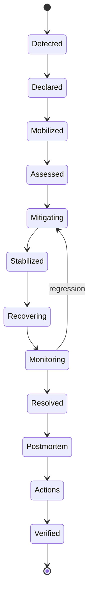
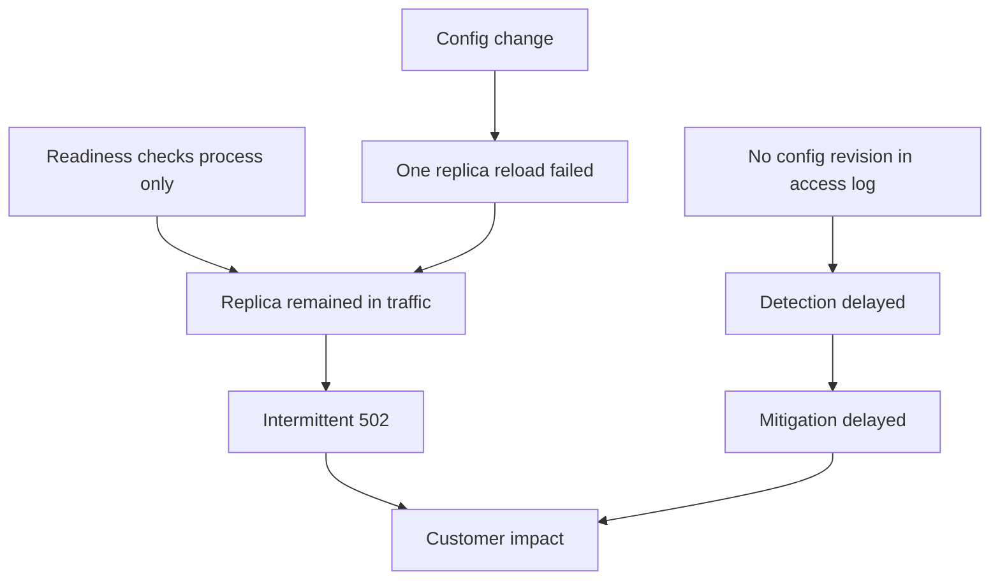

# Part 032 — NGINX/Ingress Runbooks, Incident Command, and Recovery

> **Depth level:** Production/Architecture-level  
> **Prerequisite:** Part 015, 022–025, 029–031; dasar SLO, alerting, on-call, Kubernetes operations, cloud/on-prem networking, change management, dan production support.  
> **Scope:** incident lifecycle, severity, customer/SLO impact, roles, incident state document, triage, stop conditions, communication, safe mitigation, controller/ingress health, upstream outage, traffic spike, overload/DDoS-like behavior, certificate, DNS, load balancer, bad config, rollout, resource exhaustion, observability loss, recovery validation, evidence, handoff, postmortem, corrective/preventive actions, runbook quality, game day, and internal verification.  
> **Bukan scope utama:** detailed per-status differential diagnosis—Part 031; security/compliance control review—Part 033; senior PR/ADR framework—Part 034.

---

## Operating premise

Saat incident, objective pertama bukan menemukan penjelasan paling elegan.

Objective pertama adalah:

```text
limit customer harm
→ stabilize the system
→ restore a known-safe service level
→ preserve enough evidence
→ validate recovery
→ learn and improve controls
```

Diagnosis tetap penting, tetapi harus berada di bawah incident-control discipline.

Incident menjadi lebih buruk ketika:

- terlalu banyak orang mengubah sistem;
- tidak ada satu decision owner;
- mitigation dilakukan tanpa stop condition;
- status teknis tidak diterjemahkan ke customer impact;
- rollback target tidak diketahui;
- communication tertinggal;
- evidence hilang;
- “service up” dinyatakan hanya karena dashboard hijau;
- action item berakhir pada “be more careful”.

> **Core invariant:** Incident response yang baik menjaga satu operational picture, satu command structure, bounded changes, customer-impact focus, dan explicit recovery criteria.

---

## Daftar isi

1. [Tujuan pembelajaran](#tujuan-pembelajaran)
2. [Incident versus problem versus change](#incident-versus-problem-versus-change)
3. [Incident lifecycle](#incident-lifecycle)
4. [Customer-impact-first model](#customer-impact-first-model)
5. [SLO, SLA, and error-budget context](#slo-sla-and-error-budget-context)
6. [Severity model](#severity-model)
7. [Declaration criteria](#declaration-criteria)
8. [Incident command roles](#incident-command-roles)
9. [Span of control](#span-of-control)
10. [Incident state document](#incident-state-document)
11. [First 5, 15, and 30 minutes](#first-5-15-and-30-minutes)
12. [Triage questions](#triage-questions)
13. [Stop conditions](#stop-conditions)
14. [Change discipline during incident](#change-discipline-during-incident)
15. [Mitigation decision framework](#mitigation-decision-framework)
16. [Degrade](#degrade)
17. [Shed and limit](#shed-and-limit)
18. [Reroute and fail over](#reroute-and-fail-over)
19. [Rollback](#rollback)
20. [Scale](#scale)
21. [Block](#block)
22. [Fail-open and fail-closed decisions](#fail-open-and-fail-closed-decisions)
23. [Communications](#communications)
24. [Stakeholder and customer updates](#stakeholder-and-customer-updates)
25. [Evidence preservation](#evidence-preservation)
26. [Vendor/cloud/platform escalation](#vendorcloudplatform-escalation)
27. [Runbook: ingress/controller unhealthy](#runbook-ingresscontroller-unhealthy)
28. [Runbook: configuration reload failure](#runbook-configuration-reload-failure)
29. [Runbook: upstream outage](#runbook-upstream-outage)
30. [Runbook: 5xx and timeout spike](#runbook-5xx-and-timeout-spike)
31. [Runbook: traffic spike and overload](#runbook-traffic-spike-and-overload)
32. [Runbook: DDoS-like or abusive traffic](#runbook-ddos-like-or-abusive-traffic)
33. [Runbook: certificate expiry and TLS failure](#runbook-certificate-expiry-and-tls-failure)
34. [Runbook: DNS incident](#runbook-dns-incident)
35. [Runbook: cloud/on-prem load-balancer incident](#runbook-cloudon-prem-load-balancer-incident)
36. [Runbook: bad route or wrong backend](#runbook-bad-route-or-wrong-backend)
37. [Runbook: failed controller rollout](#runbook-failed-controller-rollout)
38. [Runbook: resource exhaustion](#runbook-resource-exhaustion)
39. [Runbook: long-lived connection collapse](#runbook-long-lived-connection-collapse)
40. [Runbook: observability loss](#runbook-observability-loss)
41. [Runbook: security-sensitive routing exposure](#runbook-security-sensitive-routing-exposure)
42. [Recovery validation](#recovery-validation)
43. [Monitoring after mitigation](#monitoring-after-mitigation)
44. [Resolution and closure criteria](#resolution-and-closure-criteria)
45. [Shift handoff](#shift-handoff)
46. [Incident timeline](#incident-timeline)
47. [Postmortem triggers](#postmortem-triggers)
48. [Blameless systems analysis](#blameless-systems-analysis)
49. [Trigger, causes, and contributing factors](#trigger-causes-and-contributing-factors)
50. [Control-failure model](#control-failure-model)
51. [Corrective and preventive actions](#corrective-and-preventive-actions)
52. [Action-item quality](#action-item-quality)
53. [Runbook engineering](#runbook-engineering)
54. [Game days and tabletop exercises](#game-days-and-tabletop-exercises)
55. [Operational readiness review](#operational-readiness-review)
56. [Runbook templates](#runbook-templates)
57. [Incident checklist](#incident-checklist)
58. [PR and architecture review checklist](#pr-and-architecture-review-checklist)
59. [Internal verification checklist](#internal-verification-checklist)
60. [Final mental model](#final-mental-model)
61. [Referensi resmi](#referensi-resmi)

---

## Tujuan pembelajaran

Setelah menyelesaikan part ini, Anda harus mampu:

- mendeklarasikan incident berdasarkan customer/SLO impact, bukan sekadar komponen “merah”;
- membentuk command structure dengan Incident Commander, operations lead, communications, scribe, dan subject-matter experts;
- menjaga incident state document sebagai single operational picture;
- memilih mitigasi berupa degrade, shed, reroute, rollback, scale, atau block berdasarkan evidence, reversibility, dan blast radius;
- menetapkan stop condition sebelum tindakan berisiko;
- menjalankan runbook untuk ingress/controller, upstream, 5xx/timeouts, overload, abuse, certificate, DNS, LB, bad config, rollout, resource exhaustion, long-lived connection, dan observability loss;
- membedakan technical recovery, customer recovery, dan full system normalization;
- menjaga evidence sambil tetap memprioritaskan restoration;
- menghasilkan postmortem yang memodelkan trigger, system conditions, control failures, detection gaps, dan recovery constraints;
- mendesain corrective/preventive actions yang mempunyai owner, due date, verification evidence, dan measurable risk reduction;
- menguji runbook melalui game day dan memastikan backup personnel mampu menjalankannya.

---

## Incident versus problem versus change

### Incident

Unplanned interruption, degradation, security exposure, or material risk to service/customer objective.

Examples:

- external API 20% 5xx;
- TLS certificate failure blocks clients;
- wrong tenant routed to wrong backend;
- ingress controller rejects all new config;
- traffic spike exhausts connection capacity;
- DNS directs part of clients to retired endpoint.

### Problem

Underlying cause or recurring systemic condition requiring investigation/remediation.

Examples:

- controller reload race;
- capacity model omits long-lived connections;
- certificate ownership unclear;
- no route-conflict policy;
- retry amplification.

Incident may be resolved while problem remains open.

### Change

Intentional transition.

A failed change may trigger incident, but incident control must not be subordinated to release ownership.

### Why distinction matters

```text
incident task:
restore safe service

problem task:
understand and prevent recurrence

change task:
deliver intended new state
```

During incident, “complete the release” is rarely the primary objective.

---

## Incident lifecycle



### Detected

Signal may come from:

- SLO alert;
- customer report;
- synthetic test;
- cloud health;
- security monitoring;
- on-call observation;
- change validation.

### Declared

Explicitly assign:

- incident ID;
- severity;
- commander;
- communication channel;
- state document;
- initial impact.

### Assessed

Determine:

- blast radius;
- first failing hop;
- trend;
- recent changes;
- safe mitigation options;
- security/data implications.

### Stabilized

Customer harm stops growing, but service may be degraded.

### Recovered

Critical user journeys meet recovery criteria.

### Resolved

System remains stable for observation window and ownership of follow-up is assigned.

---

## Customer-impact-first model

Component health is a proxy. Customer impact is the objective.

### Technical symptoms

- controller pod restart;
- 502 rate;
- certificate error;
- CoreDNS latency;
- LB unhealthy targets.

### Customer outcomes

- users cannot submit quote;
- order creation duplicates;
- partners cannot authenticate;
- file upload fails;
- internal operations unavailable;
- one region/tenant impacted;
- data exposed to wrong tenant.

### Impact dimensions

```text
scope × severity × duration × criticality × reversibility
```

| Dimension | Examples |
|---|---|
| Scope | one user, tenant, region, all |
| Severity | latency, partial failure, total outage, wrong data |
| Duration | seconds, minutes, hours |
| Criticality | read-only search versus order submission |
| Reversibility | retryable versus duplicate/incorrect state |
| Security | no exposure versus confidentiality/integrity impact |

### Do not under-severity

Low request volume can still be high severity if:

- critical partner integration;
- privileged admin path;
- financial/order mutation;
- security exposure;
- regulatory deadline.

---

## SLO, SLA, and error-budget context

### SLI

Measured behavior:

- availability;
- good-request ratio;
- latency;
- successful order/quote operation;
- stream continuity.

### SLO

Internal reliability objective.

### SLA

External/commercial commitment with defined terms.

### Error budget

Allowed unreliability under SLO.

During incident, use:

- current burn rate;
- projected budget consumption;
- affected SLI;
- remaining margin;
- customer commitment.

### SLO alert principles

Good incident alerts are:

- symptom/customer-outcome based;
- actionable;
- tied to meaningful window;
- resistant to single transient blip;
- capable of detecting fast and slow burn.

A component alert can page when it predicts imminent customer impact, but responder must validate actual service impact.

---

## Severity model

Internal severity names vary. Use a model that combines impact and urgency.

### Example

| Severity | Typical condition | Response |
|---|---|---|
| SEV-1 | widespread outage, security/data exposure, critical mutation failure | immediate command, executive/customer comms |
| SEV-2 | material partial degradation, major tenant/region, high SLO burn | immediate on-call/team response |
| SEV-3 | limited degradation, workaround exists, low current impact | tracked response, business-hours escalation as policy |
| SEV-4 | minor defect/no active impact | normal backlog/problem management |

### Severity is dynamic

Raise when:

- scope grows;
- mitigation fails;
- security/data impact discovered;
- recovery time uncertain;
- SLO burn accelerates;
- critical business window begins.

Lower only when evidence supports stable reduction.

### Avoid

- severity based only on number of pods;
- delaying declaration to avoid attention;
- keeping low severity because incident “should be fixed soon”;
- making severity a judgment of team performance.

---

## Declaration criteria

Declare when one or more applies:

- SLO alert indicates material burn;
- critical journey unavailable/degraded;
- unauthorized exposure or integrity risk;
- impact spans teams or control planes;
- emergency change/rollback needed;
- coordination exceeds one responder;
- customer communication likely;
- cause unknown and impact growing;
- standard on-call task cannot contain risk.

Early declaration is cheaper than unstructured coordination.

---

## Incident command roles

### Incident Commander

Owns process and decisions, not every technical detail.

Responsibilities:

- set objectives;
- assign roles;
- approve high-risk mitigation;
- maintain scope/severity;
- enforce change discipline;
- remove blockers;
- decide escalation/closure.

### Operations/Technical Lead

Coordinates diagnosis and mitigation:

- hypothesis queue;
- workstreams;
- technical actions;
- stop conditions;
- result reporting.

### Communications Lead

Owns:

- internal updates;
- stakeholder/customer status;
- update cadence;
- consistent wording;
- known/unknown separation.

### Scribe

Maintains:

- timeline;
- actions;
- decisions;
- hypotheses;
- evidence links;
- owners;
- state summary.

### Subject-Matter Experts

Examples:

- NGINX/Ingress;
- Kubernetes;
- Java/JAX-RS;
- DNS/network;
- cloud LB;
- security;
- certificate/PKI;
- database/downstream.

SME advises and executes assigned work; they do not independently direct incident unless assigned command role.

### Customer/business liaison

For critical enterprise products:

- validates user impact;
- identifies critical tenants/processes;
- coordinates workaround;
- prioritizes restoration journey.

---

## Span of control

Too many responders in one channel create noise.

Use workstreams:

```text
IC
├── Traffic/NGINX workstream
├── Backend/capacity workstream
├── DNS/LB/network workstream
├── Security assessment
└── Communications
```

Each workstream reports:

```text
owner
objective
current evidence
next action
stop condition
ETA for next update—not a promise of resolution
```

The incident commander should not personally run every command.

---

## Incident state document

Keep critical information at top.

```markdown
# INC-2026-0711 — Quote API ingress failures

Severity: SEV-2
Status: Mitigating
Commander: ...
Operations lead: ...
Comms: ...
Scribe: ...

## Customer impact
- 18–25% order submission failures in region A
- Reads unaffected
- Start: 02:14 UTC

## Current hypothesis
- One ingress replica has stale upstream config after reload failure

## Current mitigation
- Replica B removed from Service; error rate returned to baseline

## Next decision
- Preserve replica B evidence, then replace after config capture

## Risks
- Remaining capacity at 58%; no further replica loss tolerated

## Links
- dashboard
- logs
- config diff
- change revision
- customer status

## Timeline
...
```

### State-document rules

- facts versus hypotheses labeled;
- timestamp every material update;
- record who approved action;
- retain failed hypotheses;
- link evidence;
- avoid secret/PII;
- update top summary, not only timeline.

---

## First 5, 15, and 30 minutes

### First 5 minutes

- acknowledge alert;
- verify signal is real;
- estimate customer impact;
- check recent changes;
- declare incident if criteria met;
- establish channel/state doc/commander;
- freeze unrelated changes;
- capture initial evidence;
- choose immediate low-risk containment if obvious.

### First 15 minutes

- map affected population;
- identify first failing hop;
- assign workstreams;
- define next update cadence;
- establish mitigation options and stop conditions;
- communicate initial status;
- preserve config/revision/log/event state;
- assess security/data implications.

### First 30 minutes

- execute safest high-confidence mitigation;
- validate customer outcome;
- escalate vendor/cloud/network if needed;
- decide whether to degrade/fail over/rollback/scale/block;
- plan shift coverage if recovery uncertain;
- update severity and stakeholder status.

These are objectives, not rigid universal timers.

---

## Triage questions

### Impact

- What user journey fails?
- Who is affected?
- Is failure total, intermittent, slow, or incorrect?
- Is there data/security impact?
- When did it start?
- Is impact growing?

### System

- Which host/path/protocol/region?
- Who generates status/reset?
- Which ingress/controller/backends?
- One replica or all?
- Endpoint and target health?
- Resource saturation?
- Recent config/image/certificate/DNS/LB change?

### Mitigation

- Known safe rollback?
- Can traffic shift?
- Can noncritical traffic be shed?
- Is stale/read-only response acceptable?
- Can one bad replica be isolated?
- Can critical journey be separated?
- What action is reversible?

### Coordination

- Which teams/vendors required?
- What permissions needed?
- Is customer communication needed?
- Are logs/evidence expiring?
- When is next update?

---

## Stop conditions

Every high-risk action needs explicit stop conditions.

### Example: increase canary traffic

Stop if:

- candidate 5xx exceeds stable by 0.1%;
- p99 increases >15%;
- auth mismatch >0;
- saturation >80%;
- observability missing;
- one critical business invariant fails.

### Example: scale ingress

Stop if:

- new pods cannot schedule;
- node IP/CPU pressure increases;
- LB target registration fails;
- error rate does not improve after defined interval;
- scaling increases connection churn.

### Example: block source CIDR

Stop/escalate if:

- legitimate enterprise NAT users impacted;
- attacker rotates sources;
- block causes failover path overload;
- source attribution uncertain.

### Why stop conditions matter

Without them, responders continue an action because effort has already been invested.

---

## Change discipline during incident

### Rules

- freeze unrelated deployments/config changes;
- one authorized executor per workstream;
- announce action before execution;
- record command/change/revision;
- specify expected signal and timeout;
- observe result before next change;
- preserve pre-change state;
- maintain rollback path;
- avoid simultaneous interventions on same symptom.

### Emergency change record

```yaml
timeUtc: "..."
operator: "..."
approver: "..."
incident: "INC-..."
change:
  resource: "Ingress/quote-api"
  fromRevision: "841"
  toRevision: "rollback-839"
expected:
  "502 rate below 0.1% within 5 minutes"
stopCondition:
  "rollback if TLS/auth errors increase"
result:
  "..."
```

### GitOps

Understand whether:

- self-heal reverts manual mitigation;
- source must be patched;
- reconciliation should be suspended;
- bad revision will reapply;
- rollback is managed by progressive controller.

Never create two competing control loops.

---

## Mitigation decision framework

Evaluate action on:

| Dimension | Question |
|---|---|
| Impact reduction | How much customer harm stops? |
| Confidence | What evidence supports it? |
| Reversibility | Can it be undone quickly? |
| Blast radius | What new users/systems can it affect? |
| Time to effect | How long to converge? |
| Capacity | Does it shift/raise load elsewhere? |
| Security | Does it weaken controls/expose data? |
| Correctness | Can it duplicate/drop mutations? |
| Evidence | Will it destroy useful state? |
| Ownership | Who can safely execute? |

Preferred incident actions are often:

```text
small
reversible
well-observed
known-pattern
```

---

## Degrade

Degradation preserves core service by reducing features.

Examples:

- disable optional report/export;
- serve read-only mode;
- skip noncritical enrichment;
- disable compression if CPU-bound;
- reduce expensive search;
- use stale safe cache for public/reference data;
- pause noncritical background traffic;
- disable preview/canary features.

### Requirements

- business owner understands impact;
- user-visible status/response clear;
- no silent correctness violation;
- security/auth remain intact;
- restoration path defined.

### Unsafe degradation

- skip authorization;
- accept orders without validation;
- serve cross-tenant cache;
- silently drop audit/event;
- return success before durable commit unless architecture supports it.

---

## Shed and limit

Load shedding rejects lower-priority work to preserve critical paths.

Controls:

- NGINX rate/concurrency limit;
- queue bound;
- circuit breaker;
- tenant priority;
- admission control;
- connection cap;
- background-job pause.

### Good shedding

- explicit 429/503;
- `Retry-After` where meaningful;
- priority-aware;
- measured;
- protects finite resource;
- clients use backoff/jitter;
- critical mutation capacity reserved.

### Risks

- NAT-based IP limit blocks many users;
- retries amplify;
- limiter state per replica;
- broad 503 triggers aggressive retry;
- partner contracts expect different behavior.

---

## Reroute and fail over

Options:

- remove unhealthy replica/target;
- shift region/AZ;
- switch to standby ingress/controller;
- route to stable backend;
- change weighted route;
- use alternate DNS/LB.

### Preconditions

- destination healthy and capacity sufficient;
- data/state replicated and compatible;
- auth/TLS/policy equivalent;
- source IP/network path valid;
- rollback possible;
- propagation understood.

### Failover risk

Failover may move 100% load to environment designed for 50%.

Check:

```text
available capacity
- current load
- retry/reconnect surge
- background load
- dependency capacity
```

---

## Rollback

Rollback is preferred when:

- recent change strongly correlates;
- previous state known-good;
- compatibility remains;
- rollback faster/safer than forward fix.

### Rollback unit

May include:

- NGINX config;
- controller image;
- Ingress/HTTPRoute;
- ConfigMap;
- Secret/certificate;
- Service selector;
- backend revision;
- DNS/LB;
- WAF/auth policy.

### Validate

- old artifact exists;
- old cert valid;
- old backend capacity;
- schema/data backward compatible;
- GitOps behavior;
- long-lived connections;
- convergence time.

### Rollback is not proof of root cause

It is a mitigation and strong correlation signal. Preserve evidence for analysis.

---

## Scale

Scaling helps only when bottleneck scales horizontally.

Potentially helpful:

- more NGINX replicas under CPU/connection load;
- more backend pods;
- increase node capacity;
- increase auth service capacity.

Potentially harmful:

- database is bottleneck;
- external dependency quota;
- per-replica rate limit changes;
- more upstream connections overwhelm Java/DB;
- IP/port/conntrack exhausted;
- HPA reacts late;
- new pods cold/not ready;
- TLS/reconnect load increases.

### Scale validation

- bottleneck identified;
- per-pod resource healthy;
- node capacity available;
- dependencies can accept increased concurrency;
- target registration works;
- error/latency improves.

---

## Block

Blocking is useful for:

- abusive source;
- exploit attempt;
- invalid route;
- accidental traffic loop;
- known bad client version.

Controls:

- WAF rule;
- IP/CIDR;
- token/client ID;
- route disable;
- method restriction;
- tenant-specific block.

### Risks

- spoofed/mis-attributed IP;
- enterprise NAT;
- attacker rotation;
- blocks monitoring/health;
- bypass through alternate endpoint;
- legal/customer impact.

Use narrowest reliable identity and expiry.

---

## Fail-open and fail-closed decisions

Examples:

- external auth unavailable;
- WAF unavailable;
- certificate revocation service unavailable;
- telemetry unavailable.

### Default

Security-critical authentication/authorization generally fail closed.

But availability and safety depend on context:

| Dependency | Typical posture |
|---|---|
| Authentication | fail closed |
| Domain authorization | fail closed |
| Optional analytics | fail open/degrade |
| Noncritical enrichment | fail open with marker |
| Rate limiter | depends on threat/capacity |
| WAF | policy/risk-specific |
| Logging pipeline | service may continue, but audit requirement matters |

### Incident decision requires

- data classification;
- regulatory/compliance policy;
- threat state;
- alternative controls;
- duration;
- executive/security approval where required;
- audit trail.

Never improvise disabling auth as availability mitigation.

---

## Communications

Communication reduces duplicate work and customer uncertainty.

### Update structure

```text
Time:
Severity/status:
Customer impact:
What we know:
What we do not know:
Mitigation in progress:
Observed result:
Next action:
Next update:
```

### Rules

- facts before theory;
- no unsupported ETA;
- use exact time/timezone;
- mention workaround;
- be consistent across channels;
- do not expose sensitive architecture/security detail;
- update even when no major change;
- announce recovery as monitoring, not immediate resolution.

### Technical channel versus stakeholder channel

Technical:

- logs;
- hypotheses;
- commands;
- detailed state.

Stakeholder/customer:

- user impact;
- mitigation;
- workaround;
- restoration status;
- next update.

---

## Stakeholder and customer updates

### Initial

```text
We are investigating elevated failures affecting order submissions in Region A beginning at 02:14 UTC. Read-only quote access remains available. The team has activated incident response and is working to reduce impact. Next update by 02:30 UTC.
```

### Mitigating

```text
We isolated an unhealthy traffic path and error rates have decreased. We are validating recovery across affected tenants and monitoring for recurrence. Order submissions may still experience intermittent retries.
```

### Resolved

```text
Service has remained within normal error and latency levels since 03:02 UTC. We have restored normal traffic and are continuing enhanced monitoring. A follow-up analysis will identify corrective actions.
```

Avoid claims like “fully resolved” until criteria are met.

---

## Evidence preservation

During response preserve:

- alert payload;
- dashboards/query;
- request IDs/traces;
- access/error logs;
- events;
- generated config;
- resource YAML;
- controller/backends revisions;
- EndpointSlice/target state;
- DNS answers/TTL;
- certificate chain/serial;
- cloud audit logs;
- emergency commands;
- communication timeline.

### Balance restoration and evidence

If a bad pod must be removed immediately:

1. capture fast minimal evidence;
2. isolate from traffic;
3. preserve filesystem/log/config if feasible;
4. replace/terminate;
5. record what was not captured and why.

Evidence collection must not materially delay life/safety/security-critical mitigation.

---

## Vendor/cloud/platform escalation

Escalate when:

- control plane unavailable;
- managed LB/DNS/certificate behavior unexplained;
- product bug suspected;
- quota/platform fault;
- incident exceeds internal diagnostic access;
- contractual support path can accelerate.

### Support package

Provide:

- account/subscription/cluster/resource IDs;
- region/time UTC;
- impact/severity;
- request IDs;
- target/resource health;
- exact error;
- recent changes;
- reproduction;
- logs sanitized;
- actions already taken;
- requested assistance.

Do not send secrets/private keys/customer PII.

### Parallelism

Vendor escalation should run in parallel with safe internal mitigation, not replace it.

---

## Runbook: ingress/controller unhealthy

### Trigger

- controller unavailable;
- no ready data-plane replicas;
- config reconciliation stops;
- high restart/crash;
- service target unhealthy;
- new routes not applied.

### Immediate questions

- Are existing routes still serving?
- Is this control-plane-only or data-plane impact?
- All replicas or one?
- Recent image/config/CRD/certificate change?
- Capacity and node health?
- API server connectivity?

### Evidence

```bash
kubectl get deploy,rs,pod -n ingress -o wide
kubectl describe deploy/nginx-controller -n ingress
kubectl logs -n ingress <pod> --previous --timestamps
kubectl get events -n ingress --sort-by=.metadata.creationTimestamp
kubectl get svc,endpointslice -n ingress -o yaml
```

### Safe mitigations

- remove one bad replica from traffic after evidence;
- rollback recent controller image/config;
- restore previous ConfigMap/Secret;
- schedule replacement on healthy node;
- scale if bottleneck and capacity verified;
- fail over to standby controller/class/LB if tested.

### Stop conditions

- remaining capacity below safe threshold;
- new replicas fail same way;
- error rate worsens;
- config hashes diverge;
- alternate path fails policy/TLS.

### Recovery criteria

- required ready replicas by zone;
- config revision consistent;
- target health stable;
- critical route synthetic tests pass;
- no reload/reconcile errors;
- old bad revision drained.

---

## Runbook: configuration reload failure

### Trigger

- NGINX reload error;
- controller `Rejected` resource;
- desired revision differs from loaded;
- one replica keeps old config.

### Impact classes

- old config continues serving;
- only new route unavailable;
- one replica diverges;
- all data plane unavailable if wrapper exits/restarts.

### Actions

1. freeze new config changes;
2. capture rejected config and error;
3. identify source revision;
4. compare all replicas;
5. run exact `nginx -t`;
6. restore previous known-good config if customer impact;
7. validate loaded revision;
8. preserve bad artifact for analysis.

### Do not

- repeatedly reload;
- delete all replicas;
- edit generated config manually under controller ownership;
- force apply multiple speculative fixes.

### Recovery criteria

- desired known-good revision loaded everywhere;
- no old/rejected generation;
- routes/TLS/header tests pass;
- GitOps source and runtime aligned.

---

## Runbook: upstream outage

### Trigger

- no ready endpoints;
- connection refused/reset;
- backend 503;
- dependency outage;
- upstream health ejection.

### Triage

- all backends or subset;
- one route/tenant;
- application versus dependency;
- capacity versus crash;
- deployment/maintenance;
- database/downstream health.

### Mitigations

- route to healthy stable pool;
- remove bad endpoint;
- rollback backend;
- reduce noncritical traffic;
- enable safe stale cache/read-only mode;
- scale only if bottleneck supports it;
- circuit-break failing downstream;
- pause background jobs.

### Risks

- failover pool insufficient;
- stale cache correctness;
- retry storm;
- duplicate mutation;
- partial data/state.

### Recovery

- endpoints ready and stable;
- business transaction success;
- queue/backlog drains;
- retries normalized;
- no duplicate/inconsistent state.

---

## Runbook: 5xx and timeout spike

### Trigger

- SLO burn;
- 502/503/504 spike;
- p99 latency;
- 499 increase.

### First split

```text
outer LB/WAF
vs NGINX-generated
vs upstream/application
```

Then:

```text
selection/connect/TLS/send/header/body/client-close
```

### Evidence

- access log status/upstream status/timings;
- NGINX error phase;
- EndpointSlice;
- Java executor/pools;
- recent changes;
- affected route/revision/pod/zone.

### Mitigations

- isolate bad replica;
- rollback;
- shed load;
- disable expensive optional path;
- route to healthy backend;
- adjust timeout only when mechanism supports it.

### Do not

Increase all timeouts or retry counts during unknown overload.

---

## Runbook: traffic spike and overload

### Determine spike type

- legitimate business event;
- retry storm;
- bot/scan;
- reconnect storm;
- traffic loop;
- batch job;
- monitoring misconfiguration;
- attack.

### Capacity signals

- RPS and concurrency;
- NGINX active connections;
- CPU/throttling;
- file descriptors;
- listen backlog;
- memory/temp disk;
- Java queue/pool;
- DB/downstream saturation;
- NAT/conntrack/ports.

### Mitigation order

1. stop self-generated loops/retries;
2. protect critical routes;
3. shed noncritical traffic;
4. enforce bounded rate/concurrency;
5. scale verified scalable bottleneck;
6. coordinate dependency capacity;
7. communicate degraded mode.

### Recovery

Do not remove limits immediately. Ramp gradually and watch backlog/retries.

---

## Runbook: DDoS-like or abusive traffic

### Classify

- volumetric L3/L4;
- connection exhaustion;
- TLS handshake flood;
- HTTP request flood;
- expensive endpoint abuse;
- credential attack;
- malformed request/parser attack.

### Immediate controls

- cloud/provider DDoS protection;
- WAF rule;
- rate/connection limit;
- block reliable source/client identity;
- disable expensive unauthenticated endpoint;
- cache safe public response;
- require authentication/challenge where architecture supports;
- protect origin from direct bypass.

### Coordination

- security incident process;
- network/cloud provider;
- legal/comms if required;
- preserve indicators/evidence;
- validate false-positive risk.

### Do not

Rely solely on NGINX application-layer controls for volumetric saturation upstream of NGINX.

---

## Runbook: certificate expiry and TLS failure

### Trigger

- expiry alert;
- handshake error spike;
- wrong certificate/SAN;
- missing intermediate;
- mTLS rejection;
- upstream trust failure.

### Triage

- downstream or upstream;
- one hostname/IP/replica;
- certificate serial;
- SNI;
- chain/CA;
- client population;
- recent rotation;
- cert-manager/cloud manager events.

### Mitigations

- restore previous valid Secret/cert;
- issue emergency certificate through approved CA;
- reload/rollout;
- route to endpoint with valid certificate;
- restore trust bundle overlap.

### Security

Never:

- distribute private key insecurely;
- disable verification as production fix;
- use unrelated wildcard without policy;
- bypass mTLS silently.

### Recovery

- fresh TLS connections to every target;
- correct SAN/chain/expiry;
- client-specific trust test;
- upstream mTLS;
- renewal controller healthy;
- expiry monitoring restored.

---

## Runbook: DNS incident

### Trigger

- NXDOMAIN/SERVFAIL;
- wrong IP;
- partial region/client impact;
- stale answer;
- CoreDNS failure;
- private/public zone conflict.

### Triage

- exact resolver/view;
- A/AAAA/CNAME/TTL;
- recent record/zone/delegation change;
- NGINX/JVM cache;
- client cache;
- health of target IPs;
- split-horizon path.

### Mitigations

- restore previous record;
- ensure both old/new endpoints valid;
- fix resolver/CoreDNS;
- temporarily use controlled static resolution only if approved and bounded;
- reroute clients through alternate name/path;
- reduce TTL for future transition—not retroactively for cached entries.

### Risks

- DNS rollback propagation;
- negative cache;
- existing keepalive;
- IPv6 path;
- certificate mismatch at alternate IP;
- private data exposed through public endpoint.

### Recovery

Validate from:

- affected client resolver;
- corporate resolver;
- pod resolver;
- authoritative server;
- each region/network.

---

## Runbook: cloud/on-prem load-balancer incident

### Trigger

- no healthy targets;
- listener unavailable;
- partial AZ;
- wrong routing rule;
- source IP/proxy protocol mismatch;
- LB quota/platform fault.

### Evidence

- listener/rules;
- target group/backend pool health;
- health-check reason;
- access/flow logs;
- target registration;
- security group/NSG/firewall;
- Service/NodePort;
- certificate;
- cloud audit history.

### Mitigations

- restore previous listener/rule;
- register healthy targets;
- shift to standby LB;
- correct health path/protocol;
- isolate bad zone;
- route via alternate edge if tested.

### Risks

- alternate path changes source IP/TLS/header;
- target mode differs;
- double NAT;
- health probe succeeds but user traffic fails;
- provider control-plane delay.

---

## Runbook: bad route or wrong backend

### Trigger

- 404/wrong service;
- wrong tenant/backend;
- redirect loop;
- one path version broken;
- route conflict.

### Immediate safety

If confidentiality/integrity risk:

- stop affected route;
- block traffic narrowly;
- invoke security incident process;
- preserve logs;
- assess data exposure.

### Actions

- capture generated config;
- enumerate resources claiming host/path;
- inspect rewrite and Service;
- rollback route/config;
- clear/disable unsafe cache if involved;
- validate every tenant/host/path.

### Recovery

- expected route/backend markers;
- negative tests;
- no cross-tenant response;
- logs/audit reviewed;
- security/compliance notification as required.

---

## Runbook: failed controller rollout

### Trigger

- rollout stalled;
- new pods crash/not ready;
- mixed config behavior;
- error begins with candidate.

### Actions

1. pause rollout/progressive controller;
2. preserve candidate logs/config;
3. compare old/new image, args, generated config;
4. maintain stable capacity;
5. rollback image/revision;
6. verify target registration/drain;
7. validate old config everywhere.

### Stop conditions

- stable replicas below minimum;
- candidate causes route/TLS/auth divergence;
- surge capacity unavailable;
- telemetry cannot distinguish revisions.

### Recovery

- all desired pods stable;
- no old candidate traffic;
- config hash consistent;
- critical protocols pass;
- controller status normal.

---

## Runbook: resource exhaustion

### Types

- CPU/throttling;
- memory/OOM;
- file descriptors;
- connections;
- listen backlog;
- temp disk/ephemeral storage;
- node/pod IP;
- conntrack;
- ephemeral ports;
- logs/disk;
- Java/DB pool.

### Immediate principle

Identify constrained resource before scaling/tuning.

### Mitigations

- shed load;
- reduce retries;
- disable expensive optional work;
- increase capacity within safe dependency limits;
- free temp/log space safely;
- isolate leak/bad replica;
- lower connection lifetime;
- route to capacity;
- rollback memory/connection-increasing change.

### Avoid

- unbounded limit increase;
- deleting logs before evidence/retention needs;
- adding replicas that multiply downstream pressure.

---

## Runbook: long-lived connection collapse

### Trigger

- mass WebSocket/SSE disconnect;
- gRPC stream reset;
- reconnect spike;
- old pods cannot drain;
- connection capacity exhausted.

### Triage

- rollout/LB timeout/network event;
- one region/replica;
- heartbeat;
- close code;
- connection age;
- worker/pod generation;
- file descriptors;
- auth/session store.

### Mitigations

- stop further rollout;
- stagger reconnection;
- preserve stable pods;
- increase edge/auth capacity if verified;
- temporarily cap new sessions by priority;
- extend/align timeout only with evidence;
- use resume/replay;
- communicate degraded realtime status.

### Recovery

- reconnect rate normal;
- active connections recover;
- event lag/replay complete;
- no duplicate/lost business action;
- old workers/pods drained.

---

## Runbook: observability loss

### Trigger

- logs missing;
- metrics stale;
- traces unavailable;
- dashboard/query failure;
- alerting blind.

### First question

Is service broken, observability broken, or both?

### Actions

- use independent synthetic probes;
- inspect local/controller logs;
- query cloud/LB health;
- verify telemetry pipeline;
- preserve local files before rotation;
- increase decision caution;
- freeze high-risk rollout;
- restore minimum critical telemetry.

### Mitigation posture

Do not declare service healthy based on absent errors when telemetry is missing.

### Recovery

- data freshness confirmed;
- alert evaluation restored;
- gap documented;
- incident period backfilled where possible;
- monitoring of monitoring added.

---

## Runbook: security-sensitive routing exposure

Examples:

- admin endpoint publicly exposed;
- internal host routes externally;
- auth bypass;
- cross-tenant cache/route;
- debug endpoint exposed.

### Immediate actions

1. declare security incident per policy;
2. block/remove route narrowly;
3. preserve access/audit logs;
4. identify exposure start/end;
5. assess requests/data;
6. rotate credentials if exposed;
7. validate no alternate path;
8. coordinate legal/compliance/customer notification.

### Do not

- delete logs;
- silently fix without exposure assessment;
- overstate/understate data impact;
- continue normal postmortem process without security handling.

---

## Recovery validation

Recovery has layers.

### 1. Technical signal recovery

- pods ready;
- targets healthy;
- config loaded;
- error rate down.

### 2. User-journey recovery

- login/auth;
- quote retrieval;
- order submission;
- upload/download;
- partner API;
- WebSocket/SSE/gRPC;
- critical tenant/region.

### 3. State/correctness recovery

- no duplicate orders;
- no missing events;
- queues drain;
- workflows consistent;
- cache safe;
- audit complete.

### 4. Operational recovery

- temporary limits documented;
- failover capacity stable;
- telemetry restored;
- rollback available;
- on-call coverage;
- follow-up ownership.

> “HTTP 200” is insufficient recovery evidence.

---

## Monitoring after mitigation

Define observation window based on:

- traffic cycle;
- cache/connection lifetime;
- retry/backlog;
- certificate/DNS TTL;
- scheduled jobs;
- business process duration;
- multi-region propagation.

Monitor:

- SLI/SLO burn;
- route/status;
- latency;
- target/endpoints;
- saturation;
- retries/reconnects;
- business success;
- security anomalies;
- backlog;
- old revision traffic.

Keep incident open or in monitoring state until risk is bounded.

---

## Resolution and closure criteria

Resolve when:

- customer impact ended;
- critical journeys verified;
- SLO/error rate stable for defined window;
- mitigation stable;
- no hidden backlog/correctness issue;
- security assessment complete enough;
- temporary risk accepted/documented;
- next owner and action list assigned;
- customer/stakeholder update sent;
- evidence retained.

Closure does not require full root-cause certainty.

---

## Shift handoff

For long incident, handoff must include:

```text
current severity/status
customer impact
system state
mitigations applied
known risks
active hypotheses
failed hypotheses
open workstreams
next decision
stop conditions
permissions/vendor cases
communication cadence
links/evidence
```

Conduct verbal/read-back handoff.

Do not hand off only a long chat history.

---

## Incident timeline

Record:

- detection;
- alert/customer report;
- declaration;
- role assignment;
- changes preceding incident;
- hypotheses;
- actions/commands;
- observed results;
- communications;
- mitigation;
- recovery;
- regression;
- resolution.

### Timeline quality

Use exact UTC timestamps where possible.

Distinguish:

```text
02:14:20 — revision 842 applied [fact]
02:14:31 — 502 began [fact]
02:15:04 — suspected stale config [hypothesis]
02:17:10 — replica B removed [action]
02:17:42 — 502 returned to baseline [result]
```

Timeline becomes input to postmortem.

---

## Postmortem triggers

Examples:

- SEV-1/SEV-2;
- SLA/SLO material breach;
- security/privacy exposure;
- duplicate/corrupt business state;
- prolonged customer impact;
- manual emergency action;
- repeated incident;
- near miss with high potential impact;
- monitoring/detection failure;
- rollback failure;
- cross-team/vendor systemic issue.

Not every minor event requires a full postmortem, but recurring small incidents may warrant aggregate analysis.

---

## Blameless systems analysis

Blameless does not mean accountability-free.

It means:

- assume people acted with available information and constraints;
- analyze why action was reasonable at the time;
- improve system, tooling, process, training, and decision context;
- avoid personal judgment as causal explanation.

Bad:

```text
Engineer forgot to renew certificate.
```

Better:

```text
Certificate renewal depended on one manual calendar reminder, ownership changed, no expiry alert reached the active on-call, and emergency issuance had not been tested.
```

The second statement exposes controllable system conditions.

---

## Trigger, causes, and contributing factors

### Trigger

Event immediately preceding incident.

Example:

```text
Global ConfigMap revision 842 enabled a new real-IP trust range.
```

### Contributing factors

- no rendered config test;
- one controller replica rejected reload;
- readiness did not reflect loaded generation;
- access logs lacked config revision;
- route shared across tenants;
- rollback procedure required manual approval.

### Root cause

Avoid forcing one singular “root cause” for distributed incidents. Use a causal graph.



---

## Control-failure model

Analyze controls by lifecycle.

| Stage | Expected control | What happened? |
|---|---|---|
| Prevent | policy/schema/review | did not catch |
| Detect pre-prod | integration/canary | absent/not representative |
| Detect prod | SLO/config-revision alert | delayed/missing |
| Limit | canary/sharding | global exposure |
| Recover | rollback/standby | slow/incomplete |
| Learn | prior action | not completed/ineffective |

### Example

Incident cause is not only invalid timeout.

System failure may include:

- arbitrary per-Ingress value allowed;
- no max policy;
- no route load test;
- immediate 100% rollout;
- alert on average not p99;
- rollback artifact unavailable.

---

## Corrective and preventive actions

Action categories:

### Prevention

- schema/policy;
- safer default;
- remove unsafe capability;
- automate certificate renewal;
- version pinning;
- capacity redesign.

### Detection

- SLO alert;
- config divergence metric;
- expiry alert;
- synthetic route test;
- tenant-safe business metric.

### Containment

- sharded controller;
- canary;
- rate/concurrency guard;
- blast-radius segmentation;
- circuit breaker.

### Recovery

- one-command rollback;
- standby;
- tested runbook;
- retained artifact;
- automated failover where appropriate.

### Knowledge/process

- ownership;
- training;
- game day;
- support contract;
- runbook.

Prefer engineering controls over reminders alone.

---

## Action-item quality

Good action item:

```yaml
action: "Expose desired and loaded NGINX config revision per controller pod and alert when they differ for >2 minutes."
owner: "Platform Networking"
due: "2026-08-15"
riskReduced: "Detect partial reload failure before broad customer impact."
verification:
  - "Metric visible in production"
  - "Alert tested by induced failed reload in staging"
  - "Runbook linked"
status: "Open"
```

Weak:

```text
Monitor more carefully.
Be careful with config.
Improve testing.
```

### SMART is not enough

Action must also be:

- linked to failure/control gap;
- proportionate;
- technically verified;
- non-duplicative;
- measurable in production;
- maintained over time.

### Priority

Use risk:

```text
recurrence likelihood
× potential impact
× detection/recovery weakness
```

---

## Runbook engineering

A runbook is an executable decision aid, not an encyclopedia.

### Required fields

- purpose/scope;
- triggers;
- customer impact;
- prerequisites/access;
- first checks;
- decision tree;
- safe actions;
- stop conditions;
- rollback;
- recovery validation;
- escalation;
- evidence to collect;
- owner;
- last tested date;
- supported versions/environments.

### Command quality

Every command should state:

- read-only or mutating;
- required permission;
- expected output;
- failure interpretation;
- sensitive-data risk;
- rollback if mutating.

### Staleness controls

- review cadence;
- ownership;
- link checker;
- version compatibility;
- game-day result;
- deprecation marker;
- incident feedback.

---

## Game days and tabletop exercises

### Tabletop

Participants reason through scenario without production change.

Use for:

- role assignment;
- communication;
- decision/escalation;
- security/legal path;
- runbook gaps.

### Game day

Controlled technical failure injection.

Examples:

- one ingress replica reload failure;
- zero EndpointSlice;
- certificate near expiry/alternate test CA;
- CoreDNS failure in staging;
- LB target unhealthy;
- connection exhaustion;
- WebSocket reconnect event;
- telemetry pipeline outage.

### Success criteria

- detection;
- declaration time;
- correct role assignment;
- mitigation;
- no unsafe action;
- recovery validation;
- evidence capture;
- action items.

### Safety

- approved scope;
- abort switch;
- synthetic/noncritical environment or bounded production experiment;
- stakeholder awareness;
- no customer data risk;
- rollback tested.

---

## Operational readiness review

Before a new service/route/controller goes production:

### Ownership

- on-call;
- escalation;
- platform/application/security/network owners;
- vendor support.

### SLO and alerts

- critical journeys;
- fast/slow burn;
- certificate/DNS/LB/controller;
- business correctness.

### Runbooks

- 5xx/timeout;
- no endpoints;
- certificate;
- DNS;
- rollback;
- overload;
- security exposure;
- observability loss.

### Capacity

- normal/peak;
- N+1;
- long connections;
- dependency limits;
- retry/reconnect;
- failover.

### Recovery

- rollback artifact;
- backup/standby;
- DNS/LB propagation;
- state consistency;
- access.

### Testing

- synthetic;
- load;
- failure injection;
- game day;
- certificate rotation;
- pod drain.

---

## Runbook templates

### Generic runbook template

```markdown
# Runbook: <condition>

Owner:
Last tested:
Applies to:
Severity guidance:

## Trigger
...

## Customer impact
...

## Preconditions/access
...

## First checks
1. ...

## Decision tree
...

## Safe mitigations
- action
- expected result
- stop condition
- rollback

## Evidence
...

## Recovery validation
...

## Escalation
...

## Known failure signatures
...

## Revision history
...
```

### Incident update template

```markdown
Time UTC:
Incident/severity:
Customer impact:
Current status:
Known facts:
Unknowns:
Mitigation:
Result:
Risks:
Next action:
Next update:
```

### Postmortem template

```markdown
# Incident title

Date:
Severity:
Duration:
Authors/reviewers:

## Executive summary
## Customer impact
## Detection
## Timeline
## Trigger
## Contributing factors
## What went well
## What went poorly
## Where we got lucky
## Recovery
## Causal/control analysis
## Action items
## Supporting evidence
```

---

## Incident checklist

### Declare and organize

- [ ] Validate signal/customer impact.
- [ ] Declare incident and severity.
- [ ] Assign IC, operations lead, comms, scribe.
- [ ] Open incident channel/state document.
- [ ] Freeze unrelated changes.
- [ ] Define update cadence.

### Assess

- [ ] Record start time and affected population.
- [ ] Identify critical user journeys.
- [ ] Check security/data impact.
- [ ] Check recent changes.
- [ ] Identify first failing hop.
- [ ] Capture request IDs/revisions/config/events.
- [ ] Build initial hypotheses.

### Mitigate

- [ ] Choose smallest reversible action.
- [ ] Define expected signal and stop condition.
- [ ] Record operator/approver.
- [ ] Preserve pre-change state.
- [ ] Execute one controlled change.
- [ ] Observe before next action.
- [ ] Escalate vendor/platform as needed.

### Recover

- [ ] Validate technical health.
- [ ] Validate customer journeys.
- [ ] Validate state/correctness.
- [ ] Monitor for recurrence/backlog.
- [ ] Restore temporary degraded controls carefully.
- [ ] Communicate monitoring/recovery.

### Resolve and learn

- [ ] Meet closure criteria.
- [ ] Send stakeholder/customer update.
- [ ] Preserve evidence/timeline.
- [ ] Trigger postmortem if required.
- [ ] Assign action owners/dates.
- [ ] Schedule runbook/game-day updates.

---

## PR and architecture review checklist

### Incident readiness

- [ ] What incidents can this architecture produce?
- [ ] Which SLI/customer journey detects them?
- [ ] Who is paged?
- [ ] What is severity mapping?
- [ ] Can one team mitigate independently?
- [ ] What vendor/cloud support path exists?

### Mitigation

- [ ] Can traffic be degraded/shed/rerouted?
- [ ] Is rollback coherent?
- [ ] Is standby/failover capacity sufficient?
- [ ] Are security controls preserved?
- [ ] Are long-lived connections handled?
- [ ] Are mutations idempotent?

### Evidence

- [ ] Request/revision/config correlation?
- [ ] Logs/metrics/traces retained?
- [ ] LB/DNS/certificate/controller evidence accessible?
- [ ] Events retained long enough?
- [ ] Packet capture/support bundle process?

### Runbooks

- [ ] Controller/reload?
- [ ] Upstream/5xx/timeouts?
- [ ] Overload/abuse?
- [ ] Certificate/DNS/LB?
- [ ] Bad route/security exposure?
- [ ] Observability loss?
- [ ] Last tested date and owner?

### Organizational

- [ ] Backup on-call?
- [ ] Communication template?
- [ ] Change freeze/break-glass?
- [ ] Postmortem/action tracking?
- [ ] Game-day cadence?

---

## Internal verification checklist

### Incident process

- [ ] Locate incident policy, severity definitions, and declaration channel.
- [ ] Identify current IC/on-call model and backup personnel.
- [ ] Verify incident state-document template and storage.
- [ ] Confirm stakeholder/customer communication approval path.
- [ ] Locate security/privacy incident integration.
- [ ] Confirm shift handoff process.
- [ ] Review recent time-to-declare, mitigate, and recover.

### SLO and impact

- [ ] Locate SLOs for quote/order and critical APIs.
- [ ] Verify fast/slow burn alerts and routing.
- [ ] Identify customer/business success indicators.
- [ ] Determine SLA/regulatory reporting obligations.
- [ ] Check tenant/region/protocol segmentation.
- [ ] Verify low-volume critical operations are covered.
- [ ] Locate error-budget policy and release implications.

### Runbooks

- [ ] Locate NGINX/Ingress controller-health runbook.
- [ ] Locate reload/config-rejection runbook.
- [ ] Locate 502/503/504 and upstream runbook.
- [ ] Locate overload/rate-limit/DDoS runbook.
- [ ] Locate certificate/mTLS runbook.
- [ ] Locate DNS/CoreDNS/private-zone runbook.
- [ ] Locate AWS/Azure/on-prem LB runbooks.
- [ ] Locate bad-route/cross-tenant exposure runbook.
- [ ] Locate resource-exhaustion and long-connection runbook.
- [ ] Locate observability-loss runbook.
- [ ] Verify owner, versions, last tested date, and backup operator.

### Emergency access and changes

- [ ] Verify production read/mutate permissions and break-glass process.
- [ ] Confirm GitOps suspend/rollback/self-heal procedure.
- [ ] Verify controller/image/config rollback artifacts.
- [ ] Check DNS/LB/WAF/rate-limit emergency permissions.
- [ ] Verify certificate emergency issuance/rotation access.
- [ ] Confirm commands are audited and secrets protected.
- [ ] Test support/vendor escalation details.

### Capacity and failover

- [ ] Document steady/peak/N+1 capacity.
- [ ] Verify alternate region/controller/LB capacity.
- [ ] Check dependency capacity during failover.
- [ ] Model retry/reconnect storm.
- [ ] Verify HPA/manual scale behavior.
- [ ] Check node IP/conntrack/FD/temp-disk limits.
- [ ] Review actual prior failover/load-test results.

### Evidence

- [ ] Verify access to logs, metrics, traces, events, generated config, and revisions.
- [ ] Confirm retention and clock synchronization.
- [ ] Verify cloud audit/flow/LB/DNS/certificate evidence.
- [ ] Confirm approved support-bundle and packet-capture method.
- [ ] Check redaction/privacy process.
- [ ] Confirm timeline and emergency actions are retained.
- [ ] Verify observability-loss fallback.

### Recovery and correctness

- [ ] Define critical synthetic/user-journey validation.
- [ ] Verify duplicate order/idempotency checks.
- [ ] Verify queue/backlog/workflow consistency checks.
- [ ] Define observation windows for DNS, cache, and long connections.
- [ ] Confirm temporary mitigation removal process.
- [ ] Verify old/stable artifacts retained for rollback window.
- [ ] Check customer workaround and support playbook.

### Postmortem and actions

- [ ] Locate postmortem trigger policy and template.
- [ ] Review recent NGINX/Ingress incidents for systemic patterns.
- [ ] Check action-item owner/due-date/evidence tracking.
- [ ] Identify overdue repeated actions.
- [ ] Verify action effectiveness is tested.
- [ ] Confirm runbook changes follow incidents.
- [ ] Confirm game-day/tabletop cadence and scenarios.

---

## Final mental model

Saat NGINX/Ingress incident, jawab secara berurutan:

```text
1. Apa customer impact, bukan hanya component symptom?
2. Apakah incident harus dideklarasikan dan berapa severity?
3. Siapa Incident Commander, operations lead, communications, and scribe?
4. Apa single state document dan update cadence?
5. Apa exact affected population, start time, and critical journey?
6. Adakah security, privacy, integrity, or regulatory impact?
7. Apa recent change dan first failing hop?
8. Evidence apa yang harus dipreservasi sekarang?
9. Apa mitigation options: degrade, shed, reroute, rollback, scale, or block?
10. Mana yang paling kecil, reversible, high-confidence, and observable?
11. Apa expected result, observation window, and stop condition?
12. Siapa operator dan approver?
13. Bagaimana GitOps/progressive controller/cloud control plane bereaksi?
14. Apakah action memindahkan overload atau melemahkan security?
15. Apa technical, customer-journey, and correctness recovery criteria?
16. Berapa lama monitoring sebelum resolve?
17. Apa temporary risk/control yang masih aktif?
18. Apakah shift/vendor/customer communication lengkap?
19. Apa trigger, contributing conditions, and failed controls?
20. Action apa yang mengurangi recurrence, detection time, blast radius, or recovery time—and bagaimana efektivitasnya dibuktikan?
```

> **Core invariant:** Incident dianggap berhasil ditangani bukan hanya ketika graph kembali hijau, tetapi ketika customer harm berhenti, service dan state tervalidasi, risiko residual dipahami, evidence dipreservasi, dan systemic improvements memperoleh owner serta verification path.

---

## Referensi resmi

- [Google SRE — Incident Management Guide](https://sre.google/resources/practices-and-processes/incident-management-guide/)
- [Google SRE Book — Managing Incidents](https://sre.google/sre-book/managing-incidents/)
- [Google SRE Workbook — Incident Response](https://sre.google/workbook/incident-response/)
- [Google SRE Workbook — Alerting on SLOs](https://sre.google/workbook/alerting-on-slos/)
- [Google SRE Workbook — Postmortem Culture](https://sre.google/workbook/postmortem-culture/)
- [Google SRE Book — Postmortem Culture](https://sre.google/sre-book/postmortem-culture/)
- [Google SRE — Example Incident State Document](https://sre.google/sre-book/example-incident-state-document/)
- [Google SRE — Example Postmortem](https://sre.google/sre-book/example-postmortem/)
- [NGINX — Controlling nginx](https://nginx.org/en/docs/control.html)
- [NGINX — A debugging log](https://nginx.org/en/docs/debugging_log.html)
- [Kubernetes — Deployments](https://kubernetes.io/docs/concepts/workloads/controllers/deployment/)
- [Kubernetes — Pod Lifecycle](https://kubernetes.io/docs/concepts/workloads/pods/pod-lifecycle/)
- [Kubernetes — Disruptions](https://kubernetes.io/docs/concepts/workloads/pods/disruptions/)
- [Kubernetes — Debug Pods](https://kubernetes.io/docs/tasks/debug/debug-application/debug-pods/)
- [Kubernetes — Debug Services](https://kubernetes.io/docs/tasks/debug/debug-application/debug-service/)
- [Kubernetes — Observability](https://kubernetes.io/docs/concepts/cluster-administration/observability/)

---

**End of Part 032.**
