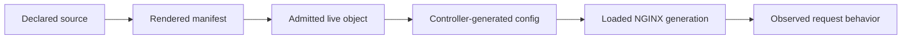
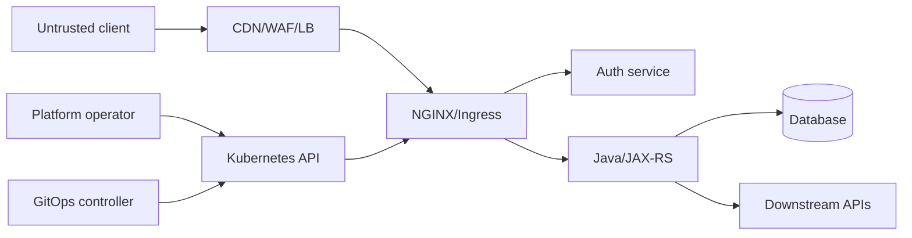

# Part 033 — Security and Compliance Review Checklist for NGINX

> **Depth level:** Principal-level  
> **Prerequisite:** Part 007, 012–015, 017, 020–021, dan 029–032; dasar threat modelling, IAM, PKI, Kubernetes security, secure SDLC, audit evidence, incident response, dan enterprise risk management.  
> **Scope:** security and compliance defensibility untuk NGINX, ingress, cloud/on-prem load balancer integration, Java/JAX-RS backend, Kubernetes, GitOps, TLS/mTLS, authentication boundaries, routing exposure, request limits, rate controls, logs, PII, audit trails, Secrets, RBAC, snippets, container/image/module supply chain, vulnerability management, exceptions, evidence retention, recurring assessment, and audit response.  
> **Bukan scope utama:** directive-level security tutorial—Part 012; authentication architecture detail—Part 014; CI/GitOps mechanics—Part 029; incident runbooks—Part 032; PR/ADR decision framework—Part 034.

---

## Operating premise

Security review bukan aktivitas mencari sebanyak mungkin checkbox yang bernilai `true`.

Security review harus menjawab:

```text
risk apa yang dikendalikan
→ kontrol apa yang dipilih
→ siapa pemiliknya
→ di hop mana kontrol ditegakkan
→ bagaimana konfigurasi efektifnya
→ bagaimana kontrol diuji
→ evidence apa yang membuktikannya
→ exception apa yang masih terbuka
→ kapan kontrol direview kembali
```

Contoh kontrol yang terlihat benar tetapi tidak defensible:

```text
Manifest:
  TLS enabled: yes

Runtime:
  one public hostname still serves an expired certificate
  upstream TLS verification disabled
  direct backend bypass remains reachable
```

Atau:

```text
Policy:
  identity headers may only be set by ingress

Runtime:
  external client can reach Service through alternate load balancer
  and send X-User-Id directly
```

> **Core invariant:** Compliance evidence harus membuktikan effective enforcement pada runtime path yang nyata, bukan hanya menunjukkan declared configuration.

---

## Daftar isi

1. [Tujuan pembelajaran](#tujuan-pembelajaran)
2. [Security review as defensibility](#security-review-as-defensibility)
3. [Control-evidence model](#control-evidence-model)
4. [Declared, admitted, generated, loaded, and observed state](#declared-admitted-generated-loaded-and-observed-state)
5. [Risk and scope definition](#risk-and-scope-definition)
6. [System and data classification](#system-and-data-classification)
7. [Trust-boundary inventory](#trust-boundary-inventory)
8. [Threat model](#threat-model)
9. [Control ownership and separation of duties](#control-ownership-and-separation-of-duties)
10. [Control matrix](#control-matrix)
11. [Evidence quality hierarchy](#evidence-quality-hierarchy)
12. [Evidence freshness and sampling](#evidence-freshness-and-sampling)
13. [TLS and certificate review](#tls-and-certificate-review)
14. [mTLS and upstream trust review](#mtls-and-upstream-trust-review)
15. [Host, SNI, and routing exposure](#host-sni-and-routing-exposure)
16. [Authentication boundary review](#authentication-boundary-review)
17. [Authorization responsibility review](#authorization-responsibility-review)
18. [Forwarded and identity header trust](#forwarded-and-identity-header-trust)
19. [IP allowlist and source attribution](#ip-allowlist-and-source-attribution)
20. [Rate and connection controls](#rate-and-connection-controls)
21. [Request parser and protocol controls](#request-parser-and-protocol-controls)
22. [Request body, header, and URI limits](#request-body-header-and-uri-limits)
23. [Sensitive and administrative paths](#sensitive-and-administrative-paths)
24. [Internal-only endpoint exposure](#internal-only-endpoint-exposure)
25. [Default server and unknown-host policy](#default-server-and-unknown-host-policy)
26. [WAF and bot-control evidence](#waf-and-bot-control-evidence)
27. [CORS and browser security headers](#cors-and-browser-security-headers)
28. [Caching and data-isolation review](#caching-and-data-isolation-review)
29. [Error handling and information disclosure](#error-handling-and-information-disclosure)
30. [Logging, PII, secrets, and data minimization](#logging-pii-secrets-and-data-minimization)
31. [Auditability and change evidence](#auditability-and-change-evidence)
32. [Kubernetes RBAC and namespace boundaries](#kubernetes-rbac-and-namespace-boundaries)
33. [Admission and policy enforcement](#admission-and-policy-enforcement)
34. [ConfigMap, annotation, and snippet risk](#configmap-annotation-and-snippet-risk)
35. [Secret lifecycle](#secret-lifecycle)
36. [Container runtime hardening](#container-runtime-hardening)
37. [Image, package, and module supply chain](#image-package-and-module-supply-chain)
38. [Vulnerability management and patch SLA](#vulnerability-management-and-patch-sla)
39. [Controller and API lifecycle risk](#controller-and-api-lifecycle-risk)
40. [Network and direct-bypass review](#network-and-direct-bypass-review)
41. [Cloud load balancer and managed-edge evidence](#cloud-load-balancer-and-managed-edge-evidence)
42. [Java/JAX-RS backend security contract](#javajax-rs-backend-security-contract)
43. [Availability as a security property](#availability-as-a-security-property)
44. [Incident readiness and forensic evidence](#incident-readiness-and-forensic-evidence)
45. [Exception and compensating-control management](#exception-and-compensating-control-management)
46. [Evidence pack](#evidence-pack)
47. [Recurring review cadence](#recurring-review-cadence)
48. [Audit-response workflow](#audit-response-workflow)
49. [Finding severity and risk acceptance](#finding-severity-and-risk-acceptance)
50. [Reference control catalogue](#reference-control-catalogue)
51. [Security review worksheet](#security-review-worksheet)
52. [Failure and anti-pattern catalogue](#failure-and-anti-pattern-catalogue)
53. [Review checklist](#review-checklist)
54. [Internal verification checklist](#internal-verification-checklist)
55. [Final mental model](#final-mental-model)
56. [Referensi resmi](#referensi-resmi)

---

## Tujuan pembelajaran

Setelah menyelesaikan part ini, Anda harus mampu:

- mengubah threat dan regulatory requirement menjadi control objectives yang dapat diuji;
- membedakan source declaration, Kubernetes admission, generated NGINX config, loaded runtime generation, dan actual request behavior;
- membangun control matrix yang menyebut owner, enforcement point, evidence, test, exception, dan review cadence;
- memverifikasi TLS, authentication, source-IP, routing, limits, cache, logging, Secrets, RBAC, admission, image, dan patching secara runtime;
- mengidentifikasi evidence yang lemah, stale, sampled secara salah, atau tidak mencakup alternate paths;
- menemukan compliance gap yang timbul dari direct-backend bypass, snippets, logging PII, stale image, broad RBAC, atau unclear ownership;
- menyusun evidence pack yang dapat dipakai security review, internal audit, external audit, customer assurance, dan incident investigation;
- mengelola exception sebagai risk record dengan compensating controls dan expiry, bukan permanent hidden deviation;
- menghubungkan review dengan NIST CSF-style governance lifecycle, application-security verification, Kubernetes security controls, dan organization-specific obligations tanpa menganggap framework sebagai pengganti threat modelling.

---

## Security review as defensibility

Defensible security berarti organisasi dapat menjelaskan dan membuktikan:

1. sistem apa yang dilindungi;
2. data dan business process apa yang terpengaruh;
3. threat apa yang dipertimbangkan;
4. control apa yang dipilih dan mengapa;
5. siapa yang bertanggung jawab;
6. bagaimana control diterapkan;
7. bagaimana control diuji;
8. bagaimana exception disetujui;
9. bagaimana incident dideteksi dan ditangani;
10. bagaimana control dipelihara sepanjang lifecycle.

### Review output

Security review seharusnya menghasilkan:

```text
scope statement
architecture/trust-boundary diagram
data-flow and exposure inventory
threat model
control matrix
runtime validation evidence
findings and risk ratings
exceptions/compensating controls
remediation plan
residual-risk acceptance
review date and owner
```

### Review bukan

- copy-paste benchmark tanpa context;
- screenshot dashboard tanpa query, timestamp, dan scope;
- hasil scanner tanpa triage;
- daftar directive “recommended”;
- klaim “private network therefore secure”;
- klaim “managed service therefore compliant”;
- claim bahwa Java melakukan authorization tanpa test route;
- certificate screenshot dari satu IP untuk multi-replica edge;
- manifest review tanpa generated runtime configuration.

---

## Control-evidence model

Gunakan record seperti:

```yaml
controlId: EDGE-TLS-001
risk:
  "Client credentials or regulated data can be exposed or altered in transit."
objective:
  "All external client traffic uses approved TLS and valid hostname-bound certificates."
owner:
  accountable: "Platform Security"
  operator: "Platform Networking"
enforcementPoints:
  - "Public load balancer listener"
  - "NGINX server block"
configuration:
  sourceRevision: "..."
  certificateSecret: "..."
evidence:
  - type: "runtime-test"
    description: "Fresh TLS handshake against every published edge IP using production SNI"
  - type: "configuration"
    description: "Generated listener and certificate mapping"
  - type: "monitoring"
    description: "Expiry and handshake-error dashboard"
test:
  frequency: "daily synthetic + quarterly review"
exceptions: []
retention:
  "13 months or organization policy"
```

### Required dimensions

| Dimension | Question |
|---|---|
| Risk | What can go wrong? |
| Objective | What outcome must hold? |
| Owner | Who is accountable and who operates? |
| Enforcement | Where is it actually blocked/allowed? |
| Configuration | What source and effective state implement it? |
| Evidence | What proves operation? |
| Test | How can failure be induced/detected safely? |
| Exception | What deviation exists? |
| Retention | How long is evidence required? |
| Review | When is it revalidated? |

---

## Declared, admitted, generated, loaded, and observed state

Security review should distinguish:



### Example: snippet prohibition

| State | Evidence |
|---|---|
| Declared | Helm values say `allowSnippets: false` |
| Admitted | policy denies snippet annotations |
| Generated | no raw snippet in effective config |
| Loaded | config hash/generation active |
| Observed | malicious test annotation rejected and no runtime route appears |

### Example: mTLS

| State | Evidence |
|---|---|
| Declared | listener requires client certificate |
| Generated | `ssl_verify_client`/equivalent policy |
| Loaded | correct CA bundle present |
| Observed positive | approved client succeeds |
| Observed negative | missing/untrusted client cert fails |
| Monitoring | client-verify failures visible |

The negative test is often the missing evidence.

---

## Risk and scope definition

Define exact review boundary:

- public, partner, internal, or admin edge;
- environments;
- regions/clusters;
- controller families;
- load balancers/CDNs/API gateways;
- hostnames and protocols;
- namespaces and application teams;
- data classification;
- customer/tenant population;
- direct/alternate paths;
- egress dependencies;
- operating model and support ownership.

### Scope exclusions

Every exclusion must state:

- why excluded;
- who owns it;
- dependency on reviewed system;
- when reviewed elsewhere;
- risk if assumption is wrong.

Bad:

```text
Cloud load balancer out of scope.
```

Better:

```text
Cloud load-balancer DDoS controls are assessed by Cloud Security under review CS-2026-17.
This review still verifies TLS termination, forwarded-header behavior, target reachability,
and direct-origin bypass because those are part of the NGINX trust boundary.
```

---

## System and data classification

Classify:

- public;
- internal;
- confidential;
- personally identifiable;
- credentials/token;
- financial/order;
- regulated;
- security telemetry;
- operational metadata.

### Data at each NGINX phase

| Phase | Potential data |
|---|---|
| Request headers | token, cookie, tenant/user ID |
| Request URI/query | identifiers, search terms |
| Request body | customer/order/document data |
| TLS termination | plaintext available in process memory |
| Request buffering | body may reach temp disk |
| Access log | path/query/IP/user agent/status |
| Error log | header/path/cert/internal address |
| Cache | full response/data |
| Debug log | detailed request/connection content |
| Packet capture | metadata or plaintext on non-TLS hop |

Security review must include transient and derived copies, not only primary database storage.

---

## Trust-boundary inventory



For each boundary:

- source identity;
- transport protection;
- parser/protocol;
- headers accepted;
- credentials;
- authorization;
- network policy;
- logging;
- failure behavior;
- ownership.

### Alternate paths

Inventory:

- direct NodePort;
- internal LoadBalancer;
- port-forward/debug;
- service mesh gateway;
- second ingress class;
- maintenance hostname;
- health/admin listener;
- old DNS record;
- cloud private endpoint;
- standby region;
- direct Pod/Service from other namespaces.

Attackers and auditors care about the weakest reachable path.

---

## Threat model

Useful threat categories for NGINX/edge:

### Spoofing

- forged forwarded IP;
- forged identity header;
- Host/SNI spoofing;
- stolen client certificate;
- bearer-token misuse.

### Tampering

- route/config manipulation;
- response/header rewriting;
- cache poisoning;
- image/module compromise;
- GitOps source tampering.

### Repudiation

- missing change audit;
- shared break-glass credential;
- no request correlation;
- log deletion.

### Information disclosure

- PII/token in logs;
- cross-tenant cache;
- debug endpoint;
- error details;
- direct internal route;
- weak TLS.

### Denial of service

- connection/request flood;
- large body/header;
- slow client;
- expensive route;
- reload/config failure;
- certificate/DNS outage.

### Elevation of privilege

- broad RBAC;
- snippet injection;
- secret read;
- admission bypass;
- controller service account compromise;
- container capability.

Threat model should include accidental/misconfiguration threats, not only malicious attacker.

---

## Control ownership and separation of duties

### Ownership examples

| Control | Accountable | Operator | Reviewer |
|---|---|---|---|
| TLS baseline | Security | Platform | Security architecture |
| Certificate issuance | PKI/Security | cert automation/platform | independent reviewer |
| Ingress routing | App + Platform | app/platform | CODEOWNERS |
| Global ConfigMap | Platform | SRE | Platform + Security |
| Auth identity header | Identity | Edge platform | App security |
| Domain authorization | App owner | Java team | Security/app reviewer |
| Log retention | Security/Compliance | Observability | Privacy/Audit |
| Image patching | Platform | CI/SRE | Vulnerability management |

### Separation of duties questions

- Can one engineer change source and approve/deploy production?
- Can app team create public LoadBalancer/Ingress without platform review?
- Can controller read all Secrets cluster-wide?
- Can security policy owner also grant permanent exception?
- Is break-glass access separately approved and audited?
- Can CI decrypt production Secrets and print them?
- Can Git administrator bypass protected branches unnoticed?

Separation must be risk-based; tiny teams may use compensating controls, but the gap must be explicit.

---

## Control matrix

Example:

| Control | Risk | Enforcement point | Owner | Runtime evidence | Negative test | Exception |
|---|---|---|---|---|---|---|
| Unknown host deny | Host injection/wrong routing | default server | Platform | generated config + curl | unregistered Host rejected | none |
| TLS minimum | weak encryption | LB/NGINX | Security/Platform | handshake matrix | deprecated protocol fails | legacy partner until date |
| Identity header sanitization | impersonation | first trusted edge | Platform/Identity | config + echo test | client header cannot survive | none |
| Body limit | DoS/temp-disk | LB/WAF/NGINX/app | Platform/App | effective limits | oversize request rejected | document route profile |
| Secret RBAC | credential theft | Kubernetes API | Platform Security | RBAC review/audit | unauthorized SA denied | none |
| Snippet deny | config injection | admission | Platform | policy result | snippet object rejected | approved dedicated controller |
| Log redaction | token/PII leak | app/edge/log pipeline | Observability/Security | sampled logs/test | synthetic token absent | incident debug procedure |

### Review requirement

Each high-risk control should have:

- positive test;
- negative test;
- runtime evidence;
- owner;
- alert or review cadence.

---

## Evidence quality hierarchy

From strongest to weakest:

1. repeatable runtime negative/positive test;
2. runtime generated config and loaded revision;
3. logs/metrics/audit records from actual enforcement;
4. admitted live resources and policy result;
5. rendered immutable artifact;
6. source config;
7. design document;
8. interview/statement.

### Example

Weak:

```text
The team says admin endpoints are internal.
```

Better:

```text
Network path inventory shows no public listener;
unknown public Host test returns default deny;
NetworkPolicy and LB target exposure are captured;
internal admin authentication negative test is recorded.
```

### Evidence metadata

Every artifact should include:

- system/environment;
- timestamp/timezone;
- collector;
- source revision;
- tool version;
- command/query;
- scope/sample;
- redaction;
- integrity hash where needed;
- retention classification.

---

## Evidence freshness and sampling

A result can be correct and still unusable because it is stale.

### Freshness by control

| Control | Suggested evidence behavior |
|---|---|
| Certificate expiry | continuous/daily |
| TLS protocol/cipher | after change + recurring |
| Public route inventory | continuous reconciliation |
| RBAC | after change + periodic |
| Image vulnerabilities | continuous feed + release gate |
| Log PII sampling | recurring and after schema changes |
| Break-glass audit | every use |
| Negative auth test | scheduled synthetic |
| Snippet policy | admission-time + periodic test |
| Backup/rollback | game-day cadence |

Exact cadence depends on risk and internal policy.

### Sampling risk

Reviewing one:

- ingress replica;
- LB IP;
- namespace;
- route;
- log shard;
- region;

may miss inconsistent state.

Define sampling rationale and completeness.

---

## TLS and certificate review

### Control objectives — TLS and certificate review

- approved protocol versions and cryptographic policy;
- valid hostname-bound certificate;
- complete chain;
- private key protection;
- timely rotation;
- no plaintext alternate path;
- observable handshake failures;
- controlled termination point;
- HSTS where appropriate.

### Evidence — TLS and certificate review

- listener inventory;
- `openssl`/approved scanner against every relevant SNI and edge target;
- generated NGINX/LB TLS configuration;
- certificate serial/SAN/issuer/expiry;
- Secret/key access RBAC;
- certificate-manager status/events;
- expiry alert test;
- rotation history;
- downgrade/negative protocol test.

### Review questions — TLS and certificate review

- TLS terminates where?
- Re-encryption after termination?
- Does LB→NGINX cross untrusted/shared network?
- Are HTTP listeners redirecting or intentionally serving?
- Are health/admin endpoints plaintext?
- Does wildcard scope exceed need?
- Is key exportable? Who can retrieve it?
- Are session tickets/keys handled according to policy?
- Is HSTS safe for every subdomain before `includeSubDomains`?

### Compliance gap examples

- one standby LB uses older policy;
- certificate auto-renews but NGINX does not reload;
- wildcard private key shared across environments;
- private key stored in CI artifact;
- monitoring checks only certificate expiry, not chain/SAN.

---

## mTLS and upstream trust review

### Objectives — mTLS and upstream trust review

- authenticate intended peer;
- verify certificate chain and name;
- protect private keys;
- rotate trust without outage;
- map certificate identity safely;
- reject untrusted/missing certificate.

### Downstream mTLS evidence

- approved client succeeds;
- no certificate fails;
- untrusted certificate fails;
- revoked/expired behavior tested according to architecture;
- subject/SAN mapping;
- identity propagated without spoofing;
- client-verify result logged safely.

### Upstream TLS evidence

- NGINX verification explicitly enabled where required;
- trusted CA file correct;
- upstream SNI/name correct;
- wrong certificate negative test;
- Java service cert rotation test;
- client cert/key permission for upstream mTLS.

### Important gap

TLS encryption without certificate verification can protect against passive observation but not reliably authenticate the intended upstream.

---

## Host, SNI, and routing exposure

### Controls — Host, SNI, and routing exposure

- explicit host inventory;
- default deny;
- SNI/certificate mapping;
- host/path ownership;
- no ambiguous wildcard;
- duplicate route detection;
- environment separation;
- public/private classification;
- negative host/path tests.

### Evidence — Host, SNI, and routing exposure

```bash
curl --resolve expected.example:443:<edge-ip> https://expected.example/
curl --resolve unknown.example:443:<edge-ip> https://unknown.example/
```

Use approved synthetic requests.

### Questions

- What happens with missing/unknown Host?
- Does SNI select one certificate but Host route another virtual server?
- Are wildcard hosts accepted unexpectedly?
- Can `X-Forwarded-Host` influence generated links?
- Are alternate DNS names covered by auth/certificate policy?
- Can internal Host be reached through public LB with forged Host?
- Is route conflict deterministic and monitored?

### High-severity condition

Cross-tenant, internal-to-public, or admin-route misrouting can be confidentiality/integrity exposure.

---

## Authentication boundary review

### Objectives — Authentication boundary review

- credentials accepted only over trusted channel;
- authentication performed once or consistently;
- failure is fail-closed;
- token/session validated correctly;
- auth service availability bounded;
- identity propagation authenticated;
- direct bypass prevented.

### Evidence — Authentication boundary review

- architecture/data flow;
- external auth/JWT/mTLS effective config;
- token issuer/audience/key behavior;
- negative tests: missing, expired, wrong issuer, wrong audience, invalid signature;
- auth-subrequest timeout/failure tests;
- backend test proving direct client cannot spoof authenticated identity;
- direct Service/LB reachability inventory.

### Review questions — Authentication boundary review

- Is edge authentication a convenience or security boundary?
- Does Java revalidate token or trust signed/internal headers?
- What prevents alternate path?
- How are JWKS/key rotations handled?
- Are browser cookies protected?
- Does auth cache include tenant/client context?
- What happens when auth service is slow/down?
- Can one route accidentally omit auth annotation?

---

## Authorization responsibility review

Edge authorization is normally appropriate for coarse controls:

- authenticated/unauthenticated;
- client certificate class;
- broad route role;
- source network;
- partner/client ID.

Java/JAX-RS should usually own:

- object ownership;
- tenant/resource relationship;
- order/quote lifecycle state;
- monetary/business limit;
- field-level permission;
- transactional authorization.

### Evidence — Authorization responsibility review

- responsibility matrix;
- route-level tests;
- domain authorization tests;
- no trusting of client-supplied tenant ID;
- security events;
- exception mapper behavior;
- negative cross-tenant/object tests.

### Gap — Authorization responsibility review

A route protected by “role=agent” is not enough if any agent can access any tenant's order.

---

## Forwarded and identity header trust

### Sensitive headers

- `Forwarded`;
- `X-Forwarded-For`;
- `X-Real-IP`;
- `X-Forwarded-Proto`;
- `X-Forwarded-Host`;
- `X-User-*`;
- `X-Tenant-*`;
- request-signature headers;
- client-certificate identity.

### Objectives — Forwarded and identity header trust

- untrusted client values removed;
- first trusted hop establishes canonical values;
- every later hop trusts only known proxy sources;
- parser format agreed;
- direct bypass blocked;
- logs show raw/derived values safely enough for investigation.

### Negative test

Send spoofed identity/source headers from outside and prove:

- they are removed/overwritten;
- backend sees canonical edge-generated values;
- authorization does not accept spoof;
- logs identify actual source path.

### Common failure

Appending to an untrusted `X-Forwarded-For` chain and then choosing the wrong element.

---

## IP allowlist and source attribution

### Review — IP allowlist and source attribution

- source identity after CDN/LB/NAT;
- trusted proxy CIDRs;
- PROXY protocol configuration;
- real-IP recursive behavior;
- IPv4/IPv6;
- enterprise NAT/shared proxies;
- cloud health probes;
- failover path;
- dynamic partner ranges;
- stale allowlist lifecycle.

### Evidence — IP allowlist and source attribution

- packet/LB logs;
- NGINX observed client IP;
- negative test from non-approved network;
- positive approved test;
- direct-origin test;
- policy source and owner;
- expiry/review of temporary entries.

### Compliance risks

- broad `0.0.0.0/0`;
- trusted proxy range includes workloads;
- source IP lost and all users appear as LB;
- allowlist change lacks ticket/expiry;
- IPv6 bypasses IPv4-only policy.

---

## Rate and connection controls

Security objective:

- protect finite capacity;
- reduce abuse;
- preserve critical tenant/route;
- provide predictable rejection.

Evidence:

- configured keys/rates/zones;
- generated config;
- runtime metrics;
- boundary load test;
- rejection status/header;
- NAT/tenant behavior;
- per-replica versus distributed semantics;
- failover/HPA effect.

Review:

- Can attacker vary key cheaply?
- Does empty key bypass?
- Does limiter protect expensive route before expensive auth/body processing?
- Can legitimate enterprise NAT be blocked?
- What is fail behavior when distributed limiter unavailable?
- Are retry clients instructed/backing off?
- Does a global limit create tenant denial?

Rate limiting is not a substitute for upstream capacity controls or provider-level DDoS protection.

---

## Request parser and protocol controls

Review:

- accepted HTTP versions;
- invalid header handling;
- underscores/normalization;
- duplicate/conflicting headers;
- chunked/Content-Length agreement;
- hop-by-hop stripping;
- TRACE/CONNECT;
- HTTP/2/H3 conversion;
- WebSocket/gRPC handling;
- proxy-chain parser consistency.

### Evidence — Request parser and protocol controls

- parser configuration;
- negative malformed-request tests in safe environment;
- WAF/proxy alignment;
- error logs;
- version inventory;
- security testing results.

### Request smuggling concern

Different intermediaries parsing message boundaries differently can create request confusion. Review the entire chain, not NGINX in isolation.

---

## Request body, header, and URI limits

### Controls — Request body, header, and URI limits

- client body maximum;
- header/request-line buffers;
- header count where supported;
- request receive timeout;
- method/content-type restrictions;
- multipart limits;
- decompression behavior;
- temp-file capacity.

### Evidence — Request body, header, and URI limits

- effective limits per route;
- boundary tests below/at/above limit;
- application/container limits;
- WAF/LB limits;
- temp-disk metrics;
- exception profiles.

### Review principle

Limits should be:

```text
business-justified
consistent enough across hops
smallest sufficient
observable
tested
```

A 100 MiB NGINX limit with a 10 MiB Java limit is not a coherent control.

---

## Sensitive and administrative paths

Inventory:

- `/admin`;
- metrics;
- health;
- debug;
- status;
- actuator;
- API docs;
- internal callbacks;
- certificate challenge;
- webhook receiver;
- management port;
- controller dashboard.

Review:

- public reachability;
- authentication;
- authorization;
- network restriction;
- data exposed;
- mutation capability;
- CSRF/browser exposure;
- rate limit;
- logging;
- default credentials;
- environment differences.

### Evidence — Sensitive and administrative paths

- route inventory;
- negative public tests;
- authorization tests;
- network policy/LB rules;
- Java management-port binding;
- no wildcard route accidentally includes path.

---

## Internal-only endpoint exposure

“Internal” must be proven by network and identity boundaries.

Questions:

- internal to cluster, VPC/VNet, corporate network, or authenticated users?
- reachable from another namespace/tenant?
- reachable through public LB with crafted Host?
- reachable over peering/VPN?
- protected after source NAT?
- DNS private but IP public?
- health endpoint contains sensitive details?
- direct Service type LoadBalancer?

Evidence should cover both DNS naming and actual routing reachability.

---

## Default server and unknown-host policy

A secure edge should define intentional behavior for unknown Host/SNI.

Objectives:

- no accidental first-server routing;
- no content/route leakage;
- no redirect built from attacker Host;
- minimal response;
- observable unknown-host attempts.

Evidence:

- generated default server;
- tests for unknown/missing Host;
- random SNI;
- IP-address request;
- HTTP and HTTPS;
- all edge IPs.

Review whether status should be 400/404/421/connection reject according to platform behavior and compatibility.

---

## WAF and bot-control evidence

WAF review must establish:

- exact placement;
- managed/custom rules;
- mode: detect/block;
- exceptions;
- update lifecycle;
- rule ownership;
- false-positive process;
- logging/retention;
- bypass paths;
- encrypted hop visibility;
- body-size/streaming limitation.

### Evidence — WAF and bot-control evidence

- policy revision;
- test request that is blocked;
- valid request that is allowed;
- WAF rule ID in logs;
- direct-origin block;
- exception expiry;
- incident history.

### Gap — WAF and bot-control evidence

“WAF enabled” is meaningless if:

- origin is directly reachable;
- only one hostname uses policy;
- mode is count-only;
- body is too large to inspect;
- exclusions disable broad paths;
- gRPC/WebSocket traffic bypasses inspection.

---

## CORS and browser security headers

### CORS

Review:

- exact allowed origins;
- credentials;
- methods/headers;
- preflight;
- `Vary: Origin`;
- origin reflection;
- wildcard plus credentials;
- route ownership;
- browser versus server-to-server misunderstanding.

Negative tests:

- unapproved origin;
- `null` origin where relevant;
- malformed/subdomain origin;
- credentialed request.

### Security headers

Review ownership and inheritance:

- HSTS;
- CSP;
- frame controls;
- content-type sniffing;
- referrer policy;
- permissions policy where used;
- cache controls for sensitive responses.

Security headers at NGINX must not conflict with application responses. Verify final response, including errors and redirects.

---

## Caching and data-isolation review

### Risks

- private response cached;
- tenant/user omitted from key;
- Authorization/Cookie behavior misunderstood;
- query/header normalization collision;
- stale authorization;
- cache deception;
- sensitive response on shared disk;
- cache purge unauthorized;
- cache status hidden.

### Evidence — Caching and data-isolation review

- exact cache key;
- bypass/no-cache rules;
- `Cache-Control`/`Vary`;
- tests across two tenants/users;
- authenticated negative test;
- storage permissions/encryption where required;
- purge authorization;
- retention/eviction;
- cache hit/miss logs.

### High-severity test

Request resource as tenant A, then tenant B with same URL and prove no response crossover.

---

## Error handling and information disclosure

Review:

- server/version tokens;
- internal IP/hostname;
- upstream error body;
- stack trace;
- filesystem path;
- certificate details;
- auth reason;
- tenant existence oracle;
- custom error page recursion;
- error caching.

Evidence:

- induced 400/401/403/404/413/429/500/502/503/504;
- public response capture;
- internal logs retain enough detail;
- request ID provided;
- no secret/PII.

Balance:

```text
minimal public detail
+
sufficient internal diagnostic evidence
```

---

## Logging, PII, secrets, and data minimization

### Inventory log sources

- NGINX access/error;
- controller;
- WAF/LB;
- auth service;
- Java/JAX-RS;
- Kubernetes audit;
- cloud audit;
- packet/debug logs;
- traces.

### Sensitive fields

- Authorization;
- cookies;
- API keys;
- session IDs;
- query parameters;
- user/tenant IDs;
- document names;
- client certificates;
- request/response bodies;
- internal addresses;
- error details.

### Control objectives — Logging, PII, secrets, and data minimization

- collect only necessary fields;
- redact/hash where appropriate;
- restrict access;
- encrypt in transit/at rest;
- define retention;
- detect exfiltration/abuse;
- support legal hold/deletion policy;
- prevent log injection;
- separate prod/non-prod;
- audit access.

### Evidence — Logging, PII, secrets, and data minimization

- log schema;
- synthetic secret/PII test proving redaction;
- sampled production logs;
- access controls;
- retention configuration;
- deletion lifecycle;
- export destinations;
- incident debug override process;
- audit of log access.

### Query-string risk

Even when body is not logged, URI/query commonly is. Credentials and PII should not be put in URLs.

---

## Auditability and change evidence

Required questions:

- Who changed route/config/certificate?
- Who approved?
- What source revision?
- What artifact was rendered?
- What was admitted?
- What runtime revision loaded?
- Was emergency access used?
- What was customer impact?
- Was change rolled back?

Evidence sources:

- Git commits/reviews;
- CI artifacts;
- GitOps history;
- Kubernetes audit logs;
- cloud audit logs;
- controller events;
- config checksum;
- break-glass records;
- incident timeline.

Kubernetes audit logging can record security-relevant API activity, but policy, retention, access, and log completeness must be verified.

---

## Kubernetes RBAC and namespace boundaries

Review controller permissions:

- list/watch Ingress/Gateway/Service/EndpointSlice/Secret;
- cluster-wide versus namespace-scoped;
- update status;
- create events;
- webhook resources;
- leader-election objects;
- ConfigMaps;
- CRDs.

### Risk questions

- Can controller read every Secret?
- Can compromised service account create workloads?
- Can app team modify IngressClass/global ConfigMap?
- Can namespace A reference namespace B?
- Can RBAC grant privilege escalation through Roles/Pods/Secrets?
- Are default service-account tokens mounted unnecessarily?
- Are break-glass ClusterRoles audited?
- Are groups/users lifecycle-managed?

### Evidence — Kubernetes RBAC and namespace boundaries

- Role/ClusterRole/Binding;
- effective permission review;
- negative authorization test;
- service-account token settings;
- Kubernetes audit;
- namespace ownership.

Least privilege must be tested against required controller behavior; removing permissions blindly can break reconciliation.

---

## Admission and policy enforcement

Controls may use:

- built-in admission;
- ValidatingAdmissionPolicy/CEL;
- validating webhook;
- mutating webhook;
- Gatekeeper/Kyverno or organization tooling;
- controller admission validation;
- Pod Security Admission.

### Review — Admission and policy enforcement

- what policies deny versus warn/audit;
- namespace selectors;
- failure policy;
- webhook TLS;
- availability;
- timeout;
- bypass paths;
- exemptions;
- version compatibility;
- policy source ownership;
- test cases.

### Example policy objectives

- explicit IngressClass;
- snippets prohibited;
- public host requires TLS and approved class;
- wildcard host requires exception;
- body/timeout profiles bounded;
- privileged controller container denied;
- image digest required;
- public LoadBalancer restricted.

### Evidence — Admission and policy enforcement

- accepted safe object;
- rejected unsafe object;
- audit warning where migration mode;
- exception record;
- API audit trail.

---

## ConfigMap, annotation, and snippet risk

### Global ConfigMap

Risks:

- broad blast radius;
- weak ownership;
- stringly typed values;
- silent unsupported key;
- config reload failure;
- changed security default.

### Annotations

Risks:

- app-owned override of platform policy;
- controller-specific semantics;
- invalid value ignored/rejected;
- migration incompatibility;
- duplicate policy.

### Snippets

Raw snippets may enable:

- arbitrary routing;
- header manipulation;
- secret/file access depending on context;
- auth bypass;
- data exfiltration;
- config breakage;
- tenant interference.

### Review evidence — ConfigMap, annotation, and snippet risk

- snippets disabled by controller and admission;
- no existing snippet inventory, or approved exceptions;
- generated config scan;
- CODEOWNERS;
- ConfigMap/annotation schema;
- negative policy test;
- dedicated isolated controller for unavoidable custom config.

---

## Secret lifecycle

Inventory:

- TLS keypair;
- client certificate/private key;
- CA bundle;
- basic-auth file;
- OAuth client secret;
- API key;
- license;
- signing key.

### Lifecycle

```text
create/issue
→ store
→ authorize
→ distribute
→ load
→ rotate
→ revoke
→ retain/recover
→ destroy
```

### Review — Secret lifecycle

- authoritative secret manager;
- encryption at rest;
- Kubernetes Secret exposure;
- RBAC;
- service-account access;
- CI/log leakage;
- mounted file permissions;
- memory/temp copies;
- rotation automation;
- reload;
- expiry;
- old version rollback;
- revocation;
- backup;
- emergency issuance.

### Negative evidence

- unauthorized service account cannot read;
- private key absent from Git/artifact/log;
- wrong key/cert rejected;
- expired cert alert fires;
- rotation updates every replica.

Base64 encoding is not encryption.

---

## Container runtime hardening

Review controller/NGINX container:

- non-root user;
- required port strategy;
- dropped Linux capabilities;
- `allowPrivilegeEscalation: false`;
- read-only root filesystem;
- writable temp/cache/log directories;
- seccomp;
- AppArmor/SELinux where used;
- no hostPath unless justified;
- no host network/PID/IPC unless justified;
- resource limits/requests;
- service-account token;
- image user and entrypoint;
- health probes;
- graceful signal;
- debug tools absent/present intentionally.

### Evidence — Container runtime hardening

- Pod spec;
- admission result;
- runtime UID/capabilities;
- filesystem write test;
- Pod Security profile;
- exception;
- container scan.

Hardening must not break necessary NGINX temp/cache/cert/reload paths; required writable paths should be explicit and bounded.

---

## Image, package, and module supply chain

### Inventory

- NGINX distribution/vendor;
- version;
- base OS;
- OpenSSL/crypto library;
- dynamic modules;
- controller binary;
- init/sidecars;
- entrypoint scripts;
- package repositories;
- diagnostic image.

### Controls — Image, package, and module supply chain

- trusted source;
- digest pinning;
- signed artifact/provenance where supported;
- SBOM;
- vulnerability scanning;
- malware/build controls;
- reproducible/pinned build;
- minimal packages;
- license review;
- module compatibility;
- registry access control;
- immutability/retention.

### Dynamic module risk

A module executes in the NGINX process and can affect:

- request data;
- memory safety;
- TLS;
- logging;
- routing;
- stability.

Review module source/vendor, build ABI, version, maintenance, and necessity.

---

## Vulnerability management and patch SLA

### Process

```text
asset inventory
→ vulnerability intelligence
→ applicability analysis
→ risk/severity
→ remediation/mitigation
→ test
→ rollout
→ verification
→ evidence
```

### Applicability

Scanner finding is not automatically exploitable; absence from scanner is not safety.

Consider:

- module compiled/loaded;
- feature enabled;
- reachable path;
- configuration;
- mitigations;
- exposure;
- exploit maturity;
- data/availability impact.

### Patch SLA record

```yaml
component: "nginx-controller"
finding: "CVE-..."
severity: "High"
applicability: "Module is present and public listener reachable."
owner: "Platform Networking"
remediation:
  imageDigest: "sha256:..."
dueDate: "..."
temporaryControls:
  - "WAF rule ..."
verification:
  - "old digest absent"
  - "runtime version verified"
```

### End-of-life risk

Unsupported controller/image/API cannot receive fixes. Migration plan, exposure reduction, and accepted risk must be explicit.

---

## Controller and API lifecycle risk

Review:

- controller family and maintainer;
- release/support status;
- Kubernetes version compatibility;
- Ingress/Gateway API lifecycle;
- CRDs;
- admission webhook;
- migration path;
- security advisories;
- support contract;
- rollback compatibility.

### Evidence — Controller and API lifecycle risk

- exact version/image digest;
- support matrix;
- upgrade cadence;
- EOL dates;
- owner and migration plan;
- tested replacement;
- exception/risk acceptance if unsupported.

Do not confuse similarly named NGINX controller projects.

---

## Network and direct-bypass review

### Objective

Security controls at edge are effective only if untrusted traffic cannot bypass them.

Inventory:

- public LB;
- private LB;
- NodePort;
- hostNetwork/hostPort;
- direct Pod/VPC routing;
- service mesh ingress;
- API gateway;
- old/standby LB;
- peering/VPN;
- port-forward/admin access;
- cross-namespace access.

Controls:

- security groups/NSGs/firewalls;
- NetworkPolicy;
- Service type;
- origin authentication;
- mTLS;
- private endpoint;
- source restrictions;
- no public node exposure.

### Test

Attempt approved reachability from:

- public network;
- corporate network;
- another namespace;
- another VPC/VNet/account;
- partner path.

Document expected and actual results.

---

## Cloud load balancer and managed-edge evidence

Managed service responsibility is shared.

Review:

- listener and protocol;
- TLS policy/certificate;
- WAF/DDoS attachment;
- access logs;
- target type;
- health checks;
- source-IP headers/PROXY;
- idle timeout;
- public/private subnet;
- security controls;
- cross-zone/region;
- deletion protection;
- audit trail;
- direct origin;
- managed identity/IAM.

Evidence must include cloud control-plane configuration and runtime request tests.

### Common gap

Kubernetes manifest does not show every cloud-resource attribute, especially when modified out-of-band or defaulted by provider/controller.

---

## Java/JAX-RS backend security contract

The backend must know what it can trust.

Contract example:

```yaml
transport:
  "Traffic only from trusted ingress identity/network; upstream TLS required."
identity:
  "X-Authenticated-Subject is stripped from clients and generated only by edge."
authorization:
  "Backend validates tenant/resource/lifecycle permission."
request:
  "Maximum body 10 MiB; JSON only for this route."
correlation:
  "X-Request-ID and traceparent accepted after validation."
url:
  "External scheme/host derived only from trusted forwarded headers."
errors:
  "Public response contains request ID but no stack/internal address."
```

### Review evidence — Java/JAX-RS backend security contract

- framework/container forwarded-header configuration;
- JAX-RS filters/interceptors;
- token/header validation;
- domain authorization tests;
- body/media-type constraints;
- redirect/absolute URL tests;
- exception mappers;
- audit events;
- direct-backend negative tests;
- idempotency for mutation.

NGINX cannot compensate for missing domain authorization.

---

## Availability as a security property

Security review should include:

- DoS limits;
- retry amplification;
- timeout budgets;
- connection capacity;
- config validation;
- certificate/DNS lifecycle;
- rollback;
- multi-zone;
- failover;
- incident readiness.

An auth or WAF control that is easy to exhaust can become an availability attack surface.

### Security trade-off review

- fail closed protects confidentiality/integrity but may reduce availability;
- fail open may preserve availability but create unauthorized access;
- decision must be policy-driven and scenario-specific.

Availability controls should not silently weaken authentication or tenant isolation.

---

## Incident readiness and forensic evidence

Review:

- security incident declaration;
- route/auth/cache exposure runbooks;
- log/audit retention;
- request/config revision correlation;
- clock synchronization;
- evidence access;
- packet/debug procedure;
- certificate and secret rotation history;
- emergency block/rollback;
- support escalation;
- legal/privacy notification.

### Forensic gap examples

- access logs sampled during suspected data exposure;
- no tenant identifier available;
- logs contain raw token but no access audit;
- cloud audit disabled;
- controller events expired;
- config revision not recorded;
- clocks differ.

---

## Exception and compensating-control management

Exception record:

```yaml
exceptionId: "SEC-EX-2026-014"
control: "TLS minimum version"
scope:
  host: "legacy-partner.example"
reason:
  "Partner client cannot yet support approved baseline."
risk:
  "Legacy protocol exposure."
owner: "Partner Integration"
approvers:
  - "Security"
compensatingControls:
  - "Dedicated listener and isolated hostname"
  - "IP allowlist"
  - "mTLS"
  - "enhanced monitoring"
expiry: "2026-10-31"
remediationPlan:
  "Partner upgrade and listener removal."
validation:
  "Monthly usage and protocol scan."
```

### Exception invariants

- narrow scope;
- explicit risk;
- accountable owner;
- independent approval;
- compensating control;
- expiry;
- remediation;
- recurring review;
- evidence.

Permanent exceptions are architecture decisions and should be treated as such.

---

## Evidence pack

Suggested structure:

```text
security-evidence/
├── scope-and-architecture/
│   ├── scope.md
│   ├── topology.mmd
│   ├── data-flow.md
│   └── asset-inventory.csv
├── threat-and-controls/
│   ├── threat-model.md
│   ├── control-matrix.csv
│   └── exceptions.yaml
├── runtime/
│   ├── effective-nginx.conf
│   ├── config-hashes.txt
│   ├── ingress-and-gateway.yaml
│   ├── lb-config-summary.json
│   └── endpoint-inventory.csv
├── tls/
│   ├── certificate-inventory.csv
│   ├── handshake-tests/
│   └── rotation-evidence/
├── auth-and-routing/
│   ├── negative-tests.json
│   ├── host-path-inventory.csv
│   └── direct-bypass-tests.md
├── kubernetes/
│   ├── rbac/
│   ├── admission/
│   ├── pod-security/
│   └── audit-policy-summary.md
├── secrets-and-supply-chain/
│   ├── secret-lifecycle.md
│   ├── images.lock
│   ├── sbom/
│   └── vulnerability-status.csv
├── logging-and-audit/
│   ├── schemas/
│   ├── redaction-tests/
│   ├── retention.md
│   └── access-review.md
├── operations/
│   ├── runbooks/
│   ├── game-day-results/
│   └── incident-history.md
└── manifest.json
```

### Evidence manifest

Include:

- generated time;
- scope;
- source revisions;
- collectors/tool versions;
- hashes;
- redaction;
- retention;
- reviewer;
- limitations.

---

## Recurring review cadence

Event-driven reviews:

- new public hostname;
- controller major upgrade;
- new auth model;
- new cloud LB/WAF;
- TLS/CA change;
- public/internal boundary change;
- snippet exception;
- image/module change;
- security incident;
- new regulated data;
- new region/tenant model.

Periodic reviews:

- route/exposure inventory;
- certificate/Secret;
- RBAC/access;
- exceptions;
- image vulnerability/EOL;
- log PII/retention;
- direct-bypass tests;
- runbook/game day;
- patch SLA;
- evidence access.

Cadence should be risk-based and organization-approved.

---

## Audit-response workflow

1. clarify control/question and scope;
2. identify authoritative owner;
3. map requirement to internal control;
4. collect fresh evidence;
5. verify evidence does not expose sensitive material;
6. explain architecture and shared responsibility;
7. state limitations/exceptions;
8. obtain reviewer approval;
9. provide through approved channel;
10. retain response and improve recurring evidence automation.

### Avoid

- sending raw private keys/config with secrets;
- giving unsupported compliance claims;
- presenting one environment as all environments;
- hiding open exception;
- fabricating screenshot/time;
- answering framework question without system context.

---

## Finding severity and risk acceptance

Rate finding using:

- exploitability;
- exposure;
- data/business impact;
- tenant scope;
- detectability;
- duration;
- availability effect;
- compensating controls;
- recovery complexity.

### Example levels

| Level | Example |
|---|---|
| Critical | public auth bypass, cross-tenant data, exposed private key |
| High | unsupported public edge, upstream verification absent on hostile network |
| Medium | broad RBAC with constrained network, incomplete log redaction |
| Low | missing evidence metadata with control otherwise proven |

Severity does not replace organization risk methodology.

### Risk acceptance

Must include:

- residual risk;
- scope;
- business reason;
- approver with authority;
- expiry/review;
- compensating controls;
- remediation trigger;
- evidence.

Engineering team should not silently accept business/security risk.

---

## Reference control catalogue

### Governance

- asset and owner inventory;
- policy and standard mapping;
- separation of duties;
- exception management;
- supplier/support lifecycle;
- review cadence.

### Protect

- TLS/mTLS;
- auth/authz boundary;
- route/default deny;
- request/connection limits;
- WAF;
- RBAC/admission;
- Secrets;
- container/image hardening;
- network isolation.

### Detect

- access/error/security logs;
- config divergence;
- certificate expiry;
- route inventory;
- suspicious Host/IP;
- auth failures;
- rate-limit/WAF events;
- vulnerability alerts.

### Respond

- emergency block;
- rollback;
- route disable;
- cert rotation;
- incident command;
- evidence preservation;
- communications.

### Recover

- known-good config;
- standby path;
- Secret/certificate recovery;
- capacity restoration;
- correctness validation;
- postmortem actions.

This structure aligns naturally with governance-oriented security frameworks, but internal controls and evidence remain organization-specific.

---

## Security review worksheet

```markdown
# NGINX/Ingress Security Review

## Scope
- systems:
- environments:
- controllers:
- hostnames:
- data classification:
- exclusions:

## Architecture
- trust boundaries:
- TLS termination:
- auth:
- direct paths:
- cloud/on-prem dependencies:

## Threats
- spoofing:
- tampering:
- disclosure:
- denial of service:
- privilege escalation:
- operational/misconfiguration:

## Controls
| ID | Objective | Enforcement | Owner | Evidence | Test | Exception |
|---|---|---|---|---|---|---|

## Findings
| ID | Severity | Description | Evidence | Owner | Due |
|---|---|---|---|---|---|

## Residual risk
...

## Approval
...
```

---

## Failure and anti-pattern catalogue

### Manifest-as-proof

Problem: source says secure, runtime differs.

### Framework-as-threat-model

Problem: generic controls miss system-specific trust/bypass.

### Scanner-only review

Problem: finds packages, misses routing/auth/caching logic.

### Screenshot evidence

Problem: no query/scope/revision, easy to become stale.

### “Private network” assumption

Problem: lateral/cross-namespace/VPN paths still exist.

### Edge-only authorization

Problem: domain/resource access not enforced.

### Shared wildcard certificate/key

Problem: excessive blast radius and cross-environment trust.

### Snippet escape hatch

Problem: policy bypass through arbitrary NGINX config.

### Broad controller Secret access

Problem: controller compromise exposes unrelated credentials.

### Logging everything for audit

Problem: creates privacy/credential exposure.

### Unsupported ingress/controller

Problem: no security fixes or known support path.

### Exception without expiry

Problem: permanent invisible risk.

### Negative tests absent

Problem: positive success does not prove rejection behavior.

### One-target TLS test

Problem: misses replica/LB inconsistency.

### Compliance ownership delegated to tool

Problem: managed service/scanner does not own organization risk.

---

## Review checklist

### Scope and governance

- [ ] System, environment, host, protocol, and data scope explicit?
- [ ] All controller/LB/API gateway paths inventoried?
- [ ] Owners and separation of duties documented?
- [ ] Policies, standards, and obligations mapped?
- [ ] Exceptions and prior findings included?
- [ ] Unsupported/EOL components identified?

### Runtime controls

- [ ] TLS/mTLS positive and negative tests?
- [ ] Every published edge target sampled?
- [ ] Unknown Host/default deny?
- [ ] Auth fail-closed and direct bypass prevented?
- [ ] Identity/forwarded headers sanitized?
- [ ] Domain authorization remains in backend?
- [ ] Source-IP chain proven?
- [ ] Limits/rate/WAF behavior tested?
- [ ] Sensitive/admin/internal paths tested?
- [ ] Cache tenant isolation tested?

### Kubernetes/platform

- [ ] RBAC least privilege?
- [ ] Secret access reviewed?
- [ ] Admission policy negative tests?
- [ ] Snippets prohibited/isolated?
- [ ] Pod Security/container hardening?
- [ ] NetworkPolicy/direct origin?
- [ ] Cloud LB attributes/audit?
- [ ] Generated config and replica hashes?

### Data and evidence

- [ ] Logs/traces minimize PII/secrets?
- [ ] Synthetic redaction test?
- [ ] Retention/access/delete policy?
- [ ] Kubernetes/cloud/change audit?
- [ ] Evidence timestamp, revision, tool, scope, hash?
- [ ] Evidence securely stored?
- [ ] Incident forensic readiness?

### Supply chain and operations

- [ ] Image digest/SBOM/provenance?
- [ ] Modules inventoried?
- [ ] Vulnerability applicability and patch SLA?
- [ ] Rollback/incident runbooks tested?
- [ ] Certificate/CA rotation tested?
- [ ] Exceptions have owner/expiry?
- [ ] Review cadence and next date?

---

## Internal verification checklist

### Policies and obligations

- [ ] Collect approved internal security standards and secure configuration baselines.
- [ ] Identify customer, contractual, regulatory, privacy, and data-residency obligations relevant to Quote & Order.
- [ ] Locate previous security assessments, penetration tests, audit findings, exceptions, and risk acceptances.
- [ ] Confirm organization risk-rating and evidence-retention methodology.
- [ ] Identify security, privacy, compliance, platform, identity, and application owners.
- [ ] Verify no unsupported compliance claim is inferred from product use alone.

### Architecture and exposure

- [ ] Inventory all public/private/internal hostnames and listeners.
- [ ] Map DNS, CDN/WAF, cloud/on-prem LB, NGINX, Service, Pod, and Java hops.
- [ ] Identify every IngressClass/GatewayClass/controller family and version.
- [ ] Identify NodePort, LoadBalancer, hostNetwork, direct Pod/VPC, mesh, API gateway, and standby paths.
- [ ] Confirm default-server and unknown-host behavior.
- [ ] Verify public/private route ownership and duplicate-conflict detection.
- [ ] Test direct-origin/backend bypass.

### TLS, PKI, and identity

- [ ] Inventory certificate SAN, issuer, expiry, key location, and owner.
- [ ] Test fresh TLS handshakes against every published target/SNI.
- [ ] Verify protocol/cipher baseline and HSTS scope.
- [ ] Verify upstream TLS verification and SNI.
- [ ] Test mTLS positive/negative cases.
- [ ] Inspect CA/client/server certificate rotation and rollover procedures.
- [ ] Review JWKS/token/cookie/external-auth lifecycle.
- [ ] Verify forwarded and identity header sanitization.

### Routing, limits, and application

- [ ] Test unknown host/path, admin/debug/internal path.
- [ ] Verify body/header/URI/time limits across LB/WAF/NGINX/Java.
- [ ] Verify rate/concurrency key semantics and distributed limits.
- [ ] Test CORS origins and browser headers.
- [ ] Review WebSocket/SSE/gRPC security paths.
- [ ] Test cache isolation across tenants/users.
- [ ] Verify JAX-RS domain authorization and direct-backend behavior.
- [ ] Verify public errors do not leak internal details.

### Kubernetes and GitOps

- [ ] Review controller and GitOps service-account RBAC.
- [ ] Review Secret read scope and namespace boundaries.
- [ ] Review IngressClass/global ConfigMap/CRD/admission permissions.
- [ ] Test admission policies with safe and unsafe manifests.
- [ ] Inventory snippet annotations and exceptions.
- [ ] Verify Pod Security, capabilities, UID, filesystem, seccomp, and token mounting.
- [ ] Capture Kubernetes audit and GitOps/change history.
- [ ] Compare declared, live, generated, and loaded config revision.

### Logs, privacy, and audit

- [ ] Inventory NGINX, LB/WAF, auth, Java, Kubernetes, and cloud logs.
- [ ] Review schemas for token, cookie, query, PII, tenant, and body data.
- [ ] Run synthetic secret/PII redaction test.
- [ ] Review access to logs, dashboards, exports, and packet captures.
- [ ] Verify encryption, retention, deletion, and legal-hold behavior.
- [ ] Confirm request ID/trace/config revision correlation.
- [ ] Verify emergency debug logging approval and cleanup.
- [ ] Assess gaps caused by sampling or short retention.

### Secrets and supply chain

- [ ] Identify authoritative secret sources and decryption/fetch actors.
- [ ] Verify no private material in Git, CI log, artifact, image, or debug output.
- [ ] Test unauthorized service-account Secret access.
- [ ] Inventory NGINX/controller/base image/OpenSSL/modules/sidecars.
- [ ] Verify image digest, SBOM, registry controls, and provenance.
- [ ] Review vulnerability status, applicability, owner, and patch SLA.
- [ ] Identify EOL components and migration plan.
- [ ] Verify old/rollback artifacts remain controlled and valid.

### Operations and evidence

- [ ] Verify security incident, bad-route, auth-bypass, cache-leak, certificate, and DDoS runbooks.
- [ ] Review break-glass access and every recent use.
- [ ] Verify evidence collection does not expose regulated data.
- [ ] Locate game-day/rotation/rollback test results.
- [ ] Build control matrix with owner/evidence/test/exception.
- [ ] Validate findings with responsible teams.
- [ ] Assign remediation owner, due date, and verification.
- [ ] Set next review date and event-driven review triggers.

---

## Final mental model

Untuk setiap security/compliance claim terkait NGINX, jawab:

```text
1. Apa risk dan protected business/data outcome?
2. Apa exact scope, environment, host, protocol, and alternate path?
3. Siapa accountable owner dan operator?
4. Pada hop mana control ditegakkan?
5. Apa declared source configuration?
6. Apa admitted live object?
7. Apa generated NGINX/controller configuration?
8. Apa loaded revision pada setiap replica?
9. Apa positive runtime test?
10. Apa negative runtime test?
11. Apakah direct bypass/standby/internal path juga dikendalikan?
12. Apa logs, metrics, audit, and alert evidence?
13. Apakah evidence fresh, complete, reproducible, and securely retained?
14. Apakah logs/evidence sendiri mengandung PII, credential, or secret risk?
15. Apa RBAC, admission, and separation-of-duties control?
16. Apa image/module/supply-chain and patch status?
17. Apa failure, incident, and recovery path?
18. Apa exception, compensating control, owner, and expiry?
19. Apa residual risk dan siapa yang berwenang menerima?
20. Kapan control diuji dan direview kembali?
```

> **Core invariant:** A security control is defensible only when its risk, ownership, enforcement point, effective runtime state, positive and negative test, monitoring, exception, and lifecycle evidence can be traced end-to-end.

---

## Referensi resmi

- [NGINX — Documentation](https://nginx.org/en/docs/)
- [NGINX — SSL module](https://nginx.org/en/docs/http/ngx_http_ssl_module.html)
- [NGINX — Access log module](https://nginx.org/en/docs/http/ngx_http_log_module.html)
- [NGINX — Real IP module](https://nginx.org/en/docs/http/ngx_http_realip_module.html)
- [NGINX — Request limiting module](https://nginx.org/en/docs/http/ngx_http_limit_req_module.html)
- [NGINX — Connection limiting module](https://nginx.org/en/docs/http/ngx_http_limit_conn_module.html)
- [Kubernetes — Security Checklist](https://kubernetes.io/docs/concepts/security/security-checklist/)
- [Kubernetes — Security](https://kubernetes.io/docs/concepts/security/)
- [Kubernetes — RBAC Good Practices](https://kubernetes.io/docs/concepts/security/rbac-good-practices/)
- [Kubernetes — Auditing](https://kubernetes.io/docs/tasks/debug/debug-cluster/audit/)
- [Kubernetes — Admission Controllers](https://kubernetes.io/docs/reference/access-authn-authz/admission-controllers/)
- [Kubernetes — Validating Admission Policy](https://kubernetes.io/docs/reference/access-authn-authz/validating-admission-policy/)
- [Kubernetes — Pod Security Standards](https://kubernetes.io/docs/concepts/security/pod-security-standards/)
- [Kubernetes — Pod Security Admission](https://kubernetes.io/docs/concepts/security/pod-security-admission/)
- [NIST — Cybersecurity Framework 2.0](https://www.nist.gov/cyberframework)
- [NIST — CSF 2.0 publication](https://nvlpubs.nist.gov/nistpubs/CSWP/NIST.CSWP.29.pdf)
- [OWASP — Application Security Verification Standard](https://owasp.org/www-project-application-security-verification-standard/)
- [OWASP — ASVS 5.0.0 downloads](https://owasp.org/www-project-application-security-verification-standard/migrated_content)

---

**End of Part 033.**
