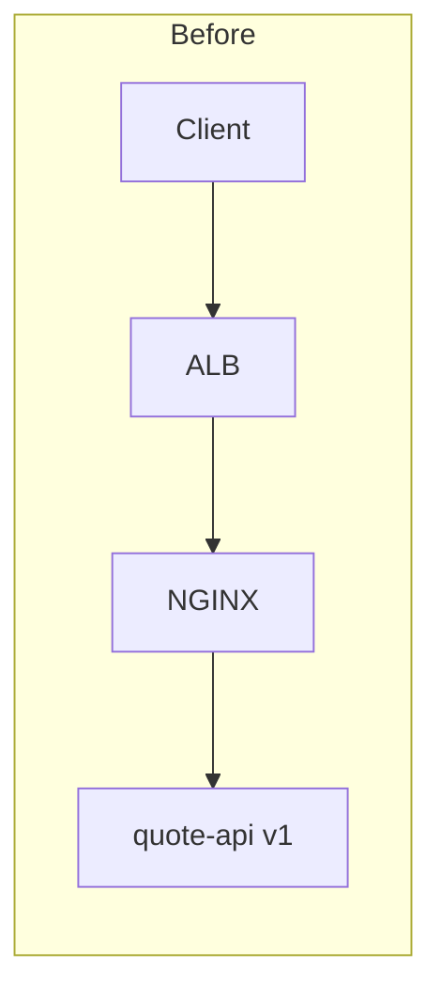
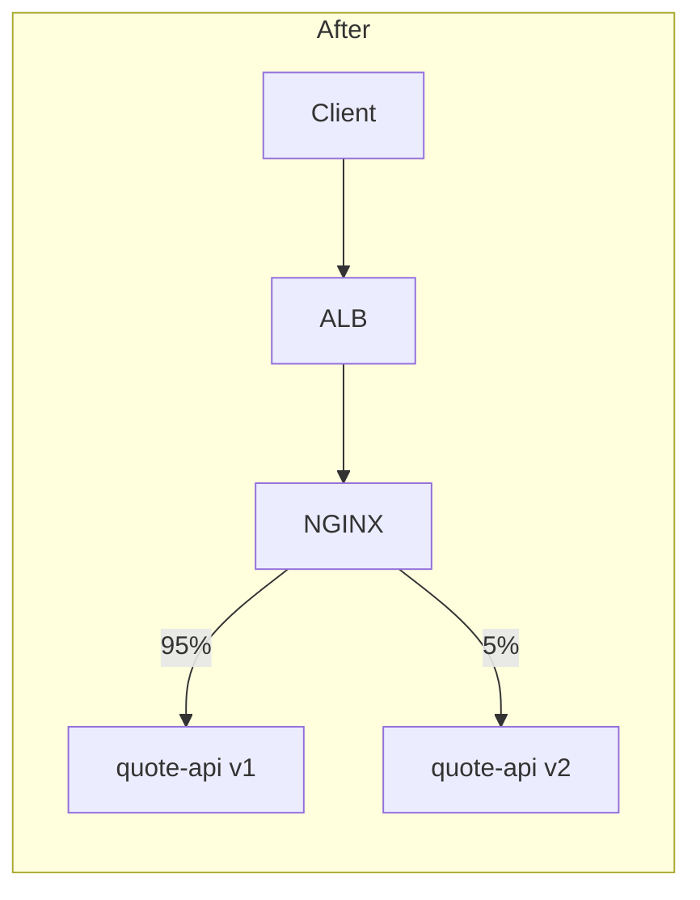

# Part 034 — Senior Engineer Review Framework for NGINX and Traffic Changes

> **Depth level:** Principal-level  
> **Prerequisite:** Part 001–033; pengalaman membaca production architecture, Kubernetes manifests, Helm/Kustomize, cloud load balancers, Java/JAX-RS services, observability, incidents, dan change requests.  
> **Scope:** risk-based PR review dan ADR framework untuk NGINX, Ingress/Gateway, DNS, load balancer, TLS, routing, headers, auth, payload, timeouts, retries, buffering, streaming, WebSocket/SSE/gRPC, caching, rate control, performance, GitOps, rollout, rollback, security/compliance, test evidence, ownership, and operational readiness.  
> **Bukan scope utama:** mengulang seluruh materi directive dan troubleshooting detail; part ini mengubah materi sebelumnya menjadi review questions, decision gates, evidence expectations, dan concise architecture records.

---

## Operating premise

PR yang mengubah traffic path adalah perubahan terhadap distributed system state machine.

Diff berikut terlihat kecil:

```yaml
annotations:
  nginx.ingress.kubernetes.io/proxy-read-timeout: "300"
```

Tetapi reviewer harus menilai:

```text
client deadline
→ outer LB timeout
→ NGINX connection occupancy
→ Java request/executor lifetime
→ database/downstream timeout
→ cancellation behavior
→ retry/idempotency
→ file descriptors and capacity
→ SLO and alerting
→ rollout and rollback
```

Atau:

```yaml
backend:
  service:
    name: quote-api-v2
```

Sebenarnya mengubah:

- traffic destination;
- contract compatibility;
- auth/header trust;
- TLS/protocol;
- readiness and capacity;
- session/state;
- logs/metrics;
- failure ownership;
- rollback dependency.

> **Core invariant:** Reviewer harus menilai perubahan pada request lifecycle, trust boundaries, capacity, failure propagation, and operational state—not only whether the manifest is syntactically valid.

---

## Daftar isi

1. [Tujuan pembelajaran](#tujuan-pembelajaran)
2. [Review philosophy](#review-philosophy)
3. [What is actually being changed](#what-is-actually-being-changed)
4. [Review as risk reduction](#review-as-risk-reduction)
5. [Risk classification](#risk-classification)
6. [Evidence proportionality](#evidence-proportionality)
7. [Reviewer roles](#reviewer-roles)
8. [Required PR package](#required-pr-package)
9. [Intent statement](#intent-statement)
10. [Before-and-after topology](#before-and-after-topology)
11. [Request-lifecycle diff](#request-lifecycle-diff)
12. [Invariant register](#invariant-register)
13. [Assumption register](#assumption-register)
14. [Dependency and ownership map](#dependency-and-ownership-map)
15. [Controller and version compatibility](#controller-and-version-compatibility)
16. [Source, rendered, live, and runtime diff](#source-rendered-live-and-runtime-diff)
17. [Routing review](#routing-review)
18. [Rewrite and URI review](#rewrite-and-uri-review)
19. [DNS and service-discovery review](#dns-and-service-discovery-review)
20. [Load-balancer and network review](#load-balancer-and-network-review)
21. [TLS and certificate review](#tls-and-certificate-review)
22. [mTLS and upstream encryption review](#mtls-and-upstream-encryption-review)
23. [Forwarded-header and source-IP review](#forwarded-header-and-source-ip-review)
24. [Authentication review](#authentication-review)
25. [Authorization and tenant-boundary review](#authorization-and-tenant-boundary-review)
26. [Request and response semantics review](#request-and-response-semantics-review)
27. [Body, header, and URI limit review](#body-header-and-uri-limit-review)
28. [Timeout and deadline review](#timeout-and-deadline-review)
29. [Retry and idempotency review](#retry-and-idempotency-review)
30. [Buffering and streaming review](#buffering-and-streaming-review)
31. [WebSocket, SSE, and gRPC review](#websocket-sse-and-grpc-review)
32. [Compression, caching, and static content review](#compression-caching-and-static-content-review)
33. [Rate, concurrency, and overload review](#rate-concurrency-and-overload-review)
34. [Security review](#security-review)
35. [Privacy and logging review](#privacy-and-logging-review)
36. [Observability review](#observability-review)
37. [Performance and capacity review](#performance-and-capacity-review)
38. [Kubernetes runtime review](#kubernetes-runtime-review)
39. [GitOps and configuration-management review](#gitops-and-configuration-management-review)
40. [Rollout review](#rollout-review)
41. [Rollback and recovery review](#rollback-and-recovery-review)
42. [Operational readiness review](#operational-readiness-review)
43. [Test strategy](#test-strategy)
44. [Negative and failure tests](#negative-and-failure-tests)
45. [Change coupling and transaction boundaries](#change-coupling-and-transaction-boundaries)
46. [Review gates](#review-gates)
47. [Review comments that add value](#review-comments-that-add-value)
48. [Common weak review patterns](#common-weak-review-patterns)
49. [ADR decision framework](#adr-decision-framework)
50. [ADR template](#adr-template)
51. [Worked PR review examples](#worked-pr-review-examples)
52. [Worked ADR example](#worked-adr-example)
53. [Compact checklists by change type](#compact-checklists-by-change-type)
54. [Final approval checklist](#final-approval-checklist)
55. [Internal verification checklist](#internal-verification-checklist)
56. [Final mental model](#final-mental-model)
57. [Referensi resmi](#referensi-resmi)

---

## Tujuan pembelajaran

Setelah menyelesaikan part ini, Anda harus mampu:

- mengklasifikasikan diff kecil berdasarkan actual request-lifecycle and trust impact;
- menentukan evidence yang proporsional terhadap blast radius, novelty, reversibility, dan observability gap;
- mereview source diff bersama rendered manifest, effective runtime config, dan test results;
- menemukan hidden coupling antara NGINX, cloud LB, DNS, Kubernetes, Java/JAX-RS, auth, database, clients, dan incident operations;
- memverifikasi routing, TLS, headers, timeouts, retries, payloads, streaming, security, performance, observability, rollout, dan rollback secara sistematis;
- menolak perubahan yang belum siap tanpa bergantung pada komentar subjektif;
- menulis review comment yang menyebut risk, evidence gap, dan required resolution;
- membuat ADR ringkas tetapi cukup kuat untuk menjelaskan context, decision, alternatives, invariants, trade-offs, failure modes, operational ownership, migration, dan review trigger;
- membedakan reversible implementation detail dari long-lived architecture decision;
- membangun review culture yang cepat pada low-risk change dan dalam pada high-risk change.

---

## Review philosophy

### Review tujuan utama

Review mengurangi probabilitas dan dampak failure melalui:

- clarified intent;
- challenged assumptions;
- detected incompatibility;
- verified evidence;
- bounded rollout;
- executable rollback;
- explicit ownership;
- preserved architecture rationale.

### Review bukan

- menunjukkan bahwa reviewer mengetahui lebih banyak directive;
- menuntut redesign pada setiap PR;
- berdebat style sementara failure mode tidak dibahas;
- mengandalkan seniority tanpa evidence;
- memberi approval karena “works in dev”;
- meminta semua test tanpa risk prioritization;
- menunda perubahan low-risk dengan bureaucracy yang tidak proporsional.

### Principal-level question

Bukan:

```text
Apakah annotation ini benar?
```

Tetapi:

```text
Apa contract dan failure behavior yang berubah,
siapa yang bergantung padanya,
bagaimana kita membuktikan safe transition,
dan apa yang terjadi ketika asumsi kita salah?
```

---

## What is actually being changed

Classify actual change:

| Declared diff | Actual change |
|---|---|
| add Ingress host | public/internal exposure and trust boundary |
| change `proxy_pass` | upstream destination and protocol contract |
| change timeout | concurrency/deadline/cancellation behavior |
| enable buffering off | memory/backpressure/streaming behavior |
| set forwarded header | identity, redirect, audit attribution |
| add cache | consistency/privacy/data lifecycle |
| change certificate Secret | client trust and availability |
| add rate limit | admission policy and tenant fairness |
| controller image bump | parser/default/module/control-plane behavior |
| Service type change | network exposure and source-IP path |
| ConfigMap update | shared platform-wide behavior |
| snippet | arbitrary runtime configuration capability |
| rewrite target | application URI and security-route mapping |
| change `externalTrafficPolicy` | routing, source IP, capacity, health |

### Review opening question

```text
What user-visible, security-visible, and operator-visible behavior can change?
```

If author cannot answer, PR is not ready.

---

## Review as risk reduction

Risk model:

```text
change risk =
  blast radius
× semantic complexity
× probability of defect
× detection latency
× recovery latency
```

Review can reduce:

- probability: validation/tests/design;
- blast radius: sharding/canary;
- detection latency: metrics/synthetics;
- recovery latency: rollback/known-good artifacts;
- semantic uncertainty: explicit contracts/ADR.

### Review effort

```text
review depth ∝ risk + novelty + irreversibility + evidence gap
```

Not line count.

A one-line global ConfigMap change may need deeper review than a 500-line test refactor.

---

## Risk classification

### Low

- route-specific observability label;
- documentation;
- known-safe exact profile;
- no external behavior;
- automated test coverage;
- easy rollback.

### Medium

- route timeout/body-size;
- internal hostname;
- controlled certificate rotation;
- application-specific header;
- additional replica/resource change.

### High

- public route;
- auth/identity;
- TLS/mTLS/CA;
- global ConfigMap;
- controller version/module;
- WAF/rate-limit baseline;
- source-IP trust;
- cache for authenticated response;
- gRPC/WebSocket protocol;
- DNS/LB cutover.

### Critical

- cross-tenant routing/cache;
- public admin exposure;
- fail-open auth;
- private-key handling;
- shared edge replacement;
- unsupported controller on public path;
- multi-region migration with no rollback;
- destructive CRD/protocol transition.

### Risk modifiers

- first use of pattern;
- limited observability;
- low traffic hides failure;
- long-lived connections;
- mutation/idempotency;
- regulatory/customer criticality;
- external partner/client diversity;
- multiple teams/control planes;
- peak/business window.

---

## Evidence proportionality

| Risk | Minimum evidence |
|---|---|
| Low | lint, rendered diff, unit/static test |
| Medium | runtime config test, route matrix, non-prod smoke, rollback |
| High | architecture/topology diff, negative tests, representative integration/load/protocol tests, canary plan, dashboards/runbook |
| Critical | formal ADR/security review, cross-team approval, failure injection/game day, staged migration, explicit risk acceptance |

### Evidence quality questions

- Is test on exact version/image/controller?
- Does it exercise actual path?
- Does it include negative cases?
- Is load representative?
- Are stable/candidate metrics separable?
- Does test include all regions/replicas/protocols?
- Is result reproducible?
- Is evidence fresh?
- What remains untested?

---

## Reviewer roles

### Application reviewer

Focus:

- JAX-RS path/media/redirect;
- domain authorization;
- idempotency;
- timeout/cancellation;
- business correctness;
- application capacity.

### Platform/NGINX reviewer

Focus:

- controller compatibility;
- generated config;
- routing;
- headers;
- TLS;
- rollout/reload;
- shared blast radius.

### Network/cloud reviewer

Focus:

- DNS;
- LB listener/target;
- SG/NSG/firewall;
- source IP;
- private/public topology;
- health/draining.

### Security/identity reviewer

Focus:

- auth;
- identity trust;
- exposure;
- WAF;
- Secrets;
- logging/privacy;
- exceptions.

### SRE/operations reviewer

Focus:

- SLO;
- capacity;
- observability;
- alerts;
- runbooks;
- rollback;
- incident impact.

Not every PR needs every reviewer. Risk classification determines required ownership.

---

## Required PR package

High-value PR description:

```markdown
## Intent
What problem/outcome?

## Scope
Hosts, paths, protocols, environments, tenants, controllers.

## Before/after topology
Diagram or link.

## Request lifecycle change
Which hops/contracts change?

## Invariants
What must remain true?

## Assumptions
What is believed and how verified?

## Rendered/effective diff
Artifacts and config.

## Tests
Positive, negative, failure, performance, protocol.

## Observability
Metrics/logs/traces/dashboard/alerts.

## Rollout
Exposure steps and gates.

## Rollback
Exact revision, dependencies, expected convergence.

## Security/privacy
Impact and approvals.

## Ownership
Operators/on-call/runbook.
```

### Merge blocker — Ownership

A high-risk PR with only:

```text
“Update ingress timeout for issue XYZ.”
```

is not reviewable.

---

## Intent statement

Good intent:

```text
Allow server-sent event subscriptions to remain open for up to 30 minutes,
while retaining 15-second heartbeats, bounded client reconnect, and no change
to standard REST endpoint timeout.
```

Weak:

```text
Increase timeout.
```

Intent must explain:

- user/business outcome;
- affected request class;
- why current state fails;
- why NGINX is correct enforcement point;
- constraints;
- non-goals.

### Challenge placement

Ask:

```text
Should this be solved in NGINX, application, client, API gateway, service mesh,
cloud LB, or workflow redesign?
```

Avoid adding NGINX policy that masks an application architecture problem.

---

## Before-and-after topology





Diagram should include:

- DNS;
- TLS termination;
- auth;
- routing;
- load balancers;
- controllers/classes;
- Services/backends;
- protocol;
- direct/alternate paths;
- data/state dependencies.

### Topology review questions

- New hop?
- Removed hop?
- Policy duplicated?
- Trust boundary moved?
- Source identity changed?
- TLS plaintext segment introduced?
- Failure domain changed?
- Ownership changed?
- New bypass path?
- More retry/timeout layers?

---

## Request-lifecycle diff

Create table:

| Phase | Before | After | Risk |
|---|---|---|---|
| DNS | old ALB | same | none |
| TLS | ALB terminates | ALB terminates | cert unchanged |
| Host route | `/api`→v1 | `/api` weighted v1/v2 | split behavior |
| Headers | same | adds `X-Revision` | spoof/trust |
| Upstream TLS | off | on | CA/SNI |
| Timeout | 30 s | 30 s | same |
| Response | JSON v1 | compatible JSON | schema verification |
| Metrics | route only | revision label | cardinality |
| Rollback | v1 retained | route weight zero | connection persistence |

This exposes changes hidden by YAML.

---

## Invariant register

Examples:

```yaml
invariants:
  - "Unknown public hosts never route to an application."
  - "Client-supplied identity headers never reach Java unchanged."
  - "A client timeout cannot cause duplicate order creation."
  - "External requests always use TLS with valid SNI certificate."
  - "Tenant A cannot receive cached response from tenant B."
  - "At least N healthy ingress replicas remain during rollout."
  - "All request paths remain traceable to config and backend revision."
```

### Review use

For each invariant:

- is it affected?
- what control maintains it?
- what test proves it?
- what alert detects violation?
- who owns it?

Invariants make review less subjective.

---

## Assumption register

Example:

| Assumption | Verification | If false |
|---|---|---|
| Client retries only GET | client telemetry/spec | duplicate mutation risk |
| ALB timeout is 60 s | live cloud config | outer timeout may fire first |
| Backend v1/v2 session compatible | integration test | canary session failures |
| Controller supports annotation | exact-version docs/test | setting ignored/rejected |
| Service has N+1 capacity | load/capacity evidence | rollout overload |
| Cert SAN includes Service name | certificate test | upstream TLS failure |

### Dangerous assumptions

- “internal clients behave consistently”;
- “all requests are idempotent”;
- “controller reload is zero downtime”;
- “DNS TTL means clients refresh on time”;
- “same YAML behaves same across controllers”;
- “readiness means capable of full load”.

---

## Dependency and ownership map

List coordinated components:

```text
DNS record
cloud LB listener/target
certificate/CA
IngressClass/controller
global ConfigMap
Ingress/HTTPRoute
Service/EndpointSlice
Java deployment
auth service
database/downstream
client configuration
dashboard/alerts/runbook
```

For each:

- owner;
- revision/change;
- order;
- approval;
- rollback;
- support contact.

### Transaction boundary

Kubernetes apply is not an atomic transaction across DNS, cloud LB, certificates, Java, and clients.

PR/ADR must model transition states.

---

## Controller and version compatibility

Review exact:

- NGINX Open Source/Plus;
- F5 NGINX Ingress Controller or other implementation;
- controller version;
- NGINX binary/module;
- Kubernetes version;
- CRD version;
- annotation prefix;
- Helm chart version;
- cloud controller version.

Questions:

- Feature supported?
- Default changed?
- Commercial-only?
- Experimental?
- Annotation disabled by policy?
- CRD schema requires migration?
- Upgrade/rollback compatible?
- Documentation matches exact product/version?

Do not approve based on similarly named controller documentation.

---

## Source, rendered, live, and runtime diff

Required for medium/high risk:

1. source diff;
2. rendered manifests;
3. policy/admission result;
4. expected live objects;
5. generated NGINX config diff;
6. loaded revision/hash plan;
7. observed request behavior.

### Review questions

- Does rendered output contain unexpected deletion/default?
- Does admission mutate it?
- Are duplicate resources present?
- Does generated location/upstream match intent?
- Are all replicas expected to be identical?
- How is runtime revision observed?
- What prevents Git/live drift?

---

## Routing review

Checklist:

- host exact/wildcard/hostless;
- default server;
- path type;
- exact/prefix/regex;
- ordering and conflicts;
- method handling;
- trailing slash;
- query preservation;
- case/normalization;
- namespace boundary;
- duplicate Ingress/HTTPRoute;
- default backend;
- canary/sticky behavior;
- route markers/observability.

### Questions — Routing review

- What request examples should match?
- What near-match must not match?
- Can a broader path shadow sensitive route?
- What happens to unknown host/path?
- Does route move public/internal boundary?
- Does one controller interpret `ImplementationSpecific` differently?
- Are regex capture groups stable?

### Required test matrix

| Host | Method | Path | Expected route | Negative? |
|---|---|---|---|---|
| valid | GET | `/api/quotes/1` | quote-api | no |
| valid | GET | `/api/admin` | deny/admin | yes |
| unknown | GET | `/api/quotes/1` | default deny | yes |
| valid | POST | `/api/quotes/1/` | specified | edge |

---

## Rewrite and URI review

Check:

- prefix stripping/addition;
- `proxy_pass` trailing slash semantics;
- regex captures;
- query;
- encoded path;
- double slash;
- redirect;
- base/context path;
- JAX-RS `UriInfo`;
- OpenAPI server URL;
- auth callback;
- cookie path;
- canonical URL.

### Security questions

- Can rewrite bypass auth-protected location?
- Does path normalization differ between proxies/app?
- Can encoded traversal reach sensitive path?
- Can attacker influence redirect host/scheme?
- Does error page internally redirect to weaker route?

### Evidence — Rewrite and URI review

- table mapping external→upstream path;
- direct backend expected path;
- absolute redirect tests;
- negative encoded-path tests.

---

## DNS and service-discovery review

Check:

- hostname/IP strategy;
- startup versus runtime resolution;
- resolver and TTL;
- Service ClusterIP versus headless/direct endpoints;
- stale connection;
- A/AAAA;
- private/public split;
- failover;
- CoreDNS capacity;
- Java DNS cache;
- ExternalName/CNAME;
- rollback.

### Questions — DNS and service-discovery review

- What happens when IP changes?
- How long can stale address persist?
- Does `resolve` feature exist in exact version?
- Are existing keepalive connections migrated?
- What is negative-cache behavior?
- Can IPv6 select untested path?
- Is DNS an availability dependency for every request or only refresh?

---

## Load-balancer and network review

Check:

- LB type/protocol;
- public/private;
- target mode;
- listener/rules;
- health checks;
- source IP;
- PROXY protocol;
- forwarded headers;
- idle timeout;
- deregistration;
- zones/subnets;
- security rules;
- NACL/firewall;
- MTU;
- direct origin;
- WAF/DDoS.

### Questions — Load-balancer and network review

- Does new path alter source identity?
- Does health probe use same protocol/path?
- Can target be healthy but user traffic fail?
- Is alternate zone/region capacity sufficient?
- What cloud resource is generated outside manifest?
- How is drift detected?
- What is rollback propagation time?

---

## TLS and certificate review

Check:

- termination/passthrough/re-encryption;
- SNI;
- SAN;
- chain;
- key ownership;
- TLS protocol/cipher;
- ALPN;
- HTTP/2/gRPC;
- HSTS;
- rotation;
- every replica/target;
- client compatibility.

### Questions — TLS and certificate review

- Does certificate cover every host?
- Are old/new certs overlapped?
- Can rollback use still-valid old cert?
- Is plaintext introduced?
- Is private key shared more broadly?
- Does client pin/cache affect cutover?
- Does certificate manager trigger reload?
- Is expiry monitoring owner known?

### Tests — TLS and certificate review

- fresh handshake;
- every edge IP;
- wrong SNI;
- deprecated protocol negative test;
- chain verification;
- post-rotation serial.

---

## mTLS and upstream encryption review

Check:

- client cert validation;
- CA bundle;
- subject/SAN mapping;
- revocation posture;
- upstream verification;
- SNI/name;
- client certificate/key;
- dual-trust rollover;
- service mesh interaction.

### Gate

Do not approve “enable mTLS” without transition matrix:

```text
old client/new server
new client/old server
new client/new server
rollback state
```

### Negative tests

- missing cert;
- untrusted cert;
- expired/wrong identity;
- wrong upstream certificate;
- wrong SNI.

---

## Forwarded-header and source-IP review

Check:

- trust chain;
- which hop sanitizes;
- `Forwarded` versus `X-Forwarded-*`;
- Host/scheme;
- IP list parsing;
- trusted proxy CIDR;
- `real_ip_recursive`;
- PROXY protocol;
- direct path;
- Java forwarded-header config.

### Invariants — Forwarded-header and source-IP review

- client cannot choose authenticated identity;
- client cannot spoof allowlisted source;
- generated redirect uses canonical external URL;
- audit client attribution is explainable.

### Tests — Forwarded-header and source-IP review

- spoofed headers from untrusted client;
- valid request through all LB paths;
- direct backend attempt;
- failover source-IP behavior;
- IPv6.

---

## Authentication review

Check:

- where authentication occurs;
- Basic/OIDC/OAuth/JWT/mTLS/external auth;
- issuer/audience/key;
- session/cookie;
- auth-request status;
- timeout/cache;
- fail closed;
- direct bypass;
- logout/key rotation;
- observability.

### Questions — Authentication review

- What is trusted credential?
- Who validates it?
- Does backend independently validate or trust edge identity?
- What signs/binds identity headers?
- What happens if auth service is unavailable?
- Are routes consistent?
- Can cache reuse auth result across tenant/user incorrectly?
- Does preview/canary path use same auth?

---

## Authorization and tenant-boundary review

Check:

- route-level coarse policy;
- Java object/tenant/lifecycle authorization;
- identity/tenant source;
- cache/routing;
- admin operations;
- cross-tenant negative tests;
- audit.

### Merge blocker — Authorization and tenant-boundary review

Any change that can alter tenant routing/identity without explicit cross-tenant negative tests and security owner review.

---

## Request and response semantics review

Check:

- methods;
- idempotency;
- status propagation;
- hop-by-hop headers;
- content negotiation;
- CORS;
- conditional/range;
- trailers;
- redirects;
- cookies;
- compression;
- HTTP versions.

Questions:

- Does NGINX intercept/replace error?
- Does `OPTIONS` bypass auth?
- Does HEAD behave?
- Does response header rewriting break client?
- Does HTTP/2 conversion affect header assumptions?
- Is `Set-Cookie` domain/path/same-site correct?
- Are trailers required for gRPC?

---

## Body, header, and URI limit review

Create limit matrix:

| Layer | Body | Header | URI | Timeout |
|---|---:|---:|---:|---:|
| Client SDK | | | | |
| CDN/WAF/LB | | | | |
| NGINX | | | | |
| Java container | | | | |
| JAX-RS/multipart | | | | |
| Downstream/storage | | | | |

Questions:

- What business payload maximum?
- Why does limit increase?
- Memory/disk effect?
- WAF inspection?
- Slow upload?
- Multipart overhead?
- Error provenance?
- Negative boundary tests?

Do not approve limit increase without capacity/security analysis.

---

## Timeout and deadline review

Create full chain:

| Hop | Connect | Send | Read idle | Total/deadline |
|---|---:|---:|---:|---:|
| Client | | | | |
| CDN/LB | | | | |
| NGINX | | | | |
| Java | | | | |
| DB/downstream | | | | |

Review:

- idle versus total;
- outer/inner ordering;
- long-running semantics;
- client cancellation;
- Java interruption;
- transaction continuation;
- connection occupancy;
- SLO;
- retries.

### Question

Is timeout increase treating legitimate long operation, or hiding saturation/architecture problem?

### Capacity

```text
concurrency ≈ arrival rate × latency
```

Longer timeout can increase resource occupancy.

---

## Retry and idempotency review

Inventory retries at:

- client;
- SDK;
- CDN/LB;
- NGINX;
- service mesh;
- Java client;
- database/driver.

Questions:

- Which errors trigger retry?
- Which methods?
- Did bytes reach upstream?
- Is mutation idempotent?
- Idempotency key?
- Attempt budget?
- Backoff/jitter?
- Retry storm?
- Status/timing observable?
- Does retry cross revisions/regions?

### Merge blocker — Retry and idempotency review

Blind retry for POST/order mutation without a verified idempotency strategy.

---

## Buffering and streaming review

Check:

- request buffering;
- response buffering;
- temp files;
- memory/disk;
- backpressure;
- slow clients;
- streaming flush;
- compression;
- cancellation;
- upload/download.

Questions:

- Does Java receive body only after full buffering?
- Does disabling buffering expose backend to slow client?
- Can temp disk fill?
- Is response truly streamed through all outer layers?
- How are partial writes/retries handled?
- Is sensitive data written to disk?
- Does read-only filesystem have required writable mount?

---

## WebSocket, SSE, and gRPC review

### WebSocket

- upgrade headers;
- auth/origin;
- idle timeout/heartbeat;
- session;
- connection capacity;
- drain/reconnect.

### SSE

- content type;
- buffering off;
- heartbeat;
- `Last-Event-ID`;
- replay;
- proxy/LB timeout;
- rollout.

### gRPC

- h2/h2c;
- ALPN;
- `grpc_pass`;
- TLS verification;
- trailers/status;
- deadlines;
- streaming;
- health probes;
- metadata size.

### Required evidence

- protocol-specific client test;
- long-duration test;
- pod termination test;
- LB timeout;
- error/close semantics;
- capacity/reconnect model.

---

## Compression, caching, and static content review

### Compression

- MIME;
- CPU;
- `Vary`;
- double compression;
- sensitive response side channel;
- streaming latency.

### Caching

- eligibility;
- key;
- auth/cookie;
- tenant/user;
- freshness;
- stale;
- purge;
- negative caching;
- replica-local behavior;
- privacy.

### Static/SPA

- immutable assets;
- fallback;
- sensitive route interception;
- cache headers;
- content type.

### Merge blocker — Compression, caching, and static content review

Authenticated/tenant response caching without explicit isolation test.

---

## Rate, concurrency, and overload review

Check:

- objective;
- key;
- rate/concurrency/burst;
- local/distributed;
- response/status;
- Retry-After;
- NAT/tenant fairness;
- HPA/replicas;
- critical-route priority;
- observability;
- dry run.

Questions:

- What resource is protected?
- Can key be spoofed/varied?
- Is limit before expensive work?
- What is false-positive impact?
- What happens during limiter failure?
- Does change reduce or move overload?
- Is DDoS handled upstream?

---

## Security review

Use Part 033 evidence model.

Minimum questions:

- exposure change?
- default deny?
- auth/authz?
- source/identity spoofing?
- TLS/mTLS?
- limits/WAF?
- admin/internal path?
- direct bypass?
- snippet?
- RBAC/Secret?
- image/module?
- exception?
- negative tests?
- incident/security owner?

High-risk changes need independent security review, not only application approval.

---

## Privacy and logging review

Check:

- new log fields;
- URI/query;
- headers;
- body;
- tenant/user IDs;
- IP/user agent;
- trace attributes;
- debug logs;
- retention/access;
- cardinality/cost;
- legal basis/internal policy.

Questions:

- Is data necessary?
- Can it be hashed/redacted?
- Is token/cookie exposed?
- Is query string safe?
- Does new route contain identifiers?
- Are logs sampled?
- Can incident investigation still work?
- Who can access/export?

---

## Observability review

Required dimensions:

- request ID;
- trace;
- route;
- ingress pod;
- config revision;
- upstream;
- backend revision;
- status provenance;
- timings;
- protocol;
- limiter/cache/TLS signal.

### Dashboard questions

- Can stable/candidate be separated?
- Can one replica/zone be isolated?
- Are p95/p99 and errors visible?
- Are critical business outcomes present?
- Are metrics high-cardinality?
- What alert detects failure?
- What if telemetry is missing?
- Does runbook link exist?

### Review gate

A change with new failure mode but no detection method is incomplete.

---

## Performance and capacity review

Assess:

- workers/connections;
- file descriptors;
- CPU/throttling;
- memory;
- temp disk;
- TLS/compression;
- upstream connections;
- Java executor;
- DB pool;
- long-lived connections;
- DNS;
- conntrack/ports;
- surge/failover.

### Capacity worksheet

```text
peak RPS
× p99/request lifetime
= concurrent requests

+ idle keepalive
+ long-lived streams
+ upstream connections
+ rollout overlap
+ retry/reconnect surge
```

Questions:

- Where is bottleneck?
- Does adding NGINX capacity overload backend?
- What is N+1?
- What happens if one zone/controller fails?
- Is load test open/closed model representative?
- What headroom is required?

---

## Kubernetes runtime review

Check:

- Deployment/DaemonSet;
- replicas/zones;
- requests/limits;
- probes;
- termination;
- PDB;
- topology spread;
- Service;
- EndpointSlice;
- `externalTrafficPolicy`;
- NetworkPolicy;
- RBAC;
- Pod Security;
- ConfigMap/Secret mounts;
- HPA;
- node capacity.

### Questions — Kubernetes runtime review

- Does readiness prove latest config loaded?
- Does `preStop` fit grace?
- Can surge schedule?
- Does PDB match replicas?
- Is controller cluster-wide?
- Are Secrets overbroad?
- Can one node loss remove all ingress?
- Does rollout create connection storm?

---

## GitOps and configuration-management review

Check:

- authoritative repo;
- tool/dependency pin;
- Helm/Kustomize schema;
- rendered diff;
- policy;
- exact image `nginx -t`;
- server dry-run;
- controller sandbox;
- artifact provenance;
- sync/prune/self-heal;
- generated config;
- drift;
- break-glass.

### Questions — GitOps and configuration-management review

- Is deployment render deterministic?
- Is production re-render different?
- Can manual change persist?
- Can rollback be overwritten?
- Are deleted resources obvious?
- Are source/live/runtime revisions correlated?
- Who approves shared/global changes?

---

## Rollout review

Select strategy:

- reload;
- rolling update;
- canary;
- blue-green;
- shadow;
- staged migration;
- DNS/LB cutover.

Required:

- exposure increments;
- success metrics;
- sample/window;
- stop/abort;
- capacity;
- long connections;
- compatibility;
- owner;
- change window.

### Questions — Rollout review

- What is traffic unit: request, connection, tenant?
- Is observed percentage measurable?
- Are stable/candidate metrics isolated?
- What does missing data do?
- Does session affinity distort?
- Can candidate be removed immediately?
- What is reconnect impact?

---

## Rollback and recovery review

Rollback must specify:

- exact artifacts/revisions;
- order;
- dependencies;
- old backend/cert/Secret;
- compatibility;
- GitOps/progressive controller;
- DNS/LB propagation;
- persistent connections;
- validation;
- estimated convergence.

### Questions — Rollback and recovery review

- Is rollback actually possible after data/schema change?
- Is old certificate still valid?
- Has old backend been scaled down?
- Does revert restore generated runtime config?
- Can client cache/HSTS/DNS prevent quick rollback?
- What correctness checks after rollback?
- Is forward fix safer?

---

## Operational readiness review

Check:

- SLO/alerts;
- dashboard;
- runbook;
- on-call;
- escalation;
- vendor support;
- synthetic;
- capacity;
- incident severity;
- business workaround;
- evidence;
- review date.

### “Ready” means

```text
we can detect
we can diagnose
we can mitigate
we can recover
we know who owns it
```

Not only “deployment is healthy”.

---

## Test strategy

Test layers:

1. source/schema/lint;
2. render/policy;
3. NGINX exact binary config test;
4. controller reconciliation;
5. route/header/TLS unit/integration;
6. protocol;
7. security negative;
8. performance/capacity;
9. rollout/drain;
10. post-deploy synthetic.

### Test matrix dimensions

- host;
- path;
- method;
- protocol;
- body size;
- auth identity;
- tenant;
- HTTP version;
- route revision;
- region/zone;
- positive/negative;
- normal/failure.

### Evidence question

Does test prove only happy path, or also the invariant that dangerous inputs are rejected?

---

## Negative and failure tests

Examples:

- unknown Host;
- wrong SNI;
- missing/expired token;
- spoofed identity header;
- unauthorized tenant/object;
- body just above limit;
- slow upload;
- backend connection refused;
- upstream TLS wrong cert;
- zero endpoints;
- auth service timeout;
- one ingress replica failed reload;
- pod termination during SSE/WebSocket/gRPC;
- cache cross-tenant attempt;
- limiter burst;
- DNS stale target;
- rollback.

Negative tests should be safe and controlled.

---

## Change coupling and transaction boundaries

### Hidden coupling examples

- TLS Secret change + controller reload;
- route change + Java base path;
- `X-Forwarded-Proto` + redirect/OIDC callback;
- body limit + WAF + Java multipart + object storage;
- timeout + client retry + DB transaction;
- `externalTrafficPolicy` + source-IP allowlist;
- canary + session cookie + cache;
- new controller + annotation semantics;
- DNS cutover + certificate + client cache.

### Review technique

Create dependency transition table:

| Step | State | Compatible with previous? | Rollback |
|---|---|---|---|
| deploy backend dual path | old+new | yes | remove new |
| add new route | both paths | yes | remove route |
| migrate clients | mixed | yes | client rollback |
| remove old path | new only | no after removal | redeploy old |

This converts “deploy all changes” into safe transition.

---

## Review gates

### Gate 1 — Intent

- problem and outcome clear;
- correct layer;
- scope/non-goals.

### Gate 2 — Architecture

- topology/lifecycle diff;
- invariants/assumptions;
- ownership/dependencies.

### Gate 3 — Compatibility and security

- exact product/version;
- auth/TLS/routing/data boundaries;
- transition states.

### Gate 4 — Evidence

- rendered/runtime config;
- positive/negative tests;
- capacity/protocol evidence.

### Gate 5 — Operations

- observability;
- rollout;
- rollback;
- runbook/on-call.

### Gate 6 — Approval

- required owners;
- residual risk;
- exceptions;
- change window.

A PR can be syntactically correct and still fail Gate 2–5.

---

## Review comments that add value

### Weak — Review comments that add value

```text
Are you sure this timeout is okay?
```

### Strong — Review comments that add value

```text
This raises `proxy_read_timeout` from 30s to 300s for all `/api` routes.
At peak 120 RPS, a stalled upstream could increase occupied requests from roughly
3,600 to 36,000 before timeout, and the client still cancels at 45s.

Please:
1. scope this to the SSE location or explain why all REST routes need it;
2. attach the end-to-end timeout table including ALB/client/Java/downstream;
3. show connection/FD capacity and client-cancellation behavior;
4. define alert and rollback criteria.
```

### Weak — Review comments that add value (2)

```text
Need security review.
```

### Strong — Review comments that add value (2)

```text
The new `X-Tenant-Id` header becomes an authorization input in Java.
The current config uses `proxy_set_header` but the PR does not show that
client-supplied values are stripped at the first trusted edge or that direct
Service access is blocked.

Required evidence:
- generated config for every external path;
- negative spoofing test;
- direct-backend reachability result;
- application cross-tenant authorization test;
- identity/platform security approval.
```

### Comment structure

```text
Observed change
→ risk/failure mode
→ missing evidence
→ concrete resolution/gate
```

---

## Common weak review patterns

### Syntax-only approval

Misses distributed behavior.

### “Works in dev”

Dev may differ in LB, DNS, scale, auth, certificate, traffic, and policy.

### Documentation link without exact version

Feature/default may differ.

### Ask for more replicas as generic safety

May overload backend or not solve route/config defect.

### Timeout increase as harmless

Changes concurrency and failure propagation.

### Rollback = git revert

Ignores convergence, Secrets, DNS, data, and long connections.

### Security = TLS enabled

Misses identity, direct bypass, cache, logs, and upstream verification.

### Observability = dashboard exists

Dashboard may not separate route/revision or detect correctness.

### Checklist theater

Boxes checked without evidence.

### Over-review low-risk changes

Creates bypass culture and slows feedback.

### Reviewer rewrites solution

Can obscure author ownership and decision rationale. Ask for invariants/evidence first.

---

## ADR decision framework

ADR is appropriate when decision is:

- long-lived;
- cross-team;
- hard/expensive to reverse;
- creates platform standard;
- changes trust boundary;
- selects controller/API gateway/mesh;
- defines auth/source-IP contract;
- introduces cache/rate-limit architecture;
- changes public/private topology;
- requires migration/exception.

### ADR questions

1. Context and forces?
2. Decision?
3. Status?
4. Scope?
5. Alternatives?
6. Why selected?
7. Invariants?
8. Assumptions?
9. Trade-offs?
10. Failure modes?
11. Security/privacy?
12. Capacity/performance?
13. Observability?
14. Operations/ownership?
15. Migration?
16. Rollback/reversal?
17. Consequences/debt?
18. Review triggers?

ADR should not become a design novel. It should preserve decisions and reasons.

---

## ADR template

```markdown
# ADR-XXXX: <Decision title>

Status: Proposed | Accepted | Superseded | Deprecated
Date:
Owners:
Reviewers:
Related changes/incidents:

## Context
What problem, current topology, constraints, and forces?

## Decision
What exactly is chosen?

## Scope and non-goals
...

## Invariants
- ...

## Assumptions
| Assumption | Evidence | If false |
|---|---|---|

## Alternatives considered
### A
Pros:
Cons:
Why not:

### B
...

## Request/data flow
Before:
After:

## Security and privacy
...

## Reliability and failure modes
...

## Performance and capacity
...

## Observability and operations
Owners, SLO, alerts, runbooks, support.

## Migration
Stages, compatibility, dependencies.

## Rollback/reversal
What is reversible and at what cost?

## Consequences
Positive, negative, debt.

## Exceptions
...

## Review triggers
Version/EOL, traffic, incident, new regulation, new region.
```

---

## Worked PR review examples

## Example 1 — Increase body size

Diff:

```yaml
nginx.ingress.kubernetes.io/proxy-body-size: "100m"
```

### Review findings

- intent unclear: which business payload?
- global path or upload only?
- Java multipart limit?
- WAF body inspection?
- NGINX temp disk?
- request buffering?
- client timeout?
- object-storage direct upload?
- DoS and tenant fairness?
- boundary test?

### Required resolution

- scope `/documents/upload`;
- documented maximum payload;
- aligned LB/WAF/NGINX/Java/storage limits;
- ephemeral-storage capacity;
- slow-upload protection;
- 99/100/101 MiB tests;
- dashboard/413 metrics;
- rollback.

---

## Example 2 — Add `X-Forwarded-Proto`

Diff:

```nginx
proxy_set_header X-Forwarded-Proto $scheme;
```

### Questions — Example 2 — Add `X-Forwarded-Proto`

- Is `$scheme` client→NGINX or external client scheme?
- Did outer LB terminate TLS and send trusted header?
- Is NGINX receiving HTTP from LB?
- Will Java generate `http://` redirects?
- Is inbound spoofed header sanitized?
- Is `Forwarded` also used?
- Does OIDC callback depend on it?
- Direct path?

### Correct design may require

- trust outer LB only;
- derive canonical external scheme;
- overwrite client value;
- framework forwarded-header config;
- redirect/auth tests.

---

## Example 3 — Enable proxy cache for quote reads

### Review — Example 3 — Enable proxy cache for quote reads

- personalized/tenant data?
- Authorization/Cookie?
- exact cache key?
- ETag/Cache-Control?
- invalidation after quote update?
- stale correctness?
- cross-replica cache?
- encryption/storage?
- cache poisoning?
- purge authorization?
- two-tenant negative test?

A performance optimization can become data exposure.

---

## Example 4 — Controller image upgrade

### Review — Example 4 — Controller image upgrade

- exact old/new versions;
- NGINX/OpenSSL/modules;
- release/security notes;
- annotation/default changes;
- CRDs/webhook;
- rendered config diff;
- same route tests;
- surge capacity;
- one-pod canary;
- long connection drain;
- config revision telemetry;
- previous image digest;
- rollback compatibility.

---

## Worked ADR example

### Decision — Worked ADR example

Adopt a dedicated internal Gateway/Ingress class for long-lived SSE and WebSocket traffic rather than sharing the standard REST ingress.

### Context

- standard ingress optimized for short requests;
- global timeout changes would increase shared connection occupancy;
- long connections need distinct scaling, drain, and observability;
- same auth and DNS ownership remain.

### Alternatives

1. Increase global timeout.
   - simple;
   - unacceptable shared blast radius.

2. Per-route annotations on shared controller.
   - lower cost;
   - connection/rollout failure domain still shared.

3. Dedicated class/controller.
   - higher cost/operations;
   - isolated capacity, timeout, rollout, and incidents.

### Decision — Worked ADR example (2)

Choose dedicated internal class/controller for realtime routes.

### Invariants — Worked ADR example

- same identity contract;
- direct backend blocked;
- no public exposure;
- reconnect/resume supported;
- controller capacity N+1;
- config/metrics isolated.

### Consequences

Positive:

- bounded blast radius;
- independent rollout;
- clearer capacity.

Negative:

- more controllers/LBs;
- policy drift risk;
- operating cost.

### Review triggers

- realtime traffic volume;
- service-mesh adoption;
- controller EOL;
- repeated incident;
- cost threshold.

---

## Compact checklists by change type

## Route/Ingress

- [ ] Exact host/path/method examples?
- [ ] Negative unknown/near-match?
- [ ] Conflict/precedence?
- [ ] Rewrite/base path?
- [ ] Public/internal exposure?
- [ ] Backend Service/port/endpoints?
- [ ] Auth/tenant?
- [ ] TLS?
- [ ] Observability?
- [ ] Rollout/rollback?

## Timeout/retry

- [ ] End-to-end table?
- [ ] Idle versus total?
- [ ] Client deadline?
- [ ] Java/downstream?
- [ ] Capacity?
- [ ] Idempotency?
- [ ] Retry budget/backoff?
- [ ] 499/504 metrics?
- [ ] Scoped route?
- [ ] rollback?

## Header/auth

- [ ] Trusted source?
- [ ] Client spoof stripped?
- [ ] Direct bypass blocked?
- [ ] Parser/format?
- [ ] Java trust?
- [ ] tenant/domain authorization?
- [ ] negative test?
- [ ] logs/privacy?
- [ ] fail behavior?
- [ ] owner?

## TLS/certificate

- [ ] termination/re-encryption?
- [ ] SAN/SNI/chain?
- [ ] upstream verify?
- [ ] mTLS positive/negative?
- [ ] key/RBAC?
- [ ] rotation/overlap?
- [ ] every target?
- [ ] monitoring?
- [ ] rollback cert valid?
- [ ] security approval?

## Controller/config

- [ ] exact product/version?
- [ ] release/default/module changes?
- [ ] rendered/generated diff?
- [ ] policy/admission?
- [ ] config test?
- [ ] replica convergence?
- [ ] rollout/drain/capacity?
- [ ] CRD/webhook?
- [ ] image digest/SBOM?
- [ ] rollback?

## Streaming/realtime

- [ ] protocol handshake?
- [ ] buffering?
- [ ] heartbeat/idle timeout?
- [ ] connection capacity?
- [ ] auth/session?
- [ ] reconnect/backoff/resume?
- [ ] rollout termination?
- [ ] LB/controller support?
- [ ] protocol metrics?
- [ ] failure test?

---

## Final approval checklist

### Problem and scope

- [ ] Intent and business outcome are clear.
- [ ] Correct layer/component chosen.
- [ ] Scope and non-goals explicit.
- [ ] Risk classification proportional.
- [ ] Affected owners and systems identified.

### Architecture

- [ ] Before/after topology available.
- [ ] Request-lifecycle diff complete.
- [ ] Invariants and assumptions recorded.
- [ ] Hidden dependencies and transition states modeled.
- [ ] Exact controller/product/version verified.
- [ ] Alternative approaches considered for high-impact decision.

### Contracts

- [ ] Host/path/rewrite contract tested.
- [ ] TLS/mTLS and certificate lifecycle tested.
- [ ] Forwarded/source/identity headers trusted safely.
- [ ] Authentication and authorization ownership correct.
- [ ] HTTP/status/header/cookie semantics preserved.
- [ ] Body/header/URI limits aligned.
- [ ] Timeout/deadline/retry/idempotency coherent.
- [ ] Streaming/protocol behavior covered.
- [ ] Cache/rate/security boundaries safe.

### Platform and capacity

- [ ] Service/Endpoint/LB/DNS path validated.
- [ ] Kubernetes probes/termination/PDB/strategy reviewed.
- [ ] Capacity, headroom, and failure case modeled.
- [ ] Image/module/supply-chain status acceptable.
- [ ] GitOps/render/runtime diff and drift controls exist.

### Evidence — Final approval checklist

- [ ] Rendered manifest attached.
- [ ] Generated/effective config reviewed.
- [ ] Positive and negative tests pass.
- [ ] Failure/rollback tests appropriate to risk.
- [ ] Performance/protocol/security evidence adequate.
- [ ] Evidence references exact revision/version.

### Operations

- [ ] Metrics/logs/traces identify route/revision.
- [ ] Alerts and dashboard cover new failure modes.
- [ ] Rollout steps, gates, and stop conditions defined.
- [ ] Rollback artifacts/order/convergence verified.
- [ ] Runbook/on-call/escalation updated.
- [ ] Security/privacy/compliance exceptions approved.
- [ ] Post-deploy validation and observation window defined.

---

## Internal verification checklist

### Review process

- [ ] Locate PR templates for networking/Ingress/controller changes.
- [ ] Verify risk classification and required reviewers.
- [ ] Identify CODEOWNERS for app, platform, security, cloud/network, and production.
- [ ] Determine when ADR/security review/change board is required.
- [ ] Review whether emergency changes follow equivalent retrospective review.
- [ ] Inspect examples of approved high-risk PRs.
- [ ] Identify repeated review gaps from incidents.

### Evidence and tooling

- [ ] Confirm CI publishes rendered manifest diff.
- [ ] Confirm exact runtime image/controller config test.
- [ ] Confirm policy/admission results visible.
- [ ] Confirm generated NGINX config can be reviewed.
- [ ] Confirm route/TLS/header/payload/protocol test matrix.
- [ ] Confirm performance and failure tests for high-risk changes.
- [ ] Confirm artifact/source/runtime revision correlation.
- [ ] Confirm reviewer can access dashboards/runbooks without privileged ad-hoc access.

### Architecture ownership

- [ ] Map ownership of DNS, LB, cert, controller, ConfigMap, routes, Service, Java, auth, and observability.
- [ ] Identify cross-repository changes requiring coordinated PRs.
- [ ] Verify host/path ownership registry.
- [ ] Verify public/internal exposure approval.
- [ ] Verify tenant/identity contract documentation.
- [ ] Verify platform profiles versus arbitrary annotations.
- [ ] Verify ADR repository and supersession process.

### Runtime and operations

- [ ] Confirm rollout strategies used for config, controller, route, and cert changes.
- [ ] Confirm canary/blue-green metrics and abort behavior.
- [ ] Confirm long-lived protocol drain tests.
- [ ] Confirm rollback artifacts and permission.
- [ ] Confirm config divergence/reload alerts.
- [ ] Confirm critical SLO and synthetic journeys.
- [ ] Confirm runbook owner and last test date.
- [ ] Confirm change-window/freeze and break-glass behavior.

### Review quality

- [ ] Sample recent PRs: were comments focused on risk/evidence or style only?
- [ ] Were rendered/runtime diffs reviewed?
- [ ] Were assumptions made explicit?
- [ ] Were negative tests requested?
- [ ] Were rollback and observation windows concrete?
- [ ] Were security/privacy impacts addressed?
- [ ] Were action items closed before/after merge as agreed?
- [ ] Is reviewer workload sustainable and backup available?

---

## Final mental model

Untuk setiap PR/ADR yang menyentuh NGINX atau traffic flow, jawab:

```text
1. Apa outcome yang diminta dan apakah NGINX adalah layer yang tepat?
2. Apa actual distributed-system behavior yang berubah?
3. Berapa risk, blast radius, novelty, and reversibility?
4. Apa before/after topology and request-lifecycle diff?
5. Apa invariants yang harus tetap benar?
6. Apa assumptions dan bagaimana dibuktikan?
7. Produk/controller/version/module apa yang benar-benar digunakan?
8. Apa source, rendered, admitted, generated, and loaded diff?
9. Bagaimana host/path/rewrite/DNS/LB/Service routing berubah?
10. Bagaimana TLS, source IP, headers, auth, and tenant trust berubah?
11. Bagaimana HTTP semantics, payload, timeout, retry, buffering, and protocol berubah?
12. Apa security, privacy, cache, rate, and direct-bypass impact?
13. Apa capacity and failure-case model?
14. Apa positive, negative, failure, protocol, and performance evidence?
15. Bagaimana stable/candidate/runtime revision diobservasi?
16. Apa rollout increments, gates, stop conditions, and owner?
17. Apa exact rollback unit, dependencies, and convergence time?
18. Apa runbook, alert, on-call, and customer-impact validation?
19. Apakah exception/residual risk disetujui oleh owner yang tepat?
20. Apakah keputusan cukup long-lived untuk ADR, dan kapan harus direview kembali?
```

> **Core invariant:** Approval hanya layak diberikan ketika intent, lifecycle impact, trust and compatibility, runtime evidence, operational safety, and residual risk cukup jelas sehingga tim dapat memprediksi failure, mendeteksinya, membatasi dampaknya, dan memulihkan service.

---

## Referensi resmi

- [NGINX — Documentation](https://nginx.org/en/docs/)
- [NGINX — How nginx processes a request](https://nginx.org/en/docs/http/request_processing.html)
- [NGINX — Proxy module](https://nginx.org/en/docs/http/ngx_http_proxy_module.html)
- [NGINX — Upstream module](https://nginx.org/en/docs/http/ngx_http_upstream_module.html)
- [NGINX — Controlling nginx](https://nginx.org/en/docs/control.html)
- [Kubernetes — Ingress](https://kubernetes.io/docs/concepts/services-networking/ingress/)
- [Kubernetes — Gateway API](https://kubernetes.io/docs/concepts/services-networking/gateway/)
- [Kubernetes — Deployments](https://kubernetes.io/docs/concepts/workloads/controllers/deployment/)
- [Kubernetes — Services](https://kubernetes.io/docs/concepts/services-networking/service/)
- [Kubernetes — Server-Side Apply](https://kubernetes.io/docs/reference/using-api/server-side-apply/)
- [Kubernetes — Security Checklist](https://kubernetes.io/docs/concepts/security/security-checklist/)
- [Gateway API — Documentation](https://gateway-api.sigs.k8s.io/)
- [Helm — Charts](https://helm.sh/docs/topics/charts/)
- [Argo CD — User Guide](https://argo-cd.readthedocs.io/en/latest/user-guide/)
- [Flux — Documentation](https://fluxcd.io/flux/)
- [OWASP — Application Security Verification Standard](https://owasp.org/www-project-application-security-verification-standard/)
- [NIST — Cybersecurity Framework 2.0](https://www.nist.gov/cyberframework)

---

**End of Part 034.**
