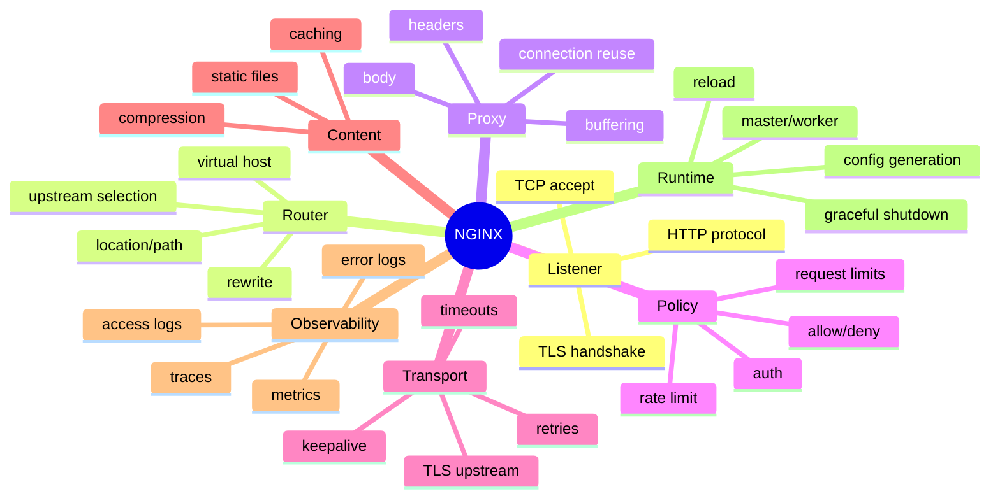
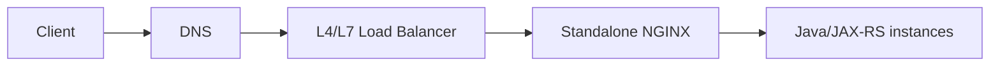
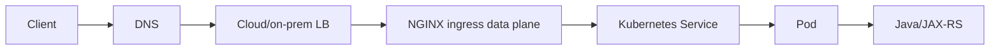
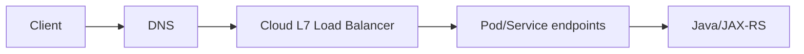
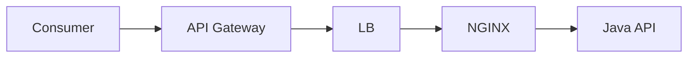
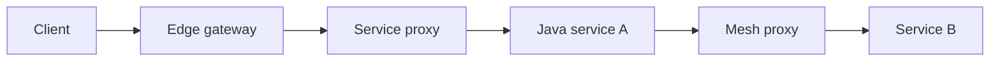
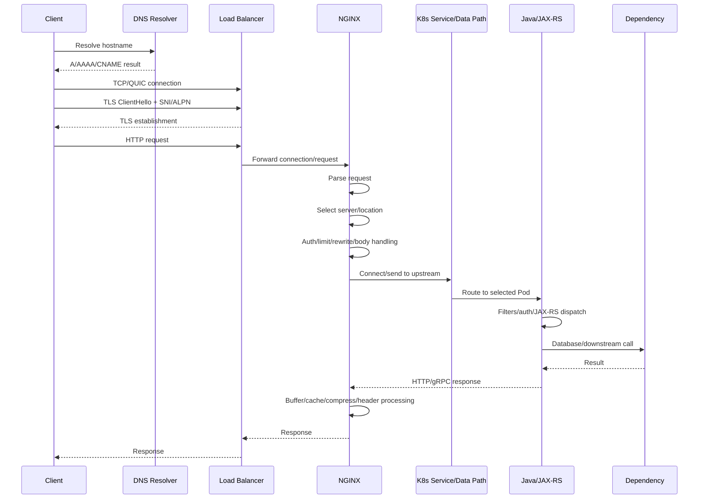
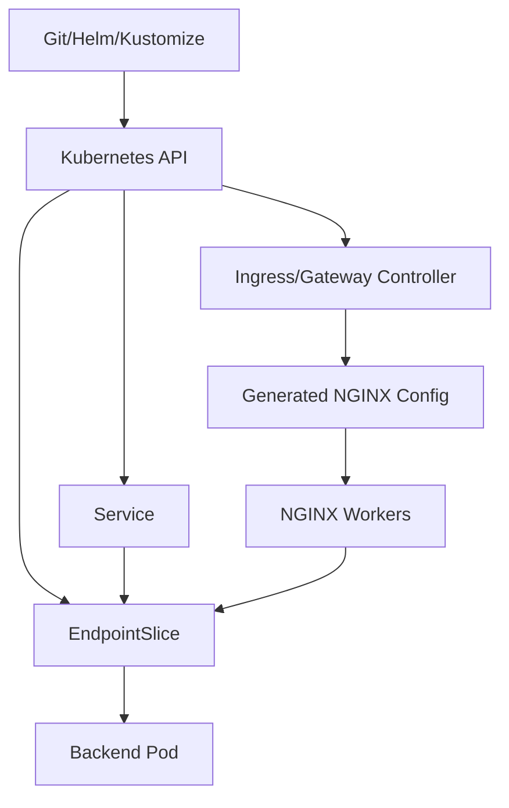

# Part 035 — Final Part: NGINX Mastery Map and Production Readiness

> **Depth level:** Principal-level  
> **Prerequisite:** Part 001–034; pengalaman membaca production architecture, Kubernetes manifests, NGINX/controller configuration, cloud/on-prem traffic paths, Java/JAX-RS services, dashboards, incidents, dan change requests.  
> **Scope:** complete mental model, architecture walkthrough, request lifecycle, contract maps, production-readiness review, maturity scorecard, failure model, operational readiness, internal discovery, leadership questions, personal learning map, dan final reusable checklists.  
> **Status:** **FINAL PART — seri selesai pada Part 035.**

---

## Operating premise

Senior backend engineer tidak harus menjadi full-time network engineer atau platform operator.

Namun senior backend engineer yang bekerja pada enterprise system harus mampu menjelaskan:

```text
bagaimana request menemukan sistem
→ bagaimana koneksi dan TLS dibentuk
→ bagaimana route dipilih
→ bagaimana identity dan headers dipercaya
→ bagaimana request diteruskan
→ bagaimana Java/JAX-RS memprosesnya
→ bagaimana response kembali
→ bagaimana timeout, retry, buffering, and caching mengubah behavior
→ bagaimana failure dideteksi, diisolasi, dan dipulihkan
```

Tanpa kemampuan tersebut, application design mudah bergantung pada asumsi tersembunyi:

- “Ingress hanya meneruskan request.”
- “Load balancer selalu tahu Pod yang sehat.”
- “Timeout 60 detik berarti request pasti berhenti pada 60 detik.”
- “Client IP sudah benar karena ada `X-Forwarded-For`.”
- “TLS aktif berarti upstream juga terverifikasi.”
- “Readiness 200 berarti Pod siap menerima production traffic.”
- “Rollback cukup dengan Git revert.”
- “HTTP 502 berarti aplikasi Java down.”
- “Internal endpoint aman karena DNS-nya private.”
- “Config di Git sama dengan config yang sedang digunakan.”

Part final ini mengubah 34 part sebelumnya menjadi satu operational map.

> **Core invariant:** NGINX mastery bukan kemampuan menghafal directive. Mastery adalah kemampuan memodelkan request, contracts, trust, capacity, failure propagation, evidence, and recovery across every hop.

---

## Daftar isi

1. [Tujuan akhir seri](#tujuan-akhir-seri)
2. [Cara menggunakan part final](#cara-menggunakan-part-final)
3. [Complete NGINX mental model](#complete-nginx-mental-model)
4. [Lima plane yang harus dipisahkan](#lima-plane-yang-harus-dipisahkan)
5. [Role and product boundary map](#role-and-product-boundary-map)
6. [Deployment topology map](#deployment-topology-map)
7. [Complete request lifecycle](#complete-request-lifecycle)
8. [Request lifecycle worksheet](#request-lifecycle-worksheet)
9. [URL and routing contract](#url-and-routing-contract)
10. [Header and identity contract](#header-and-identity-contract)
11. [TLS and trust contract](#tls-and-trust-contract)
12. [Timeout and deadline contract](#timeout-and-deadline-contract)
13. [Retry and idempotency contract](#retry-and-idempotency-contract)
14. [Connection and capacity contract](#connection-and-capacity-contract)
15. [Payload and streaming contract](#payload-and-streaming-contract)
16. [Caching and consistency contract](#caching-and-consistency-contract)
17. [Rate and overload contract](#rate-and-overload-contract)
18. [Observability contract](#observability-contract)
19. [Kubernetes control and data plane map](#kubernetes-control-and-data-plane-map)
20. [Cloud and on-prem traffic maps](#cloud-and-on-prem-traffic-maps)
21. [Java/JAX-RS backend responsibility map](#javajax-rs-backend-responsibility-map)
22. [Failure model by lifecycle phase](#failure-model-by-lifecycle-phase)
23. [Status-code ownership map](#status-code-ownership-map)
24. [Production-readiness dimensions](#production-readiness-dimensions)
25. [Maturity scorecard](#maturity-scorecard)
26. [Readiness assessment procedure](#readiness-assessment-procedure)
27. [Architecture walkthrough template](#architecture-walkthrough-template)
28. [Current-state discovery pack](#current-state-discovery-pack)
29. [Unknowns and assumptions register](#unknowns-and-assumptions-register)
30. [Internal verification checklist](#internal-verification-checklist)
31. [PR review mastery map](#pr-review-mastery-map)
32. [Architecture decision mastery map](#architecture-decision-mastery-map)
33. [Incident leadership mastery map](#incident-leadership-mastery-map)
34. [Security and compliance mastery map](#security-and-compliance-mastery-map)
35. [Performance and capacity mastery map](#performance-and-capacity-mastery-map)
36. [Migration and modernization map](#migration-and-modernization-map)
37. [Common senior-level reasoning mistakes](#common-senior-level-reasoning-mistakes)
38. [Question bank for design discussions](#question-bank-for-design-discussions)
39. [One-page production readiness checklist](#one-page-production-readiness-checklist)
40. [Personal mastery progression](#personal-mastery-progression)
41. [Suggested practical exercises](#suggested-practical-exercises)
42. [Series index](#series-index)
43. [Final completion statement](#final-completion-statement)
44. [Referensi resmi](#referensi-resmi)

---

## Tujuan akhir seri

Setelah menyelesaikan seluruh seri, Anda seharusnya mampu:

- menjelaskan NGINX sebagai reverse proxy, web server, load balancer, TLS termination layer, ingress data plane, dan API edge;
- membedakan NGINX Open Source, NGINX Plus, F5 NGINX Ingress Controller, controller lain yang menggunakan NGINX, cloud load balancer, API gateway, Gateway API, dan service mesh;
- melakukan architecture walkthrough dari client hingga JAX-RS endpoint dan kembali;
- membangun contract yang eksplisit untuk URL, headers, identity, TLS, timeout, retry, payload, streaming, cache, dan rate limits;
- menemukan hidden coupling antara edge, Kubernetes, Java runtime, database, downstream service, dan client;
- membaca source config, rendered manifests, live resources, generated config, dan runtime behavior sebagai state yang berbeda;
- mendiagnosis status/error berdasarkan provenance dan lifecycle phase;
- menilai production readiness menggunakan evidence, bukan rasa percaya diri;
- mereview PR dan ADR yang menyentuh traffic infrastructure;
- memimpin incident troubleshooting dan recovery;
- menyusun internal verification checklist ketika detail organisasi belum diketahui;
- membedakan fakta, assumption, inference, dan unknown;
- memimpin diskusi platform/networking secara efektif walaupun role utama tetap backend engineering.

---

## Cara menggunakan part final

Part ini dapat digunakan dalam lima mode.

### Mode 1 — Onboarding system existing

Gunakan:

- architecture walkthrough;
- current-state discovery pack;
- unknowns register;
- internal verification checklist.

Outcome:

```text
Saya dapat menjelaskan current traffic path,
owner setiap layer,
effective contracts,
major risks,
and unresolved unknowns.
```

### Mode 2 — Production-readiness review

Gunakan:

- readiness dimensions;
- maturity scorecard;
- one-page checklist;
- test and evidence requirements.

Outcome:

```text
Saya dapat menilai apakah service siap production,
apa blocking gaps,
dan siapa owner remediation.
```

### Mode 3 — PR/architecture review

Gunakan:

- contract maps;
- request-lifecycle diff;
- PR review mastery map;
- architecture decision map.

Outcome:

```text
Saya dapat menghubungkan diff kecil
ke distributed-system behavior dan failure mode.
```

### Mode 4 — Incident

Gunakan:

- lifecycle phase;
- failure model;
- status ownership;
- incident leadership map.

Outcome:

```text
Saya dapat mengisolasi failing hop,
memilih mitigation,
dan menjaga evidence.
```

### Mode 5 — Personal learning

Gunakan:

- maturity scorecard;
- practical exercises;
- series index;
- mastery progression.

Outcome:

```text
Saya belajar berdasarkan gap production nyata,
bukan mengulang directive secara acak.
```

---

## Complete NGINX mental model

NGINX dapat dipahami melalui fungsi berikut:



NGINX bukan sekadar “server yang menerima URL”.

Ia adalah stateful runtime yang:

- menerima connections;
- memilih protocol;
- mempertahankan connection state;
- memilih virtual server;
- memproses request phases;
- membaca atau men-stream request body;
- memilih upstream;
- membuka/reuse upstream connection;
- menunggu response;
- mem-buffer atau men-stream response;
- menulis ke client;
- mengelola timeout/retry;
- mencatat evidence.

---

## Lima plane yang harus dipisahkan

### 1. Intent plane

Apa yang ingin dicapai:

```text
/api/orders harus menuju order service
partner harus memakai mTLS
upload maksimal 25 MiB
SSE harus tetap open 30 menit
```

### 2. Configuration plane

Bagaimana intent dinyatakan:

- `nginx.conf`;
- Helm values;
- Kustomize overlays;
- Ingress;
- Gateway API;
- ConfigMap;
- annotations;
- CRDs;
- cloud LB resource;
- DNS records.

### 3. Control plane

Komponen yang membaca desired state dan mengubah runtime:

- Kubernetes API;
- NGINX controller;
- cloud load-balancer controller;
- cert-manager;
- GitOps controller;
- DNS controller;
- service mesh control plane.

### 4. Data plane

Komponen yang benar-benar memproses traffic:

- CDN/WAF;
- cloud/on-prem load balancer;
- NGINX workers;
- service mesh proxy;
- kube-proxy/CNI datapath;
- Java process.

### 5. Evidence plane

Bukti bahwa runtime sesuai intent:

- generated config;
- loaded config revision;
- access/error logs;
- metrics;
- traces;
- packet metadata;
- synthetic tests;
- Kubernetes status/events;
- cloud target health.

### Failure examples

| Plane | Example failure |
|---|---|
| Intent | requirement ambiguous |
| Configuration | annotation unit wrong |
| Control | controller cannot reconcile |
| Data | one worker/pod stale |
| Evidence | metrics cannot separate candidate |

> Source YAML yang benar tidak membuktikan data plane benar.

---

## Role and product boundary map

| Component | Primary role | Not automatically responsible for |
|---|---|---|
| NGINX Open Source | proxy/web/TLS/routing | distributed policy state, API product management |
| NGINX Plus | commercial NGINX capabilities | application domain authorization |
| NGINX Ingress Controller | reconcile K8s resources into NGINX config | Java business correctness |
| Cloud L4 LB | transport distribution | HTTP route semantics |
| Cloud L7 LB | HTTP/TLS/routing at cloud edge | application object authorization |
| API Gateway | API product/policy/consumer controls | all east-west traffic |
| Gateway API | Kubernetes role-oriented traffic API | implementation behavior by itself |
| Service mesh | east-west identity/policy/telemetry | north-south product management by default |
| WAF | application-layer threat filtering | complete authentication/authorization |
| Java/JAX-RS | domain API and business logic | edge connection termination |
| Kubernetes Service | stable backend abstraction | application readiness correctness |
| DNS | name-to-target resolution | target health by default |

### Senior review rule

Setiap capability harus memiliki satu primary owner.

Contoh anti-pattern:

```text
client retry
+ cloud LB retry
+ NGINX retry
+ service mesh retry
+ Java client retry
```

Semua layer merasa “meningkatkan reliability”, tetapi gabungannya menghasilkan retry storm.

---

## Deployment topology map

### Standalone reverse proxy



### Kubernetes ingress



### Cloud L7 direct-to-Pod



### API gateway plus NGINX



### Service mesh



### Review question

For every topology:

```text
Which layer owns:
TLS?
auth?
routing?
retry?
timeout?
source identity?
rate limit?
observability?
draining?
rollback?
```

---

## Complete request lifecycle



### Lifecycle phases

| Phase | Questions |
|---|---|
| Name resolution | Which resolver/view/TTL? |
| Network route | Public/private path? Firewall/NAT? |
| Connect | Which IP/port? Timeout? |
| TLS | Where termination? SNI? ALPN? Trust? |
| HTTP parse | Header/body/framing limits? |
| Virtual host | Host/SNI/default behavior? |
| Location/route | Exact/prefix/regex/rewrite? |
| Security policy | Auth/WAF/allowlist/rate limit? |
| Body handling | Buffered/streamed/temp disk? |
| Upstream selection | Service/IP/DNS/algorithm/health? |
| Upstream transport | TCP/TLS/SNI/keepalive? |
| Application dispatch | Context path/JAX-RS/provider/auth? |
| Dependency | Pool/timeout/retry/transaction? |
| Response | Status/headers/body/trailers? |
| Response processing | Cache/compress/buffer/rewrite? |
| Client write | Slow client/cancel/reset? |
| Telemetry | Request ID/status/timings/revision? |

---

## Request lifecycle worksheet

Gunakan worksheet ini untuk satu representative journey.

```yaml
journey:
  name: "Create Order"
  criticality: "High"
  client:
    type: "Partner API"
    timeout: "..."
    retry: "..."
    idempotency: "..."
  dns:
    hostname: "..."
    resolverView: "public/private"
    ttl: "..."
  edge:
    loadBalancer: "..."
    publicOrPrivate: "..."
    tlsTermination: "..."
    waf: "..."
  nginx:
    controllerOrInstance: "..."
    class: "..."
    host: "..."
    path: "..."
    rewrite: "..."
    auth: "..."
    rateLimit: "..."
    bodyLimit: "..."
    timeoutProfile: "..."
  upstream:
    service: "..."
    port: "..."
    protocol: "..."
    tlsVerification: "..."
    discovery: "..."
  java:
    app: "..."
    jaxrsPath: "..."
    authz: "..."
    executor: "..."
    idempotency: "..."
  dependencies:
    - name: "database"
      timeout: "..."
      pool: "..."
    - name: "event broker"
      delivery: "..."
  observability:
    requestId: "..."
    trace: "..."
    dashboard: "..."
    alerts: "..."
  rollback:
    route: "..."
    backend: "..."
    config: "..."
```

Jika sebagian besar field belum diketahui, readiness belum dapat dinilai.

---

## URL and routing contract

### Contract fields

```yaml
external:
  scheme: "https"
  authority: "quote.example.com"
  basePath: "/api/quotes"
internal:
  protocol: "http"
  service: "quote-api.quote.svc.cluster.local"
  port: 8080
  basePath: "/quotes"
mapping:
  stripPrefix: "/api"
  preserveQuery: true
  trailingSlashPolicy: "canonical"
```

### Invariants

- external Host tidak dapat dipilih client untuk route internal yang tidak diizinkan;
- unknown Host masuk default deny;
- rewrite tidak melewati auth-protected path;
- query tidak hilang atau terduplikasi;
- JAX-RS-generated links memakai external canonical URL;
- redirect tidak memakai untrusted Host;
- route ownership unik;
- canary route mempunyai stable fallback;
- rollback route tetap tersedia selama observation window.

### Required tests

- exact path;
- subpath;
- near-match;
- trailing slash;
- encoded path;
- query;
- unsupported method;
- unknown Host;
- wrong SNI;
- direct backend;
- candidate/stable route.

---

## Header and identity contract

### Header classes

| Class | Examples | Trust |
|---|---|---|
| Client-controlled | `User-Agent`, custom request data | untrusted |
| Transport-derived | client IP, scheme, host | trusted only from known proxy chain |
| Identity | user/tenant/client ID | high trust |
| Correlation | request ID, traceparent | validate/normalize |
| Protocol | Content-Type, Length, Upgrade | parser-sensitive |
| Internal routing | backend revision, route ID | must not be client-controlled |

### Contract

```yaml
sanitization:
  removeClientSupplied:
    - "X-Authenticated-User"
    - "X-Tenant-Id"
canonical:
  clientIp:
    source: "trusted load balancer chain"
  scheme:
    source: "trusted outer edge"
identity:
  producer: "external auth / edge"
  consumer: "Java service"
  directBypass: "blocked"
correlation:
  requestId:
    acceptClientValue: false
    generationPoint: "edge"
```

### Invariants

- identity header cannot be spoofed;
- forwarded chain parser is agreed;
- failover path preserves semantics;
- direct backend path cannot bypass trust;
- logs distinguish client-provided and canonical values where needed;
- trace propagation does not leak baggage/PII.

---

## TLS and trust contract

### Per-hop table

| Hop | Encryption | Peer verification | Identity | Rotation owner |
|---|---|---|---|---|
| Client→LB | TLS | hostname/CA | server | PKI/platform |
| LB→NGINX | TLS or trusted network | verify if TLS | server/mTLS | platform |
| NGINX→Java | TLS/re-encryption | CA + name | server/client | platform/app |
| Java→downstream | TLS | client library trust | server/client | app/platform |

### Invariants

- every encrypted hop has explicit verification posture;
- certificate SAN matches intended identity;
- SNI is sent where required;
- private keys have least-privilege access;
- rotation causes reload;
- dual trust exists for CA rollover;
- old certificate remains valid for rollback window;
- expired/unknown certificate is detected before customer impact;
- plaintext segments are explicit and justified.

### Negative tests

- wrong SNI;
- untrusted CA;
- expired/missing client cert;
- wrong upstream cert;
- deprecated protocol;
- one stale replica.

---

## Timeout and deadline contract

### Terms

- connect timeout;
- send/write timeout;
- read inactivity timeout;
- total deadline;
- idle timeout;
- keepalive timeout;
- transaction timeout;
- client deadline.

### Inventory

| Layer | Timeout/deadline | Retry | Failure response |
|---|---:|---:|---|
| Client | | | |
| CDN/LB | | | |
| NGINX | | | |
| Java inbound | | | |
| Java downstream | | | |
| Database | | | |

### Invariants

- outer layer does not cancel significantly before inner layer can fail gracefully;
- retry attempts fit total deadline;
- timeout increase has capacity analysis;
- long-running work uses async job model if synchronous connection is inappropriate;
- cancellation and side effects are understood;
- exact timeout boundaries are observable;
- streaming heartbeat prevents false idle timeout;
- rollout drain fits request/stream behavior.

### Review equation

```text
total request budget
>= DNS + connect + TLS + queue + processing + downstream attempts + response
```

---

## Retry and idempotency contract

### Retry ownership

One layer should own each retry policy intentionally.

```yaml
operation: "Create Order"
safeToRetry: true
mechanism: "Idempotency-Key"
owner: "client SDK"
maxAttempts: 2
retryOn:
  - "connect failure before response"
  - "explicit retryable 503"
backoff: "exponential with jitter"
deduplicationStore: "..."
deduplicationTtl: "..."
```

### Invariants

- no blind retry for mutation;
- attempt count bounded;
- backoff and jitter;
- retries observable;
- duplicate side effect prevented;
- NGINX retry rules align with method semantics;
- downstream retry does not exceed upstream deadline;
- failover does not lose idempotency state;
- 499/client cancellation does not imply backend rollback.

---

## Connection and capacity contract

### Capacity components

```text
downstream client connections
+ HTTP/2 streams
+ idle keepalive
+ upstream connections
+ long-lived sessions
+ old/new rollout overlap
+ retry/reconnect surge
```

### Approximation

```text
concurrent requests ≈ arrival rate × average request lifetime
```

### Questions

- maximum workers/connections/FDs?
- per-Pod and fleet limits?
- upstream keepalive pool?
- Java executor and DB pool?
- N+1 capacity?
- one-zone loss?
- surge rollout?
- long-lived connection distribution?
- SNAT/conntrack/ephemeral port?
- temp disk and buffers?
- TLS/compression CPU?

### Invariants

- edge capacity does not exceed safe backend concurrency;
- failure shedding occurs before dependency collapse;
- HPA signal reflects actual bottleneck;
- one replica loss remains within SLO;
- reconnect storm bounded;
- capacity assumptions tested under realistic workload.

---

## Payload and streaming contract

### Payload profile

```yaml
route: "/documents"
request:
  maxBody: "25 MiB"
  contentTypes:
    - "multipart/form-data"
  buffering: true
  receiveTimeout: "..."
response:
  streaming: false
  range: true
storage:
  tempDiskBudget: "..."
  directObjectStorage: "..."
security:
  malwareScan: "..."
```

### Streaming profile

```yaml
route: "/events"
protocol: "SSE"
buffering: false
compression: "disabled or verified"
heartbeat: "15s"
idleTimeoutChain: ">"
resume:
  mechanism: "Last-Event-ID"
  retention: "..."
rollout:
  terminationBehavior: "close + reconnect"
```

### Invariants

- limits align across all hops;
- slow client does not monopolize backend unboundedly;
- sensitive body temp storage controlled;
- streaming flush works end-to-end;
- partial upload/download behavior defined;
- client can resume/retry safely;
- long connections drain safely;
- security scanning does not silently disappear when bypassing buffering.

---

## Caching and consistency contract

### Contract

```yaml
route: "/catalog"
cacheable: true
scope: "public shared"
key:
  includes:
    - "host"
    - "normalized path"
    - "query version"
freshness: "60s"
stale:
  onUpstreamError: "300s"
invalidation:
  mechanism: "versioned key"
privacy:
  authorizationResponses: "never cache"
```

### Invariants

- tenant/user/private data never shared incorrectly;
- cache key includes all representation dimensions;
- `Vary` behavior is correct;
- stale response is business-safe;
- invalidation owner and mechanism known;
- negative caching bounded;
- cache status observable;
- failover across local caches understood;
- compression variants do not collide.

### Mandatory negative test

```text
request as tenant A
→ request same URL as tenant B
→ prove no A data appears
```

---

## Rate and overload contract

### Controls

- request rate;
- concurrent requests;
- connection count;
- body size;
- queue;
- per-tenant quota;
- global dependency protection;
- WAF/provider DDoS controls.

### Contract

```yaml
protectedResource: "order validation executor"
key: "tenant + client-id"
rate: "..."
burst: "..."
concurrency: "..."
distributed: true
rejection:
  status: 429
  retryAfter: "..."
priority:
  criticalMutation: "reserved capacity"
```

### Invariants

- key cannot be trivially bypassed;
- enterprise NAT does not unintentionally group all users;
- local per-replica behavior is understood;
- HPA does not silently increase quota;
- retry response does not trigger storm;
- critical traffic protected;
- limiter failure posture defined;
- overload detection and manual override exist.

---

## Observability contract

### Minimum edge event

```json
{
  "timestamp": "...",
  "request_id": "...",
  "trace_id": "...",
  "host": "...",
  "route_id": "...",
  "method": "...",
  "status": 502,
  "request_time": 0.042,
  "upstream_addr": "10.2.1.7:8080",
  "upstream_status": "502",
  "upstream_connect_time": 0.001,
  "upstream_header_time": 0.041,
  "upstream_response_time": 0.041,
  "ingress_pod": "...",
  "config_revision": "...",
  "backend_revision": "...",
  "client_ip_class": "...",
  "tls_protocol": "...",
  "cache_status": "...",
  "rate_limit_result": "..."
}
```

### Required capabilities

- correlate client→edge→Java→downstream;
- distinguish status provenance;
- identify ingress/backend revision;
- split stable/candidate;
- identify one Pod/zone/route;
- see upstream attempts;
- see 499/502/503/504;
- observe TLS/DNS/Endpoint health;
- detect config divergence;
- monitor SLO and business correctness;
- redact tokens/PII;
- know telemetry freshness and sampling.

### Invariant

A new failure mode without detection path means design belum production-ready.

---

## Kubernetes control and data plane map



### Control-plane questions

- which resources watched?
- namespace scope?
- RBAC?
- admission webhook?
- reconciliation status?
- generated config?
- reload behavior?
- leader election?
- controller version?
- policy and snippets?

### Data-plane questions

- Deployment or DaemonSet?
- Service type?
- target mode?
- source IP?
- replicas/zones?
- workers/connections?
- readiness?
- termination/drain?
- config generation consistency?
- direct bypass?

### Invariants

- desired and loaded revision correlated;
- every replica converges;
- latest config failure does not remain invisible;
- readiness reflects usable data plane;
- EndpointSlice state aligns with listener readiness;
- rollout maintains capacity;
- controller EOL/migration tracked.

---

## Cloud and on-prem traffic maps

### AWS/EKS review

```text
Route 53
→ ALB/NLB
→ security group/NACL/subnet
→ Service/NodePort/IP target
→ NGINX ingress
→ Service
→ Pod
```

Verify:

- ALB/NLB role;
- target type;
- source IP/proxy protocol;
- ACM/TLS;
- target health;
- AWS Load Balancer Controller;
- VPC CNI/IP capacity;
- CloudWatch/flow logs;
- PrivateLink/private zone;
- deregistration.

### Azure/AKS review

```text
Azure DNS/Front Door
→ Application Gateway/Azure LB
→ VNet/NSG/UDR
→ NGINX or direct Pod
→ Service
→ Pod
```

Verify:

- Front Door/Application Gateway/LB role;
- AGIC/other controller;
- private/public;
- source IP headers;
- Key Vault/certificate;
- Azure CNI;
- health probes;
- Azure Monitor;
- private endpoint/DNS.

### On-prem/hybrid review

```text
Enterprise DNS
→ firewall/NAT
→ L4/L7 appliance
→ DMZ reverse proxy
→ private Kubernetes ingress
→ Service/Pod
```

Verify:

- split DNS;
- internal CA;
- proxy chaining;
- source NAT;
- asymmetric route;
- MTU;
- BGP/L2 advertisement;
- VPN/private circuit;
- egress proxy;
- air-gap;
- owner/escalation.

### Rule

Jangan menganggap cloud/on-prem layer hanya “network team concern”. Mereka mengubah headers, source identity, TLS, timeout, health, and rollback behavior yang memengaruhi Java service.

---

## Java/JAX-RS backend responsibility map

### Edge responsibilities

- accept and parse network protocol;
- terminate/pass TLS;
- route;
- normalize/sanitize proxy headers;
- coarse authentication/policy;
- request limits;
- rate controls;
- connection management;
- edge telemetry.

### Java/JAX-RS responsibilities

- validate domain request;
- authenticate/validate identity when required by contract;
- object/tenant/lifecycle authorization;
- business invariants;
- idempotency;
- transaction;
- downstream coordination;
- stable API semantics;
- cancellation handling;
- domain errors;
- business audit.

### Shared responsibilities

- timeout budget;
- retry;
- body limit;
- generated URLs;
- correlation;
- streaming;
- protocol health;
- graceful shutdown;
- incident evidence.

### Backend contract checklist

- external/internal base path;
- forwarded-header trust;
- auth identity source;
- domain authorization;
- body/media type;
- timeout/cancellation;
- idempotency;
- executor/pool limits;
- health/readiness;
- graceful termination;
- trace/log fields;
- direct backend access.

---

## Failure model by lifecycle phase

| Phase | Representative failures | Primary evidence |
|---|---|---|
| DNS | NXDOMAIN, stale IP, wrong view | `dig`, resolver logs |
| Network | drop, asymmetric route, MTU | flow logs, packet metadata |
| TCP | refused, timeout, reset | connect timing, tcpdump |
| TLS downstream | SNI, chain, expiry, mTLS | `openssl`, handshake logs |
| HTTP parse | malformed/header limit | NGINX error log |
| Virtual host | default/wrong server | generated config, response marker |
| Location/route | wrong backend/rewrite | config, route test |
| Auth/policy | 401/403/429 | auth/WAF/limiter logs |
| Request body | 408/413/temp disk | access/error/disk |
| Upstream select | no live upstream | config/EndpointSlice |
| Upstream connect | refused/timeout | upstream connect timing |
| Upstream TLS | SNI/CA/verify | NGINX TLS error |
| Upstream wait | slow/queue/504 | header/read timing |
| App dispatch | 404/415/500 | Java logs/traces |
| Dependency | pool/downstream timeout | app/dependency metrics |
| Response body | premature close/buffer | error log/bytes |
| Client write | 499/slow client | request timing |
| Rollout | stale replica/drain | revisions/events |
| Evidence | missing logs/metrics | telemetry health |

### Senior diagnostic method

```text
1. identify first failing phase
2. identify generator of response/reset
3. compare healthy and failing path
4. preserve exact request identity
5. verify effective runtime state
```

---

## Status-code ownership map

| Status | Common edge causes | Common app causes |
|---:|---|---|
| 400 | parser, Host, header/framing | validation |
| 401 | auth request/token/mTLS | app authentication |
| 403 | ACL/WAF/authz | domain authorization |
| 404 | host/path/default route | resource/domain not found |
| 408 | client header/body timeout | app-generated timeout |
| 413 | body limit | multipart/app limit |
| 414 | request line/URI limit | app/router |
| 429 | limiter/quota | distributed/app limiter |
| 499 | client closed before response | not normally app response |
| 500 | module/internal handling | unhandled app exception |
| 502 | invalid/refused/reset upstream | upstream proxy/app crash |
| 503 | no upstream/maintenance/limit | overload/circuit breaker |
| 504 | upstream timeout | downstream timeout surfaced |

### Rule

Status code alone tidak menentukan owner.

Use:

- body/header signature;
- `upstream_status`;
- upstream timings;
- Java request log;
- outer LB logs;
- request ID.

---

## Production-readiness dimensions

Production readiness dinilai pada 14 dimensions.

### 1. Architecture clarity

- topology;
- ownership;
- control/data plane;
- direct paths;
- dependencies.

### 2. Routing correctness

- host/path;
- rewrite;
- conflicts;
- default deny;
- tenant boundary.

### 3. Transport and trust

- TLS/mTLS;
- source identity;
- headers;
- certificates;
- CA lifecycle.

### 4. HTTP/API contract

- methods;
- status;
- content negotiation;
- CORS;
- redirects;
- cookies;
- gRPC/WebSocket/SSE.

### 5. Failure control

- timeout;
- retry;
- idempotency;
- circuit breaker;
- cancellation.

### 6. Capacity

- workers;
- connections;
- Java/DB pools;
- payload;
- long-lived traffic;
- N+1.

### 7. Security

- auth/authz;
- limits;
- WAF;
- snippets;
- direct bypass;
- Secrets;
- container/image.

### 8. Data consistency/privacy

- cache;
- logs;
- PII;
- tenant isolation;
- error disclosure.

### 9. Kubernetes/runtime

- probes;
- EndpointSlice;
- rollout;
- drain;
- PDB;
- topology.

### 10. Configuration management

- source;
- render;
- validation;
- policy;
- GitOps;
- drift.

### 11. Observability

- logs;
- metrics;
- traces;
- revisions;
- dashboards;
- alerts.

### 12. Operations

- runbooks;
- access;
- escalation;
- support;
- change windows.

### 13. Recovery

- rollback;
- failover;
- certificate/DNS recovery;
- correctness validation.

### 14. Governance

- review;
- ADR;
- evidence;
- exceptions;
- lifecycle/EOL.

---

## Maturity scorecard

Use level 0–4.

| Level | Definition |
|---:|---|
| 0 | Unknown/unmanaged |
| 1 | Known by individuals; manual; incomplete |
| 2 | Documented and repeatable |
| 3 | Automated, observable, and tested |
| 4 | Continuously verified, risk-based, and improved from incidents |

### Example scorecard

| Dimension | Score | Evidence | Gap | Owner |
|---|---:|---|---|---|
| Architecture clarity | 2 | diagram/repo | alternate LB unknown | Platform |
| Routing correctness | 3 | route tests | no encoded-path test | App |
| TLS/trust | 2 | cert inventory | upstream verify unknown | Platform |
| Failure control | 1 | partial timeout list | retry ownership unclear | App |
| Capacity | 1 | CPU dashboard | no connection model | SRE |
| Security | 2 | auth/WAF | direct bypass not tested | Security |
| Observability | 3 | logs/traces | config revision absent | Platform |
| Recovery | 1 | Git revert | cert/DNS rollback untested | Shared |

### Interpretation

Do not average blindly.

A level 0 in:

- tenant isolation;
- authentication;
- TLS private key;
- rollback for critical public edge;

may block production even if average score is high.

### Readiness gate

Define mandatory minimum per critical dimension.

Example:

```yaml
minimum:
  architecture: 2
  routing: 3
  transportTrust: 3
  security: 3
  observability: 2
  recovery: 2
criticalFindings: 0
```

This is an example framework, not an internal CSG policy.

---

## Readiness assessment procedure

### Step 1 — Define scope

- service;
- environment;
- host;
- protocol;
- controller;
- customer journey;
- data classification.

### Step 2 — Build topology

Include all hops and alternate paths.

### Step 3 — Select representative journeys

At minimum:

- normal read;
- critical mutation;
- large payload;
- auth failure;
- unknown host/path;
- timeout/failure;
- protocol-specific stream if applicable.

### Step 4 — Fill contract maps

- URL;
- headers/identity;
- TLS;
- timeout;
- retry;
- payload;
- cache;
- rate;
- observability.

### Step 5 — Collect evidence

- source;
- rendered;
- live;
- generated;
- loaded;
- runtime tests;
- dashboards/runbooks.

### Step 6 — Score maturity

Record evidence and unknowns.

### Step 7 — Classify findings

- blocker;
- high;
- medium;
- low;
- accepted exception.

### Step 8 — Assign remediation

Owner, due date, verification, and residual risk.

### Step 9 — Perform failure/rollback test

According to risk.

### Step 10 — Sign off

Application, platform, security, SRE, and business ownership as required.

---

## Architecture walkthrough template

Use this structure in a meeting.

### 1. Entry points

```text
What hostnames?
Public/private?
Which DNS zones?
Which clients?
```

### 2. Edge

```text
CDN/WAF/LB?
TLS termination?
Source IP?
Idle timeout?
Health checks?
```

### 3. NGINX/controller

```text
Which product/version?
Deployment model?
IngressClass?
Global config?
Annotations/CRDs?
Generated config?
```

### 4. Route

```text
Host/path/rewrite?
Default route?
Conflicts?
Canary/sticky?
```

### 5. Security

```text
Auth?
Identity headers?
WAF?
Allowlist?
Rate limits?
Direct bypass?
```

### 6. Upstream

```text
Service or direct endpoints?
Protocol/TLS?
DNS?
Load balancing?
Keepalive?
```

### 7. Java

```text
Context/JAX-RS path?
Forwarded headers?
Authorization?
Executors/pools?
Idempotency?
```

### 8. Dependencies

```text
Database?
Kafka/RabbitMQ?
Redis?
Downstream APIs?
Timeout/retry?
```

### 9. Operations

```text
Logs/metrics/traces?
SLO?
Runbook?
Rollout?
Rollback?
Owner?
```

### Meeting output

- topology;
- contract table;
- risk list;
- unknowns;
- owners;
- evidence links;
- action plan.

---

## Current-state discovery pack

Suggested file set:

```text
nginx-current-state/
├── 00-scope.md
├── 01-topology.mmd
├── 02-ownership.md
├── 03-host-route-inventory.csv
├── 04-controller-runtime.md
├── 05-tls-certificate-inventory.csv
├── 06-header-identity-contract.md
├── 07-timeout-retry-matrix.csv
├── 08-payload-streaming-profiles.csv
├── 09-capacity-model.md
├── 10-observability-map.md
├── 11-rollout-rollback.md
├── 12-runbook-index.md
├── 13-incidents-and-signatures.md
├── 14-security-evidence.md
├── 15-unknowns-register.csv
└── 16-readiness-scorecard.csv
```

### Source locations to inspect

- application repository;
- infra repository;
- Helm chart;
- Kustomize;
- GitOps environment repository;
- Ingress/Gateway resources;
- ConfigMaps;
- controller Deployment/DaemonSet;
- Services/EndpointSlices;
- DNS;
- cloud LB;
- certificate manager;
- Java config;
- dashboards;
- runbooks;
- incidents;
- security findings.

---

## Unknowns and assumptions register

### Template

| ID | Statement | Type | Risk if wrong | Evidence needed | Owner | Status |
|---|---|---|---|---|---|---|
| U-01 | NGINX verifies upstream TLS | Unknown | MITM/wrong backend | generated config + negative test | Platform | Open |
| A-02 | client POST retry is idempotent | Assumption | duplicate order | SDK spec + app test | App | Open |
| U-03 | all ingress replicas load same config | Unknown | intermittent routing | config hash | Platform | Open |

### Types

- **Fact:** verified evidence.
- **Assumption:** believed for design.
- **Inference:** derived from multiple evidence points.
- **Unknown:** not yet verified.
- **Decision:** intentionally selected behavior.
- **Exception:** approved deviation.

### Rule

Jangan mengubah unknown menjadi fact hanya karena “seharusnya”.

---

## Internal verification checklist

Bagian ini harus diisi terhadap codebase, repositories, platform, dan proses internal. Tidak ada detail internal CSG yang boleh diasumsikan tanpa bukti.

### A. Product and ownership

- [ ] Identify authoritative owner for NGINX/controller platform.
- [ ] Identify application owner for each host/path.
- [ ] Identify DNS, cloud/on-prem LB, certificate, security, observability, and incident owners.
- [ ] Locate support/escalation and on-call paths.
- [ ] Verify which team approves global versus route-specific changes.
- [ ] Determine whether the product uses NGINX Open Source, NGINX Plus, F5 controller, another NGINX-based controller, or a different implementation.
- [ ] Record exact versions, support lifecycle, and upgrade roadmap.

### B. Repositories and source of truth

- [ ] Locate application repositories.
- [ ] Locate infra/platform repositories.
- [ ] Locate Helm charts, values, Kustomize bases/overlays, and GitOps repositories.
- [ ] Identify authoritative source for Ingress/Gateway resources.
- [ ] Identify global ConfigMap and controller arguments.
- [ ] Inventory annotations, CRDs, templates, and snippets.
- [ ] Verify source → rendered → live → generated → loaded revision traceability.
- [ ] Check CODEOWNERS and approval rules.

### C. Topology and traffic

- [ ] Draw public and internal topology.
- [ ] Include DNS, LB/WAF/API gateway, NGINX, Service, Pod, and dependencies.
- [ ] Include alternate/standby/direct paths.
- [ ] Record public/private zones, regions, clusters, and namespaces.
- [ ] Record target type and source-IP behavior.
- [ ] Record TLS termination and re-encryption points.
- [ ] Record health-check and draining paths.
- [ ] Validate representative journey through each environment.

### D. Routing

- [ ] Inventory host/path/method/backend.
- [ ] Identify default server/backend behavior.
- [ ] Identify exact/prefix/regex paths.
- [ ] Document rewrites and external→internal URI mapping.
- [ ] Check trailing slash, query, and encoded path.
- [ ] Detect duplicate/conflicting routes.
- [ ] Document canary, sticky session, or weighted routing.
- [ ] Test unknown host and sensitive paths.
- [ ] Verify JAX-RS base path and generated URLs.

### E. Headers and identity

- [ ] Document every trusted proxy hop.
- [ ] Verify canonical client IP calculation.
- [ ] Verify `Forwarded`/`X-Forwarded-*` ownership.
- [ ] Verify identity headers are stripped and regenerated.
- [ ] Verify request ID and trace context behavior.
- [ ] Verify direct backend bypass is blocked.
- [ ] Test spoofed source/identity headers.
- [ ] Verify failover path preserves header semantics.
- [ ] Review Java forwarded-header configuration.

### F. TLS and certificates

- [ ] Inventory all certificates and hostnames.
- [ ] Check SAN, chain, issuer, expiry, and private key owner.
- [ ] Verify certificate manager and reload behavior.
- [ ] Test every edge target/SNI with fresh connection.
- [ ] Verify upstream TLS verification and SNI.
- [ ] Verify mTLS positive and negative paths.
- [ ] Review CA rollover and old certificate rollback.
- [ ] Verify expiry/handshake alerts.
- [ ] Review Secret RBAC and key storage.

### G. HTTP, payload, and protocols

- [ ] Inventory body/header/URI limits per hop.
- [ ] Inventory request/response buffering.
- [ ] Inventory compression and cache behavior.
- [ ] Inventory WebSocket/SSE/gRPC endpoints.
- [ ] Document heartbeat, idle timeout, replay/resume.
- [ ] Document large upload/download behavior.
- [ ] Verify outer LB/CDN/WAF protocol support.
- [ ] Run boundary and failure tests.
- [ ] Verify error/status semantics.

### H. Timeouts, retries, and idempotency

- [ ] Build complete timeout table.
- [ ] Distinguish connect, idle, and total deadlines.
- [ ] Inventory all retry layers.
- [ ] Verify idempotency for mutations.
- [ ] Verify retry backoff and attempt limits.
- [ ] Verify cancellation behavior.
- [ ] Check 499/502/503/504 evidence.
- [ ] Review long-running synchronous operations.
- [ ] Verify retry/timeout behavior during failover.

### I. Capacity and performance

- [ ] Record NGINX workers, connections, FDs, CPU, and memory.
- [ ] Record replicas, zones, requests/limits, and HPA.
- [ ] Record upstream keepalive and connection budgets.
- [ ] Record Java executors, HTTP client pools, DB pools, and downstream limits.
- [ ] Record long-lived connections and payload buffers.
- [ ] Test N+1 and rollout overlap.
- [ ] Review temp disk, conntrack, SNAT, and port capacity.
- [ ] Review load-test model and peak traffic.
- [ ] Define headroom and saturation alerts.

### J. Kubernetes and controller

- [ ] Inspect controller Deployment/DaemonSet.
- [ ] Inspect Service type and `externalTrafficPolicy`.
- [ ] Inspect probes and readiness semantics.
- [ ] Inspect Pod termination, `preStop`, grace, and PDB.
- [ ] Inspect EndpointSlice behavior.
- [ ] Inspect controller RBAC and Secret access.
- [ ] Inspect admission webhook and policy.
- [ ] Compare generated config across replicas.
- [ ] Verify reload failure and config divergence detection.

### K. Security and compliance

- [ ] Locate security standards and previous assessments.
- [ ] Verify public/internal/admin route controls.
- [ ] Verify auth/authz and tenant boundary.
- [ ] Verify WAF/rate/limits and direct-origin protection.
- [ ] Verify snippets are disabled or isolated.
- [ ] Verify container hardening and Pod Security.
- [ ] Verify image digest, SBOM, modules, vulnerabilities, and EOL.
- [ ] Verify log redaction, retention, access, and PII controls.
- [ ] Record exceptions, compensating controls, and expiry.

### L. Observability

- [ ] Confirm access/error logs and formats.
- [ ] Confirm upstream timings and status provenance.
- [ ] Confirm request/trace/config/backend revision correlation.
- [ ] Confirm TLS/DNS/Endpoint/reload/target metrics.
- [ ] Confirm dashboards for route, Pod, zone, and revision.
- [ ] Confirm SLO and business metrics.
- [ ] Confirm alert thresholds and missing-data behavior.
- [ ] Confirm telemetry pipeline health.
- [ ] Confirm log/metric retention is sufficient for incidents.

### M. Delivery and rollback

- [ ] Inspect validation pipeline.
- [ ] Confirm rendered manifest and effective config review.
- [ ] Confirm exact-image `nginx -t`.
- [ ] Confirm policy and negative tests.
- [ ] Inspect GitOps sync/prune/self-heal.
- [ ] Inspect rollout strategy and canary gates.
- [ ] Verify long-connection drain.
- [ ] Verify exact rollback artifacts and order.
- [ ] Test rollback and post-rollback correctness.

### N. Operations and incidents

- [ ] Locate controller, route, 5xx, timeout, overload, TLS, DNS, and LB runbooks.
- [ ] Locate incident severity and command process.
- [ ] Identify break-glass access.
- [ ] Review recent incidents and signatures.
- [ ] Review stale or failed action items.
- [ ] Confirm vendor/cloud support process.
- [ ] Confirm evidence collection and packet capture policy.
- [ ] Confirm game days/tabletops.
- [ ] Confirm runbook owner and last test date.

---

## PR review mastery map

A senior review should move through five layers.

### Layer 1 — Intent

```text
What outcome?
Why NGINX?
What scope?
What non-goal?
```

### Layer 2 — Contract

```text
URL?
headers?
identity?
TLS?
timeout?
retry?
payload?
protocol?
```

### Layer 3 — Runtime

```text
Which controller/version?
What rendered/generated config?
Which Pods/LB/endpoints?
What capacity?
```

### Layer 4 — Failure

```text
What can fail?
How detected?
What customer sees?
What retry/side effect?
```

### Layer 5 — Change safety

```text
How validated?
How rolled out?
What stop condition?
How rolled back?
Who owns incident?
```

### Review comment formula

```text
Observed diff
→ changed invariant or failure mode
→ missing evidence
→ required resolution
```

---

## Architecture decision mastery map

Use ADR when decision is:

- long-lived;
- cross-team;
- changes trust boundary;
- introduces new edge layer;
- selects controller/API gateway/mesh;
- changes public/private exposure;
- defines global timeout/auth/cache/rate policy;
- difficult to reverse.

### ADR quality questions

- context and constraints;
- alternatives;
- decision;
- invariants;
- assumptions;
- consequences;
- failure modes;
- security/privacy;
- capacity;
- observability;
- migration;
- rollback/reversal;
- ownership;
- review triggers.

### Architecture decision test

```text
Can another senior engineer understand
why this decision was reasonable,
what would invalidate it,
and how to reverse or migrate it?
```

---

## Incident leadership mastery map

### Before incident

- know topology;
- know SLO;
- know runbooks;
- know access;
- know rollback;
- know owners.

### During incident

```text
declare
→ assign command
→ define impact
→ preserve evidence
→ isolate failing phase
→ choose bounded mitigation
→ validate recovery
→ communicate
```

### After incident

```text
timeline
→ causal/control analysis
→ corrective actions
→ owner/due date
→ verification
→ runbook/test improvement
```

### Senior behavior

- separate fact/hypothesis;
- prevent uncoordinated changes;
- ask for stop conditions;
- protect evidence;
- focus on customer journey;
- challenge “restart fixed it” as RCA;
- ensure correctness after availability returns.

---

## Security and compliance mastery map

Security mastery means mampu membuktikan:

```text
control objective
→ owner
→ enforcement point
→ effective runtime state
→ positive test
→ negative test
→ monitoring
→ exception
→ lifecycle
```

Key domains:

- TLS/mTLS;
- auth/authz;
- headers/source IP;
- default deny;
- direct bypass;
- request limits;
- WAF/rate;
- cache isolation;
- logging/PII;
- Secrets/RBAC;
- admission/snippets;
- image/modules;
- patch/EOL;
- incident evidence.

### Senior rule

Compliance framework bukan pengganti threat model, dan screenshot bukan pengganti runtime evidence.

---

## Performance and capacity mastery map

### Step 1 — Define workload

- RPS;
- connection rate;
- concurrent requests;
- request/response size;
- protocol;
- long-lived connection;
- peak;
- tenant distribution.

### Step 2 — Find finite resources

- CPU;
- memory;
- FDs;
- worker connections;
- buffers/temp disk;
- upstream sockets;
- Java executor;
- DB pool;
- downstream quota;
- SNAT/conntrack.

### Step 3 — Model failure

- one Pod loss;
- one zone loss;
- rollout overlap;
- retry/reconnect storm;
- slow upstream;
- large payload;
- TLS handshake spike.

### Step 4 — Load test

- realistic open/closed model;
- representative route;
- protocol-specific;
- long duration;
- failure injection;
- measure tail and saturation.

### Step 5 — Define admission control

- timeout;
- concurrency;
- rate;
- queue;
- load shedding;
- backpressure.

### Senior rule

Throughput tanpa tail latency, saturation, and failure behavior is not a production capacity result.

---

## Migration and modernization map

Possible transitions:

- standalone NGINX → Kubernetes controller;
- old controller → supported controller;
- Ingress → Gateway API;
- cloud LB → NGINX or vice versa;
- edge auth → API gateway/identity proxy;
- plaintext upstream → TLS/mTLS;
- static upstream → service discovery;
- in-place deploy → canary/blue-green;
- manual config → GitOps;
- weak logs → structured correlation;
- shared controller → sharded failure domains.

### Safe migration sequence

```text
inventory
→ define invariants
→ build parallel capability
→ dual-compatible state
→ synthetic tests
→ bounded cohort
→ observe
→ expand
→ retain rollback
→ remove old path
```

### Migration checklist

- exact current behavior;
- unsupported/implicit features;
- route/annotation compatibility;
- source IP;
- TLS;
- auth;
- timeouts;
- status/error pages;
- metrics/logs;
- long connections;
- DNS/LB propagation;
- rollback;
- EOL deadline;
- owner.

---

## Common senior-level reasoning mistakes

### 1. Treating NGINX as transparent

It changes protocol, headers, buffering, timing, connection, and errors.

### 2. Treating YAML as runtime

Controller may reject, mutate, merge, or fail reload.

### 3. Treating timeout as one number

There are many phases and owners.

### 4. Increasing timeout to fix latency

May increase concurrency collapse.

### 5. Adding retry to improve reliability

May duplicate mutations and amplify overload.

### 6. Trusting forwarded headers by name

Trust comes from source and sanitization, not header name.

### 7. Assuming TLS means identity verified

Verification may be disabled or name mismatched.

### 8. Assuming readiness equals production readiness

Probe may test only process liveness.

### 9. Assuming private DNS means private reachability

Network path may still be public or cross-tenant.

### 10. Assuming 502 belongs to backend team

Status provenance must be proven.

### 11. Assuming more replicas fix overload

Dependency may be bottleneck.

### 12. Assuming Git revert is immediate rollback

Control planes, DNS, connections, and Secrets have convergence.

### 13. Assuming successful happy path proves security

Negative test is required.

### 14. Assuming “managed service” transfers responsibility

Configuration, identity, data, and operations remain shared responsibility.

### 15. Optimizing before defining invariant

Performance improvement can break consistency/security.

---

## Question bank for design discussions

### Role and topology

- Why is NGINX needed at this layer?
- Which problem would remain if NGINX were removed?
- Are multiple edge layers duplicating policy?
- What is north-south versus east-west boundary?

### Routing

- Who owns this host/path?
- What must not match?
- What is default behavior?
- How do rewrite and JAX-RS base path align?
- What happens during canary/rollback?

### Trust

- Where is first trusted proxy?
- Which headers are canonical?
- Can direct access bypass identity?
- Is upstream certificate verified?
- How is CA rotation performed?

### Time and failure

- What is client deadline?
- Which timeout fires first?
- Which layer retries?
- Is mutation idempotent?
- What happens after client cancellation?

### Capacity

- What resource saturates first?
- What is N+1?
- What happens during rollout or one-zone failure?
- How many long-lived connections?
- Does scaling edge overload backend?

### Security

- What is public/internal/admin exposure?
- How is unknown Host handled?
- What negative auth/tenant tests exist?
- Are snippets allowed?
- Can logs/cache expose data?

### Operations

- How do we know exact config revision?
- Which dashboard identifies one bad replica?
- What is rollback unit?
- Who is paged?
- When was runbook last tested?

### Internal verification checklist

Any answer based on undocumented organizational details must be recorded as:

```text
Internal verification checklist:
- owner:
- repository:
- environment:
- evidence:
- status:
```

---

## One-page production readiness checklist

### Architecture and ownership

- [ ] Topology includes every hop and alternate path.
- [ ] Exact controller/product/version known.
- [ ] Owners for DNS/LB/NGINX/app/security/operations known.
- [ ] Public/private/admin boundaries explicit.
- [ ] Source and runtime revisions traceable.

### Routing and API contract

- [ ] Host/path/rewrite mapping tested.
- [ ] Unknown Host/path denied intentionally.
- [ ] JAX-RS base path and generated URL correct.
- [ ] Method/status/header/cookie semantics preserved.
- [ ] Canary/sticky/rollback route behavior known.

### Trust and security

- [ ] TLS/mTLS verified per hop.
- [ ] Certificates rotate and reload safely.
- [ ] Forwarded and identity headers sanitized.
- [ ] Direct backend bypass blocked.
- [ ] Domain/tenant authorization tested.
- [ ] Limits/WAF/rate controls justified.
- [ ] Sensitive/admin routes protected.
- [ ] Secrets/RBAC/snippets/images reviewed.
- [ ] Logs/cache do not leak tenant/PII/credentials.

### Reliability

- [ ] Complete timeout/deadline table.
- [ ] Retry ownership and idempotency explicit.
- [ ] Cancellation behavior understood.
- [ ] Zero-endpoint/reset/TLS/DNS failure tests.
- [ ] N+1 capacity and dependency limits verified.
- [ ] Long-lived connections and reconnection modeled.
- [ ] Payload/buffering/temp disk bounded.

### Kubernetes/runtime

- [ ] Readiness reflects usable latest config.
- [ ] Service/EndpointSlice/ports correct.
- [ ] Replicas/zones/PDB/rollout strategy appropriate.
- [ ] Graceful termination and LB drain tested.
- [ ] Generated config consistent across replicas.
- [ ] Admission and GitOps policies enforce invariants.

### Observability and operations

- [ ] Request ID/trace/config/backend revision correlated.
- [ ] Status provenance and upstream timings logged.
- [ ] SLO/business dashboards exist.
- [ ] Alerts cover new failure modes.
- [ ] Runbooks and escalation accessible.
- [ ] Rollout gates and rollback tested.
- [ ] Security/compliance evidence and exceptions current.
- [ ] Incident/game-day lessons incorporated.

### Final gate

```text
No unresolved critical unknown
No unowned high-risk control
No untested rollback for critical change
No missing detection for a material new failure mode
```

---

## Personal mastery progression

### Level 1 — Request reader

Can answer:

- where request enters;
- which Host/path;
- which backend;
- status and logs.

Practice:

- trace one GET;
- inspect generated config;
- compare public/direct path.

### Level 2 — Proxy engineer

Can reason about:

- headers;
- TLS;
- timeouts;
- buffering;
- upstream connections;
- status provenance.

Practice:

- create timeout table;
- test spoofed headers;
- diagnose 502/504.

### Level 3 — Kubernetes traffic engineer

Can reason about:

- controller reconciliation;
- Service/EndpointSlice;
- IngressClass/Gateway;
- rollout/drain;
- cloud LB integration.

Practice:

- delete Pod during traffic;
- compare replicas;
- inspect EndpointSlice transitions.

### Level 4 — Production engineer

Can lead:

- readiness review;
- capacity model;
- canary/rollback;
- incident;
- runbook;
- security evidence.

Practice:

- game day;
- controller upgrade;
- certificate rollover;
- one-replica config failure.

### Level 5 — Architecture leader

Can decide:

- NGINX versus Gateway/API gateway/mesh;
- platform ownership;
- failure-domain sharding;
- migration;
- standards;
- governance and lifecycle.

Practice:

- write ADR;
- define platform profiles;
- build cross-team readiness scorecard;
- lead postmortem/control improvement.

---

## Suggested practical exercises

### Exercise 1 — Trace one request

Deliver:

- sequence diagram;
- exact headers;
- timeout table;
- logs/trace;
- failure points.

### Exercise 2 — Route test matrix

Test:

- exact;
- prefix;
- trailing slash;
- unknown Host;
- rewrite;
- encoded path.

### Exercise 3 — Header spoofing

Prove:

- client identity header removed;
- canonical header generated;
- direct path blocked.

### Exercise 4 — TLS matrix

Test:

- valid SNI;
- wrong SNI;
- expired/untrusted cert in safe environment;
- upstream verification;
- mTLS missing cert.

### Exercise 5 — Timeout and 499

Create controlled slow endpoint and observe:

- client cancellation;
- NGINX 499;
- Java work continuation/cancellation;
- idempotency.

### Exercise 6 — Zero endpoints

Temporarily use a non-production route with zero ready endpoints and record:

- status;
- controller logs;
- EndpointSlice;
- recovery.

### Exercise 7 — Pod drain

During load:

- terminate ingress/backend Pod;
- measure endpoint removal;
- LB drain;
- reset/error;
- long connection behavior.

### Exercise 8 — Config drift

Induce safe rejected config in staging:

- source desired revision;
- controller event;
- loaded old revision;
- alert;
- rollback.

### Exercise 9 — Cache isolation

Use two synthetic tenants and prove no response crossover.

### Exercise 10 — Production readiness review

Choose one real service and produce:

- discovery pack;
- scorecard;
- top five risks;
- remediation owners;
- evidence links.

---

## Series index

| Part | Topic | Primary capability |
|---:|---|---|
| 001 | Foundation and ecosystem boundaries | Role clarity |
| 002 | End-to-end request lifecycle | Hop-by-hop reasoning |
| 003 | Configuration model and safe reload | Config/runtime lifecycle |
| 004 | Virtual host and location routing | Route selection |
| 005 | Reverse proxy for JAX-RS | Backend contract |
| 006 | HTTP semantics | Protocol correctness |
| 007 | TLS/mTLS/certificates | Transport trust |
| 008 | Load balancing/upstreams | Backend selection |
| 009 | Timeout/retry/failure propagation | Deadline safety |
| 010 | Buffering/streaming/large payloads | Data flow |
| 011 | Compression/cache/static | Delivery efficiency |
| 012 | Security hardening | Edge defense |
| 013 | Rate limiting/traffic shaping | Admission control |
| 014 | Authentication/trust boundaries | Identity |
| 015 | Logs/metrics/traces | Evidence |
| 016 | Performance/capacity | Resource model |
| 017 | Container runtime | Image/process hardening |
| 018 | Kubernetes ingress fundamentals | Controller model |
| 019 | Ingress routing deep dive | Route compilation |
| 020 | Annotations/ConfigMap/governance | Policy surface |
| 021 | Gateway/API gateway/mesh | Architecture choice |
| 022 | AWS/EKS flow | AWS hop reasoning |
| 023 | Azure/AKS flow | Azure hop reasoning |
| 024 | On-prem/hybrid flow | Enterprise network reasoning |
| 025 | DNS/resolver/discovery | Name and endpoint lifecycle |
| 026 | WebSocket/SSE/long connections | Realtime traffic |
| 027 | gRPC/HTTP2 | Binary protocol proxying |
| 028 | Egress/outbound | Outbound control |
| 029 | Config as code/GitOps | Reproducible delivery |
| 030 | Safe rollout/progressive delivery | Change safety |
| 031 | Debugging playbook | Failure isolation |
| 032 | Incident response/runbooks | Operational leadership |
| 033 | Security/compliance evidence | Defensibility |
| 034 | PR/ADR review framework | Engineering governance |
| 035 | Mastery map/readiness | Integrated leadership |

### Reading paths

#### Backend developer path

```text
001 → 002 → 004 → 005 → 006 → 009 → 010 → 015 → 031 → 035
```

#### Kubernetes path

```text
001 → 002 → 003 → 016 → 017 → 018 → 019 → 020 → 029 → 030 → 035
```

#### Security path

```text
002 → 006 → 007 → 012 → 013 → 014 → 020 → 028 → 033 → 035
```

#### Operations path

```text
002 → 008 → 009 → 015 → 016 → 022/023/024 → 025 → 029 → 030 → 031 → 032 → 035
```

#### Architecture path

```text
001 → 002 → 005 → 008 → 014 → 016 → 018 → 021 → 022/023/024 → 029 → 030 → 033 → 034 → 035
```

---

## Final completion statement

Seri **Cheatsheet NGINX for Enterprise Java/JAX-RS Systems** selesai pada:

```text
cheatsheet-nginx-part-035-senior-backend-engineer-mastery-map.mdx
```

Total:

```text
35 part
Part pertama: 001
Part terakhir: 035
Tidak ada Part 000
```

Seri ini telah mencakup:

- foundation;
- request lifecycle;
- configuration;
- routing;
- Java/JAX-RS reverse-proxy contract;
- HTTP semantics;
- TLS/mTLS;
- upstreams;
- timeout/retry;
- buffering/streaming;
- compression/cache;
- security;
- rate limits;
- authentication;
- observability;
- performance;
- containers;
- Kubernetes ingress;
- Gateway/API gateway/service mesh;
- AWS;
- Azure;
- on-prem/hybrid;
- DNS;
- WebSocket/SSE;
- gRPC;
- egress;
- GitOps;
- progressive delivery;
- debugging;
- incident response;
- compliance;
- PR and architecture review;
- final production-readiness mastery map.

> **Final principle:** Engineer yang memahami traffic infrastructure dengan baik tidak sekadar mengetahui “config apa yang bekerja”. Ia dapat menjelaskan mengapa config itu benar, invariant apa yang dijaga, failure apa yang mungkin terjadi, evidence apa yang membuktikan runtime behavior, dan bagaimana service dipulihkan ketika asumsi gagal.

---

## Referensi resmi

- [NGINX Documentation](https://nginx.org/en/docs/)
- [NGINX — How nginx processes a request](https://nginx.org/en/docs/http/request_processing.html)
- [NGINX — Controlling nginx](https://nginx.org/en/docs/control.html)
- [NGINX — HTTP proxy module](https://nginx.org/en/docs/http/ngx_http_proxy_module.html)
- [NGINX — HTTP upstream module](https://nginx.org/en/docs/http/ngx_http_upstream_module.html)
- [NGINX — SSL module](https://nginx.org/en/docs/http/ngx_http_ssl_module.html)
- [Kubernetes — Ingress](https://kubernetes.io/docs/concepts/services-networking/ingress/)
- [Kubernetes — Gateway API](https://kubernetes.io/docs/concepts/services-networking/gateway/)
- [Gateway API Documentation](https://gateway-api.sigs.k8s.io/)
- [Kubernetes — Services](https://kubernetes.io/docs/concepts/services-networking/service/)
- [Kubernetes — DNS for Services and Pods](https://kubernetes.io/docs/concepts/services-networking/dns-pod-service/)
- [Kubernetes — Deployments](https://kubernetes.io/docs/concepts/workloads/controllers/deployment/)
- [Kubernetes — Pod Lifecycle](https://kubernetes.io/docs/concepts/workloads/pods/pod-lifecycle/)
- [Kubernetes — Security Checklist](https://kubernetes.io/docs/concepts/security/security-checklist/)
- [Kubernetes — Observability](https://kubernetes.io/docs/concepts/cluster-administration/observability/)
- [Google SRE — Site Reliability Engineering](https://sre.google/books/)
- [OWASP Application Security Verification Standard](https://owasp.org/www-project-application-security-verification-standard/)
- [NIST Cybersecurity Framework](https://www.nist.gov/cyberframework)

---

**End of Part 035.**  
**FINAL PART — SERIES COMPLETE.**
