# Part 001 — NGINX Mental Model for Enterprise Backend Engineers

## 1. Tujuan Part Ini

Part ini membangun fondasi mental model sebelum masuk ke konfigurasi, directive, ingress annotation, timeout, TLS, observability, dan debugging.

Target utama bukan menghafal directive NGINX, tetapi memahami **posisi NGINX dalam traffic path** dan bagaimana keberadaannya memengaruhi aplikasi backend Java/JAX-RS.

Setelah menyelesaikan part ini, kamu harus bisa menjawab:

- NGINX itu sebenarnya berperan sebagai apa dalam sistem enterprise?
- Kapan NGINX berfungsi sebagai web server, reverse proxy, load balancer, TLS termination layer, API edge, atau ingress controller?
- Bagaimana request dari client akhirnya sampai ke endpoint Java/JAX-RS?
- Failure apa saja yang bisa disebabkan oleh NGINX walaupun kode Java terlihat benar?
- Apa yang harus diverifikasi di internal team sebelum menyimpulkan arsitektur traffic flow?

---

## 2. Core Mental Model

NGINX adalah **traffic processing component**.

Ia duduk di jalur request dan response. Karena itu, NGINX bukan sekadar file konfigurasi, melainkan layer yang dapat:

- menerima koneksi client;
- memilih virtual host;
- melakukan TLS termination;
- membaca HTTP request;
- memutuskan route berdasarkan host, path, method, header, atau rule tertentu;
- meneruskan request ke upstream;
- mengubah atau menambah header;
- membatasi ukuran request;
- membatasi rate traffic;
- melakukan buffering;
- melakukan compression;
- melakukan caching;
- mencatat log;
- menyembunyikan atau mengekspos failure backend.

Untuk backend engineer, cara berpikir yang tepat adalah:

> NGINX adalah programmable traffic boundary yang berada di antara client dan service. Ia bisa memperbaiki, mempercepat, mengamankan, atau justru merusak kontrak HTTP antara client dan aplikasi.

---

## 3. NGINX Bukan Hanya “Server Config”

Kesalahan umum engineer backend adalah melihat NGINX sebagai file konfigurasi pasif:

```nginx
location /api/ {
  proxy_pass http://backend;
}
```

Padahal di production, konfigurasi seperti itu menyentuh banyak concern:

- Apakah `/api/` diteruskan sebagai `/api/` atau path-nya berubah?
- Apakah `Host` header dipertahankan?
- Apakah scheme asli `https` diteruskan ke aplikasi?
- Apakah real client IP masih terlihat?
- Apakah timeout NGINX lebih pendek dari timeout aplikasi?
- Apakah request body dibuffer di disk sebelum sampai ke Java service?
- Apakah response streaming tertahan karena proxy buffering?
- Apakah redirect dari aplikasi menghasilkan URL internal?
- Apakah 502 berasal dari aplikasi mati, Service Kubernetes salah, DNS stale, atau upstream TLS gagal?

NGINX adalah bagian dari runtime behavior sistem, bukan hanya deployment detail.

---

## 4. Peran Utama NGINX

### 4.1 NGINX sebagai Web Server

Sebagai web server, NGINX melayani file statis secara langsung:

- HTML;
- CSS;
- JavaScript;
- image;
- downloadable binary;
- SPA frontend artifact;
- static documentation;
- public asset.

Dalam sistem Java/JAX-RS, peran ini biasanya relevan jika:

- frontend SPA disajikan oleh NGINX;
- API dan frontend berada pada origin yang sama;
- static asset perlu dilayani tanpa melewati Java service;
- deployment memisahkan API backend dan frontend artifact.

Contoh mental flow:

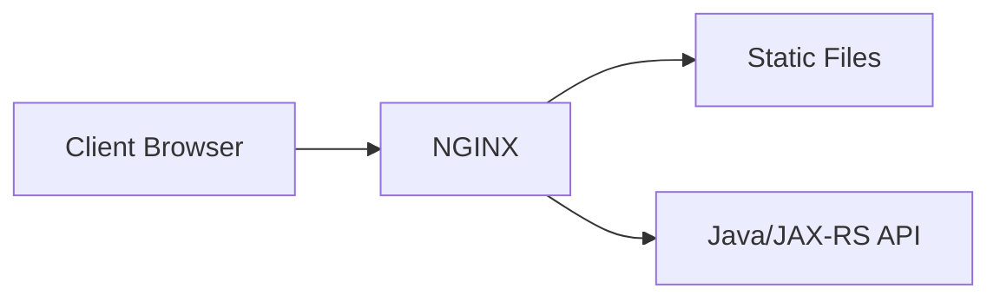

Risiko yang perlu dipahami:

- caching asset terlalu agresif;
- fallback SPA merusak API path;
- `root` dan `alias` salah;
- path traversal;
- asset lama masih tersaji setelah deployment;
- static route berbenturan dengan API route.

---

### 4.2 NGINX sebagai Reverse Proxy

Sebagai reverse proxy, NGINX menerima request dari client lalu meneruskannya ke backend service.

Client melihat NGINX sebagai server. Backend melihat NGINX sebagai client.

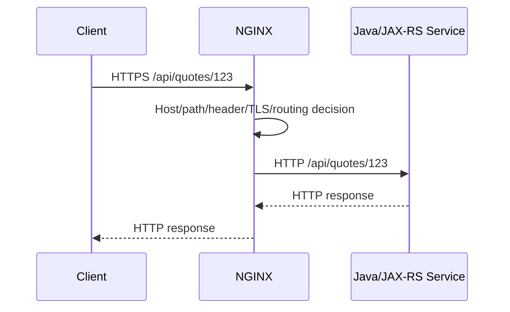

Di sinilah banyak masalah enterprise muncul:

- backend tidak tahu request asli memakai HTTPS;
- backend melihat IP NGINX, bukan IP client;
- redirect URL salah karena `X-Forwarded-Proto` tidak benar;
- base path publik tidak sama dengan context path internal;
- timeout proxy memotong request sebelum aplikasi selesai;
- response streaming tidak benar karena buffering;
- error backend diterjemahkan menjadi 502/504.

Untuk Java/JAX-RS, reverse proxy layer sangat memengaruhi:

- URI generation;
- absolute redirect;
- OpenAPI server URL;
- security filter yang membaca scheme/host;
- audit log client IP;
- correlation ID;
- CORS behavior;
- multipart upload;
- streaming response;
- health check endpoint;
- actuator/management endpoint exposure.

---

### 4.3 NGINX sebagai Load Balancer

NGINX dapat memilih salah satu upstream dari beberapa backend.

```nginx
upstream quote_service {
  server quote-service-1:8080;
  server quote-service-2:8080;
}

server {
  location /quotes/ {
    proxy_pass http://quote_service;
  }
}
```

Mental model-nya:

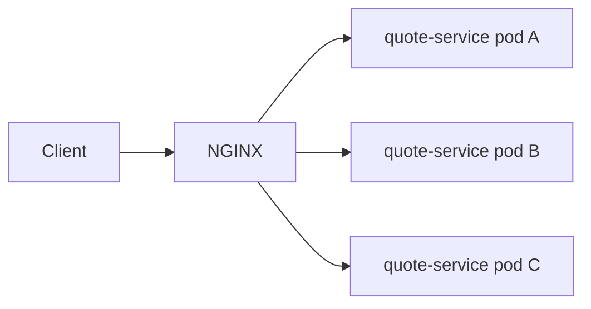

Hal yang penting untuk backend engineer:

- load balancing bukan hanya pembagian traffic;
- ia memengaruhi connection reuse;
- ia memengaruhi session affinity;
- ia memengaruhi retry behavior;
- ia memengaruhi observability karena request satu user bisa tersebar ke banyak pod;
- ia dapat menyembunyikan pod yang lambat jika tidak dilihat per-upstream.

Dalam Kubernetes, sering kali NGINX tidak langsung load balance ke semua pod. Ia bisa saja meneruskan request ke Kubernetes Service, lalu kube-proxy atau dataplane cluster meneruskan ke pod.

Artinya, ada dua level balancing:

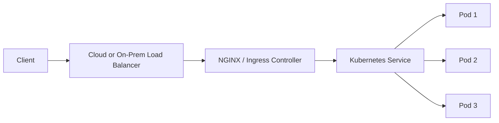

Failure yang sering salah dibaca:

- NGINX dianggap load balancing ke pod, padahal hanya ke Service;
- Service selector salah;
- pod tidak ready tapi masih menerima traffic karena readiness probe salah;
- upstream keepalive reuse connection ke backend yang sedang shutdown;
- cloud load balancer health check sehat, tetapi backend service rusak.

---

### 4.4 NGINX sebagai TLS Termination Layer

NGINX dapat menjadi titik tempat koneksi HTTPS dari client didekripsi.

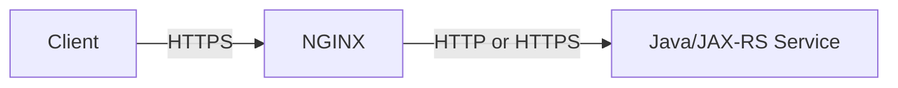

Ada tiga pola utama:

#### 1. TLS Termination

Client berbicara HTTPS ke NGINX. NGINX berbicara HTTP ke backend.

Kelebihan:

- backend lebih sederhana;
- certificate dikelola di edge;
- observability HTTP lebih mudah di proxy;
- TLS config terpusat.

Risiko:

- koneksi internal tidak terenkripsi;
- aplikasi perlu diberi tahu original scheme adalah `https`;
- mTLS end-to-end tidak terjadi.

#### 2. TLS Re-Encryption

Client berbicara HTTPS ke NGINX. NGINX berbicara HTTPS lagi ke backend.

Kelebihan:

- traffic internal tetap terenkripsi;
- cocok untuk zero-trust atau regulated environment.

Risiko:

- certificate backend perlu dikelola;
- trust CA internal perlu benar;
- upstream TLS failure bisa muncul sebagai 502.

#### 3. TLS Passthrough

NGINX tidak mendekripsi HTTP. TLS diteruskan ke backend.

Kelebihan:

- end-to-end TLS dari client ke backend;
- aplikasi mengontrol certificate.

Risiko:

- NGINX tidak bisa routing berdasarkan HTTP path;
- observability HTTP di NGINX terbatas;
- policy header/security di NGINX tidak bisa diterapkan dengan cara biasa.

---

### 4.5 NGINX sebagai API Edge

Sebagai API edge, NGINX menjadi boundary antara dunia luar dan backend API.

Ia dapat menerapkan:

- TLS policy;
- request size limit;
- header policy;
- method restriction;
- rate limiting;
- IP allowlist/denylist;
- security headers;
- auth delegation melalui `auth_request`;
- CORS handling;
- WAF integration;
- request/response logging;
- correlation ID propagation.

Namun perlu hati-hati: **NGINX bukan selalu pengganti API gateway**.

API gateway biasanya lebih kuat untuk:

- API product management;
- developer portal;
- API key lifecycle;
- monetization;
- quota per customer;
- OAuth/OIDC policy management;
- schema validation;
- API analytics;
- contract governance;
- versioning policy.

NGINX bisa menjadi API edge sederhana atau high-performance reverse proxy, tetapi keputusan memakai NGINX sebagai API gateway perlu diverifikasi terhadap kebutuhan organisasi.

---

### 4.6 NGINX sebagai Kubernetes Ingress Controller

Di Kubernetes, NGINX bisa berjalan sebagai Ingress Controller.

Mental model:

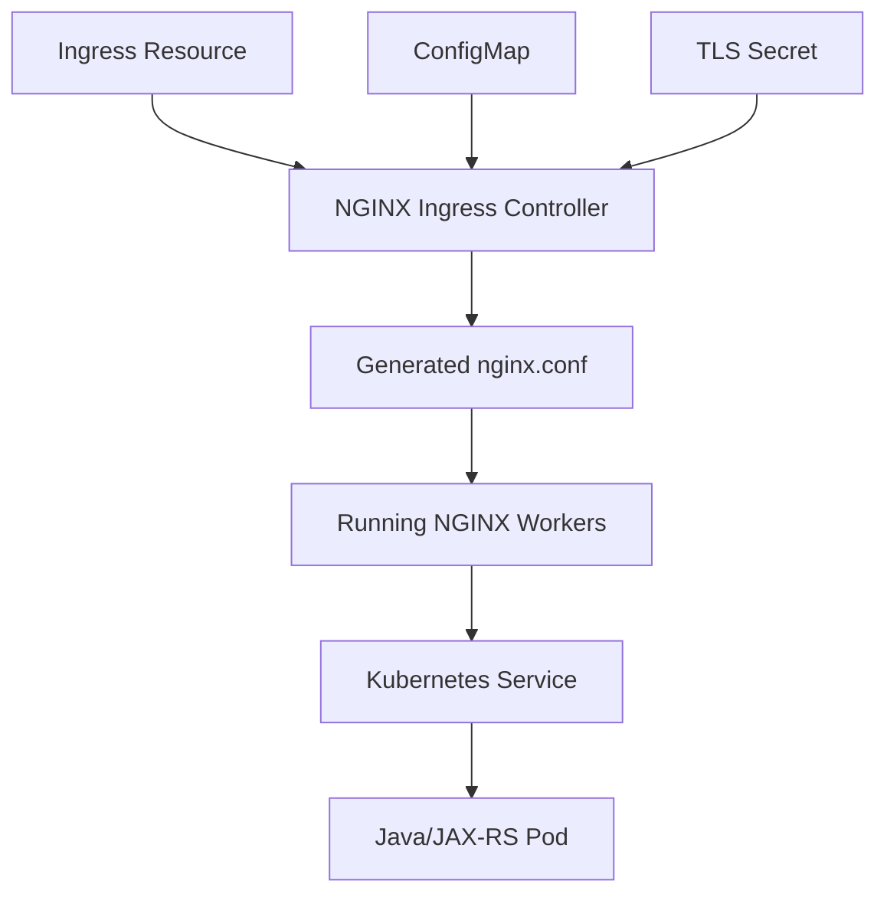

Ingress resource bukan proxy. Ia hanya deklarasi routing. Yang benar-benar memproses traffic adalah controller dan NGINX runtime di belakangnya.

Hal yang harus dibedakan:

- **Kubernetes Ingress**: API object untuk mendeklarasikan routing HTTP/HTTPS.
- **Ingress Controller**: komponen yang membaca Ingress dan mengimplementasikan routing.
- **ingress-nginx**: community Kubernetes controller berbasis NGINX.
- **F5 NGINX Ingress Controller**: controller dari NGINX/F5 yang dapat menggunakan NGINX atau NGINX Plus.
- **NGINX Plus**: commercial distribution dengan fitur enterprise tambahan.

Jangan menganggap semua “NGINX Ingress” sama. Annotation, ConfigMap key, fitur, dan behavior bisa berbeda antar controller.

---

## 5. NGINX Open Source vs NGINX Plus

Untuk seri ini, default pembahasan akan membedakan:

- NGINX Open Source;
- NGINX Plus;
- NGINX Ingress Controller berbasis NGINX;
- community ingress-nginx;
- cloud load balancer yang berada sebelum atau sesudah NGINX.

Secara konseptual:

| Area | NGINX Open Source | NGINX Plus |
|---|---|---|
| Reverse proxy | Ya | Ya |
| Static web server | Ya | Ya |
| HTTP load balancing | Ya | Ya |
| TLS termination | Ya | Ya |
| Basic passive failure handling | Ya | Ya |
| Active health check | Terbatas/tidak seperti Plus | Fitur enterprise |
| Dynamic upstream management | Terbatas | Lebih kuat |
| Enterprise support | Komunitas/vendor ecosystem | Commercial support |
| Advanced metrics/API | Terbatas | Lebih lengkap |

Catatan penting: detail fitur bisa berubah antar versi. Untuk production decision, selalu cek dokumentasi resmi dan versi yang dipakai internal.

---

## 6. Posisi NGINX dalam Arsitektur Java/JAX-RS

Dalam sistem enterprise Java/JAX-RS, service biasanya tidak diekspos langsung ke internet.

Pola umum:

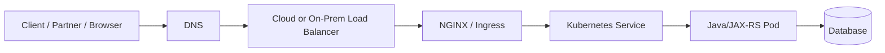

NGINX memengaruhi Java/JAX-RS service melalui beberapa channel:

### 6.1 Header

Contoh header penting:

- `Host`
- `X-Forwarded-For`
- `X-Forwarded-Host`
- `X-Forwarded-Proto`
- `Forwarded`
- `X-Request-ID`
- `traceparent`
- `Authorization`
- `Cookie`

Jika header ini salah, aplikasi dapat salah dalam:

- membangun absolute URL;
- melakukan redirect;
- mencatat audit IP;
- menentukan secure request;
- menegakkan CORS;
- meneruskan trace;
- memvalidasi tenant atau host.

### 6.2 Path

NGINX bisa mempertahankan, memotong, atau menulis ulang path.

Contoh risiko:

- public path: `/api/quote/v1/orders`
- backend path: `/orders`
- JAX-RS base path: `/quote/v1`
- OpenAPI server URL: `/api/quote/v1`

Jika mapping tidak jelas, akan muncul:

- 404 di backend;
- redirect salah;
- Swagger/OpenAPI salah URL;
- broken HATEOAS link;
- CORS preflight mismatch;
- reverse proxy loop.

### 6.3 Timeout

NGINX dapat memutus request sebelum Java selesai memproses.

Contoh:

- Java endpoint butuh 90 detik;
- `proxy_read_timeout` hanya 60 detik;
- client menerima 504;
- Java service mungkin tetap memproses di belakang;
- user retry;
- duplicate command terjadi jika endpoint tidak idempotent.

Timeout bukan hanya performance setting. Timeout adalah correctness dan reliability decision.

### 6.4 Body Handling

NGINX dapat membuffer request body sebelum meneruskannya.

Untuk upload besar:

- client upload ke NGINX;
- NGINX simpan body di memory/disk;
- setelah lengkap, baru diteruskan ke backend;
- backend tidak melihat streaming asli;
- disk temp NGINX bisa penuh.

Untuk streaming response:

- Java mengirim data bertahap;
- NGINX buffering menyimpan response;
- client tidak menerima event real-time;
- SSE terlihat “macet”.

---

## 7. Request Lifecycle Ringkas

Lifecycle dasar yang harus selalu ada di kepala:

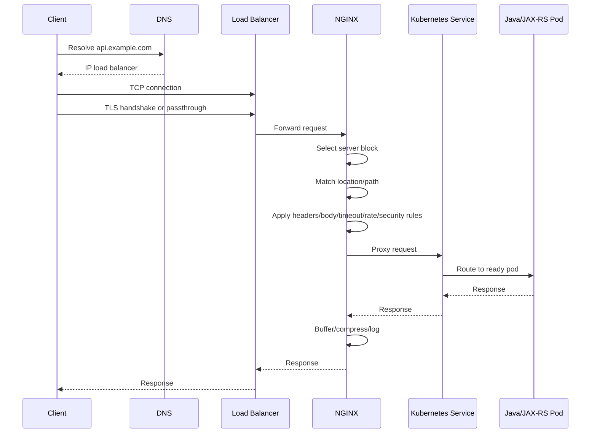

Pada setiap step, ada kemungkinan failure:

| Step | Failure Example | Symptom |
|---|---|---|
| DNS | record salah, stale DNS, split-horizon mismatch | client tidak bisa connect |
| TCP | firewall/security group/NACL block | timeout/connect refused |
| TLS | certificate mismatch/expired/unknown CA | handshake failure |
| Load balancer | unhealthy target, wrong target group | 502/503 dari LB |
| NGINX server selection | Host/SNI tidak cocok | default backend, wrong cert |
| Location matching | path salah, rewrite salah | 404/wrong backend |
| Header processing | forwarded header hilang | redirect/IP/scheme salah |
| Body handling | body terlalu besar | 413 |
| Upstream connect | Service/pod tidak reachable | 502/503 |
| Upstream read | backend lambat | 504 |
| Client disconnect | user/browser timeout | 499 di NGINX |
| Response buffering | streaming tertahan | SSE/WebSocket issue |

---

## 8. Boundary of Responsibility

NGINX berada di boundary. Tetapi tidak semua concern harus diselesaikan di NGINX.

### Cocok Ditangani di NGINX

- TLS termination;
- basic routing host/path;
- reverse proxy;
- request size limit;
- basic rate limiting;
- IP allowlist;
- security headers;
- forwarding headers;
- static asset serving;
- access/error logging;
- edge timeout policy;
- simple auth delegation.

### Tidak Ideal Ditangani Sepenuhnya di NGINX

- complex business authorization;
- tenant entitlement logic;
- quote/order lifecycle rules;
- domain validation;
- distributed quota per account jika membutuhkan global state;
- API monetization;
- schema evolution governance;
- complex orchestration;
- long-running workflow consistency.

Untuk sistem Quote & Order, NGINX boleh membantu melindungi dan merutekan API, tetapi domain correctness tetap berada di application/domain layer.

---

## 9. Failure-Oriented Mental Model

NGINX dapat menjadi:

1. **Source of failure** — konfigurasi salah, timeout salah, TLS salah, routing salah.
2. **Amplifier of failure** — retry storm, buffering disk penuh, keepalive ke backend rusak.
3. **Masking layer** — backend error terlihat sebagai generic 502/504.
4. **Diagnostic layer** — access log dan upstream timing membantu root cause.
5. **Protection layer** — rate limit, body limit, WAF, security headers.

Sebagai senior backend engineer, jangan berhenti pada “service error”. Tanyakan:

- request benar-benar sampai ke pod atau berhenti di NGINX?
- status code dibuat oleh aplikasi, NGINX, ingress controller, atau cloud load balancer?
- latency terjadi sebelum upstream, saat connect upstream, saat upstream processing, atau saat response ke client?
- header yang diterima aplikasi sama dengan header dari client?
- path yang diterima aplikasi sama dengan public path?
- timeout mana yang paling pendek?

---

## 10. Contoh Production Reasoning

### Kasus 1 — Aplikasi Java Menghasilkan Redirect HTTP, Bukan HTTPS

Symptom:

- user akses `https://api.example.com/login`;
- aplikasi redirect ke `http://api.example.com/callback`;
- browser menolak atau security warning.

Kemungkinan root cause:

- TLS termination terjadi di NGINX;
- NGINX meneruskan request ke Java via HTTP;
- `X-Forwarded-Proto` tidak diset ke `https`;
- Java framework mengira original scheme adalah HTTP.

Hal yang dicek:

- NGINX `proxy_set_header X-Forwarded-Proto $scheme;`
- apakah `$scheme` masih benar jika TLS terminate di load balancer sebelum NGINX;
- framework Java trusted proxy setting;
- redirect generation logic.

---

### Kasus 2 — Endpoint Upload Besar Selalu 413

Symptom:

- upload multipart 20 MB gagal;
- aplikasi tidak mencatat request;
- response 413.

Kemungkinan root cause:

- request ditolak NGINX sebelum sampai backend;
- `client_max_body_size` terlalu kecil;
- Ingress annotation body size belum diset;
- cloud LB juga punya limit body/request tertentu.

Hal yang dicek:

- access log NGINX;
- error log NGINX;
- Ingress annotation;
- ConfigMap global;
- API contract untuk max upload size;
- limit di application server Java.

---

### Kasus 3 — 504 Saat Backend Masih Memproses

Symptom:

- client menerima 504 setelah 60 detik;
- log Java menunjukkan request selesai setelah 90 detik;
- user retry menyebabkan duplicate operation.

Kemungkinan root cause:

- `proxy_read_timeout` lebih pendek dari durasi operasi;
- endpoint command tidak idempotent;
- timeout chain tidak diselaraskan;
- client retry policy tidak sadar operation semantics.

Hal yang dicek:

- timeout NGINX;
- timeout cloud LB;
- timeout client;
- timeout application server;
- idempotency key;
- async processing pattern.

---

## 11. NGINX dalam Kubernetes: Jangan Salah Membaca Layer

Dalam Kubernetes, ada beberapa object dan runtime yang sering dicampur:

| Komponen | Peran |
|---|---|
| Ingress | Deklarasi routing HTTP/HTTPS |
| IngressClass | Menentukan controller mana yang memproses Ingress |
| Ingress Controller | Controller yang membaca Ingress dan membuat config runtime |
| NGINX worker | Proses yang benar-benar memproses traffic |
| ConfigMap | Global controller/NGINX configuration |
| Annotation | Override atau rule khusus per Ingress |
| TLS Secret | Certificate/key untuk TLS |
| Service | Stable virtual endpoint ke pod |
| EndpointSlice | Daftar endpoint pod yang backing Service |
| Pod | Runtime aplikasi Java/JAX-RS |

Saat debugging, jangan hanya melihat Ingress YAML. Lihat juga:

- generated NGINX config;
- controller logs;
- Kubernetes events;
- Service endpoints;
- readiness probe;
- cloud load balancer target health;
- access/error logs.

---

## 12. AWS, Azure, On-Prem, dan Hybrid: Posisi NGINX Bisa Berbeda

### AWS/EKS Pattern

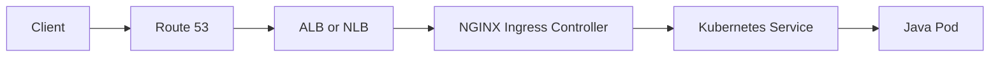

Variasi penting:

- TLS terminate di ALB;
- TLS terminate di NGINX;
- NLB TCP passthrough ke NGINX;
- source IP preservation butuh konfigurasi khusus;
- security group memblokir node atau pod;
- ACM certificate vs Kubernetes TLS Secret.

### Azure/AKS Pattern

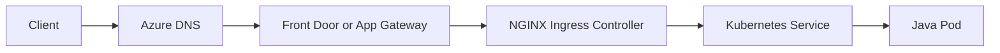

Variasi penting:

- Azure Front Door di global edge;
- Application Gateway sebagai L7 proxy;
- Azure Load Balancer sebagai L4;
- Private Link/Private Endpoint;
- NSG dan subnet routing;
- Azure certificate management vs Kubernetes Secret.

### On-Prem/Hybrid Pattern

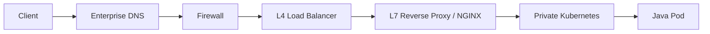

Variasi penting:

- DMZ;
- corporate firewall;
- internal CA;
- proxy chaining;
- air-gapped deployment;
- split-horizon DNS;
- hybrid identity;
- outbound proxy.

---

## 13. CSG Context: Cara Menggunakan Seri Ini dengan Aman

Untuk konteks CSG Quote & Order, seri ini harus dipakai sebagai **framework berpikir**, bukan asumsi atas arsitektur internal.

Yang boleh diasumsikan secara umum:

- enterprise backend system biasanya memiliki layer proxy/load balancer;
- Java/JAX-RS service bisa berada di belakang NGINX/Ingress/API gateway;
- Kubernetes deployment biasanya memakai Service, Ingress, ConfigMap, Secret, dan observability stack;
- TLS, timeout, header, body size, dan routing sangat relevan untuk production reliability.

Yang tidak boleh diasumsikan tanpa verifikasi:

- apakah CSG memakai NGINX Open Source atau NGINX Plus;
- apakah controller yang digunakan adalah ingress-nginx community atau F5 NGINX Ingress Controller;
- apakah TLS terminate di cloud LB, NGINX, API gateway, atau service;
- apakah source IP dipertahankan;
- apakah service mesh digunakan;
- apakah API gateway berada sebelum NGINX;
- apakah rate limiting dilakukan di NGINX, gateway, atau aplikasi;
- apakah auth dilakukan di edge atau aplikasi;
- apakah deployment cloud, on-prem, atau hybrid punya path yang sama.

---

## 14. Internal Verification Checklist

Gunakan checklist ini saat mulai membaca codebase atau infra repo.

### 14.1 Repository dan Ownership

- Di repo mana NGINX/Ingress config disimpan?
- Apakah config dikelola oleh application team, platform team, SRE, DevOps, atau network team?
- Apakah ada GitOps repo terpisah?
- Apakah ada Helm chart untuk ingress controller?
- Apakah ada environment-specific values?
- Apakah perubahan ingress butuh approval khusus?

### 14.2 Runtime Topology

- Apakah ada cloud load balancer di depan NGINX?
- Apakah ada API gateway di depan NGINX?
- Apakah ada WAF di depan NGINX?
- Apakah NGINX berjalan sebagai standalone reverse proxy, container, sidecar, atau ingress controller?
- Apakah ada service mesh?
- Apakah traffic north-south dan east-west memakai komponen berbeda?

### 14.3 Kubernetes Objects

- IngressClass apa yang digunakan?
- Ingress object mana yang merutekan service Quote & Order?
- Service type apa yang digunakan?
- Apakah Service selector benar?
- Apakah EndpointSlice berisi pod yang expected?
- Apakah readiness probe benar-benar merepresentasikan kesiapan menerima traffic?

### 14.4 TLS dan Certificate

- Di layer mana TLS terminate?
- Certificate berasal dari mana?
- Apakah cert-manager digunakan?
- Apakah ACM/Azure certificate manager digunakan?
- Apakah ada mTLS?
- Bagaimana certificate rotation dilakukan?

### 14.5 Header dan Identity

- Header forwarding apa yang diset?
- Apakah `X-Forwarded-For` trusted?
- Apakah `X-Forwarded-Proto` benar?
- Apakah `Forwarded` header digunakan?
- Apakah identity header bisa dipalsukan dari client?
- Apakah correlation ID diteruskan ke aplikasi?

### 14.6 Observability

- Di mana access log NGINX tersedia?
- Di mana error log NGINX tersedia?
- Apakah log structured JSON?
- Apakah upstream timing dicatat?
- Apakah 499/502/503/504 terlihat di dashboard?
- Apakah traceparent diteruskan?

---

## 15. PR Review Checklist untuk Part Ini

Saat mereview perubahan yang menyentuh NGINX/Ingress, tanya minimal:

- Layer mana yang berubah: DNS, LB, NGINX, Ingress, Service, Pod, atau aplikasi?
- Apakah perubahan ini memengaruhi public contract API?
- Apakah Host/path/header berubah?
- Apakah TLS behavior berubah?
- Apakah timeout berubah?
- Apakah body size atau buffering berubah?
- Apakah source IP atau identity propagation berubah?
- Apakah observability cukup untuk debugging jika rollout gagal?
- Apakah rollback jelas?
- Apakah ada blast radius ke service lain?

---

## 16. Anti-Pattern Awal yang Harus Dihindari

### Anti-Pattern 1 — Menganggap 502 Selalu Aplikasi Down

502 bisa berasal dari:

- upstream connect refused;
- DNS upstream gagal;
- TLS upstream gagal;
- connection reset;
- invalid response dari backend;
- Service salah;
- pod terminating;
- proxy protocol mismatch.

### Anti-Pattern 2 — Menganggap Ingress YAML adalah Source of Truth Runtime

Ingress YAML adalah desired routing declaration. Runtime behavior bergantung pada:

- controller implementation;
- generated NGINX config;
- ConfigMap;
- annotation;
- secret;
- controller version;
- admission policy;
- reload behavior.

### Anti-Pattern 3 — Menyamakan Semua NGINX Ingress Controller

Community ingress-nginx dan F5 NGINX Ingress Controller tidak identik. Annotation, ConfigMap, feature support, dan operational behavior perlu diverifikasi.

### Anti-Pattern 4 — Menaruh Semua Policy di NGINX

NGINX cocok untuk edge enforcement tertentu. Tetapi business authorization, domain rule, dan workflow consistency tetap milik aplikasi/domain layer.

### Anti-Pattern 5 — Menentukan Timeout Tanpa Memahami Operation Semantics

Timeout untuk GET query, upload file, command mutation, streaming response, dan long-running workflow tidak boleh disamakan begitu saja.

---

## 17. Latihan Mental Model

Gunakan pertanyaan ini untuk menguji pemahaman:

1. Jika user menerima 504 tetapi log aplikasi menunjukkan request selesai sukses, layer mana yang perlu dicek?
2. Jika aplikasi menghasilkan redirect ke hostname internal, header apa yang mungkin salah?
3. Jika request tidak pernah muncul di log Java tetapi client menerima 413, siapa yang kemungkinan menolak request?
4. Jika hanya HTTPS hostname tertentu yang mendapat certificate salah, konsep apa yang perlu dicek?
5. Jika satu Ingress host punya dua path mirip, bagaimana memastikan backend yang dipilih benar?
6. Jika real client IP hilang, layer apa saja yang perlu diverifikasi?
7. Jika SSE tidak realtime, setting proxy apa yang perlu dicurigai?

---

## 18. Key Takeaways

- NGINX adalah traffic processing component, bukan sekadar config file.
- Untuk backend engineer, NGINX harus dipahami sebagai bagian dari request lifecycle.
- NGINX dapat berperan sebagai web server, reverse proxy, load balancer, TLS termination layer, API edge, dan ingress controller.
- NGINX memengaruhi Java/JAX-RS service melalui header, path, timeout, body handling, connection behavior, dan observability.
- Dalam Kubernetes, Ingress hanyalah deklarasi. Controller dan generated NGINX config menentukan behavior aktual.
- Jangan mengarang detail internal CSG. Gunakan checklist untuk verifikasi topology, controller, TLS, headers, logs, dan ownership.
- Senior engineer harus mampu membaca failure dari perspektif traffic path, bukan hanya dari log aplikasi.

---

## 19. Prerequisite untuk Part Berikutnya

Sebelum masuk ke Part 002, pastikan kamu memahami:

- perbedaan web server, reverse proxy, load balancer, API gateway, dan service mesh secara konseptual;
- request lifecycle dasar client ke backend;
- konsep HTTP request/response;
- basic Kubernetes Service dan Ingress;
- kenapa proxy layer dapat mengubah behavior aplikasi.

Part berikutnya akan membandingkan NGINX dengan Apache, HAProxy, Envoy, cloud load balancer, API gateway, dan service mesh agar boundary arsitekturalnya jelas.
