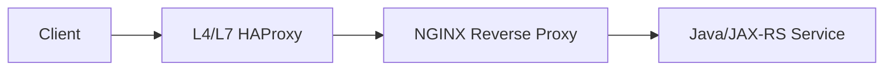
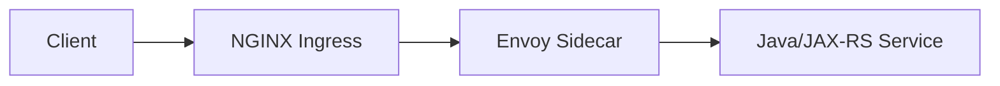
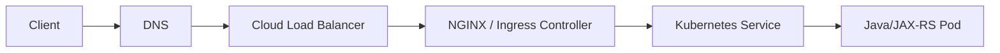
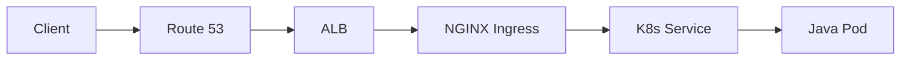
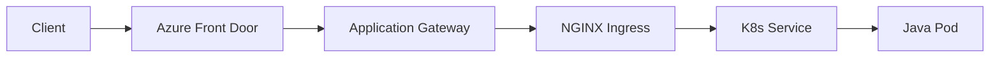
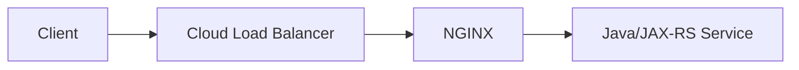
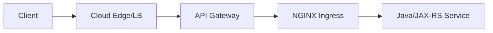
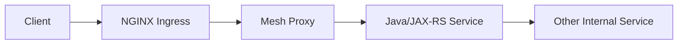
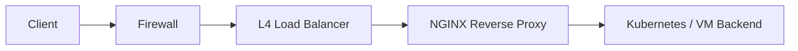

# Part 002 — NGINX Compared with Apache, HAProxy, Envoy, Cloud Load Balancer, API Gateway, and Service Mesh

## 1. Tujuan Part Ini

Part ini membahas posisi NGINX dibandingkan komponen traffic management lain.

Masalah yang ingin diselesaikan:

- Banyak engineer tahu “NGINX bisa proxy”, tetapi tidak tahu boundary-nya.
- Banyak architecture diagram menumpuk Cloud Load Balancer, API Gateway, NGINX Ingress, Service Mesh, dan aplikasi tanpa alasan jelas.
- Banyak production issue terjadi karena responsibility antar layer tumpang tindih.
- Banyak PR infra terlihat kecil, tetapi sebenarnya mengubah contract traffic path.

Setelah membaca part ini, kamu harus mampu menjawab:

- Apa bedanya NGINX dengan Apache HTTPD?
- Apa bedanya NGINX dengan HAProxy?
- Apa bedanya NGINX dengan Envoy?
- Apa bedanya NGINX dengan AWS/Azure load balancer?
- Apa bedanya NGINX dengan API gateway?
- Apa bedanya NGINX dengan service mesh?
- Kapan NGINX cukup?
- Kapan NGINX bukan tool yang tepat?

---

## 2. Cara Membandingkan Komponen Traffic Management

Jangan membandingkan tool berdasarkan popularitas. Bandingkan berdasarkan fungsi sistem.

Gunakan axis berikut:

| Axis | Pertanyaan |
|---|---|
| Traffic direction | Apakah tool untuk north-south, east-west, atau keduanya? |
| Layer | Apakah bekerja di L4 TCP/UDP, L7 HTTP, atau keduanya? |
| Routing | Apakah routing berdasarkan IP/port, host/path/header, service identity, atau API product? |
| Policy | Apakah mendukung TLS, auth, rate limit, WAF, quota, transform, observability? |
| Dynamic config | Apakah cocok untuk topology yang sering berubah seperti Kubernetes? |
| Runtime visibility | Apakah bisa memberi metrics/log/tracing detail? |
| Ownership | Dikelola oleh network team, platform team, app team, security team, atau SRE? |
| Failure mode | Jika layer ini rusak, dampaknya apa? |
| Operational model | Apakah managed service, self-hosted, sidecar, daemon, gateway, atau controller? |
| Cost of complexity | Apakah menambah layer ini memberi value lebih besar dari overhead-nya? |

Senior engineer tidak bertanya “tool mana yang lebih bagus”, tetapi:

> Layer mana yang harus bertanggung jawab atas routing, security, reliability, observability, dan policy tertentu agar sistem tetap dapat dipahami dan dioperasikan?

---

## 3. High-Level Comparison Map

| Component | Primary Strength | Common Position | Best For | Weakness / Risk |
|---|---|---|---|---|
| NGINX | High-performance HTTP reverse proxy/web server | Edge, ingress, reverse proxy | HTTP routing, TLS, static files, basic edge control | Bisa overload responsibility jika dijadikan API gateway penuh |
| Apache HTTPD | Mature web server, module ecosystem | Web server, legacy app front | Traditional web hosting, .htaccess-style legacy apps | Tidak selalu ideal untuk modern dynamic proxy-heavy workloads |
| HAProxy | Load balancing and L4/L7 proxy | Edge/LB tier | High-performance load balancing, TCP/HTTP proxying | Tidak fokus sebagai static web server |
| Envoy | Modern service proxy | Gateway, sidecar, mesh data plane | Dynamic config, observability, service mesh, advanced L7 routing | Lebih kompleks secara operasional |
| Cloud Load Balancer | Managed L4/L7 entry point | Cloud edge/VPC boundary | Managed scale, cloud-native integration | Behavior vendor-specific, limited app-level policy |
| API Gateway | API product and policy layer | Public/internal API edge | Auth, quota, API key, developer portal, API lifecycle | Bisa menjadi bottleneck governance/latency/complexity |
| Service Mesh | East-west service communication | Inside cluster | mTLS, retries, traffic shifting, telemetry service-to-service | Sidecar/control-plane complexity |

---

## 4. NGINX vs Apache HTTPD

### 4.1 Mental Model

Apache HTTPD secara historis sangat kuat sebagai general-purpose web server dengan module ecosystem yang luas. NGINX terkenal sebagai event-driven web server dan reverse proxy yang efisien untuk concurrent connections.

Dalam konteks enterprise Java/JAX-RS modern, perbandingannya biasanya bukan “mana yang bisa serve HTTP”, tetapi:

- mana yang lebih cocok menjadi reverse proxy di depan backend service;
- mana yang lebih cocok untuk static asset;
- mana yang lebih cocok untuk Kubernetes ingress;
- mana yang lebih mudah dioperasikan oleh platform team;
- mana yang sudah menjadi standard internal.

### 4.2 Kapan NGINX Lebih Cocok

NGINX biasanya lebih cocok jika fokusnya:

- reverse proxy HTTP;
- TLS termination;
- high-concurrency connection handling;
- static asset efficient serving;
- Kubernetes ingress ecosystem;
- edge routing host/path;
- basic caching/compression;
- containerized deployment;
- config-driven traffic behavior.

### 4.3 Kapan Apache Bisa Lebih Relevan

Apache bisa lebih relevan jika:

- organisasi punya legacy stack berbasis Apache module;
- aplikasi sangat bergantung pada `.htaccess`;
- ada module Apache spesifik yang sudah menjadi dependency;
- operational team sudah punya mature Apache standard;
- migration risk lebih besar daripada benefit.

### 4.4 Relevansi ke Java/JAX-RS

Untuk Java/JAX-RS, Apache atau NGINX sama-sama bisa berada di depan service. Namun yang harus diperhatikan bukan brand proxy-nya, melainkan:

- forwarded headers;
- context path;
- TLS termination;
- timeout chain;
- buffering;
- client IP;
- error mapping;
- observability;
- reload behavior.

Jika organisasi memakai NGINX, fokusmu adalah memahami behavior NGINX. Jika ada Apache di environment tertentu, gunakan konsep yang sama untuk membaca traffic path.

---

## 5. NGINX vs HAProxy

### 5.1 Mental Model

HAProxy sangat kuat sebagai load balancer dan proxy untuk TCP/HTTP traffic. NGINX lebih luas sebagai web server, reverse proxy, cache, TLS termination, dan static content server.

Perbandingan praktis:

| Concern | NGINX | HAProxy |
|---|---|---|
| Static file serving | Sangat kuat | Bukan fokus utama |
| HTTP reverse proxy | Sangat kuat | Sangat kuat |
| L4 load balancing | Ada melalui stream module | Sangat kuat |
| L7 load balancing | Kuat | Sangat kuat |
| TCP proxying | Bisa | Sangat umum digunakan |
| Config readability | Familiar untuk web/proxy use case | Familiar untuk LB/proxy specialist |
| Kubernetes ingress | Ekosistem besar | Ada, tetapi konteks seri ini fokus NGINX |
| API edge policy | Bisa untuk basic edge | Bisa untuk proxy/LB policy |

### 5.2 Kapan NGINX Lebih Cocok

Gunakan NGINX jika kamu butuh kombinasi:

- HTTP reverse proxy;
- static asset serving;
- TLS termination;
- path/host routing;
- basic caching/compression;
- NGINX Ingress Controller;
- config pattern yang sudah menjadi standard platform.

### 5.3 Kapan HAProxy Lebih Cocok

HAProxy bisa lebih cocok jika kebutuhan utamanya:

- pure high-performance load balancing;
- TCP proxying intensif;
- advanced backend health and balancing behavior;
- existing network/load balancer standard berbasis HAProxy;
- traffic layer lebih dekat ke L4/L7 LB dibanding web server/proxy.

### 5.4 Failure Reasoning

Jika NGINX dan HAProxy sama-sama ada di path, jangan langsung menyalahkan salah satunya.

Contoh chain:



Pertanyaan debugging:

- Layer mana yang melakukan TLS termination?
- Layer mana yang melakukan health check?
- Layer mana yang mengatur timeout paling pendek?
- Layer mana yang menambah `X-Forwarded-For`?
- Apakah header proxy bertumpuk?
- Apakah source IP di-overwrite?
- Apakah 502 berasal dari HAProxy atau NGINX?

---

## 6. NGINX vs Envoy

### 6.1 Mental Model

Envoy adalah modern service proxy yang banyak dipakai sebagai data plane untuk service mesh dan cloud-native traffic management. Envoy kuat dalam dynamic configuration, observability, retries, circuit breaking, traffic shifting, mTLS, dan xDS-based control plane.

NGINX lebih umum dipakai sebagai:

- reverse proxy;
- web server;
- ingress controller;
- TLS termination;
- static/cache layer;
- edge proxy.

### 6.2 Perbedaan Arsitektural

| Area | NGINX | Envoy |
|---|---|---|
| Primary mental model | Config-driven web/reverse proxy | Dynamic service proxy/data plane |
| Common deployment | Edge, ingress, reverse proxy | Gateway, sidecar, mesh proxy |
| Dynamic config | Ada, bergantung varian/controller | Sangat kuat via xDS/control plane |
| Service mesh | Bisa berdampingan | Sering menjadi inti mesh |
| Observability | Baik via logs/metrics/exporter | Sangat kuat untuk distributed telemetry |
| Operational complexity | Umumnya lebih sederhana | Lebih kompleks, terutama dengan mesh |
| Learning curve | Lebih rendah untuk HTTP proxy | Lebih tinggi untuk mesh/control plane |

### 6.3 Kapan NGINX Cukup

NGINX cukup jika requirement utama:

- north-south routing;
- host/path routing;
- TLS termination;
- basic rate limiting;
- simple edge security;
- static asset serving;
- Kubernetes ingress;
- reverse proxy ke Java/JAX-RS service;
- debugging berbasis access/error log cukup.

### 6.4 Kapan Envoy atau Mesh Lebih Relevan

Envoy/service mesh lebih relevan jika:

- butuh service-to-service mTLS secara luas;
- butuh traffic shifting east-west;
- butuh distributed retries/circuit breaking;
- butuh uniform service identity;
- butuh deep service telemetry;
- banyak service perlu policy komunikasi konsisten;
- organisasi siap mengoperasikan control plane mesh.

### 6.5 Risiko Menumpuk NGINX dan Envoy

Arsitektur sering terlihat seperti ini:



Ini valid, tetapi perlu clarity:

- NGINX mengelola north-south edge traffic;
- Envoy sidecar mengelola east-west service traffic;
- timeout dan retry tidak boleh bertentangan;
- trace ID harus konsisten;
- mTLS boundary harus jelas;
- 503 dari Envoy tidak boleh salah dibaca sebagai 503 dari NGINX.

---

## 7. NGINX vs Cloud Load Balancer

### 7.1 Mental Model

Cloud load balancer adalah managed entry point dari cloud provider. Contoh:

- AWS ALB;
- AWS NLB;
- Azure Load Balancer;
- Azure Application Gateway;
- Azure Front Door;
- Google Cloud Load Balancer.

NGINX adalah proxy/runtime yang bisa self-managed atau controller-managed.

Cloud load balancer biasanya berada sebelum NGINX:



### 7.2 Perbandingan Responsibility

| Concern | Cloud Load Balancer | NGINX |
|---|---|---|
| Public IP / managed endpoint | Sangat kuat | Biasanya di belakang LB |
| Cloud network integration | Sangat kuat | Bergantung deployment |
| Security group/subnet integration | Native | Tidak native |
| TLS termination | Sering didukung | Sangat umum |
| Host/path routing | Bergantung produk | Sangat kuat |
| Header manipulation | Terbatas/bervariasi | Fleksibel |
| Fine-grained location logic | Terbatas | Kuat |
| Kubernetes Ingress integration | Via controller tertentu | Sangat umum |
| Access log detail | Ada, vendor-specific | Sangat fleksibel |
| Config portability | Rendah antar cloud | Lebih portable |

### 7.3 Common AWS Pattern



Pertanyaan yang harus dijawab:

- Apakah TLS terminate di ALB atau NGINX?
- Apakah ALB meneruskan HTTP atau HTTPS ke NGINX?
- Apakah source IP dipertahankan?
- Apakah health check ALB mengecek NGINX saja atau aplikasi?
- Apakah timeout ALB lebih pendek dari timeout NGINX?

### 7.4 Common Azure Pattern



Pertanyaan yang harus dijawab:

- Layer mana yang melakukan WAF?
- Layer mana yang terminate TLS?
- Apakah Application Gateway juga melakukan path routing?
- Apakah NGINX masih dibutuhkan untuk routing detail?
- Apakah header forwarding dari Front Door ke App Gateway ke NGINX konsisten?

### 7.5 Risiko Layer Ganda

Jika cloud LB dan NGINX sama-sama melakukan L7 routing:

- path rule bisa tumpang tindih;
- redirect bisa terjadi dua kali;
- TLS policy bisa tidak konsisten;
- access log perlu dikorelasikan lintas layer;
- 502/504 bisa berasal dari cloud LB atau NGINX;
- timeout paling pendek menentukan user-visible failure.

---

## 8. NGINX vs API Gateway

### 8.1 Mental Model

NGINX dapat menjadi API edge, tetapi API gateway biasanya memiliki scope lebih luas.

API gateway mengelola API sebagai product dan policy surface, bukan hanya HTTP route.

API gateway biasanya menangani:

- API key;
- OAuth/OIDC integration;
- JWT validation;
- quota;
- subscription plan;
- developer portal;
- API analytics;
- request/response transformation;
- schema validation;
- versioning;
- monetization;
- lifecycle governance.

NGINX biasanya lebih fokus pada:

- reverse proxy;
- host/path routing;
- TLS;
- rate limiting dasar;
- header manipulation;
- body size limit;
- security headers;
- buffering/caching;
- static serving;
- ingress.

### 8.2 Kapan NGINX Cukup sebagai API Edge

NGINX cukup jika:

- API hanya internal atau partner terbatas;
- policy sederhana;
- routing berbasis host/path cukup;
- auth dilakukan di aplikasi atau dedicated auth service;
- rate limit sederhana cukup;
- tidak butuh developer portal atau API product lifecycle;
- platform team sudah punya standard NGINX kuat.

### 8.3 Kapan API Gateway Lebih Tepat

API Gateway lebih tepat jika:

- banyak external consumers;
- API key lifecycle penting;
- quota per customer/plan harus dikelola;
- OAuth/OIDC policy perlu centralized;
- API analytics dibutuhkan untuk product decision;
- schema validation di edge wajib;
- versioning dan deprecation policy formal;
- compliance butuh audit policy API terpusat.

### 8.4 Boundary dengan Java/JAX-RS

Jangan memindahkan business authorization sepenuhnya ke NGINX/API gateway jika rule-nya domain-specific.

Contoh untuk Quote & Order domain:

- Apakah user boleh melihat quote tertentu?
- Apakah quote sudah locked?
- Apakah order boleh submit dalam state tertentu?
- Apakah tenant punya entitlement terhadap product catalog tertentu?
- Apakah approval workflow sudah selesai?

Itu domain/application authorization, bukan sekadar edge authorization.

Edge layer boleh memverifikasi identity dan coarse-grained access. Fine-grained domain authorization tetap harus ada di aplikasi/domain service.

---

## 9. NGINX vs Service Mesh

### 9.1 Mental Model

Service mesh mengatur komunikasi antar service di dalam cluster atau platform.

NGINX sering menangani **north-south traffic**:

```text
external client -> cluster/service
```

Service mesh sering menangani **east-west traffic**:

```text
service A -> service B
```

### 9.2 Perbandingan

| Concern | NGINX | Service Mesh |
|---|---|---|
| Primary direction | North-south | East-west |
| Deployment | Edge/ingress/proxy | Sidecar/ambient/gateway |
| mTLS service-to-service | Bisa, tapi tidak universal | Core use case |
| Service identity | Terbatas | Core use case |
| Traffic shifting internal | Terbatas/Ingress-level | Kuat |
| Retry/circuit breaker per service | Terbatas | Kuat |
| Operational complexity | Lebih rendah | Lebih tinggi |
| Debugging | Access/error logs | Multi-proxy, control plane, telemetry |

### 9.3 Kapan NGINX Cukup

NGINX cukup jika:

- komunikasi utama yang perlu dikontrol adalah external-to-service;
- service count belum terlalu besar;
- tidak butuh service-to-service mTLS universal;
- retry/circuit breaking dikelola aplikasi/client library;
- observability sudah cukup dengan logs/metrics/traces aplikasi;
- platform tidak siap mengoperasikan mesh.

### 9.4 Kapan Service Mesh Dibutuhkan

Service mesh lebih relevan jika:

- banyak microservices saling memanggil;
- security posture butuh mTLS antar service;
- service identity harus konsisten;
- traffic shifting antar versi service perlu sering;
- observability service-to-service harus standar;
- policy komunikasi internal harus centrally managed;
- organisasi punya SRE/platform maturity untuk mesh.

### 9.5 Risiko Mesh Tanpa Maturity

Service mesh bisa menambah:

- latency;
- memory/CPU overhead;
- debugging complexity;
- control plane dependency;
- upgrade complexity;
- policy drift;
- false confidence terhadap resilience.

Mesh bukan pengganti desain aplikasi yang benar. Retry storm, timeout buruk, dan non-idempotent command tetap bisa menghancurkan sistem walaupun memakai mesh.

---

## 10. Decision Matrix: Kapan Menggunakan Apa

| Situation | Better Default |
|---|---|
| Static asset + reverse proxy sederhana | NGINX |
| Kubernetes HTTP ingress | NGINX Ingress / Gateway API implementation |
| High-performance L4/L7 load balancing | HAProxy atau cloud LB, tergantung environment |
| Public API product with quota/developer portal | API Gateway |
| Internal service-to-service mTLS and telemetry | Service Mesh |
| Cloud public entry point | Cloud Load Balancer |
| Path rewrite and forwarded header control before Java app | NGINX |
| Advanced dynamic service proxy with control plane | Envoy-based platform |
| Legacy web hosting with Apache module dependency | Apache HTTPD |
| Regulated edge with WAF and managed certificate | Cloud edge/API gateway/WAF + NGINX if needed |

---

## 11. Common Architecture Patterns

### 11.1 Simple Cloud LB to NGINX to Java Service



Cocok untuk:

- routing sederhana;
- service terbatas;
- team ingin kontrol NGINX config;
- API gateway penuh belum dibutuhkan.

Risiko:

- auth/rate limit/API governance mungkin tersebar;
- cloud LB dan NGINX timeout perlu sinkron;
- TLS termination harus jelas.

---

### 11.2 Cloud LB to API Gateway to NGINX Ingress



Cocok untuk:

- external API;
- API product governance;
- centralized auth/quota;
- multiple backend domains;
- partner integrations.

Risiko:

- latency bertambah;
- policy duplikasi;
- header forwarding berlapis;
- debugging status code lebih sulit;
- ownership harus jelas.

---

### 11.3 NGINX Ingress plus Service Mesh



Cocok untuk:

- NGINX mengelola north-south;
- mesh mengelola east-west;
- internal service communication butuh mTLS/telemetry.

Risiko:

- timeout dan retry dobel;
- 503 dari mesh disalahartikan sebagai error NGINX;
- trace/correlation ID perlu konsisten;
- operational complexity naik.

---

### 11.4 On-Prem L4 Load Balancer to NGINX Reverse Proxy



Cocok untuk:

- enterprise network dengan DMZ;
- internal CA;
- firewall policy ketat;
- hybrid connectivity;
- centralized reverse proxy.

Risiko:

- banyak tim terlibat;
- DNS split-horizon;
- firewall rule drift;
- certificate rotation manual;
- proxy chain panjang.

---

## 12. Layer Stacking Smell

Layer stacking menjadi smell jika ada beberapa layer yang melakukan hal sama tanpa alasan jelas.

Contoh smell:

- ALB melakukan path routing, API gateway melakukan path routing, NGINX juga melakukan path routing.
- TLS terminate di cloud LB, lalu re-encrypt ke API gateway, terminate lagi, lalu re-encrypt ke NGINX, terminate lagi.
- Rate limit diterapkan di API gateway, NGINX, dan aplikasi dengan key berbeda.
- Retry dilakukan oleh client, API gateway, mesh, dan aplikasi.
- Timeout setiap layer memakai default tanpa diselaraskan.
- Setiap layer menulis request ID berbeda.

Dampaknya:

- debugging sulit;
- latency naik;
- policy tidak konsisten;
- failure propagation tidak jelas;
- observability fragmentasi;
- incident response lambat.

Rule of thumb:

> Setiap layer harus punya alasan eksistensi yang eksplisit. Jika dua layer melakukan fungsi yang sama, harus jelas mana yang authoritative.

---

## 13. Kapan Menggunakan NGINX

Gunakan NGINX jika kebutuhan dominan adalah:

- reverse proxy HTTP;
- host/path routing;
- TLS termination;
- simple load balancing;
- static asset serving;
- compression;
- basic caching;
- header manipulation;
- request body limit;
- basic rate limiting;
- IP allowlist;
- ingress ke Kubernetes;
- high-throughput connection handling;
- operational simplicity.

Untuk Java/JAX-RS system, NGINX sangat berguna saat:

- aplikasi tidak boleh exposed langsung;
- perlu normalize edge behavior;
- perlu protect backend dari request besar atau abusive traffic;
- perlu control public path ke internal path;
- perlu propagate forwarded headers;
- perlu observability di edge;
- perlu safe routing antar service versi.

---

## 14. Kapan Tidak Menggunakan NGINX sebagai Solusi Utama

Jangan menjadikan NGINX solusi utama jika requirement sebenarnya adalah:

- API monetization;
- developer portal;
- API subscription management;
- complex OAuth/OIDC policy lifecycle;
- distributed per-user quota dengan global consistency;
- schema validation dan contract governance enterprise;
- service-to-service identity universal;
- east-west traffic policy seluruh platform;
- advanced dynamic traffic management dengan control plane;
- business authorization domain-specific;
- workflow orchestration;
- application-level resilience.

NGINX bisa menjadi bagian dari solusi, tetapi bukan satu-satunya layer.

---

## 15. Java/JAX-RS Impact Matrix

| Proxy/Gateway Choice | Impact ke Java/JAX-RS |
|---|---|
| NGINX reverse proxy | Perlu forwarded header, context path, timeout, body size, redirect correctness |
| Cloud LB before NGINX | Perlu memahami original scheme/client IP dari layer sebelumnya |
| API Gateway before NGINX | Identity/header/rate-limit policy bisa sudah diterapkan sebelum aplikasi |
| Service mesh after NGINX | Aplikasi mungkin melihat Envoy/sidecar behavior untuk outbound/inbound traffic |
| HAProxy before NGINX | Source IP, proxy protocol, timeout chain perlu jelas |
| TLS passthrough | Java mungkin mengelola TLS langsung; NGINX tidak bisa inspect HTTP path |

---

## 16. Failure Mode Comparison

| Symptom | Possible Layer | Investigation Direction |
|---|---|---|
| TLS certificate salah | Cloud LB, API Gateway, NGINX, backend | Cek termination layer dan SNI |
| 404 wrong backend | Cloud LB, API Gateway, NGINX, Ingress | Cek host/path routing order |
| 413 body too large | Cloud LB, API Gateway, NGINX, app server | Cek semua request size limit |
| 429 | API Gateway, NGINX, app | Cek rate limit key dan layer |
| 499 | NGINX | Client disconnect sebelum response selesai |
| 502 | LB, NGINX, mesh | Cek upstream connect/protocol/TLS |
| 503 | LB health, NGINX upstream, mesh, app overload | Cek health target dan capacity |
| 504 | LB, API Gateway, NGINX, mesh | Cek timeout paling pendek |
| Redirect hostname salah | NGINX/API Gateway/header config/app | Cek forwarded host/proto |
| Client IP hilang | LB/proxy chain | Cek X-Forwarded-For/proxy protocol |

---

## 17. Internal Verification Checklist

### 17.1 Inventory Layer

- Apakah ada Cloud Load Balancer?
- Apakah ada API Gateway?
- Apakah ada WAF?
- Apakah ada NGINX standalone?
- Apakah ada NGINX Ingress Controller?
- Apakah ada HAProxy?
- Apakah ada Envoy/service mesh?
- Apakah ada on-prem L4/L7 appliance?

### 17.2 Ownership

- Siapa owner DNS?
- Siapa owner cloud LB?
- Siapa owner API gateway?
- Siapa owner NGINX/Ingress?
- Siapa owner service mesh?
- Siapa owner TLS certificate?
- Siapa owner observability dashboard?
- Siapa yang approve perubahan routing production?

### 17.3 Responsibility Boundary

- Layer mana yang melakukan TLS termination?
- Layer mana yang melakukan auth?
- Layer mana yang melakukan rate limit?
- Layer mana yang melakukan WAF?
- Layer mana yang melakukan path rewrite?
- Layer mana yang melakukan request body limit?
- Layer mana yang membuat request ID?
- Layer mana yang authoritative untuk client IP?

### 17.4 Timeout and Retry

- Timeout cloud LB berapa?
- Timeout API gateway berapa?
- Timeout NGINX berapa?
- Timeout service mesh berapa?
- Timeout Java server berapa?
- Timeout database/HTTP client internal berapa?
- Layer mana yang melakukan retry?
- Apakah retry hanya untuk idempotent request?

### 17.5 Observability

- Apakah log tiap layer bisa dikorelasikan?
- Apakah request ID konsisten?
- Apakah traceparent dipertahankan?
- Apakah dashboard memisahkan error dari LB, NGINX, mesh, dan app?
- Apakah 499 terlihat?
- Apakah upstream response time terlihat?

---

## 18. PR Review Questions

Saat ada PR yang menambah, mengubah, atau menghapus layer proxy/gateway, tanyakan:

1. Layer apa yang berubah?
2. Responsibility apa yang dipindahkan?
3. Apakah ada duplikasi policy dengan layer lain?
4. Apakah public API contract berubah?
5. Apakah Host/path/header behavior berubah?
6. Apakah TLS termination berubah?
7. Apakah client IP behavior berubah?
8. Apakah timeout/retry berubah?
9. Apakah observability masih cukup?
10. Apakah rollback bisa dilakukan tanpa downtime?
11. Apakah ada impact ke Java/JAX-RS URI generation?
12. Apakah security review diperlukan?
13. Apakah change ini berlaku untuk semua environment atau hanya environment tertentu?
14. Apakah behavior cloud, on-prem, dan hybrid sama?

---

## 19. ADR Template untuk Traffic Layer Decision

Gunakan struktur ini saat membuat Architecture Decision Record.

```md
# ADR: Traffic Layer Decision for <Service/System>

## Context
- Current traffic path:
- Problem being solved:
- Current pain points:

## Decision
- Selected component/layer:
- Responsibility of selected layer:
- Responsibility explicitly not assigned to this layer:

## Alternatives Considered
- NGINX:
- Cloud Load Balancer:
- API Gateway:
- Service Mesh:
- HAProxy/Envoy/Other:

## Consequences
- Reliability impact:
- Security impact:
- Performance impact:
- Observability impact:
- Operational impact:
- Cost/complexity impact:

## Rollout Plan
- Environments:
- Validation:
- Canary/rollback:
- Monitoring:

## Internal Verification
- Owner:
- Config repository:
- Dashboard:
- Runbook:
- Incident response path:
```

---

## 20. Practical Decision Heuristics

### Heuristic 1 — Prefer Fewer Layers Unless a Layer Has Clear Ownership

A layer without clear owner becomes an incident multiplier.

### Heuristic 2 — Put Business Authorization in the Application

Edge layer can authenticate and do coarse policy. Domain decision belongs to domain service.

### Heuristic 3 — Make Timeout Chain Explicit

Default timeout across multiple proxy layers is dangerous.

### Heuristic 4 — One Layer Should Own Public API Policy

Avoid rate limit, auth, CORS, and header policy being split randomly.

### Heuristic 5 — Observability Must Follow the Request

If a request crosses five layers, logs and traces must connect all five.

### Heuristic 6 — Do Not Add Service Mesh to Fix Poor Service Design

Mesh can enforce transport policy, but cannot fix non-idempotent retry, bad timeout, or unclear ownership.

### Heuristic 7 — Cloud Load Balancer Is Not a Full API Gateway

It may route and terminate TLS, but API lifecycle governance is a different concern.

### Heuristic 8 — NGINX Is Strong at HTTP Edge Mechanics

Use it where HTTP mechanics matter: path, header, TLS, buffering, timeout, body size, and proxy behavior.

---

## 21. Exercises

1. Draw your current expected traffic path from client to Java/JAX-RS pod. Mark every proxy/load balancer.
2. For each layer, write what it owns: TLS, routing, auth, rate limit, timeout, logging.
3. Identify any duplicated responsibility.
4. Identify where a 502 could be generated.
5. Identify where a 504 could be generated.
6. Identify where a 413 could be generated.
7. Identify where client IP could be lost.
8. Identify where request ID is created.
9. Identify whether service mesh exists in your environment.
10. Identify whether API Gateway exists before NGINX.

---

## 22. Key Takeaways

- NGINX is not automatically better or worse than Apache, HAProxy, Envoy, cloud load balancer, API gateway, or service mesh. It solves a different shape of problem.
- NGINX is excellent for reverse proxy, HTTP edge mechanics, TLS termination, host/path routing, static asset serving, and Kubernetes ingress.
- API Gateway is stronger for API product governance, quota, API key lifecycle, and developer-facing API management.
- Service Mesh is stronger for service-to-service identity, mTLS, telemetry, and east-west traffic policy.
- Cloud Load Balancer is usually the managed cloud entry point, not necessarily the place for fine-grained application routing.
- Multiple layers are valid only if responsibilities are explicit and observable.
- For Java/JAX-RS systems, the real risk is not the tool name, but how headers, paths, TLS, timeout, retry, and identity propagation behave across layers.

---

## 23. Prerequisite untuk Part Berikutnya

Sebelum masuk ke Part 003, pastikan kamu bisa:

- menggambar perbedaan NGINX, cloud LB, API gateway, dan service mesh;
- menjelaskan north-south vs east-west traffic;
- menjelaskan mengapa layer stacking bisa berbahaya;
- mengidentifikasi layer mana yang mungkin menghasilkan 502/503/504;
- menjelaskan dampak proxy choice terhadap Java/JAX-RS backend.

Part berikutnya akan membahas request lifecycle end-to-end dari client, DNS, TCP, TLS, NGINX, Kubernetes Service, Pod, hingga Java/JAX-RS endpoint.
