# Part 003 — End-to-End Request Lifecycle: Client to Java/JAX-RS Endpoint

## 1. Tujuan Part Ini

Part ini membangun **mental model request lifecycle end-to-end**.

Sebagai backend engineer, kamu tidak cukup hanya tahu bahwa request masuk ke endpoint Java/JAX-RS. Di production, request melewati beberapa layer sebelum sampai ke method resource class:

- browser/client;
- DNS;
- TCP;
- TLS;
- cloud/on-prem load balancer;
- NGINX;
- Kubernetes Ingress;
- Kubernetes Service;
- Pod;
- container runtime;
- Java HTTP server;
- JAX-RS routing;
- application filter/interceptor;
- business logic;
- downstream dependency;
- response path kembali ke client.

Target part ini adalah membuat kamu mampu menjawab:

- Di layer mana request bisa gagal sebelum menyentuh kode Java?
- Di layer mana latency bisa bertambah?
- Di layer mana header, path, scheme, host, body, atau client IP bisa berubah?
- Di layer mana 400, 403, 404, 413, 429, 499, 502, 503, dan 504 bisa muncul?
- Bagaimana membedakan error dari NGINX, Kubernetes, load balancer, dan Java/JAX-RS service?

---

## 2. Core Mental Model

Request lifecycle bukan satu hop.

Request lifecycle adalah **chain of responsibility**.

Setiap hop dapat:

- menerima koneksi;
- menolak koneksi;
- melakukan TLS termination;
- mengubah protocol;
- memilih route;
- menambah header;
- menghapus header;
- membaca body;
- melakukan buffering;
- melakukan retry;
- membuka koneksi baru ke upstream;
- menunggu response;
- timeout;
- menghasilkan error sendiri;
- meneruskan response dari downstream;
- mencatat log;
- menyembunyikan root cause.

Mental model yang harus dipakai:

> Ketika request gagal, jangan mulai dari controller/resource method. Mulai dari traffic path. Buktikan request benar-benar sampai ke aplikasi, dengan host, path, method, header, body, scheme, dan client identity yang benar.

---

## 3. Canonical Traffic Flow

Contoh flow umum untuk enterprise Java/JAX-RS service di Kubernetes:

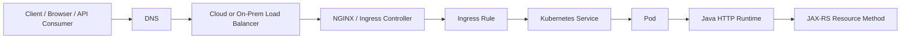

Flow ini bisa berbeda tergantung arsitektur:

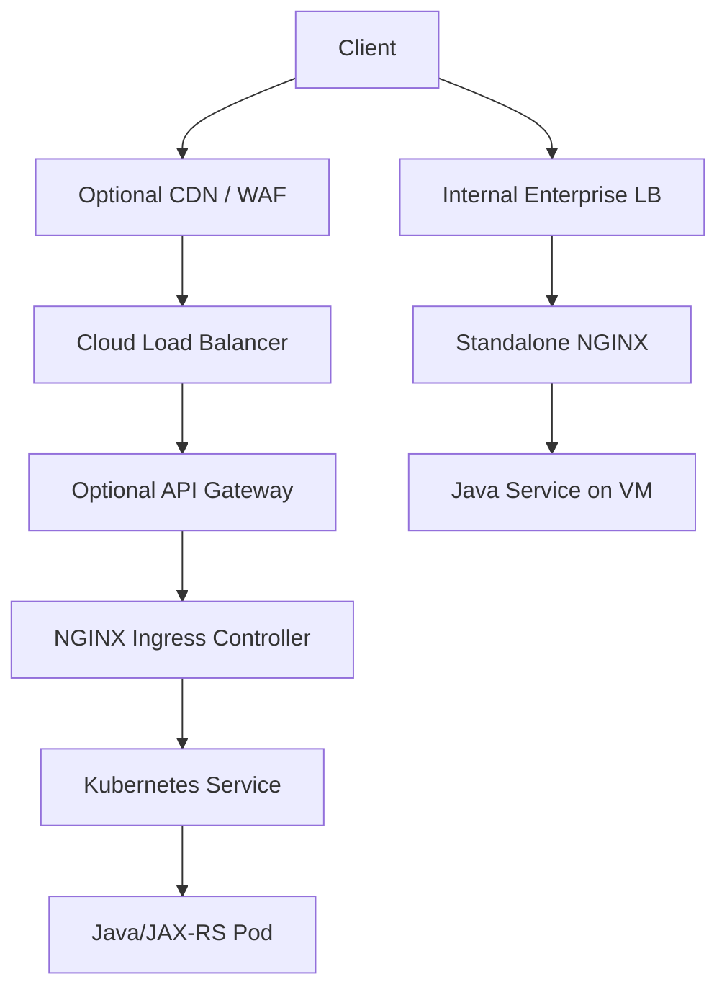

Tidak semua environment memiliki semua layer. Jangan mengarang. Untuk konteks internal CSG/team, traffic path aktual harus diverifikasi dari infra repository, Kubernetes manifest, cloud console, DNS, observability dashboard, dan diskusi dengan platform/SRE/DevOps.

---

## 4. Lifecycle Stage 1 — Client Builds the Request

Sebelum NGINX terlibat, client sudah menentukan:

- URL;
- scheme: `http` atau `https`;
- host;
- port;
- path;
- query string;
- method;
- headers;
- cookies;
- body;
- timeout client-side;
- retry policy client-side;
- TLS trust store;
- proxy settings;
- DNS resolver.

Contoh request:

```http
POST /quote-order/api/v1/quotes HTTP/1.1
Host: quote.example.com
Authorization: Bearer <token>
Content-Type: application/json
Accept: application/json
X-Request-Id: 6a7f3a2c
Content-Length: 2048
```

Hal penting:

- NGINX hanya bisa memproses request yang berhasil mencapai NGINX.
- Error DNS, client TLS trust, corporate proxy, browser CORS, dan client timeout bisa terjadi sebelum NGINX melihat request.
- Client bisa membatalkan request, lalu NGINX mencatatnya sebagai `499` jika NGINX sudah menerima koneksi.

### Failure mode umum

| Symptom | Kemungkinan layer | Penjelasan |
|---|---:|---|
| `DNS_PROBE_FINISHED_NXDOMAIN` | DNS | Host tidak resolve. |
| TLS certificate warning di browser | Client/TLS | Certificate tidak trusted atau host mismatch. |
| Client timeout tapi server tetap memproses | Client/application | Client menyerah sebelum backend selesai. |
| NGINX access log `499` | Client/NGINX | Client menutup koneksi sebelum response selesai. |
| CORS error di browser | Browser/proxy/app | Bisa response sebenarnya 200/4xx, tetapi browser blok karena CORS. |

---

## 5. Lifecycle Stage 2 — DNS Resolution

Client harus mengubah hostname menjadi IP address.

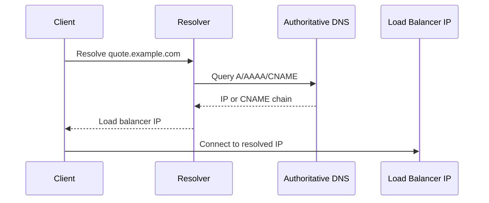

DNS dapat mengarah ke:

- public cloud load balancer;
- internal load balancer;
- CDN/WAF;
- API Gateway;
- on-prem VIP;
- private endpoint;
- split-horizon DNS record.

### DNS concern untuk backend engineer

Backend engineer sering mengabaikan DNS, padahal DNS menentukan entry point aktual.

Yang harus dipahami:

- public DNS dan private DNS bisa berbeda;
- record bisa CNAME berantai;
- TTL bisa menyebabkan perubahan IP tidak langsung efektif;
- internal environment bisa memakai split-horizon DNS;
- pod di Kubernetes memakai CoreDNS untuk resolve internal service;
- NGINX punya behavior DNS sendiri untuk upstream tertentu.

### Debugging command

```bash
dig quote.example.com
nslookup quote.example.com
curl -v https://quote.example.com/health
```

Dari dalam Kubernetes:

```bash
kubectl run dns-debug --rm -it --image=busybox:1.36 -- sh
nslookup quote-service.default.svc.cluster.local
```

---

## 6. Lifecycle Stage 3 — TCP Connection

Setelah DNS resolve, client membuka TCP connection ke IP dan port tujuan.

Untuk HTTPS, biasanya port `443`. Untuk HTTP, biasanya port `80`. Untuk internal service bisa saja `8080`, `8443`, atau port custom.

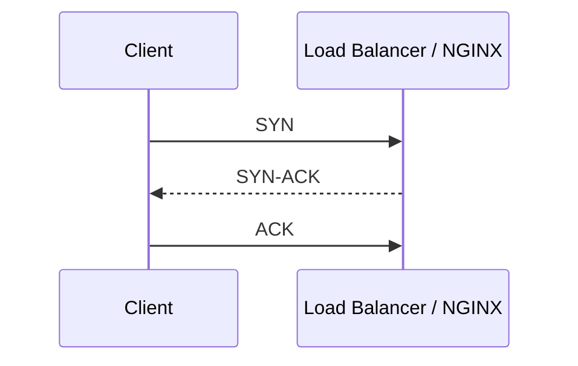

Pada layer ini, request HTTP belum dikirim.

Failure yang mungkin terjadi:

- IP tidak reachable;
- firewall block;
- security group block;
- network ACL block;
- route table salah;
- load balancer listener tidak ada;
- port tidak dibuka;
- connection backlog penuh;
- SYN drop;
- connection refused.

### Debugging command

```bash
nc -vz quote.example.com 443
curl -v --connect-timeout 5 https://quote.example.com/health
```

Jika TCP gagal, jangan langsung debug JAX-RS endpoint. Kode Java belum disentuh.

---

## 7. Lifecycle Stage 4 — TLS Handshake

Jika request memakai HTTPS, TLS handshake terjadi sebelum HTTP request dibaca.

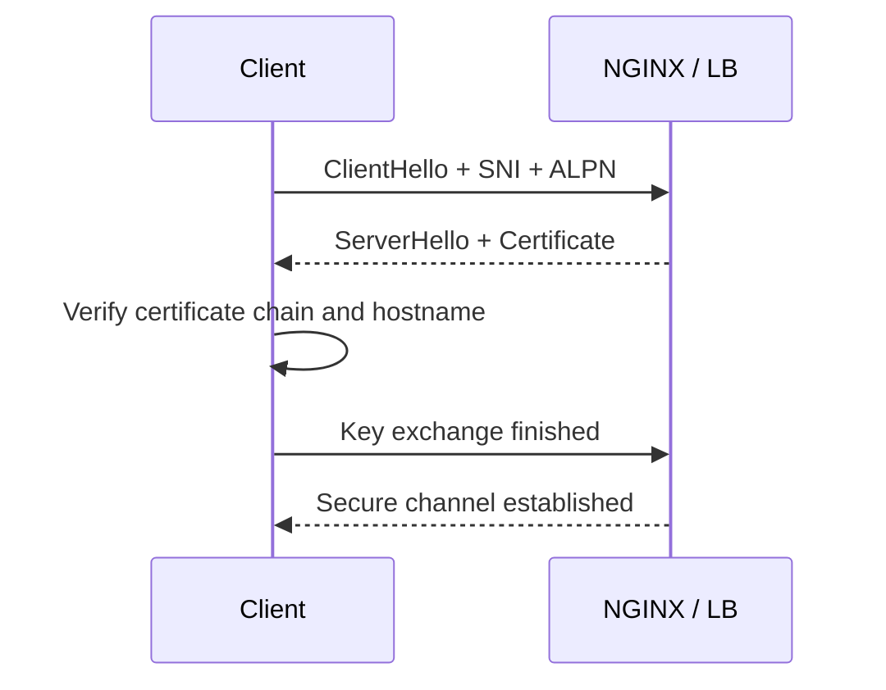

Pada tahap ini, hal penting adalah:

- SNI menentukan certificate mana yang dipilih;
- ALPN menentukan protocol seperti HTTP/1.1 atau HTTP/2;
- certificate harus cocok dengan hostname;
- chain certificate harus lengkap;
- client harus trust CA;
- protocol dan cipher suite harus kompatibel;
- mTLS jika digunakan akan meminta client certificate.

### TLS termination variants

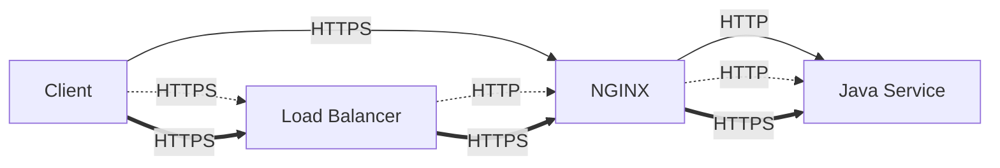

Kemungkinan pattern:

- TLS terminated at cloud load balancer;
- TLS terminated at NGINX;
- TLS passthrough to backend;
- TLS terminated at LB then re-encrypted to NGINX;
- TLS terminated at NGINX then re-encrypted to Java service;
- mTLS at edge;
- mTLS between proxy and upstream.

### Dampak ke Java/JAX-RS

Jika TLS berhenti di NGINX tetapi request ke Java memakai HTTP, aplikasi Java bisa mengira scheme adalah `http`, bukan `https`.

Itu memengaruhi:

- absolute redirect;
- URI generation;
- OpenAPI server URL;
- cookie `Secure` policy;
- security filter;
- audit log;
- callback URL;
- generated link di response.

Karena itu header seperti ini sering penting:

```nginx
proxy_set_header X-Forwarded-Proto $scheme;
proxy_set_header X-Forwarded-Host  $host;
proxy_set_header X-Forwarded-Port  $server_port;
```

Namun aplikasi Java harus dikonfigurasi untuk mempercayai forwarded headers hanya dari trusted proxy.

---

## 8. Lifecycle Stage 5 — HTTP Request Parsing

Setelah TLS selesai, NGINX membaca request HTTP.

NGINX akan memproses:

- request line;
- method;
- URI;
- query string;
- HTTP version;
- Host header;
- request headers;
- body metadata;
- body stream jika perlu.

Contoh request line:

```http
GET /quote-order/api/v1/quotes/123?expand=items HTTP/1.1
```

NGINX bisa menolak request sebelum proxy ke backend jika:

- header terlalu besar;
- URI terlalu panjang;
- body terlalu besar;
- method tidak diizinkan;
- Host tidak cocok;
- request malformed;
- client lambat mengirim header/body;
- rate limit terkena;
- auth di edge gagal.

### Status code yang bisa muncul di tahap ini

| Status | Penyebab umum |
|---:|---|
| 400 | Request malformed, invalid Host, invalid header. |
| 403 | Rule deny, IP allowlist gagal, forbidden path. |
| 408 | Client terlalu lama mengirim header/body. |
| 413 | Request body melebihi limit. |
| 414 | URI terlalu panjang. |
| 429 | Rate limit terkena. |

---

## 9. Lifecycle Stage 6 — Virtual Host Selection

NGINX memilih `server` block berdasarkan:

- listen address;
- port;
- SNI untuk TLS;
- Host header untuk HTTP;
- `server_name`;
- default server.

Simplified model:

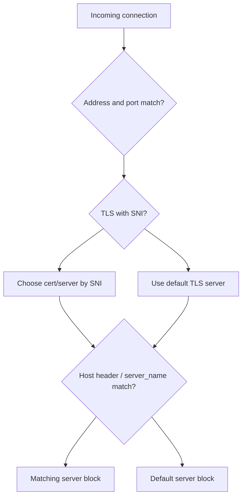

Kegagalan umum:

- DNS benar tetapi Host tidak cocok;
- SNI tidak cocok dengan certificate;
- default server menangkap request;
- Ingress host tidak sesuai;
- wildcard terlalu luas;
- host internal dan public host tercampur;
- Host header spoofing tidak dibatasi.

### Dampak ke Java/JAX-RS

Jika Host header tidak diteruskan atau diganti, aplikasi bisa menghasilkan:

- redirect ke internal hostname;
- absolute URL salah;
- callback URL salah;
- tenant resolution salah jika tenant berbasis host;
- audit data salah.

---

## 10. Lifecycle Stage 7 — Location and Route Matching

Setelah server block dipilih, NGINX memilih `location`.

Contoh:

```nginx
server {
  server_name quote.example.com;

  location /api/ {
    proxy_pass http://quote_service;
  }

  location /health {
    return 200 "ok\n";
  }
}
```

Hal yang bisa terjadi di sini:

- exact location menang;
- prefix location menang;
- regex location menang;
- `^~` mengubah prioritas;
- trailing slash memengaruhi `proxy_pass`;
- `rewrite` mengubah URI;
- request diarahkan ke backend yang berbeda;
- request tidak diproxy sama sekali;
- request dilayani static file;
- request dikembalikan langsung dengan `return`.

### Common routing mistake

```nginx
location /api/ {
  proxy_pass http://backend/;
}
```

Dengan trailing slash pada `proxy_pass`, NGINX bisa mengganti prefix URI. Ini sering menyebabkan backend menerima path berbeda dari yang diasumsikan.

Contoh risiko:

| Public path | Backend expected | Backend actually receives |
|---|---|---|
| `/api/v1/quotes` | `/api/v1/quotes` | `/v1/quotes` atau variasi lain tergantung config |

Detail ini akan dibahas lebih dalam di Part 006.

---

## 11. Lifecycle Stage 8 — Header Processing

NGINX dapat meneruskan, menambah, menghapus, atau mengganti header.

Header penting untuk Java/JAX-RS backend:

```nginx
proxy_set_header Host              $host;
proxy_set_header X-Real-IP         $remote_addr;
proxy_set_header X-Forwarded-For   $proxy_add_x_forwarded_for;
proxy_set_header X-Forwarded-Host  $host;
proxy_set_header X-Forwarded-Proto $scheme;
proxy_set_header X-Request-Id      $request_id;
```

Header concern:

- real client IP;
- original host;
- original scheme;
- original port;
- correlation ID;
- trace context;
- auth identity;
- tenant identity;
- CORS;
- cache semantics;
- content negotiation;
- hop-by-hop headers.

### Header spoofing risk

Jika client bisa mengirim `X-Forwarded-For` dari internet dan NGINX hanya menambahkan tanpa sanitasi, aplikasi bisa membaca IP palsu.

Safer pattern biasanya:

- strip untrusted forwarded headers at edge;
- set forwarded headers from trusted proxy layer;
- configure application to trust only known proxy CIDR;
- avoid using raw header value for security decision without validation.

---

## 12. Lifecycle Stage 9 — Request Body Handling

Untuk request dengan body, NGINX bisa:

- membaca body penuh sebelum proxy;
- menulis body besar ke temporary file;
- streaming body ke upstream;
- menolak body karena terlalu besar;
- timeout jika client terlalu lambat;
- memengaruhi backpressure.

Contoh endpoint terdampak:

- file upload;
- multipart form;
- large JSON payload;
- import job;
- binary API;
- streaming upload.

Directive yang relevan:

```nginx
client_max_body_size 20m;
client_body_timeout 60s;
proxy_request_buffering on;
```

### Dampak ke Java/JAX-RS

Jika NGINX melakukan request buffering, Java service baru menerima body setelah NGINX selesai membaca body dari client. Ini bisa membantu melindungi backend dari slow client, tetapi dapat menambah latency dan disk usage di NGINX.

Jika buffering dimatikan, backend akan ikut merasakan slow client dan harus siap menghadapi backpressure.

---

## 13. Lifecycle Stage 10 — Upstream Selection and Connection

NGINX kemudian memilih upstream.

```nginx
upstream quote_service {
  server quote-service.default.svc.cluster.local:8080;
}

location /api/ {
  proxy_pass http://quote_service;
}
```

NGINX harus:

- resolve upstream name jika hostname digunakan;
- memilih upstream server;
- membuka atau reuse TCP connection;
- melakukan TLS handshake ke upstream jika HTTPS;
- mengirim request;
- menunggu response header;
- membaca response body.

Failure umum:

| Symptom | Kemungkinan penyebab |
|---|---|
| 502 Bad Gateway | Upstream connection refused, reset, protocol mismatch, invalid response. |
| 503 Service Unavailable | No live upstream, service endpoint kosong, overload, maintenance. |
| 504 Gateway Timeout | Upstream tidak merespons dalam batas `proxy_read_timeout`. |
| Intermittent 502 | Pod restart, keepalive stale, backend close connection, readiness flapping. |

---

## 14. Lifecycle Stage 11 — Kubernetes Service to Pod

Jika NGINX berjalan sebagai Ingress Controller di Kubernetes, ia biasanya meneruskan request ke Kubernetes Service atau endpoint pod tergantung controller/configuration.

Simplified flow:

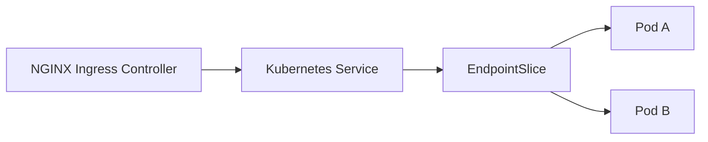

Kubernetes object yang relevan:

- Ingress;
- IngressClass;
- Service;
- EndpointSlice;
- Pod;
- Deployment;
- readiness probe;
- NetworkPolicy;
- Secret;
- ConfigMap;
- admission webhook.

### Kubernetes-specific failure

| Failure | Dampak |
|---|---|
| Service selector salah | Service tidak punya endpoint. |
| Pod not ready | Endpoint tidak masuk routing. |
| Port name/number salah | Connection gagal. |
| NetworkPolicy block | Timeout atau connection refused. |
| IngressClass salah | Ingress tidak diproses controller. |
| TLS Secret salah | TLS failure atau default certificate. |
| Annotation konflik | Routing/timeout/body size tidak sesuai. |

---

## 15. Lifecycle Stage 12 — Java HTTP Runtime and JAX-RS Routing

Setelah request sampai ke pod, request masuk ke Java runtime.

Layer internal bisa berupa:

- container HTTP server;
- servlet container;
- Netty/Undertow/Jetty/Tomcat tergantung framework;
- Jakarta REST/JAX-RS runtime;
- filters;
- interceptors;
- authentication middleware;
- authorization layer;
- resource method;
- service layer;
- repository/database/downstream calls.

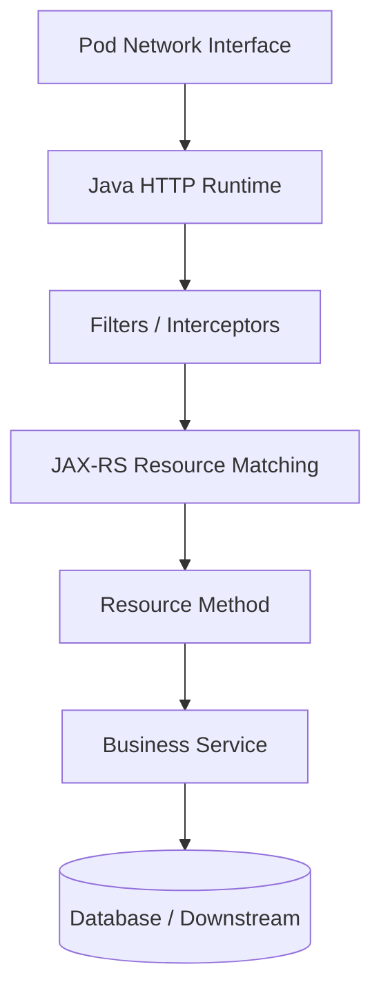

Pada tahap ini, proxy behavior sebelumnya sangat memengaruhi aplikasi:

- URI yang diterima mungkin sudah di-rewrite;
- scheme mungkin menjadi `http`;
- Host mungkin internal;
- client IP mungkin IP proxy;
- body mungkin sudah dibuffer;
- request ID mungkin sudah ada;
- auth identity mungkin datang via header;
- timeout upstream mungkin lebih pendek dari proses bisnis;
- retry proxy bisa mengulang request non-idempotent jika salah konfigurasi.

---

## 16. Lifecycle Stage 13 — Response Path

Response kembali melewati chain yang sama secara terbalik.

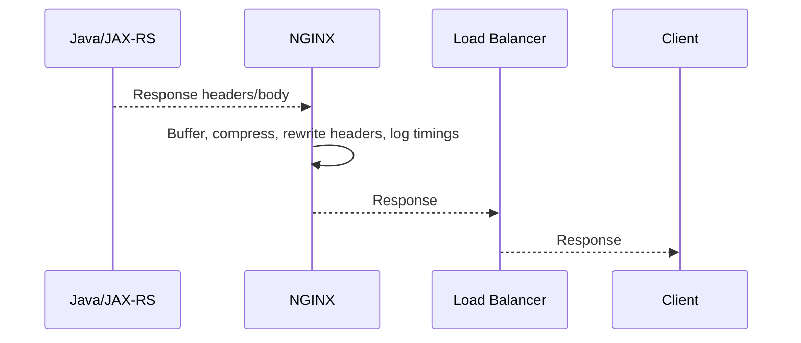

NGINX dapat:

- buffer response;
- stream response;
- compress response;
- cache response;
- rewrite headers;
- hide headers;
- add security headers;
- intercept errors;
- close connection;
- log request;
- return its own error page.

### Response concern

| Concern | Impact |
|---|---|
| Response buffering | SSE/streaming bisa tertahan. |
| Compression | CPU naik, bandwidth turun. |
| Header rewriting | Redirect/cookie/cache behavior berubah. |
| Error interception | Client tidak melihat error asli aplikasi. |
| Cache | Response lama bisa tersaji jika key/policy salah. |

---

## 17. End-to-End Latency Breakdown

Latency bukan satu angka.

Latency adalah agregasi banyak segmen:

```text
total latency =
  DNS time
+ TCP connect time
+ TLS handshake time
+ load balancer queue/routing time
+ NGINX request processing time
+ upstream connect time
+ upstream wait time
+ Java processing time
+ downstream dependency time
+ response transfer time
+ client receive time
```

Di NGINX logs, beberapa variable penting:

```nginx
$request_time
$upstream_connect_time
$upstream_header_time
$upstream_response_time
$upstream_addr
$status
$upstream_status
$request_length
$body_bytes_sent
```

Interpretasi umum:

| Pattern | Kemungkinan arti |
|---|---|
| High `$request_time`, low `$upstream_response_time` | Slow client, response transfer lambat, buffering, network. |
| High `$upstream_connect_time` | Upstream connection issue, network, pod/service problem. |
| High `$upstream_header_time` | Backend lama menghasilkan response header. |
| High `$upstream_response_time` | Backend lambat atau response body besar/streaming. |
| Status 499 dengan high request time | Client batal menunggu. |
| Status 504 | Proxy timeout sebelum upstream selesai. |

---

## 18. Failure Modeling by Lifecycle Stage

| Stage | Example failure | Typical evidence |
|---|---|---|
| Client | Client timeout, CORS, bad URL | Browser devtools, client logs |
| DNS | NXDOMAIN, stale record | `dig`, `nslookup` |
| TCP | Connection refused, network block | `nc`, `curl -v`, firewall logs |
| TLS | Certificate mismatch, unknown CA | `openssl s_client`, browser TLS error |
| LB | Target unhealthy, listener wrong | Cloud LB metrics/events |
| NGINX parsing | 400, 413, 414, 429 | NGINX access/error log |
| Server selection | Wrong virtual host | Host/SNI logs, default server logs |
| Location routing | Wrong backend, 404 | NGINX route config, access log |
| Header processing | Wrong scheme/client IP | App logs, forwarded headers |
| Body handling | Upload fail, temp disk full | NGINX error log, disk metrics |
| Upstream connect | 502 | NGINX error log, pod readiness |
| Upstream wait | 504 | NGINX timing logs, app latency |
| Kubernetes Service | No endpoint | `kubectl get endpointslice` |
| Java runtime | 500, business error | App logs/traces |
| Response path | Streaming stuck, cache issue | Access log, client timing |

---

## 19. Debugging Method: Follow the Request

Jangan debug secara acak. Ikuti request.

### Step 1 — Confirm DNS and entry point

```bash
dig quote.example.com
curl -v https://quote.example.com/health
```

Pertanyaan:

- Host resolve ke mana?
- Public atau private IP?
- Mengarah ke cloud LB, API gateway, atau on-prem VIP?

### Step 2 — Confirm TLS

```bash
openssl s_client -connect quote.example.com:443 -servername quote.example.com
```

Pertanyaan:

- Certificate cocok dengan hostname?
- Chain lengkap?
- TLS terminated di mana?
- HTTP/2 dinegosiasikan atau HTTP/1.1?

### Step 3 — Confirm NGINX sees the request

Cek access log:

```text
remote_addr="..." host="quote.example.com" request="GET /health HTTP/1.1" status=200 request_time=0.003 upstream_response_time=0.002
```

Pertanyaan:

- Request masuk NGINX?
- Host/path benar?
- Status dari NGINX atau upstream?
- Upstream address terlihat?

### Step 4 — Confirm Kubernetes routing

```bash
kubectl get ingress -A
kubectl describe ingress <name> -n <namespace>
kubectl get svc -n <namespace>
kubectl get endpointslice -n <namespace>
kubectl get pod -n <namespace> -o wide
```

Pertanyaan:

- IngressClass benar?
- Host/path rule benar?
- Service port benar?
- Endpoint ada?
- Pod ready?

### Step 5 — Confirm Java service receives expected request

Cek application logs/traces:

- request ID;
- path;
- method;
- scheme;
- host;
- client IP;
- auth identity;
- latency;
- response status.

Pertanyaan:

- Request benar-benar masuk aplikasi?
- Header yang dibutuhkan ada?
- Path sudah berubah?
- Scheme/host sesuai public URL?

---

## 20. Practical Example: Debugging 504

Symptom:

```text
Client receives 504 Gateway Timeout after 60 seconds.
```

Kemungkinan chain:

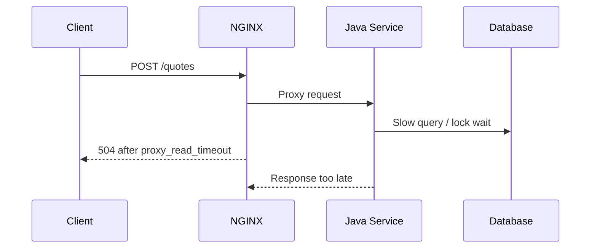

Yang harus dicek:

- `proxy_read_timeout` di NGINX/Ingress annotation;
- application processing time;
- downstream dependency latency;
- database lock/query;
- client timeout;
- retry behavior;
- idempotency request;
- apakah Java tetap memproses setelah NGINX return 504;
- apakah client retry menyebabkan duplicate operation.

Kesimpulan penting:

> 504 bukan selalu berarti NGINX rusak. 504 berarti NGINX tidak menerima response tepat waktu dari upstream menurut timeout yang berlaku.

---

## 21. Practical Example: Debugging 502

Symptom:

```text
Client receives 502 Bad Gateway immediately.
```

Kemungkinan:

- backend port salah;
- Service tidak punya endpoint;
- pod restart;
- upstream close connection;
- HTTP/HTTPS mismatch;
- gRPC/HTTP mismatch;
- upstream TLS handshake gagal;
- NGINX keepalive connection stale;
- app crash sebelum response valid.

Cek NGINX error log:

```text
connect() failed (111: Connection refused) while connecting to upstream
upstream prematurely closed connection while reading response header from upstream
no live upstreams while connecting to upstream
```

Cek Kubernetes:

```bash
kubectl get pods -n quote-order
kubectl describe pod <pod> -n quote-order
kubectl logs <pod> -n quote-order
kubectl get endpointslice -n quote-order
```

Kesimpulan penting:

> 502 sering berarti NGINX berhasil menerima request client, tetapi gagal berbicara secara valid dengan upstream.

---

## 22. Practical Example: Debugging Wrong Client IP

Symptom:

```text
Application audit log shows all users coming from the same IP.
```

Kemungkinan:

- app mencatat IP proxy, bukan forwarded header;
- `X-Forwarded-For` tidak diset;
- cloud LB tidak preserve source IP;
- proxy protocol tidak aktif;
- Java framework tidak dikonfigurasi untuk trusted proxy;
- multiple proxy chain tidak dipahami.

Flow:

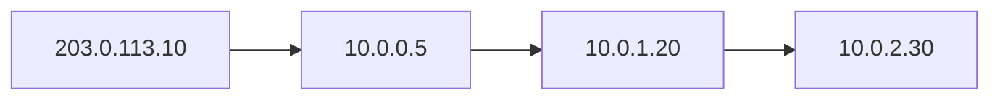

Application bisa saja melihat `10.0.1.20` jika tidak membaca forwarded headers.

Checklist:

- cek access log NGINX `$remote_addr` dan `$http_x_forwarded_for`;
- cek `proxy_set_header X-Forwarded-For $proxy_add_x_forwarded_for`;
- cek cloud LB source IP behavior;
- cek application trusted proxy setting;
- cek apakah forwarded header dari client disanitasi.

---

## 23. What NGINX Can Change Without You Realizing

NGINX bisa memengaruhi kontrak API tanpa perubahan kode Java:

| Area | Impact |
|---|---|
| Path | Prefix hilang, rewrite salah, trailing slash berubah. |
| Host | Backend melihat host internal. |
| Scheme | Backend melihat HTTP walaupun client HTTPS. |
| Client IP | Audit/security melihat IP proxy. |
| Body | Body dibuffer, ditolak, atau ditulis ke disk. |
| Response | Streaming tertahan oleh buffering. |
| Timeout | Request dipotong sebelum aplikasi selesai. |
| Retry | Request bisa dikirim ulang ke upstream lain. |
| Headers | Auth/correlation/cache/CORS bisa berubah. |
| Status | Error backend bisa diintercept atau diganti. |
| Latency | Proxy queueing, buffering, TLS, upstream wait. |

---

## 24. Internal Verification Checklist

Gunakan checklist ini untuk memetakan traffic flow aktual di internal team.

### DNS and entry point

- Hostname public/internal apa yang digunakan client?
- DNS dikelola di mana?
- Apakah ada split-horizon DNS?
- Record mengarah ke cloud LB, CDN, API gateway, atau on-prem VIP?

### Load balancer

- Apakah ada AWS ALB/NLB, Azure Load Balancer, Application Gateway, Front Door, atau on-prem LB?
- Layer tersebut L4 atau L7?
- Apakah TLS termination terjadi di sana?
- Apakah source IP dipreserve?
- Apakah proxy protocol digunakan?

### NGINX / Ingress

- Apakah memakai standalone NGINX, NGINX container, ingress-nginx, NGINX Inc controller, atau NGINX Plus?
- Namespace controller di Kubernetes apa?
- IngressClass apa?
- ConfigMap global apa?
- Annotation apa yang relevan?
- Access log dan error log tersedia di mana?

### Kubernetes routing

- Ingress host/path rule apa?
- Service apa yang menjadi backend?
- Service port dan targetPort apa?
- EndpointSlice berisi pod apa?
- Readiness probe memengaruhi endpoint?
- NetworkPolicy memblokir traffic?

### Java/JAX-RS backend

- Runtime/framework apa yang menerima HTTP request?
- Apakah forwarded headers dipercaya?
- Bagaimana request ID/correlation ID dipropagasi?
- Apakah aplikasi membaca real client IP?
- Apakah base path publik sama dengan context path internal?
- Apakah ada redirect absolute URL?

### Observability

- Access log punya `$request_time`?
- Access log punya `$upstream_response_time`?
- Error log bisa diakses saat incident?
- Dashboard memisahkan 4xx, 499, 502, 503, 504?
- Trace dari edge ke app tersambung?
- Ada runbook untuk 502/503/504?

---

## 25. Senior Engineer Review Questions

Saat mereview perubahan traffic flow, tanyakan:

1. Layer mana yang menerima request pertama kali?
2. Layer mana yang melakukan TLS termination?
3. Layer mana yang memilih route berdasarkan host?
4. Layer mana yang memilih route berdasarkan path?
5. Apakah path public sama dengan path backend?
6. Apakah Host header dipertahankan?
7. Apakah scheme asli dipropagasi?
8. Apakah client IP asli tersedia dan trusted?
9. Apakah timeout chain eksplisit?
10. Apakah retry aman untuk method non-idempotent?
11. Apakah body size limit cocok dengan API contract?
12. Apakah streaming endpoint terkena buffering?
13. Apakah observability cukup untuk membedakan NGINX error vs app error?
14. Apakah rollback routing change jelas?
15. Apakah ada security regression pada auth, header, path, atau TLS?

---

## 26. Exercises

1. Gambar traffic path dari browser/API consumer ke salah satu Java/JAX-RS endpoint di environment kamu.
2. Tandai setiap layer yang melakukan TLS termination.
3. Tandai setiap layer yang bisa menghasilkan 502, 503, atau 504.
4. Ambil satu access log NGINX dan identifikasi host, URI, status, request time, upstream address, dan upstream response time.
5. Ambil satu request aplikasi dan cocokkan request ID-nya dengan log NGINX.
6. Jalankan `curl -v` ke endpoint health dan amati DNS, TLS, HTTP version, response header, dan status.
7. Cek apakah aplikasi melihat client IP asli atau IP proxy.
8. Cek apakah redirect dari aplikasi menghasilkan URL public yang benar.
9. Simulasikan endpoint lambat di non-production dan lihat timeout mana yang menang.
10. Dokumentasikan traffic path aktual sebagai internal note.

---

## 27. Key Takeaways

- Request lifecycle enterprise tidak dimulai di Java method. Ia dimulai dari client dan melewati DNS, TCP, TLS, load balancer, NGINX, Kubernetes, lalu aplikasi.
- Setiap layer dapat mengubah, menolak, menunda, atau menggagalkan request.
- NGINX bisa menghasilkan error sendiri atau meneruskan error dari upstream.
- `502`, `503`, dan `504` harus dibaca sebagai sinyal hubungan NGINX dengan upstream, bukan otomatis sebagai bug aplikasi.
- Header forwarding menentukan apakah aplikasi memahami host, scheme, client IP, dan correlation ID dengan benar.
- Body buffering, response buffering, timeout, retry, dan route rewrite bisa mengubah behavior API tanpa perubahan kode Java.
- Debugging yang benar adalah mengikuti request dari entry point sampai aplikasi dengan evidence di setiap hop.

---

## 28. Prerequisite untuk Part Berikutnya

Sebelum masuk ke Part 004, pastikan kamu bisa:

- menggambar request lifecycle dari client ke JAX-RS endpoint;
- membedakan DNS, TCP, TLS, HTTP, NGINX, Kubernetes Service, dan Java runtime;
- menjelaskan di mana 502, 503, 504, 413, 429, dan 499 bisa muncul;
- membaca basic NGINX access log;
- menjelaskan kenapa forwarded headers penting untuk backend Java;
- memahami bahwa traffic flow aktual harus diverifikasi dari internal infrastructure, bukan diasumsikan.

Part berikutnya akan membahas **NGINX configuration model**: `nginx.conf`, context hierarchy, directive inheritance, include files, variables, `map`, `if` pitfalls, validation, reload, dan safe config rollout.
