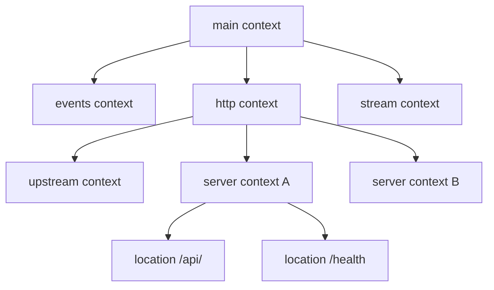
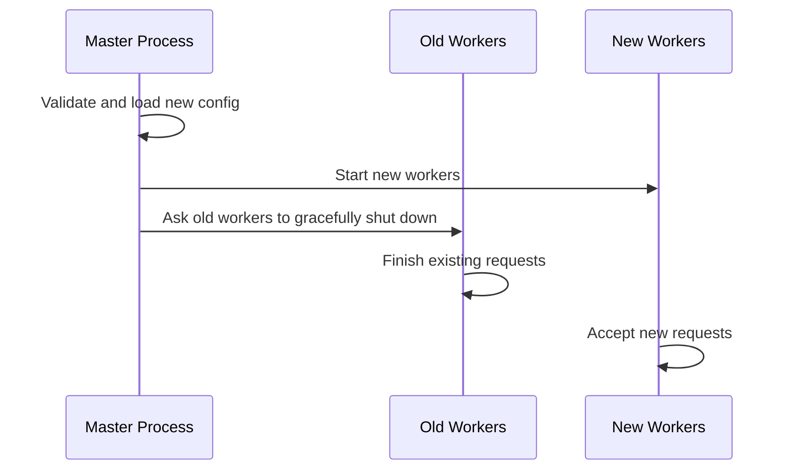
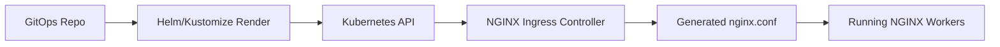
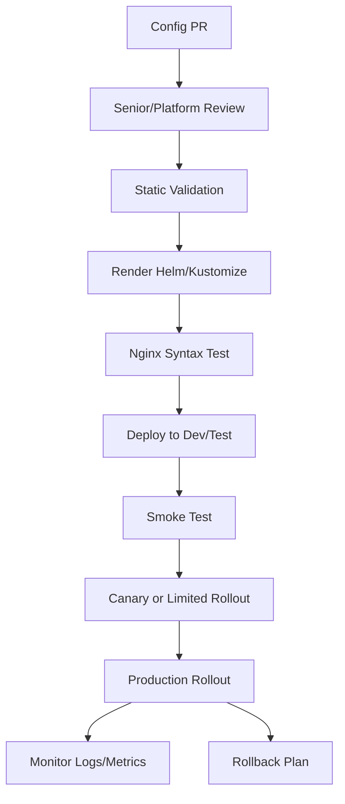

# Part 004 — NGINX Configuration Model: Context, Directive, Include, and Inheritance

## 1. Tujuan Part Ini

Part ini membahas cara membaca dan berpikir tentang konfigurasi NGINX.

Banyak engineer bisa menyalin konfigurasi seperti ini:

```nginx
location /api/ {
  proxy_pass http://backend;
}
```

Tetapi di production, masalah sering muncul bukan karena satu directive salah, melainkan karena engineer tidak memahami:

- context tempat directive didefinisikan;
- inheritance antar context;
- precedence antar directive;
- include file yang tersembunyi;
- generated configuration dari Helm/Ingress Controller;
- perbedaan reload dan restart;
- validasi konfigurasi;
- cara rollout config secara aman.

Target part ini adalah membuat kamu mampu membaca konfigurasi NGINX sebagai **runtime decision tree**, bukan sekadar file teks.

---

## 2. Core Mental Model

Konfigurasi NGINX adalah tree.

Directive berada di dalam context. Context menentukan scope. Scope menentukan kapan directive berlaku.



Cara berpikir yang benar:

> Untuk memahami behavior NGINX, jangan hanya membaca directive yang dekat dengan `location`. Baca seluruh chain: main → events/http/stream → server → location → upstream → include files → generated config.

---

## 3. Minimal Shape of `nginx.conf`

Contoh sederhana:

```nginx
worker_processes auto;

events {
  worker_connections 1024;
}

http {
  include       mime.types;
  default_type  application/octet-stream;

  log_format main '$remote_addr - $request $status $request_time';
  access_log /var/log/nginx/access.log main;

  upstream quote_service {
    server quote-service:8080;
  }

  server {
    listen 80;
    server_name quote.example.com;

    location /api/ {
      proxy_pass http://quote_service;
    }
  }
}
```

Struktur ini punya beberapa scope:

| Context | Peran utama |
|---|---|
| main | Process-level settings. |
| events | Event loop dan connection handling. |
| http | HTTP-wide behavior. |
| upstream | Backend pool. |
| server | Virtual host/listener. |
| location | Route/path-specific behavior. |

---

## 4. Main Context

Main context adalah top-level config.

Contoh directive:

```nginx
user nginx;
worker_processes auto;
worker_rlimit_nofile 65535;
pid /var/run/nginx.pid;
error_log /var/log/nginx/error.log warn;
```

Main context memengaruhi proses NGINX secara keseluruhan:

- user OS yang menjalankan worker;
- jumlah worker process;
- file descriptor limit;
- lokasi PID file;
- global error log;
- module loading;
- process lifecycle.

### Production concern

Kesalahan di main context bisa berdampak luas:

- worker terlalu sedikit → CPU tidak optimal;
- file descriptor limit rendah → connection gagal;
- user root tanpa kebutuhan → security risk;
- error log tidak diarahkan ke stdout/stderr di container → observability buruk;
- module tidak tersedia → directive gagal saat startup.

### Container/Kubernetes concern

Di container, beberapa directive harus dibaca dengan konteks runtime:

- `user nginx;` bergantung pada image dan securityContext;
- `worker_processes auto;` membaca CPU yang tersedia;
- `error_log /dev/stderr` sering lebih cocok untuk container;
- PID file harus bisa ditulis jika filesystem read-only.

---

## 5. Events Context

`events` mengatur event loop dan connection handling.

Contoh:

```nginx
events {
  worker_connections 4096;
  multi_accept on;
}
```

Directive yang sering relevan:

- `worker_connections`;
- event method seperti `epoll`, `kqueue`, atau auto-detect;
- `multi_accept`;
- accept mutex behavior tergantung versi/platform.

Mental model:

```text
max theoretical connections ≈ worker_processes × worker_connections
```

Namun angka real dipengaruhi oleh:

- file descriptor limit;
- upstream connection;
- keepalive;
- TLS cost;
- memory;
- OS tuning;
- container resource limit;
- long-lived connections seperti WebSocket/SSE.

### Production concern

Jika `worker_connections` terlalu rendah:

- NGINX mulai menolak koneksi;
- latency naik;
- 502/503 bisa muncul secara tidak langsung;
- long-lived connection menghabiskan slot;
- load balancer menganggap target unhealthy.

---

## 6. HTTP Context

`http` adalah context utama untuk traffic HTTP/HTTPS.

Contoh:

```nginx
http {
  include       mime.types;
  default_type  application/octet-stream;

  sendfile on;
  tcp_nopush on;
  keepalive_timeout 65;

  log_format json_combined escape=json '{ "time": "$time_iso8601", "status": $status }';
  access_log /var/log/nginx/access.log json_combined;

  client_max_body_size 10m;

  include /etc/nginx/conf.d/*.conf;
}
```

Directive di `http` berlaku sebagai default untuk server/location di bawahnya jika directive tersebut mendukung inheritance.

Common concern di `http`:

- log format;
- access log default;
- MIME type;
- gzip/compression;
- keepalive;
- client body size;
- proxy default;
- map variables;
- upstream definitions;
- include server configs.

### Java/JAX-RS impact

Directive global di `http` bisa diam-diam memengaruhi semua API:

- `client_max_body_size` membatasi upload semua endpoint;
- `proxy_read_timeout` global bisa memotong long-running operation;
- `proxy_buffering on` bisa menahan streaming response;
- `gzip on` bisa mengubah response transfer behavior;
- `log_format` menentukan observability semua service.

---

## 7. Server Context

`server` mewakili virtual host/listener.

Contoh:

```nginx
server {
  listen 443 ssl http2;
  server_name quote.example.com;

  ssl_certificate     /etc/nginx/tls/tls.crt;
  ssl_certificate_key /etc/nginx/tls/tls.key;

  location /api/ {
    proxy_pass http://quote_service;
  }
}
```

Server context menentukan:

- port listener;
- address binding;
- server name;
- TLS certificate;
- HTTP/2 enablement;
- default routing untuk host;
- security headers per-host;
- access log per-host;
- location blocks.

### Production concern

Kesalahan server context bisa menghasilkan:

- request masuk default server;
- certificate salah;
- Host header tidak cocok;
- HTTP/2 tidak aktif;
- redirect loop HTTP→HTTPS;
- public host mengarah ke internal backend;
- admin endpoint terekspos.

---

## 8. Location Context

`location` menentukan behavior berdasarkan URI/path setelah server dipilih.

Contoh:

```nginx
location /api/ {
  proxy_set_header Host $host;
  proxy_set_header X-Forwarded-Proto $scheme;
  proxy_pass http://quote_service;
}

location = /health {
  return 200 "ok\n";
}
```

Location context biasanya tempat engineer paling sering mengubah config.

Tetapi location bukan isolated block. Ia mewarisi banyak setting dari `http` dan `server`.

### Common location behavior

- proxy request ke backend;
- return response langsung;
- serve static file;
- rewrite URI;
- set header;
- change timeout;
- change buffering;
- change body size limit;
- apply auth;
- apply rate limit.

### Production concern

Kesalahan location context bisa menyebabkan:

- wrong backend;
- 404;
- redirect loop;
- URI prefix hilang;
- API path berubah;
- CORS preflight gagal;
- streaming tertahan;
- upload ditolak;
- auth bypass jika location lebih spesifik tidak punya auth.

---

## 9. Upstream Context

`upstream` mendefinisikan backend pool.

Contoh:

```nginx
upstream quote_service {
  least_conn;
  server quote-service-1:8080 max_fails=3 fail_timeout=30s;
  server quote-service-2:8080 max_fails=3 fail_timeout=30s;
  keepalive 64;
}
```

Upstream context mengatur:

- daftar backend;
- load balancing method;
- weight;
- failover behavior;
- passive health behavior;
- keepalive connection pool;
- backup server;
- DNS-based server name behavior.

### Kubernetes concern

Di Kubernetes, upstream bisa berupa:

```nginx
server quote-service.namespace.svc.cluster.local:8080;
```

atau generated endpoint list dari Ingress Controller.

Jangan asumsikan. Verifikasi generated NGINX config dari controller jika perlu.

### Java/JAX-RS impact

Upstream behavior memengaruhi:

- distribusi load antar pod;
- connection reuse;
- latency;
- retry/failover;
- sticky session;
- observability per upstream;
- failure isolation.

---

## 10. Stream Context

`stream` digunakan untuk TCP/UDP proxying, bukan HTTP-level routing.

Contoh:

```nginx
stream {
  upstream postgres_backend {
    server postgres.internal:5432;
  }

  server {
    listen 5432;
    proxy_pass postgres_backend;
  }
}
```

`stream` relevan untuk:

- TCP proxy;
- TLS passthrough;
- database proxying;
- raw protocol routing;
- L4 load balancing.

Tetapi `stream` tidak memahami HTTP path, method, header, cookie, atau CORS.

### When relevant to this series

Untuk Java/JAX-RS API, kebanyakan concern ada di `http`. Namun `stream` penting jika:

- TLS passthrough digunakan;
- protocol non-HTTP diproxy;
- NGINX dipakai sebagai L4 edge;
- mTLS atau SNI routing dilakukan tanpa HTTP termination.

---

## 11. Mail Context

NGINX juga punya `mail` context untuk mail proxying.

Dalam konteks enterprise Java/JAX-RS, ini biasanya tidak relevan.

Yang perlu diingat:

- jangan mencampur mental model `mail`, `stream`, dan `http`;
- HTTP directive tidak berlaku di `stream` atau `mail`;
- error seperti “directive is not allowed here” sering muncul karena directive diletakkan di context yang salah.

---

## 12. Include Files

NGINX config sering tidak berada di satu file.

Contoh:

```nginx
http {
  include /etc/nginx/mime.types;
  include /etc/nginx/conf.d/*.conf;
  include /etc/nginx/sites-enabled/*;
}
```

Di container/Kubernetes, config bisa berasal dari:

- base image default config;
- mounted ConfigMap;
- mounted Secret;
- Helm template;
- Kustomize overlay;
- generated Ingress Controller config;
- environment substitution script;
- init container;
- sidecar config generator;
- GitOps repo.

### Production risk

Include membuat config terlihat rapi, tetapi bisa menyembunyikan behavior.

Risiko:

- duplicate server block;
- default config dari image masih aktif;
- environment-specific override tidak terlihat;
- include order memengaruhi behavior;
- stale ConfigMap masih mounted;
- Helm value menghasilkan directive yang tidak disadari;
- snippet annotation menyisipkan config tak terlihat di source app repo.

### Practical command

Untuk standalone/container NGINX:

```bash
nginx -T
```

`nginx -T` menampilkan konfigurasi akhir setelah include diproses. Ini sangat berguna saat debugging.

---

## 13. Directive Anatomy

Directive NGINX biasanya berbentuk:

```nginx
directive_name parameter1 parameter2;
```

atau block directive:

```nginx
context_name parameter {
  directive_name value;
}
```

Contoh simple directive:

```nginx
client_max_body_size 20m;
```

Contoh block directive:

```nginx
location /api/ {
  proxy_pass http://backend;
}
```

Hal penting:

- directive harus berada di context yang valid;
- beberapa directive bisa muncul berkali-kali;
- beberapa directive hanya boleh muncul sekali;
- beberapa directive mewarisi nilai dari parent;
- beberapa directive mengganti total konfigurasi parent;
- beberapa directive tidak boleh menggunakan variable;
- beberapa directive behavior-nya berubah tergantung trailing slash atau parameter.

---

## 14. Directive Context Validity

Tidak semua directive boleh diletakkan di semua context.

Contoh:

```nginx
worker_processes auto;     # main context
worker_connections 1024;   # events context
proxy_pass http://backend; # location context
server_name example.com;   # server context
```

Jika salah context, NGINX akan gagal validasi:

```text
"proxy_pass" directive is not allowed here
```

### Mental model

Saat melihat directive, tanyakan:

1. Directive ini berada di context apa?
2. Apakah directive ini valid di context itu?
3. Apakah directive ini inherited dari parent?
4. Apakah directive ini override parent?
5. Apakah ada directive yang lebih spesifik di child context?

---

## 15. Directive Inheritance

Inheritance adalah sumber bug yang sering halus.

Contoh:

```nginx
http {
  client_max_body_size 10m;

  server {
    server_name quote.example.com;

    location /api/upload/ {
      proxy_pass http://upload_service;
    }
  }
}
```

Walaupun `location /api/upload/` tidak menyebut `client_max_body_size`, limit `10m` tetap bisa berlaku karena diwarisi dari `http`.

Jika upload endpoint butuh 100MB:

```nginx
location /api/upload/ {
  client_max_body_size 100m;
  proxy_pass http://upload_service;
}
```

### Important nuance

Inheritance NGINX tidak selalu seperti object-oriented inheritance. Beberapa directive:

- inherited jika tidak didefinisikan di child;
- replace parent value ketika didefinisikan di child;
- merge dengan parent;
- tidak inherited sama sekali;
- punya rule khusus.

Karena itu, jangan menggeneralisasi. Untuk directive kritikal, verifikasi dokumentasi dan konfigurasi efektif.

---

## 16. Precedence: More Specific Usually Wins, But Not Always Simple

Contoh:

```nginx
http {
  proxy_read_timeout 60s;

  server {
    proxy_read_timeout 30s;

    location /api/slow/ {
      proxy_read_timeout 180s;
      proxy_pass http://slow_service;
    }
  }
}
```

Untuk `/api/slow/`, timeout efektif adalah `180s`.

Untuk location lain di server tersebut, timeout efektif bisa `30s`.

Untuk server lain tanpa override, timeout efektif bisa `60s`.

### Why this matters

Saat incident 504, engineer sering melihat global timeout dan menyimpulkan salah.

Padahal timeout efektif mungkin di-override oleh:

- server block;
- location block;
- ingress annotation;
- ConfigMap global;
- Helm values;
- controller default;
- snippet.

---

## 17. Variables

NGINX memiliki variables seperti:

```nginx
$host
$remote_addr
$request_uri
$uri
$args
$scheme
$server_port
$request_id
$http_x_forwarded_for
$upstream_addr
$upstream_status
$request_time
$upstream_response_time
```

Variables sering dipakai untuk:

- logging;
- proxy headers;
- dynamic routing;
- cache key;
- rate limit key;
- conditional logic;
- map output;
- observability.

Contoh:

```nginx
proxy_set_header X-Forwarded-For $proxy_add_x_forwarded_for;
proxy_set_header X-Forwarded-Proto $scheme;
proxy_set_header X-Request-Id $request_id;
```

### Variable risk

- Variable tertentu berisi input client dan tidak boleh dipercaya mentah-mentah.
- `$host` dan `$http_host` berbeda behavior.
- `$uri` dan `$request_uri` berbeda.
- Variable bisa kosong jika header tidak ada.
- Dynamic `proxy_pass` dengan variable punya DNS/resolver implications.

### `$uri` vs `$request_uri`

| Variable | Makna umum |
|---|---|
| `$request_uri` | URI asli dari request, termasuk query string. |
| `$uri` | Normalized URI yang dapat berubah karena internal processing/rewrite. |

Untuk debugging routing, perbedaan ini penting.

---

## 18. `map` Directive

`map` digunakan untuk membuat variable baru berdasarkan variable lain.

Contoh umum untuk WebSocket:

```nginx
map $http_upgrade $connection_upgrade {
  default upgrade;
  ''      close;
}

server {
  location /ws/ {
    proxy_set_header Upgrade $http_upgrade;
    proxy_set_header Connection $connection_upgrade;
    proxy_pass http://websocket_backend;
  }
}
```

Contoh untuk environment-aware behavior:

```nginx
map $http_x_request_id $effective_request_id {
  default $http_x_request_id;
  ''      $request_id;
}
```

`map` biasanya diletakkan di `http` context.

### Why `map` is safer than many `if` usages

`map` membuat declarative mapping tanpa procedural control flow di `location`. Ini sering lebih predictable dan mudah direview.

### Production concern

- Map key bisa berasal dari untrusted header.
- High-cardinality map yang salah bisa membingungkan observability.
- Map yang terlalu kompleks menjadi policy engine tersembunyi.
- Map output bisa memengaruhi routing, auth, cache, atau rate limit.

---

## 19. `if` Pitfalls

NGINX memiliki `if`, tetapi penggunaannya sering disalahpahami.

Contoh yang relatif aman:

```nginx
if ($request_method = POST) {
  return 405;
}
```

Namun `if` di dalam `location` bisa menghasilkan behavior yang sulit diprediksi jika dipakai untuk rewrite/proxy logic kompleks.

Bad smell:

```nginx
location /api/ {
  if ($http_x_tenant = "a") {
    proxy_pass http://tenant_a_backend;
  }

  if ($http_x_tenant = "b") {
    proxy_pass http://tenant_b_backend;
  }
}
```

Lebih baik pertimbangkan:

- `map` untuk menghasilkan variable;
- explicit location/server split;
- API Gateway/policy layer;
- application-level routing;
- service mesh/gateway route jika routing kompleks.

### Senior rule

> Jika `if` mulai menjadi policy engine, configuration design sudah memburuk.

---

## 20. `return`, `rewrite`, and `try_files`

Directive ini sering muncul di routing.

### `return`

Untuk langsung mengembalikan response:

```nginx
location = /health {
  return 200 "ok\n";
}
```

Bagus untuk:

- health endpoint sederhana;
- redirect sederhana;
- deny path;
- fixed response.

### `rewrite`

Untuk mengubah URI:

```nginx
rewrite ^/old-api/(.*)$ /api/$1 break;
```

Risiko:

- path backend berbeda dari path public;
- redirect loop;
- query string behavior tidak sesuai;
- observability membingungkan jika original URI tidak dicatat.

### `try_files`

Sering untuk static file atau SPA fallback:

```nginx
location / {
  try_files $uri $uri/ /index.html;
}
```

Risiko untuk API:

- API 404 malah dikembalikan sebagai `index.html`;
- frontend fallback mengambil route backend;
- debugging menjadi membingungkan karena status 200 berisi HTML.

---

## 21. `proxy_pass` Mental Model

`proxy_pass` adalah directive penting untuk reverse proxy.

Contoh:

```nginx
location /api/ {
  proxy_pass http://backend;
}
```

Tetapi behavior `proxy_pass` sangat dipengaruhi oleh:

- apakah URI disertakan di `proxy_pass`;
- trailing slash;
- location prefix;
- rewrite sebelumnya;
- variable usage;
- upstream protocol `http` vs `https`;
- resolver jika dynamic host;
- headers yang diset.

Contoh yang perlu direview hati-hati:

```nginx
location /api/ {
  proxy_pass http://backend/;
}
```

Trailing slash dapat mengubah URI yang diteruskan.

### Senior rule

> Jangan approve perubahan `proxy_pass` hanya karena terlihat sederhana. Selalu uji path input dan path yang diterima backend.

---

## 22. `root` vs `alias`

Untuk static file, dua directive ini sering membingungkan.

### `root`

```nginx
location /static/ {
  root /var/www;
}
```

Request:

```text
/static/app.js
```

File path:

```text
/var/www/static/app.js
```

### `alias`

```nginx
location /static/ {
  alias /var/www/assets/;
}
```

Request:

```text
/static/app.js
```

File path:

```text
/var/www/assets/app.js
```

### Risk

- wrong file path;
- accidental exposure;
- path traversal concern;
- SPA fallback conflict;
- API path shadowed by static location.

Untuk seri ini, detail static asset akan dibahas lagi di caching/static asset part, tetapi mental model ini penting sejak awal.

---

## 23. Configuration Validation

Sebelum reload/restart, validasi config.

```bash
nginx -t
```

Untuk melihat full config:

```bash
nginx -T
```

Di container:

```bash
docker exec <container> nginx -t
docker exec <container> nginx -T
```

Di Kubernetes:

```bash
kubectl exec -n <namespace> <nginx-pod> -- nginx -t
kubectl exec -n <namespace> <nginx-pod> -- nginx -T
```

Untuk Ingress Controller, generated config mungkin berada di lokasi spesifik controller. Verifikasi sesuai implementation yang digunakan.

### Validation is necessary but not sufficient

`nginx -t` hanya membuktikan syntax dan beberapa referensi valid.

Ia tidak membuktikan:

- backend reachable;
- DNS benar;
- certificate tidak expired;
- route benar secara business;
- timeout aman;
- header contract benar;
- CORS benar;
- auth policy benar;
- canary aman;
- observability cukup.

---

## 24. Reload vs Restart

### Reload

Reload membaca config baru tanpa menghentikan master process secara kasar.

```bash
nginx -s reload
```

Atau signal:

```bash
kill -HUP <nginx-master-pid>
```

Mental model:



### Restart

Restart menghentikan proses lalu memulai ulang.

Risiko restart:

- connection drop;
- temporary unavailability;
- load balancer health check failure;
- long-lived connection break;
- spike saat warm-up;
- cache/connection pool reset.

### Production rule

Prefer reload untuk config change jika memungkinkan. Gunakan restart hanya jika:

- binary/module berubah;
- container/image rollout;
- process state rusak;
- platform deployment mechanism memang melakukan rolling restart;
- change membutuhkan restart.

---

## 25. Zero-Downtime Reload Is Not Magic

Zero-downtime reload mengurangi downtime, tetapi tidak menghilangkan semua risiko.

Hal yang masih bisa terjadi:

- config baru valid secara syntax tetapi salah routing;
- long-lived WebSocket/SSE connection tetap terdampak;
- upstream keepalive pool berubah;
- DNS/resolver behavior berubah;
- TLS certificate salah;
- body size limit baru memblokir client;
- timeout baru terlalu agresif;
- annotation baru mengubah banyak host;
- ConfigMap update memengaruhi semua Ingress.

### Safe reload mindset

> Reload aman secara proses, belum tentu aman secara behavior.

---

## 26. Safe Configuration Layout

Untuk maintainability, config harus dibagi berdasarkan responsibility.

Contoh layout standalone:

```text
/etc/nginx/
  nginx.conf
  conf.d/
    00-global.conf
    10-log-format.conf
    20-upstreams.conf
    30-security-headers.conf
    quote-service.conf
    order-service.conf
  snippets/
    proxy-headers.conf
    tls-common.conf
    rate-limit.conf
```

Contoh pattern:

```nginx
location /api/ {
  include snippets/proxy-headers.conf;
  proxy_pass http://quote_service;
}
```

### Good config layout properties

- global defaults jelas;
- service-specific config terpisah;
- reusable snippets kecil dan bernama jelas;
- include order eksplisit;
- security baseline tidak mudah dilewati;
- observability baseline selalu aktif;
- environment override terlihat;
- generated config bisa ditelusuri.

---

## 27. Kubernetes and Ingress Controller Configuration Model

Di Kubernetes, kamu jarang menulis `nginx.conf` penuh secara langsung untuk Ingress Controller.

Kamu biasanya mengubah:

- Helm values;
- controller ConfigMap;
- Ingress resource;
- annotations;
- TLS Secret;
- IngressClass;
- custom template jika digunakan;
- snippet annotation jika diizinkan;
- admission policy;
- GitOps overlay.

Flow-nya:



### Important implication

Yang kamu review di PR belum tentu sama persis dengan final `nginx.conf`.

Kamu perlu memahami translation layer:

```text
Ingress YAML + annotations + ConfigMap + controller template → generated nginx.conf
```

---

## 28. ConfigMap vs Annotation vs Snippet

Dalam NGINX Ingress, konfigurasi bisa berasal dari beberapa level.

| Source | Scope | Risk |
|---|---|---|
| Controller default | Global | Tidak terlihat jika tidak didokumentasikan. |
| ConfigMap | Global/controller-wide | Perubahan bisa memengaruhi banyak service. |
| Ingress annotation | Per-Ingress | Bisa override policy global. |
| Server snippet | Per-server/host | Bisa menyisipkan directive berisiko. |
| Configuration snippet | Per-location | Bisa bypass standard jika tidak dikontrol. |
| Helm values | Deployment/controller | Bisa mengubah runtime/controller behavior. |

### Senior concern

Snippet sangat kuat, tetapi juga berbahaya.

Risiko snippet:

- auth bypass;
- header policy override;
- unsafe rewrite;
- open redirect;
- path exposure;
- arbitrary NGINX directive injection;
- inconsistent team-level policy;
- sulit diaudit.

Jika platform mengizinkan snippet, harus ada governance.

---

## 29. Generated Config Debugging

Saat behavior Ingress tidak sesuai YAML yang kamu baca, lihat generated config.

Command tergantung controller, tetapi pattern-nya:

```bash
kubectl exec -n ingress-nginx <controller-pod> -- nginx -T
```

Atau cek config file di dalam pod controller.

Hal yang dicari:

- server block untuk host tertentu;
- location block untuk path tertentu;
- upstream block untuk service;
- annotation hasil render;
- timeout efektif;
- body size efektif;
- rewrite efektif;
- proxy headers efektif;
- TLS server efektif;
- default backend.

### Debug mindset

> Jika YAML terlihat benar tetapi behavior salah, cari konfigurasi efektif yang benar-benar dijalankan NGINX.

---

## 30. Configuration Drift

Configuration drift terjadi saat runtime config berbeda dari yang diasumsikan.

Penyebab:

- manual hotfix di cluster;
- ConfigMap diubah langsung;
- Helm release tidak sinkron dengan Git;
- Argo CD/Flux belum reconcile;
- multiple values file;
- old pod masih menjalankan config lama;
- reload gagal tetapi pod tetap hidup;
- generated config tidak sesuai ekspektasi;
- environment override tidak diketahui.

### Detection

- compare Git vs live manifest;
- inspect Helm release values;
- inspect generated NGINX config;
- check pod age/restart;
- check controller events;
- check GitOps sync status;
- check config checksum annotation;
- check rollout history.

---

## 31. Safe Config Rollout

Minimum safe rollout flow:



### What to validate in CI

- YAML schema;
- Helm render;
- forbidden annotations;
- required labels;
- TLS Secret reference;
- host/path conflict;
- body size policy;
- timeout policy;
- snippet usage;
- nginx config syntax if standalone;
- security header baseline;
- required observability fields.

### What to smoke test

- health endpoint;
- representative API endpoint;
- path rewrite;
- HTTPS redirect;
- auth-required endpoint;
- large body endpoint if changed;
- WebSocket/SSE endpoint if changed;
- response header expectation;
- 404 behavior;
- rollback readiness.

---

## 32. Failure Modes Caused by Config Model Misunderstanding

| Misunderstanding | Production symptom |
|---|---|
| Ignoring include files | Hidden default server still active. |
| Wrong context | NGINX fails to start/reload. |
| Inheritance missed | Upload rejected by global body size limit. |
| Override missed | Timeout differs from expected global value. |
| Location precedence misunderstood | Request routed to wrong backend. |
| `proxy_pass` trailing slash ignored | Backend receives wrong path. |
| Unsafe `if` | Unexpected routing/rewrite behavior. |
| Snippet allowed freely | Team bypasses security baseline. |
| ConfigMap global change | Many services affected by one change. |
| Validation only syntax-based | Bad routing reaches production. |
| Restart instead of reload | Connection drop during change. |

---

## 33. Internal Verification Checklist

Gunakan checklist ini saat masuk ke repository atau cluster internal.

### Standalone/container NGINX

- Lokasi `nginx.conf` utama di mana?
- Include directory apa saja?
- Apakah default config dari image masih aktif?
- Apakah config di-mount dari ConfigMap/volume?
- Apakah ada environment substitution?
- Apakah container read-only filesystem?
- Apakah NGINX log ke stdout/stderr?
- Apakah reload digunakan atau rolling restart?

### Kubernetes Ingress

- Controller apa yang digunakan: community ingress-nginx, NGINX Inc controller, NGINX Plus, atau lainnya?
- Helm chart dan version apa?
- IngressClass apa?
- ConfigMap global apa?
- Annotation apa yang diizinkan?
- Apakah snippet annotation aktif?
- Bagaimana generated config bisa dilihat?
- Apakah admission webhook memvalidasi Ingress?

### GitOps and CI/CD

- Repo mana yang menjadi source of truth?
- Apakah Helm/Kustomize render diuji di CI?
- Apakah ada policy untuk timeout/body size/TLS/security headers?
- Apakah forbidden annotation dicegah?
- Apakah ada PR checklist khusus Ingress/NGINX?
- Apakah ada automatic rollback?
- Apakah deployment status dipantau oleh Argo CD/Flux?

### Runtime behavior

- Apakah config efektif bisa di-dump dengan `nginx -T`?
- Apakah reload pernah gagal?
- Apakah pod lama dan baru bisa punya config berbeda saat rollout?
- Apakah access log menunjukkan config baru sudah aktif?
- Apakah dashboard bisa mendeteksi error spike setelah config change?

---

## 34. PR Review Checklist

Saat mereview perubahan NGINX config atau Ingress YAML, cek:

1. Apakah scope perubahan jelas: global, host, path, atau service tertentu?
2. Apakah ada perubahan timeout?
3. Apakah ada perubahan body size?
4. Apakah ada perubahan rewrite/path?
5. Apakah ada perubahan header forwarding?
6. Apakah ada perubahan TLS/certificate?
7. Apakah ada perubahan auth/rate limit/security header?
8. Apakah ada snippet?
9. Apakah snippet diperlukan atau bisa diganti annotation/policy standar?
10. Apakah perubahan memengaruhi semua service atau hanya satu service?
11. Apakah generated config sudah dipahami?
12. Apakah ada smoke test?
13. Apakah rollback jelas?
14. Apakah observability cukup untuk mendeteksi regression?
15. Apakah aplikasi Java/JAX-RS terdampak oleh host, scheme, path, header, atau timeout baru?

---

## 35. Practical Reading Method for NGINX Config

Saat membaca config besar, ikuti urutan ini:

1. Mulai dari entry point: file `nginx.conf` utama.
2. Catat include file dan include order.
3. Baca main context untuk worker/log/process.
4. Baca events context untuk connection capacity.
5. Baca http context untuk default global.
6. Baca `map` dan variables yang dipakai.
7. Baca upstream block.
8. Cari server block berdasarkan `listen` dan `server_name`.
9. Cari location yang match path target.
10. Catat inherited directive dari parent.
11. Catat override di server/location.
12. Catat `proxy_pass`, headers, timeout, buffering, body size.
13. Validasi config efektif dengan `nginx -T` jika bisa.
14. Cocokkan dengan access log/error log.
15. Uji behavior dengan `curl`.

---

## 36. Exercises

1. Ambil satu config NGINX sederhana dan gambar context tree-nya.
2. Cari semua `include` dan tulis config final secara mental.
3. Identifikasi directive global yang memengaruhi semua service.
4. Cari satu `server` block dan jelaskan kapan ia dipilih.
5. Cari satu `location` block dan jelaskan directive yang inherited dari parent.
6. Bandingkan `$uri` dan `$request_uri` pada access log.
7. Buat contoh `map` untuk request ID fallback.
8. Cari contoh `if` di config dan nilai apakah bisa diganti `map` atau explicit location.
9. Jalankan `nginx -t` dan `nginx -T` di local/container test.
10. Ambil satu Ingress YAML dan cari hasil generated config di controller pod jika tersedia.

---

## 37. Key Takeaways

- NGINX configuration is a tree, not a flat file.
- Behavior efektif ditentukan oleh context, inheritance, precedence, include, dan generated config.
- `http`, `server`, `location`, dan `upstream` punya tanggung jawab berbeda.
- Directive global dapat memengaruhi semua Java/JAX-RS API tanpa terlihat di location service tertentu.
- Include files dan Helm/Ingress generated config adalah sumber hidden behavior yang sering menyebabkan incident.
- `nginx -t` penting, tetapi hanya memvalidasi syntax/config loadability, bukan correctness production.
- Reload lebih aman daripada restart untuk config change, tetapi zero-downtime reload bukan jaminan zero-risk behavior.
- Snippet dan per-Ingress override butuh governance karena dapat melewati platform standard.
- Senior engineer harus mereview config dari sisi runtime behavior: routing, timeout, header, body, TLS, security, performance, observability, dan rollback.

---

## 38. Prerequisite untuk Part Berikutnya

Sebelum masuk ke Part 005, pastikan kamu bisa:

- menjelaskan main/events/http/server/location/upstream context;
- membaca include chain;
- memahami directive inheritance dan override;
- membedakan global config vs per-server vs per-location;
- memahami `map`, variables, dan risiko `if`;
- menjelaskan perbedaan reload dan restart;
- membaca generated config dari container atau Ingress Controller jika tersedia.

Part berikutnya akan membahas **server block, virtual host, SNI, Host header, default server, port binding, dan host-based routing** secara mendalam.
