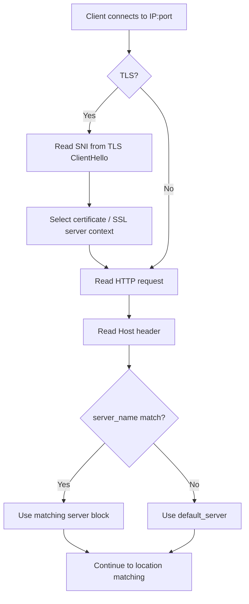
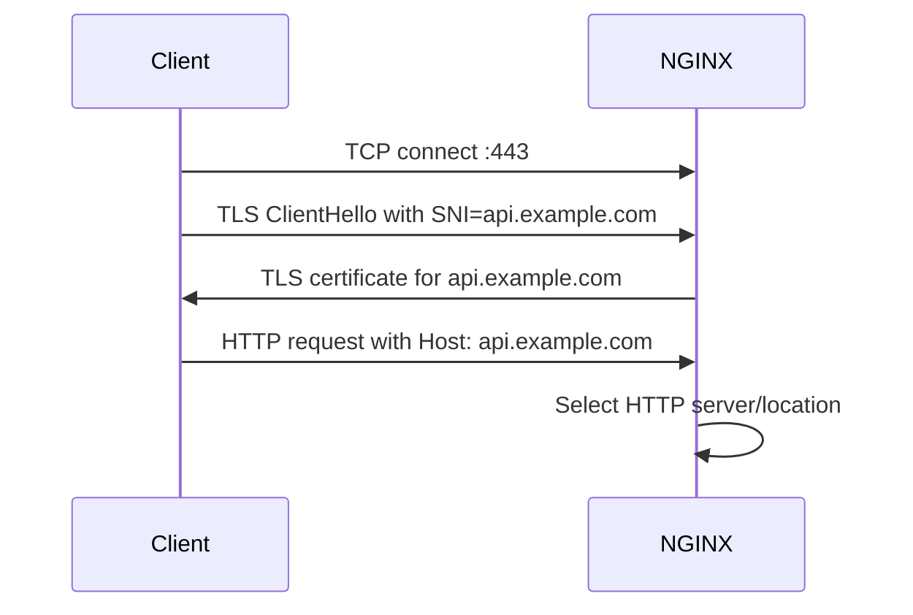
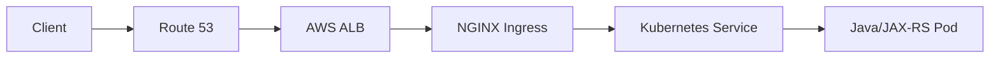

# Part 005 — Server Block, Virtual Host, SNI, and Host-Based Routing

## 1. Tujuan Part Ini

Part ini membahas bagaimana NGINX memilih **server block** yang akan menangani request.

Di production, banyak masalah routing, TLS, dan 404/502 bukan berasal dari kode Java/JAX-RS, tetapi dari fakta sederhana:

> Request masuk ke server block yang salah.

Sebagai senior backend engineer, kamu perlu bisa menjawab:

- hostname mana yang diterima oleh NGINX;
- sertifikat TLS mana yang dipilih;
- kenapa request dengan host tertentu masuk ke backend berbeda;
- apa yang terjadi jika `Host` header kosong, salah, atau dipalsukan;
- apa perbedaan routing berdasarkan `Host` header dan SNI;
- apa risiko `default_server` yang terlalu permisif;
- bagaimana Kubernetes Ingress menerjemahkan host rule menjadi NGINX server block.

Part ini bukan sekadar belajar `server_name`. Fokusnya adalah **traffic classification at the edge**.

---

## 2. Mental Model: Server Block Adalah Boundary Awal HTTP Routing

NGINX memakai beberapa tahap untuk menentukan server block:

1. IP address dan port tempat koneksi diterima.
2. Jika TLS, SNI dari TLS ClientHello bisa membantu memilih sertifikat/server.
3. Setelah HTTP request dibaca, `Host` header dipakai untuk memilih virtual host.
4. Jika tidak ada match, NGINX memakai default server untuk listen socket tersebut.

Secara sederhana:



Key point:

> `server` block menjawab: request ini milik virtual host mana?
> `location` block menjawab: path di dalam virtual host ini harus diarahkan ke mana?

Jangan mencampur dua konsep ini.

---

## 3. Minimal Server Block Anatomy

Contoh dasar:

```nginx
server {
    listen 80;
    server_name api.example.com;

    location / {
        proxy_pass http://java_api_upstream;
    }
}
```

Elemen utama:

| Elemen | Fungsi |
|---|---|
| `server` | Mendefinisikan virtual host. |
| `listen` | Socket yang diterima: port, address, TLS flag, default flag. |
| `server_name` | Nama host yang cocok dengan HTTP `Host` header. |
| `location` | Routing berdasarkan URI path setelah server block dipilih. |
| `proxy_pass` | Upstream tujuan. |

Untuk backend Java/JAX-RS, server block biasanya mewakili public API hostname, misalnya:

```text
quote-api.company.example
order-api.company.example
internal-order-api.company.example
```

Masing-masing hostname bisa punya:

- TLS certificate berbeda;
- rate limit berbeda;
- auth policy berbeda;
- upstream berbeda;
- observability label berbeda;
- body size limit berbeda;
- timeout berbeda.

---

## 4. `listen`: Port Binding dan Default Server

Directive `listen` menentukan address/port tempat server menerima request.

Contoh:

```nginx
server {
    listen 80;
    server_name api.example.com;
}

server {
    listen 443 ssl http2;
    server_name api.example.com;
}
```

Beberapa bentuk umum:

```nginx
listen 80;
listen 443 ssl;
listen 443 ssl http2;
listen 0.0.0.0:80;
listen [::]:80;
listen 443 ssl default_server;
```

Important distinction:

| Directive | Meaning |
|---|---|
| `listen 80` | Menerima HTTP pada port 80. |
| `listen 443 ssl` | Menerima HTTPS pada port 443. |
| `default_server` | Server block fallback untuk address:port tersebut. |
| `http2` | Mengaktifkan HTTP/2 pada TLS listener jika module/config mendukung. |

Production concern:

> Default server yang salah bisa membuat request untuk hostname tidak dikenal tetap diproses dan diteruskan ke backend internal.

Default server yang aman biasanya tidak melakukan proxy ke backend bisnis.

Contoh defensive default server:

```nginx
server {
    listen 80 default_server;
    listen 443 ssl default_server;
    server_name _;

    ssl_certificate     /etc/nginx/tls/default.crt;
    ssl_certificate_key /etc/nginx/tls/default.key;

    return 444;
}
```

Catatan:

- `444` adalah NGINX-specific status untuk menutup koneksi tanpa response.
- Tidak semua environment ingin memakai `444`; beberapa organisasi lebih suka `404` atau `403` agar lebih observable.
- Yang penting: unknown host jangan diam-diam masuk ke aplikasi bisnis.

---

## 5. `server_name`: Exact, Wildcard, dan Regex

NGINX mendukung beberapa bentuk `server_name`.

### 5.1 Exact name

```nginx
server_name api.example.com;
```

Ini bentuk paling aman dan mudah dipahami.

### 5.2 Multiple names

```nginx
server_name api.example.com api.internal.example.com;
```

Gunakan hati-hati. Dua hostname dalam satu server block berarti policy-nya sama:

- TLS behavior;
- header policy;
- auth;
- timeout;
- body limit;
- upstream routing.

Jika policy berbeda, pisahkan server block.

### 5.3 Wildcard prefix

```nginx
server_name *.example.com;
```

Cocok untuk multi-subdomain, tetapi berisiko terlalu luas.

Risiko:

- hostname tidak sengaja ikut match;
- tenant boundary blur;
- security policy terlalu general;
- observability sulit karena terlalu banyak host dalam satu config.

### 5.4 Wildcard suffix

```nginx
server_name mail.*;
```

Jarang diperlukan untuk backend API enterprise.

### 5.5 Regex server name

```nginx
server_name ~^(?<tenant>[a-z0-9-]+)\.api\.example\.com$;
```

Regex bisa berguna untuk tenant-based routing, tetapi meningkatkan kompleksitas:

- lebih sulit direview;
- lebih mudah salah match;
- lebih berat secara mental model;
- bisa memperbesar attack surface jika tenant identifier dipakai untuk upstream selection.

Prinsip production:

> Prefer exact hostnames. Pakai wildcard/regex hanya jika ada kebutuhan arsitektural yang jelas dan governance yang kuat.

---

## 6. Server Name Selection Order

Saat ada banyak server block pada address:port yang sama, NGINX memilih berdasarkan precedence.

Secara konseptual:

1. exact name;
2. longest wildcard name starting with `*`;
3. longest wildcard name ending with `*`;
4. first matching regex in config order;
5. default server.

Contoh:

```nginx
server {
    listen 443 ssl;
    server_name api.example.com;
}

server {
    listen 443 ssl;
    server_name *.example.com;
}

server {
    listen 443 ssl default_server;
    server_name _;
}
```

Request:

| Host | Selected server |
|---|---|
| `api.example.com` | Exact match. |
| `quote.example.com` | Wildcard `*.example.com`. |
| `unknown.other.com` | Default server. |

Failure mode yang sering muncul:

- wildcard menangkap hostname yang seharusnya rejected;
- regex server block terlalu awal dan match terlalu luas;
- default server mengarah ke backend valid;
- hostname baru ditambahkan di DNS tetapi belum ditambahkan di `server_name` atau Ingress host.

---

## 7. Host Header: Data Routing yang Tidak Boleh Dipercaya Buta

HTTP/1.1 memakai `Host` header untuk virtual hosting.

Contoh request:

```http
GET /orders/123 HTTP/1.1
Host: order-api.example.com
User-Agent: curl/8.0
```

NGINX memakai `Host` untuk memilih server block.

Security warning:

> `Host` header berasal dari client. Jangan menganggap nilainya selalu valid, terpercaya, atau sesuai DNS.

Client bisa mengirim:

```bash
curl -H 'Host: internal-admin.example.com' http://public-lb-ip/
```

Jika default server atau load balancer mengizinkan, request bisa diarahkan ke virtual host yang tidak dimaksudkan untuk publik.

Mitigasi:

- gunakan exact `server_name`;
- default server harus deny/close;
- jangan expose internal hostnames pada public listener;
- validate allowed hostnames di application jika URL generation bergantung pada Host;
- jangan membangun redirect absolute URL dari Host tanpa trusted proxy policy;
- gunakan cloud load balancer listener rule/security boundary jika tersedia.

---

## 8. SNI: Hostname pada TLS Handshake

SNI atau Server Name Indication adalah hostname yang dikirim client saat TLS handshake.

SNI muncul sebelum HTTP request dikirim.



SNI dipakai untuk memilih certificate yang tepat.

Host header dipakai untuk memilih HTTP virtual host.

Biasanya SNI dan Host sama. Tapi bisa berbeda.

Contoh mismatch:

```text
SNI:  api.example.com
Host: internal.example.com
```

Kemungkinan hasil:

- TLS handshake sukses karena cert cocok dengan SNI.
- HTTP routing masuk ke server block berdasarkan Host.
- Security policy bisa kacau jika Host tidak divalidasi.

Production implication:

> TLS certificate correctness tidak menjamin HTTP Host routing correctness.

---

## 9. TLS Certificate Selection and Virtual Host

Contoh multi-cert server:

```nginx
server {
    listen 443 ssl;
    server_name quote-api.example.com;

    ssl_certificate     /etc/nginx/tls/quote-api.crt;
    ssl_certificate_key /etc/nginx/tls/quote-api.key;

    location / {
        proxy_pass http://quote_api_upstream;
    }
}

server {
    listen 443 ssl;
    server_name order-api.example.com;

    ssl_certificate     /etc/nginx/tls/order-api.crt;
    ssl_certificate_key /etc/nginx/tls/order-api.key;

    location / {
        proxy_pass http://order_api_upstream;
    }
}
```

Failure mode:

| Symptom | Possible cause |
|---|---|
| Browser says certificate mismatch | SNI maps to wrong cert or cert SAN missing hostname. |
| `curl` succeeds with `--resolve` but browser fails | DNS/load balancer path differs. |
| TLS handshake fails before HTTP log appears | Certificate/protocol/cipher/SNI issue before request reaches HTTP layer. |
| Access log shows wrong host | Host header mismatch or default server. |
| Backend receives wrong scheme | Missing `X-Forwarded-Proto https`. |

Debug with:

```bash
openssl s_client -connect api.example.com:443 -servername api.example.com -showcerts
```

And:

```bash
curl -vk https://api.example.com/health
```

To isolate DNS/LB:

```bash
curl -vk --resolve api.example.com:443:203.0.113.10 https://api.example.com/health
```

---

## 10. Host-Based Routing for Java/JAX-RS Services

A Java/JAX-RS backend often assumes a base URL or context path.

Example:

```java
@GET
@Path("/orders/{id}")
public Response getOrder(@PathParam("id") String id) {
    ...
}
```

Public URL:

```text
https://order-api.example.com/api/v1/orders/123
```

Backend may see:

```text
http://order-service.default.svc.cluster.local:8080/api/v1/orders/123
```

or after rewrite:

```text
http://order-service.default.svc.cluster.local:8080/orders/123
```

Host routing matters because backend may generate:

- redirects;
- absolute links;
- Location headers;
- OpenAPI server URLs;
- callback URLs;
- pagination links;
- HATEOAS links;
- OAuth redirect URLs.

If proxy headers are wrong, backend may generate:

```text
http://order-service:8080/orders/123
```

instead of:

```text
https://order-api.example.com/api/v1/orders/123
```

For reverse proxy correctness, standard headers usually include:

```nginx
proxy_set_header Host              $host;
proxy_set_header X-Real-IP         $remote_addr;
proxy_set_header X-Forwarded-For   $proxy_add_x_forwarded_for;
proxy_set_header X-Forwarded-Host  $host;
proxy_set_header X-Forwarded-Proto $scheme;
proxy_set_header X-Forwarded-Port  $server_port;
```

But do not blindly trust these at application layer. The Java runtime/framework must know which proxies are trusted.

---

## 11. `$host`, `$http_host`, and `$server_name`

NGINX variables are subtle.

| Variable | Meaning |
|---|---|
| `$http_host` | Raw `Host` header from client. May include port. May be empty. |
| `$host` | Normalized host: request host, or server name fallback. Usually safer than `$http_host`. |
| `$server_name` | Name of selected server block. Not necessarily same as requested Host. |

Example:

```nginx
proxy_set_header Host $host;
```

Usually safer than:

```nginx
proxy_set_header Host $http_host;
```

But context matters.

If preserving original port matters:

```nginx
proxy_set_header Host $http_host;
```

Potential risk:

- malformed Host header forwarded to backend;
- Host header injection;
- application uses Host for URL generation;
- open redirect vulnerabilities.

Production recommendation:

> Use a standard platform-approved header policy. Do not let every service invent its own forwarding header behavior.

---

## 12. Default Server Strategy

Every listener has a default server.

If no `default_server` is explicitly set, the first server block for that address:port becomes default.

This is dangerous because file include order can change behavior.

Bad pattern:

```nginx
server {
    listen 443 ssl;
    server_name order-api.example.com;

    location / {
        proxy_pass http://order_api_upstream;
    }
}
```

If this is the first server for `443`, unknown host may route to order API.

Better:

```nginx
server {
    listen 443 ssl default_server;
    server_name _;

    ssl_certificate     /etc/nginx/tls/default.crt;
    ssl_certificate_key /etc/nginx/tls/default.key;

    return 404;
}

server {
    listen 443 ssl;
    server_name order-api.example.com;

    ssl_certificate     /etc/nginx/tls/order-api.crt;
    ssl_certificate_key /etc/nginx/tls/order-api.key;

    location / {
        proxy_pass http://order_api_upstream;
    }
}
```

For internal systems, you may choose:

- `return 404`; more visible and conventional;
- `return 403`; communicates forbidden;
- `return 444`; closes connection, less information disclosed;
- route to explicit default backend page.

Choose based on platform security and observability policy.

---

## 13. Kubernetes Ingress Mapping to Server Blocks

In Kubernetes, you usually do not write raw `server` blocks directly when using an ingress controller.

You write:

```yaml
apiVersion: networking.k8s.io/v1
kind: Ingress
metadata:
  name: order-api
spec:
  ingressClassName: nginx
  tls:
    - hosts:
        - order-api.example.com
      secretName: order-api-tls
  rules:
    - host: order-api.example.com
      http:
        paths:
          - path: /api/v1
            pathType: Prefix
            backend:
              service:
                name: order-service
                port:
                  number: 8080
```

The controller generates NGINX config conceptually equivalent to:

```nginx
server {
    listen 443 ssl;
    server_name order-api.example.com;

    ssl_certificate     ...from secret order-api-tls...;
    ssl_certificate_key ...from secret order-api-tls...;

    location /api/v1 {
        proxy_pass http://order-service-8080;
    }
}
```

Important:

> Ingress `host` maps to NGINX virtual host.
> Ingress `path` maps to NGINX location.
> Ingress `tls.hosts` influences certificate association.

A frequent failure is to update only one of these:

- DNS points to load balancer;
- Ingress `rules.host` missing;
- TLS secret missing hostname;
- certificate SAN missing hostname;
- application uses different public base URL.

---

## 14. Host Routing Across Cloud Load Balancer and NGINX

In cloud/on-prem environments, Host-based routing may happen before NGINX.

Example AWS ALB before NGINX:



ALB may perform:

- TLS termination;
- host-based listener rules;
- path-based listener rules;
- HTTP-to-HTTPS redirect;
- WAF integration;
- health check routing.

NGINX may also perform host/path routing.

This creates two routing layers.

Risk:

| Risk | Example |
|---|---|
| Rule mismatch | ALB routes host A to NGINX, NGINX has no server block for host A. |
| TLS split responsibility | ALB terminates TLS, NGINX sees HTTP and `$scheme` becomes `http`. |
| Header loss | ALB sends `X-Forwarded-Proto`, NGINX overwrites incorrectly. |
| Duplicate redirect | ALB and NGINX both force HTTPS. |
| Confusing 404 | ALB default rule vs NGINX default backend vs app 404. |

In Azure, similar issues can occur with Application Gateway, Front Door, Azure Load Balancer, or API Management.

In on-prem, similar issues can occur with F5, firewall reverse proxy, corporate L7 appliance, or DMZ proxy.

---

## 15. Host Header Preservation to Upstream

By default, when proxying, you should be deliberate about Host header behavior.

Option 1: Preserve public host.

```nginx
proxy_set_header Host $host;
```

Backend sees:

```text
Host: order-api.example.com
```

Good for:

- URL generation;
- tenant based on hostname;
- audit/logging;
- application-level host validation.

Option 2: Set upstream host.

```nginx
proxy_set_header Host order-service.default.svc.cluster.local;
```

Backend sees internal host.

Good for:

- upstream virtual host requirement;
- internal service expecting a specific Host.

Risk:

- application loses public hostname;
- generated URLs may be internal;
- multiple public hosts to one backend become indistinguishable.

Option 3: Use `$proxy_host`.

```nginx
proxy_set_header Host $proxy_host;
```

Useful in some upstream scenarios, but often not what application teams expect.

Senior review question:

> Does the backend need to know the public host, the internal upstream host, or both via separate headers?

---

## 16. Common Host Routing Failure Modes

### 16.1 DNS points correctly, NGINX host rule missing

Symptom:

- DNS resolves;
- TLS may work if wildcard cert exists;
- response is default backend 404.

Check:

```bash
kubectl get ingress -A | grep order-api.example.com
```

### 16.2 TLS certificate mismatch

Symptom:

- browser fails before HTTP request;
- no access log entry;
- `openssl s_client` shows wrong cert.

Check:

```bash
openssl s_client -connect order-api.example.com:443 -servername order-api.example.com -showcerts
```

### 16.3 Host header forwarded incorrectly

Symptom:

- backend redirects to internal hostname;
- OpenAPI URL wrong;
- OAuth redirect mismatch;
- generated links use `http://` not `https://`.

Check application logs and response headers:

```bash
curl -vk https://order-api.example.com/api/v1/orders -I
```

### 16.4 Public and internal host mixed in same server block

Symptom:

- security policy applies too broadly;
- internal route accessible from public path;
- rate limit/auth policy inconsistent.

Check:

- `server_name` list;
- Ingress host rules;
- cloud load balancer listener rules;
- allowlist annotations.

### 16.5 Default server proxies to real backend

Symptom:

- unknown hostname still returns real API response;
- scanning tools discover backend behavior;
- Host header injection tests succeed.

Fix:

- explicit deny default server;
- strict host rules;
- application allowed-host validation if needed.

---

## 17. Debugging Wrong Virtual Host

Use this sequence.

### Step 1: Verify DNS

```bash
dig order-api.example.com
nslookup order-api.example.com
```

Check:

- public vs private DNS;
- split-horizon DNS;
- stale record;
- wrong load balancer.

### Step 2: Verify TCP/TLS endpoint

```bash
curl -vk https://order-api.example.com/health
```

Check:

- certificate subject/SAN;
- TLS protocol;
- redirect;
- status code.

### Step 3: Force host to a specific IP

```bash
curl -vk --resolve order-api.example.com:443:203.0.113.10 https://order-api.example.com/health
```

This isolates DNS from LB/NGINX behavior.

### Step 4: Test Host header intentionally

```bash
curl -v http://203.0.113.10/health -H 'Host: order-api.example.com'
```

For HTTPS, use `--resolve`, because SNI matters.

### Step 5: Inspect NGINX/Ingress config

For standalone NGINX:

```bash
nginx -T | grep -n "server_name\|listen\|default_server"
```

For Kubernetes ingress-nginx, depending on access pattern:

```bash
kubectl get ingress -A
kubectl describe ingress -n <namespace> <name>
kubectl logs -n <ingress-namespace> deploy/<controller-name>
```

Some controllers allow inspecting generated config from controller pod.

### Step 6: Check logs

Important log fields:

```text
host
server_name
request_uri
status
upstream_addr
upstream_status
request_time
upstream_response_time
```

If log format lacks `host` or `server_name`, debugging virtual host issues becomes unnecessarily hard.

---

## 18. Observability Requirements for Host Routing

Access log should ideally capture:

```nginx
log_format main_ext '$remote_addr '
                    'host=$host '
                    'server_name=$server_name '
                    'request="$request" '
                    'status=$status '
                    'upstream_addr=$upstream_addr '
                    'upstream_status=$upstream_status '
                    'request_time=$request_time '
                    'upstream_response_time=$upstream_response_time';
```

Why `host` and `server_name` both matter:

- `$host` tells what client requested.
- `$server_name` tells which server block handled it.

If they differ unexpectedly, virtual host routing may be wrong.

For Kubernetes Ingress, useful labels/dimensions:

- namespace;
- ingress name;
- service name;
- host;
- path;
- status;
- upstream status;
- controller pod;
- load balancer name.

---

## 19. Security Concerns

### 19.1 Host Header Injection

If application trusts Host for absolute URL generation, attacker may influence links, redirects, password reset URLs, or callback URLs.

Mitigation:

- restrict valid hosts at NGINX;
- use allowed host validation in application/framework;
- set canonical public base URL via config where possible;
- avoid constructing security-sensitive links directly from untrusted Host.

### 19.2 Internal Host Exposure

Do not expose internal-only hostname on public listener.

Bad:

```nginx
server_name api.example.com internal-api.example.local;
```

Better:

- separate listener;
- separate ingress class;
- internal load balancer;
- network policy/security group;
- explicit allowlist.

### 19.3 Overbroad Wildcard

Wildcard hostnames can accidentally expose new subdomains.

```nginx
server_name *.example.com;
```

Ask:

- Is every subdomain safe to route here?
- Are tenant names validated?
- Are admin/internal subdomains excluded?
- Are logs grouped by actual host?

### 19.4 Unsafe Default Server

Default server should not be a business API.

Default server should be treated as security boundary for unknown hosts.

---

## 20. Performance Concerns

Host routing itself is usually not the bottleneck.

Performance issues appear indirectly:

- too many regex server names;
- expensive wildcard/regex matching in large configs;
- excessive generated config from thousands of Ingress objects;
- reload cost when host config changes frequently;
- certificate count and TLS memory footprint;
- large number of server blocks increasing config complexity;
- log cardinality explosion from host-based tenant routing.

For multi-tenant systems, avoid designing routing that requires frequent NGINX reload for every small tenant lifecycle event unless platform supports it safely.

---

## 21. Java/JAX-RS Impact

Server block and host handling affect Java/JAX-RS in several ways.

| Area | Impact |
|---|---|
| URI generation | Wrong Host/scheme creates wrong absolute URLs. |
| Redirects | `Location` header may point to internal service. |
| Security | Host header injection can affect password reset/callback flows. |
| Tenant routing | Tenant derived from hostname must be validated. |
| Logging | Application may log proxy IP or wrong host. |
| OpenAPI | Generated server URL may be wrong behind proxy. |
| CORS | Allowed origin may depend on public host. |

Backend rule:

> Application must know whether it is allowed to trust forwarded headers, and from which proxy layer.

---

## 22. Kubernetes Impact

In Kubernetes, host routing is distributed across:

- DNS;
- cloud load balancer;
- Service exposing ingress controller;
- IngressClass;
- Ingress resource;
- TLS Secret;
- controller ConfigMap;
- admission webhook;
- generated NGINX config;
- backend Service;
- Pod readiness.

A host-related issue may be caused by any of these.

Example wrong path:

```text
DNS ok → LB ok → NGINX default backend → Ingress host missing
```

Example TLS issue:

```text
DNS ok → LB ok → SNI ok → TLS Secret wrong cert → HTTP never reaches Java
```

Example forwarded header issue:

```text
Cloud LB terminates TLS → NGINX receives HTTP → NGINX sends X-Forwarded-Proto=http → Java generates http links
```

---

## 23. AWS/Azure/On-Prem Impact

### AWS/EKS

Check:

- Route 53 record;
- ALB/NLB listener;
- target group;
- ACM certificate;
- AWS Load Balancer Controller annotations;
- whether TLS terminates at ALB or NGINX;
- whether Host header is preserved;
- whether proxy protocol is enabled.

### Azure/AKS

Check:

- Azure DNS;
- Application Gateway or Front Door host rule;
- TLS certificate source;
- NSG and VNet routing;
- AKS Service type;
- NGINX Ingress host rule;
- Azure Monitor logs.

### On-Prem/Hybrid

Check:

- enterprise DNS;
- firewall NAT;
- F5 or corporate load balancer virtual server;
- DMZ reverse proxy;
- TLS certificate chain;
- internal CA;
- proxy chaining;
- split-horizon DNS.

---

## 24. PR Review Checklist

When reviewing changes involving server block, Ingress host, DNS, TLS, or virtual host routing, ask:

- Is this hostname public, private, partner-facing, or internal-only?
- Does DNS already point to the intended load balancer?
- Does the load balancer route this host to the intended NGINX/Ingress?
- Is `server_name` exact rather than overbroad wildcard?
- Is the default server safe?
- Does TLS certificate SAN include this hostname?
- Is SNI behavior tested?
- Is Host header preserved intentionally?
- Does backend require `X-Forwarded-Host` and `X-Forwarded-Proto`?
- Could this expose an internal endpoint publicly?
- Are logs able to show requested host and selected server?
- Is rollback simple if the hostname routes incorrectly?
- Is there an internal verification checklist item for platform/SRE/network team?

---

## 25. Internal Verification Checklist

Use this checklist in real environment.

### Repository and config

- Find raw NGINX config if standalone NGINX is used.
- Find Ingress resource if Kubernetes ingress is used.
- Find Helm values that generate host rules.
- Find ConfigMap that controls global ingress behavior.
- Find default backend/default server behavior.

### DNS and load balancer

- Verify public/private DNS record.
- Verify cloud/on-prem load balancer listener rules.
- Verify whether LB performs TLS termination.
- Verify whether LB preserves Host header.
- Verify whether WAF/CDN exists before NGINX.

### TLS

- Verify certificate source.
- Verify SAN/wildcard coverage.
- Verify certificate rotation owner.
- Verify SNI works for each hostname.

### Application integration

- Verify Java/JAX-RS trusted proxy configuration.
- Verify generated absolute URL/redirect behavior.
- Verify application logs host, scheme, and client IP correctly.
- Verify allowed host policy if applicable.

### Observability

- Verify NGINX logs include host and server name.
- Verify dashboard can filter by host.
- Verify alerting distinguishes default backend vs application 404.
- Verify previous incident notes for host/SNI/routing issues.

---

## 26. Key Takeaways

- Server block selection happens before location matching.
- `listen` defines where request is accepted; `server_name` defines which host it belongs to.
- SNI affects TLS certificate selection; Host header affects HTTP routing.
- Default server must be explicit and safe.
- Host header is client-controlled input; do not trust it blindly.
- In Kubernetes, Ingress `host` becomes virtual host behavior in the controller.
- In cloud/on-prem environments, host routing may happen at multiple layers.
- Java/JAX-RS services depend on correct forwarded headers for URL generation, redirect, scheme, and client identity.
- Wrong virtual host can look like Java 404, Kubernetes issue, TLS issue, or load balancer issue. Debug from the edge inward.
