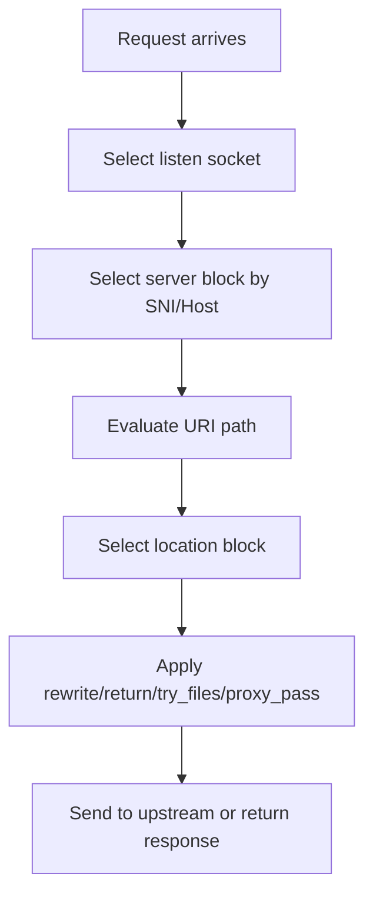
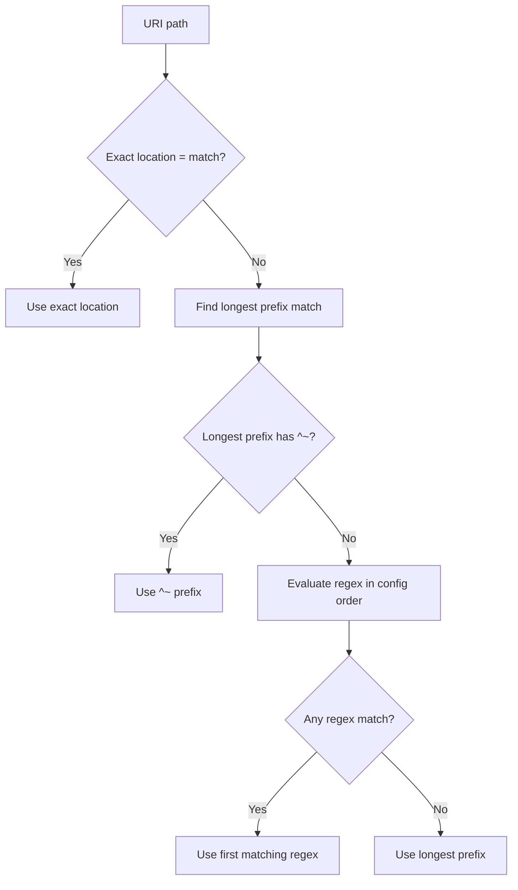

# Part 006 — Location Matching, Rewrite, Path Normalization, and Routing Pitfalls

## 1. Tujuan Part Ini

Part ini membahas bagaimana NGINX memilih **location block** setelah server block dipilih.

Jika Part 005 menjawab:

> Hostname ini milik virtual host mana?

Part ini menjawab:

> URI path ini harus diproses oleh rule yang mana dan diteruskan ke upstream path apa?

Banyak production issue muncul karena path routing terlihat sederhana, padahal detailnya tajam:

- exact vs prefix vs regex location;
- urutan location selection;
- `^~` modifier;
- trailing slash pada `location` dan `proxy_pass`;
- rewrite target;
- path normalization;
- case sensitivity;
- Ingress path type;
- base path mismatch dengan Java/JAX-RS;
- 404 dari NGINX vs 404 dari aplikasi;
- backend yang benar tetapi path yang salah.

Target part ini adalah membuat kamu mampu memprediksi routing path tanpa trial-and-error.

---

## 2. Mental Model: Server Block Dulu, Location Block Setelahnya

Flow sederhana:



Jangan debug path sebelum memastikan virtual host benar.

Jika request masuk ke server block yang salah, location matching di server block yang benar tidak akan pernah terjadi.

---

## 3. Location Types

NGINX mendukung beberapa bentuk location.

### 3.1 Prefix location

```nginx
location /api/ {
    proxy_pass http://api_upstream;
}
```

Cocok untuk routing berbasis path umum.

### 3.2 Exact location

```nginx
location = /health {
    return 200 "ok\n";
}
```

Hanya match URI persis `/health`.

Good for:

- health check;
- readiness endpoint;
- exact static endpoint;
- bypass rule tertentu.

### 3.3 Prefix location with `^~`

```nginx
location ^~ /api/internal/ {
    return 403;
}
```

`^~` berarti: jika prefix ini match, jangan lanjut evaluasi regex location.

Useful untuk memblokir path sensitif sebelum regex yang lebih general.

### 3.4 Regex location

```nginx
location ~ ^/api/v[0-9]+/orders/[0-9]+$ {
    proxy_pass http://order_upstream;
}
```

Regex case-sensitive.

### 3.5 Case-insensitive regex

```nginx
location ~* \.(jpg|jpeg|png|gif|css|js)$ {
    expires 1h;
}
```

`~*` adalah regex case-insensitive.

---

## 4. Location Selection Algorithm

Secara konseptual, NGINX memilih location seperti ini:

1. Cari exact match `=`. Jika ada, langsung gunakan.
2. Cari longest prefix match biasa dan `^~`.
3. Jika longest prefix match memakai `^~`, gunakan dan skip regex.
4. Jika tidak, evaluasi regex location sesuai urutan dalam config.
5. Jika regex match, gunakan regex pertama yang match.
6. Jika tidak ada regex match, gunakan longest prefix match.

Diagram:



This is one of the most important NGINX mechanics.

Memorize this.

---

## 5. Example: Predicting Location Match

Config:

```nginx
server {
    listen 80;
    server_name api.example.com;

    location / {
        return 200 "root";
    }

    location /api/ {
        return 200 "api-prefix";
    }

    location ^~ /api/internal/ {
        return 403;
    }

    location ~ ^/api/.*/debug$ {
        return 200 "regex-debug";
    }

    location = /health {
        return 200 "health";
    }
}
```

Expected behavior:

| Request URI | Matched location | Reason |
|---|---|---|
| `/health` | `= /health` | Exact match wins. |
| `/api/orders` | `/api/` | Longest prefix, no regex match. |
| `/api/orders/debug` | regex | Prefix `/api/` found, then regex matches. |
| `/api/internal/debug` | `^~ /api/internal/` | `^~` skips regex. |
| `/unknown` | `/` | Root prefix fallback. |

Why this matters:

> A regex location can override a normal prefix match unless the prefix uses `^~`.

---

## 6. Location Matching and Java/JAX-RS Path Matching Are Different

NGINX location matching and JAX-RS resource matching are separate systems.

Example:

```nginx
location /api/v1/ {
    proxy_pass http://order_service;
}
```

Java:

```java
@Path("/orders")
public class OrderResource {
    @GET
    @Path("/{id}")
    public Response get(@PathParam("id") String id) { ... }
}
```

If NGINX forwards `/api/v1/orders/123`, backend must have base path `/api/v1` configured somewhere.

If backend expects `/orders/123`, NGINX must strip `/api/v1`.

This mismatch causes:

- NGINX 404 if no location matched;
- application 404 if location matched but backend path wrong;
- wrong OpenAPI docs;
- wrong redirect `Location` header;
- inconsistent local vs production behavior.

Senior debugging question:

> Is this 404 produced before proxying, or after proxying by the Java/JAX-RS runtime?

---

## 7. `proxy_pass` Trailing Slash Behavior

This is one of the most common NGINX traps.

### 7.1 Without trailing slash in `proxy_pass`

```nginx
location /api/ {
    proxy_pass http://backend;
}
```

Request:

```text
/api/orders/123
```

Upstream receives:

```text
/api/orders/123
```

The URI is preserved.

### 7.2 With trailing slash in `proxy_pass`

```nginx
location /api/ {
    proxy_pass http://backend/;
}
```

Request:

```text
/api/orders/123
```

Upstream receives:

```text
/orders/123
```

The matching location prefix `/api/` is replaced by `/`.

### 7.3 Rewrite to another base path

```nginx
location /api/ {
    proxy_pass http://backend/internal-api/;
}
```

Request:

```text
/api/orders/123
```

Upstream receives:

```text
/internal-api/orders/123
```

This behavior is powerful but dangerous.

Production rule:

> Every `proxy_pass` with a URI part should be reviewed as a path rewrite.

---

## 8. Common `proxy_pass` Patterns

### Pattern A: Preserve public path

Public:

```text
/api/v1/orders/123
```

Backend expects same path:

```text
/api/v1/orders/123
```

Config:

```nginx
location /api/v1/ {
    proxy_pass http://order_service;
}
```

### Pattern B: Strip public prefix

Public:

```text
/api/v1/orders/123
```

Backend expects:

```text
/orders/123
```

Config:

```nginx
location /api/v1/ {
    proxy_pass http://order_service/;
}
```

### Pattern C: Map public prefix to internal prefix

Public:

```text
/orders/123
```

Backend expects:

```text
/internal/orders/123
```

Config:

```nginx
location /orders/ {
    proxy_pass http://order_service/internal/orders/;
}
```

### Pattern D: Avoid implicit URI rewrite; use explicit rewrite

```nginx
location /api/v1/ {
    rewrite ^/api/v1/(.*)$ /$1 break;
    proxy_pass http://order_service;
}
```

This can be clearer for complex cases, but it introduces rewrite complexity.

Use consistently.

---

## 9. Trailing Slash Redirect Behavior

Consider:

```nginx
location /api/ {
    proxy_pass http://backend;
}
```

Request:

```text
/api
```

This does not match `/api/` as expected by many engineers.

It may fall back to another location, often `/`.

Safer config:

```nginx
location = /api {
    return 301 /api/;
}

location /api/ {
    proxy_pass http://backend;
}
```

For APIs, be careful with automatic slash redirects:

- clients may not follow redirects for non-GET methods;
- POST redirect behavior can change method depending on status code/client;
- signed URLs may break;
- API consumers may treat redirect as error.

For APIs, prefer explicit contract:

- either support both `/api` and `/api/`;
- or return a clear 404/400;
- or document canonical path.

---

## 10. `rewrite`, `return`, and `try_files`

### 10.1 `return`

`return` immediately sends a response.

```nginx
location = /health {
    return 200 "ok\n";
}
```

Useful for:

- static health response;
- redirect;
- deny;
- canonical URL.

### 10.2 `rewrite`

`rewrite` changes URI based on regex.

```nginx
rewrite ^/old/(.*)$ /new/$1 permanent;
```

Common flags:

| Flag | Meaning |
|---|---|
| `last` | Restart location selection with rewritten URI. |
| `break` | Stop rewrite processing in current location. |
| `redirect` | Temporary redirect. |
| `permanent` | Permanent redirect. |

`last` vs `break` is a frequent source of confusion.

### 10.3 `try_files`

Common for static files or SPA fallback.

```nginx
location / {
    try_files $uri $uri/ /index.html;
}
```

For API reverse proxy, avoid cargo-culting SPA `try_files` into API server blocks.

Bad mix:

```nginx
location / {
    try_files $uri /index.html;
    proxy_pass http://api_backend;
}
```

This is usually unclear and error-prone.

---

## 11. `if` Pitfalls Inside Location

NGINX `if` is often misunderstood.

Example risky pattern:

```nginx
location /api/ {
    if ($request_method = POST) {
        rewrite ^ /maintenance break;
    }

    proxy_pass http://backend;
}
```

Problems:

- rewrite behavior may be non-obvious;
- directive support inside `if` is limited;
- configuration becomes hard to reason about;
- review surface increases.

Prefer:

```nginx
limit_except GET POST {
    deny all;
}
```

Or use `map` at `http` context:

```nginx
map $request_method $is_write_method {
    default 0;
    POST 1;
    PUT 1;
    PATCH 1;
    DELETE 1;
}
```

Then use the mapped variable in a controlled way.

Rule of thumb:

> Use `if` sparingly. Prefer `map`, explicit locations, `return`, and platform-approved snippets.

---

## 12. Path Normalization

Path normalization includes handling of:

- duplicate slashes;
- `.` and `..` segments;
- URL-encoded characters;
- case sensitivity;
- trailing slash;
- percent-encoding;
- upstream framework decoding behavior.

Security-sensitive examples:

```text
/api/../admin
/api/%2e%2e/admin
/api//orders
/API/orders
/api/orders%2F123
```

NGINX, cloud load balancer, WAF, and Java framework may normalize differently.

Risk:

- NGINX blocks `/admin`, but backend receives normalized `/admin` through a bypass path;
- WAF sees encoded path, backend decodes it differently;
- case-insensitive rule allows route that backend treats differently;
- double slash causes cache key mismatch;
- encoded slash changes JAX-RS path parameter behavior.

Production recommendation:

- define allowed path patterns explicitly;
- avoid complex decode/rewrite chains;
- test encoded traversal patterns;
- align WAF, NGINX, and application normalization assumptions;
- log original `$request_uri` and normalized `$uri` if possible.

---

## 13. `$request_uri` vs `$uri`

Important variables:

| Variable | Meaning |
|---|---|
| `$request_uri` | Original request URI including query string, as sent by client. |
| `$uri` | Current normalized URI used internally by NGINX. May change after rewrite. |
| `$args` | Query string arguments. |
| `$is_args` | `?` if args exist, otherwise empty. |

Example:

```text
Request: /api//orders/../orders/123?expand=true
```

`$request_uri` preserves what client sent.

`$uri` may reflect normalized internal URI.

For logging/debugging, `$request_uri` is often more useful to see what client actually sent.

For routing, NGINX generally uses normalized URI.

---

## 14. Query String Preservation

By default, proxying usually preserves query string when URI is not replaced in a way that drops it.

But rewrites can accidentally drop query string.

Example:

```nginx
rewrite ^/api/v1/(.*)$ /$1 break;
proxy_pass http://backend;
```

Usually args are preserved unless replacement includes `?` behavior.

Explicit preservation pattern:

```nginx
proxy_pass http://backend$uri$is_args$args;
```

Use carefully. Explicit URI construction can create double-encoding or unexpected behavior.

Failure mode:

- pagination query disappears;
- filter parameter disappears;
- OAuth callback query lost;
- signed URL invalid;
- cache key mismatch.

Debug:

```bash
curl -v 'https://api.example.com/api/v1/orders?page=2&status=open'
```

Check backend access log for query string.

---

## 15. Location Matching in Kubernetes Ingress

Kubernetes Ingress path types:

| pathType | Meaning |
|---|---|
| `Exact` | Match exact path. |
| `Prefix` | Match path prefix by Kubernetes path element semantics. |
| `ImplementationSpecific` | Controller-specific behavior. |

Example:

```yaml
apiVersion: networking.k8s.io/v1
kind: Ingress
metadata:
  name: order-api
spec:
  ingressClassName: nginx
  rules:
    - host: order-api.example.com
      http:
        paths:
          - path: /api/v1
            pathType: Prefix
            backend:
              service:
                name: order-service
                port:
                  number: 8080
```

This does not always behave exactly like raw NGINX `location /api/v1` in every controller/version.

Controller-specific annotations can alter behavior:

- regex path usage;
- rewrite target;
- path priority;
- backend protocol;
- trailing slash handling;
- canary behavior.

Senior rule:

> For Kubernetes Ingress, reason from Kubernetes spec plus the specific ingress controller implementation, not from raw NGINX alone.

---

## 16. Ingress Rewrite Target Example

Common ingress-nginx style pattern:

```yaml
metadata:
  annotations:
    nginx.ingress.kubernetes.io/rewrite-target: /$2
spec:
  rules:
    - host: order-api.example.com
      http:
        paths:
          - path: /api/v1(/|$)(.*)
            pathType: ImplementationSpecific
            backend:
              service:
                name: order-service
                port:
                  number: 8080
```

Concept:

```text
/api/v1/orders/123  →  /orders/123
```

Risks:

- regex capture group wrong;
- pathType not compatible;
- annotation applies to all paths in same Ingress in unexpected way;
- backend OpenAPI/docs still advertise internal path;
- metrics/logs show rewritten or original path inconsistently;
- security rule checks public path but backend sees stripped path.

Verification:

```bash
curl -vk https://order-api.example.com/api/v1/orders/123
```

Then check backend logs:

```text
requestURI=/orders/123
```

or:

```text
requestURI=/api/v1/orders/123
```

Know which one you expect.

---

## 17. NGINX 404 vs Application 404

A 404 can be produced by different layers.

| Layer | Meaning |
|---|---|
| Cloud LB 404 | Listener/rule/default action did not match. |
| NGINX 404 | Server/location/static file/default backend did not match. |
| Ingress default backend 404 | Host/path not matched by Ingress. |
| Java/JAX-RS 404 | Request reached app but no resource method matched. |
| Business 404 | Resource id not found. |

Debug checklist:

- Does NGINX access log show upstream address?
- Does upstream status exist?
- Does Java access log show request?
- Does response body look like NGINX, ingress default backend, framework, or business API?
- Does status include custom error page?

If access log shows:

```text
status=404 upstream_status=- upstream_addr=-
```

Likely NGINX generated it.

If access log shows:

```text
status=404 upstream_status=404 upstream_addr=10.10.1.25:8080
```

Likely upstream generated it.

---

## 18. Wrong Backend Routing

Wrong backend means request matched a valid route but not the intended one.

Causes:

- overlapping prefix locations;
- regex location overrides prefix;
- Ingress host/path conflict;
- multiple Ingress objects for same host;
- wildcard host catches request;
- default backend used;
- rewrite transforms path into another service's path;
- cloud LB performs path routing before NGINX;
- old config still active after failed reload.

Example overlapping config:

```nginx
location /api/ {
    proxy_pass http://generic_api;
}

location /api/orders/ {
    proxy_pass http://order_api;
}
```

Request `/api/orders/123` should match `/api/orders/` because it is the longest prefix.

But add regex:

```nginx
location ~ ^/api/.*/123$ {
    proxy_pass http://special_api;
}
```

Now `/api/orders/123` may match regex unless `/api/orders/` is marked `^~`.

---

## 19. Safe Routing Design Principles

### 19.1 Prefer boring paths

Good:

```text
/api/v1/orders
/api/v1/quotes
/api/v1/catalog
```

Risky:

```text
/{tenant}/{region}/{product}/api/{version}/...
```

More dynamic path means more rewrite, more regex, more hidden coupling.

### 19.2 Avoid route ownership ambiguity

Do not let multiple teams own overlapping path prefixes without governance.

Example dangerous overlap:

```text
/api/v1/order
/api/v1/orders
/api/v1/orders-internal
```

### 19.3 Keep public path and backend path aligned when possible

The safest path strategy is no rewrite.

Rewrite is sometimes necessary, but it should be intentional and tested.

### 19.4 Separate internal and external routes

Do not hide internal/external distinction only in regex.

Prefer separate hostnames, ingress classes, or network boundaries.

### 19.5 Make fallback explicit

Every server should have clear behavior for unmatched path:

```nginx
location / {
    return 404;
}
```

or explicitly proxy if intended.

---

## 20. Security Concerns

### 20.1 Path Traversal

Block sensitive paths and test encoded variants.

Examples to test:

```text
/../admin
/%2e%2e/admin
/api/%2e%2e/internal
/api/..%2fadmin
```

NGINX alone should not be the only defense. Application and framework should also enforce authorization.

### 20.2 Regex Overmatch

Bad:

```nginx
location ~ /admin {
    deny all;
}
```

May not cover encoded/case variants depending on assumptions.

Better:

- exact/prefix deny for known paths;
- normalize and test;
- avoid exposing admin paths on public host;
- enforce auth in application.

### 20.3 Rewrite Bypass

A rewrite can transform a public allowed path into an internal sensitive path.

Example:

```nginx
rewrite ^/public/(.*)$ /$1 break;
```

`/public/admin` becomes `/admin`.

If backend exposes `/admin`, this is dangerous.

### 20.4 Cache Poisoning via Path Confusion

If cache key uses one path form but backend normalizes differently, attacker may poison cache.

Relevant when proxy cache/CDN exists.

### 20.5 Encoded Slash and JAX-RS Path Params

JAX-RS path parameter behavior may differ for encoded slash `%2F` depending on server/framework config.

Example:

```text
/orders/tenantA%2Fsecret
```

Could be interpreted as:

```text
id = "tenantA/secret"
```

or as additional path segments.

Verify framework behavior.

---

## 21. Performance Concerns

Path routing can affect performance indirectly.

Potential issues:

- excessive regex locations;
- complex rewrite chains;
- high-cardinality path logging without normalization;
- too many generated Ingress rules;
- frequent config reload due to route changes;
- expensive auth/rate-limit logic attached to broad location;
- buffering or caching accidentally enabled on streaming path;
- static asset and API traffic mixed in one server block.

Performance rule:

> Routing logic should be simple enough to predict and cheap enough to execute under peak traffic.

---

## 22. Observability Concerns

To debug path routing, logs should include:

- original request URI;
- normalized URI if available;
- host;
- selected upstream;
- upstream status;
- ingress name/service name if Kubernetes;
- request time;
- upstream response time;
- status;
- request ID.

Example log fields:

```nginx
log_format route_debug 'host=$host '
                       'request_uri=$request_uri '
                       'uri=$uri '
                       'status=$status '
                       'upstream_addr=$upstream_addr '
                       'upstream_status=$upstream_status '
                       'request_time=$request_time '
                       'upstream_response_time=$upstream_response_time';
```

Without `request_uri`, you may not see encoded/path confusion.

Without `upstream_addr`, you may not know whether NGINX proxied.

Without `upstream_status`, you may not know whether status came from upstream.

---

## 23. Debugging Playbook for Path Issues

### Step 1: Confirm host/server block

```bash
curl -vk https://order-api.example.com/api/v1/orders/123
```

Check certificate, Host, response, and status.

### Step 2: Test exact path variants

```bash
curl -vk https://order-api.example.com/api/v1
curl -vk https://order-api.example.com/api/v1/
curl -vk https://order-api.example.com/api/v1/orders
curl -vk https://order-api.example.com/api/v1/orders/
```

Trailing slash differences often expose routing bugs.

### Step 3: Check NGINX access log

Look for:

```text
request_uri
uri
status
upstream_status
upstream_addr
```

### Step 4: Check backend log

Confirm actual path received by Java/JAX-RS.

Look for:

```text
method=GET path=/orders/123 query=...
```

or:

```text
method=GET path=/api/v1/orders/123 query=...
```

### Step 5: Inspect generated config or Ingress

Standalone:

```bash
nginx -T
```

Kubernetes:

```bash
kubectl describe ingress -n <namespace> <name>
kubectl get ingress -A | grep <host>
kubectl get svc -n <namespace>
kubectl get endpointslice -n <namespace>
```

### Step 6: Test encoded and edge-case paths

```bash
curl -vk 'https://order-api.example.com/api/v1/%2e%2e/admin'
curl -vk 'https://order-api.example.com/api/v1//orders'
curl -vk 'https://order-api.example.com/API/v1/orders'
```

Use only in authorized environments.

### Step 7: Isolate cloud LB vs NGINX vs app

- Direct to LB with expected Host/SNI.
- Direct to ingress internal address if allowed.
- Port-forward to service/pod if safe.
- Compare responses.

---

## 24. Java/JAX-RS Specific Checklist

Check these when NGINX path routing touches Java/JAX-RS service:

- What is application context path?
- Does JAX-RS application have base path such as `/api`?
- Does NGINX preserve or strip public prefix?
- Does OpenAPI documentation show public path or internal path?
- Do redirects include correct path prefix?
- Does authentication filter expect path before or after rewrite?
- Does authorization policy protect internal endpoints regardless of proxy path?
- Are metrics tagged by raw path or templated route?
- Does application log original forwarded path if needed?
- Are encoded slash/path traversal cases handled consistently?

Potential app-level config examples to verify, depending on stack:

- servlet context path;
- JAX-RS `@ApplicationPath`;
- reverse proxy/trusted proxy config;
- framework base URL config;
- OpenAPI server URL config;
- redirect/callback URL config;
- CORS allowed origin/path assumptions.

---

## 25. Kubernetes Ingress Checklist

When debugging or reviewing Ingress path rules:

- Is `host` exact and correct?
- Is `pathType` correct: `Exact`, `Prefix`, or `ImplementationSpecific`?
- Is regex enabled intentionally?
- Is rewrite-target annotation used?
- Are capture groups correct?
- Does one annotation affect multiple paths unexpectedly?
- Are multiple Ingress objects defining same host/path?
- Is backend service port correct?
- Does backend service have ready endpoints?
- Does controller support the annotation/version used?
- Is there an admission warning or rejected config?
- Does generated NGINX config match intent?

---

## 26. AWS/Azure/On-Prem Checklist

### AWS/EKS

- Does ALB do path routing before NGINX?
- Does ALB strip or preserve path? Usually it preserves, but verify listener/action behavior.
- Is AWS Load Balancer Controller also managing Ingress-like routing?
- Are health check paths aligned with NGINX and backend?
- Are security group rules allowing the intended path? Security groups do not inspect path, but WAF/ALB rules might.

### Azure/AKS

- Does Application Gateway or Front Door perform path-based routing?
- Is URL rewrite configured at Application Gateway?
- Does Azure API Management sit before NGINX and transform path?
- Are backend path overrides configured?
- Are health probes using correct path?

### On-Prem/Hybrid

- Does F5/corporate proxy rewrite path before NGINX?
- Does DMZ proxy normalize path differently?
- Does firewall/WAF block encoded path variants?
- Does internal load balancer use a different health path?
- Is split routing documented?

---

## 27. PR Review Checklist

For path routing, rewrite, and location changes, ask:

- Which public path is being introduced or changed?
- Which backend path will actually be received?
- Is `proxy_pass` trailing slash behavior understood?
- Is rewrite required, or can backend align with public path?
- Are exact/prefix/regex rules overlapping?
- Could regex override a more specific prefix?
- Should `^~` be used to protect a sensitive prefix?
- Does `/api` behave differently from `/api/`?
- Are query strings preserved?
- Are encoded path cases safe?
- Does Java/JAX-RS routing expect the rewritten path?
- Are OpenAPI docs and client SDKs still correct?
- Are auth and authorization filters applied after rewrite safely?
- Are logs sufficient to distinguish NGINX 404 vs app 404?
- Is rollback easy if routing sends traffic to wrong backend?

---

## 28. Internal Verification Checklist

Use this against real codebase/platform.

### Config source

- Find raw `location` blocks if standalone NGINX is used.
- Find Ingress path rules if Kubernetes is used.
- Find Helm values or Kustomize overlays generating routes.
- Find annotations for rewrite, regex, buffering, timeout, auth, and rate limit.
- Find generated NGINX config if controller permits.

### Routing behavior

- Verify exact expected public path.
- Verify exact backend path received.
- Verify trailing slash behavior.
- Verify query string preservation.
- Verify default path behavior.
- Verify multiple Ingress conflict handling.

### Java/JAX-RS integration

- Verify context path and `@ApplicationPath`.
- Verify OpenAPI server/base URL.
- Verify redirect/callback path.
- Verify application access log path.
- Verify auth filters and internal endpoints.

### Security

- Test encoded traversal cases in authorized test environment.
- Verify internal/admin paths are not exposed through rewrite.
- Verify path-based allow/deny rules cannot be bypassed.
- Verify WAF/proxy/application normalization assumptions.

### Observability

- Verify access logs include `$request_uri`, `$uri`, upstream address, and upstream status.
- Verify dashboard can separate NGINX 404 from upstream 404.
- Verify alerts detect route misconfiguration after deploy.
- Review incident notes for previous path/rewrite problems.

---

## 29. Key Takeaways

- Server block selects host; location block selects path.
- Exact location wins first.
- Longest prefix is selected, but regex can override normal prefix.
- `^~` protects a prefix from regex override.
- `proxy_pass` trailing slash can preserve, strip, or replace path prefixes.
- NGINX path matching and Java/JAX-RS routing are different systems.
- A 404 can come from cloud LB, NGINX, ingress default backend, Java routing, or business logic.
- Rewrite is powerful but should be treated as production risk.
- Path normalization differences can become security bugs.
- Logs must show original URI, selected upstream, and upstream status to debug effectively.
