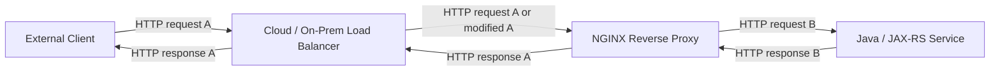
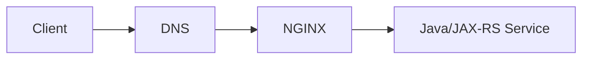
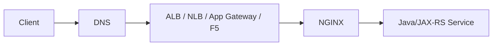
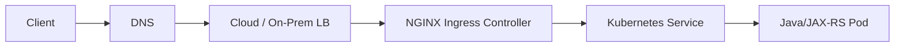
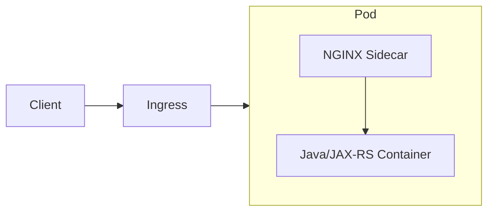
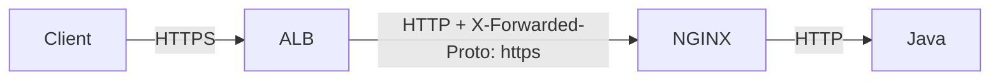
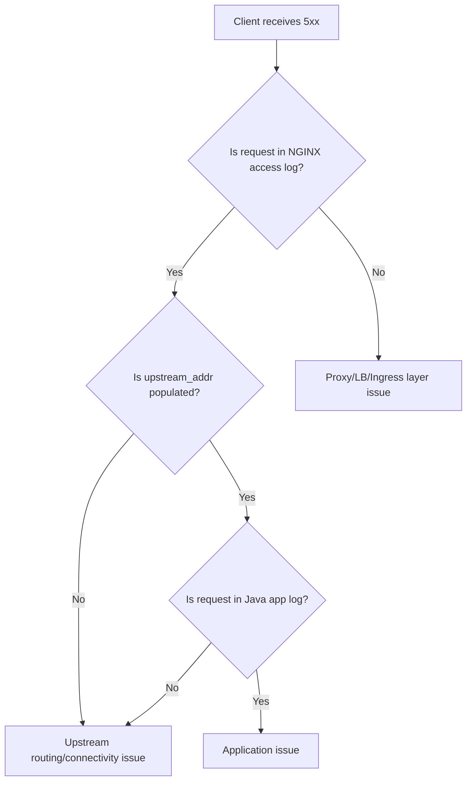

# Part 007 — Reverse Proxy for Java/JAX-RS Backend Services

## 1. Tujuan Part Ini

Part ini membahas NGINX sebagai **reverse proxy** di depan service Java/JAX-RS/Jakarta RESTful.

Fokusnya bukan sekadar:

> Bagaimana menulis `proxy_pass`?

Tetapi:

> Bagaimana memastikan request yang sudah melewati NGINX tetap benar secara semantic, routing, header, scheme, host, path, body, error, observability, dan security ketika diterima Java/JAX-RS backend?

Dalam production system, reverse proxy sering menjadi layer yang diam-diam mengubah behavior aplikasi:

- backend mengira request datang dari HTTP padahal public client memakai HTTPS;
- redirect URL menjadi salah;
- generated absolute URI memakai internal hostname;
- client IP hilang;
- `Host` header berubah;
- base path publik berbeda dengan context path aplikasi;
- request body dibuffer atau dibatasi;
- error upstream berubah menjadi 502/503/504;
- correlation ID tidak diteruskan;
- identity header dari edge bisa dipalsukan jika trust boundary salah.

Target part ini adalah membuat kamu mampu mereview konfigurasi reverse proxy yang berada di depan Java/JAX-RS service secara aman dan production-oriented.

---

## 2. Mental Model: Reverse Proxy Bukan Transparent Pipe

Reverse proxy sering dianggap hanya meneruskan request.

Itu misleading.

Reverse proxy adalah **active HTTP participant**.

NGINX menerima request sebagai server dari sisi client, lalu membuat request baru sebagai client ke upstream.



Konsekuensinya:

- request yang diterima backend tidak selalu identik dengan request original;
- connection client-to-NGINX berbeda dari NGINX-to-upstream;
- TLS bisa terminate di NGINX lalu upstream memakai HTTP;
- header bisa ditambah, dihapus, atau diganti;
- path bisa direwrite;
- body bisa dibuffer;
- response bisa dimodifikasi;
- error upstream bisa diganti menjadi gateway error.

Senior engineer harus bertanya:

> Apa kontrak yang dipertahankan oleh proxy, dan apa yang sengaja diubah?

---

## 3. Reverse Proxy Boundary

Untuk Java/JAX-RS service, NGINX biasanya berada di salah satu posisi berikut.

### 3.1 NGINX sebagai edge reverse proxy langsung



Biasanya pada VM/on-prem sederhana.

### 3.2 Cloud load balancer di depan NGINX



NGINX bukan satu-satunya layer yang mengubah request.

### 3.3 Kubernetes ingress path



Di sini, konfigurasi NGINX sering dihasilkan dari Ingress resource, annotation, dan ConfigMap.

### 3.4 NGINX sidecar



Lebih jarang untuk REST service biasa, tetapi bisa muncul untuk legacy protocol bridging, local TLS termination, static asset handling, atau policy lokal.

---

## 4. Minimal Reverse Proxy Configuration

Contoh paling dasar:

```nginx
upstream quote_order_api {
    server quote-order-service:8080;
}

server {
    listen 443 ssl http2;
    server_name api.example.com;

    location /api/ {
        proxy_pass http://quote_order_api;
    }
}
```

Secara konseptual:

- NGINX menerima request ke `api.example.com`;
- path `/api/...` match location;
- NGINX membuka koneksi ke upstream `quote_order_api`;
- NGINX meneruskan request ke Java/JAX-RS service;
- response dari service dikirim balik ke client.

Namun konfigurasi minimal ini belum cukup aman untuk production.

Masih perlu memikirkan:

- Host header;
- forwarded headers;
- real client IP;
- scheme awareness;
- base path;
- timeout;
- body size;
- buffering;
- observability;
- error handling;
- security boundary.

---

## 5. `proxy_pass` Mental Model

`proxy_pass` menentukan upstream target.

```nginx
location /api/ {
    proxy_pass http://quote_order_api;
}
```

Hal yang harus dipahami:

- `proxy_pass` membuat NGINX menjadi HTTP client ke upstream;
- upstream bisa berupa hostname, IP, Unix socket, atau `upstream` block;
- URI yang diteruskan dapat berubah tergantung trailing slash dan rewrite;
- header default tidak selalu sesuai kebutuhan aplikasi;
- timeout proxy terpisah dari timeout client.

### 5.1 Dengan upstream block

```nginx
upstream quote_order_api {
    server quote-order-1.internal:8080;
    server quote-order-2.internal:8080;
}

location /api/ {
    proxy_pass http://quote_order_api;
}
```

Good for:

- multiple backend instances;
- keepalive upstream;
- load balancing;
- failover behavior;
- central upstream naming.

### 5.2 Dengan Kubernetes Service DNS

```nginx
location /api/ {
    proxy_pass http://quote-order-service.default.svc.cluster.local:8080;
}
```

Dalam Kubernetes, lebih umum NGINX Ingress Controller mengenerate upstream ke Service/Endpoint. Jika memakai standalone NGINX di cluster, Service DNS bisa dipakai, tetapi perlu memahami DNS caching dan resolver behavior.

---

## 6. Host Header: Preserve or Replace?

Default behavior dapat membuat backend menerima Host yang berbeda dari public host.

Production reverse proxy biasanya eksplisit:

```nginx
proxy_set_header Host $host;
```

Atau:

```nginx
proxy_set_header Host $http_host;
```

Perbedaannya penting.

| Header source | Meaning | Risk |
|---|---|---|
| `$host` | Normalized host dari request line/Host/server_name fallback | Lebih aman dan umum |
| `$http_host` | Raw Host header dari client | Bisa mengandung port atau input tidak normal |
| fixed value | Host hardcoded ke upstream | Bisa aman untuk internal service, tetapi merusak public URL generation |

Untuk Java/JAX-RS, `Host` memengaruhi:

- absolute URI generation;
- redirect target;
- HATEOAS link;
- callback URL;
- tenant resolution jika tenant berbasis hostname;
- validation allowed host;
- audit log.

### Production default yang sering masuk akal

```nginx
proxy_set_header Host $host;
```

Namun jangan jadikan ini dogma. Pada beberapa environment, backend justru harus melihat internal host.

**Rule:** tentukan Host berdasarkan kontrak backend, bukan kebiasaan copy-paste.

---

## 7. Forwarded Headers: Reconstruct Original Request Context

Ketika TLS terminate di NGINX dan upstream memakai HTTP, backend akan melihat request sebagai HTTP kecuali diberi metadata.

Header umum:

```nginx
proxy_set_header X-Forwarded-For   $proxy_add_x_forwarded_for;
proxy_set_header X-Forwarded-Host  $host;
proxy_set_header X-Forwarded-Proto $scheme;
proxy_set_header X-Forwarded-Port  $server_port;
```

Jika NGINX menerima request dari load balancer yang sudah terminate TLS, `$scheme` mungkin menjadi `http`, bukan original client scheme.

Contoh:



Jika NGINX memakai:

```nginx
proxy_set_header X-Forwarded-Proto $scheme;
```

maka backend bisa menerima:

```text
X-Forwarded-Proto: http
```

Padahal public client memakai HTTPS.

Dalam chain proxy, perlu memutuskan apakah NGINX harus:

- mempercayai `X-Forwarded-Proto` dari upstream load balancer;
- menulis ulang berdasarkan `$scheme` lokal;
- menggunakan `Forwarded` standard header;
- menolak request dengan forwarded header yang tidak trusted.

---

## 8. `X-Forwarded-For` and Real Client IP

`X-Forwarded-For` biasanya berisi chain IP:

```text
X-Forwarded-For: <client-ip>, <proxy-1-ip>, <proxy-2-ip>
```

NGINX common config:

```nginx
proxy_set_header X-Forwarded-For $proxy_add_x_forwarded_for;
```

Artinya:

- jika request sudah punya `X-Forwarded-For`, append remote address NGINX;
- jika belum, isi dengan remote address.

Masalahnya: client dari internet bisa mengirim `X-Forwarded-For` palsu jika edge tidak membersihkan header.

### Safer trust model

Pada edge yang langsung menerima traffic internet:

```nginx
proxy_set_header X-Forwarded-For $remote_addr;
```

Pada NGINX di belakang trusted load balancer:

```nginx
set_real_ip_from 10.0.0.0/8;
real_ip_header X-Forwarded-For;
real_ip_recursive on;

proxy_set_header X-Forwarded-For $proxy_add_x_forwarded_for;
```

Tapi `set_real_ip_from` harus sangat hati-hati.

Jangan trust seluruh internet.

### Impact ke Java/JAX-RS

Client IP dipakai untuk:

- audit log;
- fraud detection;
- rate limiting;
- security investigation;
- allowlist/denylist;
- regional policy;
- incident forensics.

Jika salah, audit trail menjadi misleading.

---

## 9. Standard `Forwarded` Header

Selain `X-Forwarded-*`, ada header standar:

```text
Forwarded: for=203.0.113.10;proto=https;host=api.example.com
```

Contoh NGINX:

```nginx
proxy_set_header Forwarded "for=$remote_addr;proto=$scheme;host=$host";
```

Namun dalam banyak enterprise platform, `X-Forwarded-*` lebih umum dipakai karena legacy compatibility.

Untuk Java/JAX-RS, yang penting bukan nama header semata, tetapi:

- framework membaca header mana;
- trusted proxy dikonfigurasi;
- header dari untrusted source dibersihkan;
- chain proxy konsisten.

---

## 10. Proxy Protocol

Proxy Protocol membawa informasi client connection di level transport, bukan HTTP header.

Digunakan ketika load balancer L4 perlu meneruskan original client IP ke NGINX.

Contoh listen:

```nginx
server {
    listen 443 ssl proxy_protocol;

    real_ip_header proxy_protocol;

    location /api/ {
        proxy_set_header X-Real-IP $proxy_protocol_addr;
        proxy_set_header X-Forwarded-For $proxy_add_x_forwarded_for;
        proxy_pass http://quote_order_api;
    }
}
```

Failure mode umum:

- load balancer mengirim Proxy Protocol tetapi NGINX tidak expect → broken request;
- NGINX expect Proxy Protocol tetapi load balancer tidak mengirim → invalid request;
- IP yang dipercaya salah;
- access log menunjukkan IP load balancer, bukan client.

Di AWS, ini sering relevan dengan NLB. Di on-prem, bisa muncul dengan F5/HAProxy/L4 appliance.

---

## 11. Base Path and Context Path Mismatch

Ini salah satu sumber bug paling sering untuk Java/JAX-RS di belakang reverse proxy.

Contoh public API:

```text
https://api.example.com/quote-order/v1/quotes
```

Backend internal:

```text
http://quote-order-service:8080/v1/quotes
```

Artinya NGINX menghapus prefix `/quote-order` sebelum meneruskan request.

```nginx
location /quote-order/ {
    rewrite ^/quote-order/(.*)$ /$1 break;
    proxy_pass http://quote_order_api;
}
```

Masalah yang bisa muncul:

- backend menghasilkan link `/v1/quotes` bukan `/quote-order/v1/quotes`;
- redirect ke `/login` bukan `/quote-order/login`;
- OpenAPI server URL salah;
- callback URL salah;
- relative link masih benar, absolute link salah;
- JAX-RS `UriInfo.getBaseUri()` tidak merepresentasikan public URL.

### Better questions

Saat melihat base path rewrite, tanyakan:

- Apakah backend sadar bahwa ia berada di belakang prefix publik?
- Apakah framework membaca `X-Forwarded-Prefix`?
- Apakah public base URL dikonfigurasi eksplisit di aplikasi?
- Apakah response `Location` header perlu direwrite?
- Apakah OpenAPI docs memakai server URL publik atau internal?

---

## 12. JAX-RS URI Generation Behind Proxy

JAX-RS/Jakarta RESTful sering memakai konsep request URI untuk membangun response.

Contoh pola:

```java
URI createdUri = uriInfo
    .getAbsolutePathBuilder()
    .path(createdId)
    .build();

return Response.created(createdUri).build();
```

Jika proxy context salah, response bisa menjadi:

```http
Location: http://quote-order-service:8080/v1/quotes/123
```

Padahal seharusnya:

```http
Location: https://api.example.com/quote-order/v1/quotes/123
```

Ini bukan bug JAX-RS murni. Ini contract problem antara proxy dan application runtime.

### Opsi penyelesaian

| Approach | Kapan cocok | Risiko |
|---|---|---|
| Forwarded header support di runtime | Standard reverse proxy setup | Harus trust proxy dengan benar |
| Explicit public base URL config | API punya canonical public URL | Per environment harus benar |
| Relative URL only | API tidak butuh absolute URL | Tidak selalu sesuai HTTP semantics |
| NGINX `proxy_redirect`/header rewrite | Legacy app sulit diubah | Bisa rapuh dan menyembunyikan root cause |

---

## 13. Redirect URL Correctness

Backend bisa mengirim:

```http
HTTP/1.1 302 Found
Location: http://quote-order-service:8080/login
```

NGINX dapat rewrite Location:

```nginx
proxy_redirect http://quote-order-service:8080/ https://api.example.com/quote-order/;
```

Namun ini harus hati-hati.

Lebih baik backend menghasilkan URL benar berdasarkan trusted forwarded headers atau explicit external URL config.

Gunakan `proxy_redirect` terutama untuk:

- legacy backend;
- temporary compatibility;
- controlled internal hostname replacement;
- migration.

Jangan gunakan sebagai patch permanen tanpa dokumentasi.

---

## 14. Request Body Proxying

NGINX dapat menerima request body dari client lalu meneruskannya ke upstream.

Hal yang memengaruhi Java/JAX-RS endpoint:

- body size limit;
- buffering;
- chunked transfer;
- multipart upload;
- slow upload;
- request timeout;
- disk temporary file;
- backpressure.

Contoh limit:

```nginx
client_max_body_size 20m;
```

Jika request lebih besar:

```text
413 Request Entity Too Large
```

Backend Java tidak pernah menerima request.

Untuk upload besar, jangan langsung debug aplikasi. Cek dulu edge chain:

- browser/client limit;
- cloud load balancer limit;
- NGINX `client_max_body_size`;
- Ingress annotation;
- application server max request size;
- JAX-RS multipart parser limit.

---

## 15. Response Header Rewriting

NGINX bisa mengubah response header dari upstream.

Contoh:

```nginx
proxy_hide_header X-Powered-By;
add_header X-Content-Type-Options nosniff always;
```

Atau rewrite cookie path/domain:

```nginx
proxy_cookie_path / /quote-order/;
proxy_cookie_domain internal.example.local api.example.com;
```

Ini berguna, tetapi berbahaya jika tidak dipahami.

Response header yang sering sensitif:

- `Location`;
- `Set-Cookie`;
- `Cache-Control`;
- `Content-Type`;
- `Content-Encoding`;
- `Strict-Transport-Security`;
- `Access-Control-Allow-Origin`;
- identity/security headers;
- internal diagnostic headers.

Rule praktis:

> Header rewriting boleh dilakukan di proxy, tetapi harus ada alasan eksplisit dan test yang membuktikan behavior public API tetap benar.

---

## 16. Error Propagation: App Error vs Proxy Error

Tidak semua 5xx berasal dari Java service.

| Status | Common source | Meaning |
|---|---|---|
| 500 | Java/JAX-RS app | Application failed after request reached backend. |
| 502 | NGINX/proxy | Bad gateway: upstream invalid response, refused connection, reset, protocol mismatch. |
| 503 | NGINX/upstream/platform | No available upstream, overload, maintenance, service unavailable. |
| 504 | NGINX/proxy | Upstream did not respond before timeout. |

Jika Java service tidak menerima request, app log tidak akan membantu.

Debug path:



---

## 17. API Gateway vs Reverse Proxy Boundary

NGINX reverse proxy can do many things.

That does not mean it should.

### Good responsibilities for NGINX reverse proxy

- host/path routing;
- TLS termination;
- forwarding headers;
- connection management;
- request size limit;
- basic rate limit;
- compression;
- buffering control;
- static response for health or maintenance;
- structured access logging.

### Usually better elsewhere

| Concern | Better layer |
|---|---|
| Business authorization | Application/domain service |
| Fine-grained tenant policy | Application/API gateway |
| Complex JWT claim policy | API gateway/auth service/application |
| Distributed quota | API gateway/central quota service |
| Schema validation | API gateway/application depending on ownership |
| Workflow decision | Application/domain layer |
| Audit decision semantics | Application/domain layer |

For enterprise Java systems, keep the boundary clean:

> NGINX protects and routes traffic. The application owns domain semantics.

---

## 18. Kubernetes-Specific Considerations

Jika memakai NGINX Ingress Controller, kamu mungkin tidak melihat `proxy_pass` langsung di repo aplikasi. Ia dihasilkan dari Ingress, Service, EndpointSlice, annotation, dan ConfigMap.

Contoh Ingress:

```yaml
apiVersion: networking.k8s.io/v1
kind: Ingress
metadata:
  name: quote-order-api
  annotations:
    nginx.ingress.kubernetes.io/proxy-body-size: "20m"
    nginx.ingress.kubernetes.io/proxy-read-timeout: "60"
spec:
  ingressClassName: nginx
  rules:
    - host: api.example.com
      http:
        paths:
          - path: /quote-order
            pathType: Prefix
            backend:
              service:
                name: quote-order-service
                port:
                  number: 8080
```

Hal yang perlu dicek:

- path type;
- rewrite target;
- backend protocol;
- body size annotation;
- timeout annotation;
- SSL redirect;
- forwarded header behavior;
- ConfigMap global;
- controller version;
- generated NGINX config jika tersedia.

---

## 19. AWS, Azure, On-Prem, and Hybrid Notes

### AWS/EKS

Periksa apakah traffic melewati:

```text
Route 53 -> ALB/NLB -> NGINX Ingress -> Service -> Pod
```

Important checks:

- TLS terminate di ALB atau NGINX?
- Source IP preservation aktif?
- Proxy Protocol digunakan?
- ALB/NLB idle timeout align dengan NGINX?
- Security group mengizinkan path yang benar?
- Health check menuju endpoint yang benar?

### Azure/AKS

Periksa apakah traffic melewati:

```text
Azure DNS -> Front Door/App Gateway/Azure LB -> NGINX Ingress -> Service -> Pod
```

Important checks:

- TLS terminate di Front Door, Application Gateway, atau NGINX?
- Header forwarding dari Azure component ke NGINX?
- NSG dan subnet route benar?
- Private Endpoint memengaruhi DNS?
- Azure Monitor punya LB/Ingress metrics?

### On-prem/hybrid

Periksa:

- enterprise DNS;
- firewall;
- F5/HAProxy/L4 appliance;
- DMZ;
- proxy chaining;
- internal CA;
- split-horizon DNS;
- egress proxy;
- TLS inspection.

In hybrid systems, request context can be modified by multiple layers before reaching NGINX.

---

## 20. Common Failure Modes

### 20.1 Wrong scheme in backend

Symptom:

- redirect from HTTPS to HTTP;
- generated link memakai `http://`;
- cookie `Secure` behavior salah.

Likely cause:

- `X-Forwarded-Proto` salah;
- TLS terminate di LB tetapi NGINX overwrite proto menjadi `http`;
- Java runtime tidak trust forwarded headers.

### 20.2 Wrong host in generated URL

Symptom:

- `Location` header memakai internal service name;
- OpenAPI server URL salah;
- HATEOAS links salah.

Likely cause:

- `Host` tidak dipreserve;
- backend memakai internal base URL;
- proxy redirect tidak dikonfigurasi untuk legacy app.

### 20.3 Real client IP hilang

Symptom:

- app log hanya melihat IP NGINX;
- audit/rate limit inaccurate.

Likely cause:

- `X-Forwarded-For` tidak diset;
- real IP module tidak dikonfigurasi;
- cloud LB tidak preserve source IP;
- Proxy Protocol mismatch.

### 20.4 413 before application

Symptom:

- upload gagal;
- app log tidak ada request;
- client menerima 413.

Likely cause:

- `client_max_body_size`;
- Ingress body size annotation;
- cloud gateway limit.

### 20.5 502/503/504

Symptom:

- backend kadang tidak menerima request;
- upstream timing kosong atau sangat tinggi;
- connection refused/reset.

Likely cause:

- Service endpoint kosong;
- Pod not ready;
- upstream protocol mismatch;
- timeout terlalu pendek;
- connection pool exhausted;
- DNS stale;
- network policy/security group.

---

## 21. Debugging Commands

### 21.1 Inspect public behavior

```bash
curl -vk https://api.example.com/quote-order/v1/quotes \
  -H 'X-Request-ID: debug-001'
```

Check:

- final status;
- response headers;
- redirect URL;
- TLS certificate;
- HTTP version;
- request ID propagation.

### 21.2 Check forwarded header behavior

Use a temporary diagnostic endpoint if available.

Expected backend-visible metadata:

```text
Host: api.example.com
X-Forwarded-Proto: https
X-Forwarded-Host: api.example.com
X-Forwarded-For: <client>, <trusted proxy chain>
X-Request-ID: debug-001
```

### 21.3 Kubernetes path

```bash
kubectl get ingress -A
kubectl describe ingress -n <namespace> <name>
kubectl get svc -n <namespace>
kubectl get endpointslice -n <namespace>
kubectl logs -n <ingress-namespace> deploy/<nginx-ingress-controller>
```

### 21.4 App-side confirmation

Check Java/JAX-RS logs for:

- request ID;
- received URI;
- scheme;
- host;
- remote address;
- forwarded headers;
- generated Location header;
- error stack trace.

---

## 22. Production-Ready Reverse Proxy Template

This is not universal, but it shows the type of explicitness expected.

```nginx
upstream quote_order_api {
    server quote-order-service:8080;
    keepalive 64;
}

server {
    listen 443 ssl http2;
    server_name api.example.com;

    client_max_body_size 20m;

    location /quote-order/ {
        proxy_http_version 1.1;

        proxy_set_header Host              $host;
        proxy_set_header X-Real-IP         $remote_addr;
        proxy_set_header X-Forwarded-For   $proxy_add_x_forwarded_for;
        proxy_set_header X-Forwarded-Host  $host;
        proxy_set_header X-Forwarded-Proto $scheme;
        proxy_set_header X-Request-ID      $request_id;

        proxy_connect_timeout 5s;
        proxy_send_timeout    30s;
        proxy_read_timeout    60s;

        proxy_pass http://quote_order_api;
    }
}
```

Before using this, verify:

- where TLS actually terminates;
- whether `$scheme` reflects public scheme;
- whether incoming forwarded headers are trusted;
- whether app expects `/quote-order` prefix;
- whether timeout values match application behavior;
- whether body size is correct;
- whether upstream keepalive is appropriate.

---

## 23. PR Review Checklist

When reviewing a reverse proxy change, ask:

- What public URL is being exposed?
- What internal upstream receives the request?
- Is Host preserved intentionally?
- Are forwarded headers correct and trusted?
- Is real client IP preserved?
- Is base path preserved or rewritten?
- Does Java/JAX-RS generate correct absolute URLs?
- Are redirects correct?
- Are request body limits explicit?
- Are timeout values aligned with upstream behavior?
- Are errors observable as NGINX vs application errors?
- Is request ID propagated?
- Is there any identity/security header that can be spoofed?
- Does the change affect AWS/Azure/on-prem traffic path?
- Is rollback straightforward?

---

## 24. Internal Verification Checklist

Untuk konteks internal CSG/team, jangan berasumsi. Verifikasi:

- Apakah reverse proxy menggunakan NGINX open source, NGINX Plus, NGINX Inc controller, atau community ingress-nginx?
- Apakah NGINX berada di depan service langsung atau di belakang cloud/on-prem LB?
- Di mana TLS terminate?
- Header forwarding standard apa yang dipakai?
- Apakah Java/JAX-RS runtime sudah dikonfigurasi untuk trusted proxy?
- Apakah base path public sama dengan context path backend?
- Apakah ada rewrite annotation di Ingress?
- Apakah source IP preservation dibutuhkan untuk audit/compliance?
- Apakah Proxy Protocol digunakan?
- Apakah ada standard timeout/body size per platform?
- Apakah access log punya request ID dan upstream timing?
- Apakah runbook membedakan 500 dari app vs 502/503/504 dari proxy/upstream?

---

## 25. Key Takeaways

Reverse proxy adalah boundary aktif, bukan kabel transparan.

Untuk Java/JAX-RS backend, hal paling penting adalah menjaga request context tetap benar:

- scheme;
- host;
- client IP;
- forwarded chain;
- base path;
- body handling;
- timeout;
- redirect;
- error propagation;
- observability;
- trust boundary.

Jika salah satu context ini salah, aplikasi bisa terlihat bug padahal root cause ada di NGINX atau layer di depannya.

Senior-level skill bukan menghafal directive, tetapi mampu menjawab:

> Request public ini berubah menjadi request upstream seperti apa, dan apakah perubahan itu aman?
