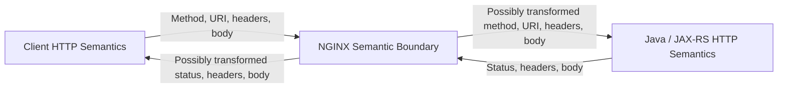
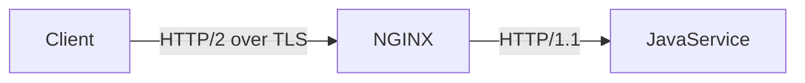

# Part 008 — HTTP Semantics at the NGINX Layer

## 1. Tujuan Part Ini

Part ini membahas bagaimana NGINX memengaruhi **HTTP semantics**.

Banyak engineer melihat NGINX sebagai routing layer saja. Dalam praktik production, NGINX juga dapat memengaruhi:

- method handling;
- status code;
- request/response headers;
- CORS preflight;
- caching;
- conditional request;
- compression negotiation;
- range request;
- chunked transfer;
- HTTP/1.1 vs HTTP/2 boundary;
- retry safety;
- API compatibility.

Untuk Java/JAX-RS backend, ini penting karena aplikasi biasanya didesain berdasarkan kontrak HTTP. Jika proxy mengubah kontrak itu secara diam-diam, bug bisa muncul di client, gateway, observability, atau application logic.

Target part ini adalah membuat kamu mampu membaca konfigurasi NGINX dan bertanya:

> Apakah proxy ini mempertahankan HTTP semantics yang diharapkan oleh API contract?

---

## 2. Mental Model: NGINX as HTTP Semantic Boundary

NGINX menerima HTTP request dari client, memprosesnya, lalu membuat request ke upstream.



Pertanyaan utama:

- Apakah method tetap sama?
- Apakah URI tetap sama atau direwrite?
- Apakah header penting dipertahankan?
- Apakah body dibuffer, dibatasi, atau distreaming?
- Apakah status code asli dari aplikasi diteruskan?
- Apakah NGINX menambah response header?
- Apakah CORS ditangani di proxy atau aplikasi?
- Apakah cache/compression mengubah behavior client?

---

## 3. HTTP Method Handling

HTTP method bukan sekadar string.

Method membawa semantic contract.

| Method | Semantics umum | Safe | Idempotent |
|---|---|---:|---:|
| GET | Retrieve representation | Yes | Yes |
| HEAD | Retrieve headers only | Yes | Yes |
| OPTIONS | Describe communication options / CORS preflight | Yes | Yes |
| PUT | Replace/create resource at target URI | No | Yes |
| DELETE | Delete target resource | No | Yes |
| POST | Submit/process command | No | Usually no |
| PATCH | Partial update | No | Not guaranteed |

NGINX biasanya meneruskan method apa adanya.

Namun method bisa terpengaruh oleh:

- `limit_except`;
- custom `return`;
- auth/CORS handling;
- rewrite/redirect behavior;
- retry behavior;
- upstream failover;
- gateway policy.

### Example: Method restriction

```nginx
location /api/ {
    limit_except GET POST PUT DELETE OPTIONS {
        deny all;
    }

    proxy_pass http://api_backend;
}
```

Ini bisa berguna untuk hardening, tetapi hati-hati jika backend memakai:

- `PATCH`;
- `HEAD`;
- WebDAV-like methods;
- custom enterprise methods;
- health check dengan `HEAD`.

---

## 4. Safe and Idempotent Methods Matter for Retries

Retries terlihat seperti reliability feature.

Tetapi retry pada method non-idempotent bisa membuat duplicate side effect.

Contoh risiko:

```text
POST /quotes/submit
```

Jika NGINX retry ke upstream lain setelah timeout, backend pertama mungkin sudah memproses request tetapi response terlambat. Backend kedua menerima request yang sama. Hasilnya:

- duplicate order;
- duplicate quote submission;
- duplicate payment authorization;
- inconsistent workflow state;
- audit trail membingungkan.

NGINX setting terkait:

```nginx
proxy_next_upstream error timeout http_502 http_503 http_504;
proxy_next_upstream_tries 2;
```

Senior-level question:

> Apakah retry hanya terjadi untuk safe/idempotent operation, atau semua request termasuk POST/PATCH?

Untuk enterprise workflow system, retry policy harus selaras dengan idempotency key, workflow state machine, dan application-level duplicate detection.

---

## 5. Status Code Propagation

NGINX bisa meneruskan status code dari upstream atau menghasilkan status sendiri.

### 5.1 Status dari Java/JAX-RS app

Contoh:

| Status | Source | Meaning |
|---|---|---|
| 200 | App | Success |
| 201 | App | Resource created |
| 202 | App | Accepted async processing |
| 400 | App | Invalid request according to API contract |
| 401 | App/Auth layer | Authentication required/failed |
| 403 | App/Auth layer | Authenticated but forbidden |
| 404 | App | Resource or route not found |
| 409 | App | Conflict / state transition invalid |
| 422 | App | Semantic validation error |
| 500 | App | Application error |

### 5.2 Status dari NGINX/proxy

| Status | Source | Common cause |
|---|---|---|
| 400 | NGINX | Invalid request line/header |
| 403 | NGINX | Deny rule, forbidden path |
| 404 | NGINX | No matching location/static file/default backend |
| 408 | NGINX | Client timeout |
| 413 | NGINX | Body too large |
| 414 | NGINX | URI too long |
| 429 | NGINX | Rate limit |
| 499 | NGINX log only | Client closed request |
| 502 | NGINX | Bad upstream response/protocol/connect error |
| 503 | NGINX | Upstream unavailable/overloaded |
| 504 | NGINX | Upstream timeout |

Jangan treat semua 4xx/5xx sebagai application behavior.

### 5.3 `proxy_intercept_errors`

NGINX dapat intercept upstream error:

```nginx
proxy_intercept_errors on;
error_page 500 502 503 504 /custom-error.html;
```

Ini bisa membuat client tidak melihat response asli dari Java/JAX-RS.

Good for:

- public static error page;
- masking internal error detail;
- maintenance response.

Risky for APIs:

- JSON error contract berubah menjadi HTML;
- client SDK gagal parse response;
- error code application hilang;
- observability kehilangan domain-level error.

Untuk API, intercept error harus sangat selektif.

---

## 6. Header Semantics

Header adalah bagian penting dari API contract.

NGINX bisa:

- forward header;
- drop header;
- override header;
- add header;
- normalize header;
- reject request karena header terlalu besar atau invalid.

### Common proxy headers

```nginx
proxy_set_header Host              $host;
proxy_set_header X-Real-IP         $remote_addr;
proxy_set_header X-Forwarded-For   $proxy_add_x_forwarded_for;
proxy_set_header X-Forwarded-Host  $host;
proxy_set_header X-Forwarded-Proto $scheme;
proxy_set_header X-Request-ID      $request_id;
```

### Common response headers from proxy

```nginx
add_header X-Content-Type-Options nosniff always;
add_header X-Frame-Options DENY always;
add_header Referrer-Policy no-referrer always;
```

Important detail:

```nginx
add_header X-Content-Type-Options nosniff;
```

Without `always`, some headers may not be added to error responses depending on context and NGINX behavior. Untuk security headers, biasakan eksplisit.

---

## 7. Hop-by-Hop vs End-to-End Headers

HTTP membedakan header yang berlaku hanya untuk satu connection hop dan header yang berlaku end-to-end.

### Hop-by-hop headers

Contoh:

- `Connection`;
- `Keep-Alive`;
- `Proxy-Authenticate`;
- `Proxy-Authorization`;
- `TE`;
- `Trailer`;
- `Transfer-Encoding`;
- `Upgrade`.

Hop-by-hop headers tidak boleh dianggap sebagai API contract end-to-end.

### End-to-end headers

Contoh:

- `Authorization`;
- `Content-Type`;
- `Accept`;
- `Cache-Control`;
- `ETag`;
- `If-None-Match`;
- `If-Modified-Since`;
- `X-Request-ID`;
- `traceparent`.

NGINX harus menjaga end-to-end headers yang dibutuhkan backend, kecuali ada alasan security/policy untuk menghapus atau mengganti.

---

## 8. Header Spoofing and Trust Boundary

Proxy-added headers bisa berbahaya jika client bebas mengirim header yang sama.

Contoh identity header:

```text
X-User-Id: admin
X-Tenant-Id: enterprise-a
X-Authenticated-User: alice
```

Jika backend mempercayai header ini, edge harus memastikan header dari client dibersihkan sebelum menambahkan nilai trusted.

Pattern:

```nginx
proxy_set_header X-Authenticated-User "";
proxy_set_header X-Authenticated-User $trusted_user;
```

Atau lebih baik, identity propagation dikelola API gateway/auth service dengan policy jelas.

Untuk Java/JAX-RS:

- jangan trust identity header kecuali source proxy trusted;
- dokumentasikan header mana yang authoritative;
- pastikan direct access ke service internal tidak bisa bypass proxy;
- gunakan network policy/security group untuk enforce path.

---

## 9. Cache-Control and API Correctness

NGINX bisa meneruskan atau mengubah caching semantics.

Important headers:

- `Cache-Control`;
- `Pragma`;
- `Expires`;
- `ETag`;
- `Last-Modified`;
- `Vary`;
- `Age`.

API response yang berisi data quote/order/customer biasanya sensitif. Default harus konservatif.

Example application response:

```http
Cache-Control: no-store
```

Jika NGINX atau cloud CDN mengabaikan ini, risiko besar:

- data tenant bocor;
- stale quote ditampilkan;
- compliance issue;
- user melihat state lama.

### When API caching may be safe

Caching bisa masuk akal untuk:

- public catalog metadata;
- static reference data;
- feature flag bootstrap dengan TTL pendek;
- read-only non-sensitive endpoint;
- health/status endpoint tertentu.

Tetapi cache key harus benar.

Jika cache key tidak memasukkan tenant/user/language/version, response bisa salah.

---

## 10. ETag and Conditional Requests

Conditional request umum:

```http
If-None-Match: "abc123"
```

Response:

```http
304 Not Modified
ETag: "abc123"
```

NGINX bisa meneruskan ini ke backend atau melayani dari cache jika proxy cache aktif.

Untuk Java/JAX-RS:

- ETag bisa dipakai untuk optimistic concurrency;
- `If-Match` bisa mencegah lost update;
- `If-None-Match` bisa mengurangi bandwidth;
- NGINX tidak boleh menghilangkan conditional headers tanpa alasan.

Risiko:

- weak/strong ETag semantics kacau;
- compressed vs uncompressed representation punya ETag berbeda;
- proxy cache mengembalikan 304 untuk representation yang salah;
- multi-tenant cache key tidak aman.

---

## 11. Content Negotiation

JAX-RS sering memakai content negotiation berdasarkan:

- `Accept`;
- `Content-Type`;
- `Accept-Language`;
- `Accept-Encoding`;
- path extension jika legacy;
- query parameter jika custom.

Contoh:

```http
Accept: application/json
Content-Type: application/json
```

NGINX biasanya meneruskan header ini.

Namun proxy config bisa memengaruhi:

- compression negotiation;
- default content type untuk static error page;
- CORS preflight;
- response transformation;
- cache key `Vary` behavior.

Failure mode:

- client expects JSON but receives HTML error page;
- `Content-Type` hilang;
- `Accept-Encoding` menyebabkan compressed response yang tidak diharapkan oleh debugging tool;
- `Vary` tidak dihormati dalam cache.

---

## 12. Compression Negotiation

Client mengirim:

```http
Accept-Encoding: gzip, br
```

NGINX bisa compress response:

```nginx
gzip on;
gzip_types application/json text/plain text/css application/javascript;
```

Trade-off:

| Benefit | Cost |
|---|---|
| Bandwidth turun | CPU naik |
| Latency client bisa turun | Debugging raw body lebih sulit |
| Good for large text responses | Tidak berguna untuk already-compressed binary |

Caution untuk API:

- jangan compress data yang sangat kecil secara agresif;
- hati-hati dengan sensitive data dan compression side-channel pada threat model tertentu;
- pastikan observability membedakan upstream response size dan client response size jika diperlukan;
- jangan double-compress jika upstream sudah compress.

---

## 13. CORS Preflight and OPTIONS Handling

Browser mengirim preflight untuk cross-origin request tertentu:

```http
OPTIONS /api/quotes HTTP/1.1
Origin: https://app.example.com
Access-Control-Request-Method: POST
Access-Control-Request-Headers: authorization, content-type
```

CORS bisa ditangani oleh:

- Java/JAX-RS application;
- NGINX;
- API gateway;
- cloud edge;
- combination.

Masalah muncul jika dua layer sama-sama menambahkan header CORS secara tidak konsisten.

### Proxy-handled preflight example

```nginx
if ($request_method = OPTIONS) {
    add_header Access-Control-Allow-Origin https://app.example.com always;
    add_header Access-Control-Allow-Methods "GET, POST, PUT, DELETE, OPTIONS" always;
    add_header Access-Control-Allow-Headers "Authorization, Content-Type, X-Request-ID" always;
    add_header Access-Control-Max-Age 600 always;
    return 204;
}
```

Caution:

- `if` di NGINX punya pitfall tergantung penggunaan;
- wildcard origin dengan credentials berbahaya;
- preflight bypassing auth bisa benar, tetapi actual request tetap harus diauth;
- CORS adalah browser security mechanism, bukan service-to-service auth.

For enterprise APIs, prefer one clear owner for CORS policy.

---

## 14. Range Request and Partial Content

Range request:

```http
Range: bytes=0-1023
```

Response:

```http
206 Partial Content
Content-Range: bytes 0-1023/4096
```

Relevant untuk:

- file download;
- binary artifact;
- report export;
- media-like content;
- resumable download.

NGINX can serve or proxy range requests depending on upstream and buffering behavior.

Untuk Java/JAX-RS endpoint yang melayani file besar:

- pastikan `Range` diteruskan jika backend support partial content;
- pastikan response `206` tidak diubah menjadi `200`;
- pastikan `Content-Length`/`Content-Range` benar;
- pastikan buffering tidak menghancurkan streaming behavior;
- pastikan auth tetap dicek untuk setiap range request.

---

## 15. Chunked Transfer Encoding

HTTP/1.1 bisa memakai chunked transfer ketika response length tidak diketahui di awal.

NGINX bisa menerima chunked request/response dan meneruskannya dengan behavior tertentu tergantung buffering dan upstream protocol.

Relevance:

- streaming response;
- SSE;
- large response generated gradually;
- proxy buffering;
- clients expecting progressive delivery.

Failure mode:

- backend streaming tetapi NGINX buffer sampai penuh;
- client tidak menerima event secara real-time;
- timeout terjadi karena tidak ada flush visible;
- debugging tool misleading karena body muncul sekaligus.

Untuk streaming endpoint, cek:

```nginx
proxy_buffering off;
```

Namun jangan matikan buffering global tanpa memahami performance impact.

---

## 16. HTTP/1.1 vs HTTP/2 Boundary

NGINX dapat menerima HTTP/2 dari client lalu berbicara HTTP/1.1 ke upstream.



Ini umum dan valid.

HTTP/2 benefit client side:

- multiplexing;
- header compression;
- fewer TCP connections;
- better behavior for many concurrent requests.

But upstream may still be HTTP/1.1.

Implications:

- backend Java/JAX-RS tidak otomatis menerima HTTP/2;
- request concurrency pattern berubah di NGINX;
- header casing/normalization berbeda;
- WebSocket/gRPC perlu konfigurasi protocol khusus;
- load balancer idle timeout tetap penting.

---

## 17. HTTP/3 Considerations

HTTP/3 memakai QUIC di atas UDP.

Dalam enterprise environment, HTTP/3 sering terminate di cloud edge/CDN/load balancer, bukan selalu di NGINX yang dekat aplikasi.

Pertanyaan yang perlu ditanyakan:

- Apakah HTTP/3 digunakan public edge?
- Apakah HTTP/3 terminate sebelum NGINX?
- Apakah NGINX menerima HTTP/1.1/HTTP/2 dari upstream edge?
- Apakah observability mencatat HTTP version public atau hanya internal?
- Apakah firewall/UDP policy mengizinkan QUIC?

Untuk Java/JAX-RS service, HTTP/3 biasanya tidak terlihat langsung jika sudah terminate di edge.

---

## 18. API Compatibility Risk Introduced by Proxy

Proxy change bisa menjadi breaking change walaupun aplikasi tidak berubah.

Examples:

| Proxy change | Possible API break |
|---|---|
| Add CORS at NGINX | Duplicate/inconsistent CORS headers |
| Enable error interception | JSON error berubah menjadi HTML |
| Change body limit | Upload yang dulu berhasil menjadi 413 |
| Change timeout | Long-running request menjadi 504 |
| Enable retry | Duplicate side effect untuk POST |
| Change Host forwarding | Generated URI/tenant routing salah |
| Enable cache | Stale or cross-tenant data |
| Enable compression | Client/proxy compatibility issue |
| Remove Authorization header | Backend auth gagal |
| Add method restriction | PATCH/OPTIONS/HEAD gagal |

Senior engineer harus memperlakukan proxy config sebagai bagian dari API contract.

---

## 19. Kubernetes Ingress Semantics

Dalam Kubernetes, HTTP semantics dapat diubah melalui annotation/ConfigMap.

Examples:

```yaml
metadata:
  annotations:
    nginx.ingress.kubernetes.io/proxy-body-size: "20m"
    nginx.ingress.kubernetes.io/proxy-read-timeout: "60"
    nginx.ingress.kubernetes.io/enable-cors: "true"
    nginx.ingress.kubernetes.io/cors-allow-origin: "https://app.example.com"
    nginx.ingress.kubernetes.io/proxy-buffering: "off"
```

Risiko:

- annotation per service melanggar platform standard;
- CORS policy tersebar di banyak Ingress;
- timeout antar service tidak konsisten;
- body limit berubah tanpa API review;
- buffering dimatikan untuk endpoint yang tidak butuh streaming;
- snippets menambahkan behavior yang sulit diaudit.

Ingress PR harus direview seperti application behavior change.

---

## 20. AWS, Azure, and On-Prem Considerations

### AWS

HTTP semantics bisa dipengaruhi oleh:

- CloudFront;
- API Gateway;
- ALB;
- NLB with Proxy Protocol;
- AWS WAF;
- NGINX Ingress;
- service mesh;
- application.

Cek khusus:

- header yang ditambah ALB;
- TLS termination point;
- ALB idle timeout;
- WAF block status;
- X-Forwarded-* chain;
- response header policies.

### Azure

HTTP semantics bisa dipengaruhi oleh:

- Azure Front Door;
- Application Gateway;
- Azure API Management;
- Azure WAF;
- Azure Load Balancer;
- NGINX Ingress;
- application.

Cek khusus:

- rewrite/header policy di Front Door/App Gateway;
- WAF rule blocking;
- CORS policy di APIM;
- TLS termination;
- X-Forwarded-* headers;
- request size limit.

### On-prem/hybrid

HTTP semantics bisa dipengaruhi oleh:

- F5/HAProxy/enterprise LB;
- corporate proxy;
- TLS inspection;
- DMZ reverse proxy;
- WAF appliance;
- NGINX;
- internal API gateway.

Cek khusus:

- header injection/removal;
- TLS re-encryption;
- proxy chaining;
- maximum URI/header/body size;
- non-standard error pages;
- compression/caching appliances.

---

## 21. Observability Concerns

Untuk memahami HTTP semantics di NGINX, log harus cukup kaya.

Access log sebaiknya bisa menjawab:

- method apa?
- URI apa?
- status apa?
- request time berapa?
- upstream status apa?
- upstream response time berapa?
- upstream address mana?
- request ID apa?
- Host apa?
- scheme/proto apa?
- body size berapa?
- user agent apa?
- client IP apa?
- HTTP version apa?

Example log format concept:

```nginx
log_format api_json escape=json
  '{'
  '"time":"$time_iso8601",'
  '"request_id":"$request_id",'
  '"remote_addr":"$remote_addr",'
  '"host":"$host",'
  '"method":"$request_method",'
  '"uri":"$request_uri",'
  '"status":$status,'
  '"upstream_status":"$upstream_status",'
  '"request_time":$request_time,'
  '"upstream_response_time":"$upstream_response_time",'
  '"http_version":"$server_protocol"'
  '}';
```

Do not log sensitive headers/body by default.

---

## 22. Debugging Playbook

### 22.1 Check method and headers

```bash
curl -vk -X OPTIONS https://api.example.com/quote-order/v1/quotes \
  -H 'Origin: https://app.example.com' \
  -H 'Access-Control-Request-Method: POST' \
  -H 'Access-Control-Request-Headers: authorization,content-type'
```

Check:

- status 204/200/403/404;
- CORS response headers;
- duplicate headers;
- whether request reaches backend.

### 22.2 Check error response content type

```bash
curl -vk https://api.example.com/quote-order/v1/nonexistent \
  -H 'Accept: application/json'
```

Check:

- does response stay JSON?
- is status from NGINX or app?
- is error body API-compatible?

### 22.3 Check redirect semantics

```bash
curl -vk -L https://api.example.com/quote-order/v1/login
```

Check:

- `Location` header;
- scheme;
- host;
- path prefix;
- HTTP to HTTPS downgrade.

### 22.4 Check body limit

```bash
curl -vk -X POST https://api.example.com/quote-order/v1/upload \
  --data-binary @large-file.bin \
  -H 'Content-Type: application/octet-stream'
```

Check:

- 413 from NGINX vs app;
- access log body size;
- app log presence.

### 22.5 Check compression

```bash
curl -vk https://api.example.com/quote-order/v1/catalog \
  -H 'Accept-Encoding: gzip' \
  --compressed
```

Check:

- `Content-Encoding`;
- response size;
- cache headers;
- `Vary: Accept-Encoding`.

---

## 23. PR Review Checklist

For any NGINX/Ingress change that touches HTTP behavior, ask:

- Are allowed HTTP methods changed?
- Is retry behavior safe for non-idempotent requests?
- Are status codes from backend preserved?
- Is `proxy_intercept_errors` enabled?
- Are API error responses still JSON-compatible?
- Are required headers preserved?
- Are hop-by-hop headers handled correctly?
- Are identity headers protected from spoofing?
- Is CORS owned by one layer only?
- Are Cache-Control and ETag semantics preserved?
- Is proxy cache safe for tenant/user-sensitive data?
- Is compression appropriate for payload type?
- Are Range requests needed and supported?
- Are streaming/chunked responses buffered accidentally?
- Does HTTP/2 termination change backend assumptions?
- Are AWS/Azure/on-prem edge policies consistent with NGINX behavior?
- Is observability sufficient to distinguish NGINX-generated status from app-generated status?

---

## 24. Internal Verification Checklist

Untuk konteks internal CSG/team, verifikasi:

- Layer mana yang bertanggung jawab atas CORS?
- Layer mana yang bertanggung jawab atas auth headers?
- Apakah NGINX/Ingress melakukan error interception?
- Apakah API error contract harus selalu JSON?
- Apakah retry di NGINX aktif?
- Apakah POST/PATCH punya idempotency key atau duplicate detection?
- Apakah response API pernah dicache di NGINX, cloud edge, atau API gateway?
- Apakah compression aktif untuk JSON API?
- Apakah `PATCH`, `OPTIONS`, dan `HEAD` didukung jika dibutuhkan?
- Apakah request/response header size limit terdokumentasi?
- Apakah access log mencatat method, status, upstream status, request time, upstream time, host, request ID, dan HTTP version?
- Apakah ada WAF/cloud LB yang mengubah status/header sebelum request sampai NGINX?

---

## 25. Key Takeaways

NGINX bukan hanya routing layer.

NGINX dapat memengaruhi HTTP semantics yang dilihat oleh client dan Java/JAX-RS backend:

- method;
- retry safety;
- status code;
- error body;
- headers;
- CORS;
- caching;
- compression;
- conditional request;
- range request;
- chunked transfer;
- HTTP version.

Proxy configuration harus direview sebagai bagian dari API contract.

Rule paling penting:

> Jangan mengubah HTTP semantics di NGINX kecuali perubahan itu disengaja, terdokumentasi, observable, dan kompatibel dengan kontrak Java/JAX-RS API.
