# Part 009 — TLS, HTTPS, SNI, ALPN, and Certificate Lifecycle

## 1. Tujuan Part Ini

Part ini membahas **TLS dan HTTPS di NGINX** dari sudut pandang senior backend engineer.

Bukan sekadar:

```text
ssl_certificate /path/cert.pem;
ssl_certificate_key /path/key.pem;
```

Yang lebih penting adalah memahami:

- di mana TLS terminate;
- apakah traffic ke upstream tetap terenkripsi;
- bagaimana certificate dipilih;
- bagaimana SNI bekerja;
- bagaimana ALPN memengaruhi HTTP/2;
- bagaimana certificate chain divalidasi client;
- bagaimana certificate rotation dilakukan tanpa outage;
- bagaimana TLS failure terlihat di NGINX, cloud load balancer, browser, API client, dan Java/JAX-RS service;
- bagaimana TLS setting memengaruhi security, latency, observability, dan operability.

Di production enterprise system, TLS bukan hanya security feature. TLS adalah **routing boundary**, **identity signal**, **compatibility layer**, dan **operational risk surface**.

---

## 2. Mental Model: TLS Is a Boundary, Not Just Encryption

TLS menjawab beberapa pertanyaan penting:

1. **Confidentiality**  
   Apakah isi request/response tidak bisa dibaca pihak lain?

2. **Integrity**  
   Apakah payload tidak diubah di tengah jalan?

3. **Server identity**  
   Apakah client yakin sedang berbicara dengan server yang benar?

4. **Optional client identity**  
   Jika memakai mTLS, apakah server yakin dengan identitas client?

5. **Protocol negotiation**  
   Apakah client dan server memakai HTTP/1.1, HTTP/2, atau protokol lain?

Dalam arsitektur dengan NGINX, TLS bisa berhenti di beberapa tempat.

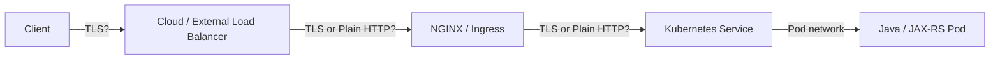

Pertanyaan senior engineer:

> Di hop mana TLS berakhir, dan apakah boundary itu sesuai dengan trust model sistem?

---

## 3. Three Common TLS Patterns

Ada tiga pola utama yang perlu dibedakan.

---

### 3.1 TLS Termination

TLS berakhir di NGINX. Setelah itu NGINX berbicara ke upstream memakai HTTP biasa.

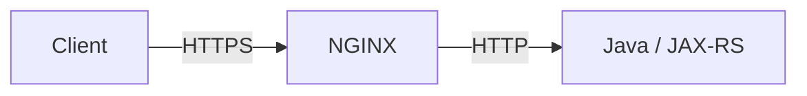

Contoh:

```nginx
server {
    listen 443 ssl http2;
    server_name api.example.com;

    ssl_certificate     /etc/nginx/tls/tls.crt;
    ssl_certificate_key /etc/nginx/tls/tls.key;

    location /api/ {
        proxy_pass http://java_backend;
        proxy_set_header Host $host;
        proxy_set_header X-Forwarded-Proto https;
        proxy_set_header X-Forwarded-Host $host;
        proxy_set_header X-Forwarded-For $proxy_add_x_forwarded_for;
    }
}
```

Kelebihan:

- konfigurasi backend lebih sederhana;
- certificate cukup dikelola di edge/ingress;
- NGINX bisa inspect HTTP request;
- routing berbasis path/header bisa dilakukan;
- observability lebih mudah.

Risiko:

- traffic dari NGINX ke backend tidak terenkripsi;
- trust terhadap network internal harus jelas;
- backend harus percaya header seperti `X-Forwarded-Proto` hanya dari trusted proxy;
- compliance tertentu mungkin mewajibkan encryption in transit end-to-end.

Dampak ke Java/JAX-RS:

- aplikasi melihat request sebagai HTTP jika tidak proxy-aware;
- URL generation bisa salah menjadi `http://` bukan `https://`;
- redirect bisa salah scheme;
- security filter bisa mengira request tidak secure;
- absolute link di response bisa salah.

---

### 3.2 TLS Passthrough

NGINX meneruskan TCP/TLS ke backend tanpa terminate HTTPS.

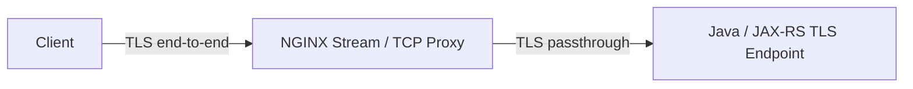

Karakteristik:

- NGINX tidak membaca HTTP layer;
- path-based routing tidak tersedia pada HTTP layer;
- routing biasanya berbasis SNI atau TCP port;
- certificate dikelola di backend;
- backend melakukan TLS handshake langsung dengan client.

Contoh konseptual dengan stream context:

```nginx
stream {
    upstream java_tls_backend {
        server java-service.default.svc.cluster.local:8443;
    }

    server {
        listen 443;
        proxy_pass java_tls_backend;
    }
}
```

Kapan dipakai:

- regulatory/compliance mengharuskan TLS end-to-end sampai application;
- backend butuh client certificate langsung;
- NGINX tidak boleh inspect payload;
- protokol bukan HTTP biasa.

Trade-off:

- observability HTTP di NGINX hilang;
- WAF/rate limit berbasis HTTP tidak bisa bekerja;
- path-based routing tidak tersedia;
- debugging lebih sulit;
- certificate lifecycle tersebar ke backend.

---

### 3.3 TLS Re-encryption

TLS terminate di NGINX, lalu NGINX membuat koneksi TLS baru ke upstream.

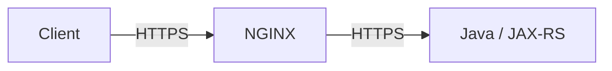

Contoh:

```nginx
upstream java_https_backend {
    server java-service.default.svc.cluster.local:8443;
    keepalive 64;
}

server {
    listen 443 ssl http2;
    server_name api.example.com;

    ssl_certificate     /etc/nginx/tls/public.crt;
    ssl_certificate_key /etc/nginx/tls/public.key;

    location /api/ {
        proxy_pass https://java_https_backend;

        proxy_ssl_server_name on;
        proxy_ssl_name java-service.default.svc.cluster.local;
        proxy_ssl_trusted_certificate /etc/nginx/ca/internal-ca.crt;
        proxy_ssl_verify on;
        proxy_ssl_verify_depth 2;

        proxy_set_header Host $host;
        proxy_set_header X-Forwarded-Proto https;
        proxy_set_header X-Forwarded-For $proxy_add_x_forwarded_for;
    }
}
```

Kelebihan:

- encryption in transit tetap ada setelah NGINX;
- NGINX tetap bisa inspect HTTP;
- certificate publik dan certificate internal bisa dipisah;
- cocok untuk zero-trust-ish internal network.

Risiko:

- lebih banyak certificate lifecycle;
- upstream TLS verification bisa salah konfigurasi;
- latency handshake tambahan jika keepalive buruk;
- debugging lebih kompleks;
- Java service harus expose HTTPS port.

---

## 4. TLS Handshake Lifecycle

Saat client membuka HTTPS connection ke NGINX, flow sederhananya:

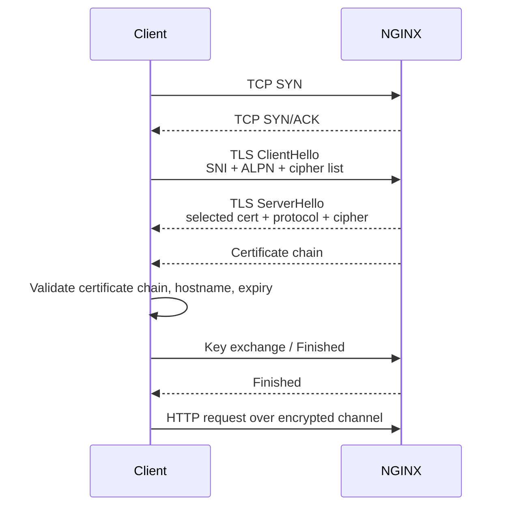

Yang penting untuk debugging:

- SNI dikirim di `ClientHello`;
- ALPN dipakai untuk memilih HTTP/2 atau HTTP/1.1;
- certificate dipilih sebelum HTTP request terlihat;
- Host header muncul setelah TLS selesai;
- certificate mismatch bisa terjadi bahkan sebelum NGINX membaca URI;
- TLS error sering tidak muncul sebagai HTTP status code.

---

## 5. SNI: Server Name Indication

SNI memungkinkan satu IP/port melayani banyak hostname TLS.

Tanpa SNI, server sulit memilih certificate yang benar sebelum HTTP request didekripsi.

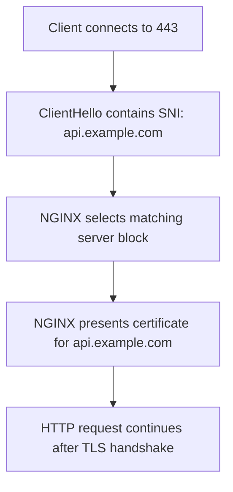

Contoh:

```nginx
server {
    listen 443 ssl http2;
    server_name api.example.com;
    ssl_certificate     /etc/nginx/tls/api.crt;
    ssl_certificate_key /etc/nginx/tls/api.key;
}

server {
    listen 443 ssl http2;
    server_name admin.example.com;
    ssl_certificate     /etc/nginx/tls/admin.crt;
    ssl_certificate_key /etc/nginx/tls/admin.key;
}
```

Failure mode umum:

- DNS mengarah ke NGINX benar, tetapi SNI hostname tidak cocok;
- client lama tidak mengirim SNI;
- default certificate yang dikirim salah;
- wildcard certificate tidak mencakup hostname tertentu;
- SAN certificate tidak memuat hostname;
- Ingress host dan TLS secret mismatch;
- cloud load balancer terminate TLS sebelum NGINX, sehingga SNI di NGINX tidak relevan untuk public cert.

Debug dengan:

```bash
openssl s_client -connect api.example.com:443 -servername api.example.com -showcerts
```

Bandingkan dengan tanpa SNI:

```bash
openssl s_client -connect api.example.com:443 -showcerts
```

Jika hasil certificate berbeda, berarti SNI selection berperan.

---

## 6. ALPN and HTTP/2 Negotiation

ALPN adalah mekanisme TLS untuk memilih application protocol.

Contoh hasil negosiasi:

```text
ALPN protocol: h2
```

atau:

```text
ALPN protocol: http/1.1
```

Di NGINX:

```nginx
server {
    listen 443 ssl http2;
    server_name api.example.com;
}
```

Catatan penting:

- `http2` di listen socket mengaktifkan HTTP/2 client-to-NGINX;
- NGINX bisa menerima HTTP/2 dari client tetapi berbicara HTTP/1.1 ke upstream;
- Java/JAX-RS backend belum tentu menerima HTTP/2 walaupun client memakai HTTP/2;
- gRPC biasanya butuh HTTP/2 sampai backend atau konfigurasi khusus `grpc_pass`;
- HTTP/2 multiplexing bisa mengubah karakteristik connection pressure.

Mental model:

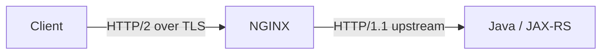

Ini normal untuk REST API.

Namun untuk gRPC, jangan asumsikan sama.

---

## 7. Certificate Chain

Certificate bukan hanya satu file.

Client biasanya perlu chain:

```text
Leaf certificate
  -> Intermediate CA
      -> Root CA trusted by client
```

NGINX `ssl_certificate` sebaiknya berisi full chain, bukan hanya leaf certificate.

Contoh struktur file:

```text
-----BEGIN CERTIFICATE-----
leaf certificate
-----END CERTIFICATE-----
-----BEGIN CERTIFICATE-----
intermediate certificate
-----END CERTIFICATE-----
```

Failure mode:

- browser berhasil karena cache intermediate, tetapi Java client gagal;
- curl gagal dengan `unable to get local issuer certificate`;
- mobile client gagal karena chain tidak lengkap;
- internal service gagal karena internal CA tidak trusted;
- certificate chain salah urutan.

Debug:

```bash
openssl s_client -connect api.example.com:443 -servername api.example.com -showcerts
```

Cek:

- subject;
- issuer;
- validity;
- SAN;
- chain length;
- verify return code.

---

## 8. Certificate Identity: CN, SAN, Wildcard, and Hostname Matching

Modern client memvalidasi hostname terhadap **Subject Alternative Name** atau SAN.

Contoh SAN:

```text
DNS:api.example.com
DNS:*.internal.example.com
```

Wildcard rule perlu hati-hati:

```text
*.example.com        matches api.example.com
*.example.com        does not match a.b.example.com
*.internal.example.com matches quote.internal.example.com
```

Common mistake:

| Hostname | Certificate SAN | Result |
|---|---|---|
| `api.example.com` | `api.example.com` | valid |
| `quote.api.example.com` | `*.example.com` | invalid |
| `service.default.svc` | `service.default.svc.cluster.local` | often invalid |
| `api.internal` | `*.internal.example.com` | invalid |

Dampak ke NGINX upstream TLS:

Jika NGINX proxy ke upstream HTTPS, `proxy_ssl_name` harus cocok dengan certificate upstream.

```nginx
proxy_ssl_server_name on;
proxy_ssl_name java-service.default.svc.cluster.local;
proxy_ssl_verify on;
```

Jika tidak, NGINX bisa gagal verify upstream certificate atau malah tidak memverifikasi sama sekali jika setting lemah.

---

## 9. TLS Protocol Version and Cipher Suite

TLS configuration adalah security policy.

Contoh modern baseline:

```nginx
ssl_protocols TLSv1.2 TLSv1.3;
ssl_prefer_server_ciphers off;
```

Hindari protokol lama:

```nginx
# Avoid in modern production unless legacy exception is formally approved
ssl_protocols TLSv1 TLSv1.1;
```

Trade-off:

- makin ketat TLS policy, makin baik security posture;
- tetapi client lama bisa putus;
- enterprise client atau partner integration kadang masih legacy;
- exception harus terdokumentasi dan memiliki expiry plan.

Checklist review:

- Apakah TLS 1.0/1.1 dimatikan?
- Apakah TLS 1.2/1.3 aktif?
- Apakah cipher weak dinonaktifkan?
- Apakah ada partner/client legacy yang terdampak?
- Apakah exception disetujui security team?
- Apakah ada dashboard TLS handshake failure?

---

## 10. HSTS: HTTP Strict Transport Security

HSTS memberi tahu browser untuk selalu memakai HTTPS untuk domain tertentu.

Contoh:

```nginx
add_header Strict-Transport-Security "max-age=31536000; includeSubDomains" always;
```

HSTS berguna untuk:

- mencegah downgrade ke HTTP;
- mengurangi risiko SSL stripping;
- memastikan browser tidak mencoba plain HTTP.

Risiko:

- `includeSubDomains` bisa memaksa semua subdomain menggunakan HTTPS;
- jika ada subdomain internal/legacy belum HTTPS, bisa rusak;
- preload list sulit dibalik cepat;
- salah konfigurasi certificate bisa membuat domain sulit diakses browser.

Production stance:

> Jangan menambahkan HSTS global tanpa verifikasi domain ownership dan subdomain readiness.

---

## 11. OCSP Stapling

OCSP stapling memungkinkan server menyertakan status revocation certificate dalam TLS handshake.

Contoh:

```nginx
ssl_stapling on;
ssl_stapling_verify on;
resolver 10.96.0.10 valid=300s;
```

Pertimbangan:

- butuh resolver yang bisa menjangkau OCSP responder;
- di environment restricted/air-gapped, OCSP bisa gagal;
- monitoring harus membedakan hard failure vs soft failure;
- tidak semua internal CA memakai OCSP dengan pola yang sama.

Untuk banyak Kubernetes/internal deployment, OCSP stapling perlu diverifikasi dengan platform/security team sebelum dianggap mandatory.

---

## 12. NGINX TLS Configuration Example

Contoh baseline konseptual:

```nginx
server {
    listen 443 ssl http2;
    server_name api.example.com;

    ssl_certificate     /etc/nginx/tls/tls.crt;
    ssl_certificate_key /etc/nginx/tls/tls.key;

    ssl_protocols TLSv1.2 TLSv1.3;
    ssl_session_cache shared:SSL:50m;
    ssl_session_timeout 1d;
    ssl_session_tickets off;

    add_header Strict-Transport-Security "max-age=31536000" always;

    location /api/ {
        proxy_pass http://java_backend;
        proxy_set_header Host $host;
        proxy_set_header X-Forwarded-Proto https;
        proxy_set_header X-Forwarded-For $proxy_add_x_forwarded_for;
    }
}
```

Catatan:

- cipher suite policy biasanya mengikuti security baseline organisasi;
- HSTS `includeSubDomains` jangan asal ditambahkan;
- `ssl_session_tickets` punya implikasi key rotation;
- certificate path di Kubernetes biasanya berasal dari mounted Secret;
- pada ingress controller, config tidak selalu ditulis manual seperti ini.

---

## 13. Kubernetes Ingress TLS

Ingress TLS biasanya didefinisikan seperti ini:

```yaml
apiVersion: networking.k8s.io/v1
kind: Ingress
metadata:
  name: quote-api
  namespace: quote
spec:
  ingressClassName: nginx
  tls:
    - hosts:
        - quote-api.example.com
      secretName: quote-api-tls
  rules:
    - host: quote-api.example.com
      http:
        paths:
          - path: /api
            pathType: Prefix
            backend:
              service:
                name: quote-api-service
                port:
                  number: 8080
```

Mental model:

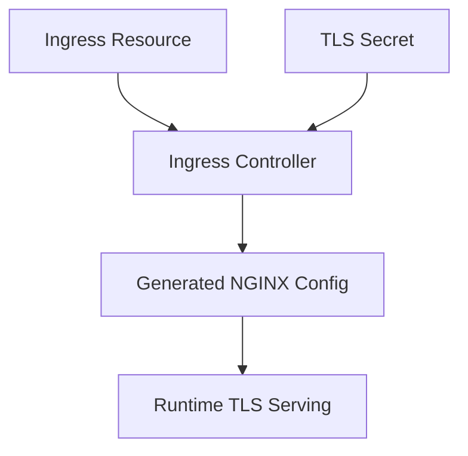

Failure mode umum:

- `secretName` salah;
- Secret ada di namespace berbeda;
- certificate SAN tidak match host;
- IngressClass salah;
- controller tidak watch namespace tersebut;
- default certificate yang tersaji;
- cert-manager belum menerbitkan certificate;
- reload controller gagal;
- cloud load balancer terminate TLS lebih dulu, sehingga TLS Secret ingress tidak dipakai untuk public TLS.

Debug:

```bash
kubectl get ingress -n quote
kubectl describe ingress quote-api -n quote
kubectl get secret quote-api-tls -n quote
kubectl describe certificate -n quote
kubectl logs -n ingress-nginx deploy/ingress-nginx-controller
```

---

## 14. cert-manager Certificate Lifecycle

Jika memakai cert-manager, lifecycle umumnya:

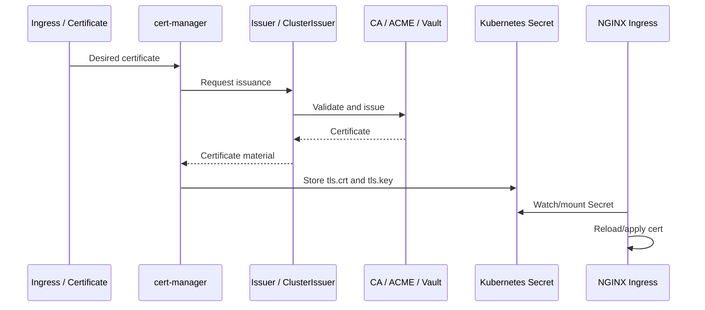

Yang perlu dipahami backend engineer:

- certificate bukan dibuat oleh aplikasi;
- Secret berisi material sensitif;
- renewal terjadi sebelum expiry;
- gagal renewal bisa menjadi incident besar;
- namespace dan RBAC penting;
- certificate readiness harus dimonitor;
- cluster issuer berbeda antara public ACME dan internal CA.

---

## 15. AWS/EKS TLS Patterns

Di AWS/EKS, beberapa pola umum:

### Pattern A: TLS terminates at ALB

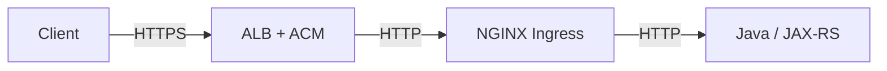

Konsekuensi:

- public certificate di ACM;
- NGINX tidak melihat TLS client handshake public;
- NGINX tetap perlu menerima `X-Forwarded-Proto` dari ALB;
- HSTS/security headers bisa ditambahkan di ALB, NGINX, atau aplikasi tergantung governance;
- jika NGINX juga redirect HTTP ke HTTPS, pastikan tidak loop.

### Pattern B: TLS terminates at NGINX behind NLB

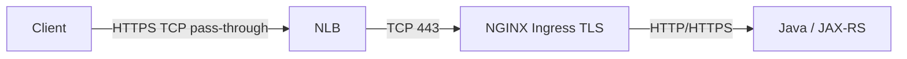

Konsekuensi:

- certificate di Kubernetes Secret atau cert-manager;
- NGINX melihat SNI/ALPN;
- NLB bisa preserve source IP depending configuration;
- proxy protocol mungkin digunakan;
- debugging TLS dilakukan di NGINX layer.

### Pattern C: TLS re-encryption to backend

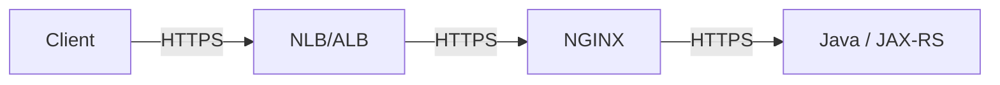

Konsekuensi:

- banyak certificate boundary;
- trust chain harus jelas;
- latency dan troubleshooting lebih kompleks.

Internal verification penting: jangan asumsi pola yang dipakai. Cek actual load balancer, listener, target group, Kubernetes Service, dan Ingress TLS.

---

## 16. Azure/AKS TLS Patterns

Di Azure/AKS, pola bisa melibatkan:

- Azure Front Door;
- Azure Application Gateway;
- Azure Load Balancer;
- Application Gateway Ingress Controller;
- NGINX Ingress Controller;
- Azure Key Vault;
- Kubernetes TLS Secret;
- cert-manager.

Contoh pattern:

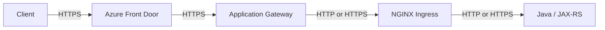

Pertanyaan penting:

- TLS terminate di Front Door, Application Gateway, NGINX, atau app?
- Certificate disimpan di Azure Key Vault, App Gateway, atau Kubernetes Secret?
- Apakah backend protocol ke NGINX HTTP atau HTTPS?
- Apakah health probe memakai HTTPS?
- Apakah Host header dipertahankan?
- Apakah redirect HTTPS dilakukan di lebih dari satu layer?

Failure mode:

- Application Gateway probe gagal karena certificate internal tidak trusted;
- NGINX redirect menyebabkan loop;
- Front Door memakai hostname berbeda dari backend Host;
- certificate di Key Vault belum sync;
- NSG atau Private Link memblokir probe;
- source IP berubah dan audit log membingungkan.

---

## 17. On-Prem and Hybrid TLS Patterns

On-prem enterprise sering punya chain lebih panjang:

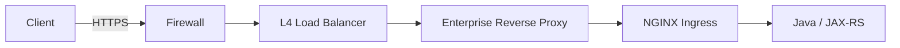

Kemungkinan TLS pattern:

- TLS terminate di enterprise reverse proxy;
- TLS re-encrypt ke NGINX;
- TLS terminate di NGINX;
- TLS re-encrypt ke app;
- TLS inspection oleh corporate proxy;
- internal CA digunakan untuk semua internal hop.

Risiko operasional:

- certificate rotation melibatkan banyak team;
- internal CA trust store berbeda antara client, proxy, dan Java runtime;
- TLS inspection memecah end-to-end assumptions;
- DNS split-horizon menyebabkan hostname certificate mismatch;
- network team dan platform team punya ownership berbeda.

---

## 18. Java/JAX-RS Impact

TLS termination di proxy berdampak langsung ke aplikasi.

### 18.1 Scheme Detection

Jika NGINX terminate HTTPS lalu proxy ke Java via HTTP, backend bisa melihat request sebagai plain HTTP.

Solusi umum:

```nginx
proxy_set_header X-Forwarded-Proto https;
proxy_set_header X-Forwarded-Port 443;
proxy_set_header Forwarded "proto=https;host=$host";
```

Tapi aplikasi harus dikonfigurasi untuk mempercayai header tersebut hanya dari trusted proxy.

Risiko jika tidak:

- redirect menjadi `http://`;
- generated link salah;
- cookie `Secure` tidak diset;
- security middleware mengira request insecure;
- OpenAPI/server URL salah;
- callback URL ke partner salah.

---

### 18.2 Secure Cookie Behavior

Jika aplikasi membuat cookie session/token:

- `Secure` harus true untuk HTTPS;
- `SameSite` harus sesuai use case;
- domain/path cookie harus sesuai public hostname/path;
- proxy path rewrite bisa membuat cookie path salah.

Checklist:

- Apakah cookie muncul dengan `Secure`?
- Apakah redirect login memakai HTTPS?
- Apakah backend tahu original scheme?
- Apakah ada double TLS termination yang mengubah header?

---

### 18.3 Client IP and Audit

TLS layer sering bersamaan dengan load balancer/proxy layer.

Backend mungkin melihat IP NGINX, bukan client.

Header yang umum:

```nginx
proxy_set_header X-Forwarded-For $proxy_add_x_forwarded_for;
proxy_set_header X-Real-IP $remote_addr;
```

Jika ada cloud LB di depan NGINX, chain bisa seperti:

```text
client-ip, cloud-lb-ip, nginx-ip
```

Audit system harus tahu IP mana yang dipercaya.

---

## 19. Redirect Loops

Salah satu failure paling umum di HTTPS deployment adalah redirect loop.

Contoh:

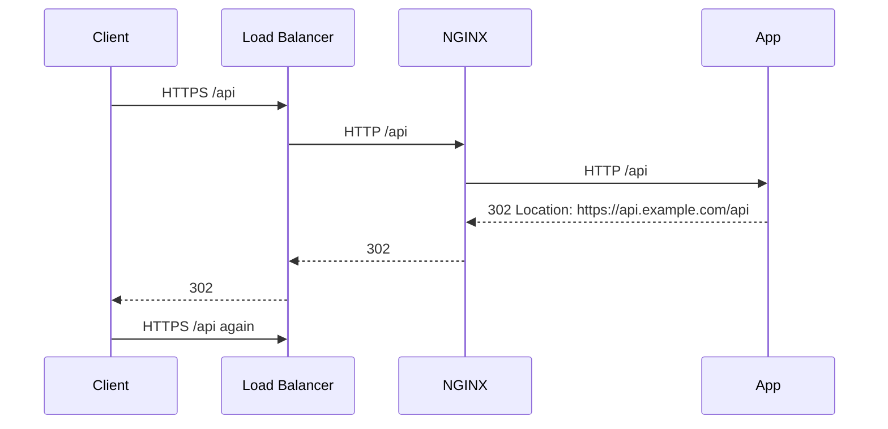

Atau NGINX redirect HTTP ke HTTPS karena mengira request dari LB adalah HTTP.

Penyebab:

- `X-Forwarded-Proto` tidak diset;
- NGINX tidak mempercayai forwarded proto dari LB;
- aplikasi tidak dikonfigurasi sebagai proxy-aware;
- SSL redirect aktif di beberapa layer;
- health check HTTP terkena redirect;
- Host header berubah.

Checklist debugging:

```bash
curl -vkIL https://api.example.com/api
curl -vkI http://api.example.com/api
```

Perhatikan:

- `Location` header;
- status sequence;
- scheme;
- host;
- path;
- apakah redirect berhenti atau loop.

---

## 20. TLS and Health Checks

Load balancer health check bisa memakai HTTP, HTTPS, atau TCP.

Masalah umum:

- LB melakukan HTTPS health check tetapi NGINX hanya listen HTTP;
- NGINX butuh SNI, tetapi health check tidak mengirim SNI;
- health check terkena auth redirect;
- certificate internal tidak trusted oleh load balancer;
- path health check dirutekan ke backend yang belum ready;
- backend protocol annotation salah.

Good practice:

- health endpoint sederhana;
- tidak butuh auth untuk LB internal health check, tetapi dibatasi network;
- tidak redirect jika health check layer tidak support;
- response cepat;
- tidak bergantung pada dependency berat kecuali readiness memang butuh dependency itu;
- certificate trust chain jelas jika HTTPS probe.

---

## 21. Common TLS Failure Modes

| Symptom | Likely Cause | Layer |
|---|---|---|
| `NET::ERR_CERT_COMMON_NAME_INVALID` | SAN tidak match hostname | Client / Cert |
| `certificate has expired` | Certificate expired | Cert lifecycle |
| `unable to get local issuer certificate` | Chain incomplete / CA tidak trusted | Client trust |
| `SSL_do_handshake failed` | Protocol/cipher/SNI/client issue | NGINX |
| `wrong version number` | Client HTTPS ke HTTP port atau sebaliknya | Routing/protocol |
| `no shared cipher` | Cipher policy terlalu ketat / client lama | TLS policy |
| Default certificate muncul | SNI/Ingress TLS mismatch | NGINX/Ingress |
| Health check unhealthy | Probe protocol/cert/SNI mismatch | LB/NGINX |
| Redirect loop | Forwarded proto/SSL redirect salah | LB/NGINX/App |
| 502 after enabling upstream HTTPS | Upstream TLS verify/name/CA issue | NGINX upstream |

---

## 22. Debugging TLS with OpenSSL and curl

### 22.1 Inspect certificate

```bash
openssl s_client \
  -connect api.example.com:443 \
  -servername api.example.com \
  -showcerts
```

Cek:

- certificate subject;
- SAN;
- issuer;
- expiry;
- verify return code;
- protocol version;
- cipher;
- ALPN.

---

### 22.2 Force TLS version

```bash
openssl s_client -connect api.example.com:443 -servername api.example.com -tls1_2
openssl s_client -connect api.example.com:443 -servername api.example.com -tls1_3
```

Useful untuk client compatibility debugging.

---

### 22.3 Debug HTTP over TLS

```bash
curl -vk https://api.example.com/api/health
```

Cek:

- TLS handshake;
- certificate subject;
- ALPN result;
- HTTP status;
- response headers;
- redirect chain.

---

### 22.4 Test Host and SNI explicitly

```bash
curl -vk \
  --resolve api.example.com:443:10.0.1.25 \
  https://api.example.com/api/health
```

Ini berguna saat DNS belum berubah tetapi ingin test target IP tertentu dengan SNI dan Host yang benar.

---

## 23. Observability for TLS

TLS observability sering lemah karena banyak kegagalan terjadi sebelum HTTP request masuk.

Yang perlu diamati:

- handshake error di NGINX error log;
- certificate expiry metric;
- TLS protocol/cipher distribution jika tersedia;
- failed health probe;
- LB target unhealthy reason;
- default certificate served count jika bisa diamati;
- redirect rate;
- 301/302 spike;
- 400 dari malformed TLS-to-HTTP mismatch;
- 502 saat upstream HTTPS verify gagal.

Contoh log error yang perlu dicari:

```text
SSL_do_handshake() failed
no suitable key share
certificate verify failed
upstream SSL certificate verify error
client sent plain HTTP request to HTTPS port
```

---

## 24. Performance Concerns

TLS menambah biaya:

- handshake CPU;
- asymmetric cryptography;
- certificate validation;
- session management;
- memory untuk connection state;
- latency pada new connection;
- tambahan handshake ke upstream jika re-encryption.

Mitigasi:

- keepalive client dan upstream;
- TLS session reuse;
- HTTP/2 untuk multiplexing jika cocok;
- avoid unnecessary re-handshake;
- resource sizing untuk NGINX worker;
- load testing dengan TLS aktif, bukan HTTP saja.

Anti-pattern:

> Benchmark API lewat HTTP plain lalu mengasumsikan hasilnya berlaku untuk HTTPS production.

---

## 25. Security Concerns

Checklist security TLS:

- disable TLS versi lama;
- gunakan certificate chain lengkap;
- private key tidak masuk image container;
- private key hanya tersedia melalui Secret/secure mount;
- RBAC Secret dibatasi;
- certificate rotation teruji;
- HSTS dipakai dengan hati-hati;
- upstream TLS verification aktif jika memakai HTTPS upstream;
- jangan set `proxy_ssl_verify off` tanpa exception formal;
- log tidak membocorkan certificate/private key material;
- ownership certificate jelas;
- emergency revoke/replace path jelas.

---

## 26. Production PR Review Checklist

Saat mereview PR yang menyentuh TLS/HTTPS/Ingress certificate, tanya:

1. Di mana TLS terminate?
2. Apakah ada TLS re-encryption ke upstream?
3. Certificate disimpan di mana?
4. Apakah SAN cocok dengan hostname?
5. Apakah chain lengkap?
6. Apakah certificate rotation otomatis?
7. Apakah NGINX/Ingress akan reload tanpa outage?
8. Apakah HSTS berubah?
9. Apakah TLS version/cipher policy berubah?
10. Apakah health check terdampak?
11. Apakah redirect HTTP to HTTPS bisa loop?
12. Apakah Java/JAX-RS backend menerima forwarded proto yang benar?
13. Apakah source IP/audit header tetap benar?
14. Apakah dashboard certificate expiry tersedia?
15. Apakah rollback jelas jika certificate atau TLS config salah?

---

## 27. Internal Verification Checklist

Untuk konteks CSG atau environment enterprise lain, jangan asumsi. Verifikasi:

- Apakah public TLS terminate di cloud LB, NGINX, API gateway, atau enterprise proxy?
- Apakah NGINX menerima HTTP atau HTTPS dari upstream load balancer?
- Apakah NGINX meneruskan HTTP atau HTTPS ke Java/JAX-RS service?
- Apakah ada mTLS di salah satu hop?
- Apakah certificate berasal dari ACM, Azure Key Vault, cert-manager, internal CA, atau manual Secret?
- Apakah ada wildcard certificate?
- Apakah ada SAN certificate per service?
- Apakah cert-manager digunakan dan siapa owner Issuer/ClusterIssuer?
- Apakah certificate expiry dimonitor?
- Apakah ada runbook renewal failure?
- Apakah TLS private key pernah disimpan di Git repo? Ini harus dihindari.
- Apakah Ingress TLS Secret berada di namespace yang benar?
- Apakah cloud load balancer melakukan TLS termination sebelum NGINX?
- Apakah HSTS diterapkan di NGINX, LB, app, atau CDN?
- Apakah security team punya TLS baseline?
- Apakah Java/JAX-RS framework sudah proxy-aware untuk scheme/host/port?
- Apakah health check menggunakan HTTP, HTTPS, atau TCP?
- Apakah ada partner/client legacy yang membutuhkan TLS exception?

---

## 28. Summary Mental Model

TLS di NGINX harus dipikirkan sebagai kombinasi dari:

```text
identity + encryption + routing + protocol negotiation + certificate lifecycle + operational risk
```

Untuk senior backend engineer, pertanyaan utamanya bukan hanya:

> Apakah HTTPS aktif?

Tetapi:

> HTTPS aktif di hop mana, dengan certificate apa, dipilih lewat SNI apa, dinegosiasikan dengan ALPN apa, diteruskan ke upstream bagaimana, divalidasi oleh siapa, dirotasi oleh sistem apa, dan terlihat di observability mana?

Jika pertanyaan itu bisa dijawab, kamu sudah mulai melihat TLS sebagai bagian dari production traffic architecture, bukan sekadar checkbox security.
