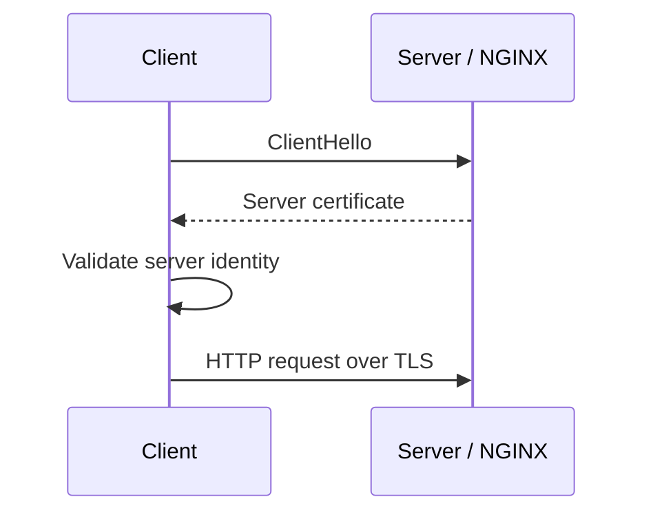
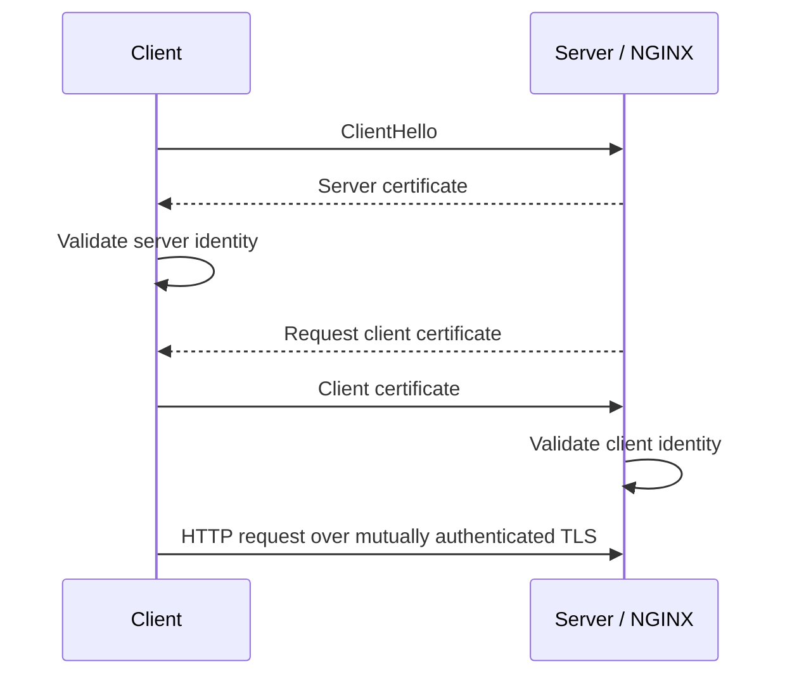
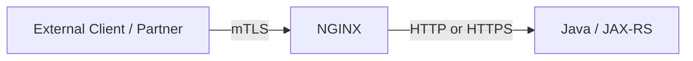
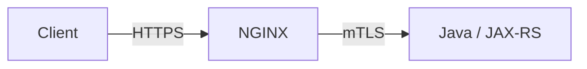
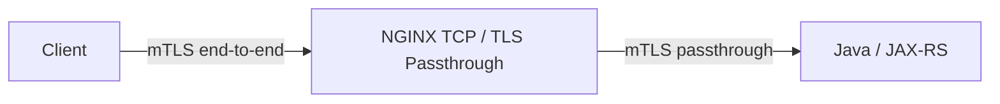
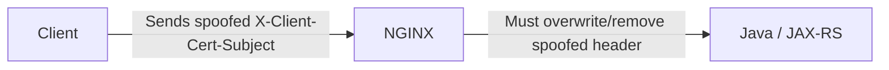
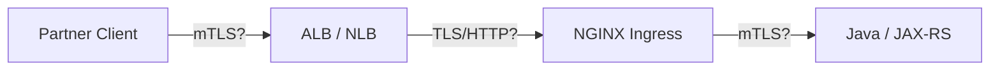
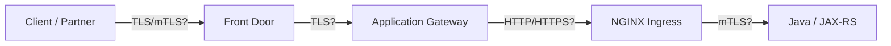

# Part 010 — mTLS, Client Certificate Validation, and Upstream TLS

## 1. Tujuan Part Ini

Part sebelumnya membahas TLS sebagai HTTPS, certificate lifecycle, SNI, ALPN, dan termination pattern.

Part ini masuk ke area yang lebih sensitif: **mTLS**, **client certificate validation**, **upstream TLS verification**, dan **trust boundary**.

mTLS bukan sekadar "HTTPS yang lebih aman". mTLS mengubah pertanyaan security dari:

> Apakah client berbicara dengan server yang benar?

menjadi:

> Apakah server juga yakin client adalah identitas yang benar?

Di enterprise system, mTLS sering muncul pada:

- service-to-service communication;
- partner integration;
- B2B API;
- internal platform boundary;
- regulated environment;
- private cluster ingress;
- zero-trust architecture;
- traffic antara NGINX dan upstream backend;
- traffic dari cloud/on-prem gateway ke Kubernetes ingress.

Target part ini adalah membuat kamu mampu mereview arsitektur mTLS dan upstream TLS tanpa terjebak pada konfigurasi yang tampak aman tetapi sebenarnya tidak memvalidasi identity dengan benar.

---

## 2. Mental Model: TLS vs mTLS

TLS biasa:



mTLS:



TLS menjamin server identity bagi client.  
mTLS menambahkan client identity bagi server.

---

## 3. Why mTLS Exists

mTLS biasanya dipakai ketika API tidak cukup dilindungi oleh bearer token atau network allowlist.

Alasan umum:

- memastikan client benar-benar memiliki private key tertentu;
- mengikat akses ke certificate identity;
- mengurangi risiko stolen token digunakan dari environment lain;
- memenuhi requirement partner/B2B;
- memperkuat service-to-service trust;
- membatasi akses pada boundary internal;
- membuat identity lebih dekat ke transport layer;
- memisahkan machine identity dari user identity.

Namun mTLS bukan pengganti semua security layer.

mTLS menjawab:

```text
Which machine/client certificate is connecting?
```

mTLS tidak otomatis menjawab:

```text
Which user is acting?
Is this operation authorized?
Is this tenant allowed?
Is this workflow transition valid?
```

Untuk Java/JAX-RS backend, application authorization tetap harus dirancang dengan benar.

---

## 4. mTLS Placement Patterns

mTLS bisa ditempatkan di banyak hop. Yang penting adalah tahu boundary-nya.

---

### 4.1 Client-to-NGINX mTLS



NGINX memvalidasi client certificate. Backend menerima request dari NGINX.

Cocok untuk:

- partner API;
- private enterprise API;
- admin/internal endpoint;
- B2B integration;
- API yang butuh machine-level authentication di edge.

Risiko:

- backend tidak melihat certificate asli kecuali NGINX meneruskan identity secara aman;
- identity header bisa dipalsukan jika backend bisa diakses bypass NGINX;
- revocation/rotation client cert harus dikelola;
- mapping cert ke partner/client harus jelas.

---

### 4.2 NGINX-to-Upstream mTLS



NGINX menjadi TLS client terhadap backend. Backend memvalidasi certificate NGINX.

Cocok untuk:

- memastikan backend hanya menerima traffic dari trusted proxy;
- private service boundary;
- zero-trust internal network;
- compliance encryption in transit;
- mencegah direct unauthenticated access ke service port.

Risiko:

- Java runtime harus dikonfigurasi untuk trust client CA;
- backend certificate dan client certificate lifecycle harus sinkron;
- debugging 502/handshake failure lebih kompleks;
- performance perlu keepalive dan session reuse.

---

### 4.3 End-to-End mTLS Passthrough



NGINX tidak terminate TLS. Backend melakukan client cert validation langsung.

Cocok untuk:

- certificate identity harus diproses langsung oleh aplikasi;
- NGINX tidak boleh melihat payload;
- regulatory requirement end-to-end;
- protocol non-HTTP.

Trade-off:

- NGINX tidak bisa route berdasarkan path/header;
- NGINX tidak bisa inject request ID/header;
- HTTP access log di NGINX tidak tersedia;
- WAF/rate limit HTTP tidak bisa bekerja;
- backend memegang full TLS complexity.

---

## 5. NGINX Client Certificate Validation

Contoh NGINX sebagai mTLS server:

```nginx
server {
    listen 443 ssl http2;
    server_name partner-api.example.com;

    ssl_certificate     /etc/nginx/tls/server.crt;
    ssl_certificate_key /etc/nginx/tls/server.key;

    ssl_client_certificate /etc/nginx/client-ca/partner-ca.crt;
    ssl_verify_client on;
    ssl_verify_depth 2;

    location /api/ {
        proxy_pass http://java_backend;
        proxy_set_header Host $host;
        proxy_set_header X-Forwarded-Proto https;
        proxy_set_header X-Client-Cert-Subject $ssl_client_s_dn;
        proxy_set_header X-Client-Cert-Issuer  $ssl_client_i_dn;
        proxy_set_header X-Client-Verify       $ssl_client_verify;
    }
}
```

Directive penting:

| Directive | Fungsi |
|---|---|
| `ssl_client_certificate` | CA yang dipercaya untuk memvalidasi client certificate |
| `ssl_verify_client on` | Wajibkan client certificate valid |
| `ssl_verify_client optional` | Minta client cert tetapi tidak wajib |
| `ssl_verify_depth` | Batas chain verification depth |
| `$ssl_client_verify` | Status validasi certificate |
| `$ssl_client_s_dn` | Subject DN client certificate |
| `$ssl_client_i_dn` | Issuer DN client certificate |
| `$ssl_client_serial` | Serial number client certificate |
| `$ssl_client_fingerprint` | Fingerprint certificate |

---

## 6. `ssl_verify_client on` vs `optional`

### `on`

```nginx
ssl_verify_client on;
```

Client harus mengirim certificate valid. Jika tidak, request gagal di TLS/NGINX layer.

Gunakan untuk endpoint yang benar-benar membutuhkan mTLS.

### `optional`

```nginx
ssl_verify_client optional;
```

NGINX meminta client certificate, tetapi request masih bisa lanjut tanpa cert.

Gunakan hanya jika aplikasi atau NGINX location logic akan memutuskan akses berdasarkan `$ssl_client_verify`.

Risiko:

```nginx
ssl_verify_client optional;

location /api/ {
    proxy_pass http://java_backend;
}
```

Ini terlihat seperti mTLS, tetapi sebenarnya tidak memblokir client tanpa certificate.

Jika optional dipakai, harus ada enforcement:

```nginx
if ($ssl_client_verify != SUCCESS) {
    return 403;
}
```

Catatan: penggunaan `if` di NGINX perlu hati-hati. Untuk policy kompleks, lebih baik pisahkan server/location atau gunakan `map`.

---

## 7. Safer Policy with `map`

Contoh policy sederhana:

```nginx
map $ssl_client_verify $client_cert_allowed {
    default 0;
    SUCCESS 1;
}

server {
    listen 443 ssl;
    server_name partner-api.example.com;

    ssl_client_certificate /etc/nginx/client-ca/partner-ca.crt;
    ssl_verify_client optional;

    location /api/ {
        if ($client_cert_allowed = 0) {
            return 403;
        }

        proxy_pass http://java_backend;
    }
}
```

Untuk production, policy biasanya lebih kompleks:

- allowlist fingerprint;
- allowlist subject DN;
- allowlist issuer;
- mapping certificate ke partner ID;
- revocation status;
- expiry monitoring;
- environment-specific CA.

Jika logic identity sudah kompleks, pertimbangkan external auth service atau API gateway policy layer.

---

## 8. Passing Client Certificate Identity to Java/JAX-RS

Jika NGINX terminate mTLS, backend tidak menerima TLS client certificate secara langsung.

Maka identity sering diteruskan via header:

```nginx
proxy_set_header X-Client-Cert-Subject $ssl_client_s_dn;
proxy_set_header X-Client-Cert-Issuer  $ssl_client_i_dn;
proxy_set_header X-Client-Cert-Serial  $ssl_client_serial;
proxy_set_header X-Client-Cert-Fingerprint $ssl_client_fingerprint;
proxy_set_header X-Client-Verify $ssl_client_verify;
```

Ini berbahaya jika trust boundary tidak ketat.

Masalah utama:

> Header identity bisa dipalsukan oleh client jika request bisa bypass NGINX atau jika NGINX tidak menghapus inbound header dengan nama sama.

Good practice:

```nginx
proxy_set_header X-Client-Cert-Subject "";
proxy_set_header X-Client-Cert-Issuer "";
proxy_set_header X-Client-Cert-Serial "";
proxy_set_header X-Client-Cert-Fingerprint "";

proxy_set_header X-Client-Cert-Subject $ssl_client_s_dn;
proxy_set_header X-Client-Cert-Issuer $ssl_client_i_dn;
proxy_set_header X-Client-Cert-Serial $ssl_client_serial;
proxy_set_header X-Client-Cert-Fingerprint $ssl_client_fingerprint;
```

Lebih baik:

- gunakan header internal dengan nama yang distandardisasi platform;
- strip semua inbound identity headers;
- backend hanya menerima traffic dari NGINX network/security group;
- aplikasi hanya trust header jika request berasal dari trusted proxy;
- audit mapping cert identity ke actor/partner/tenant.

---

## 9. Identity Mapping Problem

Certificate identity tidak selalu langsung berarti user/application identity yang dibutuhkan bisnis.

Contoh subject DN:

```text
CN=partner-gateway-prod,O=Partner Inc,L=Singapore,C=SG
```

Aplikasi mungkin perlu tahu:

```text
partnerId = PARTNER_123
tenantId = TELCO_X
environment = prod
allowedScopes = quote:submit, order:create
```

Mapping bisa dilakukan di:

1. NGINX config;
2. external auth service;
3. API gateway;
4. Java/JAX-RS application;
5. identity platform.

Rule of thumb:

- NGINX cocok untuk transport-level validation sederhana;
- NGINX kurang cocok untuk rich authorization policy;
- application atau dedicated auth service lebih cocok untuk business authorization;
- mapping harus auditable dan testable.

---

## 10. Client Certificate Revocation

mTLS tidak selesai hanya dengan memvalidasi chain.

Pertanyaan penting:

> Bagaimana jika private key client bocor atau partner harus diblokir sebelum certificate expired?

Opsi revocation:

- CRL;
- OCSP;
- short-lived certificates;
- explicit allowlist fingerprint;
- denylist serial number;
- rotate CA;
- disable partner mapping di auth service.

NGINX mendukung CRL dengan directive seperti:

```nginx
ssl_crl /etc/nginx/client-ca/revoked.crl;
```

Operational concern:

- CRL harus diperbarui;
- reload NGINX diperlukan untuk update tertentu;
- OCSP untuk client cert tidak selalu sederhana;
- short-lived certificate mengurangi revocation burden tetapi meningkatkan automation requirement.

Internal system harus punya playbook:

```text
Partner certificate compromised -> revoke/deny -> deploy/reload -> verify block -> audit
```

---

## 11. Upstream HTTPS from NGINX to Java/JAX-RS

Saat NGINX proxy ke HTTPS backend:

```nginx
location /api/ {
    proxy_pass https://java_backend;

    proxy_ssl_server_name on;
    proxy_ssl_name quote-api.default.svc.cluster.local;
    proxy_ssl_trusted_certificate /etc/nginx/ca/internal-ca.crt;
    proxy_ssl_verify on;
    proxy_ssl_verify_depth 2;
}
```

Directive penting:

| Directive | Fungsi |
|---|---|
| `proxy_pass https://...` | Membuat upstream connection via TLS |
| `proxy_ssl_server_name on` | Mengirim SNI ke upstream |
| `proxy_ssl_name` | Nama yang dipakai untuk SNI dan verification |
| `proxy_ssl_trusted_certificate` | CA trust untuk upstream cert |
| `proxy_ssl_verify on` | Validasi certificate upstream |
| `proxy_ssl_verify_depth` | Batas chain depth |

Anti-pattern berbahaya:

```nginx
proxy_ssl_verify off;
```

Ini mengenkripsi traffic tetapi tidak memverifikasi identitas upstream. Artinya NGINX tidak benar-benar tahu sedang berbicara dengan backend yang sah.

Kadang dipakai sementara untuk debugging, tetapi harus dianggap exception berisiko.

---

## 12. NGINX as mTLS Client to Upstream

Jika backend meminta client certificate dari NGINX:

```nginx
location /api/ {
    proxy_pass https://java_backend;

    proxy_ssl_server_name on;
    proxy_ssl_name quote-api.default.svc.cluster.local;
    proxy_ssl_trusted_certificate /etc/nginx/ca/internal-ca.crt;
    proxy_ssl_verify on;

    proxy_ssl_certificate     /etc/nginx/client-cert/nginx-client.crt;
    proxy_ssl_certificate_key /etc/nginx/client-cert/nginx-client.key;
}
```

Backend Java harus dikonfigurasi untuk:

- expose HTTPS port;
- trust CA yang menandatangani NGINX client certificate;
- require client auth jika memang mTLS mandatory;
- map client certificate NGINX ke trusted proxy identity;
- reject direct client tanpa valid cert.

Pertanyaan penting:

> Apakah backend memvalidasi NGINX sebagai proxy identity, atau setiap upstream request dianggap trusted tanpa validasi?

---

## 13. Java/JAX-RS Backend Considerations

Di Java world, mTLS bisa muncul di beberapa layer:

- servlet container / embedded server;
- Jakarta EE server;
- Spring Boot/Tomcat/Jetty/Undertow jika digunakan;
- reverse proxy header processing;
- application filter;
- external auth integration;
- outbound HTTP client truststore/keystore.

Konsep penting:

| Concept | Meaning |
|---|---|
| Truststore | CA yang dipercaya aplikasi |
| Keystore | Certificate/private key milik aplikasi |
| Client auth | Server meminta certificate dari client |
| Principal | Identity hasil certificate/authentication |
| Forwarded header trust | Aplikasi percaya header dari proxy tertentu |

Jika NGINX terminate mTLS, Java app biasanya tidak memakai TLS client cert langsung. Ia menerima propagated identity.

Jika Java app terminate mTLS langsung, NGINX harus passthrough atau re-encrypt dengan client cert.

---

## 14. Kubernetes Secret Handling for mTLS

mTLS memakai material sensitif:

- server private key;
- client private key;
- CA bundle;
- CRL;
- truststore;
- keystore.

Di Kubernetes, biasanya disimpan sebagai Secret.

Contoh Secret TLS:

```yaml
apiVersion: v1
kind: Secret
metadata:
  name: nginx-upstream-client-cert
  namespace: ingress-nginx
type: kubernetes.io/tls
data:
  tls.crt: BASE64_CERT
  tls.key: BASE64_KEY
```

Risiko:

- Secret bisa dibaca oleh siapa pun yang punya RBAC akses;
- Secret bisa terekspos di log CI/CD;
- Secret bisa masuk Git jika tidak pakai secret management yang benar;
- namespace salah bisa membuat Ingress tidak menemukan cert;
- rotation gagal jika controller tidak reload;
- private key sharing terlalu luas.

Checklist:

- RBAC minimal;
- Secret tidak pernah disimpan plain di Git;
- GitOps memakai sealed secret/external secret/Vault jika tersedia;
- ownership rotation jelas;
- expiry dimonitor;
- reload behavior teruji;
- audit akses Secret tersedia.

---

## 15. mTLS in Kubernetes Ingress

Pada ingress-nginx, client cert auth biasanya memakai annotation dan Secret CA.

Contoh konseptual:

```yaml
apiVersion: networking.k8s.io/v1
kind: Ingress
metadata:
  name: partner-api
  namespace: quote
  annotations:
    nginx.ingress.kubernetes.io/auth-tls-secret: "quote/partner-client-ca"
    nginx.ingress.kubernetes.io/auth-tls-verify-client: "on"
    nginx.ingress.kubernetes.io/auth-tls-verify-depth: "2"
    nginx.ingress.kubernetes.io/auth-tls-pass-certificate-to-upstream: "true"
spec:
  ingressClassName: nginx
  tls:
    - hosts:
        - partner-api.example.com
      secretName: partner-api-server-tls
  rules:
    - host: partner-api.example.com
      http:
        paths:
          - path: /api
            pathType: Prefix
            backend:
              service:
                name: quote-api-service
                port:
                  number: 8080
```

Hal yang harus diverifikasi:

- annotation name sesuai controller yang dipakai;
- controller community vs NGINX Inc bisa berbeda;
- Secret CA berada di namespace yang benar;
- server TLS Secret berbeda dari client CA Secret;
- pass certificate to upstream benar-benar diperlukan atau tidak;
- header identity yang diteruskan ke upstream aman;
- snippets/annotations diizinkan oleh policy platform.

---

## 16. Trust Boundary and Header Spoofing

Jika backend menerima identity dari header, trust boundary menjadi kritis.



NGINX harus menghapus atau overwrite inbound identity headers.

Backend harus:

- hanya bisa diakses dari NGINX;
- reject direct external access;
- trust identity headers hanya dari trusted network/source;
- optionally validate shared internal header atau mTLS dari NGINX;
- log original identity mapping.

Bad pattern:

```text
Public client -> direct service endpoint -> sends X-User: admin -> app trusts it
```

Good pattern:

```text
Public client -> NGINX validates mTLS -> NGINX overwrites identity headers -> app trusts only NGINX source
```

---

## 17. Authorization Boundary

mTLS authentication bukan business authorization.

Contoh:

Client certificate valid:

```text
CN=partner-a-prod
```

Tetapi request:

```http
POST /tenants/partner-b/orders
```

Pertanyaan authorization:

- Apakah partner A boleh akses tenant partner B?
- Apakah certificate ini boleh melakukan order submit?
- Apakah environment prod/staging cocok?
- Apakah operation ini butuh user-level consent?
- Apakah workflow state mengizinkan transition ini?

NGINX bisa menolak certificate tidak valid. Namun business authorization biasanya harus ada di Java/JAX-RS service atau dedicated policy service.

Senior-level stance:

> Let NGINX enforce transport identity and coarse boundary. Let application or policy service enforce business authorization.

---

## 18. Failure Modes: Client-to-NGINX mTLS

| Symptom | Possible Cause | Where to Look |
|---|---|---|
| Client gets TLS handshake failure | No client certificate / invalid cert | NGINX error log, client TLS debug |
| Client gets 400/403 | Cert verification failed or policy block | NGINX access/error log |
| Works with curl but fails app client | Client keystore/truststore config mismatch | Client runtime config |
| Certificate valid but rejected | Wrong CA bundle or verify depth | NGINX TLS config |
| Expired client cert | Partner cert lifecycle issue | Certificate inventory |
| Wrong partner mapped | Subject/fingerprint mapping bug | Auth mapping config |
| mTLS bypass possible | Backend exposed directly | Network/security group/Kubernetes Service |

Debug commands:

```bash
curl -vk \
  --cert client.crt \
  --key client.key \
  https://partner-api.example.com/api/health
```

If CA is private:

```bash
curl -vk \
  --cert client.crt \
  --key client.key \
  --cacert server-ca.crt \
  https://partner-api.example.com/api/health
```

---

## 19. Failure Modes: NGINX-to-Upstream TLS

| Symptom | Possible Cause | Where to Look |
|---|---|---|
| 502 Bad Gateway | Upstream TLS handshake failed | NGINX error log |
| 502 after enabling verify | Upstream cert SAN mismatch | `proxy_ssl_name`, upstream cert |
| 502 only after rotation | New CA not trusted by NGINX | CA bundle Secret |
| Upstream rejects NGINX | Missing/invalid NGINX client cert | Backend TLS logs |
| Works with `proxy_ssl_verify off` | Trust/name validation problem | CA/SAN/SNI config |
| Random failures | Multiple upstream pods with inconsistent certs | Pod cert inventory |
| Slow first request | TLS handshake overhead/no keepalive | Performance metrics |

Debug from NGINX pod or debug pod:

```bash
openssl s_client \
  -connect quote-api.default.svc.cluster.local:8443 \
  -servername quote-api.default.svc.cluster.local \
  -CAfile internal-ca.crt \
  -showcerts
```

If upstream requires client cert:

```bash
openssl s_client \
  -connect quote-api.default.svc.cluster.local:8443 \
  -servername quote-api.default.svc.cluster.local \
  -CAfile internal-ca.crt \
  -cert nginx-client.crt \
  -key nginx-client.key
```

---

## 20. Certificate Rotation for mTLS

mTLS rotation is harder than normal server certificate rotation because both sides may depend on each other.

### 20.1 Rotate server certificate

```text
Update server cert -> clients must trust issuer -> reload server -> verify clients still connect
```

### 20.2 Rotate client certificate

```text
Issue new client cert -> deploy to client -> server trusts CA/mapping -> verify -> revoke old cert
```

### 20.3 Rotate CA

This is the risky one.

Safe CA rotation usually requires overlap:

```text
Phase 1: Server trusts old CA + new CA
Phase 2: Clients migrate to certs from new CA
Phase 3: Verify all clients migrated
Phase 4: Remove old CA
```

If you remove old CA too early, clients break.  
If you leave old CA forever, revocation boundary weakens.

---

## 21. Observability for mTLS

Minimum observability:

- count handshake failures;
- log `$ssl_client_verify`;
- log client certificate fingerprint or serial where appropriate;
- alert on certificate expiry;
- dashboard mTLS 403/400;
- upstream TLS handshake errors;
- backend rejection of NGINX client cert;
- rotation event audit;
- partner/client certificate inventory.

Example log format snippet:

```nginx
log_format mtls_json escape=json
'{'
  '"time":"$time_iso8601",'
  '"remote_addr":"$remote_addr",'
  '"host":"$host",'
  '"request":"$request",'
  '"status":$status,'
  '"ssl_client_verify":"$ssl_client_verify",'
  '"ssl_client_serial":"$ssl_client_serial",'
  '"ssl_client_fingerprint":"$ssl_client_fingerprint",'
  '"request_time":$request_time,'
  '"upstream_response_time":"$upstream_response_time"'
'}';
```

Privacy note:

- certificate subject may contain organization/person names;
- avoid logging full certificate unless strictly needed;
- fingerprint/serial is often safer for correlation;
- apply log retention and access control.

---

## 22. Performance Considerations

mTLS adds cost beyond normal TLS:

- client certificate verification;
- deeper certificate chain validation;
- possible CRL checks;
- larger handshake;
- mutual key material management;
- extra handshake to upstream if NGINX is mTLS client.

Mitigation:

- use keepalive;
- avoid short connection churn;
- load test with mTLS enabled;
- monitor CPU on NGINX;
- tune worker connections;
- avoid per-request expensive external certificate checks unless necessary;
- use short-lived certs carefully because rotation automation must be reliable.

Do not assume mTLS overhead is negligible for high-QPS APIs.

---

## 23. Security Anti-Patterns

### Anti-pattern 1: Encryption without verification

```nginx
proxy_pass https://backend;
proxy_ssl_verify off;
```

Traffic is encrypted, but upstream identity is not verified.

---

### Anti-pattern 2: Optional mTLS without enforcement

```nginx
ssl_verify_client optional;
proxy_pass http://backend;
```

Client certificate is optional, but no policy checks it.

---

### Anti-pattern 3: Trusting spoofable headers

```java
String partner = request.getHeader("X-Client-Cert-Subject");
// trusted without verifying request came from NGINX
```

This can be exploited if backend is reachable directly.

---

### Anti-pattern 4: Private keys in container image

```dockerfile
COPY nginx-client.key /etc/nginx/client.key
```

Private keys must not be baked into images.

---

### Anti-pattern 5: One shared client cert for everything

If all services share one client certificate, identity becomes too coarse.

Better:

- per environment;
- per service or workload;
- per partner;
- automated rotation;
- least privilege mapping.

---

## 24. AWS/EKS mTLS Considerations

Potential locations:



Questions:

- Does ALB terminate TLS or pass TCP to NGINX?
- If mTLS is required, is it enforced at ALB, NGINX, or app?
- Are client cert details forwarded to NGINX/backend?
- Does NLB preserve TLS passthrough?
- Are ACM certificates used only for server TLS?
- Where are client CA bundles stored?
- Are Security Groups preventing direct backend bypass?
- Is proxy protocol enabled and correctly parsed?

Do not assume AWS LB behavior is equivalent across ALB and NLB. For mTLS, the exact listener and target pattern matters.

---

## 25. Azure/AKS mTLS Considerations

Potential locations:



Questions:

- Is mTLS supported/enforced at Front Door, Application Gateway, NGINX, or app?
- Are certificates stored in Azure Key Vault or Kubernetes Secret?
- Does Application Gateway pass client certificate information?
- Is backend TLS verification enabled?
- Are probes compatible with mTLS?
- Does NSG/Private Link prevent bypass?
- Is Azure Monitor collecting TLS/mTLS failure signals?

---

## 26. On-Prem and Hybrid mTLS Considerations

On-prem mTLS often involves internal CA and enterprise proxy layers.

Risks:

- multiple teams own different cert stores;
- internal CA root not installed in Java truststore;
- corporate TLS inspection interferes with client identity;
- certificate renewal requires manual ticket;
- CRL distribution unavailable from Kubernetes network;
- partner cert mapping lives in spreadsheet/runbook;
- firewall allows bypass to backend service.

Questions:

- Which CA signs server certs?
- Which CA signs client certs?
- Is the same CA used across environments?
- How is revocation handled?
- Who owns emergency disablement?
- Are certificate identities mapped to tenants/partners in a controlled config?
- Can the backend be reached without passing through mTLS boundary?

---

## 27. Debugging Playbook

### 27.1 Client cannot connect to mTLS endpoint

Check:

1. Is client sending a certificate?
2. Is certificate signed by trusted CA?
3. Is certificate expired?
4. Is certificate chain complete?
5. Is NGINX verify depth sufficient?
6. Is client using correct SNI?
7. Is TLS version/cipher compatible?
8. Does NGINX error log show verify failure?

Commands:

```bash
curl -vk --cert client.crt --key client.key https://partner-api.example.com/health
openssl s_client -connect partner-api.example.com:443 -servername partner-api.example.com -cert client.crt -key client.key -showcerts
```

---

### 27.2 Backend receives no identity

Check:

1. Did NGINX terminate mTLS?
2. Did NGINX set identity headers?
3. Did NGINX overwrite spoofed inbound headers?
4. Did ingress annotation pass certificate upstream?
5. Does backend framework allow reading those headers?
6. Is backend reachable only from NGINX?
7. Are logs redacting too much?

---

### 27.3 NGINX gets 502 to HTTPS upstream

Check:

1. Can NGINX resolve upstream DNS?
2. Is upstream port HTTPS, not HTTP?
3. Does upstream certificate SAN match `proxy_ssl_name`?
4. Is `proxy_ssl_server_name on` set?
5. Is internal CA trusted by NGINX?
6. Does upstream require client certificate?
7. Is NGINX client cert valid?
8. Did cert rotation happen recently?

---

## 28. Production PR Review Checklist

For mTLS or upstream TLS changes, ask:

1. What identity is being authenticated?
2. Which hop enforces mTLS?
3. Is TLS terminated, passed through, or re-encrypted?
4. Which CA is trusted?
5. Where are server cert, client cert, CA bundle, and private key stored?
6. Is upstream certificate verification enabled?
7. Is `proxy_ssl_verify off` avoided?
8. Is SNI configured for upstream?
9. Are identity headers overwritten and protected?
10. Can backend be bypassed directly?
11. How is cert mapped to partner/service/tenant?
12. How is revocation handled?
13. How is rotation handled?
14. Are expiry alerts configured?
15. Are mTLS failures observable?
16. Is rollback safe?
17. Is this transport authentication or business authorization?
18. Does application authorization still enforce tenant/workflow rules?

---

## 29. Internal Verification Checklist

Untuk konteks CSG atau enterprise production environment, verifikasi:

- Apakah ada endpoint partner/B2B yang memakai mTLS?
- Apakah mTLS terminate di cloud LB, enterprise proxy, NGINX, atau Java app?
- Apakah NGINX menerima client certificate langsung?
- Apakah client certificate identity diteruskan ke Java/JAX-RS backend?
- Header identity apa yang dipakai?
- Apakah inbound spoofed identity headers distrip?
- Apakah backend hanya menerima traffic dari trusted proxy?
- Apakah ada network policy/security group yang mencegah bypass?
- Apakah upstream dari NGINX ke Java memakai HTTPS?
- Apakah upstream TLS verification aktif?
- Apakah ada `proxy_ssl_verify off` di config?
- Apakah Java app membutuhkan client cert dari NGINX?
- Di mana CA bundle disimpan?
- Apakah Secret dikelola via GitOps, external secret, Vault, atau manual?
- Apakah private key pernah masuk repository? Ini harus dihindari.
- Apakah certificate expiry dimonitor?
- Apakah ada rotation runbook untuk server cert, client cert, dan CA?
- Apakah revocation path jelas?
- Apakah mTLS failure muncul di dashboard/log?
- Apakah ada mapping certificate ke partner/tenant/service identity?
- Apakah business authorization tetap enforced di aplikasi atau policy service?

---

## 30. Summary Mental Model

mTLS adalah tentang **mutual identity**, bukan hanya encryption.

Untuk senior backend engineer, modelkan setiap hop:

```text
Who is the TLS server?
Who is the TLS client?
Who validates whom?
Which CA is trusted?
Where is the private key?
Where is identity mapped?
Can this boundary be bypassed?
What happens during rotation or revocation?
```

NGINX bisa menjadi:

- mTLS server bagi external client;
- mTLS client bagi upstream Java/JAX-RS service;
- TLS passthrough proxy;
- identity propagation layer;
- coarse auth boundary;
- source of dangerous false confidence if verification is disabled.

Prinsip utamanya:

> Encrypting traffic is not enough. You must verify identity, protect trust boundaries, prevent spoofing, observe failures, and design certificate lifecycle as an operational workflow.
