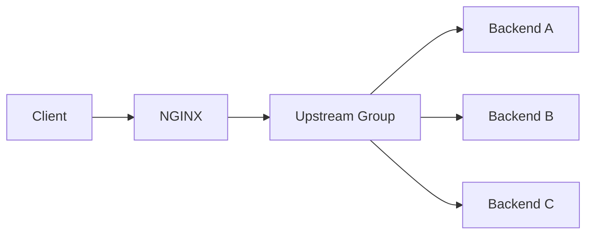
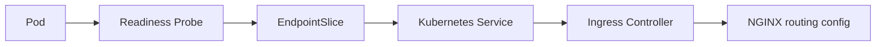
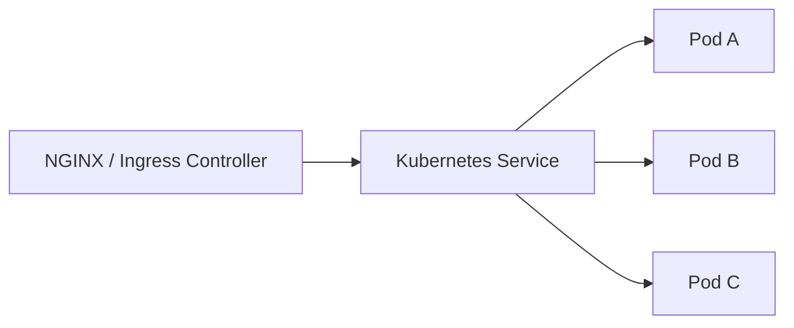
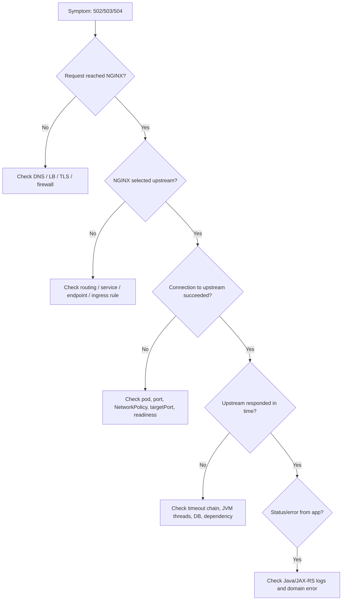

# Part 011 — Load Balancing and Upstream Management

## 1. Tujuan Part Ini

Part ini membahas bagaimana NGINX memilih backend ketika bertindak sebagai reverse proxy atau ingress layer.

Di banyak incident production, gejalanya terlihat sederhana:

```text
502 Bad Gateway
503 Service Temporarily Unavailable
504 Gateway Timeout
intermittent latency spike
request kadang berhasil kadang gagal
hanya sebagian pod menerima traffic
```

Namun akar masalahnya sering ada di interaksi antara:

- upstream definition;
- load balancing algorithm;
- upstream keepalive;
- health behavior;
- DNS resolution;
- Kubernetes Service routing;
- pod readiness;
- cloud load balancer;
- timeout dan retry;
- backend Java/JAX-RS thread pool.

Target part ini adalah membuat kamu bisa membaca upstream behavior sebagai **traffic distribution system**, bukan sekadar directive `upstream` dan `proxy_pass`.

---

## 2. Mental Model: NGINX as Upstream Selector

Ketika NGINX menerima request, ia harus menjawab pertanyaan berikut:

```text
Request ini harus diteruskan ke backend yang mana?
```

Secara sederhana:



Namun secara production, pertanyaannya lebih detail:

- backend mana yang eligible?
- backend mana yang dianggap healthy?
- apakah backend sedang slow?
- apakah connection bisa dipakai ulang?
- apakah request bisa dicoba ulang ke backend lain?
- apakah operasi aman untuk retry?
- apakah backend adalah VM, container, Kubernetes Service, Pod IP, atau cloud target group?
- apakah client perlu sticky session?
- apakah source IP harus dipertahankan?

Load balancing di NGINX adalah keputusan runtime yang berdampak langsung ke reliability dan correctness aplikasi Java/JAX-RS.

---

## 3. Upstream Block: The Basic Abstraction

Contoh dasar:

```nginx
upstream quote_order_api {
    server quote-order-1.internal:8080;
    server quote-order-2.internal:8080;
    server quote-order-3.internal:8080;
}

server {
    listen 443 ssl;
    server_name api.example.internal;

    location /quote-order/ {
        proxy_pass http://quote_order_api;
    }
}
```

`upstream` adalah logical group backend. `proxy_pass` mengirim request ke group tersebut.

Mental model:

```text
upstream block = daftar target yang bisa menerima request
load balancing algorithm = cara memilih target
health behavior = kapan target dianggap buruk
keepalive = apakah koneksi ke target dipakai ulang
retry = apakah request boleh dicoba ulang ke target lain
```

Untuk Java/JAX-RS service, target backend biasanya berupa:

- JVM process langsung di VM;
- container port;
- Kubernetes Service;
- internal DNS name;
- cloud load balancer internal;
- service mesh sidecar endpoint;
- API gateway internal;
- legacy application server.

---

## 4. `proxy_pass` to One Backend vs Upstream Group

Single backend:

```nginx
location /api/ {
    proxy_pass http://quote-order-service:8080;
}
```

Upstream group:

```nginx
upstream quote_order_api {
    server quote-order-service-a:8080;
    server quote-order-service-b:8080;
}

location /api/ {
    proxy_pass http://quote_order_api;
}
```

Single backend lebih sederhana, tetapi observability dan failover lebih terbatas.

Upstream group memberi kontrol lebih besar terhadap:

- load distribution;
- weight;
- failover;
- keepalive;
- passive health behavior;
- backup server;
- per-backend tuning.

Di Kubernetes, upstream sering tidak ditulis sebagai daftar Pod IP manual. NGINX Ingress Controller biasanya menghasilkan konfigurasi internal berdasarkan Ingress, Service, EndpointSlice, dan controller implementation.

---

## 5. Load Balancing Algorithm

### 5.1 Round Robin

Default behavior NGINX adalah round robin.

```nginx
upstream quote_order_api {
    server app1:8080;
    server app2:8080;
    server app3:8080;
}
```

Mental model:

```text
request 1 -> app1
request 2 -> app2
request 3 -> app3
request 4 -> app1
```

Cocok ketika backend relatif homogen:

- kapasitas sama;
- latency mirip;
- deployment version sama;
- tidak ada state lokal yang penting;
- endpoint stateless.

Risk:

- backend lambat tetap bisa menerima traffic;
- request berat dan ringan dianggap sama;
- tidak aware terhadap queue depth JVM;
- tidak tahu thread pool backend sedang penuh.

### 5.2 Least Connections

```nginx
upstream quote_order_api {
    least_conn;
    server app1:8080;
    server app2:8080;
    server app3:8080;
}
```

NGINX memilih backend dengan active connection paling sedikit.

Cocok untuk:

- request durasi tidak seragam;
- endpoint long-running;
- streaming atau download besar;
- backend dengan request processing time bervariasi.

Tetapi `least_conn` tidak sama dengan melihat CPU, heap, GC pressure, atau application queue. Ia hanya melihat connection count dari perspektif NGINX.

### 5.3 IP Hash

```nginx
upstream quote_order_api {
    ip_hash;
    server app1:8080;
    server app2:8080;
}
```

Client IP yang sama cenderung diarahkan ke backend yang sama.

Cocok untuk:

- legacy session affinity;
- backend yang masih punya local session;
- temporary mitigation untuk stateful application.

Risk:

- distribusi tidak merata;
- NAT besar bisa membuat banyak user terlihat dari IP yang sama;
- source IP bisa salah jika NGINX melihat IP load balancer, bukan real client;
- scale up/down bisa mengubah mapping.

Untuk Java/JAX-RS modern, lebih baik service dibuat stateless. Sticky routing harus dianggap sebagai kompromi, bukan default design.

### 5.4 Hash-Based Routing

```nginx
upstream quote_order_api {
    hash $request_uri consistent;
    server app1:8080;
    server app2:8080;
}
```

Routing bisa dibuat berdasarkan variable seperti URI, header, cookie, atau tenant identifier.

Contoh konsep:

```nginx
upstream tenant_partitioned_api {
    hash $http_x_tenant_id consistent;
    server app1:8080;
    server app2:8080;
    server app3:8080;
}
```

Use case:

- cache locality;
- tenant-aware partitioning;
- sticky behavior tanpa cookie;
- gradual migration.

Risk:

- header bisa spoofed jika tidak datang dari trusted boundary;
- tenant besar bisa membebani satu backend;
- sulit dioperasikan jika backend sering berubah;
- dapat menimbulkan hot partition.

### 5.5 Weighted Backend

```nginx
upstream quote_order_api {
    server app1:8080 weight=5;
    server app2:8080 weight=1;
}
```

`app1` menerima lebih banyak traffic dari `app2`.

Use case:

- kapasitas backend berbeda;
- canary manual;
- migration bertahap;
- hardware/VM berbeda;
- node pool berbeda.

Risk:

- weight bukan guarantee persentase presisi;
- perlu observability untuk validasi distribusi aktual;
- bisa bertabrakan dengan autoscaling dan Kubernetes routing.

---

## 6. Health Behavior: Passive vs Active

### 6.1 Passive Health Check

NGINX open source umumnya memakai passive failure detection pada upstream proxying.

Artinya backend dianggap bermasalah berdasarkan hasil request aktual, misalnya:

- connection refused;
- timeout;
- invalid response;
- selected HTTP status jika dikonfigurasi sebagai failure condition;
- network error.

Contoh:

```nginx
upstream quote_order_api {
    server app1:8080 max_fails=3 fail_timeout=30s;
    server app2:8080 max_fails=3 fail_timeout=30s;
}
```

Makna praktis:

```text
Jika app1 gagal beberapa kali dalam window tertentu,
NGINX sementara menghindari app1.
```

### 6.2 Active Health Check

Active health check berarti NGINX secara berkala memanggil endpoint health backend, bukan menunggu request user gagal.

Dalam NGINX ecosystem, dukungan active health check bergantung pada edisi/module/controller yang digunakan.

Internal verification penting:

```text
Apakah environment memakai NGINX open source, NGINX Plus, community ingress-nginx, NGINX Inc controller, cloud LB health check, atau service mesh health check?
```

Jangan mengasumsikan active health check tersedia hanya karena ada kata "health" di arsitektur.

### 6.3 Kubernetes Readiness vs NGINX Health

Di Kubernetes, health sering berasal dari readiness probe.



Jika readiness gagal, Pod biasanya dikeluarkan dari endpoint Service.

Namun ada beberapa delay dan boundary:

- readiness probe interval;
- kube-proxy/IPVS update;
- EndpointSlice propagation;
- ingress controller resync;
- NGINX reload/update;
- existing keepalive connection;
- cloud load balancer health check.

Karena itu, pod yang baru tidak ready atau baru terminating tetap bisa menerima traffic dalam window tertentu jika lifecycle tidak dirancang baik.

---

## 7. `max_fails` and `fail_timeout`

Contoh:

```nginx
upstream quote_order_api {
    server app1:8080 max_fails=3 fail_timeout=30s;
    server app2:8080 max_fails=3 fail_timeout=30s;
}
```

Interpretasi:

- `max_fails=3`: jumlah failure sebelum backend dianggap unavailable sementara;
- `fail_timeout=30s`: window untuk menghitung failure dan durasi backend dihindari.

Kesalahan umum:

```text
Mengira max_fails adalah health check aktif.
```

Bukan. Ini passive behavior berdasarkan traffic nyata.

Trade-off:

| Setting | Terlalu rendah | Terlalu tinggi |
|---|---|---|
| `max_fails` | backend cepat dikeluarkan karena transient blip | backend buruk terlalu lama menerima traffic |
| `fail_timeout` | flapping cepat | recovery lambat |

Untuk Java/JAX-RS service, failure bisa berasal dari:

- JVM startup belum selesai;
- thread pool penuh;
- database dependency lambat;
- GC pause;
- container CPU throttling;
- readiness probe tidak mencerminkan kesiapan dependency;
- connection refused saat rolling update.

---

## 8. Backup Server and Failover

```nginx
upstream quote_order_api {
    server primary1:8080;
    server primary2:8080;
    server standby1:8080 backup;
}
```

Backend `backup` hanya dipakai jika primary tidak tersedia.

Use case:

- disaster recovery path;
- degraded mode;
- legacy fallback;
- read-only backup;
- alternate data center.

Risk:

- fallback backend mungkin tidak punya data konsisten;
- request mutating bisa menyebabkan split-brain;
- failback behavior harus jelas;
- observability harus membedakan primary vs backup usage.

Untuk quote/order system, backup backend tidak boleh dipakai tanpa memahami consistency, idempotency, dan workflow state impact.

---

## 9. Upstream Keepalive

Tanpa upstream keepalive, NGINX bisa membuka koneksi TCP baru ke backend untuk banyak request.

Dengan keepalive:

```nginx
upstream quote_order_api {
    server app1:8080;
    server app2:8080;
    keepalive 64;
}

server {
    location /api/ {
        proxy_http_version 1.1;
        proxy_set_header Connection "";
        proxy_pass http://quote_order_api;
    }
}
```

Mental model:

```text
Client -> NGINX connection
NGINX -> upstream connection pool
```

Keduanya berbeda. Client keepalive tidak otomatis berarti upstream keepalive benar.

Benefits:

- mengurangi TCP handshake;
- mengurangi TLS handshake jika upstream HTTPS;
- menurunkan latency;
- menurunkan CPU overhead;
- mengurangi connection churn di JVM backend.

Risks:

- stale connection ke pod terminating;
- backend connection pool penuh;
- uneven traffic jika keepalive connection menempel ke subset backend;
- connection lifetime tidak aligned dengan backend/server shutdown;
- difficult debugging karena request bisa lewat koneksi lama.

Untuk Java/JAX-RS backend, upstream keepalive harus diselaraskan dengan:

- HTTP server idle timeout;
- graceful shutdown;
- pod termination grace period;
- readiness behavior;
- load balancer idle timeout;
- max connection/thread pool.

---

## 10. Connection Pool Is Not Application Capacity

`keepalive 64` bukan berarti backend aman menerima 64 concurrent business transactions.

Perbedaan penting:

```text
NGINX connection = transport-level resource
Java request thread = application-level resource
DB connection = dependency-level resource
business transaction = domain-level unit of work
```

Satu request quote/order bisa ringan atau berat:

- simple read;
- quote validation;
- pricing calculation;
- product catalog expansion;
- order decomposition;
- external integration;
- synchronous dependency call;
- database transaction.

NGINX hanya melihat network behavior. Ia tidak tahu domain complexity.

Karena itu load balancing dan upstream keepalive perlu dibaca bersama:

- JVM thread pool metrics;
- request latency by endpoint;
- DB pool usage;
- Kafka/queue lag jika relevant;
- CPU throttling;
- GC pause;
- pod readiness;
- HPA scaling signal.

---

## 11. Kubernetes Service as Upstream

Dalam Kubernetes, NGINX bisa diarahkan ke Service DNS:

```nginx
proxy_pass http://quote-order.default.svc.cluster.local:8080;
```

Atau Ingress Controller mengelola endpoint secara internal berdasarkan Service/EndpointSlice.

Service abstraction:



Kelebihan Service sebagai upstream:

- stable DNS name;
- pod churn disembunyikan;
- integrasi dengan readiness;
- service discovery sederhana;
- cocok untuk Kubernetes-native routing.

Risiko:

- double load balancing: NGINX memilih Service, Service memilih Pod;
- source IP behavior tergantung mode;
- endpoint propagation delay;
- kube-proxy/IPVS behavior perlu dipahami;
- observability upstream bisa hanya melihat Service, bukan Pod aktual.

Jika Ingress Controller mengarah langsung ke endpoint Pod, observability dan load balancing behavior bisa berbeda.

Internal verification:

```text
Apakah controller mengirim traffic ke Service ClusterIP atau langsung ke Pod endpoints?
```

Jawaban ini memengaruhi debugging 502/503/504.

---

## 12. DNS-Based Upstream and Dynamic Discovery Limitation

Contoh:

```nginx
upstream quote_order_api {
    server quote-order.internal.example.com:8080;
}
```

NGINX tidak selalu menyelesaikan DNS ulang sesuai ekspektasi operator. Behavior DNS bergantung pada cara upstream ditulis, penggunaan variable, dan `resolver` directive.

Risk:

- upstream IP berubah tetapi NGINX masih memakai IP lama;
- DNS TTL tidak dihormati seperti yang diasumsikan;
- rolling migration DNS menyebabkan sebagian traffic stuck;
- ExternalName Kubernetes tidak bekerja seperti direct Service endpoint;
- split-horizon DNS menghasilkan hasil berbeda dari pod vs laptop.

Untuk DNS deep dive, part khusus ada di Part 030. Untuk part ini, prinsipnya:

```text
Jangan memakai DNS-based upstream untuk dynamic service discovery tanpa memahami resolver behavior NGINX dan controller yang digunakan.
```

---

## 13. Source IP Preservation

Load balancing dan proxy chain sering mengubah IP yang terlihat backend.

Request path umum:

```text
Client IP
  -> Cloud Load Balancer IP
  -> NGINX Pod IP
  -> Java Pod IP
```

Java/JAX-RS service mungkin melihat:

- IP client asli;
- IP cloud load balancer;
- IP node;
- IP NGINX pod;
- IP service mesh sidecar.

Solusi umum:

- `X-Forwarded-For`;
- `X-Real-IP`;
- `Forwarded` header;
- PROXY protocol;
- Kubernetes externalTrafficPolicy;
- trusted proxy configuration di aplikasi.

Failure mode:

- rate limit per IP salah;
- audit log salah;
- geo/IP allowlist salah;
- security rule bypass;
- semua user terlihat dari satu IP;
- spoofed `X-Forwarded-For` dipercaya backend.

Rule penting:

```text
Backend hanya boleh mempercayai forwarded client IP dari proxy yang trusted.
```

---

## 14. Sticky Session and Session Affinity

Sticky session adalah routing user/client yang sama ke backend yang sama.

Use case yang masih mungkin:

- legacy HTTP session lokal;
- in-memory workflow state;
- WebSocket connection affinity;
- canary berdasarkan cookie;
- temporary migration.

Tetapi untuk enterprise Java/JAX-RS service, sticky session sering menandakan desain stateful yang mengurangi resilience.

Risiko:

- pod failure memutus user state;
- scaling tidak efektif;
- hot tenant/hot user membebani satu pod;
- rolling update lebih sulit;
- failover bisa menyebabkan session loss.

Preferensi design:

```text
Stateless service + external session/state store + idempotent operation + durable workflow state
```

Sticky session boleh dipakai, tetapi harus eksplisit sebagai architecture trade-off.

---

## 15. NGINX Open Source vs NGINX Plus Upstream Features

Penting untuk membedakan kemampuan berdasarkan produk.

Secara konseptual:

| Area | NGINX Open Source | NGINX Plus / commercial ecosystem |
|---|---|---|
| Basic upstream | Ya | Ya |
| Round robin | Ya | Ya |
| Least connections | Ya | Ya |
| IP hash/hash | Ya | Ya |
| Passive health behavior | Ya | Ya |
| Active health check | Terbatas/tidak sama | Biasanya tersedia sebagai fitur Plus |
| Runtime upstream API | Terbatas | Lebih kuat |
| Advanced dashboard/metrics | Perlu module/exporter | Lebih lengkap |
| Dynamic reconfiguration | Terbatas | Lebih kuat |

Internal verification checklist harus menjawab:

```text
Edisi/controller apa yang benar-benar digunakan di environment?
```

Jangan mendesain solusi berdasarkan fitur NGINX Plus jika runtime hanya memakai community ingress-nginx.

---

## 16. Failure Modes in Upstream Management

### 16.1 Backend Down

Gejala:

```text
connect() failed
connection refused
502 Bad Gateway
```

Kemungkinan:

- pod tidak running;
- container port salah;
- Service targetPort salah;
- readiness belum ready;
- firewall/security group memblokir;
- network policy memblokir;
- upstream DNS salah.

### 16.2 Backend Slow

Gejala:

```text
upstream timed out
504 Gateway Timeout
latency tinggi
request_time jauh lebih besar dari upstream_response_time atau sebaliknya
```

Kemungkinan:

- JVM thread pool penuh;
- DB lambat;
- downstream dependency lambat;
- GC pause;
- CPU throttling;
- long-running endpoint;
- insufficient timeout alignment.

### 16.3 Uneven Load Distribution

Gejala:

```text
satu pod CPU tinggi, pod lain idle
latency hanya dari pod tertentu
error intermittent
```

Kemungkinan:

- sticky session;
- keepalive connection concentration;
- hash key skew;
- tenant hotspot;
- Service routing behavior;
- autoscaling belum warm.

### 16.4 Flapping Backend

Gejala:

```text
backend keluar-masuk pool
503 intermittent
pod readiness flapping
```

Kemungkinan:

- readiness probe terlalu agresif;
- JVM startup lambat;
- dependency health check unstable;
- CPU throttling;
- max_fails/fail_timeout terlalu sensitif;
- deployment rollout terlalu cepat.

---

## 17. Upstream Observability

Access log sebaiknya menyimpan data upstream.

Contoh log format konseptual:

```nginx
log_format upstream_json escape=json
'{'
  '"time":"$time_iso8601",'
  '"request_id":"$request_id",'
  '"remote_addr":"$remote_addr",'
  '"host":"$host",'
  '"method":"$request_method",'
  '"uri":"$request_uri",'
  '"status":$status,'
  '"request_time":$request_time,'
  '"upstream_addr":"$upstream_addr",'
  '"upstream_status":"$upstream_status",'
  '"upstream_connect_time":"$upstream_connect_time",'
  '"upstream_header_time":"$upstream_header_time",'
  '"upstream_response_time":"$upstream_response_time"'
'}';
```

Yang perlu dilihat:

- backend mana yang menerima request;
- upstream status;
- connect time;
- header time;
- response time;
- retry ke multiple upstream;
- apakah status final berbeda dari upstream status;
- apakah request gagal sebelum mencapai upstream.

Tanpa upstream observability, debugging sering berubah menjadi tebak-tebakan antara aplikasi, Kubernetes, dan network.

---

## 18. Java/JAX-RS Impact

NGINX upstream behavior berdampak ke Java/JAX-RS service dalam banyak cara:

### Thread Pool Pressure

Jika NGINX terlalu agresif mengirim request ke backend lambat, JVM thread pool bisa penuh.

Gejala:

- latency naik;
- 503 dari application server;
- request queue penuh;
- GC pressure meningkat;
- readiness mulai gagal.

### Connection Churn

Tanpa upstream keepalive, backend menerima banyak connection baru.

Dampak:

- CPU overhead meningkat;
- TLS handshake meningkat jika upstream HTTPS;
- connection accept queue pressure;
- logs noisy;
- latency p95/p99 naik.

### Retry-Induced Duplicate Work

Jika retry diaktifkan tanpa idempotency awareness, backend bisa menerima operasi mutating lebih dari sekali.

Contoh risiko pada quote/order:

- create quote dobel;
- submit order dobel;
- external integration dipanggil dua kali;
- payment/activation workflow kacau;
- audit trail membingungkan.

Retry dibahas lebih dalam di Part 012.

---

## 19. Kubernetes-Specific Review Questions

Saat mereview Ingress/Service untuk upstream behavior, tanyakan:

1. Apakah Service selector benar?
2. Apakah `targetPort` sesuai container port?
3. Apakah readiness probe mencerminkan kesiapan aplikasi nyata?
4. Apakah pod terminating masih menerima traffic?
5. Apakah graceful shutdown Java cukup lama?
6. Apakah connection draining tersedia?
7. Apakah controller mengarah ke Service atau Pod endpoint?
8. Apakah session affinity di Service atau Ingress aktif?
9. Apakah NetworkPolicy memblokir traffic dari ingress controller?
10. Apakah HPA scale signal sesuai dengan bottleneck backend?

---

## 20. Safe Configuration Example

Standalone reverse proxy example:

```nginx
upstream quote_order_api {
    least_conn;

    server quote-order-1.internal:8080 max_fails=3 fail_timeout=30s;
    server quote-order-2.internal:8080 max_fails=3 fail_timeout=30s;

    keepalive 64;
}

server {
    listen 443 ssl http2;
    server_name quote-order.example.internal;

    location /api/ {
        proxy_http_version 1.1;
        proxy_set_header Connection "";

        proxy_set_header Host $host;
        proxy_set_header X-Real-IP $remote_addr;
        proxy_set_header X-Forwarded-For $proxy_add_x_forwarded_for;
        proxy_set_header X-Forwarded-Proto $scheme;

        proxy_pass http://quote_order_api;
    }
}
```

Review notes:

- `least_conn` cocok jika request durasi bervariasi.
- `keepalive` mengurangi connection churn.
- `proxy_http_version 1.1` dan empty `Connection` mendukung upstream keepalive.
- forwarded headers harus hanya dipercaya jika NGINX adalah trusted boundary.
- timeout belum ditampilkan di sini karena dibahas di Part 012.

---

## 21. Anti-Patterns

### Anti-pattern 1 — Manual Pod IP as Static Upstream

```nginx
upstream bad_api {
    server 10.244.1.17:8080;
    server 10.244.2.21:8080;
}
```

Di Kubernetes, Pod IP ephemeral. Ini mudah rusak saat rollout.

### Anti-pattern 2 — Sticky Session to Hide Stateful Backend

Sticky routing sering dipakai untuk menutupi aplikasi yang belum stateless. Ini boleh sebagai temporary mitigation, tetapi bukan long-term architecture.

### Anti-pattern 3 — No Upstream Timing in Logs

Tanpa `$upstream_response_time`, `$upstream_addr`, dan `$upstream_status`, sulit membedakan:

- NGINX problem;
- backend problem;
- network problem;
- retry behavior;
- timeout problem.

### Anti-pattern 4 — Assuming Load Balancing Means Overload Protection

Load balancing membagi traffic. Ia tidak otomatis membatasi traffic.

Overload protection membutuhkan:

- rate limiting;
- queue/backpressure;
- circuit breaker;
- timeout;
- autoscaling;
- bulkhead;
- graceful degradation;
- application-level capacity control.

### Anti-pattern 5 — Retry Without Idempotency

Retry di layer proxy bisa membuat operasi bisnis dieksekusi lebih dari sekali. Ini sangat berbahaya untuk quote/order/order submission workflow.

---

## 22. Production Debugging Flow

Ketika melihat 502/503/504, jangan langsung menyimpulkan backend bug.

Gunakan flow berikut:



Key evidence:

- NGINX access log;
- NGINX error log;
- upstream address/status/time;
- Kubernetes endpoints;
- pod readiness;
- application logs;
- JVM metrics;
- cloud load balancer metrics.

---

## 23. Internal Verification Checklist

Gunakan checklist ini di environment CSG/team tanpa mengasumsikan arsitektur internal:

- Apakah NGINX memakai upstream block eksplisit atau generated config dari Ingress Controller?
- Apakah runtime adalah NGINX open source, NGINX Plus, community ingress-nginx, atau NGINX Inc controller?
- Apakah upstream target berupa Kubernetes Service, Pod endpoint, NodePort, VM, atau cloud internal LB?
- Load balancing algorithm apa yang dipakai?
- Apakah ada weight, hash, sticky session, atau canary?
- Apakah upstream keepalive aktif?
- Apakah `proxy_http_version 1.1` dan `Connection` header dikonfigurasi benar untuk keepalive?
- Apakah source IP preservation dibutuhkan?
- Apakah real client IP terlihat di Java/JAX-RS logs?
- Apakah readiness probe mencerminkan kesiapan aplikasi dan dependency utama?
- Apakah graceful shutdown backend aligned dengan upstream keepalive?
- Apakah NGINX logs mencatat upstream address, status, connect time, header time, dan response time?
- Apakah ada runbook untuk upstream failure?
- Apakah retry behavior dikonfigurasi? Jika ya, apakah aman untuk operation mutating?

---

## 24. PR Review Checklist

Saat mereview perubahan upstream/load balancing:

- Apakah backend target benar dan stabil?
- Apakah Service/port/targetPort benar?
- Apakah algorithm sesuai pola traffic?
- Apakah sticky session benar-benar dibutuhkan?
- Apakah hash key aman dan tidak spoofable?
- Apakah weight/canary memiliki observability?
- Apakah health behavior dipahami?
- Apakah readiness/liveness probe sudah benar?
- Apakah upstream keepalive aman terhadap graceful shutdown?
- Apakah source IP dan forwarded headers tetap benar?
- Apakah perubahan bisa menyebabkan duplicate request karena retry?
- Apakah dashboard dan log cukup untuk membuktikan distribusi traffic?
- Apakah rollback jelas?

---

## 25. Ringkasan

NGINX upstream management bukan hanya soal memilih backend.

Ini adalah layer yang menentukan:

- distribusi traffic;
- connection reuse;
- failover;
- passive health behavior;
- source IP visibility;
- sticky routing;
- Kubernetes Service interaction;
- observability upstream;
- production failure propagation.

Untuk senior backend engineer, skill pentingnya bukan menghafal directive, tetapi mampu menjawab:

```text
Ketika request masuk ke NGINX, backend mana yang dipilih,
kenapa backend itu dipilih,
apakah backend itu healthy,
apakah connection reuse aman,
dan bagaimana kita membuktikannya dari log/metrics?
```

Part berikutnya membahas pasangan paling berbahaya dari upstream management: **timeout chain, retry behavior, dan failure propagation**.
