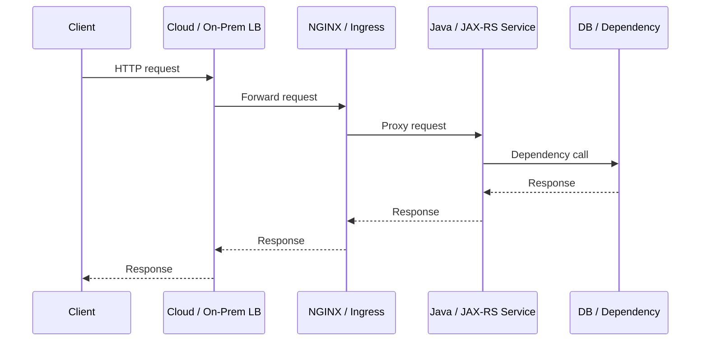
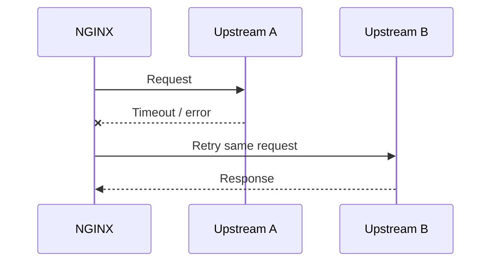
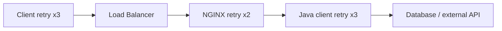
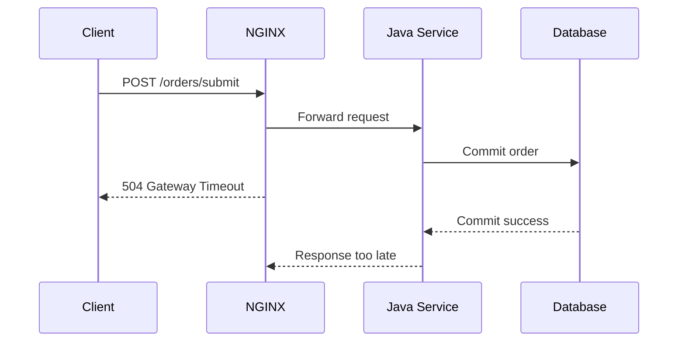

# Part 012 — Timeout Chain, Retry Behavior, and Failure Propagation

## 1. Tujuan Part Ini

Timeout adalah salah satu area paling sering disalahpahami dalam production system.

Banyak engineer melihat timeout sebagai angka konfigurasi:

```text
proxy_read_timeout 60s
```

Padahal timeout adalah **kontrak kegagalan antar layer**.

Dalam sistem enterprise Java/JAX-RS di balik NGINX, sebuah request bisa melewati banyak timeout:

```text
client timeout
DNS timeout
TCP connect timeout
TLS handshake timeout
cloud load balancer idle timeout
NGINX client timeout
NGINX upstream connect timeout
NGINX upstream read timeout
Kubernetes routing delay
application server request timeout
Java HTTP client timeout
database timeout
external integration timeout
transaction timeout
```

Jika timeout chain tidak selaras, gejalanya bisa membingungkan:

- client melihat timeout, aplikasi tetap bekerja;
- NGINX mencatat 499;
- NGINX mengembalikan 504;
- Java service mencatat sukses tetapi client gagal;
- operasi bisnis dieksekusi dua kali karena retry;
- request lambat membuat thread pool habis;
- downstream dependency failure berubah menjadi upstream overload.

Target part ini adalah membuat kamu mampu mendesain dan men-debug timeout/retry secara sistematis, terutama untuk service Java/JAX-RS yang menjalankan workflow bisnis penting seperti quote, order, validation, pricing, atau integration.

---

## 2. Mental Model: Timeout Chain

Request tidak memiliki satu timeout. Ia memiliki rantai timeout.



Setiap panah bisa punya timeout sendiri.

Prinsip penting:

```text
Timeout terluar sebaiknya lebih besar dari timeout layer dalam,
tetapi tidak terlalu besar sampai resource tertahan terlalu lama.
```

Jika client timeout lebih pendek dari NGINX timeout, client bisa pergi duluan. NGINX bisa mencatat 499.

Jika NGINX timeout lebih pendek dari backend operation, NGINX bisa memberi 504 walaupun Java masih memproses.

Jika Java dependency timeout terlalu panjang, thread pool Java bisa penuh sebelum NGINX menyerah.

---

## 3. Common NGINX Timeout Directives

### 3.1 `client_header_timeout`

Waktu maksimal untuk membaca request header dari client.

```nginx
client_header_timeout 10s;
```

Relevan untuk:

- slowloris-like behavior;
- client sangat lambat;
- network buruk;
- proteksi resource NGINX.

Failure symptom:

- 408 Request Timeout;
- connection closed sebelum request masuk backend.

### 3.2 `client_body_timeout`

Waktu maksimal antara operasi read body dari client.

```nginx
client_body_timeout 30s;
```

Relevan untuk:

- upload besar;
- multipart form;
- slow client;
- mobile/unstable network;
- file import endpoint.

Tidak sama dengan total upload duration. Ini biasanya timeout antar read operation.

### 3.3 `keepalive_timeout`

Berapa lama koneksi idle ke client dipertahankan.

```nginx
keepalive_timeout 65s;
```

Trade-off:

- terlalu pendek: connection churn tinggi;
- terlalu panjang: worker connection lebih lama tertahan;
- harus dipertimbangkan bersama cloud LB idle timeout.

### 3.4 `send_timeout`

Timeout saat mengirim response ke client.

```nginx
send_timeout 30s;
```

Relevan ketika client lambat membaca response.

Failure symptom:

- response besar putus;
- client lambat menyebabkan resource NGINX tertahan;
- error log terkait client timed out.

### 3.5 `proxy_connect_timeout`

Waktu maksimal untuk membuat koneksi ke upstream.

```nginx
proxy_connect_timeout 5s;
```

Failure symptom:

- 502 atau 504 tergantung kasus;
- upstream connect timeout;
- connection refused;
- network route issue;
- backend port salah.

Untuk Kubernetes, ini sering terkait:

- Service targetPort salah;
- Pod belum listening;
- NetworkPolicy;
- node/pod network issue;
- backend overloaded sampai accept queue bermasalah.

### 3.6 `proxy_send_timeout`

Timeout saat NGINX mengirim request ke upstream.

```nginx
proxy_send_timeout 30s;
```

Relevan untuk:

- request body besar;
- upstream lambat membaca body;
- backend thread/IO pressure;
- upload proxying.

### 3.7 `proxy_read_timeout`

Timeout saat NGINX menunggu response dari upstream.

```nginx
proxy_read_timeout 60s;
```

Ini sering paling banyak disalahpahami.

`proxy_read_timeout` bukan total business transaction timeout. Ia mengatur waktu tunggu antara operasi read response dari upstream.

Gejala jika terlalu pendek:

- 504 Gateway Timeout;
- Java service mungkin masih memproses;
- client menerima error walaupun operasi backend mungkin selesai.

Gejala jika terlalu panjang:

- NGINX connection tertahan lama;
- Java thread pool bisa penuh;
- failure dependency lambat menyebar;
- incident overload makin parah.

---

## 4. Status Code Related to Timeout and Upstream Failure

### 4.1 408 Request Timeout

Biasanya terkait client tidak mengirim header/body cukup cepat.

Layer:

```text
Client -> NGINX
```

Backend Java/JAX-RS biasanya belum menerima request.

### 4.2 499 Client Closed Request

499 adalah status non-standard yang sering dipakai NGINX untuk mencatat client menutup koneksi sebelum NGINX selesai merespons.

Makna praktis:

```text
Client pergi duluan.
```

Penyebab umum:

- browser/user cancel;
- mobile network drop;
- client timeout lebih pendek dari server;
- load balancer di depan menutup koneksi;
- downstream service lambat sehingga client menyerah;
- frontend/API client timeout terlalu agresif.

Dampak penting:

Java backend mungkin tetap memproses request. Untuk operasi mutating, ini bisa menghasilkan situasi:

```text
Client melihat gagal, tetapi server berhasil melakukan perubahan.
```

### 4.3 502 Bad Gateway

NGINX tidak mendapatkan response valid dari upstream.

Penyebab umum:

- connection refused;
- upstream closed connection prematurely;
- invalid HTTP response;
- protocol mismatch HTTP vs HTTPS;
- gRPC/backend protocol mismatch;
- backend crash;
- pod terminating;
- upstream TLS failure.

### 4.4 503 Service Unavailable

Service tidak tersedia.

Penyebab umum:

- tidak ada upstream available;
- all pods not ready;
- ingress default backend/service missing;
- rate/concurrency protection;
- maintenance mode;
- backend pool kosong.

### 4.5 504 Gateway Timeout

NGINX berhasil menjangkau upstream, tetapi upstream tidak merespons tepat waktu.

Penyebab umum:

- backend processing lambat;
- DB lambat;
- external dependency lambat;
- JVM thread starvation;
- deadlock/blocking call;
- timeout terlalu pendek untuk operation tertentu;
- response streaming tidak flush data cukup sering.

---

## 5. Timeout Chain Design Principle

Desain timeout harus dimulai dari domain dan dependency, bukan dari angka acak.

Pertanyaan awal:

1. Endpoint ini read-only atau mutating?
2. Berapa latency normal p50/p95/p99?
3. Apa dependency terdalamnya?
4. Apakah operation idempotent?
5. Apakah client boleh retry?
6. Apakah backend boleh tetap berjalan setelah client disconnect?
7. Apa dampak bisnis jika operation partial success?
8. Apakah ada async workflow yang lebih tepat?

Contoh chain untuk API read biasa:

```text
DB query timeout: 2s
Java service timeout budget: 3s
NGINX proxy_read_timeout: 5s
Cloud LB idle timeout: 10s
Client timeout: 8s
```

Contoh chain untuk long-running export:

```text
Prefer async job + polling/download
Jangan memaksa synchronous HTTP request 5 menit jika workflow bisa dipisah
```

Prinsip umum:

```text
Timeout terdalam harus gagal lebih awal supaya layer luar tidak menunggu resource yang sudah tidak berguna.
```

---

## 6. Retry Behavior: Useful but Dangerous

NGINX dapat mencoba upstream lain jika request gagal, menggunakan `proxy_next_upstream`.

Contoh:

```nginx
proxy_next_upstream error timeout http_502 http_503 http_504;
proxy_next_upstream_tries 2;
proxy_next_upstream_timeout 10s;
```

Mental model:



Untuk GET read-only, retry sering masuk akal.

Untuk POST mutating, retry bisa berbahaya.

---

## 7. Retry Safety and Idempotency

HTTP method memberi sinyal, tetapi tidak cukup.

| Method | Umumnya | Retry proxy-level aman? |
|---|---|---|
| GET | safe/read | Biasanya aman, jika backend benar-benar read-only |
| HEAD | safe/read | Biasanya aman |
| OPTIONS | metadata/preflight | Biasanya aman |
| PUT | idempotent secara semantik | Bisa aman jika implementasi benar |
| DELETE | idempotent secara semantik | Perlu hati-hati terhadap side effect/audit |
| POST | non-idempotent | Biasanya tidak aman tanpa idempotency key |
| PATCH | partial mutation | Biasanya tidak aman tanpa idempotency design |

Masalahnya: enterprise API sering tidak mengikuti semantik HTTP secara sempurna.

Contoh bahaya:

```text
POST /orders/submit
```

Jika upstream A menerima request, memproses order, tetapi koneksi putus sebelum response dikirim, NGINX bisa mencoba upstream B. Hasilnya bisa:

- order submit dua kali;
- duplicate external integration;
- double audit event;
- inconsistent workflow state;
- client menerima response dari percobaan kedua, bukan pertama.

Untuk domain quote/order, retry mutating operation harus didesain bersama:

- idempotency key;
- unique business command ID;
- transaction boundary;
- duplicate command detection;
- outbox pattern;
- exactly-once illusion avoidance;
- operation status query;
- safe client retry contract.

---

## 8. `proxy_next_upstream` Failure Categories

Contoh konfigurasi:

```nginx
proxy_next_upstream error timeout invalid_header http_502 http_503 http_504;
```

Kategori umum:

- `error`: error saat connect/send/read;
- `timeout`: timeout saat connect/send/read;
- `invalid_header`: upstream response header invalid;
- `http_500`, `http_502`, `http_503`, `http_504`: retry berdasarkan status;
- `non_idempotent`: behavior khusus untuk request non-idempotent jika diaktifkan pada versi/config tertentu.

Senior review question:

```text
Apakah status code ini benar-benar aman untuk di-retry di layer proxy?
```

Kadang 503 dari backend berarti dependency overload. Retry ke pod lain hanya memperluas overload.

Kadang 504 berarti operation masih berjalan. Retry bisa membuat duplicate work.

---

## 9. Retry Storm

Retry storm terjadi ketika banyak layer melakukan retry bersamaan.



Amplification:

```text
1 user request
x 3 client retries
x 2 NGINX upstream tries
x 3 Java downstream retries
= 18 dependency attempts
```

Di incident, retry storm bisa mengubah dependency kecil yang lambat menjadi full-system outage.

Mitigation:

- set retry budget;
- retry only idempotent operations;
- exponential backoff with jitter;
- circuit breaker;
- rate limiting;
- bulkhead;
- timeout budget propagation;
- fail fast for known overload;
- avoid retry at every layer.

---

## 10. Timeout Budget Propagation

Idealnya setiap layer memahami remaining time budget.

Contoh request budget:

```text
Client gives 5s total budget.
NGINX should not wait 60s.
Java should not call DB for 30s.
```

HTTP tidak punya standard universal untuk timeout budget propagation, tetapi banyak organisasi memakai header internal, misalnya:

```text
X-Request-Timeout-Ms: 5000
X-Deadline: 2026-07-11T10:15:30.000Z
```

Jika memakai pattern seperti ini:

- hanya percaya header dari trusted boundary;
- jangan izinkan client publik menentukan timeout arbitrarily;
- backend harus clamp nilai minimum/maksimum;
- log remaining budget;
- pastikan tidak bocor menjadi security issue.

Untuk Java/JAX-RS, budget bisa dipakai untuk:

- DB query timeout;
- HTTP client timeout;
- async task cancellation;
- business validation budget;
- graceful degradation.

---

## 11. Long-Running Request

Long-running synchronous request sering menjadi desain yang rapuh.

Contoh:

```text
POST /quotes/{id}/price
POST /orders/{id}/submit
GET /reports/export
POST /catalog/validate-large-bundle
```

Masalah:

- client timeout;
- NGINX timeout;
- load balancer idle timeout;
- backend thread tertahan;
- DB transaction panjang;
- retry ambiguity;
- user tidak tahu apakah operation berhasil.

Alternatif lebih aman:

```text
POST /jobs
202 Accepted + jobId
GET /jobs/{jobId}
GET /jobs/{jobId}/result
```

Atau untuk command mutating:

```text
POST /orders/submissions
Idempotency-Key: <uuid>

Response:
202 Accepted / 201 Created / 409 duplicate-known-command
```

NGINX timeout tidak boleh menjadi cara utama mengelola workflow panjang.

---

## 12. Slow Client vs Slow Upstream

Dua kasus ini berbeda.

### Slow Client

Client lambat mengirim request atau lambat membaca response.

NGINX directive relevan:

- `client_header_timeout`;
- `client_body_timeout`;
- `send_timeout`;
- buffering setting;
- body size limit.

Backend mungkin tidak bermasalah.

### Slow Upstream

Backend lambat menerima request atau lambat mengirim response.

NGINX directive relevan:

- `proxy_connect_timeout`;
- `proxy_send_timeout`;
- `proxy_read_timeout`;
- `proxy_next_upstream`;
- upstream keepalive;
- buffering.

Backend atau dependency mungkin bermasalah.

Debugging harus membedakan dua hal ini dari log:

```text
request_time
upstream_connect_time
upstream_header_time
upstream_response_time
bytes_sent
request_length
status
upstream_status
```

---

## 13. Failure Propagation to Java/JAX-RS

Timeout di NGINX tidak otomatis membatalkan pekerjaan di backend.

Scenario:



Dari perspektif client:

```text
Request failed.
```

Dari perspektif sistem:

```text
Order may have been submitted successfully.
```

Inilah alasan operation mutating harus punya:

- idempotency key;
- command ID;
- status lookup;
- deterministic duplicate response;
- audit trail;
- correlation ID;
- clear client retry contract.

Timeout bukan rollback transaction otomatis.

---

## 14. Java/JAX-RS Timeout Layers

Di Java backend, timeout bisa ada di banyak tempat:

- servlet/container request timeout;
- application server thread pool;
- async request timeout;
- JAX-RS client timeout;
- JDBC query timeout;
- database lock timeout;
- transaction timeout;
- message broker timeout;
- external HTTP API timeout;
- circuit breaker timeout;
- future/completion stage timeout;
- Kubernetes readiness timeout behavior.

Review pertanyaan:

```text
Apakah proxy timeout lebih panjang dari dependency timeout?
Apakah Java membatalkan downstream call ketika request client sudah tidak berguna?
Apakah operation mutating aman jika response gagal dikirim?
```

---

## 15. Kubernetes and Cloud Load Balancer Timeout Interaction

Traffic di Kubernetes/cloud biasanya tidak hanya:

```text
Client -> NGINX -> Pod
```

Lebih sering:

```text
Client -> DNS -> Cloud LB -> NGINX Ingress -> Service -> Pod -> Java
```

Setiap layer bisa punya timeout/idle timeout.

AWS/Azure/on-prem items to verify:

- load balancer idle timeout;
- target group health check interval;
- connection draining/deregistration delay;
- ingress controller timeout annotations;
- Service routing behavior;
- pod termination grace period;
- readiness probe delay;
- application shutdown hook;
- downstream dependency timeout.

A common problem:

```text
Cloud LB idle timeout = 60s
NGINX proxy_read_timeout = 300s
Java operation = 180s
```

Client may be disconnected by the LB before NGINX/Java complete. The NGINX config looks generous, but the actual outer layer is shorter.

---

## 16. NGINX Ingress Timeout Annotations

Dalam Kubernetes Ingress berbasis NGINX, timeout sering dikonfigurasi via annotation.

Contoh konseptual:

```yaml
metadata:
  annotations:
    nginx.ingress.kubernetes.io/proxy-connect-timeout: "5"
    nginx.ingress.kubernetes.io/proxy-send-timeout: "30"
    nginx.ingress.kubernetes.io/proxy-read-timeout: "60"
```

Hal yang harus diperhatikan:

- annotation support bergantung pada controller;
- nama annotation berbeda antara controller ecosystem;
- global ConfigMap bisa punya default;
- per-Ingress override bisa menciptakan inconsistency;
- snippet override bisa berbahaya;
- timeout terlalu besar bisa menyembunyikan backend problem.

Internal verification:

```text
Controller mana yang digunakan dan annotation mana yang valid?
```

Jangan copy-paste annotation dari internet tanpa memverifikasi controller.

---

## 17. Safe Baseline Config Example

Contoh standalone NGINX untuk API biasa:

```nginx
server {
    listen 443 ssl http2;
    server_name quote-order.example.internal;

    client_header_timeout 10s;
    client_body_timeout 30s;
    keepalive_timeout 65s;
    send_timeout 30s;

    location /api/ {
        proxy_connect_timeout 5s;
        proxy_send_timeout 30s;
        proxy_read_timeout 60s;

        proxy_next_upstream error timeout http_502 http_503 http_504;
        proxy_next_upstream_tries 2;
        proxy_next_upstream_timeout 10s;

        proxy_pass http://quote_order_api;
    }
}
```

Review notes:

- Angka ini bukan rekomendasi universal.
- `proxy_read_timeout 60s` harus cocok dengan endpoint behavior.
- Retry harus dicek terhadap idempotency.
- Untuk POST mutating, pertimbangkan membatasi retry atau menuntut idempotency key.
- Cloud LB idle timeout harus dicek.
- Java dependency timeout harus lebih pendek dari proxy timeout.

---

## 18. Timeout Strategy by Endpoint Type

| Endpoint type | Suggested design direction |
|---|---|
| Fast read API | short timeout, safe retry possible, cache optional |
| Search/list API | bounded timeout, pagination, query complexity limit |
| Mutating command | idempotency key, conservative retry, status lookup |
| File upload | body timeout/body size tuned, streaming/backpressure review |
| File download | send timeout, buffering/range review |
| SSE/WebSocket | long read timeout, buffering off, LB idle timeout aligned |
| Export/report | prefer async job instead of long synchronous timeout |
| External integration | strict downstream timeout + circuit breaker |

Senior principle:

```text
Timeout policy should be endpoint-aware, not one-size-fits-all.
```

---

## 19. Debugging 499

Question:

```text
Who closed the connection first?
```

Check:

- NGINX access log status 499;
- request_time;
- upstream_response_time;
- client timeout config;
- frontend/API client timeout;
- cloud LB idle timeout;
- mobile/network conditions;
- whether Java service completed after client disconnect;
- correlation ID in Java logs.

Common interpretation mistake:

```text
499 means NGINX failed.
```

Better interpretation:

```text
499 means the client side disappeared before NGINX could complete the response.
The cause may still be backend latency.
```

---

## 20. Debugging 502

Question:

```text
Did NGINX receive a valid response from upstream?
```

Check:

- NGINX error log;
- upstream connect failure;
- protocol mismatch;
- backend port;
- Service targetPort;
- pod readiness;
- container crash/restart;
- upstream TLS certificate verification;
- backend closed connection;
- application server max header/body issue.

Useful commands:

```bash
kubectl get ingress
kubectl get svc
kubectl get endpoints
kubectl get endpointslice
kubectl describe pod <pod>
kubectl logs <nginx-ingress-pod>
kubectl logs <backend-pod>
```

---

## 21. Debugging 503

Question:

```text
Was there an available backend at the time?
```

Check:

- no endpoints;
- all pods not ready;
- Service selector mismatch;
- wrong namespace/service name;
- ingress backend missing;
- backend pool marked unavailable;
- rate/concurrency limiting;
- maintenance config;
- rollout causing temporary zero ready pods.

Kubernetes-specific command:

```bash
kubectl get pods -l app=quote-order
kubectl get svc quote-order -o yaml
kubectl get endpoints quote-order -o yaml
kubectl describe ingress <ingress-name>
```

---

## 22. Debugging 504

Question:

```text
Which layer waited too long for which downstream?
```

Check:

- `proxy_read_timeout`;
- upstream response time;
- Java request duration;
- DB query duration;
- external API latency;
- JVM thread pool;
- GC pause;
- CPU throttling;
- cloud LB timeout;
- retry amplification.

Important distinction:

```text
504 at NGINX does not prove Java failed.
It proves NGINX did not receive timely upstream response.
```

---

## 23. Observability Requirements

For timeout debugging, access logs should include:

```text
$request_id
$remote_addr
$host
$request_method
$request_uri
$status
$request_time
$upstream_addr
$upstream_status
$upstream_connect_time
$upstream_header_time
$upstream_response_time
$body_bytes_sent
$request_length
```

Application logs should include:

- same correlation/request ID;
- endpoint name;
- business operation ID;
- latency;
- downstream calls;
- timeout exceptions;
- cancellation behavior;
- idempotency key if relevant.

Metrics should include:

- status code rate;
- 499/502/503/504 count;
- p95/p99 latency;
- upstream connect/header/response time;
- JVM thread pool saturation;
- DB pool usage;
- dependency latency;
- pod restarts/readiness failures.

---

## 24. Timeout Anti-Patterns

### Anti-pattern 1 — Increasing Timeout as Default Fix

```text
504? Increase proxy_read_timeout from 60s to 300s.
```

This may hide the symptom while worsening resource retention.

Better:

- identify why backend is slow;
- classify endpoint;
- move long operation async;
- tune dependency timeout;
- add backpressure;
- improve observability.

### Anti-pattern 2 — Same Timeout for Every Endpoint

Fast read API and report export should not necessarily share the same timeout.

### Anti-pattern 3 — Retry POST Without Idempotency

This can corrupt business workflow.

### Anti-pattern 4 — Timeout Longer Than Outer Load Balancer

If LB closes at 60s, NGINX 300s is misleading.

### Anti-pattern 5 — Backend Timeout Longer Than Proxy Timeout

Java keeps working after NGINX/client gives up, causing wasted work and ambiguous outcome.

---

## 25. Internal Verification Checklist

Use this checklist in CSG/team environment without assuming internal architecture:

- What are timeout values at client/frontend/API consumer?
- What is cloud/on-prem load balancer idle timeout?
- What are NGINX `client_*`, `send_timeout`, and `proxy_*` timeout values?
- Are timeout values configured globally, per server/location, per Ingress annotation, or ConfigMap?
- Are there endpoint-specific timeout policies?
- What is Java application server request timeout?
- What are Java HTTP client timeout values?
- What are DB query, lock, and transaction timeout values?
- Are retry policies configured in NGINX, client, Java service, service mesh, or API gateway?
- Are mutating endpoints protected by idempotency key or command ID?
- Are 499/502/503/504 visible in dashboard?
- Do logs include upstream connect/header/response time?
- Can correlation ID connect NGINX logs to Java/JAX-RS logs?
- Is there a runbook for 504 vs backend success ambiguity?
- Are long-running operations synchronous by design or accidental?

---

## 26. PR Review Checklist

When reviewing timeout/retry changes:

- What failure is this change trying to fix?
- Which layer timed out first?
- Is this endpoint read-only, idempotent, or mutating?
- Is retry safe for this operation?
- Could this cause duplicate business command execution?
- Are dependency timeouts shorter than application/proxy timeout?
- Is cloud LB idle timeout aligned?
- Are WebSocket/SSE/streaming endpoints handled separately?
- Will longer timeout increase resource exhaustion risk?
- Is there a metric/dashboard to validate impact?
- Is rollback easy?
- Are incident notes linked to the change?
- Is the change global or scoped to one route?

---

## 27. Practical Decision Table

| Symptom | Likely area | First evidence to check |
|---|---|---|
| 408 | slow client/header/body | NGINX error log, client body/header timeout |
| 499 | client closed | request_time, client timeout, LB idle timeout |
| 502 | invalid/no upstream response | error log, upstream connect, protocol, pod status |
| 503 | no available service/capacity | endpoints, readiness, service selector, rate limit |
| 504 | upstream too slow | upstream_response_time, Java latency, DB/dependency metrics |
| duplicate operation | unsafe retry | idempotency key, NGINX retry, client retry, app logs |
| intermittent failure | one backend bad | upstream_addr/status distribution |
| only long requests fail | timeout mismatch | proxy_read_timeout, LB idle timeout, endpoint latency |

---

## 28. Production Design Rule

A good production timeout design has these properties:

1. Every layer has explicit timeout.
2. Inner dependency timeouts fail before outer request timeouts.
3. Retry is limited and idempotency-aware.
4. Mutating commands have idempotency or status lookup.
5. Long-running work is asynchronous where possible.
6. 499/502/503/504 are observable separately.
7. Timeout changes are route-specific when possible.
8. Cloud LB, NGINX, Kubernetes, and Java settings are aligned.
9. Runbook explains ambiguity between client failure and backend success.
10. Incidents lead to better budgets, not only larger numbers.

---

## 29. Ringkasan

Timeout dan retry bukan sekadar tuning parameter. Mereka adalah bagian dari failure semantics sistem.

NGINX bisa:

- memutus client lambat;
- menunggu upstream;
- memberi 504;
- mencatat 499;
- retry ke backend lain;
- memperbesar atau mengurangi impact backend failure.

Untuk senior backend engineer, pertanyaan utamanya:

```text
Jika request gagal di client, apakah operation benar-benar gagal di backend?
Jika NGINX retry, apakah operation aman dieksekusi lagi?
Jika backend lambat, layer mana yang harus fail first?
Jika timeout dinaikkan, resource apa yang tertahan lebih lama?
```

Part berikutnya masuk ke **buffering, streaming, file upload/download, large payload, dan backpressure** — area yang sangat terkait dengan timeout dan upstream resource pressure.
