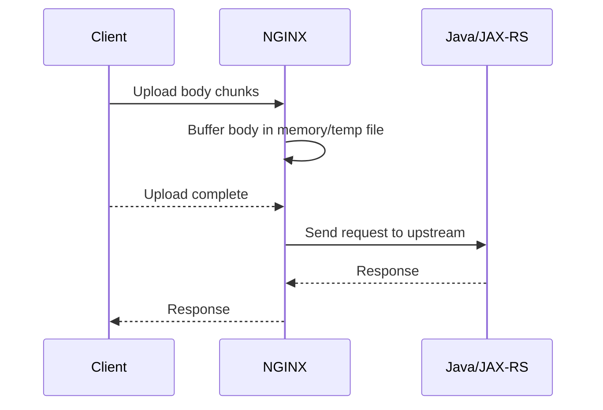
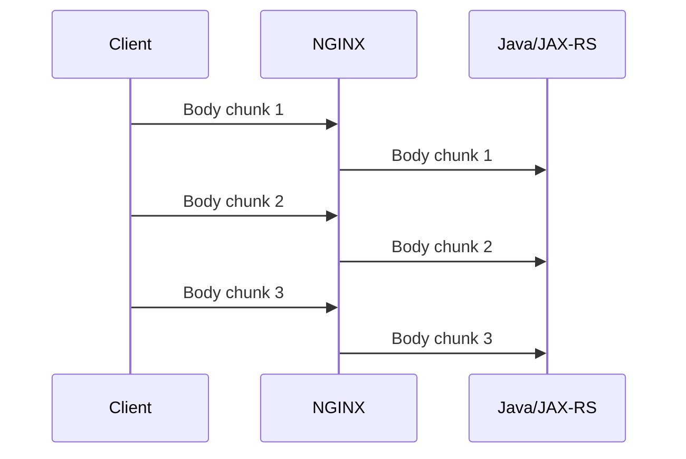
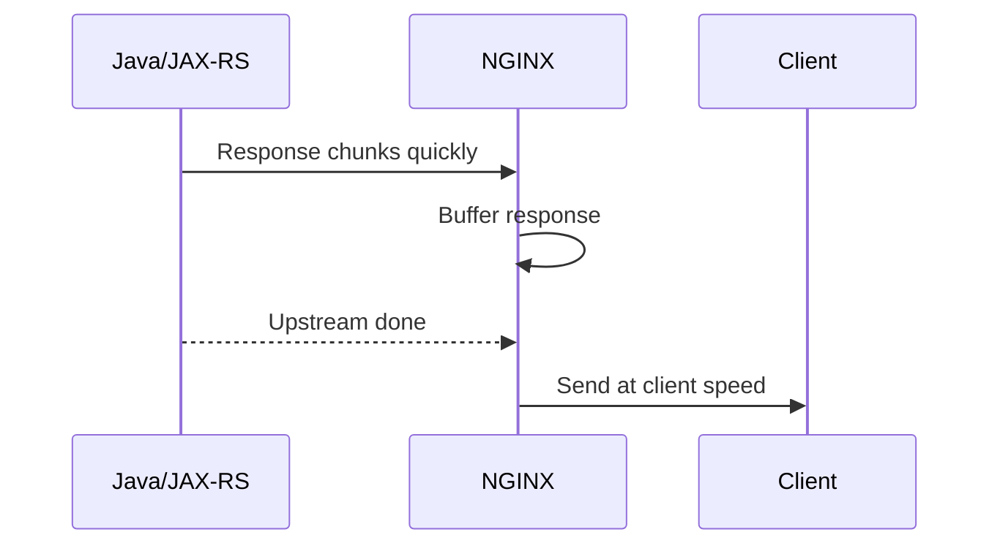
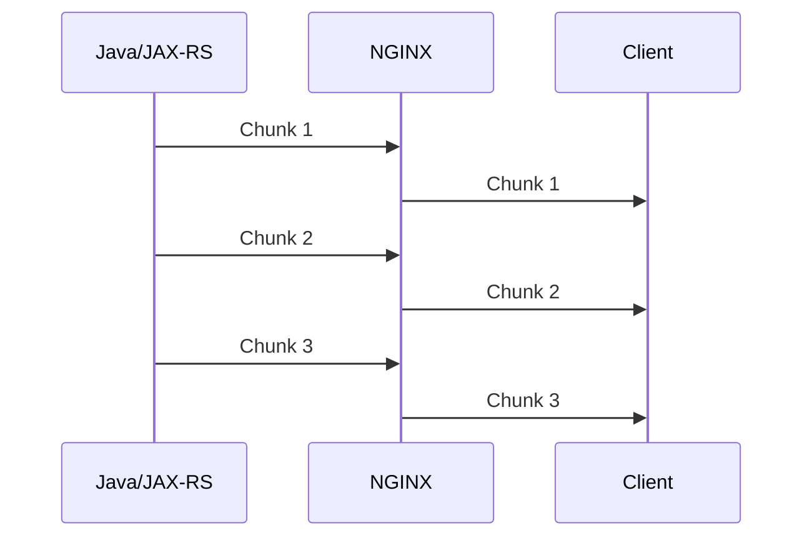

# Part 013 — Buffering, Streaming, Uploads, Downloads, and Backpressure

## 1. Tujuan Part Ini

Buffering adalah salah satu perilaku NGINX yang terlihat sederhana tetapi sangat menentukan karakter produksi sebuah API.

Di depan Java/JAX-RS service, NGINX dapat bertindak sebagai:

- penerima request body dari client;
- penyimpan sementara request body sebelum upstream dipanggil;
- pembaca response upstream sebelum dikirim ke client;
- pelindung backend dari slow client;
- penyebab delay pada streaming response jika salah konfigurasi;
- penyebab penggunaan disk tinggi karena temporary file;
- lapisan yang mengubah failure mode upload besar menjadi `413`, `408`, `499`, `502`, atau `504`.

Target part ini adalah membuat kamu mampu menjawab pertanyaan praktis:

```text
Apakah request body dikirim langsung ke Java service, atau ditahan dulu oleh NGINX?
Apakah response Java dikirim streaming ke client, atau dibuffer dulu oleh NGINX?
Di mana body besar disimpan?
Apa yang terjadi jika client upload lambat?
Apa yang terjadi jika Java service streaming lambat?
Kapan harus mematikan buffering?
Kapan buffering justru melindungi backend?
```

Untuk sistem enterprise seperti CPQ, quote, order, catalog, billing, atau integration platform, payload tidak selalu kecil. Ada upload dokumen, export CSV, download laporan, attachment, import bulk data, dan response streaming. Kalau buffering tidak dipahami, engineer mudah salah diagnosis: aplikasi disalahkan, padahal bottleneck ada di NGINX atau sebaliknya.

---

## 2. Mental Model: NGINX Bisa Memisahkan Kecepatan Client dan Backend

Tanpa proxy, client berbicara langsung ke backend.

```text
Client <----same connection pressure----> Java service
```

Dengan NGINX, ada dua koneksi berbeda:

```text
Client <----connection A----> NGINX <----connection B----> Java/JAX-RS service
```

Karena koneksinya terpisah, NGINX bisa:

- membaca request body dari client terlebih dahulu;
- menyimpan body di memory atau temporary file;
- baru mengirim body ke upstream setelah lengkap;
- membaca response upstream terlebih dahulu;
- menyimpan response di buffer;
- mengirim response ke client dengan kecepatan client.

Ini berarti NGINX dapat menjadi **shock absorber** antara client yang lambat dan backend yang mahal.

Tetapi konsekuensinya:

- latency bisa bertambah;
- streaming bisa berubah menjadi batch-like response;
- disk temporary file bisa penuh;
- memory bisa naik;
- observability bisa membingungkan karena aplikasi merasa selesai tetapi client belum menerima semua data;
- timeout chain bisa terpicu di layer berbeda.

---

## 3. Request Buffering vs Response Buffering

Ada dua konsep berbeda:

| Konsep | Arah Data | Pertanyaan Utama |
|---|---:|---|
| Request buffering | Client → NGINX → upstream | Apakah body client ditahan dulu sebelum dikirim ke backend? |
| Response buffering | Upstream → NGINX → client | Apakah response backend ditahan dulu sebelum dikirim ke client? |

Directive penting:

```nginx
proxy_request_buffering on;
proxy_buffering on;
```

Keduanya sering tertukar. Padahal dampaknya berbeda total.

---

## 4. Request Buffering

Request buffering mengatur apakah NGINX membaca seluruh request body dari client sebelum meneruskannya ke upstream.

Default umum untuk proxy adalah buffering aktif.

```nginx
location /api/import {
    proxy_request_buffering on;
    proxy_pass http://quote_order_api;
}
```

Dengan konfigurasi ini:



Dampaknya:

- Java service tidak menerima request sampai body lengkap diterima NGINX;
- backend terlindungi dari slow upload client;
- NGINX menanggung memory/disk pressure;
- jika upload besar, body bisa masuk temporary file;
- jika client gagal upload, upstream mungkin belum pernah dipanggil.

Ini baik untuk endpoint biasa, terutama jika backend tidak ingin thread/connection terbuka hanya karena client lambat upload.

---

## 5. Request Buffering Off

Jika request buffering dimatikan:

```nginx
location /api/upload/stream {
    proxy_request_buffering off;
    proxy_pass http://quote_order_api;
}
```

Maka NGINX akan meneruskan body ke upstream saat body masih datang dari client.



Dampaknya:

- Java service mulai menerima body lebih cepat;
- cocok untuk true streaming upload;
- backend ikut merasakan slow client;
- connection upstream tertahan selama client upload;
- thread/request context aplikasi bisa hidup lebih lama;
- jika client putus, backend mungkin sudah menerima sebagian body.

Gunakan ini hanya jika aplikasi memang didesain untuk streaming request body.

Untuk banyak endpoint REST enterprise, request buffering `on` lebih aman.

---

## 6. Kapan Request Buffering On Lebih Baik

Request buffering `on` biasanya lebih cocok untuk:

- JSON API biasa;
- form submit biasa;
- upload dokumen ukuran sedang;
- endpoint yang butuh body lengkap sebelum proses;
- backend Java yang memakai servlet/JAX-RS request body parsing biasa;
- endpoint yang tidak dirancang untuk partial streaming;
- perlindungan backend dari slow clients.

Contoh:

```nginx
location /api/orders {
    proxy_request_buffering on;
    proxy_pass http://quote_order_api;
}
```

Keuntungan operasional:

- upstream connection lebih singkat;
- Java worker/thread tidak habis karena client lambat;
- retry/failure lebih mudah dipahami karena upstream belum dipanggil sebelum body lengkap;
- aplikasi menerima request yang sudah utuh.

Trade-off:

- upload besar membutuhkan buffer/temp file;
- client mungkin menunggu lebih lama sebelum backend mulai proses;
- observability perlu membedakan client upload time vs upstream processing time.

---

## 7. Kapan Request Buffering Off Diperlukan

Request buffering `off` masuk akal untuk:

- true streaming upload;
- large file upload yang diproses incremental;
- pass-through upload ke object storage gateway;
- endpoint yang sengaja membaca stream secara bertahap;
- use case di mana latency awal lebih penting daripada melindungi upstream.

Tetapi ini harus dianggap keputusan arsitektural, bukan tuning acak.

Internal verification checklist:

```text
Apakah Java/JAX-RS endpoint benar-benar membaca InputStream secara streaming?
Apakah framework/application server tetap men-buffer body di layer lain?
Apakah endpoint aman jika client disconnect di tengah upload?
Apakah ada cleanup partial object/file?
Apakah timeout client_body/proxy_send/proxy_read sudah selaras?
Apakah ada backpressure sampai downstream storage?
```

Kesalahan umum: mematikan request buffering karena upload besar gagal, padahal masalah sebenarnya adalah `client_max_body_size`, disk temporary path, timeout, atau storage downstream.

---

## 8. Response Buffering

Response buffering mengatur apakah NGINX membaca response dari upstream dulu sebelum mengirimnya ke client.

```nginx
location /api/reports {
    proxy_buffering on;
    proxy_pass http://quote_order_api;
}
```

Dengan response buffering aktif:



Dampaknya:

- Java service bisa selesai cepat walaupun client lambat;
- NGINX menanggung transfer ke client;
- backend connection cepat dilepas;
- response besar bisa masuk temporary file;
- streaming response bisa tertahan dan terlihat tidak real-time.

---

## 9. Response Buffering Off

Untuk streaming response, response buffering sering harus dimatikan.

```nginx
location /api/stream {
    proxy_buffering off;
    proxy_pass http://quote_order_api;
}
```

Dengan buffering off:



Cocok untuk:

- Server-Sent Events;
- streaming JSON lines;
- long-running progress event;
- real-time notification stream;
- chunked export yang harus mulai diterima client segera.

Tidak cocok untuk semua response besar. Untuk file download biasa, response buffering bisa tetap berguna karena melindungi upstream dari slow client.

---

## 10. Buffer Size dan Temporary File

NGINX memakai memory buffer terlebih dahulu. Jika response/request lebih besar dari buffer, data dapat ditulis ke temporary file.

Directive yang sering relevan:

```nginx
client_body_buffer_size 128k;
client_body_temp_path /var/cache/nginx/client_temp;

proxy_buffer_size 16k;
proxy_buffers 8 16k;
proxy_busy_buffers_size 32k;
proxy_max_temp_file_size 1024m;
proxy_temp_path /var/cache/nginx/proxy_temp;
```

Mental model:

```text
small payload  -> memory buffer
large payload  -> memory buffer + temp file
slow client    -> more data retained by NGINX
fast upstream  -> NGINX may buffer response faster than client reads
```

Dalam container/Kubernetes, ini penting karena temp file memakai filesystem container atau mounted volume.

Jika volume kecil atau read-only, gejalanya bisa berupa:

- `500` dari NGINX;
- `502`/`504` tergantung timing;
- error log berisi gagal menulis temporary file;
- pod eviction karena ephemeral storage;
- latency tinggi karena disk I/O;
- throughput turun saat banyak download/upload besar.

---

## 11. client_max_body_size dan 413

`client_max_body_size` membatasi ukuran request body.

```nginx
server {
    client_max_body_size 20m;
}
```

Jika client mengirim body lebih besar, NGINX dapat mengembalikan:

```text
413 Payload Too Large
```

Untuk Kubernetes ingress, sering dikonfigurasi melalui annotation, tergantung controller yang dipakai.

Contoh community ingress-nginx:

```yaml
metadata:
  annotations:
    nginx.ingress.kubernetes.io/proxy-body-size: "20m"
```

Hal yang harus diperhatikan:

- limit di NGINX harus konsisten dengan limit di cloud load balancer;
- limit di NGINX harus konsisten dengan limit application server;
- limit di NGINX harus konsisten dengan business policy;
- error response 413 sebaiknya jelas bagi client;
- jangan menaikkan limit tanpa memahami storage, memory, timeout, dan security impact.

Untuk enterprise API, body size adalah security dan capacity decision, bukan sekadar developer convenience.

---

## 12. Large Upload Failure Modes

Upload besar bisa gagal di banyak titik.

| Gejala | Kemungkinan Penyebab |
|---|---|
| `413` | `client_max_body_size` / ingress body size terlalu kecil |
| `408` | client terlalu lama mengirim header/body |
| `499` | client disconnect sebelum NGINX selesai |
| `502` | upstream connection gagal saat body diteruskan |
| `504` | upstream terlalu lama memproses setelah upload selesai |
| Upload berhenti di tengah | client/network/LB idle timeout |
| Pod disk penuh | request body temporary file terlalu besar |
| Java memory naik | aplikasi/framework men-buffer seluruh body |

Debugging upload harus dimulai dari pertanyaan:

```text
Apakah request pernah sampai ke Java service?
Jika sampai, apakah body lengkap atau partial?
Apakah NGINX menulis body ke temp file?
Apakah client disconnect?
Apakah limit di LB, NGINX, Ingress, dan aplikasi konsisten?
```

---

## 13. Java/JAX-RS Upload Considerations

Di sisi Java/JAX-RS, upload bisa terlihat sebagai:

- `InputStream`;
- multipart form;
- framework-managed file upload;
- byte array;
- temporary file;
- object storage handoff.

Risiko umum:

```java
byte[] allBytes = inputStream.readAllBytes();
```

Pola seperti ini terlihat mudah tetapi berbahaya untuk payload besar karena seluruh body masuk memory aplikasi.

Pola yang lebih aman adalah streaming dengan bounded buffer:

```java
try (InputStream in = requestStream;
     OutputStream out = storageOutputStream) {
    byte[] buffer = new byte[8192];
    int read;
    while ((read = in.read(buffer)) != -1) {
        out.write(buffer, 0, read);
    }
}
```

Tetapi jika NGINX request buffering `on`, Java tetap baru mulai membaca setelah NGINX menerima body lengkap. Itu tidak salah; hanya perlu dipahami.

Jika aplikasi benar-benar ingin end-to-end streaming, maka perlu dicek semua layer:

```text
Client streaming supported?
Cloud LB buffering atau tidak?
NGINX proxy_request_buffering off?
Application server tidak buffer seluruh body?
JAX-RS endpoint membaca InputStream incremental?
Downstream storage menerima stream?
Timeout cukup panjang?
Partial upload cleanup ada?
```

---

## 14. Download Besar dan Binary Response

Download besar sering tampak sederhana: backend mengirim file, client menerima file.

Tetapi di balik NGINX, ada beberapa pola:

### Pola A — Backend mengirim file lewat response body

```text
Java service -> NGINX -> Client
```

Kelebihan:

- sederhana;
- aplikasi mengontrol authorization;
- cocok untuk file kecil/sedang.

Risiko:

- Java thread/connection tertahan selama transfer;
- slow client bisa menahan resource jika NGINX buffering off;
- response besar bisa masuk NGINX temp file jika buffering on;
- throughput backend turun.

### Pola B — Backend memberi signed URL/object storage URL

```text
Java service -> signed URL -> Client downloads from object storage/CDN
```

Kelebihan:

- aplikasi tidak menjadi file transfer engine;
- scalable untuk file besar;
- storage/CDN menangani range, retry, throughput.

Risiko:

- authorization model lebih kompleks;
- URL expiry dan audit harus benar;
- network/private endpoint harus dipahami.

### Pola C — NGINX melayani static/binary file

```text
NGINX -> file system/object cache -> Client
```

Kelebihan:

- efisien untuk static asset;
- mengurangi beban Java.

Risiko:

- path traversal;
- cache poisoning;
- stale file;
- sensitive file exposure.

Untuk enterprise backend, jangan otomatis menjadikan Java/JAX-RS sebagai file transfer server untuk payload besar tanpa alasan kuat.

---

## 15. Range Request dan Partial Content

Client download besar sering memakai Range request:

```http
Range: bytes=1000-1999
```

Response yang benar:

```http
206 Partial Content
Content-Range: bytes 1000-1999/1000000
```

NGINX dapat menangani static file range dengan baik. Tetapi jika file diproduksi oleh Java service, aplikasi harus mendukung Range semantics jika client membutuhkannya.

Hal yang perlu dicek:

- apakah NGINX meneruskan Range header ke upstream;
- apakah Java service mendukung `206 Partial Content`;
- apakah object storage/CDN lebih cocok menangani range;
- apakah caching layer mengerti Range;
- apakah authorization tetap berlaku untuk partial request.

Failure mode:

- client resume download gagal;
- download besar selalu restart dari awal;
- proxy cache menyimpan response yang tidak sesuai;
- API mengembalikan `200 OK` untuk Range request yang seharusnya `206`.

---

## 16. Backpressure: Konsep yang Wajib Dipahami

Backpressure berarti downstream yang lambat memberi tekanan balik ke upstream.

Dalam chain:

```text
Client -> NGINX -> Java service -> DB/object storage/external API
```

Slowdown di satu titik harus dikendalikan agar tidak menghancurkan seluruh sistem.

Contoh:

- client lambat membaca download;
- NGINX buffer penuh;
- upstream Java tidak bisa mengirim lebih cepat;
- thread Java tertahan;
- thread pool habis;
- request lain ikut lambat;
- NGINX mulai mencatat 502/504;
- client retry;
- overload memburuk.

Buffering dapat memutus sebagian backpressure:

```text
Java service selesai cepat -> NGINX menanggung slow client
```

Tetapi buffering memindahkan pressure ke NGINX:

```text
NGINX memory/disk/network menjadi bottleneck
```

Tidak ada konfigurasi gratis. Setiap pilihan hanya memindahkan risiko.

---

## 17. Streaming Response dari Java/JAX-RS

JAX-RS dapat mengirim streaming response melalui `StreamingOutput` atau mekanisme serupa.

Contoh konseptual:

```java
@GET
@Path("/exports/{id}")
public Response export(@PathParam("id") String id) {
    StreamingOutput stream = output -> {
        exportService.writeCsv(id, output);
    };

    return Response.ok(stream)
        .header("Content-Type", "text/csv")
        .header("Content-Disposition", "attachment; filename=export.csv")
        .build();
}
```

Jika NGINX `proxy_buffering on`, client mungkin tidak menerima data secara incremental seperti yang diharapkan.

Untuk true streaming:

```nginx
location /api/exports/stream {
    proxy_buffering off;
    proxy_read_timeout 10m;
    proxy_pass http://quote_order_api;
}
```

Tetapi hati-hati:

- streaming menahan connection lebih lama;
- timeout harus lebih panjang;
- observability harus membedakan long request sehat vs stuck request;
- rolling restart bisa memutus stream;
- load balancer idle timeout harus selaras.

---

## 18. Server-Sent Events Akan Dibahas Lebih Dalam di Part 014

SSE adalah kasus khusus streaming response.

Untuk SSE, buffering response hampir selalu bermasalah karena event kecil harus segera sampai ke client.

Pola dasar:

```nginx
location /api/events {
    proxy_buffering off;
    proxy_cache off;
    proxy_read_timeout 1h;
    proxy_pass http://quote_order_api;
}
```

Namun detail WebSocket, SSE, long polling, idle timeout, sticky session, dan long-lived connection akan dibahas khusus di Part 014.

Part ini cukup menekankan prinsip dasarnya:

```text
Streaming yang benar membutuhkan semua layer memperlakukan response sebagai aliran, bukan file utuh.
```

---

## 19. Compression dan Buffering

Compression dapat berinteraksi dengan buffering.

Jika response dikompresi di NGINX:

```nginx
gzip on;
gzip_types application/json text/plain text/csv;
```

NGINX mungkin perlu melihat cukup data untuk menghasilkan compressed output yang efisien. Untuk response streaming real-time, compression bisa menambah delay karena data kecil tertahan untuk compression buffer.

Prinsip praktis:

- JSON response biasa: compression sering bermanfaat;
- CSV besar: compression bisa bermanfaat tetapi CPU cost harus dihitung;
- SSE: compression sering perlu dimatikan;
- WebSocket: mekanisme berbeda, jangan disamakan dengan gzip HTTP response biasa;
- binary already-compressed files: jangan dikompresi ulang.

Compression detail dibahas di Part 016, tetapi di sini penting karena banyak “streaming lambat” ternyata disebabkan buffering/compression interaction.

---

## 20. Kubernetes Ingress Considerations

Di Kubernetes, kamu jarang mengedit `nginx.conf` langsung. Perilaku buffering sering diatur melalui annotation dan ConfigMap.

Contoh community ingress-nginx:

```yaml
apiVersion: networking.k8s.io/v1
kind: Ingress
metadata:
  name: quote-order-api
  annotations:
    nginx.ingress.kubernetes.io/proxy-body-size: "50m"
    nginx.ingress.kubernetes.io/proxy-request-buffering: "on"
    nginx.ingress.kubernetes.io/proxy-buffering: "on"
spec:
  ingressClassName: nginx
  rules:
    - host: api.example.internal
      http:
        paths:
          - path: /api
            pathType: Prefix
            backend:
              service:
                name: quote-order-api
                port:
                  number: 8080
```

Untuk streaming endpoint, bisa dipisah ke Ingress berbeda atau path berbeda:

```yaml
metadata:
  annotations:
    nginx.ingress.kubernetes.io/proxy-buffering: "off"
    nginx.ingress.kubernetes.io/proxy-read-timeout: "3600"
```

Tetapi jangan asal override annotation pada Ingress shared. Perubahan buffering di satu host/path bisa memengaruhi endpoint lain jika Ingress digabung terlalu besar.

---

## 21. Cloud Load Balancer dan Buffering

Sebelum request mencapai NGINX, bisa ada layer lain:

```text
Client -> CDN/WAF -> Cloud Load Balancer -> NGINX Ingress -> Service -> Pod
```

Layer tersebut juga bisa punya limit dan timeout:

- maximum request body size;
- idle timeout;
- header size limit;
- request/response buffering behavior;
- HTTP/2 to HTTP/1.1 conversion;
- TLS termination;
- WAF inspection;
- upload/download timeout.

Jadi saat upload/download gagal, jangan hanya cek NGINX.

Internal verification checklist:

```text
Apa limit body di cloud LB/WAF/CDN?
Apakah TLS termination terjadi sebelum NGINX?
Apakah LB punya idle timeout lebih pendek dari proxy_read_timeout?
Apakah WAF membaca seluruh body sebelum meneruskan request?
Apakah response streaming tertahan di layer sebelum NGINX?
```

---

## 22. Observability untuk Buffering dan Payload

Access log default sering tidak cukup. Untuk payload handling, log idealnya membantu menjawab:

```text
Berapa ukuran request body?
Berapa ukuran response body?
Berapa total request time?
Berapa upstream response time?
Apakah upstream pernah dipanggil?
Status apa yang dikirim ke client?
Apakah client disconnect?
Upstream address mana yang dipakai?
```

Contoh log format konseptual:

```nginx
log_format upstream_json escape=json
'{'
  '"time":"$time_iso8601",'
  '"request_id":"$request_id",'
  '"remote_addr":"$remote_addr",'
  '"method":"$request_method",'
  '"uri":"$request_uri",'
  '"status":$status,'
  '"request_length":$request_length,'
  '"body_bytes_sent":$body_bytes_sent,'
  '"request_time":$request_time,'
  '"upstream_response_time":"$upstream_response_time",'
  '"upstream_addr":"$upstream_addr"'
'}';
```

Untuk debugging upload, `request_length` sangat membantu. Untuk download, `body_bytes_sent` penting.

Untuk 499, log menunjukkan client disconnect. Ini sangat penting untuk membedakan:

```text
backend lambat -> client menyerah -> 499
vs
backend gagal -> NGINX mengembalikan 502/504
```

---

## 23. Error Log yang Harus Dicari

Saat buffering/temp file bermasalah, error log sering lebih informatif daripada access log.

Cari pola seperti:

```text
client intended to send too large body
client request body is buffered to a temporary file
an upstream response is buffered to a temporary file
open() "/var/cache/nginx/..." failed
writev() failed
no space left on device
client prematurely closed connection
upstream prematurely closed connection
```

Catatan penting: pesan bahwa body/response “buffered to a temporary file” tidak selalu error. Itu bisa normal untuk payload besar. Yang perlu dilihat adalah frekuensi, ukuran, dan dampaknya ke latency/disk.

---

## 24. Performance Concern

Buffering memengaruhi performa dalam beberapa dimensi.

### Memory

Buffer terlalu besar memperbesar memory footprint per connection.

```text
many concurrent large responses x large buffers = memory pressure
```

### Disk

Payload besar atau slow client bisa membuat temp file banyak.

```text
large upload/download + slow clients = ephemeral storage pressure
```

### CPU

Compression plus buffering bisa menaikkan CPU.

```text
large JSON/CSV response + gzip high level = CPU saturation
```

### Connection

Streaming dan long-lived transfer menahan connection lebih lama.

```text
long download + no buffering = upstream connection held longer
```

### Latency

Buffering bisa menambah time-to-first-byte.

```text
client waits until NGINX receives/generates enough data
```

Tuning harus berdasarkan traffic profile, bukan copy-paste config.

---

## 25. Security Concern

Payload handling adalah security boundary.

Risiko utama:

- upload body terlalu besar untuk exhaust disk/memory;
- header/body limit tidak konsisten;
- multipart parser vulnerability di aplikasi;
- path traversal pada file download;
- sensitive file exposure;
- content sniffing jika header salah;
- archive bomb atau compressed payload bomb;
- malware upload jika tidak ada scanning;
- log berisi payload sensitif;
- cache menyimpan file/API response privat;
- SSRF via URL upload/import endpoint.

NGINX bisa membantu dengan:

```nginx
client_max_body_size 20m;
large_client_header_buffers 4 16k;
client_body_timeout 30s;
```

Tetapi NGINX tidak menggantikan validasi aplikasi:

```text
file type validation
business authorization
virus/malware scanning
object ownership check
content security policy
retention policy
audit trail
```

---

## 26. Production Debugging: Upload Besar Gagal

Gunakan alur ini.

### Step 1 — Tentukan status dari client

```bash
curl -v -F "file=@large.pdf" https://api.example.com/api/upload
```

Catat:

```text
HTTP status
response body
berapa lama sampai gagal
apakah gagal sebelum upload selesai atau setelah upload selesai
```

### Step 2 — Cek access log NGINX

Cari request berdasarkan request ID, URI, IP, atau timestamp.

Pertanyaan:

```text
Apakah NGINX mencatat request?
Status berapa?
request_length berapa?
upstream_response_time kosong atau ada?
```

Jika `upstream_response_time` kosong, kemungkinan request tidak pernah sampai ke Java service.

### Step 3 — Cek error log

Cari:

```text
client intended to send too large body
client prematurely closed connection
no space left on device
timed out while reading client request body
```

### Step 4 — Cek Ingress/body limit

```bash
kubectl describe ingress <name> -n <namespace>
kubectl get ingress <name> -n <namespace> -o yaml
```

Cari annotation body size.

### Step 5 — Cek aplikasi

Jika request sampai ke aplikasi:

```text
Apakah multipart parser limit lebih kecil?
Apakah application server limit lebih kecil?
Apakah request timeout aplikasi lebih pendek?
Apakah storage downstream lambat?
Apakah partial upload cleanup berjalan?
```

---

## 27. Production Debugging: Streaming Tidak Real-Time

Gejala:

```text
backend menulis event setiap detik,
tetapi client menerima semua sekaligus setelah lama.
```

Kemungkinan penyebab:

- `proxy_buffering on`;
- compression buffering;
- framework Java tidak flush output;
- cloud LB/CDN buffering;
- client library tidak membaca stream incremental;
- response header tidak sesuai;
- HTTP/2/proxy behavior berbeda;
- ingress annotation tidak diterapkan ke path yang benar.

Checklist:

```text
Cek proxy_buffering off.
Cek gzip off untuk endpoint streaming.
Cek Java flush.
Cek Content-Type.
Cek curl --no-buffer.
Cek access log request_time dan upstream_response_time.
Cek apakah request melewati CDN/WAF yang buffering.
```

Contoh test:

```bash
curl -N -v https://api.example.com/api/events
```

`-N` / `--no-buffer` membantu melihat apakah client menerima chunk/event secara langsung.

---

## 28. Production Debugging: Download Lambat

Pertanyaan awal:

```text
Lambat dari awal atau hanya pada client tertentu?
TTFB lambat atau throughput lambat?
Backend lambat generate file atau client lambat menerima file?
Apakah NGINX buffering response?
Apakah temp file dipakai?
Apakah object storage lebih cocok?
```

Gunakan curl untuk memisahkan timing:

```bash
curl -o /dev/null -s -w \
'dns=%{time_namelookup}\nconnect=%{time_connect}\ntls=%{time_appconnect}\nttfb=%{time_starttransfer}\ntotal=%{time_total}\nsize=%{size_download}\nspeed=%{speed_download}\n' \
https://api.example.com/api/reports/export
```

Interpretasi:

- TTFB tinggi: backend generation, buffering, auth, DB, or upstream delay.
- Total tinggi tetapi TTFB rendah: transfer throughput/client/network issue.
- NGINX upstream time rendah tetapi total tinggi: client slow atau response delivery bottleneck.
- Java log selesai cepat tetapi client lambat: NGINX/LB/client transfer path.

---

## 29. PR Review Checklist

Saat mereview perubahan terkait upload, download, buffering, atau streaming, tanya:

```text
Endpoint ini request biasa, upload besar, download besar, atau streaming?
Apakah request buffering perlu on atau off?
Apakah response buffering perlu on atau off?
Berapa body size limit yang benar secara bisnis dan security?
Apakah limit konsisten di LB, NGINX, Ingress, app server, dan aplikasi?
Apakah endpoint Java membaca body streaming atau menampung semua di memory?
Apakah response besar sebaiknya lewat object storage/CDN?
Apakah timeout cukup untuk upload/download besar?
Apakah slow client dapat menghabiskan upstream resource?
Apakah temp file path punya kapasitas cukup?
Apakah log bisa menunjukkan request_length/body_bytes_sent/upstream_time?
Apakah data sensitif masuk log/cache/temp storage?
Apakah rollback aman jika config buffering/body size berubah?
```

---

## 30. Internal Verification Checklist

Untuk konteks internal CSG/team, jangan mengasumsikan arsitektur. Verifikasi:

```text
Apakah NGINX digunakan langsung atau melalui Kubernetes Ingress Controller?
Controller apa yang dipakai: community ingress-nginx, NGINX Inc controller, atau NGINX Plus?
Apakah ada cloud LB/WAF/CDN sebelum NGINX?
Berapa limit body di cloud LB, NGINX, Ingress, app server, dan aplikasi?
Apakah endpoint quote/order/catalog memiliki upload/download besar?
Apakah export/import bulk data melewati Java service atau object storage?
Apakah streaming endpoint ada?
Apakah proxy_buffering/proxy_request_buffering diatur global atau per Ingress?
Apakah temp file berada di ephemeral storage pod atau mounted volume?
Apakah ada dashboard ephemeral storage untuk ingress controller?
Apakah access log memuat request_length, body_bytes_sent, request_time, upstream_response_time?
Apakah runbook 413/upload failure/download slow sudah ada?
Apakah security review mencakup upload limit, file type, malware scanning, dan sensitive download?
```

---

## 31. Ringkasan

Buffering bukan detail kecil. Buffering adalah cara NGINX mengatur relasi kecepatan antara client dan backend.

Prinsip utama:

```text
Request buffering on  -> backend terlindungi dari slow upload, NGINX menanggung body.
Request buffering off -> backend menerima stream langsung, tetapi ikut menanggung slow client.
Response buffering on -> backend terlindungi dari slow download, NGINX menanggung response.
Response buffering off -> client menerima stream lebih real-time, tetapi upstream connection lebih lama.
```

Untuk Java/JAX-RS backend, keputusan buffering harus dikaitkan dengan:

- cara endpoint membaca request body;
- ukuran payload;
- timeout;
- thread/connection pool;
- storage downstream;
- client behavior;
- security limit;
- observability;
- Kubernetes ephemeral storage;
- cloud/on-prem load balancer behavior.

Bagian berikutnya membahas kasus khusus long-lived traffic: **WebSocket, Server-Sent Events, long polling, idle timeout, sticky session, dan real-time connection pressure**.
