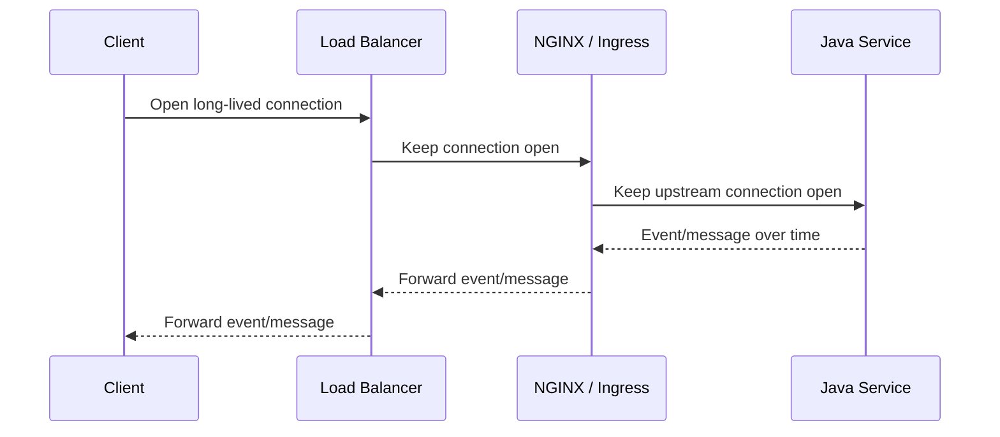
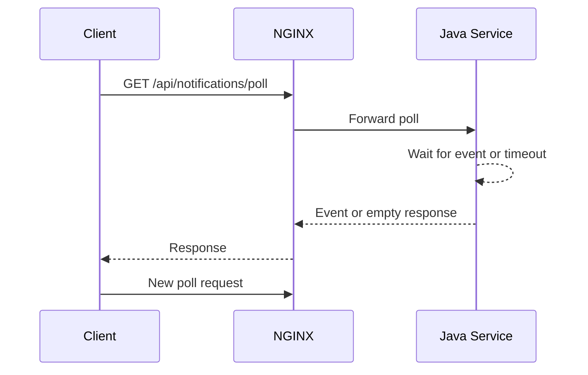
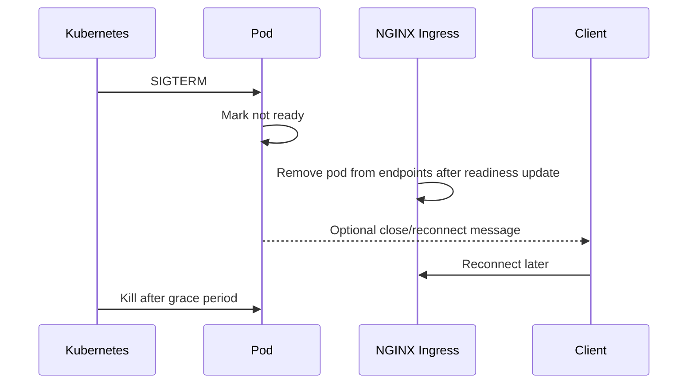

# Part 014 — WebSocket, SSE, Long Polling, and Real-Time Traffic

## 1. Tujuan Part Ini

Tidak semua HTTP traffic bersifat request-response pendek.

Di enterprise backend, kamu bisa menemukan traffic seperti:

- WebSocket untuk bidirectional messaging;
- Server-Sent Events untuk push event satu arah dari server ke client;
- long polling untuk compatibility dengan client lama;
- streaming progress untuk export/import/job status;
- notification channel;
- live dashboard;
- asynchronous workflow monitoring.

Traffic seperti ini berbeda dari REST API biasa.

REST API biasa:

```text
request -> process -> response -> connection selesai
```

Real-time/long-lived traffic:

```text
request/connect -> connection hidup lama -> event/data bertahap -> disconnect nanti
```

Akibatnya, NGINX harus dipahami bukan hanya sebagai router, tetapi sebagai connection manager.

Target part ini adalah membuat kamu mampu men-debug masalah seperti:

```text
WebSocket connect berhasil lalu langsung putus.
SSE event dikirim backend tapi client menerima terlambat.
Long polling selalu timeout di 60 detik.
Connection putus saat rolling deployment.
Client real-time menyebabkan worker connection penuh.
Sticky session hilang sehingga stateful backend kacau.
```

---

## 2. Mental Model: Long-Lived Connection Mengubah Bottleneck

Pada REST API pendek, bottleneck sering berada di latency upstream, DB, CPU, atau thread pool.

Pada real-time traffic, bottleneck tambahan muncul:

```text
number of open connections
idle timeout alignment
buffering behavior
connection draining
graceful shutdown
load balancer idle timeout
worker_connections
file descriptor limit
sticky session / state placement
```

Diagram sederhana:



Connection yang “idle tetapi sehat” bisa terlihat seperti request lambat jika observability tidak dirancang dengan benar.

---

## 3. WebSocket: Apa yang Berbeda

WebSocket dimulai sebagai HTTP request, lalu melakukan protocol upgrade.

Client mengirim header seperti:

```http
GET /ws/notifications HTTP/1.1
Host: api.example.com
Upgrade: websocket
Connection: Upgrade
Sec-WebSocket-Key: ...
Sec-WebSocket-Version: 13
```

Server menjawab:

```http
HTTP/1.1 101 Switching Protocols
Upgrade: websocket
Connection: Upgrade
```

Setelah itu koneksi bukan lagi HTTP request-response biasa. Ia menjadi channel bidirectional.

Konsekuensi untuk NGINX:

- NGINX harus meneruskan header `Upgrade` dan `Connection` dengan benar;
- upstream protocol biasanya HTTP/1.1;
- timeout harus cukup panjang;
- buffering HTTP biasa tidak relevan seperti response biasa;
- connection akan hidup lama dan memakai slot connection;
- graceful shutdown harus mempertimbangkan open connection.

---

## 4. Konfigurasi NGINX Dasar untuk WebSocket

Pola umum:

```nginx
map $http_upgrade $connection_upgrade {
    default upgrade;
    ''      close;
}

upstream quote_order_realtime {
    server quote-order-api:8080;
    keepalive 32;
}

server {
    listen 443 ssl http2;
    server_name api.example.com;

    location /ws/ {
        proxy_http_version 1.1;
        proxy_set_header Upgrade $http_upgrade;
        proxy_set_header Connection $connection_upgrade;
        proxy_set_header Host $host;
        proxy_set_header X-Forwarded-For $proxy_add_x_forwarded_for;
        proxy_set_header X-Forwarded-Proto $scheme;

        proxy_read_timeout 1h;
        proxy_send_timeout 1h;

        proxy_pass http://quote_order_realtime;
    }
}
```

Hal penting:

```text
proxy_http_version 1.1 wajib dipahami.
Upgrade header harus diteruskan.
Connection header harus benar.
Timeout harus lebih panjang daripada idle period yang valid.
```

Jika `Connection` hard-coded `upgrade`, beberapa request non-upgrade bisa berperilaku buruk. Karena itu pattern `map` lebih aman.

---

## 5. WebSocket Failure Modes

| Gejala | Kemungkinan Penyebab |
|---|---|
| HTTP 400 saat connect | header upgrade tidak benar, backend menolak handshake |
| HTTP 404 | path rewrite/location matching salah |
| HTTP 426 | backend mengharapkan upgrade/protocol berbeda |
| HTTP 502 | upstream tidak reachable atau reset connection |
| Connect berhasil lalu putus | idle timeout LB/NGINX/backend terlalu pendek |
| Hanya gagal di production | cloud LB/WAF tidak support atau timeout berbeda |
| Gagal di Kubernetes | Ingress annotation/backend protocol/path conflict |
| Banyak disconnect saat deploy | graceful shutdown/draining tidak benar |

Pertanyaan debugging utama:

```text
Apakah handshake 101 terjadi?
Jika tidak, status apa yang muncul?
Apakah header Upgrade/Connection sampai ke backend?
Apakah path yang diterima backend benar?
Apakah LB sebelum NGINX mendukung WebSocket?
Apakah idle timeout semua layer cukup panjang?
Apakah backend stateful butuh sticky session?
```

---

## 6. Testing WebSocket

Tool umum:

```bash
websocat -v wss://api.example.com/ws/notifications
```

Atau dengan curl untuk melihat handshake awal:

```bash
curl -i -N \
  -H "Connection: Upgrade" \
  -H "Upgrade: websocket" \
  -H "Sec-WebSocket-Key: SGVsbG8sIHdvcmxkIQ==" \
  -H "Sec-WebSocket-Version: 13" \
  https://api.example.com/ws/notifications
```

Untuk production debugging, access log harus menunjukkan:

```text
status 101
request_time panjang
upstream_response_time mungkin panjang atau khusus formatnya
client disconnect timing
upstream disconnect timing
```

Status `101` bukan error. Itu tanda upgrade berhasil.

---

## 7. Server-Sent Events: Apa yang Berbeda

SSE adalah streaming satu arah dari server ke client melalui HTTP response biasa.

Client:

```http
GET /api/events HTTP/1.1
Accept: text/event-stream
```

Server:

```http
HTTP/1.1 200 OK
Content-Type: text/event-stream
Cache-Control: no-cache
Connection: keep-alive
```

Body dikirim sebagai event bertahap:

```text
event: order-status
data: {"orderId":"123","status":"VALIDATING"}


event: order-status
data: {"orderId":"123","status":"COMPLETED"}

```

SSE tetap HTTP, tetapi response tidak selesai cepat. Karena itu response buffering sangat kritis.

---

## 8. Konfigurasi NGINX Dasar untuk SSE

Pola umum:

```nginx
location /api/events {
    proxy_http_version 1.1;
    proxy_set_header Host $host;
    proxy_set_header X-Forwarded-For $proxy_add_x_forwarded_for;
    proxy_set_header X-Forwarded-Proto $scheme;

    proxy_buffering off;
    proxy_cache off;
    gzip off;

    proxy_read_timeout 1h;
    proxy_send_timeout 1h;

    proxy_pass http://quote_order_api;
}
```

Kenapa?

- `proxy_buffering off` agar event kecil langsung diteruskan;
- `proxy_cache off` agar stream tidak dianggap cacheable;
- `gzip off` untuk menghindari compression buffering delay;
- timeout panjang agar koneksi idle tetapi sehat tidak diputus terlalu cepat.

Di beberapa setup, backend juga dapat mengirim header:

```http
X-Accel-Buffering: no
```

Tetapi jangan bergantung pada header ini tanpa verifikasi controller/config yang digunakan.

---

## 9. SSE Failure Modes

| Gejala | Kemungkinan Penyebab |
|---|---|
| Client menerima event sekaligus setelah lama | `proxy_buffering on`, gzip, LB/CDN buffering, aplikasi tidak flush |
| Koneksi putus setiap 60 detik | idle timeout LB/NGINX/backend |
| Event pertama lambat | backend belum flush, auth/DB delay, buffering |
| Hanya gagal di browser tertentu | client/browser/proxy/network behavior |
| 504 | NGINX menganggap upstream terlalu lama tidak mengirim data |
| 499 | client/browser menutup koneksi |
| Memory/connection naik | terlalu banyak open SSE connection |

SSE sehat bisa memiliki `request_time` sangat panjang. Jangan alert hanya karena request duration tinggi tanpa membedakan endpoint streaming.

---

## 10. Testing SSE

Gunakan curl tanpa buffering client:

```bash
curl -N -v https://api.example.com/api/events
```

Yang harus diamati:

```text
Apakah header Content-Type text/event-stream?
Apakah event muncul satu per satu?
Berapa lama sampai event pertama?
Apakah koneksi putus pada interval tetap?
Apakah ada heartbeat/comment event?
```

SSE sering membutuhkan heartbeat agar load balancer tidak menganggap koneksi idle.

Contoh heartbeat SSE:

```text
: keepalive

```

Heartbeat bukan data bisnis, tetapi menjaga connection tetap aktif melewati idle timeout.

---

## 11. Long Polling

Long polling adalah pola compatibility:

```text
client request -> server tahan request sampai event tersedia atau timeout -> response -> client request lagi
```

Diagram:



Long polling terlihat seperti REST request lambat. Tetapi secara desain memang request ditahan.

NGINX config perlu timeout lebih panjang dari server-side poll wait:

```nginx
location /api/notifications/poll {
    proxy_read_timeout 75s;
    proxy_send_timeout 75s;
    proxy_pass http://quote_order_api;
}
```

Jika backend menahan poll maksimal 60 detik, NGINX `proxy_read_timeout` harus lebih besar dari itu, misalnya 75 detik. Cloud LB idle timeout juga harus lebih besar.

---

## 12. Long Polling Failure Modes

| Gejala | Kemungkinan Penyebab |
|---|---|
| Selalu 504 | `proxy_read_timeout` lebih pendek dari poll wait |
| Banyak request kosong | client poll interval terlalu agresif atau backend timeout terlalu pendek |
| Load tinggi | terlalu banyak concurrent pending poll |
| Duplicate event | client retry tanpa idempotent event acknowledgement |
| Missing event | race condition antara response dan next poll |
| 499 tinggi | client timeout lebih pendek dari server poll wait |

Long polling harus dirancang bersama client. Jika client timeout 30 detik tetapi server menahan 60 detik, hasilnya banyak 499.

---

## 13. Idle Timeout Alignment

Real-time traffic sangat sensitif terhadap idle timeout.

Layer yang perlu dicek:

```text
Browser/client timeout
Corporate proxy timeout
CDN/WAF timeout
Cloud load balancer idle timeout
NGINX proxy_read_timeout
NGINX proxy_send_timeout
Kubernetes ingress annotation timeout
Application server idle timeout
Java framework async timeout
Backend heartbeat interval
```

Prinsip:

```text
heartbeat interval < shortest idle timeout
proxy timeout > expected idle period
client timeout > server long-poll timeout
LB timeout >= NGINX timeout strategy
```

Contoh masalah:

```text
SSE heartbeat setiap 55 detik
Cloud LB idle timeout 60 detik
NGINX proxy_read_timeout 1 jam
```

Ini terlihat aman, tetapi margin 5 detik bisa terlalu kecil jika ada jitter. Heartbeat 20–30 detik mungkin lebih aman, tergantung cost dan policy.

---

## 14. Kubernetes Ingress untuk WebSocket dan SSE

Pada ingress-nginx, WebSocket biasanya bekerja jika header upgrade diteruskan dan timeout cukup. Sering kali config utama adalah timeout annotation.

Contoh:

```yaml
apiVersion: networking.k8s.io/v1
kind: Ingress
metadata:
  name: quote-order-realtime
  annotations:
    nginx.ingress.kubernetes.io/proxy-read-timeout: "3600"
    nginx.ingress.kubernetes.io/proxy-send-timeout: "3600"
    nginx.ingress.kubernetes.io/proxy-buffering: "off"
spec:
  ingressClassName: nginx
  rules:
    - host: api.example.internal
      http:
        paths:
          - path: /ws
            pathType: Prefix
            backend:
              service:
                name: quote-order-api
                port:
                  number: 8080
          - path: /api/events
            pathType: Prefix
            backend:
              service:
                name: quote-order-api
                port:
                  number: 8080
```

Namun ada trade-off penting: annotation di level Ingress bisa berlaku ke semua path dalam object itu. Untuk menghindari efek samping, sering lebih aman memisahkan Ingress object untuk real-time path.

Internal verification:

```text
Apakah annotation berlaku per Ingress, per path, atau global?
Apakah real-time path digabung dengan REST API biasa?
Apakah timeout panjang ikut berlaku ke endpoint non-streaming?
Apakah proxy_buffering off terlalu luas?
```

---

## 15. Sticky Session dan Stateful Backend

WebSocket biasanya menciptakan koneksi yang bertahan ke satu backend pod. Selama koneksi hidup, ia sudah “sticky” secara natural karena satu TCP connection mengarah ke satu upstream.

Masalah muncul saat:

- reconnect terjadi;
- backend menyimpan session state lokal;
- event subscription state hanya ada di memory pod;
- long polling butuh konsistensi server;
- beberapa request terkait harus masuk ke pod yang sama.

Sticky session bisa dilakukan di load balancer/ingress, misalnya berbasis cookie atau IP hash, tergantung platform.

Tetapi sticky session bukan solusi ideal untuk semua hal.

Prinsip arsitektural:

```text
Jika state penting untuk correctness, jangan hanya simpan di memory pod.
Gunakan shared state, broker, database, cache, atau event bus.
Sticky session boleh untuk optimasi, bukan fondasi correctness.
```

Untuk Java/JAX-RS backend, real-time connection sering lebih sehat jika state subscription bisa direkonstruksi saat reconnect.

---

## 16. Connection Pressure

Long-lived traffic mengonsumsi connection slot.

NGINX capacity dipengaruhi oleh:

```text
worker_processes
worker_connections
file descriptor limit
memory per connection
TLS overhead
upstream connection count
load balancer connection tracking
pod resource limit
```

Jika ada 20.000 WebSocket connection, ini bukan “20.000 request biasa”. Ini 20.000 koneksi aktif.

Rough mental model:

```text
max theoretical connections ≈ worker_processes x worker_connections
```

Tetapi angka aktual lebih kecil karena:

- setiap proxied connection bisa memakai client-side dan upstream-side connection;
- file descriptor dipakai untuk log, socket, temp file, dan internal needs;
- TLS menambah memory/CPU;
- Kubernetes node/network juga punya limit;
- backend Java juga harus menerima connection.

Jangan capacity planning real-time traffic hanya dari RPS. Gunakan concurrent connection sebagai metric utama.

---

## 17. Java/JAX-RS Backend Considerations

Banyak Java REST stack awalnya dioptimalkan untuk request-response biasa.

Untuk real-time endpoint, cek:

```text
Apakah endpoint blocking atau async?
Apakah request thread ditahan selama connection hidup?
Apakah application server punya async timeout?
Apakah output flush benar-benar terjadi?
Apakah backpressure dari client dipahami?
Apakah disconnect client terdeteksi?
Apakah cleanup subscription dilakukan?
Apakah shutdown menutup connection secara graceful?
```

Jika setiap SSE connection menahan satu request thread, sistem bisa cepat habis thread pool.

Pola yang lebih baik biasanya:

- async request processing;
- non-blocking I/O jika stack mendukung;
- bounded queue per subscriber;
- heartbeat;
- disconnect cleanup;
- reconnect/resume protocol;
- event broker untuk fan-out;
- limit per user/tenant/client.

NGINX tidak dapat memperbaiki backend yang secara concurrency model tidak siap untuk long-lived connection.

---

## 18. Graceful Shutdown dan Rolling Deployment

Real-time connection membuat deployment lebih sulit.

REST biasa:

```text
pod receives SIGTERM -> stops accepting new request -> finishes short requests -> exits
```

WebSocket/SSE:

```text
pod receives SIGTERM -> open connections may live long -> terminationGracePeriodSeconds may expire -> connections cut
```

Hal yang perlu disiapkan:

- readiness probe berubah false sebelum shutdown;
- preStop hook memberi waktu draining;
- NGINX/Ingress berhenti mengirim new connection ke pod yang terminating;
- backend memberi close message atau reconnect instruction jika memungkinkan;
- client punya reconnect dengan backoff;
- event stream bisa resume dari last event ID;
- termination grace period sesuai durasi drain yang diinginkan.

Contoh lifecycle:



Jika readiness dan draining tidak benar, deploy akan terlihat seperti random disconnect storm.

---

## 19. Client Reconnect Strategy

Real-time system harus menganggap disconnect sebagai normal.

Client harus punya:

- reconnect dengan exponential backoff;
- jitter agar tidak terjadi reconnect storm;
- resume token atau last event ID jika event tidak boleh hilang;
- idempotent subscription;
- authentication refresh handling;
- clear behavior saat server mengirim close/maintenance signal.

Tanpa ini, satu rolling deployment bisa memicu ribuan client reconnect bersamaan, lalu NGINX dan Java backend terkena spike.

NGINX layer bisa membantu dengan rate limiting atau connection limiting, tetapi correctness reconnect tetap tanggung jawab protocol aplikasi.

---

## 20. Rate Limiting untuk Real-Time Traffic

Rate limiting real-time berbeda dari REST.

Untuk REST:

```text
limit request per second
```

Untuk WebSocket/SSE:

```text
limit new connection rate
limit concurrent connection
limit message rate if visible at edge
limit per user/tenant/IP
```

NGINX open source dapat melakukan `limit_req` dan `limit_conn`, tetapi tidak selalu bisa memahami user/tenant jika identity ada di JWT/body dan tidak diekstrak di edge.

Contoh connection limit konseptual:

```nginx
limit_conn_zone $binary_remote_addr zone=perip_conn:10m;

server {
    location /ws/ {
        limit_conn perip_conn 5;
        proxy_pass http://quote_order_realtime;
    }
}
```

Keterbatasan:

- NAT/corporate proxy membuat banyak user terlihat satu IP;
- IP-based limit bisa false positive;
- per-user limit butuh trusted identity key;
- distributed ingress replicas butuh strategi konsisten jika limit harus global.

---

## 21. Observability untuk Real-Time Traffic

Metric penting:

```text
active connections
new connections per second
connection duration
WebSocket 101 count
SSE active streams
499 count
502/504 count
disconnect reason if available
upstream resets
LB idle timeout disconnects
backend subscriber count
reconnect rate
message/event lag
```

Access log untuk long-lived request bisa muncul hanya saat connection selesai. Ini berarti dashboard berbasis access log bisa terlambat menunjukkan masalah active connection.

Butuh kombinasi:

- NGINX metrics/stub status/exporter;
- ingress controller metrics;
- cloud load balancer active connection metric;
- Java application metrics;
- event broker metrics;
- client telemetry jika tersedia.

Untuk SSE/WebSocket, `request_time` panjang tidak selalu buruk. Yang buruk adalah disconnect abnormal, reconnect storm, event lag, dan connection count mendekati limit.

---

## 22. Access Log Format untuk WebSocket/SSE

Log format sebaiknya memuat:

```text
status
request_time
upstream_response_time
upstream_addr
bytes sent
request length
request id
client ip
user agent
host
uri
```

Contoh konseptual:

```nginx
log_format realtime_json escape=json
'{'
  '"time":"$time_iso8601",'
  '"request_id":"$request_id",'
  '"remote_addr":"$remote_addr",'
  '"host":"$host",'
  '"uri":"$request_uri",'
  '"status":$status,'
  '"request_time":$request_time,'
  '"upstream_response_time":"$upstream_response_time",'
  '"upstream_addr":"$upstream_addr",'
  '"bytes_sent":$bytes_sent,'
  '"user_agent":"$http_user_agent"'
'}';
```

Interpretasi:

```text
status 101 + request_time panjang = WebSocket normal.
status 200 + request_time panjang = SSE/long polling bisa normal.
status 499 = client disconnect.
status 504 = proxy timeout menunggu upstream.
status 502 = upstream reset/failure.
```

---

## 23. Debugging WebSocket Step-by-Step

### Step 1 — Pastikan handshake

```bash
websocat -v wss://api.example.com/ws/notifications
```

Atau cek access log:

```text
status=101
```

Jika bukan 101, fokus ke routing/auth/header/backend.

### Step 2 — Cek path dan rewrite

```bash
kubectl describe ingress <name> -n <namespace>
kubectl get ingress <name> -n <namespace> -o yaml
```

Pastikan `/ws` tidak direwrite menjadi path yang tidak dikenali backend.

### Step 3 — Cek timeout chain

```text
cloud LB idle timeout
NGINX proxy_read_timeout
backend idle timeout
client heartbeat/ping interval
```

Jika disconnect selalu pada interval tetap, hampir pasti timeout.

### Step 4 — Cek backend logs

Cari:

```text
handshake accepted/rejected
connection opened
connection closed
close code
exception while writing
client disconnect
```

### Step 5 — Cek deployment event

Jika disconnect bertepatan dengan rollout, cek readiness, preStop, PDB, dan termination grace.

---

## 24. Debugging SSE Step-by-Step

### Step 1 — Test dengan curl no-buffer

```bash
curl -N -v https://api.example.com/api/events
```

Jika event muncul bertahap di internal service tetapi tidak di external endpoint, proxy/LB buffering mungkin masalah.

### Step 2 — Cek header response

Cari:

```http
Content-Type: text/event-stream
Cache-Control: no-cache
```

Opsional:

```http
X-Accel-Buffering: no
```

### Step 3 — Cek NGINX buffering/compression

```text
proxy_buffering off
gzip off
proxy_cache off
```

### Step 4 — Cek Java flush

Backend harus benar-benar flush output.

Jika aplikasi menulis event tetapi tidak flush, NGINX tidak punya data untuk diteruskan.

### Step 5 — Cek heartbeat dan idle timeout

Jika stream putus periodik:

```text
heartbeat interval terlalu lama
LB idle timeout terlalu pendek
proxy_read_timeout terlalu pendek
application async timeout terlalu pendek
```

---

## 25. Debugging Long Polling Step-by-Step

### Step 1 — Pahami expected wait time

```text
Backend menahan poll berapa lama?
Client timeout berapa lama?
NGINX proxy_read_timeout berapa lama?
Cloud LB idle timeout berapa lama?
```

### Step 2 — Pastikan timeout order benar

Contoh sehat:

```text
server poll wait: 55s
NGINX proxy_read_timeout: 70s
cloud LB idle timeout: 75s
client timeout: 80s
```

Contoh buruk:

```text
server poll wait: 60s
client timeout: 30s
```

Hasilnya: banyak 499.

### Step 3 — Cek retry storm

Jika client langsung retry tanpa backoff, long polling bisa menjadi DDoS internal.

### Step 4 — Cek empty response ratio

Jika mayoritas poll kosong, mungkin interval/timeout/push model tidak efisien.

---

## 26. AWS/Azure/On-Prem Considerations

Real-time traffic sering tergantung pada layer sebelum NGINX.

### AWS/EKS

Verifikasi:

```text
ALB/NLB idle timeout
WebSocket support di ALB jika dipakai
source IP/proxy protocol jika NLB
security group idle/connection behavior
CloudWatch active connection metrics
```

### Azure/AKS

Verifikasi:

```text
Azure Load Balancer/Application Gateway idle timeout
Azure Front Door behavior untuk WebSocket/SSE
NSG rule
Application Gateway Ingress Controller jika ada
Azure Monitor connection metrics
```

### On-Prem/Hybrid

Verifikasi:

```text
corporate proxy timeout
firewall idle session timeout
L4/L7 load balancer timeout
TLS inspection behavior
DMZ proxy buffering
```

Banyak issue real-time hanya muncul di enterprise network karena ada proxy/firewall yang tidak terlihat oleh application team.

---

## 27. Security Concern

Real-time connection membawa risiko khusus:

- connection exhaustion;
- unauthenticated long-lived connection;
- stale authorization setelah token expired;
- identity spoofing via forwarded headers;
- tenant data leak pada subscription salah;
- missing origin validation untuk WebSocket;
- CSRF-like risk pada WebSocket jika auth cookie dipakai tanpa origin check;
- event stream membuka data sensitif;
- reconnect storm sebagai amplification;
- per-IP limit false positive di corporate NAT.

Checklist security:

```text
Apakah WebSocket/SSE endpoint wajib auth?
Apakah token expiry ditangani selama connection hidup?
Apakah Origin header divalidasi untuk browser WebSocket?
Apakah subscription diotorisasi per tenant/user/resource?
Apakah reconnect/resume token aman?
Apakah connection limit ada?
Apakah event payload tidak mengandung data lintas tenant?
Apakah logs tidak membocorkan token/query sensitive?
```

NGINX bisa membantu membatasi connection dan header policy, tetapi authorization detail tetap harus benar di aplikasi atau auth service.

---

## 28. Performance Concern

Untuk real-time traffic, RPS bukan metric utama.

Gunakan:

```text
concurrent connections
connection churn
messages/events per second
bytes per second
average connection duration
p95/p99 event delivery latency
backend subscriber count
memory per connection
CPU per TLS connection
```

Performance anti-pattern:

```text
Satu thread Java per SSE connection.
Tidak ada heartbeat tetapi timeout panjang berharap aman.
Tidak ada reconnect backoff.
Sticky session dipakai untuk correctness state.
proxy_buffering off diterapkan global ke semua API.
worker_connections tidak dituning untuk connection count.
Tidak ada limit untuk unauthenticated connection.
```

Capacity planning harus bertanya:

```text
Berapa maximum concurrent clients?
Berapa average connection duration?
Berapa event rate per client?
Berapa fan-out ratio?
Apa yang terjadi saat reconnect storm?
Berapa connection yang bisa ditahan NGINX, LB, node, dan Java backend?
```

---

## 29. PR Review Checklist

Saat mereview perubahan real-time endpoint, tanya:

```text
Apakah ini REST biasa, WebSocket, SSE, atau long polling?
Apakah path dipisahkan dari API biasa?
Apakah timeout chain sudah diselaraskan dari client sampai backend?
Apakah proxy_buffering off hanya untuk endpoint yang perlu streaming?
Apakah gzip/cache dimatikan untuk SSE?
Apakah WebSocket Upgrade/Connection header diteruskan dengan benar?
Apakah backend membutuhkan sticky session?
Jika ya, apakah state benar-benar boleh lokal?
Apakah graceful shutdown menangani long-lived connection?
Apakah client punya reconnect backoff dan resume strategy?
Apakah connection limit/rate limit ada?
Apakah observability membedakan request lambat vs stream sehat?
Apakah security auth/origin/tenant isolation sudah benar?
Apakah rollback aman jika annotation timeout/buffering berubah?
```

---

## 30. Internal Verification Checklist

Untuk konteks internal CSG/team, verifikasi:

```text
Apakah ada WebSocket/SSE/long polling endpoint di produk atau tool internal?
Apakah endpoint real-time melewati NGINX, API gateway, cloud LB, WAF, atau service mesh?
Controller ingress apa yang dipakai?
Apakah timeout annotation untuk real-time path sudah ada?
Apakah real-time path dipisahkan dari REST API biasa?
Apakah proxy_buffering off diterapkan terlalu luas?
Apakah gzip/cache masih aktif di endpoint SSE?
Apakah load balancer sebelum NGINX mendukung WebSocket/SSE?
Berapa idle timeout cloud/on-prem load balancer?
Apakah Java backend memakai blocking thread untuk setiap connection?
Apakah client punya reconnect backoff?
Apakah metrics active connection tersedia?
Apakah runbook disconnect storm sudah ada?
Apakah deployment strategy mempertimbangkan long-lived connection?
Apakah auth token expiry selama connection hidup ditangani?
```

---

## 31. Ringkasan

Real-time traffic mengubah cara melihat NGINX.

Untuk REST API biasa, NGINX sering dinilai dari routing, timeout, TLS, dan upstream latency.

Untuk WebSocket, SSE, dan long polling, NGINX juga harus dinilai sebagai:

```text
connection manager
idle-timeout boundary
buffering control point
load balancer for long-lived connections
draining participant during rollout
observability source for disconnect patterns
security boundary for connection exhaustion
```

Prinsip utama:

```text
WebSocket butuh upgrade header, timeout panjang, dan connection capacity.
SSE butuh proxy_buffering off, gzip/cache awareness, heartbeat, dan flush.
Long polling butuh timeout chain yang selaras dengan server wait dan client timeout.
Semua real-time traffic butuh reconnect strategy, graceful shutdown, dan active connection observability.
```

Bagian berikutnya akan masuk ke **gRPC, HTTP/2, ALPN, h2/h2c, grpc_pass, streaming gRPC, backend protocol, dan common proxy failure untuk binary protocol**.
