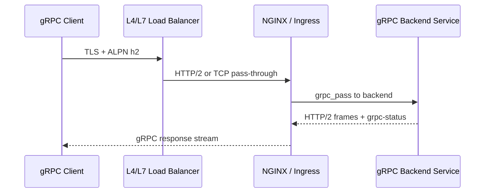

# Part 015 — gRPC, HTTP/2, and Binary Protocol Proxying

## 1. Tujuan Part Ini

Tidak semua traffic enterprise backend berbentuk REST/JSON di atas HTTP/1.1.

Di sistem modern, terutama sistem yang punya internal service-to-service communication atau high-throughput API, kamu bisa menemukan:

- gRPC;
- HTTP/2;
- binary payload;
- streaming request;
- streaming response;
- bidirectional streaming;
- service-to-service RPC;
- protobuf-based contract;
- long-lived HTTP/2 connection;
- ingress yang harus membedakan REST, WebSocket, dan gRPC.

Part ini membangun mental model supaya kamu tidak memperlakukan gRPC seperti REST biasa.

REST/JAX-RS biasanya terlihat seperti ini:

```text
HTTP request
  method: GET/POST/PUT/DELETE
  path: /quotes/{id}
  body: JSON
  response: JSON
```

gRPC terlihat berbeda:

```text
HTTP/2 request
  method: POST
  path: /package.Service/Method
  content-type: application/grpc
  body: binary protobuf frames
  response: binary protobuf frames + grpc-status
```

Masalah besar di production muncul ketika salah satu layer menganggap gRPC sebagai HTTP biasa.

Contoh symptom:

```text
REST endpoint sehat, tetapi gRPC selalu gagal.
Client mendapat UNAVAILABLE.
Ingress mengembalikan 502.
gRPC streaming putus setelah idle timeout.
Backend mendukung h2c, tetapi NGINX berbicara HTTP/1.1.
TLS termination berhasil, tetapi ALPN tidak negotiate h2.
Health check HTTP biasa sukses, tetapi gRPC call gagal.
```

Target part ini adalah membuat kamu mampu membaca, mereview, dan men-debug konfigurasi NGINX untuk gRPC/HTTP/2 secara production-oriented.

---

## 2. Mental Model: gRPC Bukan Sekadar HTTP POST

Secara transport, gRPC berjalan di atas HTTP/2.

Secara aplikasi, gRPC adalah RPC framework dengan contract protobuf.

Secara observability, gRPC punya status sendiri yang tidak selalu sama dengan HTTP status.

Secara proxy, gRPC membutuhkan perlakuan berbeda dari REST.

Diagram sederhana:



Yang penting:

```text
gRPC requires HTTP/2 semantics.
HTTP/2 is connection-oriented and multiplexed.
gRPC status lives in trailers.
Streaming changes timeout and buffering behavior.
A successful HTTP response can still carry failed grpc-status.
```

Jadi saat debugging, jangan hanya tanya:

```text
HTTP status-nya apa?
```

Tanya juga:

```text
Protocol-nya HTTP/2 atau HTTP/1.1?
ALPN negotiate h2 atau tidak?
Content-Type application/grpc atau bukan?
grpc-status apa?
Trailers sampai ke client atau hilang?
Timeout terjadi di stream atau connect?
```

---

## 3. REST/JAX-RS vs gRPC Traffic

Dalam konteks Java backend, kamu mungkin melihat kombinasi:

```text
External API     -> REST/JAX-RS
Internal RPC     -> gRPC
Partner API      -> REST/JSON
High-throughput  -> gRPC/protobuf
Legacy client    -> HTTP/1.1 REST
```

Perbedaan praktis:

| Area | REST/JAX-RS | gRPC |
|---|---|---|
| Protocol | HTTP/1.1 atau HTTP/2 | HTTP/2 |
| Payload | JSON/XML/text | protobuf binary |
| Method | GET/POST/PUT/DELETE | biasanya POST |
| Path | resource-oriented | service/method-oriented |
| Status | HTTP status | HTTP status + grpc-status |
| Streaming | optional/manual | first-class |
| Browser support | native untuk REST | perlu gRPC-Web untuk browser |
| Debugging | curl mudah | grpcurl lebih tepat |
| Proxy directive | `proxy_pass` | `grpc_pass` |

Kesalahan umum adalah menyamakan gRPC dengan REST karena terlihat seperti HTTP POST.

Secara NGINX, ini berbeda.

REST proxy:

```nginx
location /api/ {
    proxy_pass http://java_rest_backend;
}
```

gRPC proxy:

```nginx
location /package.Service/ {
    grpc_pass grpc://grpc_backend;
}
```

Untuk upstream TLS:

```nginx
location /package.Service/ {
    grpc_pass grpcs://grpc_backend;
}
```

---

## 4. HTTP/2 Concepts yang Relevan untuk NGINX

HTTP/2 memperkenalkan beberapa konsep yang penting untuk production debugging.

### 4.1 Multiplexing

Satu TCP connection bisa membawa banyak stream.

```text
1 TCP connection
  stream 1 -> RPC A
  stream 3 -> RPC B
  stream 5 -> RPC C
```

Dampaknya:

- connection count tidak sama dengan request concurrency;
- satu koneksi bermasalah bisa memengaruhi banyak stream;
- load balancing per connection bisa berbeda efeknya dari load balancing per request;
- observability harus melihat request/stream, bukan hanya connection.

### 4.2 Header Compression

HTTP/2 menggunakan header compression.

Dampak praktis untuk backend engineer tidak sebesar timeout/routing, tetapi tetap penting saat melihat wire-level debugging.

### 4.3 Binary Framing

HTTP/2 tidak berbentuk plain text seperti HTTP/1.1.

Ini alasan kenapa debugging dengan `telnet` atau membaca raw payload tidak cukup.

Gunakan:

```bash
grpcurl
curl --http2
openssl s_client -alpn h2
nghttp
```

### 4.4 Trailers

gRPC banyak mengandalkan trailers untuk membawa status akhir.

Contoh konsep:

```text
HTTP/2 response headers
response messages
response trailers:
  grpc-status: 0
  grpc-message: OK
```

Jika proxy, gateway, atau observability pipeline tidak memahami trailers, hasil debugging bisa menyesatkan.

---

## 5. h2, h2c, TLS, and ALPN

Ada dua mode penting:

```text
h2   = HTTP/2 over TLS
h2c  = HTTP/2 cleartext tanpa TLS
```

Di edge publik, biasanya:

```text
client -> TLS -> ALPN h2 -> NGINX
```

Di internal network, variasinya bisa:

```text
NGINX -> h2c -> gRPC backend
NGINX -> TLS h2 -> gRPC backend
NGINX -> Kubernetes Service -> Pod gRPC port
```

ALPN adalah mekanisme TLS untuk memilih protocol seperti `h2` atau `http/1.1`.

Jika client ingin gRPC tetapi ALPN tidak menghasilkan `h2`, request bisa gagal sebelum sampai ke aplikasi.

Debug command:

```bash
openssl s_client -connect api.example.com:443 -alpn h2 -servername api.example.com
```

Yang dicari:

```text
ALPN protocol: h2
```

Jika hasilnya:

```text
ALPN protocol: http/1.1
```

maka gRPC native kemungkinan tidak berjalan seperti yang diharapkan.

---

## 6. NGINX gRPC Proxying Model

NGINX menyediakan modul HTTP gRPC untuk meneruskan request ke gRPC server.

Mental model:

```text
client speaks HTTP/2 gRPC
NGINX accepts request
NGINX maps location
NGINX forwards using grpc_pass
backend receives gRPC request
backend returns gRPC response/trailers
NGINX forwards response to client
```

Contoh basic:

```nginx
http {
    upstream quote_grpc_backend {
        server quote-service:9090;
    }

    server {
        listen 443 ssl http2;
        server_name grpc.example.com;

        ssl_certificate     /etc/nginx/tls/tls.crt;
        ssl_certificate_key /etc/nginx/tls/tls.key;

        location /quote.v1.QuoteService/ {
            grpc_pass grpc://quote_grpc_backend;
        }
    }
}
```

Untuk upstream TLS:

```nginx
location /quote.v1.QuoteService/ {
    grpc_ssl_server_name on;
    grpc_pass grpcs://quote-grpc.internal:9443;
}
```

Perhatikan perbedaannya:

```text
proxy_pass -> HTTP upstream
grpc_pass  -> gRPC upstream
```

Jangan mengganti `grpc_pass` dengan `proxy_pass` kecuali kamu benar-benar sedang menggunakan gRPC-Web atau translation layer lain.

---

## 7. Kubernetes Ingress untuk gRPC

Di Kubernetes, gRPC biasanya diatur melalui annotation backend protocol.

Contoh umum pada ingress-nginx community controller:

```yaml
apiVersion: networking.k8s.io/v1
kind: Ingress
metadata:
  name: quote-grpc
  annotations:
    nginx.ingress.kubernetes.io/backend-protocol: "GRPC"
spec:
  ingressClassName: nginx
  tls:
    - hosts:
        - grpc.example.com
      secretName: grpc-example-tls
  rules:
    - host: grpc.example.com
      http:
        paths:
          - path: /quote.v1.QuoteService
            pathType: Prefix
            backend:
              service:
                name: quote-grpc-service
                port:
                  number: 9090
```

Untuk backend TLS, annotation bisa berbeda tergantung controller.

Contoh konseptual:

```yaml
nginx.ingress.kubernetes.io/backend-protocol: "GRPCS"
```

Hal yang harus diverifikasi:

```text
Controller apa yang digunakan?
Annotation ini didukung oleh controller tersebut?
Apakah value-nya GRPC, GRPCS, HTTP, HTTPS, atau AUTO?
Apakah service port benar?
Apakah backend benar-benar berbicara gRPC di port itu?
```

Jangan copy annotation dari internet tanpa memverifikasi controller.

NGINX Inc controller dan community ingress-nginx tidak selalu punya annotation, defaults, dan behavior yang sama.

---

## 8. Path Routing untuk gRPC

gRPC path biasanya berbentuk:

```text
/package.Service/Method
```

Contoh:

```text
/quote.v1.QuoteService/CreateQuote
/quote.v1.QuoteService/GetQuote
/quote.v1.QuoteService/StreamQuoteStatus
```

Ingress path yang aman biasanya menggunakan prefix service:

```yaml
path: /quote.v1.QuoteService
pathType: Prefix
```

Pitfall:

```yaml
path: /quote
```

Ini mungkin tidak match request gRPC sebenarnya.

Pitfall lain:

```yaml
nginx.ingress.kubernetes.io/rewrite-target: /
```

Rewrite yang umum untuk REST bisa menghancurkan path gRPC.

Jika NGINX mengubah:

```text
/quote.v1.QuoteService/GetQuote
```

menjadi:

```text
/GetQuote
```

backend gRPC bisa mengembalikan unimplemented method atau unknown service.

Rule praktis:

```text
Untuk gRPC, hindari rewrite kecuali kamu tahu persis efeknya terhadap fully-qualified service/method path.
```

---

## 9. Timeout untuk gRPC

gRPC punya karakter yang berbeda dari REST biasa.

Ada RPC pendek:

```text
CreateQuote -> response cepat
```

Ada streaming panjang:

```text
SubscribeOrderStatus -> stream event selama menit/jam
```

NGINX timeout yang relevan mirip dengan proxy timeout, tetapi directive gRPC berbeda:

```nginx
grpc_connect_timeout 5s;
grpc_send_timeout    60s;
grpc_read_timeout    60s;
```

Untuk streaming, `grpc_read_timeout` terlalu pendek bisa memutus stream saat tidak ada data dalam interval tertentu.

Masalah umum:

```text
Backend stream masih sehat.
Tidak ada event selama 60 detik.
NGINX menganggap upstream idle.
Connection ditutup.
Client melihat UNAVAILABLE atau stream terminated.
```

Solusi konseptual:

- align timeout client, load balancer, NGINX, backend;
- gunakan keepalive/ping jika stack mendukung;
- bedakan timeout RPC pendek dan streaming endpoint;
- observasi idle disconnect pattern.

Jangan menaikkan timeout global secara membabi buta.

Lebih aman:

```text
short RPC host/path -> timeout pendek
streaming RPC host/path -> timeout lebih panjang dan terkontrol
```

---

## 10. Retry dan gRPC Safety

Pada REST, retry sering dikaitkan dengan method idempotency.

Pada gRPC, retry safety harus dilihat dari method semantics.

Contoh:

```text
GetQuote       -> biasanya aman di-retry
CreateQuote    -> belum tentu aman
SubmitOrder    -> berisiko duplicate side effect
StreamStatus   -> retry bisa reconnect, tetapi perlu resume semantics
```

NGINX punya konsep next upstream untuk gRPC.

Contoh konseptual:

```nginx
grpc_next_upstream error timeout;
grpc_next_upstream_tries 2;
```

Risiko:

```text
Client mengirim request mutating.
NGINX sudah meneruskan ke backend A.
Backend A memproses tapi response gagal.
NGINX retry ke backend B.
Side effect bisa terjadi dua kali.
```

Rule produksi:

```text
Retry di proxy harus conservative.
Retry mutating RPC harus dikontrol oleh idempotency key atau application-level semantics.
```

Untuk quote/order system, ini krusial.

Duplikasi submit order lebih berbahaya daripada transient failure yang terlihat oleh client.

---

## 11. gRPC Status vs HTTP Status

gRPC membawa status aplikasi melalui `grpc-status`.

Contoh:

```text
grpc-status: 0   -> OK
grpc-status: 5   -> NOT_FOUND
grpc-status: 13  -> INTERNAL
grpc-status: 14  -> UNAVAILABLE
```

HTTP status bisa tetap 200 untuk respons gRPC yang secara aplikasi gagal.

Contoh:

```text
HTTP/2 200
grpc-status: 5
```

Artinya secara HTTP transport berhasil, tetapi RPC mengembalikan NOT_FOUND.

Jangan membuat dashboard gRPC hanya berdasarkan HTTP 5xx.

Minimal observability harus bisa melihat:

```text
http status
grpc-status
grpc-message
upstream connect time
upstream response time
request duration
method/service name
client identity jika ada
```

Jika log NGINX tidak menangkap grpc-status, kamu harus menambah observability di backend atau gateway layer yang memahami gRPC.

---

## 12. Streaming gRPC

gRPC mendukung beberapa pola:

```text
Unary RPC              -> one request, one response
Server streaming       -> one request, many responses
Client streaming       -> many requests, one response
Bidirectional streaming -> many requests, many responses
```

Setiap pola punya konsekuensi proxy.

Unary RPC mirip request-response pendek.

Server streaming mirip SSE tetapi berbasis HTTP/2/gRPC.

Bidirectional streaming lebih sensitif terhadap:

- idle timeout;
- connection reset;
- flow control;
- max concurrent streams;
- long-lived connection draining;
- rolling deployment;
- load balancer behavior.

Production concern:

```text
Apakah deployment memutus stream?
Apakah client punya reconnect logic?
Apakah reconnect aman?
Apakah server punya resume token?
Apakah NGINX dan cloud LB timeout selaras?
```

Tanpa jawaban ini, streaming endpoint akan menjadi sumber incident yang sulit direproduksi.

---

## 13. Health Check untuk gRPC

HTTP health check biasa:

```text
GET /health
```

Belum tentu cukup untuk gRPC service.

Kondisi buruk:

```text
/health HTTP OK
port gRPC salah
protobuf service tidak terdaftar
HTTP/2 tidak aktif
backend protocol mismatch
gRPC method selalu UNIMPLEMENTED
```

Untuk gRPC, pertimbangkan:

- gRPC health checking protocol;
- grpcurl smoke test;
- application-level unary RPC lightweight;
- separate readiness for gRPC listener;
- Kubernetes readiness probe yang benar;
- ingress smoke test setelah rollout.

Contoh debug:

```bash
grpcurl -plaintext quote-grpc-service.default.svc.cluster.local:9090 list
```

Untuk TLS:

```bash
grpcurl -authority grpc.example.com grpc.example.com:443 list
```

Jika reflection tidak diaktifkan, gunakan proto descriptor atau test method khusus.

---

## 14. Observability untuk gRPC di NGINX

Access log REST biasa sering berisi:

```text
method path status request_time upstream_response_time
```

Untuk gRPC, path mengandung service dan method.

Contoh:

```text
POST /quote.v1.QuoteService/CreateQuote
POST /quote.v1.QuoteService/StreamQuoteStatus
```

Log format perlu membantu menjawab:

```text
Service/method mana yang lambat?
HTTP status apa?
grpc-status apa?
Upstream mana yang dipilih?
Berapa durasi request/stream?
Apakah client disconnect?
Apakah upstream timeout?
```

Minimal log fields:

```nginx
log_format grpc_json escape=json
'{'
  '"time":"$time_iso8601",'
  '"request_id":"$request_id",'
  '"remote_addr":"$remote_addr",'
  '"host":"$host",'
  '"method":"$request_method",'
  '"uri":"$request_uri",'
  '"status":$status,'
  '"request_time":$request_time,'
  '"upstream_addr":"$upstream_addr",'
  '"upstream_status":"$upstream_status",'
  '"upstream_response_time":"$upstream_response_time",'
  '"content_type":"$sent_http_content_type",'
  '"user_agent":"$http_user_agent"'
'}';
```

Catatan: capture `grpc-status` dari trailers tidak selalu sesederhana response header biasa. Validasi kemampuan controller/logging stack yang dipakai.

---

## 15. Common gRPC Proxy Failures

### 15.1 Backend Protocol Mismatch

Symptom:

```text
502 Bad Gateway
upstream prematurely closed connection
client gets UNAVAILABLE
```

Kemungkinan:

```text
NGINX memakai proxy_pass, backend expect gRPC.
NGINX memakai grpc_pass, backend bukan gRPC.
Backend protocol HTTP/1.1, client expect HTTP/2.
Ingress annotation backend-protocol salah.
```

Debug:

```bash
kubectl describe ingress quote-grpc
kubectl get svc quote-grpc-service -o yaml
grpcurl -plaintext <service-dns>:9090 list
```

### 15.2 ALPN Tidak h2

Symptom:

```text
gRPC client gagal negotiate protocol.
REST masih berhasil.
```

Debug:

```bash
openssl s_client -connect grpc.example.com:443 -servername grpc.example.com -alpn h2
```

Cari:

```text
ALPN protocol: h2
```

### 15.3 Path Rewrite Merusak Service Name

Symptom:

```text
grpc-status: 12 UNIMPLEMENTED
unknown service
```

Kemungkinan:

```text
Ingress rewrite-target menghapus package.Service dari path.
Location match terlalu luas.
Regex path salah.
```

### 15.4 Timeout pada Streaming

Symptom:

```text
stream putus setiap 60 detik
stream putus saat idle
client reconnect terus
```

Kemungkinan:

```text
grpc_read_timeout terlalu pendek
cloud LB idle timeout lebih pendek
backend tidak mengirim heartbeat
client tidak mengirim keepalive
```

### 15.5 Health Check False Positive

Symptom:

```text
Kubernetes readiness OK
HTTP health OK
gRPC call gagal
```

Kemungkinan:

```text
readiness probe tidak mengecek gRPC listener
service port salah
backend protocol mismatch
reflection/test method tidak tersedia
```

---

## 16. Security Concerns

gRPC tidak otomatis lebih aman daripada REST.

Security concern utama:

```text
TLS termination boundary
mTLS identity
authorization per method
header/metadata spoofing
large message size
reflection exposure
plaintext h2c exposure
internal service exposed publicly
lack of method-level audit
```

### 16.1 Metadata Spoofing

gRPC metadata mirip header.

Jika NGINX atau gateway meneruskan identity metadata seperti:

```text
x-user-id
x-tenant-id
x-client-cert-subject
```

pastikan metadata tersebut tidak bisa dikirim langsung dari external client.

Edge harus strip inbound untrusted identity metadata lalu set ulang metadata trusted.

### 16.2 Reflection Exposure

gRPC reflection membantu debugging, tetapi bisa mengekspos service/method list.

Rule:

```text
reflection boleh di internal/dev jika dibutuhkan;
jangan expose reflection publik tanpa alasan kuat.
```

### 16.3 Message Size

gRPC punya message size concern.

Jika message terlalu besar:

```text
memory pressure
latency spike
DoS vector
upstream reject
client error
```

Perlu limit di:

- client;
- NGINX/gateway jika memungkinkan;
- backend server;
- application validation.

---

## 17. Performance Concerns

Performance gRPC dipengaruhi oleh:

```text
HTTP/2 multiplexing
TLS overhead
connection reuse
max concurrent streams
stream duration
payload size
protobuf serialization
backend thread/event loop model
worker_connections
LB connection distribution
```

Pitfall:

```text
Satu client membuka sedikit connection tetapi banyak stream.
Load balancer berbasis connection bisa tidak meratakan request.
Long-lived stream menahan resource lama.
Timeout terlalu panjang menyembunyikan stuck stream.
```

Untuk production review, tanyakan:

```text
Berapa expected concurrent stream?
Berapa average stream duration?
Berapa max message size?
Apakah backend thread-per-request atau event-loop?
Apakah autoscaling berdasarkan CPU cukup?
Apakah ada metric active streams?
```

---

## 18. Debugging Toolkit

Gunakan tool sesuai layer.

### TLS/ALPN

```bash
openssl s_client -connect grpc.example.com:443 -servername grpc.example.com -alpn h2
```

### HTTP/2 Check

```bash
curl -v --http2 https://grpc.example.com/
```

### gRPC Call

```bash
grpcurl grpc.example.com:443 list
```

Plaintext internal:

```bash
grpcurl -plaintext quote-grpc-service.default.svc.cluster.local:9090 list
```

### Kubernetes

```bash
kubectl describe ingress quote-grpc
kubectl get ingress quote-grpc -o yaml
kubectl get svc quote-grpc-service -o yaml
kubectl get endpointslice -l kubernetes.io/service-name=quote-grpc-service
kubectl logs deploy/ingress-nginx-controller -n ingress-nginx
```

### NGINX Config

```bash
nginx -T
nginx -t
```

Di ingress controller, config final bisa perlu diambil dari pod controller.

---

## 19. PR Review Checklist

Saat mereview perubahan gRPC/HTTP/2/NGINX, cek:

- Apakah endpoint benar-benar gRPC native, gRPC-Web, atau REST?
- Apakah TLS/ALPN mendukung HTTP/2?
- Apakah Ingress annotation backend protocol benar?
- Apakah `grpc_pass` dipakai untuk gRPC upstream?
- Apakah path gRPC tidak rusak oleh rewrite?
- Apakah upstream port benar?
- Apakah service readiness mengecek listener yang benar?
- Apakah timeout dibedakan untuk unary vs streaming RPC?
- Apakah retry aman untuk method mutating?
- Apakah observability bisa melihat grpc-status?
- Apakah reflection aman?
- Apakah identity metadata tidak bisa dipalsukan?
- Apakah message size dibatasi?
- Apakah rollback path jelas?

---

## 20. Internal Verification Checklist

Untuk konteks CSG/team, jangan asumsi. Verifikasi:

- Apakah ada gRPC service di Quote & Order domain?
- Apakah gRPC dipakai external, internal, atau tidak dipakai sama sekali?
- Apakah edge mendukung HTTP/2 sampai NGINX?
- Apakah HTTP/2 diteruskan ke backend atau terminate di NGINX?
- Apakah backend memakai plaintext h2c atau TLS h2?
- Apakah ingress controller mendukung annotation GRPC/GRPCS?
- Apakah ada service mesh yang mengambil alih gRPC routing?
- Apakah ada API gateway di depan NGINX?
- Apakah observability mencatat grpc-status?
- Apakah ada runbook untuk gRPC timeout/UNAVAILABLE?
- Apakah reflection diaktifkan di environment tertentu?
- Apakah mTLS dipakai untuk service-to-service?
- Apakah retry policy ada di client, proxy, gateway, atau service mesh?
- Apakah Java service memakai gRPC framework terpisah dari JAX-RS?

---

## 21. Key Takeaways

gRPC di NGINX harus diperlakukan sebagai HTTP/2 RPC traffic, bukan REST biasa.

Hal paling penting:

```text
Protocol correctness first.
Routing correctness second.
Timeout and streaming behavior third.
Observability must include gRPC semantics.
Retry must respect application semantics.
```

Jika kamu hanya melihat HTTP status, kamu akan kehilangan sebagian besar informasi gRPC.

Jika kamu hanya copy Ingress annotation, kamu berisiko menciptakan protocol mismatch.

Jika kamu menyamakan unary RPC dan streaming RPC, kamu akan salah mendesain timeout.

Senior engineer harus bisa menelusuri:

```text
client -> TLS/ALPN -> NGINX/Ingress -> backend protocol -> gRPC service -> grpc-status -> logs/metrics/traces
```

Itulah skill inti untuk mereview dan men-debug gRPC traffic di enterprise production system.
