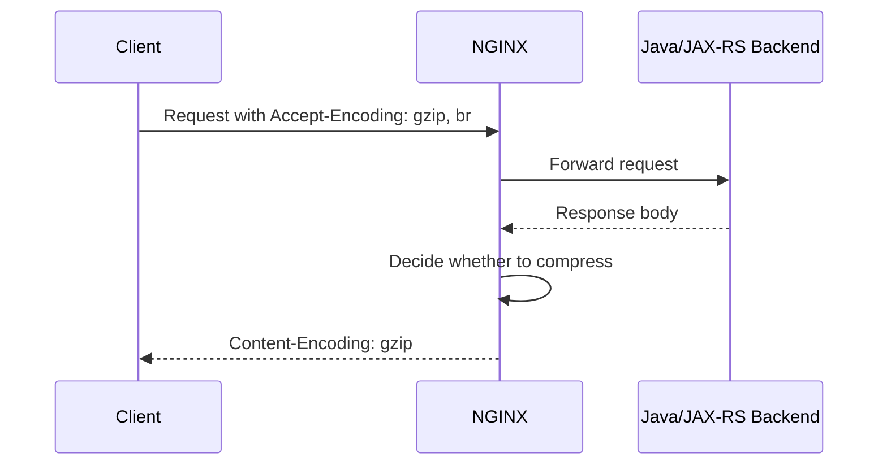
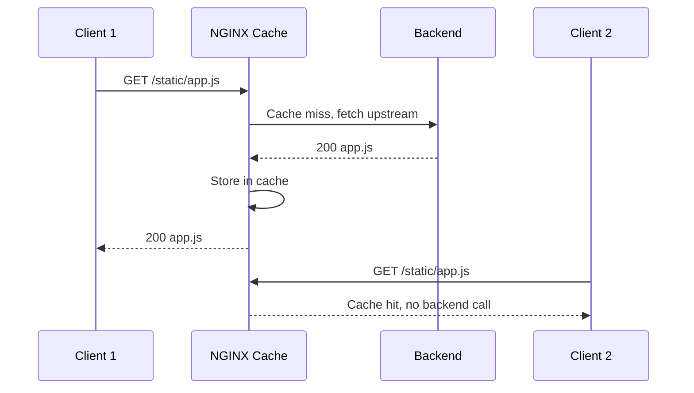

# Part 016 — Compression, Caching, Static Assets, and API Cache Pitfalls

## 1. Tujuan Part Ini

NGINX sering dipakai untuk mempercepat delivery response.

Dua mekanisme yang sering muncul:

```text
compression -> mengurangi ukuran response
caching     -> menghindari request berulang ke upstream
```

Keduanya berguna, tetapi juga berbahaya jika diterapkan tanpa pemahaman HTTP semantics.

Compression yang salah bisa menyebabkan:

```text
CPU spike
latency naik
response double-compressed
client tidak bisa decode
observability ukuran payload membingungkan
```

Caching yang salah bisa menyebabkan:

```text
user A melihat data user B
quote lama tetap muncul
order status stale
authorization bypass via cache key buruk
cache poisoning
incident sulit direproduksi
```

Untuk enterprise Java/JAX-RS backend, terutama domain quote/order, caching harus sangat hati-hati karena banyak data bersifat user-specific, tenant-specific, stateful, dan compliance-sensitive.

Part ini membahas compression, proxy cache, static asset handling, dan API cache pitfalls dari sudut pandang senior backend engineer.

---

## 2. Mental Model: Compression vs Caching

Compression menjawab:

```text
Bagaimana response yang sama dikirim lebih kecil?
```

Caching menjawab:

```text
Apakah request berikutnya perlu masuk ke backend lagi?
```

Perbedaannya:

| Area | Compression | Caching |
|---|---|---|
| Tujuan | Mengurangi payload size | Mengurangi backend hit |
| Risiko utama | CPU cost, compatibility | correctness, privacy, stale data |
| Scope | response transfer | response reuse |
| Dipengaruhi header | Accept-Encoding, Content-Encoding, Vary | Cache-Control, ETag, Vary, Authorization |
| Cocok untuk | text/json/css/js/html | static asset, public immutable response |
| Berbahaya untuk | binary yang sudah compressed | personalized/stateful/sensitive API |

Prinsip penting:

```text
Compression is mostly a performance optimization.
Caching is a correctness decision.
```

Karena caching mengubah sumber kebenaran response, caching harus direview seperti perubahan logic aplikasi.

---

## 3. Compression Lifecycle

Lifecycle sederhana:



NGINX akan mempertimbangkan:

```text
Apakah gzip enabled?
Apakah client support gzip?
Apakah response MIME type termasuk?
Apakah response cukup besar?
Apakah response sudah compressed?
Apakah response dari proxied upstream boleh dikompresi?
```

Header penting:

```http
Accept-Encoding: gzip, br
Content-Encoding: gzip
Vary: Accept-Encoding
```

`Vary: Accept-Encoding` penting supaya cache tidak mencampur response compressed dan uncompressed untuk client berbeda.

---

## 4. gzip di NGINX

Contoh basic:

```nginx
gzip on;
gzip_comp_level 5;
gzip_min_length 1024;
gzip_types
    text/plain
    text/css
    application/json
    application/javascript
    application/xml
    text/xml;
gzip_vary on;
```

Penjelasan:

```text
gzip on             -> aktifkan gzip
gzip_comp_level     -> trade-off CPU vs compression ratio
gzip_min_length     -> jangan kompres response terlalu kecil
gzip_types          -> MIME type yang dikompresi
gzip_vary           -> set Vary: Accept-Encoding
```

Jangan asal set compression level terlalu tinggi.

Level tinggi mungkin menghemat bandwidth sedikit, tetapi menambah CPU dan latency.

Rule praktis:

```text
Untuk API JSON, level sedang biasanya lebih masuk akal daripada level maksimum.
```

Yang tidak perlu dikompresi ulang:

```text
jpg/jpeg/png/webp
zip
gzip
gz
pdf tertentu
video/audio
protobuf binary tertentu
```

File tersebut biasanya sudah compressed atau tidak mendapat benefit besar.

---

## 5. Brotli

Brotli sering memberi compression ratio lebih baik untuk text asset, terutama static frontend asset.

Tetapi dalam NGINX open source default, Brotli biasanya bukan modul built-in standar seperti gzip. Ia sering membutuhkan dynamic module, image custom, atau controller support tertentu.

Karena itu, jangan tulis asumsi:

```text
NGINX pasti support brotli.
```

Yang benar:

```text
Verify apakah image/controller NGINX yang dipakai memiliki brotli module.
```

Brotli lebih relevan untuk:

```text
JavaScript bundle
CSS
HTML
static text asset
```

Untuk REST API JSON, benefit bisa ada, tetapi operational trade-off tetap harus dihitung.

Checklist:

```text
Apakah brotli module tersedia?
Apakah client target mendukung br?
Apakah CDN/cloud LB sudah melakukan compression?
Apakah double compression mungkin terjadi?
Apakah CPU overhead terlihat di dashboard?
```

---

## 6. Compression di Layer Mana?

Compression bisa terjadi di beberapa layer:

```text
Application Java/JAX-RS
NGINX reverse proxy
Kubernetes ingress
Cloud load balancer/CDN
Browser/client library
```

Jika lebih dari satu layer melakukan compression, bisa terjadi:

```text
double compression
header mismatch
incorrect Content-Length
unexpected latency
hard-to-debug client decode error
```

Prinsip:

```text
Satu response sebaiknya dikompresi oleh satu layer yang jelas ownership-nya.
```

Untuk enterprise system:

- static frontend asset sering cocok dikompresi di CDN/edge;
- API JSON bisa dikompresi di NGINX atau application, tetapi harus konsisten;
- binary/protobuf/file download perlu policy khusus;
- internal service-to-service mungkin tidak butuh compression jika network cepat dan CPU lebih mahal.

---

## 7. Proxy Cache Mental Model

Proxy cache membuat NGINX menyimpan response upstream dan mengembalikannya untuk request berikutnya.

Lifecycle:



Cache hit bagus jika response memang reusable.

Cache hit berbahaya jika response seharusnya user-specific.

Pertanyaan pertama sebelum caching:

```text
Apakah response ini boleh digunakan ulang untuk requester lain?
```

Jika jawabannya tidak jelas, default-nya jangan cache.

---

## 8. Basic proxy_cache Configuration

Contoh konseptual:

```nginx
proxy_cache_path /var/cache/nginx/api_cache
    levels=1:2
    keys_zone=api_cache:100m
    max_size=10g
    inactive=60m
    use_temp_path=off;

server {
    location /public-catalog/ {
        proxy_cache api_cache;
        proxy_cache_key "$scheme$request_method$host$request_uri";
        proxy_cache_valid 200 10m;
        proxy_cache_valid 404 1m;

        proxy_pass http://catalog_backend;

        add_header X-Cache-Status $upstream_cache_status always;
    }
}
```

Konsep penting:

```text
proxy_cache_path   -> lokasi dan zone cache
keys_zone          -> metadata cache di shared memory
max_size           -> batas disk cache
inactive           -> evict jika tidak diakses
proxy_cache_key    -> identitas cache entry
proxy_cache_valid  -> status dan TTL yang boleh dicache
```

`X-Cache-Status` membantu debugging:

```text
MISS
HIT
BYPASS
EXPIRED
STALE
UPDATING
REVALIDATED
```

Jangan aktifkan proxy cache tanpa header observability.

---

## 9. Cache Key: Bagian Paling Berbahaya

Cache key menentukan apakah dua request dianggap sama.

Cache key buruk adalah sumber incident besar.

Contoh cache key terlalu sederhana:

```nginx
proxy_cache_key "$request_uri";
```

Risiko:

```text
Host berbeda berbagi cache.
Scheme berbeda berbagi cache.
Tenant berbeda berbagi cache.
Authorization berbeda berbagi cache.
Language berbeda berbagi cache.
User-specific response bocor.
```

Cache key lebih aman untuk public content:

```nginx
proxy_cache_key "$scheme$request_method$host$request_uri";
```

Untuk tenant-aware public-ish content, mungkin butuh:

```nginx
proxy_cache_key "$scheme$request_method$host$http_x_tenant_id$request_uri";
```

Tetapi hati-hati: header tenant dari client bisa dipalsukan jika tidak berasal dari trusted identity layer.

Rule:

```text
Jangan masukkan identity/tenant header ke cache key kecuali header itu trusted dan divalidasi di boundary.
```

---

## 10. Cache-Control, ETag, Last-Modified, and Vary

Header penting:

```http
Cache-Control: no-store
Cache-Control: private
Cache-Control: public, max-age=31536000, immutable
ETag: "abc123"
Last-Modified: Wed, 10 Jul 2026 10:00:00 GMT
Vary: Accept-Encoding
Vary: Authorization
```

Interpretasi praktis:

| Header | Makna praktis |
|---|---|
| `no-store` | jangan simpan response |
| `private` | boleh cache di browser user, bukan shared proxy |
| `public` | boleh shared cache jika aman |
| `max-age` | TTL cache |
| `immutable` | asset versioned tidak berubah |
| `ETag` | validator untuk conditional request |
| `Last-Modified` | validator berbasis timestamp |
| `Vary` | cache harus membedakan berdasarkan header tertentu |

Untuk Java/JAX-RS API, backend harus sengaja mengirim header cache yang benar.

NGINX boleh override, tetapi override cache header adalah keputusan arsitektural, bukan sekadar config tweak.

---

## 11. Static Asset Handling

NGINX sangat cocok untuk static asset.

Contoh:

```nginx
location /assets/ {
    root /usr/share/nginx/html;
    try_files $uri =404;

    gzip on;
    gzip_types text/css application/javascript application/json image/svg+xml;

    add_header Cache-Control "public, max-age=31536000, immutable" always;
}
```

Static asset yang aman dicache lama biasanya punya filename versioned:

```text
app.8f3a1c.js
style.91bd2.css
logo.a8cc.svg
```

Jika asset tidak versioned:

```text
app.js
style.css
```

cache panjang bisa membuat client memakai versi lama setelah deployment.

Rule:

```text
Long cache TTL requires content-addressed or versioned filenames.
```

Untuk SPA:

```text
/index.html       -> cache pendek atau no-cache
/assets/*.js      -> cache panjang immutable
/assets/*.css     -> cache panjang immutable
```

Contoh:

```nginx
location = /index.html {
    add_header Cache-Control "no-cache" always;
}

location /assets/ {
    add_header Cache-Control "public, max-age=31536000, immutable" always;
}
```

---

## 12. API Caching: Kapan Aman?

API caching aman jika response:

- tidak user-specific;
- tidak tenant-sensitive;
- tidak bergantung Authorization;
- tidak berubah cepat;
- punya cache key yang benar;
- punya invalidation story;
- punya observability;
- punya fallback jika stale;
- tidak melanggar compliance/privacy.

Contoh kandidat yang relatif aman:

```text
public product catalog metadata
public static reference data
country list
currency list
feature-independent enum metadata
read-only documentation content
```

Contoh yang berisiko tinggi:

```text
quote detail
order detail
customer profile
billing information
user permission
workflow task list
case management data
tenant configuration sensitif
```

Untuk quote/order domain, default mental model:

```text
Do not shared-cache business transaction API unless explicitly designed and reviewed.
```

---

## 13. API Cache Pitfalls

### 13.1 Authorization Header Ignored

Request:

```http
GET /api/quotes/123
Authorization: Bearer token-user-A
```

Jika cache key hanya:

```text
/api/quotes/123
```

maka user B bisa menerima response user A.

Mitigasi:

```nginx
proxy_no_cache $http_authorization;
proxy_cache_bypass $http_authorization;
```

Atau lebih tegas:

```text
Jangan cache endpoint yang memakai Authorization kecuali desainnya benar-benar matang.
```

### 13.2 Tenant Header Tidak Trusted

Jika cache key memakai:

```text
X-Tenant-Id
```

tetapi header bisa dikirim client, attacker bisa memanipulasi cache partition.

Mitigasi:

```text
Tenant identity harus berasal dari trusted auth layer, bukan raw client header.
```

### 13.3 Caching POST Response

Secara teknis beberapa response non-GET bisa dicache dalam kondisi tertentu, tetapi secara operasional ini sering berbahaya.

Untuk enterprise API:

```text
Cache GET/HEAD only unless ada alasan kuat dan review eksplisit.
```

### 13.4 Stale Quote/Order State

Quote/order adalah stateful workflow.

Jika cache membuat state lama terlihat:

```text
quote appears draft although already submitted
order appears pending although completed
user repeats action based on stale state
```

Ini bukan hanya issue performance. Ini correctness dan auditability issue.

### 13.5 Cache Poisoning

Cache poisoning terjadi saat attacker membuat cache menyimpan response yang salah untuk request yang nanti dipakai victim.

Risk factor:

```text
Host header tidak divalidasi
cache key tidak memasukkan host
Vary diabaikan
query normalization buruk
untrusted header masuk response
redirect dicache
error page dicache terlalu lama
```

---

## 14. Cache Bypass and No-Cache Policy

Contoh policy:

```nginx
set $skip_cache 0;

if ($request_method != GET) {
    set $skip_cache 1;
}

if ($http_authorization != "") {
    set $skip_cache 1;
}

if ($http_cookie != "") {
    set $skip_cache 1;
}

proxy_cache_bypass $skip_cache;
proxy_no_cache     $skip_cache;
```

Catatan:

`if` di NGINX punya banyak pitfall jika dipakai sembarangan. Untuk production, lebih baik gunakan `map` di context `http`.

Contoh dengan `map`:

```nginx
map $request_method $skip_cache_method {
    default 1;
    GET     0;
    HEAD    0;
}

map $http_authorization $skip_cache_auth {
    default 1;
    ""      0;
}

map "$skip_cache_method$skip_cache_auth" $skip_cache {
    default 1;
    "00"    0;
}

server {
    location /public-catalog/ {
        proxy_cache api_cache;
        proxy_cache_bypass $skip_cache;
        proxy_no_cache $skip_cache;
        proxy_pass http://catalog_backend;
    }
}
```

Ini lebih eksplisit dan lebih mudah direview.

---

## 15. Stale Cache and Failure Behavior

Stale cache bisa membantu availability.

Contoh:

```nginx
proxy_cache_use_stale error timeout http_500 http_502 http_503 http_504 updating;
```

Artinya, jika upstream error atau timeout, NGINX boleh menyajikan response lama.

Ini berguna untuk:

```text
static content
public catalog
non-critical metadata
read-mostly reference data
```

Berbahaya untuk:

```text
quote state
order status
payment status
authorization decision
case assignment
workflow task state
```

Pertanyaan review:

```text
Apakah stale response lebih baik daripada error?
Berapa umur stale yang masih aman?
Apakah user diberi indikasi data stale?
Apakah stale response melanggar audit/compliance?
```

Jangan aktifkan stale cache global untuk semua API.

---

## 16. Cache Purge and Invalidation

Cache invalidation adalah bagian tersulit.

Strategi umum:

```text
TTL pendek
versioned URL
explicit purge
event-driven invalidation
cache bypass untuk critical read
no shared cache untuk mutable domain API
```

NGINX open source punya kemampuan caching dasar, tetapi fitur purge yang nyaman sering membutuhkan tambahan module, NGINX Plus, atau mekanisme deployment tertentu.

Jangan desain API cache yang membutuhkan invalidation kompleks jika platform tidak punya mekanisme purge yang reliable.

Untuk domain quote/order:

```text
Jika invalidation story tidak jelas, jangan cache.
```

---

## 17. Error Caching

NGINX bisa cache status tertentu.

Contoh:

```nginx
proxy_cache_valid 200 10m;
proxy_cache_valid 404 1m;
```

Caching 404 bisa berguna untuk static asset missing atau public catalog lookup.

Tetapi untuk domain workflow:

```text
404 sekarang bisa menjadi 200 beberapa detik kemudian setelah eventual consistency.
```

Contoh:

```text
order created asynchronously
read model belum update
GET /orders/{id} -> 404
NGINX cache 404 selama 1 menit
read model update setelah 2 detik
client tetap melihat 404 dari cache
```

Ini menciptakan false failure.

Rule:

```text
Cache 404 hanya jika lifecycle resource dan consistency model-nya dipahami.
```

---

## 18. Compression + Cache Interaction

Compression dan cache harus memperhatikan `Vary`.

Jika cache menyimpan compressed response untuk client yang support gzip, lalu mengirimnya ke client yang tidak support gzip, client bisa gagal membaca response.

Karena itu:

```nginx
gzip_vary on;
```

Dan cache harus menghormati:

```http
Vary: Accept-Encoding
```

Pitfall:

```text
Cache key tidak membedakan Accept-Encoding.
Vary dihapus oleh proxy.
Upstream sudah compressed, NGINX compress lagi.
CDN compress setelah NGINX.
```

Debug:

```bash
curl -H 'Accept-Encoding: gzip' -I https://example.com/api/public
curl -H 'Accept-Encoding:' -I https://example.com/api/public
```

Cek:

```text
Content-Encoding
Vary
X-Cache-Status
Content-Length / Transfer-Encoding
```

---

## 19. Observability for Compression and Cache

Tanpa observability, cache adalah black box.

Minimal tambahkan:

```nginx
add_header X-Cache-Status $upstream_cache_status always;
```

Access log fields yang berguna:

```text
request_uri
status
upstream_status
request_time
upstream_response_time
body_bytes_sent
upstream_cache_status
sent_http_content_encoding
sent_http_cache_control
http_accept_encoding
```

Contoh log format:

```nginx
log_format cache_json escape=json
'{'
  '"time":"$time_iso8601",'
  '"request_id":"$request_id",'
  '"host":"$host",'
  '"uri":"$request_uri",'
  '"status":$status,'
  '"request_time":$request_time,'
  '"upstream_status":"$upstream_status",'
  '"upstream_response_time":"$upstream_response_time",'
  '"cache_status":"$upstream_cache_status",'
  '"content_encoding":"$sent_http_content_encoding",'
  '"cache_control":"$sent_http_cache_control",'
  '"bytes_sent":$body_bytes_sent'
'}';
```

Dashboard minimum:

```text
cache hit ratio
cache bypass ratio
cache miss ratio
upstream request reduction
4xx/5xx by cache status
latency by HIT/MISS/BYPASS
CPU usage after enabling compression
response size distribution
```

---

## 20. Kubernetes Ingress Considerations

Di Kubernetes ingress, compression/caching bisa dikontrol oleh:

```text
global controller ConfigMap
Ingress annotation
custom snippets
controller-specific feature
sidecar/static NGINX
cloud CDN/LB in front
```

Yang harus diingat:

```text
Tidak semua NGINX directive bisa dipasang aman lewat annotation.
Tidak semua controller mendukung caching/compression dengan cara sama.
Snippets bisa sangat berbahaya jika dibuka untuk semua team.
```

Untuk ingress-nginx atau NGINX Inc controller, selalu verifikasi:

- controller type;
- supported annotation;
- ConfigMap keys;
- snippets enabled/disabled;
- policy admission;
- global vs per-ingress override;
- security review untuk arbitrary config injection.

Jangan membuat asumsi dari satu cluster ke cluster lain.

---

## 21. Java/JAX-RS Backend Concerns

Backend Java/JAX-RS tetap punya tanggung jawab penting.

Aplikasi harus benar dalam:

```text
Cache-Control
ETag
Last-Modified
Vary
Content-Type
Content-Length jika relevan
streaming response behavior
sensitive data marking
```

Contoh JAX-RS concern:

```text
Apakah endpoint user-specific mengirim Cache-Control: private/no-store?
Apakah response tenant-specific ditandai no-store?
Apakah ETag merepresentasikan versi resource yang benar?
Apakah conditional GET aman terhadap authorization?
Apakah streaming endpoint tidak dikompresi/buffered secara salah?
```

NGINX bisa membantu, tetapi tidak boleh menjadi satu-satunya tempat correctness cache ditentukan.

Rule:

```text
Application owns semantic truth.
NGINX may enforce or optimize delivery.
```

---

## 22. Security Checklist

Review compression/caching dari sisi security:

- Jangan shared-cache response dengan `Authorization` kecuali desain eksplisit.
- Jangan cache response yang mengandung PII, customer data, quote/order detail, atau permission-sensitive data.
- Pastikan cache key memasukkan host/scheme/method/path yang relevan.
- Validasi `Host` header untuk mengurangi cache poisoning risk.
- Pastikan `Vary` tidak dihapus sembarangan.
- Jangan cache redirect yang bergantung untrusted input.
- Jangan cache error page terlalu lama tanpa alasan.
- Jangan expose cache directory.
- Pastikan cache files tidak masuk backup/log yang tidak aman.
- Pastikan sensitive response memakai `Cache-Control: no-store`.
- Pastikan static asset immutable benar-benar versioned.

---

## 23. Performance Checklist

Review dari sisi performance:

- Apakah gzip level terlalu tinggi?
- Apakah compression diterapkan pada MIME type yang tepat?
- Apakah binary sudah compressed dikecualikan?
- Apakah CPU naik setelah compression?
- Apakah bandwidth turun cukup signifikan?
- Apakah proxy cache mengurangi upstream QPS?
- Apakah disk cache cukup besar?
- Apakah cache eviction menyebabkan thrashing?
- Apakah temp/cache disk latency memengaruhi response?
- Apakah cache lock dibutuhkan untuk mencegah thundering herd?
- Apakah cache hit ratio cukup tinggi untuk membenarkan kompleksitas?

---

## 24. Debugging Playbook

### 24.1 Response Tidak Terkompresi

Cek:

```bash
curl -H 'Accept-Encoding: gzip' -I https://example.com/api/public
```

Cari:

```text
Content-Encoding: gzip
Vary: Accept-Encoding
```

Jika tidak ada, cek:

```text
gzip on?
gzip_types match Content-Type?
gzip_min_length terlalu besar?
response sudah compressed?
request HTTP version memenuhi gzip_http_version?
upstream/header melarang?
controller config benar-benar applied?
```

### 24.2 Client Gagal Decode

Cek:

```text
Content-Encoding salah?
Double compression?
Content-Length mismatch?
CDN juga compress?
Upstream sudah gzip?
```

### 24.3 Cache Tidak HIT

Cek:

```text
X-Cache-Status MISS/BYPASS/EXPIRED?
Cache-Control dari upstream?
Authorization/Cookie menyebabkan bypass?
proxy_cache_key berubah?
Query string berbeda?
Vary menyebabkan variant berbeda?
TTL terlalu pendek?
```

### 24.4 Data Stale

Cek:

```text
TTL terlalu panjang?
proxy_cache_use_stale aktif?
Invalidation tidak jalan?
ETag/Last-Modified salah?
Read model eventually consistent?
```

### 24.5 Data Bocor Antar User/Tenant

Anggap incident security.

Cek segera:

```text
Endpoint apa yang dicache?
Cache key apa?
Authorization/Cookie masuk bypass?
Tenant identity trusted?
Response header Cache-Control apa?
Sejak kapan config aktif?
Apakah cache perlu purge?
Apakah customer impact bisa dihitung dari access log?
```

---

## 25. PR Review Checklist

Saat mereview PR terkait compression/caching/static asset:

- Apakah perubahan berlaku global atau per route?
- Apakah endpoint yang dicache benar-benar public/shared-safe?
- Apakah cache key cukup aman?
- Apakah Authorization/Cookie bypass ada?
- Apakah tenant/user-specific response terlindungi?
- Apakah TTL sesuai lifecycle data?
- Apakah stale cache boleh dipakai?
- Apakah purge/invalidation story jelas?
- Apakah `X-Cache-Status` atau log cache tersedia?
- Apakah gzip MIME type benar?
- Apakah binary asset tidak dikompresi ulang?
- Apakah static asset versioned sebelum immutable cache?
- Apakah index.html SPA tidak dicache terlalu lama?
- Apakah security headers dan cache headers konsisten?
- Apakah rollback/purge plan ada?

---

## 26. Internal Verification Checklist

Untuk konteks CSG/team, verifikasi:

- Apakah NGINX digunakan untuk compression?
- Apakah cloud LB/CDN juga melakukan compression?
- Apakah ada proxy cache aktif di NGINX/Ingress?
- Endpoint apa saja yang dicache?
- Apakah API quote/order pernah dicache?
- Apakah static frontend dilayani oleh NGINX, CDN, object storage, atau aplikasi Java?
- Apakah Helm chart/ConfigMap mengaktifkan gzip/cache global?
- Apakah snippets digunakan untuk caching?
- Apakah access log punya `$upstream_cache_status`?
- Apakah dashboard punya cache hit ratio?
- Apakah ada runbook purge cache?
- Apakah ada incident historis terkait stale data atau wrong-user data?
- Apakah compliance/privacy team punya policy cache untuk PII/customer data?

---

## 27. Key Takeaways

Compression relatif aman jika MIME type, CPU, dan compatibility dipahami.

Caching jauh lebih berisiko karena menyentuh correctness, privacy, dan lifecycle data.

Untuk enterprise Java/JAX-RS system:

```text
Static asset caching: usually good if versioned.
Public reference data caching: possible with review.
Transactional API caching: dangerous by default.
Personalized/tenant data caching: avoid unless explicitly designed.
Authorization-based response caching: high risk.
```

Senior engineer tidak hanya bertanya:

```text
Apakah cache mempercepat response?
```

Tetapi bertanya:

```text
Apakah response ini boleh dipakai ulang?
Untuk siapa?
Berapa lama?
Dengan cache key apa?
Bagaimana invalidation-nya?
Bagaimana mendeteksi salah cache?
Bagaimana rollback/purge saat incident?
```

Jika pertanyaan itu belum terjawab, caching belum siap production.
