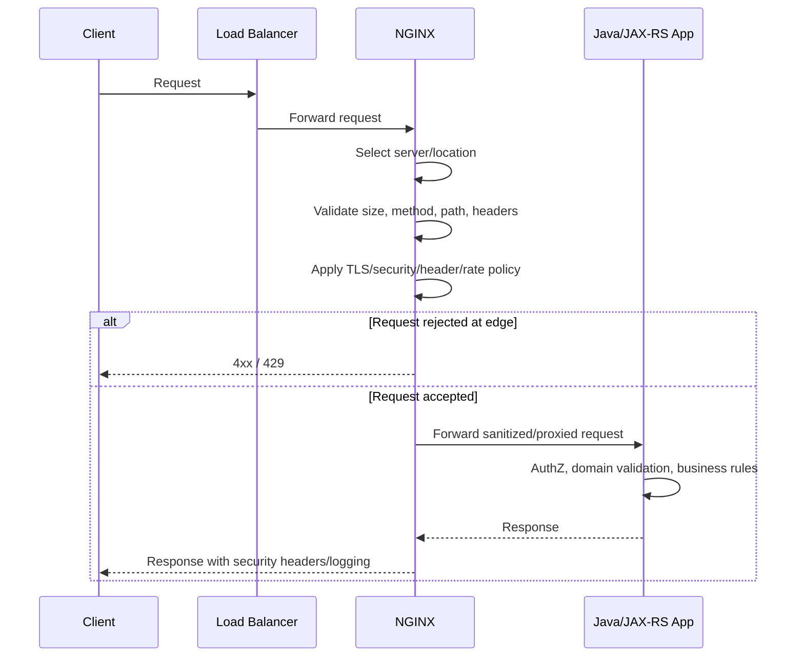

# Part 017 — Security Hardening for NGINX Edge and Reverse Proxy

## 1. Tujuan Part Ini

NGINX sering berada di posisi yang sangat sensitif:

```text
client / partner / browser / automation
        ↓
DNS / load balancer
        ↓
NGINX / Ingress
        ↓
Java/JAX-RS service
```

Artinya, NGINX adalah salah satu layer pertama yang melihat request sebelum request masuk ke aplikasi.

Security hardening di NGINX bukan pengganti secure coding di Java/JAX-RS. Hardening di NGINX adalah **defense layer** untuk:

```text
membatasi input buruk sebelum masuk aplikasi
menutup default exposure
mengurangi blast radius
menjaga trust boundary
membuat failure lebih cepat dan lebih jelas
memberi observability terhadap traffic abnormal
```

Part ini membahas NGINX sebagai security control di edge/reverse proxy/ingress layer.

Fokusnya bukan sekadar menambahkan banyak header security. Fokusnya adalah memahami:

```text
apa yang harus ditolak di proxy
apa yang harus tetap divalidasi di aplikasi
apa yang tidak boleh dipercaya dari client
apa yang perlu dilog
apa yang tidak boleh dilog
apa yang harus diverifikasi di platform/internal team
```

---

## 2. Mental Model: NGINX Security Boundary

NGINX bisa melakukan beberapa jenis kontrol:

| Kontrol | Contoh | Cocok di NGINX? | Tetap perlu di aplikasi? |
|---|---|---:|---:|
| Request size limit | `client_max_body_size` | Ya | Ya, untuk domain limit |
| Header size limit | large header protection | Ya | Ya, untuk semantic validation |
| Method restriction | hanya `GET/POST/PUT/PATCH/DELETE` | Ya | Ya |
| Path denylist | block `/.git`, `/admin`, `/actuator` | Ya | Ya |
| Security headers | HSTS, CSP, frame options | Ya | Kadang |
| Rate limiting | per IP / key | Ya | Ya, untuk user/tenant-aware |
| Auth delegation | `auth_request` | Kadang | Ya |
| Authorization business rule | role/permission/domain rule | Tidak ideal | Ya |
| Input validation | JSON schema, field semantics | Tidak | Ya |
| Tenant isolation | tenant ownership check | Tidak | Ya |
| Audit decision | who did what | Tidak cukup | Ya |

Prinsip utamanya:

```text
NGINX can reject obviously bad traffic.
Application must still enforce business truth.
```

Jangan pernah menganggap request aman hanya karena sudah lewat NGINX.

---

## 3. Request Hardening Lifecycle

Lifecycle security sederhana:



Security decision bisa terjadi di beberapa layer. Yang berbahaya adalah ketika tiap layer berasumsi layer lain sudah melakukan validasi.

Contoh anti-pattern:

```text
NGINX assumes app validates Host.
App assumes NGINX validates Host.
Neither validates Host correctly.
```

Hasilnya bisa berupa host header injection, wrong redirect, poisoned absolute URL, atau exposure environment internal.

---

## 4. Secure Default Server

NGINX harus punya default server yang aman.

Masalah umum:

```text
request dengan Host tidak dikenal tetap masuk ke aplikasi default
certificate wildcard membuat hostname salah tetap terlihat valid
crawler menemukan endpoint internal dari IP publik
health/admin endpoint terbuka karena default route terlalu permisif
```

Contoh pola default server:

```nginx
server {
    listen 80 default_server;
    server_name _;

    return 444;
}

server {
    listen 443 ssl default_server;
    server_name _;

    ssl_certificate     /etc/nginx/certs/default.crt;
    ssl_certificate_key /etc/nginx/certs/default.key;

    return 444;
}
```

Catatan:

```text
444 adalah NGINX-specific behavior untuk menutup koneksi tanpa response.
Tidak semua organisasi menyukai ini.
Beberapa memilih 400 atau 404 agar lebih observable.
```

Untuk enterprise environment, keputusan ini harus selaras dengan observability dan security policy.

### Kubernetes Ingress equivalent

Di Kubernetes, default behavior bisa berasal dari:

```text
default backend ingress controller
Ingress tanpa host
wildcard host rule
catch-all path
cloud load balancer default target
```

Jangan hanya mengecek Ingress milik service sendiri. Cek controller-level default backend juga.

---

## 5. Host Header Hardening

`Host` header adalah input dari client.

Ia memengaruhi:

```text
virtual host selection
absolute redirect URL
URI generation
CORS origin logic
password reset link
callback URL
OpenAPI/server URL
multi-tenant routing
```

Risiko Host header injection:

```text
client sends Host: attacker.example.com
backend builds absolute URL from Host
email/reset/callback points to attacker domain
```

NGINX harus membatasi hostname yang valid.

Contoh:

```nginx
server {
    listen 443 ssl;
    server_name api.example.com;

    if ($host != "api.example.com") {
        return 400;
    }

    location / {
        proxy_set_header Host $host;
        proxy_set_header X-Forwarded-Host $host;
        proxy_pass http://jaxrs_upstream;
    }
}
```

Namun hati-hati dengan `if` di NGINX. Untuk banyak kasus, lebih aman memakai server block eksplisit dan default server yang menolak unknown host.

Lebih baik:

```nginx
server {
    listen 443 ssl default_server;
    server_name _;
    return 400;
}

server {
    listen 443 ssl;
    server_name api.example.com;

    location / {
        proxy_set_header Host api.example.com;
        proxy_set_header X-Forwarded-Host api.example.com;
        proxy_pass http://jaxrs_upstream;
    }
}
```

### Dampak ke Java/JAX-RS

Backend Java/JAX-RS sering memakai request context untuk membangun URI:

```java
uriInfo.getBaseUri()
uriInfo.getAbsolutePath()
Response.created(uri).build()
```

Jika proxy header salah, aplikasi bisa menghasilkan:

```text
http://internal-service:8080/...
https://wrong-host/...
http instead of https
wrong tenant domain
wrong redirect after login
```

Hardening NGINX harus dipasangkan dengan konfigurasi trusted proxy di aplikasi/framework.

---

## 6. Request Size Limit

Request size harus dibatasi di edge.

Tanpa batas, attacker atau client salah konfigurasi bisa mengirim body besar dan menyebabkan:

```text
memory pressure
disk temporary file penuh
worker sibuk membaca upload lambat
upstream Java thread tertahan
413 tidak konsisten antar layer
```

Directive utama:

```nginx
client_max_body_size 10m;
```

Contoh per route:

```nginx
server {
    listen 443 ssl;
    server_name api.example.com;

    client_max_body_size 1m;

    location /api/v1/documents/upload {
        client_max_body_size 50m;
        proxy_pass http://jaxrs_upstream;
    }

    location / {
        proxy_pass http://jaxrs_upstream;
    }
}
```

Mental model:

```text
default kecil
exception eksplisit
exception punya justifikasi domain
exception punya observability
exception punya test
```

### Kubernetes Ingress

Di ingress-nginx, body size sering dikontrol via annotation seperti:

```yaml
metadata:
  annotations:
    nginx.ingress.kubernetes.io/proxy-body-size: "10m"
```

Nama annotation bergantung controller. Jangan copy annotation tanpa memastikan controller yang digunakan.

### Dampak ke Java/JAX-RS

Aplikasi tetap harus punya limit sendiri:

```text
multipart max size
JSON body max size
file type validation
content-type validation
domain-specific attachment policy
virus/malware scanning jika relevan
```

NGINX limit adalah perimeter limit, bukan domain validation.

---

## 7. Header Size Limit

Header besar bisa muncul dari:

```text
JWT terlalu besar
cookie membengkak
trace baggage terlalu panjang
client mengirim header sampah
bot/fuzzer mengirim header ekstrem
```

NGINX perlu mengatur buffer header agar request abnormal tidak menghabiskan resource.

Contoh directive yang sering terkait:

```nginx
client_header_buffer_size 1k;
large_client_header_buffers 4 8k;
```

Risiko limit terlalu kecil:

```text
valid user gagal karena cookie/JWT besar
SSO/OIDC redirect gagal
trace context terpotong/tidak diterima
```

Risiko limit terlalu besar:

```text
memory overhead naik
attack surface membesar
header bloat tidak terdeteksi
```

Senior engineer harus membaca header size bukan hanya sebagai tuning teknis, tetapi sebagai sinyal desain:

```text
Kenapa JWT sebesar itu?
Kenapa cookie menyimpan terlalu banyak data?
Kenapa baggage telemetry terlalu panjang?
Apakah ada header internal yang bocor ke client?
```

---

## 8. Method Restriction

Tidak semua endpoint harus menerima semua method.

Risiko method terlalu terbuka:

```text
TRACE enabled unintentionally
unexpected PUT/DELETE reaches app
CORS preflight behavior kacau
crawler/fuzzer mendapat response terlalu informatif
```

Contoh pembatasan:

```nginx
location /api/ {
    limit_except GET POST PUT PATCH DELETE OPTIONS {
        deny all;
    }

    proxy_pass http://jaxrs_upstream;
}
```

Atau dengan map:

```nginx
map $request_method $method_allowed {
    default 0;
    GET     1;
    POST    1;
    PUT     1;
    PATCH   1;
    DELETE  1;
    OPTIONS 1;
}

server {
    location /api/ {
        if ($method_allowed = 0) {
            return 405;
        }

        proxy_pass http://jaxrs_upstream;
    }
}
```

Namun jangan membuat method policy di NGINX yang bertentangan dengan aplikasi.

Contoh failure:

```text
JAX-RS endpoint mendukung PATCH
NGINX hanya allow GET/POST/PUT/DELETE
Client menerima 405 dari NGINX
Application log tidak menunjukkan request
```

Untuk API enterprise, method policy harus masuk PR checklist.

---

## 9. Dangerous Path Blocking

NGINX sebaiknya menolak path yang jelas tidak boleh diakses dari luar.

Contoh:

```nginx
location ~* /(\.git|\.svn|\.hg|\.env|Dockerfile|docker-compose\.ya?ml)$ {
    return 404;
}

location ~* /(?:actuator|metrics|debug|admin|internal)(?:/|$) {
    return 404;
}
```

Tetapi hati-hati: block list bukan primary security.

Lebih baik:

```text
hanya expose path yang memang public
admin/internal endpoint berada di network berbeda
authZ tetap di aplikasi
service management endpoint tidak diroute via public ingress
```

### Java/JAX-RS context

JAX-RS service mungkin punya endpoint:

```text
/api/v1/quotes
/api/v1/orders
/internal/reindex
/admin/retry
/health
/metrics
/openapi
```

Tidak semua endpoint boleh keluar melalui public edge.

Internal endpoint exposure adalah salah satu kesalahan paling mahal di enterprise platform.

---

## 10. Path Traversal and Path Normalization Awareness

NGINX dan upstream bisa berbeda dalam melihat path.

Contoh input berbahaya:

```text
/..%2fadmin
/%2e%2e/%2e%2e/etc/passwd
/api//v1///quotes
/api/v1/%2e%2e/internal
```

Risiko muncul jika:

```text
NGINX melakukan normalization berbeda dari aplikasi
rewrite mengubah path sebelum validasi
backend framework decode path lagi
upstream menerima path yang sudah terlihat aman di proxy
```

Prinsip:

```text
Do not rely only on proxy path normalization for application security.
```

NGINX dapat membantu menolak pola yang jelas buruk, tetapi aplikasi tetap harus melakukan authorization berdasarkan resource, bukan hanya path string.

---

## 11. Header Spoofing and Trusted Forwarded Headers

Header seperti ini sering dipakai untuk menentukan identitas request:

```text
X-Forwarded-For
X-Forwarded-Host
X-Forwarded-Proto
X-Real-IP
Forwarded
X-Request-ID
X-Correlation-ID
X-User-ID
X-Tenant-ID
X-Client-Cert
```

Masalahnya: client juga bisa mengirim header tersebut.

NGINX harus membedakan:

```text
header dari client tidak trusted
header dari trusted proxy bisa trusted
header identity internal harus dihapus sebelum di-set ulang
```

Contoh pola aman:

```nginx
location / {
    proxy_set_header X-Forwarded-For   $proxy_add_x_forwarded_for;
    proxy_set_header X-Forwarded-Host  $host;
    proxy_set_header X-Forwarded-Proto $scheme;
    proxy_set_header X-Real-IP         $remote_addr;

    proxy_set_header X-User-ID "";
    proxy_set_header X-Tenant-ID "";

    proxy_pass http://jaxrs_upstream;
}
```

Jika NGINX menerima identity dari external auth service, header harus di-set hanya setelah auth berhasil dan harus tidak bisa dikirim langsung oleh client.

### Java/JAX-RS risk

Jika aplikasi percaya `X-User-ID` dari request publik, attacker bisa melakukan:

```text
curl -H 'X-User-ID: admin' https://api.example.com/...
```

Aplikasi tidak boleh mempercayai identity header kecuali ingress/proxy chain sudah dikunci dan terdokumentasi.

---

## 12. Real Client IP and Allow/Deny Rules

IP allowlist sering digunakan untuk:

```text
partner integration
internal admin route
management endpoint
B2B API
migration tool
temporary operational access
```

Masalahnya, source IP di NGINX bisa berupa:

```text
client IP asli
cloud load balancer IP
node IP
proxy IP sebelumnya
NAT gateway IP
corporate proxy IP
```

Jika salah membaca IP, allowlist bisa menjadi tidak berguna.

Contoh konfigurasi real IP:

```nginx
set_real_ip_from 10.0.0.0/8;
set_real_ip_from 172.16.0.0/12;
set_real_ip_from 192.168.0.0/16;
real_ip_header X-Forwarded-For;
real_ip_recursive on;
```

Hati-hati:

```text
set_real_ip_from harus hanya berisi trusted proxy/load balancer
jangan trust X-Forwarded-For dari internet langsung
```

Allowlist contoh:

```nginx
location /partner/ {
    allow 203.0.113.10;
    allow 203.0.113.11;
    deny all;

    proxy_pass http://jaxrs_upstream;
}
```

### Kubernetes/AWS/Azure nuance

Source IP preservation sangat bergantung pada:

```text
LoadBalancer type
externalTrafficPolicy
proxy protocol
ALB/NLB behavior
Azure Load Balancer/Application Gateway behavior
Ingress controller config
```

Jangan mereview `allow`/`deny` tanpa memahami source IP chain.

---

## 13. Security Headers

Security headers membantu browser mengambil keputusan aman.

Header umum:

```text
Strict-Transport-Security
Content-Security-Policy
X-Frame-Options
X-Content-Type-Options
Referrer-Policy
Permissions-Policy
```

Contoh:

```nginx
add_header Strict-Transport-Security "max-age=31536000; includeSubDomains" always;
add_header X-Content-Type-Options "nosniff" always;
add_header X-Frame-Options "DENY" always;
add_header Referrer-Policy "no-referrer" always;
```

CSP contoh minimal:

```nginx
add_header Content-Security-Policy "default-src 'self'; frame-ancestors 'none'" always;
```

Namun CSP tidak boleh asal ditambahkan untuk semua response.

Untuk API JSON murni, beberapa security header berguna tetapi CSP biasanya lebih relevan untuk browser-rendered content.

Untuk SPA/frontend static assets, CSP harus diuji terhadap:

```text
script source
style source
font source
image source
API endpoint
analytics/telemetry endpoint
iframe policy
```

### HSTS caution

HSTS berbahaya jika domain/subdomain belum siap HTTPS penuh.

Sebelum `includeSubDomains` atau preload:

```text
pastikan semua subdomain valid HTTPS
pastikan certificate rotation matang
pastikan rollback strategy jelas
pastikan tidak ada legacy HTTP-only integration
```

---

## 14. Sensitive Header Removal

NGINX dapat menyembunyikan header upstream yang tidak boleh keluar.

Contoh:

```nginx
proxy_hide_header X-Powered-By;
proxy_hide_header Server;
proxy_hide_header X-Internal-Trace;
proxy_hide_header X-Debug-Token;
```

Header internal yang harus hati-hati:

```text
internal service name
pod/node identifier
stack/framework version
debug token
upstream address
internal correlation metadata
user/tenant raw identifiers
```

Namun jangan sembunyikan header observability yang memang dibutuhkan client/support tanpa pengganti.

Contoh aman:

```text
Expose: X-Request-ID
Hide: X-Internal-Request-Route
```

---

## 15. Server Token and Version Disclosure

NGINX bisa mengurangi version disclosure:

```nginx
server_tokens off;
```

Ini bukan security control utama, tetapi mengurangi informasi mudah untuk fingerprinting.

Jangan menganggap `server_tokens off` cukup untuk hardening. Ini hanya hygiene.

---

## 16. SSRF Mitigation Awareness

SSRF biasanya terjadi di aplikasi, bukan di NGINX.

Namun NGINX bisa memperburuk SSRF jika:

```text
proxy_pass memakai variable dari request tanpa allowlist
resolver mengarah ke DNS yang bisa dimanipulasi
internal hostname bisa dicapai dari route publik
rewrite membangun upstream target dari user input
```

Contoh berbahaya:

```nginx
location /proxy/ {
    proxy_pass http://$arg_target;
}
```

Ini membuka peluang request publik memaksa NGINX mengakses internal target.

Pola aman:

```text
jangan membangun upstream dari user input
pakai allowlist upstream eksplisit
pisahkan public route dan internal route
batasi resolver dan network egress
```

Untuk Java/JAX-RS service, SSRF prevention utama tetap di aplikasi dan outbound network policy.

---

## 17. Request Smuggling Awareness

Request smuggling muncul saat proxy dan backend berbeda memahami boundary request, terutama terkait:

```text
Content-Length
Transfer-Encoding
chunked encoding
connection reuse
HTTP/1.1 parsing differences
```

NGINX modern cukup ketat, tetapi risiko tetap muncul dalam chain kompleks:

```text
cloud LB -> WAF -> NGINX -> API gateway -> Java app server
```

Checklist awareness:

```text
hindari proxy chain yang tidak jelas
upgrade komponen proxy secara disiplin
jangan meneruskan hop-by-hop header sembarangan
uji behavior Content-Length vs Transfer-Encoding
pastikan backend app server di-patch
```

Di Java ecosystem, perhatikan app server/container:

```text
Tomcat
Jetty
Undertow
Netty
Quarkus/Vert.x
Spring embedded server
```

Masing-masing punya parser HTTP dan patch lifecycle sendiri.

---

## 18. WAF and ModSecurity Integration

NGINX bisa diintegrasikan dengan WAF, tergantung distribusi/platform:

```text
ModSecurity connector
NGINX App Protect WAF
cloud WAF di ALB/Application Gateway/Front Door
API gateway WAF
third-party security appliance
```

WAF berguna untuk:

```text
known attack pattern
SQLi/XSS generic detection
bot/fuzzer noise
protocol anomaly
virtual patching sementara
```

Tetapi WAF bukan pengganti:

```text
input validation
parameterized query
authorization
tenant isolation
secure domain workflow
```

Risiko WAF:

```text
false positive memblokir legitimate request
false negative memberi rasa aman palsu
latency overhead
rule update menyebabkan incident
observability kurang jelas
```

Untuk enterprise system, WAF harus punya:

```text
detection mode sebelum blocking
exception management
rule ownership
alert triage
business impact review
rollback mechanism
```

---

## 19. Bot Mitigation and Abuse Protection

NGINX bisa membantu melindungi backend dari traffic otomatis:

```text
rate limiting
connection limiting
User-Agent filtering kasar
deny path scanner umum
basic geo/IP policy jika relevan
WAF integration
```

Tetapi bot mitigation serius biasanya membutuhkan layer tambahan:

```text
cloud WAF
bot management product
API gateway policy
risk scoring
captcha untuk browser flow
behavioral detection
```

Jangan membuat rule User-Agent terlalu agresif untuk API enterprise, karena banyak partner/client memakai automation, SDK, atau integration runtime yang User-Agent-nya tidak standar.

---

## 20. Log Redaction and Privacy

Security hardening tidak hanya menolak request. Ia juga mencegah data sensitif bocor melalui log.

Risiko log:

```text
token di query string
Authorization header tercatat
cookie tercatat
PII di URI path
PII di request body
client certificate subject terlalu detail
tenant/user ID tanpa masking
```

Access log default biasanya tidak mencatat body, tetapi bisa mencatat URI lengkap termasuk query string.

Contoh masalah:

```text
GET /api/v1/reset-password?token=secret
GET /api/v1/customer/1234567890/quote
```

Prinsip:

```text
Do not put secrets in URL.
Do not log sensitive headers.
Do not add body logging at NGINX unless explicitly approved.
Use request ID for correlation, not raw payload logging.
```

Jika perlu debugging payload, lakukan dengan controlled sampling dan approval yang jelas.

---

## 21. Error Response Hygiene

NGINX bisa menghasilkan error response sendiri:

```text
400 bad request
403 forbidden
404 not found
413 payload too large
414 URI too long
429 too many requests
494 request header too large
502 bad gateway
503 service unavailable
504 gateway timeout
```

Pastikan error response tidak membocorkan:

```text
NGINX version
internal upstream name
pod IP
internal hostname
stack trace
config path
```

Contoh custom error:

```nginx
error_page 403 /errors/403.json;
error_page 413 /errors/413.json;
error_page 429 /errors/429.json;
error_page 502 503 504 /errors/5xx.json;

location /errors/ {
    internal;
    default_type application/json;
    return 503 '{"error":"service_unavailable","requestId":"$request_id"}';
}
```

Hati-hati: `return` di static location seperti ini butuh desain yang konsisten per status. Jangan sampai semua error menjadi 503.

Untuk API enterprise, error contract sebaiknya diselaraskan antara NGINX/API gateway dan Java/JAX-RS application.

---

## 22. Security Hardening in Kubernetes Ingress

Di Kubernetes, hardening sering tersebar di:

```text
Ingress annotation
IngressClass
controller ConfigMap
controller command args
Helm values
admission policy
NetworkPolicy
PodSecurity
Secret management
cloud LB/WAF configuration
```

Contoh annotation yang mungkin relevan, tergantung controller:

```yaml
metadata:
  annotations:
    nginx.ingress.kubernetes.io/proxy-body-size: "10m"
    nginx.ingress.kubernetes.io/whitelist-source-range: "203.0.113.0/24"
    nginx.ingress.kubernetes.io/ssl-redirect: "true"
```

Risiko besar:

```text
annotation memberi tim aplikasi kemampuan override policy global
configuration-snippet/server-snippet membuka arbitrary NGINX config
per-Ingress exception tidak terlihat oleh platform governance
```

Security hardening di Kubernetes harus didukung policy:

```text
allowed annotation list
blocked annotation list
admission control
Helm linting
GitOps review rule
central platform standard
```

---

## 23. AWS/Azure/On-Prem Considerations

### AWS/EKS

Perlu cek:

```text
WAF berada di CloudFront/ALB/API Gateway atau tidak
ALB/NLB meneruskan source IP bagaimana
security group membatasi ingress port apa
ACM certificate termination di ALB atau NGINX
proxy protocol aktif atau tidak
```

Jika TLS terminate di ALB, NGINX mungkin menerima HTTP internal. Maka `X-Forwarded-Proto` harus benar.

### Azure/AKS

Perlu cek:

```text
Azure Front Door / Application Gateway / Azure WAF
TLS termination location
NSG rule
Private Link/Private Endpoint
source IP preservation
AGIC vs NGINX Ingress boundary
```

### On-prem/hybrid

Perlu cek:

```text
corporate firewall
DMZ reverse proxy
internal L4/L7 load balancer
internal CA
proxy chaining
TLS inspection
split-horizon DNS
```

Dalam hybrid environment, jangan asumsikan NGINX adalah layer pertama. Kadang request sudah melewati beberapa proxy sebelum sampai ke NGINX.

---

## 24. Failure Modes

| Symptom | Kemungkinan penyebab |
|---|---|
| 400 dari NGINX | Host/header invalid, malformed request, header terlalu besar |
| 403 dari NGINX | allow/deny, method restriction, WAF, auth_request |
| 404 dari NGINX | path blocked, wrong location, default backend |
| 413 | body melebihi `client_max_body_size` / ingress body size |
| 414 | URI terlalu panjang |
| 429 | rate limit/connection limit |
| 502 | upstream error, TLS upstream issue, bad proxy config |
| legitimate client blocked | WAF false positive, IP allowlist salah, header limit terlalu kecil |
| app tidak melihat request | request ditolak di NGINX sebelum upstream |
| app melihat wrong scheme/host | forwarded header salah |
| internal endpoint exposed | routing/default server/Ingress terlalu permisif |

---

## 25. Detection and Debugging

Pertanyaan debugging pertama:

```text
Apakah request sampai ke Java/JAX-RS app?
```

Jika tidak ada application log, cek NGINX:

```bash
kubectl logs deploy/ingress-nginx-controller -n ingress-nginx
kubectl describe ingress <name> -n <namespace>
kubectl get events -n <namespace>
```

Cek request dengan curl:

```bash
curl -v https://api.example.com/api/v1/quotes
curl -v -H 'Host: unexpected.example.com' https://api.example.com/
curl -v -X TRACE https://api.example.com/api/v1/quotes
curl -v --data-binary @large.json https://api.example.com/api/v1/quotes
```

Cek TLS/header/security response:

```bash
curl -I https://api.example.com/
openssl s_client -connect api.example.com:443 -servername api.example.com
```

Cek log fields penting:

```text
request_id
remote_addr
realip_remote_addr
host
request_method
request_uri
status
body_bytes_sent
request_time
upstream_addr
upstream_status
upstream_response_time
http_user_agent
```

---

## 26. PR Review Checklist

Gunakan checklist ini saat mereview perubahan NGINX/Ingress/security config.

### Boundary

```text
Apakah route ini public, partner-only, internal, atau admin?
Apakah route ini seharusnya lewat NGINX yang sama?
Apakah ada API Gateway/WAF sebelum NGINX?
```

### Host and path

```text
Apakah host eksplisit?
Apakah default server aman?
Apakah path internal/admin tidak terekspos?
Apakah rewrite mengubah security assumption?
```

### Headers

```text
Apakah forwarded headers diset ulang oleh trusted proxy?
Apakah identity headers dari client dihapus?
Apakah Host header tervalidasi?
Apakah security headers sesuai jenis response?
```

### Size and method

```text
Apakah body size limit masuk akal?
Apakah header size limit masuk akal?
Apakah method policy sesuai API contract?
Apakah upload route punya exception eksplisit?
```

### Auth and trust

```text
Apakah auth dilakukan di layer yang tepat?
Apakah authorization tetap ada di aplikasi?
Apakah IP allowlist membaca real client IP yang benar?
```

### Observability

```text
Apakah 403/413/429/5xx bisa diamati?
Apakah request ID tersedia?
Apakah false positive bisa ditriage?
Apakah log tidak membocorkan PII/token?
```

### Rollback

```text
Apakah perubahan bisa dirollback cepat?
Apakah ada smoke test?
Apakah ada canary jika perubahan berisiko tinggi?
```

---

## 27. Internal Verification Checklist

Cek hal-hal berikut di internal CSG/team sebelum menyimpulkan arsitektur:

```text
Jenis NGINX yang digunakan: OSS, Plus, ingress-nginx, NGINX Inc controller, atau managed gateway.
Lokasi TLS termination sebenarnya.
Apakah WAF berada sebelum atau di dalam NGINX.
Default backend/default server behavior.
Daftar annotation Ingress yang diizinkan.
Apakah snippets diaktifkan atau diblokir.
Policy body size/header size global.
Policy source IP preservation.
Trusted proxy/load balancer CIDR.
Auth boundary: NGINX, API gateway, app, atau kombinasi.
Daftar header internal/identity yang boleh diteruskan.
Security header standard.
Admin/internal endpoint exposure policy.
Log redaction policy.
Dashboard untuk 4xx/5xx/security events.
Runbook untuk blocked traffic dan WAF false positive.
Incident notes terkait 403/413/429/Host/TLS/security header issue.
```

---

## 28. Anti-Patterns

```text
Menganggap NGINX hardening menggantikan application authorization.
Meneruskan X-User-ID dari client ke backend.
Default server meroute unknown host ke aplikasi.
Wildcard host rule tanpa boundary.
client_max_body_size dinaikkan global karena satu endpoint upload.
Allowlist IP tanpa memahami real client IP chain.
Mengaktifkan server-snippet/configuration-snippet tanpa governance.
Menambahkan HSTS includeSubDomains tanpa inventory subdomain.
Menulis token atau PII di access log.
Memakai proxy_pass dynamic dari user input.
Memblokir method di NGINX tanpa sinkron dengan API contract.
Mengaktifkan WAF blocking tanpa detection phase dan rollback.
```

---

## 29. Practical Senior Engineer Heuristics

Gunakan heuristik ini:

```text
Reject early, validate deeply.
Trust only the previous known proxy, not arbitrary headers.
Default route should be safe, boring, and non-informative.
Global limits should be conservative; exceptions should be explicit.
Security headers are not a substitute for authZ.
IP allowlist without source IP proof is theater.
WAF without observability becomes random production failure.
Log enough to debug; never log enough to leak.
Every edge rejection must be observable.
Every security exception must have owner and expiry.
```

---

## 30. Ringkasan

NGINX security hardening adalah tentang membuat edge layer lebih defensif, predictable, dan observable.

Yang harus dipahami:

```text
NGINX bisa menolak request buruk lebih awal.
NGINX bisa memperbaiki atau merusak trust boundary.
NGINX bisa menyembunyikan bug aplikasi atau justru membuka celah baru.
NGINX policy harus selaras dengan Java/JAX-RS application contract.
NGINX Ingress policy harus governed, bukan bebas via annotation.
```

Sebagai senior backend engineer, target Anda bukan menghafal semua directive security. Targetnya adalah mampu bertanya:

```text
Apa yang dipercaya?
Siapa yang menyet header ini?
Route ini seharusnya public atau internal?
Limit ini global atau exception?
Apakah rejection ini terlihat di dashboard?
Apakah aplikasi tetap enforce authorization?
```

Kalau jawaban pertanyaan-pertanyaan itu jelas, hardening NGINX sudah bergerak dari checklist kosmetik menjadi production security control.
