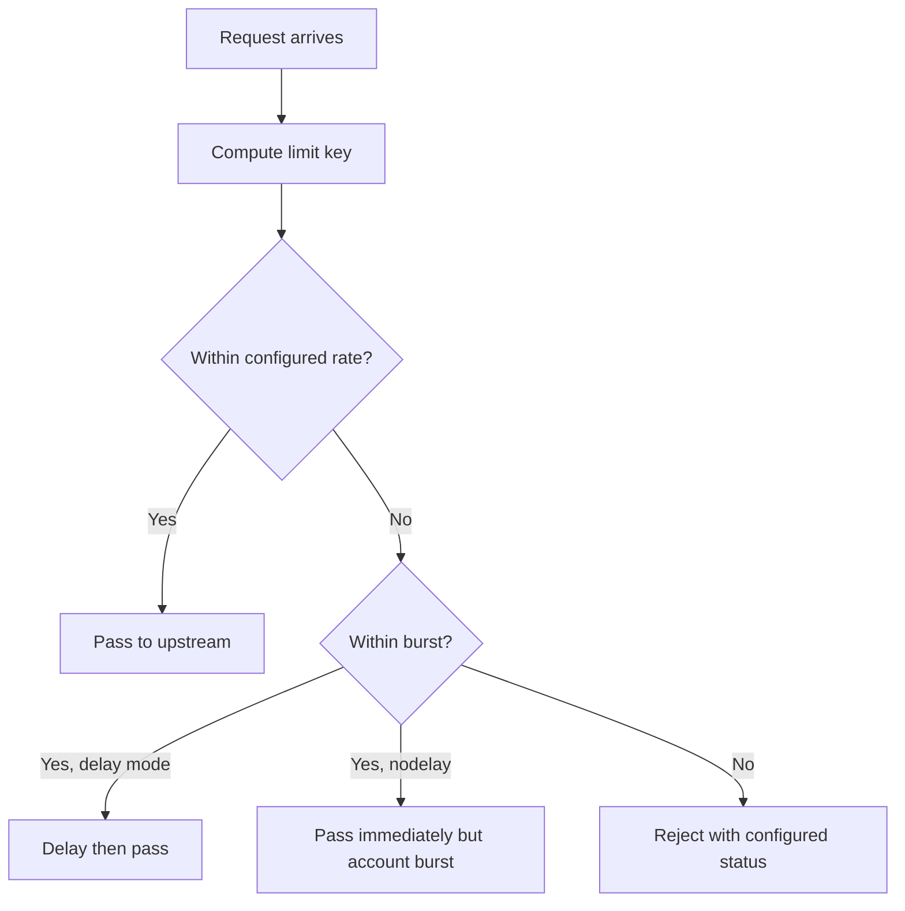

# Part 018 — Rate Limiting, Connection Limiting, Throttling, and Traffic Shaping

## 1. Tujuan Part Ini

Rate limiting sering dianggap sederhana:

```text
batasi request terlalu banyak
```

Dalam production enterprise system, masalahnya lebih kompleks.

Rate limiting harus menjawab:

```text
siapa yang dibatasi?
berdasarkan key apa?
berapa rate normal?
berapa burst yang wajar?
apa response saat dibatasi?
apakah retry client aman?
apakah limit berlaku per pod atau global?
apakah limit melindungi Java/JAX-RS service atau malah memblokir customer valid?
```

Part ini membahas rate limiting, connection limiting, throttling, dan traffic shaping di NGINX dari sudut pandang backend engineer yang harus menjaga API tetap stabil, adil, dan debuggable.

---

## 2. Mental Model: Rate, Concurrency, and Throughput

Tiga konsep sering tercampur:

| Konsep | Pertanyaan | NGINX control umum |
|---|---|---|
| Rate | Berapa request per waktu? | `limit_req` |
| Concurrency | Berapa koneksi aktif bersamaan? | `limit_conn` |
| Bandwidth/transfer | Seberapa cepat data dikirim? | `limit_rate` |

Contoh:

```text
100 request per second kecil-kecil
10 upload besar bersamaan
1 download besar sangat lambat
```

Tiga kasus itu memberi tekanan yang berbeda.

Rate limiting melindungi dari request spike.
Connection limiting melindungi dari terlalu banyak koneksi aktif.
Bandwidth throttling melindungi transfer resource yang terlalu agresif.

Untuk Java/JAX-RS backend, ketiganya berdampak pada:

```text
thread pool
connection pool
heap pressure
DB pool
Kafka producer/consumer pressure
external API calls
latency tail
```

---

## 3. Where Rate Limiting Can Live

Rate limit bisa diterapkan di banyak layer:

```text
CDN / cloud edge
cloud WAF
cloud load balancer / application gateway
API gateway
NGINX / ingress
service mesh
application middleware
Redis/distributed limiter
database/domain quota
```

NGINX cocok untuk:

```text
per-IP protection
coarse API protection
protect expensive route
basic partner route shaping
shield Java service from obvious spikes
```

NGINX kurang cocok untuk:

```text
global distributed quota across many ingress pods
complex per-user billing quota
tenant-aware quota with central consistency
business entitlement enforcement
adaptive risk scoring
```

Prinsip:

```text
Use NGINX for edge protection.
Use application/API gateway/distributed limiter for business-aware quota.
```

---

## 4. Token Bucket Mental Model

NGINX request rate limiting memakai mental model mirip token/leaky bucket.

Bayangkan satu bucket per key:

```text
key = client IP / tenant / header / route
rate = token masuk per detik
burst = kapasitas antrean sementara
```

Jika request datang sesuai rate:

```text
request accepted
```

Jika request datang melebihi rate tetapi masih dalam burst:

```text
request delayed atau accepted immediately tergantung nodelay
```

Jika request melewati burst:

```text
request rejected -> biasanya 503 default atau 429 jika dikonfigurasi
```

Diagram:



---

## 5. Basic `limit_req` Configuration

Pola dasar:

```nginx
http {
    limit_req_zone $binary_remote_addr zone=per_ip_api:10m rate=10r/s;

    server {
        location /api/ {
            limit_req zone=per_ip_api burst=20 nodelay;
            limit_req_status 429;

            proxy_pass http://jaxrs_upstream;
        }
    }
}
```

Komponen penting:

| Bagian | Fungsi |
|---|---|
| `limit_req_zone` | mendefinisikan key, shared memory zone, dan rate |
| `$binary_remote_addr` | key berbasis IP dalam bentuk efisien |
| `zone=per_ip_api:10m` | shared memory zone untuk state limiter |
| `rate=10r/s` | rate dasar |
| `limit_req` | mengaktifkan limiter pada context tertentu |
| `burst=20` | toleransi spike sementara |
| `nodelay` | burst tidak ditahan, langsung diteruskan sampai quota burst habis |
| `limit_req_status 429` | gunakan 429 agar semantik jelas |

Poin penting:

```text
limit_req_zone hanya mendefinisikan zone.
limit_req harus dipasang di server/location agar berlaku.
```

---

## 6. Choosing the Right Limit Key

Key adalah desain paling penting.

Contoh key:

```nginx
limit_req_zone $binary_remote_addr zone=per_ip:10m rate=10r/s;
limit_req_zone $http_x_tenant_id zone=per_tenant:10m rate=100r/s;
limit_req_zone $http_authorization zone=per_token:10m rate=20r/s;
```

Perbandingan:

| Key | Kelebihan | Risiko |
|---|---|---|
| IP | sederhana, edge-friendly | NAT/proxy membuat banyak user terlihat satu IP |
| Host | mudah untuk per-domain | tidak membedakan user |
| URI | cocok untuk route mahal | high cardinality jika URI dinamis |
| Header tenant | tenant-aware | header bisa spoofed jika belum trusted |
| Authorization token | user-ish | sensitif, high cardinality, jangan log raw token |
| JWT claim | butuh parsing tambahan | NGINX OSS tidak native claim-aware |

Rule penting:

```text
Do not use untrusted identity header as limiter key unless it is set by trusted auth layer.
```

Jika `X-Tenant-ID` berasal dari client publik, attacker bisa mengganti tenant ID untuk menghindari limit.

---

## 7. Per-IP Rate Limiting

Per-IP adalah pola paling umum.

```nginx
limit_req_zone $binary_remote_addr zone=ip_login:10m rate=5r/m;

server {
    location /api/v1/login {
        limit_req zone=ip_login burst=5 nodelay;
        limit_req_status 429;
        proxy_pass http://auth_upstream;
    }
}
```

Cocok untuk:

```text
login endpoint
password reset endpoint
public unauthenticated API
scanner/fuzzer protection
coarse abuse control
```

Risiko:

```text
banyak user berada di balik NAT corporate yang sama
partner integration memakai shared outbound proxy
mobile carrier NAT membuat IP sharing besar
attacker memakai botnet banyak IP
```

Karena itu per-IP limit harus dilihat sebagai coarse protection, bukan fairness sempurna.

---

## 8. Per-Route Limiting

Tidak semua route sama mahal.

Contoh:

```text
GET /api/v1/products        relatif murah
POST /api/v1/quotes/calc    mahal
POST /api/v1/orders/submit  kritikal
GET /api/v1/report/export   berat
```

Pola:

```nginx
limit_req_zone $binary_remote_addr zone=general_api:10m rate=50r/s;
limit_req_zone $binary_remote_addr zone=expensive_api:10m rate=2r/s;

server {
    location /api/ {
        limit_req zone=general_api burst=100 nodelay;
        limit_req_status 429;
        proxy_pass http://jaxrs_upstream;
    }

    location /api/v1/quotes/calculate {
        limit_req zone=expensive_api burst=5 nodelay;
        limit_req_status 429;
        proxy_pass http://jaxrs_upstream;
    }
}
```

Review question:

```text
Apakah expensive route punya limit lebih ketat?
Apakah critical route perlu protection atau malah lebih longgar?
Apakah background job/internal caller terkena limit yang sama?
```

---

## 9. Burst and `nodelay`

`burst` menentukan toleransi spike.

Tanpa `nodelay`, request burst bisa ditunda agar mengikuti rate.
Dengan `nodelay`, request burst diteruskan langsung sampai burst capacity habis.

Contoh:

```nginx
limit_req zone=per_ip_api burst=20;
```

Perilaku:

```text
request berlebih bisa ditunda
latency client naik
upstream lebih terlindungi
```

Dengan `nodelay`:

```nginx
limit_req zone=per_ip_api burst=20 nodelay;
```

Perilaku:

```text
spike kecil diterima cepat
latency lebih rendah
upstream menerima burst lebih tajam
```

Trade-off:

| Mode | Kelebihan | Risiko |
|---|---|---|
| delay | smoothing lebih kuat | latency tidak terlihat sebagai rejection |
| nodelay | UX lebih baik untuk burst kecil | backend tetap menerima spike |

Untuk API enterprise, `nodelay` sering lebih mudah dipahami client karena request diterima atau ditolak jelas, bukan diam-diam delay lama.

---

## 10. Return 429 Instead of Ambiguous 503

Secara default, beberapa limit rejection bisa tampak seperti 503 tergantung konfigurasi/module/version.

Untuk API, lebih baik eksplisit:

```nginx
limit_req_status 429;
limit_conn_status 429;
```

429 punya semantik jelas:

```text
Too Many Requests
```

Tambahkan `Retry-After` jika client bisa retry:

```nginx
location /api/ {
    limit_req zone=per_ip_api burst=20 nodelay;
    limit_req_status 429;
    add_header Retry-After "1" always;
    proxy_pass http://jaxrs_upstream;
}
```

Hati-hati:

```text
Retry-After harus masuk akal.
Jika semua client retry persis setelah 1 detik, bisa terjadi synchronized retry spike.
```

Lebih baik client memakai exponential backoff dengan jitter.

---

## 11. Connection Limiting with `limit_conn`

Connection limiting membatasi koneksi aktif per key.

Contoh:

```nginx
http {
    limit_conn_zone $binary_remote_addr zone=addr_conn:10m;

    server {
        location /api/ {
            limit_conn addr_conn 20;
            limit_conn_status 429;
            proxy_pass http://jaxrs_upstream;
        }
    }
}
```

Cocok untuk:

```text
slow client protection
large download protection
WebSocket/SSE guardrail
partner integration concurrency cap
upload endpoint protection
```

Namun hati-hati untuk HTTP/2:

```text
satu koneksi HTTP/2 bisa membawa banyak stream
connection count tidak selalu sama dengan request concurrency
```

Connection limiting harus dipahami bersama HTTP version dan load balancer behavior.

---

## 12. `limit_rate` and Transfer Throttling

`limit_rate` membatasi kecepatan transfer response.

Contoh:

```nginx
location /downloads/ {
    limit_rate 1m;
    proxy_pass http://jaxrs_upstream;
}
```

Cocok untuk:

```text
large binary download
export file
non-critical bulk transfer
protect bandwidth
```

Risiko:

```text
request time menjadi lebih lama
connection lebih lama tertahan
worker connection pressure naik
client timeout jika terlalu lambat
```

Throttling bandwidth bukan solusi utama untuk overload API JSON. Untuk API JSON, rate/concurrency limit lebih relevan.

---

## 13. Protecting Java/JAX-RS Thread Pools

Java/JAX-RS service biasanya punya beberapa resource terbatas:

```text
HTTP worker thread
DB connection pool
Kafka producer buffer
external API client pool
heap memory
CPU
```

Rate limit di NGINX harus didesain berdasarkan bottleneck aktual.

Contoh:

```text
Endpoint calculate quote memanggil pricing engine dan DB.
DB pool service = 50 connections.
App replicas = 5.
Max safe expensive concurrent work sekitar 150, bukan unlimited.
```

NGINX rate limit dapat mengurangi burst, tetapi tidak tahu kondisi DB pool.

Untuk protection yang lebih presisi:

```text
application semaphore per expensive use case
distributed quota per tenant
circuit breaker
bulkhead
queue/backpressure
```

NGINX adalah layer pertama, bukan satu-satunya control.

---

## 14. Per-Tenant and Per-User Limiting Challenge

Enterprise SaaS atau BSS/OSS system sering butuh limit berdasarkan:

```text
tenant
customer
partner
user
client application
subscription plan
contract entitlement
```

NGINX OSS tidak secara natural memahami domain identity.

Opsi desain:

| Opsi | Kapan cocok | Risiko |
|---|---|---|
| NGINX per-IP | public coarse protection | tidak tenant-aware |
| NGINX header-based key | identity sudah trusted dari gateway/auth | spoofing jika tidak trusted |
| API Gateway quota | product/API subscription model | layer tambahan |
| App-level quota | domain-aware | request sudah masuk app |
| Redis distributed limiter | multi-pod consistent quota | complexity, Redis dependency |
| Service mesh policy | service-to-service protection | tidak selalu north-south cocok |

Jika organisasi butuh per-tenant quota yang kuat, NGINX biasanya hanya menjadi coarse front-line protection.

---

## 15. Distributed Rate Limiting Limitation

Dalam Kubernetes, ingress controller biasanya punya beberapa pod.

Pertanyaan penting:

```text
Apakah rate limit state shared antar pod?
```

Jika tidak shared, limit efektif bisa menjadi:

```text
configured limit × jumlah ingress pod
```

Contoh:

```text
limit 100 r/s per IP
3 ingress controller pods
client tersebar ke 3 pods
limit efektif mendekati 300 r/s
```

Tergantung load balancing dan stickiness, hasil aktual bisa tidak stabil.

Untuk quota global yang kuat, pertimbangkan:

```text
API gateway dengan quota store
Redis/distributed limiter
NGINX Plus feature jika tersedia dan sesuai
custom auth/rate-limit service
```

Internal verification wajib dilakukan sebelum menyebut limit sebagai global.

---

## 16. Ingress Controller Rate Limit Annotations

Di ingress-nginx, rate limiting sering dikonfigurasi via annotation.

Contoh konseptual:

```yaml
metadata:
  annotations:
    nginx.ingress.kubernetes.io/limit-rps: "10"
    nginx.ingress.kubernetes.io/limit-burst-multiplier: "5"
```

Namun annotation spesifik bergantung controller dan versi.

Jangan menyamakan:

```text
community ingress-nginx
NGINX Inc Kubernetes Ingress Controller
NGINX Plus Ingress Controller
cloud-native ingress/gateway controller
```

Checklist:

```text
Controller mana yang dipakai?
Annotation apa yang didukung?
Apakah limit berlaku per ingress pod?
Apakah status rejection 429 atau 503?
Apakah metrics tersedia?
Apakah global ConfigMap bisa override?
```

---

## 17. Rate Limiting Authenticated vs Unauthenticated Traffic

Unauthenticated traffic:

```text
belum tahu user/tenant
per-IP atau per-route adalah pilihan umum
cocok untuk login/reset/search public
```

Authenticated traffic:

```text
bisa dibatasi per token/user/tenant jika identity trusted
lebih adil
lebih dekat ke business quota
```

Tetapi di NGINX, identity authenticated mungkin belum tersedia kecuali:

```text
API gateway sudah memvalidasi token dan menyet header trusted
NGINX auth_request memanggil auth service
NGINX Plus/JWT module digunakan
Lua/njs/custom module digunakan
```

Jika auth dilakukan di Java/JAX-RS app, NGINX tidak bisa rate limit berdasarkan user dengan aman tanpa membaca token.

---

## 18. Interaction with Retries

Rate limiting dan retry bisa menciptakan storm.

Skenario buruk:

```text
NGINX returns 429
client retries immediately
all clients retry together
NGINX rejects more
traffic spike makin besar
```

Retry policy client harus:

```text
respect 429
respect Retry-After jika ada
use exponential backoff
use jitter
avoid retrying non-idempotent requests blindly
```

Untuk Java/JAX-RS API, dokumentasikan retry safety:

| Method/use case | Retry safe? | Catatan |
|---|---:|---|
| GET quote detail | Biasanya ya | selama cache/state semantics jelas |
| POST calculate quote | Tergantung | bisa mahal, mungkin idempotency key diperlukan |
| POST submit order | Tidak tanpa idempotency key | risiko duplicate order |
| PUT update resource | Biasanya lebih aman | tetap perlu version/concurrency control |
| DELETE resource | Tergantung | idempotency domain-specific |

NGINX tidak tahu business idempotency. Jangan memakai retry/limit policy yang mengasumsikan semua POST aman.

---

## 19. Rate Limit Response Contract

Response 429 sebaiknya konsisten.

Contoh response API:

```json
{
  "error": "rate_limited",
  "message": "Too many requests. Please retry later.",
  "requestId": "abc-123"
}
```

Jika NGINX menghasilkan HTML default, client API bisa gagal parse.

Pola:

```nginx
limit_req_status 429;
error_page 429 = @rate_limited;

location @rate_limited {
    default_type application/json;
    add_header Retry-After "1" always;
    return 429 '{"error":"rate_limited","requestId":"$request_id"}';
}
```

Catatan:

```text
requestId harus selaras dengan log NGINX dan aplikasi.
Jika request tidak sampai aplikasi, requestId edge menjadi satu-satunya pegangan support.
```

---

## 20. Observability for Rate Limiting

Rate limiting tanpa observability akan terlihat seperti random API failure.

Metric/log penting:

```text
rate limit rejected count
connection limit rejected count
429 count by route/host/client/tenant if safe
request rate before/after limiting
upstream request reduction
latency impact from delay mode
top source IP / partner / client
false positive report
```

Access log perlu membedakan:

```text
status=429 from NGINX
upstream_status empty
request_time small
upstream_response_time empty
```

Contoh log format field:

```nginx
log_format main_json escape=json
'{'
  '"time":"$time_iso8601",'
  '"request_id":"$request_id",'
  '"remote_addr":"$remote_addr",'
  '"host":"$host",'
  '"method":"$request_method",'
  '"uri":"$request_uri",'
  '"status":$status,'
  '"request_time":$request_time,'
  '"upstream_status":"$upstream_status",'
  '"upstream_response_time":"$upstream_response_time"'
'}';
```

Jika `upstream_status` kosong pada 429, berarti rejection terjadi di NGINX sebelum aplikasi.

---

## 21. Avoiding False Positives

False positive adalah request valid yang dibatasi.

Penyebab umum:

```text
corporate NAT membuat ribuan user terlihat satu IP
partner batch job mengirim spike sesuai kontrak
mobile carrier NAT
health check ikut dihitung
CORS preflight ikut dibatasi terlalu ketat
retry client memperbesar traffic
multi-tab browser membuat burst
load test tidak diberi bypass terkontrol
```

Mitigasi:

```text
bedakan route public/authenticated/internal
buat allowlist untuk trusted partner jika sah
gunakan key yang lebih adil jika identity trusted
exclude health check dari limiter
observasi sebelum blocking
mulai dengan threshold longgar
review log top offenders sebelum tighten
```

Jangan membuat allowlist permanen tanpa owner dan alasan.

---

## 22. Dry Run and Gradual Enforcement

Idealnya rate limit diperkenalkan bertahap:

```text
observe current traffic
simulate/dry run jika fitur tersedia
alert only
apply to low-risk route
apply to high-risk route with conservative threshold
monitor false positive
adjust
```

Jika dry run tidak tersedia di platform, lakukan pendekatan alternatif:

```text
log-only di aplikasi/API gateway
shadow dashboard dari access log
temporary high threshold
canary ingress
limited host/tenant rollout
```

Prinsip:

```text
Do not introduce aggressive rate limiting blindly in production.
```

---

## 23. Rate Limiting and CORS Preflight

Browser API sering mengirim OPTIONS preflight.

Jika preflight ikut rate-limited terlalu ketat:

```text
browser request gagal sebelum actual request
client melihat CORS error, bukan 429 jelas
application log tidak menunjukkan request actual
```

Strategi:

```text
handle OPTIONS ringan di edge jika sesuai
bedakan limit untuk OPTIONS dan actual method
pastikan CORS response pada 429 tetap masuk akal jika browser client perlu membaca response
```

Namun jangan membuat OPTIONS selalu public jika API policy membutuhkan auth tertentu. Selaraskan dengan security model.

---

## 24. Rate Limiting and Long-Lived Connections

WebSocket, SSE, dan long polling butuh perhatian khusus.

Rate limiting request per second tidak cukup karena masalah utamanya sering concurrency/idle connection.

Untuk WebSocket/SSE:

```text
limit_conn lebih relevan
idle timeout penting
worker_connections capacity penting
load balancer timeout penting
```

Contoh:

```nginx
limit_conn_zone $binary_remote_addr zone=ws_conn:10m;

location /ws/ {
    limit_conn ws_conn 5;
    proxy_http_version 1.1;
    proxy_set_header Upgrade $http_upgrade;
    proxy_set_header Connection "upgrade";
    proxy_pass http://jaxrs_realtime;
}
```

Jangan menerapkan `limit_req` sangat ketat pada long polling tanpa memahami polling interval client.

---

## 25. Rate Limiting and File Upload/Download

Upload besar dan download besar memberi tekanan berbeda.

Upload besar:

```text
client body buffering
temporary disk
slow upload
request body timeout
upstream handoff timing
```

Download besar:

```text
long connection
bandwidth
send timeout
slow client
connection slot held
```

Controls:

```text
client_max_body_size
client_body_timeout
limit_conn
limit_rate
proxy_request_buffering
proxy_buffering
```

Rate limiting per request tidak selalu cukup untuk payload besar. Satu request bisa sangat mahal.

---

## 26. Protecting Expensive Domain Operations

Dalam quote/order domain, beberapa endpoint bisa mahal:

```text
quote calculation
pricing simulation
catalog eligibility check
order validation
bulk import/export
contract generation
report generation
```

NGINX bisa memberi guardrail awal:

```text
lebih ketat untuk expensive route
limit burst kecil
connection limit untuk export
body size limit untuk import
```

Tetapi domain-aware protection tetap perlu di aplikasi:

```text
idempotency key
tenant quota
async job queue
bulkhead
circuit breaker
per-operation concurrency semaphore
priority queue
```

Rate limiting di NGINX adalah traffic shaping, bukan domain workload scheduler.

---

## 27. AWS/Azure/On-Prem Considerations

### AWS/EKS

Rate limiting mungkin ada di:

```text
AWS WAF
CloudFront
ALB listener rule/WAF integration
API Gateway usage plan
NGINX Ingress
application service
```

Cek apakah source IP yang dipakai limiter adalah:

```text
client IP
CloudFront IP
ALB IP
NLB source IP preserved
proxy protocol result
```

### Azure/AKS

Rate limiting bisa muncul di:

```text
Azure Front Door WAF
Azure Application Gateway WAF
Azure API Management policy
NGINX Ingress
application service
```

Cek apakah NSG/Application Gateway mengubah source visibility.

### On-prem/hybrid

Perhatikan:

```text
corporate proxy membuat banyak client berbagi IP
partner traffic datang dari NAT gateway
L4/L7 appliance mungkin sudah punya rate policy
proxy chain membuat X-Forwarded-For panjang
```

Rate limit harus didesain berdasarkan observed traffic path, bukan asumsi topologi ideal.

---

## 28. Failure Modes

| Symptom | Kemungkinan penyebab |
|---|---|
| Banyak 429 | threshold terlalu rendah, traffic spike, abuse, retry storm |
| 503 saat limit | status limit belum diset ke 429 |
| Partner valid terblokir | NAT/shared IP, allowlist belum ada, contract burst tidak dipahami |
| App tetap overload | limiter key salah, limit per pod bukan global, burst terlalu tinggi |
| Limit tidak bekerja | `limit_req_zone` ada tapi `limit_req` tidak diterapkan |
| Semua user satu kantor gagal | per-IP limit terlalu ketat untuk corporate NAT |
| WebSocket gagal | limit_conn terlalu rendah, idle timeout salah |
| CORS error aneh | OPTIONS/preflight terkena limiter |
| Latency naik tanpa 429 | delay mode menahan request |
| Dashboard tidak jelas | 429 dari NGINX tidak dipisahkan dari app response |

---

## 29. Debugging Playbook

Pertanyaan pertama:

```text
Apakah rejection dari NGINX atau dari aplikasi?
```

Ciri rejection di NGINX:

```text
upstream_status kosong
upstream_response_time kosong
application log tidak ada
request_time kecil, kecuali delay mode
status 429/503 dari edge
```

Cek config final:

```bash
nginx -T | grep -n "limit_req\|limit_conn\|limit_req_zone\|limit_conn_zone"
```

Di Kubernetes:

```bash
kubectl describe ingress <name> -n <namespace>
kubectl get configmap -n <ingress-namespace>
kubectl logs deploy/<ingress-controller> -n <ingress-namespace>
```

Test sederhana:

```bash
for i in $(seq 1 50); do
  curl -s -o /dev/null -w "%{http_code}\n" https://api.example.com/api/v1/quotes &
done
wait
```

Cek response headers:

```bash
curl -v https://api.example.com/api/v1/quotes
```

Cari:

```text
HTTP/1.1 429
Retry-After
X-Request-ID
Content-Type application/json
```

---

## 30. PR Review Checklist

### Purpose

```text
Masalah apa yang ingin diselesaikan limiter ini?
Abuse, overload, fairness, partner quota, atau expensive endpoint protection?
```

### Scope

```text
Apakah limit global, per host, per route, per IP, per user, atau per tenant?
Apakah berlaku untuk public, partner, internal, atau admin route?
```

### Key

```text
Apakah key trusted?
Apakah key high-cardinality?
Apakah NAT/shared proxy dipertimbangkan?
Apakah source IP yang dipakai benar?
```

### Threshold

```text
Apakah threshold berdasarkan data traffic?
Apakah burst masuk akal?
Apakah ada peak hour/batch job/partner traffic?
```

### Behavior

```text
Apakah rejection memakai 429?
Apakah Retry-After sesuai?
Apakah response body sesuai API contract?
Apakah CORS/browser behavior dipertimbangkan?
```

### Distributed behavior

```text
Apakah limit per ingress pod atau global?
Apakah HPA ingress mengubah effective limit?
Apakah perlu distributed limiter?
```

### Observability

```text
Apakah 429 terlihat di dashboard?
Apakah bisa dibedakan dari app-generated 429?
Apakah top offender bisa dianalisis tanpa melanggar privacy?
```

### Safety

```text
Apakah ada dry run/canary?
Apakah ada rollback?
Apakah ada exception process?
Apakah support/runbook tahu cara mendiagnosis false positive?
```

---

## 31. Internal Verification Checklist

Cek hal berikut di internal CSG/team:

```text
Apakah rate limiting dilakukan di NGINX, API gateway, cloud WAF, app, atau kombinasi.
Controller Ingress apa yang digunakan dan annotation limit apa yang valid.
Apakah limit state shared antar ingress controller pod.
Apakah NGINX Plus feature digunakan atau hanya OSS/community controller.
Apakah status rejection default 429 atau 503.
Apakah Retry-After distandardisasi.
Apakah partner/customer contract punya burst/rate requirement.
Apakah ada route expensive seperti quote calculation/export/import.
Apakah auth identity tersedia di edge atau baru di aplikasi.
Apakah X-Tenant-ID/X-User-ID trusted atau berasal dari client.
Apakah source IP preservation sudah benar.
Apakah corporate NAT/partner proxy dipertimbangkan.
Apakah health check, monitoring, dan internal job terkena limit.
Apakah ada dashboard 429/limit rejection.
Apakah ada runbook false positive dan emergency bypass.
Apakah limit change butuh approval platform/security/SRE.
```

---

## 32. Anti-Patterns

```text
Memakai per-IP limit untuk semua customer tanpa mempertimbangkan NAT.
Menganggap NGINX rate limit sebagai tenant quota yang kuat.
Menggunakan X-Tenant-ID dari client publik sebagai trusted key.
Membuat limit agresif tanpa data traffic.
Tidak mengubah rejection status menjadi 429.
Tidak menyediakan response JSON untuk API client.
Tidak mengamati 429 di dashboard.
Menerapkan limit_req ke WebSocket/SSE tanpa memahami long-lived connection.
Menaikkan burst sangat tinggi sampai limiter tidak melindungi apa pun.
Mengaktifkan limit di banyak layer tanpa koordinasi.
Mengabaikan retry storm setelah 429.
Tidak punya emergency bypass untuk partner critical integration.
```

---

## 33. Practical Senior Engineer Heuristics

Gunakan heuristik berikut:

```text
Rate limit is a product and reliability policy, not only an NGINX directive.
Start with observed traffic, not arbitrary numbers.
Per-IP is protection, not fairness.
Per-tenant quota requires trusted identity and usually distributed state.
429 is better than ambiguous 503 for client behavior.
Retry-After without client backoff discipline can amplify spikes.
Burst protects UX but can still hurt upstream.
Delay mode hides overload as latency.
Every limiter must have dashboard, owner, and rollback.
False positives are production incidents.
```

---

## 34. Ringkasan

Rate limiting di NGINX adalah alat penting untuk melindungi backend Java/JAX-RS dari traffic spike, abuse, slow clients, dan expensive route overload.

Namun rate limiting yang buruk bisa menyebabkan:

```text
customer valid terblokir
partner integration gagal
latency naik diam-diam
retry storm
false sense of global quota
incident yang tidak terlihat di application logs
```

Target pemahaman senior engineer:

```text
membedakan rate, concurrency, dan bandwidth
memilih key yang benar
memahami burst/nodelay
mengembalikan 429 yang konsisten
melihat keterbatasan distributed limiter di Kubernetes
menghubungkan limiter dengan Java/JAX-RS resource bottleneck
mereview limiter sebagai reliability/security/product contract
```

NGINX rate limiting yang baik tidak hanya membatasi traffic. Ia membuat sistem lebih stabil, lebih adil, dan lebih mudah dioperasikan saat traffic nyata tidak berjalan sesuai asumsi desain.
