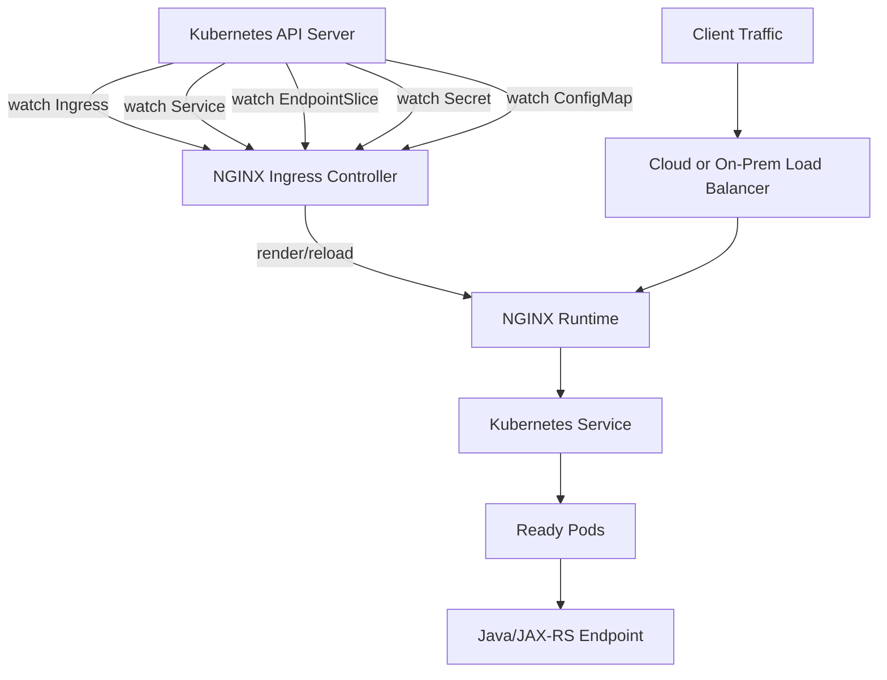

# Part 023 — NGINX in Kubernetes Fundamentals

## 1. Tujuan Part Ini

Part ini membangun mental model dasar NGINX ketika berjalan di Kubernetes.

Fokusnya bukan sekadar membuat resource `Ingress`, tetapi memahami hubungan antar komponen berikut:

```text
external client
  -> DNS
  -> cloud/on-prem load balancer
  -> NGINX Ingress Controller Service
  -> NGINX Ingress Controller Pod
  -> generated NGINX configuration
  -> Kubernetes Service
  -> EndpointSlice
  -> Pod
  -> Java/JAX-RS endpoint
```

Dalam production system, banyak engineer salah memahami Ingress sebagai “routing rule saja”. Padahal Ingress hanyalah deklarasi intent. Yang benar-benar menerima traffic adalah **Ingress Controller**.

Untuk konteks enterprise Java/JAX-RS system, perbedaan ini penting karena banyak failure muncul bukan di aplikasi Java, tetapi di layer:

```text
Ingress resource
IngressClass
Ingress Controller
Service
EndpointSlice
Pod readiness
TLS Secret
ConfigMap
annotation
load balancer integration
network policy
```

Part ini menjadi fondasi sebelum masuk ke routing deep dive, annotation strategy, AWS/EKS, Azure/AKS, on-prem, DNS, GitOps, dan debugging playbook.

---

## 2. Core Mental Model: Ingress Is Declarative, Controller Is Operational

Kubernetes `Ingress` adalah resource API.

Ia mendeskripsikan aturan seperti:

```text
host example.company.com
path /api/orders
backend service quote-order-api:8080
TLS secret example-company-tls
```

Tetapi Ingress tidak bekerja sendiri.

Agar traffic benar-benar dirutekan, cluster membutuhkan **Ingress Controller**.

Ingress Controller bertugas:

```text
watch Ingress resources
watch Service resources
watch EndpointSlice/Endpoints
watch Secret resources
watch ConfigMap resources
translate desired state into NGINX runtime config
reload/update NGINX safely
serve traffic
emit logs/metrics/events
```

Jadi modelnya:

```text
Ingress = desired routing state
Ingress Controller = runtime implementation
NGINX = data plane that handles actual request
```

Konsekuensi production-nya:

| Salah Paham | Model yang Benar |
|---|---|
| Ingress adalah load balancer | Ingress adalah rule; controller/load balancer yang menerima traffic |
| Membuat Ingress cukup untuk expose service | Harus ada controller yang sesuai `IngressClass` |
| Semua controller membaca semua Ingress | Controller biasanya filter berdasarkan class |
| Annotation bersifat universal | Annotation tergantung implementation controller |
| Path matching selalu sama | Path behavior bisa berbeda antar controller |
| TLS Secret cukup dibuat | Controller harus bisa membaca Secret dan mengikatnya ke host |
| Service ready berarti traffic pasti jalan | Pod readiness, EndpointSlice, network, dan controller config juga menentukan |

---

## 3. Kubernetes Networking Building Blocks

Sebelum membahas NGINX Ingress, pahami komponen Kubernetes dasar.

### 3.1 Pod

Pod adalah unit runtime tempat container berjalan.

Untuk Java/JAX-RS service:

```text
Pod
  -> container JVM
  -> listens on port 8080/8443
  -> exposes /health, /ready, /api/*
```

Pod IP bersifat ephemeral. Jangan treat Pod IP sebagai alamat stabil untuk routing jangka panjang.

Failure mode:

```text
pod recreated
pod IP changes
readiness false
container port mismatch
network policy blocks traffic
application listens on localhost only
```

Internal verification checklist:

```text
kubectl get pod -n <namespace> -o wide
kubectl describe pod <pod> -n <namespace>
kubectl logs <pod> -n <namespace>
containerPort matches service targetPort
readinessProbe matches actual Java endpoint
```

---

### 3.2 Service

Kubernetes `Service` memberikan alamat stabil untuk satu set Pod.

Ingress biasanya tidak langsung mengarah ke Pod. Ingress mengarah ke Service.

```yaml
apiVersion: v1
kind: Service
metadata:
  name: quote-order-api
spec:
  selector:
    app: quote-order-api
  ports:
    - name: http
      port: 80
      targetPort: 8080
```

Modelnya:

```text
Ingress backend servicePort 80
  -> Service port 80
  -> targetPort 8080
  -> Pod container port 8080
```

Failure yang sering terjadi:

```text
Ingress points to wrong Service name
Ingress uses wrong Service port
Service selector does not match Pods
Service targetPort wrong
Pods not ready, so EndpointSlice empty
application listens on different port
```

Debug command:

```bash
kubectl get svc quote-order-api -n quote
kubectl describe svc quote-order-api -n quote
kubectl get endpointslice -n quote -l kubernetes.io/service-name=quote-order-api
kubectl get endpoints quote-order-api -n quote
```

---

### 3.3 EndpointSlice

EndpointSlice adalah representasi backend endpoint aktual di balik Service.

Service bisa ada, tetapi kalau EndpointSlice kosong, NGINX tidak punya target sehat.

```text
Service exists
but no ready endpoints
=> Ingress may return 503
```

Untuk Java/JAX-RS backend, penyebab umum EndpointSlice kosong:

```text
label selector mismatch
readiness probe failing
container crash loop
port name mismatch
namespace mismatch
rollout not complete
```

Checklist:

```bash
kubectl get endpointslice -n <namespace>
kubectl describe endpointslice <name> -n <namespace>
kubectl get pod -n <namespace> --show-labels
kubectl describe deploy <deployment> -n <namespace>
```

---

## 4. Service Types: ClusterIP, NodePort, LoadBalancer

NGINX Ingress Controller sendiri biasanya diexpose melalui Service.

### 4.1 ClusterIP

`ClusterIP` hanya bisa diakses dari dalam cluster.

Cocok untuk backend Java/JAX-RS service.

```yaml
spec:
  type: ClusterIP
```

Model:

```text
NGINX Ingress Controller Pod
  -> ClusterIP Service
  -> Java/JAX-RS Pods
```

Untuk backend application service, `ClusterIP` biasanya default dan paling aman.

---

### 4.2 NodePort

`NodePort` membuka port pada setiap node.

Model:

```text
external load balancer
  -> nodeIP:nodePort
  -> ingress controller Service
  -> ingress controller Pod
```

Digunakan pada beberapa on-prem atau cloud integration pattern.

Risiko:

```text
node exposure lebih luas
firewall rule harus presisi
source IP preservation bisa tricky
port range operational overhead
```

---

### 4.3 LoadBalancer

`LoadBalancer` meminta cloud provider membuat external/internal load balancer.

Model umum di cloud:

```text
DNS
  -> AWS NLB / Azure Load Balancer / cloud LB
  -> Service type LoadBalancer
  -> NGINX Ingress Controller Pods
```

Bukan semua load balancer sama:

| Load Balancer | Layer | Typical Role |
|---|---:|---|
| AWS NLB | L4 | TCP/TLS pass-through to ingress |
| AWS ALB | L7 | HTTP routing, sometimes instead of NGINX Ingress |
| Azure Load Balancer | L4 | TCP forwarding |
| Azure Application Gateway | L7 | HTTP/TLS edge, may replace or sit before ingress |
| On-prem F5/AVI/HAProxy | L4/L7 | Enterprise edge/routing layer |

Internal verification checklist:

```text
Is ingress controller exposed using LoadBalancer, NodePort, or hostNetwork?
Is the cloud load balancer public or internal?
Is TLS terminated at cloud LB, NGINX, or both?
Is source IP preserved?
Is proxy protocol enabled?
```

---

## 5. What Kubernetes Ingress Actually Represents

Ingress defines HTTP/S routing rules.

Simplified example:

```yaml
apiVersion: networking.k8s.io/v1
kind: Ingress
metadata:
  name: quote-order-api
  namespace: quote
spec:
  ingressClassName: nginx
  tls:
    - hosts:
        - quote.example.company.com
      secretName: quote-example-company-tls
  rules:
    - host: quote.example.company.com
      http:
        paths:
          - path: /api/quotes
            pathType: Prefix
            backend:
              service:
                name: quote-order-api
                port:
                  number: 80
```

This means:

```text
For HTTPS request with Host quote.example.company.com
and path beginning with /api/quotes
route to Service quote-order-api port 80
using TLS material from Secret quote-example-company-tls
handled by controller for IngressClass nginx
```

It does **not** mean:

```text
Kubernetes itself becomes a reverse proxy
Ingress independently opens public endpoint
all controllers will automatically use this rule
path behavior is identical across controllers
```

---

## 6. IngressClass

`IngressClass` tells Kubernetes and controllers which controller should implement an Ingress.

Example:

```yaml
apiVersion: networking.k8s.io/v1
kind: IngressClass
metadata:
  name: nginx
spec:
  controller: k8s.io/ingress-nginx
```

An Ingress can reference it:

```yaml
spec:
  ingressClassName: nginx
```

Why this matters:

```text
one cluster can have multiple ingress controllers
public and internal ingress can be separate
NGINX and cloud-native ingress can coexist
migration between controllers becomes possible
wrong class can make ingress ignored
```

Common patterns:

| Pattern | Meaning |
|---|---|
| `nginx-public` | Public internet-facing NGINX ingress |
| `nginx-internal` | Internal/private NGINX ingress |
| `alb` | AWS ALB controller handles Ingress |
| `agic` | Azure Application Gateway Ingress Controller |
| `nginx-plus` | F5 NGINX/NGINX Plus controller |

Failure mode:

```text
Ingress exists but no ADDRESS assigned
controller ignores resource
wrong load balancer receives traffic
internal route accidentally exposed publicly
```

Debug:

```bash
kubectl get ingressclass
kubectl describe ingressclass nginx
kubectl get ingress -A -o wide
kubectl describe ingress <name> -n <namespace>
```

Internal verification checklist:

```text
What IngressClass names exist?
Which one is default?
Which class is public vs internal?
Are application teams allowed to choose class freely?
Is class enforced by policy?
```

---

## 7. NGINX Ingress Controller: Control Plane and Data Plane

NGINX Ingress Controller has two roles:

```text
control plane: watches Kubernetes API and generates config
 data plane: NGINX process handles traffic
```

Mermaid model:



This means an Ingress Controller failure can appear as:

```text
routing stale
new Ingress not applied
TLS Secret update not reflected
Service endpoint change not picked up
config reload failed
controller pod restarted
admission webhook blocks bad config
```

---

## 8. ingress-nginx vs F5 NGINX Ingress Controller

Do not assume every NGINX-based controller behaves the same.

Two commonly encountered ecosystems:

| Area | Kubernetes community ingress-nginx | F5 NGINX Ingress Controller |
|---|---|---|
| Project origin | Kubernetes community | F5/NGINX |
| Data plane | NGINX OSS-based | NGINX OSS or NGINX Plus depending edition |
| Config model | Ingress + annotations + ConfigMap | Ingress + annotations + ConfigMap + NGINX-specific CRDs/features |
| Annotation prefix | Usually `nginx.ingress.kubernetes.io/*` | Usually `nginx.org/*` or related F5 NGINX annotations |
| Enterprise support | Community support | Commercial support available depending license |
| Feature parity | Not identical | Not identical |

Important principle:

```text
Annotation names, defaults, generated config, health behavior, canary behavior, snippets, and NGINX Plus features can differ.
```

Internal verification checklist:

```text
Which ingress controller implementation is installed?
What image repository and tag are used?
What Helm chart is used?
Is it community ingress-nginx or F5 NGINX Ingress Controller?
Is NGINX Plus enabled?
Which annotation prefix is valid?
What controller version is deployed in each environment?
```

---

## 9. Controller Pod Anatomy

A controller pod usually contains:

```text
controller process
NGINX master process
NGINX worker processes
mounted service account token
mounted ConfigMap/Secret data or generated config
logs to stdout/stderr
metrics endpoint
health endpoint
```

Typical things to inspect:

```bash
kubectl get pod -n ingress-nginx
kubectl describe pod <controller-pod> -n ingress-nginx
kubectl logs <controller-pod> -n ingress-nginx
kubectl exec -n ingress-nginx <controller-pod> -- nginx -T
```

`nginx -T` is especially useful because it shows the effective generated configuration. Use it carefully in restricted environments because it may expose sensitive routing details.

Failure modes:

```text
controller cannot watch API due to RBAC issue
controller cannot read TLS Secret across namespace
controller cannot render config due to invalid annotation
NGINX reload fails
controller pod OOMKilled
controller pod CPU throttled
controller has stale generated config
```

---

## 10. Admission Webhook

Many ingress controller installations include an admission webhook.

Its job:

```text
validate Ingress resources before Kubernetes accepts them
reject invalid annotations or dangerous config
prevent broken generated NGINX config
```

This is good for safety, but it can surprise application teams.

Symptoms:

```text
kubectl apply fails
GitOps sync fails
Argo CD shows admission webhook denial
Helm upgrade fails
Ingress not created
```

Example failure pattern:

```text
Error from server: admission webhook "validate.nginx.ingress.kubernetes.io" denied the request
```

Operational meaning:

```text
The failure happened before runtime traffic path.
The controller is refusing a configuration shape.
Do not debug Java service first.
Debug Ingress manifest/annotation/class first.
```

Internal verification checklist:

```text
Is validating webhook enabled?
Which annotations are denied?
Are snippets allowed?
Does CI run the same validation before merge?
Are webhook failures visible in GitOps dashboard?
```

---

## 11. ConfigMap: Global Controller Behavior

Ingress controller ConfigMap usually defines global behavior.

Examples:

```text
proxy timeout defaults
body size defaults
log format
real IP behavior
TLS defaults
server tokens
proxy buffers
gzip
allow/deny snippet usage
```

Mental model:

```text
ConfigMap = platform-level defaults
Annotation = per-Ingress override
Helm values = deployment-time controller configuration
```

A risky pattern:

```text
global ConfigMap says timeout 30s
one team adds annotation timeout 600s
another layer has cloud LB idle timeout 60s
result: confusing 504/499 behavior
```

Internal verification checklist:

```bash
kubectl get configmap -n <ingress-namespace>
kubectl describe configmap <controller-configmap> -n <ingress-namespace>
helm get values <release> -n <ingress-namespace>
```

Questions to ask:

```text
Which ConfigMap controls global NGINX behavior?
Who owns it?
Are changes reviewed by platform/SRE?
Which settings may application teams override?
Are defaults different across dev/staging/prod?
```

---

## 12. Annotation: Per-Ingress Behavior

Annotations customize behavior for one Ingress.

Common categories:

```text
rewrite behavior
timeout behavior
body size behavior
rate limiting
CORS
auth
TLS redirect
backend protocol
proxy buffering
canary
whitelist/allowlist
custom snippets
```

Example:

```yaml
metadata:
  annotations:
    nginx.ingress.kubernetes.io/proxy-read-timeout: "60"
    nginx.ingress.kubernetes.io/proxy-body-size: "10m"
```

Production warning:

```text
Annotations are not portable across controllers.
Annotation semantics can change across controller versions.
Some annotations can bypass platform defaults.
Snippet annotations can become code execution at proxy configuration layer.
```

For senior engineers, annotations must be treated like production code, not metadata decoration.

Internal verification checklist:

```text
List all annotations on the Ingress.
Confirm the annotation prefix matches the installed controller.
Confirm the annotation is supported in the deployed version.
Confirm whether it overrides platform defaults.
Confirm whether it changes security, timeout, buffering, or auth behavior.
Confirm whether it needs platform approval.
```

---

## 13. TLS Secret

Ingress TLS usually references a Kubernetes Secret:

```yaml
spec:
  tls:
    - hosts:
        - quote.example.company.com
      secretName: quote-example-company-tls
```

The Secret typically contains:

```text
tls.crt
tls.key
```

Mental model:

```text
Ingress declares host -> TLS Secret binding
Controller reads Secret
NGINX serves certificate for matching SNI/Host
```

Failure modes:

```text
Secret missing
Secret in wrong namespace
certificate expired
private key mismatch
certificate SAN does not include host
intermediate certificate missing
controller lacks permission to read Secret
TLS terminated before NGINX so Secret unused
```

Debug:

```bash
kubectl get secret quote-example-company-tls -n quote
kubectl describe ingress quote-order-api -n quote
openssl s_client -connect quote.example.company.com:443 -servername quote.example.company.com
```

Internal verification checklist:

```text
Is TLS terminated at NGINX or upstream cloud LB?
Is cert-manager used?
Is certificate source ACM, Azure Key Vault, internal CA, or Kubernetes Secret?
Is certificate rotation automated?
Is expiry alert configured?
```

---

## 14. Backend Service and Port Resolution

Ingress backend points to a Service, not directly to a Deployment.

Example:

```yaml
backend:
  service:
    name: quote-order-api
    port:
      number: 80
```

The Service maps to Pod targetPort:

```yaml
ports:
  - name: http
    port: 80
    targetPort: 8080
```

The Java/JAX-RS container listens on `8080`.

Common bug:

```text
Ingress backend port: 8080
Service port: 80
targetPort: 8080
```

If Ingress references Service port `8080` but the Service only exposes port `80`, routing fails.

Checklist:

```bash
kubectl describe ingress <ingress> -n <namespace>
kubectl describe svc <service> -n <namespace>
kubectl get endpointslice -n <namespace> -l kubernetes.io/service-name=<service>
```

---

## 15. Default Backend

A default backend handles requests that do not match any Ingress rule.

Symptoms of default backend:

```text
404 from ingress controller
unexpected default page
request reaches NGINX but no host/path match
wrong Host header
missing Ingress rule
IngressClass mismatch
```

Do not confuse:

| Symptom | Likely Layer |
|---|---|
| NGINX default backend 404 | Ingress routing mismatch |
| Java application 404 | Backend route/resource not found |
| Cloud LB 404 | Cloud L7 load balancer rule mismatch |
| 503 no endpoints | Service/Pod readiness issue |

Debug steps:

```bash
curl -vk https://host.example.com/path
curl -vk -H 'Host: host.example.com' https://lb-address/path
kubectl describe ingress -A | grep -A20 host.example.com
kubectl logs -n <ingress-ns> <controller-pod>
```

---

## 16. Health Endpoint and Readiness

There are multiple health concepts:

```text
cloud LB health check against ingress controller
Kubernetes readiness probe for ingress controller pod
Kubernetes readiness probe for Java backend pod
NGINX passive upstream failure behavior
application-level /health or /ready endpoint
```

Do not collapse them into one thing.

Example traffic health path:

```text
AWS NLB health checks ingress controller node/pod
Kubernetes checks ingress controller readiness
NGINX proxies to Service
Service only includes ready Java pods
Java readiness depends on DB/Kafka/config/cache
```

A backend may be alive but not ready.

A Pod may be ready but unable to serve a specific tenant because downstream dependency fails.

Internal verification checklist:

```text
What does cloud LB health check?
What does ingress controller readiness check?
What does Java service readiness check?
Are readiness probes too shallow or too deep?
Are dependency failures reflected in readiness or only in request errors?
```

---

## 17. Deployment Model: Deployment vs DaemonSet

NGINX Ingress Controller can be deployed as Deployment or DaemonSet.

### Deployment

Typical cloud pattern:

```text
cloud load balancer
  -> ingress controller Service
  -> selected controller pods
```

Advantages:

```text
easier HPA
fewer pods
standard rolling update
```

Considerations:

```text
pod placement matters
anti-affinity matters
PDB matters
node failure can reduce ingress capacity
```

### DaemonSet

Common in some on-prem or bare-metal patterns.

```text
one ingress pod per node
external LB sends traffic to nodes
```

Advantages:

```text
predictable node-level presence
useful with hostNetwork/hostPort patterns
```

Considerations:

```text
more pods
node exposure
rollout across many nodes
resource usage per node
```

Internal verification checklist:

```text
Is controller deployed as Deployment or DaemonSet?
How many replicas?
Is anti-affinity configured?
Is PDB configured?
Does HPA exist?
What happens during node drain?
```

---

## 18. Horizontal Scaling and Capacity

Ingress controller capacity depends on:

```text
number of replicas
CPU limit/request
memory limit/request
worker_processes
worker_connections
TLS workload
logging volume
buffering/temp file usage
connection count
long-lived WebSocket/SSE connections
cloud LB distribution
```

Scaling replicas helps only if traffic is distributed correctly.

Potential bottlenecks:

```text
single NGINX pod overloaded
cloud LB uneven distribution
node-level connection tracking pressure
CPU throttling
log output bottleneck
Prometheus scraping overhead
TLS handshake spike
long-lived connection exhaustion
```

Internal verification checklist:

```text
Ingress controller HPA metric: CPU, memory, custom metric, or none?
Replica count per environment?
PDB minimum available?
Resource requests/limits?
Worker connection setting?
Dashboard for active connections and 5xx?
```

---

## 19. Java/JAX-RS Backend Impact

NGINX Ingress can affect Java/JAX-RS service behavior in subtle ways.

### 19.1 Scheme Detection

If NGINX terminates TLS and sends HTTP to backend, Java sees HTTP unless forwarded headers are trusted.

Required headers often include:

```text
X-Forwarded-Proto: https
X-Forwarded-Host: quote.example.company.com
X-Forwarded-Port: 443
Forwarded: proto=https;host=quote.example.company.com
```

Impact:

```text
wrong redirect URL
wrong absolute link generation
wrong OpenAPI server URL
wrong callback URL
wrong cookie Secure behavior
```

---

### 19.2 Base Path and Context Path

Public path may differ from internal path.

```text
public: /quote-order/api/v1/quotes
backend: /api/v1/quotes
```

If rewrite is wrong:

```text
NGINX 404
Java 404
wrong JAX-RS resource matched
redirect loses prefix
OpenAPI docs incorrect
```

---

### 19.3 Real Client IP

Backend may need real client IP for:

```text
audit
fraud detection
rate limiting
tenant policy
security investigation
```

But trusting `X-Forwarded-For` blindly is dangerous.

Internal verification checklist:

```text
Does Java framework trust forwarded headers?
Which proxy IP ranges are trusted?
Is external client allowed to inject X-Forwarded-*?
Does NGINX overwrite or append these headers?
Is client IP logged consistently in NGINX and Java logs?
```

---

## 20. AWS, Azure, On-Prem, and Hybrid Impact

Same Kubernetes Ingress resource can behave differently depending on platform edge.

### AWS/EKS

Common patterns:

```text
Route 53 -> NLB -> NGINX Ingress Controller -> Service -> Pod
Route 53 -> ALB -> NGINX Ingress Controller -> Service -> Pod
Route 53 -> ALB directly to Service/Pod via AWS LB Controller
```

Verify:

```text
NLB vs ALB
proxy protocol
source IP preservation
security group
target type instance vs IP
ACM vs Kubernetes Secret
```

### Azure/AKS

Common patterns:

```text
Azure DNS -> Azure Load Balancer -> NGINX Ingress -> Service -> Pod
Azure Front Door -> Application Gateway -> NGINX Ingress -> Service -> Pod
Azure Application Gateway Ingress Controller instead of NGINX
```

Verify:

```text
Front Door/Application Gateway position
TLS termination point
NSG rules
Private Link/Private Endpoint
certificate store
source IP headers
```

### On-Prem/Hybrid

Common patterns:

```text
enterprise DNS -> firewall -> L4/L7 load balancer -> NGINX Ingress -> Service -> Pod
enterprise DNS -> corporate reverse proxy -> Kubernetes ingress -> Java service
```

Verify:

```text
DMZ boundary
internal CA
proxy chaining
firewall allowlist
split-horizon DNS
hybrid connectivity
```

---

## 21. Common Failure Modes

| Symptom | Likely Root Cause | First Check |
|---|---|---|
| Ingress has no address | Controller/class/LB issue | `kubectl get ingress -o wide` |
| 404 from ingress | Host/path mismatch | Ingress rules and Host header |
| 503 from ingress | No ready endpoints | Service/EndpointSlice/Pod readiness |
| 502 | Upstream connection/protocol issue | Service port, backend protocol, pod logs |
| 504 | Timeout chain | ingress timeout, backend latency, LB timeout |
| TLS wrong cert | SNI/default cert mismatch | TLS Secret, host, certificate SAN |
| Request reaches wrong service | overlapping rules/conflict | all Ingresses for same host |
| Java sees HTTP not HTTPS | forwarded headers missing | proxy headers and app config |
| client IP wrong | source IP/proxy protocol config | real IP settings and LB mode |
| GitOps sync fails | admission webhook denial | Ingress validation error |

---

## 22. Debugging Flow

Start broad, then narrow.

```text
1. Does DNS resolve to expected load balancer?
2. Does load balancer route to ingress controller?
3. Is the Ingress assigned to the correct IngressClass?
4. Does host/path match the Ingress rule?
5. Does the backend Service exist?
6. Does the Service have ready endpoints?
7. Does the backend protocol/port match?
8. Does Java/JAX-RS service receive the request?
9. Do NGINX and application logs share a correlation ID?
```

Useful commands:

```bash
kubectl get ingress -A -o wide
kubectl describe ingress <name> -n <namespace>
kubectl get ingressclass
kubectl get svc -A
kubectl describe svc <service> -n <namespace>
kubectl get endpointslice -n <namespace>
kubectl get pod -n <namespace> -o wide
kubectl logs -n <ingress-ns> <controller-pod>
kubectl exec -n <ingress-ns> <controller-pod> -- nginx -T
curl -vk https://host/path
curl -vk -H 'Host: host.example.com' https://lb-address/path
```

---

## 23. Observability Concerns

Ingress visibility should answer:

```text
Which host was requested?
Which path was requested?
Which ingress/service/upstream handled it?
What was the response status?
Was it NGINX-generated or backend-generated?
How long did the total request take?
How long did upstream take?
Which upstream address was used?
Was the request terminated by client, proxy, or backend?
```

Minimum useful log fields:

```text
request_id
traceparent
remote_addr
real_client_ip
host
request_method
request_uri
status
request_time
upstream_response_time
upstream_status
upstream_addr
bytes_sent
request_length
user_agent
```

Without upstream timing, many 502/503/504 investigations become guesswork.

---

## 24. Security Concerns

Ingress is a security boundary.

Review these areas:

```text
public vs internal class
TLS termination point
default backend exposure
admin path exposure
snippet annotation allowance
CORS annotation usage
auth annotation usage
source IP trust
X-Forwarded-* trust
body size limits
rate limits
WAF integration
log redaction
namespace isolation
```

Key principle:

```text
Application teams should not be able to bypass platform security defaults through arbitrary annotations without review.
```

---

## 25. Performance Concerns

Ingress performance is shaped by:

```text
controller replica count
CPU/memory limits
worker_connections
TLS handshake rate
upstream keepalive
body buffering
response buffering
large uploads/downloads
WebSocket/SSE long-lived connections
log volume
cloud LB behavior
```

For Java/JAX-RS systems, ingress tuning should be aligned with application capacity:

```text
NGINX can accept more connections than Java can process.
NGINX can hide backend slowness until queues build up.
NGINX buffering can protect backend or increase latency/disk use.
Timeouts can fail requests before Java completes work.
```

---

## 26. PR Review Checklist

When reviewing Kubernetes Ingress changes, check:

```text
IngressClass is correct.
Host is correct.
Path and pathType are intentional.
Backend Service name and port are correct.
TLS Secret is correct and in same namespace.
Annotations are supported by installed controller.
Annotations do not bypass platform defaults unexpectedly.
Timeout/body size/rewrite behavior is reviewed.
Auth/CORS/rate limit behavior is reviewed.
Public/internal exposure is correct.
Service has ready endpoints.
Java/JAX-RS base path and forwarded headers are compatible.
Observability fields remain available.
Rollback plan exists.
```

---

## 27. Internal Verification Checklist

Use this checklist in your CSG/team environment without assuming internal architecture.

```text
Identify ingress controller implementation:
  - community ingress-nginx?
  - F5 NGINX Ingress Controller?
  - NGINX Plus?
  - cloud-native controller instead?

Identify exposure path:
  - public load balancer?
  - internal load balancer?
  - on-prem L4/L7 appliance?
  - API gateway before ingress?

Identify controller ownership:
  - application team?
  - platform team?
  - SRE/DevOps?
  - network/security team?

Inspect Kubernetes resources:
  - IngressClass
  - Ingress
  - Service
  - EndpointSlice
  - Secret
  - ConfigMap
  - Deployment/DaemonSet
  - HPA
  - PDB
  - NetworkPolicy

Inspect GitOps/CI/CD:
  - Helm chart
  - Kustomize overlay
  - rendered manifests
  - policy validation
  - admission webhook
  - rollout strategy
  - rollback process

Inspect observability:
  - access log format
  - controller metrics
  - cloud LB metrics
  - error dashboards
  - 499/502/503/504 alerts
  - trace correlation
```

---

## 28. Senior Engineer Summary

Kubernetes Ingress with NGINX is not “just YAML routing”. It is a full traffic management subsystem.

The correct mental model is:

```text
Ingress resource declares desired HTTP/S routing.
IngressClass selects the controller implementation.
Controller watches Kubernetes resources.
Controller generates and reloads NGINX configuration.
NGINX handles actual request traffic.
Service and EndpointSlice determine available backend pods.
Java/JAX-RS service sees the result of all proxy decisions before it.
```

When debugging, avoid jumping directly to application code.

Always first locate the failing layer:

```text
DNS?
cloud/on-prem load balancer?
IngressClass?
Ingress host/path?
NGINX generated config?
Service?
EndpointSlice?
Pod readiness?
Java/JAX-RS route?
Downstream dependency?
```

For production architecture review, the most important questions are:

```text
Who owns the ingress layer?
What are the platform defaults?
What can application teams override?
How are risky annotations governed?
How is TLS managed?
How are source IP and forwarded headers trusted?
How are ingress failures observed?
How is rollback performed?
```
