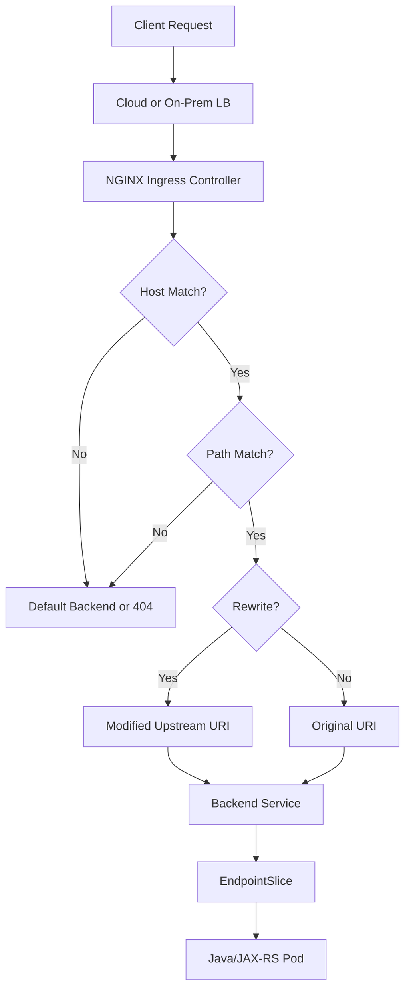

# Part 024 — Kubernetes Ingress Routing Deep Dive

## 1. Tujuan Part Ini

Part ini masuk lebih dalam ke routing behavior Kubernetes Ingress ketika diimplementasikan oleh NGINX-based controller.

Fokusnya:

```text
host-based routing
path-based routing
Exact path
Prefix path
ImplementationSpecific path
regex path
rewrite target
backend protocol
HTTPS backend
gRPC backend
WebSocket backend
sticky session
canary ingress
blue-green routing
multiple ingress conflict
namespace boundary
default TLS
ingress troubleshooting
```

Tujuan akhirnya adalah mampu menjawab pertanyaan produksi seperti:

```text
Kenapa request masuk ke backend yang salah?
Kenapa /api/foo dan /api/foo/ beda behavior?
Kenapa rewrite menyebabkan Java/JAX-RS 404?
Kenapa HTTPS backend menghasilkan 502?
Kenapa WebSocket gagal tetapi REST API sukses?
Kenapa Ingress A mengalahkan Ingress B?
Kenapa canary tidak menerima traffic?
```

---

## 2. Routing Mental Model

Ingress routing biasanya mengikuti beberapa tahap:

```text
1. load balancer forwards request to ingress controller
2. NGINX receives TCP/TLS/HTTP request
3. TLS/SNI selects certificate/server if HTTPS terminated here
4. Host header selects virtual host/server block
5. path rule selects location/backend
6. optional rewrite changes URI before upstream
7. backend protocol determines HTTP/HTTPS/gRPC/WebSocket handling
8. Kubernetes Service resolves to ready endpoints
9. request reaches Java/JAX-RS endpoint
```

Mermaid view:



The critical point:

```text
Host matching and path matching decide where traffic goes.
Rewrite decides what path the backend actually sees.
Backend protocol decides how NGINX talks to the service.
```

---

## 3. Host-Based Routing

A simple Ingress rule:

```yaml
rules:
  - host: quote.example.company.com
    http:
      paths:
        - path: /api/quotes
          pathType: Prefix
          backend:
            service:
              name: quote-order-api
              port:
                number: 80
```

This means:

```text
Only requests with Host: quote.example.company.com
are eligible for this rule.
```

Common mistakes:

```text
DNS points to correct LB but Host header differs
curl uses LB IP without Host header
external gateway rewrites Host unexpectedly
wildcard host catches traffic unexpectedly
same host defined in multiple Ingress objects
TLS SNI host differs from HTTP Host header
```

Debug examples:

```bash
curl -vk https://quote.example.company.com/api/quotes
curl -vk -H 'Host: quote.example.company.com' https://<lb-ip>/api/quotes
openssl s_client -connect quote.example.company.com:443 -servername quote.example.company.com
```

Internal verification checklist:

```text
DNS hostname matches Ingress host.
TLS certificate SAN includes the hostname.
External gateway/load balancer preserves Host header.
No duplicate Ingress uses same host unexpectedly.
Wildcard host rules are intentionally designed.
```

---

## 4. Path-Based Routing

Path routing maps URL paths to backend services.

Example:

```yaml
paths:
  - path: /api/quotes
    pathType: Prefix
    backend:
      service:
        name: quote-service
        port:
          number: 80
  - path: /api/orders
    pathType: Prefix
    backend:
      service:
        name: order-service
        port:
          number: 80
```

Request examples:

| Request Path | Expected Backend |
|---|---|
| `/api/quotes` | quote-service |
| `/api/quotes/123` | quote-service |
| `/api/orders` | order-service |
| `/api/orders/123` | order-service |
| `/api/catalog` | no match/default backend unless another rule exists |

Path routing is where many Java/JAX-RS bugs appear because the public path may not equal the internal resource path.

---

## 5. Kubernetes Path Types

Kubernetes networking API defines three path types:

```text
Exact
Prefix
ImplementationSpecific
```

### 5.1 Exact

`Exact` matches the URL path exactly, case-sensitive.

```yaml
path: /api/quotes
pathType: Exact
```

Matches:

```text
/api/quotes
```

Does not match:

```text
/api/quotes/
/api/quotes/123
/API/QUOTES
```

Use Exact when:

```text
single fixed endpoint
health endpoint
special callback endpoint
root-specific path
```

Risk:

```text
trailing slash mismatch creates unexpected 404
client behavior may vary
```

---

### 5.2 Prefix

`Prefix` matches based on path prefix split by `/` elements.

```yaml
path: /api/quotes
pathType: Prefix
```

Usually matches:

```text
/api/quotes
/api/quotes/
/api/quotes/123
```

Should not be treated as naive string prefix.

A good mental model:

```text
/api/quotes matches /api/quotes/123
but should not unintentionally match /api/quotes-v2 depending on implementation rules
```

Use Prefix when:

```text
one service owns a subtree
REST resource group
versioned API prefix
```

Risk:

```text
overly broad prefix catches paths intended for another service
more specific path loses due to ordering/implementation misunderstanding
```

---

### 5.3 ImplementationSpecific

`ImplementationSpecific` delegates behavior to the IngressClass/controller implementation.

This is powerful but dangerous because behavior is not portable.

It may be used for:

```text
controller-specific regex behavior
legacy compatibility
special NGINX path matching behavior
```

Risk:

```text
migration to another controller changes behavior
upgrade changes behavior
security review becomes harder
path assumptions become implicit
```

Senior engineer rule:

```text
Prefer Exact or Prefix unless you intentionally need controller-specific behavior and have documented why.
```

Internal verification checklist:

```text
Does the Ingress use ImplementationSpecific?
Is regex enabled?
Is the behavior documented in the team/platform standard?
Would this route behave the same if migrated to another controller?
```

---

## 6. Specificity and Rule Selection

When multiple rules can match, specificity matters.

Example:

```yaml
paths:
  - path: /api
    pathType: Prefix
    backend:
      service:
        name: api-gateway
        port:
          number: 80
  - path: /api/quotes
    pathType: Prefix
    backend:
      service:
        name: quote-service
        port:
          number: 80
```

For request:

```text
/api/quotes/123
```

Expected backend is usually the more specific path:

```text
quote-service
```

But never rely on vague assumptions. Check generated controller behavior.

Debug:

```bash
kubectl describe ingress <name> -n <namespace>
kubectl exec -n <ingress-ns> <controller-pod> -- nginx -T | less
```

Review principle:

```text
Avoid ambiguous overlapping path rules unless they are deliberate and tested.
```

---

## 7. Trailing Slash Behavior

Trailing slash bugs are common.

Consider:

```text
/api/quotes
/api/quotes/
```

These may behave differently depending on:

```text
pathType
rewrite annotation
NGINX location generation
backend Java routing
JAX-RS @Path definitions
application redirect behavior
```

JAX-RS example concept:

```java
@Path("/quotes")
public class QuoteResource {
    @GET
    public Response listQuotes() { ... }
}
```

Depending on framework and configuration, `/quotes` and `/quotes/` may or may not normalize the same way.

Ingress review checklist:

```text
Is trailing slash behavior tested?
Does the public URL include slash normalization?
Does NGINX rewrite preserve or remove slash?
Does Java/JAX-RS framework redirect slash variants?
Does redirect keep X-Forwarded-Proto and public Host correct?
```

---

## 8. Regex Path Routing

Some NGINX Ingress implementations support regex path behavior through annotations or implementation-specific mode.

Example shape:

```yaml
metadata:
  annotations:
    nginx.ingress.kubernetes.io/use-regex: "true"
spec:
  rules:
    - host: quote.example.company.com
      http:
        paths:
          - path: /api/quotes/(.*)
            pathType: ImplementationSpecific
```

Regex can solve advanced routing problems, but it increases risk.

Risks:

```text
regex captures too much
regex captures too little
path traversal edge cases
case sensitivity confusion
rewrite group mismatch
performance overhead with complex patterns
controller migration incompatibility
security review difficulty
```

Use regex only when:

```text
simple Prefix/Exact cannot express the route
capture groups are needed for rewrite
behavior is covered by tests
platform allows it
team understands controller-specific semantics
```

---

## 9. Rewrite Target

Rewrite changes the URI sent upstream.

Public route:

```text
https://quote.example.company.com/quote-order/api/v1/quotes/123
```

Backend expects:

```text
/api/v1/quotes/123
```

Ingress may need rewrite:

```text
/quote-order/(.*) -> /$1
```

Mental model:

```text
client sees public path
NGINX matches public path
NGINX optionally rewrites path
Java/JAX-RS sees rewritten path
```

Failure modes:

```text
backend receives extra prefix
backend loses required prefix
query string dropped
trailing slash changed
capturing group wrong
OpenAPI docs generated with internal path
redirect returns internal path to client
```

Debug strategy:

```text
Add/request correlation ID.
Log original request URI at ingress.
Log request URI received by Java/JAX-RS service.
Compare public path vs upstream path.
Check generated NGINX config.
```

---

## 10. Rewrite and Java/JAX-RS Context Path

Java/JAX-RS services may have:

```text
application context path
servlet context path
JAX-RS application path
resource @Path
reverse proxy prefix
```

Example:

```text
public prefix: /quote-order
servlet context: /
JAX-RS application path: /api
resource path: /quotes
```

Final internal path expected:

```text
/api/quotes
```

If NGINX sends:

```text
/quote-order/api/quotes
```

backend may return 404.

If NGINX sends:

```text
/quotes
```

backend may also return 404.

Senior review questions:

```text
What path does the client call?
What path does NGINX match?
What path does NGINX send upstream?
What path does Java/JAX-RS expect?
What path does Java use for redirects and generated links?
```

---

## 11. Backend Protocol

Ingress backend protocol controls how NGINX talks to the Service.

Common possibilities:

```text
HTTP
HTTPS
GRPC
GRPCS
FCGI or other controller-specific protocols
```

Most Java/JAX-RS services use HTTP internally:

```text
client HTTPS -> NGINX TLS termination -> backend HTTP
```

But some environments require re-encryption:

```text
client HTTPS -> NGINX TLS termination -> backend HTTPS
```

Failure modes:

```text
NGINX sends HTTP to HTTPS backend -> connection reset / 502
NGINX sends HTTPS to HTTP backend -> SSL handshake failure / 502
gRPC backend treated as HTTP REST -> protocol errors
backend certificate not trusted -> 502
backend SNI missing/wrong -> TLS failure
```

Internal verification checklist:

```text
Does backend Service expect HTTP, HTTPS, gRPC, or h2c?
Which annotation/config sets backend protocol?
Does Java service expose TLS internally?
Is upstream cert verification enabled?
Is internal CA trusted by NGINX?
```

---

## 12. HTTPS Backend and Re-Encryption

Re-encryption means:

```text
Client -> HTTPS -> NGINX
NGINX -> HTTPS -> Java/JAX-RS backend
```

Why use it:

```text
zero-trust internal network
compliance requirement
tenant isolation
internal CA policy
traffic crosses semi-trusted boundary
```

Trade-offs:

```text
more TLS CPU cost
certificate management for backend services
upstream trust configuration needed
more complex debugging
more failure points
```

Common production failures:

```text
backend certificate expired
backend certificate CN/SAN mismatch
NGINX does not trust internal CA
upstream SNI wrong
backend only supports TLS version/cipher not accepted
Service points to wrong port
```

Debug:

```bash
kubectl port-forward svc/quote-order-api 8443:443 -n quote
openssl s_client -connect localhost:8443 -servername quote-order-api.quote.svc.cluster.local
```

---

## 13. gRPC Backend

gRPC needs HTTP/2 semantics.

A REST-style proxy config may not be sufficient.

Ingress must know that backend protocol is gRPC or gRPC over TLS depending on controller support.

Failure patterns:

```text
HTTP 502 from ingress
gRPC UNAVAILABLE
gRPC stream closes unexpectedly
HTTP/2 protocol error
large metadata/header rejected
upstream timeout too short for streaming call
```

Questions:

```text
Is client-to-ingress HTTP/2 enabled?
Is backend h2 or h2c?
Does ingress controller support gRPC for this route?
Are gRPC status codes visible in logs/metrics?
Is health check compatible with gRPC?
```

---

## 14. WebSocket Backend

WebSocket requires HTTP upgrade behavior.

Request headers include:

```text
Upgrade: websocket
Connection: Upgrade
```

Ingress must preserve/handle upgrade correctly.

Timeouts matter more than normal REST calls because connections can be long-lived.

Failure modes:

```text
upgrade header not handled
idle timeout too short
load balancer idle timeout shorter than ingress timeout
sticky session needed but absent
connection drained during rollout
worker connection exhaustion
```

Internal verification checklist:

```text
Does route support WebSocket?
Are proxy read/send timeouts long enough?
Does cloud LB allow long-lived connections?
Is sticky session required?
Are rollouts tested with active WebSocket connections?
```

---

## 15. Sticky Session

Sticky session means repeated requests from same client go to same backend pod.

It may be needed for:

```text
legacy session state in memory
WebSocket affinity
stateful workflow not externalized
short-term migration compatibility
```

But in cloud-native Java/JAX-RS systems, sticky sessions are often a smell.

Better design:

```text
stateless service
external session store
database-backed workflow state
Kafka/event-backed continuation
cache with safe invalidation
```

Risks of sticky session:

```text
uneven load distribution
bad pod receives disproportionate traffic
rollout drains sessions poorly
scaling does not immediately rebalance
failure causes session loss if state is local
```

Review questions:

```text
Why is sticky session needed?
Is state stored in memory?
Can the workflow be made stateless?
How does sticky session behave during rollout?
What happens when the selected pod dies?
```

---

## 16. Canary Ingress

Canary routing allows a portion of traffic to go to a new backend.

Common canary strategies:

```text
weight-based canary
header-based canary
cookie-based canary
user/tenant-specific canary
```

Example conceptual model:

```text
primary Ingress -> stable service
canary Ingress -> canary service
same host/path
special canary annotations select traffic portion
```

Use cases:

```text
new Java/JAX-RS version rollout
new routing behavior test
new timeout/buffering setting test
specific tenant validation
API compatibility smoke test
```

Failure modes:

```text
canary Ingress ignored due to wrong class
canary annotations unsupported
canary backend has no endpoints
canary path does not exactly match stable path
sticky session hides canary distribution
observability cannot distinguish stable vs canary
rollback removes wrong resource
```

Internal verification checklist:

```text
Is canary supported by installed controller?
Which annotations are used?
How is canary traffic identified in logs?
Can canary be limited by header/cookie/tenant?
How is rollback performed?
```

---

## 17. Blue-Green Routing

Blue-green means two full environments or service versions exist:

```text
blue = current stable
green = new candidate
```

Ingress can switch traffic by changing backend Service or route target.

Patterns:

```text
same host/path, switch Service selector
same host/path, switch Ingress backend
different hostnames for blue and green
cloud LB or API gateway performs switch before NGINX
```

Risks:

```text
DNS cache if switching hostname
connection draining incomplete
in-flight requests interrupted
database compatibility issue
background jobs duplicated
wrong environment receives callbacks
```

Review questions:

```text
Where does the switch happen?
Is it reversible quickly?
Are blue and green both warmed up?
Are health checks meaningful?
Are schema and message contracts backward compatible?
```

---

## 18. Weighted Routing

Weighted routing sends percentages of traffic to different backends.

Possible places to implement:

```text
NGINX Ingress canary annotation
service mesh traffic split
API gateway
cloud load balancer
progressive delivery controller
```

Do not implement weighted routing in multiple layers independently unless carefully designed.

Bad pattern:

```text
API Gateway sends 10% to new path
NGINX Ingress sends 20% of that to canary
service mesh sends 50% of that to v2
actual canary traffic = unclear
```

Senior rule:

```text
There should be one authoritative traffic-splitting layer per rollout decision.
```

Internal verification checklist:

```text
Which layer owns canary percentage?
Is there Argo Rollouts/Flagger/other controller?
Are metrics separated by version?
Is rollback automated or manual?
Is traffic split deterministic enough for debugging?
```

---

## 19. Multiple Ingress Objects

A cluster can have many Ingress objects for the same host.

This can be fine:

```text
one team owns /api/quotes
another owns /api/orders
platform owns /.well-known
```

But it can become dangerous:

```text
same host/path defined twice
overlapping prefix routes
wildcard host catches more than expected
canary object conflicts with main object
namespace isolation assumptions wrong
```

Debug:

```bash
kubectl get ingress -A | grep quote.example.company.com
kubectl describe ingress -n team-a quote-api
kubectl describe ingress -n team-b order-api
kubectl exec -n <ingress-ns> <controller-pod> -- nginx -T | grep -n "quote.example.company.com"
```

Review principle:

```text
For each public host, maintain an inventory of owning Ingress objects and route prefixes.
```

---

## 20. Conflict Resolution

Conflict behavior is controller-specific.

Types of conflict:

```text
same host and same path
same host and overlapping path
same TLS host with different Secret
same annotation intent with different values
canary/main mismatch
wildcard host vs exact host
multiple controllers watching same Ingress
```

Possible outcomes:

```text
one rule wins
controller rejects config
admission webhook blocks resource
runtime route becomes nondeterministic from engineer perspective
newer/older resource precedence applies
```

Do not rely on accidental conflict behavior.

Internal verification checklist:

```text
Does platform define route ownership per host?
Is duplicate host/path detected in CI?
Does admission policy prevent conflicts?
Are wildcard hosts allowed?
Are TLS Secret conflicts detected?
```

---

## 21. Namespace Boundary

Ingress normally references Service in the same namespace.

This matters because teams often ask:

```text
Can Ingress in namespace A route to Service in namespace B?
```

In standard Ingress, this is generally not the intended model.

Operational implications:

```text
route ownership is namespace-scoped
TLS Secret is usually namespace-scoped
cross-team routing needs platform design
shared gateway patterns may require Gateway API or custom resources
```

Bad workaround patterns:

```text
ExternalName Service pointing across namespace without governance
duplicated Services with unclear ownership
wildcard host delegated to many namespaces without route inventory
```

Senior review questions:

```text
Who owns this namespace?
Who owns the host?
Who owns the certificate?
Who owns the backend Service?
Is cross-namespace routing explicitly allowed?
```

---

## 22. Default TLS and Certificate Selection

TLS certificate selection involves:

```text
SNI from TLS handshake
Ingress tls.hosts
TLS Secret
controller default certificate
wildcard certificate
cloud load balancer certificate if TLS terminates before ingress
```

Failure modes:

```text
wrong certificate served
default certificate served
certificate valid but wrong SAN
wildcard does not cover deep subdomain
TLS terminates at cloud LB so ingress TLS config unused
HTTP Host and TLS SNI differ
```

Debug:

```bash
openssl s_client -connect quote.example.company.com:443 -servername quote.example.company.com -showcerts
curl -vk https://quote.example.company.com/api/quotes
kubectl describe ingress quote-order-api -n quote
kubectl get secret quote-example-company-tls -n quote
```

Internal verification checklist:

```text
Where is TLS terminated?
Does Ingress TLS Secret actually participate?
What default certificate does controller use?
Are wildcard certs allowed?
Are cert-manager annotations used?
Are expiry alerts configured?
```

---

## 23. Ingress Troubleshooting by Symptom

### 23.1 No Address Assigned

Likely causes:

```text
wrong IngressClass
controller not running
cloud LB provisioning failed
Service type not LoadBalancer
RBAC issue
admission issue
```

Commands:

```bash
kubectl get ingress -A -o wide
kubectl describe ingress <name> -n <namespace>
kubectl get ingressclass
kubectl get pod -n <ingress-ns>
kubectl logs -n <ingress-ns> <controller-pod>
```

---

### 23.2 404 from Ingress

Likely causes:

```text
Host mismatch
path mismatch
wrong pathType
trailing slash mismatch
Ingress ignored by controller
default backend response
```

Commands:

```bash
curl -vk -H 'Host: expected.host' https://<lb-address>/<path>
kubectl describe ingress <name> -n <namespace>
kubectl get ingress -A | grep expected.host
```

---

### 23.3 503 from Ingress

Likely causes:

```text
Service has no ready endpoints
selector mismatch
readiness failing
Deployment rollout incomplete
backend pod crash loop
```

Commands:

```bash
kubectl describe svc <service> -n <namespace>
kubectl get endpointslice -n <namespace> -l kubernetes.io/service-name=<service>
kubectl get pod -n <namespace> -o wide
kubectl describe pod <pod> -n <namespace>
```

---

### 23.4 502 from Ingress

Likely causes:

```text
wrong backend protocol
wrong service targetPort
connection refused
upstream TLS failure
pod accepts connection then resets
NGINX cannot connect due to NetworkPolicy
```

Commands:

```bash
kubectl describe svc <service> -n <namespace>
kubectl logs -n <ingress-ns> <controller-pod>
kubectl exec -n <ingress-ns> <controller-pod> -- curl -vk http://<service>.<namespace>.svc.cluster.local:<port>/health
```

---

### 23.5 504 from Ingress

Likely causes:

```text
backend too slow
proxy_read_timeout too short
cloud LB timeout shorter than ingress timeout
Java thread pool saturated
database/Kafka/downstream dependency slow
```

Commands:

```bash
kubectl logs -n <ingress-ns> <controller-pod>
kubectl logs -n <app-ns> <java-pod>
check upstream_response_time and request_time
check Java thread pool and dependency latency dashboard
```

---

## 24. Java/JAX-RS Routing Impact

Ingress routing must be aligned with Java routing.

Map the layers explicitly:

```text
Public URL:
  /quote-order/api/v1/quotes/123

Ingress match:
  /quote-order

Rewrite result:
  /api/v1/quotes/123

JAX-RS application path:
  /api/v1

JAX-RS resource path:
  /quotes/{id}
```

If any layer disagrees, the symptom may look like:

```text
Ingress 404
Java 404
redirect to wrong URL
OpenAPI docs wrong
callback URL wrong
CORS preflight mismatch
```

Minimum test cases:

```text
GET base path
GET nested resource
POST resource
OPTIONS preflight
redirect-producing endpoint
trailing slash variant
query string preservation
large body if relevant
```

---

## 25. Security Concerns in Routing

Routing config can create security exposure.

Review for:

```text
admin path accidentally exposed
internal-only path exposed through public ingress
wildcard host catches tenant traffic
regex route captures sensitive path
rewrite bypasses auth prefix
CORS enabled too broadly
canary route exposes unreleased endpoint
default backend leaks information
path traversal not normalized consistently
```

Dangerous pattern:

```text
public /internal/(.*) -> backend /$1
```

This can accidentally expose backend paths that were never designed for public access.

Security review questions:

```text
Which paths are public?
Which paths are internal?
Which layer enforces auth?
Does rewrite bypass auth middleware?
Are admin/actuator/metrics paths blocked?
Are wildcard hosts justified?
```

---

## 26. Observability Concerns in Routing

Routing observability should identify:

```text
Ingress name
namespace
host
path
matched service
upstream address
upstream status
request time
upstream response time
request ID
canary/stable version
backend protocol
```

Without this, debugging canary or overlapping routes is painful.

For canary, add version visibility:

```text
response header from backend version
log field for upstream service/pod
metric label for stable/canary
trace attribute for deployment version
```

Do not rely only on client reports like “sometimes it fails”. You need route-level and backend-level correlation.

---

## 27. Performance Concerns in Routing

Routing choices influence performance.

Potential issues:

```text
complex regex path matching
large number of Ingress rules
many server blocks/hostnames
frequent config reloads
large generated NGINX config
canary routing overhead
sticky session imbalance
backend keepalive fragmentation across many Services
TLS re-encryption cost
```

For Java/JAX-RS backend:

```text
wrong routing can overload one service
sticky sessions can overload one pod
canary can receive unrepresentative traffic
prefix route can send large traffic class to service not sized for it
```

Performance review questions:

```text
How many requests per second hit this route?
Does route match require regex?
Does this path use buffering or streaming?
Does backend have enough capacity?
Does canary receive representative traffic?
```

---

## 28. PR Review Checklist

When reviewing Ingress routing changes:

```text
Host is correct.
TLS host and rule host align.
Path and pathType are intentional.
No unintended overlap with existing routes.
Rewrite target is tested.
Query string preservation is understood.
Trailing slash behavior is tested.
Backend Service name and port are correct.
Backend protocol is correct.
Java/JAX-RS context path aligns with rewritten path.
Auth boundary is not bypassed.
Admin/internal paths are not exposed.
CORS behavior is not accidentally broadened.
Canary/sticky/weighted behavior is observable.
Rollback is straightforward.
```

For any routing PR, ask:

```text
What path does the client call?
What path does NGINX match?
What path does NGINX send upstream?
What path does Java/JAX-RS expect?
What log proves this is working?
What metric proves this is safe?
What is the rollback?
```

---

## 29. Internal Verification Checklist

Use this in the actual team/platform environment.

```text
Ingress inventory:
  - all Ingresses for the same host
  - exact path ownership
  - wildcard host usage
  - public vs internal ingress class

Controller behavior:
  - ingress controller implementation
  - controller version
  - annotation support
  - regex support
  - canary support
  - sticky session support
  - generated NGINX config behavior

Routing correctness:
  - host match
  - path match
  - pathType
  - rewrite target
  - backend Service
  - backend port
  - backend protocol
  - TLS Secret

Java/JAX-RS compatibility:
  - context path
  - JAX-RS application path
  - resource path
  - forwarded headers
  - redirect URL
  - OpenAPI server URL
  - CORS preflight

Security:
  - admin path exposure
  - internal endpoint exposure
  - auth bypass risk
  - wildcard host risk
  - regex route risk
  - default backend behavior

Observability:
  - access logs include host/path/upstream
  - request ID propagated
  - upstream timing visible
  - route/service can be identified
  - canary/stable visible

Operations:
  - GitOps source of truth
  - CI validation
  - admission webhook behavior
  - rollback mechanism
  - route ownership documentation
```

---

## 30. Senior Engineer Summary

Ingress routing is a contract between:

```text
client URL design
DNS and TLS identity
NGINX host/path matching
rewrite behavior
backend Service mapping
Java/JAX-RS application path
security boundary
observability model
rollout strategy
```

The core invariant:

```text
The path matched at ingress, the path sent upstream, and the path expected by Java/JAX-RS must be explicitly known and tested.
```

The second invariant:

```text
Every host/path route must have a clear owner and must not accidentally overlap with another route.
```

The third invariant:

```text
Advanced routing features such as regex, rewrite, sticky session, canary, and weighted routing are production code and require review, tests, observability, and rollback.
```

When production routing fails, do not debug randomly.

Use the layer model:

```text
Host
Path
PathType
Rewrite
Backend Service
EndpointSlice
Backend protocol
Java route
Downstream dependency
```

That structure prevents the most common mistake: blaming the Java/JAX-RS service before proving that NGINX and Kubernetes routed the request correctly.
