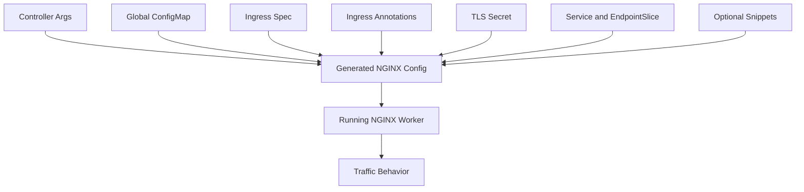

# Part 025 — NGINX Ingress Annotations, ConfigMap Strategy, and Governance

## 1. Tujuan Part Ini

Part ini membahas cara mengelola konfigurasi NGINX Ingress secara aman di Kubernetes.

Fokusnya bukan sekadar menghafal annotation.

Fokus sebenarnya adalah memahami:

```text
apa yang sebaiknya dikendalikan global oleh platform
apa yang boleh dioverride oleh service team
annotation mana yang berisiko tinggi
bagaimana precedence bekerja
bagaimana config change bisa menyebabkan incident
bagaimana review PR Ingress secara production-aware
```

Dalam enterprise environment, Ingress annotation sering terlihat kecil.

Contohnya:

```yaml
nginx.ingress.kubernetes.io/proxy-read-timeout: "300"
nginx.ingress.kubernetes.io/proxy-body-size: "50m"
nginx.ingress.kubernetes.io/rewrite-target: /$2
```

Tetapi perubahan kecil seperti ini bisa mengubah:

```text
routing
TLS behavior
timeout
body size limit
buffering
CORS
authentication path
rate limit
security boundary
observability signal
blast radius
```

Untuk senior backend engineer, Ingress annotation harus dibaca sebagai **traffic policy**, bukan metadata biasa.

---

## 2. Mental Model: ConfigMap vs Annotation vs Template

NGINX Ingress Controller biasanya memiliki beberapa sumber konfigurasi:

```text
1. controller command-line arguments
2. global ConfigMap
3. Ingress resource fields
4. Ingress annotations
5. TLS Secret
6. Service and EndpointSlice
7. optional custom snippets
8. optional custom NGINX template
```

Mental model sederhananya:

```text
ConfigMap = platform-wide default behavior
Ingress spec = routing contract
Ingress annotation = per-route override
Secret = TLS material
Service = backend target
Snippet = escape hatch, high-risk override
Template = controller-level customization, very high-risk
```

Mermaid view:



Important distinction:

```text
A Kubernetes Ingress object is declarative intent.
NGINX configuration is generated implementation.
Annotation is a way to influence that generated implementation.
```

This means two things:

```text
1. You must understand both Kubernetes semantics and NGINX semantics.
2. You must verify the generated behavior, not only the YAML you wrote.
```

---

## 3. Why Annotation Governance Exists

Annotation governance exists because application teams often need flexibility, but platform teams need safety.

Without governance, every service team can independently change:

```text
timeout
request size
rate limit
auth behavior
CORS policy
TLS redirect
proxy buffering
custom NGINX directives
```

The result can be inconsistent production behavior:

```text
Service A times out after 30s.
Service B times out after 300s.
Service C allows 500MB upload.
Service D disables SSL redirect.
Service E injects custom server-snippet.
Service F bypasses standard auth.
```

In a regulated or mission-critical environment, that is not just messy.

It creates:

```text
security drift
operational drift
incident response ambiguity
non-repeatable behavior
weak audit evidence
unexpected blast radius
```

A good platform standard should answer:

```text
Which annotations are allowed?
Which annotations require approval?
Which annotations are blocked?
Which defaults are inherited globally?
Which service-level exceptions are documented?
How are exceptions tested and monitored?
```

---

## 4. Common Annotation Categories

Common NGINX Ingress annotations fall into several categories:

```text
routing and rewrite
TLS and redirect
backend protocol
timeout
body size
buffering
rate limiting
connection limiting
authentication
CORS
headers
session affinity
canary/progressive delivery
custom snippets
observability
```

Each category has different risk.

| Category | Typical risk | Review intensity |
|---|---:|---:|
| Timeout | Medium to high | High |
| Body size | Medium | Medium |
| Rewrite | High | High |
| Backend protocol | High | High |
| Rate limit | Medium to high | High |
| Auth | Very high | Very high |
| CORS | High | High |
| Snippets | Very high | Very high |
| SSL redirect | High | High |
| Buffering | Medium | Medium |
| Canary | Medium to high | High |

Senior review principle:

```text
Any annotation that changes trust, routing, timeout, auth, body handling, or generated NGINX config deserves careful review.
```

---

## 5. Timeout Annotations

Timeout annotations are among the most common production changes.

Typical examples:

```yaml
metadata:
  annotations:
    nginx.ingress.kubernetes.io/proxy-connect-timeout: "5"
    nginx.ingress.kubernetes.io/proxy-send-timeout: "60"
    nginx.ingress.kubernetes.io/proxy-read-timeout: "60"
```

Mental model:

```text
proxy-connect-timeout = time to establish connection to backend
proxy-send-timeout    = time to send request to backend
proxy-read-timeout    = time waiting for backend response chunks
```

The danger is not the value alone.

The danger is whether the value aligns with the full timeout chain:

```text
client timeout
browser/mobile timeout
cloud load balancer idle timeout
NGINX timeout
Ingress timeout
Java server timeout
application transaction timeout
database timeout
outbound HTTP client timeout
message broker timeout
```

Example failure:

```text
Cloud LB idle timeout: 60s
NGINX proxy-read-timeout: 300s
Java request takes: 180s

Result:
Client sees disconnect around 60s.
NGINX may still wait.
Java may continue working.
Logs look inconsistent.
```

PR review question:

```text
Is this timeout value aligned with the entire path, or is it hiding a slow backend problem?
```

Java/JAX-RS impact:

```text
Long proxy timeout can allow long-running resource methods to continue consuming worker threads.
Short proxy timeout can make valid long-running operations fail at the edge.
Retry after timeout can duplicate non-idempotent operations.
```

Kubernetes impact:

```text
Timeout change may apply to one Ingress only.
Other services may still use global default.
Endpoint readiness and pod termination can interact badly with long timeouts.
```

Cloud/on-prem impact:

```text
AWS ALB/NLB, Azure Application Gateway, Azure Front Door, corporate LBs, and firewalls may have their own idle timeout.
The lowest relevant timeout usually wins from the client's perspective.
```

Internal verification checklist:

```text
Check global ingress timeout default.
Check per-Ingress timeout overrides.
Check cloud/on-prem load balancer idle timeout.
Check Java server request timeout.
Check database/query timeout.
Check retry behavior for non-idempotent endpoints.
Check access log request_time and upstream_response_time.
Check whether the endpoint should be asynchronous instead of long synchronous HTTP.
```

---

## 6. Body Size Annotation

Body size is commonly controlled per Ingress.

Example:

```yaml
metadata:
  annotations:
    nginx.ingress.kubernetes.io/proxy-body-size: "50m"
```

This controls whether NGINX accepts a request body above a threshold.

Failure symptom:

```text
HTTP 413 Request Entity Too Large
Upload fails before Java/JAX-RS endpoint is reached
Application logs show nothing
Ingress access log shows 413
```

Body size should not be increased casually.

Trade-off:

```text
Higher body size helps legitimate upload use cases.
Higher body size also increases abuse surface, memory/disk pressure, and slow upload risk.
```

Java/JAX-RS impact:

```text
Multipart parser limits may be lower than NGINX limit.
Application server request body limit may be lower.
Upload endpoint may buffer in memory accidentally.
Large request bodies can keep servlet/JAX-RS workers busy.
```

Kubernetes impact:

```text
Large body buffering may consume ingress controller disk/temp storage.
Container ephemeral storage limits can be hit.
Pod eviction can occur if temp file usage grows.
```

PR review question:

```text
Is the new body size required by a specific endpoint, or is it applied too broadly to every route on the host?
```

Better pattern:

```text
Separate upload path into a dedicated Ingress rule when possible.
Apply larger body limit only to that path.
Keep default body size conservative.
Observe 413 and upload latency explicitly.
```

Internal verification checklist:

```text
Check upload endpoint requirements.
Check Java multipart/body limit.
Check ingress controller ephemeral storage.
Check whether object storage pre-signed upload would be better.
Check whether body size is route-specific or host-wide.
Check 413 rate in logs/metrics.
Check abuse/throttling controls for upload endpoint.
```

---

## 7. Rewrite Annotation

Rewrite annotations are high-risk because they change the URI that backend sees.

Example:

```yaml
metadata:
  annotations:
    nginx.ingress.kubernetes.io/rewrite-target: /$2
spec:
  rules:
    - host: api.example.company.com
      http:
        paths:
          - path: /quote(/|$)(.*)
            pathType: ImplementationSpecific
            backend:
              service:
                name: quote-service
                port:
                  number: 8080
```

Client request:

```text
GET /quote/api/v1/orders
```

Backend may see:

```text
GET /api/v1/orders
```

This is useful when public path and backend context path differ.

It is dangerous because the backend may rely on original path for:

```text
JAX-RS route matching
absolute URL generation
redirect location
auth policy
OpenAPI documentation
metrics labels
rate-limit keys
security filters
```

Failure modes:

```text
404 from Java/JAX-RS because path no longer matches
wrong endpoint called after rewrite
redirect points to internal path
CORS preflight path differs from actual path
auth applied to public path but backend sees rewritten path
metrics show backend path instead of public API path
```

PR review question:

```text
Can the backend be configured with the correct base path instead of relying on rewrite?
```

Rewrite is not automatically bad.

But it requires explicit path contract:

```text
Public path: /quote/api/v1/orders
Backend path: /api/v1/orders
Expected X-Forwarded-Prefix: /quote
Redirect behavior: external URLs must preserve /quote
OpenAPI server URL: public path
```

Internal verification checklist:

```text
Check public path vs backend path.
Check JAX-RS ApplicationPath/base path.
Check generated links and redirects.
Check OpenAPI server URL.
Check auth filter path assumptions.
Check access log original URI and upstream URI if available.
Check regex capture groups carefully.
Check behavior for trailing slash and empty suffix.
```

---

## 8. SSL Redirect and HTTPS Policy Annotations

Common annotations may control HTTP-to-HTTPS redirect.

Example:

```yaml
metadata:
  annotations:
    nginx.ingress.kubernetes.io/ssl-redirect: "true"
    nginx.ingress.kubernetes.io/force-ssl-redirect: "true"
```

The intent:

```text
Clients should use HTTPS.
Plain HTTP should redirect or be rejected.
```

This must be reviewed with the full TLS termination path.

Possible TLS paths:

```text
Client -> NGINX terminates TLS -> HTTP to backend
Client -> Cloud LB terminates TLS -> HTTP to NGINX
Client -> Cloud LB passes TLS -> NGINX terminates TLS
Client -> Cloud LB terminates TLS -> NGINX re-encrypts to backend
```

Failure mode:

```text
Cloud LB terminates TLS and forwards HTTP to NGINX.
NGINX does not trust X-Forwarded-Proto.
NGINX thinks request is HTTP.
NGINX redirects to HTTPS repeatedly.
Client sees redirect loop.
```

Security concern:

```text
Disabling SSL redirect may expose credentials/tokens over plain HTTP if port 80 is reachable.
```

PR review question:

```text
Where is TLS terminated, and how does NGINX know the original client scheme?
```

Internal verification checklist:

```text
Check TLS termination layer.
Check X-Forwarded-Proto behavior.
Check whether HTTP listener is public.
Check HSTS policy.
Check redirect loop reports.
Check cloud LB listener rules.
Check certificate ownership.
```

---

## 9. Backend Protocol Annotation

Backend protocol determines how NGINX talks to the Service.

Example:

```yaml
metadata:
  annotations:
    nginx.ingress.kubernetes.io/backend-protocol: "HTTPS"
```

Possible intent:

```text
Ingress receives HTTPS from client.
Ingress also uses HTTPS to backend service.
```

Common values vary by controller, but conceptually include:

```text
HTTP
HTTPS
GRPC
GRPCS
```

Failure modes:

```text
NGINX uses HTTP but backend expects HTTPS -> connection reset / bad request / 502
NGINX uses HTTPS but backend serves HTTP -> SSL handshake failure / 502
NGINX uses HTTP/1.1 but backend expects gRPC over HTTP/2 -> protocol failure
NGINX does not trust backend certificate -> upstream TLS verification failure
```

Java/JAX-RS impact:

```text
Most JAX-RS REST APIs expect HTTP/1.1 or HTTP/2 terminated before app server.
If backend is HTTPS, application server certificate and trust config matter.
If backend scheme is wrong, app may generate wrong absolute URLs.
```

Internal verification checklist:

```text
Check backend service protocol.
Check service port name and targetPort.
Check pod container port.
Check application server connector: HTTP or HTTPS.
Check backend cert if HTTPS.
Check gRPC service requirements.
Check ingress controller logs for protocol mismatch.
```

---

## 10. Proxy Buffering Annotation

Proxy buffering controls whether NGINX buffers upstream responses before sending to the client.

Example:

```yaml
metadata:
  annotations:
    nginx.ingress.kubernetes.io/proxy-buffering: "off"
```

Buffering helps when:

```text
clients are slow
upstream should be freed quickly
responses are normal finite payloads
NGINX can absorb network variability
```

Buffering hurts when:

```text
Server-Sent Events need immediate flush
streaming responses must reach client incrementally
long polling behavior depends on flush timing
large downloads spill to temp files unexpectedly
```

Java/JAX-RS impact:

```text
StreamingOutput or reactive streaming may appear broken because data is buffered at NGINX.
Application flushes data but client does not see it.
Latency metrics in app look good while client latency is poor.
```

Kubernetes impact:

```text
Response buffering can consume memory and temp disk in ingress pods.
Disabling buffering can increase open upstream connection duration.
```

PR review question:

```text
Is this endpoint a normal request/response endpoint, or does it require streaming semantics?
```

Internal verification checklist:

```text
Check whether endpoint uses SSE, streaming, large download, or long polling.
Check ingress proxy-buffering setting.
Check response latency from client perspective.
Check ingress pod temp disk usage.
Check upstream connection duration.
```

---

## 11. Rate Limit Annotations

Some controllers support rate limiting through annotations.

Typical policies include:

```text
requests per second/minute
burst size
connection limit
whitelist exception
limit by IP or forwarded IP
```

Rate limit annotations are deceptively simple.

The hard part is key design:

```text
limit by client IP?
limit by X-Forwarded-For?
limit by tenant header?
limit by authenticated user?
limit by API key?
```

NGINX Ingress often has limited ability to do authenticated-user-aware distributed rate limiting without help from API gateway, external auth, Lua, NGINX Plus, or external limiter.

Failure modes:

```text
All users behind same NAT are rate limited together.
Client IP is wrong because source IP preservation is not configured.
X-Forwarded-For is spoofable if trust boundary is weak.
Rate limit protects public traffic but not internal callers.
429 response is not observable.
```

Java/JAX-RS impact:

```text
Application may never see blocked requests.
App-level metrics may undercount attempted traffic.
Clients may retry aggressively on 429 if Retry-After is absent.
```

Internal verification checklist:

```text
Check rate limit key.
Check real client IP configuration.
Check trusted proxy chain.
Check 429 log visibility.
Check Retry-After behavior.
Check whether API gateway already rate-limits.
Check tenant/user-specific requirement.
```

---

## 12. Auth Annotations

Auth annotations may configure external authentication, basic auth, or auth request behavior.

Typical concept:

```text
Before proxying to backend, NGINX calls an auth endpoint.
If auth says allow, request continues.
If auth says deny, NGINX returns 401/403.
```

This is powerful.

It is also high-risk.

Auth annotation changes the security boundary of a route.

Failure modes:

```text
auth disabled accidentally for sensitive path
auth endpoint timeout causes production outage
auth cache too permissive
auth headers forwarded incorrectly
identity header spoofed by external client
401 vs 403 semantics inconsistent
```

Java/JAX-RS impact:

```text
Backend may trust identity headers from NGINX.
If NGINX route is misconfigured, backend may receive unauthenticated traffic.
Application authorization must still enforce domain-level permissions.
```

Senior review principle:

```text
Edge authentication can establish identity.
Application authorization should still protect business actions.
```

Internal verification checklist:

```text
Check whether route requires auth.
Check auth annotations.
Check external auth endpoint availability and timeout.
Check identity headers added by NGINX.
Check header stripping before auth identity injection.
Check app-level authorization remains active.
Check audit logging.
```

---

## 13. CORS Annotations

CORS annotations often appear harmless.

They are not harmless.

CORS controls which browser origins can call an API from frontend JavaScript.

Example conceptual fields:

```text
allowed origins
allowed methods
allowed headers
exposed headers
allow credentials
max age
```

Bad CORS policy can expose authenticated APIs to unintended browser origins.

Dangerous pattern:

```text
Access-Control-Allow-Origin: *
Access-Control-Allow-Credentials: true
```

Even when browsers reject some invalid combinations, the intent itself indicates weak security review.

Java/JAX-RS impact:

```text
CORS can be handled at NGINX or application.
Handling it in both layers can produce duplicated or inconsistent headers.
Preflight OPTIONS may be answered by NGINX and never reach JAX-RS.
```

Failure modes:

```text
Browser blocks request due to missing header.
OPTIONS returns 404 because backend does not handle preflight.
NGINX allows methods backend does not support.
Credentials allowed for too-broad origin.
Different environments have inconsistent origins.
```

Internal verification checklist:

```text
Check where CORS is handled: NGINX, gateway, app, or frontend platform.
Check allowed origin list.
Check credentials requirement.
Check OPTIONS behavior.
Check allowed headers for Authorization, trace IDs, custom tenant headers.
Check environment-specific origins.
```

---

## 14. Header Manipulation Annotations and Snippets

Some configurations add, remove, or override headers.

Header changes can affect:

```text
client IP
original scheme
original host
correlation ID
trace propagation
authenticated identity
CORS
cache behavior
security headers
```

Examples of sensitive headers:

```text
X-Forwarded-For
X-Forwarded-Host
X-Forwarded-Proto
Forwarded
X-Real-IP
X-Request-ID
traceparent
Authorization
Cookie
X-User-ID
X-Tenant-ID
X-Internal-Role
```

Senior review principle:

```text
Headers crossing a trust boundary must be either stripped, normalized, or explicitly trusted.
```

Bad pattern:

```text
External client can send X-User-ID.
NGINX forwards it unchanged.
Backend trusts X-User-ID.
```

Better pattern:

```text
Strip incoming identity headers from untrusted clients.
Authenticate at trusted layer.
Inject canonical identity headers after authentication.
Backend trusts only headers from trusted proxy network.
```

Internal verification checklist:

```text
Check all proxy_set_header behavior.
Check identity header policy.
Check correlation ID propagation.
Check traceparent propagation.
Check whether incoming spoofable headers are stripped.
Check Java/JAX-RS trusted proxy configuration.
```

---

## 15. Server Snippet and Configuration Snippet Risk

Snippet annotations allow injecting raw NGINX directives into generated config.

Conceptually:

```text
server-snippet        -> inject directives in server block
configuration-snippet -> inject directives in location block
```

This is powerful because it can solve edge cases.

It is dangerous because it can bypass platform governance.

Snippet can change:

```text
headers
auth
routing
rewrite
return status
access control
rate limit
proxy behavior
logging
security policy
```

Bad outcomes:

```text
A service team bypasses auth with custom snippet.
A snippet disables security headers.
A snippet leaks internal headers.
A snippet creates open redirect.
A snippet breaks generated config reload.
A snippet affects neighboring routes on same host.
```

In many enterprise environments, arbitrary snippets should be disabled or tightly controlled.

If snippets are allowed, require:

```text
explicit approval
security review
platform review
test coverage
generated config inspection
rollback plan
clear ownership
expiration or periodic review
```

Internal verification checklist:

```text
Check whether snippets are enabled in ingress controller.
Search all Ingress resources for snippet annotations.
Classify each snippet by risk.
Check whether snippets bypass global policy.
Check whether admission control blocks unsafe snippets.
Check incident history related to snippets.
```

---

## 16. Global ConfigMap Strategy

The global ConfigMap should encode platform defaults.

Examples of platform defaults:

```text
default proxy timeouts
default body size
default SSL redirect behavior
default proxy buffer sizes
default real IP configuration
default log format
default rate limit zones
default security headers if managed centrally
default allowed snippet policy
default HSTS policy if appropriate
```

Good ConfigMap strategy:

```text
centralized defaults
minimal service-level overrides
clear exception process
version-controlled changes
CI validation
staged rollout
observability attached to changes
```

Bad ConfigMap strategy:

```text
everything is service-specific annotation
no documented defaults
no diff visibility for generated config
platform defaults change without app team awareness
exceptions live forever
```

Architecture principle:

```text
Use ConfigMap for common invariants.
Use annotations for justified local exceptions.
Use snippets only when normal abstraction is insufficient and risk is accepted.
```

Internal verification checklist:

```text
Locate ingress controller ConfigMap.
Document defaults for timeout, body size, buffering, SSL redirect, logs, real IP.
Compare defaults across environments.
Check Git history for config drift.
Check whether ConfigMap changes trigger safe rollout.
Check whether generated NGINX config can be inspected.
```

---

## 17. Per-Ingress Override Strategy

Per-Ingress override is appropriate when the service has real differences.

Examples:

```text
upload endpoint needs larger body size
SSE endpoint needs buffering off
long-running export endpoint needs longer read timeout
internal callback endpoint needs IP allowlist
canary route needs traffic split
specific backend requires HTTPS protocol
```

Per-Ingress override is not appropriate when:

```text
team wants to avoid fixing slow service
team copies annotation from another service without understanding
team disables security to unblock local testing
team applies broad override to entire host for one endpoint
team uses snippet because annotation is not understood
```

PR review question:

```text
Is this override endpoint-specific, justified, tested, observable, and reversible?
```

Recommended exception record:

```yaml
metadata:
  annotations:
    nginx.ingress.kubernetes.io/proxy-read-timeout: "180"
    platform.company.com/exception-reason: "monthly export endpoint can stream for up to 120s"
    platform.company.com/exception-owner: "quote-order-team"
    platform.company.com/exception-review-date: "2026-12-31"
```

The exact annotation names are internal design, but the governance idea matters.

Internal verification checklist:

```text
Check whether override is documented.
Check whether override is scoped to the smallest path possible.
Check whether metrics validate the requirement.
Check whether expiration/review exists.
Check whether rollback is safe.
```

---

## 18. Annotation Precedence and Conflict Thinking

Precedence depends on controller implementation, but the general model is:

```text
controller defaults
then ConfigMap defaults
then Ingress spec
then per-Ingress annotations
then snippets/custom template if enabled
```

But do not assume blindly.

Generated config is the truth.

Example conflict:

```text
Global ConfigMap: proxy-read-timeout = 60s
Ingress annotation: proxy-read-timeout = 300s
Cloud LB idle timeout: 60s
```

Even if annotation wins inside NGINX, the effective user-visible timeout may still be 60s because cloud LB closes connection first.

Another conflict:

```text
Global SSL redirect enabled
Specific Ingress disables ssl-redirect
Cloud LB still redirects HTTP to HTTPS
```

User-visible behavior is determined by the whole chain, not one YAML object.

Senior review principle:

```text
Precedence inside Kubernetes is not the same as effective behavior across DNS, LB, NGINX, app, and client.
```

Internal verification checklist:

```text
Check generated NGINX config.
Check controller documentation/version.
Check ConfigMap defaults.
Check Ingress annotations.
Check cloud/on-prem LB behavior.
Check application behavior.
Check real client test with curl.
```

---

## 19. Unsafe Annotation Risk

Unsafe annotations are those that can break isolation, bypass policy, or inject arbitrary behavior.

High-risk examples:

```text
server-snippet
configuration-snippet
custom headers from untrusted input
auth bypass annotations
permissive CORS
SSL redirect disablement
large body size without scope
regex rewrite with unclear capture
backend protocol mismatch
affinity/canary changes without testing
```

Enterprise risk:

```text
A single Ingress YAML can become an unreviewed edge policy change.
```

Security risk:

```text
Ingress authors may have permissions to change route behavior but should not have permissions to bypass global security policy.
```

Operational risk:

```text
Invalid or dangerous annotation can cause config reload failure or unexpected routing behavior.
```

Governance options:

```text
admission controller policies
OPA/Gatekeeper/Kyverno policies
restricted annotation allowlist
blocked snippet annotations
namespace-based policy
separate IngressClass for high-risk behavior
platform-owned shared templates
CI linting
mandatory review from platform/security
```

Internal verification checklist:

```text
Check RBAC: who can edit Ingress.
Check annotation allowlist/blocklist.
Check admission policy.
Check whether snippets are disabled.
Check whether high-risk changes require CODEOWNERS approval.
Check audit log for Ingress updates.
```

---

## 20. Policy Governance Model

A practical governance model has four classes.

### Class 1 — Safe defaults

Managed by platform.

Examples:

```text
log format
basic proxy headers
default timeout
default body size
default buffering
default TLS redirect
```

### Class 2 — Allowed service overrides

Allowed with clear reason.

Examples:

```text
specific timeout for export endpoint
larger body size for upload endpoint
buffering off for SSE
backend protocol for HTTPS service
```

### Class 3 — Approval-required overrides

Require platform/security review.

Examples:

```text
auth behavior
CORS with credentials
IP allowlist for sensitive route
rate limit policy change
canary/traffic split on critical route
```

### Class 4 — Blocked or exceptional only

Should generally be disabled.

Examples:

```text
server-snippet
configuration-snippet
arbitrary NGINX directive injection
security header removal
SSL redirect disablement on public host
auth bypass
```

This is not bureaucracy.

It is how platform teams keep local flexibility from turning into global fragility.

---

## 21. Java/JAX-RS-Specific Review Concerns

Ingress annotation can affect Java/JAX-RS behavior in subtle ways.

Check these areas:

```text
base path / ApplicationPath
URI generation
redirect scheme/host/path
Forwarded and X-Forwarded-* handling
CORS handling layer
auth identity propagation
request body size
multipart parser limit
streaming response behavior
HTTP method handling
error propagation
```

Example issue:

```text
Ingress rewrites /quote/api to /api.
JAX-RS generates Location: /api/orders/123.
Client expected /quote/api/orders/123.
Client follows redirect and receives 404.
```

Example issue:

```text
Ingress handles OPTIONS CORS preflight.
Application-level CORS metrics show no OPTIONS requests.
Debugging at app layer misses the real behavior.
```

Example issue:

```text
Ingress strips Authorization header for auth_request flow.
Backend expected token for downstream authorization.
Requests become 403 inside app.
```

Internal verification checklist:

```text
Check JAX-RS ApplicationPath.
Check generated Location headers.
Check OpenAPI public server URL.
Check app framework proxy header support.
Check CORS ownership.
Check auth header and identity propagation.
Check upload and streaming endpoint behavior.
```

---

## 22. Observability Requirements for Annotation Changes

Every meaningful annotation change should have observable signals.

Examples:

| Annotation type | Signals to watch |
|---|---|
| timeout | 499, 502, 504, request_time, upstream_response_time |
| body size | 413 count, request_length, upload latency |
| rewrite | 404 count, backend route metrics, upstream URI if available |
| backend protocol | 502 count, upstream connect errors, TLS errors |
| rate limit | 429 count, limited key distribution |
| auth | 401/403 count, auth upstream latency/error |
| buffering | client latency, upstream duration, temp file usage |
| CORS | OPTIONS count, browser errors, 4xx preflight |
| SSL redirect | redirect count, loop reports, HTTP listener hits |

Operational rule:

```text
If you cannot observe the effect of an annotation, you are changing production behavior blind.
```

Internal verification checklist:

```text
Check dashboards before change.
Check expected metric movement.
Check log fields needed for debugging.
Check alert thresholds.
Check rollout window.
Check rollback trigger.
```

---

## 23. Debugging Annotation Issues

When an Ingress annotation change causes an incident, debug in this order:

```text
1. identify exact Ingress object changed
2. compare previous and current YAML
3. check controller events
4. check generated NGINX config if available
5. check controller reload logs
6. test from outside with curl
7. test from inside cluster to Service
8. compare NGINX status with app logs
9. isolate whether failure is routing, protocol, TLS, timeout, auth, CORS, or body size
10. rollback smallest risky change
```

Useful commands:

```bash
kubectl describe ingress <name> -n <namespace>
kubectl get ingress <name> -n <namespace> -o yaml
kubectl describe svc <service> -n <namespace>
kubectl get endpointslice -n <namespace>
kubectl logs -n <ingress-namespace> deploy/<controller-deployment>
curl -vk https://host/path
curl -v -H 'Host: example.company.com' http://lb-ip/path
```

Do not debug only from the application.

If NGINX rejects the request, the Java/JAX-RS service may never see it.

---

## 24. PR Review Checklist for Ingress Annotation Changes

Use this checklist for any PR that changes Ingress annotations.

```text
Routing
- Does this change host/path routing?
- Does it affect multiple paths under same host?
- Is rewrite behavior explicit and tested?

Timeout
- Is timeout aligned with LB, app, DB, and client timeout?
- Is the endpoint idempotent if retry behavior changes?
- Is long-running HTTP actually the right design?

Body size
- Is larger body size scoped narrowly?
- Are app and ingress limits aligned?
- Is upload abuse controlled?

TLS/redirect
- Where is TLS terminated?
- Can this create redirect loop?
- Is HSTS/HTTPS policy preserved?

Backend protocol
- Does backend really speak HTTP, HTTPS, gRPC, or GRPCS?
- Are certificates trusted if upstream TLS is used?

Auth/CORS
- Does this weaken auth boundary?
- Are identity headers protected from spoofing?
- Is CORS handled in only one intended layer?

Rate limit
- What is the key?
- Is source IP trustworthy?
- Is 429 observable?

Snippets
- Is snippet absolutely necessary?
- Has platform/security reviewed it?
- Could it bypass standard policy?

Observability
- What metrics/logs prove this works?
- What alert will detect failure?
- What is rollback trigger?
```

---

## 25. Internal Verification Checklist

Use this when joining a real team or reviewing an existing platform.

```text
Controller identity
- Which controller is used: ingress-nginx community, NGINX Inc controller, NGINX Plus, other?
- Which version and Helm chart?
- Which IngressClass names exist?

Global defaults
- Where is the controller ConfigMap?
- What are default timeouts?
- What is default body size?
- Is SSL redirect enabled globally?
- Is proxy buffering enabled globally?
- What log format is used?

Annotation policy
- Which annotations are allowed?
- Which annotations are blocked?
- Are snippets enabled?
- Are dangerous annotations blocked by admission policy?
- Is CODEOWNERS approval required?

Routing
- Are multiple Ingress objects sharing the same host?
- Are regex paths used?
- Are rewrite-target annotations used?
- Are backend protocols consistent?

Security
- Is auth handled at ingress, gateway, app, or combination?
- Are CORS annotations used?
- Are identity headers stripped and re-injected safely?
- Is SSL redirect ever disabled?

Operations
- Can generated NGINX config be inspected?
- Are controller reload failures monitored?
- Are changes deployed through GitOps?
- Is rollback documented?
- Are annotation-related incidents documented?
```

---

## 26. Common Anti-Patterns

### Anti-pattern 1 — Annotation copy-paste

```text
A team copies annotations from another service without understanding the traffic profile.
```

Risk:

```text
wrong timeout
wrong body size
wrong rewrite
wrong protocol
```

### Anti-pattern 2 — Service-specific chaos

```text
Every service overrides global defaults independently.
```

Risk:

```text
no standard behavior
hard incident response
different failure semantics across APIs
```

### Anti-pattern 3 — Snippet as first solution

```text
Team uses raw NGINX snippet instead of supported annotation or platform feature.
```

Risk:

```text
policy bypass
reload failure
security regression
future upgrade breakage
```

### Anti-pattern 4 — Auth at edge only

```text
Backend fully trusts NGINX route-level auth and has weak app authorization.
```

Risk:

```text
misconfigured route exposes business action
identity header spoofing becomes privilege escalation
```

### Anti-pattern 5 — Timeout inflation

```text
Increasing proxy-read-timeout whenever users report timeout.
```

Risk:

```text
slow service hidden
resource exhaustion
retry storm
client still times out elsewhere
```

---

## 27. Production Readiness Checklist

Before accepting an Ingress annotation design, confirm:

```text
The annotation is necessary.
The scope is as narrow as possible.
The behavior is documented.
The generated NGINX behavior is understood.
The change aligns with global platform policy.
The Java/JAX-RS backend behavior is compatible.
The cloud/on-prem load balancer behavior is compatible.
The security impact is reviewed.
The performance impact is reviewed.
The observability signal exists.
The rollback path is clear.
The owner is known.
```

A good Ingress annotation change should be boring in production.

If it is surprising, it was not reviewed deeply enough.

---

## 28. Key Takeaways

```text
Ingress annotations are not comments.
They are executable traffic policy.
```

```text
ConfigMap should encode platform-wide invariants.
Annotations should express justified local exceptions.
Snippets should be rare and heavily governed.
```

```text
Generated NGINX config is the runtime truth.
YAML intent is only one input.
```

```text
Annotation changes must be reviewed across routing, timeout, TLS, auth, body handling, security, performance, observability, and rollback.
```

```text
For Java/JAX-RS systems, annotation changes can affect base path, redirects, CORS, identity propagation, upload behavior, streaming, and error visibility.
```
