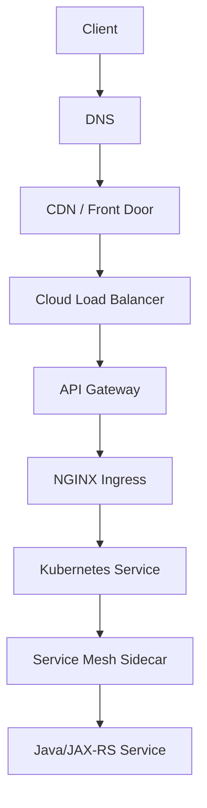
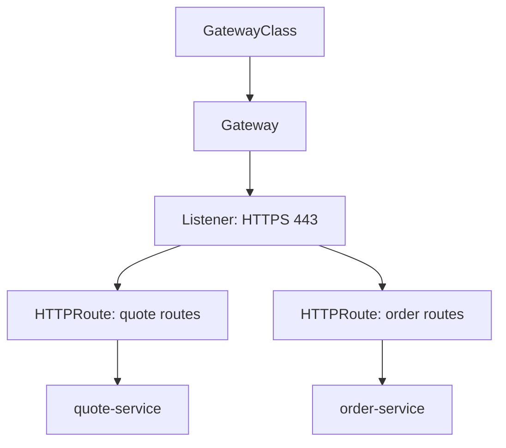

# Part 026 — Gateway API, API Gateway, and Service Mesh Comparison

## 1. Tujuan Part Ini

Part ini membahas posisi NGINX dalam ekosistem traffic management modern.

Fokusnya:

```text
Kubernetes Ingress
Gateway API
HTTPRoute
API Gateway
Cloud API Gateway
AWS API Gateway
Azure API Management
Service Mesh
Envoy/Istio/Linkerd
NGINX role with service mesh
North-south traffic
East-west traffic
```

Tujuan utama bukan memilih teknologi favorit.

Tujuan utamanya adalah mampu menjawab:

```text
Apakah NGINX Ingress cukup?
Kapan Gateway API lebih tepat daripada Ingress?
Kapan butuh API Gateway?
Kapan service mesh layak digunakan?
Apa beda edge proxy dan sidecar mesh?
Layer mana yang seharusnya menangani auth, rate limit, routing, TLS, observability, dan policy?
```

Senior engineer harus bisa mencegah dua kesalahan ekstrem:

```text
1. menggunakan NGINX untuk semua hal sampai menjadi pseudo-API-gateway yang tidak terkendali
2. menambahkan API Gateway/service mesh tanpa kebutuhan jelas dan menambah kompleksitas operasional
```

---

## 2. Traffic Management Layers

Dalam enterprise system, traffic bisa melewati beberapa layer:

```text
Client
DNS
CDN or Front Door
Cloud Load Balancer
API Gateway
NGINX / Ingress Controller
Service Mesh Gateway
Kubernetes Service
Sidecar Proxy
Java/JAX-RS Pod
Database / downstream service
```

Tidak semua environment memiliki semua layer.

Tetapi arsitektur kompleks sering memiliki lebih dari satu.

Mermaid view:



The core architecture question:

```text
Which layer owns which responsibility?
```

If every layer tries to do everything, production behavior becomes hard to reason about.

---

## 3. North-South vs East-West Traffic

Two traffic directions matter.

### North-south traffic

Traffic entering or leaving the platform.

```text
external client -> platform
partner system -> platform
internet -> Kubernetes
corporate network -> service
```

Typical components:

```text
DNS
CDN
WAF
cloud load balancer
API Gateway
NGINX Ingress
Gateway API Gateway
```

### East-west traffic

Traffic between services inside the platform.

```text
quote-service -> catalog-service
order-service -> pricing-service
workflow-service -> notification-service
```

Typical components:

```text
Kubernetes Service
service mesh sidecar
internal gateway
mTLS
network policy
client library
```

NGINX is most commonly used for north-south traffic.

Service mesh is most commonly used for east-west traffic.

But overlaps exist.

Architecture principle:

```text
Do not evaluate NGINX, API Gateway, and service mesh as direct replacements only.
They often solve different traffic directions and policy scopes.
```

---

## 4. Kubernetes Ingress: What It Solves

Kubernetes Ingress provides a Kubernetes-native way to expose HTTP/HTTPS services.

Ingress focuses on:

```text
host-based routing
path-based routing
TLS certificate attachment
routing to Kubernetes Service
basic HTTP ingress abstraction
```

Example:

```yaml
apiVersion: networking.k8s.io/v1
kind: Ingress
metadata:
  name: quote-api
spec:
  ingressClassName: nginx
  tls:
    - hosts:
        - quote.example.company.com
      secretName: quote-api-tls
  rules:
    - host: quote.example.company.com
      http:
        paths:
          - path: /api
            pathType: Prefix
            backend:
              service:
                name: quote-api
                port:
                  number: 8080
```

Ingress is intentionally simple.

Strengths:

```text
simple HTTP routing
broad ecosystem support
works well for many Kubernetes web/API workloads
native Kubernetes object
controller abstraction
```

Limitations:

```text
limited expressiveness
annotation-driven extensions
controller-specific behavior
weak cross-namespace delegation model
not ideal for complex multi-team gateway ownership
not a complete API product management layer
not an east-west service policy solution
```

For many Java/JAX-RS services, Ingress + NGINX is enough when requirements are:

```text
stable host/path routing
TLS termination
basic proxy behavior
standard timeouts
standard logging
limited per-service override
```

---

## 5. NGINX Ingress Controller: What It Adds

NGINX Ingress Controller is an implementation of Ingress using NGINX.

It adds controller-specific behavior such as:

```text
NGINX-generated server/location/upstream config
annotations for extended behavior
ConfigMap defaults
TLS handling
rewrite behavior
rate limiting options
auth request integration
buffering options
timeout options
canary support depending on controller
metrics/logging integration
```

This is powerful because Ingress becomes operationally useful.

But it creates a coupling:

```text
Your YAML is Kubernetes Ingress.
Your runtime behavior is NGINX controller-specific.
```

This is why migration between controllers can be non-trivial.

Examples of coupling:

```text
rewrite annotations
proxy timeout annotations
snippet annotations
backend protocol annotations
canary annotations
CORS annotations
rate limit annotations
```

Architecture principle:

```text
If your platform heavily depends on controller-specific annotations, you are not using generic Ingress anymore. You are using an NGINX-specific gateway abstraction.
```

That may be acceptable.

But it should be explicit.

---

## 6. Gateway API: Why It Exists

Gateway API exists to provide a more expressive and role-oriented Kubernetes traffic routing model than classic Ingress.

The core idea:

```text
separate infrastructure ownership from route ownership
make routing resources more expressive
support delegation
support multiple protocols more cleanly
reduce annotation abuse
```

Common concepts:

```text
GatewayClass
Gateway
HTTPRoute
Route delegation
Listener
ParentRef
BackendRef
```

Mental model:

```text
GatewayClass = type of gateway implementation
Gateway      = actual data-plane entry point/listener managed by platform
HTTPRoute    = app/team-owned routing rules attached to Gateway
```

Mermaid view:



The key improvement is ownership separation.

```text
Platform team owns Gateway.
Application teams own HTTPRoute within allowed boundaries.
```

This maps better to enterprise organizations than one team editing large shared Ingress objects.

---

## 7. Ingress vs Gateway API

Compare conceptually:

| Concern | Ingress | Gateway API |
|---|---|---|
| Basic HTTP routing | Good | Good |
| Advanced routing | Annotation-heavy | More native resources |
| Multi-team ownership | Weak | Stronger delegation model |
| Cross-namespace routing | Limited | More explicit model |
| Policy attachment | Controller-specific | More structured model |
| Protocol extensibility | Limited | Broader direction |
| Port/listener modeling | Basic | More explicit |
| Controller portability | Limited by annotations | Better intent, still implementation-specific |

Ingress is simpler.

Gateway API is more structured.

Ingress is often enough when:

```text
few teams
simple routing
single ingress controller
limited policy variation
platform already standardized around ingress-nginx/NGINX controller
```

Gateway API becomes attractive when:

```text
many teams share gateways
platform team needs controlled delegation
routes span namespaces
advanced traffic policy is growing
annotations are becoming unmanageable
multiple protocols/listeners matter
```

Senior review question:

```text
Are we hitting Ingress limitations, or are we just missing governance around existing Ingress usage?
```

Do not migrate to Gateway API just because it is newer.

Migrate because the ownership and routing model solves a real platform problem.

---

## 8. HTTPRoute Mental Model

HTTPRoute describes HTTP routing rules attached to one or more Gateways.

Conceptually:

```yaml
apiVersion: gateway.networking.k8s.io/v1
kind: HTTPRoute
metadata:
  name: quote-route
spec:
  parentRefs:
    - name: shared-public-gateway
  hostnames:
    - quote.example.company.com
  rules:
    - matches:
        - path:
            type: PathPrefix
            value: /api
      backendRefs:
        - name: quote-api
          port: 8080
```

What this changes:

```text
The Gateway can be platform-owned.
The HTTPRoute can be application-owned.
The attachment can be controlled.
```

This is useful when many product teams share one external gateway.

For Java/JAX-RS teams, HTTPRoute can clarify:

```text
public hostname
public API path
backend service target
route-level policy
ownership boundary
```

But it does not eliminate the need to understand:

```text
TLS termination
headers
timeouts
retries
body size
streaming
observability
backend protocol
```

Gateway API improves abstraction.

It does not remove traffic complexity.

---

## 9. API Gateway: What It Solves

An API Gateway is usually a higher-level API management and policy layer.

It often handles:

```text
API product exposure
authentication integration
API key management
OAuth/OIDC integration
rate limiting and quota
consumer management
request/response transformation
versioning
API analytics
developer portal
monetization or subscription model
policy enforcement
WAF integration
schema validation
```

Examples:

```text
AWS API Gateway
Azure API Management
Apigee
Kong
MuleSoft
Tyk
NGINX-based API gateway patterns
```

An API Gateway is not just a reverse proxy.

The difference is product/policy scope.

```text
Reverse proxy routes traffic.
API Gateway governs API consumption.
```

This matters in enterprise quote/order systems because APIs may be consumed by:

```text
internal UI
partner systems
B2B clients
batch systems
integration middleware
mobile/web frontend
other internal domains
```

API Gateway becomes more valuable when consumer governance matters.

---

## 10. NGINX vs API Gateway

NGINX can implement some API gateway-like behavior:

```text
routing
TLS termination
rate limiting
basic auth
external auth request
header manipulation
request size limits
basic traffic splitting
```

But a full API Gateway usually provides stronger capabilities around:

```text
API lifecycle management
consumer onboarding
API keys/subscriptions
OAuth policy configuration
quota by consumer/app/product
analytics per API consumer
version/deprecation management
developer portal
schema validation
centralized governance UI/API
```

Decision heuristic:

```text
If the problem is traffic routing, NGINX may be enough.
If the problem is API governance and consumer management, use an API Gateway.
```

Bad pattern:

```text
Using dozens of NGINX annotations and snippets to recreate API Gateway behavior without API Gateway governance.
```

Another bad pattern:

```text
Putting an API Gateway in front of every internal service when simple Ingress routing would be enough.
```

For Java/JAX-RS services:

```text
NGINX should not become the place where complex business authorization rules live.
API Gateway may validate API consumption policy.
Application should still enforce domain authorization.
```

---

## 11. Cloud API Gateway

Cloud API Gateways are managed API gateway products.

Examples:

```text
AWS API Gateway
Azure API Management
```

They can provide:

```text
managed scaling
managed TLS integration
identity provider integration
API subscriptions
API analytics
quota/rate limit
request validation
transformation
private integration
VPC/VNet integration
```

They are attractive when:

```text
APIs are public or partner-facing
consumer onboarding matters
central governance is required
the organization standardizes on cloud-native API management
```

They can be painful when:

```text
latency sensitivity is high
local development parity is hard
configuration is split across many systems
cloud-specific lock-in is unacceptable
multi-cloud/on-prem parity is required
complex routing spans Kubernetes and legacy systems
```

Cloud/on-prem hybrid concern:

```text
If production spans AWS, Azure, and on-prem, API gateway choice can become a portability and governance decision, not only a traffic decision.
```

Internal verification checklist:

```text
Check whether public/partner APIs go through API Gateway.
Check whether NGINX sits behind or in front of API Gateway.
Check where auth and rate limits are enforced.
Check whether API Gateway forwards original headers correctly.
Check private integration path to Kubernetes.
Check API analytics vs NGINX logs vs app metrics.
```

---

## 12. Azure API Management and NGINX

In Azure-heavy environments, Azure API Management may sit before AKS/NGINX.

Possible flow:

```text
Client
-> Azure Front Door
-> Azure API Management
-> Application Gateway or Load Balancer
-> NGINX Ingress Controller
-> AKS Service
-> Java/JAX-RS Pod
```

APIM may own:

```text
subscription keys
OAuth validation
API versioning
quota
policy transformation
consumer analytics
```

NGINX Ingress may own:

```text
Kubernetes host/path routing
service-level timeout
backend protocol
cluster-local routing
some header normalization
```

Key risk:

```text
duplicated policy between APIM and NGINX.
```

Example duplicated policy:

```text
APIM rate limit: 100 req/min
NGINX rate limit: 50 req/min
Application rate limit: 200 req/min
```

When user gets 429, which layer produced it?

Internal verification checklist:

```text
Check whether Azure API Management is in path.
Check APIM policies.
Check NGINX annotations for overlapping policy.
Check correlation ID propagation from APIM to NGINX to Java.
Check source IP and forwarded header behavior.
Check private endpoint or VNet integration path.
```

---

## 13. AWS API Gateway and NGINX

In AWS-heavy environments, AWS API Gateway may front APIs before reaching EKS or other backends.

Possible flow:

```text
Client
-> Route 53
-> AWS API Gateway
-> VPC Link / NLB / private integration
-> NGINX Ingress Controller
-> EKS Service
-> Java/JAX-RS Pod
```

AWS API Gateway may own:

```text
API stages
custom domains
usage plans
API keys
Lambda authorizers or JWT authorizers
request validation
throttling
CloudWatch API metrics
```

NGINX may own:

```text
cluster-local routing
path rewrite
backend service selection
timeouts to service
Kubernetes-specific traffic control
```

Key risk:

```text
API Gateway path mapping and NGINX rewrite can conflict.
```

Example:

```text
API Gateway maps /prod/quote -> /quote
NGINX rewrites /quote -> /
Backend expected /api
```

Result:

```text
404, wrong OpenAPI URL, wrong redirect, or broken auth path.
```

Internal verification checklist:

```text
Check custom domain and base path mapping.
Check VPC Link/NLB integration.
Check API Gateway timeout and throttling.
Check NGINX rewrite annotations.
Check propagated headers and request ID.
Check whether client-visible path equals backend path.
```

---

## 14. Service Mesh: What It Solves

A service mesh manages service-to-service traffic inside the platform.

Common capabilities:

```text
mTLS between services
service identity
traffic policy
retries/timeouts/circuit breaking
load balancing
traffic splitting
observability
policy enforcement
sidecar or ambient data plane
```

Examples:

```text
Istio
Linkerd
Consul service mesh
Envoy-based meshes
```

The service mesh is usually about east-west traffic.

Example:

```text
quote-service -> pricing-service
quote-service -> catalog-service
order-service -> workflow-service
```

Without mesh, service-to-service behavior may be distributed across:

```text
client libraries
application code
Kubernetes Service
network policy
manual TLS
custom retry code
```

With mesh, some of that behavior moves into infrastructure.

This can improve consistency.

It also adds complexity.

---

## 15. NGINX vs Service Mesh

NGINX Ingress and service mesh overlap in some capabilities but differ in scope.

| Concern | NGINX Ingress | Service Mesh |
|---|---|---|
| North-south entry | Strong | Sometimes via ingress gateway |
| East-west service traffic | Limited | Strong |
| Kubernetes Service routing | Strong for entry | Strong internally |
| mTLS between services | Not primary role | Core capability |
| Per-service identity | Limited | Strong |
| Sidecar-level telemetry | No | Yes |
| API consumer management | Limited | Not primary |
| Edge TLS | Strong | Can support via gateway |

NGINX answers:

```text
How does external traffic enter the cluster and reach the right service?
```

Service mesh answers:

```text
How do services talk to each other securely and observably inside the cluster?
```

Bad architecture pattern:

```text
Use NGINX Ingress annotations to control deep service-to-service policy.
```

Another bad pattern:

```text
Use service mesh as external API product gateway without API governance needs being clearly modeled.
```

---

## 16. Envoy, Istio, and Linkerd Comparison at a High Level

This is not a full service mesh tutorial.

But a senior backend engineer should understand the basic positioning.

### Envoy

Envoy is a high-performance proxy often used as a data plane.

It can power:

```text
service mesh
API gateway
ingress gateway
sidecar proxy
edge proxy
```

### Istio

Istio is a feature-rich service mesh often using Envoy as data plane.

Common strengths:

```text
rich traffic policy
mTLS
service identity
telemetry
traffic splitting
policy extensibility
```

Common costs:

```text
operational complexity
control plane learning curve
resource overhead
harder debugging for app teams
```

### Linkerd

Linkerd is often positioned as simpler service mesh with lower operational footprint.

Common strengths:

```text
simplicity
mTLS
basic traffic policy
service metrics
lower cognitive load
```

Common limitations:

```text
less extensive policy ecosystem than Istio
less flexible for some advanced traffic management cases
```

Architecture principle:

```text
A mesh should be adopted for clear service-to-service requirements, not as a status symbol.
```

---

## 17. Edge Proxy vs Mesh Sidecar

An edge proxy handles traffic at the boundary.

```text
external client -> edge proxy -> internal service
```

A mesh sidecar handles traffic near each workload.

```text
service A -> sidecar A -> sidecar B -> service B
```

Edge proxy concerns:

```text
public TLS
public routing
client IP
WAF
internet-facing security
API ingress
external auth
large request handling
```

Sidecar concerns:

```text
service identity
mTLS between workloads
internal retries
timeouts
circuit breaking
internal telemetry
service-to-service policy
```

Debugging implication:

```text
A request may fail at edge proxy, ingress proxy, mesh proxy, application, or downstream dependency.
```

If service mesh exists, 502/503/504 troubleshooting must include mesh sidecar logs and metrics.

Internal verification checklist:

```text
Check whether pods have sidecars.
Check whether ingress traffic enters mesh.
Check whether mTLS is strict/permissive/disabled.
Check whether retries happen at mesh layer.
Check whether NGINX and mesh both enforce timeout.
Check trace propagation through both proxies.
```

---

## 18. NGINX Role With Service Mesh

NGINX can coexist with service mesh.

Common patterns:

### Pattern A — NGINX Ingress outside mesh

```text
Client -> NGINX Ingress -> Kubernetes Service -> Pod with sidecar -> App
```

NGINX handles edge.

Mesh handles service-to-service after ingress.

### Pattern B — NGINX Ingress sends traffic into mesh gateway

```text
Client -> NGINX -> Mesh Ingress Gateway -> Service mesh -> App
```

This adds an extra gateway layer.

It may be used when mesh policy must govern ingress traffic too.

### Pattern C — Mesh ingress gateway replaces NGINX Ingress

```text
Client -> Cloud LB -> Istio/Envoy Gateway -> Service
```

This may reduce layers but requires mesh gateway maturity.

### Pattern D — NGINX remains for static/API edge; mesh handles internal APIs

```text
Public REST API -> NGINX Ingress -> App
Internal service calls -> Mesh
```

This is common and reasonable.

Decision factors:

```text
who owns edge routing
who owns TLS certificates
where WAF lives
where external auth lives
how much policy is needed for ingress traffic
team skills
operational maturity
```

---

## 19. Timeout and Retry Ownership Across Layers

When multiple traffic layers exist, timeout/retry ownership becomes critical.

Possible layers with timeout:

```text
client
CDN/front door
API Gateway
cloud load balancer
NGINX Ingress
service mesh sidecar
Java HTTP server
Java HTTP client
database driver
message broker client
```

Possible layers with retry:

```text
client SDK
API Gateway
NGINX proxy_next_upstream
service mesh retry policy
Java HTTP client
application logic
```

Bad pattern:

```text
Retries enabled at API Gateway, NGINX, service mesh, and Java client.
```

Failure result:

```text
retry amplification
non-idempotent duplicate operations
thundering herd
masked root cause
higher tail latency
```

Senior review question:

```text
Which layer owns retries, and for which methods/status codes?
```

For Java/JAX-RS command endpoints:

```text
POST /orders
POST /quotes/{id}/submit
PATCH /order-lines/{id}
```

Retries must be treated carefully.

Idempotency keys or explicit retry design may be required.

---

## 20. Auth Ownership Across Layers

Auth can happen in several places:

```text
CDN/WAF
API Gateway
NGINX auth_request
service mesh policy
application security filter
JAX-RS resource method/domain logic
```

A clean architecture separates concerns:

```text
API Gateway / edge = authenticate caller and enforce API consumption policy
NGINX Ingress = route and preserve trusted identity context
service mesh = authenticate service identity internally
application = authorize business action
```

Bad pattern:

```text
Edge says user is authenticated.
Application assumes user can perform every operation.
```

Better pattern:

```text
Edge validates token.
Application validates permissions for quote/order action.
```

Internal verification checklist:

```text
Check where token validation occurs.
Check where user/tenant identity is derived.
Check where business authorization occurs.
Check whether identity headers are protected from spoofing.
Check whether service-to-service identity differs from end-user identity.
```

---

## 21. Observability Ownership Across Layers

More traffic layers mean more observability fragmentation.

Signals may exist in:

```text
CDN logs
API Gateway analytics
cloud load balancer metrics
NGINX access logs
service mesh telemetry
application logs
OpenTelemetry traces
Kubernetes events
```

Required cross-layer fields:

```text
request ID
trace ID
client IP
host
path
method
status
upstream status
upstream latency
response size
caller identity if safe
route/service name
environment
```

Without correlation, incident response becomes guesswork.

Example problem:

```text
API Gateway reports 504.
NGINX reports 499.
Java service reports success after 90s.
Client reports timeout at 60s.
```

Interpretation:

```text
The request may have continued in backend after client/gateway timeout.
```

Senior review question:

```text
Can one production request be followed across every proxy layer and application logs?
```

---

## 22. When NGINX Is Enough

NGINX Ingress is often enough when:

```text
traffic is mostly HTTP/REST
host/path routing is straightforward
TLS termination is simple
API consumers are internal or already governed elsewhere
auth is handled by app or existing gateway
rate limits are simple
few teams share the same gateway
service-to-service traffic does not need mesh-level policy
platform team has strong NGINX operational knowledge
```

Example suitable architecture:

```text
Client -> Cloud LB -> NGINX Ingress -> Java/JAX-RS Service
```

This can be excellent when standardized.

Do not underestimate simple architecture.

Simple is easier to debug.

Simple has fewer failure points.

Simple has lower cognitive load.

The key is not whether NGINX is "advanced enough".

The key is whether requirements justify more layers.

---

## 23. When API Gateway Is Better

API Gateway is better when requirements include:

```text
external API product exposure
partner onboarding
API keys or subscriptions
consumer-specific quota
centralized OAuth/OIDC policy
request/response transformation as product policy
API version lifecycle
API analytics per consumer
schema validation
monetization or commercial API plans
developer portal
central enterprise API governance
```

Example flow:

```text
Partner Client
-> API Gateway
-> NGINX Ingress
-> Quote/Order Java API
```

In this model:

```text
API Gateway owns consumer policy.
NGINX owns Kubernetes ingress routing.
Java service owns business logic and authorization.
```

Good separation:

```text
API Gateway decides whether the consumer may call the API product.
Application decides whether the authenticated actor may perform the domain action.
```

---

## 24. When Service Mesh Is Needed

Service mesh becomes more attractive when:

```text
many services call each other
mTLS between services is required
service identity is important
internal traffic needs consistent observability
internal retries/timeouts need standardization
traffic splitting between service versions is common
zero-trust internal networking is required
platform can support mesh operational complexity
```

Example flow:

```text
Client
-> NGINX Ingress
-> quote-service sidecar
-> pricing-service sidecar
-> pricing-service
```

Mesh is not free.

Costs:

```text
proxy resource overhead
control plane complexity
debugging complexity
policy learning curve
upgrade coordination
possible latency overhead
application team confusion
```

Decision question:

```text
Do the east-west traffic requirements justify the operational complexity?
```

If the answer is unclear, start with simpler patterns.

---

## 25. When Gateway API Is Better Than Ingress

Gateway API is better than classic Ingress when:

```text
many teams share gateway infrastructure
platform wants explicit route delegation
Ingress annotations are becoming unmanageable
cross-namespace routing needs clearer control
multiple listeners/protocols matter
policy attachment needs structure
future portability is important
```

Gateway API is not automatically an API Gateway replacement.

It is primarily a Kubernetes traffic routing API.

It may be implemented by controllers that provide gateway-like behavior.

But do not confuse:

```text
Gateway API = Kubernetes resource model for traffic routing
API Gateway = API product/policy management platform
```

They can coexist.

Possible pattern:

```text
Cloud API Gateway -> Gateway API implementation -> Kubernetes Services
```

Or:

```text
Gateway API replaces classic Ingress inside Kubernetes.
API Gateway remains outside for API management.
```

---

## 26. Decision Matrix

Use this matrix as a first-pass decision aid.

| Requirement | NGINX Ingress | Gateway API | API Gateway | Service Mesh |
|---|---:|---:|---:|---:|
| Basic host/path routing | Strong | Strong | Strong | Medium |
| Kubernetes-native routing | Strong | Strong | Medium | Medium |
| Multi-team route delegation | Medium | Strong | Strong | Medium |
| API consumer management | Weak | Weak | Strong | Weak |
| Partner/public API governance | Medium | Medium | Strong | Weak |
| East-west mTLS | Weak | Weak | Weak | Strong |
| Service-to-service telemetry | Weak | Weak | Medium | Strong |
| Edge TLS termination | Strong | Strong | Strong | Medium |
| WAF integration | Medium | Medium | Strong | Weak |
| Advanced internal traffic policy | Weak | Medium | Medium | Strong |
| Operational simplicity | Strong | Medium | Medium | Low to medium |
| Annotation escape hatch | Strong but risky | Less annotation-driven | Product-specific | Policy-specific |

Interpretation:

```text
No single layer wins everything.
Choose based on ownership, policy scope, traffic direction, and operational maturity.
```

---

## 27. Architecture Smells

### Smell 1 — Too many layers with unclear ownership

```text
CDN -> API Gateway -> ALB -> NGINX -> Mesh Gateway -> Sidecar -> App
```

This may be necessary in some enterprises.

But if nobody can explain ownership and failure semantics, it is fragile.

### Smell 2 — Same policy enforced in three places

```text
rate limit at API Gateway
rate limit at NGINX
rate limit in app
```

Duplication is not always bad.

Uncoordinated duplication is bad.

### Smell 3 — NGINX snippets become API platform

```text
custom auth
custom routing
custom headers
custom rate limits
custom transformations
```

This indicates the platform may need a real API Gateway or stronger Gateway API policy model.

### Smell 4 — Service mesh added before service boundaries are understood

```text
Mesh is deployed, but teams do not understand service ownership, retries, idempotency, or timeouts.
```

Mesh cannot fix poor service design.

### Smell 5 — Application blindly trusts edge headers

```text
App trusts X-User-ID because NGINX usually sets it.
```

This is dangerous unless the trust boundary is enforced.

---

## 28. Java/JAX-RS Design Implications

For Java/JAX-RS systems, traffic architecture affects application design.

### Base URL and path

If API Gateway or NGINX rewrites paths, JAX-RS must generate correct external URLs.

Check:

```text
ApplicationPath
Forwarded header
X-Forwarded-Prefix
OpenAPI server URL
Location response header
redirect behavior
```

### Auth context

If identity is established at API Gateway, NGINX, or mesh, the Java service must know:

```text
which headers are trusted
which caller identity is end-user
which identity is service identity
where business authorization runs
```

### Timeout and retry

If proxies retry requests, application endpoints must define idempotency behavior.

For command endpoints:

```text
create quote
submit order
cancel order
change price plan
approve workflow step
```

Use explicit idempotency keys or ensure retry is disabled for unsafe methods.

### Observability

Java logs should include:

```text
request ID
trace ID
public route
internal route
caller identity if safe
upstream/downstream timing
```

Otherwise proxy-layer debugging and app-layer debugging cannot be joined.

---

## 29. Failure Modeling Across Layers

When a request fails, ask which layer generated the failure.

```text
400: client/proxy parsing/app validation?
401: API Gateway, NGINX auth, app auth?
403: WAF, gateway policy, ingress allowlist, app authorization?
404: API Gateway mapping, NGINX route, Kubernetes service, JAX-RS path?
413: CDN, API Gateway, NGINX, app server?
429: API Gateway, NGINX, app limiter?
502: LB, NGINX, mesh gateway, sidecar?
503: no endpoints, upstream unavailable, mesh circuit breaker?
504: API Gateway timeout, LB timeout, NGINX timeout, mesh timeout?
```

This matters because the Java/JAX-RS app may not see the request at all.

Debugging sequence:

```text
1. identify client-visible status
2. identify which layer emitted it
3. correlate request ID across layers
4. compare proxy logs with app logs
5. check whether backend received request
6. check if failure is routing, auth, TLS, DNS, timeout, body size, or policy
```

---

## 30. Internal Verification Checklist

Use this checklist in a real enterprise environment.

```text
Traffic layers
- What is the full request path from client to Java/JAX-RS pod?
- Which layers exist in AWS, Azure, on-prem, or hybrid environments?
- Are there different paths for public, private, partner, and internal APIs?

Ownership
- Who owns DNS?
- Who owns cloud load balancer?
- Who owns API Gateway?
- Who owns NGINX Ingress?
- Who owns service mesh?
- Who owns app-level auth?

Policy placement
- Where is TLS terminated?
- Where is authentication performed?
- Where is business authorization performed?
- Where is rate limiting performed?
- Where are retries configured?
- Where are timeouts configured?
- Where is CORS handled?

NGINX/Gateway API
- Is classic Ingress still enough?
- Are annotations becoming unmanageable?
- Is Gateway API planned or already used?
- Which controller implements Gateway API?
- Is route delegation needed?

API Gateway
- Are public/partner APIs managed through API Gateway?
- Are API keys, quotas, subscriptions, or developer portal needed?
- Does API Gateway overlap with NGINX policies?

Service Mesh
- Is service mesh installed?
- Are sidecars injected?
- Is mTLS enabled?
- Are retries/timeouts configured in mesh?
- Does ingress traffic enter the mesh?

Observability
- Is request ID propagated across every layer?
- Can one request be traced from gateway to app?
- Are 4xx/5xx attributable to the right layer?
- Are API Gateway, NGINX, mesh, and app dashboards correlated?

Security
- Are identity headers protected?
- Are trust boundaries documented?
- Is internal traffic zero-trust or network-trust based?
- Are public and internal routes separated?
```

---

## 31. PR Review Checklist for Architecture Decisions

When reviewing a PR or ADR that introduces/changes Gateway API, API Gateway, NGINX, or service mesh, ask:

```text
Problem clarity
- What exact problem is being solved?
- Is it routing, API governance, security, observability, or service-to-service policy?

Layer choice
- Why this layer?
- Why not existing NGINX Ingress?
- Why not API Gateway?
- Why not application-level handling?
- Why not service mesh?

Ownership
- Who operates the new layer?
- Who can change routes/policies?
- Who handles incidents?

Failure modes
- What new 4xx/5xx can this layer emit?
- What timeout/retry behavior does it introduce?
- What happens if this layer is down?

Security
- Does it change auth boundary?
- Does it introduce trusted headers?
- Does it terminate TLS?
- Does it expose internal endpoints?

Observability
- Are logs and metrics available?
- Is trace propagation preserved?
- Can status codes be attributed to this layer?

Migration
- Is rollout incremental?
- Is rollback possible?
- Are old and new routes compatible?
- Is client behavior affected?
```

---

## 32. Practical Decision Heuristics

Use these heuristics.

```text
Use NGINX Ingress when the problem is Kubernetes HTTP ingress routing with manageable policy needs.
```

```text
Use Gateway API when Ingress ownership, delegation, and expressiveness are becoming limiting factors.
```

```text
Use API Gateway when the problem is API consumer governance, subscription, quota, analytics, or productized API exposure.
```

```text
Use service mesh when the problem is service-to-service security, identity, telemetry, and traffic policy at scale.
```

```text
Do not add a new layer until you know which existing layer cannot solve the problem safely.
```

```text
Do not duplicate timeout, retry, auth, rate limit, or CORS policies across layers unless the responsibility split is explicit.
```

---

## 33. Key Takeaways

```text
NGINX is excellent for reverse proxy and ingress traffic, but it is not automatically a full API management platform.
```

```text
Kubernetes Ingress is simple and useful, but advanced behavior often becomes annotation-driven and controller-specific.
```

```text
Gateway API improves routing structure and ownership delegation, but it does not remove the need to understand proxy behavior.
```

```text
API Gateway is best understood as API product and policy governance, not just traffic forwarding.
```

```text
Service mesh is primarily about east-west service traffic, identity, mTLS, telemetry, and internal traffic policy.
```

```text
The hardest enterprise problem is not choosing the most powerful proxy. It is assigning clear responsibility across layers.
```

```text
For Java/JAX-RS backend systems, traffic architecture directly affects base paths, redirects, auth context, retries, idempotency, observability, and failure semantics.
```
