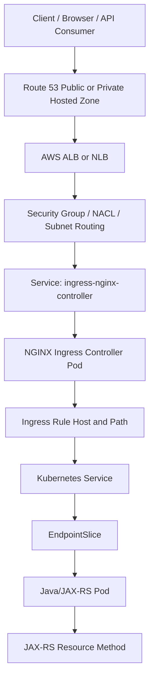

# Part 027 — AWS/EKS Traffic Flow with NGINX

## 1. Core Mental Model

Di AWS/EKS, NGINX jarang berdiri sebagai satu-satunya entry point. Biasanya NGINX berada di tengah rantai traffic:

```text
Client
  -> DNS / Route 53
  -> AWS Load Balancer layer: ALB or NLB
  -> EKS node or pod target
  -> NGINX Ingress Controller Service
  -> NGINX worker process
  -> Kubernetes Service
  -> EndpointSlice / Pod IP
  -> Java/JAX-RS application container
```

Mental model yang benar: **NGINX bukan “the load balancer” sendirian**, tetapi satu layer dalam chain yang bisa melibatkan DNS, public/private hosted zone, AWS ALB/NLB, target group, security group, subnet routing, Kubernetes Service, kube-proxy/eBPF dataplane, dan application runtime.

Kesalahan umum backend engineer adalah hanya melihat Ingress YAML dan mengira routing selesai di situ. Dalam production EKS, request bisa gagal jauh sebelum mencapai Ingress Controller.

## 2. AWS/EKS Layer Map

| Layer | Komponen AWS/EKS | Fungsi utama | Failure yang umum |
|---|---|---|---|
| DNS | Route 53 public/private hosted zone | Mengarahkan hostname ke LB DNS name | Wrong record, stale DNS, private/public zone mismatch |
| Edge LB | ALB/NLB | Entry point L7/L4 ke cluster | Listener salah, health check gagal, target unhealthy |
| Network boundary | Security Group, NACL, subnet, route table | Membuka/menutup jalur traffic | Port tertutup, subnet salah, asymmetric route |
| Cluster entry | Service type LoadBalancer/NodePort | Mengekspos controller ke AWS LB | Wrong annotation, wrong target type, wrong externalTrafficPolicy |
| Ingress runtime | NGINX Ingress Controller pod | Menerjemahkan Ingress menjadi NGINX config | Controller crash, bad annotation, config reload gagal |
| Kubernetes routing | Service, EndpointSlice, kube-proxy/CNI | Mengarahkan request ke Pod backend | Service selector salah, endpoint kosong, readiness gagal |
| Application | Java/JAX-RS service | Menangani HTTP/API logic | Timeout, redirect salah, header tidak dipercaya, 5xx |

## 3. Route 53 and DNS Entry Point

Route 53 biasanya memetakan domain publik atau internal ke DNS name load balancer AWS.

Contoh pola:

```text
api.example.com
  CNAME / Alias
  -> internal-xxx.elb.amazonaws.com
  -> NLB or ALB
```

Hal penting:

- Public hosted zone digunakan untuk endpoint yang reachable dari internet.
- Private hosted zone digunakan untuk endpoint internal VPC.
- Satu hostname bisa punya resolusi berbeda tergantung network asal client jika split-horizon DNS digunakan.
- DNS hanya tahu target LB, bukan apakah NGINX, Service, atau Pod sehat.

### Production Debugging Question

Saat ada user berkata “API tidak bisa diakses”, pertanyaan pertama bukan “aplikasinya down?” tetapi:

```text
Hostname resolve ke mana dari lokasi client tersebut?
```

Gunakan:

```bash
nslookup api.example.com

dig api.example.com

dig api.example.com @8.8.8.8

dig api.example.com @<internal-dns-resolver>
```

Bandingkan hasil dari:

- laptop developer,
- pod dalam cluster,
- bastion host,
- private network,
- external internet,
- synthetic monitor.

## 4. ALB vs NLB in Front of NGINX

Di EKS, NGINX Ingress Controller sering diekspos melalui AWS Load Balancer.

Ada dua pola besar:

```text
Client -> ALB -> NGINX Ingress -> Service -> Pod
```

atau:

```text
Client -> NLB -> NGINX Ingress -> Service -> Pod
```

### 4.1 ALB in Front of NGINX

ALB adalah L7 load balancer. Ia memahami HTTP/HTTPS, host, path, listener rule, TLS termination, WAF integration, dan header.

Jika ALB berada di depan NGINX, ada dua L7 routing layer:

```text
ALB L7 rule
  -> NGINX L7 rule
  -> Kubernetes Service
  -> Java/JAX-RS API
```

Kelebihan:

- Bisa terminate TLS di ALB.
- Bisa integrasi AWS WAF.
- Bisa host/path routing di ALB.
- Bisa memakai ACM certificate dengan mudah.

Risiko:

- Routing logic tersebar di ALB dan NGINX.
- Header seperti `X-Forwarded-For`, `X-Forwarded-Proto`, dan `Host` melewati beberapa layer.
- Timeout ALB dan timeout NGINX bisa tidak sejajar.
- Access log ALB dan NGINX perlu dikorelasikan.

### 4.2 NLB in Front of NGINX

NLB adalah L4 load balancer. Ia lebih cocok saat ingin mempertahankan karakteristik TCP/TLS lebih rendah, throughput tinggi, static IP/EIP, atau ketika NGINX sendiri menjadi L7 entry point utama.

Pola umum:

```text
Client -> NLB TCP/TLS -> NGINX Ingress Controller -> Service -> Pod
```

Kelebihan:

- L4 passthrough lebih sederhana untuk NGINX sebagai L7 authority.
- Umumnya cocok untuk high-throughput TCP/TLS forwarding.
- Bisa menggunakan Proxy Protocol untuk meneruskan informasi client connection.

Risiko:

- Jika TLS terminate di NGINX, certificate lifecycle ada di Kubernetes/NGINX layer.
- Jika client IP tidak dipertahankan atau Proxy Protocol tidak dikonfigurasi benar, backend melihat IP salah.
- Health check NLB harus diarahkan ke endpoint yang benar.
- L7 security seperti WAF tidak otomatis tersedia seperti ALB + WAF.

## 5. Target Group: Instance Target vs IP Target

AWS Load Balancer mengirim traffic ke target group. Untuk EKS, target bisa berupa:

```text
instance target:
  Load Balancer -> Node ENI / NodePort -> kube-proxy -> Pod

ip target:
  Load Balancer -> Pod IP directly, depending on controller/CNI capability
```

### 5.1 Instance Target

Traffic masuk ke node, biasanya melalui NodePort.

```text
NLB/ALB
  -> EKS node:NodePort
  -> NGINX Ingress Controller pod
```

Trade-off:

- Lebih klasik dan sering lebih mudah dipahami.
- Bisa ada hop tambahan dari node penerima ke pod di node lain.
- Source IP preservation bergantung pada konfigurasi Service, external traffic policy, dan LB behavior.

### 5.2 IP Target

Traffic diarahkan ke IP pod atau endpoint target secara lebih langsung.

Trade-off:

- Bisa mengurangi hop.
- Integrasi bergantung pada controller dan networking mode.
- Debugging target registration menjadi lebih penting.
- Security group behavior bisa berbeda tergantung target type dan CNI.

## 6. Security Group, NACL, and Subnet Reasoning

Di AWS, “Ingress resource benar” tidak berarti traffic bisa masuk.

Minimal chain yang harus terbuka:

```text
Client source
  -> Load Balancer listener port
  -> LB security group, if ALB
  -> Node / pod target security group
  -> NodePort or target port
  -> NGINX controller pod
  -> backend Service/pod port
```

Untuk NLB, behavior security group dapat berbeda tergantung mode dan konfigurasi. Untuk ALB, security group adalah boundary eksplisit di depan.

### Failure Pattern

| Symptom | Kemungkinan penyebab |
|---|---|
| DNS resolve benar, connection timeout | SG/NACL/subnet route issue |
| TLS handshake tidak sampai | Listener/certificate/security group issue |
| LB 503/target unhealthy | Target group health check gagal |
| NGINX tidak melihat request | LB tidak forward ke controller |
| NGINX 502/504 | Upstream Kubernetes/backend issue |

## 7. TLS Placement Patterns in AWS/EKS

### Pattern A — TLS Termination at ALB

```text
Client HTTPS
  -> ALB terminates TLS using ACM
  -> HTTP to NGINX
  -> HTTP to Java/JAX-RS
```

Kelebihan:

- Certificate lifecycle dikelola oleh ACM.
- WAF dan listener rule ALB mudah digunakan.

Risiko:

- NGINX dan backend menerima HTTP internal, kecuali re-encryption diaktifkan.
- Java/JAX-RS harus mempercayai `X-Forwarded-Proto: https` dari chain proxy yang valid.
- Jika header tidak benar, generated URL/redirect bisa menjadi `http://`.

### Pattern B — TLS Termination at NGINX

```text
Client HTTPS
  -> NLB TCP passthrough
  -> NGINX terminates TLS from Kubernetes Secret/cert-manager
  -> HTTP or HTTPS to backend
```

Kelebihan:

- NGINX menjadi L7 authority.
- Routing dan TLS config dekat dengan Kubernetes Ingress.

Risiko:

- Certificate lifecycle harus dikelola di cluster.
- TLS Secret/cert-manager menjadi dependency production.
- Debugging certificate chain pindah ke Kubernetes layer.

### Pattern C — TLS Re-Encryption

```text
Client HTTPS
  -> ALB/NLB TLS
  -> NGINX HTTPS
  -> Java/JAX-RS HTTPS
```

Kelebihan:

- Stronger internal encryption posture.
- Cocok untuk regulated/internal security-sensitive systems.

Risiko:

- Lebih banyak certificate, trust store, dan failure point.
- Internal CA, SAN, SNI, dan hostname verification harus rapi.
- Latency dan operational complexity bertambah.

## 8. Source IP Preservation

Source IP penting untuk:

- audit,
- fraud detection,
- rate limiting,
- geo/IP policy,
- abuse investigation,
- access log correlation,
- customer support troubleshooting.

Tapi di multi-proxy chain, source IP bisa hilang.

### Header Chain Example

```http
X-Forwarded-For: 203.0.113.10, 10.0.12.34, 10.0.22.56
X-Forwarded-Proto: https
X-Forwarded-Host: api.example.com
```

Yang harus dipahami:

- Kiri biasanya client original.
- Kanan biasanya proxy terakhir yang menambahkan header.
- Header ini bisa dipalsukan jika edge tidak membersihkan input dari untrusted client.
- Java/JAX-RS service tidak boleh blindly trust `X-Forwarded-For` kecuali request datang dari trusted proxy.

### Proxy Protocol

Jika NLB TCP digunakan dan NGINX perlu mengetahui client IP asli, Proxy Protocol v2 sering dipakai.

Konsepnya:

```text
NLB adds connection metadata
  -> NGINX listener expects proxy_protocol
  -> NGINX extracts real client address
```

Jika salah konfigurasi:

| Salah satu sisi | Dampak |
|---|---|
| NLB mengirim Proxy Protocol, NGINX tidak expect | Request terlihat invalid/broken |
| NGINX expect Proxy Protocol, NLB tidak mengirim | Connection gagal/parsing error |
| Real IP config tidak lengkap | Access log tetap menunjukkan IP proxy |

## 9. AWS Load Balancer Controller and Service/Ingress Annotations

AWS Load Balancer Controller dapat membuat AWS load balancer berdasarkan Kubernetes Service atau Ingress.

Mental model:

```text
Kubernetes manifest
  -> Controller watches resource
  -> AWS API call
  -> Load Balancer / Listener / Target Group / Rule created
  -> Status updated in Kubernetes resource
```

Artinya, production behavior sering dikendalikan oleh annotation.

Contoh hal yang biasanya dikendalikan annotation atau spec:

- scheme: internet-facing vs internal,
- load balancer type,
- target type,
- health check path/port/protocol,
- SSL/TLS certificate,
- backend protocol,
- source ranges,
- cross-zone behavior,
- target group attributes,
- proxy protocol.

### PR Review Concern

Annotation bukan komentar. Annotation adalah **infrastructure behavior**.

Perubahan satu annotation bisa mengubah:

- public vs private exposure,
- listener TLS,
- target registration,
- health check behavior,
- source IP visibility,
- timeout behavior,
- allowed CIDR.

## 10. Kubernetes Service Design for NGINX Ingress Controller

NGINX Ingress Controller biasanya diekspos sebagai Service:

```yaml
apiVersion: v1
kind: Service
metadata:
  name: ingress-nginx-controller
  namespace: ingress-nginx
spec:
  type: LoadBalancer
  externalTrafficPolicy: Local
  ports:
    - name: http
      port: 80
      targetPort: http
    - name: https
      port: 443
      targetPort: https
```

`externalTrafficPolicy: Local` sering digunakan untuk membantu mempertahankan source IP, tetapi ia punya trade-off:

- Hanya node yang punya endpoint lokal yang menerima traffic.
- Jika pod ingress tidak tersebar merata, target health bisa tidak seimbang.
- Deployment topology dan PDB menjadi penting.

`externalTrafficPolicy: Cluster` lebih fleksibel routing-nya, tetapi source IP bisa berubah karena SNAT di cluster path.

## 11. Health Check Design

AWS LB menentukan target sehat atau tidak berdasarkan health check.

Untuk NGINX Ingress Controller, health check idealnya diarahkan ke endpoint yang merepresentasikan readiness controller, bukan endpoint aplikasi tertentu yang berubah-ubah.

Bad pattern:

```text
LB health check -> /api/orders/health
```

Jika service Orders down, seluruh ingress controller bisa dianggap unhealthy padahal controller masih bisa melayani route lain.

Better pattern:

```text
LB health check -> NGINX controller health endpoint
```

Lalu health aplikasi dicek melalui observability/backend readiness masing-masing.

## 12. Java/JAX-RS Impact

NGINX dan AWS LB memengaruhi Java/JAX-RS backend pada area berikut.

### 12.1 Scheme Detection

Jika TLS terminate sebelum aplikasi:

```text
Client sees: https://api.example.com
Backend sees: http://orders-service:8080
```

Aplikasi harus memakai trusted forwarded header untuk memahami original scheme.

Risiko:

- redirect ke HTTP,
- generated absolute URL salah,
- secure cookie tidak diset,
- callback URL OAuth/OIDC salah,
- HATEOAS link salah.

### 12.2 Client IP

Jika Java service memakai IP untuk audit/rate limit, ia harus memahami chain proxy.

Jangan pakai remote address container mentah sebagai client identity tanpa memeriksa chain proxy.

### 12.3 Timeout

AWS LB timeout, NGINX timeout, Java server timeout, database timeout, dan client timeout harus kompatibel.

```text
Client timeout > LB idle timeout > NGINX proxy_read_timeout > Java request timeout > DB query timeout
```

Urutan ini bukan hukum universal, tetapi menggambarkan kebutuhan desain: failure harus terjadi di layer yang paling informatif dan aman.

## 13. Observability Across AWS and NGINX

Untuk debugging production, gabungkan:

- Route 53 query logging jika relevan,
- ALB/NLB metrics,
- ALB access logs jika ALB dipakai,
- target group health,
- NGINX access/error logs,
- ingress controller metrics,
- Kubernetes events,
- Service/EndpointSlice state,
- Java/JAX-RS application logs,
- distributed traces,
- CloudWatch dashboards/alarms.

### Minimum Correlation Fields

NGINX log sebaiknya punya:

```text
request_id
traceparent
remote_addr
realip_remote_addr
x_forwarded_for
host
request_uri
status
request_time
upstream_addr
upstream_status
upstream_response_time
http_user_agent
```

ALB log dan NGINX log perlu dikorelasikan menggunakan timestamp, client IP, host, path, request ID, dan trace header jika ada.

## 14. Common AWS/EKS Routing Failures

### 14.1 DNS Points to Old Load Balancer

Symptom:

- Beberapa client kena endpoint lama.
- Deployment baru terlihat benar, tapi traffic tidak sampai.

Check:

```bash
dig api.example.com
kubectl get svc -n ingress-nginx ingress-nginx-controller
```

Verifikasi apakah DNS record masih menunjuk ke LB lama.

### 14.2 Target Group Unhealthy

Symptom:

- ALB/NLB return 503.
- NGINX pod tidak menerima request.

Check:

- target group health,
- health check path/port/protocol,
- Service NodePort,
- security group,
- ingress controller readiness,
- `externalTrafficPolicy` behavior.

### 14.3 NGINX Returns 502

Symptom:

- NGINX menerima request tetapi upstream gagal.

Possible root cause:

- Service endpoint kosong,
- pod not ready,
- wrong service port,
- backend closes connection,
- protocol mismatch HTTP vs HTTPS,
- Java process crash/restart,
- upstream keepalive stale connection.

### 14.4 NGINX Returns 504

Symptom:

- Request sampai ke upstream tetapi response tidak selesai sesuai timeout.

Possible root cause:

- Java/JAX-RS endpoint lambat,
- DB query lambat,
- thread pool saturated,
- downstream dependency lambat,
- `proxy_read_timeout` terlalu rendah,
- LB idle timeout lebih pendek dari expected request duration.

### 14.5 Client IP Missing

Symptom:

- Access log hanya menunjukkan node IP, LB IP, atau proxy IP.

Check:

- NLB/ALB mode,
- Proxy Protocol,
- `externalTrafficPolicy`,
- real IP config NGINX,
- `X-Forwarded-For` handling,
- trusted proxy CIDR.

### 14.6 TLS Certificate Mismatch

Symptom:

- Browser/curl mengatakan certificate tidak cocok.

Check:

- TLS termination layer,
- SNI hostname,
- ALB listener certificate,
- Kubernetes TLS Secret,
- Ingress `tls.hosts`,
- certificate SAN,
- default certificate.

## 15. Debugging Flow: From Outside to Inside

Gunakan urutan debugging yang tidak melompat langsung ke aplikasi.

```text
1. DNS
2. TCP reachability
3. TLS handshake
4. AWS LB listener
5. AWS target group health
6. Security group / subnet / route table
7. NGINX controller Service
8. NGINX access/error log
9. Ingress rule match
10. Kubernetes Service and EndpointSlice
11. Pod readiness
12. Java/JAX-RS logs and metrics
13. Downstream dependency
```

### Command Set

```bash
# DNS
nslookup api.example.com
dig api.example.com

# TLS
openssl s_client -connect api.example.com:443 -servername api.example.com

# HTTP
curl -vk https://api.example.com/health
curl -vk -H 'Host: api.example.com' https://<lb-dns-or-ip>/health

# Kubernetes ingress/controller
kubectl get ingress -A
kubectl get ingressclass
kubectl get svc -n ingress-nginx
kubectl get endpointslice -A | grep <service-name>
kubectl logs -n ingress-nginx deploy/ingress-nginx-controller

# Backend
kubectl get pods -n <namespace> -o wide
kubectl describe pod -n <namespace> <pod>
kubectl logs -n <namespace> <pod>
```

## 16. AWS/EKS Traffic Flow Diagram



## 17. Architecture Review Checklist

Saat mereview perubahan AWS/EKS + NGINX, tanyakan:

1. Hostname public/private mana yang berubah?
2. Route 53 record menunjuk ke LB mana?
3. ALB atau NLB yang dipakai? Kenapa?
4. TLS terminate di mana?
5. Certificate dikelola oleh ACM, Kubernetes Secret, cert-manager, atau internal CA?
6. Target type instance atau IP?
7. Health check path/port/protocol benar?
8. Source IP harus dipertahankan atau tidak?
9. Proxy Protocol digunakan atau tidak?
10. Security group dan subnet exposure sesuai?
11. Service controller memakai `externalTrafficPolicy` apa?
12. Ingress rule host/path cocok dengan public URL?
13. Timeout LB, NGINX, dan aplikasi sudah konsisten?
14. Access log ALB/NGINX dan app log bisa dikorelasikan?
15. Rollback path jelas jika LB/Ingress annotation salah?

## 18. Internal Verification Checklist

Verifikasi di internal CSG/team, jangan diasumsikan:

- Apakah environment memakai AWS/EKS untuk workload Quote & Order tertentu?
- Apakah entry point menggunakan ALB, NLB, API Gateway, CloudFront, atau kombinasi?
- Apakah NGINX Ingress Controller digunakan, dan varian mana?
- Apakah AWS Load Balancer Controller digunakan?
- Apakah DNS dikelola via Route 53, external-dns, Terraform, atau proses manual?
- Apakah certificate berasal dari ACM, cert-manager, Vault, atau internal CA?
- Apakah TLS terminate di ALB, NGINX, backend, atau beberapa layer?
- Apakah source IP preservation dibutuhkan untuk audit/rate limit/security?
- Apakah Proxy Protocol aktif?
- Apakah ada AWS WAF di depan ALB/CloudFront?
- Apakah target group health check diarahkan ke endpoint controller atau aplikasi?
- Apakah ada dashboard CloudWatch untuk LB dan dashboard Prometheus/Grafana untuk Ingress?
- Apakah runbook 502/503/504 sudah mencakup AWS target group dan Kubernetes endpoint?
- Apakah PR perubahan Ingress annotation harus direview oleh platform/SRE?

## 19. Failure-Oriented Summary

Di AWS/EKS, failure routing sering bukan satu bug, melainkan mismatch antar layer:

```text
DNS benar, tetapi LB salah.
LB benar, tetapi target group unhealthy.
Target group sehat, tetapi NGINX route salah.
NGINX route benar, tetapi Service endpoint kosong.
Service endpoint ada, tetapi Java timeout.
Java response benar, tetapi proxy timeout lebih pendek.
```

Senior engineer harus bisa membaca chain ini dari luar ke dalam dan dari dalam ke luar.

## 20. Official References

- [Amazon EKS — Route TCP and UDP traffic with Network Load Balancers](https://docs.aws.amazon.com/eks/latest/userguide/network-load-balancing.html)
- [Amazon EKS — AWS Load Balancer Controller](https://docs.aws.amazon.com/eks/latest/userguide/aws-load-balancer-controller.html)
- [Elastic Load Balancing — Network Load Balancer target group attributes](https://docs.aws.amazon.com/elasticloadbalancing/latest/network/edit-target-group-attributes.html)
- [AWS Networking Blog — Proxy Protocol v2 with Network Load Balancer](https://aws.amazon.com/blogs/networking-and-content-delivery/preserving-client-ip-address-with-proxy-protocol-v2-and-network-load-balancer/)
