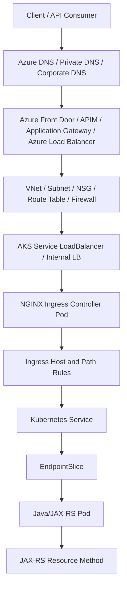

# Part 028 — Azure/AKS Traffic Flow with NGINX

## 1. Core Mental Model

Di Azure/AKS, NGINX biasanya berada dalam chain traffic yang melibatkan beberapa komponen Azure:

```text
Client
  -> Azure DNS or external DNS
  -> Azure Front Door / Application Gateway / Azure Load Balancer / Azure API Management
  -> VNet / subnet / NSG / route table
  -> AKS node or internal load balancer
  -> NGINX Ingress Controller Service
  -> NGINX worker process
  -> Kubernetes Service
  -> EndpointSlice / Pod IP
  -> Java/JAX-RS backend
```

Mental model yang harus dibangun: **AKS ingress bukan hanya YAML Ingress**. Production traffic path bisa melewati global edge, regional L7 gateway, internal load balancer, private endpoint, hub-spoke VNet, firewall, NSG, dan NGINX Ingress Controller.

Kesalahan paling mahal biasanya terjadi saat tim hanya memeriksa Ingress resource, padahal request gagal di Azure Front Door, Application Gateway, NSG, private DNS, atau internal load balancer.

## 2. Azure/AKS Layer Map

| Layer | Komponen Azure/AKS | Fungsi utama | Failure umum |
|---|---|---|---|
| DNS | Azure DNS, private DNS zone, external DNS | Resolve hostname ke edge/gateway/LB | Wrong zone, split DNS mismatch, stale record |
| Global edge | Azure Front Door | Global entry, TLS, WAF, routing ke origin | Origin unhealthy, host header mismatch, WAF block |
| Regional L7 | Application Gateway / AGIC | L7 reverse proxy, TLS, WAF, path/host routing | Listener/rule/cert/backend pool salah |
| API edge | Azure API Management | API policy, auth, throttling, transformation | Policy block, backend URL salah, timeout |
| L4 cluster entry | Azure Load Balancer | Expose Service LoadBalancer ke AKS | Probe gagal, frontend IP salah, backend pool issue |
| Network boundary | VNet, subnet, NSG, route table, Azure Firewall | Control path network | Port tertutup, route salah, forced tunneling issue |
| Ingress runtime | NGINX Ingress Controller | L7 routing ke Service | Bad annotation, config reload gagal, controller unhealthy |
| Kubernetes routing | Service, EndpointSlice, Pod IP | Service discovery internal | Endpoint kosong, selector salah, readiness gagal |
| Application | Java/JAX-RS service | Business/API processing | Timeout, 5xx, header trust issue, bad redirect |

## 3. Azure Entry Point Patterns

### Pattern A — Azure Load Balancer Directly to NGINX Ingress

```text
Client
  -> Azure Load Balancer
  -> Service type LoadBalancer for NGINX Ingress Controller
  -> NGINX
  -> Kubernetes Service
  -> Java/JAX-RS Pod
```

Ini pola paling dekat dengan Kubernetes-native ingress.

Kelebihan:

- Simpler than multi-layer L7 chain.
- NGINX menjadi main L7 routing layer.
- Cocok untuk internal/private ingress atau public ingress sederhana.

Risiko:

- L7 WAF/policy tidak otomatis tersedia di Azure Load Balancer.
- TLS/certificate lifecycle sering pindah ke NGINX/Kubernetes Secret/cert-manager.
- Observability Azure Load Balancer tidak sedetail L7 access log Application Gateway/Front Door.

### Pattern B — Application Gateway in Front of NGINX

```text
Client
  -> Application Gateway
  -> AKS internal LoadBalancer / NGINX Ingress
  -> Service
  -> Pod
```

Application Gateway adalah L7 load balancer/reverse proxy Azure yang dapat melakukan TLS termination, WAF, host/path routing, dan health probing.

Kelebihan:

- WAF integration.
- TLS cert dapat dikelola di gateway layer.
- L7 access log dan rule management di Azure.

Risiko:

- Dua L7 routing layer: Application Gateway dan NGINX.
- Timeout, path rewrite, host header, dan health probe bisa konflik.
- Jika Application Gateway dan NGINX sama-sama melakukan rewrite, debugging menjadi sulit.

### Pattern C — Application Gateway Ingress Controller Without Separate NGINX

```text
Client
  -> Application Gateway
  -> AKS Service/Pod backend managed by AGIC
```

Dalam pola ini, Application Gateway Ingress Controller dapat mengonfigurasi Application Gateway dari Kubernetes Ingress. NGINX mungkin tidak digunakan sebagai ingress layer.

Kapan relevan:

- Platform ingin standardisasi pada Application Gateway + WAF.
- Ingress layer dikelola secara native Azure.
- NGINX tidak dibutuhkan sebagai L7 proxy tambahan.

Review concern:

- Jangan mengasumsikan semua AKS ingress memakai NGINX.
- Verifikasi IngressClass dan controller aktif.

### Pattern D — Azure Front Door in Front of Regional AKS

```text
Client
  -> Azure Front Door
  -> Private Link / public origin / Application Gateway / internal LB
  -> AKS NGINX Ingress
  -> Java/JAX-RS Service
```

Azure Front Door sering dipakai sebagai global edge untuk:

- global routing,
- TLS termination,
- WAF,
- CDN-like acceleration,
- origin failover,
- private origin access melalui Private Link pada pattern tertentu.

Risiko:

- Host header ke origin harus benar.
- TLS ke origin harus cocok dengan certificate/SNI expected by origin.
- Origin health probe bisa berbeda dari real API path.
- WAF block bisa disalahartikan sebagai aplikasi down.

### Pattern E — Azure API Management in Front of AKS

```text
Client
  -> Azure API Management
  -> Application Gateway / internal LB / NGINX Ingress
  -> Java/JAX-RS API
```

APIM biasanya digunakan saat kebutuhan utama adalah API productization:

- subscription,
- auth policy,
- quota/rate limit,
- request/response transformation,
- developer portal,
- API versioning,
- governance.

Risiko:

- Policy APIM bisa mengubah header/body/status.
- Timeout APIM dan NGINX harus sinkron.
- Auth boundary harus jelas antara APIM, NGINX, dan Java/JAX-RS service.

## 4. Public vs Private AKS Ingress

### Public Ingress

```text
Internet client -> public Azure LB/Application Gateway/Front Door -> AKS
```

Concern:

- Public IP exposure,
- WAF requirement,
- TLS certificate source,
- DDoS/network protection,
- access log retention,
- allowed hostnames,
- default backend behavior.

### Private Ingress

```text
Internal client / corporate network
  -> private DNS
  -> internal load balancer / private Application Gateway
  -> AKS NGINX Ingress
```

Concern:

- Private DNS zone linkage,
- VNet peering,
- hub-spoke routing,
- NSG and UDR,
- Azure Firewall,
- VPN/ExpressRoute,
- private endpoint/private link behavior.

Private ingress failures are often DNS or network path problems, not NGINX problems.

## 5. Azure DNS and Private DNS

Azure traffic path starts with DNS. In AKS environments, you may see:

- public Azure DNS zone,
- private DNS zone,
- corporate DNS forwarder,
- split-horizon DNS,
- external DNS automation,
- manually managed DNS records.

### Debugging Questions

```text
Does api.example.com resolve differently from public internet and corporate network?
Does the private DNS zone link to the correct VNet?
Does AKS use private cluster DNS behavior?
Does the record point to Front Door, Application Gateway, Load Balancer, or old IP?
```

Useful commands:

```bash
nslookup api.example.com

dig api.example.com

kubectl run -it dns-debug --image=busybox:1.36 --restart=Never -- nslookup api.example.com
```

## 6. VNet, Subnet, NSG, Route Table, and Firewall

In Azure, traffic can fail due to network controls before it reaches NGINX.

Core components:

- VNet,
- subnet,
- Network Security Group,
- User Defined Route,
- Azure Firewall,
- NAT Gateway,
- Private Endpoint,
- Private Link,
- peering,
- ExpressRoute/VPN.

### Failure Reasoning

| Symptom | Possible layer |
|---|---|
| DNS resolves but TCP timeout | NSG, route table, firewall, private endpoint, peering |
| Application Gateway says backend unhealthy | Probe path/host/protocol, NSG, backend pool, NGINX readiness |
| Front Door says origin unavailable | Origin host header, TLS/SNI, Private Link, health probe |
| NGINX has no access log | Request did not reach NGINX; check Azure edge/network layer |
| NGINX 502/504 | Request reached NGINX; check Kubernetes/backend layer |

## 7. TLS Placement Patterns in Azure/AKS

### Pattern A — TLS Termination at Azure Front Door

```text
Client HTTPS
  -> Azure Front Door terminates TLS
  -> HTTPS or HTTP to origin
  -> NGINX / Application Gateway / AKS
```

Kelebihan:

- Global TLS edge.
- WAF at edge.
- Possible origin protection pattern.

Risiko:

- Origin host header and certificate must align.
- If Front Door re-encrypts to origin, origin certificate validation matters.
- `X-Forwarded-Proto` and original host must be trusted correctly downstream.

### Pattern B — TLS Termination at Application Gateway

```text
Client HTTPS
  -> Application Gateway terminates TLS
  -> HTTP or HTTPS to NGINX
  -> Service
  -> Pod
```

Kelebihan:

- Central regional L7 TLS and WAF.
- Good fit for enterprise controlled ingress.

Risiko:

- NGINX may see internal HTTP unless re-encryption is used.
- Java/JAX-RS service must use forwarded headers correctly.
- Application Gateway probe and NGINX route need alignment.

### Pattern C — TLS Termination at NGINX

```text
Client HTTPS
  -> Azure Load Balancer TCP
  -> NGINX terminates TLS using Kubernetes Secret
  -> HTTP or HTTPS backend
```

Kelebihan:

- Kubernetes-native cert-manager pattern.
- NGINX controls TLS and routing together.

Risiko:

- Certificate rotation and secret management are cluster dependencies.
- If public, WAF must be placed elsewhere.
- Troubleshooting certificate mismatch occurs at NGINX/Ingress layer.

### Pattern D — End-to-End TLS

```text
Client HTTPS
  -> Front Door/Application Gateway HTTPS
  -> NGINX HTTPS
  -> Java/JAX-RS HTTPS
```

Kelebihan:

- Strong internal encryption model.
- Better fit for regulated/high-control environments.

Risiko:

- More certificates.
- More trust stores.
- More SNI/SAN/CA failure modes.
- More complex rotation.

## 8. Application Gateway vs NGINX Ingress Controller

Do not treat Application Gateway and NGINX as interchangeable. They can overlap, but their operational models differ.

| Dimension | Application Gateway | NGINX Ingress Controller |
|---|---|---|
| Runs where | Azure-managed gateway resource | Pods inside AKS |
| Config source | Azure resource, AGIC, IaC | Kubernetes Ingress/ConfigMap/annotations |
| WAF | Native WAF option | External WAF/ModSecurity depending setup |
| Scaling | Azure gateway SKU/capacity | Pod replicas/resources/HPA |
| Logs | Azure diagnostic logs | Pod logs/Prometheus/exporter |
| Failure owner | Azure/network/platform | Kubernetes/platform/application team |
| Routing expressiveness | Azure listener/rule model | NGINX config + annotations |

### Architecture Rule

Jika Application Gateway dan NGINX sama-sama dipakai, tentukan dengan tegas:

```text
Which layer owns host routing?
Which layer owns path routing?
Which layer owns TLS?
Which layer owns WAF?
Which layer owns auth/rate limit?
Which layer owns rewrites?
Which layer emits source-of-truth access logs?
```

Tanpa boundary ini, incident debugging menjadi saling lempar antar layer.

## 9. Source IP and Forwarded Headers

Dengan Azure Front Door, Application Gateway, APIM, Load Balancer, dan NGINX, request bisa membawa beberapa header forwarding.

Typical headers:

```http
X-Forwarded-For: 203.0.113.10, 10.1.2.3
X-Forwarded-Proto: https
X-Forwarded-Host: api.example.com
X-Original-Host: api.example.com
Forwarded: for=203.0.113.10;proto=https;host=api.example.com
```

Rules:

- Jangan percaya forwarded header dari public client.
- Edge layer harus membersihkan atau overwrite untrusted forwarding headers.
- NGINX harus dikonfigurasi untuk trust hanya CIDR proxy internal.
- Java/JAX-RS backend harus hanya trust header dari known proxy chain.

### Failure Mode

Jika `X-Forwarded-Proto` hilang atau salah:

- redirect jadi HTTP,
- generated URL salah,
- OAuth callback mismatch,
- secure cookie behavior salah,
- Swagger/OpenAPI server URL salah,
- HATEOAS link salah.

## 10. Health Probe Design

Azure components seperti Application Gateway dan Load Balancer memakai probe untuk menentukan backend healthy.

Bad pattern:

```text
Gateway probe -> /api/orders/deep-health
```

Kenapa buruk:

- Jika dependency Orders lambat, gateway bisa menganggap seluruh ingress unhealthy.
- Probe menjadi terlalu mahal.
- Probe path bisa butuh auth atau tenant context.

Better pattern:

```text
Gateway probe -> NGINX/Ingress controller readiness endpoint
Application health -> monitored separately via service readiness/metrics
```

Untuk route aplikasi tertentu, synthetic monitoring bisa memeriksa end-to-end behavior tanpa dijadikan LB health probe utama.

## 11. AKS Service and NGINX Controller Exposure

NGINX Ingress Controller di AKS biasanya diekspos via Service:

```yaml
apiVersion: v1
kind: Service
metadata:
  name: ingress-nginx-controller
  namespace: ingress-nginx
  annotations:
    service.beta.kubernetes.io/azure-load-balancer-internal: "true"
spec:
  type: LoadBalancer
  externalTrafficPolicy: Local
  ports:
    - name: http
      port: 80
      targetPort: http
    - name: https
      port: 443
      targetPort: https
```

Catatan:

- Annotation internal LB harus diverifikasi sesuai AKS/cloud provider behavior yang dipakai.
- `externalTrafficPolicy: Local` bisa membantu source IP preservation, tetapi memerlukan pod ingress tersedia di node target.
- Public/private exposure harus direview ketat.

## 12. Private Link and Private Endpoint Considerations

Private Link/Private Endpoint dapat membuat origin atau service hanya reachable secara private.

Potential path:

```text
Front Door Premium
  -> Private Link Service
  -> internal load balancer
  -> AKS NGINX Ingress
```

Concern:

- DNS harus resolve ke private address pada network yang tepat.
- Approval state Private Endpoint/Private Link harus benar.
- NSG/firewall/UDR bisa memblokir traffic.
- TLS certificate harus cocok dengan hostname yang digunakan oleh edge/origin.
- Health probe source dan route harus diizinkan.

## 13. Java/JAX-RS Backend Impact

### 13.1 Host and Scheme Awareness

Jika request publik:

```text
https://quote.example.com/orders/123
```

Tetapi backend menerima:

```text
http://orders-service.namespace.svc.cluster.local:8080/orders/123
```

Maka Java/JAX-RS app perlu memahami original host/scheme dari trusted proxy headers.

Jika tidak:

- absolute links salah,
- redirect salah,
- generated URI dari `UriInfo` salah,
- OpenAPI docs mengarah ke service internal,
- secure cookie policy rusak.

### 13.2 Auth Boundary

Jika APIM/Application Gateway/Front Door melakukan auth atau WAF, aplikasi tetap harus tahu:

- apakah request sudah authenticated,
- header identity apa yang dipercaya,
- siapa yang boleh menambahkan header tersebut,
- apakah NGINX membersihkan spoofed identity header dari luar,
- apakah authorization tetap dilakukan di aplikasi.

### 13.3 Timeout Stack

Azure Front Door, Application Gateway, APIM, NGINX, Java server, DB, Kafka, dan downstream dependency semua punya timeout.

Review:

```text
Client timeout
Azure edge timeout
Application Gateway/APIM timeout
NGINX proxy timeout
Java server request timeout
HTTP client timeout inside Java
DB/Kafka/downstream timeout
```

Timeout yang tidak sejajar menghasilkan symptom yang membingungkan: client melihat gateway timeout, NGINX melihat client closed request, aplikasi tetap bekerja, database masih running.

## 14. Observability in Azure/AKS + NGINX

Minimum observability sources:

- Azure Front Door logs jika digunakan,
- Application Gateway access/performance/firewall logs,
- Azure Load Balancer metrics/probe health,
- Azure Monitor metrics,
- AKS control plane/resource logs,
- NGINX access/error logs,
- ingress controller metrics,
- Kubernetes events,
- Service/EndpointSlice state,
- Java/JAX-RS application logs,
- distributed tracing,
- synthetic probes.

### Correlation Fields

NGINX log sebaiknya punya:

```text
request_id
traceparent
remote_addr
realip_remote_addr
x_forwarded_for
host
request_uri
status
request_time
upstream_addr
upstream_status
upstream_response_time
```

Jika Azure edge menambahkan request ID, pastikan header itu dipertahankan atau dipetakan ke correlation ID internal.

## 15. Common Azure/AKS Routing Failures

### 15.1 Private DNS Zone Not Linked

Symptom:

- Dari satu VNet resolve benar, dari VNet lain gagal.
- Public internet resolve ke record berbeda.

Check:

- private DNS zone link,
- corporate DNS forwarding,
- split-horizon rule,
- record target.

### 15.2 Application Gateway Backend Unhealthy

Symptom:

- Gateway return 502/503-like behavior.
- NGINX tidak menerima request normal.

Possible root cause:

- probe path salah,
- probe host header salah,
- backend certificate mismatch,
- NSG blocking,
- internal LB not reachable,
- NGINX readiness endpoint tidak expose path expected.

### 15.3 Front Door Origin Unhealthy

Symptom:

- Global endpoint gagal, regional ingress normal jika diakses langsung.

Possible root cause:

- origin host header mismatch,
- TLS/SNI mismatch,
- private link issue,
- WAF block,
- health probe path fails,
- origin timeout.

### 15.4 NGINX 404 but Gateway Healthy

Symptom:

- Azure edge berhasil mencapai NGINX.
- NGINX tidak menemukan host/path rule.

Possible root cause:

- Host header diubah oleh Front Door/Application Gateway/APIM,
- Ingress host tidak cocok,
- path rewrite di edge dan NGINX double-applied,
- default backend menangkap request.

### 15.5 Java Redirect to Internal Host

Symptom:

- Client mendapat redirect ke `http://orders-service:8080/...` atau host internal.

Possible root cause:

- `X-Forwarded-Host` hilang,
- `X-Forwarded-Proto` hilang,
- backend tidak dikonfigurasi untuk trusted proxy,
- NGINX overwrite header salah,
- APIM/Application Gateway mengubah Host header tanpa kompensasi.

### 15.6 Timeout Ambiguity

Symptom:

- Client melihat timeout di edge.
- NGINX log menunjukkan 499 atau 504.
- Java log menunjukkan request selesai setelah client gone.

Possible root cause:

- Edge timeout lebih pendek dari backend processing.
- NGINX timeout lebih pendek dari Java timeout.
- Java thread pool saturation.
- DB/downstream dependency slow.

## 16. Debugging Flow: Azure Outside-In

```text
1. DNS resolution from client network
2. Azure edge resource: Front Door / App Gateway / APIM / Load Balancer
3. Listener/frontend IP/certificate
4. WAF/policy decision
5. Backend pool/origin health
6. VNet/subnet/NSG/route/firewall
7. AKS Service LoadBalancer/internal LB
8. NGINX Ingress Controller logs and metrics
9. Ingress rule host/path match
10. Kubernetes Service and EndpointSlice
11. Pod readiness and logs
12. Java/JAX-RS request handling
13. Downstream dependencies
```

### Useful Commands

```bash
# DNS
nslookup api.example.com
dig api.example.com

# TLS
openssl s_client -connect api.example.com:443 -servername api.example.com

# HTTP and host behavior
curl -vk https://api.example.com/health
curl -vk -H 'Host: api.example.com' https://<gateway-or-lb-ip>/health

# Kubernetes
kubectl get ingress -A
kubectl get ingressclass
kubectl get svc -A | grep -i ingress
kubectl get endpointslice -A | grep <service-name>
kubectl logs -n ingress-nginx deploy/ingress-nginx-controller
kubectl describe ingress -n <namespace> <ingress-name>

# Backend
kubectl get pods -n <namespace> -o wide
kubectl describe pod -n <namespace> <pod>
kubectl logs -n <namespace> <pod>
```

## 17. Azure/AKS Traffic Flow Diagram



## 18. Architecture Review Checklist

Saat mereview perubahan Azure/AKS + NGINX, tanyakan:

1. Entry point apa yang dipakai: Front Door, Application Gateway, APIM, Azure Load Balancer, atau kombinasi?
2. Apakah NGINX benar-benar ingress controller yang aktif?
3. IngressClass mana yang menangani resource tersebut?
4. DNS public/private resolve ke mana?
5. Private DNS zone sudah linked ke VNet yang benar?
6. TLS terminate di layer mana?
7. Certificate disimpan di mana: Key Vault, App Gateway, Front Door, Kubernetes Secret, cert-manager, atau internal CA?
8. Apakah ada re-encryption ke NGINX atau backend?
9. Host header dipertahankan atau diubah?
10. Apakah path rewrite terjadi di lebih dari satu layer?
11. Health probe diarahkan ke endpoint yang benar?
12. NSG/route/firewall mengizinkan traffic probe dan production traffic?
13. Source IP/original client identity masih terlihat?
14. Timeout Azure edge, NGINX, dan Java sudah konsisten?
15. Log Azure edge, NGINX, dan aplikasi bisa dikorelasikan?
16. WAF/APIM policy bisa menjelaskan 401/403/429/5xx yang muncul?
17. Rollback path jelas jika gateway/ingress config salah?

## 19. Internal Verification Checklist

Verifikasi di internal CSG/team, jangan diasumsikan:

- Apakah workload Quote & Order tertentu berjalan di Azure/AKS?
- Apakah entry point memakai Azure Front Door, Application Gateway, Azure API Management, Azure Load Balancer, atau NGINX langsung?
- Apakah Application Gateway Ingress Controller digunakan sebagai pengganti NGINX Ingress?
- Apakah ada lebih dari satu ingress controller di cluster?
- Apakah IngressClass dipakai eksplisit?
- Apakah DNS dikelola oleh Azure DNS, external-dns, Terraform, atau proses manual?
- Apakah endpoint public, private, atau hybrid?
- Apakah Private Link/Private Endpoint dipakai?
- Apakah certificate lifecycle dikelola oleh Key Vault, Application Gateway, Front Door, cert-manager, atau internal CA?
- Apakah WAF berada di Front Door/Application Gateway atau layer lain?
- Apakah APIM melakukan auth/rate limit/transformation sebelum request masuk ke NGINX?
- Apakah Host/X-Forwarded headers dibersihkan dan ditetapkan di layer yang benar?
- Apakah Java/JAX-RS service dikonfigurasi untuk trusted proxy headers?
- Apakah runbook 502/503/504 mencakup Application Gateway/Front Door/APIM health dan logs?
- Apakah observability dashboard menghubungkan Azure edge metrics, NGINX logs, Kubernetes events, dan app metrics?

## 20. Failure-Oriented Summary

Di Azure/AKS, routing issue sering berupa mismatch antara edge Azure dan Kubernetes ingress:

```text
DNS resolve benar, tetapi private zone salah.
Front Door sehat, tetapi origin host header salah.
Application Gateway hidup, tetapi backend pool unhealthy.
Azure Load Balancer reachable, tetapi NSG memblokir.
NGINX menerima request, tetapi Ingress host/path tidak match.
Ingress match, tetapi Service endpoint kosong.
Backend menjawab, tetapi timeout edge lebih pendek.
```

Senior engineer tidak cukup hanya membaca YAML. Ia harus bisa membaca **network path, proxy path, TLS path, and observability path** sebagai satu sistem.

## 21. Official References

- [Azure Kubernetes Service documentation](https://learn.microsoft.com/en-us/azure/aks/)
- [Ingress networking in Azure Kubernetes Service](https://learn.microsoft.com/en-us/azure/aks/concepts-network-ingress)
- [Managed NGINX ingress with the AKS application routing add-on](https://learn.microsoft.com/en-us/azure/aks/app-routing)
- [Azure Front Door with AKS architecture example](https://learn.microsoft.com/en-us/azure/architecture/example-scenario/aks-front-door/aks-front-door)
- [End-to-end TLS with AKS, Azure Front Door, and Private Link sample](https://learn.microsoft.com/en-us/samples/azure-samples/aks-front-door-end-to-end-tls/aks-front-door-end-to-end-tls/)
