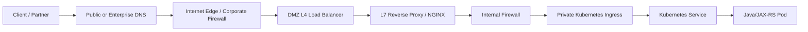

# Part 029 — On-Prem and Hybrid Traffic Flow

## 1. Core Mental Model

On-prem dan hybrid deployment jarang sesederhana:

```text
Client -> NGINX -> Java/JAX-RS service
```

Di enterprise environment, request biasanya melewati banyak boundary:

```text
Client / Partner / Internal User
  -> Public DNS / Enterprise DNS / Split-Horizon DNS
  -> CDN / External WAF / Internet Edge
  -> Corporate Firewall
  -> DMZ Load Balancer
  -> L7 Reverse Proxy / NGINX / F5 / HAProxy / Apache / Appliance
  -> Internal Firewall
  -> Private Kubernetes / VM Platform / OpenShift / Bare Metal
  -> NGINX Ingress Controller
  -> Kubernetes Service
  -> Pod / Java/JAX-RS backend
  -> Database / downstream service / message broker
```

Mental model utama: **NGINX di on-prem/hybrid bukan satu-satunya traffic layer**. Ia sering menjadi salah satu node dalam chain yang lebih panjang: DNS, firewall, WAF, L4 load balancer, L7 proxy, ingress controller, service mesh, egress proxy, dan internal identity layer.

Failure besar sering terjadi karena engineer hanya memeriksa NGINX config, padahal request berhenti di firewall, DNS private zone, TLS inspection proxy, internal CA, proxy chain, atau route table.

## 2. Why On-Prem and Hybrid Are Harder Than Pure Cloud

Cloud-managed environments cenderung punya API standar untuk melihat Load Balancer, target group, security group, certificate, dan logs. On-prem/hybrid sering lebih opaque.

| Area | Pure cloud tendency | On-prem/hybrid tendency | Debugging impact |
|---|---|---|---|
| DNS | Central cloud DNS APIs | Enterprise DNS, split-horizon, delegated zones | Hostname bisa resolve berbeda tergantung network |
| Load balancer | Managed ALB/NLB/Application Gateway | F5, Citrix ADC, HAProxy, hardware LB, internal NGINX | Health behavior dan header behavior harus diverifikasi |
| Firewall | Security group/NSG visible in cloud console | Multiple firewall zones and manual rules | Port/path bisa blocked tanpa obvious app log |
| TLS | ACM/Key Vault/cert-manager | Internal CA, HSM, appliance termination | Chain trust dan rotation bisa sulit dilacak |
| Network path | VPC/VNet route tables | DMZ, MPLS, VPN, ExpressRoute, proxy chain | Asymmetric routing lebih mungkin terjadi |
| Observability | Central cloud metrics/logs | Fragmented tools across teams | Root cause butuh cross-team evidence |
| Ownership | Platform/cloud team | Network, security, platform, app, vendor | Diagnosis butuh explicit ownership map |

Dalam sistem seperti quote/order atau CPQ enterprise, request path bisa berbeda untuk:

- external customer traffic,
- partner/B2B traffic,
- internal UI traffic,
- batch integration,
- webhook callback,
- cloud-to-on-prem service call,
- on-prem-to-cloud service call,
- private admin endpoint,
- monitoring probe.

Jangan mengasumsikan satu diagram traffic berlaku untuk semua request.

## 3. Canonical On-Prem Traffic Flow

Contoh umum untuk aplikasi Java/JAX-RS yang diekspos dari data center:



Setiap hop dapat mengubah atau memengaruhi request:

| Hop | Bisa memengaruhi | Failure umum |
|---|---|---|
| DNS | IP target, public/private resolution | wrong record, stale record, split DNS mismatch |
| Firewall | Port/protocol reachability | blocked port, missing rule, asymmetric route |
| L4 LB | TCP health, source IP, TLS passthrough | target down, SNAT, idle timeout |
| L7 proxy | Host/path/header/TLS/body/timeout | rewrite salah, header hilang, 502/504 |
| Internal firewall | East-west traffic | allowlist tidak lengkap |
| Ingress | host/path routing to service | wrong backend, endpoint kosong |
| Java/JAX-RS | API semantics and processing | timeout, bad redirect, auth failure |

## 4. DMZ and Trust Boundary

DMZ adalah zona jaringan yang memisahkan internet-facing systems dari internal network. Di banyak enterprise, NGINX bisa berada:

1. di DMZ sebagai public-facing reverse proxy,
2. di internal network sebagai second-hop proxy,
3. di Kubernetes sebagai ingress controller,
4. di container sebagai sidecar,
5. di VM sebagai local reverse proxy untuk Java service.

Yang harus dipetakan bukan hanya “di mana NGINX berada”, tetapi **trust boundary** di sekitar NGINX.

Pertanyaan senior engineer:

- Apakah NGINX menerima traffic langsung dari internet atau dari trusted upstream proxy?
- Apakah NGINX boleh percaya `X-Forwarded-For` dari hop sebelumnya?
- Hop mana yang melakukan TLS termination pertama?
- Apakah request dari DMZ ke internal network melewati firewall baru?
- Apakah NGINX hanya routing layer atau juga security enforcement layer?
- Apakah default route untuk unknown host/path aman?

## 5. L4 Load Balancer vs L7 Reverse Proxy in On-Prem

### L4 Load Balancer

L4 load balancer bekerja di level TCP/UDP. Ia tidak memahami path HTTP secara penuh.

Biasanya bertugas untuk:

- menerima TCP connection,
- mendistribusikan connection ke backend,
- melakukan TCP health check,
- mempertahankan virtual IP,
- melakukan SNAT/DNAT,
- TLS passthrough jika tidak terminate TLS.

Contoh komponen:

- F5 BIG-IP LTM,
- Citrix ADC,
- HAProxy TCP mode,
- hardware/software appliance,
- enterprise L4 VIP.

### L7 Reverse Proxy

L7 reverse proxy memahami HTTP. NGINX sering berada di layer ini.

Bisa melakukan:

- Host routing,
- path routing,
- TLS termination,
- header policy,
- body size limit,
- rate limiting,
- auth subrequest,
- response buffering,
- access logging,
- compression,
- caching.

### Common mistake

Menganggap L4 load balancer dan L7 NGINX punya observability dan failure mode yang sama.

Misalnya:

- L4 LB timeout bisa menutup connection saat NGINX masih menunggu upstream.
- L4 LB health check bisa hijau walaupun path API sebenarnya rusak.
- L4 LB bisa SNAT sehingga NGINX tidak melihat real client IP.
- L7 proxy sebelumnya bisa mengubah Host header sehingga NGINX memilih server block yang salah.

## 6. Proxy Chaining

On-prem/hybrid sering memakai proxy chain:

```text
Client
  -> External WAF
  -> Corporate reverse proxy
  -> DMZ NGINX
  -> Internal NGINX Ingress
  -> Java/JAX-RS service
```

Proxy chain membuat request lebih sulit dipahami karena beberapa layer bisa melakukan hal serupa:

- TLS termination,
- redirect HTTP to HTTPS,
- path rewrite,
- header normalization,
- timeout,
- rate limit,
- WAF block,
- compression,
- access log,
- correlation ID generation.

Rule praktis: **hanya satu layer yang sebaiknya menjadi owner utama untuk satu concern**.

| Concern | Harus punya owner utama |
|---|---|
| Public TLS certificate | edge LB/WAF/NGINX/cert-manager |
| Host/path routing | API gateway / NGINX / Ingress |
| Auth enforcement | API gateway / app / auth proxy |
| Rate limiting | gateway / NGINX / distributed limiter |
| Request ID generation | first trusted edge |
| Real client IP extraction | first trusted proxy boundary |
| WAF decision | external WAF / gateway |
| API semantic validation | application |

Jika semua layer “sedikit-sedikit melakukan semuanya”, incident debugging akan mahal.

## 7. TLS Placement in On-Prem and Hybrid

Ada beberapa pola umum.

### Pattern A — TLS Termination at DMZ Edge

```text
Client --HTTPS--> DMZ edge proxy --HTTP--> internal NGINX --HTTP--> service
```

Kelebihan:

- Certificate public hanya di edge.
- Internal routing lebih sederhana.
- Easier inspection by security appliances.

Risiko:

- Internal hop plaintext.
- Backend harus percaya `X-Forwarded-Proto`.
- Secure cookie/redirect generation bisa salah jika header tidak benar.

### Pattern B — TLS Re-Encryption

```text
Client --HTTPS--> DMZ edge proxy --HTTPS--> internal NGINX --HTTPS/HTTP--> service
```

Kelebihan:

- Better confidentiality between zones.
- Cocok untuk regulated environment.
- Bisa pakai internal CA untuk internal hop.

Risiko:

- Certificate chain lebih kompleks.
- SNI/Host mismatch lebih sering.
- Expiry/rotation terjadi di lebih banyak tempat.

### Pattern C — TLS Passthrough to NGINX

```text
Client --HTTPS passthrough--> NGINX --HTTP/HTTPS--> service
```

Kelebihan:

- NGINX melihat TLS handshake langsung.
- SNI-based routing bisa dilakukan di NGINX.
- Edge L4 LB lebih sederhana.

Risiko:

- WAF/L7 inspection sebelum NGINX tidak bisa membaca HTTP.
- Operational burden certificate pindah ke NGINX/Kubernetes.

### Internal verification checklist

- TLS terminate di hop mana?
- Apakah ada TLS re-encryption?
- Certificate publik dan internal dikelola siapa?
- Apakah internal CA trusted oleh NGINX dan Java runtime?
- Apakah SNI yang dikirim ke upstream cocok dengan certificate upstream?
- Apakah `X-Forwarded-Proto` diset hanya oleh trusted proxy?

## 8. Internal CA and Certificate Management

On-prem/hybrid sering memakai internal CA. Java/JAX-RS backend, NGINX, curl debug container, dan monitoring probe harus mempercayai CA yang benar.

Failure umum:

- NGINX gagal connect ke upstream HTTPS karena `unable to verify the first certificate`.
- Java HTTP client gagal call downstream karena truststore tidak punya internal root/intermediate CA.
- Certificate chain tidak lengkap.
- Internal cert expired tetapi tidak terlihat di public scanner.
- Wildcard/SAN tidak mencakup internal hostname.
- Rotation berjalan di LB tetapi tidak di NGINX Ingress TLS Secret.

Checklist untuk certificate lifecycle:

- inventory semua certificate di chain,
- owner setiap certificate,
- expiry monitoring,
- rotation runbook,
- private key handling,
- internal CA distribution,
- truststore update untuk Java,
- Kubernetes Secret update process,
- rollback plan jika certificate baru gagal.

## 9. Hybrid DNS and Split-Horizon DNS

Split-horizon DNS berarti hostname yang sama bisa resolve berbeda tergantung lokasi client.

Contoh:

```text
api.quote.company.com
  from internet      -> public edge IP
  from corporate LAN -> private DMZ VIP
  from Kubernetes    -> internal service/IP
  from cloud VPC     -> private endpoint / VPN target
```

Ini sangat umum di enterprise, tetapi sering menjadi sumber kebingungan.

Failure mode:

- developer test dari laptop resolve ke public IP,
- pod di cluster resolve ke private IP,
- monitoring system resolve ke IP berbeda,
- on-prem DNS dan cloud private DNS tidak sinkron,
- TTL terlalu panjang saat cutover,
- stale record di intermediate resolver.

Debugging rule: **selalu jalankan DNS lookup dari tempat request benar-benar berasal**.

```bash
# From laptop
nslookup api.example.internal

# From inside Kubernetes
kubectl run dns-debug --rm -it --image=busybox:1.36 -- sh
nslookup api.example.internal

# From NGINX controller pod
kubectl exec -n ingress-nginx deploy/ingress-nginx-controller -- nslookup api.example.internal
```

Jangan puas dengan lookup dari laptop jika failure terjadi dari pod.

## 10. Hybrid Connectivity Patterns

### Cloud to On-Prem

```text
Cloud workload
  -> VPC/VNet route
  -> VPN / Direct Connect / ExpressRoute
  -> enterprise firewall
  -> on-prem reverse proxy / NGINX
  -> Java/JAX-RS service
```

Concern:

- private DNS resolution,
- route propagation,
- firewall allowlist,
- TLS internal CA,
- proxy requirement,
- asymmetric routing,
- latency and packet loss,
- idle timeout across VPN/private link.

### On-Prem to Cloud

```text
On-prem system
  -> corporate egress proxy / firewall
  -> VPN / Direct Connect / ExpressRoute / Private Link
  -> cloud load balancer
  -> NGINX Ingress
  -> Java/JAX-RS service
```

Concern:

- corporate proxy modifies headers,
- TLS inspection breaks mTLS or certificate pinning,
- outbound allowlist incomplete,
- cloud LB source IP expectation wrong,
- private DNS not linked correctly.

### Bidirectional Integration

Enterprise quote/order systems often require both directions:

- CRM calls quote API,
- quote service calls catalog service,
- order service calls provisioning/BSS/OSS,
- external partner sends callback,
- internal workflow engine calls status endpoint,
- batch integration posts files or events.

Each direction may have different DNS, proxy, TLS, and firewall rules.

## 11. Air-Gapped and Restricted Network Deployment

Air-gapped or highly restricted deployment changes operational assumptions.

Issues to plan for:

- no internet package download,
- private container registry,
- internal certificate authority,
- offline CRL/OCSP challenge,
- no public DNS lookup,
- no external telemetry endpoint,
- manual config promotion,
- restricted shell access,
- limited debug tools in container images,
- local mirror for Helm charts/images.

NGINX-specific concerns:

- image provenance,
- module availability,
- config validation without internet,
- certificate renewal without ACME public challenge,
- WAF rule update process,
- log export from restricted network,
- support bundle generation.

## 12. Source IP Preservation

In on-prem/hybrid chains, preserving real client IP is difficult.

Possible mechanisms:

- `X-Forwarded-For`,
- `Forwarded`,
- Proxy Protocol,
- LB-specific header,
- NAT table or firewall log correlation,
- mTLS identity instead of IP identity.

Risk: the application may trust a spoofable header.

Safe pattern:

1. Only the first trusted edge extracts real client IP.
2. Downstream proxies remove untrusted inbound forwarding headers.
3. Downstream proxies append trusted forwarding headers.
4. Application trusts forwarding headers only from known proxy IP ranges.
5. Access logs include both remote address and forwarded chain.

Example NGINX real IP concept:

```nginx
set_real_ip_from 10.0.0.0/8;
set_real_ip_from 172.16.0.0/12;
real_ip_header X-Forwarded-For;
real_ip_recursive on;
```

Do not copy this blindly. Internal trusted proxy CIDR must be verified.

## 13. Firewall and Port Matrix

For production review, create an explicit port matrix.

| Source | Destination | Port | Protocol | Purpose | Owner | Evidence |
|---|---|---:|---|---|---|---|
| Internet edge | DMZ LB | 443 | TCP/TLS | Public API ingress | Network/Security | firewall rule |
| DMZ LB | NGINX reverse proxy | 443/8443 | TCP/TLS | L7 proxy hop | Network/Platform | LB pool config |
| NGINX proxy | Kubernetes ingress | 443/80 | HTTP/TLS | Internal API routing | Platform | Service manifest |
| Ingress controller | Java service pod | app port | HTTP | Backend API | App/Platform | Service/EndpointSlice |
| Java service | downstream system | 443 | HTTPS | Integration call | App/Network | egress rule |

Absence of a port matrix causes “it works in dev but not in prod” incidents.

## 14. Header Policy Across Proxy Chain

Headers often drift across proxy chains.

Critical headers to verify:

- `Host`,
- `X-Forwarded-Host`,
- `X-Forwarded-Proto`,
- `X-Forwarded-For`,
- `Forwarded`,
- `X-Real-IP`,
- `X-Request-ID`,
- `traceparent`,
- `Authorization`,
- identity headers such as `X-User`, `X-Principal`, `X-Client-Cert`,
- `Connection`,
- `Upgrade`,
- `Content-Length`,
- `Transfer-Encoding`.

For Java/JAX-RS backend, bad header policy can cause:

- wrong generated absolute URL,
- wrong redirect scheme,
- wrong client IP audit trail,
- auth bypass via spoofed identity header,
- broken CORS,
- broken WebSocket upgrade,
- broken chunked request,
- bad correlation ID.

## 15. Timeout Alignment in Hybrid Chains

Hybrid chains usually have more timeout layers:

```text
Client timeout
  < CDN/WAF timeout
  < edge LB timeout
  < DMZ NGINX timeout
  < internal firewall idle timeout
  < ingress timeout
  < Java server timeout
  < downstream timeout
```

Common failure:

- client sees 504,
- NGINX logs upstream timeout,
- Java service continues processing,
- downstream call finishes later,
- retry creates duplicate operation.

For quote/order systems, this is dangerous when operation is not idempotent.

Senior review questions:

- Which layer times out first?
- Which layer retries?
- Which methods are safe to retry?
- Does the request carry idempotency key?
- Does backend cancel work when client disconnects?
- Are 499/504 visible in dashboard?

## 16. Observability Across Organizational Boundaries

A hybrid incident often spans multiple teams. You need shared evidence, not assumptions.

Minimum evidence bundle:

- DNS lookup result from source network,
- curl result with headers and timing,
- NGINX access log line,
- NGINX error log line,
- ingress controller log,
- Kubernetes event/service/endpoint state,
- firewall allow/deny log,
- LB pool health,
- TLS certificate details,
- application log with request ID,
- downstream call timing,
- network path/traceroute if allowed.

Correlation fields:

- request ID,
- trace ID,
- client IP,
- forwarded chain,
- Host,
- SNI,
- URI,
- upstream address,
- status code,
- upstream status,
- request time,
- upstream response time.

## 17. Common On-Prem/Hybrid Failure Modes

| Symptom | Likely layer | What to check |
|---|---|---|
| DNS resolves differently by location | DNS/split-horizon | resolver source, zone, TTL, conditional forwarder |
| TLS works externally but fails internally | certificate/internal CA | chain, SAN, truststore, SNI |
| 502 from NGINX | upstream/network | service endpoint, firewall, connection refused, TLS verification |
| 503 from ingress | Kubernetes/backend | no endpoint, pod not ready, service selector |
| 504 from edge | timeout chain | NGINX, LB, firewall idle timeout, backend latency |
| Client IP missing | LB/proxy chain | SNAT, XFF, Proxy Protocol, real_ip config |
| Auth works in one path but not another | gateway/proxy/header | auth layer, identity header, Host/proto |
| Large upload fails | proxy/body limit | WAF limit, LB limit, NGINX body size, app limit |
| WebSocket disconnects | idle timeout/proxy | Upgrade headers, buffering, LB timeout |
| Intermittent failure | route/LB pool/DNS | uneven backend health, stale DNS, asymmetric route |

## 18. Troubleshooting Method

Use outside-in and inside-out together.

### Outside-in

```text
Client -> DNS -> edge -> firewall -> LB -> NGINX -> ingress -> service -> pod
```

Best when symptom is user-facing outage.

Check:

- can client resolve hostname?
- can client connect TCP 443?
- does TLS handshake succeed?
- what status does edge return?
- does request reach NGINX access log?
- does request reach Java app log?

### Inside-out

```text
Pod -> Service -> Ingress -> internal LB -> edge -> client
```

Best when validating deployment or investigating routing gap.

Check:

- does service have endpoints?
- can debug pod call backend directly?
- can NGINX pod call service?
- can internal network call ingress?
- can external client call edge?

### Layer isolation principle

Never debug all layers at once. Reduce the path.

```bash
# Direct service test inside cluster
kubectl exec -n app deploy/debug -- curl -sv http://quote-service.namespace.svc.cluster.local:8080/health

# Ingress test from inside cluster with Host header
kubectl exec -n app deploy/debug -- curl -sv -H 'Host: quote.example.com' http://ingress-nginx-controller.ingress-nginx.svc.cluster.local/health

# Edge test from reachable network
curl -sv --resolve quote.example.com:443:203.0.113.10 https://quote.example.com/health
```

## 19. PR Review Checklist

For any change touching on-prem/hybrid routing, ask:

- Does this change affect public, private, partner, or internal traffic?
- Which DNS records are affected?
- Which load balancer/VIP is affected?
- Which firewall rules are required?
- Which TLS certificate and trust chain are involved?
- Is source IP preservation required?
- Are forwarding headers trusted and sanitized?
- Does this change introduce a new timeout/retry behavior?
- Does this affect large payload, streaming, WebSocket, or SSE?
- Is rollback possible without DNS TTL delay?
- Is observability available at each hop?
- Is ownership clear across network/platform/app teams?

## 20. Internal Verification Checklist

Verify with internal CSG/team/platform before assuming:

- actual production traffic diagram,
- public vs private ingress paths,
- DNS provider and split-horizon behavior,
- LB/WAF/proxy products used,
- whether NGINX is standalone, ingress controller, sidecar, or appliance-managed,
- TLS termination point,
- internal CA and cert rotation process,
- whether mTLS is required between zones,
- source IP preservation mechanism,
- allowed forwarding headers,
- firewall rule ownership,
- egress proxy requirement,
- cloud-to-on-prem connectivity design,
- on-prem-to-cloud connectivity design,
- observability ownership,
- incident runbook and escalation path.

## 21. Key Takeaways

- On-prem/hybrid traffic flow is a chain, not a single proxy.
- NGINX may be edge, internal proxy, ingress controller, or sidecar; each role has different trust and failure behavior.
- DNS, firewall, TLS, proxy chaining, and private routing are often more important than the NGINX directive itself.
- Header trust must be explicit; never blindly trust forwarded identity/client IP headers.
- Hybrid debugging requires evidence from every layer and often multiple teams.
- Senior backend engineers must be able to reason from symptom to layer, not only from application logs.
