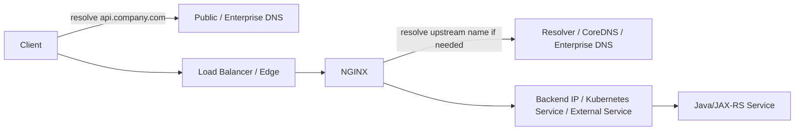

# Part 030 — DNS, Resolver, and Service Discovery

## 1. Core Mental Model

DNS adalah layer yang mengubah nama menjadi alamat. Dalam traffic flow NGINX, DNS memengaruhi dua arah:

1. **Client-side resolution**: client resolve hostname publik/internal ke load balancer atau edge proxy.
2. **NGINX-side resolution**: NGINX resolve upstream hostname ke IP backend.

```text
Client resolves public hostname
  -> gets load balancer / edge IP
  -> sends request to NGINX path
  -> NGINX resolves upstream hostname if configured
  -> connects to backend IP
  -> Java/JAX-RS service handles request
```

Di Kubernetes, NGINX Ingress Controller biasanya tidak langsung resolve setiap backend hostname dari DNS untuk Kubernetes Service routing. Controller membaca Ingress, Service, EndpointSlice/Endpoints, lalu menghasilkan konfigurasi upstream. Tetapi DNS tetap penting untuk:

- external upstream,
- ExternalName Service,
- non-Kubernetes backend,
- hybrid connectivity,
- service discovery outside cluster,
- DNS-based upstream in standalone NGINX,
- private DNS zone,
- CoreDNS health.

Mental model utama: **DNS failure sering terlihat seperti NGINX upstream failure**.

## 2. DNS Resolution Points in End-to-End Flow



Resolution can happen at multiple layers:

| Layer | Resolves what | Example failure |
|---|---|---|
| Client | public API hostname | wrong public record |
| Corporate network | internal hostname | split-horizon mismatch |
| Cloud VPC/VNet | private DNS name | private zone not linked |
| NGINX | upstream hostname | stale IP, missing `resolver`, DNS timeout |
| Kubernetes Pod | Service DNS | CoreDNS issue, wrong namespace |
| Java app | downstream host | JVM DNS cache, trust/proxy mismatch |

## 3. Static Upstream vs DNS-Based Upstream

### Static IP Upstream

```nginx
upstream quote_backend {
  server 10.10.20.15:8080;
  server 10.10.20.16:8080;
}
```

Pros:

- simple,
- predictable,
- no runtime DNS dependency.

Cons:

- brittle when backend IP changes,
- bad fit for Kubernetes Pod IPs,
- operational update required for scaling or failover,
- drift risk between config and real infrastructure.

### Hostname Upstream

```nginx
upstream quote_backend {
  server quote-service.internal.company.com:8080;
}
```

Pros:

- allows backend IP abstraction,
- supports external service discovery pattern,
- better for hybrid/private DNS names.

Cons:

- DNS behavior must be understood,
- NGINX may not re-resolve names the way engineers expect,
- stale DNS can route to dead IP,
- resolver failure can become production outage.

## 4. NGINX DNS Resolution Behavior: The Important Trap

A common incorrect assumption:

> “If DNS record changes, NGINX automatically uses the new IP.”

This is not always true.

In many NGINX configurations, hostnames in static upstream/server directives are resolved at startup or reload. Runtime re-resolution requires specific patterns such as `resolver` usage with variables or supported dynamic resolution behavior depending on context/version/module.

Practical implication:

- DNS record changes may not affect existing NGINX workers until reload.
- NGINX may keep using an old IP.
- A backend failover via DNS may not work unless config supports re-resolution.
- Kubernetes and cloud DNS changes may look correct from `dig`, but NGINX still connects to stale upstream.

Senior engineer rule: **Do not use DNS-based failover unless you have verified NGINX re-resolution behavior in your exact deployment.**

## 5. The `resolver` Directive

`resolver` tells NGINX which DNS server to use for name resolution in runtime contexts that require it.

Example:

```nginx
resolver 10.96.0.10 valid=30s ipv6=off;
resolver_timeout 5s;

location /api/ {
  set $quote_upstream quote-service.default.svc.cluster.local;
  proxy_pass http://$quote_upstream:8080;
}
```

This pattern forces name resolution at request time or with runtime cache semantics because `proxy_pass` uses a variable.

Important caveats:

- variable-based `proxy_pass` has different URI handling behavior,
- DNS lookup now sits in request path,
- resolver outage can affect traffic,
- DNS TTL and `valid` behavior must be understood,
- bad resolver config can cause intermittent 502/504.

Do not blindly introduce variable-based upstream just to get dynamic DNS. Validate behavior, performance, logging, and failure mode.

## 6. DNS TTL and Caching

TTL controls how long DNS answers may be cached by resolvers. In practice, caching can happen in multiple places:

- client OS,
- corporate resolver,
- cloud resolver,
- CoreDNS,
- NGINX resolver cache,
- JVM DNS cache,
- application HTTP client connection pool,
- load balancer target cache,
- intermediate proxy.

Failure mode: record updated, but traffic still goes to old IP because one layer caches longer than expected.

For cutovers:

- lower TTL before migration,
- verify actual resolver behavior,
- reload NGINX if needed,
- drain old backend gracefully,
- monitor traffic at both old and new target,
- avoid assuming DNS cutover is instant.

## 7. Kubernetes DNS Basics

Inside Kubernetes, Services get DNS names.

Typical forms:

```text
quote-service
quote-service.namespace
quote-service.namespace.svc
quote-service.namespace.svc.cluster.local
```

From a pod in the same namespace, short name may work:

```bash
curl http://quote-service:8080/health
```

From another namespace, use at least:

```bash
curl http://quote-service.quote.svc.cluster.local:8080/health
```

For production configuration, prefer explicit names when crossing namespaces. Ambiguous short names cause environment-specific bugs.

## 8. CoreDNS Role

CoreDNS is usually the DNS server inside Kubernetes. It resolves:

- Service names,
- Pod DNS names if enabled,
- external names by forwarding to upstream resolvers,
- cluster domain records.

If CoreDNS is unhealthy, symptoms include:

- pods cannot resolve services,
- NGINX cannot resolve variable upstreams,
- Java apps cannot resolve downstream services,
- intermittent timeout on outbound calls,
- startup failures for apps that resolve dependencies early.

Basic checks:

```bash
kubectl get pods -n kube-system -l k8s-app=kube-dns
kubectl logs -n kube-system -l k8s-app=kube-dns
kubectl get configmap -n kube-system coredns -o yaml
```

Some clusters label CoreDNS differently; verify internal cluster convention.

## 9. Kubernetes Service, EndpointSlice, and DNS

A Kubernetes Service DNS name resolves even when there are no ready endpoints. DNS resolution success does not prove backend availability.

```text
DNS resolves service name
  but Service has zero ready endpoints
  -> connection fails / 503 / no upstream
```

Always check:

```bash
kubectl get svc -n quote quote-service
kubectl get endpointslice -n quote -l kubernetes.io/service-name=quote-service
kubectl get pods -n quote -l app=quote-service
```

For ingress-nginx, the controller watches Kubernetes resources. A Service with no endpoints commonly produces ingress-level 503 or backend unavailable behavior.

## 10. Headless Service

A headless Service uses `clusterIP: None` and DNS can return individual pod IPs.

Use cases:

- StatefulSet peer discovery,
- client-side load balancing,
- direct pod identity,
- some database or clustered systems.

For NGINX, headless service can be tricky:

- DNS may return multiple A records,
- pod IPs change,
- NGINX resolution behavior matters,
- connection reuse may pin traffic,
- pod readiness and DNS answer timing must be understood.

For Java/JAX-RS stateless backend, normal ClusterIP Service is usually safer unless there is a strong reason.

## 11. ExternalName Service

ExternalName maps a Kubernetes Service name to an external DNS name using CNAME-style behavior.

Example:

```yaml
apiVersion: v1
kind: Service
metadata:
  name: external-catalog
spec:
  type: ExternalName
  externalName: catalog.internal.company.com
```

Use cases:

- represent external dependency inside cluster DNS,
- migrate service location without changing application config,
- bridge to on-prem or cloud-managed service.

Risks:

- DNS chain becomes longer,
- TLS hostname verification may not match service alias,
- NGINX upstream may see name resolution differently,
- observability may hide actual external target,
- failure domain moves outside Kubernetes.

For HTTPS upstream, verify SNI and certificate SAN. If NGINX connects to `external-catalog.namespace.svc.cluster.local` but upstream cert is for `catalog.internal.company.com`, TLS verification can fail unless configured correctly.

## 12. Private DNS Zone and Split-Horizon DNS

Private DNS zones are common in AWS, Azure, on-prem, and hybrid networks.

Same name can resolve differently depending on source:

```text
from internet        -> public edge IP
from corporate LAN   -> DMZ VIP
from AKS/EKS cluster -> private load balancer IP
from on-prem server  -> internal reverse proxy IP
```

Failure mode:

- application works from developer laptop but fails from cluster,
- cluster resolves public IP instead of private IP,
- cloud VPC/VNet not linked to private DNS zone,
- conditional forwarder missing,
- DNS suffix search path changes resolution unexpectedly,
- monitoring system checks the wrong endpoint.

Debugging rule: perform lookup from all relevant origins.

```bash
# from laptop
nslookup api.company.com

# from pod
kubectl run dns-test --rm -it --image=busybox:1.36 -- nslookup api.company.com

# from ingress controller pod if allowed
kubectl exec -n ingress-nginx deploy/ingress-nginx-controller -- nslookup api.company.com
```

## 13. JVM DNS Cache and Java/JAX-RS Services

DNS does not stop at NGINX. Java services also resolve downstream hosts.

Java/JVM may cache DNS results based on security/network settings and runtime defaults. This can cause:

- Java service continues calling old downstream IP after DNS cutover,
- failover takes longer than expected,
- intermittent connection failure when connection pools hold old endpoints,
- different behavior between JDK versions or container base images.

For Java/JAX-RS service review:

- check JVM DNS TTL settings,
- check HTTP client connection pool TTL,
- check retry policy,
- check whether DNS refresh happens on connection failure,
- check whether service uses proxy environment variables,
- check whether private DNS resolution differs inside container.

NGINX may be correct while Java downstream resolution is stale.

## 14. DNS-Based Upstream and Connection Reuse

Even if DNS re-resolution works, connection reuse can mask changes.

Example:

```text
NGINX resolves upstream -> opens keepalive connection -> DNS changes -> existing connection continues to old backend
```

This is not always wrong. Existing connections may complete safely. But during cutover, be aware of:

- keepalive pools,
- long-lived HTTP/2 connections,
- WebSocket connections,
- upstream keepalive timeout,
- backend drain period,
- readiness removal timing,
- LB deregistration delay.

For planned migration, coordinate DNS TTL, NGINX reload/re-resolution, connection draining, and backend shutdown.

## 15. DNS Failure Modes Seen as NGINX Errors

| NGINX symptom | Possible DNS cause | What to check |
|---|---|---|
| 502 Bad Gateway | upstream hostname resolved to wrong/dead IP | resolver answer, upstream IP, backend listener |
| 504 Gateway Timeout | DNS slow or upstream IP unreachable | resolver timeout, network path, firewall |
| intermittent 5xx | round-robin DNS includes bad target | all A records, health of each target |
| works after reload | NGINX had stale resolved IP | startup resolution behavior |
| only fails in cluster | CoreDNS/private zone issue | lookup from pod, CoreDNS logs |
| TLS upstream fails | DNS target certificate mismatch | SNI, cert SAN, ExternalName chain |
| wrong environment hit | DNS points to wrong VIP | zone, search suffix, split-horizon |
| Java app calls old dependency | JVM DNS cache | JVM TTL, connection pool |

## 16. Debugging DNS in Kubernetes

Recommended debug sequence:

### Step 1 — Resolve from source pod

```bash
kubectl run dns-debug --rm -it --image=busybox:1.36 -- sh
nslookup quote-service.quote.svc.cluster.local
nslookup api.company.internal
```

### Step 2 — Test TCP connectivity

Busybox may not have all tools. Use a richer debug image if allowed.

```bash
nc -vz quote-service.quote.svc.cluster.local 8080
wget -S -O- http://quote-service.quote.svc.cluster.local:8080/health
```

### Step 3 — Check Service and EndpointSlice

```bash
kubectl get svc -n quote quote-service -o wide
kubectl get endpointslice -n quote -l kubernetes.io/service-name=quote-service -o wide
kubectl get pods -n quote -o wide
```

### Step 4 — Check CoreDNS

```bash
kubectl get pods -n kube-system
kubectl logs -n kube-system deploy/coredns
kubectl describe configmap -n kube-system coredns
```

### Step 5 — Check NGINX context

If NGINX is standalone or uses dynamic DNS:

```bash
nginx -T | grep -n "resolver\|proxy_pass\|upstream"
```

If NGINX is ingress controller:

```bash
kubectl logs -n ingress-nginx deploy/ingress-nginx-controller
kubectl describe ingress -n quote quote-ingress
```

### Step 6 — Compare from multiple networks

```bash
# laptop
nslookup api.company.com

# cluster pod
nslookup api.company.com

# on-prem jump host
nslookup api.company.com

# cloud VM in same VNet/VPC
nslookup api.company.com
```

Different answers may be correct, but they must be intentional.

## 17. Designing DNS-Safe NGINX Upstreams

Prefer stable platform abstractions.

### In Kubernetes

For ingress to normal services:

- use Kubernetes Service and Ingress backend,
- avoid direct Pod IPs,
- rely on controller-generated upstreams,
- ensure readiness probes are correct,
- verify EndpointSlice state.

### For external dependencies

If NGINX proxies to external hostnames:

- define resolver explicitly if runtime resolution is required,
- set appropriate `resolver_timeout`,
- test DNS failover behavior,
- align TTL and reload strategy,
- log upstream address,
- monitor resolver errors,
- consider whether a dedicated service discovery/load balancer layer is better.

### For hybrid services

- avoid ambiguous short names,
- use FQDN,
- document private DNS zone,
- verify conditional forwarders,
- verify TLS SAN/SNI,
- test from the actual runtime network.

## 18. DNS and TLS Interaction

DNS decides the IP. TLS validates the name.

Common mismatch:

```text
NGINX connects to catalog.internal.company.com
DNS returns 10.40.2.15
server presents certificate for catalog-prod.company.net
TLS verification fails
```

For upstream HTTPS, verify:

- `proxy_ssl_server_name on;`
- expected SNI name,
- certificate SAN,
- trusted CA,
- whether upstream name differs from DNS alias,
- whether ExternalName introduces alias mismatch.

Example concept:

```nginx
proxy_ssl_server_name on;
proxy_ssl_name catalog.internal.company.com;
proxy_ssl_trusted_certificate /etc/nginx/ca/internal-ca.pem;
proxy_ssl_verify on;
```

Do not disable verification just to “fix” DNS/TLS mismatch. Fix name, certificate, SNI, or trust chain.

## 19. DNS and Observability

Access logs should include enough upstream data to detect DNS/routing issues.

Useful NGINX variables:

```nginx
log_format upstream_timing '$remote_addr $host $request '
                           'status=$status '
                           'upstream_addr=$upstream_addr '
                           'upstream_status=$upstream_status '
                           'request_time=$request_time '
                           'upstream_response_time=$upstream_response_time';
```

Why `$upstream_addr` matters:

- confirms which IP/backend received request,
- reveals stale DNS target,
- shows uneven distribution,
- helps correlate with backend pod/node/LB logs,
- helps detect wrong environment target.

For Java/JAX-RS logs, include:

- request ID,
- Host,
- resolved downstream host if possible,
- remote address,
- forwarded chain,
- downstream target URL,
- timeout/failure exception.

## 20. DNS Cutover Checklist

Before cutover:

- identify all records involved,
- identify all resolvers involved,
- reduce TTL early,
- verify private/public zones,
- verify certificate SAN/SNI,
- verify NGINX re-resolution or reload requirement,
- verify Java DNS cache/connection pool behavior,
- prepare rollback record,
- prepare monitoring for old and new target.

During cutover:

- update DNS,
- verify from multiple networks,
- reload NGINX if required,
- watch old/new backend traffic,
- monitor 502/503/504,
- monitor TLS errors,
- monitor connection refused/timeouts.

After cutover:

- keep old target alive until caches expire,
- check logs for straggler traffic,
- restore TTL if desired,
- update runbook and diagrams,
- document actual propagation behavior.

## 21. PR Review Checklist

For any PR involving DNS/upstream/service discovery:

- Is this a client-facing hostname or NGINX upstream hostname?
- Does this hostname resolve differently by environment/network?
- Is this name public, private, or split-horizon?
- Does NGINX resolve this at startup, reload, or runtime?
- Is `resolver` required?
- What happens if DNS returns multiple A records?
- What happens if one DNS target is dead?
- Is TLS SNI/certificate compatible with the name used?
- Does Kubernetes Service have ready endpoints?
- Does Java/JAX-RS service also need DNS/proxy/truststore changes?
- Is rollback blocked by TTL?
- Are `$upstream_addr` and resolver errors observable?

## 22. Internal Verification Checklist

Verify internally before assuming:

- cluster domain suffix,
- CoreDNS configuration and ownership,
- private DNS zone ownership,
- split-horizon DNS behavior,
- conditional forwarders between cloud and on-prem,
- standard for service names across namespaces,
- whether ExternalName is allowed,
- whether NGINX runtime DNS resolution is permitted,
- standard resolver IP for NGINX pods,
- DNS TTL policy for production cutover,
- JVM DNS TTL standard,
- connection pool TTL standard,
- TLS SNI and internal CA standard,
- runbook for DNS incident,
- monitoring for DNS latency/error rate.

## 23. Key Takeaways

- DNS success does not mean backend readiness.
- DNS failure often appears as NGINX 502/504 or Kubernetes ingress 503.
- NGINX does not always re-resolve upstream DNS automatically; verify exact behavior.
- Kubernetes Service DNS, EndpointSlice readiness, and CoreDNS health must be debugged together.
- Split-horizon DNS requires lookup from the actual source network.
- DNS cutover must include TTL, NGINX reload/re-resolution, TLS/SNI, Java DNS cache, and connection draining.
- Senior engineers must treat DNS as part of production architecture, not a background utility.
