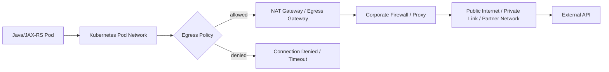
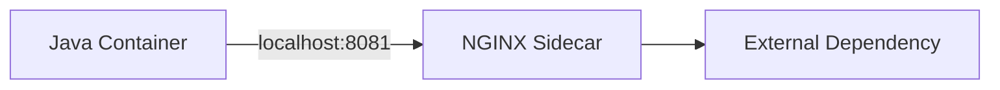
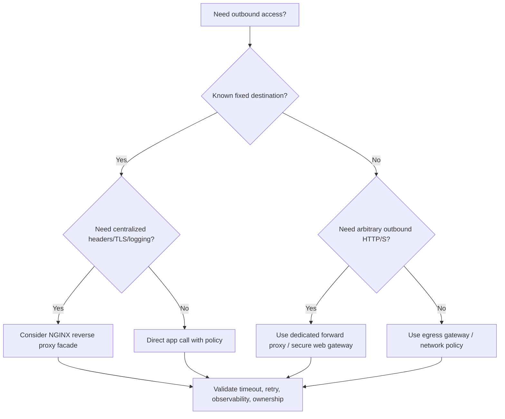

# Part 031 — Egress Proxy and Outbound Traffic Control

## 1. Core Mental Model

Sebagian besar pembahasan NGINX fokus pada **ingress**: request dari luar masuk ke service.
Tetapi enterprise production system juga punya masalah besar di arah sebaliknya: **egress**.

```text
Ingress:
Client -> DNS -> Load Balancer -> NGINX / Ingress -> Service -> Pod -> Java/JAX-RS

Egress:
Java/JAX-RS -> Pod Network -> NAT / Firewall / Egress Gateway / Proxy -> External Service
```

Ingress menjawab pertanyaan:

> Bagaimana traffic masuk ke service saya?

Egress menjawab pertanyaan:

> Bagaimana service saya keluar untuk memanggil dependency eksternal?

Dependency eksternal bisa berupa:

- payment provider,
- identity provider,
- tax service,
- catalog partner API,
- external CPQ/order integration,
- S3/Azure Blob/Object Storage,
- SaaS endpoint,
- customer endpoint,
- on-prem integration endpoint,
- message broker endpoint,
- webhook target,
- license server,
- artifact repository,
- telemetry collector.

Senior backend engineer perlu memahami egress karena banyak incident terlihat seperti bug aplikasi, padahal root cause-nya berada di:

- proxy environment variable,
- firewall allowlist,
- NAT exhaustion,
- DNS split-horizon,
- corporate TLS inspection,
- private endpoint routing,
- missing `NO_PROXY`,
- Kubernetes NetworkPolicy,
- service mesh egress policy,
- wrong truststore,
- outbound proxy authentication,
- cloud security rule.

Mental model utama: **outbound failure sering muncul sebagai timeout, SSL handshake error, 403 dari proxy, atau connection refused di Java client**.

## 2. Ingress vs Egress

| Dimension | Ingress | Egress |
|---|---|---|
| Direction | external/client to service | service to external dependency |
| Common component | NGINX Ingress, load balancer, API gateway | NAT gateway, firewall, egress proxy, service mesh egress gateway |
| Primary control | routing, TLS termination, auth, rate limit | allowlist, audit, proxy, NAT, private endpoint, outbound policy |
| Common failure | 404, 502, 503, 504 | connect timeout, read timeout, TLS error, proxy 407, DNS failure |
| Owner | platform/edge/network/app | network/security/platform/app |
| Debug source | access log, ingress log, LB metrics | app logs, proxy logs, firewall logs, NAT metrics, DNS logs |

NGINX is naturally strong as an **ingress reverse proxy**.
It is not normally the best component for enterprise outbound proxy use cases.

## 3. Typical Enterprise Egress Flow



The exact path depends on deployment model:

- cloud-native public egress,
- cloud private endpoint,
- VPC/VNet peering,
- VPN/Direct Connect/ExpressRoute,
- on-prem proxy chain,
- air-gapped outbound allowlist,
- service mesh egress gateway.

Internal verification is mandatory. Do not assume that a pod can simply call the internet.

## 4. Common Egress Components

| Component | Role |
|---|---|
| NAT Gateway | Lets private workloads initiate outbound internet traffic |
| Firewall | Enforces outbound IP/domain/port policy |
| Corporate proxy | Centralizes outbound HTTP/HTTPS access |
| Egress gateway | Controlled service-to-external boundary, often mesh/platform-managed |
| NetworkPolicy | Kubernetes-level pod egress allow/deny |
| Private Endpoint / PrivateLink | Private path to cloud service without public internet |
| DNS resolver | Resolves public/private/split-horizon names |
| Java HTTP client | Actually opens outbound connection |
| Truststore | Determines which TLS certificates are trusted |

For backend engineers, the most important point is this:

> The Java process does not call "the internet". It calls a resolved IP over a network path shaped by DNS, proxy variables, routing tables, firewall rules, NAT, TLS trust, and platform policy.

## 5. Where NGINX Fits in Egress

NGINX can appear in egress designs in several ways:

1. **Reverse proxy to a known external dependency**
2. **Internal facade for external API calls**
3. **Proxy chain participant in controlled enterprise network**
4. **Sidecar that normalizes outbound path to a fixed upstream**
5. **Not used at all because a dedicated forward proxy is required**

Example reverse proxy facade:

```text
Java/JAX-RS service
  -> internal NGINX endpoint
  -> external partner API
```

This can be useful when:

- several services call the same external API,
- headers must be normalized,
- TLS/client certificate handling is centralized,
- external base URL should not be embedded in application config,
- observability needs a stable proxy layer,
- IP allowlist must point to a small set of egress nodes.

But it is not the same as a general-purpose forward proxy.

## 6. NGINX as Reverse Proxy to External API

Example:

```nginx
upstream partner_api {
  server api.partner.example.com:443;
  keepalive 32;
}

server {
  listen 8080;
  server_name partner-api.internal;

  location /orders/ {
    proxy_pass https://partner_api/;
    proxy_ssl_server_name on;
    proxy_set_header Host api.partner.example.com;
    proxy_set_header X-Request-ID $request_id;
    proxy_connect_timeout 3s;
    proxy_read_timeout 30s;
  }
}
```

This pattern gives the application a stable internal target:

```text
http://partner-api.internal/orders/...
```

Instead of embedding external details everywhere.

However, this pattern has risks:

- hides true external latency from application if logs are poor,
- introduces another timeout/retry layer,
- may accidentally rewrite paths or headers,
- can centralize failure,
- may violate partner authentication expectations,
- can create confusing TLS/SNI behavior,
- can make dependency ownership unclear.

Use it intentionally, not because "we already know NGINX".

## 7. NGINX Is Not a General Forward Proxy by Default

A reverse proxy receives a request for itself and forwards it to a configured upstream:

```text
Client -> NGINX /api -> configured upstream
```

A forward proxy receives a request for arbitrary destinations and connects on behalf of the client:

```text
Client -> Proxy -> arbitrary destination chosen by client
```

HTTP clients usually talk to forward proxies using absolute-form request target:

```http
GET http://external.example.com/api HTTP/1.1
Host: external.example.com
```

HTTPS through a forward proxy usually uses `CONNECT`:

```http
CONNECT external.example.com:443 HTTP/1.1
Host: external.example.com:443
```

Open-source NGINX is not normally used as a full enterprise forward proxy for arbitrary outbound HTTP/HTTPS traffic. For that use case, teams usually use:

- Squid,
- Envoy,
- HAProxy in specific proxy mode,
- cloud egress gateway,
- service mesh egress gateway,
- commercial secure web gateway,
- corporate proxy appliances.

Key point:

> Do not assume NGINX can replace a dedicated corporate forward proxy just because it can proxy HTTP traffic.

## 8. When NGINX Is Appropriate for Egress

NGINX may be appropriate when outbound destinations are known and finite.

Good fit:

- proxying to a fixed partner API,
- centralizing client certificate for one dependency,
- adding observability around a specific external integration,
- normalizing headers for one vendor,
- routing to different upstream endpoints per environment,
- protecting applications from partner URL churn,
- creating an internal facade for a small number of external APIs.

Poor fit:

- arbitrary internet browsing,
- developer workstation proxy,
- full corporate outbound filtering,
- dynamic domain allowlist with complex policy,
- user-aware enterprise web proxy,
- malware scanning,
- DLP inspection,
- large-scale distributed rate limiting across all egress,
- CONNECT-heavy HTTPS proxy use.

## 9. Outbound Proxy Environment Variables

Many Java applications and base images respect environment variables such as:

```bash
HTTP_PROXY=http://proxy.internal:8080
HTTPS_PROXY=http://proxy.internal:8080
NO_PROXY=localhost,127.0.0.1,.svc,.cluster.local,10.0.0.0/8
```

Some libraries respect lowercase variants too:

```bash
http_proxy=http://proxy.internal:8080
https_proxy=http://proxy.internal:8080
no_proxy=localhost,127.0.0.1,.svc,.cluster.local
```

Important trap:

> Proxy environment variable behavior is not perfectly consistent across Java libraries, frameworks, containers, OS tools, and sidecars.

For Java specifically, outbound proxy behavior may depend on:

- JVM system properties,
- HTTP client implementation,
- Apache HttpClient config,
- OkHttp config,
- JDK `HttpClient`,
- Netty/Reactor Netty,
- Quarkus/MicroProfile config,
- Spring Boot properties,
- environment variables,
- container entrypoint logic.

Do not assume all outbound calls behave the same.

## 10. JVM Proxy Configuration

Common JVM-level properties:

```bash
-Dhttp.proxyHost=proxy.internal
-Dhttp.proxyPort=8080
-Dhttps.proxyHost=proxy.internal
-Dhttps.proxyPort=8080
-Dhttp.nonProxyHosts="localhost|127.*|*.svc|*.cluster.local|10.*"
```

Problems:

- syntax differs from `NO_PROXY`,
- wildcard behavior can surprise engineers,
- some libraries ignore JVM global proxy settings,
- some libraries use their own client-level proxy config,
- global proxy can accidentally proxy internal Kubernetes service calls,
- global proxy can break metadata service calls,
- global proxy can route private endpoint traffic incorrectly.

For Senior engineers, avoid blind global proxy config. Prefer explicit dependency-level outbound config when possible.

## 11. The `NO_PROXY` Failure Pattern

One of the most common enterprise egress failures:

```text
Service A calls Service B inside Kubernetes
  -> HTTP_PROXY is set globally
  -> request goes to corporate proxy
  -> proxy cannot resolve/route cluster-local service
  -> call fails
```

Symptoms:

- internal service call returns 502/503 from corporate proxy,
- DNS error for `.svc.cluster.local` from proxy,
- unexpected proxy authentication error,
- internal traffic leaves cluster accidentally,
- latency increases dramatically,
- logs show proxy host as remote target.

Typical `NO_PROXY` must include environment-specific values:

```text
localhost
127.0.0.1
::1
.svc
.svc.cluster.local
.cluster.local
10.0.0.0/8
172.16.0.0/12
192.168.0.0/16
metadata service IP if used
internal domains
private endpoint domains
```

But CIDR support in `NO_PROXY` is not universal. Verify actual client behavior.

## 12. Kubernetes NetworkPolicy and Egress

Kubernetes NetworkPolicy can restrict pod egress.

```yaml
apiVersion: networking.k8s.io/v1
kind: NetworkPolicy
metadata:
  name: quote-service-egress
spec:
  podSelector:
    matchLabels:
      app: quote-service
  policyTypes:
    - Egress
  egress:
    - to:
        - namespaceSelector:
            matchLabels:
              kubernetes.io/metadata.name: kube-system
      ports:
        - protocol: UDP
          port: 53
    - to:
        - ipBlock:
            cidr: 10.20.0.0/16
      ports:
        - protocol: TCP
          port: 443
```

Important points:

- NetworkPolicy enforcement depends on CNI support.
- DNS egress must usually be explicitly allowed.
- IP-based egress policy is brittle for SaaS endpoints with changing IPs.
- Domain-based egress may require CNI/vendor-specific features.
- Blocking DNS can look like application timeout.
- Blocking TCP 443 can look like TLS/connect timeout.

## 13. Egress Policy Design

A good egress policy answers:

- Which workloads can call outside the cluster?
- Which domains/IPs/ports are allowed?
- Is access public internet, private endpoint, VPN, or corporate proxy?
- Is traffic authenticated by mTLS, token, API key, or proxy auth?
- Is traffic logged and auditable?
- What happens when the destination is unavailable?
- Who owns changes to the allowlist?
- How are emergency allowlist changes approved?
- How is DNS change handled?

Bad policy says:

> Let all pods call `0.0.0.0/0:443` because it is easier.

That is operationally convenient but weak for regulated enterprise systems.

## 14. NAT Gateway and SNAT Exhaustion

Outbound cloud traffic often passes through NAT.

```text
Many Pods -> Node / NAT Gateway -> External API
```

Problems:

- ephemeral port exhaustion,
- too many short-lived connections,
- missing connection reuse,
- high outbound connection churn,
- partner endpoint rate limits by source IP,
- NAT gateway scaling limits,
- hidden dependency on one egress IP.

Symptoms:

- intermittent connect timeout,
- connection reset,
- sudden spike under load,
- failures only during peak traffic,
- external vendor sees too many connections from one IP,
- Java pool metrics show high new connection rate.

Mitigations:

- enable HTTP keepalive,
- tune Java HTTP client connection pooling,
- reduce aggressive retry,
- use NAT gateway scaling/extra egress IPs,
- prefer private endpoint for cloud services,
- align vendor rate limits with actual egress IPs,
- observe connection counts and NAT metrics.

NGINX can reduce connection churn if used as an outbound facade with upstream keepalive, but it can also become the bottleneck if poorly sized.

## 15. Private Endpoint / PrivateLink Pattern

For cloud services, outbound traffic may not go through public internet.

Examples:

- AWS PrivateLink / VPC Endpoint,
- Azure Private Endpoint,
- private DNS zone,
- VNet/VPC peering,
- ExpressRoute / Direct Connect,
- internal load balancer.

Flow:

```text
Java service
  -> private DNS name
  -> private IP endpoint
  -> cloud backbone/private network
  -> service provider endpoint
```

Benefits:

- no public internet path,
- stronger network boundary,
- predictable routing,
- easier allowlist by private subnet,
- often better compliance story.

Risks:

- DNS must resolve to private IP inside correct network,
- `NO_PROXY` must not send private endpoint traffic to public proxy,
- certificate name must match hostname,
- NSG/security group can block private endpoint,
- cross-region/private zone link issues,
- difficult local reproduction.

## 16. TLS Inspection Risk

Corporate proxies sometimes perform TLS inspection:

```text
Java client -> corporate proxy
proxy decrypts/re-encrypts -> external service
```

This requires Java truststore to trust the corporate inspection CA.

Symptoms when trust is missing:

- `PKIX path building failed`,
- `unable to find valid certification path`,
- certificate issuer is corporate proxy rather than public CA,
- works with `curl -k` but not Java,
- works in one environment but not another.

Security concerns:

- sensitive tokens may be visible to proxy layer,
- mTLS to external provider may break,
- certificate pinning may fail,
- audit/legal review may be needed,
- private key handling must remain protected,
- some regulated endpoints may prohibit interception.

Do not bypass validation casually. Fix trust and policy intentionally.

## 17. Proxy Authentication

Some enterprise proxies require authentication.

Common failure:

```text
HTTP/1.1 407 Proxy Authentication Required
```

In Java logs, this may appear as:

- unexpected 407,
- HTML proxy login page instead of JSON,
- token endpoint failure,
- vendor API response parse error,
- redirect to proxy auth portal.

Review questions:

- Does workload identity map to proxy credentials?
- Are credentials stored in Kubernetes Secret?
- Are credentials rotated?
- Are proxy credentials environment-specific?
- Does service account identity matter?
- Is auth handled by sidecar/egress gateway instead of app?

Avoid embedding proxy credentials directly in application config or logs.

## 18. Java HTTP Client Considerations

Outbound behavior is often determined by Java client implementation.

Review these client settings:

| Setting | Why it matters |
|---|---|
| connect timeout | failure speed when proxy/destination unreachable |
| read timeout | long-running dependency behavior |
| connection pool size | throughput and NAT pressure |
| connection TTL | stale DNS/IP handling |
| keepalive | reduce connection churn |
| proxy config | route selection |
| TLS truststore | certificate validation |
| hostname verification | SNI/cert correctness |
| retry policy | avoid retry storm |
| circuit breaker | protect service under dependency outage |
| metrics | visibility into external dependency latency |

NGINX egress facade cannot compensate for a bad Java HTTP client policy.

## 19. Timeout Chain for Egress

Outbound dependency call timeout chain:

```text
Client/request timeout
  -> Java controller/service timeout
  -> Java HTTP client connect timeout
  -> Java HTTP client read timeout
  -> proxy timeout if used
  -> firewall/NAT timeout
  -> external provider timeout
```

Bad chain:

```text
Java request timeout = 30s
Outbound read timeout = 60s
Proxy read timeout = 120s
Client timeout = 20s
```

This creates wasted work. The client may already be gone while backend still waits for dependency.

Better design:

- client-facing SLA defines upper bound,
- Java service timeout budget is smaller than client timeout,
- outbound dependency timeouts fit within service budget,
- retries are only used when safe,
- retry budget is explicit,
- circuit breaker prevents pile-up,
- proxy timeout is aligned with application behavior.

## 20. Retry and Idempotency for Outbound Calls

Retries are dangerous for external integrations.

Safe-ish to retry:

- idempotent GET,
- idempotent PUT with stable idempotency key,
- request with external provider idempotency token,
- network failure before request is sent, if detectable.

Dangerous to retry:

- payment capture,
- order submission,
- quote acceptance,
- provisioning request,
- non-idempotent POST,
- operation that triggers side effects in partner system.

If NGINX is used as outbound facade, avoid accidental retries that duplicate side effects.

Review:

```nginx
proxy_next_upstream error timeout http_502 http_503 http_504;
```

For non-idempotent flows, this must be treated with extreme care.

## 21. Observability for Egress

Minimum useful telemetry:

- dependency name,
- target host,
- resolved IP if available,
- outbound status code,
- connect time,
- TLS handshake failure,
- read timeout,
- retry count,
- circuit breaker state,
- proxy response code,
- source egress IP,
- request correlation ID,
- tenant/customer if safe,
- payload size if safe,
- redacted error body.

If NGINX is used as egress facade, log:

```nginx
log_format egress_json escape=json
'{'
  '"time":"$time_iso8601",'
  '"request_id":"$request_id",'
  '"method":"$request_method",'
  '"uri":"$uri",'
  '"status":$status,'
  '"upstream_addr":"$upstream_addr",'
  '"upstream_status":"$upstream_status",'
  '"request_time":$request_time,'
  '"upstream_response_time":"$upstream_response_time"'
'}';
```

Do not log API keys, bearer tokens, partner secrets, or PII.

## 22. Failure Modes

| Symptom | Likely cause |
|---|---|
| connect timeout | firewall deny, wrong route, NAT issue, NetworkPolicy |
| read timeout | slow dependency, proxy timeout, external outage |
| DNS unknown host | resolver/private DNS/CoreDNS issue |
| TLS handshake failed | truststore, SNI, TLS inspection, cert rotation |
| 407 | proxy authentication required |
| 403 from proxy/firewall | egress policy deny |
| connection reset | proxy/NAT/firewall idle timeout, vendor reset |
| intermittent failure under load | NAT/SNAT exhaustion, pool exhaustion, rate limit |
| works from laptop but not pod | different DNS/proxy/network path |
| works in dev but not prod | allowlist/private DNS/proxy policy mismatch |
| JSON parse error | proxy returned HTML error page |

## 23. Debugging Egress from Kubernetes

Use a debug pod in the same namespace/network policy context when possible.

Commands:

```bash
kubectl run -it --rm net-debug \
  --image=curlimages/curl \
  --restart=Never -- sh
```

Inside pod:

```bash
env | grep -i proxy
nslookup api.partner.example.com
curl -v https://api.partner.example.com/health
curl -v --proxy http://proxy.internal:8080 https://api.partner.example.com/health
curl -v --noproxy '*' https://api.partner.example.com/health
```

TLS debugging:

```bash
openssl s_client -connect api.partner.example.com:443 -servername api.partner.example.com -showcerts
```

Route visibility:

```bash
ip route
cat /etc/resolv.conf
```

Kubernetes checks:

```bash
kubectl get networkpolicy -n <namespace>
kubectl describe networkpolicy <name> -n <namespace>
kubectl get events -n <namespace>
```

Important: debug from a random admin pod may not reproduce the same egress policy as the application pod.

## 24. Debugging Java-Specific Egress

Check application logs for:

- `UnknownHostException`,
- `ConnectException`,
- `SocketTimeoutException`,
- `SSLHandshakeException`,
- `PKIX path building failed`,
- `Proxy Authentication Required`,
- `Connection reset`,
- `Broken pipe`,
- HTTP 403/407/502/503 from proxy.

Check runtime config:

```bash
java -XX:+PrintFlagsFinal -version
```

Check system properties if visible:

```text
http.proxyHost
http.proxyPort
https.proxyHost
https.proxyPort
http.nonProxyHosts
javax.net.ssl.trustStore
javax.net.ssl.trustStorePassword
```

Also inspect application-level HTTP client configuration. Many production issues come from multiple clients in one service using different proxy/timeouts/truststore settings.

## 25. Egress with Service Mesh

If a service mesh exists, egress may be controlled by mesh resources.

Possible components:

- sidecar proxy,
- egress gateway,
- ServiceEntry,
- DestinationRule,
- AuthorizationPolicy,
- mTLS policy,
- telemetry policy.

Flow:

```text
Java app -> local sidecar -> egress gateway -> external service
```

Common surprises:

- application config looks correct but sidecar blocks traffic,
- TLS originates at sidecar, not application,
- DNS capture changes resolution behavior,
- egress gateway has separate allowlist,
- mTLS policy affects external call,
- metrics are split across app and sidecar.

If mesh is present, do not debug egress only from the application container.

## 26. Egress Through NGINX Sidecar

Sometimes a pod has an NGINX sidecar used as local outbound proxy/facade.



Potential benefits:

- application calls stable localhost endpoint,
- TLS/client cert managed by sidecar,
- partner-specific headers centralized,
- retry/timeout policy can be isolated,
- dependency access logs available per pod.

Risks:

- extra hop per call,
- sidecar config drift,
- hidden dependency behavior,
- resource contention in same pod,
- confusing health/lifecycle behavior,
- not suitable for arbitrary dynamic egress.

Review carefully before adopting this pattern widely.

## 27. Egress to Object Storage

Calls to S3/Azure Blob/object storage often fail because egress path differs by environment.

Questions:

- public endpoint or private endpoint?
- region-specific endpoint?
- VPC Endpoint/Private Endpoint enabled?
- DNS private zone linked?
- proxy required or bypassed?
- large upload/download timeout configured?
- multipart upload supported?
- TLS inspection allowed?
- SDK uses its own proxy config?
- credential provider chain can access metadata endpoint?

Common mistake:

```text
HTTPS_PROXY is set globally
  -> SDK metadata credential call goes to proxy
  -> proxy cannot reach metadata IP
  -> credentials fail
```

Make sure metadata endpoints and private endpoints are correctly represented in `NO_PROXY` or SDK-specific proxy config.

## 28. Egress to Identity Provider

Identity provider calls are high-impact because auth flows depend on them.

Examples:

- token introspection,
- JWKS fetch,
- OIDC discovery document,
- token exchange,
- userinfo endpoint.

Failure modes:

- startup fails because JWKS cannot be fetched,
- token validation fails during DNS outage,
- auth latency spikes due to proxy issue,
- cached keys expire while IdP unreachable,
- TLS inspection breaks cert validation,
- proxy returns HTML login page.

Design considerations:

- cache JWKS safely,
- define refresh timeout,
- define startup behavior when IdP unavailable,
- observe IdP call latency/error rate,
- separate IdP outage from application bug,
- avoid logging tokens.

## 29. Security Concerns

Egress security concerns:

- uncontrolled data exfiltration,
- unapproved external dependency,
- secrets sent to wrong endpoint,
- proxy credential leakage,
- TLS inspection of sensitive traffic,
- bypassing corporate proxy,
- internal service accidentally exposed via proxy,
- SSRF path from app to internal network,
- metadata service access,
- broad `NO_PROXY` allowing bypass,
- weak audit trail.

For SSRF-sensitive systems, egress policy should restrict which internal/external addresses an application can reach.

Do not rely only on application-level URL validation.

## 30. Performance Concerns

Egress performance concerns:

- proxy adds latency,
- DNS latency affects every new connection,
- no keepalive causes high connection churn,
- NAT gateway bottleneck,
- TLS handshake overhead,
- object storage upload/download throughput,
- proxy buffering behavior,
- external provider rate limit,
- retry amplification,
- connection pool starvation.

Key metric distinction:

```text
Application latency = business logic + outbound dependency latency + proxy/network overhead
```

When debugging API latency, always break down dependency calls separately.

## 31. Architecture Decision Framework

Use this decision flow:



Do not force NGINX into a role where a dedicated forward proxy, mesh egress gateway, or cloud-native egress control is better.

## 32. Safe Egress Design Checklist

For each outbound dependency:

- dependency name is explicit,
- owner is known,
- environment endpoint is documented,
- DNS behavior is known,
- proxy requirement is known,
- `NO_PROXY` impact is reviewed,
- TLS trust is configured,
- timeout budget is defined,
- retry policy is safe,
- circuit breaker is considered,
- rate limit is known,
- egress IP is known if allowlisted,
- logs/metrics/traces exist,
- secrets are not logged,
- failure behavior is tested,
- rollback path exists.

## 33. PR Review Checklist

When reviewing changes involving outbound calls:

- Is this a new external dependency?
- Is the endpoint public, private, or hybrid?
- Does it require proxy access?
- Does it require `NO_PROXY`?
- Does it require firewall allowlist?
- Does it require egress IP allowlist on vendor side?
- Does it require private endpoint/private DNS?
- Does it require custom CA/truststore?
- Does it require mTLS/client certificate?
- Are timeout and retry policies safe?
- Is operation idempotent if retried?
- Is circuit breaker configured?
- Is dependency observable separately?
- Is sensitive data redacted from logs?
- Is there a runbook for dependency outage?

## 34. Internal Verification Checklist

Verify internally before assuming:

- standard egress path per environment,
- whether workloads can access public internet,
- corporate proxy hostname/port,
- proxy authentication requirement,
- accepted proxy env var convention,
- standard `NO_PROXY` values,
- CNI NetworkPolicy support,
- egress gateway/service mesh presence,
- NAT gateway/source IP strategy,
- vendor allowlist process,
- private endpoint policy,
- internal CA/truststore distribution,
- TLS inspection policy,
- logging/audit requirements,
- emergency egress change process,
- ownership boundary among app/platform/network/security.

## 35. Key Takeaways

- Egress is not just "outbound HTTP"; it is a controlled production path.
- NGINX is excellent as reverse proxy/facade for known destinations, but not a default general forward proxy.
- `HTTP_PROXY`, `HTTPS_PROXY`, and `NO_PROXY` can silently change Java service behavior.
- Many outbound failures are caused by DNS, firewall, NAT, proxy auth, TLS trust, NetworkPolicy, or private endpoint routing.
- Retry policy must respect idempotency and external side effects.
- Observability must separate external dependency latency from internal application latency.
- Senior engineers should treat outbound dependencies as first-class architecture components with ownership, policy, telemetry, and runbooks.
