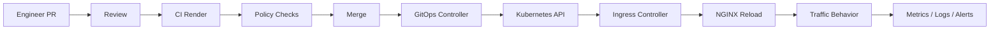

# Part 032 — Configuration Management, GitOps, Validation, and Safe Rollout

## 1. Core Mental Model

NGINX configuration is production behavior encoded as text.

A small config change can alter:

- public API routing,
- TLS termination,
- backend selection,
- timeout behavior,
- retry behavior,
- body size limits,
- rate limits,
- identity headers,
- CORS behavior,
- cache behavior,
- logging fields,
- allowed/denied paths,
- blast radius of failure.

In enterprise systems, NGINX config must be treated like application code plus infrastructure policy.

```text
NGINX config change
  -> rendered config / Kubernetes manifest
  -> validated in CI
  -> reviewed as PR
  -> applied by GitOps / deployment pipeline
  -> controller reloads config
  -> traffic behavior changes
  -> observability confirms or rejects rollout
```

Mental model utama:

> A safe NGINX rollout is not just `nginx -t`. It is validation, review, staged deployment, observability, and rollback.

## 2. Why Config Management Matters

NGINX issues are dangerous because they often sit at the shared traffic path.

Bad application deployment may break one service.
Bad NGINX/Ingress deployment may break many services, customers, tenants, or environments.

Common production incidents from config changes:

- route points to wrong backend,
- host rule conflict,
- TLS secret missing,
- invalid certificate chain,
- path rewrite breaks API base path,
- timeout too short causes 504,
- body size limit causes 413,
- rate limit blocks legitimate traffic,
- CORS breaks browser clients,
- auth snippet bypasses expected control,
- default server exposes wrong response,
- access log loses correlation ID,
- unsafe snippet allows config injection,
- reload fails and old config stays active,
- controller reload succeeds but routing semantics are wrong.

Good config management makes these failures less likely and easier to reverse.

## 3. NGINX Configuration Sources

NGINX config may come from different places depending on deployment style.

| Deployment model | Config source |
|---|---|
| VM/bare metal NGINX | `/etc/nginx/nginx.conf`, included files, config management system |
| Docker NGINX | image layer, mounted volume, environment substitution |
| Kubernetes standalone NGINX | ConfigMap, Secret, mounted config, Helm chart |
| ingress-nginx | Ingress resources, ConfigMap, annotations, template, controller flags |
| NGINX Inc controller | NginxIngress resources, VirtualServer/VirtualServerRoute, Policy resources, ConfigMap/GlobalConfiguration depending on setup |
| Cloud ingress integration | Kubernetes resources + cloud LB annotations + cloud controller config |

Do not review only one file. Review the generated effective behavior.

## 4. Source of Truth

Every production environment should have a clear source of truth.

Good:

```text
Git repository -> CI validation -> GitOps controller -> Kubernetes cluster
```

Bad:

```text
Someone edited ConfigMap directly in production
Someone patched Ingress manually
Someone changed cloud load balancer in console
Someone hot-fixed config in pod shell
Nobody knows which value is authoritative
```

Manual emergency changes may happen, but they must be backported into Git quickly and documented.
Otherwise, config drift accumulates.

## 5. GitOps Flow for NGINX and Ingress

Typical GitOps flow:



GitOps strengths:

- auditable history,
- deterministic promotion,
- drift detection,
- easy rollback to previous commit,
- consistent review workflow,
- environment-specific overlays,
- policy-as-code integration.

GitOps risks:

- bad config can be reconciled repeatedly,
- emergency manual fixes may be reverted,
- rendered output may differ from what reviewer expects,
- controller-specific behavior may not be obvious,
- multiple repos can split ownership.

## 6. Repository Layout Patterns

### Pattern A: Single Infra Repo

```text
infra/
  clusters/
    dev/
    staging/
    prod/
  apps/
    quote-service/
      ingress.yaml
      service.yaml
  platform/
    ingress-nginx/
      helm-values.yaml
```

Pros:

- central visibility,
- easier policy governance,
- consistent promotion.

Cons:

- app teams depend on infra repo workflow,
- high PR volume,
- ownership can be unclear.

### Pattern B: App Repo Owns Ingress

```text
quote-service/
  src/
  deploy/
    helm/
      templates/ingress.yaml
      values-prod.yaml
```

Pros:

- routing close to application,
- app team owns API exposure,
- easier versioning with service release.

Cons:

- platform standards can drift,
- hard to review cross-service conflicts,
- unsafe annotations may spread.

### Pattern C: Platform Repo Owns Shared Ingress

```text
platform-ingress/
  environments/
    prod/
      quote-ingress.yaml
      order-ingress.yaml
```

Pros:

- strong governance,
- consistent ingress behavior,
- good for regulated boundary.

Cons:

- slower app changes,
- platform team bottleneck,
- app context may be missing during review.

There is no universal best. The key is explicit ownership and review policy.

## 7. Helm and Rendered Reality

Helm values are not the final manifest.

Example values:

```yaml
nginx:
  ingress:
    enabled: true
    host: quote.example.com
    path: /quote
    timeoutSeconds: 30
```

Rendered Ingress may become:

```yaml
apiVersion: networking.k8s.io/v1
kind: Ingress
metadata:
  annotations:
    nginx.ingress.kubernetes.io/proxy-read-timeout: "30"
    nginx.ingress.kubernetes.io/rewrite-target: /
spec:
  rules:
    - host: quote.example.com
      http:
        paths:
          - path: /quote
            pathType: Prefix
```

Reviewers must inspect rendered output when possible:

```bash
helm template quote-service ./chart -f values-prod.yaml
```

Risks hidden in templates:

- default annotations,
- environment overrides,
- string vs number conversion,
- missing quote around values,
- conditional blocks,
- duplicate host/path,
- generated names,
- TLS secret mismatch,
- chart dependency updates.

## 8. Kustomize and Overlay Risk

Kustomize overlays can patch base manifests.

```text
base/
  ingress.yaml
overlays/
  dev/
  staging/
  prod/
```

Common risks:

- production overlay differs significantly from staging,
- patch removes annotation unexpectedly,
- strategic merge fails silently in surprising way,
- namespace/name mismatch,
- label selector mismatch,
- secret name differs by environment,
- generated ConfigMap name changes and triggers reload.

Review rendered manifests:

```bash
kustomize build overlays/prod
```

Do not approve only the patch if the effective output is unclear.

## 9. ConfigMap Management

For NGINX/Ingress, ConfigMap can control global behavior.

Examples:

- proxy body size,
- default timeout,
- log format,
- real IP configuration,
- SSL protocol/cipher defaults,
- header behavior,
- snippet enable/disable,
- gzip settings,
- use-forwarded-headers,
- proxy buffering,
- error log level.

Global ConfigMap change can affect every Ingress handled by that controller.

High-risk ConfigMap changes:

- enabling arbitrary snippets,
- changing real IP trusted ranges,
- changing default timeout,
- changing default TLS versions/ciphers,
- changing log format,
- changing proxy buffer defaults,
- changing server tokens/security headers,
- changing global redirects.

Treat controller ConfigMap PRs as platform-impacting changes.

## 10. Secret Management

NGINX and Ingress may depend on Secrets for:

- TLS certificates,
- private keys,
- client CA bundle,
- upstream mTLS certificate,
- basic auth file,
- auth proxy credentials,
- external API credentials if NGINX facade is used.

Rules:

- secrets must not be committed in plaintext,
- private keys must have restricted access,
- secret rotation must be documented,
- certificate chain must be validated,
- secret names must be stable across environments or clearly mapped,
- GitOps must integrate with secret management safely.

Possible mechanisms:

- External Secrets Operator,
- Sealed Secrets,
- SOPS,
- cloud secret manager integration,
- cert-manager,
- manual secret injection by platform process.

Internal verification is required. Do not invent secret flow.

## 11. Environment-Specific Values

Different environments often have different:

- hostname,
- TLS secret,
- upstream service name,
- load balancer class,
- timeout,
- body size,
- rate limit,
- auth mode,
- IP allowlist,
- CORS origin,
- logging level,
- WAF policy,
- private DNS zone,
- proxy route.

Danger:

```text
Dev works because auth is disabled
Staging works because IP allowlist is broad
Prod fails because TLS secret name differs
```

A good environment strategy distinguishes:

- intentional difference,
- accidental drift,
- temporary exception,
- production-only security control.

## 12. Config Drift

Config drift occurs when actual runtime state differs from declared source of truth.

Examples:

- production ConfigMap patched manually,
- load balancer annotation changed directly,
- TLS secret replaced outside GitOps,
- cloud console modified listener rule,
- ingress controller version changed manually,
- emergency hotfix never committed.

Detect drift with:

- GitOps controller diff,
- periodic cluster audit,
- `kubectl diff`,
- cloud config audit,
- policy engine reports,
- change management logs.

Drift is not just cleanliness issue. It destroys incident response confidence.

## 13. CI Validation Layers

A good pipeline validates multiple layers.

```text
YAML syntax
  -> schema validation
  -> Helm/Kustomize render
  -> Kubernetes API dry-run
  -> policy checks
  -> NGINX config validation if applicable
  -> route conflict checks
  -> security checks
  -> smoke tests
```

Minimum checks:

- YAML parse,
- Kubernetes schema validation,
- required labels/annotations,
- disallowed annotations,
- TLS secret reference exists or is managed,
- host/path uniqueness policy,
- timeout/body size bounds,
- no unsafe snippets,
- no broad source ranges unless approved,
- no accidental public exposure.

## 14. NGINX Config Validation

Standalone NGINX:

```bash
nginx -t -c /path/to/nginx.conf
```

Container:

```bash
docker run --rm \
  -v "$PWD/nginx.conf:/etc/nginx/nginx.conf:ro" \
  nginx:stable nginx -t
```

Kubernetes mounted config validation can be harder because config is generated by controller or assembled from templates.

For ingress-nginx, validate:

- Ingress manifest correctness,
- controller admission webhook response,
- rendered controller config if accessible,
- events on Ingress object,
- controller logs after sync.

Do not confuse Kubernetes manifest validity with NGINX semantic correctness.

## 15. Policy-as-Code

Policy-as-code can prevent dangerous config.

Examples of policies:

- snippets disabled unless platform-approved,
- `proxy-read-timeout` must be within allowed range,
- `proxy-body-size` must not exceed standard without approval,
- public ingress must use TLS,
- host must match approved domain,
- admin paths cannot be exposed publicly,
- wildcard host forbidden unless approved,
- source IP allowlist required for internal tools,
- `ssl-redirect` required for public endpoints,
- sensitive annotations forbidden,
- default backend must not expose debug info.

Tools may include:

- OPA Gatekeeper,
- Kyverno,
- Conftest,
- kube-linter,
- Polaris,
- custom CI scripts,
- admission webhook.

Policy must be explainable. Engineers should know why a change is blocked.

## 16. Smoke Testing

After rollout, validate externally visible behavior.

Smoke test examples:

```bash
curl -vk https://quote.example.com/health
curl -vk https://quote.example.com/api/v1/quotes
curl -vk -H 'Host: quote.example.com' https://<lb-address>/health
```

Check:

- DNS resolves expected LB,
- TLS certificate matches hostname,
- HTTP to HTTPS redirect works,
- health endpoint returns expected status,
- auth behavior is expected,
- path rewrite is correct,
- backend receives expected headers,
- access log has request ID,
- status code is correct,
- latency is within normal range.

Smoke test must be environment-aware and should not require production data mutation.

## 17. Canary Config Rollout

Canary is not only for application code. It can apply to routing/config changes.

Patterns:

1. Canary by hostname:

```text
quote-canary.example.com -> new ingress/config
quote.example.com -> old config
```

2. Canary by path:

```text
/api/v2 -> new backend
/api/v1 -> old backend
```

3. Canary by header:

```text
X-Canary: true -> new backend
```

4. Canary by percentage if ingress/controller supports it.

5. Canary by internal users/IP allowlist.

Canary questions:

- What traffic subset is safe?
- Can we compare old and new behavior?
- Is rollback instant?
- Are logs separated?
- Are metrics labeled?
- Does canary affect sticky session?
- Are clients aware of hostname/path difference?

## 18. Rollback Strategy

Rollback must be known before rollout.

GitOps rollback options:

```bash
git revert <commit>
```

or reset environment pointer to previous known-good version.

Kubernetes rollback options may include:

```bash
kubectl rollout undo deployment/ingress-nginx-controller -n ingress-nginx
```

But not all config changes are Deployment rollouts. Ingress/ConfigMap changes may require:

- reverting manifest,
- waiting for GitOps sync,
- forcing controller reload,
- restoring Secret,
- reverting cloud load balancer annotation,
- restoring DNS record,
- clearing bad cache behavior,
- reapplying previous certificate.

Rollback checklist:

- previous config available,
- previous TLS secret available,
- previous LB state known,
- DNS TTL considered,
- long-lived connections considered,
- cache invalidation considered,
- monitoring confirms recovery.

## 19. Reload vs Restart

Standalone NGINX reload:

```bash
nginx -s reload
```

Conceptually:

```text
master validates new config
  -> starts new workers
  -> old workers drain existing connections
  -> new workers accept new connections
```

This is not the same as restart.

Restart may drop connections depending on process/container orchestration.

Kubernetes ingress controller may reload NGINX internally after config changes. Engineers should verify:

- does controller reload or restart?
- are reload failures visible?
- what happens to long-lived WebSocket/SSE connections?
- are old workers drained?
- does config change trigger pod restart?
- does ConfigMap reload require rollout restart?

## 20. Zero-Downtime Does Not Mean Zero-Impact

A reload may be technically zero-downtime but still cause impact:

- WebSocket disconnects,
- long polling resets,
- in-flight upload interrupted,
- sticky session changes,
- upstream keepalive pool reset,
- TLS session cache behavior changes,
- temporary latency spike,
- controller reload storm,
- bad config rejected while old config remains active,
- clients see mixed behavior during propagation.

For mission-critical systems, observe the rollout window.

## 21. Dangerous Config Changes

Treat these as high-risk:

- changing host/path routing,
- changing `rewrite-target`,
- changing `proxy_pass`,
- changing backend protocol HTTP/HTTPS/gRPC,
- changing TLS Secret or certificate source,
- changing trusted proxy/real IP ranges,
- changing auth annotations,
- changing identity header propagation,
- enabling snippets,
- changing body size limit,
- changing rate limit key or threshold,
- changing timeout/retry behavior,
- changing CORS behavior,
- changing cache key or cache bypass,
- changing default backend,
- changing ingress class,
- changing controller version.

High-risk changes need deeper review and often staged rollout.

## 22. Config Change Risk Matrix

| Change type | Risk | Reason |
|---|---|---|
| log format only | medium | can break observability or parsers |
| timeout increase | medium/high | can increase resource retention |
| timeout decrease | high | can create 504/499 spikes |
| rewrite rule | high | can break routing/API base path |
| TLS secret | high | can break all clients |
| source IP trust | high | can break security/audit/rate limit |
| rate limit threshold | high | can block legitimate users |
| auth change | critical | can deny access or bypass control |
| snippet enablement | critical | arbitrary config/security risk |
| ingress class change | high | route may be ignored or handled by wrong controller |
| controller upgrade | high | behavior/annotation semantics may change |

## 23. Versioning NGINX and Ingress Controller

Controller version matters.

Changes between versions may affect:

- annotation behavior,
- default TLS configuration,
- generated NGINX template,
- admission webhook validation,
- Kubernetes API compatibility,
- security defaults,
- logging fields,
- reload behavior,
- snippet handling,
- path matching behavior,
- Gateway API support.

Upgrade review should include:

- changelog,
- breaking changes,
- CVE fixes,
- deprecated annotations,
- Kubernetes version compatibility,
- chart version changes,
- CRD changes if any,
- rollback compatibility.

Do not upgrade ingress controller as routine dependency bump without traffic-path review.

## 24. Rendered Config Inspection

For complex NGINX or Ingress behavior, inspect generated output.

Possible checks:

```bash
kubectl exec -n ingress-nginx deploy/ingress-nginx-controller -- nginx -T
```

This may require permission and may differ by controller.

Use rendered config to answer:

- which server block handles this host?
- which location handles this path?
- what upstream is generated?
- what timeout is actually active?
- what headers are set?
- is rewrite applied before proxy?
- is buffering enabled?
- is rate limit zone used?
- is snippet injected?

Rendered config is often the fastest way to resolve disputes about expected behavior.

## 25. Change Review Workflow

A healthy review workflow:

```text
1. Understand user/business impact
2. Identify traffic path affected
3. Inspect rendered manifest/config
4. Validate security boundary
5. Validate timeout/retry/body/header behavior
6. Validate observability
7. Validate rollout plan
8. Validate rollback plan
9. Merge with appropriate approval
10. Monitor after deployment
```

Review must include someone who understands platform traffic behavior for high-risk changes.

## 26. PR Description Template

Use a structured PR description for NGINX/Ingress changes:

```markdown
## What changes?

## Why is this needed?

## Affected host/path

## Affected services

## Config rendered output reviewed?

## Security impact

## Timeout/retry/body/header impact

## TLS/certificate impact

## Observability impact

## Rollout plan

## Rollback plan

## Validation evidence
```

This prevents routing PRs from being reviewed as simple YAML edits.

## 27. Pre-Merge Checklist

Before merge:

- host/path ownership confirmed,
- no conflict with existing Ingress,
- rendered manifest reviewed,
- environment-specific values reviewed,
- TLS secret exists or is managed,
- backend service/port exists,
- readiness/liveness behavior understood,
- timeout values within standard,
- body size within standard,
- auth behavior reviewed,
- sensitive headers not exposed,
- observability preserved,
- rollback documented,
- platform approval obtained if needed.

## 28. Post-Deploy Validation

After deployment:

- GitOps sync healthy,
- Ingress object accepted,
- controller logs have no error,
- NGINX reload succeeded,
- DNS still resolves expected target,
- TLS certificate correct,
- smoke tests pass,
- access logs show expected route,
- upstream status normal,
- 4xx/5xx not spiking,
- latency not regressing,
- alerts quiet,
- application logs normal.

Do not treat `kubectl apply succeeded` as proof of successful rollout.

## 29. Observability During Rollout

Watch:

- request rate,
- status code distribution,
- 400/401/403/404 changes,
- 413/414 changes,
- 429 changes,
- 499 changes,
- 502/503/504 changes,
- p95/p99 latency,
- upstream response time,
- NGINX reload errors,
- controller sync errors,
- Kubernetes events,
- application error rate,
- customer-impacting synthetic checks.

For high-risk changes, define expected signal before rollout.

## 30. Rollout Failure Patterns

| Symptom | Possible cause |
|---|---|
| Ingress ignored | wrong IngressClass |
| 404 default backend | host/path mismatch |
| 502 | wrong service port, protocol mismatch, upstream unavailable |
| 503 | no ready endpoints, service selector mismatch |
| 504 | timeout too short, slow backend, network issue |
| TLS warning | wrong cert secret, missing SAN, wrong SNI |
| Browser CORS error | changed CORS headers/preflight |
| Login broken | auth annotation/header propagation changed |
| Upload fails | body size/buffering/temp file setting |
| WebSocket disconnects | timeout/upgrade headers/reload behavior |
| Logs missing request ID | log format/header propagation changed |
| Rate limit spike | key/threshold changed |

## 31. Multi-Team Ownership

NGINX/Ingress changes usually cross boundaries.

| Area | Possible owner |
|---|---|
| public DNS | network/cloud/platform |
| load balancer | platform/cloud/network |
| ingress controller | platform/SRE |
| Ingress resource | app team or platform |
| TLS cert | security/platform/network |
| auth gateway | identity/platform/security |
| Java service | app team |
| observability | app/SRE/platform |
| firewall/egress | network/security |

Senior engineer responsibility is not to own every layer, but to know who owns what and what must be verified.

## 32. Preventing Dangerous Config Changes

Use defense-in-depth:

- PR templates,
- CODEOWNERS,
- policy-as-code,
- schema validation,
- allowed annotation list,
- rendered manifest review,
- staging environment parity,
- smoke tests,
- canary rollout,
- synthetic monitoring,
- rollback automation,
- incident review feedback loop.

For regulated systems, also keep evidence:

- approval record,
- validation result,
- deployment timestamp,
- rollback plan,
- post-deploy verification,
- incident-free confirmation or follow-up notes.

## 33. Example CI Pipeline

```yaml
stages:
  - lint
  - render
  - policy
  - validate
  - smoke

lint:
  script:
    - yamllint deploy/

render:
  script:
    - helm template quote-service ./chart -f values-prod.yaml > rendered.yaml

policy:
  script:
    - conftest test rendered.yaml

validate:
  script:
    - kubeconform rendered.yaml

smoke:
  script:
    - ./scripts/smoke-ingress.sh staging
```

The actual tool choices depend on internal platform standards. The principle is layered validation.

## 34. Example Policy Checks

Pseudo-policy examples:

```text
Deny if public Ingress has no TLS.
Deny if host does not end with approved domain.
Deny if annotation enables unsafe snippets.
Deny if proxy body size > approved maximum without exception label.
Deny if proxy read timeout > approved maximum without exception label.
Deny if admin path exposed without allowlist.
Deny if ingress class is missing.
Deny if auth annotation removed from protected host.
Deny if CORS allows wildcard origin with credentials.
```

Policy should encode known production mistakes, not arbitrary bureaucracy.

## 35. Testing Strategy

Test multiple layers:

### Static tests

- YAML syntax,
- schema,
- policy,
- rendered config.

### Integration tests

- route to backend,
- header propagation,
- auth behavior,
- body size,
- TLS cert,
- CORS preflight,
- timeout behavior.

### Production-safe synthetic tests

- health endpoint,
- read-only API call,
- login discovery endpoint,
- expected 401 for protected path,
- expected 404 for unknown path,
- expected redirect from HTTP to HTTPS.

### Negative tests

- too-large body returns expected 413,
- disallowed method blocked,
- admin path inaccessible,
- missing auth denied,
- wrong host rejected.

## 36. Handling Emergency Changes

Emergency process should be fast but controlled.

Minimum emergency checklist:

- incident commander or responsible approver identified,
- exact change captured,
- expected impact stated,
- rollback command known,
- monitoring window active,
- change applied,
- result verified,
- change backported to Git,
- incident timeline updated,
- post-incident review created.

Bad emergency pattern:

```text
kubectl edit configmap in prod
no record
no backport
no validation
nobody remembers the change
```

That creates future incident risk.

## 37. Documentation Requirements

For every critical route, document:

- public hostname,
- DNS owner,
- load balancer path,
- ingress controller,
- Ingress resource name/namespace,
- backend Service,
- backend port/protocol,
- TLS termination point,
- cert source/rotation process,
- auth layer,
- timeout/body/rate limit policy,
- observability dashboard,
- runbook link,
- rollback owner.

Documentation should reflect actual runtime, not intended architecture only.

## 38. Internal Verification Checklist

Verify internally:

- where NGINX/Ingress config source of truth lives,
- whether app teams can edit Ingress directly,
- who approves public host/path changes,
- whether snippets are allowed,
- whether CODEOWNERS covers ingress changes,
- Helm/Kustomize rendering process,
- CI validation tools,
- policy-as-code rules,
- GitOps controller used: Argo CD, Flux, or other,
- how drift is detected,
- rollback process,
- TLS secret management,
- certificate rotation process,
- staging/prod parity,
- smoke test availability,
- high-risk change approval process,
- controller upgrade process,
- incident history involving NGINX/Ingress config.

## 39. PR Review Checklist

For NGINX/Ingress/GitOps PRs:

- What traffic path changes?
- Which host/path is affected?
- Which service/namespace/port is targeted?
- Is rendered manifest reviewed?
- Is the IngressClass correct?
- Does TLS secret exist and match hostname?
- Does path rewrite preserve backend contract?
- Are timeout values aligned with application timeout?
- Are retry settings safe for operation semantics?
- Is body size appropriate?
- Are identity headers safe?
- Does auth still apply?
- Does rate limiting affect legitimate traffic?
- Is observability preserved?
- Are logs redacted?
- Is rollout staged?
- Is rollback clear?
- Is platform/security approval needed?

## 40. Key Takeaways

- NGINX config is production behavior, not just infrastructure text.
- Review rendered output, not only Helm values or Kustomize patches.
- Global controller ConfigMap changes can affect many services.
- GitOps helps only when source of truth, validation, ownership, and rollback are clear.
- `nginx -t` validates syntax, not business correctness, security safety, or routing intent.
- Safe rollout requires validation before merge and observability after deploy.
- Senior engineers should review NGINX/Ingress changes as traffic-flow changes with customer impact, not as simple YAML diffs.
