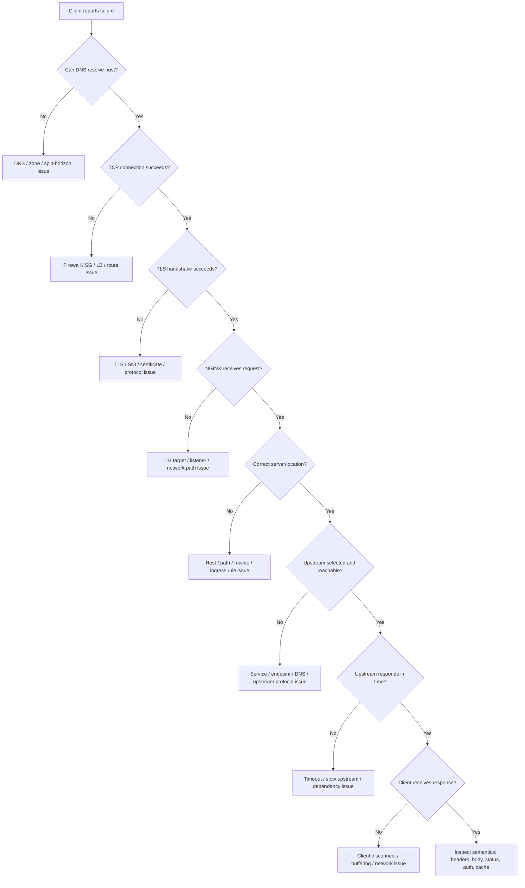

# Part 034 — Debugging Playbook for NGINX, Ingress, TLS, DNS, and Upstream Failures

## 1. Core Mental Model

NGINX debugging is traffic-path debugging.

Do not start by blaming the Java/JAX-RS application. Do not start by blaming Kubernetes. Do not start by blaming NGINX either.

Start by locating where the request fails.

```text
client
  -> DNS
  -> network / firewall / security group
  -> cloud or on-prem load balancer
  -> NGINX / Ingress Controller
  -> Kubernetes Service
  -> EndpointSlice / Pod IP
  -> Java/JAX-RS runtime
  -> downstream dependency
```

Every failure should be mapped to one of these boundaries:

- name resolution,
- TCP connectivity,
- TLS handshake,
- HTTP parsing,
- virtual host selection,
- location/path matching,
- auth/security policy,
- request body handling,
- upstream selection,
- upstream connection,
- upstream response wait,
- response streaming/buffering,
- client disconnect,
- observability gap.

Senior debugging rule:

> A status code is a symptom. The failing boundary is the diagnosis.

## 2. First Five Questions During Incident

Ask these before touching config:

1. Is the failure before NGINX, inside NGINX, between NGINX and upstream, or inside the Java/JAX-RS service?
2. Is the failure global, per host, per path, per tenant, per region, per client type, or per request size?
3. Did the failure start after a config, deployment, certificate, DNS, cloud LB, or network change?
4. Is the status code generated by NGINX, cloud LB, API gateway, app, or browser/client?
5. Do logs contain request ID/correlation ID across NGINX and application?

If these are unknown, gather evidence before changing anything.

## 3. Minimum Evidence to Capture

For one failing request, capture:

```text
timestamp:
client IP / source network:
host:
path:
method:
status code:
request ID / correlation ID:
response time:
upstream status:
upstream address:
upstream response time:
request body size:
user agent / client type:
TLS protocol / SNI if relevant:
```

Useful NGINX log fields:

```nginx
$remote_addr
$realip_remote_addr
$host
$request_method
$request_uri
$status
$request_time
$upstream_status
$upstream_addr
$upstream_connect_time
$upstream_header_time
$upstream_response_time
$body_bytes_sent
$request_length
$http_x_request_id
$http_traceparent
```

Without upstream status and upstream timing, many 502/503/504 investigations become guesswork.

## 4. Debugging Flow Diagram



## 5. Toolbelt

### HTTP and routing

```bash
curl -v https://quote.example.internal/api/quote-order/health
curl -vk https://quote.example.internal/api/quote-order/health
curl -v -H 'Host: quote.example.internal' https://<lb-ip>/api/quote-order/health
curl -v -H 'X-Request-ID: debug-123' https://quote.example.internal/api/quote-order/health
curl -v -X OPTIONS https://quote.example.internal/api/quote-order/resource \
  -H 'Origin: https://app.example.internal' \
  -H 'Access-Control-Request-Method: POST'
```

### TLS

```bash
openssl s_client -connect quote.example.internal:443 -servername quote.example.internal -showcerts
openssl s_client -connect quote.example.internal:443 -servername quote.example.internal -alpn h2,http/1.1
```

### DNS

```bash
dig quote.example.internal
nslookup quote.example.internal
dig @<dns-server> quote.example.internal
kubectl exec -n <ns> <pod> -- nslookup quote.example.internal
kubectl exec -n <ns> <pod> -- nslookup service.namespace.svc.cluster.local
```

### Kubernetes

```bash
kubectl get ingress -A
kubectl describe ingress <name> -n <namespace>
kubectl get svc -n <namespace>
kubectl describe svc <service> -n <namespace>
kubectl get endpointslice -n <namespace>
kubectl get pods -n <namespace> -o wide
kubectl describe pod <pod> -n <namespace>
kubectl get events -n <namespace> --sort-by=.lastTimestamp
```

### Logs

```bash
kubectl logs deploy/<ingress-controller> -n <controller-namespace>
kubectl logs deploy/<app> -n <namespace>
kubectl logs <pod> -n <namespace> --previous
```

### Network path

```bash
kubectl exec -n <ns> <debug-pod> -- curl -v http://service.namespace.svc.cluster.local:8080/health
kubectl exec -n <ns> <debug-pod> -- nc -vz service.namespace.svc.cluster.local 8080
kubectl exec -n <ns> <debug-pod> -- tcpdump -nn -i any host <ip>
```

Use `tcpdump` carefully. It may expose sensitive data and may require elevated privileges.

## 6. Debugging 400 Bad Request

Typical meaning:

> NGINX or another HTTP layer rejected the request as malformed or invalid before normal upstream handling.

Common causes:

- invalid HTTP syntax,
- oversized header,
- invalid Host header,
- malformed request line,
- invalid chunked transfer,
- request smuggling protection,
- bad client/proxy behavior,
- TLS sent to HTTP port,
- HTTP sent to HTTPS port,
- bad encoded URI.

Checks:

```bash
curl -v http://host:443/
curl -vk https://host/
```

Inspect:

- error log around timestamp,
- request header size,
- client protocol,
- load balancer protocol configuration,
- whether upstream app ever received the request.

Java/JAX-RS impact:

- If request never reaches app, application logs will be empty.
- Do not debug JAX-RS resource matching until you prove NGINX forwarded the request.

## 7. Debugging 401 Unauthorized

Typical meaning:

> Authentication is missing, invalid, expired, or rejected.

Potential source:

- NGINX basic auth,
- `auth_request` subrequest,
- external auth proxy,
- API gateway,
- Java/JAX-RS security filter,
- identity provider,
- mTLS client certificate validation.

Checks:

- Did NGINX generate 401 or upstream generate 401?
- Is `WWW-Authenticate` header present?
- Is auth subrequest returning 401?
- Are identity headers stripped or overwritten?
- Did TLS client cert validation fail?

Access log fields to compare:

```text
status=401 upstream_status=-       -> likely NGINX/auth layer
status=401 upstream_status=401     -> likely upstream/app/auth service
```

Java/JAX-RS impact:

- If app receives unauthenticated request because NGINX failed open, this is security-critical.
- If app expects identity header but proxy stripped it, all requests may become anonymous.

## 8. Debugging 403 Forbidden

Typical meaning:

> Request was understood but policy denies it.

Common causes:

- IP allowlist/denylist,
- mTLS client cert denied,
- `auth_request` returns 403,
- path denied by NGINX,
- WAF rule,
- missing role/permission in app,
- external auth service policy,
- Kubernetes/network policy indirectly causing auth failure.

Checks:

- Is denial based on client IP?
- Is real client IP correctly extracted?
- Did a cloud LB change source IP behavior?
- Is a sensitive path intentionally blocked?
- Did a WAF/modsecurity rule match?

Danger:

> If `X-Forwarded-For` trust is wrong, allowlist/denylist can block legitimate clients or allow spoofed clients.

## 9. Debugging 404 Not Found

Typical meaning:

> No route matched at some layer, or the backend returned not found.

Differentiate:

| Case | Meaning |
|---|---|
| `status=404 upstream_status=-` | NGINX/Ingress did not route to upstream. |
| `status=404 upstream_status=404` | Java/JAX-RS app likely returned 404. |
| Default backend 404 | Host/path did not match Ingress. |
| Only one path fails | Rewrite/location issue. |

Checks:

```bash
kubectl describe ingress <name> -n <namespace>
kubectl get ingress -A | grep quote.example.internal
curl -v -H 'Host: quote.example.internal' https://<lb-ip>/api/quote-order/foo
```

Common causes:

- wrong Host header,
- missing Ingress rule,
- wrong `pathType`,
- regex mismatch,
- rewrite target strips prefix,
- trailing slash behavior,
- Java/JAX-RS base path mismatch,
- context root mismatch,
- wrong backend service.

Java/JAX-RS checks:

- actual `@Path` base,
- application context path,
- deployment base URI,
- generated OpenAPI/server URL,
- reverse proxy prefix awareness.

## 10. Debugging 408 Request Timeout

Typical meaning:

> Client did not send request headers/body fast enough for NGINX timeout policy.

Common causes:

- slow client network,
- large upload over slow connection,
- `client_header_timeout` too low,
- `client_body_timeout` too low,
- proxy/load balancer idle behavior,
- client paused during upload.

Checks:

- request body size,
- upload duration,
- source network,
- client type,
- NGINX error log,
- cloud LB timeout.

Do not fix by blindly increasing all timeouts. Increasing timeouts also increases resource occupancy.

## 11. Debugging 413 Payload Too Large

Typical meaning:

> Request body exceeds configured limit.

Common causes:

- `client_max_body_size` too low,
- Ingress body size annotation too low,
- cloud/API gateway body limit,
- application server body limit,
- multipart upload unexpectedly large,
- base64 payload bloat.

Checks:

```bash
curl -v -F file=@large.bin https://host/api/upload
kubectl describe ingress <name> -n <namespace> | grep -i body
```

Ask:

- Which layer generated 413?
- Is this endpoint supposed to accept large payloads?
- Is upload streamed or buffered?
- Is temp disk sufficient?
- Should large files go to object storage instead of through Java/JAX-RS service?

## 12. Debugging 414 URI Too Large

Typical meaning:

> Request URI is too long.

Common causes:

- huge query string,
- client sends payload in URL instead of body,
- redirect loop appends parameters repeatedly,
- frontend encodes state into query string,
- SSO/OIDC callback too large,
- proxy header/buffer limit.

Checks:

- request URI length,
- query string content,
- redirect chain,
- browser vs API client difference,
- SSO callback behavior.

Design guidance:

- Use POST body for large request data.
- Avoid putting sensitive data in URL because URLs are logged more widely.

## 13. Debugging 429 Too Many Requests

Typical meaning:

> Rate limit, connection limit, WAF, API gateway, or application quota rejected the request.

Checks:

- Is 429 generated by NGINX or app?
- Is `Retry-After` present?
- What is rate limit key?
- Does key collapse many users behind NAT/proxy?
- Is tenant-aware rate limiting needed?
- Did a deployment change real client IP extraction?

NGINX-specific causes:

- `limit_req` too strict,
- `burst` too low,
- `nodelay` behavior misunderstood,
- `limit_conn` key too broad,
- per-IP limit applied behind corporate NAT.

Java/JAX-RS impact:

- If NGINX blocks before app, app metrics may look normal while customers fail.
- Observability must include rate limit rejection at edge.

## 14. Debugging 499 Client Closed Request

Typical meaning:

> NGINX observed that the client closed the connection before NGINX could send the response.

Important:

499 is NGINX-specific. It often indicates client impatience, upstream slowness, timeout mismatch, or network interruption.

Common causes:

- browser/client timeout shorter than upstream response,
- mobile network disconnect,
- load balancer idle timeout,
- user navigated away,
- upstream Java service too slow,
- large response download interrupted,
- SSE/WebSocket disconnect,
- retrying client cancels previous request.

Checks:

- compare `$request_time` and `$upstream_response_time`,
- inspect client timeout config,
- inspect endpoint latency,
- check whether 499 spike aligns with 504 spike,
- check whether only large downloads are affected.

Interpretation:

| Pattern | Likely Meaning |
|---|---|
| 499 with high upstream time | Backend too slow for client. |
| 499 with low upstream time | Client/network aborted early. |
| 499 spike after deploy | Timeout/routing/performance regression. |
| 499 only on streaming | Long-lived connection handling issue. |

## 15. Debugging 500 Internal Server Error

Typical meaning:

> A server-side component failed, but the generating layer matters.

Possibilities:

- Java/JAX-RS app returned 500,
- auth service returned 500,
- NGINX internal error,
- Lua/script/snippet error if used,
- upstream gateway returned 500,
- WAF error.

Differentiate:

```text
status=500 upstream_status=500   -> upstream/app likely returned 500
status=500 upstream_status=-     -> NGINX/auth/snippet/controller layer likely generated it
```

Java/JAX-RS checks:

- exception stack trace,
- request ID correlation,
- dependency timeout,
- DB pool exhaustion,
- invalid input not handled,
- downstream 5xx mapping,
- error handler behavior.

NGINX checks:

- error log,
- snippet/config extension,
- auth subrequest status,
- upstream response header validity.

## 16. Debugging 502 Bad Gateway

Typical meaning:

> NGINX tried to proxy to upstream but received an invalid response, connection failure, reset, or protocol mismatch.

Common causes:

- backend port wrong,
- backend protocol mismatch HTTP vs HTTPS,
- upstream closes connection,
- Java process crashed,
- pod restarted,
- upstream sent invalid header,
- TLS verification to upstream failed,
- gRPC/HTTP2 mismatch,
- NGINX cannot connect to Service/Pod,
- connection reset during response.

Checks:

```bash
kubectl get svc <service> -n <namespace> -o yaml
kubectl get endpointslice -n <namespace>
kubectl get pods -n <namespace> -o wide
kubectl logs deploy/<app> -n <namespace>
kubectl exec -n <ns> <debug-pod> -- curl -v http://<service>:<port>/health
```

NGINX error log examples to look for:

```text
connect() failed
upstream prematurely closed connection
upstream sent invalid header
SSL_do_handshake() failed
no live upstreams
connection reset by peer
```

JAX-RS-specific suspects:

- app server closes socket during shutdown,
- response headers too large,
- exception before valid HTTP response,
- container thread pool exhausted,
- reverse proxy expects HTTP but service port serves HTTPS,
- readiness says ready before HTTP server is actually ready.

## 17. Debugging 503 Service Unavailable

Typical meaning:

> No service capacity is available, route has no ready backend, or policy intentionally rejects service.

Common causes:

- Kubernetes Service has no endpoints,
- pods not ready,
- wrong Service selector,
- wrong targetPort,
- Ingress points to missing Service,
- upstream marked down,
- rate/connection limiting depending on config,
- maintenance mode,
- controller reload/config issue.

Checks:

```bash
kubectl describe ingress <name> -n <namespace>
kubectl describe svc <service> -n <namespace>
kubectl get endpointslice -n <namespace> -l kubernetes.io/service-name=<service>
kubectl get pods -n <namespace> -l app=<app> -o wide
kubectl describe pod <pod> -n <namespace>
```

Look for:

- readiness probe failing,
- selector mismatch,
- no endpoint addresses,
- targetPort name mismatch,
- deployment scaled to zero,
- crashlooping pods,
- network policy blocking.

## 18. Debugging 504 Gateway Timeout

Typical meaning:

> NGINX connected or attempted to proxy, but upstream did not respond within configured timeout.

Common causes:

- Java/JAX-RS endpoint slow,
- database query slow,
- downstream service timeout,
- thread pool exhausted,
- connection pool exhausted,
- long-running request exceeds `proxy_read_timeout`,
- upstream connection cannot be established before `proxy_connect_timeout`,
- timeout mismatch between LB, NGINX, app, and client.

Checks:

- `$upstream_connect_time`,
- `$upstream_header_time`,
- `$upstream_response_time`,
- Java request latency,
- database latency,
- thread pool metrics,
- connection pool metrics,
- downstream call metrics.

Timeout chain:

```text
client timeout
  < cloud LB idle timeout
  < NGINX proxy timeout
  < Java server timeout
  < downstream timeout
```

This is not always the right ordering, but every system must have an intentional ordering.

Immediate action:

- If caused by bad timeout rollout, rollback.
- If caused by upstream slowness, reduce traffic or mitigate backend bottleneck.
- If caused by one dependency, isolate endpoint/tenant if possible.

## 19. Debugging Wrong Upstream

Symptoms:

- response from wrong service,
- wrong version responds,
- tenant routed to wrong backend,
- default backend response,
- 404 from unexpected app,
- certificate/host mismatch,
- logs appear in wrong service.

Common causes:

- `server_name` mismatch,
- Ingress host conflict,
- path precedence issue,
- regex path captures too broadly,
- rewrite target wrong,
- Service selector points to wrong pods,
- port name collision,
- canary/blue-green weight wrong,
- default backend catches traffic.

Checks:

```bash
kubectl get ingress -A | grep <host>
kubectl describe ingress <name> -n <namespace>
kubectl get svc <service> -n <namespace> -o yaml
kubectl get pods -n <namespace> --show-labels
```

Add temporary evidence headers only if safe and allowed:

```nginx
add_header X-Upstream-Addr $upstream_addr always;
add_header X-Request-ID $request_id always;
```

Do not expose internal topology headers publicly unless approved.

## 20. Debugging TLS Handshake Failure

Symptoms:

- browser certificate warning,
- `curl: SSL certificate problem`,
- `wrong version number`,
- `handshake failure`,
- client cert required but not provided,
- cert works for one hostname but not another.

Checks:

```bash
openssl s_client -connect host:443 -servername host -showcerts
openssl s_client -connect host:443 -servername host -alpn h2,http/1.1
curl -vk https://host/
```

Common causes:

- wrong certificate secret,
- missing intermediate chain,
- expired certificate,
- SAN does not include hostname,
- SNI not sent by client,
- TLS protocol version mismatch,
- unsupported cipher suite,
- mTLS CA mismatch,
- TLS termination happened earlier than expected,
- upstream TLS verification fails.

Kubernetes checks:

```bash
kubectl get secret <tls-secret> -n <namespace> -o yaml
kubectl describe certificate <name> -n <namespace>   # if cert-manager is used
kubectl describe ingress <name> -n <namespace>
```

Internal verification:

- certificate owner,
- rotation process,
- alerting before expiry,
- internal CA trust distribution,
- cloud certificate manager integration.

## 21. Debugging DNS Resolution

Symptoms:

- client cannot resolve hostname,
- NGINX cannot resolve upstream hostname,
- only some regions/networks fail,
- internal users resolve private IP while external users resolve public IP,
- stale upstream IP used after service change.

Checks:

```bash
dig host
nslookup host
dig @8.8.8.8 host
dig @<corporate-dns> host
kubectl exec -n <ns> <pod> -- nslookup service.namespace.svc.cluster.local
kubectl exec -n <ns> <pod> -- cat /etc/resolv.conf
```

Common causes:

- wrong DNS zone,
- split-horizon DNS mismatch,
- stale TTL,
- CoreDNS issue,
- ExternalName misconfiguration,
- NGINX static DNS resolution behavior,
- missing `resolver` for variable-based upstream,
- cloud private DNS zone not linked to VNet/VPC.

Debug principle:

> Always test DNS from the same network namespace where the failing component runs.

Client DNS success does not prove NGINX pod DNS success.

## 22. Debugging Timeout Chain

Symptoms:

- intermittent 504,
- 499 before backend completes,
- requests fail at fixed duration,
- long upload/download fails,
- WebSocket disconnect at predictable interval.

Map every timeout:

```text
client timeout:
CDN/API gateway timeout:
cloud LB idle timeout:
NGINX client timeout:
NGINX proxy connect timeout:
NGINX proxy read timeout:
Ingress annotation timeout:
Java HTTP server timeout:
Java downstream client timeout:
database timeout:
message broker timeout:
```

Fixed-duration failures are highly diagnostic.

Examples:

| Failure At | Suspect |
|---:|---|
| 30s | client, gateway, app default, downstream default. |
| 60s | NGINX/LB idle timeout common pattern. |
| 120s | proxy read timeout or app timeout. |
| 300s | load balancer/proxy idle timeout. |

Do not tune only the layer that reports the error. Tune the chain intentionally.

## 23. Debugging Header Loss or Header Spoofing

Symptoms:

- backend sees HTTP instead of HTTPS,
- generated redirect uses wrong host/scheme,
- real client IP missing,
- user identity missing,
- tenant header lost,
- auth bypass suspected,
- CORS behavior changed.

Headers to inspect:

```text
Host
Forwarded
X-Forwarded-For
X-Forwarded-Host
X-Forwarded-Proto
X-Real-IP
X-Request-ID
traceparent
Authorization
Cookie
Origin
Access-Control-Request-Method
```

Checks:

```bash
curl -v https://host/path -H 'X-Request-ID: debug-123'
```

If safe, add backend endpoint that returns selected request metadata in non-production only.

Security rule:

> Identity and client-IP headers must be overwritten at trusted boundary, not blindly passed from the internet.

## 24. Debugging Body Size and Upload Failures

Symptoms:

- upload fails at exact size,
- 413 from NGINX,
- 502 during upload,
- 504 after large upload,
- Java app never receives request,
- temp disk grows.

Check all body limits:

- cloud gateway/body limit,
- NGINX `client_max_body_size`,
- Ingress body size annotation,
- application server limit,
- multipart parser limit,
- API gateway limit,
- WAF limit.

Buffering checks:

- request buffering on/off,
- temp file path,
- available disk,
- slow client behavior,
- upstream ability to stream request body.

Design question:

> Should this payload pass through Java/JAX-RS at all, or should clients upload directly to object storage with a signed URL?

## 25. Debugging WebSocket Failure

Symptoms:

- connection upgrades fail,
- disconnect after fixed duration,
- only works locally, fails behind Ingress,
- 400/426/502 on upgrade,
- sticky session issue.

Required headers:

```text
Upgrade: websocket
Connection: Upgrade
```

Checks:

```bash
curl -i -N \
  -H "Connection: Upgrade" \
  -H "Upgrade: websocket" \
  -H "Host: host" \
  https://host/ws
```

Common causes:

- upgrade headers not forwarded,
- proxy HTTP version wrong,
- idle timeout too low,
- load balancer timeout too low,
- sticky session missing,
- backend pod restart,
- auth cookie not sent,
- TLS termination/redirect loop.

Java/JAX-RS note:

WebSocket may not be handled by JAX-RS itself; it may be handled by the app server, framework, or separate endpoint. Verify runtime ownership.

## 26. Debugging SSE Buffering

Symptoms:

- server emits events but client receives them late,
- events arrive in batches,
- connection closes after idle period,
- response appears stuck behind proxy.

Common causes:

- `proxy_buffering` enabled,
- compression buffering,
- response headers missing,
- idle timeout too low,
- load balancer buffering,
- app does not flush output,
- heartbeat interval longer than proxy timeout.

SSE expectations:

```text
Content-Type: text/event-stream
Cache-Control: no-cache
Connection kept open
Periodic flush/heartbeat
Proxy buffering disabled when necessary
```

Checks:

```bash
curl -N -v https://host/events
```

If `curl -N` receives events promptly inside cluster but not through NGINX, suspect proxy buffering or LB behavior.

## 27. Debugging Ingress Annotation Conflict

Symptoms:

- annotation appears ignored,
- behavior differs between namespaces,
- one Ingress affects another,
- controller logs warning about rejected config,
- host/path conflict,
- rewrite not applied,
- canary not working.

Checks:

```bash
kubectl describe ingress <name> -n <namespace>
kubectl get ingress -A | grep <host>
kubectl logs deploy/<ingress-controller> -n <controller-namespace> | grep -i <ingress-name>
```

Potential causes:

- wrong ingress class,
- annotation unsupported by controller implementation,
- annotation disabled by policy,
- snippets disabled,
- global ConfigMap overrides behavior,
- multiple Ingress resources define same host/path,
- canary requires matching base Ingress,
- path type not compatible with regex expectation.

Internal verification:

- community ingress-nginx vs NGINX Inc controller,
- supported annotation list,
- unsafe annotation policy,
- admission webhook behavior,
- rendered NGINX config visibility.

## 28. Debugging with Rendered NGINX Config

When using an ingress controller, the Kubernetes object is not the final runtime behavior. The controller renders NGINX config from Kubernetes resources plus ConfigMap plus annotations plus templates.

If allowed, inspect rendered config:

```bash
kubectl exec -n <controller-ns> <controller-pod> -- nginx -T
```

Use carefully because rendered config may include sensitive paths, headers, or secret references.

Look for:

- server block for host,
- location block for path,
- upstream definition,
- proxy headers,
- timeout directives,
- body size directives,
- rewrite directives,
- auth subrequest config,
- rate limit zones,
- TLS server config.

Debug rule:

> If Kubernetes YAML and runtime behavior disagree, inspect the rendered NGINX config or controller logs.

## 29. Debugging Cloud Load Balancer vs NGINX

Symptoms:

- NGINX logs show nothing,
- request fails before reaching ingress,
- source IP unexpected,
- TLS cert is not from NGINX,
- idle timeout differs from NGINX config,
- health checks fail at LB level.

Questions:

- Does TLS terminate at cloud LB or NGINX?
- Does LB forward HTTP, HTTPS, TCP, or Proxy Protocol?
- Does LB health check target the correct path/port?
- Is source IP preserved?
- Are security groups/NSGs/firewall rules correct?
- Are LB targets healthy?
- Is LB using node target or pod IP target?

Evidence:

- cloud LB access logs,
- target group health,
- security group/NSG flow logs,
- NGINX access log,
- Kubernetes Service status,
- controller events.

## 30. Debugging Java/JAX-RS Backend Behind NGINX

When request reaches Java service, NGINX may still influence behavior.

Common proxy-induced app issues:

- app generates `http://` redirects behind HTTPS proxy,
- wrong absolute URL because Host header changed,
- real client IP missing,
- request body already buffered causing different streaming behavior,
- app receives rewritten path and cannot match resource,
- app sees proxy IP and applies wrong allowlist logic,
- app times out because NGINX retry caused duplicate load,
- idempotency broken by proxy retry,
- auth identity header missing or spoofed.

Application checks:

- access log with request ID,
- route/resource matched,
- generated base URI,
- framework trusted proxy settings,
- exception logs,
- request body parser limits,
- thread pool and connection pool metrics,
- graceful shutdown logs.

JAX-RS-specific checklist:

- `ApplicationPath`,
- resource `@Path`,
- reverse proxy base path,
- URI builder behavior,
- redirect response `Location` header,
- exception mapper behavior,
- filter/interceptor order,
- auth/security context population.

## 31. Incident Triage Matrix

| Symptom | First Boundary to Check |
|---|---|
| Host does not resolve | DNS. |
| TCP connect fails | Network/LB/firewall/security group. |
| TLS warning | Certificate/SNI/termination point. |
| NGINX logs nothing | Before NGINX: LB/DNS/network. |
| Default backend 404 | Ingress host/path matching. |
| 404 with upstream 404 | Java/JAX-RS routing/base path. |
| 502 | Upstream connection/protocol/reset. |
| 503 | No endpoint/upstream unavailable. |
| 504 | Timeout chain/upstream slowness. |
| 499 | Client disconnect or timeout mismatch. |
| Upload fails | Body size/buffering/temp disk. |
| SSE delayed | Proxy buffering/compression/flush. |
| WebSocket drops | Upgrade headers/idle timeout/stickiness. |
| Auth suddenly fails | Auth boundary/header/cert policy. |
| Only one tenant fails | Tenant routing/header/config/data. |

## 32. Production Debugging Checklist

During incident:

- identify failing host/path/method,
- capture one request ID,
- check whether NGINX received it,
- check status vs upstream status,
- check upstream address and timing,
- check recent changes,
- check Kubernetes events,
- check Service endpoints,
- check controller logs,
- check Java app logs,
- check cloud LB health,
- check DNS/TLS only if symptoms point there,
- avoid blind config changes.

Before mitigation:

- know expected blast radius,
- choose rollback vs forward fix,
- preserve evidence,
- communicate customer impact,
- avoid making observability worse.

After mitigation:

- verify traffic recovery,
- verify no delayed 499/504 spike,
- verify tenant-specific recovery,
- capture root cause hypothesis,
- create follow-up action.

## 33. Internal Verification Checklist

Verify internally:

- Where are NGINX access logs stored?
- Where are NGINX error logs stored?
- Does log format include upstream status and timing?
- Can request ID be correlated to Java/JAX-RS logs?
- Which Ingress Controller implementation is used?
- Can engineers inspect rendered NGINX config?
- Which annotations are allowed/blocked?
- Who owns cloud load balancer configuration?
- Who owns DNS and certificate rotation?
- What is the standard debug pod/toolbox image?
- Are `curl`, `dig`, `openssl`, `tcpdump`, and `kubectl` available during incident?
- What are the standard dashboards for 499/502/503/504?
- Are prior incident notes searchable?
- Is there a runbook for bad ingress/config rollback?

## 34. Anti-Patterns

Avoid these:

- increasing timeout without understanding the slow boundary,
- blaming app for 404 before checking Ingress path/rewrite,
- blaming NGINX for 500 without checking upstream status,
- debugging DNS from laptop only,
- testing backend directly and assuming edge path works,
- relying on `kubectl apply` success as proof,
- ignoring cloud LB logs,
- disabling TLS verification to "fix" upstream TLS,
- enabling broad snippets during incident,
- adding headers that expose internal topology publicly,
- increasing body size globally for one upload endpoint,
- expanding canary while metrics are unclear,
- deleting pods blindly to "reset" traffic,
- rolling forward when rollback is safer.

## 35. Senior Engineer Closing Model

Effective NGINX debugging is structured elimination.

You are not trying to memorize every directive. You are trying to answer:

```text
Did the request reach this layer?
Did this layer understand it?
Did this layer route it to the intended next hop?
Did the next hop accept the connection?
Did the next hop respond in time?
Did the response return to the client unchanged enough to satisfy the contract?
```

Final takeaway:

> Debug from the client-visible symptom to the failing boundary, then from the failing boundary to the responsible configuration, dependency, or code path.
