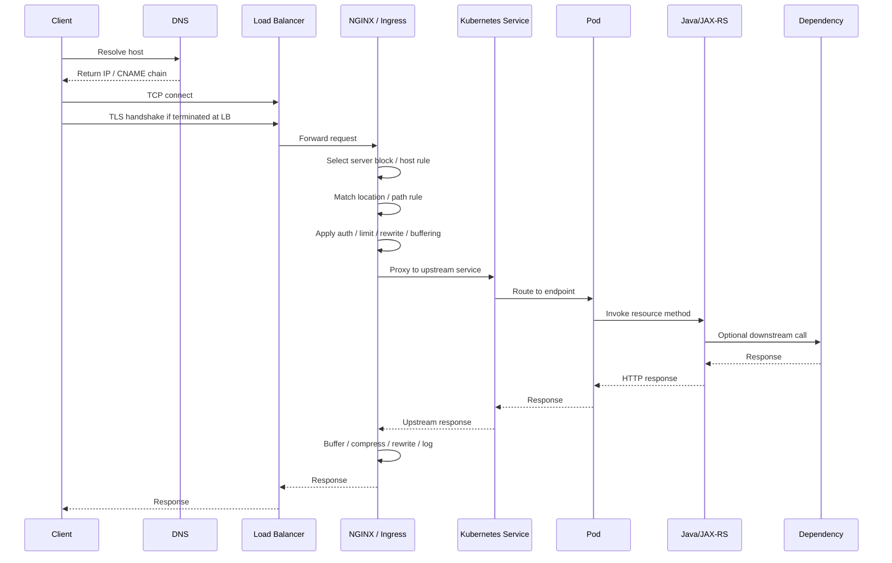

# Part 035 — NGINX Mastery Map for Senior Backend Engineer

## 1. Core Thesis

NGINX mastery is not memorizing directives.

NGINX mastery is the ability to reason about traffic.

For a senior Java/JAX-RS engineer, NGINX should be understood as a production boundary that can:

- receive traffic,
- terminate TLS,
- select virtual hosts,
- normalize paths,
- enforce security policy,
- rewrite headers,
- buffer requests and responses,
- proxy to upstream services,
- load-balance across backends,
- hide upstream failures,
- generate misleading status codes,
- amplify retry storms,
- protect Java services from overload,
- or accidentally break API semantics.

The important question is not:

```text
What directive should I use?
```

The important question is:

```text
At which boundary is request behavior changed, delayed, rejected, retried, buffered, terminated, or hidden?
```

This final part turns the whole series into a mastery map.

Use it as:

- a PR review checklist,
- an incident triage checklist,
- an architecture discussion map,
- a production readiness checklist,
- a learning map for real internal systems.

## 2. Complete NGINX Mental Model

NGINX can appear in multiple forms.

```text
client
  -> DNS
  -> cloud/on-prem load balancer
  -> NGINX reverse proxy
  -> NGINX Ingress Controller
  -> Kubernetes Service
  -> Pod
  -> Java/JAX-RS endpoint
```

But in real systems, not every layer exists.

You may see one of these patterns:

```text
Pattern A: Cloud LB -> Java service
Pattern B: Cloud LB -> NGINX -> Java service
Pattern C: Cloud LB -> NGINX Ingress -> Service -> Pod
Pattern D: API Gateway -> NGINX Ingress -> Service -> Pod
Pattern E: L4 LB -> NGINX -> Kubernetes Ingress -> Java service
Pattern F: Front Door / CDN -> WAF -> LB -> NGINX -> Java service
Pattern G: Service mesh sidecar + NGINX edge
```

A senior engineer must first identify which pattern exists before making conclusions.

Do not assume:

- NGINX terminates TLS,
- NGINX sees the real client IP,
- NGINX generated the status code,
- Ingress annotations are applied globally,
- Kubernetes Service routes directly to healthy Pods,
- Java receives the same URI that the client sent,
- timeout values are aligned,
- retries are safe,
- logs contain the full request path.

Treat every layer as a possible behavior-changing boundary.

## 3. The Request Lifecycle Recap

A request is not a single event. It is a chain of transitions.



Every production issue should be mapped to this lifecycle.

The diagnostic move is:

```text
Symptom -> failing boundary -> evidence -> config/runtime cause -> safe remediation
```

Not:

```text
Symptom -> guess -> config change -> hope
```

## 4. Boundary Map

Use this table when reviewing incidents or PRs.

| Boundary | What can fail | Evidence | Typical owner |
|---|---|---|---|
| DNS | wrong record, stale record, split-horizon mismatch | `dig`, `nslookup`, DNS zone, CoreDNS logs | platform/network/cloud |
| TCP | firewall, SG, NSG, route, listener, port mismatch | connect timeout, SYN failure, LB health | network/platform |
| TLS | cert mismatch, SNI issue, expired cert, unsupported protocol | `openssl s_client`, browser error, LB logs | platform/security |
| Load balancer | target unhealthy, wrong listener, source IP loss, idle timeout | LB metrics, target group health | cloud/platform |
| NGINX server selection | wrong host/default server | access log `$host`, server block, Ingress host | platform/app |
| Location/path | wrong location, bad rewrite, trailing slash issue | request URI, upstream URI, access log | app/platform |
| Auth/security | 401/403, blocked header/path/method | access/error logs, auth service logs | security/app/platform |
| Body handling | 413, buffering, temp disk issue | request length, body size, disk metrics | app/platform |
| Upstream selection | no endpoints, wrong service, wrong port | upstream addr/status, Endpoints/EndpointSlice | platform/app |
| Upstream behavior | slow app, connection refused, reset | upstream timing, app logs, pod events | app |
| Response handling | buffering, compression, cache, header rewrite | response headers, body timing | platform/app |
| Client behavior | 499, disconnect, slow client | access log status 499, request time | client/network |

## 5. Reverse Proxy Checklist

When NGINX sits in front of Java/JAX-RS services, validate these invariants.

### 5.1 Host and scheme invariants

The backend must know the externally correct host and scheme when it generates redirects, absolute links, callbacks, Location headers, OpenAPI URLs, or hypermedia links.

Check:

```nginx
proxy_set_header Host $host;
proxy_set_header X-Forwarded-Host $host;
proxy_set_header X-Forwarded-Proto $scheme;
proxy_set_header X-Forwarded-For $proxy_add_x_forwarded_for;
```

But do not blindly trust these headers in the application.

The Java runtime should only trust forwarded headers from known proxy boundaries.

### 5.2 URI and base path invariants

The public path and backend path must be intentionally mapped.

Examples:

```text
Public:  /quote-order/api/v1/quotes
Backend: /api/v1/quotes
```

or:

```text
Public:  /api/quote-order/v1/quotes
Backend: /quote-order/v1/quotes
```

Both can work. Hidden rewrite is the danger.

Review:

- Does `proxy_pass` include a URI part?
- Is there a trailing slash mismatch?
- Does Ingress rewrite target strip or preserve prefix?
- Does the JAX-RS app know its external base path?
- Do redirects preserve the public path?

### 5.3 Error propagation invariants

Decide whether errors are passed through or transformed.

Questions:

- Does NGINX intercept upstream errors?
- Does it replace Java error bodies?
- Are 401/403 generated by NGINX, auth service, API gateway, or application?
- Are 502/503/504 visible as infrastructure errors?
- Can client-facing errors be correlated to upstream logs?

### 5.4 Client IP invariants

Real client IP is not automatic.

Check:

- cloud LB source IP behavior,
- Proxy Protocol,
- `X-Forwarded-For`,
- `X-Real-IP`,
- trusted proxy ranges,
- Java access log client IP,
- audit requirements.

A bad client IP model can break:

- fraud detection,
- tenant restrictions,
- rate limiting,
- audit logs,
- security investigations,
- regulatory evidence.

## 6. Kubernetes Ingress Checklist

For each Ingress that exposes Java/JAX-RS services, review these categories.

### 6.1 Identity

```bash
kubectl get ingress -A
kubectl get ingressclass
kubectl describe ingress <name> -n <namespace>
```

Verify:

- which controller owns it,
- whether `ingressClassName` is explicit,
- whether multiple controllers might process it,
- whether host/path rules are unique,
- whether TLS Secret is correct,
- whether annotations are platform-approved.

### 6.2 Routing

Check:

- host rule,
- path rule,
- path type,
- regex usage,
- rewrite target,
- backend service name,
- backend service port,
- backend protocol,
- default backend behavior,
- namespace boundary.

Important invariant:

```text
Ingress path -> rendered NGINX location -> Kubernetes Service -> EndpointSlice -> Pod port -> Java listener port
```

If any link is wrong, routing fails.

### 6.3 Runtime health

Check:

```bash
kubectl get svc -n <namespace>
kubectl get endpointslice -n <namespace>
kubectl get pods -n <namespace> -o wide
kubectl describe pod <pod> -n <namespace>
kubectl get events -n <namespace> --sort-by=.lastTimestamp
```

A valid Ingress does not mean there are healthy endpoints.

### 6.4 Annotation governance

Ingress annotations can override platform standards.

Dangerous categories:

- timeout overrides,
- body size overrides,
- proxy buffering overrides,
- auth bypass,
- CORS overrides,
- SSL redirect behavior,
- snippet annotations,
- custom headers,
- rewrite behavior,
- backend protocol changes.

Senior review question:

```text
Is this annotation a local service need, or is it weakening a platform invariant?
```

## 7. TLS Checklist

For every HTTPS path, identify the TLS topology.

```text
Client -> TLS at cloud LB -> HTTP to NGINX -> HTTP to app
Client -> TLS at NGINX -> HTTP to app
Client -> TLS at NGINX -> TLS to app
Client -> TLS passthrough -> app
Client -> Front Door/CDN/WAF TLS -> LB TLS -> NGINX TLS -> app TLS
```

Review:

- Where is TLS terminated?
- Is SNI used?
- Which certificate is presented externally?
- Is the certificate wildcard, SAN, or service-specific?
- Is the intermediate chain correct?
- Who rotates the certificate?
- What is the expiry alert?
- Is HSTS configured where appropriate?
- Is upstream TLS verified or merely encrypted?
- Is mTLS used for identity or only encryption?
- Are internal CAs trusted by NGINX?

TLS failure usually appears as:

- browser certificate error,
- handshake failure,
- wrong certificate for host,
- upstream SSL verification failure,
- 502 from failed upstream TLS,
- HTTP/2 negotiation issue,
- ALPN mismatch,
- SNI mismatch.

Minimal diagnostic command:

```bash
openssl s_client -connect <host>:443 -servername <host> -showcerts -alpn h2,http/1.1
```

## 8. Timeout Checklist

Timeouts must be designed as a chain.

```text
client timeout
  >= cloud LB idle timeout
  >= NGINX proxy/read timeout
  >= application server timeout
  >= downstream dependency timeout
  >= database/client timeout
```

This exact inequality may vary by system, but the principle must be intentional.

Avoid accidental configurations like:

```text
Client waits 60s
LB waits 30s
NGINX waits 120s
Java waits 180s
Database waits 300s
```

That creates confusing 504s, wasted work, and retry storms.

Review:

- `proxy_connect_timeout`,
- `proxy_send_timeout`,
- `proxy_read_timeout`,
- `send_timeout`,
- `client_body_timeout`,
- `keepalive_timeout`,
- cloud LB idle timeout,
- Java server request timeout,
- downstream HTTP client timeout,
- DB query timeout,
- message broker timeout,
- client SDK timeout.

Senior question:

```text
When a request is slow, which layer gives up first, and what status code does the caller see?
```

## 9. Retry Checklist

Retries are dangerous at proxy layers.

Review:

- Does NGINX retry upstreams with `proxy_next_upstream`?
- Which status codes trigger retry?
- Does retry include timeout?
- Are POST/PUT/PATCH retried?
- Are operations idempotent?
- Does backend implement idempotency keys?
- Are clients also retrying?
- Is API gateway retrying?
- Is service mesh retrying?
- Could retries multiply across layers?

A retry storm can turn a partial slowdown into a full outage.

Use this model:

```text
1 user request
  x client retries
  x gateway retries
  x NGINX retries
  x service mesh retries
  x Java HTTP client retries
  = amplified dependency pressure
```

Senior invariant:

```text
No retry policy should exist without an idempotency model and observability.
```

## 10. Header Checklist

Headers are a trust boundary.

Review categories:

### Forwarding headers

- `X-Forwarded-For`
- `X-Forwarded-Host`
- `X-Forwarded-Proto`
- `X-Real-IP`
- `Forwarded`

Check whether Java trusts them safely.

### Identity headers

- user ID,
- tenant ID,
- roles,
- scopes,
- auth subject,
- client certificate identity.

These must not be accepted from untrusted clients.

NGINX or gateway should remove spoofable inbound identity headers before setting trusted ones.

### Trace headers

- `traceparent`,
- `tracestate`,
- `X-Request-ID`,
- correlation ID.

Ensure they propagate consistently into app logs.

### Security headers

- `Strict-Transport-Security`,
- `Content-Security-Policy`,
- `X-Frame-Options`,
- `X-Content-Type-Options`,
- `Referrer-Policy`,
- `Permissions-Policy`.

Decide whether headers are owned by NGINX, application, CDN, API gateway, or platform policy.

## 11. Streaming and Large Payload Checklist

Streaming endpoints and large payload endpoints need special treatment.

Review:

- request body size,
- request buffering,
- response buffering,
- temporary file path,
- temp disk capacity,
- upload timeout,
- download timeout,
- backpressure behavior,
- SSE buffering,
- WebSocket upgrade headers,
- long polling timeout,
- file download Range support,
- Java memory behavior,
- application server max request size,
- multipart parser limit.

Common failure patterns:

```text
Large upload -> 413 at NGINX before Java sees it
Slow upload -> client_body_timeout
SSE -> messages delayed due to response buffering
WebSocket -> closed due to idle timeout
Download -> temp file disk pressure
Streaming -> proxy buffering destroys real-time behavior
```

Senior question:

```text
Is this endpoint request/response oriented, streaming oriented, or long-connection oriented?
```

Each requires different proxy assumptions.

## 12. Security Checklist

NGINX is not a substitute for application security, but it is an important enforcement layer.

Review:

- default server returns safe response,
- unknown hosts are rejected,
- dangerous paths are blocked,
- admin endpoints are not publicly exposed,
- request body size is limited,
- header size is limited,
- allowed methods are intentional,
- Host header is validated,
- identity headers are sanitized,
- CORS is not overly broad,
- HSTS is correct,
- TLS protocols/ciphers meet policy,
- WAF integration exists where required,
- snippets are governed,
- logs redact sensitive data,
- rate limits protect expensive endpoints,
- IP allowlists are maintained,
- internal endpoints are private,
- error responses do not leak internals.

Security anti-patterns:

```text
server_name _ with permissive routing
wildcard CORS with credentials
trusting X-Forwarded-For from the internet
passing user identity headers without stripping inbound copies
large unlimited request bodies
publicly exposed actuator/admin endpoints
snippet annotations enabled without governance
TLS verification disabled for upstream
logging Authorization/Cookie headers
```

## 13. Performance Checklist

Performance is not only NGINX throughput. It is end-to-end capacity.

Review:

- worker processes,
- worker connections,
- file descriptor limit,
- CPU saturation,
- memory usage,
- temp disk usage,
- keepalive with clients,
- upstream keepalive,
- connection reuse,
- TLS session reuse,
- HTTP/2 multiplexing,
- compression CPU cost,
- proxy buffering memory/disk cost,
- upstream latency distribution,
- p95/p99 request time,
- status code distribution,
- load balancer target health,
- Kubernetes HPA behavior,
- Java thread pool saturation,
- Java connection pool saturation.

Do not optimize NGINX blindly.

Use evidence:

```text
CPU high?           Check compression, TLS, log volume, workers.
Memory high?        Check buffers, connection count, temp behavior.
Disk high?          Check proxy temp files, large uploads/downloads.
Latency high?       Compare request_time vs upstream_response_time.
502/504 high?       Check upstream connect/read timing.
499 high?           Check client timeout, slow responses, network path.
```

## 14. Observability Checklist

A production-ready NGINX setup must answer these questions quickly:

- Which host/path is failing?
- Which upstream did NGINX choose?
- Did upstream respond?
- How long did connection/header/response phases take?
- Did the client disconnect?
- Was the request blocked by policy?
- Was the failure before or after NGINX?
- Can the same request be found in Java logs?
- Can the request be traced across services?

Recommended log fields:

```nginx
$time_iso8601
$request_id
$remote_addr
$realip_remote_addr
$host
$request_method
$request_uri
$server_protocol
$status
$request_time
$upstream_status
$upstream_addr
$upstream_connect_time
$upstream_header_time
$upstream_response_time
$request_length
$body_bytes_sent
$http_user_agent
$http_x_forwarded_for
$http_traceparent
```

Dashboard categories:

- request rate by host/path,
- 4xx/5xx rate,
- 499 count,
- 502/503/504 count,
- p50/p95/p99 request time,
- upstream response time,
- upstream connect time,
- active connections,
- dropped/rejected requests,
- rate limit hits,
- body size distribution,
- TLS/certificate health,
- controller reload count,
- NGINX pod restarts.

Alerting principle:

```text
Alert on customer-impacting symptoms and dangerous infrastructure signals.
Do not alert on noisy raw metrics without triage value.
```

## 15. Debugging Checklist

Use this flow during incidents.

### 15.1 Locate the failure boundary

```text
Does DNS resolve?
Can TCP connect?
Does TLS handshake succeed?
Does request reach NGINX?
Does NGINX select the expected host/location?
Does NGINX choose an upstream?
Can NGINX connect to upstream?
Does upstream respond in time?
Does client receive the response?
```

### 15.2 Classify status code

```text
400 -> malformed request / header / host / protocol issue
401 -> unauthenticated / auth challenge
403 -> forbidden / policy / allowlist / authz issue
404 -> wrong host/path/rewrite/backend route
408 -> client request timeout
413 -> body too large
414 -> URI too long
429 -> rate limited
499 -> client disconnected before response
500 -> app or proxy internal error depending on generator
502 -> bad gateway / upstream connection/protocol failure
503 -> unavailable upstream / overloaded / no endpoint / maintenance
504 -> gateway timeout / upstream too slow
```

### 15.3 Capture evidence

For one failing request:

```text
timestamp:
host:
path:
method:
status:
request ID:
client IP:
upstream addr:
upstream status:
upstream connect time:
upstream response time:
request time:
request size:
response size:
NGINX pod:
backend pod:
recent deploy/change:
```

### 15.4 Compare layers

```text
Cloud LB logs vs NGINX access logs
NGINX access logs vs NGINX error logs
NGINX upstream fields vs Kubernetes endpoints
Kubernetes events vs application logs
Application logs vs downstream dependency logs
```

### 15.5 Avoid unsafe fixes

Do not blindly:

- increase all timeouts,
- disable TLS verification,
- bypass auth,
- disable buffering globally,
- allow huge body sizes globally,
- enable broad CORS,
- retry all requests,
- expose debug endpoints publicly,
- change global ConfigMap for one endpoint,
- restart everything without evidence.

## 16. Production Readiness Checklist

Before exposing a Java/JAX-RS service through NGINX or Ingress, verify:

### Routing

- host is correct,
- path is correct,
- rewrite is intentional,
- backend service and port are correct,
- health endpoint is reachable,
- default backend behavior is safe,
- route does not conflict with another Ingress.

### TLS

- certificate is valid,
- SAN matches hostname,
- chain is complete,
- expiry alert exists,
- TLS termination point is known,
- upstream TLS behavior is intentional,
- mTLS policy is documented if used.

### Headers

- Host is preserved or intentionally changed,
- forwarded headers are correct,
- identity headers are sanitized,
- trace headers propagate,
- security headers are applied consistently.

### Timeout

- client/LB/NGINX/app/dependency timeout chain is aligned,
- long-running endpoints are documented,
- retry policy is safe,
- 499/504 dashboards exist.

### Body and streaming

- body size limit fits endpoint needs,
- upload/download behavior is tested,
- streaming endpoints disable buffering where needed,
- WebSocket/SSE idle timeout is aligned,
- temp disk capacity is monitored.

### Security

- auth boundary is clear,
- public/private endpoint exposure is reviewed,
- rate limit exists where needed,
- CORS is reviewed,
- sensitive headers are not logged,
- snippets and annotations follow platform policy.

### Observability

- access log format includes request and upstream timing,
- error logs are accessible,
- request ID flows into Java logs,
- dashboards exist,
- alerts exist,
- runbook exists.

### Rollback

- config validation exists,
- change is reviewed,
- rollout strategy is defined,
- rollback path is tested,
- blast radius is limited.

## 17. PR Review Framework

When reviewing a PR that touches NGINX, Ingress, Helm values, ConfigMap, TLS, DNS, or load balancer annotations, use this sequence.

### 17.1 What behavior changes?

Ask:

- Is routing changed?
- Is TLS changed?
- Is auth changed?
- Is timeout changed?
- Is retry changed?
- Is body size changed?
- Is buffering changed?
- Is rate limiting changed?
- Is header behavior changed?
- Is observability changed?

If the answer is unclear, the PR is not reviewable enough.

### 17.2 What is the blast radius?

Ask:

- one service or all services?
- one host or wildcard host?
- one namespace or controller-wide?
- one environment or all environments?
- public traffic or internal traffic?
- synchronous request path or async callback path?
- short-lived requests or long-lived connections?

### 17.3 What failure mode is introduced?

Ask:

- wrong backend?
- TLS failure?
- 404 due to rewrite?
- 413 due to body limit?
- 504 due to timeout?
- 499 due to client timeout mismatch?
- auth bypass?
- CORS breakage?
- real client IP loss?
- trace propagation loss?
- cache poisoning?
- increased retry load?

### 17.4 What evidence proves it works?

Require:

- rendered manifest/config,
- example request before/after,
- smoke test command,
- expected headers,
- expected status code,
- expected upstream service,
- dashboard/log field to verify,
- rollback plan.

### 17.5 What should be tested?

At minimum:

```bash
curl -v https://<host>/<path>
curl -v -H 'Host: <host>' https://<lb-ip>/<path>
curl -vk https://<host>/<path>
openssl s_client -connect <host>:443 -servername <host> -showcerts
kubectl describe ingress <name> -n <namespace>
kubectl get endpointslice -n <namespace>
```

For special cases:

- upload test,
- WebSocket test,
- SSE test,
- CORS preflight test,
- auth failure test,
- rate limit test,
- redirect test,
- timeout test,
- gRPC health test.

## 18. Architecture Decision Framework

When deciding whether to use NGINX, API Gateway, Gateway API, service mesh, or cloud LB, separate concerns.

| Concern | Best-fit layer depends on |
|---|---|
| TLS termination | certificate ownership, mTLS, edge policy |
| Public API governance | API gateway, developer portal, auth, quotas |
| Simple host/path routing | Ingress / NGINX |
| L4 load balancing | cloud LB / on-prem LB |
| Advanced L7 routing | NGINX / Gateway API / API gateway |
| East-west mTLS | service mesh |
| Per-user quota | API gateway / app / distributed limiter |
| Per-IP protection | NGINX / WAF / CDN |
| WAF/bot mitigation | CDN/WAF/edge gateway |
| Service-to-service observability | service mesh / app instrumentation |
| Static assets | CDN / NGINX depending on topology |
| Internal admin route protection | network policy + auth + private ingress |

Senior architecture question:

```text
Which layer owns this behavior, and how do we prevent another layer from contradicting it?
```

## 19. Internal Verification Checklist

Because internal CSG/team architecture is not provided here, these items must be verified internally.

### 19.1 Platform topology

- Which ingress controller is used?
- Is it community ingress-nginx, NGINX Inc controller, NGINX Plus, or another controller?
- Is there a cloud API gateway before NGINX?
- Is there a WAF/CDN before the load balancer?
- Is service mesh used?
- Is Gateway API adopted or planned?
- Are environments cloud, on-prem, or hybrid?

### 19.2 Repositories and ownership

- Which repo owns Ingress resources?
- Which repo owns Helm values?
- Which repo owns NGINX ConfigMap?
- Which repo owns TLS Secret/cert-manager config?
- Which repo owns DNS/load balancer configuration?
- Who approves ingress changes?
- Who approves security-related annotations?
- Who owns production runbooks?

### 19.3 Runtime configuration

- What are global timeout defaults?
- What are body size defaults?
- Is proxy buffering enabled by default?
- Are snippets enabled?
- Is rate limiting centralized?
- Is CORS handled at NGINX, gateway, or app?
- Are forwarded headers trusted by Java apps?
- How is real client IP derived?

### 19.4 Observability

- Where are access logs stored?
- Where are error logs stored?
- Are logs JSON structured?
- Is request ID generated at edge?
- Does request ID reach Java/JAX-RS logs?
- Are upstream timing fields logged?
- Are 499/502/503/504 dashboarded?
- Are certificate expiry alerts configured?
- Are ingress controller reload failures alerted?

### 19.5 Security and compliance

- Is TLS policy documented?
- Are accepted cipher/protocol versions documented?
- Are public/private routes classified?
- Are admin/internal endpoints protected?
- Are PII/sensitive headers redacted?
- Are logs retained according to policy?
- Are changes auditable through GitOps?
- Are dangerous annotations blocked?
- Are images scanned?
- Are secrets encrypted and rotated?

### 19.6 Incident history

- What were previous 502/503/504 incidents?
- Were there certificate expiry incidents?
- Were there DNS/split-horizon incidents?
- Were there body-size upload incidents?
- Were there WebSocket/SSE timeout incidents?
- Were there bad rewrite/path incidents?
- Were there auth header spoofing or trust boundary issues?
- Were there noisy retry storms?

The fastest way to become effective is to read real incident notes and map them to the lifecycle model.

## 20. Senior Engineer Operating Model

A senior engineer should operate with these habits.

### 20.1 Think in invariants

Examples:

```text
Every public route must have an owner.
Every timeout must fit into the timeout chain.
Every retry must have an idempotency model.
Every identity header must have a trust boundary.
Every large payload route must have explicit body and buffering policy.
Every TLS certificate must have owner, source, and expiry alert.
Every production route must be observable through request ID and upstream timing.
```

### 20.2 Think in failure modes

For every change, ask:

```text
How can this fail?
Who sees the failure?
What status code appears?
Which log proves the cause?
How do we roll back?
What is the blast radius?
```

### 20.3 Think in ownership

Many NGINX issues cross teams.

Potential owners:

- backend team,
- platform team,
- SRE,
- DevOps,
- cloud team,
- network team,
- security team,
- identity team,
- customer operations.

A good senior engineer does not just debug. They clarify ownership boundaries.

### 20.4 Think in evidence

Before changing config, gather:

- exact failing URL,
- exact timestamp,
- request ID,
- status code,
- NGINX access log,
- NGINX error log,
- upstream status/timing,
- app log,
- Kubernetes event,
- recent config/deploy change.

Evidence beats intuition.

## 21. Common Anti-Patterns to Avoid

### 21.1 Directive-driven config

Bad:

```text
I found this directive online; let's add it.
```

Better:

```text
What behavior are we changing, at which boundary, and how will we verify it?
```

### 21.2 Global fix for local problem

Bad:

```text
Increase global client_max_body_size because one endpoint needs large upload.
```

Better:

```text
Apply endpoint-specific policy if supported, document why, monitor impact.
```

### 21.3 Timeout inflation

Bad:

```text
504 happened; increase timeout.
```

Better:

```text
Find whether upstream is slow, unreachable, overloaded, blocked by dependency, or timeout chain is misaligned.
```

### 21.4 Header trust without sanitization

Bad:

```text
Application trusts X-User-ID from request.
```

Better:

```text
External identity headers are stripped at edge and re-created only after trusted authentication.
```

### 21.5 Retry without idempotency

Bad:

```text
Retry all upstream errors.
```

Better:

```text
Retry only safe/idempotent operations or operations with idempotency keys, and observe retry volume.
```

### 21.6 Observability afterthought

Bad:

```text
We will debug from pod logs if something happens.
```

Better:

```text
Every route has request ID propagation, upstream timing, status distribution, and dashboard visibility before production exposure.
```

## 22. Mastery Map by Skill Area

### Foundation

You can explain:

- what NGINX is,
- reverse proxy vs web server vs load balancer,
- NGINX vs API gateway vs service mesh,
- basic request lifecycle,
- server block and location matching,
- basic `proxy_pass` behavior.

### Intermediate

You can debug:

- wrong host,
- wrong path,
- basic TLS mismatch,
- missing forwarded headers,
- body size 413,
- simple 502/504,
- Kubernetes Service/Endpoint mismatch.

### Advanced

You can reason about:

- timeout chain,
- retry safety,
- buffering vs streaming,
- upstream keepalive,
- source IP preservation,
- real-time connections,
- gRPC/HTTP/2,
- DNS resolver behavior,
- ingress annotation precedence.

### Production/Architecture-level

You can design and review:

- ingress governance,
- TLS and mTLS topology,
- GitOps validation,
- progressive rollout,
- observability strategy,
- security hardening,
- rate limiting strategy,
- incident runbook,
- architecture decision records.

### Principal-level

You can lead discussions about:

- platform traffic architecture,
- API gateway vs NGINX vs mesh boundary,
- hybrid cloud/on-prem routing,
- compliance and auditability,
- cross-team ownership,
- failure containment,
- long-term standardization.

## 23. How to Keep Learning from Real Production Systems

Do not stop at reading docs or writing configs.

Use production systems as the teacher.

### 23.1 Read rendered configuration

For ingress controllers, do not only read YAML.

Find out how the controller renders actual NGINX config.

Ask:

```text
What did this Ingress become inside NGINX?
```

### 23.2 Read access logs during normal traffic

Pick a real endpoint and inspect:

- host,
- path,
- status,
- request time,
- upstream status,
- upstream response time,
- body size,
- request ID.

Normal behavior is the baseline for incident behavior.

### 23.3 Read incident notes

For each incident, map:

```text
symptom -> failing boundary -> missing signal -> remediation -> prevention
```

This turns scattered incidents into architecture knowledge.

### 23.4 Review PRs intentionally

For each ingress/config PR, ask:

- what changed,
- who is affected,
- what can fail,
- how to verify,
- how to roll back.

### 23.5 Pair with platform/SRE/network engineers

NGINX sits between application and infrastructure.

The fastest learning happens when backend engineers learn how platform teams see traffic.

Good questions:

- Where is TLS terminated?
- How is source IP preserved?
- How are certificates rotated?
- How are ingress configs validated?
- What caused the last ingress incident?
- Which annotations are banned?
- Which logs are trusted during incidents?

## 24. Final Compact Checklist

Before approving or owning a production NGINX/Ingress change, verify:

```text
[ ] I know the exact traffic path.
[ ] I know which layer terminates TLS.
[ ] I know which layer authenticates the request.
[ ] I know which layer authorizes the request.
[ ] I know how Host, scheme, path, and client IP reach Java.
[ ] I know whether any rewrite happens.
[ ] I know the timeout chain.
[ ] I know whether retries happen.
[ ] I know body size and buffering policy.
[ ] I know whether streaming/long-lived connections are involved.
[ ] I know the rate limit policy.
[ ] I know the security header policy.
[ ] I know where access/error logs are.
[ ] I know whether upstream timing is logged.
[ ] I know how to find the request in Java logs.
[ ] I know what dashboard shows impact.
[ ] I know what changed recently.
[ ] I know the rollback path.
[ ] I know the blast radius.
[ ] I know what must be verified internally.
```

If several boxes are unknown, do not treat the change as low risk.

## 25. Final Mental Model

NGINX is not just infrastructure.

For enterprise Java/JAX-RS systems, NGINX is part of the application delivery contract.

It influences:

- URL correctness,
- redirect correctness,
- header correctness,
- identity propagation,
- client IP visibility,
- TLS trust,
- timeout behavior,
- retry behavior,
- request size limits,
- streaming behavior,
- error semantics,
- observability,
- security posture,
- performance envelope,
- incident diagnosability.

A senior engineer should be able to say:

```text
I can trace a request from DNS to Java endpoint.
I can explain which layer owns each behavior.
I can detect where a failure originates.
I can review routing/TLS/header/timeout changes safely.
I can protect production systems from accidental proxy-layer regressions.
```

That is the goal of this series.

## 26. Series Completion

This is the final part of the series:

```text
cheatsheet-nginx-part-035-nginx-mastery-map-for-senior-backend-engineer.mdx
```

The complete series contains:

```text
Part 001 through Part 035
```

No `part-000` exists.

No additional main-series part is required after this one.

Further study should be driven by real internal architecture, actual NGINX/Ingress manifests, production incidents, platform standards, and operational runbooks.
