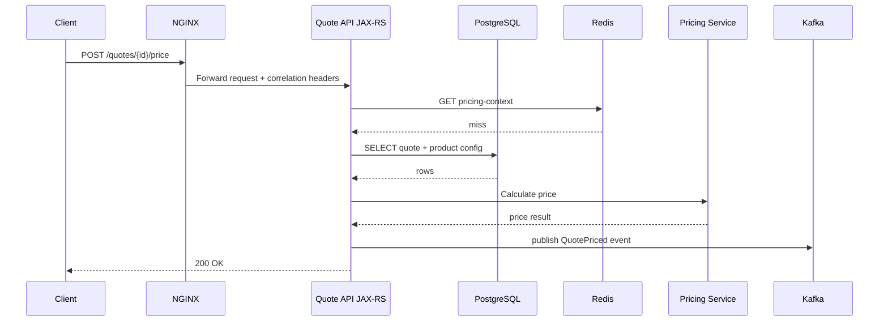
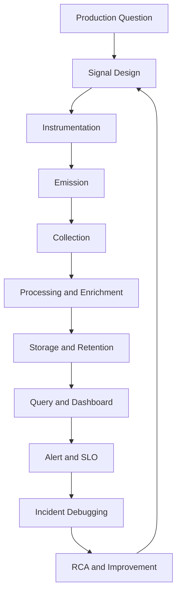
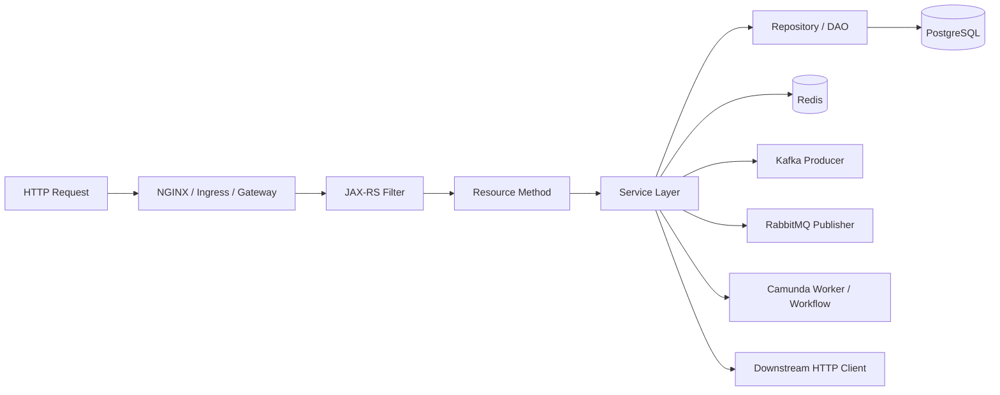

# Cheatsheet Observability Part 001 — Observability Foundation

## Tujuan Part Ini

Part ini membangun fondasi observability dari sudut pandang **senior backend engineer** yang bekerja pada sistem enterprise Java/JAX-RS. Fokusnya bukan memasang library, bukan memilih vendor dashboard, dan bukan sekadar menulis log. Fokusnya adalah membentuk cara berpikir: bagaimana sistem production dapat menjawab pertanyaan ketika sesuatu lambat, gagal, tidak konsisten, mahal, noisy, atau tidak bisa dijelaskan.

Setelah membaca part ini, Anda harus mampu membedakan:

- observability
- monitoring
- telemetry
- logging
- metrics
- distributed tracing
- alerting
- auditing
- profiling
- health checking
- production debugging

Dan Anda harus mulai melihat observability sebagai **kemampuan sistem untuk menyediakan bukti operasional**, bukan sebagai kumpulan tool.

---

## Ringkasan Mental Model

Observability adalah kemampuan untuk memahami keadaan internal sistem dari sinyal eksternal yang dihasilkan sistem tersebut.

Dalam sistem enterprise, definisi praktisnya lebih tajam:

> Observability adalah kemampuan menjawab pertanyaan production yang belum diketahui sebelumnya, tanpa harus deploy code baru, tanpa menebak-nebak, dan tanpa bergantung pada akses langsung ke database production.

Monitoring biasanya menjawab pertanyaan yang sudah diketahui:

- Apakah service down?
- Apakah latency melewati threshold?
- Apakah CPU tinggi?
- Apakah consumer lag naik?

Observability harus mampu membantu menjawab pertanyaan yang lebih investigatif:

- Request customer tertentu gagal di layer mana?
- Quote pricing lambat karena DB, Redis, downstream service, atau rule computation?
- Order masuk Kafka tetapi tidak diproses karena consumer lag, poison message, idempotency guard, atau workflow failure?
- Error naik setelah deployment, config change, traffic pattern, atau dependency degradation?
- Apakah impact hanya tenant tertentu, region tertentu, endpoint tertentu, atau semua customer?
- Apakah failure ini retryable, permanent, duplicate, stale, atau caused by invalid state transition?

---

## Konsep Inti

### Observability

Observability bukan satu jenis data. Observability adalah properti sistem.

Sistem observable memiliki karakteristik berikut:

- menghasilkan sinyal yang cukup untuk menjelaskan behavior production
- sinyalnya bisa dikorelasikan antar layer
- sinyalnya punya semantics yang jelas
- sinyalnya memiliki konteks teknis dan bisnis
- sinyalnya cukup aman dari sisi privacy dan security
- sinyalnya tidak terlalu mahal sehingga bisa dipertahankan
- sinyalnya bisa digunakan saat incident, bukan hanya saat development

Dalam Java/JAX-RS service, observability berarti request dari HTTP ingress sampai resource method, service layer, database, Redis, Kafka/RabbitMQ, Camunda, dan downstream service dapat ditelusuri dengan bukti yang koheren.

### Telemetry

Telemetry adalah data yang dikirim sistem untuk diamati.

Contoh telemetry:

- log event
- metric time series
- distributed trace span
- audit event
- health signal
- profile sample
- deployment marker
- Kubernetes event
- cloud service metric

Telemetry adalah bahan mentah. Observability adalah kemampuan menggunakan bahan tersebut untuk menjawab pertanyaan production.

### Signal

Signal adalah bentuk informasi operasional yang memiliki tujuan tertentu.

Signal yang baik memiliki:

- maksud yang jelas
- owner yang jelas
- schema atau naming yang konsisten
- timestamp yang benar
- correlation field
- severity atau status yang dapat dipahami
- lifecycle dan retention yang diketahui
- batas privacy/security
- biaya yang dipahami

Signal yang buruk biasanya terlihat seperti ini:

- log terlalu banyak tetapi tidak menjawab apa pun
- metric ada tetapi label salah
- trace ada tetapi putus di messaging boundary
- dashboard ramai tetapi tidak membantu triage
- alert sering bunyi tetapi tidak actionable
- audit log ada tetapi tidak menjawab who/what/when/why

---

## Observability vs Monitoring

Monitoring adalah proses mengawasi sistem menggunakan indikator yang sudah didefinisikan.

Monitoring cocok untuk:

- uptime
- latency threshold
- error rate
- CPU/memory usage
- disk usage
- queue lag
- consumer lag
- pod restart
- database connection exhaustion

Observability lebih luas. Observability membantu memahami **mengapa** indikator berubah.

Contoh:

Monitoring memberi tahu:

```text
GET /quotes/{id}/price p95 latency naik dari 300ms ke 4s.
```

Observability membantu menjawab:

```text
Latency naik hanya untuk tenant enterprise tertentu.
Trace menunjukkan 85% waktu habis di downstream pricing rule service.
Log menunjukkan retry karena HTTP 504.
Metric menunjukkan connection pool downstream client saturated setelah deployment versi baru.
Audit menunjukkan perubahan pricing configuration 20 menit sebelum incident.
```

Perbedaan utamanya:

| Aspek | Monitoring | Observability |
|---|---|---|
| Fokus | Status sistem | Penjelasan behavior sistem |
| Pertanyaan | Sudah diketahui | Sering belum diketahui |
| Output | Alert, dashboard | Evidence, diagnosis, reconstruction |
| Data | Metric dominan | Logs, metrics, traces, events, audit, profiles |
| Risiko | Blind spot jika metric tidak ada | Noise/cost jika signal tidak didesain |

---

## Observability vs Logging

Logging adalah salah satu signal observability.

Log menjawab pertanyaan berbasis event:

- apa yang terjadi?
- kapan terjadi?
- siapa aktornya?
- entity apa yang terdampak?
- request mana yang menjalankan aksi?
- error apa yang muncul?
- state transition apa yang dilakukan?

Tetapi logging saja tidak cukup.

Log sulit menjawab:

- apakah latency naik secara sistemik?
- apakah error rate naik 5x?
- apakah queue lag bertambah terus?
- apakah CPU throttling terjadi?
- apakah request tertentu lambat karena DB atau downstream service?
- apakah semua tenant terdampak atau hanya subset?

Logging yang buruk biasanya:

- plain text tanpa structured fields
- tidak punya correlation ID
- tidak punya trace ID
- terlalu banyak DEBUG di production
- menyimpan PII atau token
- menulis stack trace berulang-ulang
- memakai `ERROR` untuk expected validation failure
- tidak mencatat business key seperti quote ID/order ID saat perlu

Logging yang baik:

- structured
- queryable
- correlated
- context-rich
- privacy-aware
- cost-aware
- semantically accurate

---

## Observability vs Metrics

Metrics adalah signal numerik yang dikumpulkan sebagai time series.

Metrics bagus untuk:

- trend
- rate
- latency percentile
- saturation
- error ratio
- capacity planning
- SLO
- alerting

Contoh metrics untuk Java/JAX-RS service:

- `http_server_requests_total`
- `http_server_request_duration_seconds`
- `http_server_errors_total`
- `jvm_memory_used_bytes`
- `db_connection_pool_active`
- `kafka_consumer_lag`
- `redis_cache_hit_total`
- `workflow_failed_jobs_total`

Metrics buruk jika:

- label terlalu high-cardinality
- unit tidak jelas
- counter dipakai seperti gauge
- percentile dihitung salah
- endpoint raw path dipakai sebagai label
- user ID/request ID/order ID dimasukkan sebagai label tanpa kontrol
- metric tidak punya owner
- metric tidak digunakan oleh dashboard, alert, atau investigation

Metrics memberi peta besar. Logs dan traces memberi detail. Audit memberi bukti aksi. Profiling memberi bukti runtime behavior.

---

## Observability vs Distributed Tracing

Distributed tracing adalah signal yang merepresentasikan perjalanan satu operasi lintas komponen.

Trace menjawab:

- request melewati service mana saja?
- span mana yang paling lambat?
- dependency mana yang error?
- apakah HTTP call, DB query, Redis command, Kafka publish, atau RabbitMQ consume terhubung?
- apakah context propagation putus?

Trace sangat berguna di microservices karena failure jarang berhenti di satu process.

Contoh trace untuk quote pricing:



Dalam trace, setiap panah idealnya menjadi span atau span event yang bisa dikorelasikan dengan log dan metric.

Tracing buruk jika:

- root span ada tetapi dependency span hilang
- trace putus di Kafka/RabbitMQ
- span name tidak konsisten
- raw SQL penuh parameter sensitif disimpan
- sampling menyembunyikan error penting
- trace ID tidak muncul di log

---

## Observability vs Alerting

Alerting adalah mekanisme memanggil perhatian manusia atau sistem otomatis ketika kondisi tertentu perlu aksi.

Alert bukan observability. Alert menggunakan observability signal.

Alert yang baik:

- actionable
- symptom-based untuk paging
- punya severity jelas
- punya owner
- punya runbook
- punya dashboard link
- punya customer impact hint
- tidak terlalu noisy
- tidak terlalu telat

Alert yang buruk:

- hanya berbunyi karena CPU 80% tanpa impact
- tidak jelas service mana yang harus ditindak
- tidak punya runbook
- terlalu banyak duplicate
- false positive tinggi
- tidak pernah direview
- alert untuk semua cause kecil tetapi tidak ada alert untuk symptom besar

Alerting menjawab:

> Apakah manusia perlu bertindak sekarang?

Observability menjawab:

> Bukti apa yang tersedia untuk memahami apa yang terjadi?

---

## Observability vs Auditing

Audit logging berbeda dari operational logging.

Operational log membantu engineer debug sistem.

Audit log membantu menjawab:

- siapa melakukan apa?
- kapan?
- dari mana?
- menggunakan identitas apa?
- terhadap entity apa?
- sebelum dan sesudahnya bagaimana?
- alasan atau business context-nya apa?
- apakah aksi dilakukan langsung, delegated, atau impersonated?

Contoh audit event:

```json
{
  "event_type": "quote.approved",
  "actor_id": "user-123",
  "actor_type": "human_user",
  "tenant_id": "tenant-456",
  "quote_id": "quote-789",
  "action": "APPROVE_QUOTE",
  "before_status": "PENDING_APPROVAL",
  "after_status": "APPROVED",
  "reason": "manager approval",
  "occurred_at": "2026-07-11T10:15:30Z",
  "correlation_id": "corr-abc",
  "source_ip": "masked-or-controlled"
}
```

Audit signal harus lebih stabil dan defensible daripada debug log. Ia sering memiliki retention, integrity, access control, dan compliance requirement yang berbeda.

---

## Three Pillars: Logs, Metrics, Traces

Model klasik observability sering disebut tiga pilar:

1. logs
2. metrics
3. traces

Model ini berguna sebagai fondasi, tetapi tidak cukup untuk sistem enterprise.

### Logs

Kuat untuk detail event dan konteks lokal.

Gunakan logs untuk:

- error detail
- state transition
- retry attempt
- validation failure
- security event
- operational event
- business event

### Metrics

Kuat untuk trend, alerting, dan aggregate behavior.

Gunakan metrics untuk:

- request rate
- error rate
- latency distribution
- saturation
- queue lag
- cache hit ratio
- failed job count
- SLO burn

### Traces

Kuat untuk causal path dan latency breakdown.

Gunakan traces untuk:

- request flow
- cross-service latency
- dependency call diagnosis
- context propagation validation
- failure chain reconstruction

### Modern View: Signals and Questions

Senior engineer tidak boleh berhenti di “logs/metrics/traces”. Pertanyaan yang lebih penting:

- Pertanyaan production apa yang harus bisa dijawab?
- Signal mana yang menjawab pertanyaan itu?
- Apakah signal punya context yang benar?
- Apakah signal bisa dikorelasikan?
- Apakah signal aman dari PII/secrets?
- Apakah signal cukup murah untuk disimpan?
- Apakah signal diuji?
- Apakah signal digunakan dalam dashboard, alert, SLO, runbook, atau RCA?

---

## Observability sebagai Evidence System

Dalam incident, opini tidak cukup. Yang dibutuhkan adalah evidence.

Evidence dapat berupa:

- log event dengan correlation ID
- trace dengan span latency
- metric dengan time window jelas
- audit event untuk business action
- deployment marker
- config change record
- Kubernetes event
- cloud service health event
- database slow query evidence
- queue lag history
- DLQ message count
- customer impact query

Tanpa evidence, debugging berubah menjadi guessing.

### Evidence yang baik

Evidence yang baik memiliki:

- timestamp akurat
- timezone jelas
- source jelas
- entity context
- correlation context
- severity/status
- retention cukup
- akses yang sesuai
- semantics yang tidak ambigu

### Evidence yang buruk

Evidence yang buruk:

- timestamp lokal tanpa timezone
- message ambigu seperti `failed processing`
- tidak ada request ID
- tidak ada tenant/entity ID
- stack trace tanpa error code
- metric tanpa label penting
- trace tanpa dependency span
- audit tanpa actor atau target

---

## Observability Lifecycle

Observability memiliki lifecycle seperti fitur production lainnya.



### 1. Production Question

Mulai dari pertanyaan, bukan dari tool.

Contoh:

- Bagaimana mengetahui order stuck?
- Bagaimana mengetahui pricing latency berasal dari dependency tertentu?
- Bagaimana mengetahui Kafka event sudah diterbitkan tetapi tidak dikonsumsi?
- Bagaimana mengetahui request tenant tertentu gagal setelah deployment?

### 2. Signal Design

Tentukan signal:

- log event apa?
- metric apa?
- trace span apa?
- audit event apa?
- label/dimension apa?
- retention berapa?
- privacy rule apa?

### 3. Instrumentation

Masukkan instrumentation ke aplikasi/platform:

- JAX-RS filter
- ExceptionMapper
- HTTP client interceptor
- JDBC/DataSource instrumentation
- Kafka/RabbitMQ producer-consumer instrumentation
- Redis client instrumentation
- Camunda worker instrumentation
- Kubernetes/platform exporter

### 4. Emission

Service menghasilkan telemetry.

Kualitas emission bergantung pada:

- timestamp
- context propagation
- schema
- log level
- metric type
- span attributes
- error mapping

### 5. Collection

Telemetry dikumpulkan oleh collector/agent/platform.

Contoh:

- log forwarder
- metrics scraper
- OpenTelemetry Collector
- cloud monitoring agent
- Kubernetes metrics pipeline

### 6. Processing and Enrichment

Telemetry dapat diperkaya:

- service name
- environment
- deployment version
- cluster/namespace/pod
- tenant class
- region
- cloud account/subscription

### 7. Storage and Retention

Signal disimpan dengan retention berbeda:

- high-volume debug log: pendek
- operational logs: menengah
- audit logs: panjang sesuai policy
- metrics: downsampled setelah periode tertentu
- traces: sampled dan retention terbatas

### 8. Query and Dashboard

Signal harus bisa dicari dan divisualisasikan.

Dashboard harus menjawab pertanyaan, bukan sekadar menampilkan panel.

### 9. Alert and SLO

Alert dan SLO menggunakan signal yang sudah stabil.

Jangan membuat alert dari metric yang belum jelas semantics-nya.

### 10. Incident Debugging

Saat incident, telemetry digunakan untuk:

- timeline reconstruction
- impact analysis
- blast radius analysis
- root cause hypothesis
- mitigation validation

### 11. RCA and Improvement

RCA harus memperbaiki observability gap:

- missing log
- missing metric
- missing trace
- missing dashboard
- noisy alert
- wrong threshold
- missing runbook
- missing deployment marker

---

## Cara Kerja di Java/JAX-RS Backend

Dalam Java/JAX-RS service, observability biasanya masuk lewat beberapa titik:



### Entry Point

Di entry point, sistem harus menangkap:

- request start
- request end
- method
- route template
- status code
- latency
- request ID
- correlation ID
- trace ID
- tenant/context jika aman
- caller identity jika relevan

### Resource Method

Resource method sebaiknya tidak menjadi tempat logging berlebihan. Ia cocok mencatat business boundary penting jika tidak ditangani di service layer.

### Service Layer

Service layer biasanya tempat business action terjadi:

- quote created
- quote priced
- order submitted
- order validated
- approval requested
- cancellation requested

Di sini observability harus memperhatikan business key, state transition, audit event, dan error semantics.

### Persistence Layer

Database telemetry harus menjawab:

- query lambat?
- connection pool penuh?
- transaction terlalu lama?
- lock wait?
- deadlock?
- rows affected tidak sesuai?
- optimistic lock conflict?

### Messaging Layer

Kafka/RabbitMQ telemetry harus menjawab:

- event diterbitkan?
- event dikonsumsi?
- message age berapa?
- consumer lag naik?
- retry berapa kali?
- DLQ bertambah?
- duplicate event terjadi?

### Cache/Redis Layer

Redis telemetry harus menjawab:

- cache hit/miss?
- Redis latency naik?
- eviction terjadi?
- key design menyebabkan hot key?
- lock expired terlalu cepat?
- idempotency key conflict?

### Workflow Layer

Camunda/workflow telemetry harus menjawab:

- process instance stuck?
- failed job?
- incident count naik?
- timer backlog?
- human task aging?
- message correlation gagal?

---

## Pengaruh ke PostgreSQL/MyBatis/JPA/JDBC

Observability di data layer tidak hanya slow query log.

Hal yang harus bisa dijawab:

- request mana yang menyebabkan query lambat?
- query lambat terjadi di mapper/repository mana?
- pool wait time tinggi atau query execution tinggi?
- transaction terlalu lama karena logic service atau DB lock?
- error SQL dipetakan ke HTTP response dan log level yang benar?
- parameter sensitif tidak masuk log/trace?
- optimistic locking conflict dicatat sebagai expected concurrency conflict, bukan generic server error?

Signal yang relevan:

- query latency metric
- connection pool active/idle/pending
- transaction duration
- DB error count by SQL state class
- slow query logs
- trace span untuk JDBC query
- structured log untuk repository failure

---

## Pengaruh ke Kafka/RabbitMQ/Redis/Camunda/NGINX

### Kafka/RabbitMQ

Observability harus membawa konteks dari HTTP request ke event/message.

Yang perlu diperhatikan:

- correlation ID propagation
- causation ID
- message ID
- event ID
- idempotency key
- topic/queue/exchange/routing key
- retry/DLQ semantics
- event age

### Redis

Observability Redis harus menghindari key leak dan cardinality explosion.

Yang perlu diperhatikan:

- jangan menjadikan raw Redis key sebagai metric label
- mask key jika mengandung tenant/customer/order ID
- ukur hit/miss dan command latency
- observasi lock/idempotency separately dari cache

### Camunda

Workflow observability perlu business state awareness.

Yang perlu diperhatikan:

- process instance ID
- business key
- failed job
- incident
- worker latency
- task aging
- timer backlog
- message correlation failure

### NGINX/Ingress

Edge observability penting karena tidak semua failure sampai ke aplikasi.

Yang perlu diperhatikan:

- status code 499/502/503/504
- upstream response time
- request time
- forwarded headers
- client IP handling
- ingress timeout
- body size limit
- TLS/proxy behavior

---

## Pengaruh di Docker/Kubernetes/AWS/Azure/on-prem

Observability harus memahami runtime environment.

### Docker/Container

Hal yang perlu diamati:

- container memory limit
- CPU limit
- JVM container awareness
- stdout/stderr log collection
- file descriptor
- graceful shutdown

### Kubernetes

Hal yang perlu diamati:

- pod restart
- OOMKilled
- readiness/liveness failure
- CPU throttling
- deployment rollout
- HPA behavior
- node pressure
- ingress events

### AWS/Azure

Hal yang perlu diamati:

- load balancer metrics/logs
- API Gateway/APIM metrics
- managed database metrics
- managed broker metrics
- cloud service health
- cloud audit logs
- private networking/DNS/TLS failures

### On-prem/Hybrid

Hal yang perlu diamati:

- network latency between zones
- firewall/proxy behavior
- DNS resolution path
- certificate expiry
- hybrid connectivity
- inconsistent observability stack across environments

---

## Observability in CPQ/Order Management Context

Dalam CPQ/order management, tidak semua signal bernilai sama. Business lifecycle sangat penting.

Contoh pertanyaan production:

- Quote stuck di status apa?
- Pricing approval aging berapa lama?
- Order sudah dibuat tetapi fulfillment belum mulai?
- Fallout meningkat setelah product catalog change?
- Cancellation/amendment failure terjadi untuk product type tertentu?
- Reconciliation mismatch antara order system dan downstream billing?
- Approval service lambat atau human task aging?

Signal teknis saja tidak cukup. Anda membutuhkan business signal:

- quote created
- quote priced
- quote approved/rejected
- order created
- order validated
- order decomposed
- fulfillment started/failed
- fallout created
- amendment requested
- cancellation requested
- reconciliation completed/failed

Business signal harus diperlakukan hati-hati karena bisa mengandung data sensitif, tenant context, dan compliance relevance.

---

## Failure Mode Umum Observability

### 1. Missing Signal

Sistem gagal tetapi tidak ada log/metric/trace yang menjelaskan.

Contoh:

- consumer silently drops message
- workflow stuck tanpa metric aging
- HTTP client timeout tidak tercatat
- DB pool wait tidak dimonitor

### 2. Broken Correlation

Signal ada, tetapi tidak bisa disambungkan.

Contoh:

- request log punya correlation ID
- Kafka consumer log tidak punya correlation ID
- trace putus setelah publish event
- audit event tidak menyimpan business key

### 3. Wrong Semantics

Signal menyesatkan karena semantics salah.

Contoh:

- validation error dilog sebagai `ERROR`
- retryable timeout dianggap permanent failure
- gauge digunakan untuk counter
- endpoint raw path menyebabkan cardinality explosion

### 4. Signal Noise

Signal terlalu banyak dan sulit dipakai.

Contoh:

- INFO log per loop item
- stack trace berulang di retry loop
- alert berbunyi untuk gejala minor
- dashboard memiliki terlalu banyak panel tanpa prioritas

### 5. Privacy Leak

Signal menyimpan data yang tidak boleh disimpan.

Contoh:

- Authorization header masuk log
- request body berisi PII disimpan penuh
- SQL parameter sensitif masuk trace
- Redis key mengandung customer/order ID dan masuk metric label

### 6. Cost Explosion

Signal terlalu mahal.

Contoh:

- high-cardinality labels
- debug log aktif di production
- trace sampling terlalu tinggi untuk high-throughput endpoint
- retention terlalu panjang untuk low-value signal

---

## Bagaimana Mendeteksi Observability Gap

Gunakan pertanyaan berikut:

- Saat incident terakhir, data apa yang tidak tersedia?
- Apakah engineer harus SSH/manual query untuk memahami issue?
- Apakah root cause ditemukan dari telemetry atau dari tebakan?
- Apakah dashboard menunjukkan symptom tetapi tidak membantu drilldown?
- Apakah trace bisa dikorelasikan ke log?
- Apakah audit bisa membuktikan business action?
- Apakah alert actionable?
- Apakah SLO punya SLI yang benar?
- Apakah telemetry terlalu mahal?
- Apakah telemetry menyimpan data sensitif?

Jika jawaban sering “tidak tahu”, berarti observability masih lemah.

---

## Bagaimana Men-debug Dengan Observability

Urutan praktis saat production issue:

1. Tentukan symptom.
2. Tentukan time window.
3. Cek deployment/config change marker.
4. Cek service health dashboard.
5. Cek error rate dan latency by endpoint.
6. Cek dependency health.
7. Cek trace sample untuk request terdampak.
8. Cek logs dengan correlation ID/trace ID/business key.
9. Cek queue lag/DLQ/workflow incident jika async.
10. Cek database/Redis metrics jika latency terkait data layer.
11. Cek Kubernetes/cloud events jika ada restart/throttling/network issue.
12. Rekonstruksi timeline.
13. Tentukan blast radius.
14. Tentukan mitigation.
15. Catat missing telemetry untuk RCA.

---

## Trade-off Utama

| Trade-off | Penjelasan |
|---|---|
| Detail vs cost | Semakin detail signal, semakin mahal ingestion/storage/query. |
| Privacy vs debugging | Data detail membantu debug tetapi bisa melanggar security/privacy. |
| Cardinality vs drilldown | Label detail membantu filter tetapi bisa meledakkan time series. |
| Sampling vs evidence | Sampling menekan biaya tetapi bisa menyembunyikan kasus penting. |
| Alert sensitivity vs fatigue | Alert sensitif cepat mendeteksi issue tetapi bisa noisy. |
| Standardization vs flexibility | Standard membuat konsisten tetapi bisa terasa lambat untuk edge case. |
| Auto-instrumentation vs manual instrumentation | Auto cepat, manual lebih semantically rich. |

---

## Correctness Concern

Observability dapat mempengaruhi correctness secara tidak langsung.

Contoh:

- log/audit event ditulis sebelum transaksi commit sehingga mencatat aksi yang rollback
- metric success dihitung sebelum downstream publish berhasil
- duplicate event tidak terdeteksi karena idempotency metric hilang
- state transition audit tidak mencatat before/after dengan benar
- consumer ack dilakukan sebelum processing berhasil, tetapi metric success sudah naik

Prinsip:

> Signal harus mengikuti lifecycle kebenaran sistem. Jangan mencatat success sebelum success benar-benar terjadi.

---

## Performance Concern

Observability bisa memperlambat sistem jika tidak hati-hati.

Risiko:

- synchronous logging I/O
- expensive JSON serialization
- stack trace generation terlalu sering
- metric label creation high-cardinality
- body logging besar
- trace span terlalu detail di hot path
- blocking exporter
- excessive audit writes di transaction critical path

Mitigasi:

- async logging dengan backpressure policy jelas
- structured log yang ringkas
- sampling untuk high-volume signal
- histogram bucket yang masuk akal
- jangan log body besar
- hindari dynamic label uncontrolled
- gunakan collector/agent untuk export

---

## Security and Privacy Concern

Observability sering menjadi jalur kebocoran data.

Hal yang harus dilindungi:

- PII
- token
- password
- Authorization header
- cookie
- session ID
- API key
- secret/config value
- financial/commercial data
- raw request/response body
- SQL parameter sensitif
- Redis key yang berisi business identifier

Prinsip:

- default deny untuk body/header logging
- explicit allowlist untuk field aman
- mask/redact sebelum emission
- batasi akses log/audit/trace
- retention sesuai policy
- jangan jadikan observability backend sebagai database bayangan berisi sensitive data

---

## Cost Concern

Observability cost biasanya datang dari:

- log volume
- metric cardinality
- trace volume
- ingestion rate
- storage retention
- query frequency
- dashboard refresh rate
- audit retention
- high-cardinality labels
- duplicate telemetry

Pertanyaan review:

- Signal ini dipakai untuk apa?
- Siapa owner-nya?
- Berapa volumenya?
- Berapa retention-nya?
- Apakah ada sampling?
- Apakah label aman dari explosion?
- Apakah signal ini menggantikan signal lain atau duplikatif?

---

## Operational Concern

Observability harus usable saat pressure tinggi.

Operationally good observability memiliki:

- dashboard utama per service
- dashboard dependency
- alert dengan runbook
- trace-log correlation
- deployment markers
- known failure mode documentation
- SLO/SLI definition
- incident checklist
- ownership jelas
- escalation path jelas

Observability yang hanya ada di code tetapi tidak muncul di dashboard/runbook tetap lemah.

---

## PR Review Checklist

Gunakan checklist ini saat mereview PR yang menyentuh behavior production:

- Apakah ada log untuk failure penting?
- Apakah log level sesuai?
- Apakah structured fields cukup?
- Apakah correlation ID/trace ID ikut terbawa?
- Apakah business key dicatat saat relevan?
- Apakah metric diperlukan?
- Apakah metric type benar?
- Apakah labels aman dari cardinality explosion?
- Apakah trace span diperlukan?
- Apakah context propagation terjaga across HTTP/messaging/job?
- Apakah audit event diperlukan?
- Apakah success/failure signal mengikuti transaction boundary?
- Apakah PII/secrets tidak masuk telemetry?
- Apakah dashboard/alert/runbook perlu diperbarui?
- Apakah SLO terdampak?
- Apakah cost telemetry masuk akal?
- Apakah failure mode baru bisa dideteksi?
- Apakah rollback/mitigation bisa diverifikasi lewat telemetry?

---

## Internal Verification Checklist

Karena detail internal CSG/team tidak tersedia, semua poin berikut harus diverifikasi langsung di codebase, repository, dashboard, dan diskusi internal.

### Observability Stack

- Platform log yang digunakan.
- Metric backend yang digunakan.
- Trace backend yang digunakan.
- Apakah OpenTelemetry digunakan.
- Apakah ada OpenTelemetry Collector.
- Apakah logs, metrics, traces tersambung ke satu platform atau terpisah.
- Retention masing-masing signal.
- Access control ke telemetry.

### Java/JAX-RS Service

- Logging framework: SLF4J/Logback/Log4j2/JUL.
- JSON log encoder.
- MDC usage.
- JAX-RS filter untuk request/response logging.
- ExceptionMapper behavior.
- Trace auto-instrumentation/manual instrumentation.
- Metric library yang digunakan.
- Health endpoint.

### Correlation and Context

- Header correlation ID standar.
- Request ID generation.
- Trace ID propagation.
- Kafka/RabbitMQ header propagation.
- MDC cleanup.
- Business key convention.
- Tenant/user/actor context policy.

### Dashboards and Alerts

- Service health dashboard.
- Dependency dashboard.
- Business dashboard.
- Alert inventory.
- Alert severity mapping.
- Runbook link.
- SLO/SLI document.
- Incident notes terkait observability gaps.

### Security/Privacy

- PII classification.
- Sensitive header list.
- Body logging policy.
- Token redaction policy.
- Audit logging policy.
- Telemetry access control.
- Retention/compliance requirement.

---

## Latihan Praktis

Ambil satu endpoint Java/JAX-RS yang penting, misalnya:

```text
POST /quotes/{quoteId}/price
```

Jawab:

1. Apa request ID/correlation ID yang digunakan?
2. Apa log event saat request masuk?
3. Apa log event saat request selesai?
4. Apa metric request count/latency/error?
5. Apa trace span root-nya?
6. Apa dependency span ke DB/Redis/downstream?
7. Apakah business key `quoteId` aman dicatat?
8. Apakah audit event diperlukan?
9. Apakah ada dashboard untuk endpoint ini?
10. Apakah ada alert jika endpoint ini degrade?
11. Apakah error bisa dikorelasikan ke deployment tertentu?
12. Apakah data sensitif bisa bocor ke log/trace?

Jika banyak jawaban tidak diketahui, itu bukan kegagalan personal. Itu adalah daftar observability gap yang harus diverifikasi dan diperbaiki bertahap.

---

## Kesimpulan

Observability bukan tool, bukan dashboard, bukan logging framework, dan bukan sekadar OpenTelemetry. Observability adalah kemampuan sistem production untuk menyediakan evidence yang cukup agar engineer dapat memahami behavior, mendiagnosis failure, mengukur reliability, menjaga auditability, mengontrol cost, dan mengurangi risiko production.

Untuk senior backend engineer, observability harus diperlakukan sebagai bagian dari design correctness. Fitur yang tidak observable adalah fitur yang sulit dioperasikan. Workflow yang tidak observable adalah workflow yang akan menjadi silent incident. Integration yang tidak observable adalah integration yang akan sulit dibuktikan saat terjadi dispute.

Part berikutnya membahas mental model observability untuk distributed systems: request lifecycle, dependency call, async event, retry, duplicate, stale read, queue lag, service degradation, dan blast radius.
