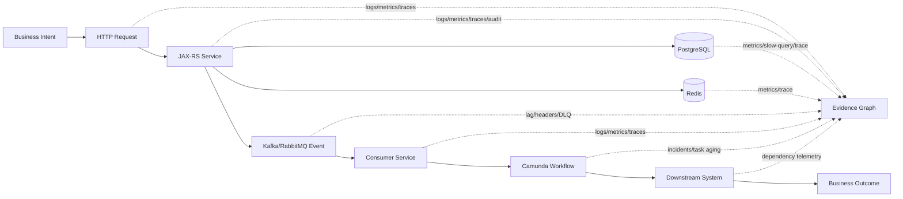
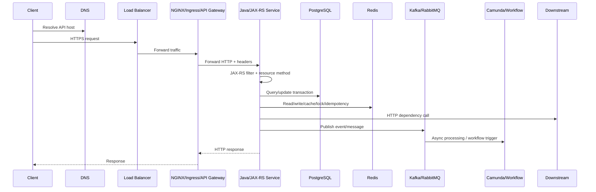
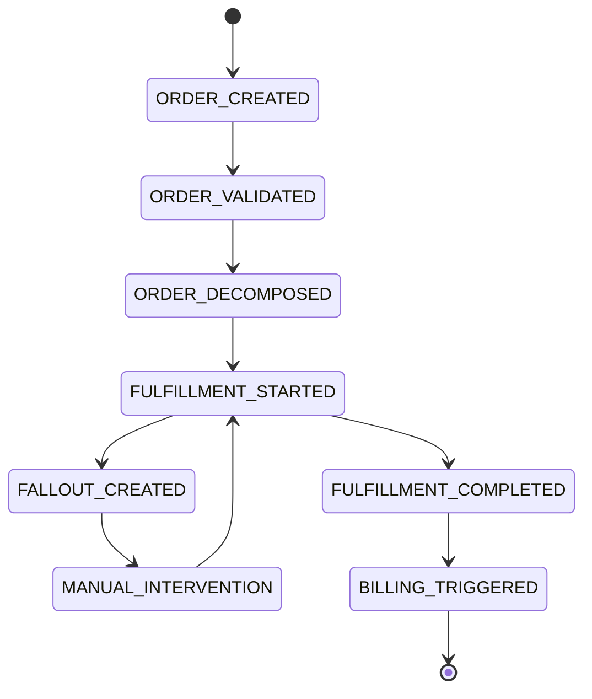
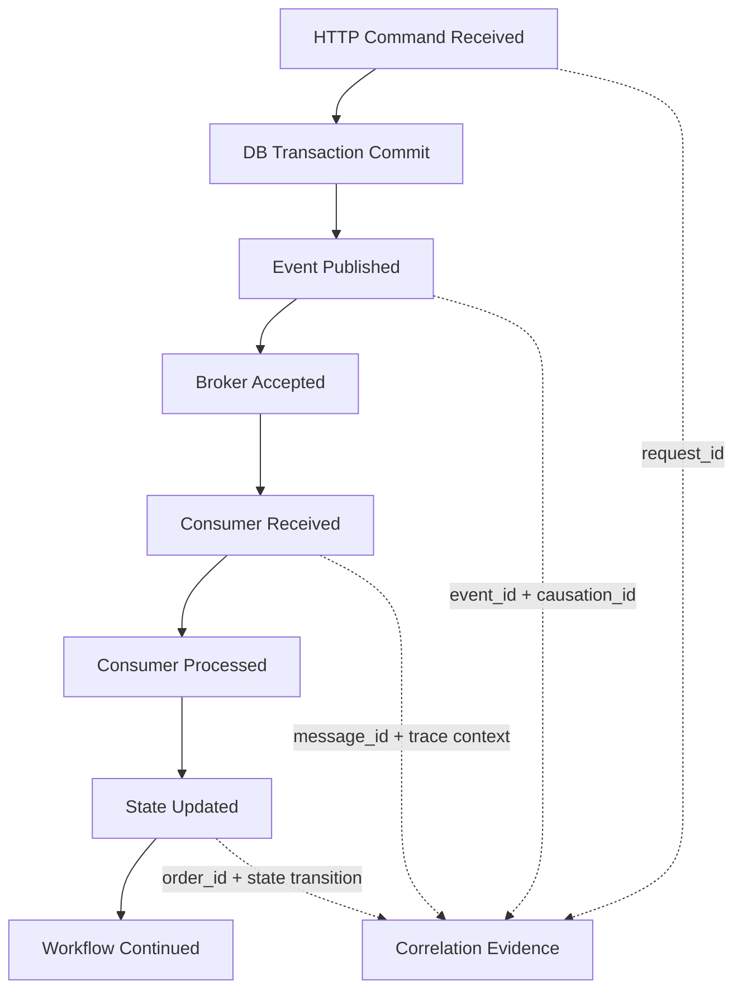

# Cheatsheet Observability Part 002 — Observability Mental Model for Distributed Systems

## Tujuan Part Ini

Part ini membangun mental model observability untuk sistem terdistribusi. Dalam sistem enterprise Java/JAX-RS, sebuah request jarang hanya berjalan di satu method. Request dapat melewati NGINX, ingress, JAX-RS filter, resource method, service layer, PostgreSQL, Redis, Kafka, RabbitMQ, Camunda workflow, downstream HTTP services, Kubernetes, dan cloud-managed services.

Masalah production juga jarang bersifat tunggal. Satu symptom dapat berasal dari banyak failure mode:

- timeout
- retry storm
- duplicate event
- stale read
- lock contention
- consumer lag
- queue backlog
- partial failure
- misconfiguration
- deployment regression
- degraded dependency
- broken context propagation
- workflow stuck
- human task aging

Observability harus membantu engineer merekonstruksi failure lintas boundary tersebut.

---

## Core Mental Model

Dalam distributed system, Anda tidak mengamati “satu program”. Anda mengamati **perjalanan sebuah intent**.

Intent dapat berupa:

- user ingin membuat quote
- system ingin menghitung price
- customer ingin submit order
- workflow ingin memulai fulfillment
- scheduler ingin menjalankan reconciliation
- consumer ingin memproses event
- operator ingin retry failed job

Intent ini berjalan melewati beberapa component. Setiap component hanya melihat sebagian kecil dari keseluruhan cerita.

Observability yang baik menyatukan potongan cerita itu menjadi evidence graph.



Key idea:

> Observability is failure reconstruction across boundaries.

---

## Request Lifecycle

Satu request Java/JAX-RS production biasanya memiliki lifecycle seperti ini:



Dalam lifecycle ini, signal harus menjawab beberapa pertanyaan:

- Apakah request sampai ke edge?
- Apakah request sampai ke application pod?
- Apakah JAX-RS route cocok?
- Apakah authentication/authorization berhasil?
- Apakah validation gagal?
- Apakah service logic lambat?
- Apakah database lambat atau pool exhausted?
- Apakah Redis miss, slow, atau unavailable?
- Apakah downstream call timeout?
- Apakah event berhasil dipublish?
- Apakah response dikirim sebelum async work selesai?
- Apakah error terjadi di client, edge, application, dependency, atau platform?

---

## Request Boundary vs Business Transaction

Jangan samakan HTTP request dengan business transaction.

### HTTP Request

HTTP request biasanya pendek:

```text
POST /orders
```

Ia mungkin hanya membuat order awal, menyimpan record, dan menerbitkan event.

### Business Transaction

Business transaction bisa panjang:

```text
Order Created → Validated → Decomposed → Fulfillment Started → Fulfillment Completed → Billing Triggered
```

Business transaction dapat berjalan melalui:

- multiple HTTP requests
- multiple services
- multiple events
- multiple queues
- multiple workflows
- human approval
- retries
- compensation
- reconciliation

Observability harus memiliki dua level identity:

| Identity | Tujuan |
|---|---|
| Request ID | Menelusuri satu HTTP request. |
| Trace ID | Menelusuri satu execution path lintas synchronous call. |
| Correlation ID | Menghubungkan operasi yang berasal dari intent yang sama. |
| Causation ID | Menjelaskan event/action mana yang menyebabkan event/action berikutnya. |
| Business key | Menghubungkan signal ke entity bisnis seperti quote ID/order ID. |
| Process instance ID | Menghubungkan signal ke workflow instance. |
| Message/event ID | Mengontrol uniqueness dan debugging async delivery. |
| Idempotency key | Mengontrol duplicate command/request. |

Senior engineer harus selalu bertanya:

> Identity apa yang diperlukan untuk merekonstruksi flow ini dari production evidence?

---

## Distributed Transaction vs Distributed Business Flow

Di sistem microservices modern, Anda biasanya menghindari distributed transaction teknis seperti two-phase commit antar service. Tetapi business flow tetap distributed.

Contoh order flow:



Observability harus menjawab:

- state sekarang apa?
- state sebelumnya apa?
- transition terakhir kapan?
- actor/system mana yang melakukan transition?
- transition valid atau invalid?
- berapa lama entity berada di state tersebut?
- retry sudah berapa kali?
- fallout dibuat karena apa?
- manual intervention aging berapa lama?

Ini bukan hanya log teknis. Ini observability lifecycle domain.

---

## Microservice Boundary

Boundary adalah tempat observability sering rusak.

Boundary umum:

- client → edge
- edge → application
- application → database
- application → cache
- application → message broker
- producer → consumer
- service → workflow engine
- service → downstream HTTP service
- application → cloud SDK
- pod → node/network/storage

Di setiap boundary, Anda harus memikirkan:

- context propagation
- timeout
- retry
- error mapping
- idempotency
- authentication/authorization
- telemetry emission
- privacy boundary
- ownership boundary

Boundary yang tidak observable akan menjadi blind spot saat incident.

---

## Dependency Call

Dependency call adalah semua panggilan dari service ke component lain:

- PostgreSQL query
- Redis command
- Kafka publish
- RabbitMQ publish
- HTTP client call
- cloud SDK call
- Camunda API call

Dependency observability harus menangkap:

- dependency name
- operation name
- latency
- status/result
- error class
- timeout
- retry count
- circuit breaker state
- pool wait time jika ada
- request/trace/correlation context

Contoh dependency failure:

```text
Symptom:
  POST /quotes/{id}/price p95 latency naik.

Evidence:
  - HTTP server latency naik hanya di endpoint pricing.
  - Trace menunjukkan span pricing-service call 3.8s.
  - HTTP client metric menunjukkan timeout rate naik.
  - Circuit breaker metric menunjukkan half-open flapping.
  - Logs menunjukkan retries exhausted.

Conclusion:
  Degradation berasal dari downstream pricing service, bukan JAX-RS resource method atau PostgreSQL.
```

---

## Async Event

Async flow memperumit observability karena response HTTP bisa selesai sebelum pekerjaan bisnis selesai.

Contoh:

```text
POST /orders → save order → publish OrderCreated → return 202 Accepted
```

Setelah response dikirim, order masih harus:

- divalidasi
- didekomposisi
- dikirim ke fulfillment
- diproses workflow
- direkonsiliasi

Observability async harus menjawab:

- event berhasil dipublish?
- event punya message ID/event ID?
- event membawa correlation ID?
- consumer menerima event?
- consumer memproses event berapa lama?
- consumer ack/nack bagaimana?
- retry terjadi berapa kali?
- event masuk DLQ?
- event duplicate?
- event terlalu tua saat diproses?

### Async Evidence Chain



Jika salah satu link tidak punya signal, debugging async flow akan sulit.

---

## Background Job

Background job tidak memiliki client request langsung, sehingga observability harus membuat identity sendiri.

Contoh job:

- reconciliation job
- retry failed order job
- cleanup expired quote job
- sync catalog job
- billing handoff job
- SLA breach detector
- stuck workflow detector

Signal job minimal:

- job name
- job instance ID
- schedule time
- actual start time
- duration
- status
- processed count
- success count
- failure count
- skipped count
- retry count
- lock owner
- batch/window
- correlation to affected business entities

Failure mode job:

- job tidak jalan
- job jalan dua kali
- job overlap
- job stuck
- job partial success
- job memproses data stale
- job gagal tetapi tidak alert
- job menghasilkan load spike

---

## Human Workflow

Enterprise system sering punya human workflow:

- approval
- manual fallout handling
- exception review
- cancellation approval
- amendment approval
- credit check review
- order correction

Human workflow observability berbeda dari machine telemetry.

Yang perlu diamati:

- task created
- task assigned
- task claimed
- task completed
- task overdue
- task reassigned
- approval rejected/approved
- manual intervention aging
- queue per team/role
- SLA breach

Pertanyaan production:

- Apakah order stuck karena system failure atau menunggu human approval?
- Approval queue mana yang menumpuk?
- Berapa lama task berada di role tertentu?
- Apakah reassignment menyebabkan delay?
- Apakah fallout meningkat karena upstream validation berubah?

---

## Partial Failure

Partial failure adalah kondisi sebagian sistem berhasil dan sebagian gagal.

Contoh:

- DB commit berhasil, event publish gagal.
- Event publish berhasil, consumer gagal.
- Consumer berhasil update DB, ack gagal.
- HTTP response timeout di client, tetapi server tetap memproses.
- Redis lock expired sebelum proses selesai.
- Workflow task completed tetapi downstream fulfillment gagal.

Partial failure adalah alasan utama observability harus causal-aware.

### Signal yang dibutuhkan

- transaction result
- event publish result
- consumer processing result
- ack/nack result
- idempotency check result
- retry attempt
- compensation action
- reconciliation result

Tanpa signal tersebut, engineer sulit menentukan apakah sistem harus retry, compensate, ignore, atau manually repair.

---

## Timeout

Timeout bukan sekadar error teknis. Timeout adalah ambiguity.

Jika caller timeout, belum tentu callee gagal. Callee mungkin tetap berhasil setelah caller menyerah.

Contoh:

```text
Quote API calls Pricing Service.
Quote API times out after 3s.
Pricing Service finishes after 3.5s and writes result.
Quote API retries.
Now duplicate pricing calculation occurs.
```

Observability timeout harus menjawab:

- timeout terjadi di caller atau callee?
- server tetap memproses setelah client disconnect?
- operation idempotent?
- retry terjadi?
- downstream menerima duplicate request?
- result akhirnya commit atau rollback?

Signal yang dibutuhkan:

- client timeout metric
- server request duration
- cancellation/disconnect log jika tersedia
- retry metric
- idempotency key log
- downstream processing status
- trace span status

---

## Retry

Retry adalah mekanisme resilience yang bisa menjadi sumber incident.

Retry membantu jika failure transient. Retry berbahaya jika:

- failure permanent
- retry tanpa backoff
- retry tidak punya jitter
- retry tidak idempotent
- retry memperparah overload
- retry log terlalu noisy
- retry menyembunyikan latency

Observability retry harus menangkap:

- retry count
- retry reason
- attempt number
- final outcome
- backoff duration
- retry exhausted
- idempotency key
- dependency target

Contoh log event yang berguna:

```json
{
  "event": "dependency.retry",
  "dependency": "pricing-service",
  "operation": "calculate-price",
  "attempt": 2,
  "max_attempts": 3,
  "reason": "timeout",
  "backoff_ms": 250,
  "correlation_id": "corr-123",
  "trace_id": "trace-abc"
}
```

---

## Duplicate Event

Duplicate event normal di banyak messaging system. Sistem harus siap dengan at-least-once delivery.

Duplicate dapat berasal dari:

- producer retry
- broker redelivery
- consumer crash before ack
- network failure
- manual replay
- DLQ replay
- scheduler overlap

Observability duplicate event harus menjawab:

- event ID apa?
- message ID apa?
- idempotency key apa?
- duplicate dideteksi di mana?
- duplicate di-ignore atau diproses ulang?
- apakah duplicate menyebabkan side effect?

Signal yang relevan:

- duplicate detected counter
- idempotency conflict log
- event processing result
- consumer retry count
- DLQ replay audit

---

## Stale Read

Stale read terjadi ketika sistem membaca data lama.

Penyebab:

- cache belum invalidated
- replica lag
- eventual consistency antar service
- read model belum update
- event processing delay
- transaction isolation
- async projection lag

Observability stale read harus menjawab:

- data source apa yang dibaca?
- cache hit/miss?
- cache age?
- event age?
- projection lag?
- last update timestamp?
- read model version?
- consistency expectation?

Contoh:

```text
Customer melihat order masih PENDING padahal fulfillment sudah complete.
Evidence menunjukkan read model consumer lag 12 menit dan projection belum memproses FulfillmentCompleted event.
```

---

## Queue Lag

Queue lag adalah gejala penting dalam async systems.

Kafka:

- consumer lag per group/topic/partition
- event age
- processing latency
- commit offset behavior

RabbitMQ:

- queue depth
- unacked messages
- redelivery count
- publish rate
- consume rate
- DLQ count

Queue lag dapat berarti:

- consumer down
- consumer slow
- poison message blocking
- partition skew
- downstream dependency slow
- insufficient concurrency
- broker issue
- deployment rollback leaving no consumer

Observability queue lag harus selalu dikaitkan dengan business impact:

- order processing delay
- fulfillment delay
- reconciliation delay
- approval notification delay
- billing handoff delay

---

## Service Degradation

Service degradation berbeda dari total outage.

Contoh degradation:

- latency naik tetapi success masih tinggi
- only one endpoint failing
- only one tenant affected
- only async processing delayed
- only approval flow impacted
- only one region/cluster degraded
- only large payload requests slow

Observability degradation harus mendukung slicing:

- endpoint
- method
- status code
- dependency
- version
- region
- cluster
- tenant class
- business operation
- message topic/queue
- workflow type

Namun slicing harus dikontrol agar tidak menyebabkan cardinality explosion.

---

## Blast Radius

Blast radius adalah ukuran area terdampak.

Pertanyaan blast radius:

- Semua service atau satu service?
- Semua endpoint atau satu endpoint?
- Semua tenant atau tenant tertentu?
- Semua region atau satu cluster?
- Semua product type atau satu catalog segment?
- Semua orders atau hanya amendment/cancellation?
- Semua workflow atau process definition tertentu?
- Semua consumers atau satu consumer group?

Signal yang mendukung blast radius:

- labels/dimensions yang aman
- service/version/environment metadata
- business operation field
- endpoint template
- dependency name
- topic/queue/workflow name
- tenant classification jika policy memperbolehkan
- deployment markers

---

## Signal Design Mental Model

Setiap flow harus dirancang dengan pertanyaan:

1. Apa intent-nya?
2. Apa boundary yang dilewati?
3. Apa identity yang harus dibawa?
4. Apa success condition?
5. Apa failure mode?
6. Apa signal untuk mendeteksi failure?
7. Apa signal untuk debug root cause?
8. Apa signal untuk membuktikan business outcome?
9. Apa data yang tidak boleh masuk telemetry?
10. Apa cost/cardinality risk?

### Signal Design Matrix

| Flow Element | Signal Utama | Tujuan |
|---|---|---|
| HTTP request | access log, request metric, root span | entry visibility |
| Resource method | structured app log, span attributes | route/business operation context |
| DB query | query span, pool metric, slow query log | persistence diagnosis |
| Redis command | command metric/span, cache metric | cache/lock/idempotency diagnosis |
| Kafka publish | producer metric/span, event log | async handoff evidence |
| Consumer processing | consumer metric/log/span | async processing evidence |
| RabbitMQ queue | queue depth/unacked/redelivery | backlog and redelivery diagnosis |
| Camunda workflow | process/job/task metrics | workflow state and aging |
| Downstream HTTP | client metric/span/log | dependency health |
| Deployment | marker/version label | change correlation |
| Audit action | audit event | compliance/business evidence |

---

## Java/JAX-RS Flow: Observability Points

Dalam Java/JAX-RS service, titik observability penting:

### 1. Container/Servlet/JAX-RS Entry

- request received
- correlation context extraction
- trace context extraction
- tenant/user context if available
- route matching
- request start timestamp

### 2. Authentication/Authorization

- auth success/failure
- authz denial
- actor identity
- delegation/impersonation context
- security event classification

### 3. Resource Method

- endpoint template
- business operation
- request validation result
- response status mapping

### 4. Service Layer

- business action
- state transition
- domain error
- audit event
- outgoing dependency call

### 5. Repository/DAO

- query latency
- transaction duration
- connection pool behavior
- lock/deadlock errors
- optimistic lock conflict

### 6. Integration Layer

- HTTP client call
- Kafka/RabbitMQ publish
- Redis command
- Camunda interaction
- cloud SDK call

### 7. Response Mapping

- success/failure status
- error code
- latency
- exception mapping
- client-visible error vs internal root cause

---

## PostgreSQL/MyBatis/JPA/JDBC Impact

Distributed observability at data layer must capture both application-side and database-side evidence.

Key concerns:

- query latency is not the same as pool wait time
- transaction duration is not the same as query duration
- DB lock wait may appear as application latency
- ORM lazy loading may create hidden query fan-out
- MyBatis mapper may hide SQL source unless naming is disciplined
- SQL parameters may leak sensitive data in logs/traces
- long transaction may block unrelated requests

Failure reconstruction example:

```text
Symptom:
  Order validation endpoint latency p99 increases.

Evidence:
  - HTTP request duration increased.
  - DB pool pending connections increased.
  - PostgreSQL active connections at max.
  - pg_locks shows lock wait on order table.
  - Trace spans show repository call waiting.
  - Recent deployment marker introduced new transaction boundary.

Diagnosis:
  Long-running transaction caused connection pool pressure and lock contention.
```

---

## Kafka/RabbitMQ Impact

Messaging observability must connect producer intent to consumer outcome.

Key questions:

- Was the message published after DB commit?
- Is publish part of outbox pattern or direct broker call?
- Does the message carry correlation ID?
- Does the consumer create a new trace linked to producer context?
- Does retry preserve causation identity?
- Does DLQ preserve original headers?
- Does replay create audit evidence?

Failure modes:

- publish before commit creates phantom event
- publish fails after commit creates missing event
- consumer processes duplicate event
- poison message blocks partition/queue
- DLQ grows silently
- manual replay causes side effects
- message header stripped by framework

---

## Redis Impact

Redis often appears as “just cache”, but in enterprise systems it may support correctness-sensitive patterns:

- distributed lock
- idempotency key
- rate limiter
- session/cache
- workflow coordination
- stream pending entries

Observability questions:

- Is Redis miss expected or abnormal?
- Is stale cache possible?
- Is lock acquisition failing?
- Did lock expire before operation finished?
- Is idempotency key preventing duplicate or hiding legitimate retry?
- Are keys being evicted?
- Is Redis latency causing request latency?

Important caution:

> Redis key names often contain business identifiers. Do not blindly log keys or use raw keys as metric labels.

---

## Camunda/Workflow Impact

Workflow observability must combine technical and business state.

Questions:

- Which process definition is impacted?
- How many active instances exist?
- Which activity/task is aging?
- Are failed jobs increasing?
- Are incidents concentrated in one worker?
- Is timer backlog growing?
- Are message correlations failing?
- Are process variables too large?
- Is human task queue overloaded?

Workflow failures are often silent from HTTP perspective because the HTTP request that started the workflow already returned successfully.

---

## NGINX/Ingress Impact

Edge layer can fail before application sees the request.

Questions:

- Did request reach NGINX/ingress?
- Did upstream application respond?
- Was status generated by edge or app?
- Was client disconnected?
- Was request body too large?
- Did timeout happen at ingress?
- Was TLS/certificate problem involved?
- Did header forwarding preserve correlation ID?

Status interpretation examples:

| Status | Common Meaning |
|---|---|
| 499 | Client closed connection before response. |
| 502 | Bad gateway; upstream response invalid/unavailable. |
| 503 | Service unavailable; upstream unavailable or no ready pods. |
| 504 | Gateway timeout; upstream too slow. |

These must be verified against actual gateway/ingress implementation.

---

## Docker/Kubernetes/AWS/Azure/on-prem Impact

Platform affects application behavior.

### Kubernetes

Potential failure modes:

- pod restart resets in-memory state
- OOMKilled kills process mid-request
- readiness failure removes pod from service
- liveness failure causes restart loop
- CPU throttling increases latency
- HPA scaling changes consumer count
- rolling deployment creates mixed versions
- node pressure causes eviction

### AWS/Azure

Potential failure modes:

- load balancer timeout mismatch
- DNS/private endpoint failure
- managed database degradation
- cloud broker throttling
- cloud service regional issue
- identity/token failure
- secret/config rotation issue
- cross-zone latency

### On-prem/Hybrid

Potential failure modes:

- firewall/proxy timeout
- certificate trust issue
- DNS split-horizon issue
- inconsistent network route
- private connectivity degradation
- observability stack fragmented across environments

---

## Failure Mode Catalog

| Failure Mode | Typical Symptom | Required Evidence |
|---|---|---|
| Timeout | latency spike, 504, retry | client span, server span, timeout metric, retry log |
| Retry storm | traffic amplification | retry count, dependency error, circuit breaker metric |
| Duplicate event | duplicate state change | event ID, idempotency log, duplicate counter |
| Stale read | UI/API shows old state | cache age, projection lag, event age, read model version |
| Queue lag | async delay | consumer lag, queue depth, event age, consume rate |
| Partial commit | DB updated but event missing | transaction log, outbox status, publish result |
| Consumer crash | message redelivery | consumer logs, ack/nack, redelivery count |
| Workflow stuck | order/quote not progressing | process instance state, task aging, incident count |
| DB lock | request latency, pool pressure | lock wait, slow query, transaction duration |
| Redis eviction | cache miss spike | eviction metric, memory usage, hit/miss ratio |
| Pod restart | transient errors | Kubernetes events, restart count, OOMKilled reason |
| Deployment regression | error after release | deployment marker, version label, error comparison |

---

## How to Detect Failure

Use layered detection:

### 1. User/Business Symptom

- complaints
- stuck orders
- delayed fulfillment
- SLA breach
- failed quote pricing
- fallout spike

### 2. Service Symptom

- error rate
- latency p95/p99
- throughput drop
- saturation
- request timeout

### 3. Dependency Symptom

- DB pool wait
- slow query
- Redis latency
- consumer lag
- queue depth
- downstream timeout
- workflow incident

### 4. Platform Symptom

- pod restart
- OOMKilled
- CPU throttling
- readiness failure
- load balancer 5xx
- cloud service degradation

### 5. Change Symptom

- deployment marker
- config change
- feature flag change
- migration
- infrastructure change
- secret/certificate rotation

---

## How to Debug Failure

Practical investigation sequence:

1. Define exact symptom.
2. Define time window.
3. Identify affected business operation.
4. Identify affected endpoint/event/workflow.
5. Check recent change markers.
6. Check service RED metrics.
7. Check dependency dashboard.
8. Check platform events.
9. Pick sample trace for slow/error request.
10. Search logs using trace ID/correlation ID/business key.
11. Check async path: event publish, lag, consumer, DLQ.
12. Check workflow state and task aging.
13. Check audit/business event if business action is disputed.
14. Determine blast radius.
15. Validate mitigation with metrics.
16. Record missing signal for follow-up.

---

## Trade-offs in Distributed Observability

| Trade-off | Practical Consequence |
|---|---|
| More context vs privacy | Business keys help debugging but may expose sensitive data. |
| More labels vs cardinality | Labels improve slicing but can explode metric series. |
| Full tracing vs cost | Full traces are expensive at high throughput. |
| Sampling vs rare failure visibility | Sampling may hide low-frequency but high-impact incidents. |
| Auto instrumentation vs semantics | Auto spans show calls, manual spans explain business intent. |
| Synchronous audit vs latency | Strong audit may add write latency. |
| Deep health check vs stability | Deep dependency checks can cause cascading unready pods. |
| Retry vs overload | Retry can recover transient failures or amplify outages. |

---

## Correctness Concern

Distributed observability must respect correctness boundaries.

Examples:

- Do not log `order.submitted.success` before transaction commit.
- Do not emit business success metric before async handoff succeeds if handoff is part of success semantics.
- Do not audit approval before approval state transition is committed.
- Do not count consumer success before message processing and ack strategy is clear.
- Do not treat HTTP 202 as full business completion.
- Do not assume timeout means callee failed.

Correctness principle:

> Signal must describe what is known to be true at that point in the lifecycle, not what the code hopes will happen later.

---

## Performance Concern

Distributed observability can create overhead at every boundary.

Risks:

- too many spans in hot loop
- high-volume logs in consumer loop
- metric label creation per message ID
- logging request/response bodies
- slow audit write inside transaction
- synchronous exporter blocking request thread
- excessive trace propagation object allocation
- debug log enabled in production

Mitigation:

- instrument boundaries, not every trivial method
- use semantic events for important lifecycle points
- sample high-volume traces carefully
- keep labels bounded
- use async logging/exporting
- separate audit needs from debug logs
- avoid high-cardinality identifiers as metric labels

---

## Security and Privacy Concern

Distributed systems move data through many surfaces. Observability can accidentally copy sensitive data into even more places.

High-risk telemetry fields:

- Authorization header
- cookie
- token
- password
- API key
- customer personal data
- commercial pricing data
- raw quote/order payload
- SQL parameters
- Redis keys
- message payload
- workflow variables
- cloud secret/config values

Security questions:

- Is this field allowed in logs?
- Is this field allowed in traces?
- Is this field allowed as metric label?
- Is this field needed for audit?
- Who can query this telemetry?
- How long is it retained?
- Is masking done before telemetry leaves the process?

---

## Cost Concern

Distributed systems multiply telemetry volume.

Common cost sources:

- per-request logs at high throughput
- per-message logs in consumers
- per-query spans for chatty DB access
- high-cardinality labels
- trace sampling too high
- duplicated telemetry between app and platform
- dashboard auto-refresh queries
- long retention for low-value debug data

Cost-aware principle:

> Do not emit telemetry because it is easy. Emit telemetry because it answers a production question.

---

## Operational Concern

Operationally useful observability must work during incident conditions:

- dependency is down
- telemetry backend is slow
- log volume spikes
- collector restarts
- pod crashes
- clock skew exists
- partial deployment is running
- some services are on old versions
- trace sampling hides normal requests

Operational checklist:

- Telemetry failure should not bring down application.
- Logs should still appear when app is under error conditions.
- Metrics should expose saturation before full failure.
- Trace context should survive common boundaries.
- Dashboards should show deployment/version changes.
- Alerts should route to owner with runbook.
- Incident responders should know where to start.

---

## PR Review Checklist

When reviewing distributed-system changes, ask:

### Flow and Boundary

- What boundaries does this change cross?
- Is the operation synchronous, asynchronous, or mixed?
- Is the business transaction longer than the HTTP request?
- Is there a new dependency call?
- Is there a new event/message/workflow transition?

### Context and Identity

- Is request ID/correlation ID propagated?
- Is trace context propagated?
- Is causation ID needed?
- Is business key available where needed?
- Is idempotency key needed?
- Are message/event IDs logged safely?

### Failure and Debugging

- What happens on timeout?
- What happens on retry?
- What happens on duplicate?
- What happens on partial failure?
- Is stale read possible?
- Is queue lag visible?
- Is workflow stuck state visible?

### Signal Quality

- Are logs structured?
- Are metric labels bounded?
- Are spans meaningful?
- Is audit required?
- Are dashboard/alert/runbook updates needed?
- Are PII/secrets excluded?
- Is telemetry cost acceptable?

---

## Internal Verification Checklist

Detail internal harus diverifikasi langsung di CSG/team. Jangan mengasumsikan stack atau convention internal.

### Request Lifecycle

- Diagram request flow dari client ke ingress/gateway ke Java/JAX-RS service.
- Header yang diteruskan oleh gateway/ingress.
- Timeout di load balancer, NGINX/ingress, JAX-RS runtime, HTTP client, DB, Redis, broker, workflow.
- Format access log edge.
- Format application request log.

### Correlation

- Standard request ID header.
- Standard correlation ID header.
- Trace propagation format.
- Kafka header propagation.
- RabbitMQ header propagation.
- Background job correlation strategy.
- Business key logging policy.
- Tenant/user/actor context policy.

### Async and Messaging

- Kafka topics involved in quote/order flow.
- Consumer group naming.
- DLQ strategy.
- Retry strategy.
- RabbitMQ exchange/queue/routing key topology.
- Message ID/event ID convention.
- Replay procedure.
- Poison message handling.

### Data and Cache

- PostgreSQL connection pool metrics.
- Slow query visibility.
- Lock/deadlock monitoring.
- MyBatis/JPA SQL visibility policy.
- Redis usage: cache, lock, idempotency, stream, rate limiter.
- Redis key logging/masking policy.

### Workflow

- Camunda/process engine version and deployment model.
- Process instance business key convention.
- Failed job/incident dashboard.
- Human task aging dashboard.
- Workflow retry policy.
- Message correlation failure visibility.

### Platform

- Kubernetes namespace/deployment labels.
- Pod restart/OOMKilled dashboard.
- CPU throttling dashboard.
- HPA behavior.
- Ingress metrics.
- Cloud load balancer metrics.
- AWS/Azure monitoring integration.
- GitOps/deployment marker availability.

### Incident and Operations

- Existing service dashboards.
- Existing dependency dashboards.
- Alert inventory.
- Runbook availability.
- SLO/SLI definition.
- Incident notes showing past observability gaps.
- RCA corrective actions related to telemetry.

---

## Practical Exercise

Pick one real or representative business flow:

```text
Quote submitted for approval
```

Map the flow:

1. HTTP endpoint receiving the command.
2. JAX-RS resource method.
3. Service layer business operation.
4. PostgreSQL writes.
5. Redis use, if any.
6. Kafka/RabbitMQ event publish, if any.
7. Camunda workflow interaction, if any.
8. Human approval task.
9. Downstream service interaction.
10. Final business outcome.

For every step, answer:

- What can fail?
- How is failure detected?
- What log exists?
- What metric exists?
- What trace/span exists?
- What audit event exists?
- What identity connects this step to the others?
- What data must not be logged?
- What dashboard would show degradation?
- What alert would fire?
- What runbook would explain action?

This exercise reveals the difference between “we have logs” and “we can reconstruct production failure”.

---

## Kesimpulan

Distributed-system observability is not about collecting more telemetry. It is about preserving the story of an operation across boundaries.

A senior backend engineer must reason in terms of:

- intent
- lifecycle
- boundary
- identity
- causality
- failure mode
- evidence
- blast radius
- business impact
- privacy
- cost
- operational action

Part berikutnya akan membahas telemetry signals secara lebih eksplisit: log signal, metric signal, trace signal, event signal, audit signal, profile signal, health signal, synthetic signal, business signal, platform signal, ownership, quality, retention, cost, dan review checklist.
